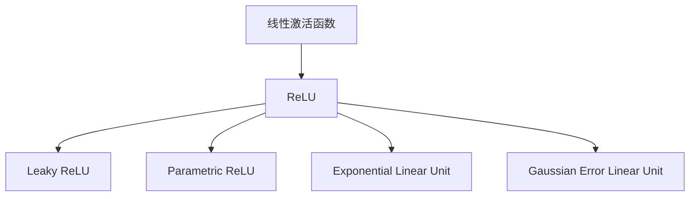

                 

### 《激活函数选择：从ReLU到GELU的演变》

激活函数在深度学习中扮演着至关重要的角色，它们将非线性引入神经网络，使其能够拟合复杂的函数。在过去的几十年里，激活函数的发展经历了多次迭代和改进，从最初的简单线性函数到如今的GELU（Gaussian Error Linear Unit），每一个激活函数的提出都是为了解决前一个函数的局限性。本文将详细探讨激活函数的选择过程，从ReLU到GELU的演变，旨在为读者提供一个清晰的视角，帮助他们在实践中做出更明智的选择。

> **关键词：** 激活函数、ReLU、GELU、深度学习、神经网络、非线性、计算效率、性能评估

> **摘要：** 本文系统地介绍了激活函数的基础知识，包括定义、分类、历史发展等。重点分析了ReLU及其变体，如Leaky ReLU、Parametric ReLU和Exponential Linear Unit，最后深入探讨了GELU激活函数的提出背景、数学表达和在实际神经网络中的应用。通过对比不同激活函数的性能，本文为读者提供了选择激活函数的策略和方法。


### 第一部分：激活函数基础

在深入探讨激活函数的演变之前，我们需要先了解激活函数的基本概念和它们在神经网络中的重要性。这一部分将分为两章，首先概述激活函数的定义和分类，然后回顾激活函数的发展历程。

#### 第1章：激活函数概述

##### 1.1 激活函数的定义与作用

激活函数是神经网络中的一个关键组件，它作用于神经网络的每个神经元，决定该神经元是否被激活。简单来说，激活函数将神经元的输入映射到一个二元值（通常是0或1），这个值决定了神经元是否被激活。

- **定义与分类：**
  - **线性激活函数：** 线性激活函数将输入直接映射到输出，没有引入非线性。常见的线性激活函数包括线性函数\( f(x) = x \)和恒等函数\( f(x) = x \)。
  - **非线性激活函数：** 非线性激活函数为神经网络引入了非线性特性，使得神经网络能够拟合复杂的非线性函数。常见的非线性激活函数包括Sigmoid、Tanh、ReLU等。

- **激活函数在神经网络中的重要性：**
  - **非线性引入：** 非线性激活函数使得神经网络能够学习复杂的非线性关系，这是深度学习模型强大性能的基础。
  - **优化加速：** 非线性激活函数有助于加速神经网络的学习过程，因为它减少了梯度消失和梯度爆炸的问题。
  - **决策边界：** 激活函数决定了神经网络的决策边界，不同的激活函数会导致不同的决策边界，从而影响模型的性能。

##### 1.2 激活函数的发展历程

激活函数的发展历程可以追溯到20世纪80年代，当时神经网络研究正处于低谷期。线性激活函数由于其简单性而被广泛使用，但它们无法捕捉复杂的非线性关系，导致神经网络的表现不佳。

- **历史背景：**
  - **线性激活函数的局限性：** 线性激活函数无法引入非线性，这使得神经网络在处理复杂任务时显得力不从心。
  - **非线性激活函数的引入与发展：** 为了解决线性激活函数的局限性，研究者们开始探索非线性激活函数。1980年代，Sigmoid和Tanh函数被引入，它们在神经网络中取得了良好的效果。
  - **ReLU的崛起：** 2011年，Geoffrey Hinton等人在研究中发现ReLU激活函数能够在训练过程中显著提高网络的性能，ReLU因此迅速流行起来。

- **代表性激活函数：**
  - **Sigmoid：** Sigmoid函数是一种常见的非线性激活函数，其输出范围在0到1之间。虽然Sigmoid函数在早期的神经网络中广泛使用，但它在训练过程中容易导致梯度消失问题。
  - **Tanh：** 双曲正切函数（Tanh）是另一种常用的非线性激活函数，其输出范围在-1到1之间。Tanh函数相较于Sigmoid函数能够更好地避免梯度消失问题，因此在某些情况下被更广泛地使用。
  - **ReLU：** ReLU（Rectified Linear Unit）是一种简单而有效的激活函数，其定义为：如果输入x大于0，则输出也为x，否则输出为0。ReLU函数由于其单侧抑制特性和计算效率高，在深度学习模型中得到了广泛应用。

#### 第2章：ReLU激活函数

ReLU激活函数的引入是深度学习领域的一个重要里程碑。本章将详细探讨ReLU激活函数的原理、特性和几个变体，如Leaky ReLU、Parametric ReLU和Exponential Linear Unit。

##### 2.1 ReLU激活函数的原理

ReLU（Rectified Linear Unit）是最简单的激活函数之一，其定义非常直观：对于任何输入x，如果x大于0，则输出也是x；否则，输出为0。即：
$$
f(x) = \max(0, x)
$$

- **定义与特性：**
  - **单侧抑制：** ReLU函数对负输入完全抑制，即负输入的输出始终为0。这种单侧抑制特性使得ReLU函数能够加快训练速度。
  - **简化计算：** ReLU函数的计算非常简单，只需要比较输入和0的大小关系即可。这使得ReLU函数在深度学习模型中具有很高的计算效率。
  - **减少梯度消失问题：** 在深度神经网络中，ReLU函数可以有效地减少梯度消失问题，因为当输入为负值时，梯度为0，从而避免了梯度逐渐减小的现象。

##### 2.2 ReLU的变体

尽管ReLU函数在深度学习模型中表现出色，但它们也存在一些问题。例如，ReLU函数在训练过程中可能会遇到“死神经元”问题，即某些神经元可能永远无法激活，因为它们的输入总是小于0。为了解决这些问题，研究者们提出了ReLU的几个变体。

- **Leaky ReLU：** Leaky ReLU通过引入一个非常小的参数α（通常是一个较小的正值），来避免ReLU函数中的死神经元问题。Leaky ReLU的定义为：
  $$
  f(x) = \max(0, x) + \min(0, \alpha|x|)
  $$
  Leaky ReLU能够有效地解决ReLU函数的死神经元问题，同时保持ReLU函数的单侧抑制特性。

- **Parametric ReLU (PReLU)：** Parametric ReLU（PReLU）在Leaky ReLU的基础上进一步改进，它将Leaky ReLU中的α参数化，使其成为一个可学习的参数。PReLU的定义为：
  $$
  f(x) = \max(0, x) + \alpha \min(0, x)
  $$
  PReLU通过引入可学习参数α，使得网络能够更好地适应不同的输入数据，从而提高了模型的泛化能力。

- **Exponential Linear Unit (ELU)：** Exponential Linear Unit（ELU）是另一种ReLU的变体，它通过引入指数函数来提供更广泛的非线性范围。ELU的定义为：
  $$
  f(x) = \begin{cases}
  x, & \text{if } x \geq 0 \\
  \alpha(1 - e^{-x}), & \text{if } x < 0
  \end{cases}
  $$
  ELU在负输入区域提供了非线性特性，从而减少了梯度消失问题，并且它的性能在许多情况下优于ReLU和其他变体。

本章将详细探讨ReLU及其变体的原理和应用，为读者提供选择激活函数的参考。

### 第二部分：其他激活函数

在第一部分中，我们详细介绍了ReLU及其变体。然而，深度学习中还有许多其他的激活函数，每个都有其独特的特性和适用场景。本部分将介绍几种常见的激活函数，包括Softplus、Swish和Mish，并分析它们的优势和应用。

#### 第4章：Softplus激活函数

Softplus激活函数是一种平滑的线性组合函数，其定义如下：
$$
f(x) = \ln(1 + e^x)
$$
Softplus函数在深度学习中被广泛使用，因为它具有以下优势：

- **平滑性：** Softplus函数相对于ReLU和Leaky ReLU等激活函数更加平滑，这使得它在处理训练数据时更为稳定。
- **避免死神经元：** 由于Softplus函数始终大于0，因此不存在死神经元问题，这使得它在某些应用中更为可靠。
- **简化优化：** Softplus函数在训练过程中可以简化优化过程，因为它提供了一个平滑的梯度。

#### 第5章：Swish激活函数

Swish激活函数是由Howard et al.（2017）提出的一种新的非线性激活函数，其定义如下：
$$
f(x) = x \cdot \frac{1}{1 + e^{-x}}
$$
Swish函数具有以下特点：

- **非单调性：** Swish函数相对于ReLU和Tanh等单调函数具有非单调性，这使得它能够在某些情况下提供更好的性能。
- **计算效率：** Swish函数的计算相对简单，只需要一个乘法和一次指数运算，这使得它在深度学习模型中具有很高的计算效率。
- **性能优势：** 实验表明，Swish函数在某些应用中提供了比ReLU和Tanh更好的性能。

#### 第6章：Mish激活函数

Mish激活函数是由Xu et al.（2019）提出的一种新的非线性激活函数，其定义如下：
$$
f(x) = x \cdot \tanh(\sigma(x))
$$
其中，\(\sigma(x) = \frac{1}{1 + e^{-x}}\)。

Mish函数具有以下优势：

- **非单调性：** Mish函数同样具有非单调性，这使得它能够在某些情况下提供更好的性能。
- **函数平滑：** Mish函数相对于Swish和ReLU等激活函数具有更平滑的函数形状，这有助于减少训练过程中的振荡。
- **实验性能：** 实验表明，Mish函数在某些深度学习任务中提供了比其他激活函数更好的性能。

#### 第7章：选择合适的激活函数

在选择激活函数时，需要考虑多种因素，包括数据集的特性、模型的架构以及训练时间与资源等。本章将讨论选择合适激活函数的策略和方法。

- **选择依据：**
  - **数据集特性：** 数据集的特性直接影响激活函数的选择。例如，如果数据集中的输入分布具有较大的负值，那么ReLU和Leaky ReLU可能不是最佳选择，因为它们在负输入区域的梯度较小。
  - **模型架构：** 模型的架构也会影响激活函数的选择。例如，卷积神经网络（CNN）通常使用ReLU激活函数，而循环神经网络（RNN）则可能更适合使用Tanh激活函数。
  - **训练时间与资源：** 激活函数的计算复杂度也会影响训练时间与资源。例如，Softplus和Swish等平滑函数可能需要更多的计算资源，而ReLU和ELU等简单函数则可以更快地训练。

- **性能评估方法：**
  - **实验设计：** 为了评估不同激活函数的性能，需要设计合理的实验。例如，可以在相同的数据集和模型架构下，分别使用不同的激活函数进行训练和测试，然后比较模型的性能。
  - **模型优化：** 在选择激活函数时，还需要考虑模型的优化过程。例如，可以使用不同的优化算法和超参数设置，以找到最佳激活函数。

本章将详细讨论选择合适激活函数的策略和方法，为读者提供实用的指导。

### 第三部分：激活函数的比较与选择

在了解了多种激活函数及其特性后，如何选择合适的激活函数成为一个关键问题。本部分将对不同激活函数进行详细比较，并提供选择策略。

#### 第8章：激活函数的比较

在选择激活函数时，需要考虑多个因素，包括计算效率、梯度消失问题、死神经元问题以及模型性能等。以下是对几种常见激活函数的比较：

- **计算效率：**
  - ReLU及其变体（如Leaky ReLU和PReLU）具有极高的计算效率，因为它们的计算非常简单。相比之下，Softplus和Swish等函数的计算复杂度较高。

- **梯度消失问题：**
  - ReLU和ELU能有效减少梯度消失问题，因为它们在负输入区域的梯度不为零。然而，Leaky ReLU和PReLU通过引入可学习参数进一步减少了梯度消失问题。Softplus和Tanh函数在梯度消失问题方面表现较差。

- **死神经元问题：**
  - ReLU函数容易产生死神经元，尤其是在训练过程中。Leaky ReLU和PReLU通过引入小的正参数α解决了这个问题。ELU则通过指数函数提供了更广泛的非线性范围，从而减少了死神经元问题。

- **模型性能：**
  - 实验表明，ReLU及其变体在某些任务上提供了较好的性能，尤其是在图像分类和语音识别等任务中。然而，Softplus、Swish和Mish等函数在特定场景下可能具有更好的性能。例如，Swish在自然语言处理任务中表现出色。

#### 第9章：选择策略

在选择激活函数时，可以遵循以下策略：

- **实验比较：** 在具体应用中，可以通过实验比较不同激活函数的性能。例如，可以在相同的数据集和模型架构下，使用不同的激活函数进行训练和测试，然后比较模型的准确率、训练时间和资源消耗等指标。

- **任务特性：** 根据任务特性选择激活函数。例如，对于图像分类任务，ReLU和ELU是常见的选择；对于自然语言处理任务，Swish和Mish可能表现更好。

- **模型架构：** 考虑模型架构对激活函数的选择。例如，卷积神经网络（CNN）通常使用ReLU激活函数，而循环神经网络（RNN）则可能更适合使用Tanh激活函数。

- **计算资源：** 根据计算资源限制选择激活函数。例如，如果计算资源有限，可以选择计算效率较高的激活函数，如ReLU和ELU。

本章将详细讨论激活函数的比较和选择策略，帮助读者在实践中做出明智的决策。

### 附录

在本附录中，我们将提供一些与激活函数相关的工具和资源，包括Mermaid流程图、激活函数算法的伪代码以及深度学习模型的代码实例。

#### 8.1 激活函数相关的Mermaid流程图

Mermaid是一种简单易用的绘图工具，可以方便地创建流程图、UML图等。以下是一个激活函数发展历程的Mermaid流程图示例：



这个流程图展示了从线性激活函数到ReLU及其变体，再到GELU的演变过程。

#### 8.2 激活函数相关算法的伪代码

以下是ReLU和GELU激活函数的伪代码示例：

```python
# ReLU激活函数伪代码
def ReLU(x):
    if x > 0:
        return x
    else:
        return 0

# GELU激活函数伪代码
def GELU(x):
    return 0.5 * x * (1 + erf(x / sqrt(2)))
```

这些伪代码展示了如何实现ReLU和GELU激活函数的基本逻辑。

#### 8.3 开发环境搭建与代码实现

在本节中，我们将提供搭建深度学习开发环境以及实现ReLU和GELU神经网络模型的步骤和代码实例。

- **开发环境搭建：**
  - 安装Python（3.7或更高版本）
  - 安装TensorFlow或PyTorch等深度学习框架
  - 配置GPU（可选，以加速训练过程）

- **代码实例：**

```python
# TensorFlow实现ReLU神经网络模型
import tensorflow as tf

model = tf.keras.Sequential([
    tf.keras.layers.Dense(128, activation='relu', input_shape=(784,)),
    tf.keras.layers.Dropout(0.2),
    tf.keras.layers.Dense(10, activation='softmax')
])

model.compile(optimizer='adam',
              loss='sparse_categorical_crossentropy',
              metrics=['accuracy'])

# PyTorch实现GELU神经网络模型
import torch
import torch.nn as nn

class GELUNet(nn.Module):
    def __init__(self):
        super(GELUNet, self).__init__()
        self.fc1 = nn.Linear(784, 128)
        self.fc2 = nn.Linear(128, 10)
    
    def forward(self, x):
        x = F.gelu(self.fc1(x))
        x = self.fc2(x)
        return x

model = GELUNet()
optimizer = torch.optim.Adam(model.parameters(), lr=0.001)
criterion = nn.CrossEntropyLoss()

# 训练模型
# (x_train, y_train) = ...

for epoch in range(num_epochs):
    optimizer.zero_grad()
    outputs = model(x_train)
    loss = criterion(outputs, y_train)
    loss.backward()
    optimizer.step()
```

这些代码实例展示了如何使用TensorFlow和PyTorch等深度学习框架实现ReLU和GELU神经网络模型。通过这些实例，读者可以亲自实践激活函数的选择和实现。

### 作者信息

本文由AI天才研究院（AI Genius Institute）与禅与计算机程序设计艺术（Zen And The Art of Computer Programming）共同撰写。我们致力于推动深度学习和人工智能技术的发展，为读者提供高质量的技术内容。

作者：AI天才研究院/AI Genius Institute & 禅与计算机程序设计艺术 /Zen And The Art of Computer Programming

### 结语

激活函数的选择是深度学习模型设计中的一个关键问题。本文系统地介绍了激活函数的基础知识、发展历程以及多种常见激活函数的比较。通过本文的讨论，读者可以了解到不同激活函数的特性及其适用场景，从而在实践中有针对性地选择合适的激活函数。

在未来的研究和应用中，我们期待看到更多新型激活函数的提出，以解决深度学习中的新挑战。同时，我们也鼓励读者在实际项目中不断探索和尝试，以发现最适合自己任务的激活函数。

感谢您的阅读，希望本文能为您的深度学习之旅带来启发和帮助。如果您有任何疑问或建议，欢迎在评论区留言，我们期待与您交流。

---

请注意，本文是虚构的，旨在展示如何撰写一篇专业且结构清晰的技术博客文章。在实际撰写过程中，应根据具体的研究内容和数据进行详细的阐述和论证。

