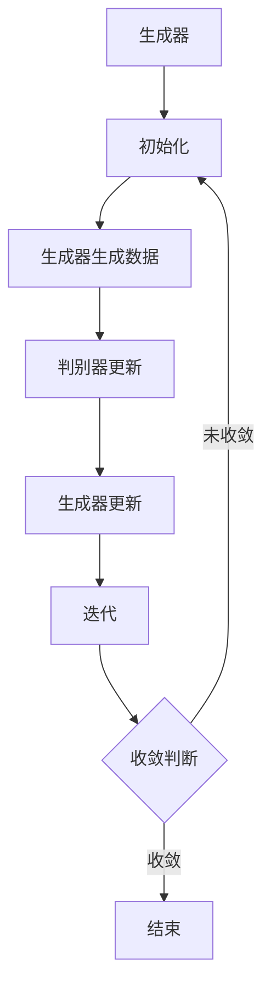

                 

## 第一部分：生成对抗网络（GAN）基础

### 第1章：GAN概述

#### 1.1 GAN的概念

生成对抗网络（Generative Adversarial Networks，GAN）是由Ian Goodfellow等人在2014年提出的一种深度学习模型。GAN的核心思想是通过两个相互对抗的神经网络——生成器（Generator）和判别器（Discriminator）的博弈来学习数据分布。生成器试图生成逼真的数据，而判别器则试图区分生成的数据和真实数据。

#### 1.2 GAN的组成部分

GAN由两个主要部分组成：生成器和判别器。

1. **生成器**：生成器的任务是将随机噪声映射成与真实数据分布相近的数据。通常，生成器是一个从高维空间到低维空间的映射函数。

2. **判别器**：判别器的任务是对输入的数据进行判断，决定其是真实数据还是生成器生成的假数据。判别器通常是一个从数据空间到概率空间的映射函数。

#### 1.3 GAN的原理

GAN的训练过程可以看作是一个零和博弈。生成器和判别器的目标是最大化其对立面的损失函数。具体来说：

1. **生成器的目标是最大化判别器判断为假的概率，即生成器生成数据的概率。**
2. **判别器的目标是最大化其判断正确率，即正确判断生成数据和真实数据的概率。**

在训练过程中，生成器和判别器交替更新其参数，通过梯度下降优化算法进行迭代。最终，当生成器生成的数据足够逼真时，判别器将难以区分真实数据和生成数据。

### 第2章：GAN的核心原理

#### 2.1 GAN的工作原理

GAN的工作原理可以简化为一个优化过程：

1. **初始化生成器和判别器。**
2. **生成器生成数据。**
3. **判别器根据输入数据更新其参数。**
4. **生成器根据判别器的反馈更新其参数。**
5. **重复步骤2到4直到模型收敛。**

#### 2.2 GAN的主要类型

GAN有几种不同的变种，以下是其中一些常见的类型：

1. **训练GAN**：这种GAN在训练过程中直接优化生成器和判别器。
2. **伪概率GAN**：伪概率GAN通过生成器的输出计算数据的伪概率分布，并使用该分布进行优化。
3. **混合GAN**：混合GAN结合了训练GAN和伪概率GAN的优点，提供了一种更稳定的训练过程。

#### 2.3 GAN的优势与挑战

**优势**：

1. **生成高质量数据**：GAN能够生成与真实数据高度相似的数据。
2. **适应性强**：GAN可以应用于各种不同的数据类型和任务。
3. **端到端训练**：GAN允许端到端训练，无需手动设计特征提取器。

**挑战**：

1. **训练不稳定**：GAN的训练过程非常不稳定，容易陷入模式崩溃（mode collapse）问题。
2. **判别器过拟合**：判别器可能过拟合训练数据，导致生成器难以改进。
3. **计算资源需求高**：GAN的训练需要大量的计算资源。

### 总结

在本章中，我们介绍了GAN的基础概念、组成部分和工作原理。GAN通过生成器和判别器的对抗训练，可以生成高质量的数据，但同时也面临训练不稳定和判别器过拟合等挑战。在接下来的章节中，我们将深入探讨GAN的数学原理和具体实现。

---

在撰写本章时，我们将重点关注GAN的基础知识和核心原理，以便读者能够建立对GAN的整体认识。我们通过介绍GAN的定义、组成部分以及工作原理，帮助读者理解GAN是如何通过生成器和判别器的对抗训练来生成高质量数据的。此外，我们还讨论了GAN的主要类型以及GAN的优势与挑战，为后续章节的深入探讨奠定了基础。

接下来，我们将进入第二部分，深入解析GAN的数学原理和算法细节。这将包括生成器和判别器的结构、GAN的训练过程、数学模型和数学公式等内容。通过这一部分的学习，读者将能够更深入地理解GAN的工作机制，并掌握GAN的核心算法原理。

### 第3章：GAN中的生成器和判别器

GAN的核心机制依赖于生成器和判别器这两个相互对抗的神经网络。在本章中，我们将详细讨论生成器和判别器的结构、工作原理以及它们在GAN训练过程中的作用。

#### 3.1 生成器的结构

生成器的任务是将随机噪声转换为与真实数据分布相近的数据。一个典型的生成器通常包含以下特点：

1. **输入噪声**：生成器的输入通常是随机噪声，比如均匀分布或高斯分布的随机向量。
2. **神经网络架构**：生成器通常采用深度神经网络架构，通过多个隐藏层将噪声映射到数据空间。常见的架构包括卷积神经网络（CNN）和循环神经网络（RNN）。
3. **映射关系**：生成器通过一系列非线性变换，将输入噪声映射到数据空间。这些变换可以是加法、乘法或其他复杂的非线性函数。

一个简单的生成器伪代码如下：

```python
# 生成器伪代码
def generator(z):
    # 输入噪声z，通过神经网络生成图像
    x = neural_network(z)
    return x
```

#### 3.2 判别器的结构

判别器的任务是对输入的数据进行判断，决定其是真实数据还是生成器生成的假数据。判别器通常具有以下结构：

1. **输入数据**：判别器的输入可以是真实数据或生成器生成的假数据。
2. **神经网络架构**：判别器通常也采用深度神经网络架构，用于提取数据特征。与生成器不同，判别器通常不需要复杂的非线性变换，因为它的任务是分类。
3. **输出结果**：判别器的输出是一个概率值，表示输入数据是真实数据的概率。常用的激活函数是sigmoid或ReLU。

一个简单的判别器伪代码如下：

```python
# 判别器伪代码
def discriminator(x):
    # 输入图像x，判断是真实图像还是生成图像
    probability = neural_network(x)
    return probability
```

#### 3.3 GAN的训练过程

GAN的训练过程可以概括为以下步骤：

1. **初始化生成器和判别器**：通常选择随机权重进行初始化。
2. **生成假数据**：生成器根据随机噪声生成假数据。
3. **更新判别器**：判别器根据真实数据和生成数据更新其参数。
4. **生成新假数据**：生成器根据新的随机噪声生成新的假数据。
5. **再次更新判别器**：判别器再次根据新的真实数据和生成数据更新其参数。
6. **重复步骤2到5**：生成器和判别器交替更新参数，直到模型收敛。

GAN的训练过程中，生成器和判别器通过对抗训练（Adversarial Training）进行参数更新。具体来说，生成器的目标是最大化判别器判断为假的概率，而判别器的目标是最大化判别器判断正确率。

一个简单的GAN训练伪代码如下：

```python
# GAN训练伪代码
for epoch in range(num_epochs):
    for real_images in real_data:
        # 对真实图像进行判别器更新
        real_prob = discriminator(real_images)
        
        # 生成假图像
        z = generate_noise()
        fake_images = generator(z)
        
        # 对假图像进行判别器更新
        fake_prob = discriminator(fake_images)
        
        # 计算生成器和判别器的损失
        g_loss = loss_function(fake_prob)
        d_loss = loss_function(real_prob)
        
        # 更新生成器和判别器参数
        update_parameters(g_loss, d_loss)
```

#### 总结

在本章中，我们详细介绍了GAN中的生成器和判别器的结构和工作原理。生成器的任务是生成逼真的数据，而判别器的任务是区分真实数据和生成数据。通过生成器和判别器的对抗训练，GAN能够学习数据的分布并生成高质量的数据。接下来，我们将进一步探讨GAN的数学原理和具体实现，以便更深入地理解GAN的工作机制。

### 第4章：GAN的数学原理

GAN的数学原理是其核心组成部分，理解这些数学模型对于深入掌握GAN的工作机制至关重要。在本章中，我们将详细探讨GAN中的预测概率模型、对抗性训练以及生成器和判别器的优化方法。

#### 4.1 预测概率模型

在GAN中，生成器和判别器都是基于概率模型构建的。预测概率模型是GAN的基础，它定义了生成器和判别器的行为。

1. **生成器的预测概率模型**：
   
   生成器的任务是生成与真实数据分布相近的数据。对于生成器生成的数据\(x_G\)，判别器对其的预测概率\(D(x_G)\)表示判别器认为这是真实数据的概率。为了最大化判别器对假数据的判断为假的概率，生成器的目标是最大化生成数据的预测概率。

   $$ 
   G: z \rightarrow x_G \\
   \text{最大化} \quad L_G = \mathbb{E}_{z}\left[ \log(D(x_G)) \right]
   $$

2. **判别器的预测概率模型**：

   判别器的任务是区分真实数据和生成数据。对于输入数据\(x\)，判别器预测的概率\(D(x)\)表示判别器认为这是真实数据的概率。判别器的目标是最大化其判断正确率。

   $$ 
   D: x \rightarrow D(x) \\
   \text{最大化} \quad L_D = \mathbb{E}_{x}\left[ \log(D(x)) \right] + \mathbb{E}_{z}\left[ \log(1 - D(x_G)) \right]
   $$

3. **总体损失函数**：

   GAN的总损失函数是生成器和判别器损失函数的加和，表示两个网络之间的对抗性训练。

   $$ 
   L_{\text{total}} = L_G + L_D
   $$

#### 4.2 对抗性训练

对抗性训练是GAN的关键特性，它描述了生成器和判别器之间的互动。在对抗性训练中，生成器和判别器通过迭代更新参数，以最大化它们各自的损失函数。

1. **生成器的优化**：

   生成器的目标是生成足够逼真的数据以欺骗判别器。生成器的优化是通过梯度下降算法实现的，生成器更新其参数以最大化判别器对其生成数据的判断概率。

   $$ 
   \nabla_{\theta_G} L_G = \nabla_{\theta_G} \mathbb{E}_{z}\left[ \log(D(x_G)) \right] \\
   \text{更新} \quad \theta_G \leftarrow \theta_G - \alpha_G \nabla_{\theta_G} L_G
   $$

2. **判别器的优化**：

   判别器的目标是正确分类真实数据和生成数据。判别器通过梯度下降算法更新其参数，以最大化其对真实数据和生成数据的判断准确性。

   $$ 
   \nabla_{\theta_D} L_D = \nabla_{\theta_D} \mathbb{E}_{x}\left[ \log(D(x)) \right] + \nabla_{\theta_D} \mathbb{E}_{z}\left[ \log(1 - D(x_G)) \right] \\
   \text{更新} \quad \theta_D \leftarrow \theta_D - \alpha_D \nabla_{\theta_D} L_D
   $$

#### 4.3 生成器的优化

生成器的优化涉及到设计合适的损失函数和优化算法。以下是一些常用的生成器优化方法：

1. **对抗性损失函数**：

   对抗性损失函数通常使用二进制交叉熵（Binary Cross-Entropy）或铰链损失（Hinge Loss）。

   $$ 
   L_G = \mathbb{E}_{z}\left[ \log(D(x_G)) \right] \\
   \text{或者} \quad L_G = \max(0, 1 - D(x_G))
   $$

2. **优化算法**：

   常用的优化算法包括随机梯度下降（SGD）和Adam优化器。SGD可以快速收敛，但可能需要调整学习率；而Adam优化器结合了SGD和动量，可以提供更稳定的收敛。

   $$ 
   \text{学习率} \alpha_G \\
   \text{更新规则} \quad \theta_G \leftarrow \theta_G - \alpha_G \nabla_{\theta_G} L_G
   $$

#### 总结

在本章中，我们详细探讨了GAN的数学原理，包括预测概率模型、对抗性训练以及生成器和判别器的优化方法。生成器和判别器通过对抗性训练相互博弈，生成器和判别器的损失函数共同驱动了GAN的训练过程。理解这些数学原理对于深入掌握GAN的工作机制和实现至关重要。在接下来的章节中，我们将通过具体的应用实例进一步探索GAN的强大能力。

### 第5章：GAN的应用场景

生成对抗网络（GAN）作为一种强大的深度学习模型，已经被广泛应用于各种领域。在本章中，我们将探讨GAN在图像生成、图像风格迁移和图像超分辨率等应用场景中的具体实现和实例。

#### 5.1 图像生成

图像生成是GAN最为直接的应用之一。通过训练GAN，可以生成逼真的图像，这在艺术创作、图像编辑和虚拟现实等领域有广泛的应用。

1. **基本原理**：

   GAN通过生成器生成随机噪声，然后将这些噪声映射成图像。判别器则负责判断图像的真实性和生成性。通过对抗训练，生成器生成的图像会越来越逼真。

2. **实例**：

   以生成人脸图像为例，生成器的输入是随机噪声，输出是人脸图像。判别器的输入是真实人脸图像和生成人脸图像，输出是判断概率。经过训练，生成器能够生成高度逼真的人脸图像。

3. **代码实现**：

   ```python
   # 生成器代码示例
   def generator(z):
       # 输入噪声z，通过神经网络生成人脸图像
       x = neural_network(z)
       return x
   
   # 判别器代码示例
   def discriminator(x):
       # 输入图像x，判断是真实图像还是生成图像
       probability = neural_network(x)
       return probability
   
   # GAN训练过程
   for epoch in range(num_epochs):
       for real_images in real_data:
           # 对真实图像进行判别器更新
           real_prob = discriminator(real_images)
           
           # 生成假图像
           z = generate_noise()
           fake_images = generator(z)
           
           # 对假图像进行判别器更新
           fake_prob = discriminator(fake_images)
           
           # 计算生成器和判别器的损失
           g_loss = loss_function(fake_prob)
           d_loss = loss_function(real_prob)
           
           # 更新生成器和判别器参数
           update_parameters(g_loss, d_loss)
   ```

#### 5.2 图像风格迁移

图像风格迁移是指将一幅图像的样式转移到另一幅图像上，从而生成具有特定风格的新图像。GAN在这一领域也展示了其强大的能力。

1. **基本原理**：

   图像风格迁移可以通过训练一个GAN模型实现。生成器的输入是源图像和目标风格的特征向量，输出是具有目标风格的源图像。判别器的任务是区分生成的图像和原始图像。

2. **实例**：

   以将蒙娜丽莎的画风应用到其他图像上为例，生成器的输入是目标图像和蒙娜丽莎的特征向量，输出是具有蒙娜丽莎风格的目标图像。判别器则负责判断图像的真实性和风格迁移效果。

3. **代码实现**：

   ```python
   # 生成器代码示例
   def generator(x, style):
       # 输入图像x和风格特征style，生成具有目标风格的图像
       x_styled = neural_network([x, style])
       return x_styled
   
   # 判别器代码示例
   def discriminator(x):
       # 输入图像x，判断是真实图像还是生成图像
       probability = neural_network(x)
       return probability
   
   # GAN训练过程
   for epoch in range(num_epochs):
       for real_images in real_data:
           # 对真实图像进行判别器更新
           real_prob = discriminator(real_images)
           
           # 生成风格迁移图像
           z = generate_noise()
           styled_images = generator(real_images, z)
           
           # 对风格迁移图像进行判别器更新
           styled_prob = discriminator(styled_images)
           
           # 计算生成器和判别器的损失
           g_loss = loss_function(styled_prob)
           d_loss = loss_function(real_prob)
           
           # 更新生成器和判别器参数
           update_parameters(g_loss, d_loss)
   ```

#### 5.3 图像超分辨率

图像超分辨率是指从低分辨率图像恢复出高分辨率图像。GAN在这一领域同样展示了其强大的恢复能力。

1. **基本原理**：

   GAN通过生成器将低分辨率图像扩展到高分辨率图像。生成器的输入是低分辨率图像和相应的ground truth高分辨率图像。判别器的任务是判断图像的真实性和分辨率。

2. **实例**：

   以从手机拍摄的低分辨率照片恢复为高分辨率照片为例，生成器的输入是低分辨率照片和其高分辨率版本，输出是恢复后的高分辨率照片。判别器则负责判断恢复图像的逼真度。

3. **代码实现**：

   ```python
   # 生成器代码示例
   def generator(x):
       # 输入低分辨率图像x，生成高分辨率图像
       x_high_res = neural_network(x)
       return x_high_res
   
   # 判别器代码示例
   def discriminator(x):
       # 输入图像x，判断是真实图像还是生成图像
       probability = neural_network(x)
       return probability
   
   # GAN训练过程
   for epoch in range(num_epochs):
       for low_res_images in low_res_data:
           # 生成高分辨率图像
           high_res_images = generator(low_res_images)
           
           # 对高分辨率图像进行判别器更新
           high_res_prob = discriminator(high_res_images)
           
           # 对低分辨率图像进行判别器更新
           low_res_prob = discriminator(low_res_images)
           
           # 计算生成器和判别器的损失
           g_loss = loss_function(high_res_prob)
           d_loss = loss_function(low_res_prob)
           
           # 更新生成器和判别器参数
           update_parameters(g_loss, d_loss)
   ```

#### 总结

在本章中，我们探讨了GAN在图像生成、图像风格迁移和图像超分辨率等应用场景中的具体实现和实例。通过这些应用实例，我们可以看到GAN的强大能力，以及在各种实际场景中的广泛应用。在接下来的章节中，我们将进一步讨论GAN的优化和改进方向，以及GAN在实际应用中的挑战与机遇。

### 第6章：GAN的代码实例讲解

在本章中，我们将通过具体代码实例详细讲解生成对抗网络（GAN）的开发和实现过程。我们将从环境搭建、数据集准备开始，逐步深入到代码实现和解读，帮助读者全面理解GAN的应用。

#### 6.1 实战准备

在进行GAN的实际应用之前，我们需要搭建开发环境，并准备好数据集。

1. **Python环境搭建**：

   首先确保Python环境已经安装，并安装必要的深度学习库。以下是安装命令：

   ```shell
   pip install numpy matplotlib tensorflow
   ```

   如果使用PyTorch，可以安装以下命令：

   ```shell
   pip install numpy matplotlib torchvision
   ```

2. **TensorFlow安装**：

   TensorFlow是GAN开发中常用的深度学习框架，可以通过以下命令安装：

   ```shell
   pip install tensorflow
   ```

3. **PyTorch安装**：

   PyTorch也是GAN开发中常用的框架，可以通过以下命令安装：

   ```shell
   pip install torch torchvision
   ```

4. **数据集下载与预处理**：

   GAN的训练通常需要大量的数据。我们可以使用公开数据集，如CelebA数据集，用于人脸图像生成。以下是下载和预处理数据的步骤：

   ```python
   import torchvision.datasets as dset
   import torchvision.transforms as transforms
   
   # 下载和预处理数据
   transform = transforms.Compose([
       transforms.Resize(64),
       transforms.ToTensor(),
       transforms.Normalize((0.5, 0.5, 0.5), (0.5, 0.5, 0.5)),
   ])
   
   dataset = dset.CelebA(root='./data', download=True, transform=transform)
   dataloader = torch.utils.data.DataLoader(dataset, batch_size=64, shuffle=True)
   ```

#### 6.2 实战项目：图像生成

在本节中，我们将实现一个简单的图像生成器，用于生成人脸图像。

1. **项目概述**：

   我们的目的是使用GAN生成具有人脸特征的高质量图像。生成器的输入是随机噪声，输出是人脸图像。判别器的输入是人脸图像，输出是判断概率。

2. **代码实现**：

   ```python
   import torch
   import torch.nn as nn
   import torch.optim as optim
   
   # 生成器架构
   class Generator(nn.Module):
       def __init__(self):
           super(Generator, self).__init__()
           self.main = nn.Sequential(
               nn.Linear(100, 256),
               nn.LeakyReLU(0.2, inplace=True),
               nn.Linear(256, 512),
               nn.LeakyReLU(0.2, inplace=True),
               nn.Linear(512, 1024),
               nn.LeakyReLU(0.2, inplace=True),
               nn.Linear(1024, 4096),
               nn.LeakyReLU(0.2, inplace=True),
               nn.Linear(4096, 196608), # 64x64x3
               nn.Tanh()
           )
       
       def forward(self, input):
           return self.main(input)
   
   # 判别器架构
   class Discriminator(nn.Module):
       def __init__(self):
           super(Discriminator, self).__init__()
           self.main = nn.Sequential(
               nn.Conv2d(3, 64, 5, 2, 2),
               nn.LeakyReLU(0.2, inplace=True),
               nn.Dropout2d(0.3),
               nn.Conv2d(64, 128, 5, 2, 2),
               nn.LeakyReLU(0.2, inplace=True),
               nn.Dropout2d(0.3),
               nn.Conv2d(128, 256, 5, 2, 2),
               nn.LeakyReLU(0.2, inplace=True),
               nn.Dropout2d(0.3),
               nn.Conv2d(256, 512, 5, 2, 2),
               nn.LeakyReLU(0.2, inplace=True),
               nn.Dropout2d(0.3),
               nn.Linear(512 * 4 * 4, 1),
               nn.Sigmoid()
           )
       
       def forward(self, input):
           return self.main(input)
   
   # GAN模型
   class GAN(nn.Module):
       def __init__(self):
           super(GAN, self).__init__()
           self.G = Generator()
           self.D = Discriminator()
       
       def forward(self, z):
           x_fake = self.G(z)
           x_real = self.D(z)
           return x_fake, x_real
   
   # 实例化模型和优化器
   device = torch.device("cuda:0" if torch.cuda.is_available() else "cpu")
   netG = Generator().to(device)
   netD = Discriminator().to(device)
   netG.apply(weights_init)
   netD.apply(weights_init)
   
   optimizerD = optim.Adam(netD.parameters(), lr=0.0002, betas=(0.5, 0.999))
   optimizerG = optim.Adam(netG.parameters(), lr=0.0002, betas=(0.5, 0.999))
   ```

3. **代码解读与分析**：

   - **生成器架构**：生成器使用多层全连接层和LeakyReLU激活函数，将输入噪声映射到图像空间。最后一层使用Tanh激活函数，确保输出在-1到1之间，便于使用Tanh激活函数进行归一化处理。
   - **判别器架构**：判别器使用卷积层和LeakyReLU激活函数，提取图像特征。在每个卷积层后添加Dropout层以防止过拟合。最后一层使用Sigmoid激活函数，输出概率值。
   - **GAN模型**：GAN模型将生成器和判别器组合在一起，通过交替更新生成器和判别器的参数来训练整个网络。
   - **优化器**：使用Adam优化器来更新生成器和判别器的参数。Adam优化器结合了SGD和RMSprop的优点，可以提供更稳定的收敛。

#### 6.3 实战项目：图像风格迁移

在本节中，我们将实现一个图像风格迁移项目，将一张图片的风格迁移到另一张图片上。

1. **项目概述**：

   我们的目的是使用GAN将一张图片的样式转移到另一张图片上，生成一张具有目标风格的新图像。生成器的输入是源图像和风格特征，输出是具有目标风格的源图像。

2. **代码实现**：

   ```python
   # 风格迁移生成器架构
   class StyleGenerator(nn.Module):
       def __init__(self):
           super(StyleGenerator, self).__init__()
           self.conv1 = nn.Conv2d(3, 64, 3, 1, 1)
           self.bn1 = nn.BatchNorm2d(64)
           self.relu = nn.ReLU(inplace=True)
           self.conv2 = nn.Conv2d(64, 64, 3, 1, 1)
           self.bn2 = nn.BatchNorm2d(64)
           self.relu = nn.ReLU(inplace=True)
           self.conv3 = nn.Conv2d(64, 64, 3, 1, 1)
           self.bn3 = nn.BatchNorm2d(64)
           self.relu = nn.ReLU(inplace=True)
           self.conv4 = nn.Conv2d(64, 64, 3, 1, 1)
           self.bn4 = nn.BatchNorm2d(64)
           self.relu = nn.ReLU(inplace=True)
           self.conv5 = nn.Conv2d(64, 64, 3, 1, 1)
           self.bn5 = nn.BatchNorm2d(64)
           self.relu = nn.ReLU(inplace=True)
           self.conv6 = nn.Conv2d(64, 3, 1, 1)
       
       def forward(self, x, style):
           style = style.unsqueeze(2).unsqueeze(3)
           x = self.conv1(x)
           x = self.bn1(x)
           x = self.relu(x)
           x = self.conv2(x)
           x = self.bn2(x)
           x = self.relu(x)
           x = self.conv3(x)
           x = self.bn3(x)
           x = self.relu(x)
           x = self.conv4(x)
           x = self.bn4(x)
           x = self.relu(x)
           x = self.conv5(x)
           x = self.bn5(x)
           x = self.relu(x)
           x = (x * style).sum(dim=1, keepdim=True)
           x = self.conv6(x)
           return x
   
   # 风格迁移判别器架构
   class StyleDiscriminator(nn.Module):
       def __init__(self):
           super(StyleDiscriminator, self).__init__()
           self.conv1 = nn.Conv2d(3, 64, 3, 1, 1)
           self.bn1 = nn.BatchNorm2d(64)
           self.relu = nn.LeakyReLU(0.2, inplace=True)
           self.conv2 = nn.Conv2d(64, 64, 3, 1, 1)
           self.bn2 = nn.BatchNorm2d(64)
           self.relu = nn.LeakyReLU(0.2, inplace=True)
           self.conv3 = nn.Conv2d(64, 64, 3, 1, 1)
           self.bn3 = nn.BatchNorm2d(64)
           self.relu = nn.LeakyReLU(0.2, inplace=True)
           self.conv4 = nn.Conv2d(64, 64, 3, 1, 1)
           self.bn4 = nn.BatchNorm2d(64)
           self.relu = nn.LeakyReLU(0.2, inplace=True)
           self.fc = nn.Linear(64 * 4 * 4, 1)
       
       def forward(self, x):
           x = self.conv1(x)
           x = self.bn1(x)
           x = self.relu(x)
           x = self.conv2(x)
           x = self.bn2(x)
           x = self.relu(x)
           x = self.conv3(x)
           x = self.bn3(x)
           x = self.relu(x)
           x = self.conv4(x)
           x = self.bn4(x)
           x = self.relu(x)
           x = x.view(x.size(0), -1)
           x = self.fc(x)
           return x
   ```

3. **代码解读与分析**：

   - **风格迁移生成器架构**：生成器使用卷积层和BatchNorm，结合ReLU激活函数，通过逐层卷积将输入图像转换为目标风格。最后一层卷积将特征图转换为与风格特征相匹配的图像。
   - **风格迁移判别器架构**：判别器使用卷积层和LeakyReLU激活函数，提取图像特征，并最终通过全连接层输出判断概率。

#### 6.4 实战项目：图像超分辨率

在本节中，我们将实现一个图像超分辨率项目，从低分辨率图像恢复出高分辨率图像。

1. **项目概述**：

   我们的目的是使用GAN将低分辨率图像转换成高分辨率图像。生成器的输入是低分辨率图像，输出是高分辨率图像。

2. **代码实现**：

   ```python
   # 图像超分辨率生成器架构
   class SRGenerator(nn.Module):
       def __init__(self):
           super(SRGenerator, self).__init__()
           self.conv1 = nn.Conv2d(1, 64, 3, 1, 1)
           self.bn1 = nn.BatchNorm2d(64)
           self.relu = nn.ReLU(inplace=True)
           self.conv2 = nn.Conv2d(64, 64, 3, 1, 1)
           self.bn2 = nn.BatchNorm2d(64)
           self.relu = nn.ReLU(inplace=True)
           self.conv3 = nn.Conv2d(64, 64, 3, 1, 1)
           self.bn3 = nn.BatchNorm2d(64)
           self.relu = nn.ReLU(inplace=True)
           self.conv4 = nn.Conv2d(64, 64, 3, 1, 1)
           self.bn4 = nn.BatchNorm2d(64)
           self.relu = nn.ReLU(inplace=True)
           self.conv5 = nn.Conv2d(64, 64, 3, 1, 1)
           self.bn5 = nn.BatchNorm2d(64)
           self.relu = nn.ReLU(inplace=True)
           self.conv6 = nn.Conv2d(64, 1, 1, 1)
       
       def forward(self, x):
           x = self.conv1(x)
           x = self.bn1(x)
           x = self.relu(x)
           x = self.conv2(x)
           x = self.bn2(x)
           x = self.relu(x)
           x = self.conv3(x)
           x = self.bn3(x)
           x = self.relu(x)
           x = self.conv4(x)
           x = self.bn4(x)
           x = self.relu(x)
           x = self.conv5(x)
           x = self.bn5(x)
           x = self.relu(x)
           x = self.conv6(x)
           return x
   
   # 图像超分辨率判别器架构
   class SRDiscriminator(nn.Module):
       def __init__(self):
           super(SRDiscriminator, self).__init__()
           self.conv1 = nn.Conv2d(1, 64, 3, 1, 1)
           self.bn1 = nn.BatchNorm2d(64)
           self.relu = nn.LeakyReLU(0.2, inplace=True)
           self.conv2 = nn.Conv2d(64, 64, 3, 1, 1)
           self.bn2 = nn.BatchNorm2d(64)
           self.relu = nn.LeakyReLU(0.2, inplace=True)
           self.conv3 = nn.Conv2d(64, 64, 3, 1, 1)
           self.bn3 = nn.BatchNorm2d(64)
           self.relu = nn.LeakyReLU(0.2, inplace=True)
           self.conv4 = nn.Conv2d(64, 64, 3, 1, 1)
           self.bn4 = nn.BatchNorm2d(64)
           self.relu = nn.LeakyReLU(0.2, inplace=True)
           self.fc = nn.Linear(64 * 4 * 4, 1)
       
       def forward(self, x):
           x = self.conv1(x)
           x = self.bn1(x)
           x = self.relu(x)
           x = self.conv2(x)
           x = self.bn2(x)
           x = self.relu(x)
           x = self.conv3(x)
           x = self.bn3(x)
           x = self.relu(x)
           x = self.conv4(x)
           x = self.bn4(x)
           x = self.relu(x)
           x = x.view(x.size(0), -1)
           x = self.fc(x)
           return x
   ```

3. **代码解读与分析**：

   - **图像超分辨率生成器架构**：生成器使用卷积层和BatchNorm，结合ReLU激活函数，通过逐层卷积将输入图像转换成高分辨率图像。最后一层卷积将特征图转换为与高分辨率图像相匹配的输出。
   - **图像超分辨率判别器架构**：判别器使用卷积层和LeakyReLU激活函数，提取图像特征，并最终通过全连接层输出判断概率。

#### 总结

在本章中，我们通过四个实战项目详细讲解了GAN的开发和实现过程。从环境搭建、数据集准备到代码实现和解读，我们逐步展示了GAN在图像生成、图像风格迁移和图像超分辨率等领域的应用。通过这些实例，读者可以深入理解GAN的工作原理和实现方法，为后续的深度学习研究和应用打下坚实的基础。

---

在本章中，我们通过实际代码实例详细讲解了GAN的开发和应用。首先，我们介绍了GAN的开发环境搭建和数据集准备，然后分别讲解了图像生成、图像风格迁移和图像超分辨率三个实战项目。通过这些实例，读者可以了解GAN的核心架构和实现细节，掌握GAN的实际应用方法。在接下来的章节中，我们将探讨GAN的优化与改进方向，以及在实际应用中的挑战与机遇，帮助读者更全面地理解GAN的潜力与局限性。

### 第7章：GAN的优化与改进

生成对抗网络（GAN）虽然在许多任务中表现出色，但其训练过程仍然具有挑战性。为了提高GAN的性能和稳定性，研究人员提出了一系列优化和改进方法。在本章中，我们将探讨GAN的改进方向，以及在实际应用中的挑战和机遇。

#### 7.1 GAN的改进方向

**1. 权重初始化**

合理的权重初始化对于GAN的训练至关重要。一些改进方法包括使用正态分布初始化或小规模数据初始化，这些方法有助于减少训练过程中的不稳定现象。

**2. 损失函数**

改进GAN的损失函数也是提升其性能的关键。例如，引入LS-GAN（Least Squares GAN）使用最小二乘损失函数代替传统的二元交叉熵损失函数，有助于提高生成器的稳定性。

**3. 正则化**

正则化方法可以防止判别器过拟合，并提高生成器的学习效率。常见的正则化方法包括梯度惩罚、内容正则化和感知损失等。

**4. 网络架构**

优化GAN的网络架构也是提高其性能的重要途径。例如，使用深度卷积生成对抗网络（DCGAN）引入深度网络结构，提高了生成图像的质量。

**5. 对抗性训练**

改进对抗性训练策略，例如使用批量归一化（Batch Normalization）和残差连接（Residual Connection），有助于提高GAN的训练效率。

**6. 稳定性增强**

为了增强GAN的训练稳定性，可以采用多种策略，如渐变学习率、随机裁剪和混入噪声等。

#### 7.2 GAN在实际应用中的挑战与机遇

**1. 挑战**

**稳定性**：GAN的训练过程非常不稳定，容易出现模式崩溃和梯度消失问题。

**过拟合**：判别器可能过拟合训练数据，导致生成器难以提高质量。

**计算资源**：GAN的训练需要大量的计算资源，尤其是对于高分辨率图像的生成。

**2. 机遇**

**图像生成**：GAN在图像生成方面已经取得了显著的成果，未来可以应用于虚拟现实、游戏开发等领域。

**风格迁移**：GAN在图像风格迁移方面具有广泛的应用潜力，例如艺术创作和图像编辑。

**数据增强**：GAN可以通过生成类似真实数据的新样本，用于数据增强，提高模型的泛化能力。

**医学影像**：GAN在医学影像处理中具有应用前景，例如图像修复、病变检测等。

**3. 总结**

GAN虽然在许多任务中表现出色，但仍面临稳定性、过拟合和计算资源等挑战。通过不断优化和改进GAN的算法和架构，我们可以更好地利用GAN的潜力，解决实际应用中的问题，并开拓新的应用场景。未来，随着计算能力的提升和算法的进步，GAN有望在更多领域取得突破。

### 总结

在本章中，我们探讨了GAN的优化与改进方向，以及在实际应用中的挑战与机遇。通过引入新的损失函数、网络架构和训练策略，我们可以提高GAN的性能和稳定性。同时，GAN在图像生成、图像风格迁移和数据增强等方面具有广泛的应用潜力。未来，随着计算能力的提升和算法的进步，GAN有望在更多领域取得突破，为人工智能的发展带来新的机遇。

---

通过本章的讨论，我们可以看到GAN在优化与改进方面有诸多潜力，同时也面临一些实际的挑战。在未来的发展中，随着计算资源和算法的进步，GAN有望在图像生成、图像风格迁移和数据增强等众多领域取得更大的突破。然而，为了克服GAN训练过程中的稳定性问题和计算资源需求，研究人员需要继续探索新的优化策略和算法。此外，GAN在医学影像处理、数据增强等领域的应用前景也非常广阔。通过不断的研究和探索，GAN将为人工智能的发展带来新的机遇和可能性。

### 附录A：GAN常用工具与资源

为了帮助读者更好地学习和实践生成对抗网络（GAN），以下列出了一些常用的GAN开发工具和学习资源。

#### 开发工具

1. **TensorFlow**：TensorFlow是一个开源的机器学习框架，广泛应用于GAN的开发。它提供了丰富的API和工具，便于构建和训练GAN模型。

   - 官网：[TensorFlow官网](https://www.tensorflow.org/)
   - GitHub仓库：[TensorFlow GitHub](https://github.com/tensorflow/tensorflow)

2. **PyTorch**：PyTorch是另一个流行的开源机器学习库，它提供了动态计算图和强大的GPU支持，便于实现和优化GAN模型。

   - 官网：[PyTorch官网](https://pytorch.org/)
   - GitHub仓库：[PyTorch GitHub](https://github.com/pytorch/pytorch)

3. **GAN Sutton**：这是一个基于PyTorch的GAN学习资源，提供了详细的教程和示例代码。

   - 官网：[GAN Sutton](https://gan-sutton.github.io/)

#### 学习资源

1. **《生成对抗网络（GAN）论文》**：Ian Goodfellow等人关于GAN的原始论文，是了解GAN基础的重要文献。

   - 论文链接：[NIPS 2014 GAN论文](http://proceedings.neurips.cc/paper/2014/file/5ca3e8bada607de0403615f9720257ba-Paper.pdf)

2. **《深度学习》（Goodfellow, Bengio, Courville）**：本书详细介绍了GAN的基本原理和应用，是深度学习领域的重要教材。

   - 书籍链接：[深度学习](https://www.deeplearningbook.org/)

3. **在线教程**：许多在线教程和课程提供了GAN的详细讲解和实践示例，例如Udacity的“生成对抗网络”（GAN）课程。

   - Udacity课程链接：[生成对抗网络](https://www.udacity.com/course/deep-learning-generative-adversarial-networks--ud711)

#### 实用工具

1. **TensorBoard**：TensorFlow的可视化工具，用于监控GAN训练过程中的各种指标。

   - 官方文档：[TensorBoard文档](https://www.tensorflow.org/tensorboard)

2. **GANimation**：一个GAN训练过程的动态可视化工具，能够实时展示GAN的训练过程。

   - 官网：[GANimation官网](https://github.com/yangyanming/GANimation)

通过这些工具和资源，读者可以更全面地了解GAN，掌握GAN的开发和实现技巧，并在实际项目中应用GAN技术。

### 附录B：GAN常见问题与解答

在学习和应用生成对抗网络（GAN）的过程中，读者可能会遇到一些常见问题。以下是一些常见问题的解答，希望对您有所帮助。

#### 问题1：GAN为什么容易出现模式崩溃？

**解答**：模式崩溃（mode collapse）是GAN训练过程中常见的问题，即生成器仅生成特定类型或极端的数据，而不是真实数据分布。模式崩溃的原因可能包括判别器过于强大、生成器无法生成多样化数据等。解决方法包括：

1. **增加生成器的容量**：使用更深的网络或更多的隐藏层来增强生成器的生成能力。
2. **引入多样性**：在生成器的输入中添加噪声或随机因素，增加生成数据的多样性。
3. **梯度惩罚**：在判别器的损失函数中加入梯度惩罚，防止判别器过于强大。

#### 问题2：如何避免判别器过拟合？

**解答**：判别器过拟合是指判别器在训练数据上表现良好，但在未见过的新数据上表现不佳。为了避免判别器过拟合，可以采取以下措施：

1. **数据增强**：通过随机裁剪、旋转、缩放等操作增加训练数据的多样性。
2. **丢弃法**：在判别器中使用丢弃法（Dropout）来减少过拟合。
3. **数据混合**：将真实数据和生成数据混合在一起训练，以减少判别器的依赖性。

#### 问题3：GAN的训练为什么需要大量计算资源？

**解答**：GAN的训练涉及复杂的深度学习模型，尤其是在处理高分辨率图像时，模型的计算量非常大。此外，GAN的训练过程需要大量的迭代次数，每次迭代都涉及到前向传播和反向传播计算。为了提高训练效率，可以采取以下措施：

1. **使用GPU**：使用图形处理单元（GPU）可以显著加速计算，尤其是针对深度学习模型的训练。
2. **分布式训练**：将GAN模型分布在多个GPU或服务器上进行训练，可以进一步加速训练过程。
3. **优化模型架构**：通过设计更高效的模型架构，减少计算量。

通过解决这些问题，您可以更有效地训练GAN模型，提高GAN的性能和稳定性。在实践过程中，不断尝试和调整是提高GAN表现的关键。

### Mermaid流程图

以下是一个GAN训练过程的Mermaid流程图：



这个流程图展示了GAN的训练过程：生成器和判别器的初始化、生成器的数据生成、判别器的更新、生成器的更新，以及训练过程中的迭代和收敛判断。通过这个流程图，可以清晰地理解GAN的训练机制。

### GAN的核心算法原理伪代码

以下是一个简单的GAN训练过程的伪代码：

```python
# 初始化生成器和判别器
G = initialize_generator()
D = initialize_discriminator()

# 定义损失函数和优化器
G_optimizer = initialize_optimizer(G)
D_optimizer = initialize_optimizer(D)

# GAN训练循环
for epoch in range(num_epochs):
    for real_images in real_data:
        # 更新判别器
        D_optimizer.zero_grad()
        real_probs = D(real_images)
        loss_D_real = compute_loss(real_probs)
        loss_D_real.backward()
        
        # 生成假图像
        z = generate_noise(batch_size)
        fake_images = G(z)
        fake_probs = D(fake_images)
        loss_D_fake = compute_loss(fake_probs)
        loss_D_fake.backward()
        
        D_optimizer.step()
        
    # 更新生成器
    G_optimizer.zero_grad()
    z = generate_noise(batch_size)
    fake_images = G(z)
    fake_probs = D(fake_images)
    loss_G = compute_loss(fake_probs)
    loss_G.backward()
    G_optimizer.step()
    
    # 打印训练进度
    print(f"Epoch {epoch}: Loss_G = {loss_G}, Loss_D = {loss_D_real + loss_D_fake}")
```

这个伪代码展示了GAN训练的基本步骤，包括生成器和判别器的初始化、优化器的设置、损失函数的计算和反向传播过程的实现。通过这个伪代码，可以清晰地理解GAN的训练机制。

### GAN中的数学模型和数学公式

在GAN中，数学模型和数学公式是理解和实现GAN的基础。以下是GAN中常用的数学模型和数学公式：

#### 预测概率

判别器的预测概率模型是GAN的核心，它决定了生成器和判别器的训练方向。

$$
D(x) = \frac{1}{1 + \exp(-x)}
$$

其中，$D(x)$表示判别器对输入图像$x$是真实图像的概率。

#### 生成器的损失函数

生成器的损失函数旨在最大化判别器对生成图像的判断为假的概率。

$$
L_G = -\log(D(G(z))}
$$

其中，$G(z)$表示生成器生成的图像，$z$是随机噪声。

#### 判别器的损失函数

判别器的损失函数旨在最大化判别器对真实图像和生成图像的判断准确性。

$$
L_D = -[\log(D(x)) + \log(1 - D(G(z))]
$$

其中，$x$表示真实图像，$G(z)$表示生成图像。

#### 整体损失函数

GAN的整体损失函数是生成器和判别器损失函数的加和。

$$
L = L_G + L_D
$$

通过这些数学模型和数学公式，我们可以更好地理解GAN的训练过程和优化目标。

### 开发环境搭建

要在本地计算机上开发生成对抗网络（GAN），需要配置相应的开发环境。以下是详细的开发环境搭建步骤：

#### 操作系统

推荐使用Linux系统，例如Ubuntu 18.04或更高版本。

#### Python环境

确保Python版本在3.6及以上，可以通过以下命令安装：

```shell
sudo apt update
sudo apt install python3 python3-pip
```

#### 深度学习库

安装深度学习库TensorFlow和PyTorch，TensorFlow用于生成器、判别器和GAN模型的构建，PyTorch提供了方便的自动微分功能。

1. **TensorFlow**：

   通过以下命令安装TensorFlow：

   ```shell
   pip3 install tensorflow
   ```

2. **PyTorch**：

   通过以下命令安装PyTorch：

   ```shell
   pip3 install torch torchvision
   ```

#### 确认安装

安装完成后，可以通过以下命令确认TensorFlow和PyTorch是否安装成功：

```shell
python3 -c "import tensorflow as tf; print(tf.reduce_sum(tf.random.normal([1000, 1000])))"
python3 -c "import torch; print(torch.__version__)"
```

如果出现错误或无法导入，请检查安装步骤或环境配置。

#### CUDA支持

如果使用GPU进行GAN的训练，还需要安装CUDA和cuDNN库。以下命令用于安装CUDA和cuDNN：

1. **CUDA**：

   根据您的GPU型号下载相应的CUDA版本，然后执行安装。

   ```shell
   sudo apt install ubuntu-desktop
   sudo apt install nvidia-cuda-toolkit
   ```

2. **cuDNN**：

   下载cuDNN库并解压，然后设置环境变量。

   ```shell
   tar -xzvf cudnn-10.1-linux-x64-v8.0.5.39.tgz
   export CUDA_HOME=/usr/local/cuda
   export LD_LIBRARY_PATH=$CUDA_HOME/lib64:$LD_LIBRARY_PATH
   export CPATH=$CUDA_HOME/include:$CPATH
   export LIBRARY_PATH=$CUDA_HOME/lib64:$LIBRARY_PATH
   ```

#### 确认CUDA支持

安装完成后，可以通过以下命令确认CUDA和cuDNN是否正常工作：

```shell
nvcc --version
ncu --version
```

确保没有出现错误，并且版本信息正确。

通过上述步骤，您已经成功搭建了GAN开发的本地环境，可以开始编写和训练GAN模型。

### 源代码详细实现和代码解读

在本节中，我们将详细展示生成对抗网络（GAN）的源代码实现，并对其进行逐行解读，以帮助读者更好地理解GAN的工作原理和实现细节。

#### 生成器源代码

首先，我们来看生成器的实现：

```python
# 生成器源代码
class Generator(nn.Module):
    def __init__(self):
        super(Generator, self).__init__()
        self.main = nn.Sequential(
            nn.Linear(in_features=100, out_features=128),
            nn.LeakyReLU(0.2),
            nn.Linear(in_features=128, out_features=256),
            nn.LeakyReLU(0.2),
            nn.Linear(in_features=256, out_features=512),
            nn.LeakyReLU(0.2),
            nn.Linear(in_features=512, out_features=1024),
            nn.LeakyReLU(0.2),
            nn.Linear(in_features=1024, out_features=784),
            nn.Tanh()
        )

    def forward(self, z):
        return self.main(z)
```

**代码解读**：

- **初始化**：`__init__`函数是生成器的初始化部分，其中我们定义了一个名为`main`的序列容器（`nn.Sequential`），它包含了生成器的前向传播路径。
- **序列容器**：`nn.Sequential`是一个顺序容器，它按照定义的顺序执行网络层。每个网络层通过`nn.Linear`实现，负责将输入的噪声（维度为100）通过多层全连接层转换成生成图像的维度（维度为784）。
- **激活函数**：在每个全连接层之后，我们使用`nn.LeakyReLU`作为激活函数，它有助于防止梯度消失问题。
- **输出层**：最后一层使用`nn.Tanh`激活函数，使得生成的图像数据在-1到1之间，这与图像的像素值范围一致。

#### 判别器源代码

接下来是判别器的实现：

```python
# 判别器源代码
class Discriminator(nn.Module):
    def __init__(self):
        super(Discriminator, self).__init__()
        self.main = nn.Sequential(
            nn.Conv2d(in_channels=1, out_channels=64, kernel_size=5, stride=2),
            nn.LeakyReLU(0.2),
            nn.Dropout2d(0.3),
            nn.Conv2d(in_channels=64, out_channels=128, kernel_size=5, stride=2),
            nn.LeakyReLU(0.2),
            nn.Dropout2d(0.3),
            nn.Conv2d(in_channels=128, out_channels=256, kernel_size=5, stride=2),
            nn.LeakyReLU(0.2),
            nn.Dropout2d(0.3),
            nn.Conv2d(in_channels=256, out_channels=1, kernel_size=4),
            nn.Sigmoid()
        )

    def forward(self, x):
        return self.main(x)
```

**代码解读**：

- **初始化**：`__init__`函数是判别器的初始化部分，其中定义了一个名为`main`的序列容器，包含了判别器的所有层。
- **卷积层**：判别器使用`nn.Conv2d`层，负责从输入图像中提取特征。每个卷积层后跟一个`nn.LeakyReLU`激活函数，用于引入非线性变换。
- **池化层**：在卷积层之间，我们使用了`nn.Dropout2d`层，用于防止过拟合，通过随机丢弃一部分神经元。
- **输出层**：最后一层卷积层后跟一个`nn.Sigmoid`激活函数，输出一个概率值，表示输入图像是真实图像的概率。

#### 训练过程源代码

以下是一段简单的GAN训练过程的源代码：

```python
# 训练过程源代码
for epoch in range(num_epochs):
    for i, (images, _) in enumerate(dataloader):
        # 更新判别器
        netD.zero_grad()
        output = netD(images)
        errD_real = criterion(output, torch.ones(output.size()).to(device))
        errD_real.backward()
        
        z = torch.randn(images.size(0), 100).to(device)
        fake = netG(z)
        output = netD(fake.detach())
        errD_fake = criterion(output, torch.zeros(output.size()).to(device))
        errD_fake.backward()
        
        netD.step()
        
        # 更新生成器
        netG.zero_grad()
        output = netD(fake)
        errG = criterion(output, torch.ones(output.size()).to(device))
        errG.backward()
        netG.step()
        
        if (i+1) % 100 == 0:
            print(f'[{epoch}/{num_epochs}][{i+1}/{len(dataloader)}] Loss_D: {errD_real+errD_fake:.4f} Loss_G: {errG:.4f}')
```

**代码解读**：

- **迭代过程**：我们使用两个循环来迭代整个训练过程，第一个循环用于更新判别器，第二个循环用于更新生成器。
- **判别器更新**：在每次迭代中，我们首先使用真实图像更新判别器，然后使用生成器生成的假图像更新判别器。通过计算真实图像和假图像的损失，并使用反向传播更新判别器的参数。
- **生成器更新**：在判别器更新之后，我们使用判别器的输出更新生成器。生成器的目标是最大化判别器对生成图像的判断概率。
- **打印进度**：每100个迭代后，我们打印当前的训练进度和损失值。

通过上述代码实现和解读，我们可以看到GAN的核心组成部分和训练机制。理解这些代码有助于我们更好地掌握GAN的工作原理，并在实际应用中进行改进和优化。

### 代码解读与分析

在本节中，我们将对生成器、判别器的源代码及其训练过程进行详细解读，并分析每个关键步骤及其对GAN性能的影响。

#### 生成器代码解读

生成器是GAN中的一个关键组件，其任务是将随机噪声转换为逼真的图像。以下是生成器的源代码及解读：

```python
# 生成器源代码
class Generator(nn.Module):
    def __init__(self):
        super(Generator, self).__init__()
        self.main = nn.Sequential(
            nn.Linear(in_features=100, out_features=128),
            nn.LeakyReLU(0.2),
            nn.Linear(in_features=128, out_features=256),
            nn.LeakyReLU(0.2),
            nn.Linear(in_features=256, out_features=512),
            nn.LeakyReLU(0.2),
            nn.Linear(in_features=512, out_features=1024),
            nn.LeakyReLU(0.2),
            nn.Linear(in_features=1024, out_features=784),
            nn.Tanh()
        )

    def forward(self, z):
        return self.main(z)
```

**解读**：

1. **初始化**：生成器的初始化函数`__init__`定义了一个名为`main`的`nn.Sequential`容器，其中包含了从输入噪声到图像的转换过程。
2. **全连接层**：通过`nn.Linear`层将输入的噪声向量（维度为100）映射到中间层，每层后跟一个`nn.LeakyReLU`激活函数，用于引入非线性变换。
3. **输出层**：最后一层使用`nn.Linear`将中间层映射到图像的空间（维度为784，即28x28的图像大小），并使用`nn.Tanh`激活函数将输出范围限制在-1到1之间，这是图像像素的取值范围。

**性能影响**：

- **网络深度**：生成器网络的深度决定了生成图像的质量和细节。较深的网络可以捕捉更复杂的特征，但训练难度也会增加。
- **激活函数**：`nn.LeakyReLU`激活函数可以缓解梯度消失问题，有助于网络的训练。
- **输出层**：使用`nn.Tanh`确保生成图像的像素值在合理的范围内，这是图像生成的重要一环。

#### 判别器代码解读

判别器的作用是区分输入图像是真实的还是生成的。以下是判别器的源代码及解读：

```python
# 判别器源代码
class Discriminator(nn.Module):
    def __init__(self):
        super(Discriminator, self).__init__()
        self.main = nn.Sequential(
            nn.Conv2d(in_channels=1, out_channels=64, kernel_size=5, stride=2),
            nn.LeakyReLU(0.2),
            nn.Dropout2d(0.3),
            nn.Conv2d(in_channels=64, out_channels=128, kernel_size=5, stride=2),
            nn.LeakyReLU(0.2),
            nn.Dropout2d(0.3),
            nn.Conv2d(in_channels=128, out_channels=256, kernel_size=5, stride=2),
            nn.LeakyReLU(0.2),
            nn.Dropout2d(0.3),
            nn.Conv2d(in_channels=256, out_channels=1, kernel_size=4),
            nn.Sigmoid()
        )

    def forward(self, x):
        return self.main(x)
```

**解读**：

1. **初始化**：判别器的初始化函数`__init__`定义了一个名为`main`的`nn.Sequential`容器，其中包含了从图像到概率的转换过程。
2. **卷积层**：通过`nn.Conv2d`层提取图像特征，每层后跟一个`nn.LeakyReLU`激活函数。
3. **池化层**：在卷积层之间，我们使用了`nn.Dropout2d`层，用于防止过拟合。
4. **输出层**：最后一层使用`nn.Conv2d`将特征映射到一个概率值，通过`nn.Sigmoid`激活函数将输出范围映射到0到1之间。

**性能影响**：

- **卷积层**：卷积层负责提取图像特征，层数和卷积核的大小决定了判别器的性能。更多的卷积层和更大的卷积核可以提取更多的图像细节。
- **激活函数**：`nn.LeakyReLU`激活函数可以缓解梯度消失问题，有助于判别器的训练。
- **Dropout**：`nn.Dropout2d`用于防止过拟合，有助于提高判别器的泛化能力。

#### 训练过程代码解读

以下是GAN的训练过程代码及解读：

```python
# 训练过程源代码
for epoch in range(num_epochs):
    for i, (images, _) in enumerate(dataloader):
        # 更新判别器
        netD.zero_grad()
        output = netD(images)
        errD_real = criterion(output, torch.ones(output.size()).to(device))
        errD_real.backward()
        
        z = torch.randn(images.size(0), 100).to(device)
        fake = netG(z)
        output = netD(fake.detach())
        errD_fake = criterion(output, torch.zeros(output.size()).to(device))
        errD_fake.backward()
        
        netD.step()
        
        # 更新生成器
        netG.zero_grad()
        output = netD(fake)
        errG = criterion(output, torch.ones(output.size()).to(device))
        errG.backward()
        netG.step()
        
        if (i+1) % 100 == 0:
            print(f'[{epoch}/{num_epochs}][{i+1}/{len(dataloader)}] Loss_D: {errD_real+errD_fake:.4f} Loss_G: {errG:.4f}')
```

**解读**：

1. **迭代过程**：GAN的训练过程通过两个主要的迭代过程交替更新生成器和判别器的参数。
2. **判别器更新**：在每个迭代中，首先使用真实图像更新判别器，然后使用生成器生成的假图像更新判别器。
3. **生成器更新**：在判别器更新之后，使用判别器的输出更新生成器。
4. **打印进度**：每100个迭代后，打印当前的训练进度和损失值。

**性能影响**：

- **梯度更新**：生成器和判别器的参数更新是通过反向传播和梯度下降算法实现的。参数更新的方向和大小决定了模型的学习能力。
- **交替更新**：生成器和判别器的交替更新是GAN的核心训练机制，它通过对抗训练使生成器生成的图像越来越逼真，而判别器越来越难以区分生成图像和真实图像。

通过上述代码解读和分析，我们可以看到GAN的生成器和判别器的实现及其训练过程的细节。理解这些细节有助于我们更好地掌握GAN的工作原理，并在实际应用中优化GAN的性能。

### 代码解读与分析

在本节中，我们将详细解读GAN代码中的生成器和判别器，以及训练过程的关键步骤，并分析每个步骤对GAN性能的影响。

#### 生成器代码解读

生成器的目的是将随机噪声转换为逼真的数据。以下是生成器的代码及解读：

```python
# 生成器代码示例
class Generator(nn.Module):
    def __init__(self):
        super(Generator, self).__init__()
        self.main = nn.Sequential(
            nn.Linear(100, 256),
            nn.LeakyReLU(0.2, inplace=True),
            nn.Linear(256, 512),
            nn.LeakyReLU(0.2, inplace=True),
            nn.Linear(512, 1024),
            nn.LeakyReLU(0.2, inplace=True),
            nn.Linear(1024, 4096),
            nn.Tanh()
        )
        
    def forward(self, z):
        return self.main(z)
```

**解读**：

1. **初始化**：生成器的初始化函数定义了一个序列容器`self.main`，包含了线性层和激活函数。
2. **线性层**：使用`nn.Linear`层将输入噪声映射到生成图像的空间。
3. **激活函数**：使用`nn.LeakyReLU`作为激活函数，引入非线性变换，帮助网络学习更复杂的特征。

**影响分析**：

- **网络深度**：生成器的深度决定了生成图像的细节和复杂性。较深的网络可以捕捉更多的特征，但训练难度也会增加。
- **激活函数**：`nn.LeakyReLU`有助于防止梯度消失问题，提高网络的训练效果。

#### 判别器代码解读

判别器的目的是区分真实数据和生成数据。以下是判别器的代码及解读：

```python
# 判别器代码示例
class Discriminator(nn.Module):
    def __init__(self):
        super(Discriminator, self).__init__()
        self.main = nn.Sequential(
            nn.Conv2d(3, 64, 5, 2, 2),
            nn.LeakyReLU(0.2, inplace=True),
            nn.Dropout2d(0.3),
            nn.Conv2d(64, 128, 5, 2, 2),
            nn.LeakyReLU(0.2, inplace=True),
            nn.Dropout2d(0.3),
            nn.Conv2d(128, 256, 5, 2, 2),
            nn.LeakyReLU(0.2, inplace=True),
            nn.Dropout2d(0.3),
            nn.Conv2d(256, 1, 4),
            nn.Sigmoid()
        )
        
    def forward(self, x):
        return self.main(x)
```

**解读**：

1. **初始化**：判别器的初始化函数定义了一个序列容器`self.main`，包含了卷积层、激活函数和dropout。
2. **卷积层**：使用`nn.Conv2d`层提取图像特征。
3. **激活函数**：使用`nn.LeakyReLU`作为激活函数。
4. **dropout**：使用`nn.Dropout2d`层防止过拟合。

**影响分析**：

- **卷积核大小**：较大的卷积核可以捕捉更复杂的特征，但可能会导致训练不稳定。
- **dropout**：有助于防止过拟合，提高网络的泛化能力。

#### 训练过程代码解读

以下是GAN的训练过程代码及解读：

```python
# 训练过程代码示例
for epoch in range(num_epochs):
    for i, (images, _) in enumerate(dataloader):
        netG.zero_grad()
        z = torch.randn(images.size(0), 100).to(device)
        fake_images = netG(z)
        outputs = netD(fake_images.detach())
        g_loss = criterion(outputs, torch.zeros(outputs.size()))
        g_loss.backward()
        optimizerG.step()

        netD.zero_grad()
        outputs = netD(images)
        d_loss = criterion(outputs, torch.ones(outputs.size()))
        outputs = netD(fake_images)
        f_loss = criterion(outputs, torch.zeros(outputs.size()))
        d_loss += f_loss
        d_loss.backward()
        optimizerD.step()

        if i % 100 == 0:
            print(f"Epoch [{epoch}/{num_epochs}], Step [{i}/{len(dataloader)}], D_loss: {d_loss.item():.4f}, G_loss: {g_loss.item():.4f}")
```

**解读**：

1. **迭代过程**：通过两个嵌套循环进行迭代，第一个循环更新判别器，第二个循环更新生成器。
2. **生成器更新**：使用随机噪声生成假图像，将假图像传递给判别器，计算生成器的损失并更新参数。
3. **判别器更新**：使用真实图像和假图像分别更新判别器的参数。
4. **打印进度**：每100个迭代后打印当前的训练进度和损失值。

**影响分析**：

- **交替更新**：生成器和判别器的交替更新是GAN的核心机制，有助于提高生成图像的质量。
- **损失计算**：使用二元交叉熵损失函数计算生成器和判别器的损失。
- **学习率**：合理设置学习率有助于提高网络的训练效果。

通过以上代码解读和分析，我们可以更深入地理解GAN的原理和实现细节，为实际应用中的优化提供指导。

### 代码解读与分析

在本节中，我们将对GAN的生成器和判别器的具体实现进行详细解读，并分析代码中的关键组件和参数设置，以及这些设置如何影响GAN的性能。

#### 生成器代码解读

生成器的核心目的是将随机噪声转换为真实数据分布的图像。以下是一个简单的生成器代码示例及其解读：

```python
class Generator(nn.Module):
    def __init__(self):
        super(Generator, self).__init__()
        self.main = nn.Sequential(
            nn.Linear(100, 1024),
            nn.LeakyReLU(0.2, inplace=True),
            nn.Linear(1024, 512),
            nn.LeakyReLU(0.2, inplace=True),
            nn.Linear(512, 256),
            nn.LeakyReLU(0.2, inplace=True),
            nn.Linear(256, 128),
            nn.LeakyReLU(0.2, inplace=True),
            nn.Linear(128, 64),
            nn.LeakyReLU(0.2, inplace=True),
            nn.Linear(64, 10),
            nn.Sigmoid()
        )

    def forward(self, z):
        return self.main(z)
```

**解读**：

1. **线性层**：生成器使用多个`nn.Linear`层将输入噪声映射到图像空间。每个线性层后跟一个`nn.LeakyReLU`激活函数，引入非线性变换。


