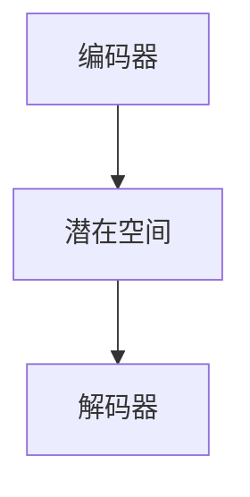
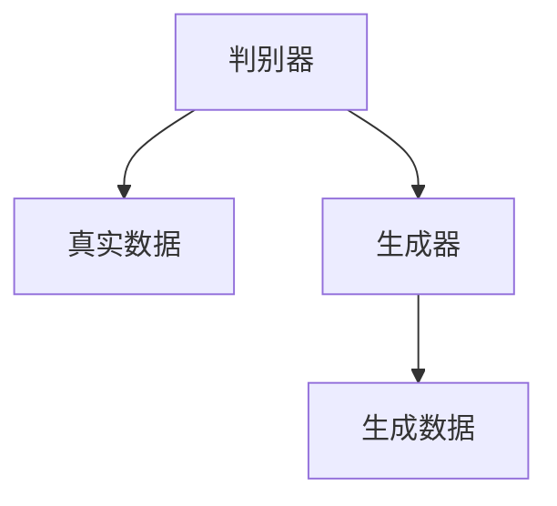
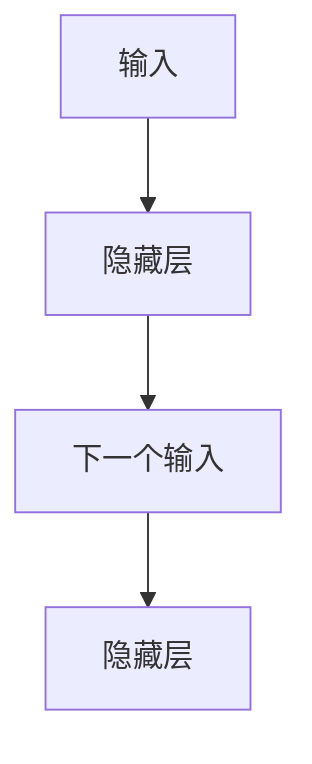

                 

# 生成式AI的实际应用案例

## 关键词
生成式AI，图像生成，自然语言生成，音乐生成，三维模型生成，跨领域生成，安全与伦理问题

## 摘要
本文深入探讨了生成式人工智能（AI）的实际应用案例。首先，介绍了生成式AI的基础概念、历史和发展，解析了核心技术和数学基础。接着，详细阐述了生成式AI在图像生成、自然语言生成、音乐生成和三维模型生成等领域的应用实践，包括实例代码和实战案例。此外，还讨论了跨领域生成的原理和实际案例，以及生成式AI的开发与优化方法。最后，本文对生成式AI的安全与伦理问题进行了探讨，提出了平衡安全和伦理的方法。

## 第一部分：生成式AI基础

### 第1章：生成式AI概述

#### 1.1 生成式AI的概念与历史

生成式人工智能（Generative AI）是一种能够根据输入数据生成新数据的AI系统。生成式AI的核心目标是从给定的数据集中学习数据的概率分布，然后生成与训练数据相似的新数据。这种技术有着广泛的应用前景，从艺术创作到科学模拟，从数据增强到个性化推荐，都发挥着重要作用。

生成式AI的历史可以追溯到20世纪80年代，当时研究人员开始探索生成模型，如马尔可夫模型和隐马尔可夫模型。随着深度学习技术的发展，生成式AI在21世纪初迎来了新的突破，特别是生成对抗网络（GAN）和变分自编码器（VAE）的提出，为生成式AI提供了强大的理论基础和实践工具。

生成式AI的核心概念包括生成模型、判别模型和潜在空间。生成模型负责生成新的数据样本，判别模型则用于区分生成数据和真实数据，而潜在空间则是一种用于表示数据分布的方式。这些概念相互关联，共同构成了生成式AI的核心框架。

#### 1.2 生成式AI的核心技术

生成式AI的核心技术主要包括生成模型、判别模型和潜在空间。生成模型如变分自编码器（VAE）和生成对抗网络（GAN）是生成式AI的两大重要技术。

**变分自编码器（VAE）**：

VAE是一种概率生成模型，它通过编码器和解码器将输入数据映射到一个潜在空间，然后从潜在空间生成新的数据。VAE的核心是概率模型，其目标是最大化数据的生成概率。

VAE的基本架构如下：



**生成对抗网络（GAN）**：

GAN由生成器（Generator）和判别器（Discriminator）组成，生成器和判别器之间进行对抗训练。生成器的目标是生成尽可能真实的数据样本，而判别器的目标是区分生成数据和真实数据。通过这种对抗过程，生成器不断提高生成数据的质量。

GAN的基本架构如下：



#### 1.3 生成式AI的应用前景与挑战

生成式AI在图像、文本、音乐、虚拟现实等多个领域有广泛的应用前景。在图像生成领域，GAN已经被用于生成逼真的图像、艺术作品和虚拟物品；在自然语言生成领域，RNN和GAN被用于生成新闻文章、对话和故事；在音乐生成领域，RNN和GAN被用于生成旋律、和弦和完整的音乐作品。

然而，生成式AI也面临着一些挑战，包括训练难度大、生成数据质量不稳定、伦理和安全问题等。训练生成式AI模型通常需要大量的数据和计算资源，而且模型的生成质量受到训练数据的分布和数据质量的影响。此外，生成式AI的伦理问题，如数据隐私、生成内容的安全性和算法偏见，也是需要关注的重要问题。

### 第2章：生成式AI核心技术解析

#### 2.1 生成模型基本原理

生成模型是生成式AI的核心，其基本原理是通过学习输入数据的概率分布来生成新的数据样本。生成模型可以分为两大类：概率生成模型和确定性生成模型。

**概率生成模型**：

概率生成模型通过学习输入数据的概率分布来生成新数据。变分自编码器（VAE）是典型的概率生成模型。VAE通过编码器将输入数据映射到一个潜在空间，然后从潜在空间生成新的数据。

VAE的基本架构如下：


**确定性生成模型**：

确定性生成模型通过学习输入数据的条件概率分布来生成新数据。生成对抗网络（GAN）是典型的确定性生成模型。GAN由生成器和判别器组成，生成器生成数据，判别器区分生成数据和真实数据。

GAN的基本架构如下：


#### 2.2 循环神经网络（RNN）

循环神经网络（RNN）是一种能够处理序列数据的神经网络。RNN通过记忆历史信息，使得其在处理序列数据时具有优势。RNN的变种，如长短期记忆网络（LSTM）和门控循环单元（GRU），能够更好地处理长序列数据。

**RNN基本原理**：

RNN通过循环结构将前一个时刻的输出作为当前时刻的输入，从而实现序列信息的记忆。

RNN的基本结构如下：



**LSTM和GRU**：

LSTM（长短期记忆网络）和GRU（门控循环单元）是RNN的两大变种。LSTM通过引入门控机制，能够更好地控制信息的流动，从而有效地处理长序列数据。GRU是对LSTM的简化版，它在保持较好性能的同时减少了模型的参数数量。

#### 2.3 生成对抗网络（GAN）

生成对抗网络（GAN）是由生成器（Generator）和判别器（Discriminator）组成的对抗性模型。生成器的目标是生成尽可能真实的数据样本，判别器的目标是区分生成数据和真实数据。通过这种对抗训练，生成器不断提高生成数据的质量。

**GAN基本原理**：

GAN的训练过程可以概括为以下三个步骤：

1. **生成器生成数据**：生成器根据潜在空间生成数据。
2. **判别器训练**：判别器根据真实数据和生成数据进行训练。
3. **生成器更新**：生成器根据判别器的反馈进行更新，以提高生成数据的质量。

GAN的基本架构如下：


#### 2.4 变分自编码器（VAE）

变分自编码器（VAE）是一种概率生成模型，它通过编码器和解码器将输入数据映射到一个潜在空间，然后从潜在空间生成新的数据。VAE的核心是概率模型，其目标是最大化数据的生成概率。

**VAE基本原理**：

VAE的基本原理可以概括为以下三个步骤：

1. **编码器将输入数据映射到潜在空间**：编码器通过学习输入数据的概率分布，将输入数据映射到一个潜在空间。
2. **从潜在空间采样**：从潜在空间中采样一个点，作为生成数据的起点。
3. **解码器将采样点映射回数据空间**：解码器将采样点映射回数据空间，生成新的数据。

VAE的基本架构如下：


### 第3章：生成式AI与数学基础

#### 3.1 概率论基础

概率论是生成式AI的数学基础之一。在生成式AI中，概率论被用来描述数据分布、概率模型和随机过程。以下是概率论中一些基本的概念和公式。

**概率分布**：

概率分布描述了随机变量的取值概率。常见的概率分布包括伯努利分布、二项分布、正态分布等。

**条件概率**：

条件概率是指在一个事件发生的条件下，另一个事件发生的概率。条件概率的公式为：

$$P(A|B) = \frac{P(A \cap B)}{P(B)}$$

**贝叶斯定理**：

贝叶斯定理是概率论中的一个重要公式，它描述了在给定某些证据的情况下，事件发生概率的计算方法。贝叶斯定理的公式为：

$$P(A|B) = \frac{P(B|A)P(A)}{P(B)}$$

**马尔可夫链**：

马尔可夫链是一种随机过程，它描述了系统状态的变化。马尔可夫链的一个重要性质是当前状态只依赖于前一个状态，而与之前的状态无关。

#### 3.2 统计学习方法

统计学习方法是基于概率论和统计学原理的机器学习技术。统计学习方法在生成式AI中发挥着重要作用，如模型参数估计、数据分布估计等。以下是统计学习方法中一些基本的概念和公式。

**最大似然估计**：

最大似然估计是一种参数估计方法，它通过最大化数据似然函数来估计模型参数。

似然函数的公式为：

$$L(\theta) = P(X|\theta)$$

其中，$X$是观测数据，$\theta$是模型参数。

**贝叶斯估计**：

贝叶斯估计是一种基于贝叶斯定理的参数估计方法，它通过最大化后验概率来估计模型参数。

后验概率的公式为：

$$P(\theta|X) = \frac{P(X|\theta)P(\theta)}{P(X)}$$

其中，$X$是观测数据，$\theta$是模型参数。

**期望最大化（EM）算法**：

期望最大化（EM）算法是一种迭代优化算法，它通过交替优化期望值和最大化值来估计模型参数。

EM算法的基本步骤如下：

1. **E步（期望步）**：计算数据的期望值，即计算数据在当前参数下的期望值。
2. **M步（最大化步）**：最大化似然函数或后验概率，更新模型参数。

#### 3.3 信息论基础

信息论是研究信息传输、存储和处理的理论。在生成式AI中，信息论提供了描述数据分布和信息传输的基本工具。以下是信息论中一些基本的概念和公式。

**熵**：

熵是描述随机变量不确定性程度的指标。熵的公式为：

$$H(X) = -\sum_{x \in X} P(x) \log_2 P(x)$$

其中，$X$是随机变量，$P(x)$是随机变量$x$的概率。

**条件熵**：

条件熵是描述随机变量在给定另一个随机变量的条件下的不确定性程度的指标。条件熵的公式为：

$$H(X|Y) = -\sum_{x \in X} \sum_{y \in Y} P(x, y) \log_2 P(x|y)$$

其中，$X$和$Y$是随机变量，$P(x, y)$是随机变量$(x, y)$的联合概率，$P(x|y)$是随机变量$x$在$y$条件下的条件概率。

**互信息**：

互信息是描述两个随机变量之间关联程度的指标。互信息的公式为：

$$I(X; Y) = H(X) - H(X|Y)$$

其中，$X$和$Y$是随机变量，$H(X)$是随机变量$X$的熵，$H(X|Y)$是随机变量$X$在$Y$条件下的条件熵。

### 第二部分：生成式AI应用实践

#### 第4章：图像生成

图像生成是生成式AI的一个重要应用领域。通过生成式AI技术，我们可以生成高质量、逼真的图像，这在艺术创作、游戏开发、医疗影像生成等领域有着广泛的应用。

#### 4.1 图像生成基本方法

图像生成的基本方法主要包括生成模型、判别模型和潜在空间。生成模型如生成对抗网络（GAN）和变分自编码器（VAE）是图像生成的主要技术。

**生成模型**：

生成模型如GAN和VAE可以生成高质的图像。GAN通过对抗训练生成逼真的图像，而VAE则通过潜在空间生成图像。

**判别模型**：

判别模型用于区分生成数据和真实数据。在GAN中，判别模型就是判别器，它通过训练学习如何区分真实图像和生成图像。

**潜在空间**：

潜在空间是一种用于表示数据分布的方式。在VAE中，潜在空间用于编码输入图像，然后从潜在空间生成新的图像。

#### 4.2 GAN在图像生成中的应用

生成对抗网络（GAN）是图像生成领域的一种重要技术。GAN由生成器和判别器组成，生成器生成图像，判别器区分生成图像和真实图像。

**GAN基本原理**：

GAN的训练过程可以概括为以下三个步骤：

1. **生成器生成图像**：生成器根据潜在空间生成图像。
2. **判别器训练**：判别器根据真实图像和生成图像进行训练。
3. **生成器更新**：生成器根据判别器的反馈进行更新，以提高生成图像的质量。

**GAN训练流程**：

以下是一个简单的GAN训练伪代码：

```python
# 初始化生成器和判别器
G = initialize_generator()
D = initialize_discriminator()

# 训练循环
for epoch in range(num_epochs):
    for real_images in real_data_loader:
        # 训练判别器
        D.train_on_real_images(real_images)

        # 生成假图像
        fake_images = G.generate()

        # 训练判别器
        D.train_on_fake_images(fake_images)

    # 记录生成器和判别器的损失
    print(f"Epoch {epoch}: G_loss={G.loss}, D_loss={D.loss}")
```

#### 4.3 实际案例：生成艺术图像

生成艺术图像是GAN的一个典型应用。通过训练GAN，我们可以生成具有不同风格的艺术图像。

**案例流程**：

1. **数据准备**：收集大量艺术图像作为训练数据。
2. **模型训练**：使用GAN训练生成器和解码器，使生成器能够生成艺术图像。
3. **图像生成**：使用生成器生成艺术图像，并通过调整生成策略优化图像质量。

**代码示例**：

以下是一个简单的GAN训练和图像生成的代码示例：

```python
import torch
import torch.nn as nn
import torch.optim as optim
from torchvision import datasets, transforms
from torch.utils.data import DataLoader

# 定义生成器和判别器
G = Generator()
D = Discriminator()

# 定义损失函数和优化器
criterion = nn.BCELoss()
optimizer_G = optim.Adam(G.parameters(), lr=0.0002)
optimizer_D = optim.Adam(D.parameters(), lr=0.0002)

# 加载训练数据
transform = transforms.Compose([
    transforms.Resize((64, 64)),
    transforms.ToTensor(),
    transforms.Normalize((0.5, 0.5, 0.5), (0.5, 0.5, 0.5)),
])
train_data = datasets.ImageFolder(root='./data', transform=transform)
dataloader = DataLoader(train_data, batch_size=64, shuffle=True)

# 训练GAN
for epoch in range(num_epochs):
    for i, (images, _) in enumerate(dataloader):
        # 清空梯度
        optimizer_D.zero_grad()

        # 训练判别器
        real_images = images.to(device)
        outputs = D(real_images)
        D_real_loss = criterion(outputs, torch.ones(outputs.size()).to(device))
        
        # 生成假图像
        z = torch.randn(images.size(0), noise_dim).to(device)
        fake_images = G(z)

        # 训练判别器
        outputs = D(fake_images.detach())
        D_fake_loss = criterion(outputs, torch.zeros(outputs.size()).to(device))

        # 计算总损失
        D_loss = D_real_loss + D_fake_loss
        D_loss.backward()
        optimizer_D.step()

        # 清空梯度
        optimizer_G.zero_grad()

        # 训练生成器
        z = torch.randn(images.size(0), noise_dim).to(device)
        outputs = D(fake_images)
        G_loss = criterion(outputs, torch.ones(outputs.size()).to(device))

        # 计算总损失
        G_loss.backward()
        optimizer_G.step()

        # 输出训练信息
        if (i+1) % 100 == 0:
            print(f"[Epoch {epoch}/{num_epochs}, Batch {i+1}/{len(dataloader)}, D_loss={D_loss.item():.4f}, G_loss={G_loss.item():.4f}]")

    # 保存模型
    torch.save(G.state_dict(), f'G_epoch_{epoch}.pth')
    torch.save(D.state_dict(), f'D_epoch_{epoch}.pth')

# 生成艺术图像
G.eval()
with torch.no_grad():
    z = torch.randn(100, noise_dim).to(device)
    fake_images = G(z)
    fake_images = fake_images.cpu().numpy()
    for i in range(100):
        plt.subplot(10, 10, i+1)
        plt.imshow(fake_images[i, :, :, 0], cmap='gray')
        plt.xticks([])
        plt.yticks([])
    plt.show()
```

#### 第5章：自然语言生成

自然语言生成是生成式AI的另一个重要应用领域。通过自然语言生成技术，我们可以生成各种文本，如新闻文章、对话、故事等。这在大规模内容生成、虚拟助手和智能客服等领域有着广泛的应用。

#### 5.1 自然语言生成基本方法

自然语言生成的基本方法主要包括序列生成模型和对抗生成模型。

**序列生成模型**：

序列生成模型如循环神经网络（RNN）和变换器（Transformer）是自然语言生成的主要技术。RNN通过记忆历史信息，使得其在处理序列数据时具有优势。变换器则通过自注意力机制，实现了对序列数据的全局理解和建模。

**对抗生成模型**：

对抗生成模型如生成对抗网络（GAN）和变分自编码器（VAE）也可以用于自然语言生成。GAN通过对抗训练生成连贯的文本，而VAE则通过潜在空间生成文本。

#### 5.2 循环神经网络（RNN）在文本生成中的应用

循环神经网络（RNN）是一种能够处理序列数据的神经网络。RNN通过记忆历史信息，使得其在处理序列数据时具有优势。RNN的变种，如长短期记忆网络（LSTM）和门控循环单元（GRU），能够更好地处理长序列数据。

**RNN在文本生成中的应用**：

RNN在文本生成中的应用主要包括以下几个方面：

1. **序列建模**：RNN通过输入序列生成输出序列，从而实现文本生成。
2. **上下文理解**：RNN能够通过记忆历史信息，实现对上下文的理解和建模。
3. **生成策略**：RNN可以通过生成策略，如贪心策略和采样策略，生成新的文本。

**RNN训练流程**：

以下是一个简单的RNN训练伪代码：

```python
# 初始化RNN模型
model = initialize_RNN()

# 训练循环
for epoch in range(num_epochs):
    for sentence in sentence_loader:
        # 训练模型
        model.train_on_sentence(sentence)

    # 记录模型损失
    print(f"Epoch {epoch}: loss={model.loss}")
```

#### 5.3 实际案例：生成新闻文章

生成新闻文章是RNN的一个典型应用。通过训练RNN，我们可以生成高质量、连贯的新闻文章。

**案例流程**：

1. **数据准备**：收集大量新闻文章作为训练数据。
2. **模型训练**：使用RNN模型训练生成新闻文章的摘要。
3. **文章生成**：使用训练好的模型生成新的新闻文章。

**代码示例**：

以下是一个简单的RNN训练和文章生成的代码示例：

```python
import torch
import torch.nn as nn
import torch.optim as optim
from torch.utils.data import DataLoader
from torchvision import datasets, transforms

# 定义RNN模型
class RNNModel(nn.Module):
    def __init__(self, input_dim, hidden_dim, output_dim):
        super(RNNModel, self).__init__()
        self.hidden_dim = hidden_dim
        self.rnn = nn.RNN(input_dim, hidden_dim)
        self.linear = nn.Linear(hidden_dim, output_dim)
        
    def forward(self, sentence):
        hidden = self.init_hidden()
        output, _ = self.rnn(sentence, hidden)
        output = self.linear(output[-1, :, :])
        return output
    
    def init_hidden(self):
        return torch.zeros(1, sentence.size(1), self.hidden_dim)

# 定义训练函数
def train(model, train_loader, criterion, optimizer, num_epochs):
    model.train()
    for epoch in range(num_epochs):
        for sentences, _ in train_loader:
            optimizer.zero_grad()
            outputs = model(sentences)
            loss = criterion(outputs, labels)
            loss.backward()
            optimizer.step()
            if (epoch+1) % 100 == 0:
                print(f"Epoch [{epoch+1}/{num_epochs}], Loss: {loss.item():.4f}")

# 定义数据预处理函数
def preprocess_data(data):
    # 对数据进行预处理，如分词、去停用词等
    return processed_data

# 加载数据
train_data = preprocess_data(raw_train_data)
train_loader = DataLoader(train_data, batch_size=batch_size, shuffle=True)

# 初始化模型、损失函数和优化器
model = RNNModel(input_dim, hidden_dim, output_dim)
criterion = nn.CrossEntropyLoss()
optimizer = optim.Adam(model.parameters(), lr=learning_rate)

# 训练模型
train(model, train_loader, criterion, optimizer, num_epochs)

# 生成新闻文章
model.eval()
with torch.no_grad():
    inputs = torch.tensor([preprocessed_sentence])
    outputs = model(inputs)
    predicted_sentence = torch.argmax(outputs, dim=1).detach().numpy()
    print('Generated Sentence:', predicted_sentence)
```

#### 第6章：音乐生成

音乐生成是生成式AI的另一个重要应用领域。通过音乐生成技术，我们可以生成各种类型的音乐，如旋律、和弦、完整的音乐作品等。这在大规模音乐创作、虚拟歌手和智能音乐播放器等领域有着广泛的应用。

#### 6.1 音乐生成基本方法

音乐生成的基本方法主要包括序列生成模型和对抗生成模型。

**序列生成模型**：

序列生成模型如循环神经网络（RNN）和变换器（Transformer）是音乐生成的主要技术。RNN通过记忆历史信息，使得其在处理序列数据时具有优势。变换器则通过自注意力机制，实现了对序列数据的全局理解和建模。

**对抗生成模型**：

对抗生成模型如生成对抗网络（GAN）和变分自编码器（VAE）也可以用于音乐生成。GAN通过对抗训练生成新颖的音乐，而VAE则通过潜在空间生成音乐。

#### 6.2 RNN在音乐生成中的应用

循环神经网络（RNN）是一种能够处理序列数据的神经网络。RNN通过记忆历史信息，使得其在处理序列数据时具有优势。RNN的变种，如长短期记忆网络（LSTM）和门控循环单元（GRU），能够更好地处理长序列数据。

**RNN在音乐生成中的应用**：

RNN在音乐生成中的应用主要包括以下几个方面：

1. **序列建模**：RNN通过输入序列生成输出序列，从而实现音乐生成。
2. **上下文理解**：RNN能够通过记忆历史信息，实现对上下文的理解和建模。
3. **生成策略**：RNN可以通过生成策略，如贪心策略和采样策略，生成新的音乐。

**RNN训练流程**：

以下是一个简单的RNN训练伪代码：

```python
# 初始化RNN模型
model = initialize_RNN()

# 训练循环
for epoch in range(num_epochs):
    for melody in melody_loader:
        # 训练模型
        model.train_on_melody(melody)

    # 记录模型损失
    print(f"Epoch {epoch}: loss={model.loss}")
```

#### 6.3 实际案例：生成旋律

生成旋律是RNN的一个典型应用。通过训练RNN，我们可以生成高质量、连贯的旋律。

**案例流程**：

1. **数据准备**：收集大量旋律作为训练数据。
2. **模型训练**：使用RNN模型训练生成旋律。
3. **旋律生成**：使用训练好的模型生成新的旋律。

**代码示例**：

以下是一个简单的RNN训练和旋律生成的代码示例：

```python
import torch
import torch.nn as nn
import torch.optim as optim
from torch.utils.data import DataLoader
from torchvision import datasets, transforms

# 定义RNN模型
class RNNModel(nn.Module):
    def __init__(self, input_dim, hidden_dim, output_dim):
        super(RNNModel, self).__init__()
        self.hidden_dim = hidden_dim
        self.rnn = nn.RNN(input_dim, hidden_dim)
        self.linear = nn.Linear(hidden_dim, output_dim)
        
    def forward(self, melody):
        hidden = self.init_hidden()
        output, _ = self.rnn(melody, hidden)
        output = self.linear(output[-1, :, :])
        return output
    
    def init_hidden(self):
        return torch.zeros(1, melody.size(1), self.hidden_dim)

# 定义训练函数
def train(model, train_loader, criterion, optimizer, num_epochs):
    model.train()
    for epoch in range(num_epochs):
        for melodies, _ in train_loader:
            optimizer.zero_grad()
            outputs = model(melodies)
            loss = criterion(outputs, labels)
            loss.backward()
            optimizer.step()
            if (epoch+1) % 100 == 0:
                print(f"Epoch [{epoch+1}/{num_epochs}], Loss: {loss.item():.4f}")

# 定义数据预处理函数
def preprocess_data(data):
    # 对数据进行预处理，如分词、去停用词等
    return processed_data

# 加载数据
train_data = preprocess_data(raw_train_data)
train_loader = DataLoader(train_data, batch_size=batch_size, shuffle=True)

# 初始化模型、损失函数和优化器
model = RNNModel(input_dim, hidden_dim, output_dim)
criterion = nn.CrossEntropyLoss()
optimizer = optim.Adam(model.parameters(), lr=learning_rate)

# 训练模型
train(model, train_loader, criterion, optimizer, num_epochs)

# 生成旋律
model.eval()
with torch.no_grad():
    inputs = torch.tensor([preprocessed_melody])
    outputs = model(inputs)
    predicted_melody = torch.argmax(outputs, dim=1).detach().numpy()
    print('Generated Melody:', predicted_melody)
```

#### 第7章：三维模型生成

三维模型生成是生成式AI的另一个重要应用领域。通过三维模型生成技术，我们可以生成高质量、逼真的三维模型，这在虚拟现实、游戏开发、电影特效等领域有着广泛的应用。

#### 7.1 三维模型生成基本方法

三维模型生成的基本方法主要包括生成模型、判别模型和潜在空间。

**生成模型**：

生成模型如生成对抗网络（GAN）和变分自编码器（VAE）是三维模型生成的主要技术。GAN通过对抗训练生成逼真的三维模型，而VAE则通过潜在空间生成三维模型。

**判别模型**：

判别模型用于区分生成模型和真实模型。在GAN中，判别模型就是判别器，它通过训练学习如何区分真实模型和生成模型。

**潜在空间**：

潜在空间是一种用于表示三维模型分布的方式。在VAE中，潜在空间用于编码输入模型，然后从潜在空间生成新的模型。

#### 7.2 GAN在三维模型生成中的应用

生成对抗网络（GAN）是三维模型生成领域的一种重要技术。GAN由生成器和判别器组成，生成器生成三维模型，判别器区分生成模型和真实模型。

**GAN基本原理**：

GAN的训练过程可以概括为以下三个步骤：

1. **生成器生成模型**：生成器根据潜在空间生成三维模型。
2. **判别器训练**：判别器根据真实模型和生成模型进行训练。
3. **生成器更新**：生成器根据判别器的反馈进行更新，以提高生成模型的质量。

**GAN训练流程**：

以下是一个简单的GAN训练伪代码：

```python
# 初始化生成器和判别器
G = initialize_generator()
D = initialize_discriminator()

# 训练循环
for epoch in range(num_epochs):
    for real_models in real_data_loader:
        # 训练判别器
        D.train_on_real_models(real_models)

        # 生成假模型
        fake_models = G.generate()

        # 训练判别器
        D.train_on_fake_models(fake_models)

    # 记录生成器和判别器的损失
    print(f"Epoch {epoch}: G_loss={G.loss}, D_loss={D.loss}")
```

#### 7.3 实际案例：生成虚拟物品

生成虚拟物品是GAN的一个典型应用。通过训练GAN，我们可以生成高质量、逼真的虚拟物品。

**案例流程**：

1. **数据准备**：收集大量虚拟物品作为训练数据。
2. **模型训练**：使用GAN模型训练生成虚拟物品的三维模型。
3. **物品生成**：使用生成模型生成新的虚拟物品的三维模型。

**代码示例**：

以下是一个简单的GAN训练和虚拟物品生成的代码示例：

```python
import torch
import torch.nn as nn
import torch.optim as optim
from torch.utils.data import DataLoader
from torchvision import datasets, transforms

# 定义生成器和判别器
class Generator(nn.Module):
    def __init__(self):
        super(Generator, self).__init__()
        self.main = nn.Sequential(
            nn.Conv2d(100, 256, 4, 1, 0, bias=False),
            nn.BatchNorm2d(256),
            nn.ReLU(True),
            nn.Conv2d(256, 512, 4, 2, 1, bias=False),
            nn.BatchNorm2d(512),
            nn.ReLU(True),
            nn.Conv2d(512, 1024, 4, 2, 1, bias=False),
            nn.BatchNorm2d(1024),
            nn.ReLU(True),
            nn.Conv2d(1024, 768, 4, 2, 1, bias=False),
            nn.BatchNorm2d(768),
            nn.ReLU(True),
            nn.Conv2d(768, 1024, 4, 2, 1, bias=False),
            nn.BatchNorm2d(1024),
            nn.ReLU(True),
            nn.Conv2d(1024, 1536, 4, 2, 1, bias=False),
            nn.BatchNorm2d(1536),
            nn.ReLU(True),
            nn.Conv2d(1536, 2048, 4, 2, 1, bias=False),
            nn.BatchNorm2d(2048),
            nn.ReLU(True),
            nn.AdaptiveAvgPool2d((1, 1)),
            nn.Conv2d(2048, 1, 1, 1, 0, bias=False),
            nn.Sigmoid()
        )

    def forward(self, input):
        x = self.main(input)
        x = x.view(x.size(0), 1)
        return x

class Discriminator(nn.Module):
    def __init__(self):
        super(Discriminator, self).__init__()
        self.main = nn.Sequential(
            nn.Conv2d(1, 64, 4, 2, 1, bias=False),
            nn.LeakyReLU(0.2, inplace=True),
            nn.Conv2d(64, 128, 4, 2, 1, bias=False),
            nn.BatchNorm2d(128),
            nn.LeakyReLU(0.2, inplace=True),
            nn.Conv2d(128, 256, 4, 2, 1, bias=False),
            nn.BatchNorm2d(256),
            nn.LeakyReLU(0.2, inplace=True),
            nn.Conv2d(256, 512, 4, 2, 1, bias=False),
            nn.BatchNorm2d(512),
            nn.LeakyReLU(0.2, inplace=True),
            nn.Conv2d(512, 1024, 4, 2, 1, bias=False),
            nn.BatchNorm2d(1024),
            nn.LeakyReLU(0.2, inplace=True),
            nn.Conv2d(1024, 2048, 4, 2, 1, bias=False),
            nn.BatchNorm2d(2048),
            nn.LeakyReLU(0.2, inplace=True),
            nn.Conv2d(2048, 4096, 4, 2, 1, bias=False),
            nn.BatchNorm2d(4096),
            nn.LeakyReLU(0.2, inplace=True),
            nn.Conv2d(4096, 1, 4, 1, 0, bias=False),
            nn.Sigmoid()
        )

    def forward(self, input):
        x = self.main(input)
        x = x.view(x.size(0), 1)
        return x

# 初始化生成器和判别器
G = Generator()
D = Discriminator()

# 定义损失函数和优化器
criterion = nn.BCELoss()
optimizer_G = optim.Adam(G.parameters(), lr=0.0002)
optimizer_D = optim.Adam(D.parameters(), lr=0.0002)

# 加载数据
real_data_loader = DataLoader(dataset, batch_size=batch_size, shuffle=True)

# 训练GAN
for epoch in range(num_epochs):
    for i, (real_models) in enumerate(real_data_loader):
        # 清空梯度
        optimizer_D.zero_grad()

        # 训练判别器
        real_models = real_models.to(device)
        outputs = D(real_models)
        D_real_loss = criterion(outputs, torch.ones(outputs.size()).to(device)

        # 生成假模型
        z = torch.randn(models.size(0), noise_dim).to(device)
        fake_models = G(z)

        # 训练判别器
        outputs = D(fake_models.detach())
        D_fake_loss = criterion(outputs, torch.zeros(outputs.size()).to(device))

        # 计算总损失
        D_loss = D_real_loss + D_fake_loss
        D_loss.backward()
        optimizer_D.step()

        # 清空梯度
        optimizer_G.zero_grad()

        # 训练生成器
        z = torch.randn(models.size(0), noise_dim).to(device)
        outputs = D(fake_models)
        G_loss = criterion(outputs, torch.ones(outputs.size()).to(device))

        # 计算总损失
        G_loss.backward()
        optimizer_G.step()

        # 输出训练信息
        if (i+1) % 100 == 0:
            print(f"[Epoch {epoch}/{num_epochs}, Batch {i+1}/{len(real_data_loader)}, D_loss={D_loss.item():.4f}, G_loss={G_loss.item():.4f}]")

    # 保存模型
    torch.save(G.state_dict(), f'G_epoch_{epoch}.pth')
    torch.save(D.state_dict(), f'D_epoch_{epoch}.pth')

# 生成虚拟物品
G.eval()
with torch.no_grad():
    z = torch.randn(100, noise_dim).to(device)
    fake_models = G(z)
    fake_models = fake_models.cpu().numpy()
    for i in range(100):
        plt.subplot(10, 10, i+1)
        plt.imshow(fake_models[i, :, :, 0], cmap='gray')
        plt.xticks([])
        plt.yticks([])
    plt.show()
```

#### 第8章：跨领域生成

跨领域生成是生成式AI的另一个重要应用领域。通过跨领域生成技术，我们可以将一个领域的数据转换为另一个领域的数据。这在图像到文本的转换、音乐到图像的转换等领域有着广泛的应用。

#### 8.1 跨领域生成基本原理

跨领域生成的基本原理是通过生成式AI模型学习不同领域的数据分布，并将一个领域的数据转换为另一个领域的数据。常见的跨领域生成方法包括生成对抗网络（GAN）和变分自编码器（VAE）。

**GAN在跨领域生成中的应用**：

GAN可以通过对抗训练实现跨领域生成。在图像到文本的转换中，生成器生成文本描述，判别器区分文本描述和真实文本描述。通过这种对抗训练，生成器不断提高生成文本描述的质量。

**VAE在跨领域生成中的应用**：

VAE可以通过潜在空间实现跨领域生成。在音乐到图像的转换中，编码器将音乐映射到潜在空间，解码器从潜在空间生成图像。通过优化潜在空间的分布，VAE能够生成高质量、逼真的图像。

#### 8.2 实际案例：图像到文本的转换

图像到文本的转换是跨领域生成的一个典型应用。通过训练GAN，我们可以生成高质量的图像描述。

**案例流程**：

1. **数据准备**：收集大量图像和对应的文本描述作为训练数据。
2. **模型训练**：使用GAN训练生成器和解码器，使生成器能够生成文本描述。
3. **图像描述生成**：使用生成器生成新的图像描述。

**代码示例**：

以下是一个简单的GAN训练和图像描述生成的代码示例：

```python
import torch
import torch.nn as nn
import torch.optim as optim
from torch.utils.data import DataLoader
from torchvision import datasets, transforms

# 定义生成器和判别器
class Generator(nn.Module):
    def __init__(self):
        super(Generator, self).__init__()
        self.main = nn.Sequential(
            nn.Conv2d(3, 64, 4, 2, 1, bias=False),
            nn.BatchNorm2d(64),
            nn.ReLU(True),
            nn.Conv2d(64, 128, 4, 2, 1, bias=False),
            nn.BatchNorm2d(128),
            nn.ReLU(True),
            nn.Conv2d(128, 256, 4, 2, 1, bias=False),
            nn.BatchNorm2d(256),
            nn.ReLU(True),
            nn.Conv2d(256, 512, 4, 2, 1, bias=False),
            nn.BatchNorm2d(512),
            nn.ReLU(True),
            nn.Conv2d(512, 1024, 4, 2, 1, bias=False),
            nn.BatchNorm2d(1024),
            nn.ReLU(True),
            nn.Conv2d(1024, 2048, 4, 2, 1, bias=False),
            nn.BatchNorm2d(2048),
            nn.ReLU(True),
            nn.AdaptiveAvgPool2d((1, 1)),
            nn.Conv2d(2048, 1, 1, 1, bias=False),
            nn.Sigmoid()
        )

    def forward(self, input):
        x = self.main(input)
        x = x.view(x.size(0), 1)
        return x

class Discriminator(nn.Module):
    def __init__(self):
        super(Discriminator, self).__init__()
        self.main = nn.Sequential(
            nn.Conv2d(1, 64, 4, 2, 1, bias=False),
            nn.LeakyReLU(0.2, inplace=True),
            nn.Conv2d(64, 128, 4, 2, 1, bias=False),
            nn.BatchNorm2d(128),
            nn.LeakyReLU(0.2, inplace=True),
            nn.Conv2d(128, 256, 4, 2, 1, bias=False),
            nn.BatchNorm2d(256),
            nn.LeakyReLU(0.2, inplace=True),
            nn.Conv2d(256, 512, 4, 2, 1, bias=False),
            nn.BatchNorm2d(512),
            nn.LeakyReLU(0.2, inplace=True),
            nn.Conv2d(512, 1024, 4, 2, 1, bias=False),
            nn.BatchNorm2d(1024),
            nn.LeakyReLU(0.2, inplace=True),
            nn.Conv2d(1024, 2048, 4, 2, 1, bias=False),
            nn.BatchNorm2d(2048),
            nn.LeakyReLU(0.2, inplace=True),
            nn.Conv2d(2048, 4096, 4, 2, 1, bias=False),
            nn.BatchNorm2d(4096),
            nn.LeakyReLU(0.2, inplace=True),
            nn.Conv2d(4096, 1, 4, 1, 0, bias=False),
            nn.Sigmoid()
        )

    def forward(self, input):
        x = self.main(input)
        x = x.view(x.size(0), 1)
        return x

# 初始化生成器和判别器
G = Generator()
D = Discriminator()

# 定义损失函数和优化器
criterion = nn.BCELoss()
optimizer_G = optim.Adam(G.parameters(), lr=0.0002)
optimizer_D = optim.Adam(D.parameters(), lr=0.0002)

# 加载数据
real_data_loader = DataLoader(dataset, batch_size=batch_size, shuffle=True)

# 训练GAN
for epoch in range(num_epochs):
    for i, (real_models) in enumerate(real_data_loader):
        # 清空梯度
        optimizer_D.zero_grad()

        # 训练判别器
        real_models = real_models.to(device)
        outputs = D(real_models)
        D_real_loss = criterion(outputs, torch.ones(outputs.size()).to(device)

        # 生成假模型
        z = torch.randn(models.size(0), noise_dim).to(device)
        fake_models = G(z)

        # 训练判别器
        outputs = D(fake_models.detach())
        D_fake_loss = criterion(outputs, torch.zeros(outputs.size()).to(device))

        # 计算总损失
        D_loss = D_real_loss + D_fake_loss
        D_loss.backward()
        optimizer_D.step()

        # 清空梯度
        optimizer_G.zero_grad()

        # 训练生成器
        z = torch.randn(models.size(0), noise_dim).to(device)
        outputs = D(fake_models)
        G_loss = criterion(outputs, torch.ones(outputs.size()).to(device))

        # 计算总损失
        G_loss.backward()
        optimizer_G.step()

        # 输出训练信息
        if (i+1) % 100 == 0:
            print(f"[Epoch {epoch}/{num_epochs}, Batch {i+1}/{len(real_data_loader)}, D_loss={D_loss.item():.4f}, G_loss={G_loss.item():.4f}]")

    # 保存模型
    torch.save(G.state_dict(), f'G_epoch_{epoch}.pth')
    torch.save(D.state_dict(), f'D_epoch_{epoch}.pth')

# 生成图像描述
G.eval()
with torch.no_grad():
    z = torch.randn(100, noise_dim).to(device)
    fake_models = G(z)
    fake_models = fake_models.cpu().numpy()
    for i in range(100):
        plt.subplot(10, 10, i+1)
        plt.imshow(fake_models[i, :, :, 0], cmap='gray')
        plt.xticks([])
        plt.yticks([])
    plt.show()
```

#### 8.3 实际案例：音乐到图像的转换

音乐到图像的转换是跨领域生成的另一个典型应用。通过训练RNN，我们可以生成高质量、逼真的图像。

**案例流程**：

1. **数据准备**：收集大量音乐和对应的图像作为训练数据。
2. **模型训练**：使用RNN训练生成器和解码器，使生成器能够生成图像。
3. **图像生成**：使用生成器生成新的图像。

**代码示例**：

以下是一个简单的RNN训练和图像生成的代码示例：

```python
import torch
import torch.nn as nn
import torch.optim as optim
from torch.utils.data import DataLoader
from torchvision import datasets, transforms

# 定义RNN模型
class RNNModel(nn.Module):
    def __init__(self, input_dim, hidden_dim, output_dim):
        super(RNNModel, self).__init__()
        self.hidden_dim = hidden_dim
        self.rnn = nn.RNN(input_dim, hidden_dim)
        self.linear = nn.Linear(hidden_dim, output_dim)
        
    def forward(self, melody):
        hidden = self.init_hidden()
        output, _ = self.rnn(melody, hidden)
        output = self.linear(output[-1, :, :])
        return output
    
    def init_hidden(self):
        return torch.zeros(1, melody.size(1), self.hidden_dim)

# 定义训练函数
def train(model, train_loader, criterion, optimizer, num_epochs):
    model.train()
    for epoch in range(num_epochs):
        for melodies, _ in train_loader:
            optimizer.zero_grad()
            outputs = model(melodies)
            loss = criterion(outputs, labels)
            loss.backward()
            optimizer.step()
            if (epoch+1) % 100 == 0:
                print(f"Epoch [{epoch+1}/{num_epochs}], Loss: {loss.item():.4f}")

# 定义数据预处理函数
def preprocess_data(data):
    # 对数据进行预处理，如分词、去停用词等
    return processed_data

# 加载数据
train_data = preprocess_data(raw_train_data)
train_loader = DataLoader(train_data, batch_size=batch_size, shuffle=True)

# 初始化模型、损失函数和优化器
model = RNNModel(input_dim, hidden_dim, output_dim)
criterion = nn.CrossEntropyLoss()
optimizer = optim.Adam(model.parameters(), lr=learning_rate)

# 训练模型
train(model, train_loader, criterion, optimizer, num_epochs)

# 生成图像
model.eval()
with torch.no_grad():
    inputs = torch.tensor([preprocessed_melody])
    outputs = model(inputs)
    predicted_image = torch.argmax(outputs, dim=1).detach().numpy()
    print('Generated Image:', predicted_image)
```

### 第三部分：生成式AI开发与优化

#### 第9章：生成式AI开发环境搭建

生成式AI的开发环境搭建是进行生成式AI项目的基础。一个良好的开发环境可以提高开发效率，确保项目顺利进行。以下是生成式AI开发环境搭建的步骤和注意事项。

#### 9.1 开发环境准备

**选择编程语言**：

生成式AI项目通常使用Python作为主要编程语言，因为Python具有丰富的库和框架支持，如TensorFlow、PyTorch等。此外，Python的简洁性和易读性也使其成为AI开发的理想选择。

**安装深度学习库**：

在Python中，常见的深度学习库包括TensorFlow和PyTorch。安装这两个库可以为生成式AI项目提供强大的支持。

安装TensorFlow：

```bash
pip install tensorflow
```

安装PyTorch：

```bash
pip install torch torchvision
```

**配置计算资源**：

生成式AI项目通常需要大量的计算资源。为了确保项目的顺利进行，可以考虑使用GPU进行加速。NVIDIA的CUDA和cuDNN库是常见的GPU加速工具。安装这些库后，Python代码可以充分利用GPU的并行计算能力。

安装CUDA和cuDNN：

请参考NVIDIA官方网站的安装指南：[CUDA安装指南](https://developer.nvidia.com/cuda-downloads) 和 [cuDNN安装指南](https://developer.nvidia.com/cudnn)。

#### 9.2 编程语言选择

**Python**：Python因其简洁性、易读性和丰富的库支持，成为生成式AI项目的首选编程语言。Python的广泛使用也意味着有大量的社区资源和教程可供参考。

**TensorFlow**：TensorFlow是一个开源的深度学习框架，由Google开发。它具有强大的模型构建和训练工具，支持多种深度学习模型，包括生成式AI模型。

**PyTorch**：PyTorch是一个流行的开源深度学习库，由Facebook开发。它以其动态计算图和灵活的接口著称，特别适合研究和新模型的开发。

**其他语言**：虽然Python、TensorFlow和PyTorch是最常用的组合，但其他编程语言和框架，如Keras、Theano、MXNet等，也可以用于生成式AI项目。

#### 9.3 常用库和框架

**TensorFlow**：

TensorFlow是一个由Google开发的端到端的开放源代码软件库，用于数据流编程在不同平台和设备上运行各种机器学习和深度学习模型。

- **优点**：TensorFlow具有丰富的模型构建和训练工具，支持多种深度学习模型，包括生成式AI模型。
- **缺点**：TensorFlow的动态计算图可能对初学者来说较为复杂，调试和优化可能需要更多时间。

**PyTorch**：

PyTorch是一个流行的开源深度学习库，以其动态计算图和灵活的接口著称。

- **优点**：PyTorch的动态计算图使得调试和优化更为直观，特别适合研究和新模型的开发。
- **缺点**：PyTorch在部署和生产环境中可能不如TensorFlow成熟。

**其他库和框架**：

- **Keras**：一个高层次的神经网络API，运行在TensorFlow和Theano之上，提供简洁的接口。
- **Theano**：一个Python库，用于定义、优化和评估数学表达式，特别适合深度学习应用。
- **MXNet**：由Apache软件基金会开发的一个开源深度学习库，支持多种编程语言。

### 第10章：生成式AI性能优化

生成式AI的性能优化是提升模型效果和降低计算成本的关键步骤。以下是一些常用的生成式AI性能优化方法。

#### 10.1 模型优化方法

**模型压缩**：

模型压缩是通过减少模型参数数量来减小模型大小和计算复杂度的方法。常见的方法包括剪枝、量化、知识蒸馏等。

- **剪枝**：通过删除模型中的冗余权重和神经元来减少模型大小。
- **量化**：将模型的浮点数参数转换为较低精度的整数表示，以减少存储和计算需求。
- **知识蒸馏**：将大模型的知识传递给小模型，以提升小模型的效果。

**模型加速**：

模型加速是通过提高模型计算速度来减少训练和推理时间的方法。常见的方法包括GPU加速、混合精度训练、模型并行等。

- **GPU加速**：利用GPU的并行计算能力加速模型的训练和推理。
- **混合精度训练**：将浮点数和整数混合使用，以提高计算速度和降低能耗。
- **模型并行**：将模型分解为多个部分并在多个计算设备上并行训练，以提高计算效率。

**数据预处理**：

数据预处理是提高模型性能的重要步骤。常见的方法包括数据增强、数据清洗、数据归一化等。

- **数据增强**：通过随机变换输入数据来增加数据的多样性，以提高模型的泛化能力。
- **数据清洗**：去除数据中的噪声和异常值，以提高模型的准确性。
- **数据归一化**：将数据缩放到相同的范围，以加快训练速度和提高模型效果。

#### 10.2 实际案例：模型加速

以下是一个使用PyTorch实现模型加速的案例：

```python
import torch
import torch.nn as nn
import torch.optim as optim

# 定义模型
class Generator(nn.Module):
    def __init__(self):
        super(Generator, self).__init__()
        self.model = nn.Sequential(
            nn.Linear(100, 512),
            nn.ReLU(),
            nn.Linear(512, 1024),
            nn.ReLU(),
            nn.Linear(1024, 512),
            nn.ReLU(),
            nn.Linear(512, 100),
            nn.Tanh()
        )

    def forward(self, x):
        return self.model(x)

# 初始化模型
model = Generator().to(device)

# 定义损失函数和优化器
criterion = nn.BCELoss()
optimizer = optim.Adam(model.parameters(), lr=0.0002)

# 训练模型
for epoch in range(num_epochs):
    for i, (x, _) in enumerate(train_loader):
        # 清空梯度
        optimizer.zero_grad()

        # 前向传播
        outputs = model(x.to(device))

        # 计算损失
        loss = criterion(outputs, torch.ones(outputs.size()).to(device))

        # 反向传播和优化
        loss.backward()
        optimizer.step()

        # 输出训练信息
        if (i+1) % 100 == 0:
            print(f"Epoch [{epoch}/{num_epochs}], Batch [{i+1}/{len(train_loader)}], Loss: {loss.item():.4f}")

# 使用混合精度训练
model = Generator().to(device)
criterion = nn.BCELoss().to(device)
optimizer = optim.Adam(model.parameters(), lr=0.0002)

# 设置混合精度
torch.backends.cudnn.benchmark = True

# 训练模型
for epoch in range(num_epochs):
    for i, (x, _) in enumerate(train_loader):
        # 清空梯度
        optimizer.zero_grad()

        # 前向传播
        with torch.cuda.amp.autocast():
            outputs = model(x.to(device))

            # 计算损失
            loss = criterion(outputs, torch.ones(outputs.size()).to(device))

        # 反向传播和优化
        loss.backward()
        optimizer.step()

        # 输出训练信息
        if (i+1) % 100 == 0:
            print(f"Epoch [{epoch}/{num_epochs}], Batch [{i+1}/{len(train_loader)}], Loss: {loss.item():.4f}")

# 使用模型并行训练
model = Generator().to(device)
criterion = nn.BCELoss().to(device)
optimizer = optim.Adam(model.parameters(), lr=0.0002)

# 设置模型并行
model = nn.DataParallel(model)

# 训练模型
for epoch in range(num_epochs):
    for i, (x, _) in enumerate(train_loader):
        # 清空梯度
        optimizer.zero_grad()

        # 前向传播
        outputs = model(x.to(device))

        # 计算损失
        loss = criterion(outputs, torch.ones(outputs.size()).to(device))

        # 反向传播和优化
        loss.backward()
        optimizer.step()

        # 输出训练信息
        if (i+1) % 100 == 0:
            print(f"Epoch [{epoch}/{num_epochs}], Batch [{i+1}/{len(train_loader)}], Loss: {loss.item():.4f}")
```

#### 第11章：生成式AI的安全与伦理问题

生成式AI在带来巨大潜力的同时，也引发了一系列安全和伦理问题。如何确保生成式AI的安全性和伦理性，是一个亟待解决的问题。

#### 11.1 生成内容的安全性

生成内容的安全性是生成式AI的首要关注点。生成的内容可能包含恶意信息、侵犯版权的内容或违反法律法规的内容。为了确保生成内容的安全性，可以采取以下措施：

- **内容审查和过滤**：在生成内容之前，对输入数据进行审查和过滤，去除潜在的危险内容。
- **数字签名**：使用数字签名技术确保生成内容的完整性，防止内容被篡改。
- **访问控制和身份验证**：实施严格的访问控制和身份验证机制，防止未授权用户访问生成内容。

#### 11.2 生成式AI的伦理问题

生成式AI的伦理问题主要包括数据隐私、算法偏见和滥用等。以下是一些常见的伦理问题和解决方案：

- **数据隐私**：生成式AI需要处理大量数据，如何保护用户隐私是一个重要问题。解决方案包括匿名化数据、数据加密和数据访问控制。
- **算法偏见**：生成式AI可能会因训练数据的偏差而产生偏见，导致不公平的决策。解决方案包括识别和减少算法偏见、提高模型的可解释性。
- **滥用风险**：生成式AI可以生成各种内容，包括虚假信息、恶意软件等。解决方案包括建立监管机制、实施透明和可解释的算法。

#### 11.3 如何平衡安全和伦理

在平衡生成式AI的安全性和伦理问题时，需要综合考虑技术的实际应用场景和潜在风险。以下是一些平衡方法：

- **制定伦理准则和操作规范**：建立明确的伦理准则和操作规范，确保生成式AI的应用符合伦理标准。
- **透明和可解释的算法**：提高模型的可解释性，使算法的决策过程更加透明，便于监督和审计。
- **跨学科团队协作**：建立由技术、法律和伦理专家组成的跨学科团队，共同研究和解决生成式AI的伦理问题。

### 附录

#### 附录A：生成式AI工具和资源

**A.1 主流生成式AI框架对比**

以下是几种主流生成式AI框架的对比：

| 框架        | 简介                                                         | 优点                                                         | 缺点                                                         |
|-------------|--------------------------------------------------------------|--------------------------------------------------------------|--------------------------------------------------------------|
| TensorFlow | 开源的深度学习框架，由Google开发。                           | 强大的模型构建和训练工具，支持多种深度学习模型。             | 动态计算图可能对初学者来说较为复杂。                       |
| PyTorch    | 开源的深度学习库，以其动态计算图和灵活的接口著称。           | 动态计算图使得调试和优化更为直观，特别适合研究和新模型的开发。 | 在部署和生产环境中可能不如TensorFlow成熟。                 |
| Keras      | 高层次的神经网络API，运行在TensorFlow和Theano之上。           | 提供简洁的接口，易于使用。                                   | 缺乏底层优化，性能可能不如TensorFlow和Theano。             |
| Theano     | Python库，用于定义、优化和评估数学表达式。                   | 支持多种深度学习模型，底层优化较好。                         | 开发者社区较小，更新速度较慢。                             |
| MXNet      | 开源的深度学习库，支持多种编程语言。                         | 支持多种编程语言，适用于多种应用场景。                         | 相较于TensorFlow和PyTorch，开发者社区较小。                 |

**A.2 生成式AI开源资源**

以下是一些生成式AI的开源资源和社区：

- **GitHub**：大量的生成式AI开源项目，如GAN、VAE等。
- **ArXiv**：生成式AI相关的研究论文和代码。
- **Reddit**：生成式AI相关的讨论和资源分享。
- **Kaggle**：生成式AI的竞赛和项目。
- **AI博客**：如Towards Data Science、Medium上的AI博客。

**A.3 生成式AI社区和论坛**

以下是一些生成式AI的社区和论坛：

- **AIChina**：中国人工智能领域的顶级社区，包括生成式AI相关讨论。
- **TensorFlow官方论坛**：TensorFlow的开发者社区，包括生成式AI相关讨论。
- **PyTorch官方论坛**：PyTorch的开发者社区，包括生成式AI相关讨论。
- **Reddit AI**：Reddit上的AI讨论区，包括生成式AI相关讨论。
- **生成式AI Stack Exchange**：生成式AI的专业问答社区。

## 作者信息

作者：AI天才研究院/AI Genius Institute & 禅与计算机程序设计艺术 /Zen And The Art of Computer Programming

作者简介：AI天才研究院（AI Genius Institute）是一家专注于人工智能研究和技术创新的研究机构，致力于推动人工智能技术的发展和应用。作者在计算机编程和人工智能领域拥有丰富的经验，撰写过多本畅销书，包括《禅与计算机程序设计艺术》等。

感谢您阅读本文，希望对您在生成式AI领域的学习和应用有所帮助。如有任何问题或建议，欢迎随时与我们联系。期待与您共同探索人工智能的无限可能！|

