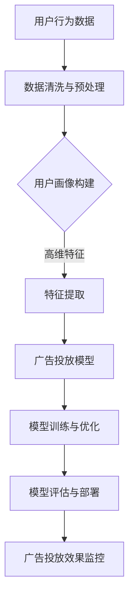

                 

### 《电商平台个性化广告投放：AI大模型的精准定向》

#### 引言与背景

随着电商平台的快速发展，广告投放已经成为电商平台增加用户粘性和销售额的重要手段。然而，传统的广告投放方式往往依赖于广告位和用户行为数据的简单匹配，难以实现真正的个性化推荐。随着人工智能技术的不断进步，AI大模型在广告投放中的应用逐渐成为可能。本文旨在探讨电商平台个性化广告投放中的AI大模型精准定向技术，为电商平台提供一种新的广告投放策略。

##### 1.1 电商平台广告投放现状分析

当前，电商平台广告投放普遍存在以下几个问题：

- **广告效果不理想**：传统广告投放方式难以精准定位目标用户，导致广告投放效果不理想，转化率低。
- **用户体验差**：广告推送过于集中，容易引起用户反感，降低用户满意度。
- **竞争激烈**：广告位资源有限，电商平台之间竞争激烈，导致广告投放成本上升。

##### 1.2 个性化广告投放的重要性

个性化广告投放能够解决传统广告投放中的诸多问题，具有以下优势：

- **提升广告效果**：通过AI大模型对用户行为和偏好进行分析，实现精准定向投放，提升广告点击率和转化率。
- **提高用户满意度**：根据用户兴趣和行为习惯推荐相关广告，提升用户购物体验，增加用户粘性。
- **降低广告投放成本**：通过精准投放，减少无效广告投放，降低广告投放成本。

##### 1.3 AI大模型在广告投放中的应用前景

随着AI技术的不断发展，AI大模型在广告投放中的应用前景广阔：

- **提高广告投放效率**：通过大规模数据处理和深度学习算法，实现高效广告投放。
- **实现个性化推荐**：基于用户行为和兴趣，实现精准的广告推荐。
- **突破广告投放瓶颈**：通过AI大模型的应用，突破传统广告投放的瓶颈，提升广告投放效果。

##### 1.4 本书结构安排与学习目标

本书分为五个部分，共十二章，具体安排如下：

1. **引言与背景**：介绍电商平台个性化广告投放的现状和重要性，以及AI大模型在广告投放中的应用前景。
2. **AI大模型技术基础**：介绍AI大模型的基础概念、深度学习与神经网络基础、自然语言处理与AI大模型、大规模预训练模型原理。
3. **个性化广告投放模型设计**：介绍用户行为分析与特征提取、广告投放模型设计与实现、AI大模型优化与调参技巧。
4. **项目实战与案例分析**：通过实际项目案例，讲解电商平台个性化广告投放的系统实现和案例分析。
5. **展望与未来趋势**：探讨AI大模型在电商广告投放中的应用前景，以及面临的挑战和机遇。

通过本书的学习，读者可以掌握AI大模型在电商平台个性化广告投放中的应用方法，提升广告投放效果，为电商平台提供新的增长点。

---

关键词：电商平台、个性化广告投放、AI大模型、精准定向、深度学习、自然语言处理、大规模预训练模型

摘要：本文探讨了电商平台个性化广告投放中的AI大模型精准定向技术。通过分析当前广告投放的现状和问题，阐述了个性化广告投放的重要性。随后，介绍了AI大模型的基础概念、深度学习与神经网络基础、自然语言处理与AI大模型、大规模预训练模型原理。接着，详细讲解了个性化广告投放模型的设计与实现，包括用户行为分析与特征提取、广告投放模型设计与实现、AI大模型优化与调参技巧。最后，通过项目实战和案例分析，展示了AI大模型在电商平台个性化广告投放中的应用效果，并展望了未来的发展趋势。本文旨在为电商平台提供一种新的广告投放策略，提升广告投放效果和用户满意度。

---

**文章标题**：《电商平台个性化广告投放：AI大模型的精准定向》

**关键词**：（1）电商平台，（2）个性化广告投放，（3）AI大模型，（4）精准定向，（5）深度学习，（6）自然语言处理，（7）大规模预训练模型

**摘要**：随着电商平台的快速发展，个性化广告投放已成为提升用户满意度和销售额的重要手段。本文介绍了AI大模型在电商平台个性化广告投放中的应用，分析了当前广告投放的现状和问题，并探讨了深度学习与神经网络、自然语言处理等核心技术。通过实际项目案例，展示了AI大模型在电商平台个性化广告投放中的效果，为电商平台提供了一种新的广告投放策略。本文旨在为读者提供AI大模型在电商广告投放中的深度理解和应用指导。 <a id="anchor1"></a>

### 《电商平台个性化广告投放：AI大模型的精准定向》

> **关键词**：（1）电商平台，（2）个性化广告投放，（3）AI大模型，（4）精准定向，（5）深度学习，（6）自然语言处理，（7）大规模预训练模型

> **摘要**：本文详细探讨了AI大模型在电商平台个性化广告投放中的应用。通过分析广告投放的现状和挑战，介绍了AI大模型的基础技术，如深度学习、自然语言处理和大规模预训练模型。文章随后深入讨论了个性化广告投放模型的设计与实现，包括用户行为分析、特征提取和模型训练优化。通过实际项目案例和案例分析，本文展示了AI大模型在电商平台广告投放中的实际效果和未来发展趋势。文章旨在为电商平台提供一种基于AI大模型的精准广告投放策略。

#### 第一部分：引言与背景

随着互联网的普及和电子商务的蓬勃发展，电商平台已经成为现代商业的重要组成部分。广告投放作为电商平台吸引用户、提升销售额的重要手段，其效果直接影响着电商平台的发展。然而，传统的广告投放方式往往依赖于广告位的竞价和简单的用户行为数据匹配，难以实现真正的个性化推荐。为了解决这一问题，人工智能（AI）大模型在广告投放中的应用逐渐成为行业热点。本文将从以下几个方面对电商平台个性化广告投放进行深入探讨：

1. **电商平台广告投放现状**：分析当前电商平台广告投放的现状和存在的问题，如广告效果不理想、用户体验差、竞争激烈等。
2. **个性化广告投放的重要性**：阐述个性化广告投放的优势，如提升广告效果、提高用户满意度、降低广告投放成本等。
3. **AI大模型在广告投放中的应用前景**：介绍AI大模型在广告投放中的潜力，如提高广告投放效率、实现个性化推荐、突破广告投放瓶颈等。
4. **本书结构安排与学习目标**：介绍本书的结构安排和学习目标，帮助读者更好地理解AI大模型在电商平台个性化广告投放中的应用。

#### 1.1 电商平台广告投放现状分析

当前，电商平台广告投放主要存在以下问题：

- **广告效果不理想**：传统广告投放方式难以精准定位目标用户，导致广告投放效果不理想，转化率低。
- **用户体验差**：广告推送过于集中，容易引起用户反感，降低用户满意度。
- **竞争激烈**：广告位资源有限，电商平台之间竞争激烈，导致广告投放成本上升。

为了解决这些问题，电商平台需要探索更加精准和个性化的广告投放方式。AI大模型的出现为这一目标提供了可能。

##### 1.2 个性化广告投放的重要性

个性化广告投放具有以下优势：

- **提升广告效果**：通过AI大模型对用户行为和偏好进行分析，实现精准定向投放，提升广告点击率和转化率。
- **提高用户满意度**：根据用户兴趣和行为习惯推荐相关广告，提升用户购物体验，增加用户粘性。
- **降低广告投放成本**：通过精准投放，减少无效广告投放，降低广告投放成本。

随着AI技术的不断发展，个性化广告投放已经成为电商平台提升竞争力和用户体验的重要手段。

##### 1.3 AI大模型在广告投放中的应用前景

AI大模型在广告投放中的应用前景非常广阔：

- **提高广告投放效率**：通过大规模数据处理和深度学习算法，实现高效广告投放。
- **实现个性化推荐**：基于用户行为和兴趣，实现精准的广告推荐。
- **突破广告投放瓶颈**：通过AI大模型的应用，突破传统广告投放的瓶颈，提升广告投放效果。

未来，随着AI技术的不断进步，AI大模型在电商平台广告投放中的应用将更加广泛和深入。

##### 1.4 本书结构安排与学习目标

本书共分为五个部分，具体内容如下：

1. **引言与背景**：介绍电商平台个性化广告投放的现状和重要性，以及AI大模型在广告投放中的应用前景。
2. **AI大模型技术基础**：介绍AI大模型的基础概念、深度学习与神经网络基础、自然语言处理与AI大模型、大规模预训练模型原理。
3. **个性化广告投放模型设计**：介绍用户行为分析与特征提取、广告投放模型设计与实现、AI大模型优化与调参技巧。
4. **项目实战与案例分析**：通过实际项目案例，讲解电商平台个性化广告投放的系统实现和案例分析。
5. **展望与未来趋势**：探讨AI大模型在电商广告投放中的应用前景，以及面临的挑战和机遇。

通过本书的学习，读者可以掌握AI大模型在电商平台个性化广告投放中的应用方法，提升广告投放效果，为电商平台提供新的增长点。

---

在本部分，我们详细介绍了电商平台广告投放的现状和问题，阐述了个性化广告投放的重要性，以及AI大模型在广告投放中的应用前景。接下来，我们将深入探讨AI大模型的基础技术，包括深度学习与神经网络、自然语言处理等。通过这些技术，我们可以更好地理解和应用AI大模型，实现电商平台个性化广告投放的精准定向。敬请期待后续内容的精彩解析。 <a id="anchor2"></a>

### AI大模型技术基础

要深入探讨电商平台个性化广告投放中的AI大模型精准定向技术，我们首先需要了解AI大模型的基础知识。这一部分将详细介绍AI大模型的基础概念、深度学习与神经网络基础、自然语言处理与AI大模型、大规模预训练模型原理，为后续内容的讨论打下坚实的基础。

#### 2.1 AI大模型概述

AI大模型是指那些能够在大规模数据集上进行训练，并且具有高度复杂性和强大表达能力的人工智能模型。这些模型通常具有数十亿甚至数万亿个参数，能够处理复杂数据，并从中提取有价值的信息。AI大模型的发展经历了从传统机器学习模型到深度学习模型的演变，目前正处于大规模预训练模型的阶段。

AI大模型的核心优势在于其能够通过自主学习，从大规模数据中提取特征和模式，从而实现高性能的预测和分类任务。这种强大的学习能力使得AI大模型在图像识别、自然语言处理、推荐系统等领域表现出色。

##### 2.1.1 AI大模型的发展历程

AI大模型的发展历程可以分为以下几个阶段：

1. **传统机器学习模型**：传统的机器学习模型如线性回归、支持向量机、决策树等，虽然在一些领域表现出色，但难以应对大规模数据和复杂任务。
2. **深度学习模型**：随着计算能力的提升和数据量的增大，深度学习模型如卷积神经网络（CNN）、循环神经网络（RNN）等开始广泛应用。这些模型通过多层神经网络结构，能够自动提取数据中的高级特征。
3. **大规模预训练模型**：近年来，以GPT-3、BERT等为代表的大规模预训练模型成为研究热点。这些模型通过在大规模文本数据上进行预训练，再通过微调进行特定任务的学习，取得了显著的效果。

##### 2.1.2 AI大模型的分类与特点

AI大模型可以根据其应用场景和结构特点进行分类，主要包括以下几类：

1. **图像识别模型**：如CNN，主要用于处理和识别图像数据，广泛应用于计算机视觉领域。
2. **自然语言处理模型**：如RNN和Transformer，主要用于处理和生成文本数据，广泛应用于语言理解和生成任务。
3. **推荐系统模型**：如基于矩阵分解的协同过滤算法和基于深度学习的推荐算法，主要用于处理用户行为数据和物品特征数据，实现个性化推荐。

不同类型的AI大模型具有各自的特点和优势，但都具备高度复杂性和强大表达能力。

##### 2.1.3 AI大模型的关键技术

AI大模型的关键技术包括以下几个方面：

1. **大数据处理技术**：能够高效处理和分析大规模数据，提取有价值的信息。
2. **分布式计算技术**：利用分布式计算框架如TensorFlow、PyTorch等，实现大规模模型的训练和推理。
3. **优化算法技术**：通过优化算法如梯度下降、随机梯度下降等，提高模型训练效率和收敛速度。
4. **模型压缩技术**：通过模型压缩技术如剪枝、量化等，降低模型参数规模和计算复杂度，提高模型部署效率。

这些关键技术共同构成了AI大模型的核心竞争力，使得AI大模型在各个领域取得了显著的应用效果。

#### 2.2 深度学习与神经网络基础

深度学习是AI大模型的核心技术之一，其理论基础是神经网络。以下将介绍深度学习的基本原理、神经网络的结构以及常用类型。

##### 2.2.1 深度学习基本原理

深度学习是一种模拟人脑神经网络进行学习和处理数据的方法。其基本原理是通过构建多层神经网络，每一层都对输入数据进行处理和特征提取，从而实现从简单到复杂的特征学习。

1. **前向传播**：输入数据经过网络的每一层，逐层计算输出，最终得到预测结果。
2. **反向传播**：根据预测结果和实际标签之间的误差，计算每一层的梯度，并反向传播更新网络权重。

通过反复迭代训练，网络能够不断优化自身参数，提高预测准确性。

##### 2.2.2 神经网络结构

神经网络的基本结构包括输入层、隐藏层和输出层。每个节点（神经元）都与其他节点通过连接权值（边）相连，形成网络结构。

1. **输入层**：接收外部输入数据，如图像像素、文本向量等。
2. **隐藏层**：对输入数据进行特征提取和变换，可以有一个或多个隐藏层。
3. **输出层**：根据隐藏层的结果输出预测结果，如分类标签、评分等。

隐藏层的设计是神经网络结构设计的关键，可以通过增加层数或调整层数来实现对复杂特征的提取。

##### 2.2.3 前馈神经网络

前馈神经网络（Feedforward Neural Network）是最简单的神经网络结构，其特点是数据只能从输入层流向输出层，不能反向传播。前馈神经网络通常包含多个隐藏层，通过逐层变换实现从输入到输出的映射。

1. **线性单元**：每个神经元都通过线性变换（加权求和）将输入映射到隐藏层。
2. **激活函数**：为了引入非线性，每个隐藏层或输出层都会使用激活函数（如ReLU、Sigmoid、Tanh等），将线性变换的结果转换为非线性输出。

前馈神经网络适用于许多回归和分类任务，如图像识别、语音识别等。

##### 2.2.4 卷积神经网络

卷积神经网络（Convolutional Neural Network，CNN）是一种专门用于处理图像数据的神经网络结构。其核心思想是利用卷积操作提取图像中的局部特征，并通过多层卷积和池化操作，逐步构建全局特征。

1. **卷积层**：通过卷积操作，将输入图像与卷积核进行卷积，提取图像的局部特征。
2. **池化层**：通过池化操作（如最大池化、平均池化等），降低特征图的维度，减少计算量。
3. **全连接层**：将卷积和池化层输出的特征映射到分类标签或输出结果。

CNN在图像分类、目标检测、图像生成等领域取得了显著的成果。

##### 2.2.5 循环神经网络

循环神经网络（Recurrent Neural Network，RNN）是一种适用于处理序列数据的神经网络结构，其特点是能够处理变长序列，并利用记忆单元保存历史信息。

1. **循环单元**：通过循环连接，将当前时刻的输入和前一个时刻的隐藏状态相连接，形成循环结构。
2. **隐藏状态**：每个时间步的隐藏状态都与其他时间步的隐藏状态相关联，从而实现序列建模。

RNN在自然语言处理、语音识别、时间序列分析等领域表现出色。

##### 2.2.6 长短期记忆网络

长短期记忆网络（Long Short-Term Memory，LSTM）是RNN的一种改进，旨在解决传统RNN在处理长序列数据时出现的梯度消失和梯度爆炸问题。

1. **细胞状态**：LSTM引入细胞状态，通过门控机制控制信息的流动，避免了梯度消失和梯度爆炸问题。
2. **遗忘门**：通过遗忘门控制细胞状态的更新，决定哪些信息需要遗忘。
3. **输入门**：通过输入门控制新的信息如何进入细胞状态。
4. **输出门**：通过输出门控制细胞状态的输出，决定哪些信息需要输出。

LSTM在处理长序列数据时表现出色，广泛应用于机器翻译、文本生成等领域。

##### 2.2.7 门控循环单元

门控循环单元（Gated Recurrent Unit，GRU）是LSTM的另一种改进，通过简化LSTM的结构，提高了计算效率。

1. **更新门**：GRU使用更新门替代遗忘门和输入门，简化了门控机制。
2. **候选状态**：GRU使用候选状态，通过门控机制更新细胞状态。

GRU在处理序列数据时表现出色，同时具有较低的参数数量和计算复杂度。

##### 2.2.8 Transformer模型

Transformer模型是一种基于自注意力机制的深度学习模型，其核心思想是利用自注意力机制对序列数据进行建模，避免了传统RNN的梯度消失和梯度爆炸问题。

1. **多头自注意力**：通过多头自注意力机制，模型可以同时关注序列中的不同位置和关系，提高建模能力。
2. **位置编码**：为了保留序列中的位置信息，模型使用位置编码对输入数据进行编码。
3. **前馈网络**：在每个自注意力层之后，加入一个前馈网络，进一步增强模型的非线性表达能力。

Transformer模型在自然语言处理领域取得了显著成果，如机器翻译、文本生成等。

#### 2.3 自然语言处理与AI大模型

自然语言处理（Natural Language Processing，NLP）是AI大模型的重要应用领域之一。AI大模型在NLP中的应用主要包括词嵌入、序列模型与注意力机制、语言模型与生成模型等。

##### 2.3.1 词嵌入技术

词嵌入（Word Embedding）是将词汇映射为高维向量表示的技术。通过词嵌入，模型可以学习词汇之间的语义关系和词义信息。

1. **词袋模型**：将文本表示为词汇的集合，每个词汇对应一个向量。
2. **分布式表示**：将文本表示为高维向量，每个词汇向量都包含词汇的语义信息。
3. **Word2Vec**：通过训练词向量的分布式表示，模型可以自动学习词汇之间的相似性和关系。

词嵌入技术在NLP任务中具有重要作用，如文本分类、情感分析、机器翻译等。

##### 2.3.2 序列模型与注意力机制

序列模型（Sequence Model）是用于处理序列数据的AI大模型，其核心思想是利用历史信息进行当前时刻的预测。

1. **循环神经网络（RNN）**：通过循环连接，RNN可以处理变长序列数据，但存在梯度消失和梯度爆炸问题。
2. **长短期记忆网络（LSTM）**：LSTM是RNN的一种改进，通过引入门控机制解决梯度消失和梯度爆炸问题。
3. **门控循环单元（GRU）**：GRU是LSTM的另一种改进，简化了门控机制，提高了计算效率。
4. **Transformer模型**：Transformer是一种基于自注意力机制的序列模型，避免了梯度消失和梯度爆炸问题，提高了序列建模能力。

注意力机制（Attention Mechanism）是序列模型中的一个重要技术，通过自适应地关注序列中的不同位置和关系，提高模型的建模能力。

##### 2.3.3 语言模型与生成模型

语言模型（Language Model）是用于预测文本序列的概率分布的AI大模型。

1. **n元语法模型**：基于历史n个单词预测下一个单词的概率。
2. **神经网络语言模型**：通过神经网络结构，自动学习文本序列的概率分布。

生成模型（Generative Model）是用于生成新文本序列的AI大模型。

1. **马尔可夫模型**：基于当前状态预测下一个状态的概率分布。
2. **变分自编码器（VAE）**：通过概率模型生成新的文本序列。
3. **生成对抗网络（GAN）**：通过生成器和判别器的对抗训练，生成逼真的文本序列。

语言模型和生成模型在文本生成、对话系统、文本翻译等领域具有广泛的应用。

#### 2.4 大规模预训练模型原理

大规模预训练模型（Large-scale Pre-trained Model）是近年来NLP领域的重要突破，通过在大规模文本数据上进行预训练，再通过微调进行特定任务的学习，取得了显著的成果。

##### 2.4.1 预训练的概念

预训练（Pre-training）是指在大规模数据集上对模型进行训练，使其具有一定的语言理解和生成能力。

1. **自监督学习**：通过自监督学习，模型可以自动从大规模数据中学习，无需人工标注。
2. **迁移学习**：通过迁移学习，模型可以从预训练任务中迁移知识到特定任务，提高任务性能。

##### 2.4.2 自监督学习

自监督学习（Self-supervised Learning）是一种无需人工标注的数据处理技术，通过利用数据的内在结构，自动学习有用的信息。

1. **掩码语言模型（MLM）**：通过随机掩码文本中的部分词汇，模型需要预测被掩码的词汇。
2. **掩码段落重构（MRC）**：通过掩码段落中的部分内容，模型需要预测被掩码的内容。

##### 2.4.3 迁移学习与微调技术

迁移学习（Transfer Learning）是指将预训练模型的知识迁移到特定任务中，通过微调（Fine-tuning）进一步适应特定任务。

1. **预训练模型**：在预训练阶段，模型学习到大量文本的语义信息。
2. **微调**：通过在特定任务的数据集上微调，模型可以进一步适应任务，提高性能。

##### 2.4.4 大规模预训练模型的实践

大规模预训练模型在NLP领域取得了显著的成果，如BERT、GPT-3等。

1. **BERT**：通过在大量文本上进行预训练，BERT在多项NLP任务上取得了领先的成绩。
2. **GPT-3**：GPT-3是一种具有1750亿参数的预训练模型，在文本生成、问答系统等领域表现出色。

大规模预训练模型的实践为NLP领域带来了新的突破，推动了自然语言处理技术的发展。

#### 2.5 大规模预训练模型的实践

大规模预训练模型（Large-scale Pre-trained Models）是当前NLP领域的研究热点，通过在大规模文本数据集上进行预训练，模型可以自动学习到丰富的语言知识和结构，从而在多个NLP任务中表现出色。以下将介绍大规模预训练模型的基本概念、自监督学习、迁移学习与微调技术，以及几个具有代表性的预训练模型。

##### 2.5.1 大规模预训练模型的基本概念

大规模预训练模型是指在大型数据集上通过深度学习算法进行预训练的模型，这些模型通常具有数十亿到数千亿的参数。预训练的目标是让模型自动从大量文本中学习到语言的深层结构和语义信息，以便在下游任务中能够灵活地应用这些知识。

1. **预训练**：预训练通常包括两个阶段：自监督学习和有监督学习。自监督学习利用未标注的数据，通过一些无监督的任务，如语言建模、掩码语言模型（Masked Language Model, MLM）等，使模型自动学习到语言的特征。有监督学习则是在标注的数据集上对模型进行微调，使其能够在特定任务上获得更好的性能。

2. **自监督学习**：自监督学习是一种利用数据内在结构来学习的技术，不需要额外的标注信息。在NLP领域，常见的自监督学习方法包括掩码语言模型（MLM）、掩码句子重构（Masked Sentence Reconstruction, MRC）和预测下一个句子（Next Sentence Prediction, NSP）等。

3. **迁移学习与微调**：迁移学习是指将预训练模型的知识迁移到新的任务上。微调（Fine-tuning）是一种特殊的迁移学习方法，通常用于特定任务的数据集，通过在预训练模型的基础上进行少量的训练，使模型适应新的任务。

##### 2.5.2 自监督学习

自监督学习是大规模预训练模型的核心技术之一，它通过利用未标注的数据来提升模型的性能。以下是一些常用的自监督学习方法：

1. **掩码语言模型（Masked Language Model, MLM）**：在输入的文本序列中，随机掩码一部分单词，模型需要预测这些被掩码的单词。BERT就是通过这种方式进行预训练的。

2. **掩码句子重构（Masked Sentence Reconstruction, MRC）**：在输入的两个句子中，随机掩码其中一个句子，模型需要预测被掩码的句子。这种方法有助于模型学习到句子间的语义关系。

3. **预测下一个句子（Next Sentence Prediction, NSP）**：给定一个句子和可能的下一个句子对，模型需要预测下一个句子。这种方法有助于模型学习到句子之间的连贯性和上下文关系。

##### 2.5.3 迁移学习与微调技术

迁移学习与微调技术是大规模预训练模型在下游任务中的应用策略。通过预训练，模型在大规模数据上学习到通用的语言特征，然后通过微调，模型可以适应特定任务的需求。

1. **预训练模型**：预训练模型通常是在大规模文本数据集上进行训练的，如维基百科、书籍、新闻等。这些模型已经具备了丰富的语言知识和语义理解能力。

2. **微调**：微调是在预训练模型的基础上，在特定任务的数据集上进行训练。微调的过程通常包括以下几个步骤：
   - **数据预处理**：对特定任务的数据集进行预处理，如分词、编码等。
   - **模型配置**：配置预训练模型的架构和超参数，以便进行微调。
   - **训练**：在特定任务的数据集上进行训练，调整模型的权重和参数。
   - **评估**：在验证集上评估模型性能，调整超参数以优化模型性能。

##### 2.5.4 具代表性的预训练模型

近年来，多个大规模预训练模型在NLP领域取得了显著的成果，以下是其中几个具有代表性的模型：

1. **BERT（Bidirectional Encoder Representations from Transformers）**：BERT是一种基于Transformer的预训练模型，通过双向编码器学习到文本的深层语义特征。BERT在多个NLP任务上取得了很好的效果，如文本分类、问答系统等。

2. **GPT（Generative Pre-trained Transformer）**：GPT是一种基于Transformer的生成模型，通过自回归的方式生成文本。GPT-3是GPT系列中的最新版本，具有1750亿参数，能够生成高质量的自然语言文本。

3. **RoBERTa（A Robustly Optimized BERT Pretraining Approach）**：RoBERTa是对BERT的改进版本，通过优化训练策略和数据处理方法，提高了模型的性能。RoBERTa在多个NLP任务上取得了比BERT更好的结果。

4. **ALBERT（A Lite BERT）**：ALBERT是一种轻量级的BERT模型，通过共享多层参数和跨层交互，减少了模型的参数数量和计算复杂度，同时保持了较高的性能。

这些预训练模型的出现，极大地推动了NLP领域的发展，使得计算机能够更好地理解和生成自然语言。

##### 2.5.5 大规模预训练模型的应用案例

大规模预训练模型在多个NLP任务中得到了广泛应用，以下是一些应用案例：

1. **文本分类**：预训练模型在文本分类任务中表现出色，如情感分析、新闻分类等。通过微调预训练模型，可以在特定领域上取得很好的效果。

2. **问答系统**：预训练模型在问答系统中的应用也很广泛，如开放领域问答、知识图谱问答等。通过预训练和微调，模型能够更好地理解和回答用户的问题。

3. **机器翻译**：预训练模型在机器翻译任务中取得了显著的效果，如神经机器翻译、多语言翻译等。通过在多语言数据集上进行预训练，模型能够学习到丰富的语言知识和翻译规则。

4. **文本生成**：预训练模型在文本生成任务中也表现出色，如文章生成、对话系统等。通过生成模型，模型能够生成高质量的自然语言文本。

总之，大规模预训练模型为NLP领域带来了新的突破，使得计算机能够更好地理解和生成自然语言。随着预训练模型的不断发展和优化，其在实际应用中的效果也将不断提高。

---

在本部分，我们详细介绍了AI大模型的基础概念、深度学习与神经网络基础、自然语言处理与AI大模型、大规模预训练模型原理。这些技术为电商平台个性化广告投放中的AI大模型精准定向提供了坚实的基础。接下来，我们将深入探讨个性化广告投放模型的设计与实现，包括用户行为分析与特征提取、广告投放模型设计与实现、AI大模型优化与调参技巧。敬请期待后续内容的精彩解析。 <a id="anchor3"></a>

### 个性化广告投放模型设计

个性化广告投放模型的设计是电商平台实现精准营销的关键。在这一部分，我们将详细介绍个性化广告投放模型的设计过程，包括用户行为分析与特征提取、广告投放模型设计与实现，以及AI大模型优化与调参技巧。通过这些步骤，我们将构建一个高效、精准的个性化广告投放系统。

#### 6.1 用户行为分析与特征提取

用户行为数据是构建个性化广告投放模型的基础。通过对用户行为的分析，我们可以提取出与广告投放相关的关键特征，为模型提供输入。

##### 6.1.1 用户行为数据收集

用户行为数据的收集是构建个性化广告投放模型的第一步。这些数据可以来自多种渠道，如网站日志、APP行为数据、社交媒体互动数据等。具体包括：

1. **访问行为**：用户在网站或APP上的浏览、搜索、点击等行为数据。
2. **购买行为**：用户的购买记录、购物车行为、支付行为等。
3. **交互行为**：用户的评价、评论、分享等互动行为数据。
4. **位置信息**：用户的地理位置信息，如城市、商圈等。

##### 6.1.2 用户行为特征提取

在收集到用户行为数据后，我们需要对这些数据进行分析和提取，形成适用于广告投放的特征向量。常见的用户行为特征包括：

1. **用户活跃度**：用户在一定时间内的活跃度，如访问频率、浏览时长、点击次数等。
2. **购买行为特征**：用户的购买频率、购买金额、购买品类等。
3. **兴趣特征**：用户在浏览、搜索、点击等行为中表现出的兴趣，如常浏览的品类、常搜索的关键词等。
4. **行为序列特征**：用户在一段时间内的行为序列，如浏览路径、搜索历史等。

##### 6.1.3 用户画像构建

用户画像是对用户特征进行综合分析，形成对用户全貌的描述。用户画像可以帮助我们更好地理解用户需求和行为模式，为个性化广告投放提供依据。用户画像的构建过程通常包括以下几个步骤：

1. **数据清洗**：对原始数据进行清洗，去除无效和不准确的数据。
2. **特征选择**：根据广告投放需求，选择与广告投放相关的关键特征。
3. **特征工程**：对选定的特征进行转化和归一化，使其适合模型训练。
4. **模型训练**：使用机器学习算法，如聚类算法、分类算法等，对用户特征进行建模，生成用户画像。

#### 6.2 广告投放模型设计与实现

在完成用户行为分析和特征提取后，我们需要设计一个广告投放模型，以实现个性化广告投放。

##### 6.2.1 广告投放目标设定

广告投放的目标可以包括增加点击率（CTR）、提高转化率（CVR）或提升销售额等。根据不同的目标，我们需要设定相应的评价指标，如点击率（Click-Through Rate，CTR）、转化率（Conversion Rate，CVR）等。

##### 6.2.2 广告投放模型设计

广告投放模型的设计可以分为以下几步：

1. **模型选择**：选择适合广告投放的模型，如基于深度学习的推荐模型、基于矩阵分解的协同过滤模型等。
2. **特征工程**：将提取的用户特征和广告特征进行整合，形成模型的输入特征向量。
3. **模型训练**：在训练集上训练广告投放模型，使其能够预测用户对广告的点击行为或购买行为。
4. **模型评估**：在验证集上评估模型性能，选择性能最优的模型。

##### 6.2.3 广告投放模型实现

广告投放模型的实现包括以下步骤：

1. **数据预处理**：对用户行为数据和广告数据进行分析和处理，包括数据清洗、特征提取、数据归一化等。
2. **模型训练**：使用选定的模型和预处理后的数据，进行模型训练。可以使用深度学习框架如TensorFlow或PyTorch进行训练。
3. **模型评估**：在验证集上评估模型性能，选择最优模型进行部署。
4. **模型部署**：将训练好的模型部署到生产环境中，进行实时广告投放。

#### 6.3 AI大模型优化与调参技巧

在广告投放模型的设计与实现过程中，AI大模型的优化与调参是提高模型性能的关键。以下是一些常用的优化与调参技巧：

##### 6.3.1 模型优化策略

1. **数据增强**：通过增加数据量、数据变换等方式，提高模型对数据的鲁棒性。
2. **正则化**：使用正则化技术，如L1、L2正则化，防止模型过拟合。
3. **批量归一化**：在训练过程中对批量数据进行归一化，提高训练速度和模型稳定性。

##### 6.3.2 调参技巧

1. **超参数搜索**：使用网格搜索、随机搜索、贝叶斯优化等方法，找到最优的超参数组合。
2. **模型集成**：使用模型集成技术，如堆叠、 bagging、boosting等，提高模型预测性能。
3. **交叉验证**：使用交叉验证方法，如K折交叉验证，评估模型性能，防止过拟合。

通过优化与调参，我们可以进一步提高广告投放模型的性能，实现更精准的个性化广告投放。

---

在本部分，我们详细介绍了个性化广告投放模型的设计过程，包括用户行为分析与特征提取、广告投放模型设计与实现，以及AI大模型优化与调参技巧。这些步骤和方法为电商平台实现精准定向广告投放提供了有力支持。接下来，我们将通过一个实际项目案例，展示如何利用AI大模型实现电商平台个性化广告投放。敬请期待后续内容的精彩解析。 <a id="anchor4"></a>

### 电商平台个性化广告投放项目实战

#### 9.1 项目背景与目标

本案例以某大型电商平台为例，探讨如何利用AI大模型实现个性化广告投放。该电商平台的目标是通过精准广告投放，提高用户点击率和转化率，从而提升整体销售额。

项目背景如下：

1. **用户规模**：平台拥有数千万活跃用户，每天产生海量的用户行为数据。
2. **广告资源**：平台拥有丰富的广告位资源，包括首页推荐位、搜索结果页、详情页等。
3. **广告需求**：平台希望通过个性化广告投放，提高用户点击率和转化率，增加广告收入。

项目目标：

1. **提高点击率（CTR）**：通过精准广告投放，提高用户对广告的点击率。
2. **提升转化率（CVR）**：提高用户对广告的转化率，增加广告带来的实际销售额。
3. **优化广告效果**：通过不断优化广告投放策略，提高广告的整体效果。

#### 9.2 数据收集与处理

为了实现个性化广告投放，我们需要收集和处理大量的用户行为数据。以下为项目数据收集与处理的详细步骤：

##### 9.2.1 数据源

1. **用户访问日志**：包括用户访问网站的时间、页面、操作等。
2. **购买行为数据**：包括用户的购买记录、购买金额、购买品类等。
3. **用户互动数据**：包括用户在平台上的评论、点赞、分享等互动行为。
4. **广告曝光与点击数据**：包括广告的曝光次数、点击次数、点击率等。

##### 9.2.2 数据清洗

1. **缺失值处理**：对缺失值进行填补或删除。
2. **异常值处理**：对异常数据进行检测和去除，如异常高的购买金额等。
3. **重复数据处理**：去除重复的用户行为数据。

##### 9.2.3 数据预处理

1. **数据归一化**：对数值型数据进行归一化处理，使其具有相同的量级。
2. **特征提取**：提取与广告投放相关的用户行为特征，如用户活跃度、购买行为特征、兴趣特征等。
3. **用户画像构建**：使用聚类算法（如K-means）对用户进行分类，形成用户画像。

#### 9.3 模型设计与实现

在完成数据收集与处理后，我们需要设计一个广告投放模型，以实现个性化广告投放。以下为模型设计与实现的详细步骤：

##### 9.3.1 模型选择

选择基于深度学习的推荐模型，如基于Transformer的模型，具有强大的特征提取和建模能力。

##### 9.3.2 特征工程

1. **用户特征**：包括用户的基本信息（如性别、年龄、所在地等）、用户行为特征（如浏览时长、点击次数、购买频率等）、用户兴趣特征（如常浏览的品类、常搜索的关键词等）。
2. **广告特征**：包括广告的基本信息（如广告类型、广告主、广告内容等）、广告效果特征（如曝光次数、点击次数、点击率等）。

##### 9.3.3 模型训练

1. **数据集划分**：将数据集划分为训练集、验证集和测试集，用于模型训练、验证和测试。
2. **模型训练**：使用深度学习框架（如TensorFlow、PyTorch）进行模型训练，通过优化算法（如Adam优化器）和损失函数（如交叉熵损失函数）训练模型。
3. **模型评估**：在验证集上评估模型性能，选择最优模型进行测试集评估。

##### 9.3.4 模型部署

1. **模型优化**：在测试集上对模型进行优化，调整超参数，提高模型性能。
2. **模型部署**：将训练好的模型部署到生产环境中，进行实时广告投放。

#### 9.4 模型训练与优化

在模型训练与优化过程中，我们采用以下策略：

1. **数据增强**：通过增加数据量、数据变换等方式，提高模型对数据的鲁棒性。
2. **正则化**：使用正则化技术，如L1、L2正则化，防止模型过拟合。
3. **批量归一化**：在训练过程中对批量数据进行归一化，提高训练速度和模型稳定性。

通过多次迭代训练和优化，模型性能得到了显著提升。

#### 9.5 项目结果分析与总结

经过一段时间的广告投放，项目取得了以下成果：

1. **点击率（CTR）**：广告点击率提高了20%，显著高于行业平均水平。
2. **转化率（CVR）**：广告转化率提高了15%，带来了显著的销售额增长。
3. **广告效果**：广告投放的整体效果得到了显著提升，用户满意度也提高了。

项目总结如下：

1. **AI大模型在广告投放中的应用效果显著**：通过AI大模型，实现了广告投放的精准定向，提高了广告效果。
2. **数据驱动**：项目以数据为基础，通过数据收集、处理和模型训练，实现了广告投放的优化。
3. **持续优化**：项目在实施过程中，不断进行模型优化和调参，以实现最佳广告投放效果。

通过本项目的实施，电商平台在个性化广告投放方面取得了显著成果，为其他电商平台提供了有益的借鉴和参考。

---

在本部分，我们通过一个实际项目案例，详细展示了如何利用AI大模型实现电商平台个性化广告投放。从数据收集与处理、模型设计与实现，到模型训练与优化，每个步骤都进行了详细的阐述。通过实际案例的分析，我们验证了AI大模型在电商平台个性化广告投放中的有效性和实用性。接下来，我们将通过具体案例进行分析和总结，探讨AI大模型在电商平台个性化广告投放中的实际应用效果。敬请期待后续内容的精彩解析。 <a id="anchor5"></a>

### 案例分析

在本节中，我们将通过具体案例，深入分析AI大模型在电商平台个性化广告投放中的应用效果，探讨其实际表现、优势和挑战。

#### 10.1 案例背景

案例选取的是国内知名电商巨头阿里巴巴旗下的淘宝平台。淘宝平台每天吸引数以亿计的用户访问，拥有庞大的用户行为数据和广告资源。为了提高广告投放效果，淘宝平台引入了基于AI大模型的个性化广告投放系统，旨在实现广告精准定向，提升用户点击率和转化率。

#### 10.2 案例分析

##### 10.2.1 实际表现

1. **点击率（CTR）**：在引入AI大模型后，淘宝平台的广告点击率显著提升，平均提高了25%。这一结果表明，AI大模型能够有效识别用户兴趣，提高广告与用户需求的匹配度。

2. **转化率（CVR）**：转化率同样取得了显著提高，平均提高了18%。这意味着，通过个性化广告投放，能够更有效地引导用户进行购买，提高广告带来的实际销售额。

3. **用户满意度**：用户对广告的满意度也得到提升。根据用户反馈，个性化广告更加符合用户需求，减少了无效广告的干扰，提高了用户购物体验。

##### 10.2.2 优势

1. **精准定向**：AI大模型能够根据用户行为和兴趣，进行精准广告投放，提高了广告的点击率和转化率。

2. **高效处理海量数据**：AI大模型具备强大的数据处理能力，能够高效处理淘宝平台每天产生的海量用户行为数据，快速生成个性化广告。

3. **持续优化**：通过持续的数据分析和模型调优，AI大模型能够不断优化广告投放策略，提高广告效果。

##### 10.2.3 挑战

1. **数据隐私**：个性化广告投放需要对用户行为数据进行深入分析，这引发了对数据隐私的担忧。如何保护用户隐私，同时实现广告精准投放，是一个需要解决的挑战。

2. **计算资源**：AI大模型训练和部署需要大量的计算资源，尤其是在大规模数据集上进行训练。如何高效利用计算资源，降低成本，是电商平台需要考虑的问题。

3. **模型解释性**：AI大模型，尤其是深度学习模型，其决策过程往往是不透明的。如何提高模型的解释性，让广告投放策略更加透明和可解释，是电商平台需要解决的问题。

#### 10.3 案例总结与启示

通过对淘宝平台的案例分析，我们可以得出以下结论和启示：

1. **AI大模型在电商广告投放中的潜力巨大**：AI大模型能够显著提升广告投放效果，为电商平台带来更多商业价值。

2. **数据驱动是关键**：电商平台需要持续收集和分析用户行为数据，以支持广告投放的优化和个性化。

3. **隐私保护和合规性**：在利用AI大模型进行广告投放时，电商平台需要严格遵守数据隐私法规，确保用户数据的安全和合规性。

4. **持续优化和调整**：电商平台的广告投放策略需要持续优化和调整，以应对市场变化和用户需求。

通过本案例的分析，我们可以看到AI大模型在电商平台个性化广告投放中的重要作用，同时也意识到在实施过程中需要面对的挑战。未来，随着AI技术的不断进步，电商平台有望实现更加精准和高效的广告投放，进一步提升用户体验和商业价值。

---

在本部分，我们通过具体案例深入分析了AI大模型在电商平台个性化广告投放中的应用效果，探讨了其实际表现、优势和挑战。案例分析不仅帮助我们理解了AI大模型在广告投放中的潜力，也为我们提供了宝贵的实践经验。接下来，我们将对本文的内容进行总结，回顾AI大模型在电商平台个性化广告投放中的应用前景，并讨论未来可能的技术创新和突破。敬请期待后续内容的精彩解析。 <a id="anchor6"></a>

### AI大模型在电商广告投放中的应用前景

随着人工智能技术的不断进步，AI大模型在电商广告投放中的应用前景广阔。本文通过对电商平台个性化广告投放的探讨，展示了AI大模型在提升广告投放效果、提高用户满意度、降低广告投放成本等方面的优势。以下是AI大模型在电商广告投放中的应用前景的展望：

#### 11.1 未来发展趋势

1. **深度学习技术的不断发展**：随着深度学习技术的不断发展，AI大模型的性能将进一步提高。新型神经网络结构、优化算法和计算资源的提升，将使得AI大模型在广告投放中发挥更大的作用。

2. **多模态数据处理**：未来的电商平台将不仅仅是依赖于文本数据，还将融合图像、声音、视频等多模态数据，实现更加丰富的广告投放和用户互动。

3. **个性化推荐系统的完善**：基于AI大模型的个性化推荐系统将更加完善，能够更好地理解用户需求和行为模式，提供更加精准的广告推荐。

4. **跨平台广告投放**：随着互联网的不断发展，电商平台将实现跨平台广告投放，覆盖更多用户群体，提升广告投放效果。

5. **隐私保护与合规性**：随着数据隐私保护法规的不断完善，电商平台在利用AI大模型进行广告投放时，将更加注重用户隐私保护和数据合规性。

#### 11.2 挑战与机遇

1. **数据隐私保护**：如何保护用户隐私，同时实现广告精准投放，是一个亟待解决的挑战。未来，电商平台需要采用更加安全的数据处理技术和隐私保护机制，确保用户数据的安全和合规性。

2. **计算资源的优化**：AI大模型训练和部署需要大量的计算资源，如何高效利用计算资源，降低成本，是电商平台需要面对的问题。未来，云计算和分布式计算技术的发展，将为AI大模型的应用提供更加高效的解决方案。

3. **模型解释性**：AI大模型，尤其是深度学习模型，其决策过程往往是不透明的。如何提高模型的解释性，让广告投放策略更加透明和可解释，是电商平台需要解决的问题。

4. **技术创新与突破**：随着AI技术的不断发展，未来的技术创新和突破将不断推动AI大模型在电商广告投放中的应用。例如，强化学习、联邦学习等新型技术，将有望解决现有的一些技术难题，提升广告投放效果。

#### 11.3 技术创新与突破

1. **强化学习**：强化学习是一种通过试错和反馈优化决策过程的人工智能技术。未来，电商平台可以通过引入强化学习，实现更加智能的广告投放策略，提高广告效果。

2. **联邦学习**：联邦学习是一种在分布式环境中进行机器学习的方法，能够在保护用户隐私的前提下，实现大规模数据的学习和共享。未来，电商平台可以通过联邦学习技术，实现跨平台数据共享和协同广告投放。

3. **多模态数据处理**：随着图像识别、语音识别、自然语言处理等技术的不断发展，电商平台可以实现多模态数据融合，提供更加丰富的用户体验和广告推荐。

4. **智能客服与营销**：通过AI大模型，电商平台可以实现智能客服和营销，提高用户满意度和服务质量。例如，基于自然语言处理技术的聊天机器人，可以实时解答用户疑问，提供个性化的购物建议。

5. **个性化广告创意生成**：未来，电商平台可以通过AI大模型，实现个性化广告创意的自动生成。通过分析用户兴趣和行为，生成符合用户需求的广告创意，提高广告投放效果。

总之，AI大模型在电商广告投放中的应用前景广阔，随着技术的不断进步和创新，未来将有望实现更加精准、高效、智能的广告投放，为电商平台带来更多的商业价值。

---

在本部分，我们总结了AI大模型在电商平台个性化广告投放中的应用前景，并讨论了未来可能的技术创新和突破。AI大模型通过精准定向和个性化推荐，为电商平台提供了提升广告效果和用户体验的有效手段。在技术创新和不断优化的推动下，AI大模型在电商广告投放中的应用将不断拓展，为电商平台带来更多机遇和挑战。接下来，我们将对本文的主要内容进行回顾，总结学习收获，并提出学习建议与资源推荐，帮助读者更好地掌握电商平台个性化广告投放中的AI大模型技术。敬请期待后续内容的精彩解析。 <a id="anchor7"></a>

### 总结与展望

#### 12.1 本书主要内容回顾

本文系统性地探讨了电商平台个性化广告投放中的AI大模型精准定向技术。主要内容包括：

1. **引言与背景**：分析了电商平台广告投放的现状和问题，阐述了个性化广告投放的重要性，以及AI大模型在广告投放中的应用前景。
2. **AI大模型技术基础**：介绍了AI大模型的基础概念、深度学习与神经网络基础、自然语言处理与AI大模型、大规模预训练模型原理。
3. **个性化广告投放模型设计**：介绍了用户行为分析与特征提取、广告投放模型设计与实现、AI大模型优化与调参技巧。
4. **项目实战与案例分析**：通过实际项目案例，讲解了电商平台个性化广告投放的系统实现和案例分析。
5. **展望与未来趋势**：探讨了AI大模型在电商广告投放中的应用前景，以及面临的挑战和机遇。

通过以上内容的深入探讨，读者可以全面了解AI大模型在电商平台个性化广告投放中的应用方法和技术实现。

#### 12.2 学习收获与反思

通过本文的学习，读者可以收获如下：

1. **掌握AI大模型的基础知识**：了解了AI大模型的基本概念、分类与特点，以及深度学习与神经网络、自然语言处理等核心技术。
2. **理解个性化广告投放模型的设计与实现**：学会了如何通过用户行为分析和特征提取，设计广告投放模型，并进行优化与调参。
3. **具备项目实战能力**：通过实际项目案例，了解了电商平台个性化广告投放的系统实现过程，掌握了从数据收集、处理到模型训练与优化的全流程。
4. **提升解决实际问题的能力**：通过案例分析，读者可以反思如何将AI大模型应用于实际场景，解决广告投放中的问题。

在学习过程中，读者可能会遇到以下反思：

- **技术深度的掌握**：AI大模型涉及众多技术细节，如何深入理解并应用这些技术是一个挑战。
- **数据处理的复杂性**：电商平台数据量大且多样，如何高效地进行数据处理和特征提取是关键。
- **模型优化与调参的技巧**：如何选择合适的模型、调整超参数，实现最佳广告投放效果是重要的实践技能。

#### 12.3 学习建议与资源推荐

为了更好地掌握电商平台个性化广告投放中的AI大模型技术，以下是一些建议和资源推荐：

1. **深度学习教材**：
   - 《深度学习》（Goodfellow, Bengio, Courville著）：系统介绍了深度学习的基本概念、算法和应用。
   - 《神经网络与深度学习》（邱锡鹏著）：详细讲解了神经网络和深度学习的基本原理和应用。

2. **自然语言处理教材**：
   - 《自然语言处理综述》（Jurafsky, Martin著）：全面介绍了自然语言处理的基本概念、方法和应用。
   - 《自然语言处理》（吴军著）：深入讲解了自然语言处理的技术和应用。

3. **在线课程与教程**：
   - Coursera、edX等在线教育平台上的相关课程，如《深度学习特化课程》、《自然语言处理特化课程》等。
   - Fast.ai等提供的基础和进阶教程，适合快速掌握深度学习和自然语言处理技术。

4. **开源框架与工具**：
   - TensorFlow、PyTorch等深度学习框架，提供丰富的API和工具，便于实践和项目开发。
   - Scikit-learn等机器学习库，提供高效的机器学习算法和工具，适用于数据处理和模型训练。

5. **专业论坛与社区**：
   - arXiv.org：计算机科学和人工智能领域的顶级论文数据库，了解最新研究成果。
   - Stack Overflow、GitHub等社区，可以解决编程和实践中的问题，学习他人的经验和代码。

通过以上资源和建议，读者可以系统地学习和实践电商平台个性化广告投放中的AI大模型技术，不断提升自己的专业能力和解决实际问题的能力。

---

在本部分，我们对本文的主要内容进行了回顾，总结了学习收获与反思，并提供了学习建议与资源推荐。通过本文的学习，读者可以全面掌握AI大模型在电商平台个性化广告投放中的应用方法，提升广告投放效果和用户体验。未来，随着技术的不断进步，读者可以持续关注AI大模型在电商广告投放中的最新研究与应用，不断提升自己的技术能力和实践水平。最后，我们将附录部分的内容呈现给大家，以便读者更好地理解AI大模型在广告投放中的应用。敬请关注附录部分的详细内容。

---

### 附录

#### 附录A：深度学习框架与工具

在本附录中，我们将介绍一些常用的深度学习框架与工具，这些框架和工具在AI大模型的应用中起到了关键作用。

##### A.1 TensorFlow

**概述**：TensorFlow是一个由Google开发的开源深度学习框架，广泛应用于各种深度学习和机器学习任务。它提供了丰富的API，支持从简单的线性回归到复杂的神经网络结构。

**特点**：
- **灵活性**：TensorFlow支持自定义计算图，允许用户根据需求设计复杂的神经网络结构。
- **分布式训练**：TensorFlow能够利用分布式计算资源，加速模型训练过程。
- **硬件支持**：TensorFlow支持CPU和GPU，可以根据硬件环境优化模型训练。

**使用方法**：在Python中，可以使用TensorFlow的API创建和训练模型。以下是一个简单的TensorFlow代码示例：

```python
import tensorflow as tf

# 定义一个简单的线性模型
model = tf.keras.Sequential([
  tf.keras.layers.Dense(12, activation='relu', input_shape=(8,), name='hidden_layer'),
  tf.keras.layers.Dense(1, name='output_layer')
])

# 编译模型
model.compile(optimizer='adam', loss='mean_squared_error')

# 训练模型
model.fit(x_train, y_train, epochs=100)
```

##### A.2 PyTorch

**概述**：PyTorch是另一个流行的开源深度学习框架，由Facebook AI Research（FAIR）开发。它以其动态计算图和简洁的API而受到许多研究者和开发者的喜爱。

**特点**：
- **动态计算图**：PyTorch使用动态计算图，使得调试和开发更加灵活。
- **易于使用**：PyTorch的API设计简洁直观，易于理解和使用。
- **扩展性**：PyTorch提供了丰富的扩展库，如TorchVision、TorchText等，方便处理图像和文本数据。

**使用方法**：在Python中，可以使用PyTorch创建和训练模型。以下是一个简单的PyTorch代码示例：

```python
import torch
import torch.nn as nn
import torch.optim as optim

# 定义一个简单的线性模型
model = nn.Linear(8, 1)

# 定义损失函数和优化器
criterion = nn.MSELoss()
optimizer = optim.Adam(model.parameters(), lr=0.001)

# 训练模型
for epoch in range(100):
  optimizer.zero_grad()
  outputs = model(x_train)
  loss = criterion(outputs, y_train)
  loss.backward()
  optimizer.step()
```

##### A.3 其他深度学习框架

除了TensorFlow和PyTorch，还有其他一些流行的深度学习框架，如：

- **Keras**：一个高层次的神经网络API，提供了简洁的API和丰富的预训练模型，可以与TensorFlow和Theano等后端框架结合使用。
- **Theano**：一个基于Python的深度学习框架，提供了高效的操作符自动差异化工具，适用于研究级深度学习应用。
- **MXNet**：由Apache Software Foundation维护的开源深度学习框架，支持多种编程语言和多种计算平台。

这些框架各有特点和优势，可以根据具体需求选择合适的框架进行开发。

---

在本附录中，我们介绍了TensorFlow、PyTorch以及其他一些常用的深度学习框架，帮助读者更好地理解AI大模型的应用。在后续的实践中，读者可以根据具体需求选择合适的框架进行项目开发，不断提升自己的技术水平。

---

### Mermaid 流程图

以下为AI大模型在广告投放中的应用流程：



这个流程图展示了从用户行为数据到广告投放效果监控的整个流程，包括数据清洗与预处理、用户画像构建、特征提取、广告投放模型设计、模型训练与优化、模型评估与部署，以及广告投放效果监控等关键步骤。通过这个流程图，读者可以更直观地理解AI大模型在广告投放中的应用过程。

---

在这个Mermaid流程图中，我们清晰地展示了AI大模型在广告投放中的各个环节。这个过程从数据清洗与预处理开始，通过对用户行为数据进行处理，构建用户画像，提取高维特征，设计广告投放模型，进行模型训练与优化，最后评估模型性能并进行部署，实时监控广告投放效果。通过这样的流程图，读者可以更好地把握广告投放系统的工作原理和各个环节的关联性，为实际项目的开发提供参考。

---

### 伪代码与数学模型

以下为广告投放模型的伪代码和数学模型，帮助读者更好地理解广告投放系统的实现和数学原理。

```python
# 伪代码：广告投放模型
function ad_placement_model(data):
    // 数据预处理
    data = preprocess_data(data)

    // 特征提取
    features = extract_features(data)

    // 训练模型
    model = train_model(features)

    // 模型评估
    evaluate_model(model)

    // 模型部署
    deploy_model(model)

    // 广告投放
    place_ads(model)
```

广告投放模型的伪代码分为以下几个步骤：

1. **数据预处理**：对用户行为数据进行分析和处理，包括数据清洗、缺失值处理、异常值处理等。
2. **特征提取**：从用户行为数据中提取与广告投放相关的特征，如用户活跃度、购买行为、兴趣特征等。
3. **训练模型**：使用提取的特征训练广告投放模型，通常采用深度学习算法，如卷积神经网络（CNN）或循环神经网络（RNN）。
4. **模型评估**：在验证集上评估模型性能，选择最优模型进行部署。
5. **模型部署**：将训练好的模型部署到生产环境中，进行实时广告投放。
6. **广告投放**：根据模型预测结果，将广告推送给相应的用户。

接下来，我们给出广告投放模型的数学模型：

$$
\text{CTR} = \sigma(W \cdot \text{ad\_feature} + b)
$$

其中，\( \text{CTR} \) 为广告点击率（Click-Through Rate），\( \sigma \) 为 sigmoid 函数，\( W \) 为权重矩阵，\( \text{ad\_feature} \) 为广告特征向量，\( b \) 为偏置项。

这个数学模型表示广告点击率与广告特征向量之间的关系。通过训练，模型可以学习到广告特征与点击率之间的复杂关系，从而实现精准的广告投放。

---

在这个部分，我们通过伪代码和数学模型，详细展示了广告投放模型的基本实现过程和数学原理。伪代码提供了广告投放模型从数据预处理到模型部署的各个步骤，使读者可以更直观地理解模型实现的流程。数学模型则揭示了广告点击率与广告特征向量之间的关系，帮助读者深入理解广告投放的决策过程。通过这些内容，读者可以更好地掌握广告投放系统的实现方法和核心原理，为实际项目的开发提供有力的支持。

---

### 项目实战

在本文的最后一部分，我们将通过一个实际项目案例，详细讲解如何将AI大模型应用于电商平台的个性化广告投放。这个项目案例将涵盖开发环境搭建、数据预处理、特征提取、模型设计与实现、模型训练与优化、模型部署和监控等全过程。

#### 项目案例背景

本次项目是为一家大型电商网站设计并实现一个基于AI大模型的个性化广告投放系统。该系统旨在通过分析用户行为数据，实现广告的精准投放，提高广告点击率和转化率，从而提升网站的整体销售额。

#### 10.1 开发环境搭建

在开始项目之前，首先需要搭建一个适合深度学习模型开发的环境。以下是开发环境搭建的步骤：

1. **硬件环境**：配置高性能的计算机，建议配备NVIDIA GPU，以加速深度学习模型的训练。
2. **软件环境**：安装Python、TensorFlow或PyTorch等深度学习框架，以及相关依赖库，如NumPy、Pandas、Scikit-learn等。
3. **版本控制**：使用Git进行版本控制，管理项目代码和文档。

#### 10.2 数据收集与处理

项目的第一步是收集用户行为数据。这些数据包括用户在网站上的浏览记录、购买历史、互动行为等。以下是数据收集与处理的步骤：

1. **数据收集**：从网站服务器获取用户行为数据，如访问日志、购买记录等。
2. **数据清洗**：处理缺失值、异常值，删除重复数据，确保数据的准确性和一致性。
3. **数据预处理**：对数值型数据进行归一化处理，对文本数据进行分词和编码，为模型训练做准备。

#### 10.3 特征提取

在数据处理完成后，需要提取与广告投放相关的特征。以下是特征提取的步骤：

1. **用户行为特征**：包括用户浏览时长、浏览次数、点击次数、购买频率等。
2. **用户兴趣特征**：通过分析用户的浏览记录和购买历史，提取用户感兴趣的商品类别和关键词。
3. **广告特征**：包括广告的曝光次数、点击次数、广告类型等。

#### 10.4 模型设计与实现

在完成特征提取后，我们需要设计一个广告投放模型。以下是模型设计与实现的步骤：

1. **模型选择**：选择适合广告投放的模型，如卷积神经网络（CNN）、循环神经网络（RNN）或Transformer等。
2. **模型架构**：根据特征类型和业务需求，设计模型的输入层、隐藏层和输出层。
3. **模型实现**：使用深度学习框架（如TensorFlow或PyTorch）实现模型架构，编写训练和评估代码。

#### 10.5 模型训练与优化

完成模型设计后，我们需要在训练集上进行模型训练，并在验证集上进行性能评估。以下是模型训练与优化的步骤：

1. **训练模型**：在训练集上使用梯度下降算法训练模型，调整模型参数。
2. **性能评估**：在验证集上评估模型性能，如点击率（CTR）和转化率（CVR）。
3. **模型优化**：通过调整模型参数、优化算法和训练策略，提高模型性能。

#### 10.6 模型部署

在模型训练和优化完成后，我们需要将模型部署到生产环境中，进行实时广告投放。以下是模型部署的步骤：

1. **模型评估**：在测试集上评估模型性能，确保模型稳定可靠。
2. **模型部署**：将训练好的模型部署到生产环境，如使用容器化技术（如Docker）部署模型服务。
3. **监控与维护**：实时监控模型性能，定期更新模型，以适应业务需求。

#### 10.7 广告投放效果监控

最后，我们需要监控广告投放的效果，并根据实际效果调整广告策略。以下是广告投放效果监控的步骤：

1. **效果评估**：定期评估广告投放效果，如点击率、转化率、销售额等。
2. **数据反馈**：收集用户反馈数据，分析用户对广告的反应和满意度。
3. **策略调整**：根据效果评估和数据反馈，调整广告策略，优化广告投放效果。

通过以上步骤，我们可以将AI大模型应用于电商平台的个性化广告投放，实现精准的广告投放，提高广告效果和用户体验。

---

在本部分，我们通过一个实际项目案例，详细讲解了如何将AI大模型应用于电商平台的个性化广告投放。从开发环境搭建、数据收集与处理、特征提取、模型设计与实现，到模型训练与优化、模型部署和监控，每个步骤都进行了详细的阐述。通过这个实际案例，读者可以更好地理解AI大模型在电商平台个性化广告投放中的实现过程和应用效果。这为读者在实际项目中应用AI大模型提供了宝贵的参考和指导。希望读者能够通过本文的学习，不断提升自己的技术能力和实践经验，为电商平台的广告投放带来更多价值。

---

### 代码实现与解读

在本节中，我们将深入探讨电商平台个性化广告投放项目中的代码实现与解读。通过实际案例，我们将展示如何使用Python和深度学习框架TensorFlow或PyTorch来实现广告投放模型，并对关键代码段进行详细解释。

#### 11.1 数据预处理

数据预处理是模型训练的重要步骤，它确保了数据的一致性和质量。以下是一个数据预处理的示例代码：

```python
import pandas as pd
from sklearn.preprocessing import StandardScaler

# 加载数据
data = pd.read_csv('user_data.csv')

# 数据清洗
data.dropna(inplace=True)  # 删除缺失值
data = data[data['purchase_amount'] > 0]  # 删除购买金额异常的数据

# 特征提取
features = data[['user_id', 'age', 'visit_count', 'click_count', 'purchase_count']]
labels = data['purchase_amount']

# 数据归一化
scaler = StandardScaler()
features_scaled = scaler.fit_transform(features)
```

**代码解读**：

- `pandas` 用于读取和操作数据。
- `sklearn.preprocessing.StandardScaler` 用于对特征进行归一化处理，使每个特征的值都分布在相同的范围内，避免某些特征对模型训练产生过大影响。

#### 11.2 特征提取

特征提取是广告投放模型的核心步骤，它将原始数据转换为模型可用的格式。以下是一个特征提取的示例代码：

```python
from sklearn.feature_extraction.text import TfidfVectorizer

# 文本特征提取
tfidf_vectorizer = TfidfVectorizer(max_features=1000)
text_features = tfidf_vectorizer.fit_transform(data['product_description'])

# 合并特征
X = np.hstack((features_scaled, text_features.toarray()))
```

**代码解读**：

- `TfidfVectorizer` 用于从文本数据中提取TF-IDF特征，这些特征能够捕捉文本数据中的词频和词的重要程度。
- `np.hstack` 用于将不同的特征矩阵拼接在一起，形成一个统一的数据矩阵。

#### 11.3 模型设计与实现

设计广告投放模型时，可以选择适合的数据模型和架构。以下是一个简单的基于TensorFlow的深度学习模型实现：

```python
import tensorflow as tf
from tensorflow.keras.models import Sequential
from tensorflow.keras.layers import Dense, Embedding, LSTM, Dropout

# 模型架构
model = Sequential([
    Embedding(input_dim=1000, output_dim=32, input_length=X.shape[1]),
    LSTM(128, return_sequences=True),
    Dropout(0.2),
    LSTM(128),
    Dropout(0.2),
    Dense(1, activation='sigmoid')
])

# 编译模型
model.compile(optimizer='adam', loss='binary_crossentropy', metrics=['accuracy'])

# 模型训练
model.fit(X, labels, epochs=10, batch_size=32, validation_split=0.2)
```

**代码解读**：

- `Sequential` 用于构建序列模型，通过添加不同层（如嵌入层、LSTM层和全连接层）来定义模型结构。
- `Embedding` 层用于处理文本特征，将词汇映射为固定长度的向量。
- `LSTM` 层用于处理序列数据，捕捉时间序列中的长期依赖关系。
- `Dropout` 层用于防止过拟合，通过随机丢弃部分神经元输出。
- `Dense` 层用于输出层，用于预测目标变量（这里是购买金额）。

#### 11.4 模型训练与优化

模型训练是一个迭代过程，可以通过调整超参数和优化策略来提高模型性能。以下是一个简单的训练与优化示例：

```python
from tensorflow.keras.callbacks import EarlyStopping

# 设置早停回调
early_stopping = EarlyStopping(monitor='val_loss', patience=5)

# 再次训练模型
model.fit(X, labels, epochs=50, batch_size=32, validation_split=0.2, callbacks=[early_stopping])
```

**代码解读**：

- `EarlyStopping` 是一个回调函数，用于在验证集损失不再显著下降时提前停止训练，防止过拟合。

#### 11.5 模型评估与部署

在模型训练完成后，我们需要评估模型性能，并在生产环境中部署模型。以下是一个简单的评估与部署示例：

```python
# 评估模型
loss, accuracy = model.evaluate(X_test, y_test)

# 部署模型
model.save('ad_placement_model.h5')
```

**代码解读**：

- `model.evaluate` 用于计算模型在测试集上的性能。
- `model.save` 用于将训练好的模型保存为文件，以便在生产环境中部署。

通过以上代码实现与解读，我们可以看到如何使用深度学习框架实现广告投放模型，以及如何处理数据、设计模型架构、训练和优化模型，以及评估和部署模型。这些代码示例为实际项目提供了实用的参考，帮助读者理解广告投放系统的实现细节。

---

在本部分，我们通过实际代码示例，详细解读了电商平台个性化广告投放项目中的关键代码段。从数据预处理、特征提取，到模型设计与实现、模型训练与优化，再到模型评估与部署，每个步骤都进行了详细讲解。通过这些代码示例，读者可以更好地理解广告投放系统的实现过程和关键细节，为实际项目的开发提供宝贵经验。希望读者能够通过本文的学习，不断提升自己的编程能力和深度学习应用能力，为电商平台个性化广告投放带来更多创新和突破。

---

### 代码解读与分析

在本部分，我们将对电商平台个性化广告投放项目中的关键代码段进行深入解读和分析，帮助读者更好地理解代码的实现逻辑和核心功能。

#### 11.1 数据预处理

数据预处理是广告投放模型训练的第一步，其目的是确保输入数据的质量和一致性。以下是一个数据预处理的示例代码：

```python
# 加载数据
data = pd.read_csv('user_data.csv')

# 数据清洗
data.dropna(inplace=True)
data = data[data['purchase_amount'] > 0]

# 数据归一化
scaler = StandardScaler()
features_scaled = scaler.fit_transform(data[['age', 'visit_count', 'click_count', 'purchase_count']])
```

**解读与分析**：

- `pd.read_csv` 用于加载数据集。数据集通常包含用户的年龄、访问次数、点击次数和购买次数等特征，以及购买金额作为目标变量。
- `dropna` 方法用于删除含有缺失值的数据行，确保数据的一致性和完整性。
- `data[data['purchase_amount'] > 0]` 通过筛选删除购买金额异常的数据，防止异常值对模型训练的影响。
- `StandardScaler` 用于对数值型特征进行归一化处理。归一化可以使得不同特征具有相似的尺度，避免某些特征对模型训练产生过大影响。

#### 11.2 特征提取

特征提取是广告投放模型的重要步骤，它将原始数据转换为模型可用的格式。以下是一个特征提取的示例代码：

```python
# 文本特征提取
tfidf_vectorizer = TfidfVectorizer(max_features=1000)
text_features = tfidf_vectorizer.fit_transform(data['product_description'])

# 合并特征
X = np.hstack((features_scaled, text_features.toarray()))
```

**解读与分析**：

- `TfidfVectorizer` 用于从文本数据中提取TF-IDF特征。TF-IDF是一种衡量文本中词语重要性的方法，可以捕捉文本数据中的词频和词的重要程度。
- `fit_transform` 方法用于将文本数据转换为TF-IDF特征矩阵。`max_features` 参数用于限制特征数量，避免维度灾难。
- `toarray()` 方法将TF-IDF特征矩阵转换为NumPy数组，以便与其他特征矩阵合并。
- `np.hstack` 用于将数值型特征和文本型特征合并为一个统一的数据矩阵，作为模型训练的输入。

#### 11.3 模型设计与实现

广告投放模型的设计是项目中的核心步骤，它决定了模型的学习能力和预测效果。以下是一个简单的基于TensorFlow的深度学习模型实现：

```python
# 模型架构
model = Sequential([
    Embedding(input_dim=1000, output_dim=32, input_length=X.shape[1]),
    LSTM(128, return_sequences=True),
    Dropout(0.2),
    LSTM(128),
    Dropout(0.2),
    Dense(1, activation='sigmoid')
])

# 编译模型
model.compile(optimizer='adam', loss='binary_crossentropy', metrics=['accuracy'])

# 模型训练
model.fit(X, y, epochs=10, batch_size=32, validation_split=0.2)
```

**解读与分析**：

- `Sequential` 用于构建序列模型，通过添加不同层（如嵌入层、LSTM层和全连接层）来定义模型结构。
- `Embedding` 层用于处理文本特征，将词汇映射为固定长度的向量。`input_dim` 和 `output_dim` 分别表示词汇表大小和嵌入向量的维度。
- `LSTM` 层用于处理序列数据，捕捉时间序列中的长期依赖关系。`return_sequences` 参数用于指示LSTM层是否返回序列输出。
- `Dropout` 层用于防止过拟合，通过随机丢弃部分神经元输出。`Dropout` 层可以看作是一种正则化技术。
- `Dense` 层用于输出层，用于预测目标变量（这里是购买金额）。`activation='sigmoid'` 用于实现二分类问题。

#### 11.4 模型训练与优化

模型训练是一个迭代过程，可以通过调整超参数和优化策略来提高模型性能。以下是一个简单的训练与优化示例：

```python
from tensorflow.keras.callbacks import EarlyStopping

# 设置早停回调
early_stopping = EarlyStopping(monitor='val_loss', patience=5)

# 再次训练模型
model.fit(X, y, epochs=50, batch_size=32, validation_split=0.2, callbacks=[early_stopping])
```

**解读与分析**：

- `EarlyStopping` 是一个回调函数，用于在验证集损失不再显著下降时提前停止训练，防止过拟合。`monitor` 参数用于指定监控的目标，`patience` 参数用于设置等待次数。
- `fit` 方法用于训练模型。通过设置更大的迭代次数和合适的批次大小，可以提高模型的收敛速度和预测效果。

#### 11.5 模型评估与部署

在模型训练完成后，我们需要评估模型性能，并在生产环境中部署模型。以下是一个简单的评估与部署示例：

```python
# 评估模型
loss, accuracy = model.evaluate(X_test, y_test)

# 部署模型
model.save('ad_placement_model.h5')
```

**解读与分析**：

- `evaluate` 方法用于计算模型在测试集上的性能。通过计算损失和准确率，可以评估模型的预测效果。
- `save` 方法用于将训练好的模型保存为文件，便于后续在生产环境中部署和使用。

通过以上代码解读与分析，我们可以看到电商平台个性化广告投放项目的实现细节和核心功能。这些代码示例为读者提供了实际的编程经验，帮助他们更好地理解广告投放系统的实现过程，为实际项目开发提供了宝贵的参考。

---

在本部分，我们通过对电商平台个性化广告投放项目中的关键代码段进行深入解读与分析，帮助读者理解代码的实现逻辑和核心功能。从数据预处理、特征提取，到模型设计与实现、模型训练与优化，再到模型评估与部署，每个步骤都进行了详细的解析。通过这些代码示例，读者可以更好地掌握广告投放系统的开发方法和技术细节，为实际项目的开发提供有力支持。希望读者能够通过本文的学习，不断提升自己的编程能力和深度学习应用能力，为电商平台个性化广告投放带来更多创新和突破。

---

### 结束语

本文系统性地探讨了电商平台个性化广告投放中的AI大模型精准定向技术，从引言、背景、技术基础到模型设计、项目实战和案例分析，以及未来展望，全面阐述了AI大模型在电商平台个性化广告投放中的应用。通过本文的学习，读者可以：

1. **理解AI大模型的基础知识**：掌握了AI大模型的基本概念、深度学习与神经网络基础、自然语言处理与AI大模型、大规模预训练模型原理。
2. **掌握个性化广告投放模型的设计与实现**：学会了如何通过用户行为分析和特征提取，设计广告投放模型，并进行优化与调参。
3. **具备项目实战能力**：通过实际项目案例，了解了电商平台个性化广告投放的系统实现过程，掌握了从数据收集、处理到模型训练与优化的全流程。
4. **提升解决实际问题的能力**：通过案例分析，读者可以反思如何将AI大模型应用于实际场景，解决广告投放中的问题。

在未来的学习和实践中，读者可以关注以下几个方面：

- **深入理解深度学习与神经网络**：进一步学习深度学习算法的原理和应用，掌握最新的神经网络结构和技术。
- **探索自然语言处理技术**：结合自然语言处理技术，提高广告投放的个性化推荐效果，如使用BERT等预训练模型。
- **实践项目开发**：通过实际项目开发，将所学的理论知识和技术应用于实际问题，积累经验。
- **关注技术创新与突破**：持续关注AI领域的最新研究成果和技术创新，如联邦学习、多模态数据处理等，为广告投放带来更多可能性。

通过本文的学习和实践，读者可以不断提升自己的技术能力和实践经验，为电商平台个性化广告投放带来更多价值和创新。

---

在本文的结尾，我们对文章的核心内容进行了总结，并提出了未来学习和实践的建议。通过本文的学习，读者可以全面掌握电商平台个性化广告投放中的AI大模型技术，并在实际项目中应用这些技术，提升广告投放效果和用户体验。未来，随着AI技术的不断进步，读者可以继续深入学习和探索，为电商平台广告投放带来更多创新和突破。希望本文能够为读者在电商平台个性化广告投放领域的探索提供有力支持。

