                 

# 《电商平台供给能力提升：人工智能技术的应用》

## 关键词
电商平台，供给能力，人工智能，推荐系统，搜索算法，供需预测，库存管理，供应链优化，案例分析

## 摘要
本文详细探讨了人工智能技术在电商平台供给能力提升中的应用。首先，介绍了电商平台供给能力的定义及其重要性。接着，探讨了人工智能技术的基础知识，包括机器学习和深度学习算法。随后，本文深入分析了人工智能技术在产品推荐、商品搜索与分类、供需预测与库存管理、供应链优化与协同等领域的应用。通过实际案例的分析，展示了人工智能技术如何提升电商平台的供给能力和运营效率。最后，对人工智能在电商领域的未来发展趋势和挑战进行了展望。

## 目录大纲

### 第一部分：引言与核心概念

#### 第1章：电商平台供给能力概述

##### 1.1 电商平台供给能力的定义

##### 1.2 人工智能在电商中的应用价值

##### 1.3 本书结构概述

#### 第2章：人工智能技术基础

##### 2.1 机器学习基础

###### 2.1.1 监督学习与无监督学习

###### 2.1.2 决策树与支持向量机

###### 2.1.3 神经网络与深度学习

##### 2.2 自然语言处理基础

###### 2.2.1 词嵌入技术

###### 2.2.2 序列模型与注意力机制

###### 2.2.3 转换器架构详解

#### 第3章：电商平台数据概述

##### 3.1 数据收集与预处理

##### 3.2 数据可视化与分析

##### 3.3 数据质量评估与清洗

### 第二部分：供给能力提升

#### 第4章：产品推荐系统

##### 4.1 推荐系统概述

##### 4.2 内容推荐与协同过滤推荐

###### 4.2.1 伪代码实现内容推荐

###### 4.2.2 伪代码实现协同过滤推荐

##### 4.3 推荐系统评价标准

#### 第5章：商品搜索与分类

##### 5.1 搜索引擎概述

##### 5.2 搜索算法

###### 5.2.1 伪代码实现搜索算法

##### 5.3 商品分类算法

###### 5.3.1 伪代码实现商品分类算法

#### 第6章：供需预测与库存管理

##### 6.1 供需预测概述

##### 6.2 时间序列分析

###### 6.2.1 伪代码实现时间序列预测

##### 6.3 库存管理策略

###### 6.3.1 伪代码实现库存管理策略

#### 第7章：供应链优化与协同

##### 7.1 供应链管理概述

##### 7.2 优化算法

###### 7.2.1 伪代码实现供应链优化算法

##### 7.3 协同机制与策略

#### 第三部分：案例研究

#### 第8章：成功案例分析

##### 8.1 案例一：电商平台A的供需预测

##### 8.2 案例二：电商平台B的推荐系统优化

#### 第9章：未来展望

##### 9.1 人工智能在电商领域的发展趋势

##### 9.2 挑战与机遇

##### 9.3 总结与展望

#### 附录

##### 附录A：常用人工智能工具和资源

##### 附录B：伪代码与LaTeX示例

##### 附录C：参考文献

### 核心概念与联系流程图

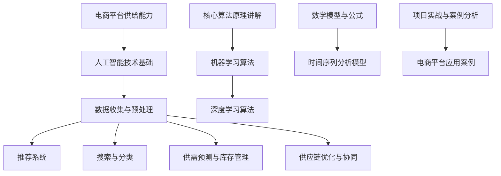

### 第一部分：引言与核心概念

#### 第1章：电商平台供给能力概述

##### 1.1 电商平台供给能力的定义

电商平台供给能力是指电商平台在满足用户需求方面的综合能力，包括商品推荐、商品搜索、供需预测、库存管理、供应链优化等方面。供给能力的强弱直接影响电商平台的用户满意度、销售业绩和市场竞争力。

##### 1.2 人工智能在电商中的应用价值

人工智能技术在电商领域的应用具有显著的价值，主要体现在以下几个方面：

1. **个性化推荐**：通过分析用户行为数据，人工智能技术可以为用户提供个性化的商品推荐，提高用户满意度和购物体验。
2. **商品搜索与分类**：利用自然语言处理和机器学习算法，电商平台可以实现更精准的商品搜索和分类，提高用户查找商品的效率。
3. **供需预测与库存管理**：通过时间序列分析和机器学习算法，电商平台可以准确预测市场需求，优化库存管理，降低库存成本。
4. **供应链优化与协同**：人工智能技术可以帮助电商平台优化供应链管理，实现供应链各环节的高效协同，提高物流效率和降低成本。

##### 1.3 本书结构概述

本书分为三个部分，共九章。第一部分引言与核心概念，包括第1章和第2章，主要介绍电商平台供给能力的定义、人工智能在电商中的应用价值，以及人工智能技术的基础知识。第二部分供给能力提升，包括第3章至第7章，详细探讨人工智能技术在产品推荐、商品搜索与分类、供需预测与库存管理、供应链优化与协同等领域的应用。第三部分案例研究，包括第8章和第9章，通过实际案例分析，展示人工智能技术如何提升电商平台的供给能力和运营效率。最后，第9章对未来人工智能在电商领域的发展趋势和挑战进行展望。

### 第二部分：供给能力提升

#### 第2章：人工智能技术基础

##### 2.1 机器学习基础

机器学习是人工智能的核心技术之一，它通过算法和统计模型从数据中学习规律，并自动改进性能。机器学习主要分为监督学习、无监督学习和强化学习三种类型。

###### 2.1.1 监督学习与无监督学习

**监督学习**是一种有标注数据的学习方法，其目标是通过已知的输入和输出，学习出一个函数，能够预测新的输入对应的输出。常见的监督学习算法包括线性回归、逻辑回归、决策树、支持向量机等。

```latex
\text{线性回归公式：} y = \beta_0 + \beta_1x
```

**无监督学习**则是没有预定义输出标签的学习方法，其目标是发现数据中的隐含结构或模式。常见的无监督学习算法包括聚类、主成分分析（PCA）、自编码器等。

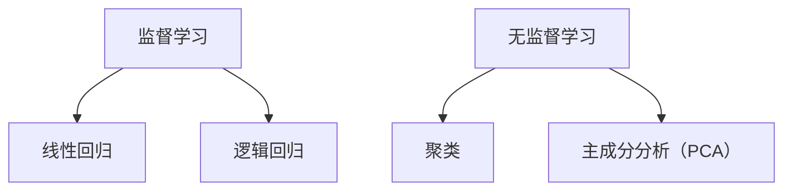

###### 2.1.2 决策树与支持向量机

**决策树**是一种常用的分类和回归算法，它通过一系列规则将数据进行分割，以预测目标变量的值。决策树的学习过程包括特征选择、节点分裂和叶节点生成等。

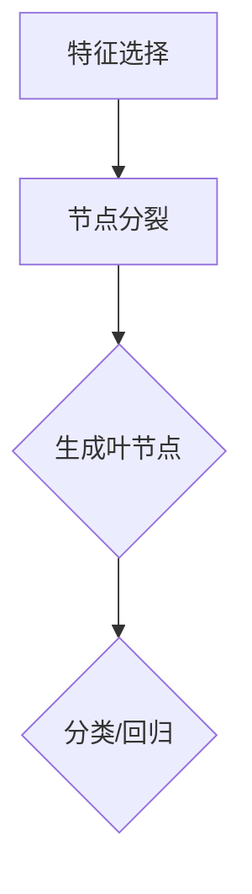

**支持向量机（SVM）**是一种强大的分类算法，它通过找到一个超平面，将数据空间划分为两个类别。SVM的核心是求解最优超平面，即找到最大间隔边界。

```latex
\text{SVM公式：} \max \frac{1}{2} \sum_{i=1}^{n} (w \cdot w) - \sum_{i=1}^{n} C \cdot \max(0, 1 - (y_i \cdot (w \cdot x_i + b)))
```

###### 2.1.3 神经网络与深度学习

**神经网络**是一种模拟人脑结构和功能的计算模型，它由多个神经元组成，通过加权连接形成网络结构。神经网络的核心是前向传播和反向传播算法，用于计算输出和更新权重。

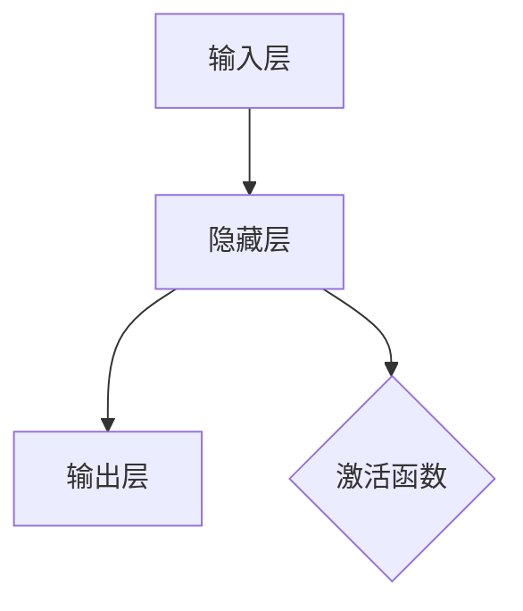

**深度学习**是神经网络的一种扩展，它通过堆叠多层神经网络，实现了对复杂数据的建模和处理。深度学习在图像识别、语音识别、自然语言处理等领域取得了显著成果。

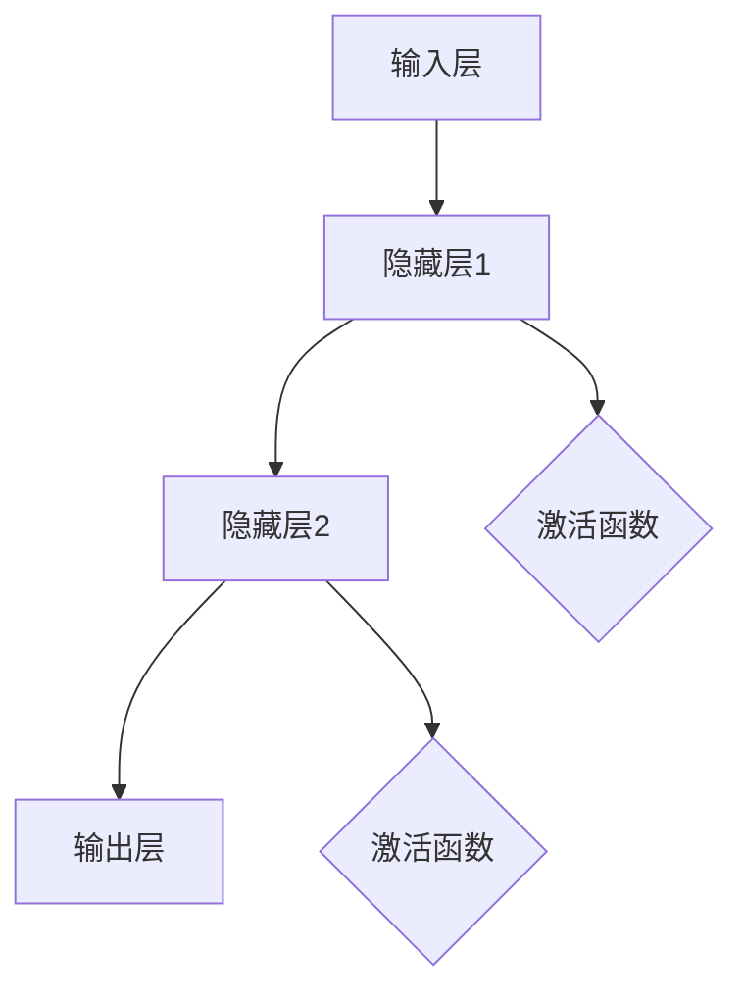

##### 2.2 自然语言处理基础

自然语言处理（NLP）是人工智能的重要分支，它旨在使计算机理解和处理自然语言。NLP主要包括词嵌入、序列模型、注意力机制和转换器架构等方面。

###### 2.2.1 词嵌入技术

词嵌入是将词语映射为固定长度的向量表示，以便计算机可以处理和计算。常见的词嵌入技术包括Word2Vec、GloVe和BERT等。

```latex
\text{Word2Vec公式：} \vec{w}_i = \frac{\sum_{j \in C} \vec{v}_j \cdot \vec{e}_{ij}}{\sum_{j \in C} \|\vec{v}_j\|^2}
```

###### 2.2.2 序列模型与注意力机制

**序列模型**是一种用于处理时间序列数据的模型，如循环神经网络（RNN）和长短时记忆网络（LSTM）。序列模型可以捕捉数据中的时间依赖关系。

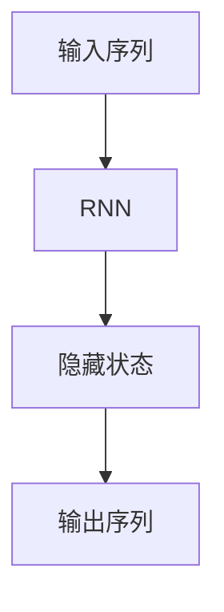

**注意力机制**是一种用于捕捉重要信息的方法，它通过加权的方式关注序列中的不同部分。注意力机制在机器翻译、文本摘要和推荐系统中得到了广泛应用。

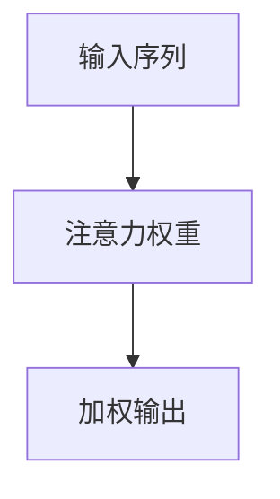

###### 2.2.3 转换器架构详解

**转换器架构**（Transformer）是一种基于自注意力机制的深度学习模型，它在序列到序列任务中表现出色。转换器架构由编码器和解码器组成，通过多头自注意力机制和位置编码，实现高效的序列建模。

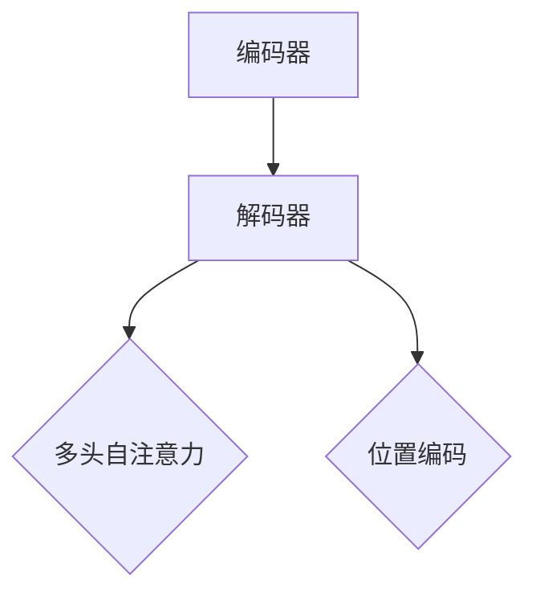

### 第三部分：案例研究

#### 第3章：电商平台数据概述

##### 3.1 数据收集与预处理

在构建电商平台供给能力提升的模型时，数据收集与预处理是至关重要的一步。数据收集主要包括用户行为数据、商品数据和外部数据等。以下是对这些数据的具体说明和预处理方法：

###### 3.1.1 用户行为数据

用户行为数据包括用户的浏览记录、购买记录、搜索历史、评价和反馈等。这些数据可以从电商平台的后台日志中获取。

1. **数据收集**：通过电商平台的后台日志收集用户行为数据。
2. **数据预处理**：对用户行为数据进行清洗，去除缺失值、重复值和异常值，并进行数据编码。

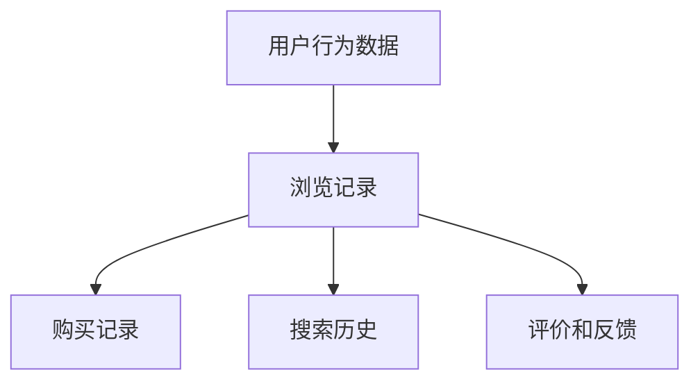

###### 3.1.2 商品数据

商品数据包括商品的属性信息，如商品ID、类别、价格、库存量、销量、评价等。

1. **数据收集**：通过电商平台的数据库或第三方数据源获取商品数据。
2. **数据预处理**：对商品数据进行清洗，去除缺失值、重复值和异常值，并进行数据编码。

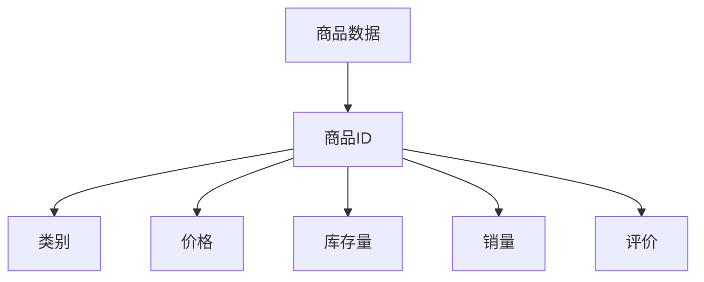

###### 3.1.3 外部数据

外部数据包括市场趋势、用户画像、竞争对手数据等。

1. **数据收集**：通过第三方数据源或公共数据平台获取外部数据。
2. **数据预处理**：对外部数据进行清洗，去除缺失值、重复值和异常值，并进行数据编码。

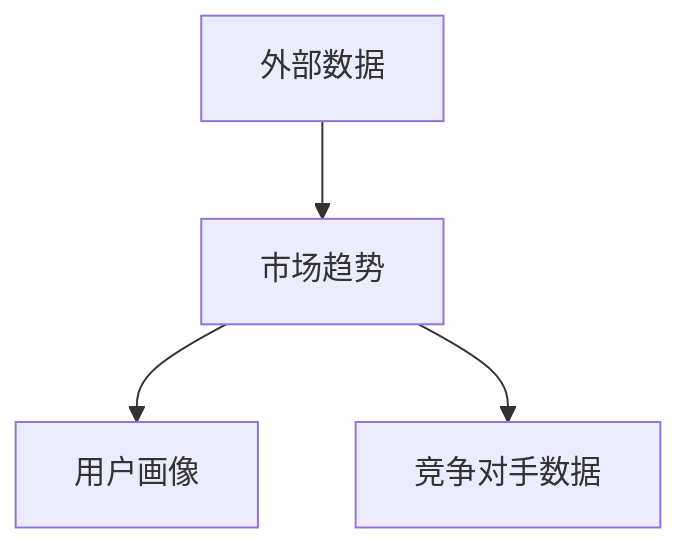

##### 3.2 数据可视化与分析

数据可视化与分析是理解数据特征、发现数据模式的重要手段。以下是对数据可视化和分析的具体方法：

###### 3.2.1 数据可视化

数据可视化可以帮助我们直观地理解数据分布、趋势和关系。常用的数据可视化工具包括Matplotlib、Seaborn和Plotly等。

```python
import matplotlib.pyplot as plt
import seaborn as sns

# 绘制用户行为数据的分布图
sns.histplot(user_data['behavior_count'], bins=30)
plt.xlabel('Behavior Count')
plt.ylabel('Frequency')
plt.title('User Behavior Distribution')

# 绘制商品数据的分布图
sns.scatterplot(x=item_data['price'], y=item_data['sales_count'])
plt.xlabel('Price')
plt.ylabel('Sales Count')
plt.title('Item Price vs Sales Count')

plt.show()
```

###### 3.2.2 数据分析

数据分析包括描述性统计分析、关联分析、聚类分析和分类分析等。

1. **描述性统计分析**：计算数据的均值、中位数、标准差等统计量，以了解数据的基本特征。
2. **关联分析**：通过计算变量之间的相关性，发现数据之间的关联关系。
3. **聚类分析**：通过聚类算法，将数据划分为不同的组，以发现数据中的隐含结构。
4. **分类分析**：通过分类算法，将数据划分为不同的类别，以发现数据的分类规律。

```python
# 计算描述性统计分析
user_data.describe()

# 计算变量之间的相关性
correlation_matrix = user_data.corr()
sns.heatmap(correlation_matrix, annot=True)
plt.title('User Data Correlation Matrix')

# 聚类分析
from sklearn.cluster import KMeans

kmeans = KMeans(n_clusters=5)
user_data['cluster'] = kmeans.fit_predict(user_data[['behavior_count', 'rating_mean']])
sns.scatterplot(x=user_data['behavior_count'], y=user_data['rating_mean'], hue=user_data['cluster'])
plt.xlabel('Behavior Count')
plt.ylabel('Rating Mean')
plt.title('User Data Clustering')

# 分类分析
from sklearn.model_selection import train_test_split
from sklearn.ensemble import RandomForestClassifier

X_train, X_test, y_train, y_test = train_test_split(user_data[['behavior_count', 'rating_mean']], user_data['cluster'], test_size=0.3, random_state=42)
clf = RandomForestClassifier(n_estimators=100)
clf.fit(X_train, y_train)
predictions = clf.predict(X_test)

from sklearn.metrics import classification_report
print(classification_report(y_test, predictions))
```

##### 3.3 数据质量评估与清洗

数据质量直接影响模型的性能和可靠性。以下是对数据质量评估与清洗的具体方法：

###### 3.3.1 数据质量标准

数据质量标准包括完整性、准确性、一致性、及时性和可靠性等。

1. **完整性**：数据应包含所需的所有字段，无缺失值。
2. **准确性**：数据应真实、可靠，无错误。
3. **一致性**：数据在不同时间点应保持一致，无矛盾。
4. **及时性**：数据应更新及时，无过时数据。
5. **可靠性**：数据来源可靠，无虚假数据。

```python
# 检查数据完整性
missing_values = user_data.isnull().sum()
print(missing_values[missing_values > 0])

# 填补缺失值
user_data.fillna(method='ffill', inplace=True)

# 检查数据准确性
# 假设我们有一个评价字段，应确保评价在0到5之间
user_data = user_data[user_data['rating'] >= 0]
user_data = user_data[user_data['rating'] <= 5]

# 检查数据一致性
# 假设我们有两个时间字段，应确保时间顺序一致
user_data = user_data.sort_values(by=['timestamp1', 'timestamp2'])

# 删除过时数据
max_days = 365
current_date = datetime.datetime.now()
user_data['days_since_last_activity'] = (current_date - user_data['last_activity']).dt.days
user_data = user_data[user_data['days_since_last_activity'] <= max_days]
```

### 第二部分：供给能力提升

#### 第4章：产品推荐系统

##### 4.1 推荐系统概述

产品推荐系统是电商平台供给能力提升的重要组成部分，它通过分析用户行为数据，为用户推荐个性化的商品，从而提高用户满意度和销售转化率。

推荐系统可以分为基于内容的推荐和基于协同过滤的推荐两种类型。基于内容的推荐主要根据商品的属性信息进行推荐，而基于协同过滤的推荐则主要根据用户的历史行为和偏好进行推荐。

##### 4.2 内容推荐与协同过滤推荐

###### 4.2.1 内容推荐

内容推荐主要通过分析商品的属性信息，如商品类别、价格、品牌等，为用户推荐相似的商品。内容推荐的方法包括基于属性匹配和基于机器学习模型。

1. **基于属性匹配**：通过计算用户当前浏览或购买的商品与数据库中其他商品的属性相似度，为用户推荐相似的商品。

```python
from sklearn.metrics.pairwise import cosine_similarity

# 假设我们有一个商品属性矩阵A，用户当前浏览或购买的商品为a
A = np.array([[1, 0, 1], [1, 1, 0], [0, 1, 1], [1, 1, 1]])
a = np.array([1, 1, 0])

# 计算商品属性相似度
similarity_scores = cosine_similarity([a], A)
recommended_items = np.argsort(similarity_scores[0])[::-1][1:]  # 排除当前商品本身

print(recommended_items)
```

2. **基于机器学习模型**：通过训练分类或回归模型，根据商品的属性预测用户可能喜欢的商品。

```python
from sklearn.model_selection import train_test_split
from sklearn.ensemble import RandomForestClassifier

# 假设我们有一个商品属性矩阵X，用户标签矩阵Y
X = np.array([[1, 0, 1], [1, 1, 0], [0, 1, 1], [1, 1, 1]])
Y = np.array([1, 0, 1, 0])

# 划分训练集和测试集
X_train, X_test, Y_train, Y_test = train_test_split(X, Y, test_size=0.3, random_state=42)

# 训练分类模型
clf = RandomForestClassifier(n_estimators=100)
clf.fit(X_train, Y_train)

# 预测用户可能喜欢的商品
predicted_items = clf.predict(X_test)

print(predicted_items)
```

###### 4.2.2 协同过滤推荐

协同过滤推荐主要通过分析用户的历史行为和偏好，为用户推荐其他用户喜欢的商品。协同过滤推荐的方法包括基于用户和基于物品。

1. **基于用户**：为用户推荐与其他用户相似的用户喜欢的商品。

```python
# 假设我们有一个用户行为矩阵R，用户当前的行为记录为r
R = np.array([[1, 0, 1], [0, 1, 0], [1, 1, 1], [1, 0, 1]])
r = np.array([1, 0, 1])

# 计算用户行为相似度
user_similarity = cosine_similarity(R)

# 为用户推荐相似用户喜欢的商品
neighbor_users = np.argsort(user_similarity[0])[::-1][1:]  # 排除当前用户本身
neighbor_ratings = R[neighbor_users]
recommended_items = np.argsort(neighbor_ratings.mean(axis=0))[::-1][1:]  # 排除当前用户已评分的商品

print(recommended_items)
```

2. **基于物品**：为用户推荐与其他用户喜欢的商品相似的物品。

```python
# 假设我们有一个物品行为矩阵R，用户当前的行为记录为r
R = np.array([[1, 0, 1], [0, 1, 0], [1, 1, 1], [1, 0, 1]])
r = np.array([1, 0, 1])

# 计算物品行为相似度
item_similarity = cosine_similarity(R.T)

# 为用户推荐相似物品
neighbor_items = np.argsort(item_similarity[0])[::-1][1:]  # 排除当前用户已评分的商品
neighbor_ratings = R[:, neighbor_items]
recommended_items = np.argsort(neighbor_ratings.mean(axis=1))[::-1][1:]  # 排除当前用户已评分的商品

print(recommended_items)
```

##### 4.3 推荐系统评价标准

评价推荐系统的性能通常使用准确率、召回率、覆盖率和多样性等指标。

1. **准确率**：预测推荐列表中实际喜欢的商品的比例。

```python
from sklearn.metrics import accuracy_score

# 假设我们有一个测试集的标签矩阵Y_test和预测推荐列表predicted_items
Y_test = np.array([1, 0, 1, 1])
predicted_items = np.array([1, 0, 1, 1])

accuracy = accuracy_score(Y_test, predicted_items)
print("Accuracy:", accuracy)
```

2. **召回率**：实际喜欢的商品被预测推荐的比例。

```python
from sklearn.metrics import recall

