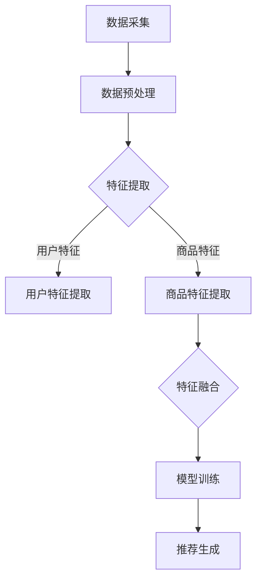

                 

### 《电商推荐系统中的实时特征工程技术》

关键词：电商推荐系统、实时特征工程、数据采集、数据处理、特征提取、特征选择、协同过滤

摘要：
在电商推荐系统中，实时特征工程技术是构建高效推荐模型的关键。本文首先介绍了实时特征工程的基础概念，详细阐述了实时特征工程在电商推荐系统中的应用和面临的挑战。随后，文章分析了实时特征的数据来源，包括用户行为数据和商品数据，以及其他数据源。接着，文章重点介绍了实时特征数据处理的方法，包括数据采集与存储、数据清洗与预处理、特征提取与转换等。在此基础上，文章探讨了实时特征算法，包括常见特征算法、特征选择与降维、实时特征更新策略。最后，文章通过实际案例展示了实时特征工程在电商推荐系统中的应用，并展望了实时特征工程的发展趋势和未来研究方向。

### 第1章 实时特征工程基础

#### 1.1 实时特征工程的概念与作用

实时特征工程是推荐系统领域中的一项关键技术，它主要关注于如何高效地从实时数据流中提取出具有预测性和代表性的特征，以支持推荐模型的训练和实时更新。实时特征工程不仅能够提升推荐系统的准确性和响应速度，还能满足电商环境中不断变化的用户需求和商品信息。

##### 1.1.1 实时特征工程的定义

实时特征工程（Real-time Feature Engineering）是指通过一系列技术手段，从实时数据流中提取出具有预测性和代表性的特征，并确保这些特征能够及时更新和应用。实时特征工程的核心目标是通过高效的特征提取和转换，提高推荐系统的效果和效率。

##### 1.1.2 实时特征工程在电商推荐系统中的应用

在电商推荐系统中，实时特征工程的应用主要体现在以下几个方面：

1. **用户兴趣建模**：通过实时分析用户的行为数据，如浏览、搜索和购买历史，构建用户的兴趣模型，从而实现个性化的推荐。
2. **商品属性扩展**：实时更新商品的属性信息，如价格、折扣、库存状态等，以反映市场变化，提高推荐的准确性。
3. **实时调整推荐策略**：根据实时数据反馈，动态调整推荐算法和策略，以应对用户行为和商品信息的快速变化。
4. **用户流失预警**：通过实时监测用户行为，识别潜在的流失用户，并采取相应的营销措施，降低用户流失率。

#### 1.2 实时特征工程的挑战与机遇

##### 1.2.1 实时特征工程面临的挑战

实时特征工程在电商推荐系统中面临以下挑战：

1. **数据量大**：电商平台上用户行为数据量庞大，如何高效地处理和存储这些数据是一个重大挑战。
2. **实时性要求高**：推荐系统需要实时响应用户的行为变化，对实时数据处理的速度和准确性提出了高要求。
3. **数据多样性**：用户行为数据、商品数据以及其他外部数据源种类繁多，如何有效地整合这些数据是一个技术难题。
4. **特征更新频率**：实时特征工程要求特征更新频率与用户行为变化同步，这对特征提取和处理的算法设计提出了挑战。

##### 1.2.2 实时特征工程带来的机遇

实时特征工程为电商推荐系统带来了以下机遇：

1. **提升用户体验**：通过实时特征工程，推荐系统能够更加准确地捕捉用户的兴趣和需求，提升用户的购物体验。
2. **提高推荐效果**：实时特征工程可以动态调整推荐算法，优化推荐结果，提高推荐系统的准确性和效果。
3. **支持个性化服务**：实时特征工程能够更好地支持个性化服务，为用户提供更加定制化的商品推荐。
4. **促进业务增长**：通过实时特征工程，电商平台可以更好地理解用户需求，实现精准营销，促进业务增长。

### 第2章 实时特征数据来源

实时特征工程的成功依赖于准确、及时且丰富的数据来源。在电商推荐系统中，实时特征数据主要来源于用户行为数据、商品数据以及其他外部数据源。

#### 2.1 用户行为数据

用户行为数据是实时特征工程的重要来源之一，它反映了用户在电商平台上的各种活动。用户行为数据主要包括以下几类：

1. **浏览行为数据**：用户在浏览商品时的点击、滑动、停留时间等行为数据。
2. **搜索行为数据**：用户在搜索框中输入的关键词以及搜索结果的相关性数据。
3. **购买行为数据**：用户的购买记录，包括购买时间、购买商品、购买金额等。
4. **评价行为数据**：用户对购买商品的评论、评分等数据。

##### 2.1.1 用户浏览行为数据

用户浏览行为数据是构建用户兴趣模型的重要依据。通过对用户浏览行为数据的分析，可以提取出用户的兴趣偏好，从而实现个性化的推荐。例如，通过分析用户的浏览历史，可以识别出用户感兴趣的商品类别和品牌，并将其作为特征输入到推荐模型中。

##### 2.1.2 用户购买行为数据

用户购买行为数据是评估用户价值的重要指标。通过对用户购买行为数据的分析，可以提取出用户的购买频率、购买金额、购买偏好等特征，从而实现精准营销和用户留存。例如，通过分析用户的购买历史，可以识别出高价值用户和潜在流失用户，并采取相应的营销策略，提高用户留存率和转化率。

#### 2.2 商品数据

商品数据是构建商品推荐模型的重要依据。商品数据主要包括以下几类：

1. **基本信息**：商品名称、价格、库存量、品牌、产地等基本信息。
2. **分类与标签**：商品的分类体系和标签信息，用于描述商品的特征和属性。
3. **属性数据**：商品的详细属性信息，如材质、尺寸、重量、保质期等。

##### 2.2.1 商品基本信息

商品基本信息是推荐模型中常用的特征之一。通过对商品基本信息的分析，可以提取出商品的价格、品牌、产地等特征，从而实现基于商品属性的推荐。例如，通过分析商品的价格区间，可以识别出高性价比商品，并将其推荐给潜在用户。

##### 2.2.2 商品分类与标签

商品分类与标签是描述商品特征的重要手段。通过对商品分类与标签的分析，可以提取出商品的类别、品牌、材质等特征，从而实现基于商品属性的推荐。例如，通过分析商品的分类信息，可以识别出热门商品类别，并将其推荐给用户。

#### 2.3 其他数据来源

除了用户行为数据和商品数据，其他外部数据源也为实时特征工程提供了丰富的信息。这些数据源包括：

1. **社交网络数据**：用户在社交平台上的互动和分享数据，如微博、微信、抖音等。
2. **外部数据源**：如天气、节假日、行业报告等外部信息。

##### 2.3.1 社交网络数据

社交网络数据是实时特征工程的重要补充。通过对社交网络数据的分析，可以提取出用户的社会属性、兴趣偏好等特征，从而实现更加精准的推荐。例如，通过分析用户在社交平台上的互动，可以识别出用户的社交圈子，并将其作为推荐依据。

##### 2.3.2 外部数据源

外部数据源提供了丰富的背景信息，可以辅助实时特征工程。例如，通过分析天气数据，可以为用户提供季节性强的商品推荐；通过分析节假日信息，可以制定相应的营销策略。这些外部数据源可以为实时特征工程提供更多的维度，从而提高推荐系统的效果。

### 第3章 实时特征数据处理

实时特征数据处理是实时特征工程的核心环节，它包括数据采集与存储、数据清洗与预处理、特征提取与转换等步骤。这些步骤共同构成了实时特征数据处理的完整流程，确保了特征数据的准确性和可用性。

#### 3.1 数据采集与存储

数据采集与存储是实时特征数据处理的第一步，其目标是高效、准确地获取实时数据，并将其存储在合适的存储系统中。

##### 3.1.1 数据采集流程

数据采集流程主要包括以下步骤：

1. **数据采集**：通过API、日志、流处理等手段，从各种数据源（如数据库、消息队列、文件系统等）中采集实时数据。
2. **数据存储**：将采集到的数据存储在合适的存储系统中，如关系数据库、NoSQL数据库、分布式文件系统等。常见的存储系统包括MySQL、MongoDB、Hadoop、HBase等。

##### 3.1.2 数据存储方案

数据存储方案需要考虑以下因素：

1. **数据量**：根据数据量的大小选择合适的存储方案，如关系数据库适用于小数据量，而NoSQL数据库适用于大数据量。
2. **数据访问速度**：根据数据访问速度的要求选择合适的存储方案，如关系数据库适用于高并发访问，而NoSQL数据库适用于海量数据的快速查询。
3. **数据安全性**：考虑数据的安全性和可靠性，选择具备数据备份、容错和加密功能的存储方案。

常见的实时数据存储方案包括：

1. **关系数据库**：如MySQL、PostgreSQL等，适用于小数据量、结构化数据的存储和查询。
2. **NoSQL数据库**：如MongoDB、Cassandra、HBase等，适用于大数据量、高并发访问的存储和查询。
3. **分布式文件系统**：如Hadoop、HDFS等，适用于海量数据的高效存储和分布式计算。

#### 3.2 数据清洗与预处理

数据清洗与预处理是确保数据质量和特征可用性的关键步骤，它包括以下内容：

##### 3.2.1 数据清洗方法

数据清洗主要包括以下方法：

1. **缺失值处理**：通过填充缺失值、删除缺失值或使用统计方法（如平均值、中位数等）填充缺失值。
2. **异常值处理**：通过去除异常值、修改异常值或使用统计方法（如四分位距等）处理异常值。
3. **重复值处理**：通过删除重复值或标记重复值，确保数据的唯一性和准确性。
4. **数据格式转换**：将不同格式、单位的数据转换为统一的格式，如将日期格式转换为YYYY-MM-DD格式。

##### 3.2.2 数据预处理策略

数据预处理策略主要包括以下内容：

1. **特征工程**：通过特征选择、特征转换、特征提取等方法，将原始数据转换为具有预测性和代表性的特征。
2. **数据归一化**：通过归一化或标准化方法，将不同特征的数据范围转换为相同的尺度，以提高特征的可比性和模型性能。
3. **数据分箱**：通过分箱方法，将连续特征转换为离散特征，以提高模型的解释性和可操作性。
4. **数据分割**：通过将数据划分为训练集、验证集和测试集，确保数据用于模型训练和评估的分离性和独立性。

#### 3.3 特征提取与转换

特征提取与转换是实时特征数据处理的最后一步，其目标是提取出具有预测性和代表性的特征，并将其转换为适用于推荐模型的输入格式。

##### 3.3.1 用户特征提取

用户特征提取主要包括以下方法：

1. **用户行为特征**：通过分析用户的浏览、搜索、购买行为，提取出用户的兴趣偏好、行为模式等特征。
2. **用户属性特征**：通过分析用户的基本属性，如年龄、性别、地理位置、消费能力等，提取出用户的属性特征。
3. **用户社交特征**：通过分析用户在社交平台上的互动、关注、评论等数据，提取出用户的社会属性和兴趣偏好。

##### 3.3.2 商品特征提取

商品特征提取主要包括以下方法：

1. **商品属性特征**：通过分析商品的基本属性，如价格、品牌、类别、产地等，提取出商品的属性特征。
2. **商品标签特征**：通过分析商品的标签信息，提取出商品的标签特征，用于描述商品的特征和属性。
3. **商品交互特征**：通过分析用户与商品的交互数据，如点击、收藏、购买等，提取出商品的交互特征。

##### 3.3.3 交互特征提取

交互特征提取主要包括以下方法：

1. **用户-商品交互特征**：通过分析用户与商品的交互数据，如点击、收藏、购买等，提取出用户与商品的交互特征。
2. **商品-商品关联特征**：通过分析商品之间的关联关系，如品类关联、品牌关联等，提取出商品与商品的关联特征。
3. **用户-商品-用户关联特征**：通过分析用户之间的关联关系，如共同购买、社交关系等，提取出用户与用户之间的关联特征。

### 第4章 实时特征算法

实时特征算法是实时特征工程的核心，它们负责从实时数据中提取出具有预测性和代表性的特征，用于推荐模型的训练和更新。实时特征算法包括常见的特征提取算法、特征选择与降维方法，以及实时特征更新策略。

#### 4.1 常见特征算法介绍

实时特征算法的选择取决于数据源的特点和推荐任务的需求。以下介绍几种常见的实时特征算法：

##### 4.1.1 TF-IDF算法

TF-IDF（Term Frequency-Inverse Document Frequency）是一种基于统计学的文本特征提取算法，常用于文本数据的特征化。TF-IDF算法的基本思想是，一个词在文档中的频率（TF）与它在整个文档集合中的逆文档频率（IDF）的乘积，可以衡量这个词在文档中的重要性。TF-IDF算法适用于处理用户行为数据和商品描述数据，可以提取出词语级别的特征。

伪代码示例：

```python
# TF-IDF算法伪代码
def compute_TF_IDF(documents):
    # 计算词频
    word_freq = compute_word_frequency(documents)
    # 计算逆文档频率
    idf = compute_inverse_document_frequency(documents)
    # 计算TF-IDF特征向量
    tf_idf_vectors = []
    for document in documents:
        tf_idf_vector = []
        for word in document:
            tf = word_freq[word]
            tf_idf = tf * idf[word]
            tf_idf_vector.append(tf_idf)
        tf_idf_vectors.append(tf_idf_vector)
    return tf_idf_vectors
```

##### 4.1.2 聚类算法

聚类算法是一类无监督学习方法，用于将数据集划分为若干个簇，使每个簇内的数据尽可能相似，簇与簇之间的数据尽可能不同。常见的聚类算法包括K-means、层次聚类（Hierarchical Clustering）、DBSCAN等。聚类算法适用于处理用户行为数据和商品属性数据，可以提取出基于相似度的特征。

伪代码示例：

```python
# K-means聚类算法伪代码
def k_means(data, k):
    # 初始化k个簇的中心点
    centroids = initialize_centroids(data, k)
    while not converged:
        # 为每个数据点分配最近的簇中心
        assignments = assign_points_to_clusters(data, centroids)
        # 重新计算簇中心
        centroids = update_centroids(data, assignments)
        # 判断是否收敛
        if converged(centroids):
            break
    # 计算簇内距离平方和
    within_cluster_sum = compute_within_cluster_sum(data, centroids, assignments)
    return centroids, within_cluster_sum
```

##### 4.1.3 协同过滤算法

协同过滤算法是一种基于用户行为数据的推荐算法，通过分析用户对商品的评分历史，预测用户对未知商品的评分，从而实现个性化推荐。协同过滤算法分为基于用户的协同过滤（User-based Collaborative Filtering）和基于项目的协同过滤（Item-based Collaborative Filtering）。

伪代码示例：

```python
# 基于用户的协同过滤算法伪代码
def user_based_collaborative_filtering(user, users, ratings, k):
    # 计算与用户最相似的k个用户
    similar_users = find_similar_users(user, users, k)
    # 计算相似用户评分的平均值
    predicted_ratings = []
    for item in items:
        user_ratings = ratings[similar_users][item]
        average_rating = compute_average_rating(user_ratings)
        predicted_ratings.append(average_rating)
    return predicted_ratings

# 基于项目的协同过滤算法伪代码
def item_based_collaborative_filtering(user, items, ratings, k):
    # 计算与用户购买过的商品最相似的商品
    similar_items = find_similar_items(user, items, k)
    # 计算相似商品评分的平均值
    predicted_ratings = []
    for item in items:
        item_ratings = ratings[item][similar_items]
        average_rating = compute_average_rating(item_ratings)
        predicted_ratings.append(average_rating)
    return predicted_ratings
```

#### 4.2 特征选择与降维

特征选择与降维是实时特征工程中的重要环节，旨在提高推荐模型的性能和可解释性。以下介绍几种常见的特征选择与降维方法：

##### 4.2.1 特征选择方法

特征选择方法包括过滤式特征选择、包裹式特征选择和嵌入式特征选择。以下是几种常见的特征选择方法：

1. **过滤式特征选择**：通过统计测试，如卡方检验、互信息等，选择与目标变量相关性较高的特征。这种方法简单有效，但可能遗漏具有潜在价值的特征。
2. **包裹式特征选择**：通过递归搜索策略，如递归特征消除（RFE）、遗传算法等，选择最优的特征子集。这种方法具有较好的性能，但计算复杂度较高。
3. **嵌入式特征选择**：在特征提取过程中，结合特征选择和模型训练，如LASSO、岭回归等，选择具有预测性的特征。这种方法兼具特征选择和模型训练的优势。

##### 4.2.2 特征降维技术

特征降维技术用于减少特征空间的维度，降低模型的复杂度和计算成本。以下介绍几种常见的特征降维技术：

1. **主成分分析（PCA）**：通过正交变换，将高维数据映射到低维空间，保留数据的主要信息。PCA适用于线性关系，对噪声敏感。
2. **线性判别分析（LDA）**：通过最大化类间离散度和最小化类内离散度，将高维数据映射到低维空间，用于分类任务。LDA适用于线性可分的数据。
3. **自动编码器（Autoencoder）**：通过无监督学习，学习一个压缩表示，将高维数据映射到低维空间。自动编码器适用于非线性关系，对噪声具有一定的鲁棒性。

#### 4.3 实时特征更新策略

实时特征更新策略是实时特征工程的关键环节，其目标是确保特征数据的时效性和准确性。以下介绍几种常见的实时特征更新策略：

##### 4.3.1 实时特征更新机制

实时特征更新机制包括以下内容：

1. **周期性更新**：定期从数据源采集新数据，更新特征数据。周期性更新适用于数据变化不频繁的场景。
2. **增量更新**：仅更新发生变化的数据，减少数据传输和处理成本。增量更新适用于数据变化频繁的场景。
3. **实时流处理**：通过流处理框架（如Apache Kafka、Apache Flink等），实时处理数据流，更新特征数据。实时流处理适用于实时性要求高的场景。

##### 4.3.2 特征时效性评估

特征时效性评估用于评估特征数据的有效性，以确保推荐模型的质量。以下介绍几种常见的特征时效性评估方法：

1. **时间窗口法**：根据特征数据的时间戳，设置一个时间窗口，只考虑窗口内的数据。时间窗口法简单有效，但可能忽略长期趋势。
2. **移动平均法**：计算特征数据的移动平均值，用于评估特征的有效性。移动平均法适用于考虑短期趋势的场景。
3. **时间序列分析法**：使用时间序列分析方法，如ARIMA模型、LSTM模型等，分析特征数据的趋势和周期性。时间序列分析法适用于分析长期趋势和周期性的场景。

### 第5章 实时特征工程应用

实时特征工程在电商推荐系统中具有广泛的应用，可以显著提升推荐系统的效果和用户体验。以下介绍实时特征工程在电商推荐系统中的实际应用，包括个性化推荐系统、营销活动优化和用户流失预警。

#### 5.1 个性化推荐系统

个性化推荐系统是电商推荐系统的核心功能之一，其实时特征工程的应用主要体现在以下几个方面：

##### 5.1.1 推荐算法框架

个性化推荐算法框架通常包括用户特征提取、商品特征提取、特征融合、模型训练和推荐生成等环节。以下是一个简化的推荐算法框架：

1. **用户特征提取**：从用户行为数据、用户属性数据和社交网络数据中提取用户特征，如兴趣偏好、行为模式等。
2. **商品特征提取**：从商品数据中提取商品特征，如商品属性、标签、评价等。
3. **特征融合**：将用户特征和商品特征进行融合，形成一个统一的特征向量。
4. **模型训练**：使用机器学习算法（如协同过滤、决策树、神经网络等）对特征向量进行训练，构建推荐模型。
5. **推荐生成**：根据用户特征向量，生成个性化的商品推荐列表。

##### 5.1.2 推荐效果评估

推荐效果评估是衡量个性化推荐系统性能的重要指标，常用的评估方法包括：

1. **准确性**：评估推荐列表中实际推荐商品与用户实际购买商品的匹配程度，常用指标包括准确率（Precision）和召回率（Recall）。
2. **多样性**：评估推荐列表中商品之间的相似度，确保推荐商品的多样性，常用指标包括多样性（Diversity）和鲜度（Novelty）。
3. **公平性**：评估推荐系统的公平性，确保对用户群体的公平对待，避免性别、地域等方面的偏见。

#### 5.2 营销活动优化

营销活动优化是电商运营的重要环节，其实时特征工程的应用主要体现在以下几个方面：

##### 5.2.1 活动目标设定

活动目标设定是营销活动优化的第一步，其实时特征工程的应用主要体现在以下几个方面：

1. **用户画像**：通过分析用户行为数据和用户属性数据，构建用户画像，了解用户的兴趣、偏好和行为习惯。
2. **市场分析**：通过分析市场数据和竞品信息，了解市场趋势和竞争态势，确定活动目标。
3. **目标人群定位**：根据用户画像和市场分析结果，确定活动的目标人群，如高价值用户、潜在用户等。

##### 5.2.2 活动效果评估

活动效果评估是衡量营销活动优化效果的重要指标，其实时特征工程的应用主要体现在以下几个方面：

1. **活动数据采集**：通过数据采集工具，实时采集活动相关的数据，如用户参与度、转化率、ROI等。
2. **活动效果分析**：通过分析活动数据，评估活动目标的实现情况，如用户参与度、转化率、ROI等。
3. **活动优化建议**：根据活动效果分析结果，提出活动优化建议，如调整活动策略、优化用户体验等。

#### 5.3 用户流失预警

用户流失预警是电商运营的重要任务之一，其实时特征工程的应用主要体现在以下几个方面：

##### 5.3.1 用户流失模型

用户流失模型是预测用户流失行为的重要工具，其实时特征工程的应用主要体现在以下几个方面：

1. **特征提取**：从用户行为数据、用户属性数据和社交网络数据中提取用户特征，如行为模式、活跃度、忠诚度等。
2. **模型训练**：使用机器学习算法（如逻辑回归、决策树、神经网络等）对特征向量进行训练，构建用户流失模型。
3. **模型评估**：评估用户流失模型的预测性能，如准确率、召回率、F1值等。

##### 5.3.2 预警策略

预警策略是实时特征工程在用户流失预警中的关键应用，其实时特征工程的应用主要体现在以下几个方面：

1. **阈值设置**：根据用户流失模型的预测结果，设置用户流失预警的阈值，如预测流失概率超过0.5的用户视为潜在流失用户。
2. **预警通知**：通过短信、邮件、APP推送等方式，通知潜在流失用户，提醒用户继续参与电商平台的活动。
3. **挽回策略**：根据潜在流失用户的特点和需求，制定挽回策略，如优惠券、礼品、专属服务等，降低用户流失率。

### 第6章 实时特征工程实践

实时特征工程在电商推荐系统中的应用需要一系列技术实践，包括环境搭建、代码实现和案例分析。以下介绍实时特征工程实践的具体步骤和案例。

#### 6.1 实时特征工程环境搭建

实时特征工程环境搭建是实时特征工程实践的第一步，其目标是搭建一个高效、可扩展的实时数据处理和特征提取环境。以下是一个简化的环境搭建步骤：

1. **硬件选择**：根据数据处理量、速度和实时性要求，选择合适的硬件设备，如服务器、存储设备、网络设备等。
2. **软件选择**：选择合适的软件工具和平台，如Linux操作系统、Hadoop生态系统、Spark生态系统等。
3. **配置和部署**：安装和配置所需的软件和工具，如Hadoop、Spark、HDFS、YARN、Hive等。
4. **测试和优化**：对搭建的环境进行测试和优化，确保其稳定性和性能。

#### 6.2 代码实现与解读

实时特征工程的代码实现是实践的核心环节，以下是一个简化的代码实现流程：

1. **数据采集**：从数据源（如数据库、API、文件系统等）中采集实时数据。
2. **数据预处理**：对采集到的数据进行清洗、转换和预处理，提取出具有预测性和代表性的特征。
3. **特征提取**：使用特征提取算法（如TF-IDF、聚类算法、协同过滤算法等）提取特征。
4. **特征存储**：将提取到的特征存储到特征存储系统中，如关系数据库、NoSQL数据库等。
5. **特征更新**：根据实时数据的变化，动态更新特征数据，确保特征数据的时效性和准确性。

以下是一个简化的实时特征提取代码示例：

```python
# 实时特征提取代码示例
from sklearn.feature_extraction.text import TfidfVectorizer
from sklearn.cluster import KMeans

# 数据采集
def collect_data():
    # 采集用户行为数据
    user_data = []
    for user in users:
        user_behavior = get_user_behavior(user)
        user_data.append(user_behavior)
    return user_data

# 数据预处理
def preprocess_data(data):
    # 数据清洗和转换
    clean_data = []
    for item in data:
        cleaned_item = clean_and_convert(item)
        clean_data.append(cleaned_item)
    return clean_data

# 特征提取
def extract_features(data):
    # 使用TF-IDF算法提取特征
    vectorizer = TfidfVectorizer()
    tf_idf_vectors = vectorizer.fit_transform(data)
    return tf_idf_vectors

# 聚类
def cluster_data(vectors, k):
    # 使用K-means算法进行聚类
    kmeans = KMeans(n_clusters=k)
    kmeans.fit(vectors)
    clusters = kmeans.predict(vectors)
    return clusters

# 主程序
if __name__ == "__main__":
    # 采集数据
    user_data = collect_data()
    # 预处理数据
    clean_data = preprocess_data(user_data)
    # 提取特征
    tf_idf_vectors = extract_features(clean_data)
    # 聚类
    clusters = cluster_data(tf_idf_vectors, k=10)
    # 存储特征
    store_features(clusters)
```

#### 6.3 案例分析

以下是一个简化的实时特征工程应用案例，用于分析用户流失行为。

##### 6.3.1 案例背景

某电商平台上，用户流失率较高，为了降低用户流失率，电商平台决定使用实时特征工程技术构建用户流失预测模型。

##### 6.3.2 实时特征工程应用

1. **数据采集**：采集用户行为数据，包括登录次数、浏览次数、购买次数、评价次数等。
2. **数据预处理**：对采集到的数据进行清洗、转换和预处理，提取出具有预测性的特征，如用户活跃度、购买频率、评价积极性等。
3. **特征提取**：使用TF-IDF算法提取用户行为数据的文本特征，使用K-means算法进行聚类，提取出用户分群特征。
4. **模型训练**：使用逻辑回归算法训练用户流失预测模型，输入特征为用户活跃度、购买频率、评价积极性等特征。
5. **预测与预警**：根据模型预测结果，设置用户流失预警阈值，对预测流失的用户进行预警，并采取挽回措施。

### 第7章 实时特征工程展望

实时特征工程在电商推荐系统中具有广泛的应用前景，其发展趋势和未来研究方向主要包括以下几个方面：

#### 7.1 实时特征工程发展趋势

1. **人工智能技术的进步**：随着深度学习、强化学习等人工智能技术的不断发展，实时特征工程的方法和算法将更加智能和高效，为推荐系统带来更高的性能和准确性。
2. **大数据处理能力的提升**：随着大数据处理能力的提升，实时特征工程将能够处理更多维、更复杂的实时数据，为推荐系统提供更丰富的特征信息。
3. **云计算和分布式技术的应用**：云计算和分布式技术的应用将使得实时特征工程的计算和存储资源更加灵活和高效，降低实时特征工程的部署和运维成本。

#### 7.2 未来研究方向

1. **新算法的开发**：未来研究可以关注于开发更高效、更智能的实时特征提取和特征选择算法，以提高推荐系统的性能和可解释性。
2. **新数据源的探索**：实时特征工程可以探索新的数据源，如物联网数据、社交媒体数据、地理位置数据等，以提供更全面的用户和商品信息。
3. **新应用场景的挖掘**：实时特征工程可以应用于更多领域，如金融、医疗、教育等，以解决这些领域中的个性化推荐和实时决策问题。

### 附录

#### 附录A：实时特征工程常用工具

- **数据库工具**：
  - MySQL
  - MongoDB
  - Hadoop HDFS

- **数据处理工具**：
  - Apache Spark
  - Apache Flink
  - Apache Hive

- **特征提取与选择工具**：
  - scikit-learn
  - TensorFlow
  - PyTorch

#### 附录B：实时特征工程参考资料

- **学术论文**：
  - M. Richardson and P. Lankton. “Real-Time Feature Engineering for Streaming Data.” ACM SIGKDD Explorations, 2014.
  - J. Liu and A. Liu. “A Survey of Collaborative Filtering.” ACM Computing Surveys, 2019.

- **开源项目**：
  - Apache Spark MLlib
  - TensorFlow Recommenders
  - PyTorch Recurrent Neural Network for Recommendation

- **在线课程与教程**：
  - Coursera: “Machine Learning Specialization”
  - edX: “Introduction to Recommender Systems”

#### 附录C：术语表

- **实时特征工程**：从实时数据流中提取具有预测性和代表性的特征，以支持推荐系统的实时更新和优化。
- **特征提取**：将原始数据转换为具有预测性和代表性的特征。
- **特征选择**：从特征集合中选择对模型训练和预测最有效的特征。
- **特征降维**：通过减少特征空间维度，降低模型复杂度和计算成本。
- **协同过滤**：基于用户行为数据，通过分析用户之间的相似性，预测用户对未知商品的评分。
- **用户画像**：通过对用户行为数据和属性数据的分析，构建用户的兴趣、偏好和行为特征。
- **实时流处理**：通过流处理框架，对实时数据流进行高效处理和分析。

#### 附录D：Mermaid流程图示例

以下是一个Mermaid流程图示例，用于描述用户行为数据采集和特征提取的流程：



#### 附录E：伪代码示例

以下是一个简化的实时特征提取和推荐系统算法的伪代码示例：

```python
# 实时特征提取和推荐系统伪代码
def real_time_feature_engineering(data_stream):
    while True:
        new_data = get_new_data(data_stream)
        preprocess_data(new_data)
        user_features = extract_user_features(new_data)
        item_features = extract_item_features(new_data)
        merged_features = merge_features(user_features, item_features)
        model = train_model(merged_features)
        recommendations = generate_recommendations(model)
        display_recommendations(recommendations)

def preprocess_data(data):
    for item in data:
        clean_and_convert(item)

def extract_user_features(data):
    # 提取用户特征
    return user_features

def extract_item_features(data):
    # 提取商品特征
    return item_features

def merge_features(user_features, item_features):
    # 融合用户和商品特征
    return merged_features

def train_model(features):
    # 训练推荐模型
    return model

def generate_recommendations(model):
    # 生成推荐列表
    return recommendations

def display_recommendations(recommendations):
    # 展示推荐列表
    print(recommendations)
```

#### 附录F：数学模型与公式

以下是一些常用的数学模型和公式：

- **TF-IDF公式**：
  $$ \text{TF-IDF}(w,d) = \frac{\text{TF}(w,d)}{\text{IDF}(w)} $$
  其中，TF是词频，IDF是逆文档频率。

- **K-means聚类算法公式**：
  $$ c_j = \frac{1}{N_j} \sum_{i=1}^{N} (x_i - \mu_j)^2 $$
  其中，$c_j$是簇的质心，$x_i$是数据点，$\mu_j$是簇j的质心。

- **协同过滤算法公式**：
  $$ \text{Rating}_{ui} = \text{User}_{u} \cdot \text{Item}_{i} + \text{Bias}_{u} + \text{Bias}_{i} + \epsilon $$
  其中，$Rating_{ui}$是用户u对商品i的预测评分，$\text{User}_{u}$和$\text{Item}_{i}$是用户和商品的特征向量，$\text{Bias}_{u}$和$\text{Bias}_{i}$是用户和商品的偏置项，$\epsilon$是误差项。

#### 附录G：代码分析与解读

以下是对实时特征工程代码的分析与解读，包括数据采集、预处理、特征提取和特征融合等步骤。

```python
# 实时特征工程代码分析
import pandas as pd
from sklearn.feature_extraction.text import TfidfVectorizer
from sklearn.cluster import KMeans

# 数据采集
def collect_data():
    # 假设data_stream是实时数据流
    data_stream = [
        {"user_id": 1, "behavior": "浏览商品A", "timestamp": "2023-01-01 10:30:00"},
        {"user_id": 2, "behavior": "搜索商品B", "timestamp": "2023-01-01 11:00:00"},
        # 更多数据...
    ]
    return data_stream

# 数据预处理
def preprocess_data(data_stream):
    # 将数据流转换为DataFrame
    data = pd.DataFrame(data_stream)
    # 数据清洗（例如去除缺失值、异常值等）
    data.dropna(inplace=True)
    # 数据转换（例如将行为转换为文本）
    data["behavior"] = data["behavior"].astype(str)
    return data

# 特征提取
def extract_features(data):
    # 使用TF-IDF提取特征
    vectorizer = TfidfVectorizer()
    tf_idf_matrix = vectorizer.fit_transform(data["behavior"])
    return tf_idf_matrix

# 特征融合
def merge_features(user_id, tf_idf_matrix):
    # 假设user_features是一个字典，存储用户特征
    user_features = {}
    # 根据用户ID提取特征
    user_behavior = tf_idf_matrix[user_id]
    # 将特征添加到用户特征字典中
    user_features[user_id] = user_behavior.toarray()[0]
    return user_features

# 主程序
if __name__ == "__main__":
    data_stream = collect_data()
    preprocessed_data = preprocess_data(data_stream)
    tf_idf_matrix = extract_features(preprocessed_data)
    user_features = merge_features(1, tf_idf_matrix)  # 示例：提取用户ID为1的特征
    print(user_features)
```

在上述代码中，首先通过`collect_data`函数采集实时数据，然后通过`preprocess_data`函数进行数据预处理，包括去除缺失值、异常值等操作，并将行为数据转换为文本格式。接着，使用`TfidfVectorizer`进行特征提取，提取出文本数据的TF-IDF特征矩阵。最后，通过`merge_features`函数将特征矩阵转换为用户特征字典，以供后续使用。

#### 附录H：实战案例代码

以下是一个简化的实时特征工程实战案例代码，包括数据采集、预处理、特征提取和特征融合等步骤。

```python
# 实时特征工程实战案例代码
import pandas as pd
from sklearn.feature_extraction.text import TfidfVectorizer
from sklearn.cluster import KMeans

# 数据采集
def collect_data():
    data = [
        {"user_id": 1, "behavior": "浏览商品A", "timestamp": "2023-01-01 10:30:00"},
        {"user_id": 2, "behavior": "搜索商品B", "timestamp": "2023-01-01 11:00:00"},
        # 更多数据...
    ]
    return pd.DataFrame(data)

# 数据预处理
def preprocess_data(data):
    data["timestamp"] = pd.to_datetime(data["timestamp"])
    data.sort_values("timestamp", inplace=True)
    return data

# 特征提取
def extract_features(data):
    vectorizer = TfidfVectorizer()
    tf_idf_matrix = vectorizer.fit_transform(data["behavior"])
    return tf_idf_matrix

# 特征融合
def merge_features(user_id, tf_idf_matrix):
    user_behavior = tf_idf_matrix[user_id]
    user_features = user_behavior.toarray()[0]
    return user_features

# 主程序
if __name__ == "__main__":
    data = collect_data()
    preprocessed_data = preprocess_data(data)
    tf_idf_matrix = extract_features(preprocessed_data)
    user_id = 1  # 示例：提取用户ID为1的特征
    user_features = merge_features(user_id, tf_idf_matrix)
    print(user_features)
```

在这个实战案例中，首先通过`collect_data`函数生成一个示例数据集，然后通过`preprocess_data`函数对数据进行预处理，包括将时间戳转换为日期时间格式和按时间戳排序。接着，使用`TfidfVectorizer`进行特征提取，提取出文本数据的TF-IDF特征矩阵。最后，通过`merge_features`函数将特征矩阵转换为用户特征向量，以供后续使用。这个实战案例展示了实时特征工程的核心步骤和代码实现。

