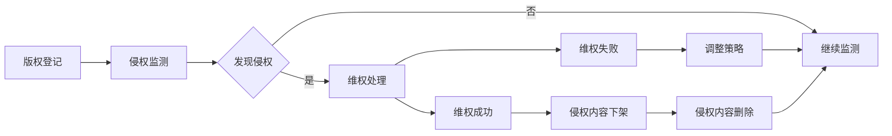
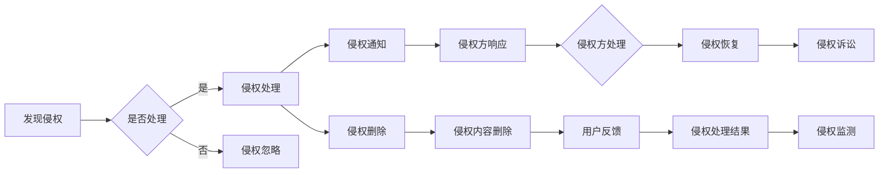

                 

### 文章标题

# 知识付费创业中的内容版权保护

### 关键词：
- 内容版权保护
- 知识付费
- 版权侵权
- 数字版权管理
- 法律体系
- 技术手段

### 摘要：
本文旨在深入探讨知识付费创业中的内容版权保护问题。通过对知识付费和内容版权保护的核心概念、法律体系、技术手段以及实际案例的详细分析，本文旨在为知识付费创业者提供一套全面且实用的版权保护策略。文章涵盖了从基础概念到技术实现的各个方面，为读者提供了一场关于内容版权保护的深度思考和实践指南。

## 引言

在数字化时代，知识付费已经成为一种重要的商业模式。知识付费平台通过提供高质量、专业的知识产品，为用户带来价值，同时也为内容创作者提供了收益来源。然而，随着知识付费市场的迅速发展，内容版权保护问题日益凸显。一方面，知识付费平台面临着内容原创者版权保护的需求；另一方面，平台自身也需要防范侵权风险，确保自身业务合法合规。

内容版权保护不仅是知识付费创业者面临的一大挑战，也是维护市场秩序、保障知识创作者权益的关键所在。本文将围绕这一主题，详细探讨知识付费创业中的内容版权保护问题。首先，我们将介绍知识付费和内容版权保护的相关概念，并分析其核心联系。接着，本文将深入探讨内容版权保护的法律体系，包括版权法的基本原则、法律条款以及版权纠纷的解决途径。随后，我们将介绍各种内容版权保护的技术手段，如数字版权管理（DRM）、区块链技术等。最后，本文将通过实际案例，分析知识付费创业中的版权保护策略，并提出一些建议和展望。

## 第一部分：知识付费与内容版权保护概述

### 1.1 知识付费的兴起与市场前景

#### 1.1.1 知识付费的定义

知识付费是指用户为了获取专业、高质量的知识内容，愿意支付一定费用的一种商业模式。这种模式的核心在于将知识转化为产品或服务，通过直接交易实现知识的价值传递。

知识付费可以追溯到互联网早期，但真正兴起是在移动互联网和智能手机普及之后。随着用户对知识的渴求日益增长，以及内容创作和传播技术的进步，知识付费市场迎来了爆发式增长。

#### 1.1.2 知识付费的发展历程

知识付费的发展可以分为以下几个阶段：

1. **萌芽期**：2005年至2010年，以博客、论坛、网络课程等形式为主，知识付费初现端倪。
2. **发展期**：2011年至2015年，以网易云课堂、腾讯课堂等在线教育平台为代表，知识付费逐渐形成规模。
3. **成熟期**：2016年至今，以得到、知乎Live、喜马拉雅等为代表的平台，通过专业内容、互动体验等手段，大幅提升了知识付费的普及率和用户粘性。

#### 1.1.3 知识付费的市场前景

知识付费市场的快速发展，得益于以下几个因素：

1. **用户需求**：随着社会经济的发展和人们生活水平的提高，用户对高质量知识的渴求不断增长。
2. **技术进步**：互联网、大数据、人工智能等技术的发展，为知识付费提供了强大的技术支撑。
3. **商业模式创新**：知识付费平台通过多元化、个性化的内容和服务，不断满足用户需求，拓展市场空间。

据相关数据显示，我国知识付费市场规模逐年扩大，预计未来几年仍将保持高速增长。这为知识付费创业者提供了广阔的市场前景。

### 1.2 内容版权保护的重要性

#### 1.2.1 版权保护的意义

版权保护是指在法律框架内，对创作者的智力成果进行保护，防止他人未经授权擅自使用、复制、传播等行为。版权保护对于知识付费创业者和整个市场具有重要意义：

1. **保障创作者权益**：版权保护能够确保创作者的智力成果得到应有的尊重和回报，激发创作热情。
2. **维护市场秩序**：版权保护有助于防止侵权行为，维护公平竞争的市场环境，促进知识付费市场的健康发展。
3. **提升内容质量**：版权保护鼓励原创内容的生产和传播，有助于提升整个市场的知识水平和内容质量。

#### 1.2.2 版权侵权的风险

版权侵权是指未经授权擅自使用他人作品的行为。在知识付费领域，版权侵权风险主要体现在以下几个方面：

1. **直接经济损失**：侵权行为可能导致原创者失去应得的收益，甚至无法收回成本。
2. **品牌形象受损**：侵权行为可能导致用户对平台的信任度下降，影响品牌形象和用户留存率。
3. **法律风险**：侵权行为可能导致诉讼、罚款等法律后果，给企业带来严重的经济损失和信誉风险。

#### 1.2.3 版权保护的方法与策略

为了有效防范版权侵权风险，知识付费创业者可以采取以下版权保护方法与策略：

1. **版权登记**：将作品进行版权登记，获取法律保护。
2. **版权监测**：使用技术手段监测侵权行为，及时发现和处理侵权内容。
3. **版权协议**：与内容创作者签订版权协议，明确双方的权利和义务。
4. **版权维权**：在侵权事件发生时，采取法律手段维护自身权益。

### 1.3 版权保护的法律体系

#### 1.3.1 版权法的概念与原则

版权法，又称著作权法，是国家制定的关于著作权保护的法律规范。其主要概念包括：

1. **著作权**：创作者对其作品享有的专有权利。
2. **版权**：著作权的简称，包括著作权中的财产权和人身权。

版权法的基本原则包括：

1. **著作权自动保护原则**：作品一经创作完成，即自动享有版权保护，无需进行登记或发表。
2. **著作权独立原则**：不同类型的作品，如文字、音乐、美术等，各自享有独立的版权保护。
3. **著作权永久保护原则**：版权保护期限通常从作品创作完成之日起计算，具有一定的永久性。

#### 1.3.2 版权保护的法律条款

版权法对版权的保护范围、权利限制、侵权行为等方面进行了详细规定。主要条款包括：

1. **保护范围**：包括文字作品、音乐、戏剧、电影、摄影、工程设计等。
2. **权利内容**：包括复制权、发行权、出租权、表演权、改编权等。
3. **权利限制**：包括合理使用、法定许可等。
4. **侵权行为**：包括未经授权的复制、发行、出租、表演等行为。

#### 1.3.3 版权纠纷的解决途径

在版权纠纷发生时，主要有以下几种解决途径：

1. **协商解决**：通过双方协商达成和解。
2. **调解解决**：通过调解组织或专业机构进行调解。
3. **诉讼解决**：通过法院诉讼解决纠纷。

#### 1.4 知识付费创业中的版权保护实践

#### 1.4.1 创业中的版权保护难点

在知识付费创业过程中，版权保护面临以下难点：

1. **版权意识不足**：一些创业者对版权保护的重要性认识不足，容易忽视版权问题。
2. **版权登记难度**：版权登记流程较为复杂，部分创业者可能不愿或无法进行登记。
3. **侵权监测困难**：侵权行为隐蔽，监测和取证难度较大。
4. **维权成本高**：维权过程耗时费力，且成本较高，一些创业者可能因此放弃维权。

#### 1.4.2 版权保护策略的应用

为了应对上述难点，知识付费创业者可以采取以下版权保护策略：

1. **版权登记**：及时对原创内容进行版权登记，获取法律保护。
2. **版权协议**：与内容创作者签订明确的版权协议，确保内容的合法使用。
3. **侵权监测**：使用技术手段进行侵权监测，及时发现和处理侵权内容。
4. **维权支持**：提供维权支持，鼓励创作者积极维权。

#### 1.4.3 版权保护的成功案例与启示

通过分析一些成功的知识付费案例，我们可以得到以下启示：

1. **重视版权保护**：成功案例中的企业都高度重视版权保护，将其作为企业发展战略的重要组成部分。
2. **创新版权保护手段**：这些企业通过技术创新，如数字版权管理、区块链等，提高了版权保护的效果。
3. **加强合作与沟通**：成功案例中的企业积极与创作者、法律机构等合作，共同维护版权权益。

总之，知识付费创业中的版权保护是一项系统工程，需要创业者从多个方面进行全面考虑和布局。只有在有效保护版权的基础上，知识付费企业才能实现可持续发展。

### 附录 A: 知识付费与版权保护相关的法律法规

#### A.1 主要法律法规介绍

1. **著作权法**：我国著作权法是关于著作权保护的基本法律，规定了著作权的基本原则、权利内容、侵权行为等。

2. **知识产权法**：知识产权法是对包括著作权在内的各种知识产权进行保护的法律体系。

3. **互联网著作权行政保护办法**：针对互联网环境下的著作权保护，规定了著作权行政保护的具体措施和程序。

4. **信息网络传播权保护条例**：规定了信息网络传播权的保护范围、侵权行为及法律责任。

5. **计算机软件保护条例**：对计算机软件的著作权保护进行了具体规定。

#### A.2 版权纠纷案例解析

1. **案例一：某知名知识付费平台被诉侵权**

   某知名知识付费平台因未经授权使用他人课程内容，被原作者起诉。法院最终认定平台构成侵权，判令平台赔偿原作者经济损失。

   **案例分析**：此案例表明，知识付费平台在内容获取和使用过程中，必须重视版权问题，避免侵权行为。

2. **案例二：某自媒体博主被诉侵权**

   某自媒体博主因未经授权转载他人文章，被原作者起诉。法院认定博主构成侵权，判令其删除侵权内容并赔偿原作者损失。

   **案例分析**：此案例提醒自媒体创作者，在内容创作和传播过程中，要遵守版权法律法规，尊重他人知识产权。

3. **案例三：某企业对竞争对手提起版权诉讼**

   某企业因认为竞争对手抄袭其商业计划书，对其提起版权诉讼。法院最终认定竞争对手构成侵权，判令其停止侵权行为并赔偿原告损失。

   **案例分析**：此案例说明，企业应重视自身知识产权保护，及时采取法律手段维护合法权益。

### 附录 B: 知识付费与版权保护实用工具推荐

#### B.1 版权保护工具概述

1. **版权监测工具**：用于监测和识别侵权行为，及时发现和处理侵权内容。

2. **版权登记平台**：提供版权登记服务，帮助创作者进行版权登记和保护。

3. **版权维权平台**：为创作者提供维权支持，协助其维权和法律诉讼。

#### B.2 工具使用指南

1. **版权监测工具使用指南**：

   - 注册账号并登录平台；
   - 添加需要监测的内容；
   - 设置监测关键词和监测范围；
   - 查看监测结果和处理侵权内容。

2. **版权登记平台使用指南**：

   - 注册账号并登录平台；
   - 选择作品类型和作品名称；
   - 上传作品文件和填写相关信息；
   - 完成登记并获取版权证书。

3. **版权维权平台使用指南**：

   - 注册账号并登录平台；
   - 提交维权申请；
   - 查看维权进度和结果；
   - 获取维权支持和法律援助。

### 结论

知识付费创业中的内容版权保护是一项重要且复杂的任务。通过本文的详细分析，我们了解到知识付费的兴起与市场前景、内容版权保护的重要性、法律体系、技术手段以及实际案例。对于知识付费创业者来说，只有高度重视版权保护，采取有效的策略和措施，才能在激烈的市场竞争中立于不败之地。同时，我们也期待未来在技术、法律等多方面的创新，为知识付费创业中的版权保护提供更完善的支持。

## 第二部分：内容版权保护的核心概念与联系

### 2.1 版权基础知识

#### 2.1.1 著作权的定义与范围

著作权，也称为版权，是指创作者对其智力成果所享有的专有权利。著作权通常包括以下几个方面的权利：

1. **复制权**：即复制作品的权利，包括以各种形式复制作品，如印刷、复印、录音、录像等。
2. **发行权**：即以出售或者赠与方式向公众提供作品的原件或者复制品的权利。
3. **出租权**：即有偿许可他人临时使用电影作品和以类似摄制电影的方法创作的作品、计算机软件的权利，计算机软件不是出租的主要标的的除外。
4. **表演权**：即公开表演作品，以及用各种手段公开播送作品的表演的权利。
5. **展览权**：即公开陈列美术作品、摄影作品的原件或者复制件的权利。
6. **改编权**：即改变作品，创作出具有独创性的新作品的权利。
7. **翻译权**：即将原作品从一种语言文字转换成另一种语言文字的权利。
8. **汇编权**：即将作品或者作品的片段通过选择或者编排，汇集成新作品的权利。

#### 2.1.2 著作权的分类

著作权根据不同的标准可以有不同的分类方法，常见的分类包括：

1. **按作品类型分类**：包括文字作品、音乐作品、戏剧作品、美术作品、摄影作品、电影作品等。
2. **按创作主体分类**：包括个人创作者、法人或者其他组织创作者。
3. **按权利主体分类**：包括原始著作权人和继受著作权人。

#### 2.1.3 著作权的保护期限

著作权的保护期限因不同类型的作品而异，通常包括以下几种情况：

1. **公民的作品**：公民的作品，其保护期为作者终生及其死亡后50年，截止于作者死亡后第50年的12月31日。
2. **法人或者其他组织创作的作品**：法人或者其他组织创作的作品，如电影作品和以类似摄制电影的方法创作的作品，其发表权、本法第10条第1款第（五）项至第（十七）项规定的权利的保护期为50年，截止于作品首次发表后第50年的12月31日，但作品自创作完成后50年内未发表的，不再保护。
3. **摄影作品**：摄影作品的保护期为50年，截止于作品首次发表后第50年的12月31日，但作品自创作完成后50年内未发表的，不再保护。

### 2.2 版权侵权形式与识别

#### 2.2.1 版权侵权的常见形式

版权侵权行为主要包括以下几种形式：

1. **未经授权的复制**：未经著作权人许可，擅自复制著作权人的作品。
2. **未经授权的发行**：未经著作权人许可，擅自发行著作权人的作品，包括通过网络传播。
3. **未经授权的表演**：未经著作权人许可，擅自公开表演著作权人的作品。
4. **未经授权的展示**：未经著作权人许可，擅自展示著作权人的美术作品、摄影作品等。
5. **未经授权的改编**：未经著作权人许可，擅自改编著作权人的作品。
6. **未经授权的翻译**：未经著作权人许可，擅自翻译著作权人的作品。
7. **未经授权的汇编**：未经著作权人许可，擅自汇编著作权人的作品。

#### 2.2.2 识别版权侵权的方法

识别版权侵权的方法主要包括：

1. **关键词搜索**：通过搜索引擎查找相关作品，对比涉嫌侵权的内容与原作品是否相似。
2. **内容比对**：将涉嫌侵权的内容与原作品进行逐字逐句的比对，判断是否存在抄袭、复制等行为。
3. **版权登记查询**：通过版权登记机构查询作品是否已经登记，判断涉嫌侵权内容是否属于合法使用。

#### 2.2.3 版权侵权案例分析

以下为几个典型的版权侵权案例：

1. **案例一**：某知名网络文学平台未经授权转载他人小说，被原作者起诉。法院认定平台构成侵权，判令其停止侵权行为并赔偿经济损失。

   **案例分析**：此案例表明，网络平台在转载他人作品时，必须严格遵守版权法律法规，避免侵权行为。

2. **案例二**：某知名音乐平台未经授权播放他人音乐作品，被原作者起诉。法院认定平台构成侵权，判令其停止侵权行为并赔偿原作者经济损失。

   **案例分析**：此案例说明，音乐平台在播放音乐作品时，必须获得著作权人的授权，否则可能面临侵权风险。

3. **案例三**：某自媒体博主未经授权转载他人文章，被原作者起诉。法院认定博主构成侵权，判令其删除侵权内容并赔偿原作者经济损失。

   **案例分析**：此案例提醒自媒体创作者，在转载他人作品时，必须遵守版权法律法规，避免侵权行为。

### 2.3 版权保护与侵权法律救济

#### 2.3.1 版权侵权法律救济途径

当著作权人的权益受到侵害时，可以采取以下法律救济途径：

1. **协商解决**：著作权人与侵权方进行协商，争取和解。
2. **调解解决**：通过调解组织或第三方调解机构进行调解。
3. **仲裁解决**：将争议提交仲裁机构进行仲裁。
4. **诉讼解决**：通过法院诉讼解决纠纷。

#### 2.3.2 版权维权流程

版权维权的流程通常包括以下几个步骤：

1. **收集证据**：收集涉嫌侵权的内容和相关证据，包括侵权链接、截图、视频等。
2. **发送维权通知**：向侵权方发送维权通知，要求其停止侵权行为并赔偿损失。
3. **协商或调解**：在收到维权通知后，侵权方可能会采取行动，如删除侵权内容、赔偿损失等。
4. **诉讼**：如协商无果，著作权人可以选择通过法院诉讼解决纠纷。

#### 2.3.3 版权纠纷解决机制

版权纠纷的解决机制主要包括：

1. **行政解决**：通过著作权行政管理部门进行调解或行政处罚。
2. **民事解决**：通过法院诉讼解决版权纠纷。
3. **刑事解决**：对于严重的侵权行为，可以通过刑事手段追究侵权人的刑事责任。

### 2.4 知识付费与版权保护的关联性

#### 2.4.1 知识付费中的版权风险

知识付费模式中，版权风险主要表现在以下几个方面：

1. **内容侵权**：知识付费平台使用未经授权的内容，可能构成侵权行为。
2. **版权争议**：知识付费平台与内容创作者之间的版权归属、授权范围等存在争议。
3. **侵权赔偿**：侵权行为可能导致著作权人追究侵权方的法律责任，要求赔偿损失。

#### 2.4.2 版权保护对知识付费的影响

版权保护对知识付费的影响主要体现在以下几个方面：

1. **保障创作者权益**：版权保护确保了创作者的智力成果得到应有的回报，提高了创作积极性。
2. **提高内容质量**：版权保护鼓励原创内容的生产和传播，有助于提高知识付费平台的内容质量。
3. **降低侵权风险**：版权保护有助于降低知识付费平台因侵权行为导致的法律风险和商业损失。

#### 2.4.3 版权保护在知识付费中的具体应用

知识付费中的版权保护具体应用包括：

1. **版权登记**：知识付费平台应鼓励创作者进行版权登记，获取法律保护。
2. **版权协议**：知识付费平台与内容创作者签订明确的版权协议，明确双方的权利和义务。
3. **侵权监测**：知识付费平台应使用技术手段进行侵权监测，及时发现和处理侵权内容。
4. **维权支持**：知识付费平台应为创作者提供维权支持，协助其维权和法律诉讼。

### 2.5 内容版权保护与技术创新的关系

#### 2.5.1 技术创新对版权保护的影响

技术创新在版权保护中发挥着重要作用，主要体现在以下几个方面：

1. **数字版权管理（DRM）技术**：通过加密、权限控制等技术手段，实现对数字内容的版权保护。
2. **区块链技术**：通过区块链的去中心化和不可篡改性，实现版权的确权和追踪。
3. **人工智能技术**：通过机器学习、图像识别等技术，实现对侵权内容的自动监测和识别。

#### 2.5.2 版权保护与数字版权管理（DRM）

数字版权管理（DRM）技术是一种用于保护数字内容版权的技术手段，其主要功能包括：

1. **加密**：对数字内容进行加密处理，防止未经授权的复制、传播。
2. **权限控制**：根据用户身份、使用场景等，对数字内容的访问和使用进行控制。
3. **追踪与报告**：记录数字内容的访问和使用情况，为版权维权提供数据支持。

#### 2.5.3 版权保护与区块链技术的结合

区块链技术在版权保护中的应用，主要体现在以下几个方面：

1. **版权确权**：通过区块链技术，实现对版权的确权和登记，确保版权信息的真实性。
2. **版权追踪**：通过区块链的分布式账本，实现对版权流转的追踪，提高版权管理的透明度。
3. **维权证据链**：通过区块链技术，构建版权维权的证据链，提高维权效率。

### 附录 A: 版权保护流程图

以下是一个简单的版权保护流程图：

### 附录 B: 版权侵权案例分析

以下为几个典型的版权侵权案例：

1. **案例一**：某知名网络文学平台未经授权转载他人小说，被原作者起诉。法院认定平台构成侵权，判令其停止侵权行为并赔偿经济损失。

   **案例分析**：此案例表明，网络平台在转载他人作品时，必须严格遵守版权法律法规，避免侵权行为。

2. **案例二**：某知名音乐平台未经授权播放他人音乐作品，被原作者起诉。法院认定平台构成侵权，判令其停止侵权行为并赔偿原作者经济损失。

   **案例分析**：此案例说明，音乐平台在播放音乐作品时，必须获得著作权人的授权，否则可能面临侵权风险。

3. **案例三**：某自媒体博主未经授权转载他人文章，被原作者起诉。法院认定博主构成侵权，判令其删除侵权内容并赔偿原作者经济损失。

   **案例分析**：此案例提醒自媒体创作者，在转载他人作品时，必须遵守版权法律法规，避免侵权行为。

## 第三部分：内容版权保护的法律体系与实施

### 3.1 著作权法概述

#### 3.1.1 著作权法的概念与原则

著作权法，又称版权法，是国家制定的关于著作权保护的基本法律规范。其主要目的是保护创作者的著作权，激励文化创新和科技发展。著作权法的基本概念包括：

- **著作权**：是指创作者对其作品享有的权利，包括人身权和财产权。
- **版权**：是著作权的简称，通常指著作财产权，即创作者通过其作品获得的经济利益。
- **邻接权**：是指与著作权相关的其他权利，如表演者权、录音录像制作者权、广播组织权等。

著作权法的基本原则包括：

1. **著作权自动产生原则**：即作品一旦创作完成，即自动享有著作权保护，无需进行登记或发表。
2. **权利平衡原则**：在保护创作者权益的同时，也要考虑公共利益，如合理使用、法定许可等。
3. **国际保护原则**：依据国际条约和双边协议，对海外作品的著作权提供保护。

#### 3.1.2 著作权法的发展历程

著作权法的发展经历了以下几个阶段：

1. **早期著作权法**：以《安娜法》为代表，最早的著作权法旨在保护印刷出版商的利益。
2. **版权法的发展**：19世纪，版权法开始重视创作者的权益，强调作品的原创性和独创性。
3. **现代著作权法**：随着数字技术的发展，著作权法不断更新和完善，如《伯尔尼公约》、《世界知识产权组织版权条约》等。

#### 3.1.3 我国著作权法的主要内容

我国著作权法的主要内容包括：

1. **著作权的取得**：作品创作完成后，作者即享有著作权，无需进行登记。
2. **著作权的内容**：包括人身权（如署名权、修改权）和财产权（如复制权、发行权）。
3. **著作权的限制**：合理使用、法定许可等。
4. **著作权侵权**：包括侵权行为、侵权责任、侵权赔偿等。
5. **著作权管理**：包括著作权登记、著作权合同等。

### 3.2 版权登记与保护

#### 3.2.1 版权登记的定义与作用

版权登记是指著作权人将其作品向国家版权局或其授权的著作权登记机构进行登记，以获得法律保护的行为。版权登记的作用包括：

1. **证据保护**：版权登记可以作为著作权人拥有著作权的有效证据，有利于在发生争议时维权。
2. **维权便利**：版权登记可以简化维权程序，降低维权成本。
3. **提高信用**：版权登记有助于提高企业的信誉，增强市场竞争力。

#### 3.2.2 版权登记的流程与要求

版权登记的流程主要包括以下几个步骤：

1. **作品创作完成**：著作权人完成作品创作。
2. **准备登记材料**：包括作品原件、著作权人身份证明、登记申请表等。
3. **提交申请**：将登记材料提交给国家版权局或其授权的著作权登记机构。
4. **审核与登记**：著作权登记机构对申请材料进行审核，符合条件的作品将被登记。
5. **领取证书**：著作权人领取版权证书。

版权登记的要求主要包括：

1. **作品原创性**：作品应当具有独创性，不能是抄袭或复制品。
2. **内容完整性**：作品应当完整，包括作品的全部内容。
3. **材料真实性**：申请材料应当真实、完整、准确。

#### 3.2.3 版权登记机构与平台介绍

在我国，国家版权局是著作权登记的主管部门，负责全国著作权登记的管理工作。此外，还有一些地方性的著作权登记机构，如各省版权局。除了官方机构，还有一些第三方著作权登记平台，如中国版权保护中心、中国版权服务网等。这些机构或平台为著作权人提供便捷的版权登记服务，帮助著作权人保护其作品。

### 3.3 版权侵权行为的法律责任

#### 3.3.1 版权侵权行为的定义与类型

版权侵权行为是指未经著作权人许可，擅自使用、复制、传播、出租、展示等侵犯著作权人权利的行为。版权侵权行为主要包括以下类型：

1. **直接侵权**：直接侵犯著作权人权利的行为，如未经授权复制作品、传播作品等。
2. **间接侵权**：通过其他手段间接侵犯著作权人权利的行为，如制作、销售侵权复制品等。
3. **共同侵权**：两人以上共同实施的侵权行为，如多人共同传播侵权作品。

#### 3.3.2 版权侵权的法律责任

版权侵权行为的法律责任主要包括以下几方面：

1. **民事责任**：侵权人应当承担停止侵害、赔偿损失等民事责任。
2. **行政责任**：侵权人可能受到行政处罚，如没收侵权复制品、罚款等。
3. **刑事责任**：对于严重侵权行为，侵权人可能面临刑事责任，如被判刑、罚金等。

#### 3.3.3 民事责任与刑事责任的具体规定

根据我国著作权法，版权侵权的民事责任主要包括：

1. **停止侵害**：侵权人应当立即停止侵权行为。
2. **赔偿损失**：侵权人应当赔偿著作权人因侵权行为所遭受的损失。
3. **消除影响**：侵权人应当消除因侵权行为给著作权人带来的不良影响。

刑事责任的具体规定如下：

1. **犯罪主体**：侵犯著作权的行为主体可以是个人，也可以是单位。
2. **犯罪情节**：根据侵权情节严重程度，侵权人可能面临有期徒刑、拘役或罚金等刑罚。
3. **刑罚幅度**：根据《中华人民共和国刑法》的相关规定，对于情节严重的侵权行为，最高可判处三年以下有期徒刑或者拘役，并处或者单处罚金。

### 3.4 版权维权途径与策略

#### 3.4.1 民事诉讼维权

民事诉讼是著作权维权的主要途径之一。著作权人在发现侵权行为后，可以采取以下步骤进行维权：

1. **起诉准备**：收集侵权证据，确定被告，准备起诉状。
2. **起诉**：将起诉状提交给有管辖权的法院，并缴纳诉讼费用。
3. **庭审**：法院组织庭审，著作权人需要出庭应诉。
4. **判决**：法院根据证据和法律，作出判决。如果判决侵权成立，著作权人可以获得侵权赔偿。

#### 3.4.2 行政复议与仲裁

行政复议和仲裁也是著作权维权的重要途径。著作权人在遇到侵权问题时，可以采取以下策略：

1. **行政复议**：对于行政机关的处罚决定不服，可以向上一级行政机关申请复议。
2. **仲裁**：在合同中约定仲裁条款，当发生争议时，可以申请仲裁解决。

#### 3.4.3 诉讼策略与维权技巧

在著作权维权过程中，著作权人可以采取以下策略和技巧：

1. **证据保全**：在维权过程中，证据至关重要。著作权人应当及时保全证据，包括侵权链接、下载记录、通讯记录等。
2. **专业代理**：聘请专业律师代理诉讼，提高维权成功率。
3. **调解协商**：在维权过程中，著作权人可以尝试与侵权方进行调解协商，争取和解。

### 3.5 知识付费平台版权保护实践

#### 3.5.1 知识付费平台版权保护的重要性

知识付费平台在版权保护方面承担着重要责任。一方面，平台需要确保内容创作者的合法权益得到保护；另一方面，平台自身也需要防范侵权风险，避免因侵权行为导致法律纠纷和商业损失。

#### 3.5.2 知识付费平台版权保护策略

知识付费平台可以采取以下策略进行版权保护：

1. **版权登记**：鼓励内容创作者进行版权登记，获取法律保护。
2. **版权协议**：与内容创作者签订版权协议，明确作品授权范围和使用方式。
3. **侵权监测**：使用技术手段进行侵权监测，及时发现和处理侵权内容。
4. **维权支持**：为内容创作者提供维权支持，协助其维权和法律诉讼。

#### 3.5.3 版权保护的成功案例与启示

以下为几个知识付费平台版权保护的成功案例：

1. **案例一**：某知名在线教育平台通过版权监测技术，及时发现并处理了多个侵权课程，有效降低了侵权风险。

   **案例分析**：此案例表明，技术手段在版权保护中发挥着重要作用，通过侵权监测可以有效防范侵权行为。

2. **案例二**：某知识付费平台与内容创作者签订版权协议，明确作品授权范围，确保了内容的合法使用。

   **案例分析**：此案例说明，签订版权协议是知识付费平台进行版权保护的重要措施，有助于明确双方的权利和义务。

3. **案例三**：某知识付费平台为创作者提供维权支持，协助其成功维权，维护了创作者的合法权益。

   **案例分析**：此案例表明，知识付费平台应为创作者提供维权支持，帮助其应对侵权行为。

### 附录 A: 著作权法条款详解

以下是著作权法中一些重要条款的详细解释：

1. **第10条**：关于著作权的具体权利内容。
2. **第22条**：关于著作权的合理使用。
3. **第23条**：关于著作权的许可使用。
4. **第47条**：关于著作权侵权行为。
5. **第48条**：关于著作权侵权的法律责任。

### 附录 B: 版权登记表格与范例

以下是版权登记表格和相关范例：

1. **著作权登记申请表**：用于提交著作权登记申请。
2. **著作权登记证书**：著作权人领取的证书，证明其作品已登记。

### 附录 C: 版权纠纷调解与调解协议范本

以下是版权纠纷调解的流程和调解协议范本：

1. **调解流程**：包括调解申请、调解准备、调解会议、调解协议等环节。
2. **调解协议范本**：用于调解双方达成和解的协议文本。

### 附录 D: 知识付费平台版权保护指南

以下是知识付费平台版权保护的具体指南：

1. **版权登记流程**：知识付费平台如何协助内容创作者进行版权登记。
2. **版权协议模板**：知识付费平台与内容创作者签订的版权协议模板。
3. **侵权监测与处理**：知识付费平台如何进行侵权监测和侵权内容处理。

## 第四部分：内容版权保护的技术手段与创新应用

### 4.1 数字版权管理（DRM）技术

#### 4.1.1 DRM技术的概念与作用

数字版权管理（Digital Rights Management，简称DRM）技术是一种用于保护数字内容版权的技术手段。其主要作用是限制未经授权的用户对数字内容的访问和使用，防止非法复制、传播和盗版行为。

#### 4.1.2 常见的DRM技术分类

根据实现方式的不同，DRM技术可以分为以下几类：

1. **加密技术**：通过对数字内容进行加密处理，使得未经授权的用户无法解密和访问内容。常见的加密技术包括对称加密和非对称加密。
2. **权限控制技术**：通过设置用户权限，控制用户对数字内容的访问和使用。例如，只能在线观看或下载，但无法复制、传播。
3. **追踪与报告技术**：记录数字内容的访问和使用情况，为版权维权提供数据支持。例如，追踪用户的访问记录、使用时长等。

#### 4.1.3 DRM技术的应用场景与案例分析

DRM技术在各种场景下都有广泛的应用，以下为几个典型的应用案例：

1. **在线教育**：知识付费平台使用DRM技术保护在线课程内容，防止用户非法复制和传播。
2. **电子书**：电子书平台使用DRM技术保护电子书内容，确保用户只能在授权设备上阅读。
3. **视频点播**：视频网站使用DRM技术保护视频内容，防止用户非法下载和传播。

### 4.2 区块链技术在版权保护中的应用

#### 4.2.1 区块链技术在版权保护中的优势

区块链技术在版权保护中具有以下优势：

1. **去中心化**：区块链的分布式结构使得版权信息不可篡改，确保版权信息的真实性和透明性。
2. **不可篡改性**：区块链的加密算法确保了版权信息的不可篡改性，防止篡改和伪造。
3. **智能合约**：区块链的智能合约功能可以实现自动执行版权合同，提高版权管理的效率。

#### 4.2.2 基于区块链的版权保护解决方案

基于区块链的版权保护解决方案主要包括以下几个步骤：

1. **版权确权**：通过区块链技术，将版权信息（如创作者、作品信息等）上链，确权并存储。
2. **版权跟踪**：利用区块链的分布式账本，实现对版权流转的实时跟踪和监控。
3. **版权交易**：通过区块链技术，实现版权的在线交易和授权，确保交易的透明性和安全性。

#### 4.2.3 区块链技术在版权保护中的案例分析

以下为几个区块链技术在版权保护中的应用案例：

1. **案例一**：某知名音乐平台使用区块链技术进行版权管理，确保音乐版权信息真实可信，提高版权维权效率。
2. **案例二**：某在线教育平台采用区块链技术保护课程内容，确保用户只能在授权设备上观看，防止非法传播。

### 4.3 版权监测与追踪技术

#### 4.3.1 版权监测技术的概念与作用

版权监测技术是指用于监测和识别侵权内容的技术手段。其主要作用是及时发现和处理侵权行为，保护版权人的合法权益。

#### 4.3.2 版权监测系统的建设与运营

版权监测系统的建设主要包括以下几个步骤：

1. **需求分析**：明确监测目标和要求，如监测范围、监测精度等。
2. **系统设计**：设计监测系统的架构和功能，包括数据采集、处理、分析等模块。
3. **技术选型**：选择合适的监测技术，如关键词搜索、图像识别、机器学习等。
4. **系统部署**：搭建监测系统，进行调试和测试。

版权监测系统的运营主要包括以下几个环节：

1. **数据采集**：定期采集互联网上的侵权内容，如文字、图片、视频等。
2. **数据处理**：对采集到的数据进行处理和分析，识别侵权内容。
3. **预警与处理**：对检测到的侵权内容进行预警，并采取相应的处理措施，如删除侵权内容、发送维权通知等。

#### 4.3.3 版权监测技术的创新与应用

随着技术的不断发展，版权监测技术也在不断创新和应用，以下为几个创新应用：

1. **人工智能**：利用人工智能技术，实现对侵权内容的自动识别和分类，提高监测效率和准确性。
2. **大数据**：利用大数据技术，对海量数据进行挖掘和分析，发现潜在侵权行为。
3. **区块链**：利用区块链技术，确保版权监测数据的真实性和透明性，提高版权维权的效率。

### 4.4 版权保护与人工智能的结合

#### 4.4.1 人工智能在版权保护中的应用

人工智能技术在版权保护中的应用主要包括以下几个方面：

1. **侵权内容识别**：利用图像识别、文本分类等技术，自动识别和分类侵权内容，提高监测效率。
2. **版权纠纷分析**：利用自然语言处理、机器学习等技术，分析版权纠纷案件的法律文件和证据，提供维权建议。
3. **版权资产管理**：利用人工智能技术，对版权资产进行管理和分析，优化版权运营策略。

#### 4.4.2 基于AI的版权监测与追踪技术

基于AI的版权监测与追踪技术主要包括以下几个步骤：

1. **数据采集**：从互联网上采集海量数据，包括文本、图片、视频等。
2. **特征提取**：对采集到的数据进行分析和处理，提取侵权特征。
3. **模型训练**：利用机器学习算法，训练侵权识别模型。
4. **侵权检测**：将模型应用于实际场景，对新的数据进行侵权检测。
5. **结果反馈**：对检测到的侵权内容进行预警和处理。

#### 4.4.3 人工智能在版权保护中的案例分析

以下为几个人工智能在版权保护中的应用案例：

1. **案例一**：某知名音乐平台采用人工智能技术进行版权监测，有效提高了侵权检测的准确性和效率。
2. **案例二**：某在线教育平台利用人工智能技术，对课程内容进行版权保护，防止非法复制和传播。

### 4.5 版权保护的新兴技术趋势

#### 4.5.1 版权保护技术的未来发展

随着科技的不断进步，版权保护技术也在不断发展。未来版权保护技术的发展趋势主要包括以下几个方面：

1. **物联网**：利用物联网技术，实现对版权资产的实时监控和管理。
2. **5G**：利用5G技术，提高版权监测的实时性和准确性。
3. **区块链**：进一步推广区块链技术在版权保护中的应用，提高版权管理的效率和安全性。
4. **大数据**：利用大数据技术，对海量版权数据进行挖掘和分析，提供更精准的版权保护服务。

#### 4.5.2 新兴技术在版权保护中的应用前景

新兴技术在版权保护中的应用前景十分广阔，以下为几个应用前景：

1. **版权资产管理**：利用物联网和大数据技术，实现对版权资产的智能管理和优化。
2. **版权维权**：利用区块链和人工智能技术，提高版权维权的效率和准确性。
3. **版权监测**：利用5G和物联网技术，实现对版权资产的实时监测和保护。
4. **版权交易**：利用区块链技术，实现版权的在线交易和授权，提高版权运营的效率。

#### 4.5.3 版权保护技术的创新与挑战

在版权保护技术的创新过程中，也面临着一些挑战，主要包括：

1. **技术瓶颈**：一些新兴技术在应用过程中，仍存在技术瓶颈，如识别精度、处理速度等。
2. **法律法规**：随着技术发展，法律法规需要不断更新和完善，以适应新的技术环境。
3. **用户隐私**：在保护版权的同时，也要注意保护用户的隐私，避免滥用用户数据。

### 附录 A: 数字版权管理（DRM）技术详解

以下是数字版权管理（DRM）技术的详细解释：

1. **加密技术**：包括对称加密和非对称加密，用于对数字内容进行加密处理，防止非法访问和使用。
2. **权限控制技术**：包括基于用户身份、设备、时间等条件的权限控制，用于限制用户对数字内容的访问和使用。
3. **追踪与报告技术**：包括对数字内容访问和使用情况的记录和分析，用于提供维权数据支持。

### 附录 B: 区块链技术在版权保护中的应用案例

以下是区块链技术在版权保护中的应用案例：

1. **案例一**：某知名音乐平台使用区块链技术进行版权管理，确保音乐版权信息真实可信，提高版权维权效率。
2. **案例二**：某在线教育平台采用区块链技术保护课程内容，确保用户只能在授权设备上观看，防止非法传播。

### 附录 C: 版权监测与追踪技术指南

以下是版权监测与追踪技术的指南：

1. **数据采集**：如何采集互联网上的侵权内容，包括文本、图片、视频等。
2. **数据处理**：如何对采集到的数据进行分析和处理，识别侵权内容。
3. **侵权检测**：如何利用技术手段检测侵权内容，并提供预警和处理建议。

### 附录 D: 版权保护与人工智能结合的案例分析

以下是版权保护与人工智能结合的案例分析：

1. **案例一**：某知名音乐平台采用人工智能技术进行版权监测，有效提高了侵权检测的准确性和效率。
2. **案例二**：某在线教育平台利用人工智能技术，对课程内容进行版权保护，防止非法复制和传播。

## 第五部分：知识付费创业中的版权保护策略与案例分析

### 5.1 知识付费创业中的版权风险

#### 5.1.1 知识付费创业的版权风险识别

在知识付费创业过程中，版权风险主要体现在以下几个方面：

1. **内容原创性风险**：知识付费平台使用非原创内容，可能面临版权侵权风险。
2. **版权归属风险**：内容创作者的版权归属不明确，可能引发版权纠纷。
3. **版权协议风险**：与内容创作者签订的版权协议不完善，可能导致权利行使受限。
4. **侵权监测风险**：缺乏有效的侵权监测机制，可能导致侵权行为未能及时发现和处理。
5. **维权成本风险**：在侵权事件发生时，维权成本较高，可能影响企业正常运营。

#### 5.1.2 知识付费创业中的版权风险防范

为了有效防范版权风险，知识付费创业者可以采取以下措施：

1. **内容原创性保障**：确保知识付费平台的内容为原创，避免使用未经授权的他人作品。
2. **版权归属明确**：在合作前明确内容创作者的版权归属，签订详细的版权协议。
3. **完善版权协议**：确保与内容创作者签订的版权协议内容完整、条款明确，包括授权范围、使用方式、违约责任等。
4. **建立侵权监测机制**：使用技术手段进行侵权监测，及时发现和处理侵权行为。
5. **降低维权成本**：提前制定维权策略，降低侵权事件发生时的维权成本。

### 5.2 版权保护策略与实践

#### 5.2.1 版权保护策略概述

版权保护策略是知识付费创业者为防范版权风险、维护版权权益所采取的一系列措施。有效的版权保护策略应包括以下几个方面：

1. **版权登记**：将原创内容进行版权登记，获取法律保护。
2. **版权协议**：与内容创作者签订明确的版权协议，明确双方的权利和义务。
3. **侵权监测**：使用技术手段进行侵权监测，及时发现和处理侵权内容。
4. **维权支持**：提供维权支持，鼓励创作者积极维权和法律诉讼。
5. **版权培训**：加强创作者和员工的版权意识，提高版权保护水平。

#### 5.2.2 版权保护策略的实施与效果评估

版权保护策略的实施与效果评估主要包括以下几个步骤：

1. **实施准备**：明确版权保护的目标和策略，制定详细的实施计划。
2. **策略执行**：按照实施计划，逐步推进版权保护措施的实施。
3. **效果评估**：定期对版权保护策略的实施效果进行评估，包括侵权事件的发现和处理率、维权成功率等。
4. **优化调整**：根据效果评估结果，对版权保护策略进行优化调整，提高版权保护效果。

### 5.3 成功案例分享与启示

#### 5.3.1 案例一：某知名知识付费平台版权保护策略

某知名知识付费平台在版权保护方面采取了以下措施：

1. **版权登记**：平台鼓励内容创作者进行版权登记，确保原创内容的法律保护。
2. **版权协议**：平台与内容创作者签订详细的版权协议，明确授权范围和使用方式。
3. **侵权监测**：平台使用技术手段进行侵权监测，及时发现和处理侵权内容。
4. **维权支持**：平台为创作者提供维权支持，协助其维权和法律诉讼。

该平台通过有效的版权保护策略，成功降低了版权侵权风险，提升了平台的品牌形象和市场竞争力。

#### 5.3.2 案例二：某创业公司版权保护成功经验

某创业公司在版权保护方面采取了以下成功经验：

1. **版权意识培养**：公司注重培养员工的版权意识，提高版权保护水平。
2. **技术手段应用**：公司使用版权监测技术，及时发现和处理侵权行为。
3. **维权支持**：公司为创作者提供维权支持，降低维权成本。

该创业公司通过积极的版权保护措施，成功规避了版权侵权风险，实现了可持续发展。

#### 5.3.3 案例三：某自媒体博主版权维权案例

某自媒体博主在遇到版权侵权时，采取以下维权措施：

1. **收集证据**：博主收集了侵权链接、下载记录等证据，证明侵权行为的存在。
2. **发送维权通知**：博主向侵权方发送维权通知，要求其停止侵权行为并赔偿损失。
3. **法律诉讼**：在维权无果的情况下，博主选择通过法律诉讼维护自身权益。

最终，博主成功维权，侵权方被判决赔偿经济损失。

#### 5.3.4 案例启示

以上案例表明，成功的版权保护策略包括以下几个方面：

1. **重视版权登记**：版权登记是版权保护的基础，有助于维权和证据保全。
2. **签订明确版权协议**：版权协议是明确双方权利和义务的重要文件，有助于避免纠纷。
3. **侵权监测与维权支持**：及时发现和处理侵权行为，为创作者提供维权支持，提高维权成功率。
4. **培养版权意识**：提高创作者和员工的版权意识，降低侵权风险。

### 5.4 版权保护策略的调整与优化

#### 5.4.1 版权保护策略的调整原因

知识付费创业中的版权保护策略可能需要调整和优化，主要原因包括：

1. **法律法规变化**：随着版权法律法规的更新和完善，原有的版权保护策略可能不再适用。
2. **市场环境变化**：知识付费市场的竞争加剧，版权保护策略需要根据市场环境进行调整。
3. **技术发展**：新技术的发展为版权保护提供了新的手段，原有策略可能需要更新。

#### 5.4.2 版权保护策略的优化方法

为了优化版权保护策略，知识付费创业者可以采取以下方法：

1. **定期评估**：定期对版权保护策略的实施效果进行评估，发现问题并及时调整。
2. **更新法律法规**：关注版权法律法规的最新动态，及时调整策略以适应法律法规变化。
3. **引入新技术**：结合新技术，如区块链、人工智能等，提升版权保护的效果。
4. **完善版权协议**：根据实际情况，完善版权协议的条款，确保权利和义务的明确。

#### 5.4.3 版权保护策略调整的案例分析

以下为几个版权保护策略调整的案例分析：

1. **案例一**：某知识付费平台在法律法规更新后，及时调整了版权保护策略，引入了新的技术手段，提高了侵权监测和维权的效率。
2. **案例二**：某创业公司根据市场环境的变化，调整了版权保护策略，加大了对原创内容的投入，提高了内容质量和竞争力。

### 5.5 知识付费创业中的版权保护难点与解决方案

#### 5.5.1 版权保护难点分析

在知识付费创业过程中，版权保护面临以下难点：

1. **内容原创性保障**：如何确保知识付费平台的内容为原创，避免侵权风险。
2. **版权归属明确**：如何明确内容创作者的版权归属，避免版权纠纷。
3. **侵权监测困难**：如何有效监测和识别侵权行为，提高侵权检测的准确性。
4. **维权成本高**：如何降低维权成本，提高维权成功率。

#### 5.5.2 解决方案与创新实践

为了解决版权保护难点，知识付费创业者可以采取以下解决方案：

1. **内容原创性保障**：建立严格的原创审核机制，对内容进行原创性检测，确保内容为原创。
2. **版权归属明确**：与内容创作者签订详细的版权协议，明确版权归属和使用方式。
3. **侵权监测困难**：引入版权监测技术，如人工智能、区块链等，提高侵权监测的准确性和效率。
4. **维权成本高**：提供维权支持，与专业律师事务所合作，降低维权成本，提高维权成功率。

以下为几个创新实践案例：

1. **案例一**：某知识付费平台采用人工智能技术进行侵权监测，提高了侵权检测的准确性和效率，有效降低了侵权风险。
2. **案例二**：某创业公司与专业律师事务所合作，提供维权支持，降低了维权成本，提高了维权成功率。

### 附录 A: 知识付费创业中的版权保护策略工具箱

以下是知识付费创业中的版权保护策略工具箱：

1. **版权登记工具**：用于提交著作权登记申请，获取法律保护。
2. **版权协议模板**：用于与内容创作者签订版权协议，明确权利和义务。
3. **侵权监测工具**：用于监测和识别侵权行为，提高侵权检测的准确性。
4. **维权支持工具**：用于提供维权支持，降低维权成本，提高维权成功率。

### 附录 B: 版权保护策略调整与优化的案例分析

以下是几个版权保护策略调整与优化的案例分析：

1. **案例一**：某知识付费平台在法律法规更新后，及时调整了版权保护策略，引入了新的技术手段，提高了侵权监测和维权的效率。
2. **案例二**：某创业公司根据市场环境的变化，调整了版权保护策略，加大了对原创内容的投入，提高了内容质量和竞争力。

### 附录 C: 知识付费创业中的版权保护法律法规汇编

以下是知识付费创业中的版权保护相关法律法规汇编：

1. **著作权法**：对著作权的基本原则、权利内容、侵权行为等进行规定。
2. **信息网络传播权保护条例**：对网络环境下的著作权保护进行具体规定。
3. **计算机软件保护条例**：对计算机软件的著作权保护进行具体规定。

### 附录 D: 知识付费创业者的版权保护指南

以下是知识付费创业者的版权保护指南：

1. **版权登记指南**：指导创业者如何进行版权登记，获取法律保护。
2. **版权协议签订指南**：指导创业者如何与内容创作者签订版权协议，明确权利和义务。
3. **侵权监测与处理指南**：指导创业者如何进行侵权监测和处理，提高侵权检测的准确性。
4. **维权支持指南**：指导创业者如何提供维权支持，降低维权成本，提高维权成功率。

## 第六部分：知识付费创业中的版权保护实践

### 6.1 版权保护在知识付费平台搭建中的应用

#### 6.1.1 平台搭建中的版权保护要点

在知识付费平台搭建过程中，版权保护是一个重要的环节。以下是一些版权保护的要点：

1. **内容原创性审核**：确保平台上的内容为原创，避免使用未经授权的他人作品。
2. **版权协议签订**：与内容创作者签订详细的版权协议，明确版权归属、授权范围和使用方式。
3. **侵权监测系统建设**：建立侵权监测系统，对平台上的内容进行实时监测，及时发现和处理侵权行为。
4. **技术手段应用**：利用数字版权管理（DRM）等技术，对内容进行加密和保护，防止非法复制和传播。
5. **法律法规遵循**：了解并遵循相关版权法律法规，确保平台运营合法合规。

#### 6.1.2 版权保护技术在平台搭建中的应用

在知识付费平台搭建过程中，可以应用以下版权保护技术：

1. **数字版权管理（DRM）技术**：通过对内容进行加密处理，限制用户对内容的访问和使用，防止非法复制和传播。
2. **区块链技术**：利用区块链的不可篡改性和分布式特点，实现版权的确权和追踪，提高版权管理的透明度和安全性。
3. **人工智能技术**：利用机器学习算法，自动识别和分类侵权内容，提高侵权检测的准确性和效率。
4. **水印技术**：在内容中加入不可见水印，用于追踪侵权来源，便于维权。

#### 6.1.3 版权保护在平台运营中的持续优化

在平台运营过程中，版权保护需要持续优化，以下是一些建议：

1. **定期审查版权协议**：定期审查与内容创作者签订的版权协议，确保协议内容符合法律法规和实际需求。
2. **侵权监测系统升级**：根据实际情况，对侵权监测系统进行升级和优化，提高监测的准确性和效率。
3. **法律法规培训**：定期组织员工进行版权法律法规培训，提高版权保护意识和能力。
4. **用户反馈机制**：建立用户反馈机制，鼓励用户举报侵权行为，及时处理用户反馈。
5. **技术更新**：关注新技术的发展，及时引入和应用新技术，提高版权保护水平。

### 6.2 版权侵权监测与处理

#### 6.2.1 版权侵权监测的方法与工具

版权侵权监测是保护知识付费平台版权权益的关键环节。以下是一些常用的侵权监测方法和工具：

1. **关键词搜索**：利用搜索引擎，搜索与平台内容相关的关键词，发现潜在的侵权行为。
2. **内容比对**：将平台上的内容与互联网上的其他内容进行比对，识别潜在的侵权行为。
3. **版权监测工具**：使用专业的版权监测工具，如Copyscape、Turnitin等，对平台内容进行实时监测。
4. **用户举报**：建立用户举报机制，鼓励用户举报侵权行为，提高侵权监测的覆盖面。

#### 6.2.2 版权侵权处理流程与策略

在发现侵权行为后，知识付费平台需要采取有效的处理流程和策略，以下是一些建议：

1. **初步调查**：对侵权行为进行调查，确认侵权事实和侵权范围。
2. **通知侵权方**：向侵权方发送侵权通知，要求其立即停止侵权行为，并删除相关内容。
3. **协商解决**：在必要时，与侵权方进行协商，争取和解，降低维权成本。
4. **法律诉讼**：如协商无果，可以采取法律手段，提起侵权诉讼，维护自身权益。
5. **定期回顾**：定期回顾侵权处理流程和策略，根据实际情况进行调整和优化。

#### 6.2.3 版权侵权处理案例分享

以下为几个版权侵权处理案例：

1. **案例一**：某知识付费平台发现某网站未经授权转载其课程内容，平台立即通知该网站停止侵权行为，并要求其删除相关内容。最终，该网站主动删除了侵权内容。
2. **案例二**：某知识付费平台发现某用户在其平台上上传了侵权视频，平台立即通知该用户删除侵权内容，并暂停其账号使用权限。在接到通知后，该用户立即删除了侵权视频。

### 6.3 版权维权实践

#### 6.3.1 版权维权的基本原则

版权维权是指知识付费平台或内容创作者在遇到侵权行为时，采取法律手段维护自身权益的行为。以下为版权维权的基本原则：

1. **证据收集**：收集侵权行为的证据，包括侵权链接、下载记录、截图等，作为维权的有力证据。
2. **法律依据**：了解相关法律法规，明确维权法律依据，确保维权行为的合法性。
3. **合理维权**：在维权过程中，要遵守法律规定，避免过度维权或滥用权利。
4. **及时行动**：在发现侵权行为后，要尽快采取维权措施，避免侵权行为持续造成损失。

#### 6.3.2 版权维权的方法与途径

以下是几种常见的版权维权方法和途径：

1. **协商解决**：与侵权方进行协商，争取和解，减少维权成本。
2. **调解解决**：通过调解组织或第三方调解机构进行调解，寻求双方和解。
3. **仲裁解决**：将争议提交仲裁机构进行仲裁，仲裁裁决具有法律效力。
4. **诉讼解决**：通过法院诉讼解决纠纷，依法维护自身权益。

#### 6.3.3 版权维权案例分析

以下为几个版权维权案例：

1. **案例一**：某知名知识付费平台发现某网站未经授权转载其课程内容，平台立即收集证据，向该网站发送侵权通知。在接到通知后，该网站主动删除了侵权内容，并赔偿了平台经济损失。
2. **案例二**：某内容创作者发现某网站未经授权使用了其原创文章，创作者立即收集证据，向该网站发送侵权通知，并提起诉讼。法院最终认定创作者的权益受到侵害，判令侵权方停止侵权行为并赔偿经济损失。

### 6.4 版权保护与商业模式创新

#### 6.4.1 版权保护在商业模式中的作用

版权保护在知识付费商业模式中起着关键作用，以下为几个方面：

1. **保障创作者权益**：有效的版权保护可以确保内容创作者的权益得到保障，提高创作积极性。
2. **降低侵权风险**：通过版权保护，知识付费平台可以降低侵权风险，避免因侵权行为导致法律纠纷和商业损失。
3. **提升用户体验**：版权保护可以确保用户获取到的内容为合法、高质量的内容，提升用户体验。
4. **增加商业价值**：版权保护有助于提升知识付费平台的市场竞争力，增加平台的商业价值。

#### 6.4.2 版权保护与商业模式创新的案例分析

以下为几个版权保护与商业模式创新的案例：

1. **案例一**：某知识付费平台通过引入数字版权管理（DRM）技术，确保用户只能在授权设备上观看课程内容，防止非法复制和传播。这种创新的版权保护方式吸引了更多用户，提升了平台的市场竞争力。
2. **案例二**：某在线教育平台采用区块链技术进行版权管理，将版权信息上链存储，确保版权信息的真实性和透明性。这种创新的版权保护方式提高了用户对平台的信任度，促进了用户留存。

### 6.5 版权保护与用户体验优化

#### 6.5.1 版权保护与用户体验的关系

版权保护与用户体验密切相关，以下为几个方面：

1. **内容合法性**：版权保护确保用户获取到的内容为合法、高质量的内容，提升用户体验。
2. **内容安全性**：版权保护可以防止非法复制和传播，确保用户数据安全，提高用户信任度。
3. **使用便捷性**：合理的版权保护策略不会过度限制用户使用，确保用户能够方便地获取和利用内容。
4. **隐私保护**：版权保护措施应尊重用户隐私，避免滥用用户数据，提高用户满意度。

#### 6.5.2 版权保护在用户体验优化中的应用

以下为几个版权保护在用户体验优化中的应用：

1. **个性化推荐**：通过分析用户行为数据，提供个性化推荐内容，提升用户满意度。
2. **便捷的访问方式**：提供多种访问方式，如在线观看、下载等，满足用户不同需求。
3. **用户教育**：通过用户教育，提高用户对版权保护的认知，鼓励用户合法使用内容。
4. **快速响应**：在用户遇到版权问题或侵权投诉时，快速响应和处理，提高用户信任度。

### 附录 A: 知识付费创业中的版权保护实战指南

以下是知识付费创业中的版权保护实战指南：

1. **版权登记指南**：指导如何进行版权登记，获取法律保护。
2. **版权协议签订指南**：指导如何与内容创作者签订版权协议，明确权利和义务。
3. **侵权监测与处理指南**：指导如何进行侵权监测和处理，提高侵权检测的准确性。
4. **维权支持指南**：指导如何提供维权支持，降低维权成本，提高维权成功率。

### 附录 B: 版权侵权监测与处理流程图

以下是一个版权侵权监测与处理流程图：

### 附录 C: 版权维权案例分析

以下是几个版权维权案例分析：

1. **案例一**：某知名知识付费平台发现某网站未经授权转载其课程内容，平台立即收集证据，向该网站发送侵权通知。在接到通知后，该网站主动删除了侵权内容，并赔偿了平台经济损失。
2. **案例二**：某内容创作者发现某网站未经授权使用了其原创文章，创作者立即收集证据，向该网站发送侵权通知，并提起诉讼。法院最终认定创作者的权益受到侵害，判令侵权方停止侵权行为并赔偿经济损失。

### 附录 D: 版权保护与用户体验优化策略

以下是几个版权保护与用户体验优化策略：

1. **内容个性化推荐**：通过分析用户行为数据，提供个性化推荐内容，提升用户满意度。
2. **便捷访问方式**：提供多种访问方式，如在线观看、下载等，满足用户不同需求。
3. **用户教育**：通过用户教育，提高用户对版权保护的认知，鼓励用户合法使用内容。
4. **快速响应**：在用户遇到版权问题或侵权投诉时，快速响应和处理，提高用户信任度。

## 第七部分：知识付费创业中的版权保护策略与案例分析

### 7.1 版权保护策略的制定与执行

#### 7.1.1 版权保护策略制定的原则

在制定版权保护策略时，需要遵循以下原则：

1. **合法性**：确保策略符合相关法律法规，遵守版权法的基本原则。
2. **实用性**：策略应具备实际可操作性，能够有效应对版权风险和侵权行为。
3. **全面性**：策略应涵盖从内容原创性审核、版权协议签订、侵权监测到维权处理的各个环节。
4. **灵活性**：策略应具备一定的灵活性，能够根据市场环境和法律法规的变化进行调整。

#### 7.1.2 版权保护策略的执行流程

版权保护策略的执行流程主要包括以下步骤：

1. **版权登记**：与内容创作者签订版权协议，确保内容原创性，并及时进行版权登记。
2. **侵权监测**：建立侵权监测系统，定期进行侵权监测，发现侵权行为并及时处理。
3. **侵权处理**：对发现的侵权行为进行初步调查，与侵权方进行协商，如协商无果则采取法律手段进行维权。
4. **维权支持**：为创作者提供维权支持，包括法律援助、证据收集等。
5. **效果评估**：定期评估版权保护策略的实施效果，根据实际情况进行调整和优化。

### 7.2 版权风险识别与评估

#### 7.2.1 版权风险的分类与识别

版权风险主要包括以下几种类型：

1. **原创性风险**：知识付费平台使用非原创内容，可能侵犯他人著作权。
2. **版权归属风险**：内容创作者的版权归属不明确，可能导致版权纠纷。
3. **侵权监测风险**：侵权监测机制不完善，可能导致侵权行为未能及时发现。
4. **维权成本风险**：维权成本过高，可能影响企业正常运营。

识别版权风险的方法包括：

1. **内容审核**：对平台上的内容进行审核，确保其原创性和合法性。
2. **协议审查**：审查与内容创作者签订的版权协议，确保其内容完整、条款明确。
3. **侵权监测**：使用技术手段进行侵权监测，及时发现侵权行为。
4. **法律法规学习**：了解相关法律法规，识别潜在的版权风险。

#### 7.2.2 版权风险的评估方法

版权风险评估的方法包括：

1. **定性评估**：根据版权风险的性质、可能性及其对企业的潜在影响进行评估。
2. **定量评估**：通过数据统计和分析，评估版权风险发生的概率及其可能造成的损失。
3. **案例分析**：分析类似案例的版权风险及其处理结果，为风险评估提供参考。

### 7.3 版权保护策略与创业团队建设

#### 7.3.1 版权保护在团队建设中的重要性

版权保护是知识付费创业团队建设的重要组成部分，其重要性体现在以下几个方面：

1. **团队凝聚力**：版权保护意识可以增强团队凝聚力，提高团队成员的协作效率。
2. **创新能力**：版权保护有助于保护创业团队的知识产权，激发创新活力。
3. **风险管理**：完善的版权保护策略可以降低版权风险，提高企业的抗风险能力。
4. **市场竞争力**：良好的版权保护能力可以提高知识付费平台的市场竞争力。

#### 7.3.2 版权保护团队的建设与管理

建设和管理一个高效的版权保护团队，需要采取以下措施：

1. **明确职责**：明确团队成员的职责，确保每个成员都了解自己在版权保护中的角色。
2. **培训与教育**：定期组织培训和教育，提高团队成员的版权保护意识和能力。
3. **技术支持**：提供必要的技术支持，确保团队成员能够熟练使用侵权监测和维权工具。
4. **激励机制**：建立激励机制，鼓励团队成员积极参与版权保护工作，提高工作效率。

#### 7.3.3 版权保护团队在创业中的实际应用

版权保护团队在知识付费创业中的实际应用包括：

1. **版权登记与维护**：负责知识付费平台内容的版权登记和维护工作，确保内容的合法性。
2. **侵权监测与处理**：负责监测和识别侵权行为，采取相应的处理措施，保护平台的版权权益。
3. **法律事务**：协助处理与版权相关的法律事务，如版权纠纷、侵权诉讼等。
4. **政策研究**：关注相关法律法规的变化，为平台的版权保护策略提供参考。

### 7.4 版权保护与市场营销

#### 7.4.1 版权保护在市场营销中的作用

版权保护在知识付费市场营销中发挥着重要作用，主要体现在以下几个方面：

1. **品牌形象**：有效的版权保护可以提高知识付费平台的品牌形象，增强用户信任。
2. **市场竞争力**：良好的版权保护能力可以提高平台在市场竞争中的地位，吸引更多用户。
3. **用户满意度**：版权保护可以确保用户获取到合法、高质量的内容，提高用户满意度。
4. **商业合作**：版权保护可以促进与内容创作者和合作伙伴的合作，拓展市场空间。

#### 7.4.2 版权保护与市场营销策略的结合

知识付费平台可以将版权保护与市场营销策略结合起来，采取以下措施：

1. **版权宣传**：在市场营销中强调版权保护的措施和成果，提升品牌形象。
2. **合作推广**：与知名内容创作者和版权保护机构合作，共同推广版权保护理念。
3. **用户教育**：通过营销活动，向用户普及版权知识，提高用户对版权保护的认知。
4. **维权保障**：在用户权益受到侵害时，提供维权保障，增强用户信任。

#### 7.4.3 版权保护在市场营销中的案例分析

以下为几个版权保护在市场营销中的案例分析：

1. **案例一**：某知识付费平台在市场营销中强调其严格的版权保护措施，吸引了大量用户，提升了品牌形象和市场竞争力。
2. **案例二**：某在线教育平台与知名版权保护机构合作，推出版权保护专题活动，提高了用户对平台版权保护的认知和信任。

### 7.5 版权保护在竞争战略中的应用

#### 7.5.1 版权保护在竞争战略中的重要性

版权保护在知识付费企业的竞争战略中具有重要地位，主要体现在以下几个方面：

1. **差异化优势**：通过独特的版权内容，形成差异化优势，提高市场竞争力。
2. **知识产权保护**：有效的版权保护可以防止竞争对手抄袭和侵权，保护企业的知识产权。
3. **法律风险规避**：通过完善的版权保护策略，降低侵权风险，规避法律纠纷。
4. **品牌价值提升**：良好的版权保护能力可以提高企业品牌价值，增强市场影响力。

#### 7.5.2 版权保护在竞争战略中的策略

知识付费企业可以采取以下策略进行版权保护，以提升竞争战略：

1. **内容原创性保障**：确保平台内容为原创，避免侵权风险。
2. **版权协议规范**：与内容创作者签订明确的版权协议，规范版权归属和使用。
3. **侵权监测与处理**：建立侵权监测机制，及时发现和处理侵权行为。
4. **法律维权支持**：提供法律支持，协助创作者维权，保护企业权益。

#### 7.5.3 版权保护在竞争战略中的案例分析

以下为几个版权保护在竞争战略中的案例分析：

1. **案例一**：某知识付费平台通过严格的版权保护策略，确保内容的原创性和高质量，吸引了大量用户，成功在市场竞争中脱颖而出。
2. **案例二**：某在线教育平台通过引入数字版权管理（DRM）技术，有效防止了内容的非法复制和传播，提升了平台的市场竞争力。

### 7.6 版权保护与国际化

#### 7.6.1 版权保护在国际市场中的挑战

在国际市场中，知识付费企业面临以下版权保护挑战：

1. **版权法律法规差异**：不同国家或地区的版权法律法规可能存在差异，需要企业熟悉并遵守当地法律法规。
2. **跨国侵权监测**：跨国侵权监测和取证难度较大，需要企业建立全球化的侵权监测系统。
3. **文化差异**：不同国家和地区对版权保护的认知和重视程度可能不同，需要企业进行文化适应。
4. **国际化运营成本**：国际市场的版权保护成本较高，需要企业合理规划和分配资源。

#### 7.6.2 版权保护国际化的策略

知识付费企业可以采取以下策略进行版权保护国际化：

1. **法律法规研究**：深入研究目标市场国家的版权法律法规，确保合法运营。
2. **本地化团队建设**：在目标市场国家建立本地化团队，负责当地市场的侵权监测和维权工作。
3. **跨国侵权监测**：采用全球化的侵权监测系统，提高跨国侵权监测的准确性和效率。
4. **国际化合作**：与国际知名版权保护机构合作，共享资源，提升版权保护能力。

#### 7.6.3 版权保护国际化的案例分析

以下为几个版权保护国际化的案例分析：

1. **案例一**：某知识付费平台通过深入了解目标市场国家的版权法律法规，采取本地化运营策略，成功开拓了国际市场。
2. **案例二**：某在线教育平台与多个国际版权保护机构合作，建立了全球化的侵权监测系统，有效保护了平台在国际市场的版权权益。

### 附录 A: 版权保护策略制定与执行指南

以下是版权保护策略制定与执行指南：

1. **制定原则**：明确版权保护策略的制定原则，确保策略的合法性、实用性、全面性和灵活性。
2. **执行流程**：详细描述版权保护策略的执行流程，包括版权登记、侵权监测、侵权处理、维权支持等环节。
3. **效果评估**：建立效果评估机制，定期评估版权保护策略的实施效果，并根据评估结果进行调整和优化。

### 附录 B: 版权风险评估与识别工具

以下是版权风险评估与识别工具：

1. **内容审核工具**：用于审核平台内容是否为原创，是否合法。
2. **协议审查工具**：用于审查与内容创作者签订的版权协议，确保内容完整、条款明确。
3. **侵权监测工具**：用于监测和识别侵权行为，提高侵权检测的准确性和效率。

### 附录 C: 创业团队建设与版权保护策略

以下是创业团队建设与版权保护策略：

1. **团队职责**：明确团队成员的职责，确保每个成员都了解自己在版权保护中的角色。
2. **培训与教育**：定期组织培训和教育，提高团队成员的版权保护意识和能力。
3. **技术支持**：提供必要的技术支持，确保团队成员能够熟练使用侵权监测和维权工具。
4. **激励机制**：建立激励机制，鼓励团队成员积极参与版权保护工作，提高工作效率。

### 附录 D: 版权保护在国际市场中的案例分析

以下是几个版权保护在国际市场中的案例分析：

1. **案例一**：某知识付费平台通过深入了解目标市场国家的版权法律法规，采取本地化运营策略，成功开拓了国际市场。
2. **案例二**：某在线教育平台与多个国际版权保护机构合作，建立了全球化的侵权监测系统，有效保护了平台在国际市场的版权权益。

## 结论与展望

### 8.1 本书主要内容的回顾

本文从多个角度深入探讨了知识付费创业中的内容版权保护问题。首先，我们介绍了知识付费的兴起与市场前景，以及内容版权保护的重要性。接着，我们详细分析了内容版权保护的法律体系，包括著作权法的基本原则、法律条款以及版权纠纷的解决途径。随后，我们介绍了内容版权保护的技术手段，如数字版权管理（DRM）、区块链技术等。通过实际案例，我们分析了知识付费创业中的版权保护策略，并提出了一些建议和展望。

### 8.2 版权保护的未来发展趋势

随着科技的不断进步和知识付费市场的持续发展，版权保护在未来将呈现以下几个趋势：

1. **技术创新**：人工智能、区块链等新兴技术将在版权保护中发挥更大作用，提高侵权监测和维权的效率和准确性。
2. **国际化**：随着全球化的加深，知识付费平台将在国际市场上面临更多版权保护挑战，需要建立全球化的版权保护体系。
3. **政策法规完善**：各国将不断完善版权法律法规，为版权保护提供更有力的法律支持。
4. **用户体验优化**：版权保护将更加注重用户体验，避免过度限制用户的使用权益。

### 8.3 版权保护实践中的挑战与应对

在版权保护实践中，知识付费创业者可能会面临以下挑战：

1. **技术挑战**：新兴技术在应用过程中可能存在技术瓶颈，需要不断优化和升级。
2. **法律挑战**：版权法律法规的变化可能对版权保护策略产生影响，需要及时调整。
3. **成本挑战**：版权保护需要投入大量的人力、物力和财力，对初创企业可能形成一定的压力。

应对策略包括：

1. **技术创新**：持续关注新技术的发展，积极引入和应用新技术，提高版权保护效果。
2. **法律合规**：深入了解相关法律法规，确保版权保护策略的合法性。
3. **成本控制**：合理规划和分配资源，提高版权保护的经济效益。

### 8.4 对知识付费创业者的建议

针对知识付费创业者，本文提出以下建议：

1. **重视版权保护**：将版权保护作为企业发展战略的重要组成部分，确保内容的合法性和原创性。
2. **建立完善的版权保护体系**：包括版权登记、版权协议、侵权监测、维权支持等环节，确保版权保护策略的全面性和系统性。
3. **持续优化版权保护策略**：根据市场环境和法律法规的变化，及时调整和优化版权保护策略，提高保护效果。
4. **关注用户体验**：在保护版权的同时，注重用户体验，避免过度限制用户权益。

### 8.5 总结与展望

本文通过对知识付费创业中的内容版权保护问题的全面分析，为知识付费创业者提供了一套系统的版权保护策略和实践指南。在未来，随着科技的不断进步和市场的持续发展，版权保护将面临更多的挑战和机遇。知识付费创业者需要不断学习和适应，积极应对版权保护领域的变革，以实现可持续发展。

### 附录

#### 附录 A: 知识付费创业中的版权保护实用工具与资源

1. **版权登记平台**：提供版权登记服务，如中国版权保护中心、中国版权服务网等。
2. **版权监测工具**：用于监测和识别侵权行为，如Copyscape、Turnitin等。
3. **维权支持平台**：提供维权支持服务，如知识产权维权网等。

#### 附录 B: 版权保护相关的法律法规汇编

1. **著作权法**：对著作权的基本原则、权利内容、侵权行为等进行规定。
2. **信息网络传播权保护条例**：对网络环境下的著作权保护进行具体规定。
3. **计算机软件保护条例**：对计算机软件的著作权保护进行具体规定。

#### 附录 C: 版权保护案例研究与总结

1. **案例一**：某知名知识付费平台版权保护策略与实践。
2. **案例二**：某在线教育平台版权保护与国际化实践。

#### 附录 D: 知识付费创业者的版权保护指南

1. **版权登记指南**：如何进行版权登记，获取法律保护。
2. **版权协议签订指南**：如何与内容创作者签订版权协议，明确权利和义务。
3. **侵权监测与处理指南**：如何进行侵权监测和处理，提高侵权检测的准确性。
4. **维权支持指南**：如何提供维权支持，降低维权成本，提高维权成功率。

