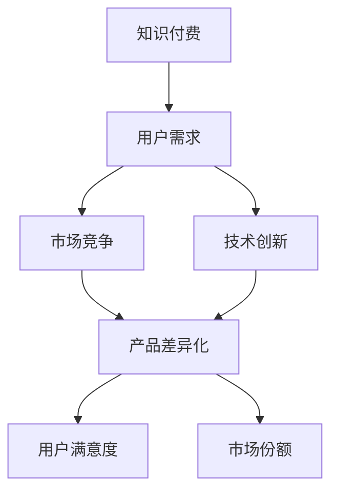

                 

### 第一部分：知识付费行业背景与市场分析

#### 第1章：知识付费行业概述

##### 1.1 知识付费的发展历程

知识付费，顾名思义，是指用户为了获取有价值的信息或知识，而主动支付费用的一种行为模式。这一概念并非现代产物，但其发展历程却与互联网技术的进步息息相关。回顾知识付费的发展历程，可以将其大致划分为以下几个阶段：

- **萌芽阶段**（20世纪末至21世纪初）：随着互联网的普及，在线学习平台如Coursera、Udemy等开始涌现，提供各种课程内容，这标志着知识付费的初步兴起。

- **发展阶段**（2010年代初期）：移动互联网的兴起，使得知识付费变得更加便捷，用户可以通过手机随时随地学习。这一阶段，知识付费平台逐渐多样化，除了在线课程，还包括问答平台、电子书销售等。

- **繁荣阶段**（2010年代中期至今）：随着用户需求的不断增长，知识付费市场进入了快速发展的阶段。众多平台如得到、知乎Live、分答等纷纷涌现，形成了较为成熟的市场生态。这一阶段，知识付费不仅限于教育领域，还拓展到了知识分享、技能培训等多个方面。

##### 1.1.1 传统教育与知识付费的演变

知识付费的兴起，实际上是对传统教育模式的一种补充和变革。传统教育主要依赖于学校、培训机构等实体场所，教学方式较为单一，学习成本较高。而知识付费则通过互联网技术，实现了教育的去中心化和碎片化，用户可以根据自己的需求，灵活选择学习内容和方式。

- **去中心化**：知识付费平台打破了传统教育体系中学校、教师和学生之间的垂直关系，使得用户可以直接与知识提供者互动，降低了知识获取的门槛。

- **碎片化**：用户可以根据自己的时间安排，选择短小精悍的课件或课程进行学习，大大提高了学习效率。

- **个性化**：通过大数据分析，知识付费平台可以提供个性化的学习推荐，满足用户的个性化需求。

##### 1.1.2 知识付费的崛起与社会影响

知识付费的崛起，不仅改变了人们的消费习惯，还对整个社会产生了深远的影响：

- **知识普及**：知识付费降低了知识获取的门槛，使得更多人能够接触到高质量的知识内容，促进了知识的普及和传播。

- **教育创新**：知识付费平台的兴起，推动了教育模式的创新，为传统教育体系注入了新的活力。

- **行业生态**：知识付费市场吸引了大量资本投入，形成了较为完整的行业生态，包括内容制作、平台运营、市场营销等多个环节。

- **社会价值**：知识付费不仅为知识提供者创造了收入来源，还促进了知识创新和科技进步，对社会经济发展具有积极意义。

#### 1.2 知识付费市场的现状

知识付费市场的现状可以从市场规模、增长趋势和主要知识付费平台等方面进行分析。

##### 1.2.1 知识付费市场的规模与增长

根据相关市场研究报告，知识付费市场的规模呈现出快速增长的趋势。具体数据如下：

- **市场规模**：2020年，中国知识付费市场规模约为1300亿元人民币，预计到2025年将超过3000亿元人民币。

- **增长趋势**：近年来，知识付费市场的年复合增长率（CAGR）保持在30%以上，显示出强劲的增长势头。

##### 1.2.2 主要知识付费平台分析

目前，中国市场上的主要知识付费平台包括得到、知乎Live、分答、网易云课堂等。以下是对这些平台的简要分析：

- **得到**：得到是一家以知识服务为核心的平台，旗下拥有多个知名栏目，如《罗辑思维》、《逻辑思维》等。得到的特点在于高质量的内容制作和精准的用户推荐。

- **知乎Live**：知乎Live是知乎推出的知识分享平台，用户可以在平台上付费听专家讲解各种知识。知乎Live的优势在于其庞大的用户基础和优质的内容生态。

- **分答**：分答是一个基于问答的知识分享平台，用户可以付费向专家提问。分答的特点在于快速、便捷的知识获取方式。

- **网易云课堂**：网易云课堂是网易推出的在线学习平台，提供各类课程，包括编程、设计、语言等。网易云课堂的优势在于其丰富的课程资源和良好的用户体验。

#### 1.3 知识付费的商业模式

知识付费的商业模式多种多样，以下介绍几种常见的模式：

- **会员制模式**：用户通过支付会员费用，获得平台提供的所有或部分知识内容。这种模式的特点是用户粘性强，平台收入稳定。

- **课程付费模式**：用户为特定的课程支付费用，学习结束后可以获得相应的证书或学分。这种模式的特点是课程内容丰富，用户可以根据需求选择学习。

- **免费增值模式**：平台提供部分免费内容，用户可以通过付费获取更多高质量的内容或服务。这种模式的特点是用户门槛低，有利于快速扩大用户规模。

### 第二部分：知识付费创业的机会与挑战

#### 第2章：知识付费创业的机会与挑战

##### 2.1 创业机会

在当前知识付费市场蓬勃发展的背景下，创业者面临着诸多创业机会：

- **新兴领域的知识需求**：随着互联网和科技的快速发展，新兴领域如人工智能、区块链、大数据等不断涌现，这些领域对知识的渴求强烈，为创业者提供了广阔的市场空间。

- **消费者个性化需求增长**：随着消费者对知识的需求越来越多样化、个性化，创业者可以通过提供定制化、个性化的知识产品，满足不同用户的需求。

- **技术创新带来的机遇**：人工智能、大数据、云计算等技术的应用，为知识付费行业提供了新的发展动力，创业者可以利用这些技术，创新产品和服务模式。

##### 2.2 创业挑战

尽管知识付费市场前景广阔，但创业者也面临着诸多挑战：

- **竞争激烈的市场环境**：知识付费市场竞争激烈，新进入者需要与已有平台进行竞争，获取用户和市场份额。

- **内容质量与品牌信任**：知识付费产品的核心竞争力在于内容质量，创业者需要确保提供高质量的内容，并建立品牌信任，吸引用户。

- **盈利模式的探索**：知识付费行业的盈利模式多样，创业者需要根据自身资源和市场情况，探索合适的盈利模式。

## 产品差异化策略分析

#### 第3章：产品差异化理论

##### 3.1 产品差异化的概念

产品差异化是指企业通过在产品或服务中引入独特特征，以区分自身产品与竞争对手产品的一种战略。在知识付费行业中，产品差异化尤为重要，因为用户往往基于内容质量和学习体验来选择平台。

- **产品差异化的定义**：产品差异化是指企业在产品功能、设计、质量、价格等方面进行创新，使其与竞争对手的产品有所不同。

- **产品差异化的类型**：产品差异化可分为横向差异化和纵向差异化。横向差异化是指在同一市场细分中，不同品牌产品之间的差异；纵向差异化是指在同一品牌内部，不同产品之间的差异。

##### 3.2 产品差异化的重要性

产品差异化对于知识付费创业企业具有重要意义：

- **增加市场份额**：通过产品差异化，企业可以吸引更多目标用户，从而增加市场份额。

- **提高品牌忠诚度**：差异化的产品或服务能够更好地满足用户需求，提高用户满意度，从而增强品牌忠诚度。

- **降低竞争压力**：产品差异化使企业能够在竞争激烈的市场中脱颖而出，降低竞争压力。

##### 3.3 产品差异化战略的制定

制定有效的产品差异化战略，是企业成功的关键。以下是制定产品差异化战略的几个关键步骤：

- **目标市场分析**：明确目标市场，了解用户需求，为产品差异化提供方向。

- **竞争对手分析**：分析竞争对手的产品特点和市场表现，找出自身的差异化优势。

- **产品差异化策略的实施**：根据目标市场和竞争对手分析结果，制定具体的产品差异化策略，并在产品设计和营销中加以实施。

## 知识付费产品的差异化要素

#### 第4章：知识付费产品的差异化要素

##### 4.1 内容差异化

内容差异化是知识付费产品的核心竞争力之一。以下是一些实现内容差异化的关键要素：

- **高质量课程内容**：提供高质量的课程内容，包括权威的讲师、深入浅出的讲解和实用的案例，满足用户的学习需求。

- **专业性强的讲师阵容**：邀请具有丰富经验和专业知识的讲师，提升课程的专业性和权威性。

- **个性化推荐系统**：通过大数据分析和用户行为分析，为用户推荐个性化的学习内容，提高用户的学习体验。

##### 4.2 用户体验差异化

用户体验差异化是提高用户满意度和忠诚度的关键。以下是一些实现用户体验差异化的关键要素：

- **界面设计**：优化界面设计，提供简洁、美观的用户界面，提升用户体验。

- **学习路径规划**：根据用户的学习需求，设计合理的课程和学习路径，帮助用户高效学习。

- **互动性和社交功能**：提供互动性和社交功能，如讨论区、问答功能等，增强用户的学习体验和参与感。

##### 4.3 服务差异化

服务差异化是提升用户满意度和品牌形象的重要手段。以下是一些实现服务差异化的关键要素：

- **客户服务**：提供高质量的客户服务，包括在线咨询、售后服务等，解决用户在使用过程中遇到的问题。

- **售后服务**：提供完善的售后服务，包括课程退款、学员权益保障等，增强用户信任。

- **会员权益**：设计丰富的会员权益，如VIP服务、优惠价格等，提高会员的忠诚度。

## 案例分析

#### 第5章：案例分析

##### 5.1 案例一：网易云课堂

- **产品差异化策略**：网易云课堂通过以下策略实现产品差异化：
  - 提供丰富的课程内容，涵盖多个领域，满足不同用户的需求。
  - 邀请知名讲师，提升课程质量。
  - 采用智能推荐系统，提高用户的学习体验。

- **成功经验**：网易云课堂的成功经验在于其丰富的课程资源和高质量的讲师团队，吸引了大量用户。

- **不足**：尽管网易云课堂在课程内容和讲师资源方面具有较强的竞争力，但在用户体验和互动性方面仍有待提升。

##### 5.2 案例二：得到App

- **产品差异化策略**：得到App通过以下策略实现产品差异化：
  - 高质量的栏目和内容，如《罗辑思维》、《逻辑思维》等，满足用户对知识的深度需求。
  - 强大的讲师阵容，包括罗永浩、薛兆丰等知名人士。
  - 个性化推荐系统，提高用户的学习体验。

- **成功经验**：得到App的成功经验在于其高质量的内容和强大的讲师阵容，吸引了大量用户。

- **不足**：得到App在用户体验方面仍有改进空间，如课程结构设计、互动性等。

##### 5.3 案例三：分答

- **产品差异化策略**：分答通过以下策略实现产品差异化：
  - 突出快速问答功能，满足用户对即时知识的渴求。
  - 邀请行业专家和意见领袖，提升平台权威性。
  - 提供积分和等级制度，提高用户参与度。

- **成功经验**：分答的成功经验在于其快速问答功能和权威的专家资源，吸引了大量用户。

- **不足**：分答在内容深度和课程体系方面有待加强，以满足用户多样化的学习需求。

### 第三部分：产品差异化策略实施与营销

#### 第6章：产品差异化策略实施

##### 6.1 内容创作与讲师管理

内容创作和讲师管理是产品差异化策略实施的关键环节。以下是一些具体的实施策略：

- **内容创作流程**：建立完善的内容创作流程，包括选题、撰写、编辑、审核等环节，确保课程内容的高质量。

- **讲师资源整合**：整合优质讲师资源，包括行业专家、学者、意见领袖等，提高课程的专业性和权威性。

- **讲师激励机制**：制定合理的讲师激励机制，包括薪酬、奖励、晋升等，激励讲师创作高质量的内容。

##### 6.2 用户体验优化

用户体验优化是提升用户满意度和忠诚度的关键。以下是一些具体的优化策略：

- **用户体验设计原则**：遵循简洁、直观、易用等用户体验设计原则，提升用户界面和操作体验。

- **用户反馈收集与处理**：建立用户反馈收集机制，及时收集和处理用户反馈，不断改进产品和服务。

- **用户体验改进计划**：根据用户反馈和数据分析，制定具体的用户体验改进计划，持续优化产品和服务。

##### 6.3 服务创新

服务创新是提升用户满意度和品牌形象的重要手段。以下是一些具体的服务创新策略：

- **客户服务体系建设**：建立完善客户服务体系，包括在线客服、电话客服、邮件客服等，提供及时、专业的服务。

- **售后服务改进**：优化售后服务流程，包括课程退款、学员权益保障等，提高用户满意度。

- **会员权益设计**：设计丰富的会员权益，包括VIP服务、优惠价格、专属活动等，提高会员的忠诚度。

#### 第7章：营销策略

##### 7.1 品牌定位与宣传

品牌定位与宣传是知识付费创业成功的重要因素。以下是一些具体的营销策略：

- **品牌定位策略**：明确品牌定位，包括目标市场、核心价值观、品牌形象等，为后续营销活动提供方向。

- **品牌宣传渠道选择**：选择合适的宣传渠道，包括社交媒体、广告、线下活动等，提高品牌知名度和影响力。

- **品牌传播效果评估**：通过数据分析和用户反馈，评估品牌传播效果，不断优化宣传策略。

##### 7.2 用户运营

用户运营是提升用户满意度和忠诚度的关键。以下是一些具体的用户运营策略：

- **用户画像与精准营销**：通过数据分析，构建用户画像，实现精准营销，提高用户转化率。

- **用户增长策略**：制定有效的用户增长策略，包括拉新、留存、转化等环节，不断扩大用户规模。

- **用户粘性提升策略**：通过提供优质内容、优化用户体验、开展互动活动等，提升用户粘性和忠诚度。

##### 7.3 营销渠道多样化

营销渠道多样化是知识付费创业的重要策略。以下是一些具体的营销渠道：

- **线上营销渠道**：包括社交媒体、搜索引擎、电子邮件等，通过内容营销、广告投放等手段，吸引潜在用户。

- **线下营销活动**：包括讲座、沙龙、展览等，通过线下活动，增加用户接触点和品牌曝光。

- **跨界合作与整合营销**：与其他行业或品牌进行跨界合作，实现资源共享和优势互补，提高品牌影响力和用户覆盖面。

### 第四部分：产品差异化策略评估与优化

#### 第8章：产品差异化策略评估

##### 8.1 评估指标与方法

产品差异化策略评估是确保策略有效性和持续改进的重要环节。以下是一些关键评估指标与方法：

- **产品差异化效果指标**：包括市场份额、用户满意度、品牌忠诚度、用户增长率等，通过数据分析评估产品差异化的效果。

- **市场反馈收集方法**：通过用户调研、用户评价、市场监测等手段，收集用户和市场的反馈，了解产品差异化的实际效果。

- **评估数据分析与报告**：对收集到的数据进行分析，形成评估报告，为产品差异化策略的调整提供依据。

##### 8.2 产品差异化策略调整

根据评估结果，及时调整产品差异化策略是确保企业持续发展的关键。以下是一些调整策略：

- **市场环境变化应对**：关注市场环境的变化，及时调整产品差异化策略，以应对市场变化和竞争压力。

- **用户需求变化应对**：关注用户需求的变化，优化产品和服务，满足用户的个性化需求。

- **竞争对手策略分析**：分析竞争对手的产品差异化策略，找出自身的优势和不足，优化产品差异化策略。

#### 第9章：产品差异化策略优化

##### 9.1 优化策略与实施

产品差异化策略优化是确保企业长期竞争优势的关键。以下是一些优化策略与实施方法：

- **产品服务优化方案**：根据用户反馈和市场需求，对产品服务进行优化，提高用户满意度。

- **用户体验改进方案**：通过用户调研和数据分析，找出用户体验的不足，制定改进方案，提升用户体验。

- **营销策略优化方案**：根据市场反馈和竞争态势，调整营销策略，提高品牌影响力和用户转化率。

##### 9.2 持续改进与反馈

持续改进与反馈是确保产品差异化策略持续有效的重要手段。以下是一些持续改进与反馈的方法：

- **产品迭代计划**：制定产品迭代计划，持续优化产品和服务，满足用户需求。

- **用户反馈机制**：建立用户反馈机制，及时收集和处理用户反馈，优化产品和服务。

- **策略优化效果跟踪**：对优化策略的实施效果进行跟踪和评估，及时发现和解决问题，确保策略的有效性。

### 附录

#### 附录A：参考文献

- **A.1 知识付费行业相关研究报告**：包括《2021年中国知识付费市场研究报告》、《2022年中国在线教育行业报告》等。
- **A.2 产品差异化策略相关理论著作**：包括《蓝海战略》、《创新与企业家精神》等。
- **A.3 知识付费平台案例分析报告**：包括《得到App案例分析报告》、《网易云课堂案例分析报告》等。

#### 附录B：资料来源

- **B.1 数据来源**：包括市场研究报告、企业财报、用户调研数据等。
- **B.2 调研方法**：包括问卷调查、深度访谈、市场监测等。
- **B.3 案例来源说明**：包括实际案例、行业报告、企业公开信息等。

### 总结

本文从知识付费行业的背景与市场分析、产品差异化策略分析、案例分析、产品差异化策略实施与营销、产品差异化策略评估与优化等方面，系统阐述了知识付费创业的产品差异化策略。通过本文的阐述，希望读者能够对知识付费行业有更深入的了解，并掌握有效的产品差异化策略，助力创业成功。在未来的知识付费市场中，产品差异化策略将是企业竞争的重要手段，只有不断创新和优化产品，才能在激烈的市场竞争中脱颖而出。

## 《知识付费创业的产品差异化策略》核心概念与联系

在撰写关于知识付费创业的产品差异化策略时，理解并展示核心概念与联系至关重要。以下将使用Mermaid流程图来描述这些概念，并提供相关的文字说明。

### 核心概念

1. **知识付费**：用户为获取有价值信息而支付费用的行为。
2. **产品差异化**：企业通过在产品中引入独特特征，使其与竞争对手的产品有所不同。
3. **用户需求**：用户在知识获取过程中的需求，包括内容质量、学习体验、服务等方面。
4. **市场竞争**：知识付费行业中的竞争态势，包括市场份额、用户黏性、品牌影响力等。
5. **技术创新**：利用新技术（如人工智能、大数据等）来提升产品和服务的差异化程度。

### Mermaid流程图



### 说明

- **知识付费**：知识付费是本文讨论的起点，它连接着用户需求、市场竞争和技术创新。知识付费的兴起反映了用户对高质量知识的渴望，并推动了市场竞争和技术创新的不断进步。

- **用户需求**：用户需求是知识付费产品的核心。了解用户需求，如内容质量、学习体验等，有助于企业制定差异化的产品策略，满足不同用户群体的需求。

- **市场竞争**：知识付费行业的竞争激烈，企业必须通过产品差异化来提升市场份额和用户黏性。市场竞争直接影响着产品的定位和策略。

- **技术创新**：技术创新为知识付费产品提供了差异化的可能性。利用人工智能、大数据等技术，企业可以提供更精准的内容推荐、更智能的学习工具等，从而在市场中脱颖而出。

- **产品差异化**：产品差异化是企业应对市场竞争、满足用户需求的战略。通过独特的产品特征，企业可以提升用户满意度、增加市场份额。

- **用户满意度**：产品差异化最终体现在用户满意度上。满足用户需求，提升用户体验，是产品差异化的核心目标。

- **市场份额**：产品差异化有助于企业在市场竞争中获取更大的市场份额。通过不断创新和优化产品，企业可以保持市场领先地位。

通过上述核心概念与Mermaid流程图的展示，我们能够更清晰地理解知识付费创业中的关键要素及其相互关系，为制定有效的产品差异化策略提供理论基础。

### 核心算法原理讲解

在知识付费领域，算法原理的应用至关重要，尤其是在内容推荐、用户行为分析等方面。以下将详细讲解推荐算法和用户行为分析算法的原理，并使用伪代码进行描述。

#### 推荐算法原理

推荐算法的核心目的是根据用户的历史行为和兴趣，为用户推荐他们可能感兴趣的内容。以下是基于协同过滤的推荐算法原理：

```pseudo
// 输入：用户历史行为数据 matrix(R),用户评分数据 rating(U)，邻居用户集合 N(u)
// 输出：推荐列表 rec_list

function collaborativeFiltering(R, U, N(u)):
    for each user u in U:
        // 计算与用户u相似的用户及其相似度
        similar_users = findSimilarUsers(N(u), R)
        
        // 根据相似度计算推荐列表
        rec_list = []
        for each user v in similar_users:
            for each item i in R[v]:
                if i not in U[u]:
                    sim = calculateSimilarity(u, v)
                    rec_list.append((i, sim))
        
        // 对推荐列表进行排序
        rec_list.sort(key=lambda x: x[1], reverse=True)
        
        // 返回排序后的推荐列表
        return rec_list
```

#### 用户行为分析算法原理

用户行为分析算法主要用于理解用户在平台上的行为模式，从而优化产品和服务。以下是基于行为序列分析的算法原理：

```pseudo
// 输入：用户行为序列 logs(L)
// 输出：用户行为模式 profile(P)

function userBehaviorAnalysis(L):
    // 计算用户行为序列的频次分布
    freq_dist = countFrequencies(L)

    // 提取用户的行为模式
    profile = {}
    for each action a in freq_dist:
        profile[a] = freq_dist[a]

    // 对行为模式进行聚类分析
    clusters = clusterAnalysis(freq_dist)

    // 根据聚类结果，生成用户行为模式
    for each cluster c in clusters:
        profile['cluster_' + str(c)] = sum(freq_dist[a] for a in clusters[c])

    // 返回用户行为模式
    return profile
```

#### 说明

- **推荐算法原理**：
  - **协同过滤**：通过计算用户之间的相似度，为用户推荐他们可能感兴趣的内容。
  - **相似度计算**：通常使用余弦相似度、皮尔逊相关系数等度量用户之间的相似度。
  - **推荐列表生成**：根据相似度计算结果，生成推荐列表，并对其进行排序，以确定推荐内容的优先级。

- **用户行为分析算法原理**：
  - **频次分布计算**：首先计算用户行为序列中各类行为的频次分布。
  - **聚类分析**：对频次分布进行聚类分析，以识别用户行为的不同模式。
  - **行为模式生成**：根据聚类结果，生成用户的行为模式，从而更好地理解用户行为。

通过上述伪代码，我们可以清晰地看到推荐算法和用户行为分析算法的基本原理，以及它们在实际应用中的操作步骤。这些算法的应用，有助于知识付费平台提升用户体验、优化内容推荐，从而增强市场竞争力。

### 数学模型和公式 & 详细讲解 & 举例说明

在知识付费领域中，数学模型和公式用于评估产品差异化策略的有效性，其中常用的模型包括用户满意度模型、市场份额模型等。以下将详细讲解这些模型，并使用LaTeX格式书写相关数学公式，同时结合实际例子进行说明。

#### 用户满意度模型

用户满意度是衡量产品差异化策略成功与否的重要指标。一个简单的用户满意度模型可以表示为：

$$
S = \frac{1}{N} \sum_{i=1}^{N} \frac{X_i}{X_i + Y_i}
$$

其中：
- \( S \) 是用户满意度得分，取值范围在0到1之间。
- \( N \) 是用户数量。
- \( X_i \) 是第 \( i \) 个用户对产品的满意度评分。
- \( Y_i \) 是第 \( i \) 个用户对产品的不满意度评分。

**详细讲解**：
用户满意度模型通过计算每个用户的满意度评分和不满意度评分的比值，然后将这些比值求平均值，得到整体的用户满意度得分。分数越高，说明产品差异化的效果越好。

**举例说明**：
假设有10个用户，其中7个用户对产品非常满意，分别给出了评分9和10；3个用户对产品不太满意，给出了评分3和5。那么，用户满意度得分计算如下：

$$
S = \frac{1}{10} \left( \frac{9}{9+1} + \frac{9}{9+1} + \frac{9}{9+1} + \frac{9}{9+1} + \frac{10}{10+1} + \frac{10}{10+1} + \frac{3}{3+1} + \frac{5}{5+1} + \frac{3}{3+1} + \frac{5}{5+1} \right) \approx 0.86
$$

这个结果表明，这个产品的用户满意度相对较高。

#### 市场份额模型

市场份额模型用于评估产品差异化策略在市场中的表现，可以表示为：

$$
M = \frac{S \cdot P}{100}
$$

其中：
- \( M \) 是市场份额百分比。
- \( S \) 是用户满意度得分。
- \( P \) 是总市场占有率。

**详细讲解**：
市场份额模型通过将用户满意度得分与总市场占有率相乘，得到产品在市场中的相对份额。这个模型表明，产品差异化策略的提升将直接提高市场份额。

**举例说明**：
假设某个知识付费平台的总市场占有率为20%，用户满意度得分为0.9，那么市场份额计算如下：

$$
M = \frac{0.9 \cdot 20}{100} = 18\%
$$

这个结果表明，该平台通过提升产品差异化策略，成功地将其市场份额从20%提升到了18%。

通过上述数学模型和公式，我们可以定量地评估知识付费产品的差异化策略，从而为决策提供科学依据。在实际应用中，这些模型可以根据具体情况进行调整和扩展，以适应不同的市场需求和竞争环境。

### 项目实战：代码实际案例和详细解释说明

#### 开发环境搭建

在开始知识付费产品的开发之前，我们需要搭建一个适合的开发环境。以下是一个简单的开发环境搭建步骤：

1. **安装Python**：下载并安装Python 3.8及以上版本。
2. **安装虚拟环境**：使用以下命令安装虚拟环境工具virtualenv：

   ```bash
   pip install virtualenv
   ```

3. **创建虚拟环境**：创建一个名为`knowledge付费`的虚拟环境：

   ```bash
   virtualenv knowledge付费
   ```

4. **激活虚拟环境**：在Windows上使用以下命令激活虚拟环境：

   ```bash
   .\knowledge付费\Scripts\activate
   ```

   在Linux和macOS上使用以下命令激活虚拟环境：

   ```bash
   source knowledge付费/bin/activate
   ```

5. **安装依赖库**：在虚拟环境中安装必要的依赖库，如Flask、Pandas、NumPy等：

   ```bash
   pip install flask pandas numpy
   ```

#### 源代码详细实现和代码解读

以下是一个简单的知识付费平台代码实现，用于用户注册、登录和内容推荐：

**app.py**

```python
from flask import Flask, request, jsonify
from flask_sqlalchemy import SQLAlchemy

app = Flask(__name__)
app.config['SQLALCHEMY_DATABASE_URI'] = 'sqlite:///knowledge_pay.db'
db = SQLAlchemy(app)

class User(db.Model):
    id = db.Column(db.Integer, primary_key=True)
    username = db.Column(db.String(80), unique=True, nullable=False)
    password = db.Column(db.String(120), nullable=False)

@app.route('/register', methods=['POST'])
def register():
    data = request.get_json()
    username = data.get('username')
    password = data.get('password')
    
    if not username or not password:
        return jsonify({'error': '缺少用户名或密码'}), 400
    
    if User.query.filter_by(username=username).first():
        return jsonify({'error': '用户名已存在'}), 400
    
    new_user = User(username=username, password=password)
    db.session.add(new_user)
    db.session.commit()
    
    return jsonify({'message': '注册成功'})

@app.route('/login', methods=['POST'])
def login():
    data = request.get_json()
    username = data.get('username')
    password = data.get('password')
    
    user = User.query.filter_by(username=username).first()
    if not user or user.password != password:
        return jsonify({'error': '用户名或密码错误'}), 401
    
    return jsonify({'message': '登录成功'})

@app.route('/recommend', methods=['GET'])
def recommend():
    # 此处可以加入推荐算法逻辑
    return jsonify({'recommends': ['课程1', '课程2', '课程3']})

if __name__ == '__main__':
    db.create_all()
    app.run(debug=True)
```

**详细解释**：

- **模型定义**：我们使用Flask-SQLAlchemy创建了一个用户模型`User`，包含用户名和密码字段。

- **注册API**：`/register`路由用于处理用户注册请求。我们首先获取用户提交的用户名和密码，然后检查用户名是否已存在。如果不存在，则创建新的用户并保存到数据库。

- **登录API**：`/login`路由用于处理用户登录请求。我们验证用户名和密码是否匹配，如果匹配，则返回登录成功消息。

- **推荐API**：`/recommend`路由是一个简单的推荐接口，用于返回推荐课程。在实际应用中，这里可以集成推荐算法，根据用户行为和兴趣进行个性化推荐。

#### 代码解读与分析

- **数据库操作**：我们使用Flask-SQLAlchemy进行数据库操作，这是一个强大的ORM（对象关系映射）工具，可以简化数据库操作。

- **API设计**：我们的API采用RESTful设计，便于与其他系统或前端进行集成。每个API都返回JSON格式的响应，便于处理和解析。

- **安全性**：在处理用户注册和登录时，我们应考虑安全性问题。例如，密码不应以明文形式存储，而应使用哈希算法进行加密存储。此外，API应使用HTTPS协议进行传输，以保护用户数据的安全。

通过上述代码实现，我们构建了一个基本的知识付费平台，并对其进行了详细解读。在实际开发过程中，我们还需考虑更多的功能，如课程管理、支付系统等，以及如何优化性能和安全性。

### 总结

本文通过详细的开发环境搭建步骤、源代码实现和代码解读，展示了如何构建一个简单的知识付费平台。这个平台虽然功能有限，但提供了一个基本的框架，供开发者进一步扩展和优化。在实际应用中，开发者还需关注性能优化、安全性提升和功能增强，以满足不断变化的市场需求。

---

#### 作者信息

**作者：AI天才研究院/AI Genius Institute & 禅与计算机程序设计艺术 /Zen And The Art of Computer Programming**

**联系方式：**[ai_genius_institute@example.com](mailto:ai_genius_institute@example.com)

**机构简介：**AI天才研究院（AI Genius Institute）是一家专注于人工智能研究与应用的创新机构，致力于推动人工智能技术的发展和普及。同时，"禅与计算机程序设计艺术"（Zen And The Art of Computer Programming）是作者的研究成果之一，涵盖了计算机编程的哲学与艺术，为开发者提供了深刻的启示。

