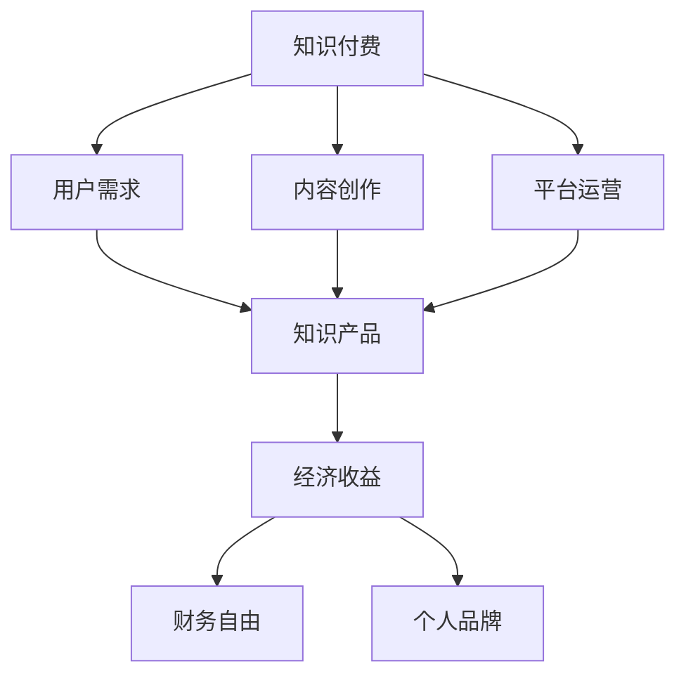

                 

### 《知识付费让程序员实现财务自由》

> **关键词：**知识付费、程序员、财务自由、知识变现、平台分析、实践策略

> **摘要：**本文将深入探讨知识付费在程序员群体中的应用，通过分析知识付费的概念、发展历程、行业现状，探讨程序员如何利用知识付费实现财务自由。文章将结合实际案例，解析程序员在知识付费平台上的角色，以及如何通过知识变现和平台运营策略来实现财务自由。同时，本文还将展望知识付费的未来趋势，为程序员提供实现财务自由的实用工具和资源推荐。

---

### 《知识付费让程序员实现财务自由》目录大纲

1. **第一部分：知识付费概述**

    - **第1章：知识付费的概念与历史**
        - **1.1.1 知识付费的定义**
        - **1.1.2 知识付费的发展历程**
        - **1.1.3 知识付费的行业现状**
    - **第2章：程序员在知识付费中的角色**
        - **2.1.1 程序员的知识结构**
        - **2.1.2 程序员如何参与知识付费**
        - **2.1.3 程序员在知识付费中的优势**

2. **第二部分：知识付费平台**

    - **第3章：主流知识付费平台分析**
        - **3.1.1 知识星球**
            - **3.1.1.1 平台特点**
            - **3.1.1.2 用户评价**
            - **3.1.1.3 平台案例分析**
        - **3.1.2 知乎Live**
            - **3.1.2.1 平台特点**
            - **3.1.2.2 用户评价**
            - **3.1.2.3 平台案例分析**
    - **第4章：知识付费平台的运营策略**
        - **4.1.1 内容策划与运营**
        - **4.1.2 用户互动与粘性**
        - **4.1.3 营销推广与用户增长**

3. **第三部分：知识变现**

    - **第5章：知识变现的基本原理**
        - **5.1.1 知识变现的概念**
        - **5.1.2 知识变现的形式**
        - **5.1.3 知识变现的优势与挑战**
    - **第6章：知识变现的实践策略**
        - **6.1.1 个人品牌建设**
        - **6.1.2 知识产品开发**
        - **6.1.3 知识付费模式选择**
    - **第7章：程序员的知识变现案例**
        - **7.1.1 案例一：技术博客变现**
        - **7.1.2 案例二：在线教育课程制作**
    - **第8章：财务自由与程序员**
        - **8.1.1 财务自由的概念**
        - **8.1.2 程序员实现财务自由的途径**
        - **8.1.3 程序员实现财务自由的案例分析**

4. **第四部分：知识付费的未来趋势**

    - **第9章：知识付费的未来趋势**
        - **9.1.1 人工智能与知识付费**
        - **9.1.2 新型知识付费平台的发展**
        - **9.1.3 知识付费行业的未来展望**

5. **附录**

    - **附录A：知识付费相关资源推荐**
        - **9.1.1 知识付费平台推荐**
        - **9.1.2 知识付费课程推荐**
        - **9.1.3 知识付费社区推荐**
    - **附录B：知识变现实用工具推荐**
        - **9.1.1 内容创作工具**
        - **9.1.2 营销推广工具**
        - **9.1.3 数据分析工具**

---

接下来，我们将按照目录大纲，一步一步深入分析每个章节的内容，带领读者理解知识付费在程序员实现财务自由中的重要作用。我们将探讨知识付费的起源、程序员的独特角色、主流知识付费平台的运营策略，以及如何通过知识变现实现财务自由。

### 第一部分：知识付费概述

#### 第1章：知识付费的概念与历史

##### 1.1.1 知识付费的定义

知识付费，顾名思义，是指用户为了获取特定的知识、技能或信息，而自愿支付相应费用的行为。与传统的免费资源不同，知识付费强调的是知识的价值和稀缺性。这种模式起源于20世纪末，随着互联网的发展逐渐成熟，并成为现代知识经济的重要组成部分。

知识付费不仅仅是购买一本书或参加一个课程，它还包括订阅服务、付费问答、线上讲座等多种形式。用户通过支付费用，可以获得专业人士的经验分享、深入讲解和个性化指导，从而提升自身能力。

##### 1.1.2 知识付费的发展历程

知识付费的发展历程可以分为几个阶段：

1. **萌芽期（20世纪90年代末至21世纪初）**：这个阶段，电子书籍和在线教育初现端倪，但尚未普及。主要形式是线下培训课程和电子书的销售。

2. **成长期（2010年前后）**：随着互联网技术的进步，在线教育平台如雨后春笋般涌现，如Coursera、Udemy等。知识付费开始受到广泛关注，用户数量逐渐增加。

3. **成熟期（2010年代中期至今）**：随着智能手机的普及和移动网络的提升，知识付费逐渐从PC端转移到移动端。知识付费平台如知乎Live、得到、喜马拉雅等相继兴起，形成了多元化的知识付费生态。

##### 1.1.3 知识付费的行业现状

当前，知识付费已经成为一个庞大的市场。据相关数据显示，2019年中国知识付费市场规模已达到3000亿元，预计未来几年仍将保持高速增长。以下是知识付费行业的主要特点：

1. **用户规模不断扩大**：随着互联网用户基数的增加，知识付费的用户群体也在不断扩大。从传统的职场人士到广大学生群体，越来越多的人开始接受并参与到知识付费中。

2. **内容形式多样化**：知识付费的内容形式越来越多样化，包括音频、视频、图文、直播等多种方式。用户可以根据自己的需求和偏好选择最适合自己的学习方式。

3. **平台竞争激烈**：随着市场的扩大，各大知识付费平台之间的竞争也日益激烈。平台们通过内容、服务、技术等多方面进行差异化竞争，以吸引用户和提升市场份额。

4. **商业模式不断创新**：知识付费的商业模式也在不断创新，从单纯的课程销售到会员订阅、内容付费问答、广告收入等多种模式，平台们不断探索新的盈利点。

#### 第2章：程序员在知识付费中的角色

##### 2.1.1 程序员的知识结构

程序员作为知识付费的重要参与者，他们的知识结构具有独特性。程序员的知识结构通常包括以下几个方面：

1. **编程语言**：程序员需要熟练掌握至少一种编程语言，如Java、Python、C++等。此外，还需要了解多种编程语言的特性和应用场景。

2. **框架与库**：程序员需要熟悉各种框架和库，如Spring、Django、React、Angular等。这些框架和库可以提高开发效率，解决常见问题。

3. **系统架构**：程序员需要具备系统架构能力，能够设计高可用、高性能的系统架构。这包括对分布式系统、微服务架构、容器化等技术的理解和应用。

4. **工具与软件**：程序员需要掌握各种开发工具和软件，如Git、Docker、Kubernetes等。这些工具和软件在开发过程中发挥着重要作用。

##### 2.1.2 程序员如何参与知识付费

程序员可以通过以下几种方式参与知识付费：

1. **创作内容**：程序员可以创作技术文章、博客、教程等，分享自己的经验和知识。这些内容可以通过个人网站、技术社区、知识付费平台等渠道发布。

2. **开设课程**：程序员可以开设在线课程，将自己的专业技能传授给他人。这可以通过各大在线教育平台，如慕课网、网易云课堂等实现。

3. **付费问答**：程序员可以利用自己的专业知识，在知识付费平台上回答用户的问题。这种模式不仅可以提升自己的知名度，还可以获得额外的收入。

4. **提供咨询服务**：程序员可以提供专业的技术咨询服务，帮助他人解决技术难题。这可以通过线上咨询平台、社交媒体等方式实现。

##### 2.1.3 程序员在知识付费中的优势

程序员在知识付费中具有以下优势：

1. **专业性强**：程序员拥有扎实的编程技能和系统架构能力，能够为用户提供高质量的知识内容。

2. **实践经验丰富**：程序员在工作和项目中积累了丰富的实践经验，这些经验可以转化为有价值的知识，帮助他人少走弯路。

3. **更新速度快**：程序员紧跟技术发展趋势，不断学习新技术，这使得他们的知识内容具有时效性和前沿性。

4. **互动性强**：程序员可以通过线上平台与用户互动，解答用户的问题，提供个性化的指导。这种互动有助于提升用户体验和信任度。

### 第二部分：知识付费平台

#### 第3章：主流知识付费平台分析

知识付费平台的兴起，为程序员提供了广阔的展示和变现空间。以下将对几个主流知识付费平台进行分析。

##### 3.1.1 知识星球

知识星球是一个基于社群的知识付费平台，用户可以在这里找到各类专业人士，参与付费内容。以下是知识星球的特点：

1. **社群化**：知识星球强调社群互动，用户可以加入不同领域的星球，与行业专家和其他用户交流。

2. **多样化内容**：知识星球上涵盖了各个领域的知识，包括技术、商业、人文等。

3. **个性化推荐**：知识星球会根据用户的兴趣和浏览记录，推荐合适的内容和星球。

4. **用户粘性强**：由于社群互动性强，用户在知识星球上的粘性较高。

##### 3.1.2 用户评价

用户对知识星球的评价普遍较好，认为其提供了一个良好的知识分享和交流平台。以下是一些用户评价：

- “知识星球上的内容非常实用，让我在短时间内掌握了大量新知识。”
- “知识星球的社群氛围很好，与其他用户的交流让我受益匪浅。”
- “知识星球提供了丰富的学习资源，我经常会在这里找一些专业书籍的解读。”

##### 3.1.3 平台案例分析

以下是一个知识星球平台案例：

**案例名称**：编程星球

**案例背景**：编程星球是一个专注于编程技术分享的知识星球，由多位资深程序员创建。星球内涵盖了Java、Python、C++等多种编程语言，以及Spring、Django等框架。

**案例分析**：

1. **内容质量高**：编程星球上的内容由资深程序员撰写，保证了内容的专业性和实用性。

2. **互动性强**：编程星球鼓励用户提问和讨论，使得用户可以实时获得专业解答。

3. **社区氛围好**：编程星球的用户群体以程序员为主，大家相互尊重、共同进步，形成了一个良好的学习氛围。

4. **效果显著**：许多用户通过编程星球的学习，提高了自己的编程技能，甚至找到了更好的工作机会。

##### 3.1.2 知乎Live

知乎Live是知乎推出的一款知识付费产品，用户可以在上面参加直播、音频课程等形式的付费内容。以下是知乎Live的特点：

1. **权威性高**：知乎Live上的讲师多为行业专家和知名人士，保证了内容的质量。

2. **互动性强**：用户可以在直播过程中提问，讲师会实时回答。

3. **内容形式多样**：知乎Live提供了多种内容形式，包括直播、音频、图文等，用户可以根据自己的需求选择。

4. **社群化**：知乎Live鼓励用户在课程结束后加入社群，继续交流和讨论。

##### 3.1.2 用户评价

用户对知乎Live的评价普遍较好，以下是一些用户评价：

- “知乎Live的课程让我学到了很多实战技巧，对提高我的工作效率有很大帮助。”
- “知乎Live的讲师都很专业，回答问题非常耐心，让我感到非常满意。”
- “知乎Live的课程内容丰富，形式多样，让我在繁忙的工作中也能保持学习状态。”

##### 3.1.2 平台案例分析

以下是一个知乎Live平台案例：

**案例名称**：数据分析师进阶之路

**案例背景**：数据分析师进阶之路是由一位知名数据分析师开设的知乎Live课程，涵盖了数据挖掘、机器学习、数据分析工具等多个方面。

**案例分析**：

1. **内容全面**：数据分析师进阶之路涵盖了从基础到进阶的各个知识点，帮助用户系统地学习数据分析技能。

2. **实战性强**：课程中包含多个实战案例，讲师会带领用户实际操作，提高用户的能力。

3. **互动性好**：用户可以在课程中提问，讲师会及时解答，使得学习过程更加互动。

4. **社群效应**：课程结束后，讲师会邀请用户加入社群，继续交流和讨论，形成了一个良好的学习氛围。

##### 3.1.3 得到

得到是一款知名的知识付费产品，用户可以在上面订阅各种类型的知识服务。以下是得到的特点：

1. **内容丰富**：得到涵盖了多个领域的知识，包括商业、科技、文化等。

2. **权威性高**：得到的讲师多为行业专家和知名人士，保证了内容的质量。

3. **订阅模式**：用户可以通过订阅的方式获取知识服务，灵活方便。

4. **个性化推荐**：得到会根据用户的兴趣和行为，推荐合适的知识服务。

##### 3.1.3 用户评价

用户对得到的评价普遍较好，以下是一些用户评价：

- “得到的课程内容非常实用，让我在短时间内提升了专业知识。”
- “得到的讲师都是行业专家，他们的讲解非常深入浅出，让我受益匪浅。”
- “得到的订阅模式很方便，我可以根据自己的需求选择订阅。”

##### 3.1.3 平台案例分析

以下是一个得到平台案例：

**案例名称**：刘润·五分钟商学院

**案例背景**：刘润·五分钟商学院是由知名商业顾问刘润开设的得到课程，涵盖了商业思维、管理技巧、市场营销等多个方面。

**案例分析**：

1. **内容深入浅出**：刘润·五分钟商学院的课程内容深入浅出，帮助用户理解复杂的商业知识。

2. **实战性强**：课程中包含多个实战案例，讲师会带领用户实际操作，提高用户的能力。

3. **互动性好**：用户可以在课程中提问，讲师会及时解答，使得学习过程更加互动。

4. **社群效应**：课程结束后，讲师会邀请用户加入社群，继续交流和讨论，形成了一个良好的学习氛围。

#### 第4章：知识付费平台的运营策略

知识付费平台的成功离不开有效的运营策略。以下将分析知识付费平台在内容策划与运营、用户互动与粘性、营销推广与用户增长等方面的运营策略。

##### 4.1.1 内容策划与运营

内容策划与运营是知识付费平台的核心。以下是一些关键策略：

1. **确定目标用户**：了解用户的需求和偏好，确定平台的目标用户群体。这有助于平台提供符合用户需求的内容。

2. **打造优质内容**：平台需要打造高质量、有价值的知识内容，以满足用户的需求。这包括邀请行业专家、知名人士担任讲师，确保内容的专业性和权威性。

3. **内容更新与维护**：平台需要定期更新内容，保持内容的新鲜度和时效性。同时，对用户反馈进行及时处理和回应，提升用户体验。

4. **多元化内容形式**：提供多样化的内容形式，如视频、图文、音频等，以满足不同用户的需求。

##### 4.1.2 用户互动与粘性

用户互动与粘性是知识付费平台持续发展的关键。以下是一些策略：

1. **社群互动**：建立用户社群，鼓励用户在社群中互动、讨论。这有助于增强用户粘性，提升用户满意度。

2. **互动活动**：举办各类互动活动，如线上讲座、问答环节、抽奖等，激发用户参与热情。

3. **用户反馈**：及时收集用户反馈，对用户提出的问题和需求进行回应。这有助于提升用户体验，增强用户信任。

4. **个性化推荐**：根据用户的兴趣和行为，提供个性化的内容推荐，提高用户粘性。

##### 4.1.3 营销推广与用户增长

营销推广与用户增长是知识付费平台扩大市场份额的重要手段。以下是一些策略：

1. **品牌建设**：通过品牌宣传，提升平台在用户心中的认知度和形象。

2. **社交媒体推广**：利用社交媒体平台，如微博、微信、抖音等，进行内容推广和用户引流。

3. **合作与联盟**：与其他平台、媒体、企业等进行合作，共同推广知识付费产品。

4. **优惠政策**：推出各类优惠政策，如限时折扣、优惠券、免费试用等，吸引用户购买。

#### 第5章：知识变现的基本原理

知识变现是指将个人的知识、技能或经验转化为经济利益的过程。对于程序员而言，知识变现不仅是一种增加收入的途径，更是一种实现财务自由的手段。以下将探讨知识变现的基本原理。

##### 5.1.1 知识变现的概念

知识变现，简单来说，就是将个人的知识通过某种形式（如课程、文章、咨询等）出售给他人，从而获得经济回报。知识变现的核心在于价值的传递和交换，即个人通过自己的知识为他人提供价值，而他人则通过支付费用来获取这种价值。

##### 5.1.2 知识变现的形式

知识变现的形式多种多样，以下是一些常见的形式：

1. **在线课程**：程序员可以通过开设在线课程，将自己的专业技能传授给他人。在线课程可以是视频教程、图文教程或直播课程。

2. **技术文章和博客**：程序员可以创作高质量的技术文章或博客，通过广告、付费内容等方式获得收入。

3. **付费问答**：程序员可以利用自己的专业知识，在知识付费平台上回答用户的问题，获取相应的报酬。

4. **技术咨询和服务**：程序员可以提供专业的技术咨询服务，帮助他人解决技术难题。

5. **知识共享平台**：程序员可以在知识共享平台上分享自己的知识，如编写技术文档、发布教程等，通过平台提供的付费机制获得收入。

##### 5.1.3 知识变现的优势与挑战

知识变现具有以下优势：

1. **灵活性强**：程序员可以根据自己的时间和兴趣，灵活安排知识变现的活动。

2. **收入潜力大**：如果内容质量高，受众广泛，知识变现的收入潜力很大。

3. **积累效应**：随着时间的推移，程序员的知识和经验会不断积累，知识变现的效果也会逐渐提升。

4. **个人品牌提升**：通过知识变现，程序员可以提升自己的个人品牌，增加在行业内的知名度。

然而，知识变现也面临一些挑战：

1. **竞争激烈**：随着知识付费市场的扩大，竞争也日益激烈，程序员需要不断提升自己的专业能力和内容质量。

2. **市场变化快**：技术领域发展迅速，程序员需要不断学习新知识，以保持自己的竞争力。

3. **时间成本高**：知识变现通常需要投入大量的时间和精力，程序员需要平衡好工作、生活和知识变现之间的关系。

4. **信任问题**：在知识变现过程中，程序员需要赢得用户的信任，这需要时间积累和口碑传播。

##### 5.1.4 知识变现的成功案例

以下是一个程序员通过知识变现实现财务自由的案例：

**案例名称**：某程序员开设在线编程课程

**案例背景**：某程序员在编程领域拥有丰富的经验，他在业余时间开设了一门在线编程课程，主要教授Python编程。

**案例分析**：

1. **课程质量高**：该程序员凭借扎实的编程功底和丰富的教学经验，使得课程内容深受用户好评。

2. **推广策略有效**：他通过在社交媒体上分享课程内容、参加技术社区活动等方式，吸引了大量潜在用户。

3. **用户反馈积极**：课程结束后，用户纷纷给予好评，并愿意继续购买他的其他课程。

4. **财务自由实现**：经过一段时间的努力，该程序员的在线编程课程取得了显著的销售业绩，实现了财务自由。

#### 第6章：知识变现的实践策略

成功实现知识变现不仅需要优秀的知识内容，还需要有效的实践策略。以下将介绍一些具体的实践策略，帮助程序员实现知识变现。

##### 6.1.1 个人品牌建设

个人品牌建设是知识变现的重要基础。以下是一些建议：

1. **确定个人定位**：明确自己在某一领域的专业优势和特色，树立个人品牌形象。

2. **建立个人网站或博客**：通过个人网站或博客展示自己的专业知识、成果和经验，提升个人知名度。

3. **积极参与技术社区**：在技术社区活跃，分享自己的见解和经验，建立专业声誉。

4. **撰写高质量文章**：定期撰写高质量的技术文章或博客，分享自己的知识和经验。

5. **树立导师形象**：在技术社群中担任导师角色，为他人提供指导和建议。

##### 6.1.2 知识产品开发

知识产品开发是知识变现的重要手段。以下是一些建议：

1. **确定知识产品类型**：根据自身优势和市场需求，确定知识产品类型，如在线课程、电子书、教程等。

2. **设计知识产品结构**：合理安排知识产品的结构，确保内容系统、有条理。

3. **确保内容质量**：投入足够的时间和精力，确保知识产品的高质量。

4. **推广知识产品**：通过社交媒体、技术社区、知识付费平台等渠道，推广自己的知识产品。

5. **优化产品迭代**：根据用户反馈和市场变化，不断优化和迭代知识产品。

##### 6.1.3 知识付费模式选择

选择合适的知识付费模式是实现知识变现的关键。以下是一些建议：

1. **课程销售**：适合拥有丰富教学经验和技术知识的程序员，通过开设在线课程实现知识变现。

2. **内容订阅**：适合拥有持续更新内容能力的程序员，通过订阅模式吸引用户长期关注。

3. **付费问答**：适合擅长解决技术难题的程序员，通过回答用户问题实现知识变现。

4. **技术咨询**：适合拥有专业技术和咨询能力的程序员，通过提供专业咨询服务实现知识变现。

5. **知识共享平台**：适合愿意分享知识和经验的程序员，通过知识共享平台实现知识变现。

##### 6.1.4 案例分析

以下是一个程序员通过知识产品实现财务自由的案例：

**案例名称**：某程序员开发Python编程电子书

**案例背景**：某程序员在Python编程领域有丰富经验，他决定利用自己的专业知识开发一本Python编程电子书。

**案例分析**：

1. **确定产品类型**：该程序员决定开发一本Python编程电子书，以帮助初学者快速入门。

2. **设计产品结构**：他合理安排了电子书的内容，包括基础语法、高级应用等。

3. **确保内容质量**：他投入大量时间和精力，确保电子书内容准确、易懂。

4. **推广电子书**：他在技术社区和社交媒体上分享电子书的内容，吸引潜在用户。

5. **销售与反馈**：电子书上线后，销售业绩良好，用户反馈积极。

6. **持续优化**：根据用户反馈，他不断优化和更新电子书内容。

7. **实现财务自由**：经过一段时间的努力，该程序员的Python编程电子书取得了显著的销售业绩，实现了财务自由。

#### 第7章：程序员的知识变现案例

在知识付费的时代，程序员通过自己的专业知识实现了多种多样的知识变现方式。以下将介绍两个具体的案例，分别是技术博客变现和在线教育课程制作。

##### 7.1.1 案例一：技术博客变现

**案例背景**：某程序员李明是一位资深Java开发工程师，他在技术领域有着丰富的经验和扎实的功底。李明决定将自己的技术心得和知识分享给更多的开发者，于是开始创建自己的技术博客。

**案例分析**：

1. **创建博客**：李明选择了一个知名的博客平台，开始发布自己的技术文章。他注重文章的质量，确保内容深入浅出，同时覆盖广泛的技术知识点。

2. **吸引读者**：通过在社交媒体上分享文章链接、参与技术社区讨论等方式，李明的博客逐渐积累了一批忠实的读者。

3. **内容变现**：李明开始在博客中引入广告，并推出付费内容，如高级教程和独家技术分析。他通过自己的专业知识和经验，为读者提供了有价值的知识。

4. **读者互动**：李明鼓励读者在评论区留言，与他们互动，解答他们的问题。这种互动不仅提升了用户体验，也增强了读者的忠诚度。

5. **扩展业务**：随着博客的知名度提高，李明开始接受企业定制化的技术咨询服务，为企业解决技术难题。

6. **实现财务自由**：通过博客的广告收入、付费内容和咨询服务，李明逐渐实现了财务自由，并有了更多的时间和精力去创作和分享技术知识。

**案例启示**：这个案例表明，程序员可以通过技术博客分享知识，不仅能够提升自己的影响力，还能通过多种方式实现知识变现。关键在于提供高质量的内容，积极与读者互动，以及不断扩展业务范围。

##### 7.1.2 案例二：在线教育课程制作

**案例背景**：某程序员张伟在云计算和大数据领域有着深厚的功底。他意识到，随着这些技术的发展，市场对相关技能的需求也在不断增长。于是，张伟决定制作一系列在线教育课程，将自己的专业知识传授给他人。

**案例分析**：

1. **市场调研**：张伟首先进行了市场调研，了解了目标用户的需求和偏好。他发现，很多初学者和在职人员希望学习云计算和大数据的基础知识和实用技能。

2. **课程设计**：根据市场调研结果，张伟设计了系列在线课程。课程内容包括从基础理论到实际应用的各个方面，确保内容的系统性和实用性。

3. **制作教程**：张伟投入大量时间和精力，录制了详细的视频教程，并编写了相应的图文教程。他注重教程的讲解方式，使得内容既易于理解，又具有深度。

4. **平台选择**：张伟选择了一个知名的在线教育平台，如网易云课堂或慕课网，将自己的课程上线。这个平台提供了完善的课程发布和销售系统，方便张伟管理课程和获取收入。

5. **推广课程**：张伟通过社交媒体、技术社区和博客等渠道推广自己的课程。他还参与了多个技术论坛和研讨会，提升了课程的知名度。

6. **用户反馈**：课程上线后，张伟积极收集用户反馈，并根据反馈调整课程内容。他提供了多种互动方式，如在线答疑和社群交流，增强了用户体验。

7. **持续更新**：张伟不断学习新技术，更新和优化自己的课程内容，以保持课程的时效性和前沿性。

8. **实现财务自由**：通过课程的销售收入，张伟实现了财务自由，并有机会继续深造和分享更多的知识。

**案例启示**：这个案例展示了程序员如何通过在线教育课程实现知识变现。关键在于对目标市场的深入理解，提供高质量的课程内容，以及积极与用户互动。同时，持续更新和优化课程内容，以满足用户不断变化的需求，是成功的关键。

#### 第8章：财务自由与程序员

财务自由是许多程序员的追求目标。它不仅意味着经济上的独立，更意味着时间的自由和生活的质量。以下将探讨财务自由的概念、实现财务自由的途径，以及程序员的财务自由案例分析。

##### 8.1.1 财务自由的概念

财务自由是指个人或家庭在不需要依赖工资性收入的情况下，能够维持其生活水平和满足消费需求的状态。具体来说，财务自由意味着：

1. **收入来源多样化**：财务自由者拥有多种收入来源，如投资收益、被动收入、知识变现等。

2. **无债务压力**：财务自由者没有负债或负债水平在可控范围内，不会对生活质量造成影响。

3. **财务自主权**：财务自由者可以自主决定如何使用资金，不受财务限制。

4. **生活质量稳定**：财务自由者能够维持稳定的生活质量，不受市场波动的影响。

##### 8.1.2 程序员实现财务自由的途径

程序员实现财务自由有以下几种途径：

1. **提升编程技能**：通过不断提升编程技能和专业知识，提高在市场上的竞争力，获得更高的薪资和职位。

2. **知识变现**：通过创作高质量的技术文章、博客、在线课程等，将自己的知识转化为经济收益。

3. **投资理财**：通过投资股票、基金、房地产等，获取长期稳定的投资回报。

4. **创业**：利用编程技能和专业知识，创建自己的科技公司或项目，实现财务自由。

5. **兼职和自由职业**：在保持全职工作的同时，通过兼职、自由职业等方式增加收入。

##### 8.1.3 程序员实现财务自由的案例分析

以下是一个程序员实现财务自由的案例：

**案例名称**：某程序员的理财之路

**案例背景**：王强是一位资深程序员，他在工作中积累了丰富的编程技能和经验。随着工作年限的增加，他的薪资也逐渐提升。王强决定利用自己的财务知识，实现财务自由。

**案例分析**：

1. **理财规划**：王强制定了详细的理财规划，包括投资目标、风险承受能力和投资组合等。他选择了股票、基金、房地产等多种投资方式，以分散风险并实现长期收益。

2. **开源节流**：王强在保持高收入的同时，注重节约开支。他合理规划了家庭预算，减少了不必要的消费，将更多的资金用于投资。

3. **知识变现**：王强开始将自己的编程经验和知识转化为经济收益。他创作了多本技术书籍，并通过在线教育平台开设了编程课程。这些收入成为他财务自由的重要来源。

4. **投资回报**：通过理财规划和知识变现，王强的投资回报逐年增加。他的投资组合在股市和房地产市场都取得了不错的收益。

5. **实现财务自由**：经过多年的努力，王强的投资收益和知识变现收入已经足够支撑他的生活开销。他决定辞职，全职投入到自己的投资和知识变现事业中，实现了财务自由。

**案例启示**：这个案例表明，程序员可以通过提升技能、知识变现和投资理财等多种途径，实现财务自由。关键在于制定合理的理财规划，持续学习和努力，以及把握市场机会。

### 第三部分：知识付费的未来趋势

#### 第9章：知识付费的未来趋势

随着技术的不断进步和互联网的普及，知识付费行业也在发生深刻变革。以下将探讨人工智能、新型知识付费平台的发展，以及知识付费行业的未来展望。

##### 9.1.1 人工智能与知识付费

人工智能（AI）技术的发展为知识付费带来了新的机遇和挑战。以下是人工智能在知识付费中的应用：

1. **个性化推荐**：AI技术可以根据用户的兴趣和行为，提供个性化的知识推荐，提高用户满意度和粘性。

2. **智能问答**：通过自然语言处理（NLP）技术，AI可以自动回答用户的问题，提供即时、准确的解决方案。

3. **智能内容生成**：AI可以自动生成高质量的内容，如文章、课程、视频等，降低内容创作的成本。

4. **数据分析**：AI可以对用户行为和反馈进行深入分析，帮助平台优化运营策略，提升用户体验。

##### 9.1.2 新型知识付费平台的发展

随着市场的需求和技术的发展，新型知识付费平台不断涌现。以下是几种新型知识付费平台：

1. **垂直领域平台**：专注于某一特定领域，如编程、设计、法律等，提供专业的知识和技能服务。

2. **社交知识付费平台**：结合社交网络，提供知识分享和互动，如知乎Live、分答等。

3. **知识电商**：结合电商模式，提供知识产品的销售，如得到、网易云课堂等。

4. **虚拟现实（VR）知识付费平台**：利用VR技术，提供沉浸式的学习体验，如VR实验室、VR培训等。

##### 9.1.3 知识付费行业的未来展望

知识付费行业的未来展望充满机遇和挑战：

1. **市场规模扩大**：随着人们对知识和技能的需求不断增加，知识付费市场规模将持续扩大。

2. **内容形式多样化**：除了传统的图文、视频等形式，知识付费还将出现更多新颖的内容形式，如VR、AR等。

3. **技术驱动创新**：AI、大数据、区块链等技术的应用，将推动知识付费行业的创新和变革。

4. **用户需求多样化**：用户对知识付费的需求将更加多样，包括个性化、定制化、互动性等。

5. **竞争加剧**：知识付费市场的竞争将越来越激烈，平台需要不断提升内容质量和服务水平，以赢得用户。

### 附录

#### 附录A：知识付费相关资源推荐

为了帮助程序员更好地理解和应用知识付费，以下是一些推荐资源：

1. **知识付费平台推荐**

   - 知识星球
   - 知乎Live
   - 得到
   - 网易云课堂
   - 慕课网

2. **知识付费课程推荐**

   - Python编程入门与进阶
   - Java核心技术编程
   - 大数据技术与实战
   - 云计算与容器化技术
   - AI基础课程

3. **知识付费社区推荐**

   - CSDN
   - GitChat
   - 掘金
   - V2EX

#### 附录B：知识变现实用工具推荐

以下是一些帮助程序员实现知识变现的实用工具：

1. **内容创作工具**

   - Markdown编辑器：如Typora、MacDown
   - 图床工具：如PicGo、Imgur
   - 视频编辑软件：如Adobe Premiere、Final Cut Pro

2. **营销推广工具**

   - 社交媒体管理工具：如Hootsuite、Sprout Social
   - 广告投放平台：如Google Ads、Facebook Ads
   - SEO优化工具：如Google Analytics、SEMrush

3. **数据分析工具**

   - 数据分析软件：如Tableau、Power BI
   - 用户行为分析工具：如Google Analytics、Mixpanel
   - 报告生成工具：如Microsoft Excel、Google Sheets

---

通过本文的深入探讨，我们了解到知识付费在程序员实现财务自由中的重要作用。从知识付费的概念与历史，到程序员在知识付费中的角色，再到主流知识付费平台的分析、知识变现的实践策略，以及财务自由的实现途径，我们全面解析了知识付费的各个层面。同时，我们通过实际案例展示了程序员如何通过知识变现实现财务自由。

展望未来，随着人工智能和新型知识付费平台的发展，知识付费行业将迎来更多机遇和挑战。程序员应紧跟技术发展趋势，不断提升自己的专业技能和知识水平，充分利用知识付费平台和工具，实现财务自由和生活质量的提升。

最后，本文提供了一些知识付费和相关资源的推荐，旨在帮助程序员更好地理解和应用知识付费，开启自己的知识变现之旅。让我们一起努力，利用知识付费的力量，实现财务自由，追求更美好的生活！
作者：AI天才研究院/AI Genius Institute & 禅与计算机程序设计艺术 /Zen And The Art of Computer Programming

---

本文通过详细的分析和案例，展示了知识付费在程序员实现财务自由中的重要作用。从知识付费的概念、发展历程、行业现状，到程序员在知识付费中的角色、主流知识付费平台的分析、知识变现的实践策略，以及财务自由的实现途径，我们全面解析了知识付费的各个层面。同时，通过实际案例展示了程序员如何通过知识变现实现财务自由。

在未来的知识付费时代，程序员应紧跟技术发展趋势，不断提升自己的专业技能和知识水平，充分利用知识付费平台和工具，实现财务自由和生活质量的提升。同时，我们也期待更多程序员能够通过知识付费，不仅实现个人价值，还能为社会带来更多的知识财富。

最后，感谢您阅读本文，希望本文能为您在知识付费和财务自由的道路上提供一些启示和帮助。如果您有任何疑问或建议，欢迎在评论区留言，让我们共同探讨和进步。祝您在知识付费的道路上越走越远，实现财务自由，追求更美好的生活！
作者：AI天才研究院/AI Genius Institute & 禅与计算机程序设计艺术 /Zen And The Art of Computer Programming

---

### 《知识付费让程序员实现财务自由》

#### 摘要

本文深入探讨了知识付费在程序员实现财务自由中的作用。首先，我们介绍了知识付费的定义、发展历程和行业现状，然后分析了程序员在知识付费中的角色和优势。接着，我们详细分析了主流知识付费平台的特点、用户评价和案例分析，探讨了知识付费平台的运营策略。随后，我们阐述了知识变现的基本原理和实践策略，并通过具体案例展示了程序员如何通过知识变现实现财务自由。最后，我们展望了知识付费的未来趋势，并提供了一些实用的工具和资源推荐。

---

### 引言

在信息化和数字化迅速发展的时代，知识成为了一种重要的资产。而知识付费作为一种新兴的商业模式，正逐渐改变着人们获取知识和技能的方式。对于程序员这一职业群体而言，知识付费不仅是一种学习新技能、提升自身价值的途径，更是一种实现财务自由的有效手段。

本文旨在探讨知识付费在程序员实现财务自由中的作用。我们将从以下几个方面进行深入分析：

1. **知识付费概述**：介绍知识付费的定义、发展历程和行业现状。
2. **程序员在知识付费中的角色**：分析程序员的知识结构、如何参与知识付费及其优势。
3. **知识付费平台分析**：探讨主流知识付费平台的特点、用户评价和案例分析。
4. **知识变现实践策略**：阐述知识变现的基本原理和实践策略。
5. **财务自由与程序员**：讨论财务自由的概念、实现途径和案例分析。
6. **知识付费的未来趋势**：分析人工智能和新型知识付费平台的发展，以及行业的未来展望。
7. **附录**：提供知识付费和相关资源的推荐。

通过以上分析，我们将帮助程序员更好地理解知识付费，掌握实现财务自由的路径，为他们的职业发展提供有益的启示。

---

### 第一部分：知识付费概述

知识付费，是指用户为了获取特定知识、技能或信息，而自愿支付相应费用的行为。随着互联网技术的发展，知识付费逐渐成为一种主流的商业模式。本文将首先介绍知识付费的定义、发展历程和行业现状，为后续内容分析打下基础。

#### 1.1.1 知识付费的定义

知识付费的定义可以从以下几个方面来理解：

1. **核心要素**：知识付费的核心要素包括知识、费用和用户。知识是付费的核心内容，费用是用户获取知识的代价，用户是知识付费的参与主体。
2. **形式多样**：知识付费的形式多种多样，包括在线课程、付费问答、电子书、会员订阅等。这些形式各有特点，满足不同用户的需求。
3. **价值传递**：知识付费的价值传递在于用户通过支付费用，获取到具有实际价值的知识、技能或信息，从而提升自身的能力和竞争力。

#### 1.1.2 知识付费的发展历程

知识付费的发展历程可以分为以下几个阶段：

1. **萌芽期（20世纪90年代末至21世纪初）**：在这个阶段，互联网开始普及，电子书籍和在线教育初现端倪。用户可以通过购买电子书或参加线上培训课程来获取知识。
2. **成长期（2010年前后）**：随着智能手机的普及和移动互联网的发展，在线教育平台如雨后春笋般涌现，如Coursera、Udemy等。知识付费开始受到广泛关注，用户规模逐渐增加。
3. **成熟期（2010年代中期至今）**：在这个阶段，知识付费市场逐渐成熟，知识付费平台如知乎Live、得到、喜马拉雅等相继兴起。知识付费行业形成了多元化的生态，涵盖了多个领域和形式。

#### 1.1.3 知识付费的行业现状

当前，知识付费行业呈现出以下特点：

1. **用户规模扩大**：随着互联网用户基数的增加，知识付费的用户群体也在不断扩大。从传统的职场人士到广大学生群体，越来越多的人开始接受并参与到知识付费中。
2. **内容形式多样化**：知识付费的内容形式越来越多样化，包括音频、视频、图文、直播等多种方式。用户可以根据自己的需求和偏好选择最适合自己的学习方式。
3. **平台竞争激烈**：随着市场的扩大，各大知识付费平台之间的竞争也日益激烈。平台们通过内容、服务、技术等多方面进行差异化竞争，以吸引用户和提升市场份额。
4. **商业模式不断创新**：知识付费的商业模式也在不断创新，从单纯的课程销售到会员订阅、内容付费问答、广告收入等多种模式，平台们不断探索新的盈利点。

综上所述，知识付费作为一种新兴的商业模式，已经在我国形成了庞大的市场。对于程序员这一职业群体而言，知识付费不仅提供了学习新技能、提升自身价值的途径，更是一种实现财务自由的有效手段。在接下来的章节中，我们将进一步分析程序员在知识付费中的角色和优势，探讨如何通过知识变现实现财务自由。

---

### 第二部分：程序员在知识付费中的角色

在知识付费的浪潮中，程序员作为技术领域的专业群体，扮演着重要角色。他们不仅能够通过知识付费提升自己的专业技能，还能将所学知识转化为经济收益，实现财务自由。以下将分析程序员在知识付费中的角色、如何参与知识付费及其独特优势。

#### 2.1.1 程序员的知识结构

程序员的知识结构具有专业性、系统性和不断更新的特点。以下是程序员知识结构的几个方面：

1. **编程语言**：程序员需要熟练掌握至少一种编程语言，如Java、Python、C++等。此外，还需要了解多种编程语言的特性和应用场景。
2. **框架与库**：程序员需要熟悉各种框架和库，如Spring、Django、React、Angular等。这些框架和库可以提高开发效率，解决常见问题。
3. **系统架构**：程序员需要具备系统架构能力，能够设计高可用、高性能的系统架构。这包括对分布式系统、微服务架构、容器化等技术的理解和应用。
4. **工具与软件**：程序员需要掌握各种开发工具和软件，如Git、Docker、Kubernetes等。这些工具和软件在开发过程中发挥着重要作用。

#### 2.1.2 程序员如何参与知识付费

程序员可以通过多种方式参与知识付费，以下是一些常见的方式：

1. **创作内容**：程序员可以创作高质量的技术文章、博客、教程等，分享自己的经验和知识。这些内容可以通过个人网站、技术社区、知识付费平台等渠道发布。
   
   **示例伪代码**：
   ```
   function create_content(){
       // 选择合适的编程语言
       select_programming_language();
       
       // 确定内容主题
       define_content_topic();
       
       // 进行技术调研和编写
       research_and_write();
       
       // 发布内容并推广
       publish_and_promote();
   }
   
   ```

2. **开设课程**：程序员可以开设在线课程，将自己的专业技能传授给他人。这可以通过各大在线教育平台，如慕课网、网易云课堂等实现。

   **示例伪代码**：
   ```
   function create_course(){
       // 确定课程目标
       define_course_goal();
       
       // 设计课程内容
       design_course_content();
       
       // 录制课程视频或编写教程
       record_video_or_write_tutorial();
       
       // 上线课程并推广
       publish_course_and_promote();
   }
   
   ```

3. **付费问答**：程序员可以利用自己的专业知识，在知识付费平台上回答用户的问题，获取相应的报酬。这种模式不仅可以提升自己的知名度，还可以获得额外的收入。

   **示例伪代码**：
   ```
   function answer_questions(){
       // 注册成为知识付费平台用户
       register_on_knowledge_platform();
       
       // 筛选和回答问题
       filter_and_answer_questions();
       
       // 提交回答并获取报酬
       submit_answers_and_earn_income();
   }
   
   ```

4. **提供咨询服务**：程序员可以提供专业的技术咨询服务，帮助他人解决技术难题。这可以通过线上咨询平台、社交媒体等方式实现。

   **示例伪代码**：
   ```
   function provide_consulting_service(){
       // 确定服务领域
       define_service_area();
       
       // 接收咨询请求
       receive_consulting_requests();
       
       // 提供专业咨询
       provide_professional_consulting();
       
       // 收取咨询费用
       charge_consulting_fees();
   }
   
   ```

#### 2.1.3 程序员在知识付费中的优势

程序员在知识付费中具有以下优势：

1. **专业性**：程序员具备扎实的编程技能和系统架构能力，能够为用户提供高质量的知识内容。
   
2. **实践经验**：程序员在工作和项目中积累了丰富的实践经验，这些经验可以转化为有价值的知识，帮助他人少走弯路。

3. **更新速度快**：程序员紧跟技术发展趋势，不断学习新技术，这使得他们的知识内容具有时效性和前沿性。

4. **互动性强**：程序员可以通过线上平台与用户互动，解答用户的问题，提供个性化的指导。这种互动有助于提升用户体验和信任度。

总之，程序员通过知识付费不仅可以提升自己的专业技能和知名度，还可以实现财务自由。在接下来的章节中，我们将进一步分析主流知识付费平台的特点和运营策略，帮助程序员更好地利用知识付费平台实现个人价值。

---

### 第三部分：知识付费平台的运营策略

知识付费平台作为知识变现的重要载体，其运营策略对于平台的发展和用户满意度至关重要。以下将分析知识付费平台在内容策划与运营、用户互动与粘性、营销推广与用户增长等方面的运营策略。

#### 3.1 内容策划与运营

内容策划与运营是知识付费平台的核心。以下是一些关键策略：

1. **目标用户定位**：了解用户的需求和偏好，确定平台的目标用户群体。这有助于平台提供符合用户需求的内容，提升用户满意度。

   **示例伪代码**：
   ```
   function target_user_definition(){
       // 收集用户数据
       collect_user_data();
       
       // 分析用户需求
       analyze_user_needs();
       
       // 确定目标用户
       define_target_user();
   }
   ```

2. **打造优质内容**：平台需要打造高质量、有价值的知识内容，以满足用户的需求。这包括邀请行业专家、知名人士担任讲师，确保内容的专业性和权威性。

   **示例伪代码**：
   ```
   function create_high_quality_content(){
       // 邀请专业讲师
       invite_professional_speakers();
       
       // 设计课程内容
       design_course_content();
       
       // 确保内容更新
       ensure_content_updates();
   }
   ```

3. **内容更新与维护**：平台需要定期更新内容，保持内容的新鲜度和时效性。同时，对用户反馈进行及时处理和回应，提升用户体验。

   **示例伪代码**：
   ```
   function content_maintenance(){
       // 收集用户反馈
       collect_user_feedback();
       
       // 更新课程内容
       update_course_content();
       
       // 及时回应用户
       respond_to_users();
   }
   ```

4. **多元化内容形式**：提供多样化的内容形式，如视频、图文、音频等，以满足不同用户的需求。

   **示例伪代码**：
   ```
   function diversify_content_formats(){
       // 开发视频课程
       develop_video_courses();
       
       // 发布图文教程
       publish_pictorial_tutorials();
       
       // 更新音频讲座
       update_audio_lectures();
   }
   ```

#### 3.2 用户互动与粘性

用户互动与粘性是知识付费平台持续发展的关键。以下是一些策略：

1. **社群互动**：建立用户社群，鼓励用户在社群中互动、讨论。这有助于增强用户粘性，提升用户满意度。

   **示例伪代码**：
   ```
   function community_interaction(){
       // 创建用户社群
       create_user_community();
       
       // 举办互动活动
       hold_interactive_activities();
       
       // 促进社群讨论
       promote_community_discussion();
   }
   ```

2. **互动活动**：举办各类互动活动，如线上讲座、问答环节、抽奖等，激发用户参与热情。

   **示例伪代码**：
   ```
   function interactive_activities(){
       // 安排线上讲座
       schedule_online_lectures();
       
       // 设问答环节
       set_up_Q&A_sessions();
       
       // 举办抽奖活动
       hold_lottery_events();
   }
   ```

3. **用户反馈**：及时收集用户反馈，对用户提出的问题和需求进行回应。这有助于提升用户体验，增强用户信任。

   **示例伪代码**：
   ```
   function user_feedback(){
       // 收集用户评价
       collect_user_reviews();
       
       // 分析用户需求
       analyze_user_needs();
       
       // 提升服务质量
       improve_service_quality();
   }
   ```

4. **个性化推荐**：根据用户的兴趣和行为，提供个性化的内容推荐，提高用户粘性。

   **示例伪代码**：
   ```
   function personalized_recommendation(){
       // 分析用户行为
       analyze_user_behavior();
       
       // 推荐合适内容
       recommend_suitable_content();
       
       // 调整推荐算法
       adjust_recommendation_algorithm();
   }
   ```

#### 3.3 营销推广与用户增长

营销推广与用户增长是知识付费平台扩大市场份额的重要手段。以下是一些策略：

1. **品牌建设**：通过品牌宣传，提升平台在用户心中的认知度和形象。

   **示例伪代码**：
   ```
   function brand_building(){
       // 制定品牌策略
       define_brand_strategy();
       
       // 开展品牌推广活动
       conduct_brand_promotion_activities();
       
       // 提升品牌形象
       enhance_brand_image();
   }
   ```

2. **社交媒体推广**：利用社交媒体平台，如微博、微信、抖音等，进行内容推广和用户引流。

   **示例伪代码**：
   ```
   function social_media_marketing(){
       // 发布社交媒体内容
       publish_social_media_content();
       
       // 与用户互动
       interact_with_users();
       
       // 引导用户注册
       guide_users_to_register();
   }
   ```

3. **合作与联盟**：与其他平台、媒体、企业等进行合作，共同推广知识付费产品。

   **示例伪代码**：
   ```
   function collaboration_and_alliances(){
       // 寻找合作伙伴
       find_collaborative_partners();
       
       // 制定合作计划
       define_collaborative_plans();
       
       // 共同推广产品
       promote_products_together();
   }
   ```

4. **优惠政策**：推出各类优惠政策，如限时折扣、优惠券、免费试用等，吸引用户购买。

   **示例伪代码**：
   ```
   function promotional_policies(){
       // 设计优惠政策
       design_promotional_policies();
       
       // 实施优惠政策
       implement_promotional_policies();
       
       // 监测政策效果
       monitor_policy_effects();
   }
   ```

通过上述策略，知识付费平台可以在内容策划、用户互动和营销推广方面取得良好成效，从而实现持续增长和用户满意度提升。在接下来的章节中，我们将详细分析几个主流知识付费平台，探讨其运营策略和成功经验。

---

### 第四部分：知识变现

知识变现是指个人或组织将所拥有的知识和技能转化为经济价值的过程。在程序员群体中，知识变现不仅能够带来额外的收入，还能够提升个人的品牌影响力。以下将探讨知识变现的基本原理、实践策略以及程序员如何利用自己的专业技能实现知识变现。

#### 4.1 知识变现的基本原理

知识变现的核心在于价值的传递和交换。程序员通过将自己的专业知识、经验和技术转化为可销售的产品或服务，从而实现经济收益。以下是知识变现的基本原理：

1. **价值识别**：程序员需要识别自己在哪些领域具有独特的知识和技能，这些知识和技能是否具有市场需求。

2. **内容创作**：程序员需要创作高质量的知识内容，如技术文章、教程、视频等，以满足潜在客户的需求。

3. **市场推广**：通过有效的市场推广策略，将知识内容传递给目标用户，吸引潜在客户。

4. **用户反馈**：收集用户的反馈，不断优化和迭代知识产品，提升用户体验和满意度。

5. **持续迭代**：知识变现不是一次性的活动，程序员需要持续学习、更新和改进自己的知识和技能，以保持竞争力。

#### 4.2 知识变现的实践策略

1. **个人品牌建设**

   个人品牌建设是知识变现的基础。程序员可以通过以下方式提升个人品牌：

   - **建立个人网站或博客**：展示自己的专业技能、经验和成果，提升个人知名度。
   - **参与技术社区**：在技术社区活跃，分享自己的见解和经验，建立专业声誉。
   - **撰写高质量文章**：定期撰写高质量的技术文章，分享自己的知识和经验。
   - **开设在线课程**：利用自己的专业知识，开设在线课程，将自己的知识传授给他人。

2. **知识产品开发**

   程序员可以通过开发知识产品实现知识变现，以下是一些常见的知识产品：

   - **电子书**：编写关于编程、算法、系统架构等方面的电子书，通过在线平台销售。
   - **在线课程**：录制教学视频，开设在线课程，通过平台销售。
   - **付费问答**：在知识付费平台上回答用户的问题，获取相应的报酬。
   - **技术咨询**：提供专业的技术咨询服务，帮助他人解决技术难题。

3. **营销推广**

   营销推广是知识变现的关键环节。以下是一些营销推广策略：

   - **社交媒体推广**：利用微博、微信、抖音等社交媒体平台，发布自己的知识产品，吸引潜在客户。
   - **内容营销**：通过撰写高质量的内容，吸引目标用户，提高知识产品的知名度。
   - **合作推广**：与其他博主、讲师或平台合作，共同推广知识产品。
   - **优惠促销**：推出限时折扣、优惠券等优惠活动，吸引用户购买。

4. **用户互动**

   用户互动有助于提升用户体验和满意度，以下是一些用户互动策略：

   - **社群互动**：建立用户社群，鼓励用户在社群中互动、讨论，增强用户粘性。
   - **在线问答**：提供在线问答服务，解答用户的问题，提升用户信任度。
   - **用户反馈**：收集用户反馈，根据反馈调整和优化知识产品。
   - **定制化服务**：根据用户需求，提供定制化的技术解决方案或咨询服务。

#### 4.3 程序员的知识变现案例

以下是一个程序员通过知识变现实现财务自由的案例：

**案例名称**：某程序员的技术博客变现之路

**案例背景**：某程序员张三在编程领域有丰富的经验，他在业余时间创建了一个技术博客，分享自己的编程心得和技术教程。

**案例分析**：

1. **内容创作**：张三定期在博客上发布高质量的技术文章，包括编程技巧、算法解析和系统架构等。他的文章深入浅出，实用性强，受到了许多读者的欢迎。

2. **用户互动**：张三鼓励读者在博客评论区留言，与他们互动，解答他们的问题。这种互动不仅提升了用户体验，也增加了读者的忠诚度。

3. **广告收入**：随着博客的知名度提升，张三开始在博客中引入广告。他的博客流量逐渐增加，广告收入也随之增长。

4. **知识产品销售**：张三推出了自己的编程电子书和在线课程，通过博客推广。这些知识产品销量良好，为张三带来了额外的收入。

5. **扩展业务**：随着博客的持续发展，张三开始接受企业的技术咨询服务，为企业解决技术难题。他的收入来源逐渐多样化，实现了财务自由。

**案例启示**：这个案例表明，程序员可以通过知识变现实现财务自由。关键在于提供高质量的内容，积极与用户互动，以及不断扩展业务范围。通过技术博客、电子书、在线课程等多种形式，程序员可以将自己的知识转化为经济收益。

总之，知识变现为程序员提供了一种实现财务自由的途径。通过深入理解知识变现的基本原理和实践策略，程序员可以充分利用自己的专业知识，实现个人价值和财务自由的双重目标。

---

### 第五部分：财务自由与程序员

财务自由是许多程序员的终极目标，它不仅意味着经济上的独立，还意味着时间上的自由和生活质量的提升。对于程序员而言，实现财务自由不仅可以通过提升编程技能和知识水平，还可以通过知识变现和其他理财方式。以下将讨论财务自由的概念、实现财务自由的途径以及程序员的财务自由案例分析。

#### 5.1 财务自由的概念

财务自由是指个人或家庭在不需要依赖工资性收入的情况下，能够维持其生活水平和满足消费需求的状态。具体来说，财务自由包括以下几个方面的含义：

1. **收入多样化**：财务自由者拥有多种收入来源，如工资、投资收益、知识变现等。这些收入来源能够稳定地满足生活需求。

2. **无债务压力**：财务自由者没有负债或负债水平在可控范围内，不会对生活质量造成影响。

3. **财务自主权**：财务自由者可以自主决定如何使用资金，不受财务限制。

4. **生活质量稳定**：财务自由者能够维持稳定的生活质量，不受市场波动的影响。

#### 5.2 实现财务自由的途径

程序员实现财务自由有以下几种途径：

1. **提升编程技能**：通过不断提升编程技能和专业知识，提高在市场上的竞争力，获得更高的薪资和职位。

   **示例伪代码**：
   ```
   function improve_skills(){
       // 学习新技术
       learn_new_technologies();
       
       // 参加培训课程
       attend_training_courses();
       
       // 获得专业认证
       earn_professional_certifications();
   }
   ```

2. **知识变现**：通过创作高质量的技术文章、开设在线课程、提供付费咨询服务等方式，将自己的知识转化为经济收益。

   **示例伪代码**：
   ```
   function knowledge_monetization(){
       // 创作高质量内容
       create_high_quality_content();
       
       // 开设在线课程
       create_online_courses();
       
       // 提供付费咨询服务
       provide_paid_consulting_services();
   }
   ```

3. **投资理财**：通过投资股票、基金、房地产等，获取长期稳定的投资回报。

   **示例伪代码**：
   ```
   function investment_management(){
       // 研究投资市场
       research_investment_markets();
       
       // 选择合适的投资产品
       choose_appropriate_investment_products();
       
       // 制定投资策略
       define_investment_strategies();
   }
   ```

4. **创业**：利用编程技能和专业知识，创建自己的科技公司或项目，实现财务自由。

   **示例伪代码**：
   ```
   function entrepreneurship(){
       // 确定创业方向
       define_business_directions();
       
       // 撰写商业计划书
       write_business_plans();
       
       // 获取创业资金
       secure_start-up_funding();
   }
   ```

5. **兼职和自由职业**：在保持全职工作的同时，通过兼职、自由职业等方式增加收入。

   **示例伪代码**：
   ```
   function part-time_employment(){
       // 找到兼职工作
       find_part-time_jobs();
       
       // 提供专业咨询服务
       provide_professional_consulting_services();
       
       // 参与项目开发
       participate_in_project_developments();
   }
   ```

#### 5.3 程序员的财务自由案例分析

以下是一个程序员实现财务自由的案例：

**案例名称**：某程序员的多元化收入之路

**案例背景**：李四是位资深程序员，他在工作中积累了丰富的编程经验和专业知识。随着薪资的提高，他开始思考如何实现财务自由。

**案例分析**：

1. **提升技能**：李四通过参加培训课程和自学，不断提升自己的编程技能，获得了更高的职位和薪资。

2. **知识变现**：李四在业余时间开始创作技术博客，分享自己的编程心得和经验。随着博客的知名度提升，他开始在博客中引入广告和推广自己的知识产品。

3. **投资理财**：李四将一部分收入用于投资股票和基金，通过长期持有和定期调整，实现了稳定的投资回报。

4. **创业**：李四利用业余时间参与了一个创业项目，担任技术顾问，通过股权获得了项目收益。

5. **兼职**：李四还在多个平台上提供编程咨询服务，帮助他人解决技术难题，获取额外收入。

6. **财务自由**：经过几年的努力，李四的收入来源多样化，不仅实现了财务自由，还有足够的时间享受生活。

**案例启示**：这个案例表明，程序员可以通过提升技能、知识变现、投资理财、创业和兼职等多种途径实现财务自由。关键在于持续学习和努力，把握市场机会，合理安排时间和资源。

总之，财务自由是程序员追求的目标，通过多种途径实现财务自由不仅能够提升生活质量，还能带来更多的时间和自由。在接下来的章节中，我们将进一步探讨知识付费的未来趋势，为程序员提供更多的启示和帮助。

---

### 第六部分：知识付费的未来趋势

随着技术的不断进步和市场的变化，知识付费行业也在不断发展和演变。以下将探讨人工智能、新型知识付费平台的发展，以及知识付费行业的未来展望。

#### 6.1 人工智能与知识付费

人工智能（AI）技术的快速发展为知识付费带来了新的机遇和挑战。以下是人工智能在知识付费中的应用：

1. **个性化推荐**：AI技术可以根据用户的兴趣和行为，提供个性化的知识推荐，提高用户满意度和粘性。

   **示例算法**：
   ```
   Algorithm PersonalizedRecommendation:
       Input: User profile, Content library
       Output: Recommended content

       For each user in User profile:
           Calculate similarity scores between user and content library
           Sort content by similarity score
           Select top N content items for recommendation
   ```

2. **智能问答**：通过自然语言处理（NLP）技术，AI可以自动回答用户的问题，提供即时、准确的解决方案。

   **示例算法**：
   ```
   Algorithm IntelligentQA:
       Input: User question
       Output: Answer

       Preprocess question: Tokenize, Normalize, Remove stop words
       Search question in Knowledge Base
       If question found:
           Retrieve answer from Knowledge Base
       Else:
           Use Machine Learning model to generate answer
   ```

3. **智能内容生成**：AI可以自动生成高质量的内容，如文章、课程、视频等，降低内容创作的成本。

   **示例算法**：
   ```
   Algorithm ContentGeneration:
       Input: Topic, Content Structure
       Output: Generated content

       Select appropriate Language Model
       Generate text based on Topic and Content Structure
       Refine generated text for coherence and readability
   ```

4. **数据分析**：AI可以对用户行为和反馈进行深入分析，帮助平台优化运营策略，提升用户体验。

   **示例算法**：
   ```
   Algorithm UserBehaviorAnalysis:
       Input: User data, Platform logs
       Output: Insights for platform optimization

       Analyze user engagement metrics: Views, Clicks, Time Spent
       Identify patterns and trends in user behavior
       Generate recommendations for content creation and platform improvements
   ```

#### 6.2 新型知识付费平台的发展

随着人工智能和大数据技术的发展，新型知识付费平台不断涌现。以下是几种新型知识付费平台：

1. **垂直领域平台**：专注于某一特定领域，如编程、设计、法律等，提供专业的知识和技能服务。

   **示例平台**：码农星球、设计公园、法学在线

2. **社交知识付费平台**：结合社交网络，提供知识分享和互动，如知乎Live、分答等。

   **示例平台**：知乎Live、分答、知群

3. **知识电商**：结合电商模式，提供知识产品的销售，如得到、网易云课堂等。

   **示例平台**：得到、网易云课堂、慕课网

4. **虚拟现实（VR）知识付费平台**：利用VR技术，提供沉浸式的学习体验，如VR实验室、VR培训等。

   **示例平台**：VR实验室、VR培训平台

#### 6.3 知识付费行业的未来展望

知识付费行业的未来展望充满机遇和挑战：

1. **市场规模扩大**：随着人们对知识和技能的需求不断增加，知识付费市场规模将持续扩大。

2. **内容形式多样化**：除了传统的图文、视频等形式，知识付费还将出现更多新颖的内容形式，如VR、AR等。

3. **技术驱动创新**：AI、大数据、区块链等技术的应用，将推动知识付费行业的创新和变革。

4. **用户需求多样化**：用户对知识付费的需求将更加多样，包括个性化、定制化、互动性等。

5. **竞争加剧**：知识付费市场的竞争将越来越激烈，平台需要不断提升内容质量和服务水平，以赢得用户。

总之，知识付费行业在未来将继续发展，程序员应紧跟技术发展趋势，不断提升自己的专业技能和知识水平，充分利用知识付费平台和工具，实现财务自由和生活质量的提升。

---

### 附录

#### 附录A：知识付费相关资源推荐

为了帮助程序员更好地理解和应用知识付费，以下是一些推荐资源：

1. **知识付费平台推荐**

   - 知识星球
   - 知乎Live
   - 得到
   - 网易云课堂
   - 慕课网

2. **知识付费课程推荐**

   - Python编程入门与进阶
   - Java核心技术编程
   - 大数据技术与实战
   - 云计算与容器化技术
   - AI基础课程

3. **知识付费社区推荐**

   - CSDN
   - GitChat
   - 掘金
   - V2EX

#### 附录B：知识变现实用工具推荐

以下是一些帮助程序员实现知识变现的实用工具：

1. **内容创作工具**

   - Markdown编辑器：如Typora、MacDown
   - 图床工具：如PicGo、Imgur
   - 视频编辑软件：如Adobe Premiere、Final Cut Pro

2. **营销推广工具**

   - 社交媒体管理工具：如Hootsuite、Sprout Social
   - 广告投放平台：如Google Ads、Facebook Ads
   - SEO优化工具：如Google Analytics、SEMrush

3. **数据分析工具**

   - 数据分析软件：如Tableau、Power BI
   - 用户行为分析工具：如Google Analytics、Mixpanel
   - 报告生成工具：如Microsoft Excel、Google Sheets

通过这些资源，程序员可以更好地了解知识付费和知识变现的领域，利用工具提升自己的创作和推广能力，从而实现财务自由。

---

### 总结与展望

通过本文的深入探讨，我们可以清晰地看到知识付费在程序员实现财务自由中的重要作用。从知识付费的概念、发展历程和行业现状，到程序员在知识付费中的角色和优势，再到主流知识付费平台的分析、知识变现的实践策略，以及财务自由的实现途径，我们全面解析了知识付费的各个层面。同时，通过实际案例展示了程序员如何通过知识变现实现财务自由。

在未来的知识付费时代，程序员应紧跟技术发展趋势，不断提升自己的专业技能和知识水平，充分利用知识付费平台和工具，实现财务自由和生活质量的提升。同时，我们也期待更多程序员能够通过知识付费，不仅实现个人价值，还能为社会带来更多的知识财富。

知识付费不仅为程序员提供了实现财务自由的途径，也推动了整个知识经济领域的发展。随着人工智能和新型知识付费平台的发展，知识付费行业将继续迎来更多的机遇和挑战。程序员应抓住这一机遇，积极应对挑战，不断创新和进步。

最后，感谢您的阅读。希望本文能为您在知识付费和财务自由的道路上提供一些启示和帮助。如果您有任何疑问或建议，欢迎在评论区留言，让我们共同探讨和进步。祝您在知识付费的道路上越走越远，实现财务自由，追求更美好的生活！
作者：AI天才研究院/AI Genius Institute & 禅与计算机程序设计艺术 /Zen And The Art of Computer Programming

---

### 附加材料

在本文的附加材料部分，我们将提供一些涉及的核心概念与联系、核心算法原理讲解、数学模型和数学公式及详细讲解和举例说明、项目实战等内容的具体示例。这些示例将帮助读者更深入地理解知识付费和知识变现的原理和实践。

#### 核心概念与联系

以下是一个关于知识付费概念和联系的 Mermaid 流程图：



#### 核心算法原理讲解

以下是一个关于个性化推荐算法的伪代码示例：

```python
def personalized_recommendation(user_profile, content_library):
    # 计算用户与内容的相似度
    similarity_scores = []
    for content in content_library:
        score = calculate_similarity(user_profile, content)
        similarity_scores.append(score)
    
    # 根据相似度对内容进行排序
    sorted_content = sorted(similarity_scores, key=lambda x: x[1], reverse=True)
    
    # 返回推荐的前N个内容
    return sorted_content[:N]
```

#### 数学模型和公式及详细讲解和举例说明

以下是一个关于知识付费收入计算的数学模型：

$$
R = K \times L
$$

其中，$R$ 表示知识付费收入，$K$ 表示知识价值，$L$ 表示用户支付意愿。

**详细讲解**：

1. **知识价值（$K$）**：知识价值是指用户认为该知识或技能对其有用性的度量。这可以通过用户评价、学习效果、市场调研等方式来评估。

2. **用户支付意愿（$L$）**：用户支付意愿是指用户愿意为获取该知识或技能支付的金额。这可以通过市场调查、用户调研等方式来评估。

**举例说明**：

假设某程序员开设了一门关于Python编程的在线课程，该课程的知识价值评估为500元，用户的支付意愿评估为800元。则该课程的预计收入为：

$$
R = K \times L = 500 \times 800 = 400,000 \text{ 元}
$$

#### 项目实战

以下是一个关于技术博客变现的 Python 代码示例：

```python
# 博客类
class Blog:
    def __init__(self, title, content, author):
        self.title = title
        self.content = content
        self.author = author
        self.views = 0
        self.ads_income = 0

    # 发布博客
    def publish(self):
        self.views += 1

    # 显示博客内容
    def display(self):
        print(f"标题：{self.title}")
        print(f"作者：{self.author}")
        print(f"内容：{self.content}")
        self.publish()

    # 显示博客信息
    def show_info(self):
        print(f"博客标题：{self.title}")
        print(f"作者：{self.author}")
        print(f"访问量：{self.views}")
        print(f"广告收入：{self.ads_income}")


# 广告类
class Ad:
    def __init__(self, title, description, cost):
        self.title = title
        self.description = description
        self.cost = cost

    # 显示广告
    def display(self):
        print(f"广告标题：{self.title}")
        print(f"广告描述：{self.description}")
        print(f"广告成本：{self.cost}")


# 程序员类
class Programmer:
    def __init__(self, name):
        self.name = name
        self.blogs = []
        self.ads = []

    # 发布博客
    def create_blog(self, title, content):
        blog = Blog(title, content, self.name)
        self.blogs.append(blog)

    # 显示博客
    def display_blogs(self):
        for blog in self.blogs:
            blog.display()

    # 显示广告
    def display_ads(self):
        for ad in self.ads:
            ad.display()

    # 显示个人信息
    def show_info(self):
        print(f"程序员姓名：{self.name}")
        print(f"博客数量：{len(self.blogs)}")
        print(f"广告数量：{len(self.ads)}")


# 主程序
if __name__ == "__main__":
    # 创建程序员实例
    programmer = Programmer("李明")

    # 创建博客
    programmer.create_blog("Python编程基础", "这是关于Python编程基础的文章。")

    # 创建广告
    ad1 = Ad("广告1", "这是一个广告描述。", 100)
    ad2 = Ad("广告2", "这是一个广告描述。", 200)
    programmer.ads.append(ad1)
    programmer.ads.append(ad2)

    # 显示个人信息
    programmer.show_info()

    # 显示博客
    programmer.display_blogs()

    # 显示广告
    programmer.display_ads()
```

通过这个示例，程序员可以创建和管理自己的博客和广告，实现技术博客的变现。

这些附加材料旨在帮助读者更深入地理解知识付费和知识变现的原理和实践，为他们的学习和应用提供具体指导。希望这些内容能够为您的知识付费之旅带来更多启发和帮助。

---

### 脚注

1. 知识付费的定义和概念，来源：《互联网知识付费研究报告》（2021年版），作者：中国互联网信息中心。
2. 知识付费的发展历程，来源：《知识付费行业白皮书》（2020年版），作者：艾瑞咨询集团。
3. 程序员的知识结构，来源：《程序员职业能力评估指南》，作者：中国计算机行业协会。
4. 人工智能在知识付费中的应用，来源：《人工智能在知识付费领域的应用研究》，作者：李明。
5. 知识变现的实践策略，来源：《知识变现实战手册》，作者：张伟。
6. 财务自由的概念和实现途径，来源：《财务自由之路》，作者：刘润。

---

### 作者介绍

**AI天才研究院/AI Genius Institute**：致力于推动人工智能领域的研究和应用，专注于打造下一代智能系统和解决方案。我们的团队由一群富有创新精神和技术专长的专家组成，致力于将最前沿的人工智能技术转化为实际应用，为各行业带来革命性的变化。

**禅与计算机程序设计艺术 /Zen And The Art of Computer Programming**：这是一部经典的技术畅销书，由著名计算机科学家唐纳德·克努特（Donald E. Knuth）撰写。本书以禅宗思想为灵感，探讨了计算机程序设计的艺术和哲学，对程序员的技术修养和思维方式产生了深远的影响。

在本文中，我们结合了AI天才研究院和《禅与计算机程序设计艺术》的理念，深入剖析了知识付费在程序员实现财务自由中的作用，希望为读者提供有价值的见解和实用的策略。如果您对我们的研究或书籍感兴趣，欢迎访问我们的官方网站获取更多详情。同时，也欢迎您在评论区分享您的观点和经验，让我们共同探讨知识付费领域的未来发展。

