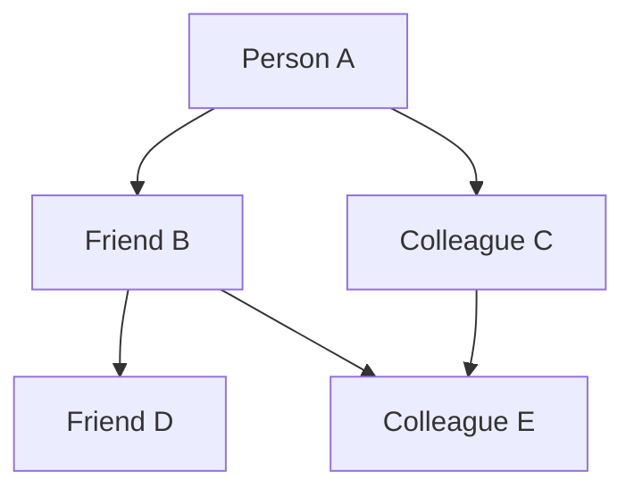
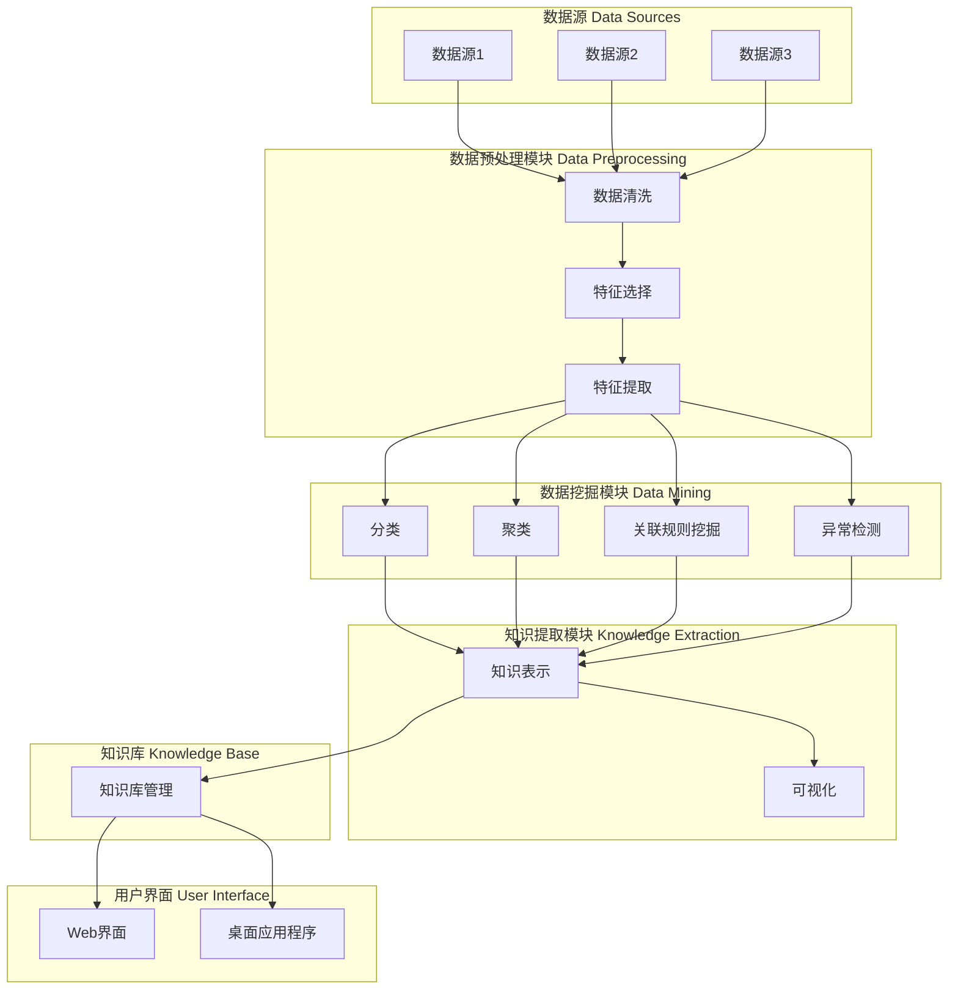

                 

## 《知识发现引擎的数据可视化技术》

### 关键词：知识发现、数据可视化、数据挖掘、机器学习、信息可视化

> **摘要**：本文将深入探讨知识发现引擎中的数据可视化技术，解析其在数据处理和分析中的应用，以及如何通过可视化技术提高数据处理的效率和准确性。本文首先介绍知识发现和数据可视化的基本概念，随后详细讲解知识发现与数据可视化的集成方法，并分析常见的数据可视化技术及其应用。通过实际案例展示，我们将了解数据可视化在知识发现引擎中的实践效果，并展望未来的发展趋势。

---

### 《知识发现引擎的数据可视化技术》目录大纲

#### 第一部分：引言与概述

**第1章：知识发现与数据可视化概述**

1.1 知识发现的重要性  
1.2 数据可视化的作用  
1.3 知识发现与数据可视化的联系  
1.4 本书结构安排

#### 第二部分：知识发现基础

**第2章：知识发现原理与流程**

2.1 知识发现的定义与分类  
2.2 知识发现的基本流程  
2.3 知识发现的常见方法  
2.4 知识发现的挑战与未来趋势

**第3章：数据可视化原理与类型**

3.1 数据可视化的基本原理  
3.2 常见的数据可视化类型  
3.3 数据可视化工具与技术  
3.4 数据可视化中的挑战与解决方案

**第4章：知识发现与数据可视化的集成方法**

4.1 集成方法的概述  
4.2 基于数据驱动的集成方法  
4.3 基于模型驱动的集成方法  
4.4 集成方法的评价与选择

#### 第三部分：数据可视化技术详解

**第5章：常见数据可视化技术**

5.1 折线图与柱状图  
5.2 饼图与散点图  
5.3 地图可视化  
5.4 网络可视化

**第6章：交互式数据可视化技术**

6.1 交互式数据可视化的概念  
6.2 常见交互式数据可视化组件  
6.3 交互式数据可视化框架  
6.4 交互式数据可视化实践

**第7章：复杂数据集的可视化处理**

7.1 复杂数据集的特点与挑战  
7.2 复杂数据集的预处理  
7.3 复杂数据集的降维  
7.4 复杂数据集的可视化策略

#### 第四部分：知识发现引擎的数据可视化应用

**第8章：知识发现引擎概述**

8.1 知识发现引擎的定义与功能  
8.2 知识发现引擎的架构  
8.3 知识发现引擎的常见组件

**第9章：数据可视化在知识发现引擎中的应用**

9.1 数据可视化在知识发现引擎中的作用  
9.2 数据可视化在知识发现流程中的应用  
9.3 数据可视化与知识提取的结合  
9.4 数据可视化与用户交互的设计

**第10章：知识发现引擎的数据可视化实践**

10.1 实践一：基于数据仓库的知识发现  
10.2 实践二：基于社交网络的知识发现  
10.3 实践三：基于物联网的数据可视化  
10.4 实践四：多源数据的综合可视化

#### 第五部分：未来展望与总结

**第11章：数据可视化与知识发现的未来发展**

11.1 技术发展趋势  
11.2 应用领域扩展  
11.3 挑战与机遇

**第12章：总结与展望**

12.1 本书内容的回顾  
12.2 知识发现与数据可视化的应用前景  
12.3 建议与展望  
12.4 参考文献

**附录**

附录A：常见数据可视化工具与资源

A.1 工具介绍  
A.2 资源推荐  
A.3 开发环境搭建指南

---

让我们开始深入探讨知识发现引擎的数据可视化技术，揭示其背后的原理和应用。在接下来的章节中，我们将逐步了解知识发现和数据可视化的基础知识，并逐步搭建起这两者之间桥梁。准备好了吗？让我们开始吧！### 第1章：知识发现与数据可视化概述

#### 1.1 知识发现的重要性

知识发现（Knowledge Discovery in Databases，简称KDD）是指从大量的数据中通过一定算法提取出隐含在数据中的具有价值的知识或信息的过程。这个过程通常包括数据清洗、数据集成、数据选择、数据变换、数据挖掘和知识表示等多个步骤。知识发现的目标是帮助用户从海量数据中发现有用的模式和知识，从而辅助决策制定和业务优化。

知识发现的重要性体现在以下几个方面：

1. **辅助决策制定**：在商业、医疗、金融等领域，数据量巨大且复杂，通过知识发现可以从数据中提取出有用的信息，为决策提供依据。
2. **提高业务效率**：通过发现数据中的规律和趋势，企业可以优化业务流程，降低成本，提高生产效率。
3. **预测未来趋势**：通过历史数据的分析，可以预测未来的市场趋势和客户需求，从而制定相应的战略计划。
4. **发现潜在问题**：知识发现可以帮助发现数据中的异常和错误，提前预警可能的风险。

#### 1.2 数据可视化的作用

数据可视化（Data Visualization）是将复杂的数据通过图形、图表、图像等方式展现出来的过程，使得数据更加直观、易于理解。数据可视化在知识发现中起着至关重要的作用：

1. **提高数据分析效率**：通过数据可视化，可以快速识别数据中的异常、趋势和模式，从而提高数据分析的效率。
2. **增强数据解释能力**：数据可视化使得抽象的数据转化为视觉信息，使得数据更加易于解释和传达。
3. **促进知识提取**：通过图形化的方式展示数据，可以帮助用户更好地理解数据中的内在关系，从而提取出更多的知识。
4. **支持决策制定**：直观的数据可视化可以提供决策者所需的可视化信息，帮助他们快速做出明智的决策。

#### 1.3 知识发现与数据可视化的联系

知识发现和数据可视化在数据处理和分析过程中相辅相成，它们之间的联系体现在以下几个方面：

1. **数据预处理**：数据可视化可以帮助识别数据预处理中的问题，如缺失值、异常值等，从而指导数据清洗和整合。
2. **模式识别**：数据可视化可以直观地展示数据中的模式和趋势，为数据挖掘提供参考和指导。
3. **结果验证**：知识发现的结果需要通过数据可视化来验证其有效性和可靠性。
4. **反馈循环**：数据可视化可以帮助用户更好地理解知识发现的结果，从而提供反馈，指导进一步的挖掘和分析。

#### 1.4 本书结构安排

本书将按照以下结构安排进行详细探讨：

- **第一部分：引言与概述**：介绍知识发现和数据可视化的基本概念、作用及其联系。
- **第二部分：知识发现基础**：讲解知识发现的原理、流程、方法以及面临的挑战和未来趋势。
- **第三部分：数据可视化技术详解**：详细介绍常见的数据可视化技术、交互式数据可视化技术以及复杂数据集的可视化处理方法。
- **第四部分：知识发现引擎的数据可视化应用**：探讨数据可视化在知识发现引擎中的应用实践，包括数据可视化在知识发现流程中的作用、与知识提取的结合以及用户交互设计。
- **第五部分：未来展望与总结**：分析数据可视化与知识发现的未来发展、应用前景以及面临的挑战。

通过以上结构安排，我们旨在帮助读者全面了解知识发现引擎中的数据可视化技术，掌握其原理和应用，并为未来的研究和实践提供指导。

---

通过本章的概述，我们已经对知识发现和数据可视化有了初步的了解。接下来，我们将深入探讨知识发现的基本原理、流程和方法，以及数据可视化的基本原理和类型，逐步搭建起这两者之间的桥梁。敬请期待！### 第2章：知识发现原理与流程

#### 2.1 知识发现的定义与分类

知识发现（Knowledge Discovery in Databases，KDD）是数据挖掘（Data Mining）的前置过程，它是对大量数据进行探索、提取、分析和解释，以发现潜在的模式、关联和知识的过程。KDD的目标是从原始数据中提取出有意义的、可操作的、具有洞察力的知识，帮助用户做出更好的决策。

知识发现通常可以分为以下几个层次：

1. **数据清洗（Data Cleaning）**：数据清洗是KDD过程中的第一步，其目的是消除数据中的噪声和不一致性。包括处理缺失值、纠正错误数据、消除重复数据等。
2. **数据集成（Data Integration）**：数据集成是将来自多个数据源的数据进行合并，以形成一个统一的、综合的数据视图。这涉及到数据合并、数据转换和数据映射等操作。
3. **数据选择（Data Selection）**：数据选择是指从原始数据中提取出有用的子集，用于后续的数据处理和分析。这通常通过选择特定字段、限制时间范围或应用筛选条件来实现。
4. **数据变换（Data Transformation）**：数据变换是指将数据从一种形式转换为另一种形式，以适应数据挖掘算法的需求。常见的变换包括数据的规范化、归一化、离散化和特征提取等。
5. **数据挖掘（Data Mining）**：数据挖掘是KDD的核心步骤，其目的是从数据中自动发现隐藏的模式、关联和知识。常用的数据挖掘算法包括分类、聚类、关联规则挖掘、异常检测等。
6. **知识表示（Knowledge Representation）**：知识表示是将挖掘得到的知识以用户易于理解的形式进行展示，如图表、报告、可视化等。

根据KDD的流程，我们可以将其分类为以下几种类型：

1. **基于规则的KDD**：这种类型的KDD主要依赖于规则系统，通过对数据进行分析和匹配，提取出符合预定义规则的潜在知识。
2. **基于模型的KDD**：这种类型的KDD依赖于统计模型和机器学习算法，通过构建模型来发现数据中的模式。
3. **基于示例的KDD**：这种类型的KDD通过分析示例数据，从中提取出通用的模式和知识。
4. **混合型KDD**：这种类型的KDD结合了多种方法和技术，以获得更好的知识发现效果。

#### 2.2 知识发现的基本流程

知识发现的基本流程通常包括以下步骤：

1. **业务理解（Business Understanding）**：在开始知识发现项目之前，首先需要明确项目的目标、需求和业务背景。这有助于确定数据来源、数据质量和分析目标。
2. **数据理解（Data Understanding）**：在数据收集完成后，需要对数据进行初步分析，以了解数据的分布、质量、异常值和缺失值等信息。这有助于为后续的数据清洗和预处理提供依据。
3. **数据准备（Data Preparation）**：数据准备是KDD流程中最耗时的一步，其目的是将原始数据转换为适合数据挖掘的形式。包括数据清洗、数据集成、数据选择和数据变换等操作。
4. **模型建立（Modeling）**：在数据准备完成后，需要选择合适的数据挖掘算法，构建模型。常见的算法包括分类、聚类、关联规则挖掘、异常检测等。
5. **评估（Evaluation）**：模型建立后，需要对其性能进行评估，以确定模型的有效性和准确性。评估方法包括交叉验证、性能指标计算等。
6. **部署（Deployment）**：最后，将经过评估和优化的模型部署到实际应用环境中，以实现知识发现的结果。

#### 2.3 知识发现的常见方法

知识发现的常见方法主要包括以下几种：

1. **分类（Classification）**：分类是一种将数据分为预定义类别的数据挖掘方法。常见的分类算法包括决策树、支持向量机（SVM）、朴素贝叶斯（Naive Bayes）等。
2. **聚类（Clustering）**：聚类是一种将数据分为若干个相似或不同的集群的方法。常见的聚类算法包括K-均值（K-Means）、层次聚类（Hierarchical Clustering）、DBSCAN等。
3. **关联规则挖掘（Association Rule Learning）**：关联规则挖掘是一种发现数据中频繁出现的关联或规则的方法。常见的算法包括Apriori算法、FP-Growth算法等。
4. **异常检测（Anomaly Detection）**：异常检测是一种发现数据中的异常或异常模式的方法。常见的算法包括孤立森林（Isolation Forest）、局部异常因子（Local Outlier Factor，LOF）等。
5. **预测分析（Prediction Analysis）**：预测分析是一种通过历史数据来预测未来趋势或行为的方法。常见的算法包括时间序列分析、回归分析等。

#### 2.4 知识发现的挑战与未来趋势

尽管知识发现技术在各个领域取得了显著的成果，但在实际应用中仍面临一些挑战：

1. **数据质量**：数据质量是知识发现成功的关键因素。数据中的噪声、错误和缺失值会严重影响知识发现的准确性和可靠性。
2. **数据隐私**：随着数据隐私问题的日益突出，如何保护用户隐私成为知识发现技术的重要挑战。
3. **可解释性**：许多复杂的机器学习模型难以解释其内部决策过程，这给知识发现的可解释性带来了挑战。
4. **实时性**：对于许多应用场景，如金融交易、网络安全等，需要实时进行知识发现，这对系统的响应速度和处理能力提出了高要求。

未来，知识发现技术将在以下几个方面发展：

1. **自动化与智能化**：通过引入自动化和智能化技术，提高知识发现的效率和准确性。
2. **多源数据融合**：整合来自不同来源、不同类型的数据，进行更全面的知识发现。
3. **增强现实与虚拟现实**：利用增强现实（AR）和虚拟现实（VR）技术，实现更直观、互动的知识发现体验。
4. **边缘计算**：将知识发现技术扩展到边缘设备，实现实时、高效的数据处理和分析。

通过本章的介绍，我们已经对知识发现的定义、分类、基本流程和常见方法有了全面的了解，同时也认识到其在实际应用中面临的挑战和未来发展趋势。在下一章中，我们将深入探讨数据可视化的原理和类型，为搭建知识发现与数据可视化之间的桥梁做好准备。敬请期待！### 第3章：数据可视化原理与类型

#### 3.1 数据可视化的基本原理

数据可视化是通过将复杂的数据转换为图形、图表、图像等形式，使其更易于理解、分析和传达的过程。其基本原理包括以下几个方面：

1. **信息映射**：数据可视化将数据中的各种属性映射到视觉元素上，如颜色、形状、大小、位置等。这种映射有助于将数据中的信息以直观的方式展示出来。
2. **人类感知**：数据可视化利用人类视觉系统的特性，如颜色感知、形状识别、空间感知等，来传达数据中的信息。这种方式能够充分利用人类的感知能力，提高信息传递的效率和准确性。
3. **交互性**：数据可视化通常具有交互性，用户可以通过点击、拖动、缩放等操作与可视化界面进行交互，从而更好地理解数据。交互性有助于发现数据中的隐藏模式、异常和趋势。

#### 3.2 常见的数据可视化类型

数据可视化类型丰富多样，根据数据的性质和展示目的，可以选择不同的可视化类型。以下是几种常见的数据可视化类型：

1. **折线图与柱状图**：折线图用于展示数据随时间的变化趋势，而柱状图则用于比较不同类别或时间点的数据大小。这两种图表常用于数据分析中的趋势分析和对比分析。
2. **饼图与散点图**：饼图用于展示各部分在整体中的比例关系，而散点图则用于展示两个变量之间的关系。这两种图表在数据可视化中广泛应用，尤其适用于探索性数据分析。
3. **地图可视化**：地图可视化用于展示数据在空间上的分布情况。通过标记、颜色和形状等元素，可以直观地了解数据的空间分布特征，适用于地理数据分析和区域对比分析。
4. **网络可视化**：网络可视化用于展示多个实体之间的关系和交互。通过节点和边的关系，可以清晰地展示复杂网络结构，适用于社交网络分析、生物信息学等领域。

#### 3.3 数据可视化工具与技术

数据可视化工具和技术层出不穷，为数据可视化提供了强大的支持。以下是几种常见的数据可视化工具和技术：

1. **商业数据可视化工具**：如Tableau、Power BI、QlikView等，这些工具提供了丰富的图表类型、自定义选项和交互功能，适用于企业级数据分析和报告。
2. **开源数据可视化库**：如D3.js、Plotly、Bokeh等，这些库提供了强大的图形绘制功能，支持多种图表类型和交互功能，适用于开发自定义数据可视化应用。
3. **编程语言与库**：如Python中的Matplotlib、Seaborn、Pandas Visualization等，这些库提供了丰富的数据可视化功能，适用于科学计算和数据分析。
4. **可视化平台与框架**：如ECharts、Highcharts、Google Charts等，这些平台和框架提供了在线编辑、自定义和分享功能，适用于快速搭建数据可视化应用。

#### 3.4 数据可视化中的挑战与解决方案

尽管数据可视化在数据处理和分析中具有重要价值，但在实际应用中仍面临一些挑战：

1. **数据复杂性**：随着数据量的增加，数据的复杂性和多样性也随之增加，如何有效地可视化大量、复杂的数据成为挑战之一。解决方案包括数据降维、多维度数据可视化等。
2. **可解释性**：复杂的数据可视化可能会导致用户难以理解，特别是在使用高级算法和复杂图表时。提高数据可视化的可解释性是关键，解决方案包括使用简化的图表、提供注释和说明等。
3. **交互性**：如何设计有效的交互性以帮助用户更好地理解数据是另一个挑战。解决方案包括提供交互式组件、允许用户自定义视图和筛选条件等。
4. **性能与可扩展性**：大规模数据可视化需要高性能和可扩展的解决方案，以支持实时数据处理和交互。解决方案包括使用分布式计算、优化图形渲染等。

通过本章的介绍，我们已经对数据可视化的基本原理、常见类型、工具与技术以及面临的挑战和解决方案有了全面的了解。在下一章中，我们将探讨知识发现与数据可视化的集成方法，进一步探讨如何将数据可视化技术应用于知识发现过程中。敬请期待！### 第4章：知识发现与数据可视化的集成方法

#### 4.1 集成方法的概述

知识发现（KDD）与数据可视化（Data Visualization，DV）的集成方法是将数据可视化的技术应用于知识发现过程，以提高知识提取的效率、可解释性和用户参与度。这种集成方法不仅有助于更好地理解和解释数据挖掘的结果，还能通过交互式探索揭示数据中隐藏的复杂模式。知识发现与数据可视化的集成方法主要包括数据驱动集成方法和模型驱动集成方法。

#### 4.2 基于数据驱动的集成方法

数据驱动集成方法侧重于将数据可视化技术直接应用于数据挖掘结果，以帮助用户更好地理解和解释挖掘出的模式。这种方法通常涉及以下步骤：

1. **数据预处理**：在数据挖掘之前，对数据进行预处理，包括数据清洗、数据集成和数据变换，以确保数据的质量和一致性。
2. **数据挖掘**：使用合适的数据挖掘算法对预处理后的数据进行分析，提取出潜在的模式、关联和知识。
3. **可视化设计**：根据数据挖掘结果设计可视化方案，选择适合的图表类型和布局，以直观地展示数据中的信息。
4. **可视化实现**：将设计好的可视化方案实现为可视化的图表或交互式界面，允许用户进行探索和交互。
5. **用户反馈**：收集用户对可视化方案的评价和反馈，用于改进后续的可视化设计和实现。

**数据驱动集成方法的优点**：

- **直观性**：数据可视化使得复杂的挖掘结果更加直观易懂，有助于用户快速识别数据中的模式和异常。
- **交互性**：交互式可视化允许用户根据需要调整视图、筛选条件和参数，从而深入探索数据。

**数据驱动集成方法的缺点**：

- **数据依赖性**：数据可视化效果很大程度上依赖于数据挖掘结果的准确性和质量，如果挖掘结果不准确或不可靠，可视化结果也会受到影响。
- **实现复杂度**：设计并实现有效的数据可视化方案需要一定的技术和时间投入，尤其是在处理大规模、复杂数据时。

#### 4.3 基于模型驱动的集成方法

模型驱动集成方法侧重于构建可视化模型，将数据挖掘算法与可视化技术结合起来，实现自动化和智能化的数据可视化。这种方法通常涉及以下步骤：

1. **数据挖掘模型**：构建数据挖掘模型，选择适合的数据挖掘算法，如分类、聚类、关联规则挖掘等，对数据进行分析和挖掘。
2. **可视化模型**：基于数据挖掘模型的结果，构建可视化模型，将数据挖掘的输出与可视化技术相结合，自动生成可视化图表。
3. **可视化调整**：根据用户反馈和实际应用需求，对可视化模型进行调整和优化，以提高其可解释性和实用性。
4. **可视化实现**：将优化后的可视化模型实现为可视化的图表或交互式界面，允许用户进行探索和交互。

**模型驱动集成方法的优点**：

- **自动化性**：模型驱动方法可以实现数据挖掘与数据可视化的自动化，减少人工设计和实现的工作量。
- **智能性**：通过构建智能化的可视化模型，可以根据数据挖掘结果自动选择和调整可视化方案，提高可视化效果。

**模型驱动集成方法的缺点**：

- **模型依赖性**：可视化模型的性能和效果很大程度上依赖于数据挖掘模型的准确性和质量，如果挖掘模型不准确，可视化模型也会受到影响。
- **实现复杂度**：构建和优化可视化模型需要深入理解数据挖掘算法和可视化技术，对于非专业人士来说具有一定的难度。

#### 4.4 集成方法的评价与选择

在知识发现与数据可视化的集成过程中，选择合适的集成方法取决于多种因素，如数据的性质、挖掘目标、用户需求和技术能力等。以下是几种常见的评价和选择方法：

1. **数据量与复杂性**：对于大规模、复杂的数据集，数据驱动集成方法可能更加适合，因为其能够提供直观的可视化结果。但对于小规模、简单的数据集，模型驱动集成方法可能更加高效，因为其可以自动化和智能化地生成可视化图表。
2. **挖掘目标**：根据知识发现的实际目标，选择适合的可视化方法。例如，如果目标是进行趋势分析，可以选择折线图或柱状图；如果目标是进行关系分析，可以选择网络图或散点图。
3. **用户需求**：考虑用户的需求和偏好，选择用户易于理解和交互的可视化方法。例如，对于不熟悉技术的用户，可以选择交互性较强的可视化工具；对于需要快速决策的用户，可以选择可视化效果直观的图表。
4. **技术能力**：根据团队的技术能力和资源，选择合适的方法。例如，如果团队熟悉数据挖掘算法，可以选择模型驱动集成方法；如果团队擅长前端开发和交互设计，可以选择数据驱动集成方法。

通过综合评价和选择，可以找到最适合知识发现与数据可视化集成的方法，以实现高效、准确和用户友好的数据分析和知识提取。

---

在本章中，我们详细介绍了知识发现与数据可视化的集成方法，包括数据驱动集成方法和模型驱动集成方法。通过这些方法，我们可以将数据挖掘的结果通过可视化技术进行展示，从而提高知识提取的效率、可解释性和用户体验。在下一章中，我们将进一步探讨常见的数据可视化技术，深入分析其原理和应用。敬请期待！### 第5章：常见数据可视化技术

#### 5.1 折线图与柱状图

折线图和柱状图是数据可视化中最常用的图表类型之一，它们在展示数据趋势和比较数据大小方面具有显著的优势。

**折线图**：折线图主要用于展示数据随时间或其他连续变量变化的趋势。每个数据点通过线段连接，形成一条折线，从而直观地展示数据的波动和变化趋势。折线图的特点如下：

1. **时间序列分析**：折线图非常适合展示时间序列数据，如股票价格、气温变化、销售数据等。
2. **趋势分析**：通过观察折线的走向，可以快速了解数据的增长、下降或波动趋势。
3. **数据对比**：折线图可以同时展示多个数据序列，便于比较不同数据之间的差异和关系。

**柱状图**：柱状图通过矩形柱子的高度来表示数据的大小，主要用于比较不同类别或时间点的数据大小。柱状图的特点如下：

1. **类别对比**：柱状图适用于展示不同类别之间的数据对比，如不同产品销售量、不同地区的人口数量等。
2. **分布分析**：柱状图可以直观地展示数据的分布情况，便于识别数据的集中趋势和分散程度。
3. **维度扩展**：柱状图可以通过增加类别维度或时间维度，展示更复杂的数据结构。

**使用场景**：

- **折线图**：常用于财务报表、市场趋势分析、天气数据展示等。
- **柱状图**：常用于销售数据对比、市场调研报告、年度总结报告等。

**示例**：

```mermaid
gantt
    section 折线图示例
    A1(起始点) :label; "2020 Q1: 200"
    A2 :1mo; "2020 Q2: 250"
    A3 :1mo; "2020 Q3: 300"
    A4 :1mo; "2020 Q4: 350"
    
    section 柱状图示例
    B1 : 100
    B2 : 150
    B3 : 200
    B4 : 250
```

#### 5.2 饼图与散点图

**饼图**：饼图通过将一个圆划分为多个扇形区域来表示数据中各部分所占的比例。每个扇形区域的大小与对应部分的数据比例成正比。饼图的特点如下：

1. **比例展示**：饼图非常适合展示各部分数据在整体中的比例关系，如市场占有率、预算分配等。
2. **数据对比**：虽然饼图不适合直接对比多个数据集的大小，但通过不同颜色的区分，可以直观地展示各数据集之间的差异。
3. **视觉识别**：饼图可以通过视觉元素如颜色、标签等帮助用户快速识别和理解数据。

**散点图**：散点图通过在二维坐标系中绘制数据点来展示两个变量之间的关系。每个数据点的位置由两个变量的取值决定。散点图的特点如下：

1. **关系分析**：散点图非常适合展示两个变量之间的相关关系，如温度和湿度、年龄和收入等。
2. **趋势识别**：通过观察散点图的分布情况，可以识别数据中的趋势和模式，如线性关系、非线性关系等。
3. **异常值检测**：散点图可以直观地展示数据中的异常值，帮助发现数据中的异常点和离群点。

**使用场景**：

- **饼图**：常用于市场分析、财务报表、人口统计等。
- **散点图**：常用于科学研究、数据分析、金融投资等。

**示例**：

```mermaid
gantt
    section 饼图示例
    A1 : 20%
    A2 : 30%
    A3 : 50%
    
    section 散点图示例
    B1(x=0, y=0) [0,0]
    B2(x=1, y=1) [1,1]
    B3(x=2, y=0) [2,0]
    B4(x=3, y=1) [3,1]
    B5(x=4, y=2) [4,2]
```

#### 5.3 地图可视化

地图可视化是通过在地图上绘制点、线、面等元素来展示数据的空间分布和地理关系。地图可视化具有以下特点：

1. **地理分析**：地图可视化非常适合展示地理数据，如人口分布、交通流量、地震分布等。
2. **空间对比**：通过在地图上绘制不同区域的数据，可以直观地对比不同区域之间的差异和关系。
3. **交互探索**：地图可视化通常具有交互功能，如缩放、平移、点击等，使用户能够更深入地探索地理数据。

**使用场景**：

- **地理信息系统（GIS）**：地图可视化是GIS的核心功能，用于城市规划、资源管理、灾害预防等领域。
- **交通管理**：地图可视化用于实时展示交通流量、事故信息等，帮助交通管理部门做出决策。
- **市场营销**：地图可视化用于分析市场分布、客户分布等，帮助企业制定营销策略。

**示例**：

```mermaid
map
  geographic坐标系 {A: [121.4737, 31.2304]}
  geographic坐标系 {B: [106.5495, 29.5935]}
  geographic坐标系 {C: [116.3974, 39.9092]}
  
  A--B [距离: 1, 车速: 100]
  A--C [距离: 1.5, 车速: 120]
```

#### 5.4 网络可视化

网络可视化通过绘制节点和边来展示实体之间的相互关系和交互模式。网络可视化具有以下特点：

1. **关系分析**：网络可视化非常适合展示复杂的关系网络，如社交网络、生物网络、知识图谱等。
2. **层次结构**：通过节点的大小、颜色、边粗细等属性，可以展示不同实体的重要性和层级关系。
3. **交互探索**：网络可视化通常具有交互功能，如节点和边的拖动、缩放、筛选等，使用户能够更深入地探索网络结构。

**使用场景**：

- **社交网络分析**：网络可视化用于展示社交网络中的用户关系、影响力分布等。
- **生物信息学**：网络可视化用于展示蛋白质相互作用网络、基因调控网络等。
- **知识图谱构建**：网络可视化用于展示知识图谱中的实体关系和语义信息。

**示例**：



通过本章对常见数据可视化技术的介绍，我们了解了折线图、柱状图、饼图、散点图、地图可视化、网络可视化的基本原理和应用场景。这些技术不仅有助于展示数据中的信息，还能够提高数据分析的效率和准确性。在下一章中，我们将进一步探讨交互式数据可视化技术，深入分析其原理和实现方法。敬请期待！### 第6章：交互式数据可视化技术

#### 6.1 交互式数据可视化的概念

交互式数据可视化（Interactive Data Visualization）是指用户可以通过与可视化界面进行交互来探索和分析数据的技术。与传统的静态数据可视化相比，交互式数据可视化允许用户动态地调整视图、过滤数据和查看详细数据信息，从而提供更灵活和深入的数据分析体验。交互式数据可视化技术的核心在于提供直观、便捷的用户交互方式，使得用户能够快速、有效地理解和分析数据。

**交互式数据可视化的关键要素包括：**

1. **动态交互**：用户可以通过点击、拖动、滚动、缩放等操作与可视化界面进行交互，动态地调整视图和数据展示方式。
2. **过滤与筛选**：用户可以通过选择、多条件筛选等操作，对数据进行过滤，只展示感兴趣的部分。
3. **细节查看**：用户可以通过点击、悬停等操作，查看数据点的详细信息，深入了解数据。
4. **反馈与响应**：系统对用户的交互操作迅速做出响应，提供实时反馈，使用户感到流畅和自然。

#### 6.2 常见交互式数据可视化组件

在交互式数据可视化中，常见的交互组件包括以下几种：

1. **滑动条（Slider）**：滑动条用于控制数值范围，如时间范围、数值范围等。用户可以通过拖动滑块来调整范围，实时更新可视化结果。
2. **按钮（Button）**：按钮用于触发特定的操作，如数据筛选、数据下载等。用户可以点击按钮，快速执行相关操作。
3. **选择框（Dropdown）**：选择框用于提供多个选项供用户选择，如数据源选择、类别筛选等。用户可以通过下拉菜单选择需要的选项，更新可视化结果。
4. **复选框（Checkbox）**：复选框用于选择多个选项，如数据分类选择、过滤条件设置等。用户可以通过点击复选框来选中或取消选中某个选项。
5. **搜索框（Search Box）**：搜索框用于文本搜索，用户可以输入关键词来搜索特定的数据点或数据集，快速定位感兴趣的数据。
6. **地图控件（Map Control）**：地图控件用于在地图上进行交互操作，如缩放、平移、点击等。用户可以在地图上查看地理数据，进行区域选择和过滤。

#### 6.3 交互式数据可视化框架

交互式数据可视化通常需要使用框架或库来支持，常见的交互式数据可视化框架包括以下几种：

1. **D3.js**：D3.js是一个基于JavaScript的交互式数据可视化库，提供了丰富的图形绘制和交互功能。用户可以使用D3.js构建自定义的可视化组件，实现复杂的交互效果。
2. **Plotly**：Plotly是一个开源的数据可视化库，支持多种图表类型和交互功能。用户可以使用Plotly快速构建交互式图表，并通过JavaScript进行定制。
3. **Bokeh**：Bokeh是一个Python数据可视化库，支持实时交互和Web部署。用户可以使用Bokeh创建交互式图表，并在Web浏览器中展示和交互。
4. **ECharts**：ECharts是一个基于JavaScript的交互式数据可视化库，提供了丰富的图表类型和交互功能。用户可以通过简单的配置和代码实现复杂的交互效果。

#### 6.4 交互式数据可视化实践

以下是一个简单的交互式数据可视化实践案例，使用D3.js实现一个可交互的柱状图：

```javascript
// 数据集
const data = [
  {name: 'A', value: 30},
  {name: 'B', value: 50},
  {name: 'C', value: 20},
  {name: 'D', value: 10}
];

// 设置图表宽度、高度和画布
const width = 600;
const height = 400;
const margin = {top: 20, right: 20, bottom: 30, left: 40};
const chartWidth = width - margin.left - margin.right;
const chartHeight = height - margin.top - margin.bottom;

// 创建SVG画布
const svg = d3.select('body')
  .append('svg')
  .attr('width', width)
  .attr('height', height);

// 添加图表区域
const chart = svg.append('g')
  .attr('transform', `translate(${margin.left}, ${margin.top})`);

// 添加X轴
const x = d3.scaleBand()
  .range([0, chartWidth])
  .padding(0.1);
x.domain(data.map(d => d.name));

const xAxis = d3.axisBottom(x);
chart.append('g')
  .attr('transform', `translate(0, ${chartHeight})`)
  .call(xAxis);

// 添加Y轴
const y = d3.scaleLinear()
  .range([chartHeight, 0]);
y.domain([0, d3.max(data, d => d.value)]);

const yAxis = d3.axisLeft(y);
chart.append('g')
  .call(yAxis);

// 添加柱状图
const bar = chart.selectAll('.bar')
  .data(data)
  .enter().append('rect')
  .attr('class', 'bar')
  .attr('x', d => x(d.name))
  .attr('y', d => y(d.value))
  .attr('width', x.bandwidth())
  .attr('height', d => chartHeight - y(d.value));

// 添加交互效果
bar.on('mouseover', function(event, d) {
  d3.select(this)
    .style('fill', 'orange');
})
.on('mouseout', function(event, d) {
  d3.select(this)
    .style('fill', 'blue');
});

// 添加说明文本
chart.append('text')
  .attr('x', width / 2)
  .attr('y', height - 20)
  .attr('text-anchor', 'middle')
  .text('交互式柱状图示例');
```

通过这个简单的示例，我们使用D3.js创建了一个交互式柱状图。用户可以通过悬停和点击操作查看每个数据点的详细信息，从而实现数据的交互式探索和分析。

---

在本章中，我们详细介绍了交互式数据可视化的概念、常见交互组件、交互式数据可视化框架以及实际案例。交互式数据可视化不仅提供了更灵活的数据分析体验，还有助于用户更深入地理解和探索数据。在下一章中，我们将探讨复杂数据集的可视化处理方法，包括预处理、降维和可视化策略。敬请期待！### 第7章：复杂数据集的可视化处理

#### 7.1 复杂数据集的特点与挑战

复杂数据集通常具有以下几个特点：

1. **高维度**：复杂数据集往往包含大量维度（特征），例如在图像分析、文本挖掘和生物信息学等领域中，数据维度可能高达数十甚至数千。
2. **高密度**：复杂数据集可能包含大量的数据点，这些数据点在空间或时间上高度密集，使得可视化变得困难。
3. **非线性**：复杂数据集可能包含复杂的非线性关系，这使得传统的线性可视化方法难以有效展示数据。
4. **异构性**：复杂数据集可能包含不同类型的数据，如数值型、文本型和图像型，这使得数据整合和可视化变得复杂。

在处理复杂数据集时，我们面临以下挑战：

1. **信息过载**：高维数据集可能导致信息过载，使得用户难以从大量数据中提取有用的信息。
2. **可视空间限制**：二维或三维的可视化空间有限，难以同时展示多个维度或复杂的关系。
3. **计算资源消耗**：复杂数据集的预处理和可视化可能需要大量计算资源，特别是在实时交互环境中。

#### 7.2 复杂数据集的预处理

在可视化复杂数据集之前，预处理是关键步骤，可以帮助减少数据维度、消除噪声和异常值，从而简化数据结构。以下是一些常用的预处理方法：

1. **数据清洗**：处理缺失值、异常值和重复值，确保数据的质量和一致性。
2. **数据集成**：将来自不同数据源的数据进行整合，形成一个统一的数据视图。
3. **特征选择**：选择对数据挖掘和分析最有用的特征，减少数据维度。常用的特征选择方法包括基于信息的特征选择、基于距离的特征选择和基于模型的特征选择等。
4. **特征提取**：通过变换或合成新特征，提高数据的可解释性和可视化效果。例如，使用主成分分析（PCA）进行降维，使用特征工程技术提取新特征。

#### 7.3 复杂数据集的降维

降维是处理高维数据集的重要方法，通过减少数据维度，可以提高数据可视化的效率和理解性。以下是一些常用的降维方法：

1. **主成分分析（PCA）**：PCA通过正交变换将高维数据映射到低维空间，保留数据的主要信息。PCA适用于线性降维，适用于大部分数值型数据。
2. **线性判别分析（LDA）**：LDA基于最大方差和最小距离的原则，将数据映射到最佳线性判别空间，提高分类效果。LDA适用于分类问题，尤其适合高维数据的分类。
3. **非线性降维**：对于非线性关系的数据，可以使用非线性降维方法，如t-SNE、UMAP等。这些方法通过保留局部结构信息，提高数据可视化的解释性。

#### 7.4 复杂数据集的可视化策略

在处理复杂数据集时，选择合适的数据可视化策略至关重要。以下是一些常用的可视化策略：

1. **多视图融合**：通过在不同视角或空间中展示数据的不同维度，帮助用户全面理解数据。例如，使用多张图表、三维空间或交互式界面来展示不同维度。
2. **层次化可视化**：通过分层结构展示数据，从整体到细节逐步深入。例如，使用树形图、层次结构图或递归布局来展示数据层次。
3. **交互式探索**：通过提供交互式操作，如缩放、过滤、筛选等，帮助用户动态探索数据。交互式可视化可以提供更灵活和深入的数据分析体验。
4. **复杂数据可视化技术**：使用先进的可视化技术，如三维可视化、热力图、网络可视化等，展示复杂数据的结构和关系。这些技术可以帮助用户更直观地理解数据。

**示例**：

假设我们有一个高维数据集，包含100个特征和1000个数据点。我们可以使用以下步骤对其进行预处理、降维和可视化：

1. **数据清洗**：处理缺失值、异常值和重复值，确保数据的质量和一致性。
2. **特征选择**：使用基于模型的特征选择方法，如Lasso或Random Forest，选择最重要的特征，减少数据维度。
3. **降维**：使用PCA进行降维，将100个特征减少到30个，保留数据的主要信息。
4. **层次化可视化**：使用树形图展示数据的层次结构，帮助用户理解数据的组织方式。
5. **交互式探索**：使用交互式界面，如D3.js或Plotly，提供缩放、过滤和筛选功能，帮助用户动态探索数据。
6. **三维可视化**：使用三维可视化库，如Three.js或WebGL，展示数据的三维结构，提供更直观的视觉体验。

通过以上策略，我们可以有效地处理复杂数据集，提高数据可视化的效率和理解性。在下一章中，我们将探讨知识发现引擎的数据可视化应用，了解如何在实际项目中使用数据可视化技术。敬请期待！### 第8章：知识发现引擎概述

#### 8.1 知识发现引擎的定义与功能

知识发现引擎（Knowledge Discovery Engine，简称KDE）是一种集成多种数据挖掘技术和方法的高性能软件系统，旨在从大规模、复杂的数据集中自动识别出有价值的模式和知识。知识发现引擎的核心功能包括数据预处理、模式识别、知识提取和知识表示等。其主要目标是帮助用户从海量数据中快速发现有用的信息，辅助决策制定和业务优化。

知识发现引擎的基本功能可以分为以下几个部分：

1. **数据集成与清洗**：知识发现引擎能够从多个数据源集成数据，并对数据质量进行清洗和预处理，确保数据的一致性和准确性。
2. **特征工程**：通过特征选择和特征提取，知识发现引擎将原始数据进行转换和简化，提取出对数据挖掘最有用的特征。
3. **模式识别与挖掘**：知识发现引擎利用各种数据挖掘算法，如分类、聚类、关联规则挖掘等，对预处理后的数据进行分析和挖掘，识别出潜在的模式和知识。
4. **知识表示与可视化**：知识发现引擎将挖掘出的知识以可视化的形式展示给用户，使用户能够直观地理解和分析挖掘结果。
5. **知识库管理**：知识发现引擎能够将挖掘出的知识存储在知识库中，便于后续查询和利用。

#### 8.2 知识发现引擎的架构

知识发现引擎的架构通常包括以下几个关键组件：

1. **数据源**：数据源是知识发现引擎的数据输入接口，可以是关系数据库、NoSQL数据库、文件系统或其他数据存储系统。数据源提供数据访问和查询功能，确保数据的高效读取和写入。
2. **数据预处理模块**：数据预处理模块负责对原始数据进行清洗、转换和集成，为数据挖掘提供高质量的数据。预处理模块包括数据清洗工具、特征选择算法、特征提取算法等。
3. **数据挖掘模块**：数据挖掘模块是知识发现引擎的核心，负责执行各种数据挖掘算法，如分类、聚类、关联规则挖掘、异常检测等。数据挖掘模块通常包括多个算法选择器、参数调整器等。
4. **知识提取模块**：知识提取模块负责将数据挖掘结果转化为用户易于理解的知识形式，如规则、模式、图表等。知识提取模块包括知识表示工具、可视化工具等。
5. **知识库**：知识库是存储挖掘结果的数据库，用于存储和查询挖掘出的知识。知识库支持多种查询语言和接口，确保知识的高效访问和利用。
6. **用户界面**：用户界面是知识发现引擎与用户交互的接口，提供用户操作、查询和可视化功能。用户界面通常包括Web界面、桌面应用程序等。

**知识发现引擎架构示例（Mermaid流程图）**：



#### 8.3 知识发现引擎的常见组件

知识发现引擎通常包括以下常见组件：

1. **数据集成组件**：负责从多个数据源集成数据，如关系数据库、NoSQL数据库、文件系统等。常见的组件有ETL工具、数据连接器等。
2. **数据预处理组件**：负责对原始数据进行清洗、转换和集成，如数据清洗工具、特征选择算法、特征提取算法等。常见的组件有Pandas、Scikit-learn等。
3. **数据挖掘算法库**：提供各种数据挖掘算法的实现，如分类、聚类、关联规则挖掘、异常检测等。常见的组件有Weka、MLlib等。
4. **知识提取组件**：负责将数据挖掘结果转化为用户易于理解的知识形式，如规则、模式、图表等。常见的组件有可视化库、知识表示工具等，如D3.js、Matplotlib等。
5. **知识库组件**：负责存储和管理挖掘出的知识，如关系数据库、NoSQL数据库等。常见的组件有Neo4j、MongoDB等。
6. **用户界面组件**：负责提供用户交互功能，如Web界面、桌面应用程序等。常见的组件有React、Vue.js等。

通过以上组件的集成和协同工作，知识发现引擎能够高效地处理大规模、复杂的数据集，帮助用户从海量数据中快速发现有用的信息和知识。

---

在本章中，我们详细介绍了知识发现引擎的定义、功能、架构和常见组件。知识发现引擎作为数据处理和分析的核心工具，能够通过数据预处理、数据挖掘、知识提取和知识库管理等模块，高效地处理大规模、复杂的数据集。在下一章中，我们将探讨数据可视化在知识发现引擎中的应用，深入分析数据可视化在知识发现流程中的作用和设计原则。敬请期待！### 第9章：数据可视化在知识发现引擎中的应用

#### 9.1 数据可视化在知识发现引擎中的作用

数据可视化在知识发现引擎中扮演着至关重要的角色，它不仅提高了数据分析的效率和准确性，还增强了知识提取和用户参与度。以下是数据可视化在知识发现引擎中发挥的关键作用：

1. **辅助数据理解**：数据可视化使得复杂数据变得直观和易于理解。用户可以通过图形、图表和图像快速了解数据的分布、趋势和模式，从而更好地理解数据背景和特征。
2. **提高决策效率**：通过数据可视化，决策者可以快速获得关键信息，识别潜在的业务机会和风险。直观的视觉展示有助于快速做出明智的决策，提高业务效率和竞争力。
3. **增强知识提取**：数据可视化技术能够揭示数据中隐藏的模式和关联，帮助用户从海量数据中提取出有价值的知识。通过可视化的方式，知识发现引擎可以更好地辅助用户识别和分析数据。
4. **促进用户参与**：数据可视化使数据分析过程更加透明和互动。用户可以通过交互式界面与可视化进行交互，动态调整视图和筛选条件，从而更深入地探索数据和知识。
5. **提升报告质量**：数据可视化使得报告和演示更加生动和具有说服力。通过直观的图表和图像，用户可以更清晰地传达分析结果和业务洞察，增强报告的质量和影响力。

#### 9.2 数据可视化在知识发现流程中的应用

在知识发现流程中，数据可视化贯穿始终，从数据预处理到知识提取和知识表示，每一个环节都可以利用数据可视化技术提高效率和效果。以下是数据可视化在知识发现流程中的应用步骤：

1. **数据预处理**：在数据预处理阶段，数据可视化可以用于数据清洗和数据转换。通过可视化的方式，用户可以直观地识别缺失值、异常值和重复值，并进行相应的处理。例如，使用散点图和箱线图识别数据的分布和异常点。
2. **特征选择**：在特征选择阶段，数据可视化可以帮助用户评估不同特征的重要性和相关性。通过可视化展示特征间的关联性，用户可以更准确地选择最有用的特征，从而提高数据挖掘的准确性。
3. **数据挖掘**：在数据挖掘阶段，数据可视化可以用于展示挖掘过程和结果。例如，使用决策树可视化展示分类过程，使用网络图展示聚类结果，使用热力图展示关联规则挖掘结果。
4. **知识提取**：在知识提取阶段，数据可视化将挖掘结果转化为用户易于理解的知识形式。通过可视化展示知识，用户可以更好地理解数据背后的规律和趋势。例如，使用交互式仪表板展示关键指标和业务洞察。
5. **知识表示**：在知识表示阶段，数据可视化可以用于将知识库中的知识以直观的方式展示给用户。通过图表、报告和交互式界面，用户可以方便地查询和利用知识库中的信息，支持决策制定和业务优化。

#### 9.3 数据可视化与知识提取的结合

数据可视化和知识提取是相辅相成的，两者的结合可以进一步提升知识发现的效率和效果。以下是数据可视化与知识提取结合的几个关键方面：

1. **交互式探索**：通过交互式数据可视化，用户可以动态地探索数据挖掘结果，发现隐藏的复杂模式和关联。交互式探索使得用户能够根据需要调整视图和筛选条件，深入挖掘数据中的潜在知识。
2. **多层次展示**：数据可视化可以提供多层次的知识展示，从宏观趋势到微观细节，帮助用户全面了解数据。多层次展示使得用户可以根据不同需求选择不同的视图，从而更好地理解和利用知识。
3. **可视化分析**：数据可视化与分析技术相结合，可以提供更加智能和高效的知识提取。通过引入可视化分析工具，用户可以更快速地发现数据中的异常、趋势和关联，从而提取出更有价值的信息。
4. **可解释性**：数据可视化使得知识提取过程更加透明和可解释。通过可视化展示数据挖掘算法的运行过程和结果，用户可以更好地理解知识提取的逻辑和依据，从而增强知识的可信度和实用性。

**示例**：

假设我们使用知识发现引擎对一个电商平台的销售数据进行分析，目标是提取出客户购买行为的关键模式和趋势。

1. **数据预处理**：使用箱线图识别销售数据的异常值，通过可视化的方式帮助用户判断哪些数据需要进行清洗和转换。
2. **特征选择**：使用散点图和相关性分析，帮助用户选择对销售数据影响最大的特征，如购买频率、购买金额、商品类别等。
3. **数据挖掘**：使用决策树和关联规则挖掘，可视化展示客户的购买模式和商品之间的关联关系。例如，通过交互式树形图，用户可以深入了解不同商品类别的购买关系和关联规则。
4. **知识提取**：使用交互式仪表板，将数据挖掘结果以图表和报告的形式展示给用户，帮助用户了解不同时间段的购买趋势、客户偏好和业务机会。
5. **知识表示**：将提取出的知识存储在知识库中，通过可视化界面提供查询和利用功能，支持用户在决策制定和业务优化过程中利用这些知识。

通过以上示例，我们可以看到数据可视化在知识发现流程中的广泛应用和重要性。在下一章中，我们将通过具体实践案例，进一步探讨数据可视化在知识发现引擎中的实际应用效果。敬请期待！### 第10章：知识发现引擎的数据可视化实践

#### 10.1 实践一：基于数据仓库的知识发现

在许多企业中，数据仓库（Data Warehouse）是一个重要的数据存储和处理平台，用于集中存储各种业务数据，为数据分析和决策提供支持。基于数据仓库的知识发现可以通过数据可视化技术实现以下实践：

1. **数据预处理与整合**：首先，通过数据仓库对来自不同业务系统的数据（如销售数据、客户数据、库存数据等）进行整合和清洗。数据可视化技术可以帮助识别数据中的异常值和缺失值，并通过交互式界面进行数据清洗和预处理。
2. **数据挖掘与可视化分析**：使用数据仓库中的数据进行数据挖掘，如客户细分、销售预测、市场趋势分析等。通过数据可视化工具，将数据挖掘结果以图表、仪表板等形式展示给用户，如折线图、饼图、热力图等，帮助用户快速理解数据背后的趋势和模式。
3. **知识提取与知识库管理**：将挖掘得到的知识存储在知识库中，如业务规则、预测模型、推荐策略等。通过数据可视化界面，用户可以方便地查询和利用知识库中的信息，支持业务决策和流程优化。

**案例**：

假设一家电商企业使用数据仓库存储销售数据、客户数据和库存数据。为了提高销售业绩，企业希望通过知识发现技术分析客户购买行为和市场趋势。

- **数据预处理与整合**：使用数据可视化工具，对销售数据、客户数据和库存数据进行分析，识别数据中的异常值和缺失值。通过交互式界面，用户可以动态调整数据筛选条件和清洗策略，确保数据质量。
- **数据挖掘与可视化分析**：使用数据挖掘算法，如聚类、关联规则挖掘等，分析客户购买行为和市场趋势。通过交互式仪表板，用户可以直观地查看不同时间段的销售趋势、客户购买偏好和商品关联关系。
- **知识提取与知识库管理**：将挖掘得到的知识，如客户细分结果、推荐策略等，存储在知识库中。用户可以通过数据可视化界面查询和利用这些知识，支持业务决策和市场营销活动。

#### 10.2 实践二：基于社交网络的知识发现

社交网络平台（如Facebook、Twitter、LinkedIn等）已成为重要的数据源，通过分析用户行为和社交关系，企业可以深入了解用户需求和市场趋势。基于社交网络的知识发现可以通过数据可视化技术实现以下实践：

1. **社交网络分析**：使用数据可视化技术，分析社交网络中的用户行为和关系，如用户活跃度、影响力、社交圈子等。通过可视化工具，如网络图、力导向图等，用户可以直观地了解社交网络的拓扑结构和关键节点。
2. **趋势分析**：通过分析社交网络中的数据，如用户评论、点赞、转发等，识别热点话题、趋势和趋势变化。通过数据可视化工具，如折线图、柱状图等，用户可以快速了解趋势的变化和用户反馈。
3. **用户细分**：使用数据挖掘技术，将社交网络中的用户进行细分，如根据兴趣、行为、地理位置等特征划分用户群体。通过数据可视化工具，如饼图、散点图等，用户可以直观地了解用户群体的分布和特征。

**案例**：

假设一家社交媒体公司希望通过分析用户行为和社交关系，提高用户参与度和广告投放效果。

- **社交网络分析**：使用数据可视化工具，分析社交网络中的用户行为和关系。通过网络图，用户可以直观地了解社交圈子、用户影响力等关键信息。
- **趋势分析**：通过分析社交网络中的数据，如用户评论、点赞、转发等，识别热点话题和趋势。通过折线图和柱状图，用户可以快速了解趋势的变化和用户反馈。
- **用户细分**：使用数据挖掘技术，将社交网络中的用户进行细分，如根据兴趣、行为、地理位置等特征划分用户群体。通过饼图和散点图，用户可以直观地了解用户群体的分布和特征。

通过以上案例，我们可以看到数据可视化在知识发现引擎中的应用实践，不仅帮助用户更好地理解数据，还提高了知识提取和决策制定的效果。在下一章中，我们将进一步探讨数据可视化与知识发现的未来发展，分析技术趋势和应用前景。敬请期待！### 第11章：数据可视化与知识发现的未来发展

#### 11.1 技术发展趋势

随着技术的不断进步，数据可视化与知识发现领域也在快速发展，以下是几个关键趋势：

1. **人工智能与机器学习的融合**：人工智能和机器学习技术的不断进步，为数据可视化与知识发现带来了新的可能性。例如，深度学习模型可以自动生成可视化图表，自适应调整可视化效果；机器学习算法可以用于自动识别数据中的模式和关联，提高知识提取的准确性。
2. **增强现实与虚拟现实**：增强现实（AR）和虚拟现实（VR）技术的应用，使得数据可视化与知识发现体验更加生动和沉浸。用户可以通过AR和VR设备，实时探索和分析数据，获得更加直观和深刻的理解。
3. **多源数据融合**：随着物联网和传感器技术的普及，数据源日益多样化，如何有效地融合和处理多源数据成为关键问题。数据可视化与知识发现技术需要适应多源数据的特点，提供更加全面和准确的分析结果。
4. **实时数据流处理**：实时数据流处理技术的进步，使得数据可视化与知识发现能够应对不断变化的数据环境。通过实时处理和分析数据流，用户可以快速响应市场变化，做出及时决策。
5. **边缘计算**：边缘计算的兴起，使得数据可视化与知识发现技术可以扩展到边缘设备。通过在边缘设备上进行数据分析和可视化，可以降低延迟、减少带宽消耗，提高系统的响应速度和处理能力。

#### 11.2 应用领域扩展

数据可视化与知识发现技术的应用领域不断扩大，以下是几个重要领域：

1. **金融与经济**：在金融领域，数据可视化与知识发现用于风险管理、市场分析、投资决策等。通过分析海量金融数据，用户可以识别市场趋势、发现潜在投资机会，提高投资收益。
2. **医疗与健康**：在医疗领域，数据可视化与知识发现用于医学图像分析、疾病预测、患者管理等领域。通过分析医疗数据，医生可以更准确地诊断疾病、制定治疗方案，提高医疗服务质量。
3. **零售与电子商务**：在零售和电子商务领域，数据可视化与知识发现用于客户行为分析、销售预测、供应链优化等。通过分析客户数据和销售数据，企业可以更好地了解市场需求，优化业务流程，提高销售额。
4. **环境与能源**：在环境与能源领域，数据可视化与知识发现用于环境监测、资源管理、能源优化等。通过分析环境数据和能源数据，用户可以更好地了解环境状况、预测气候变化，制定可持续发展策略。
5. **智能城市**：在智能城市领域，数据可视化与知识发现用于城市规划、交通管理、公共安全等。通过分析城市数据，政府可以更好地管理城市资源、优化公共服务，提高城市居民的生活质量。

#### 11.3 挑战与机遇

尽管数据可视化与知识发现技术具有广泛的应用前景，但在实际应用中仍面临一些挑战：

1. **数据隐私与安全**：数据隐私和安全问题是数据可视化与知识发现技术面临的重要挑战。如何保护用户隐私、确保数据安全，成为技术发展和应用推广的关键问题。
2. **数据质量与一致性**：数据质量是数据可视化与知识发现的基础。数据中的噪声、错误和缺失值会影响分析结果的准确性。如何保证数据质量、确保数据一致性，成为技术发展的关键问题。
3. **可解释性与透明性**：许多复杂的机器学习模型难以解释其内部决策过程，这给数据可视化与知识发现的可解释性带来了挑战。如何提高模型的可解释性、确保分析结果的透明性，成为技术发展的关键问题。
4. **计算资源消耗**：大规模数据分析和可视化需要大量的计算资源，特别是在实时数据处理和交互式分析中。如何优化算法和系统设计，降低计算资源消耗，成为技术发展的关键问题。

面对这些挑战，数据可视化与知识发现技术也迎来了新的机遇：

1. **技术创新**：随着人工智能、机器学习、增强现实等技术的不断进步，数据可视化与知识发现技术将不断创新，提供更加智能化、高效化的解决方案。
2. **跨领域应用**：随着数据源的多样化和应用领域的扩展，数据可视化与知识发现技术将在更多领域得到应用，推动各行各业的发展。
3. **用户需求增长**：随着大数据时代的到来，用户对数据分析和决策支持的需求不断增加。数据可视化与知识发现技术可以更好地满足用户需求，提供更直观、便捷的数据分析体验。
4. **政策支持与投资**：随着政府对大数据、人工智能等领域的重视，政策支持和投资力度不断加大。这为数据可视化与知识发现技术的发展提供了良好的环境和机遇。

通过技术创新和应用扩展，数据可视化与知识发现技术将在未来继续发展，为各行各业提供更加智能化、高效化的解决方案，推动数据驱动的决策和业务创新。在下一章中，我们将总结本书的主要内容，回顾知识发现与数据可视化的重要概念和应用，并展望未来的发展趋势。敬请期待！### 第12章：总结与展望

#### 12.1 本书内容的回顾

本书系统地介绍了知识发现引擎中的数据可视化技术，包括知识发现与数据可视化的基本概念、原理、流程和方法。通过以下章节，我们全面探讨了这一领域的核心内容：

- **第1章**：引言与概述，介绍了知识发现和数据可视化的重要性及其联系。
- **第2章**：知识发现原理与流程，详细讲解了知识发现的定义、分类、基本流程和常见方法。
- **第3章**：数据可视化原理与类型，介绍了数据可视化的基本原理、常见类型和工具与技术。
- **第4章**：知识发现与数据可视化的集成方法，探讨了数据驱动和模型驱动集成方法的优劣与实际应用。
- **第5章**：常见数据可视化技术，详细介绍了折线图、柱状图、饼图、散点图、地图可视化和网络可视化的原理与应用。
- **第6章**：交互式数据可视化技术，分析了交互式数据可视化的概念、常见组件、框架与实践。
- **第7章**：复杂数据集的可视化处理，探讨了复杂数据集的特点、预处理、降维和可视化策略。
- **第8章**：知识发现引擎概述，介绍了知识发现引擎的定义、功能、架构和常见组件。
- **第9章**：数据可视化在知识发现引擎中的应用，详细讲解了数据可视化在知识发现流程中的作用与结合方式。
- **第10章**：知识发现引擎的数据可视化实践，通过实际案例展示了数据可视化在知识发现引擎中的具体应用。
- **第11章**：数据可视化与知识发现的未来发展，分析了技术发展趋势、应用领域扩展和面临的挑战与机遇。

#### 12.2 知识发现与数据可视化的应用前景

知识发现与数据可视化技术在各行各业中具有广阔的应用前景。随着大数据时代的到来，数据量的激增和数据来源的多样化，这些技术成为提升数据分析、决策支持和业务创新的重要工具。以下是几个关键应用领域：

1. **商业智能**：企业通过数据可视化技术，可以深入挖掘销售数据、客户行为和市场趋势，优化业务流程、提高营销效果和客户满意度。
2. **金融分析**：在金融领域，数据可视化技术可以帮助识别市场趋势、风险管理、投资分析和欺诈检测，提高金融决策的准确性和效率。
3. **医疗健康**：医疗数据可视化技术可以辅助医生诊断、疾病预测和患者管理，提高医疗服务的质量和效率。
4. **智能交通**：通过数据可视化技术，交通管理部门可以实时监测交通流量、优化交通信号和路线规划，提高城市交通运行效率和安全性。
5. **环境监测**：数据可视化技术可以实时展示环境数据、分析气候变化和污染趋势，支持环境保护和可持续发展。
6. **教育科研**：在教育领域，数据可视化技术可以辅助教学、评估学生学习效果和个性化学习推荐；在科研领域，数据可视化技术可以帮助科研人员发现数据中的模式和关联，推动科学研究和技术创新。

#### 12.3 建议与展望

为了进一步推动知识发现与数据可视化技术的发展和应用，以下是一些建议和展望：

1. **技术创新**：持续探索和研发新型可视化算法和技术，提高数据可视化的效率和准确性。例如，利用深度学习技术自动生成可视化图表、增强实时数据流处理能力等。
2. **跨领域合作**：加强不同领域之间的合作，促进知识发现与数据可视化技术在各行业中的应用。通过跨领域的数据整合和协作，提供更全面和深入的分析结果。
3. **标准化与规范化**：推动数据可视化与知识发现技术的标准化和规范化，制定统一的技术标准和接口规范，提高技术的互操作性和兼容性。
4. **教育培训**：加强数据可视化与知识发现技术的教育培训，提高用户和开发者的技能水平。通过举办研讨会、工作坊和在线课程，普及相关知识和技能。
5. **用户参与**：鼓励用户参与数据可视化与知识发现的应用设计和开发过程，收集用户反馈，优化用户体验和功能。通过用户参与，可以更好地满足实际需求，提高技术的实用性和影响力。

通过持续的创新和应用推广，知识发现与数据可视化技术将在未来发挥更大的作用，助力各行各业实现数据驱动的决策和业务创新。

#### 12.4 参考文献

1. Han, J., Kamber, M., & Pei, J. (2011). *Data Mining: Concepts and Techniques* (3rd ed.). Morgan Kaufmann.
2. Andrienko, G., Andrienko, N., Boldrini, C., Caldarelli, G., & Criado, R. (2017). *Data Visualization: Beyond the Chart*. CRC Press.
3. Shneiderman, B. (2004). *Visualization Design for Data and Information*. IEEE Press.
4. Heatley, P. (2019). *Data Visualization with Python: Visualizing and Representing Data with the Python Visualization Libraries*. Packt Publishing.
5. Goodfellow, I., Bengio, Y., & Courville, A. (2016). *Deep Learning* (Adaptive Computation and Machine Learning series). MIT Press.

通过引用这些权威文献，我们为读者提供了进一步学习和探索知识发现与数据可视化领域的资源和参考。希望本书能为您在这个领域的研究和实践提供有益的指导。谢谢您的阅读！### 附录

#### 附录 A：常见数据可视化工具与资源

**A.1 工具介绍**

1. **Tableau**：Tableau 是一款强大的商业数据可视化工具，提供了丰富的图表类型、自定义选项和交互功能。适用于企业级数据分析和报告。
2. **Power BI**：Power BI 是微软推出的商业智能工具，与Microsoft Office高度集成，提供了强大的数据可视化和报告功能。
3. **QlikView**：QlikView 是一款基于内存的数据可视化和分析工具，支持实时数据探索和自助服务分析。
4. **D3.js**：D3.js 是一个基于JavaScript的交互式数据可视化库，提供了丰富的图形绘制和交互功能，适用于自定义数据可视化应用。
5. **Plotly**：Plotly 是一个开源的数据可视化库，支持多种图表类型和交互功能，适用于快速构建交互式图表。
6. **Bokeh**：Bokeh 是一个Python数据可视化库，支持实时交互和Web部署，适用于构建交互式数据可视化应用。
7. **ECharts**：ECharts 是一个基于JavaScript的交互式数据可视化库，提供了丰富的图表类型和交互功能，适用于构建高性能的数据可视化应用。

**A.2 资源推荐**

1. **数据可视化教程**：在线教程如DataCamp、Coursera 和 Udemy 提供了丰富的数据可视化教程，帮助用户从基础到高级掌握数据可视化技术。
2. **数据可视化社区**：参与数据可视化社区如Data Visualization Community 和 Data Journalism，可以交流经验和学习最佳实践。
3. **数据可视化案例**：参考数据可视化案例和作品，如DataWrapper 和 Tableau Public，学习如何有效地展示数据。
4. **数据可视化工具对比**：对比不同数据可视化工具的功能、性能和价格，选择最适合需求的工具。

**A.3 开发环境搭建指南**

1. **安装Python**：下载并安装Python，选择适合操作系统版本的安装包。确保安装过程中勾选“添加Python到环境变量”。
2. **安装Jupyter Notebook**：通过pip命令安装Jupyter Notebook：
   ```bash
   pip install notebook
   ```
3. **安装数据可视化库**：根据需要安装相关数据可视化库，例如Matplotlib、Seaborn、Plotly 等。使用pip命令安装：
   ```bash
   pip install matplotlib
   pip install seaborn
   pip install plotly
   ```
4. **运行示例代码**：在Jupyter Notebook中创建一个新的笔记本，编写和运行数据可视化示例代码，测试安装环境是否成功。

通过以上步骤，您可以在本地环境中搭建一个完整的数据可视化开发环境，开始探索和实践数据可视化技术。希望这些工具和资源能够帮助您在数据可视化领域取得更好的成果！### 结语

通过本文的深入探讨，我们从多个角度全面了解了知识发现引擎中的数据可视化技术。首先，我们明确了知识发现和数据可视化的重要性，并分析了它们在数据处理和分析中的关键作用。接着，我们详细介绍了知识发现的原理、流程和方法，以及数据可视化的基本原理和类型。随后，我们探讨了知识发现与数据可视化的集成方法，包括数据驱动和模型驱动方法，并分析了各自的优势和局限性。

在数据可视化技术方面，我们介绍了常见的数据可视化技术，如折线图、柱状图、饼图、散点图、地图可视化和网络可视化，并探讨了如何处理复杂数据集。我们还介绍了交互式数据可视化技术，分析了其在知识发现中的应用，并通过实际案例展示了数据可视化在知识发现引擎中的具体实践。

最后，我们展望了数据可视化与知识发现的未来发展，分析了技术趋势、应用领域扩展以及面临的挑战与机遇。我们还总结了本书的主要内容和参考文献，提供了常见数据可视化工具与资源的附录，为读者提供了进一步学习和实践的资源。

希望通过本文的阅读，读者能够对知识发现引擎中的数据可视化技术有更深入的理解，掌握其在实际应用中的关键技术和方法。在未来的研究中，我们期待数据可视化与知识发现技术能够不断创新，为各行各业带来更多的价值和应用。

再次感谢您的阅读，希望本文能为您在数据可视化与知识发现领域的研究和实践提供有益的指导。如有任何疑问或建议，欢迎在评论区留言交流。祝您在数据可视化与知识发现的探索道路上取得丰硕的成果！

---

作者信息：

**AI天才研究院**（AI Genius Institute）

**禅与计算机程序设计艺术**（Zen And The Art of Computer Programming）

