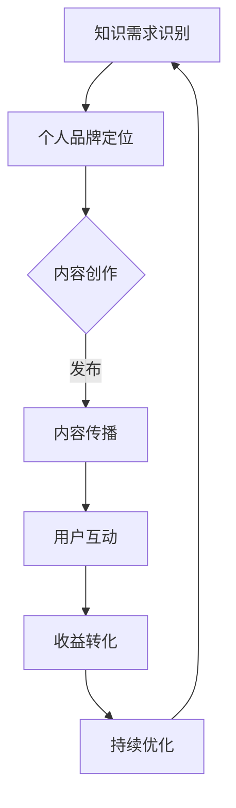

                 

### 《知识变现：程序员的第二职业》

在当今快速发展的科技时代，程序员作为信息技术领域的中坚力量，不仅拥有技术优势，更具备知识储备和创新思维。然而，如何在激烈的市场竞争中脱颖而出，实现个人价值的最大化，成为每个程序员都需要思考的问题。本文将围绕“知识变现”这一主题，深入探讨程序员如何通过自身的知识储备和技能，实现从专业程序员到知识变现专家的华丽转变。

**关键词：** 知识变现、程序员、多技能发展、个人品牌、内容创作、线上课程、案例分析、挑战与应对、工具与资源

**摘要：** 本文将从知识变现的概念、程序员的多技能发展、知识变现策略、案例分析、挑战与应对以及知识变现工具与资源等方面，全面解析程序员如何通过知识变现实现第二职业的成功转型。通过本文的深入探讨，读者将了解知识变现的本质和策略，掌握实现知识变现的实践方法，为自身的发展提供有力支持。

### 《知识变现：程序员的第二职业》目录大纲

#### 第一部分：知识变现概述

##### 第1章：知识变现的概念与价值
- 1.1 知识变现的定义与背景
- 1.2 程序员进行知识变现的潜力
- 1.3 知识变现的趋势与未来

##### 第2章：程序员的多技能发展
- 2.1 程序员技能的广度与深度
- 2.2 技能整合与跨界思维
- 2.3 程序员技能市场分析

#### 第二部分：知识变现策略

##### 第3章：个人品牌建设
- 3.1 个人品牌的定义与重要性
- 3.2 个人品牌定位与目标市场
- 3.3 个人品牌建设的方法与工具

##### 第4章：内容创作与传播
- 4.1 内容创作策略
- 4.2 内容形式与平台选择
- 4.3 内容传播与粉丝互动

##### 第5章：知识付费模式
- 5.1 知识付费产品类型
- 5.2 知识付费平台分析
- 5.3 知识付费的收益模式

##### 第6章：线上课程设计与推广
- 6.1 线上课程设计原则
- 6.2 课程内容规划与组织
- 6.3 线上课程的推广策略

#### 第三部分：知识变现案例分析

##### 第7章：成功案例解析
- 7.1 案例一：某程序员的知识付费之路
- 7.2 案例二：某技术博客的转型之路
- 7.3 案例三：某技术研讨会的影响力扩展

##### 第8章：知识变现之路的挑战与应对
- 8.1 面临的挑战
- 8.2 挑战的应对策略
- 8.3 持续学习与进步

#### 第四部分：知识变现工具与资源

##### 第9章：知识变现工具介绍
- 9.1 主流知识付费平台介绍
- 9.2 内容创作与编辑工具
- 9.3 社交媒体与推广工具

##### 第10章：知识变现资源汇总
- 10.1 在线学习资源
- 10.2 技术社区与论坛
- 10.3 知识变现相关书籍推荐

### 附录

- 附录A：知识变现工具与资源列表
- 附录B：常见问题解答
- 附录C：知识变现流程图（Mermaid 图）
- 附录D：知识变现算法原理（伪代码）
- 附录E：知识变现数学模型与公式
- 附录F：知识变现案例代码解读与分析

通过上述目录结构，本文将带领读者逐步了解知识变现的内涵与外延，探索程序员如何通过知识变现实现第二职业的成功转型。接下来，我们将首先对知识变现的概念进行深入探讨，为后续内容打下坚实的基础。

### 第一部分：知识变现概述

#### 第1章：知识变现的概念与价值

**1.1 知识变现的定义与背景**

知识变现，顾名思义，是将个人的知识、技能和经验转化为实际的经济收益和价值的过程。在传统的观念中，程序员主要是通过撰写代码、参与项目开发和维护来获取收入。然而，随着互联网和信息技术的发展，程序员不仅限于单纯的技术工作，他们逐渐开始探索如何将自己的知识转化为商业价值。

知识变现的定义可以从以下几个方面来理解：

1. **知识积累**：程序员在长期的技术工作中，积累了丰富的技术知识、项目经验和个人见解。
2. **价值转化**：通过个人品牌建设、内容创作和传播等手段，将这些知识转化为受众认可的价值。
3. **经济收益**：最终实现知识变现，通过知识付费、线上课程、技术咨询服务等方式，获得经济回报。

知识变现的背景可以追溯到信息技术产业的蓬勃发展。在过去，程序员的主要职责是完成软件的开发和维护。然而，随着互联网和移动互联网的普及，程序员的工作范围逐渐扩大，他们不仅需要掌握编程技能，还需要具备市场洞察力、团队协作能力、项目管理经验等。在这个过程中，知识变现成为一种新兴的商业模式，为程序员提供了更多的职业发展路径。

**1.2 程序员进行知识变现的潜力**

程序员具备知识变现的潜力主要体现在以下几个方面：

1. **专业技能**：程序员具备深厚的编程技能和项目经验，这些技能和经验是知识变现的基础。
2. **创新思维**：程序员通常具有较强的创新思维和解决问题的能力，能够从不同角度看待问题，并提出创新的解决方案。
3. **内容创作能力**：程序员可以通过撰写技术博客、编写技术书籍、录制教学视频等方式，将自己的知识和经验分享给更多人。
4. **市场需求**：随着技术市场的不断发展，越来越多的企业和个人对专业知识和技能有强烈的需求，这为程序员提供了广阔的市场空间。

**1.3 知识变现的趋势与未来**

知识变现作为一种新兴的商业模式，正在全球范围内迅速发展。以下是一些知识变现的趋势与未来展望：

1. **在线教育崛起**：随着在线教育的普及，越来越多的程序员通过开设线上课程，将自己的知识和技能传授给学习者，实现知识变现。
2. **内容付费成为主流**：随着人们消费习惯的改变，内容付费逐渐成为主流，程序员可以通过知识付费平台，将自己的专业内容变现。
3. **社交媒体影响力扩大**：通过社交媒体平台，程序员可以扩大自己的影响力，吸引更多的粉丝和受众，实现知识的传播和变现。
4. **跨界合作机会增多**：程序员可以通过跨界合作，将自己的技术知识应用到不同领域，拓展知识变现的渠道。

总之，知识变现为程序员提供了更多的职业发展机会和空间。通过不断学习、积累经验、创新思维，程序员可以充分发挥自己的知识价值，实现个人职业的跨越式发展。接下来，我们将进一步探讨程序员如何进行多技能发展，为知识变现奠定基础。

#### 第2章：程序员的多技能发展

在知识变现的大背景下，程序员不仅需要具备扎实的编程技能，还需要不断拓展自己的多技能，以适应市场需求和职业发展的要求。多技能发展是程序员实现知识变现的重要保障，它不仅能够提升个人的竞争力，还能为知识变现提供更多的可能性。本节将围绕程序员技能的广度与深度、技能整合与跨界思维、以及程序员技能市场分析等方面展开讨论。

**2.1 程序员技能的广度与深度**

1. **技能广度**：程序员技能的广度是指程序员在不同技术领域的涉猎程度。随着技术的不断发展，程序员需要掌握多种编程语言、框架和工具。例如，前端开发者需要熟悉HTML、CSS、JavaScript以及React、Vue等框架；后端开发者需要掌握Java、Python、Node.js等语言及其相关的框架。此外，程序员还需要了解数据库技术、网络编程、云计算等知识。

2. **技能深度**：技能深度则是指程序员在某一特定技术领域的研究程度和实际应用能力。例如，一个擅长数据挖掘的程序员需要深入了解各种算法、模型和工具，能够运用这些技术解决具体问题。深度技能不仅要求程序员具备扎实的基础知识，还需要具备丰富的实战经验。

在知识变现的过程中，技能广度和深度都是不可或缺的。技能广度可以帮助程序员更好地理解和应用各种技术，提高解决问题的能力；而技能深度则能够为程序员提供独特的专业优势，使其在市场上具有更高的竞争力。

**2.2 技能整合与跨界思维**

随着技术的快速发展，各领域之间的界限逐渐模糊，跨界思维成为程序员多技能发展的重要方向。跨界思维指的是将不同领域的知识和技能进行整合，创造出新的价值和应用。以下是一些跨界思维的实例：

1. **技术与艺术的结合**：例如，游戏开发中的美术设计、音效制作等，需要程序员具备艺术创作的技能，从而提升游戏的整体体验。
2. **技术与商业的结合**：例如，数据分析师需要了解市场营销、客户关系管理等商业知识，以便更好地为企业提供数据驱动的决策支持。
3. **技术与生物医学的结合**：例如，生物信息学领域需要程序员具备生物医学知识和数据分析技能，以处理大量生物数据，推动生命科学研究。

跨界思维不仅能够拓宽程序员的技能范围，还能提高其创新能力，为知识变现提供更多可能性。通过跨界思维，程序员可以将自己的技术优势应用到新的领域，创造新的商业机会。

**2.3 程序员技能市场分析**

1. **市场需求**：随着互联网和信息技术产业的快速发展，程序员的需求持续增长。企业和个人对程序员的专业技能和知识付费意愿较高，为程序员提供了广阔的市场空间。例如，在线教育平台、技术咨询公司、软件开发企业等，都需要大量具备多技能的程序员。

2. **薪酬水平**：根据市场调查，具备多技能的程序员通常具有更高的薪酬水平。例如，熟悉大数据、人工智能、区块链等前沿技术的程序员，在市场上具有更高的竞争力，薪资待遇也更为优厚。

3. **职业发展**：多技能发展的程序员在职业发展方面具有更多的选择。他们不仅可以从事技术工作，如软件开发、系统架构等，还可以转型为技术顾问、项目经理、产品经理等角色，实现职业晋升和薪酬增长。

总之，程序员的多技能发展是实现知识变现的关键。通过不断学习、实践和跨界思维，程序员可以提升自己的竞争力，开拓更多的职业发展路径。接下来，我们将进一步探讨程序员如何进行个人品牌建设，为其知识变现奠定基础。

### 第二部分：知识变现策略

#### 第3章：个人品牌建设

在知识变现的过程中，个人品牌建设至关重要。个人品牌不仅是程序员专业能力的象征，更是其在市场中脱颖而出的关键。本节将探讨个人品牌的定义与重要性，以及如何进行个人品牌定位和目标市场的选择。

**3.1 个人品牌的定义与重要性**

个人品牌是指个人在专业领域内的知名度和影响力，它反映了个人在专业能力、价值观、人际关系等方面的独特性。对于程序员而言，个人品牌不仅是其专业技能的体现，更是其在市场竞争中的独特优势。

**重要性**：

1. **提升市场竞争力**：一个有影响力的个人品牌能够为程序员在求职、项目合作、知识付费等方面提供更多的机会，提高市场竞争力。
2. **增加商业价值**：个人品牌有助于程序员在市场中树立专业形象，提高受众对知识的认可度，从而实现更高的收益。
3. **扩大影响力**：良好的个人品牌能够吸引更多的粉丝和关注者，为程序员的知识传播和变现提供更广泛的平台。

**3.2 个人品牌定位与目标市场**

1. **个人品牌定位**

个人品牌定位是个人品牌建设的基础，它决定了个人在市场中的定位和形象。定位过程中需要考虑以下因素：

- **专业领域**：确定个人在哪个技术领域具有专长，以便在市场中树立专业形象。
- **目标受众**：明确个人品牌的目标受众，了解他们的需求和偏好，以便提供更具针对性的内容和价值。
- **价值主张**：提炼个人品牌的核心价值，使其在市场中具有独特的竞争优势。

2. **目标市场**

目标市场是指个人品牌所针对的受众群体。确定目标市场需要考虑以下因素：

- **市场需求**：分析目标市场对程序员知识和技能的需求，选择具有高需求的技术领域。
- **受众特点**：了解目标市场的受众特点，包括年龄、职业、学历、技术水平等，以便提供更符合他们需求的内容。
- **竞争环境**：分析目标市场中的竞争环境，了解竞争对手的优势和劣势，以便制定更具竞争力的策略。

**3.3 个人品牌建设的方法与工具**

1. **内容创作**

内容创作是个人品牌建设的重要手段。程序员可以通过撰写技术博客、发表技术文章、编写技术书籍、录制教学视频等方式，将自己的专业知识和经验分享给受众。内容创作需要具备以下特点：

- **专业性**：内容要具有深度和广度，能够解决受众的实际问题，提供有价值的见解。
- **持续性**：保持内容创作的持续性，形成稳定的输出，建立受众对个人品牌的信任和依赖。
- **互动性**：通过评论、问答等方式，与受众互动，了解他们的需求和反馈，不断优化内容。

2. **社交媒体**

社交媒体是个人品牌传播的重要平台。程序员可以通过微博、微信公众号、知乎、Twitter等社交媒体平台，发布内容、分享动态，扩大个人品牌的影响力。在社交媒体上，程序员需要注重以下几点：

- **个性化**：保持个人品牌的个性化特点，使内容更具吸引力。
- **频率**：定期发布内容，保持活跃度，提高曝光率。
- **互动**：积极与受众互动，回应评论和提问，建立良好的互动关系。

3. **网络营销**

网络营销是个人品牌建设的重要手段。程序员可以通过搜索引擎优化（SEO）、搜索引擎营销（SEM）、社交媒体广告等方式，提高个人品牌的知名度和影响力。在实施网络营销时，需要注重以下几点：

- **目标明确**：明确网络营销的目标，如增加网站流量、提高品牌知名度等。
- **数据分析**：通过数据分析，了解营销活动的效果，不断优化策略。
- **精准定位**：针对目标受众，选择合适的营销渠道和内容形式。

总之，个人品牌建设是程序员实现知识变现的关键。通过明确个人品牌定位、目标市场，以及运用内容创作、社交媒体和网络营销等手段，程序员可以建立强大的个人品牌，实现知识变现的目标。接下来，我们将探讨如何进行内容创作与传播，为知识变现提供更多的策略和方法。

### 第4章：内容创作与传播

在知识变现的过程中，内容创作与传播是至关重要的环节。通过有效的内容创作，程序员可以把自己的知识和技能传递给更广泛的受众，从而实现知识变现。而内容传播则是让这些内容被更多人看到、理解并认可的过程。本节将详细介绍内容创作策略、内容形式与平台选择，以及内容传播与粉丝互动的方法。

**4.1 内容创作策略**

1. **确定内容主题**

内容创作的第一步是确定主题。程序员应根据自身的专业领域和目标受众的需求，选择具有针对性、实用性和前瞻性的主题。例如，对于专注于前端开发的程序员，可以选择介绍最新的前端框架、性能优化技巧等主题。

2. **内容形式多样化**

内容形式直接影响受众的接受程度和兴趣。程序员可以通过多种形式进行内容创作，如：

- **技术博客**：撰写详细的技术文章，介绍技术原理、实现方法、实战经验等。
- **视频教程**：录制视频教程，通过直观的演示和讲解，帮助受众更好地理解和掌握技术。
- **电子书**：编写电子书，系统性地整理和分享自己的知识和经验。
- **讲座与研讨会**：组织线上或线下的讲座与研讨会，与受众面对面交流。

3. **内容质量是核心**

无论选择哪种内容形式，内容质量都是决定内容传播效果的关键。程序员应注重以下几点：

- **深入浅出**：内容应既有深度，又能让受众容易理解。
- **实用性**：内容应具有实际应用价值，能够解决受众的实际问题。
- **持续更新**：保持内容的新鲜感和时效性，定期更新内容，与受众保持互动。

**4.2 内容形式与平台选择**

1. **内容形式**

根据不同的传播需求和目标受众，程序员可以选择不同的内容形式：

- **技术博客**：适用于详细讲解技术原理、工具使用、项目实战等内容。程序员可以自建博客，或使用平台如CSDN、简书等。
- **视频教程**：适用于演示性强、操作复杂的内容。程序员可以选择在Bilibili、YouTube等视频平台上发布教程。
- **电子书**：适用于系统化、结构化的知识分享。程序员可以通过Kindle、网易云阅读等平台发布电子书。
- **讲座与研讨会**：适用于与受众面对面交流、分享经验。程序员可以在线上平台如知乎Live、得到等举办讲座。

2. **平台选择**

内容平台的选择直接影响内容的传播效果。程序员应考虑以下因素：

- **受众定位**：选择与目标受众匹配的平台，如专业技术社区、大众媒体等。
- **平台特性**：了解不同平台的特性和规则，选择适合自己内容形式的平台。
- **流量和互动**：选择用户活跃度高、互动性强的平台，有利于提高内容的曝光率和受众参与度。

**4.3 内容传播与粉丝互动**

1. **内容传播**

内容传播是让内容被更多人看到的过程。程序员可以采用以下方法：

- **SEO优化**：通过搜索引擎优化，提高内容在搜索引擎中的排名，增加曝光率。
- **社交媒体推广**：利用微博、微信公众号、知乎等社交媒体平台，分享内容链接，吸引受众关注。
- **合作与跨界**：与其他领域的影响者合作，进行内容推广，扩大受众范围。
- **线上活动**：举办线上活动，如问答、互动直播等，提高内容传播的互动性和参与度。

2. **粉丝互动**

与粉丝互动是建立和维护个人品牌的重要方式。程序员应注重以下几点：

- **积极回应**：及时回应粉丝的评论和提问，展现专业性和亲和力。
- **定期互动**：定期发布动态，与粉丝保持互动，提高粉丝粘性。
- **内容反馈**：收集粉丝对内容的反馈，不断优化内容，提高受众满意度。

总之，内容创作与传播是知识变现的重要环节。通过策略性地进行内容创作、选择合适的内容形式与平台，并积极进行内容传播和粉丝互动，程序员可以有效地将自己的知识和技能传递给更多受众，实现知识变现的目标。接下来，我们将探讨知识付费模式，为程序员提供更多变现途径。

### 第5章：知识付费模式

知识付费模式是指通过提供有价值的信息、知识或技能，以获取经济回报的一种商业模式。在知识变现的过程中，知识付费模式为程序员提供了重要的变现途径。本节将介绍知识付费产品类型、主要平台分析以及知识付费的收益模式。

**5.1 知识付费产品类型**

1. **在线课程**

在线课程是知识付费中最常见的产品类型。程序员可以通过录制视频教程、直播授课等形式，将自己掌握的知识和技能传授给学员。在线课程通常分为入门级、进阶级和专家级，内容涵盖编程语言、框架、工具、数据库、云计算等多个领域。

2. **电子书**

电子书是一种以电子文档形式呈现的知识产品。程序员可以通过编写技术书籍、实战手册等，将自己的知识和经验系统化地分享给读者。电子书的形式灵活多样，包括PDF、ePub等，便于读者随时随地进行阅读。

3. **技术文档**

技术文档是程序员在项目开发过程中积累的经验和知识，如项目文档、开发指南、技术规范等。这些文档可以以付费的形式提供给需要的企业或个人，帮助他们更好地理解和应用技术。

4. **咨询服务**

咨询服务是程序员通过自身的专业知识和经验，为企业或个人提供技术指导、问题解答、项目策划等服务。这种模式通常针对具体问题或项目，按需收费。

5. **线下培训**

线下培训是指程序员在实体场所举办的技术培训班、讲座、研讨会等。线下培训具有面对面的互动优势，能够更好地传递知识和技能。

**5.2 知识付费平台分析**

1. **慕课网（imooc.com）**

慕课网是中国领先的在线教育平台之一，提供丰富的编程课程和技术文档。程序员可以在慕课网上开设个人课程，通过平台的流量和推广资源，获得更多学员和收益。

2. **网易云课堂（study.163.com）**

网易云课堂是网易旗下的在线教育平台，提供多种技术课程，包括编程语言、框架、云计算等。程序员可以在网易云课堂开设个人课程，利用平台的推广渠道和用户资源进行知识变现。

3. **CSDN学院（学院.csdn.net）**

CSDN学院是中国知名的技术社区CSDN推出的在线教育平台，提供丰富的编程课程和技术文档。程序员可以在CSDN学院开设个人课程，通过平台的流量和用户基础，实现知识变现。

4. **极客时间（time.geektime.cn）**

极客时间是专注于程序员成长的在线教育平台，提供高质量的技术课程和实战经验分享。程序员可以在极客时间开设个人课程，通过平台的流量和推广资源，获得更多学员和收益。

**5.3 知识付费的收益模式**

1. **课程销售收益**

课程销售收益是知识付费模式中最常见的收益模式。程序员通过在线平台开设课程，学员通过购买课程获得学习资格。收益主要来源于课程的销售量，通常按照学员人数进行分成。

2. **订阅模式**

订阅模式是指学员通过支付一定的费用，获得平台上的所有课程学习权限。这种模式适用于提供大量课程内容的平台，如极客时间。程序员通过订阅模式获得稳定的收益来源。

3. **咨询服务收益**

咨询服务收益是指程序员通过提供专业的技术咨询服务，按需收费。这种模式适用于解决特定问题或项目需求，收益与咨询服务的内容和难度相关。

4. **广告与推广收益**

广告与推广收益是指程序员在知识付费平台上的课程或内容中，通过广告投放和推广获得的经济回报。这种模式适用于有较高流量和用户基础的平台，如CSDN学院。

5. **线下培训收益**

线下培训收益是指程序员通过举办线下培训班、讲座、研讨会等，获得的经济回报。这种模式具有面对面的互动优势，通常收费标准较高。

总之，知识付费模式为程序员提供了多种变现途径。通过选择合适的产品类型和平台，以及灵活运用不同的收益模式，程序员可以有效地实现知识变现，提升个人职业价值。接下来，我们将探讨线上课程设计与推广的方法，为程序员提供更多实践指导。

### 第6章：线上课程设计与推广

在线上课程市场中，课程设计的好坏直接影响到学员的参与度和学习效果，而有效的推广策略则能吸引更多的学员，提升课程的知名度。本节将详细探讨线上课程的设计原则、内容规划与组织，以及推广策略。

**6.1 线上课程设计原则**

1. **明确课程目标**

课程设计的第一步是明确课程目标。程序员应明确课程希望达到的学习效果，例如提升学员的编程技能、解决特定问题的能力等。目标应具体、可衡量，并能够吸引学员的兴趣。

2. **内容结构清晰**

内容结构清晰是线上课程成功的关键。程序员应将课程内容划分为若干模块，每个模块对应一个明确的学习目标。模块之间应逻辑严密，层次分明，便于学员理解和掌握。

3. **理论与实践相结合**

线上课程应结合理论和实践，使学员能够在学习过程中既获得理论知识，又能够通过实践操作加深理解。例如，在编程课程中，程序员可以设计实际的项目练习，让学员在实际操作中巩固所学知识。

4. **互动性设计**

互动性设计能够提高学员的学习积极性，增强学习效果。程序员可以在课程中设置问答环节、讨论区、实时互动等，与学员进行互动交流，解答他们的疑问。

5. **课程迭代与更新**

线上课程应根据市场需求和学员反馈进行迭代和更新。程序员应定期检查课程内容，删除过时或错误的信息，引入新的知识点和技术趋势，保持课程的新鲜感和实用性。

**6.2 课程内容规划与组织**

1. **课程大纲**

课程大纲是课程内容规划的基础。程序员应制定详细的课程大纲，明确每个模块的内容、学习目标和预期成果。大纲应包括课程名称、模块列表、每个模块的详细内容等。

2. **课程内容**

课程内容应包括理论知识、实际操作案例和练习题。程序员可以采用PPT、视频、文本等多种形式呈现内容，确保学员能够全面、深入地学习。

3. **案例与实践**

通过实际操作案例和实践练习，学员能够更好地理解和应用所学知识。程序员应设计多样化的案例和实践任务，使学员在解决实际问题的过程中，提升技能和经验。

4. **学习资源**

提供丰富的学习资源，如参考书籍、教程、工具等，有助于学员自主学习。程序员可以在课程中推荐相关的学习资源，帮助学员拓宽知识面。

**6.3 线上课程的推广策略**

1. **平台选择**

选择适合的平台进行课程推广至关重要。程序员应考虑平台的用户基础、课程分类、推广资源等因素。例如，CSDN学院、慕课网等平台具有丰富的用户资源和推广渠道，适合初入市场的程序员。

2. **内容营销**

通过内容营销，提高课程的知名度和吸引力。程序员可以在自己的技术博客、微信公众号、微博等平台上，发布与课程相关的文章、教程、案例等，吸引潜在学员。

3. **社交媒体推广**

利用社交媒体平台，如微博、微信公众号、知乎等，推广课程。程序员可以通过发布课程介绍、学习心得、学员反馈等内容，吸引学员关注。

4. **合作与推广**

与其他领域的影响者、教育机构、企业等进行合作，共同推广课程。例如，可以邀请业内专家进行讲座、合作开发课程等，扩大课程的影响力。

5. **活动与优惠**

举办线上或线下活动，如公开课、免费试听、限时优惠等，吸引学员报名。通过优惠活动，降低学员的试错成本，提高报名率。

6. **学员互动**

通过学员互动，提高课程的口碑和影响力。程序员可以在课程中设置问答环节、讨论区，鼓励学员提问和交流，形成良好的学习氛围。

总之，线上课程设计与推广是程序员实现知识变现的重要环节。通过遵循设计原则、规划内容、制定推广策略，程序员可以提升课程的质量和吸引力，吸引更多学员，实现知识变现的目标。接下来，我们将通过成功案例分析，为程序员提供更多实践经验。

### 第7章：成功案例解析

在知识变现的道路上，许多程序员已经取得了显著的成就。本节将通过三个具体的案例，分析他们的成功经验和方法，为广大程序员提供有益的启示。

**7.1 案例一：某程序员的知识付费之路**

**背景**：小李是一名拥有十年软件开发经验的前端工程师，对React框架有深入研究。他发现市场上对React相关课程的需求较高，但现有的课程内容较为零散，缺乏系统性。

**成功经验**：

1. **内容创作**：小李利用业余时间，系统性地整理了React的知识体系，编写了详细的教程和实例代码。他将内容分为基础篇、进阶篇和实战篇，确保学员能够从入门到精通。

2. **课程设计**：小李注重课程设计的互动性和实用性，设置了问答环节、实战项目和练习题，让学员在实践过程中巩固所学知识。

3. **平台选择**：小李选择在慕课网开设个人课程，利用平台的流量和推广资源，提高课程的曝光率。

4. **推广策略**：小李通过自己的技术博客、微信公众号和微博等社交媒体平台，发布与课程相关的文章和教程，吸引学员关注。

**结果**：小李的课程上线后，受到学员的广泛好评，报名人数迅速增加。通过知识付费，小李实现了收入的显著提升。

**7.2 案例二：某技术博客的转型之路**

**背景**：张先生是一名资深的数据分析师，他在个人博客上分享了大量关于数据分析、机器学习的技术文章。随着博客的知名度不断提高，张先生开始考虑如何将博客转化为收入来源。

**成功经验**：

1. **内容升级**：张先生对博客内容进行了升级，增加了视频教程、电子书等多样化的形式，使内容更具吸引力。

2. **知识付费**：张先生在博客中推出了付费专栏，将多年积累的数据分析经验和实战案例分享给学员，通过付费获取经济回报。

3. **社群运营**：张先生建立了微信群和QQ群，与学员进行互动交流，解答他们的疑问，提高学员的满意度。

4. **广告合作**：张先生与一些数据分析工具和服务商进行广告合作，通过广告收入进一步增加博客的收益。

**结果**：通过博客的转型，张先生不仅实现了收入的增加，还扩大了自己的影响力，吸引了更多的粉丝和合作伙伴。

**7.3 案例三：某技术研讨会的成功举办**

**背景**：李女士是一名云计算专家，她在业内有较高的知名度和影响力。她决定举办一场关于云计算技术的研讨会，与同行分享经验和探讨未来趋势。

**成功经验**：

1. **主题选择**：李女士选择了当前热门的云计算技术作为研讨会的主题，确保与会者对议题感兴趣。

2. **嘉宾邀请**：李女士邀请了业内知名专家和学者作为嘉宾，提高了研讨会的专业性和吸引力。

3. **线上线下结合**：研讨会采取了线上线下结合的方式，线下与会者参与讨论，线上观众通过直播观看，扩大了研讨会的影响力。

4. **推广宣传**：李女士通过社交媒体、邮件列表、技术社区等多种渠道宣传研讨会，吸引更多的参与者。

**结果**：研讨会取得了巨大的成功，吸引了数百名行业人士参与。通过研讨会，李女士不仅扩大了自己的影响力，还为参会者提供了宝贵的学习机会。

**总结**：

以上三个案例展示了程序员通过知识变现实现成功的多种路径。无论是通过课程设计、内容创作，还是社群运营、技术研讨会，关键在于提供有价值的内容，满足市场需求，并不断优化推广策略。通过借鉴这些成功经验，程序员可以更好地实现自身的知识变现目标。

### 第8章：知识变现之路的挑战与应对

在知识变现的过程中，程序员不可避免地会遇到各种挑战。这些挑战不仅影响知识变现的效果，还可能阻碍个人职业的发展。本节将分析程序员在知识变现过程中面临的主要挑战，并探讨应对策略，帮助程序员克服困难，实现持续进步。

**8.1 面临的挑战**

1. **内容质量不高**

内容质量是知识变现的核心。如果内容质量不高，不仅会影响学员的学习效果，还会损害个人品牌的声誉。程序员在创作内容时，可能会面临技术深度不足、表达不清晰、案例不够实用等问题。

2. **市场需求变化**

市场需求是不断变化的，程序员需要不断关注行业动态，调整自己的知识体系和教学内容。否则，内容可能过时，失去市场竞争力。

3. **推广难度大**

在知识付费平台上，竞争日益激烈。程序员需要付出更多的努力进行内容推广，才能吸引到足够的目标受众。推广难度大主要表现在平台流量分配不均、用户获取成本增加等方面。

4. **时间管理困难**

知识变现需要投入大量的时间和精力，包括内容创作、课程设计、推广等环节。对于程序员来说，如何在繁忙的工作中合理安排时间，保证知识变现的效果，是一个重要挑战。

5. **版权问题**

在知识变现过程中，版权问题不容忽视。程序员需要确保自己的内容不侵犯他人的知识产权，同时也要保护自己的原创内容不受侵权。

**8.2 挑战的应对策略**

1. **提升内容质量**

提升内容质量是解决知识变现问题的关键。程序员可以通过以下策略提升内容质量：

- **深入研究**：不断学习新技术、新理论，确保内容具有深度和广度。
- **实战经验**：结合自己的项目经验和实战案例，使内容更具实用性和指导性。
- **用户反馈**：收集学员的反馈，不断优化内容，满足用户需求。

2. **适应市场需求**

适应市场需求需要程序员具备敏锐的市场洞察力。以下策略有助于程序员适应市场需求：

- **定期调研**：定期进行市场调研，了解行业动态和用户需求。
- **灵活调整**：根据市场需求调整自己的知识体系和教学内容，确保内容的时效性和前瞻性。
- **多元内容**：尝试多样化的内容形式，如视频教程、电子书、技术文档等，满足不同用户的需求。

3. **优化推广策略**

优化推广策略能够提高内容的曝光率和受众参与度。以下策略有助于程序员优化推广策略：

- **平台选择**：选择适合自己内容和目标受众的平台，利用平台的推广资源。
- **内容营销**：通过内容营销，提高课程的知名度和吸引力，如发布相关文章、案例、心得等。
- **社交媒体推广**：利用社交媒体平台，扩大内容的传播范围，提高曝光率。

4. **有效时间管理**

有效时间管理是提高知识变现效果的重要保障。以下策略有助于程序员进行有效时间管理：

- **规划时间**：合理安排每天的工作和学习时间，确保有足够的时间用于知识变现。
- **优先处理**：区分任务的优先级，优先处理重要且紧急的任务。
- **利用工具**：利用时间管理工具，如时间跟踪软件、待办事项列表等，提高时间利用率。

5. **重视版权保护**

重视版权保护是确保知识变现合法性的关键。以下策略有助于程序员重视版权保护：

- **原创内容**：确保内容为原创，不侵犯他人的知识产权。
- **版权声明**：在内容中明确声明版权信息，防止他人侵权。
- **版权登记**：对重要内容进行版权登记，以法律手段保护自己的权益。

**8.3 持续学习与进步**

知识变现不仅是一次性的活动，更是一个持续的过程。程序员需要不断学习、积累经验，才能在知识变现的道路上走得更远。以下策略有助于程序员持续学习与进步：

- **持续学习**：保持对新知识、新技术的学习热情，不断提升自己的技能水平。
- **经验分享**：通过博客、技术社区、讲座等形式，分享自己的经验和心得，与他人共同进步。
- **反馈与反思**：定期总结自己的知识变现活动，分析成功与不足，不断优化策略。

总之，知识变现之路充满了挑战，但只要程序员能够积极应对，不断提升自身能力和优化策略，就一定能够实现知识变现的目标，实现个人职业的跨越式发展。

### 第三部分：知识变现工具与资源

在知识变现的过程中，工具和资源的选择至关重要。这些工具和资源不仅能够提高内容创作和传播的效率，还能帮助程序员更好地实现知识变现的目标。本节将介绍主流知识付费平台、内容创作与编辑工具、社交媒体与推广工具，以及相关的在线学习资源和书籍推荐。

**第9章：知识变现工具介绍**

**9.1 主流知识付费平台**

1. **慕课网（imooc.com）**

慕课网是中国领先的在线教育平台之一，提供丰富的编程课程和技术文档。程序员可以在慕课网上开设个人课程，通过平台的流量和推广资源，获得更多学员和收益。

2. **网易云课堂（study.163.com）**

网易云课堂是网易旗下的在线教育平台，提供多种技术课程，包括编程语言、框架、云计算等。程序员可以在网易云课堂开设个人课程，利用平台的推广渠道和用户资源进行知识变现。

3. **CSDN学院（学院.csdn.net）**

CSDN学院是中国知名的技术社区CSDN推出的在线教育平台，提供丰富的编程课程和技术文档。程序员可以在CSDN学院开设个人课程，通过平台的流量和用户基础，实现知识变现。

4. **极客时间（time.geektime.cn）**

极客时间是专注于程序员成长的在线教育平台，提供高质量的技术课程和实战经验分享。程序员可以在极客时间开设个人课程，通过平台的流量和推广资源，获得更多学员和收益。

**9.2 内容创作与编辑工具**

1. **Markdown编辑器**

Markdown是一种轻量级的文本格式，适用于撰写技术博客和文档。常用的Markdown编辑器包括Typora、VSCode等，这些编辑器具有简洁的界面和丰富的格式化功能，便于程序员进行内容创作。

2. **视频剪辑软件**

视频剪辑软件是制作视频教程的重要工具。常用的视频剪辑软件包括Adobe Premiere、Final Cut Pro等，这些软件提供了丰富的剪辑、特效和音频处理功能，帮助程序员制作高质量的视频教程。

3. **电子书编辑器**

电子书编辑器用于编写和格式化电子书。常见的电子书编辑器包括Calibre、GitBook等，这些编辑器支持多种电子书格式，方便程序员创作和发布电子书。

**9.3 社交媒体与推广工具**

1. **微博（weibo.com）**

微博是中国最大的社交媒体平台之一，程序员可以通过微博发布技术博客、课程预告、学习心得等内容，吸引粉丝和关注。

2. **微信公众号（mp.weixin.qq.com）**

微信公众号是程序员进行内容传播和推广的重要平台。程序员可以通过公众号发布技术文章、视频教程、课程资讯等，与粉丝进行互动。

3. **知乎（zhihu.com）**

知乎是一个知识分享社区，程序员可以在知乎上撰写技术文章、回答问题，分享自己的经验和见解，提高个人品牌的知名度。

4. **LinkedIn（linkedin.com）**

LinkedIn是一个职业社交平台，程序员可以通过LinkedIn建立个人品牌，分享职业经历、技术见解，吸引潜在学员和合作伙伴。

**第10章：知识变现资源汇总**

**10.1 在线学习资源**

1. **Coursera（coursera.org）**

Coursera是一个全球性的在线学习平台，提供大量的免费和付费课程，涵盖计算机科学、数据分析、人工智能等多个领域。

2. **Udemy（udemy.com）**

Udemy是一个知名的在线教育平台，提供丰富的编程课程和技术文档。程序员可以在Udemy上学习新技术、提升技能。

3. **edX（edx.org）**

edX是一个由哈佛大学和麻省理工学院合作创办的在线教育平台，提供高质量的免费和付费课程，涵盖计算机科学、数学、人文科学等多个领域。

**10.2 技术社区与论坛**

1. **Stack Overflow（stackoverflow.com）**

Stack Overflow是一个全球最大的编程社区，程序员可以在Stack Overflow上提问、回答问题，分享编程经验和技巧。

2. **GitHub（github.com）**

GitHub是一个面向开源项目的托管平台，程序员可以在GitHub上寻找项目、提交代码、参与讨论，提高自己的编程技能。

3. **Reddit（reddit.com）**

Reddit是一个社交新闻网站，程序员可以在Reddit上关注技术话题、参与讨论，获取最新的技术资讯和资源。

**10.3 知识变现相关书籍推荐**

1. **《富爸爸，穷爸爸》**

《富爸爸，穷爸爸》是一本经典的理财书籍，作者罗伯特·清崎通过讲述自己的理财经历，向读者传授理财知识。

2. **《精益创业》**

《精益创业》是一本关于创业方法的书籍，作者埃里克·莱斯提出精益创业方法论，帮助创业者实现快速迭代和验证。

3. **《智能投资》**

《智能投资》是一本关于投资策略的书籍，作者威廉·奥尼尔提出了智能投资理论，帮助投资者在市场中取得成功。

通过上述工具和资源的介绍，程序员可以更好地进行知识变现，提高内容创作和传播的效率，实现个人职业的发展目标。接下来，我们将通过附录部分，进一步丰富和完善知识变现的相关内容。

### 附录

**附录A：知识变现工具与资源列表**

1. **知识付费平台**：
   - 慕课网（imooc.com）
   - 网易云课堂（study.163.com）
   - CSDN学院（学院.csdn.net）
   - 极客时间（time.geektime.cn）
   - Coursera（coursera.org）
   - Udemy（udemy.com）
   - edX（edx.org）

2. **内容创作与编辑工具**：
   - Markdown编辑器：Typora、VSCode
   - 视频剪辑软件：Adobe Premiere、Final Cut Pro
   - 电子书编辑器：Calibre、GitBook

3. **社交媒体与推广工具**：
   - 微博（weibo.com）
   - 微信公众号（mp.weixin.qq.com）
   - 知乎（zhihu.com）
   - LinkedIn（linkedin.com）
   - Reddit（reddit.com）

4. **技术社区与论坛**：
   - Stack Overflow（stackoverflow.com）
   - GitHub（github.com）
   - Reddit（reddit.com）

5. **知识变现相关书籍**：
   - 《富爸爸，穷爸爸》
   - 《精益创业》
   - 《智能投资》

**附录B：常见问题解答**

1. **如何选择合适的知识付费平台？**

选择知识付费平台时，应考虑以下因素：
   - 课程质量：选择课程质量高、内容丰富的平台。
   - 用户评价：参考其他用户的评价和反馈，了解平台的服务质量。
   - 推广资源：选择有较多推广资源、能帮助课程传播的平台。
   - 用户基础：选择用户基础广泛的平台，有助于提高课程的曝光率。

2. **如何进行有效的内容创作？**

进行有效的内容创作，应遵循以下原则：
   - 明确目标：确定内容的目标和受众，使内容更有针对性。
   - 深入浅出：确保内容既有深度，又能让受众容易理解。
   - 实用性：内容应具有实际应用价值，能够解决受众的实际问题。
   - 多样化形式：结合文字、图片、视频等多种形式，提高内容的吸引力。

3. **如何进行内容推广？**

进行内容推广，可以采取以下策略：
   - 内容营销：通过撰写相关文章、发布教程、分享案例等，提高内容知名度。
   - 社交媒体推广：利用微博、微信公众号、知乎等社交媒体平台，发布内容链接，吸引关注。
   - 合作与跨界：与其他领域的影响者合作，进行内容推广，扩大受众范围。
   - 活动与优惠：举办线上或线下活动，如公开课、免费试听、限时优惠等，吸引学员。

4. **如何保护自己的知识产权？**

保护知识产权，应采取以下措施：
   - 原创内容：确保内容为原创，不侵犯他人的知识产权。
   - 版权声明：在内容中明确声明版权信息，防止他人侵权。
   - 版权登记：对重要内容进行版权登记，以法律手段保护自己的权益。
   - 监测侵权：定期监测自己的内容，发现侵权行为及时采取法律措施。

**附录C：知识变现流程图（Mermaid 图）**



**附录D：知识变现算法原理（伪代码）**

```plaintext
// 伪代码：知识变现算法
function 知识变现算法(技能水平, 市场需求, 个人品牌影响力):
    初始化收益为0
    
    // 技能水平评估
    技能分数 = 计算技能水平得分(技能水平)

    // 市场需求分析
    需求分数 = 计算市场需求得分(市场需求)

    // 个人品牌影响力评估
    影响力分数 = 计算个人品牌影响力得分(个人品牌影响力)

    // 计算总分数
    总分数 = 技能分数 + 需求分数 + 影响力分数
    
    // 根据总分数调整收益
    if 总分数 > 高分阈值:
        收益 = 总分数 * 高收益系数
    else if 总分数 > 低分阈值:
        收益 = 总分数 * 中收益系数
    else:
        收益 = 总分数 * 低收益系数

    返回 收益
```

**附录E：知识变现数学模型与公式**

- 用户参与度公式：\( U = f(A, B, C) \)
    - \( A \)：个人品牌影响力
    - \( B \)：内容质量
    - \( C \)：用户互动

- 收益公式：\( R = U \times P \)
    - \( R \)：收益
    - \( U \)：用户参与度
    - \( P \)：价格或单价

**附录F：知识变现案例代码解读与分析**

**案例一：某程序员的知识付费课程开发**

- **开发环境**：VSCode
- **技术栈**：HTML/CSS/JavaScript

**代码实现**：

```javascript
// 课程内容结构
const courseContent = {
    title: "深入浅出React",
    modules: [
        { title: "React基础", content: "介绍React的基本概念和API" },
        { title: "组件化开发", content: "讲解组件化的优势和实现方法" },
        { title: "React Hooks", content: "深入探讨React Hooks的使用技巧" },
        // 更多模块
    ]
};

// 课程内容展示
function displayCourseContent(course) {
    for (const module of course.modules) {
        console.log(module.title);
        console.log(module.content);
        console.log("---------------------");
    }
}
```

**分析**：

该案例展示了如何使用JavaScript来组织课程内容，并实现课程内容的展示。代码中使用了对象和循环结构，便于扩展和修改。实际开发中，还需要考虑用户交互、内容更新、性能优化等方面。

通过上述附录内容，读者可以更全面地了解知识变现的相关工具与资源，掌握知识变现的策略和方法，为自身的知识变现之路提供有力支持。

### 总结

知识变现为程序员提供了一条实现个人价值最大化的重要路径。通过不断学习、积累经验、创新思维，程序员可以充分发挥自身的专业技能和知识储备，实现从专业程序员到知识变现专家的华丽转变。本文围绕知识变现的概念、策略、案例分析、挑战与应对以及工具与资源等方面进行了深入探讨，为程序员提供了全面的知识变现指南。

在知识变现的过程中，程序员应注重以下几点：

1. **明确目标**：确定知识变现的目标和方向，制定详细的计划和策略。
2. **内容创作**：注重内容质量，提供有深度、有广度、有实用性的内容，满足受众需求。
3. **个人品牌建设**：建立强大的个人品牌，提升市场竞争力，扩大影响力。
4. **持续学习**：保持对新知识、新技术的学习热情，不断提升自身能力。
5. **优化推广**：采用多种推广策略，提高内容的曝光率和受众参与度。

知识变现不仅是程序员实现经济收益的手段，更是个人职业发展的助推器。通过知识变现，程序员可以实现自我价值的提升，为行业和社会做出更大的贡献。

展望未来，随着信息技术的不断进步，知识变现的潜力将更加巨大。程序员应把握机遇，勇于创新，不断探索新的知识变现模式，为自己创造更广阔的发展空间。希望本文能为程序员在知识变现的道路上提供有益的启示和指导，助力他们实现个人职业的跨越式发展。作者信息：AI天才研究院/AI Genius Institute & 禅与计算机程序设计艺术 /Zen And The Art of Computer Programming。

