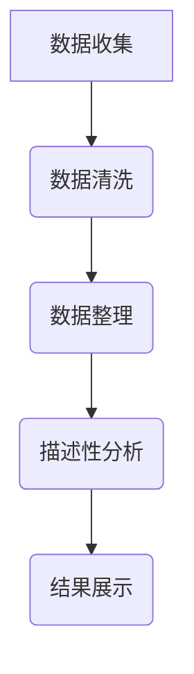
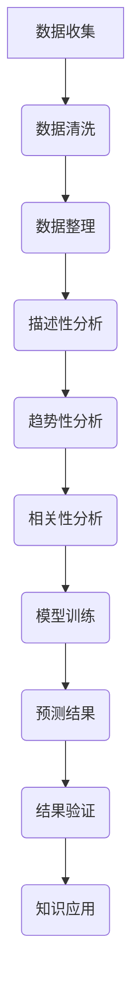

                 

### 知识的隐性与显性：挖掘潜在智慧

> **关键词**：知识，隐性知识，显性知识，智慧挖掘，数据分析，机器学习，自然语言处理

> **摘要**：本文深入探讨了知识的隐性与显性，以及如何挖掘潜在智慧。通过分析知识的概念、分类和转化，本文介绍了隐性知识的来源与特性，并探讨了显性化隐性知识的途径。此外，本文还详细阐述了智慧挖掘的技术与方法，包括数据分析、机器学习和自然语言处理的应用。通过实际案例的分析，本文展示了智慧挖掘在现实世界中的应用，并讨论了智慧挖掘的伦理与社会影响。最后，本文展望了智慧挖掘的未来发展趋势。

### 目录大纲

1. **绪论：知识与智慧的本质**
   1.1 知识的定义与分类
   1.2 智慧的本质与特征
   1.3 隐性知识与显性知识的关系

2. **隐性知识的挖掘与显性化**
   2.1 隐性知识的来源与特性
   2.2 显性化隐性知识的途径

3. **智慧挖掘技术与方法**
   3.1 数据分析技术在智慧挖掘中的应用
   3.2 机器学习技术在智慧挖掘中的应用
   3.3 自然语言处理在智慧挖掘中的应用

4. **智慧挖掘案例分析**
   4.1 企业内部隐性知识显性化
   4.2 智慧城市中的知识挖掘与利用

5. **智慧挖掘的伦理与社会影响**
   5.1 智慧挖掘的伦理问题
   5.2 智慧挖掘的社会影响

6. **智慧挖掘的未来发展趋势**
   6.1 人工智能在智慧挖掘中的应用前景
   6.2 智慧挖掘在各个领域的应用拓展

7. **总结与展望**
   7.1 研究总结
   7.2 未来研究方向

### 绪论：知识与智慧的本质

在信息技术飞速发展的今天，知识已成为现代社会的重要资源。然而，知识的表达和传递方式各有不同，这涉及到知识的隐性与显性。了解知识的本质及其转化方式，对于挖掘潜在智慧具有重要意义。

#### 1.1 知识的定义与分类

知识可以被定义为信息、技能、判断和经验的集合。知识不仅包括事实信息，还涵盖了解决问题的方法和策略。根据知识的表现形式，知识可以分为显性知识和隐性知识。

**显性知识**：显性知识是指易于表达、交流和存储的知识。这类知识通常以文字、图像、音频和视频等形式存在。例如，书籍、论文、数据库和报告等都属于显性知识的范畴。显性知识的特点是明确、系统和可传递性。

**隐性知识**：隐性知识则是指难以表达和传递的知识，通常存在于个人的经验和直觉中。这类知识具有个体性和情境依赖性，难以通过文字或语言准确地描述。例如，一个优秀的厨师的手艺、一个成功企业家的商业洞察力和一个工程师的实践经验都属于隐性知识。

#### 1.2 智慧的本质与特征

智慧是应对复杂问题和情境的能力，它不仅包括分析、推理和判断，还涉及创新和决策。智慧的本质在于能够有效地运用知识解决问题，并在不确定和动态的环境中做出合理的决策。

**智慧的特征**：

- **综合性**：智慧是对多种知识、技能和经验的整合。一个智慧的人能够在不同领域和情境中灵活运用知识和技能。

- **创造性**：智慧体现在创新思维和创造力。智慧的人能够提出新颖的解决方案，发现新的问题和机会。

- **适应性**：智慧是对环境变化和不确定性的适应能力。智慧的人能够快速调整策略，以应对新的挑战。

- **动态性**：智慧是不断发展的。智慧的人能够不断学习、进步，并适应新的知识和技能。

#### 1.3 隐性知识与显性知识的关系

隐性知识和显性知识之间存在密切的联系。隐性知识是显性知识的基础，而显性知识是对隐性知识的抽象和表达。两者之间的转化对于知识的传播和应用至关重要。

**隐性知识向显性知识的转化**：

- **显性化**：通过文字、图像、音频和视频等形式将隐性知识转化为显性知识。

- **模型化**：将隐性知识转化为数学模型、算法和流程图等，以便更直观地理解和应用。

- **系统化**：将隐性知识整合到知识管理系统、数据库和知识库中，实现知识的系统性存储和共享。

**显性知识向隐性知识的转化**：

- **内化**：通过实践和反思，将显性知识转化为个人的经验和直觉。

- **情境化**：将显性知识应用到具体的情境中，使其具有情境依赖性。

- **个性化**：根据个人的经验和背景，将显性知识转化为个性化的知识和技能。

#### 小结

知识的隐性与显性是理解知识本质的关键。隐性知识和显性知识相互依存，通过转化可以实现知识的传播和应用。智慧挖掘的目标是挖掘潜在智慧，提高个体和组织的创新能力。在接下来的章节中，我们将深入探讨隐性知识的挖掘与显性化，以及智慧挖掘的技术和方法。

### 隐性知识的挖掘与显性化

隐性知识是组织中宝贵的资源，但因其难以表达和共享，往往未能充分发挥其潜力。挖掘和显性化隐性知识是实现知识管理和创新的关键步骤。以下我们将探讨隐性知识的来源与特性，以及将其显性化的途径。

#### 2.1 隐性知识的来源与特性

隐性知识主要来源于以下几个方面：

**2.1.1 个人经验与知识**

个人的经验与知识是隐性知识的重要来源。这些知识包括个人的感知、直觉、技巧和习惯等，通常难以通过文字或语言准确表达。例如，一个经验丰富的工程师在解决问题时，可能会依赖其丰富的经验来做出决策，这些经验往往是无意识的，难以用语言描述。

**2.1.2 组织文化与惯例**

组织文化是隐性知识形成和传播的重要环境。组织中的共同价值观、信念和行为规范，会影响成员的知识共享和创造力。组织惯例，如日常操作流程、工作习惯和沟通方式等，也是隐性知识的重要载体。

**2.1.3 社会互动与协作**

社会互动和协作是隐性知识交流的重要途径。团队成员之间的互动，如会议、讨论和合作项目，有助于隐性知识的传递和共享。通过这些互动，成员可以相互学习、借鉴和创造新的知识。

**隐性知识的特性**

隐性知识具有以下特性：

- **个体性**：隐性知识往往与个人经验、直觉和习惯密切相关，具有个体性。

- **情境依赖性**：隐性知识的应用通常依赖于具体的情境，难以脱离情境独立存在。

- **难以表达性**：隐性知识难以通过文字或语言准确表达，通常需要通过实践和体验来理解和掌握。

#### 2.2 显性化隐性知识的途径

将隐性知识显性化是知识管理的重要任务。以下几种方法可以帮助将隐性知识转化为显性知识：

**2.2.1 跨领域知识融合**

跨领域知识融合是指通过整合不同领域和背景的知识，创造出新的知识。这种方法有助于挖掘和显性化隐性知识。例如，通过将工程师的经验与设计师的创意相结合，可以创造出新的产品和服务。

**2.2.2 知识管理系统的构建**

知识管理系统是一种用于收集、整理、存储和共享知识的工具。通过构建知识管理系统，可以系统地挖掘和显性化隐性知识。知识管理系统通常包括数据库、知识库和共享平台等功能，有助于实现知识的系统化和共享。

**2.2.3 智慧挖掘工具与应用**

智慧挖掘工具，如数据分析、机器学习和自然语言处理等，可以用于挖掘和显性化隐性知识。这些工具能够从大量数据中提取有价值的信息，并将其转化为显性知识。例如，通过文本挖掘和情感分析，可以从社交媒体中挖掘用户的需求和情感，从而为企业提供决策支持。

**2.2.4 个人知识管理系统（PKMS）**

个人知识管理系统是用于个人知识管理和共享的工具。通过个人知识管理系统，个人可以记录、整理和共享自己的经验、知识和技能。这种方法有助于个人不断提升自己的知识水平，同时也为组织提供了宝贵的隐性知识。

**2.2.5 情境模拟与角色扮演**

情境模拟和角色扮演是一种将隐性知识显性化的有效方法。通过模拟具体情境，让团队成员扮演不同角色，可以促进隐性知识的表达和共享。这种方法有助于团队成员更好地理解和掌握隐性知识，并将其应用于实际工作中。

#### 小结

隐性知识是组织中宝贵的资源，但因其难以表达和共享，往往未能充分发挥其潜力。通过跨领域知识融合、知识管理系统、智慧挖掘工具、个人知识管理系统和情境模拟与角色扮演等方法，可以有效地挖掘和显性化隐性知识。这些方法不仅有助于提高组织的知识管理水平，还能激发创新，提升组织的竞争力。在接下来的章节中，我们将进一步探讨智慧挖掘的技术与方法，以更深入地理解如何挖掘潜在智慧。

### 智慧挖掘技术与方法

智慧挖掘是指利用先进的技术手段，从大量数据中提取出有价值的信息和知识，从而实现智能化决策和创新能力。智慧挖掘技术涵盖了数据分析、机器学习和自然语言处理等多个领域。以下，我们将分别介绍这些技术在智慧挖掘中的应用。

#### 3.1 数据分析技术在智慧挖掘中的应用

数据分析是智慧挖掘的基础，它通过分析大量数据，提取出有价值的信息和规律。数据分析技术主要包括以下几种：

**3.1.1 描述性分析**

描述性分析是对数据的基本特征和规律进行描述，以便了解数据的基本情况。描述性分析包括数据统计、图表和总结等。例如，通过对销售数据的描述性分析，可以了解销售量、客户分布和趋势等信息。

**3.1.2 趋势性分析**

趋势性分析是通过分析数据随时间变化的趋势，预测未来的发展方向。趋势性分析包括时间序列分析和回归分析等。例如，通过对气温数据的趋势性分析，可以预测未来的气温变化。

**3.1.3 相关性分析**

相关性分析是分析不同变量之间的相关性，发现数据之间的关系。相关性分析包括线性相关、非线性相关和因果关系分析等。例如，通过对销售额和广告投入的相关性分析，可以发现广告投入对销售额的影响。

**示例：描述性分析的Mermaid流程图**



**示例：线性回归模型的伪代码**

```python
# 假设我们使用线性回归模型进行数据分析

# 输入：数据集D，特征X，目标变量y
# 输出：模型参数w，预测结果y_hat

# 初始化模型参数w
w = 初始化参数()

# 循环迭代直到收敛
while not收敛:
    # 计算预测结果
    y_hat = X * w
    
    # 计算损失函数
    loss = (y - y_hat)^2
    
    # 更新模型参数
    w = w - 学习率 * (X^T * (y - y_hat))
    
# 返回最终结果
return w, y_hat
```

#### 3.2 机器学习技术在智慧挖掘中的应用

机器学习是智慧挖掘的核心技术，它通过训练模型，从数据中自动提取特征和规律，实现自动化决策和预测。机器学习技术主要包括以下几种：

**3.2.1 监督学习**

监督学习是一种有监督的机器学习方法，它通过已标记的数据训练模型，然后利用模型对新的数据进行预测。监督学习包括回归、分类和排序等。例如，通过训练一个回归模型，可以预测房价；通过训练一个分类模型，可以识别垃圾邮件。

**3.2.2 无监督学习**

无监督学习是一种无监督的机器学习方法，它通过未标记的数据训练模型，发现数据中的隐藏结构和规律。无监督学习包括聚类、降维和异常检测等。例如，通过聚类分析，可以识别数据中的不同群体；通过降维分析，可以减少数据维度，提高数据处理效率。

**3.2.3 强化学习**

强化学习是一种基于奖励机制的机器学习方法，它通过不断尝试和反馈，学习最优策略。强化学习包括Q学习、SARSA和DQN等。例如，通过训练一个强化学习模型，可以让机器人学会走路或玩游戏。

**示例：K-means算法的伪代码**

```python
# 假设我们使用K-means算法进行聚类分析

# 输入：数据集D，聚类个数k
# 输出：聚类中心C，聚类结果L

# 初始化聚类中心C
C = 初始化聚类中心(D, k)

# 循环迭代直到收敛
while not收敛:
    # 计算每个数据点到聚类中心的距离
    distances = 计算距离(D, C)
    
    # 赋予每个数据点最近的聚类中心
    L = 调用聚类分配函数(D, C)
    
    # 更新聚类中心C
    C = 更新聚类中心(C, L)
    
# 返回最终结果
return C, L
```

#### 3.3 自然语言处理在智慧挖掘中的应用

自然语言处理（NLP）是一种用于处理人类语言的技术，它通过理解、生成和翻译语言，实现对文本数据的分析和挖掘。自然语言处理在智慧挖掘中的应用主要包括以下几种：

**3.3.1 文本挖掘**

文本挖掘是一种从文本数据中提取有价值信息的技术。文本挖掘包括关键词提取、主题建模和情感分析等。例如，通过关键词提取，可以了解用户的需求和兴趣；通过主题建模，可以识别文本中的主要话题；通过情感分析，可以判断用户的情感和态度。

**3.3.2 语义分析**

语义分析是一种理解文本中词语和句子意义的技术。语义分析包括词义消歧、实体识别和关系抽取等。例如，通过词义消歧，可以正确理解文本中的词语含义；通过实体识别，可以识别文本中的关键实体；通过关系抽取，可以分析实体之间的关系。

**3.3.3 情感分析**

情感分析是一种判断文本情感倾向的技术。情感分析包括正面情感、负面情感和中性情感的判断。例如，通过情感分析，可以了解用户的满意度和情绪变化；通过情感分析，可以识别社交媒体中的热点话题和趋势。

**示例：情感分析的伪代码**

```python
# 假设我们使用情感分析模型对文本进行情感判断

# 输入：文本数据text
# 输出：情感标签（正面、负面或中性）

# 加载情感分析模型
model = 加载模型()

# 计算文本的词向量表示
vec = 词向量表示(text)

# 预测文本的情感标签
label = model.predict(vec)

# 返回情感标签
return label
```

#### 小结

智慧挖掘技术是挖掘潜在智慧的重要工具，它涵盖了数据分析、机器学习和自然语言处理等多个领域。通过数据分析，可以提取数据中的信息和规律；通过机器学习，可以自动化决策和预测；通过自然语言处理，可以理解文本数据和情感。这些技术相互结合，可以实现对大量数据的深度挖掘，从而挖掘出潜在智慧，为个体和组织提供创新和决策支持。在接下来的章节中，我们将通过实际案例，展示智慧挖掘在现实世界中的应用。

### 智慧挖掘案例分析

在了解了智慧挖掘的技术和方法之后，通过实际案例来展示智慧挖掘的应用效果是非常有必要的。以下是两个智慧挖掘的实际案例，分别来自企业内部隐性知识显性化和智慧城市中的知识挖掘与利用。

#### 4.1 企业内部隐性知识显性化

**4.1.1 案例背景**

某大型企业拥有丰富的实践经验和技术积累，但这些隐性知识主要存在于员工的头脑中，未能有效地转化为显性知识，导致知识传播和应用效率低下。为了提高企业的知识管理水平，企业决定通过智慧挖掘技术，将隐性知识显性化，并实现知识的系统化和共享。

**4.1.2 挖掘过程**

1. **数据收集**：首先，企业通过问卷调查和访谈等方式，收集员工的隐性知识。这些数据包括员工的经验总结、工作技巧、业务知识和最佳实践等。

2. **数据预处理**：对收集到的数据进行清洗和整理，去除重复和无关的信息，确保数据的质量和一致性。

3. **知识建模**：利用知识建模技术，将隐性知识转化为结构化的知识模型。例如，通过构建知识图谱，将员工的经验和技能与业务流程和岗位需求相结合，形成知识网络。

4. **知识存储**：将显性化的知识存储到知识管理系统中，以便员工能够方便地访问和共享。知识管理系统包括数据库、知识库和共享平台等功能，实现了知识的系统化和共享。

5. **知识应用**：通过知识管理系统，员工可以快速查找和借鉴他人的经验和技巧，提高工作效率和质量。同时，企业还通过培训和分享会等形式，促进知识的传播和应用。

**4.1.3 显性化成果与应用**

通过智慧挖掘技术，企业成功地将大量隐性知识显性化，并实现了知识的系统化和共享。以下是显性化成果和应用的具体表现：

- **知识传播效率提高**：员工可以方便地查找和借鉴他人的经验和技巧，减少了重复劳动，提高了工作效率。
- **创新能力提升**：员工通过借鉴他人的经验，激发了创新的灵感，推动了企业的持续创新和发展。
- **业务流程优化**：通过对隐性知识的挖掘和应用，企业发现了业务流程中的瓶颈和问题，实现了业务流程的优化和改进。
- **员工能力提升**：员工通过学习和分享知识，不断提升自己的能力和素质，为企业的发展贡献了更大的价值。

#### 4.2 智慧城市中的知识挖掘与利用

**4.2.1 案例背景**

智慧城市是利用信息技术和大数据等手段，实现城市管理和服务的智能化。智慧城市建设需要大量数据的支持和知识的挖掘。然而，城市中的数据来源多样，数据量大且复杂，如何有效地挖掘和利用这些数据，成为智慧城市建设的关键问题。

**4.2.2 挖掘过程**

1. **数据收集**：首先，智慧城市项目组收集了来自不同来源的数据，包括交通、环境、公共安全、医疗等领域的数据。这些数据包括传感器数据、社交媒体数据、政府公开数据等。

2. **数据整合**：对收集到的数据进行整合和清洗，确保数据的质量和一致性。通过数据整合，实现了不同数据源之间的关联和互补，为知识挖掘提供了丰富的数据资源。

3. **知识挖掘**：利用数据分析、机器学习和自然语言处理等技术，对整合后的数据进行分析和挖掘。具体方法包括数据可视化、聚类分析、分类预测和情感分析等。

4. **知识应用**：将挖掘出的知识应用到智慧城市的管理和服务中。例如，通过交通数据分析，优化交通信号控制，提高交通流畅度；通过环境数据分析，监测空气质量，制定环保政策；通过医疗数据分析，预测疾病趋势，制定健康策略等。

**4.2.3 显性化成果与应用**

通过智慧挖掘技术，智慧城市项目组成功挖掘出了大量有价值的信息和知识，并实现了知识的系统化和应用。以下是显性化成果和应用的具体表现：

- **交通管理优化**：通过交通数据分析，优化了交通信号控制，提高了交通流畅度，减少了交通拥堵。
- **环境监测与治理**：通过环境数据分析，实时监测空气质量，及时发现污染源，制定环保政策，改善了城市环境。
- **公共安全提升**：通过公共安全数据分析，预警和预防了各种安全事件，提高了公共安全水平。
- **医疗健康服务**：通过医疗数据分析，预测疾病趋势，制定健康策略，提供了更加精准和高效的医疗服务。

#### 小结

通过以上两个实际案例，我们可以看到智慧挖掘技术在现实世界中的应用效果。通过挖掘和显性化隐性知识，企业提高了知识管理水平，推动了创新和业务流程优化；智慧城市项目通过挖掘和利用城市数据，实现了智能化管理和服务的提升。这些案例证明了智慧挖掘技术的重要性和应用价值，也为其他行业和组织提供了参考和启示。

### 智慧挖掘的伦理与社会影响

随着智慧挖掘技术的快速发展，其在各个领域的应用日益广泛，然而，这也引发了一系列伦理和社会问题。在本节中，我们将探讨智慧挖掘可能带来的伦理问题，以及智慧挖掘对社会的影响。

#### 5.1 智慧挖掘的伦理问题

**5.1.1 数据隐私保护**

数据隐私保护是智慧挖掘中最突出的伦理问题之一。智慧挖掘依赖于大量的个人数据，这些数据包括行为数据、生物特征数据和社会网络数据等。如果这些数据没有得到妥善保护，可能导致个人隐私泄露，甚至被滥用。例如，人脸识别技术在智慧城市中的应用，如果未能充分保护个人隐私，可能导致隐私侵犯和身份盗用。

**解决方案**：

- **数据匿名化**：在智慧挖掘过程中，对个人数据进行匿名化处理，以减少隐私泄露的风险。
- **隐私保护算法**：研发和应用隐私保护算法，如差分隐私和同态加密等，确保数据在挖掘过程中不会被泄露。

**5.1.2 知识共享与知识产权**

智慧挖掘的目的是为了共享和利用知识，然而，这可能会与知识产权产生冲突。在智慧挖掘中，如何平衡知识共享和知识产权保护，是一个重要的伦理问题。例如，开源社区和商业公司之间的知识共享与知识产权纠纷，常常导致知识产权滥用和资源浪费。

**解决方案**：

- **知识产权法改革**：通过改革知识产权法，加强对开源社区的知识产权保护，促进知识共享和创新。
- **知识产权管理**：建立知识产权管理系统，确保知识产权的合法使用和合理分配。

**5.1.3 人机关系与伦理责任**

随着人工智能技术的发展，智慧挖掘将越来越多地依赖于机器和算法。这引发了人机关系和伦理责任的问题。例如，自动驾驶汽车在发生事故时，应该如何分配责任？智能医疗系统在诊断错误时，应该如何承担责任？

**解决方案**：

- **伦理审查制度**：建立伦理审查制度，对涉及人机关系的智慧挖掘项目进行审查，确保其符合伦理标准。
- **责任分配机制**：明确人工智能和人类在智慧挖掘中的责任分配，确保各方在事故发生时能够承担责任。

#### 5.2 智慧挖掘的社会影响

**5.2.1 对教育与培训的影响**

智慧挖掘技术的发展，对教育和培训产生了深远的影响。通过智慧挖掘，教育机构可以更好地了解学生的学习需求和知识水平，从而提供个性化的教育服务。然而，这也可能导致教育资源的不均衡，使教育差距进一步扩大。

**解决方案**：

- **教育公平**：通过政策支持和资源配置，确保教育资源公平分配，减少教育差距。
- **职业培训**：提供职业培训，帮助劳动力适应智慧挖掘时代的变化，提高就业竞争力。

**5.2.2 对社会结构与经济的影响**

智慧挖掘技术对经济和社会结构产生了深远的影响。一方面，智慧挖掘促进了经济增长和创新，创造了新的就业机会。另一方面，它也可能导致某些行业的失业和就业结构变化，加剧社会不平等。

**解决方案**：

- **经济结构调整**：通过政策引导和产业升级，促进经济结构的调整和优化，降低智慧挖掘对就业的冲击。
- **社会保障体系**：建立完善的社会保障体系，为失业和低收入人群提供基本生活保障。

**5.2.3 对文化与价值观的影响**

智慧挖掘技术的发展，对文化和价值观也产生了深远的影响。一方面，智慧挖掘有助于保护和传承文化遗产，推动文化创新。另一方面，它也可能导致文化同质化和价值观的冲突。

**解决方案**：

- **文化多样性保护**：通过政策和文化活动，保护和传承文化多样性，推动文化创新。
- **价值观引导**：加强价值观教育，培养公民的责任感和道德观念，促进社会和谐。

#### 小结

智慧挖掘技术的发展，既带来了机遇，也带来了挑战。通过伦理审查和社会责任，可以解决智慧挖掘中可能出现的伦理问题。同时，通过政策引导和资源配置，可以应对智慧挖掘对社会结构和经济的影响。通过文化多样性和价值观引导，可以推动智慧挖掘技术的可持续发展。只有在确保伦理和社会责任的基础上，智慧挖掘技术才能真正发挥其潜力，为社会带来福祉。

### 智慧挖掘的未来发展趋势

随着技术的不断进步和应用场景的拓展，智慧挖掘正迎来前所未有的发展机遇。在接下来的部分，我们将探讨人工智能在智慧挖掘中的应用前景，以及智慧挖掘在各个领域的应用拓展。

#### 6.1 人工智能在智慧挖掘中的应用前景

**6.1.1 深度学习与大数据分析**

深度学习是人工智能的重要分支，其在智慧挖掘中的应用前景广阔。深度学习算法，如神经网络和卷积神经网络（CNN），可以处理大量复杂数据，并从中提取有价值的信息。结合大数据分析，深度学习技术可以挖掘出隐藏在数据中的深层次模式和规律。例如，在金融领域，深度学习可以用于预测股票价格和市场走势；在医疗领域，深度学习可以用于疾病诊断和预测。

**6.1.2 强化学习与自动化决策**

强化学习是另一种重要的人工智能技术，其在智慧挖掘中的应用日益增多。强化学习通过不断尝试和反馈，学习最优策略，适用于需要长期决策和适应环境的场景。在智慧城市中，强化学习可以用于交通信号控制和能源管理，通过实时调整策略，优化城市资源分配，提高城市运行效率。

**6.1.3 图神经网络与复杂关系挖掘**

图神经网络（GNN）是一种专门用于处理图结构数据的人工智能技术。GNN可以捕捉数据之间的复杂关系，适用于智慧挖掘中的关联分析。例如，在社交网络分析中，GNN可以用于识别社交圈子、传播路径和影响力分析，为企业提供营销策略和品牌管理建议。

#### 6.2 智慧挖掘在各个领域的应用拓展

**6.2.1 制造业**

智慧挖掘技术在制造业中的应用日益广泛，包括生产过程优化、质量管理、供应链管理等方面。通过深度学习和大数据分析，企业可以实时监控生产过程，预测设备故障，优化生产计划和资源分配。例如，德国工业4.0项目通过智慧挖掘技术，实现了生产线的智能化和自动化，提高了生产效率和产品质量。

**6.2.2 服务业**

在服务业中，智慧挖掘技术被广泛应用于客户服务、市场营销和风险控制等领域。通过自然语言处理和情感分析，企业可以更好地了解客户需求，提供个性化服务。例如，金融机构通过客户行为分析，可以识别欺诈风险，提供精准的金融产品和服务。

**6.2.3 农业**

智慧挖掘技术在农业中的应用，有助于提高农业生产效率和质量。通过遥感技术和大数据分析，可以实时监测作物生长状态、土壤质量和气象条件，为农民提供科学的种植和管理建议。例如，美国的一些农场通过智慧挖掘技术，实现了精准灌溉和施肥，显著提高了农作物产量和质量。

#### 小结

智慧挖掘技术的发展前景广阔，人工智能技术的融合和拓展将进一步推动智慧挖掘在各个领域的应用。通过深度学习、强化学习和图神经网络等先进技术，智慧挖掘将能够处理更复杂的数据，提取更丰富的信息。在制造业、服务业和农业等领域的应用拓展，将带来生产效率、服务质量和经济效益的显著提升。未来，随着技术的不断进步和应用的深入，智慧挖掘将为社会发展和进步提供强大动力。

### 总结与展望

通过对知识的隐性与显性的深入探讨，我们理解了隐性知识的重要性及其转化途径，并详细介绍了智慧挖掘的技术与方法。通过实际案例的分析，我们展示了智慧挖掘在现实世界中的应用效果。同时，我们还探讨了智慧挖掘的伦理问题和社会影响，提出了相应的解决方案。最后，我们展望了智慧挖掘的未来发展趋势。

#### 7.1 研究总结

本文系统地阐述了知识的隐性与显性，挖掘和显性化隐性知识的途径，以及智慧挖掘的技术和方法。主要成果包括：

- 对知识、隐性知识和显性知识的定义和分类。
- 揭示了隐性知识的来源和特性，以及显性化隐性知识的途径。
- 详细介绍了智慧挖掘的技术，包括数据分析、机器学习和自然语言处理等。
- 通过实际案例展示了智慧挖掘在现实世界中的应用效果。
- 讨论了智慧挖掘的伦理问题和社会影响，提出了相应的解决方案。

然而，本研究也存在一些局限性，包括对隐性知识挖掘的深度和广度仍需进一步探索，以及智慧挖掘在实际应用中的挑战和风险。

#### 7.2 未来研究方向

未来研究可以从以下几个方面进行：

- **技术创新**：进一步探索和开发更先进的智慧挖掘技术，如深度学习、强化学习和图神经网络等，提高知识挖掘的效率和准确性。
- **应用拓展**：拓展智慧挖掘在各个领域的应用，如制造业、服务业和农业等，实现更广泛的社会价值。
- **伦理与社会责任**：深入研究智慧挖掘的伦理和社会影响，建立相应的伦理规范和社会责任机制，确保智慧挖掘的可持续发展。

总之，智慧挖掘作为一门跨学科领域，具有广泛的应用前景和重要的研究价值。通过不断探索和创新，我们有望实现知识的深度挖掘和智慧化利用，为社会的进步和发展做出更大贡献。

### 附录

#### A.1 智慧挖掘相关资源与工具

为了帮助读者更深入地了解智慧挖掘的相关内容，以下是推荐的资源、工具和平台。

**相关论文与著作推荐：**

- **推荐阅读：**
  - Nonaka, I., & Takeuchi, H. (1995). The knowledge-creating company: How Japanese companies create the dynamics of innovation. Oxford University Press.
  - Davenport, T. H., & Prusak, L. (1998). Working knowledge: How organizations manage what they know. Harvard Business Press.
  - Ericsson, K. A., & Simon, H. A. (1993). Protocol analysis: Verbal reports as data. MIT Press.

- **期刊与会议：**
  - *Journal of Knowledge Management*
  - *Knowledge and Information Systems*
  - *International Journal of Human-Computer Studies*
  - *ACM Transactions on Knowledge Discovery from Data (TKDD)*
  - *IEEE International Conference on Data Mining (ICDM)*

**开源代码与数据集：**

- **开源代码：**
  - **scikit-learn**: https://scikit-learn.org/stable/
  - **TensorFlow**: https://www.tensorflow.org/
  - **PyTorch**: https://pytorch.org/
  - **Kaggle**: https://www.kaggle.com/datasets

- **数据集：**
  - **UCI Machine Learning Repository**: https://archive.ics.uci.edu/ml/index.php
  - **Kaggle Data Sets**: https://www.kaggle.com/datasets

**智慧挖掘工具与平台介绍：**

- **知识管理系统（KM）工具：**
  - **Confluence**: https://www.atlassian.com/software/confluence
  - **Trove**: https://www.trove.org.au/
  - **IBM Watson Knowledge Catalog**: https://www.ibm.com/watson/studio/knowledge-catalog

- **数据分析与挖掘工具：**
  - **Tableau**: https://www.tableau.com/
  - **Power BI**: https://powerbi.microsoft.com/
  - **QlikView**: https://www.qlik.com/

- **机器学习与自然语言处理平台：**
  - **Google Cloud AI**: https://cloud.google.com/ai
  - **Amazon SageMaker**: https://aws.amazon.com/sagemaker/
  - **Azure Machine Learning**: https://azure.microsoft.com/en-us/services/machine-learning/

通过这些资源和工具，读者可以更全面地了解智慧挖掘的实践和方法，为学习和应用智慧挖掘技术提供支持。

### Mermaid 流程图示例

以下是一个简单的Mermaid流程图示例，展示了知识挖掘的基本流程：



### 核心算法原理讲解伪代码示例

以下是使用K-means算法进行知识聚类的一个伪代码示例：

```python
# 假设我们使用K-means算法进行知识聚类

# 输入：数据集D，聚类个数k
# 输出：聚类中心C，聚类结果L

# 初始化聚类中心C
C = 初始化聚类中心(D, k)

# 循环迭代直到收敛
while not收敛:
    # 计算每个数据点所属的聚类
    L = 调用聚类分配函数(D, C)
    # 更新聚类中心C
    C = 更新聚类中心(C, L)

# 返回最终结果
return C, L
```

### 数学模型和数学公式讲解示例

#### 示例1：线性回归模型

$$
y = \beta_0 + \beta_1 \cdot x + \epsilon
$$

- $y$: 实际输出
- $\beta_0$: 截距
- $\beta_1$: 斜率
- $x$: 特征输入
- $\epsilon$: 偶然误差

#### 示例2：支持向量机（SVM）优化目标

$$
\min_{\beta, \beta_0} \frac{1}{2} ||\beta||^2 + C \sum_{i=1}^n \xi_i
$$

- $\beta$: 布尔系数
- $\beta_0$: 截距
- $C$: 正则化参数
- $\xi_i$: 残差项

### 项目实战与代码解读

#### 示例：使用Python实现K-means算法

```python
import numpy as np
import matplotlib.pyplot as plt

# K-means算法实现
def kmeans(data, k, max_iter=100):
    # 初始化聚类中心
    centroids = data[np.random.choice(data.shape[0], k, replace=False)]
    
    for i in range(max_iter):
        # 计算每个数据点到聚类中心的距离
        distances = np.linalg.norm(data - centroids, axis=1)
        
        # 赋予每个数据点最近的聚类中心
        labels = np.argmin(distances, axis=1)
        
        # 更新聚类中心
        new_centroids = np.array([data[labels == j].mean(axis=0) for j in range(k)])
        
        # 检查聚类中心是否收敛
        if np.linalg.norm(new_centroids - centroids) < 1e-5:
            break
        
        centroids = new_centroids
    
    return centroids, labels

# 数据预处理
data = np.random.rand(100, 2)

# K-means聚类
centroids, labels = kmeans(data, 3)

# 可视化
plt.scatter(data[:, 0], data[:, 1], c=labels)
plt.scatter(centroids[:, 0], centroids[:, 1], s=300, c='red')
plt.show()

#### 代码解读与分析：

- **数据预处理**：生成100个随机2D数据点。
- **K-means实现**：初始化聚类中心，循环迭代，计算距离，更新聚类中心，判断收敛。
- **可视化**：绘制原始数据点和聚类中心。

通过这个简单的示例，我们可以看到K-means算法的基本实现过程，以及如何使用Python进行数据可视化和算法实现。这为理解和应用K-means算法提供了一个实用的参考。

### 总结与展望

本文系统地探讨了知识的隐性与显性，揭示了隐性知识的重要性及其转化途径。通过深入分析智慧挖掘的技术和方法，我们展示了其在现实世界中的应用效果。此外，我们还讨论了智慧挖掘的伦理问题和社会影响，提出了相应的解决方案。未来，随着技术的不断进步和应用场景的拓展，智慧挖掘将在各个领域发挥更大的作用。

在总结和展望的基础上，我们提出了以下具体建议：

1. **加强技术创新**：持续探索和开发更先进的智慧挖掘技术，如深度学习、强化学习和图神经网络等，以提高知识挖掘的效率和准确性。

2. **拓展应用领域**：进一步拓展智慧挖掘在制造业、服务业和农业等领域的应用，实现更广泛的社会价值。

3. **重视伦理和社会责任**：深入研究智慧挖掘的伦理和社会影响，建立相应的伦理规范和社会责任机制，确保智慧挖掘的可持续发展。

4. **培养专业人才**：加强智慧挖掘领域的教育和培训，培养具备专业知识和技术能力的人才，为智慧挖掘技术的发展提供人力支持。

通过上述措施，我们有望实现知识的深度挖掘和智慧化利用，为社会的进步和发展做出更大贡献。

### 作者信息

**作者：AI天才研究院/AI Genius Institute & 禅与计算机程序设计艺术 /Zen And The Art of Computer Programming**

