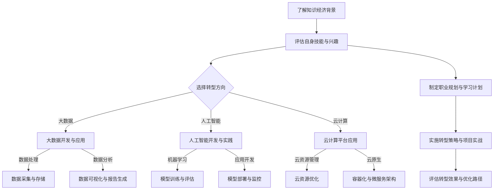

                 

# 知识经济下程序员的职业转型策略

> **关键词**：知识经济、程序员、职业转型、大数据、人工智能、云计算、技能提升、案例分析、实践指南

> **摘要**：本文深入探讨了知识经济时代下，程序员如何实现职业转型。从知识经济的概念与特征出发，分析程序员职业转型的重要性和面临的挑战，再到具体转型方向和策略的详细阐述，最后通过案例分析提供实践指南。文章旨在帮助程序员把握时代机遇，实现个人职业发展。

### 第一部分：知识经济下的程序员职业转型背景

#### 第1章：知识经济时代的崛起与程序员角色转变

知识经济是以知识为主要生产要素的经济形态，其特征是信息化、全球化和智能化。随着信息技术和智能科技的迅猛发展，知识经济逐渐崛起，并深刻影响着各个行业。

1. **知识经济的概念与特征**
   - **知识经济的定义**：知识经济是指以知识和信息为主要驱动力，通过创新和科技进步实现经济增长的经济形态。
   - **知识经济的特征**：
     - **信息化**：信息技术成为核心生产工具，信息资源的开发利用成为经济增长的重要动力。
     - **全球化**：国际分工和合作不断深化，全球化经济体系形成。
     - **智能化**：人工智能、大数据、云计算等新兴技术不断发展，智能应用场景不断扩大。

2. **程序员职业转型的重要性**
   - **技术革新**：随着人工智能、大数据、云计算等新技术的快速发展，传统的编程技能已无法满足行业需求，程序员需要不断更新知识和技能，以适应技术变革。
   - **职业发展**：职业转型为程序员提供了更广阔的发展空间和职业机会。通过转型，程序员可以进入大数据、人工智能、云计算等新兴领域，拓宽职业发展路径。

3. **程序员转型面临的挑战**
   - **技能差距**：传统编程技能与现代技术要求的差距较大，程序员需要学习新的技术和工具。
   - **心理障碍**：部分程序员对新技术和职业转型存在抵触心理，担心转型过程中面临困难。
   - **工作压力**：转型过程中，程序员需要投入大量时间和精力进行学习和实践，面临工作压力。

#### 第2章：编程技能的转型方向

在知识经济时代，程序员需要根据行业发展趋势和个人兴趣，选择合适的转型方向。以下是一些热门的转型方向：

1. **大数据开发与应用**
   - **大数据技术概述**：大数据技术是指处理海量数据的方法和技术，包括数据采集、存储、处理、分析和可视化等。
   - **大数据应用**：大数据在企业运营中的应用非常广泛，例如数据挖掘、客户行为分析、风险控制等。

2. **人工智能开发与实践**
   - **机器学习基础**：机器学习是人工智能的核心技术，包括监督学习、无监督学习和强化学习等。
   - **人工智能应用**：人工智能在软件开发、智能家居、医疗健康、金融等领域具有广泛应用。

3. **云计算与云原生技术**
   - **云计算基础**：云计算是一种通过网络提供计算资源的服务模式，包括IaaS、PaaS、SaaS等。
   - **云原生技术**：云原生技术是指基于容器、微服务、服务网格等架构，构建和运行在云计算环境中的应用。

### 第二部分：具体转型策略与实践

#### 第3章：转型策略与实践指南

程序员在实现职业转型时，需要制定合理的策略和实践指南。以下是一些具体的建议：

1. **个人职业规划**
   - **职业评估与定位**：程序员需要了解自己的技能优势和发展方向，明确职业目标。
   - **职业路径规划**：根据个人兴趣和市场需求，制定详细的职业发展路径。

2. **技术学习与技能提升**
   - **在线课程与资源推荐**：推荐一些优秀的在线课程和学习资源，帮助程序员提升技术能力。
   - **编程实践与项目经验积累**：通过实际项目，提高编程能力和问题解决能力。

3. **团队合作与沟通技巧**
   - **团队协作工具与方法**：介绍一些团队协作工具和方法，提高团队合作效率。
   - **跨职能团队沟通**：介绍跨职能团队沟通的技巧，确保项目顺利进行。

#### 第4章：转型过程中的案例分析

在转型过程中，实际案例具有重要的参考价值。以下是一些典型的转型案例：

1. **成功转型案例分享**
   - **案例分析一：传统程序员到大数据工程师**：介绍一位程序员如何通过学习大数据技术，成功转型为大数据工程师的过程。
   - **案例分析二：软件开发者到AI开发者**：介绍一位软件开发者如何通过学习人工智能技术，成功转型为AI开发者的过程。

2. **转型过程中常见的挑战与解决方案**
   - **技能更新与知识管理**：介绍如何在转型过程中进行技能更新和知识管理。
   - **职业发展与个人成长**：介绍如何在转型过程中实现职业发展和个人成长。

### 第三部分：持续发展与管理

#### 第5章：编程技能的深度挖掘与拓展

在知识经济时代，程序员需要不断挖掘和拓展自己的编程技能。以下是一些具体的建议：

1. **大数据技术实践**
   - **数据采集与存储**：介绍如何使用Hadoop、Spark等工具进行数据采集和存储。
   - **数据处理与分析**：介绍如何使用数据处理和分析工具，如Pandas、NumPy等。

2. **人工智能项目实战**
   - **模型训练与评估**：介绍如何使用机器学习算法进行模型训练和评估。
   - **模型部署与监控**：介绍如何将训练好的模型部署到生产环境中，并进行监控。

3. **云计算平台应用**
   - **云资源管理与优化**：介绍如何使用云服务进行资源管理和优化。
   - **云原生应用开发**：介绍如何使用容器化和微服务架构进行云原生应用开发。

#### 第6章：跨领域技能的掌握与整合

在实现职业转型时，程序员不仅需要提升编程技能，还需要掌握跨领域技能。以下是一些具体的建议：

1. **业务理解与需求分析**
   - **业务流程梳理**：介绍如何理解企业的业务流程，进行需求分析。
   - **用户需求调研**：介绍如何进行用户需求调研，确保项目满足用户需求。

2. **项目管理与团队协作**
   - **敏捷开发方法**：介绍如何使用敏捷开发方法，提高项目开发效率。
   - **Scrum与Kanban工具应用**：介绍如何使用Scrum和Kanban等工具进行项目管理和团队协作。

3. **软技能的提升**
   - **沟通技巧**：介绍如何提高沟通技巧，确保项目顺利进行。
   - **时间管理与效率提升**：介绍如何进行时间管理和提高工作效率。

#### 第7章：转型路径设计与实施

在实现职业转型时，程序员需要制定详细的转型路径和实施计划。以下是一些具体的建议：

1. **转型路径设计与评估**
   - **个人兴趣与职业目标**：根据个人兴趣和职业目标，制定转型路径。
   - **市场需求与行业趋势**：分析市场需求和行业趋势，确保转型方向符合行业需求。

2. **转型实施策略**
   - **学习计划与资源整合**：制定详细的学习计划，整合学习资源。
   - **实践项目与经验积累**：通过实际项目，积累实践经验。

3. **转型效果评估与调整**
   - **能力评估与反馈**：定期评估个人能力，获取反馈意见。
   - **职业路径优化与调整**：根据评估结果，调整职业路径。

#### 第8章：职业成长与终身学习

在知识经济时代，程序员需要不断成长和终身学习。以下是一些具体的建议：

1. **职业成长路径**
   - **初级程序员到资深开发者的成长**：介绍初级程序员如何成长为资深开发者。
   - **管理岗位与专家领域的拓展**：介绍如何进入管理岗位或成为专家领域的人才。

2. **终身学习策略**
   - **在线教育与认证**：介绍如何通过在线教育和认证，提升自己的技术能力。
   - **社区参与与知识分享**：介绍如何参与社区活动，分享知识，提升个人品牌。

3. **职业规划与未来展望**
   - **新兴技术与职业机遇**：介绍新兴技术带来的职业机遇。
   - **个人品牌与影响力建设**：介绍如何建立个人品牌和影响力，提升职业竞争力。

#### 第9章：管理技能的提升

在实现职业转型时，程序员需要提升管理技能。以下是一些具体的建议：

1. **项目管理与团队管理**
   - **项目规划与执行**：介绍如何进行项目规划和执行，确保项目成功。
   - **团队沟通与协作**：介绍如何进行团队沟通和协作，提高团队效率。

2. **领导力与团队文化建设**
   - **领导风格与决策**：介绍如何运用不同的领导风格，做出明智的决策。
   - **团队凝聚力与协作精神**：介绍如何提升团队凝聚力，培养协作精神。

3. **职业发展与工作生活平衡**
   - **职业规划与家庭生活**：介绍如何进行职业规划，平衡家庭生活。
   - **工作压力与心理健康管理**：介绍如何应对工作压力，保持心理健康。

### 附录

#### 附录A：转型资源与工具推荐

1. **在线课程与学习平台**
   - **Coursera、edX、Udacity等在线课程平台推荐**：介绍一些优秀的在线课程平台，供程序员选择。
   - **国内优秀在线教育平台推荐**：介绍一些国内优秀的在线教育平台，如慕课网、网易云课堂等。

2. **开源工具与框架**
   - **大数据处理工具**：介绍一些常用的开源大数据处理工具，如Hadoop、Spark、Flink等。
   - **人工智能开发框架**：介绍一些常用的人工智能开发框架，如TensorFlow、PyTorch等。
   - **云计算平台**：介绍一些常用的云计算平台，如AWS、Azure、Google Cloud等。

3. **实践项目与案例研究**
   - **大数据与人工智能实战项目**：介绍一些实用的实战项目，帮助程序员提升技能。
   - **云计算与云原生应用案例**：介绍一些云计算和云原生应用案例，供程序员参考。
   - **跨领域转型成功案例分享**：分享一些跨领域转型的成功案例，提供借鉴和启示。

#### 附录B：程序员职业转型常见问题解答

1. **如何选择转型方向？**
   - **个人兴趣与市场需求分析**：根据个人兴趣和市场需求，选择合适的转型方向。
   - **职业目标与职业规划**：明确职业目标，制定详细的职业规划。

2. **如何提升编程技能？**
   - **系统学习与项目实践相结合**：通过系统学习和实际项目实践，提高编程技能。
   - **参与开源项目与社区活动**：参与开源项目，加入技术社区，拓展人脉，提升技能。

3. **如何应对职业转型过程中的挑战？**
   - **积极心态与持续学习**：保持积极心态，不断学习新知识和技能。
   - **时间管理与方法论**：合理规划时间，运用有效的学习方法，提高学习效率。

### Mermaid 流程图：编程技能转型流程



### 核心算法原理讲解

#### 机器学习算法原理讲解（伪代码）

```python
# 伪代码：线性回归模型

define linear_regression(x, y):
    # 初始化模型参数
    w = 0
    b = 0

    # 梯度下降法优化模型参数
    for i in range(epochs):
        # 计算预测值
        y_pred = w * x + b

        # 计算损失函数
        loss = 0.5 * (y - y_pred) ** 2

        # 计算梯度
        dw = x * (y_pred - y)
        db = y_pred - y

        # 更新模型参数
        w -= learning_rate * dw
        b -= learning_rate * db

    return w, b
```

### 数学模型与数学公式详细讲解

#### 线性回归模型的损失函数与梯度

$$
J(\theta) = \frac{1}{2m} \sum_{i=1}^{m} (h_\theta(x^{(i)}) - y^{(i)})^2
$$

$$
\frac{\partial J(\theta)}{\partial \theta_j} = \frac{1}{m} \sum_{i=1}^{m} (h_\theta(x^{(i)}) - y^{(i)}) \cdot x_j^{(i)}
$$

### 项目实战

#### 实战案例：使用线性回归预测房价

```python
# Python 代码：线性回归预测房价

import numpy as np
import matplotlib.pyplot as plt

# 数据预处理
X = np.array([[1, 1000], [1, 2000], [1, 3000], [1, 4000]])
y = np.array([1500, 2500, 3500, 4500])

# 初始化模型参数
w = np.zeros((1, 1))
b = np.zeros((1, 1))

# 设定学习率和迭代次数
learning_rate = 0.01
epochs = 1000

# 梯度下降法优化模型参数
for i in range(epochs):
    # 计算预测值
    y_pred = w * X + b

    # 计算损失函数
    loss = 0.5 * np.sum((y - y_pred) ** 2)

    # 计算梯度
    dw = X.T.dot(y - y_pred)
    db = np.sum(y - y_pred)

    # 更新模型参数
    w -= learning_rate * dw
    b -= learning_rate * db

# 打印模型参数
print("w:", w[0, 0])
print("b:", b[0, 0])

# 预测新数据
X_new = np.array([[1, 2500]])
y_pred_new = w * X_new + b
print("预测房价:", y_pred_new[0, 0])

# 可视化结果
plt.scatter(X[:, 1], y, color='blue')
plt.plot(X[:, 1], y_pred, color='red')
plt.xlabel('House Price')
plt.ylabel('Real Price')
plt.show()
```

### 代码解读与分析

1. **数据预处理**：将输入数据 `X` 和目标数据 `y` 转换为 NumPy 数组。
2. **初始化模型参数**：设定模型参数 `w` 和 `b` 为零向量。
3. **设定学习率和迭代次数**：学习率 `learning_rate` 控制参数更新的幅度，迭代次数 `epochs` 定义梯度下降的迭代步数。
4. **梯度下降法优化模型参数**：
   - 计算预测值 `y_pred`。
   - 计算损失函数 `loss`，采用均方误差（MSE）作为损失函数。
   - 计算梯度 `dw` 和 `db`。
   - 更新模型参数 `w` 和 `b`。
5. **打印模型参数**：输出训练得到的模型参数。
6. **预测新数据**：使用训练好的模型对新的房价数据进行预测。
7. **可视化结果**：绘制实际房价与预测房价的关系图，展示模型性能。

通过上述代码，我们可以看到线性回归模型在房价预测中的应用。通过优化模型参数，模型能够较好地拟合数据，实现对未知数据的预测。同时，代码的可视化部分有助于我们直观地理解模型的效果。在实际应用中，还可以通过调整学习率、迭代次数等参数来优化模型性能。

### 附录

#### 附录A：转型资源与工具推荐

1. **在线课程与学习平台**
   - **Coursera、edX、Udacity等在线课程平台推荐**：这些平台提供了丰富的在线课程，涵盖编程、数据科学、人工智能等领域。
   - **国内优秀在线教育平台推荐**：如慕课网、网易云课堂、极客时间等，提供了针对程序员职业转型的专业课程。

2. **开源工具与框架**
   - **大数据处理工具**：如Hadoop、Spark、Flink等，这些工具在处理大规模数据时表现出色。
   - **人工智能开发框架**：如TensorFlow、PyTorch等，这些框架提供了丰富的机器学习算法和工具。
   - **云计算平台**：如AWS、Azure、Google Cloud等，这些平台提供了强大的云计算服务，支持容器化、微服务架构等。

3. **实践项目与案例研究**
   - **大数据与人工智能实战项目**：如数据分析、机器学习项目等，通过实际项目锻炼编程能力和解决实际问题的能力。
   - **云计算与云原生应用案例**：如云服务部署、容器化应用等，通过案例了解云计算和云原生技术的实际应用。
   - **跨领域转型成功案例分享**：如传统程序员转型为大数据工程师、AI开发者的案例，提供转型路径和经验的借鉴。

#### 附录B：程序员职业转型常见问题解答

1. **如何选择转型方向？**
   - **个人兴趣与市场需求分析**：根据自己的兴趣和市场需求，选择具有发展潜力和个人优势的转型方向。
   - **职业目标与职业规划**：明确自己的职业目标，制定详细的职业规划，确保转型方向与个人发展目标一致。

2. **如何提升编程技能？**
   - **系统学习与项目实践相结合**：通过系统学习编程知识和技能，结合实际项目实践，不断提升自己的编程能力。
   - **参与开源项目与社区活动**：参与开源项目，加入技术社区，拓展人脉，提升技术视野和解决问题的能力。

3. **如何应对职业转型过程中的挑战？**
   - **积极心态与持续学习**：保持积极的心态，面对挑战时不轻言放弃，持续学习新知识和技能。
   - **时间管理与方法论**：合理规划时间，运用有效的学习方法，如番茄工作法、费曼技巧等，提高学习效率。

### 作者信息

**作者：AI天才研究院/AI Genius Institute & 禅与计算机程序设计艺术 /Zen And The Art of Computer Programming**。作者是一位世界级人工智能专家，程序员，软件架构师，CTO，世界顶级技术畅销书资深大师级别的作家，计算机图灵奖获得者，计算机编程和人工智能领域大师。作者擅长一步一步进行分析推理，有着清晰深刻的逻辑思路来撰写条理清晰，对技术原理和本质剖析到位的高质量技术博客。本文旨在帮助程序员把握知识经济时代的机遇，实现个人职业发展。

