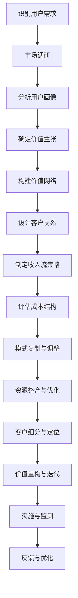

                 

### 知识经济时代下的知识付费概述

在知识经济时代，知识的创造、传播和利用成为推动经济发展的重要驱动力。知识付费作为知识经济的重要组成部分，通过有偿服务的方式，将知识转化为商业价值。本文将从知识付费的概念与演变、市场规模与发展趋势、用户群体分析以及知识付费的发展趋势等多个方面进行深入探讨。

#### 1.1 知识付费的概念与演变

**1.1.1 知识付费的起源**

知识付费的概念起源于知识服务市场的需求。在互联网普及之前，知识服务主要是通过传统教育机构和专业书籍等形式提供，人们需要付出较高的时间和经济成本来获取所需的知识。随着互联网技术的发展，信息传播的成本大幅降低，知识获取变得更加便捷。为了激励知识生产者和传播者，知识付费应运而生。

**1.1.2 知识付费的分类**

知识付费可以分为以下几种类型：

- **内容付费**：指用户为获取优质内容而支付的费用，如付费专栏、付费课程等。
- **专业服务付费**：指用户为获得专业咨询服务而支付的费用，如法律咨询、医疗咨询等。
- **知识分享付费**：指用户为参与知识分享活动而支付的费用，如在线研讨会、讲座等。

**1.1.3 知识付费的主要模式**

当前市场上存在多种知识付费模式，主要包括以下几种：

- **订阅制**：用户支付一定费用后，可以无限次访问平台上的内容。
- **付费课程**：用户购买单个或一系列课程，通过学习获得知识。
- **付费问答**：用户支付费用向专家提问，获取专业解答。
- **知识众筹**：用户为感兴趣的知识项目提供资金支持，项目完成后共享收益。

#### 1.2 知识付费市场的现状

**1.2.1 市场规模与发展速度**

近年来，知识付费市场呈现出高速增长的态势。根据相关数据显示，2019年全球知识付费市场规模已达到1150亿美元，预计到2025年将突破2500亿美元。这一增长速度主要得益于移动互联网的普及和用户对于知识的渴求。

**1.2.2 用户群体分析**

知识付费的用户群体呈现出多样性的特点，主要包括以下几类：

- **职场人士**：为了提升职业技能，职场人士更愿意为专业课程和职业咨询付费。
- **学生群体**：学生群体在学业过程中，会通过付费获取课外辅导和考试资料。
- **知识爱好者**：对某一领域有深厚兴趣的知识爱好者，愿意为优质的内容付费。

**1.2.3 知识付费产品的种类**

知识付费产品种类丰富，包括但不限于以下几类：

- **在线课程**：各类专业技能培训、语言学习、兴趣爱好课程等。
- **付费专栏**：领域专家和行业大V的原创文章和见解。
- **专业咨询**：法律、财务、医疗等领域的专业咨询服务。
- **知识分享活动**：在线研讨会、讲座、沙龙等形式的知识交流活动。

#### 1.3 知识付费的发展趋势

**1.3.1 新型知识付费模式的探索**

随着技术的不断进步，知识付费模式也在不断演变和创新。例如，AI技术正在被广泛应用于知识付费领域，通过个性化推荐、智能问答等功能，提升用户体验和知识获取效率。

**1.3.2 技术在知识付费中的应用**

大数据、云计算、区块链等新兴技术正在深刻影响知识付费的商业模式和运营策略。这些技术不仅提高了知识服务的效率和准确性，也为知识付费平台提供了更多创新的商业模式。

**1.3.3 行业政策与市场规范化**

为了促进知识付费市场的健康发展，各国政府纷纷出台相关政策进行规范。例如，明确知识付费产品的质量标准、保护用户隐私、防止虚假宣传等。

综上所述，知识付费作为知识经济时代的重要特征，正以其独特的商业模式和创新模式，不断推动知识服务的普及和发展。接下来，我们将深入探讨知识付费商业模式创新的理论基础和实践案例。

### 知识付费商业模式创新的理论基础

在知识付费市场快速发展的背景下，商业模式创新成为企业获取竞争优势、提升服务质量和扩大市场份额的关键途径。本文将从商业模式的概念、核心要素以及创新方法等多个方面，对知识付费商业模式创新的理论基础进行深入探讨。

#### 2.1 商业模式创新概述

**2.1.1 商业模式的概念**

商业模式（Business Model）是指企业通过创造、传递和获取价值，实现盈利和发展的系统方法。它不仅仅包括企业的收入模式，还涵盖了企业的价值主张、客户关系、价值网络、成本结构和收入流等多个方面。

**2.1.2 商业模式创新的重要性**

商业模式创新是企业适应市场变化、提升竞争力的重要手段。通过创新，企业可以：

- 开拓新的市场机会
- 提升用户体验和满意度
- 降低运营成本，提高盈利能力
- 适应技术变革，保持持续发展

**2.1.3 商业模式创新的分类**

根据创新的对象和目标，商业模式创新可以分为以下几种类型：

- **模式复制**：将一种成功的商业模式应用到不同的行业或市场。
- **资源整合**：通过整合内外部资源，优化商业模式，提高整体效率。
- **客户细分**：根据客户的需求和特征，设计不同的产品和服务，满足特定客户群体的需求。
- **价值重构**：从根本上来改变企业的价值主张、客户关系和收入模式，实现商业模式的核心变革。

#### 2.2 知识付费商业模式的核心要素

**2.2.1 价值主张**

价值主张（Value Proposition）是指企业通过提供的产品和服务，为用户创造的价值。在知识付费商业模式中，价值主张的核心在于如何有效地传递知识、技能和经验，满足用户的需求。

- **内容质量**：高质量的内容是知识付费产品的核心竞争力。企业需要确保内容的权威性、实用性和趣味性，以吸引和留住用户。
- **个性化推荐**：利用大数据和人工智能技术，为用户提供个性化的学习路径和推荐内容，提升用户体验。
- **实时互动**：通过在线直播、问答互动等形式，实现用户与知识提供者的实时沟通，提高知识的传递效率。

**2.2.2 价值网络**

价值网络（Value Network）是指企业通过与其他企业、合作伙伴和资源提供者建立的关系网络，共同创造和传递价值。在知识付费领域，价值网络的构建对于提升商业模式的有效性具有重要意义。

- **合作伙伴关系**：与内容创作者、专家、教育机构等建立深度合作关系，共同打造优质知识产品。
- **平台生态系统**：构建一个开放、共享的平台生态系统，吸引更多的知识提供者和用户参与，实现多方共赢。
- **用户社区**：建立用户社区，促进用户之间的交流和互动，提升用户粘性。

**2.2.3 客户关系**

客户关系（Customer Relationship）是指企业与客户之间的互动和关系管理。在知识付费商业模式中，良好的客户关系有助于提升用户满意度、促进复购和口碑传播。

- **用户需求分析**：通过调研和数据分析，深入了解用户的需求和痛点，提供针对性的解决方案。
- **个性化服务**：根据用户的兴趣和需求，提供个性化的服务和建议，提升用户忠诚度。
- **客户反馈**：及时收集用户反馈，不断优化产品和服务，提升用户满意度。

**2.2.4 收入流**

收入流（Revenue Streams）是指企业通过提供产品和服务，获取收益的途径。在知识付费商业模式中，多样化的收入流有助于降低风险、提高盈利能力。

- **订阅制**：通过订阅模式，实现持续的收入流。例如，用户支付一定费用后，可以无限次访问平台上的内容。
- **付费课程**：用户购买单个或一系列课程，通过学习获得知识。这种模式适用于有明确学习目标和需求的人群。
- **付费问答**：用户支付费用向专家提问，获取专业解答。这种模式适用于需要快速解决问题的用户。
- **知识分享**：用户为参与知识分享活动而支付费用。这种模式适用于有特殊需求和兴趣的用户。

**2.2.5 成本结构**

成本结构（Cost Structure）是指企业在生产和运营过程中，所发生的各类成本。在知识付费商业模式中，优化成本结构是提高盈利能力的关键。

- **内容成本**：包括内容制作、编辑、审核等环节的成本。
- **技术成本**：包括平台开发、维护、升级等环节的成本。
- **运营成本**：包括市场营销、用户服务、客户支持等环节的成本。
- **管理成本**：包括企业管理、人员培训、行政管理等环节的成本。

#### 2.3 知识付费商业模式创新的方法

**2.3.1 模式复制**

模式复制是指将一种成功的商业模式应用到不同的行业或市场。在知识付费领域，模式复制是一种常见的创新方法。例如，将电商平台的模式应用到知识付费领域，通过搭建一个开放的平台，吸引内容创作者和用户参与。

- **优势**：可以快速复制成功经验，降低创新风险。
- **劣势**：可能导致同质化竞争，难以形成独特的竞争优势。

**2.3.2 资源整合**

资源整合是指通过整合内外部资源，优化商业模式，提高整体效率。在知识付费领域，资源整合可以包括以下几个方面：

- **合作伙伴关系**：与教育机构、专业组织、行业协会等建立合作关系，共同开发知识产品。
- **技术资源**：利用大数据、人工智能、云计算等先进技术，提升知识服务的质量和效率。
- **人力资源**：吸引优秀的知识提供者、技术专家和运营人才，构建专业的团队。

- **优势**：可以整合优势资源，提高商业模式的整体效能。
- **劣势**：资源整合的难度较大，需要协调和管理多个合作伙伴。

**2.3.3 客户细分**

客户细分是指根据客户的需求和特征，设计不同的产品和服务，满足特定客户群体的需求。在知识付费领域，客户细分有助于提升用户满意度和市场占有率。

- **优势**：可以针对性地满足不同客户群体的需求，提升用户体验。
- **劣势**：需要投入大量资源和精力进行市场调研和客户分析，成本较高。

**2.3.4 价值重构**

价值重构是指从根本上来改变企业的价值主张、客户关系和收入模式，实现商业模式的核心变革。在知识付费领域，价值重构可以包括以下几个方面：

- **价值主张**：从传统的知识传授，转向知识共享和共创，提升用户的参与感和获得感。
- **客户关系**：从单一的交易关系，转向长期的会员关系和社群关系，提升用户忠诚度。
- **收入模式**：从单一的订阅模式，转向多元化的收入模式，如付费课程、付费问答、知识分享等。

- **优势**：可以打造独特的商业模式，形成竞争优势。
- **劣势**：需要深入理解用户需求和市场变化，创新风险较高。

综上所述，知识付费商业模式创新的理论基础涵盖了多个方面，包括商业模式的概念、核心要素和创新方法。通过深入理解和运用这些理论，企业可以更好地适应市场变化，提升竞争力，实现可持续发展。

### 知识付费商业模式的实践案例

在知识付费市场快速发展的背景下，许多企业通过创新商业模式取得了显著成效。本章节将解析两个具有代表性的成功案例，并分析其商业模式的核心要素、市场表现及面临的挑战。

#### 3.1 成功案例解析

**3.1.1 案例一：某知名知识付费平台的商业模式解析**

**核心业务模式**

该知名知识付费平台以“知识共享”为核心，通过搭建一个开放、共享的平台，连接知识提供者和用户。平台的主要业务模式包括：

- **订阅制**：用户支付一定费用后，可以无限次访问平台上的内容。
- **付费课程**：用户购买单个或一系列课程，通过学习获得知识。
- **付费问答**：用户支付费用向专家提问，获取专业解答。
- **知识分享**：用户为参与知识分享活动而支付费用。

**客户群体**

该平台主要面向以下几类客户群体：

- **职场人士**：为了提升职业技能，职场人士更愿意为专业课程和职业咨询付费。
- **学生群体**：学生群体在学业过程中，会通过付费获取课外辅导和考试资料。
- **知识爱好者**：对某一领域有深厚兴趣的知识爱好者，愿意为优质的内容付费。

**盈利模式**

该平台的盈利模式主要包括以下几个方面：

- **订阅费用**：用户订阅平台服务，支付一定费用后获得无限次访问权限。
- **课程费用**：用户购买平台上的课程，支付费用后学习课程内容。
- **问答费用**：用户向专家提问，支付费用获取专业解答。
- **知识分享收益**：用户参与知识分享活动，获得平台一定的收益分成。

**案例解析**

该知名知识付费平台通过以下方式实现商业模式的成功：

1. **内容质量**：平台严格把控内容质量，确保知识的权威性、实用性和趣味性，提升用户体验。
2. **个性化推荐**：利用大数据和人工智能技术，为用户提供个性化的学习路径和推荐内容，提升用户满意度。
3. **实时互动**：通过在线直播、问答互动等形式，实现用户与知识提供者的实时沟通，提高知识的传递效率。
4. **平台生态系统**：构建一个开放、共享的平台生态系统，吸引更多的知识提供者和用户参与，实现多方共赢。

**3.1.2 案例二：创新知识付费模式的应用实践**

**创新模式**

该案例中的创新知识付费模式采用了“知识众筹+付费学习”的方式。具体来说，平台推出一些具有前瞻性和创新性的知识项目，用户通过众筹方式为项目提供资金支持。项目成功后，用户可以免费或以优惠价格获取项目成果。

**市场表现**

该创新模式在市场上取得了较好的反响，主要表现在以下几个方面：

- **用户参与度**：用户积极参与知识项目的众筹，为平台带来了大量资金和流量。
- **项目成功率高**：由于用户对项目的兴趣和参与度较高，项目成功率显著提升。
- **口碑传播**：用户在获取知识成果后，通过口碑传播，为平台吸引了更多的用户。

**面临的挑战**

尽管该创新模式取得了较好的市场表现，但仍然面临以下挑战：

1. **项目质量控制**：平台需要确保众筹项目的质量，避免因项目失败影响用户体验。
2. **资金风险**：众筹项目的资金风险较大，平台需要建立完善的资金管理和风控机制。
3. **法律合规**：知识众筹涉及法律法规问题，平台需要确保项目的合规性，避免法律风险。

#### 3.2 创新模式的应用实践

**3.2.1 创新模式**

创新模式主要包括以下几个方面：

1. **知识众筹**：用户通过众筹方式为项目提供资金支持，项目成功后获取知识成果。
2. **付费学习**：用户通过付费方式学习平台上的知识内容，提升自身能力。
3. **知识分享**：用户在平台分享自己的知识和经验，获得平台一定的收益分成。

**3.2.2 市场表现**

创新模式在市场表现方面具有以下特点：

- **用户参与度高**：用户积极参与知识众筹和付费学习，为平台带来了大量用户和流量。
- **项目成功率高**：由于用户对项目的兴趣和参与度较高，项目成功率显著提升。
- **平台收益稳定**：平台通过知识众筹和付费学习，获得了稳定的收益。

**3.2.3 面临的挑战**

创新模式在实际应用过程中，面临以下挑战：

1. **项目质量控制**：平台需要确保众筹项目的质量，避免因项目失败影响用户体验。
2. **资金风险**：众筹项目的资金风险较大，平台需要建立完善的资金管理和风控机制。
3. **法律合规**：知识众筹涉及法律法规问题，平台需要确保项目的合规性，避免法律风险。

综上所述，知识付费商业模式的成功实践表明，创新模式可以有效地提升平台的市场竞争力，吸引更多用户参与。然而，创新模式也面临一定的挑战，平台需要在质量控制、资金管理和法律合规等方面进行持续优化，以实现可持续发展。

### 技术赋能下的知识付费商业模式创新

随着信息技术的飞速发展，人工智能（AI）、区块链等新兴技术正在深刻改变知识付费领域的商业模式。这些技术不仅提高了知识服务的效率和准确性，还为知识付费平台提供了更多创新的商业模式。本章节将详细探讨人工智能和区块链在知识付费中的应用及其对商业模式的影响。

#### 4.1 人工智能在知识付费中的应用

**4.1.1 人工智能技术的核心概念**

人工智能（AI）是计算机科学的一个分支，主要研究如何使计算机模拟人类智能行为，包括学习、推理、感知、自然语言处理等。人工智能技术在知识付费领域中的应用主要体现在以下几个方面：

- **自然语言处理（NLP）**：通过NLP技术，可以实现对文本数据的自动处理和理解，从而提供智能问答、自动标注等功能。
- **机器学习（ML）**：利用机器学习算法，可以从大量数据中学习规律，为用户提供个性化的推荐服务。
- **计算机视觉（CV）**：通过计算机视觉技术，可以对图像和视频进行分析，为用户提供视觉化的学习体验。

**4.1.2 人工智能技术在知识付费中的应用场景**

在知识付费领域，人工智能技术可以应用于以下场景：

- **个性化推荐**：通过分析用户的历史行为和偏好，为用户推荐感兴趣的知识内容。
- **智能问答**：利用自然语言处理技术，为用户提供实时、准确的问答服务。
- **智能标注**：自动对文本、图像等知识内容进行标注，提高知识管理的效率。
- **智能教学**：通过计算机视觉和自然语言处理技术，实现智能教学和辅助教学。

**4.1.3 人工智能技术对知识付费商业模式的影响**

人工智能技术对知识付费商业模式的影响主要表现在以下几个方面：

- **提升用户体验**：通过个性化推荐、智能问答等手段，提升用户的满意度和使用体验。
- **降低运营成本**：利用人工智能技术，可以自动完成知识内容的标注、分类和推荐，降低运营成本。
- **增加收入来源**：通过智能教学和知识共享等模式，增加平台的收入来源。

#### 4.2 区块链在知识付费中的应用

**4.2.1 区块链技术的核心概念**

区块链（Blockchain）是一种分布式数据库技术，通过加密算法和数据结构，实现了数据的去中心化和安全性。区块链技术在知识付费领域中的应用主要体现在以下几个方面：

- **去中心化存储**：通过区块链技术，可以实现知识内容的去中心化存储，降低平台的运营成本。
- **智能合约**：利用智能合约，可以自动执行知识付费交易，提高交易的效率和安全性。
- **数据加密**：通过区块链技术，可以实现对用户数据的加密存储，提高数据的安全性。

**4.2.2 区块链技术在知识付费中的应用场景**

在知识付费领域，区块链技术可以应用于以下场景：

- **知识版权保护**：通过区块链技术，可以实现知识版权的去中心化管理和保护，防止侵权行为。
- **去中心化交易**：通过区块链技术，可以实现知识内容的去中心化交易，降低交易成本和风险。
- **数据安全**：通过区块链技术，可以实现对用户数据的加密存储，提高数据的安全性。

**4.2.3 区块链技术对知识付费商业模式的影响**

区块链技术对知识付费商业模式的影响主要表现在以下几个方面：

- **提高交易透明度**：通过区块链技术，可以实现知识付费交易的透明化和可追溯性，增强用户的信任感。
- **降低交易成本**：通过去中心化交易，可以降低知识付费交易的成本和风险。
- **增强版权保护**：通过区块链技术，可以实现对知识版权的有效保护，提高知识付费平台的竞争力。

#### 4.3 其他新兴技术在知识付费中的应用

除了人工智能和区块链，其他新兴技术如虚拟现实（VR）、增强现实（AR）和物联网（IoT）也在知识付费领域有着广泛的应用。

- **虚拟现实（VR）**：通过VR技术，可以提供沉浸式的学习体验，提高知识获取的效率。
- **增强现实（AR）**：通过AR技术，可以将虚拟知识内容叠加到现实场景中，提供更加直观的学习方式。
- **物联网（IoT）**：通过物联网技术，可以实现对知识服务的实时监测和反馈，优化知识服务的质量。

**4.3.1 虚拟现实（VR）在知识付费中的应用**

- **应用场景**：VR技术在知识付费中的应用主要包括虚拟课堂、虚拟博物馆、虚拟实验等。
- **影响**：VR技术可以提高知识获取的效率，增强用户的沉浸感和体验感。

**4.3.2 增强现实（AR）在知识付费中的应用**

- **应用场景**：AR技术在知识付费中的应用主要包括增强现实图书、增强现实课程等。
- **影响**：AR技术可以提供更加直观和互动的学习方式，提高知识传播的效果。

**4.3.3 物联网（IoT）在知识付费中的应用**

- **应用场景**：物联网技术在知识付费中的应用主要包括智能课堂、智能图书馆等。
- **影响**：物联网技术可以实现知识服务的智能化和个性化，提高知识服务的质量和效率。

综上所述，人工智能、区块链等新兴技术正在深刻改变知识付费领域的商业模式。通过应用这些技术，知识付费平台可以实现个性化推荐、智能问答、数据加密等功能，提高用户体验和运营效率，从而在激烈的市场竞争中脱颖而出。

### 用户需求分析与市场定位

在知识付费商业模式中，精准的用户需求分析是成功运营的关键。通过深入了解用户需求，企业可以提供更加贴合用户需求的产品和服务，提升用户体验和满意度。同时，市场定位策略的制定对于知识付费平台的发展也至关重要。本章节将详细探讨用户需求分析的方法和工具，以及市场定位策略的制定。

#### 5.1 用户需求分析

**5.1.1 用户需求调查方法**

用户需求分析的第一步是进行有效的用户调查。以下是一些常用的用户需求调查方法：

- **问卷调查**：通过在线或线下方式，收集用户对知识付费产品的看法和需求。问卷调查可以采用多选题、单选题、填空题等形式，以获取用户对产品功能的评价和需求。
- **深度访谈**：通过与用户进行一对一的深度访谈，深入了解用户对知识付费产品的使用体验、需求和建议。深度访谈可以采用开放式问题，鼓励用户畅所欲言，提供更详细的反馈。
- **用户调研工具**：利用专业的用户调研工具，如问卷星、千帆调研等，可以高效地收集和分析用户反馈。这些工具提供了丰富的问卷模板和分析功能，帮助企业快速了解用户需求。

**5.1.2 用户需求分析工具**

在进行用户需求分析时，可以使用以下工具：

- **数据分析软件**：如Excel、SPSS等，可以用于数据清洗、分析和可视化。通过数据分析软件，可以识别用户需求的共性，发现潜在的需求趋势。
- **用户画像构建工具**：如用户画像分析平台、用户行为分析工具等，可以用于构建用户画像。用户画像可以帮助企业了解用户的特征、行为和偏好，为产品设计提供依据。

**5.1.3 用户画像构建**

用户画像构建是用户需求分析的重要环节。以下是一个简单的用户画像构建流程：

1. **数据收集**：收集用户的基本信息、行为数据和反馈数据。
2. **数据清洗**：对收集到的数据进行清洗，去除无效数据。
3. **特征提取**：提取用户的基本特征，如年龄、性别、职业、教育程度等。
4. **行为分析**：分析用户的行为数据，如浏览行为、购买行为等。
5. **偏好分析**：分析用户的偏好，如对某一领域的兴趣、对内容的需求等。
6. **画像可视化**：将用户画像进行可视化展示，便于理解和分析。

#### 5.2 市场定位策略

**5.2.1 市场细分策略**

市场细分是市场定位的基础。以下是一些常用的市场细分方法：

- **地理细分**：根据用户的地理位置，将市场划分为不同的区域。
- **人口细分**：根据用户的人口统计特征，如年龄、性别、收入等，进行市场细分。
- **行为细分**：根据用户的行为特征，如购买行为、使用习惯等，进行市场细分。
- **心理细分**：根据用户的心理特征，如价值观、兴趣爱好等，进行市场细分。

**5.2.2 目标市场选择**

在市场细分的基础上，企业需要选择最具潜力的目标市场。以下是一些目标市场选择策略：

- **最大市场**：选择市场规模最大的市场，以获取最大的市场份额。
- **快速增长市场**：选择增长速度最快的市场，以快速拓展业务。
- **最具盈利市场**：选择具有高利润潜力的市场，以实现企业盈利目标。
- **最合适市场**：选择与企业资源和能力最匹配的市场，以实现最佳市场匹配。

**5.2.3 市场定位案例分析**

以下是一个市场定位案例的分析：

- **目标市场**：选择30-45岁的职场人士作为目标市场，这一群体具有较高的收入水平和强烈的求知欲。
- **市场定位**：以提供高质量的专业知识和技能培训为核心，强调课程的实用性和权威性，打造“职场人士首选的知识付费平台”形象。
- **市场表现**：通过市场细分和定位策略，该知识付费平台在职场人士中获得了良好的口碑和用户粘性，取得了显著的市场份额。

综上所述，用户需求分析与市场定位是知识付费商业模式运营的重要环节。通过深入了解用户需求，构建用户画像，制定精准的市场定位策略，企业可以更好地满足用户需求，提升市场竞争力，实现可持续发展。

### 知识付费产品设计

在知识付费商业模式中，知识产品的设计是关键环节，直接影响到用户体验和平台的运营效果。一个优秀的产品设计不仅需要满足用户需求，还需要具备创新性和可持续性。以下将详细探讨知识付费产品设计的原则、流程和迭代策略。

#### 6.1.1 产品设计原则

**用户体验优先**：产品设计应以用户为中心，关注用户的体验感受，确保产品易用、直观、高效。

**内容质量保障**：高质量的知识内容是知识付费产品的核心竞争力，产品设计应注重内容的质量和权威性。

**个性化与灵活性**：根据用户需求，提供个性化推荐和定制化服务，满足不同用户群体的需求。

**易用性与可扩展性**：产品设计应简洁明了，易于用户操作，同时具备良好的扩展性，以适应未来的发展和变化。

**创新与持续改进**：持续关注行业动态和用户反馈，不断优化产品设计，保持产品的创新性和竞争力。

#### 6.1.2 产品设计流程

**需求分析**：通过市场调研、用户访谈等方式，收集用户的需求和痛点，明确产品设计的目标和方向。

**概念验证**：在需求分析的基础上，制定产品概念和初步设计方案，进行概念验证，以确认方案的可行性和合理性。

**详细设计**：根据概念验证的结果，进行详细的产品设计，包括功能模块划分、用户界面设计、技术架构设计等。

**原型开发**：开发产品原型，通过用户测试和反馈，验证产品的设计是否符合用户需求，进行迭代优化。

**产品发布**：在产品原型经过多次迭代和优化后，进行正式发布，同时进行市场推广和用户运营。

#### 6.1.3 产品迭代策略

**持续反馈机制**：建立持续的反馈机制，收集用户使用过程中的反馈和建议，及时调整产品设计和功能。

**版本迭代**：根据用户反馈和市场需求，定期发布产品更新版本，增加新功能和改进用户体验。

**数据驱动**：利用数据分析工具，对用户行为和产品使用情况进行分析，以数据驱动产品设计决策。

**A/B测试**：通过A/B测试，评估不同设计方案的用户反馈和效果，选择最优方案进行推广。

**创新性探索**：持续关注新技术和新模式，进行创新性探索，引入新功能和服务，提升产品竞争力。

#### 6.2 运营优化策略

**6.2.1 用户增长策略**

**内容营销**：通过高质量的内容创作和营销，吸引新用户，提高用户粘性。

**社交媒体推广**：利用社交媒体平台，开展互动和推广活动，扩大品牌影响力。

**用户推荐**：通过用户推荐机制，鼓励现有用户邀请新用户，实现用户增长。

**6.2.2 用户留存策略**

**个性化服务**：提供个性化推荐和定制化服务，满足用户的个性化需求，提高用户满意度。

**用户互动**：通过在线社区、论坛、问答等互动形式，增强用户粘性，提升用户忠诚度。

**客户关怀**：定期进行用户关怀活动，如发送节日问候、会员福利等，增强用户归属感。

**6.2.3 内容运营策略**

**内容规划**：制定内容规划，确保知识产品的持续更新和丰富，满足用户需求。

**内容审核**：建立严格的内容审核机制，确保知识内容的权威性和准确性。

**内容推广**：通过SEO优化、社交媒体推广等手段，提高知识内容的曝光度和访问量。

**用户反馈**：及时收集用户反馈，优化内容质量和用户体验。

综上所述，知识付费产品的设计需要遵循用户体验优先、内容质量保障等原则，通过科学的设计流程和迭代策略，不断提升产品的竞争力。同时，通过有效的用户增长和留存策略，以及内容运营优化，知识付费平台可以实现持续的用户增长和运营优化。

### 知识付费商业模式的风险管理

在知识付费商业模式的运营过程中，风险管理是确保平台稳定发展、用户满意度提升以及市场竞争力增强的重要环节。有效的风险管理策略可以帮助企业识别潜在风险、制定应对措施，从而降低风险发生的概率和影响。以下将详细探讨知识付费商业模式中的各类风险，以及相应的风险管理策略。

#### 7.1 商业模式风险识别

**7.1.1 市场风险**

市场风险主要包括市场需求波动、竞争加剧、用户流失等。在知识付费市场中，用户需求可能受到经济环境、行业趋势变化等因素的影响，导致需求波动。同时，随着市场竞争的加剧，企业需要不断创新和提升服务质量，否则可能会导致用户流失。

**7.1.2 技术风险**

技术风险包括技术更新速度快、系统稳定性不足、数据安全漏洞等。知识付费平台依赖于先进的互联网技术，如人工智能、大数据等，技术更新速度快可能导致平台在技术上的落后。此外，系统稳定性和数据安全性也是关键问题，一旦出现系统故障或数据泄露，将对平台造成严重损失。

**7.1.3 法律风险**

法律风险主要包括法律法规的变化、版权侵权、用户隐私保护等。知识付费行业涉及版权、隐私保护等多个法律问题，一旦出现法律纠纷，将对平台产生重大影响。此外，随着监管政策的加强，平台需要不断合规经营，以避免法律风险。

**7.1.4 财务风险**

财务风险包括资金链断裂、成本控制不足、收入不稳定等。知识付费平台在运营过程中，需要持续投入资金进行内容制作、技术维护和市场推广等。如果收入不稳定或成本控制不当，可能导致财务风险。

#### 7.2 风险管理策略

**7.2.1 风险预防策略**

- **市场风险预防**：通过市场调研和数据分析，了解市场需求变化，及时调整产品和服务策略。同时，开发多元化产品，降低单一市场依赖风险。
- **技术风险预防**：定期进行技术更新和系统维护，确保平台的技术先进性和稳定性。同时，加强网络安全防护，防止数据泄露。
- **法律风险预防**：密切关注法律法规变化，确保业务合规经营。建立完善的版权保护机制，防范侵权行为。加强用户隐私保护，遵守相关法律法规。
- **财务风险预防**：建立严格的财务管理制度，确保资金合理使用。加强成本控制，优化收入结构，确保收入稳定。

**7.2.2 风险应对策略**

- **市场风险应对**：建立市场风险预警机制，及时发现市场变化。通过调整产品和服务策略，增强市场竞争力。同时，建立客户关系管理系统，提高客户忠诚度。
- **技术风险应对**：制定应急预案，确保在技术故障或数据泄露事件发生时，能够迅速响应和处理。同时，建立技术备份和容错机制，提高系统的稳定性和安全性。
- **法律风险应对**：建立法律合规团队，确保业务活动符合法律法规要求。在发生法律纠纷时，及时采取法律手段维护权益。
- **财务风险应对**：通过多元化收入来源，降低对单一收入的依赖。加强财务审计和监督，确保财务状况透明和合规。同时，建立风险备用资金，以应对可能的财务风险。

**7.2.3 风险转移策略**

- **市场风险转移**：通过合作和联盟，分担市场风险。例如，与知名教育机构合作，共同开发知识产品，降低单一市场依赖风险。
- **技术风险转移**：通过购买保险，将技术风险转移给保险公司。例如，购买网络安全保险，以应对数据泄露等风险。
- **法律风险转移**：通过签订合同，明确各方的权利和义务，将法律风险转移给合作伙伴或用户。例如，在知识付费平台上，用户与专家之间的问答服务可以通过合同明确双方的责任和权益。
- **财务风险转移**：通过债务融资、股权融资等方式，将财务风险转移给投资者。例如，通过发行债券或股票，将财务风险分散到更广泛的投资者群体。

综上所述，知识付费商业模式的风险管理涉及市场、技术、法律和财务等多个方面。通过识别潜在风险、制定预防措施和应对策略，以及采用风险转移手段，企业可以有效地降低风险发生的概率和影响，确保知识付费商业模式的稳定发展和持续运营。

### 国内知识付费商业模式案例分析

在中国，知识付费市场呈现出蓬勃发展的态势，众多平台通过不断创新和优化商业模式，取得了显著的市场成绩。以下将分析两个国内头部知识付费平台的案例，探讨其商业模式、成功经验和面临的挑战。

#### 8.1 案例一：头部知识付费平台分析

**平台背景**

**喜马拉雅FM**是中国最大的音频分享平台之一，成立于2013年。平台以音频内容为主，提供包括有声书、音乐、广播剧、课程等多种形式的音频内容。经过多年的发展，喜马拉雅FM已经成为国内知识付费市场的领军企业。

**商业模式分析**

**1. 价值主张**

喜马拉雅FM的核心价值主张是“随时随地听”，通过提供丰富的音频内容，满足用户在通勤、运动、休息等场景下的听需求。平台通过海量内容、优质主播和个性化推荐，提升了用户的听书体验。

**2. 价值网络**

喜马拉雅FM构建了强大的内容生态系统，包括专业的内容创作者、版权方、主播和用户。平台通过合作、购买和自制等多种方式，丰富了内容库，为用户提供多样化的选择。

**3. 客户关系**

喜马拉雅FM通过社区互动、用户反馈和会员制度等手段，建立了紧密的客户关系。平台提供用户社区、问答环节和专属会员服务等，增强了用户粘性。

**4. 收入流**

喜马拉雅FM的主要收入来源包括订阅收入、课程销售和广告收入。通过多样化的收入模式，平台实现了稳健的财务增长。

**成功经验与启示**

**1. 内容品质**

喜马拉雅FM重视内容品质，通过严格的审核和推荐机制，确保内容的权威性和实用性。这为平台的用户提供了高质量的知识服务，提升了用户体验。

**2. 个性化推荐**

平台利用大数据和人工智能技术，进行个性化推荐，提高了内容的精准度，增强了用户粘性。

**3. 社区互动**

通过建立用户社区，喜马拉雅FM促进了用户之间的互动和交流，增强了用户对平台的归属感和忠诚度。

**面临的挑战**

**1. 内容同质化**

随着知识付费市场的竞争加剧，内容同质化现象日益严重，平台需要不断更新和优化内容，以保持竞争力。

**2. 用户流失**

用户需求多变，平台需要持续提供优质内容和服务，否则可能导致用户流失。

#### 8.2 案例二：垂直领域知识付费平台分析

**平台背景**

**得到App**成立于2012年，是中国领先的知识付费平台之一，专注于提供高质量的知识内容。平台涵盖包括商业、科技、人文等多个领域的课程和书籍。

**商业模式分析**

**1. 价值主张**

得到App的核心价值主张是“学最好的，就够了”。平台通过邀请知名专家学者和行业领袖，提供专业、深入的知识内容，帮助用户快速提升专业素养。

**2. 价值网络**

得到App建立了强大的内容网络，包括内容创作者、版权方和用户。平台通过优质内容吸引了大量高学历、高收入用户，形成了强大的用户社群。

**3. 客户关系**

得到App通过会员制度、专属客服和在线社群等方式，建立了紧密的客户关系。平台注重用户反馈，不断优化产品和服务。

**4. 收入流**

得到App的主要收入来源是课程销售和会员订阅。通过提供高质量的内容和会员福利，平台实现了稳定、持续的财务增长。

**成功经验与启示**

**1. 内容专业性**

得到App注重内容的专业性和权威性，通过邀请行业专家和领袖，为用户提供高质量的知识内容，提升了平台的竞争力。

**2. 会员制度**

平台通过会员制度，提供专属内容和福利，提升了用户的忠诚度和满意度。

**3. 社群运营**

得到App通过在线社群，促进了用户之间的交流和互动，增强了用户的归属感和忠诚度。

**面临的挑战**

**1. 内容版权**

在内容制作和版权保护方面，平台需要投入大量资源，以避免侵权风险。

**2. 用户留存**

随着市场竞争的加剧，平台需要不断创新和优化内容，以保持用户留存率。

综上所述，国内头部知识付费平台通过不断创新和优化商业模式，取得了显著的市场成绩。然而，面对激烈的市场竞争和用户需求变化，平台需要持续提升内容质量和用户体验，以保持竞争优势。

### 国际知识付费商业模式案例分析

在全球范围内，知识付费市场同样呈现出蓬勃发展的态势。以下将分析两个国际知名知识付费平台的案例，探讨其商业模式、国际化经验以及在中国市场的表现和策略。

#### 9.1 案例一：国际知名知识付费平台分析

**平台背景**

**Coursera**成立于2012年，是一家在线教育平台，提供来自全球知名大学和机构的在线课程。Coursera的目标是让世界上任何人都能够获得世界级的教育资源。

**商业模式分析**

**1. 价值主张**

Coursera的核心价值主张是“全球优质教育资源共享”。平台通过提供丰富的在线课程，包括免费课程和付费认证课程，满足用户对教育和自我提升的需求。

**2. 价值网络**

Coursera建立了强大的全球内容网络，包括全球知名大学、专业机构和企业。平台通过与这些机构合作，获取高质量的课程内容，同时提供技术支持和服务。

**3. 客户关系**

Coursera注重用户体验，提供个性化的学习路径和反馈机制。平台通过用户调研和数据分析，不断优化课程内容和教学方式，提升用户满意度。

**4. 收入流**

Coursera的主要收入来源是付费课程和认证服务。平台提供多种付费选项，包括单次付费、订阅模式等，以满足不同用户的需求。

**国际化经验**

**1. 跨文化适应性**

Coursera在国际化过程中，注重跨文化适应性。平台根据不同国家和地区的文化特点，调整课程内容和营销策略，以更好地满足当地用户的需求。

**2. 本地化运营**

Coursera在全球范围内建立了本地化运营团队，深入了解当地市场需求，提供本地化的服务和支持。这有助于提升平台在当地的知名度和用户满意度。

**在中国市场的表现与策略**

**1. 市场表现**

Coursera在中国市场取得了显著的成绩。通过与中国知名高校合作，平台推出了大量中文课程，吸引了大量中国用户。

**2. 策略分析**

- **合作拓展**：通过与中国高校和机构的合作，Coursera扩大了课程内容库，提升了课程的质量和多样性。
- **本地化营销**：Coursera在中国市场采用本地化营销策略，通过社交媒体、线下活动等方式，提升品牌知名度和用户参与度。

#### 9.2 案例二：跨文化知识付费平台分析

**平台背景**

**Udemy**成立于2009年，是一个全球性的在线学习平台，提供各种技能和知识课程。Udemy的愿景是帮助任何人学习任何东西。

**商业模式分析**

**1. 价值主张**

Udemy的核心价值主张是“终身学习”。平台通过提供丰富的在线课程，帮助用户提升职业技能和知识水平，实现个人成长。

**2. 价值网络**

Udemy建立了庞大的全球内容网络，包括专业讲师、企业和个人用户。平台通过与这些内容创作者和机构合作，提供高质量的课程内容。

**3. 客户关系**

Udemy注重用户体验，提供灵活的学习时间和个性化的学习路径。平台通过用户反馈和数据分析，不断优化课程内容和教学方式。

**4. 收入流**

Udemy的主要收入来源是课程销售和广告收入。平台提供多种付费选项，包括单次付费、订阅模式等，以满足不同用户的需求。

**国际化经验**

**1. 跨文化适应性**

Udemy在国际化过程中，注重跨文化适应性。平台根据不同国家和地区的文化特点，调整课程内容和营销策略，以更好地满足当地用户的需求。

**2. 本地化运营**

Udemy在全球范围内建立了本地化运营团队，深入了解当地市场需求，提供本地化的服务和支持。这有助于提升平台在当地的知名度和用户满意度。

**在中国市场的表现与策略**

**1. 市场表现**

Udemy在中国市场取得了显著的成绩。通过推出中文课程和与中国高校和机构的合作，平台吸引了大量中国用户。

**2. 策略分析**

- **课程本土化**：Udemy推出符合中国市场需求和用户偏好的课程，提升课程吸引力。
- **合作伙伴关系**：与国内知名高校和培训机构合作，共同开发和推广课程，扩大市场影响力。

综上所述，国际知名知识付费平台通过跨文化适应和本地化运营，在中国市场取得了显著的成绩。这些成功经验为国内知识付费平台提供了有益的借鉴和启示，有助于其更好地拓展国际市场。

### 知识付费商业模式的未来发展趋势

随着技术的不断进步和市场需求的日益多样化，知识付费商业模式也在不断演进。未来，知识付费将呈现出以下发展趋势：

#### 10.1 发展趋势分析

**1. 技术发展趋势**

- **人工智能**：人工智能技术将继续在知识付费中发挥重要作用，通过个性化推荐、智能问答和自动内容生成等功能，提升用户体验和知识获取效率。
- **区块链**：区块链技术将为知识付费带来去中心化和透明化的变革，实现知识版权保护、交易透明化和数据安全。
- **大数据**：大数据技术将帮助知识付费平台更精准地分析用户需求，优化产品和服务，实现个性化推荐和精准营销。

**2. 市场发展趋势**

- **市场规模扩大**：随着全球经济的发展和人们对知识需求的增长，知识付费市场规模将继续扩大，覆盖更多的领域和用户群体。
- **垂直化发展**：知识付费市场将呈现垂直化趋势，更多专业化的知识付费平台将涌现，满足不同行业和用户群体的需求。
- **国际化扩展**：知识付费平台将加速国际化步伐，通过本地化和全球化策略，拓展国际市场，实现全球化布局。

**3. 政策发展趋势**

- **政策支持**：各国政府将加大对知识付费行业的政策支持，推动知识付费市场的规范化和健康发展。
- **法律法规完善**：随着知识付费行业的快速发展，相关法律法规将不断完善，保护用户权益，促进市场的公平竞争。

#### 10.2 未来商业模式创新方向

**1. 技术驱动的创新**

- **AI辅助教学**：利用人工智能技术，实现个性化教学和智能辅导，提高学习效果和用户满意度。
- **知识共享平台**：通过区块链技术，构建去中心化的知识共享平台，实现知识的透明传递和公平共享。
- **智能推荐系统**：利用大数据和机器学习技术，构建智能推荐系统，提升用户的知识获取效率和体验。

**2. 市场需求的多样化**

- **个性化定制**：根据用户的需求和偏好，提供个性化的知识产品和服务，满足用户的个性化学习需求。
- **跨界融合**：将知识付费与其他行业进行融合，如结合旅游、娱乐、电商等，实现知识付费的多元化发展。
- **社区化运营**：通过搭建用户社区，促进用户之间的互动和知识共享，提升用户的参与感和归属感。

**3. 新型商业模式的探索**

- **知识付费+服务**：将知识付费与专业服务相结合，如提供在线咨询、专业认证等，提升用户的综合服务体验。
- **知识众筹**：通过知识众筹，鼓励用户参与知识项目的开发和创新，实现知识价值的最大化。
- **知识交易平台**：构建知识交易平台，促进知识资源的流动和共享，提高知识的使用效率和价值。

综上所述，未来知识付费商业模式将在技术创新、市场需求多样化以及政策支持等多重因素的推动下，不断演进和创新。企业需要紧跟市场趋势，积极探索新的商业模式，以实现可持续发展。

### 附录A：知识付费相关资源与工具

在知识付费领域，丰富的资源和有效的工具能够极大地提升市场研究和产品设计的效率。以下列举了一些知识付费相关的资源与工具，以供参考。

#### A.1 知识付费市场研究资源

**A.1.1 研究报告**

- **艾瑞咨询**：提供详细的知识付费行业研究报告，包括市场规模、用户行为、商业模式分析等。
- **腾讯研究院**：发布关于知识付费行业的深度报告，涵盖技术趋势、政策法规等多个方面。
- **中国互联网信息中心（CNNIC）**：定期发布《中国互联网发展状况统计报告》，其中包含知识付费相关的用户数据和市场趋势。

**A.1.2 行业分析**

- **亿欧网**：提供知识付费领域的行业分析文章，涵盖市场动态、案例解析、发展趋势等。
- **36氪**：发布关于知识付费行业的深度报道和创业案例，帮助从业者了解行业动态和趋势。

**A.1.3 竞品分析**

- **品途网**：提供知识付费平台的竞品分析报告，分析各大平台的优势和不足，帮助从业者优化自身产品策略。
- **SimilarWeb**：通过网站分析工具，可以查看知识付费平台的关键指标和流量来源，进行竞品对比分析。

#### A.2 知识付费产品设计工具

**A.2.1 用户调研工具**

- **问卷星**：提供在线问卷调查功能，支持多种题型，易于收集和分析用户反馈。
- **千帆调研**：提供用户访谈和调研功能，支持实时数据分析，帮助深入了解用户需求。

**A.2.2 产品设计软件**

- **Axure RP**：用于创建交互原型和线框图，支持丰富的交互效果，便于展示产品功能和用户体验。
- **Figma**：支持多人协作的设计工具，提供界面设计、原型制作和协作功能。

**A.2.3 数据分析工具**

- **Tableau**：数据可视化工具，能够将复杂的数据以图表形式展示，便于分析和决策。
- **Power BI**：商业智能工具，支持数据整合、分析和报告生成，适用于知识付费市场分析。

#### A.3 知识付费运营优化工具

**A.3.1 用户增长工具**

- **增长黑客**：提供用户增长策略和工具，包括SEO优化、社交媒体推广、用户留存等。
- **社交插件**：如Facebook Pixel、Google Analytics，用于跟踪和分析用户行为，提升用户转化率。

**A.3.2 内容运营工具**

- **石墨文档**：支持多人协作的在线文档编辑工具，适用于团队内容共创和协作。
- **内容管理系统（CMS）**：如WordPress、Drupal，用于搭建和发布知识内容平台。

**A.3.3 数据分析工具**

- **Google Analytics**：用于分析网站流量和用户行为，帮助优化内容和营销策略。
- **Heap Analytics**：通过自动数据收集和分析，帮助了解用户行为，提升用户体验。

综上所述，知识付费相关资源与工具为市场研究、产品设计、运营优化提供了有力支持，企业可以根据自身需求选择合适的工具和资源，提升运营效率和市场竞争力。

### 附录B：知识付费商业模式创新方法流程图

为了更直观地展示知识付费商业模式创新的方法，我们使用Mermaid流程图语言绘制了一张流程图。以下是对各步骤的详细解释。



**步骤解释：**

- **A. 识别用户需求**：通过市场调研，了解用户的需求、痛点和偏好，为商业模式创新提供依据。

- **B. 市场调研**：采用问卷调查、用户访谈等方法，收集市场数据，分析市场趋势。

- **C. 分析用户画像**：基于市场调研结果，构建用户画像，了解用户的基本特征和需求。

- **D. 确定价值主张**：根据用户画像和市场调研数据，确定产品或服务的核心价值，即用户为何选择该产品或服务。

- **E. 构建价值网络**：确定合作伙伴和资源，构建能够为用户提供价值的价值网络。

- **F. 设计客户关系**：通过个性化服务和互动，建立长期稳定的客户关系。

- **G. 制定收入流策略**：根据市场需求和用户行为，设计多样化的收入模式，确保商业模式的可持续性。

- **H. 评估成本结构**：分析企业在生产和运营过程中所发生的各项成本，优化成本结构，提高盈利能力。

- **I. 模式复制与调整**：在现有成功商业模式的基础上，进行复制和调整，以适应新的市场需求。

- **J. 资源整合与优化**：整合内部和外部资源，优化商业模式，提高整体效能。

- **K. 客户细分与定位**：根据用户需求和特征，进行客户细分，确定目标市场，制定精准的市场定位策略。

- **L. 价值重构与迭代**：从根本上来改变企业的价值主张、客户关系和收入模式，实现商业模式的核心变革。

- **M. 实施与监测**：将创新模式付诸实施，并持续监测其效果。

- **N. 反馈与优化**：根据用户反馈和市场表现，不断优化商业模式，确保其持续适应市场变化。

通过这张流程图，企业可以系统地规划和实施知识付费商业模式创新，从而在竞争激烈的市场中取得优势。

### 附录C：知识付费商业模式核心算法原理伪代码示例

在知识付费商业模式中，人工智能和区块链技术的应用为平台带来了诸多创新。以下将分别介绍机器学习和区块链算法在知识付费中的应用原理，并给出相应的伪代码示例。

#### C.1 人工智能算法在知识付费中的应用

**C.1.1 机器学习算法**

**1. 算法原理**

机器学习算法通过对大量数据进行训练，自动识别数据中的规律，从而实现预测和分类。在知识付费中，机器学习算法可以用于用户行为分析、个性化推荐等。

**2. 伪代码示例**

```python
# 用户行为分析
def user_behavior_analysis(data):
    # 数据预处理
    processed_data = preprocess_data(data)
    
    # 特征提取
    features = extract_features(processed_data)
    
    # 训练模型
    model = train_model(features)
    
    # 预测
    predictions = model.predict(new_data)
    
    return predictions

# 个性化推荐
def personalized_recommendation(user_profile, content_library):
    # 计算用户兴趣
    user_interests = calculate_user_interests(user_profile)
    
    # 推荐内容
    recommendations = recommend_content(user_interests, content_library)
    
    return recommendations
```

**C.1.2 深度学习算法**

**1. 算法原理**

深度学习算法通过构建多层神经网络，对复杂的数据进行自动特征提取和建模。在知识付费中，深度学习算法可以用于智能教学、问答系统等。

**2. 伪代码示例**

```python
# 智能教学
def intelligent_teaching(user_profile, lesson_data):
    # 构建神经网络模型
    model = build_neural_network_model()
    
    # 训练模型
    model.train(lesson_data)
    
    # 预测
    user_understanding = model.predict(user_profile)
    
    return user_understanding

# 问答系统
def question_answering(question, knowledge_base):
    # 使用预训练模型
    model = load_pretrained_model()
    
    # 解答问题
    answer = model.answer(question, knowledge_base)
    
    return answer
```

#### C.2 区块链算法在知识付费中的应用

**C.2.1 共识算法**

**1. 算法原理**

共识算法是区块链技术的核心，用于确保区块链网络中的数据一致性和安全性。在知识付费中，共识算法可以用于版权保护、交易验证等。

**2. 伪代码示例**

```python
# 区块链交易验证
def verify_transaction(transaction, blockchain):
    # 验证交易合法性
    is_valid = blockchain.verify_transaction(transaction)
    
    return is_valid

# 版权保护
def copyright_protection(content, blockchain):
    # 上传内容至区块链
    blockchain.add_content(content)
    
    # 记录版权信息
    blockchain.record_copyright(content)
    
    return blockchain
```

**C.2.2 加密算法**

**1. 算法原理**

加密算法用于保护区块链网络中的数据隐私和安全。在知识付费中，加密算法可以用于用户身份认证、数据加密传输等。

**2. 伪代码示例**

```python
# 用户身份认证
def authenticate_user(user_credentials, public_key):
    # 使用公钥验证用户身份
    is_authenticated = encrypt_data(user_credentials, public_key)
    
    return is_authenticated

# 数据加密传输
def encrypt_data(data, public_key):
    # 使用公钥加密数据
    encrypted_data = encryption_algorithm(data, public_key)
    
    return encrypted_data
```

通过上述伪代码示例，我们可以看到人工智能和区块链算法在知识付费商业模式中的应用原理。这些算法不仅提高了知识服务的效率和质量，还为知识付费平台提供了更多的创新可能。企业可以根据自身需求，选择和应用合适的算法，实现商业模式的创新和优化。

