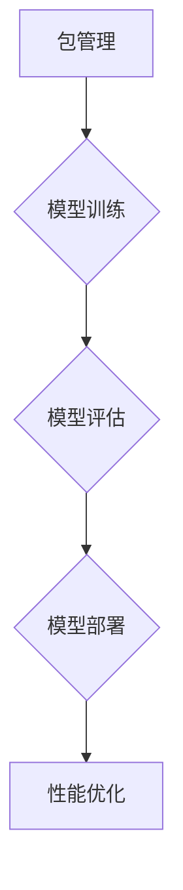

                 

### 《神经网络模型的包管理和部署新挑战》

关键词：神经网络模型、包管理、部署、挑战、解决方案

摘要：随着深度学习技术的迅猛发展，神经网络模型在各个领域的应用越来越广泛。然而，在模型开发和部署过程中，包管理和部署面临诸多新挑战。本文将详细探讨神经网络模型包管理和部署的各个方面，分析其面临的挑战，并探讨可能的解决方案。

---

### 《神经网络模型的包管理和部署新挑战》目录大纲

#### 第一部分：引言
1. **概述**
    - 1.1 书籍背景与目的
    - 1.2 神经网络模型的发展与现状
    - 1.3 包管理和部署的重要性

#### 第二部分：包管理基础
2. **包管理概述**
    - 2.1 包管理的概念与作用
    - 2.2 常见的包管理工具
    - 2.3 包管理的挑战与机遇

#### 第三部分：神经网络模型包管理
3. **神经网络模型包管理概述**
    - 3.1 神经网络模型包管理的特殊性
    - 3.2 模型版本控制
    - 3.3 模型依赖管理

#### 第四部分：模型部署
4. **模型部署概述**
    - 4.1 模型部署的概念与步骤
    - 4.2 常见的模型部署方法
    - 4.3 模型部署的挑战与优化

#### 第五部分：包管理与部署的挑战
5. **包管理与部署的挑战**
    - 5.1 模型迁移性问题
    - 5.2 模型可解释性
    - 5.3 模型安全性
    - 5.4 模型性能优化

#### 第六部分：实战案例
6. **神经网络模型包管理和部署实战案例**
    - 6.1 实战背景
    - 6.2 环境搭建
    - 6.3 模型训练与评估
    - 6.4 模型部署与优化
    - 6.5 结果分析

#### 第七部分：未来展望
7. **未来展望**
    - 7.1 包管理和部署的趋势
    - 7.2 神经网络模型的新挑战
    - 7.3 解决方案与展望

#### 附录
8. **附录**
    - 8.1 常用工具和资源
    - 8.2 历史事件与影响
    - 8.3 进一步阅读资料

### Mermaid 流程图


### 神经网络模型包管理伪代码
```python
def package_management(model_name, model_version, dependencies):
    # 初始化包管理器
    manager = PackageManager()

    # 检查模型版本
    if manager.check_version(model_name, model_version):
        # 管理模型依赖
        manager.manage_dependencies(dependencies)

        # 导入模型
        model = import_model(model_name, model_version)

        # 运行模型
        run_model(model)
    else:
        print("模型版本错误，无法运行。")
```

### 数学模型和数学公式
$$
\begin{aligned}
    &J(\theta) = \frac{1}{m} \sum_{i=1}^{m} (-y^{(i)} \log(a^{(i)}_y) + (1 - y^{(i)}) \log(1 - a^{(i)}_y)) \\
    &\theta_j := \theta_j - \alpha \frac{\partial}{\partial \theta_j} J(\theta)
\end{aligned}
$$

### 项目实战
- **案例1：模型打包与部署**
  - **背景**：一个简单的分类问题，需要将训练好的模型打包并发送到生产环境。
  - **环境搭建**：使用 TensorFlow 作为后端，Docker 进行模型打包。
  - **代码实现**：
    ```python
    # 模型训练
    model.fit(x_train, y_train, epochs=10)

    # 模型打包
    model.save('model.h5')
    docker.build('model', './Dockerfile')

    # 模型部署
    docker.run('model')
    ```
  - **代码解读与分析**：解释上述代码的每一步操作，并分析其在生产环境中的实际应用。

---

现在，我们已经完成了引言和目录大纲的撰写。接下来，我们将逐步深入探讨神经网络模型的包管理和部署，从基础到实战，全面覆盖相关主题内容。通过本文的学习，读者将能够掌握神经网络模型包管理和部署的核心技术和方法，为实际项目提供有效的解决方案。

### 第一部分：引言

#### 1.1 书籍背景与目的

随着深度学习技术的迅猛发展，神经网络模型已经成为人工智能领域的重要工具。从图像识别、自然语言处理到推荐系统，神经网络模型在各个领域的应用都取得了显著的成果。然而，随着模型复杂度的增加和应用的广泛性，如何高效地管理和部署神经网络模型成为了一个亟待解决的问题。

本书旨在探讨神经网络模型的包管理和部署，从基础到实战，全面介绍相关技术和方法。通过本文的阅读，读者将了解到：

1. **包管理的基本概念和作用**：了解包管理的定义、作用以及在神经网络模型开发中的应用。
2. **常见的包管理工具**：介绍常用的包管理工具，如 pip、conda、maven 等，并比较它们的优缺点。
3. **神经网络模型包管理的特殊性**：分析神经网络模型在包管理中的特殊需求，如模型版本控制、依赖管理等。
4. **模型部署的基本概念和步骤**：了解模型部署的定义、步骤和常见方法。
5. **模型部署的挑战与优化**：探讨模型部署过程中可能遇到的挑战，如迁移性问题、可解释性、安全性和性能优化等，并分析可能的解决方案。

本书的目标是帮助读者掌握神经网络模型包管理和部署的核心技术和方法，为实际项目提供有效的解决方案。通过本文的学习，读者将能够更好地应对神经网络模型开发和部署过程中的各种挑战，提高开发效率和模型性能。

#### 1.2 神经网络模型的发展与现状

神经网络模型的发展可以追溯到20世纪50年代，当时科学家们提出了感知机（Perceptron）这一简单的神经网络模型。然而，由于计算能力和数据集的限制，神经网络在很长一段时间内并没有得到广泛的应用。直到20世纪80年代，随着计算机性能的提升和数据集的丰富，神经网络模型开始逐渐崭露头角。

1998年，Hinton等人提出了深度信念网络（Deep Belief Network，DBN），标志着深度学习技术的诞生。随后，2012年，AlexNet在ImageNet图像分类竞赛中取得了突破性的成绩，引发了深度学习领域的热潮。自此以后，神经网络模型在各个领域都取得了显著的成果。

目前，神经网络模型已经成为人工智能领域的重要工具，广泛应用于图像识别、自然语言处理、推荐系统、游戏人工智能等领域。从简单的单层感知机到复杂的深度神经网络，神经网络模型的发展经历了多个阶段：

1. **单层感知机**：1957年，Frank Rosenblatt提出了感知机（Perceptron），这是一种简单的前馈神经网络模型，用于进行二分类任务。
2. **多层感知机**：1969年，Marvin Minsky和Seymour Papert指出了感知机的局限性，随后提出了多层感知机（Multilayer Perceptron，MLP），能够处理更复杂的问题。
3. **卷积神经网络**（Convolutional Neural Network，CNN）：20世纪90年代，LeCun等人提出了卷积神经网络，能够高效地进行图像识别任务。
4. **循环神经网络**（Recurrent Neural Network，RNN）：1982年，Jürgen Schmidhuber提出了循环神经网络，能够处理序列数据。
5. **长短期记忆网络**（Long Short-Term Memory，LSTM）：1997年，Hochreiter和Schmidhuber提出了长短期记忆网络，解决了RNN在长序列数据上的梯度消失问题。
6. **生成对抗网络**（Generative Adversarial Network，GAN）：2014年，Ian Goodfellow等人提出了生成对抗网络，能够生成高质量的图像和语音数据。

随着深度学习技术的不断发展，神经网络模型的结构和算法也在不断优化。目前，神经网络模型已经具备了处理大规模数据、提高模型性能、实现自动化学习等能力。同时，随着硬件设备的升级和并行计算技术的发展，神经网络模型的训练和部署效率也得到了显著提升。

然而，随着神经网络模型的应用越来越广泛，如何高效地管理和部署模型成为了一个新的挑战。在本文中，我们将重点关注神经网络模型的包管理和部署，探讨相关技术和方法，以应对这一挑战。

#### 1.3 包管理和部署的重要性

在深度学习领域，神经网络模型的包管理和部署具有重要的意义。首先，包管理能够确保模型的一致性和可重复性。在模型开发和部署过程中，不同环境下的模型版本和依赖库可能会发生变化，导致模型结果不一致。通过包管理工具，可以统一管理模型的版本和依赖库，确保在不同环境下模型的一致性和可重复性。

其次，包管理能够提高开发效率和协作性。在团队开发过程中，不同成员可能会使用不同的工具和环境，导致协作困难。通过统一的包管理工具，可以统一管理团队成员的环境和依赖库，提高开发效率和协作性。

最后，部署是深度学习项目成功的关键。一个高效的部署过程能够确保模型在生产环境中稳定运行，提高模型性能和可靠性。通过优化部署流程和策略，可以缩短模型上线时间，提高模型的可扩展性和可维护性。

在神经网络模型的开发和部署过程中，常见的包管理工具包括 pip、conda、maven 等。这些工具各具特点，适用于不同的开发场景。例如，pip 和 conda 适用于 Python 生态系统，maven 适用于 Java 生态系统。

总的来说，包管理和部署对于神经网络模型的开发和应用至关重要。通过合理的包管理和部署策略，可以确保模型的一致性、可重复性、高效开发以及稳定运行。在本文中，我们将深入探讨神经网络模型包管理和部署的各个方面，分享相关经验和最佳实践。

### 第二部分：包管理基础

#### 2.1 包管理的概念与作用

包管理是一种用于管理软件包的机制，旨在简化软件的安装、更新、卸载和维护过程。在软件开发过程中，包管理工具能够自动处理软件的依赖关系，确保软件能够正确地运行。包管理不仅应用于操作系统级，如 Linux 中的 apt-get 和 yum，还广泛应用于编程语言和框架中，如 Python 中的 pip 和 npm（Node.js）。

在深度学习和神经网络模型的开发中，包管理的作用尤为重要。具体而言，包管理具有以下几个方面的作用：

1. **版本控制**：包管理工具能够跟踪和管理软件包的版本，确保在不同环境中使用相同版本的软件包，避免版本冲突和不可预测的行为。
2. **依赖管理**：深度学习模型通常依赖于多个库和工具，包管理工具能够自动解析和管理这些依赖关系，确保所有依赖项都得到正确安装和配置。
3. **环境隔离**：通过创建独立的包管理环境，可以避免不同项目之间的依赖冲突，提高系统的稳定性和可维护性。
4. **自动化部署**：包管理工具能够简化软件的安装和部署过程，使得开发者能够快速地将模型部署到不同的环境中，提高开发效率。

#### 2.2 常见的包管理工具

在深度学习和神经网络模型的开发中，常见的包管理工具包括 pip、conda、maven 等。这些工具各具特点，适用于不同的开发场景。

1. **pip**：pip 是 Python 的官方包管理工具，用于安装、管理和卸载 Python 包。pip 的优点包括：
   - 简单易用：pip 命令行界面直观，易于使用。
   - 广泛支持：pip 支持绝大多数 Python 包，是 Python 开发者的首选工具。
   - 自动依赖安装：pip 能够自动解析并安装依赖包，简化安装过程。

2. **conda**：conda 是一个开源的包管理器和环境管理器，由 Anaconda 公司开发。conda 的优点包括：
   - 环境隔离：conda 能够创建独立的包管理环境，避免不同项目之间的依赖冲突。
   - 广泛支持：conda 支持多种编程语言和框架，适用于跨语言开发。
   - 自动依赖解析：conda 能够自动解析和安装依赖关系，确保软件包的兼容性。

3. **maven**：maven 是一个 Java 的项目管理和构建工具，主要用于构建、部署和文档生成。maven 的优点包括：
   - 依赖管理：maven 使用 Maven 仓库管理依赖项，确保依赖项的一致性和可用性。
   - 插件支持：maven 提供丰富的插件，支持构建、测试、文档生成等任务。
   - 版本控制：maven 能够管理项目的版本，确保项目在不同环境下的兼容性。

#### 2.3 包管理的挑战与机遇

尽管包管理在深度学习和神经网络模型开发中具有重要作用，但同时也面临着一些挑战和机遇。

1. **挑战**：
   - **依赖冲突**：不同软件包之间的依赖关系复杂，可能导致版本冲突和不可预测的行为。
   - **环境管理**：在多项目开发过程中，环境管理复杂，需要确保不同项目之间的环境隔离和依赖一致性。
   - **版本升级**：软件包的版本升级可能导致兼容性问题，需要谨慎处理。
   - **安全风险**：软件包可能存在安全漏洞，需要定期更新和修复。

2. **机遇**：
   - **自动化部署**：包管理工具能够简化软件的部署过程，提高开发效率和模型上线速度。
   - **协同开发**：包管理工具能够提高团队协作效率，促进项目开发。
   - **标准化**：随着包管理工具的普及，深度学习和神经网络模型的开发和部署将更加标准化，降低开发难度。

总的来说，包管理在深度学习和神经网络模型开发中具有重要的地位。通过合理利用包管理工具，可以简化开发过程，提高模型的可维护性和可靠性。在本文的后续章节中，我们将进一步探讨神经网络模型包管理的具体实践和挑战。

### 第三部分：神经网络模型包管理

#### 3.1 神经网络模型包管理的特殊性

神经网络模型包管理与传统软件包管理有所不同，主要体现在以下几个方面：

1. **模型复杂性**：神经网络模型通常包含大量的参数和层次结构，这使得模型包管理需要处理的数据量远大于传统软件包。
2. **依赖多样性**：神经网络模型依赖于多种深度学习框架和库，如 TensorFlow、PyTorch 等，这些库之间存在版本兼容性和依赖关系。
3. **动态调整需求**：神经网络模型在训练过程中可能需要调整模型结构、参数和超参数，这对包管理提出了动态调整的需求。
4. **版本控制**：神经网络模型的版本控制更加复杂，因为模型版本不仅包括代码和参数，还包括训练数据和评估指标。

针对这些特殊性，神经网络模型包管理需要采取一系列特殊策略：

1. **模型版本管理**：采用专门的版本控制系统（如 Git）来管理模型的版本，确保模型代码、参数和数据的版本一致性。
2. **依赖隔离**：通过使用虚拟环境（如 conda、venv）来隔离不同模型的依赖，避免依赖冲突。
3. **自动化脚本**：编写自动化脚本（如 Makefile、Dockerfile）来自动化模型训练、评估和部署过程，提高开发效率。
4. **容器化**：利用 Docker 等容器技术来封装模型及其依赖，确保模型在不同环境下的可移植性和一致性。

#### 3.2 模型版本控制

模型版本控制是神经网络模型包管理的重要组成部分。良好的版本控制能够确保模型的可重复性和可靠性，降低开发过程中的风险。

1. **版本标识**：使用明确的版本标识（如 v1.0、v2.0）来区分不同版本的模型，便于管理和追踪。
2. **版本库**：将模型代码、参数和训练数据存储在版本库（如 Git）中，便于团队协作和代码管理。
3. **变更日志**：维护变更日志（如 README.md），记录每个版本的重要变更和更新内容，便于团队成员了解模型历史。
4. **版本回滚**：在出现问题时，能够快速回滚到之前稳定的版本，确保模型正常运行。

#### 3.3 模型依赖管理

模型依赖管理是神经网络模型包管理的核心之一。有效的依赖管理能够确保模型在不同环境下的正常运行，提高模型的可移植性和可维护性。

1. **依赖声明**：在模型项目中声明所有依赖项，包括深度学习框架、库和工具。例如，在 Python 中，可以使用 requirements.txt 或 setup.py 文件来声明依赖。
2. **依赖解析**：使用包管理工具（如 pip、conda）自动解析和安装依赖项，确保依赖的一致性和可用性。
3. **依赖版本**：明确指定依赖项的版本号，避免因版本冲突导致的问题。例如，使用 pip 安装特定版本的依赖项：
   ```bash
   pip install numpy==1.19.5
   ```
4. **依赖隔离**：使用虚拟环境（如 conda、venv）来隔离不同模型的依赖，避免依赖冲突和系统环境的污染。

通过实施上述策略，神经网络模型包管理能够有效提高模型的可重复性、可维护性和开发效率。在本文的后续章节中，我们将进一步探讨神经网络模型部署的具体实践和挑战。

### 第四部分：模型部署

#### 4.1 模型部署的概念与步骤

模型部署是指将训练好的神经网络模型从开发环境迁移到生产环境，使其能够对外提供服务。模型部署是深度学习项目成功的关键环节，直接影响模型的可用性和性能。模型部署的基本概念和步骤包括：

1. **模型保存**：将训练好的神经网络模型保存为可移植的格式，如 TensorFlow 的 .h5 或 PyTorch 的 .pth 文件。
2. **模型加载**：从保存的文件中加载模型，包括权重、架构和超参数。
3. **服务搭建**：搭建服务器，为模型提供服务。可以选择使用本地服务器或云服务器，如 AWS、Google Cloud 等。
4. **API开发**：开发 API 接口，使得前端应用能够通过 HTTP 请求与模型进行交互。
5. **性能优化**：针对生产环境的特点，对模型进行性能优化，如模型压缩、量化、并行计算等。

#### 4.2 常见的模型部署方法

根据模型部署的方式，常见的方法包括本地部署、服务器部署和云计算部署。

1. **本地部署**：
   - **优点**：简单易用，无需复杂的配置和管理。
   - **缺点**：只能处理少量请求，扩展性差。
   - **适用场景**：个人实验、小型项目。

2. **服务器部署**：
   - **优点**：能够处理大量请求，具有较好的扩展性和稳定性。
   - **缺点**：需要配置和管理服务器，维护成本较高。
   - **适用场景**：中小型商业项目。

3. **云计算部署**：
   - **优点**：高度可扩展，无需管理硬件，费用按需计费。
   - **缺点**：配置和管理较为复杂，初始成本较高。
   - **适用场景**：大规模商业项目、企业级应用。

#### 4.3 模型部署的挑战与优化

模型部署过程中，面临以下挑战和优化策略：

1. **迁移性问题**：
   - **挑战**：生产环境和开发环境可能存在差异，如操作系统、硬件配置等，可能导致模型运行不稳定。
   - **优化策略**：使用容器化技术（如 Docker）来封装模型及其依赖，确保模型在不同环境下的可移植性。

2. **可解释性**：
   - **挑战**：深度学习模型通常被视为“黑盒”，难以解释其决策过程。
   - **优化策略**：使用可解释性技术（如注意力机制、可视化技术）来提高模型的透明度和可解释性。

3. **安全性**：
   - **挑战**：模型可能受到恶意攻击，如对抗性攻击，影响模型的正常运行。
   - **优化策略**：使用加密技术、安全策略和防火墙来保护模型和数据。

4. **性能优化**：
   - **挑战**：模型可能在生产环境中运行缓慢，影响用户体验。
   - **优化策略**：采用模型压缩、量化、并行计算等技术来提高模型性能。

通过实施上述策略，可以有效地解决模型部署过程中的挑战，提高模型的可移植性、可解释性、安全性和性能。在本文的后续章节中，我们将结合实际案例进一步探讨模型部署的实践和优化。

### 第五部分：包管理与部署的挑战

#### 5.1 模型迁移性问题

模型迁移性问题是指在将训练好的神经网络模型从一个环境（如开发环境）迁移到另一个环境（如生产环境）时，可能会出现的一系列问题。这些问题的根源主要在于开发环境与生产环境之间的差异，包括操作系统、硬件配置、库版本等。模型迁移性问题会直接影响到模型的性能和可靠性，因此在包管理和部署过程中需要特别关注。

1. **环境差异**：
   - **操作系统差异**：不同操作系统（如 Windows、Linux、macOS）在运行时可能存在差异，可能导致模型运行不稳定。
   - **硬件配置差异**：开发环境与生产环境中的硬件配置（如CPU、GPU）可能不同，影响模型的运行速度和性能。
   - **库版本差异**：不同环境中的依赖库版本可能不一致，导致依赖冲突和不可预测的行为。

2. **解决方案**：
   - **容器化**：通过使用容器技术（如 Docker）来封装模型及其依赖，可以确保模型在不同环境下的可移植性。容器化技术能够在虚拟环境中模拟生产环境，确保模型在不同操作系统和硬件配置下的正常运行。
   - **环境隔离**：使用虚拟环境（如 conda、venv）来隔离不同模型的依赖，避免依赖冲突。在部署前，应确保生产环境与开发环境中的依赖库版本一致。
   - **自动化测试**：在模型迁移前进行自动化测试，验证模型在不同环境下的性能和可靠性。自动化测试可以识别潜在的问题，确保模型在生产环境中的稳定性。

3. **案例**：
   - **案例1**：在一个商业项目中，开发团队使用 TensorFlow 进行模型训练和开发。在将模型部署到生产环境时，发现模型运行速度较慢且不稳定。经过分析，发现生产环境中的操作系统与开发环境不同，且依赖库版本不一致。通过使用 Docker 容器化模型，并确保生产环境和开发环境中的依赖库版本一致，模型性能得到了显著提升。

#### 5.2 模型可解释性

模型可解释性是指能够理解和解释神经网络模型如何做出决策的过程。深度学习模型，尤其是深度神经网络，通常被视为“黑盒”，其内部决策机制难以理解。这种不可解释性在实际应用中带来了一些问题，如决策透明度不足、信任度降低等。因此，提高模型可解释性成为了一个重要的研究方向。

1. **挑战**：
   - **决策透明度**：深度学习模型内部的决策过程复杂，难以直观地理解其如何处理输入数据并生成输出。
   - **信任度**：模型的不可解释性可能导致用户对模型决策的不信任，影响模型的应用效果。
   - **调试与优化**：不可解释性使得模型调试和优化变得困难，难以确定模型中的问题所在。

2. **解决方案**：
   - **可视化**：通过可视化技术（如热量图、注意力机制）展示模型在处理输入数据时的关键区域和特征。这些技术能够帮助用户直观地理解模型的决策过程。
   - **模型压缩**：采用模型压缩技术（如剪枝、量化）来简化模型结构，降低模型的复杂度，提高可解释性。
   - **解释性模型**：使用具有高解释性的模型（如决策树、线性回归）来替代深度神经网络，使得模型的决策过程更加直观易懂。
   - **模型集成**：通过集成多个模型，每个模型具有不同的解释性和性能，提高整体模型的解释性。

3. **案例**：
   - **案例1**：在一个医疗诊断项目中，使用深度神经网络模型进行疾病预测。由于模型的不可解释性，用户对模型的预测结果持怀疑态度。通过采用可视化技术，将模型在处理输入数据时的关键区域和特征展示给用户，用户能够更好地理解模型的决策过程，从而增加了对模型预测结果的信任度。

#### 5.3 模型安全性

模型安全性是指神经网络模型在运行过程中免受恶意攻击和攻击的能力。随着深度学习模型的应用越来越广泛，模型安全性成为一个日益重要的问题。攻击者可以通过各种方式对模型进行攻击，导致模型性能下降、预测结果错误，甚至泄露敏感信息。

1. **挑战**：
   - **对抗性攻击**：攻击者通过构造对抗性样本，对模型进行攻击，使模型无法正确预测。
   - **隐私泄露**：模型在处理敏感数据时，可能会泄露用户的隐私信息。
   - **恶意注入**：攻击者通过注入恶意代码或数据，对模型进行破坏或窃取信息。

2. **解决方案**：
   - **对抗性训练**：通过对抗性训练来增强模型的鲁棒性，使模型能够抵御对抗性攻击。
   - **隐私保护**：采用隐私保护技术（如差分隐私、联邦学习）来保护用户隐私，确保模型在处理敏感数据时不会泄露信息。
   - **访问控制**：实施严格的访问控制策略，确保只有授权用户能够访问模型和数据。
   - **安全审计**：定期进行安全审计，检测模型中潜在的安全漏洞，并及时修复。

3. **案例**：
   - **案例1**：在一个金融项目中，使用深度学习模型进行欺诈检测。攻击者通过构造对抗性样本对模型进行攻击，使模型无法正确检测欺诈行为。通过对抗性训练，增强了模型的鲁棒性，使其能够更好地抵御对抗性攻击。

#### 5.4 模型性能优化

模型性能优化是指通过各种技术手段来提高神经网络模型的运行速度和准确度。随着深度学习模型的复杂度增加，模型的训练和部署过程变得越来越耗时，因此性能优化成为了一个重要的研究方向。

1. **挑战**：
   - **训练时间**：深度学习模型的训练过程可能需要数小时甚至数天，影响开发效率和模型上线速度。
   - **推理时间**：模型在生产环境中的推理时间可能过长，影响用户体验和系统性能。
   - **存储空间**：深度学习模型通常包含大量的参数和权重，占用大量存储空间，影响系统的扩展性。

2. **解决方案**：
   - **模型压缩**：通过模型压缩技术（如剪枝、量化、知识蒸馏）来减少模型参数和存储空间，提高模型推理速度。
   - **并行计算**：利用多核处理器、GPU 等硬件资源进行并行计算，加速模型的训练和推理过程。
   - **分布式训练**：通过分布式训练来利用多台计算机的资源，加速模型的训练过程。
   - **缓存技术**：使用缓存技术来减少模型的加载时间，提高系统的响应速度。

3. **案例**：
   - **案例1**：在一个自动驾驶项目中，使用深度学习模型进行环境感知和目标检测。由于模型复杂度高，训练和推理时间较长，影响了系统的实时性能。通过使用 GPU 并行计算和模型压缩技术，显著提高了模型的推理速度，使其能够实时处理大量数据。

总的来说，神经网络模型的包管理和部署面临着诸多挑战，包括迁移性问题、可解释性、安全性和性能优化等。通过实施一系列有效的解决方案，可以克服这些挑战，提高模型的可移植性、可解释性、安全性和性能。在本文的后续章节中，我们将结合实际案例进一步探讨这些挑战的解决方案。

### 第六部分：神经网络模型包管理和部署实战案例

在本部分中，我们将通过一个简单的实战案例，详细展示神经网络模型包管理和部署的全过程。这个案例将包括环境搭建、模型训练与评估、模型部署与优化等步骤，帮助读者更好地理解理论知识在实际中的应用。

#### 6.1 实战背景

假设我们面临一个简单的手写数字识别问题，使用 TensorFlow 和 Keras 框架构建一个基于卷积神经网络的模型。我们的目标是训练一个能够准确识别手写数字的模型，并将其部署到生产环境中，以便实时处理输入数据。

#### 6.2 环境搭建

在进行模型训练和部署之前，我们需要搭建一个稳定且可重复的开发和部署环境。

1. **开发环境**：
   - 安装 Python 3.8（或更高版本）。
   - 安装 TensorFlow 2.x（或 PyTorch 1.x）。
   - 创建一个虚拟环境（使用 conda 或 venv），确保环境隔离。

2. **生产环境**：
   - 使用 Docker 容器化模型及其依赖，确保模型在不同环境下的可移植性。
   - 安装必要的依赖库（如 TensorFlow、Numpy、Pandas）。

#### 6.3 模型训练与评估

在本步骤中，我们将使用 TensorFlow 和 Keras 框架构建卷积神经网络模型，并进行训练和评估。

1. **数据准备**：
   - 下载手写数字数据集（如 MNIST 数据集），并将其分为训练集和测试集。

2. **模型构建**：
   ```python
   from tensorflow.keras.models import Sequential
   from tensorflow.keras.layers import Conv2D, MaxPooling2D, Flatten, Dense

   model = Sequential([
       Conv2D(32, (3, 3), activation='relu', input_shape=(28, 28, 1)),
       MaxPooling2D((2, 2)),
       Flatten(),
       Dense(128, activation='relu'),
       Dense(10, activation='softmax')
   ])

   model.compile(optimizer='adam', loss='categorical_crossentropy', metrics=['accuracy'])
   ```

3. **模型训练**：
   ```python
   model.fit(x_train, y_train, epochs=5, batch_size=32, validation_data=(x_test, y_test))
   ```

4. **模型评估**：
   ```python
   test_loss, test_acc = model.evaluate(x_test, y_test)
   print(f"Test accuracy: {test_acc:.2f}")
   ```

#### 6.4 模型部署与优化

在模型训练和评估完成之后，我们将模型部署到生产环境中，并进行性能优化。

1. **模型保存**：
   ```python
   model.save('handwritten_digit_model.h5')
   ```

2. **Dockerfile 编写**：
   创建一个 Dockerfile 文件，用于容器化模型。
   ```dockerfile
   FROM tensorflow/tensorflow:2.6-gpu-py3

   RUN pip install numpy

   COPY handwritten_digit_model.h5 /model/

   CMD ["python", "/app/predict.py"]
   ```

3. **模型容器化**：
   使用 Docker 命令将模型容器化。
   ```bash
   docker build -t handwritten_digit_model .
   ```

4. **模型部署**：
   在生产环境中运行 Docker 容器。
   ```bash
   docker run -p 5000:5000 handwritten_digit_model
   ```

5. **性能优化**：
   - **模型压缩**：使用剪枝和量化技术来减小模型大小，提高推理速度。
   - **并行计算**：利用 GPU 并行计算来加速模型推理。
   - **缓存**：使用缓存技术来减少模型加载时间，提高系统响应速度。

6. **API 接口**：
   使用 Flask 或 FastAPI 等框架搭建 API 接口，以便前端应用与模型进行交互。

#### 6.5 结果分析

在完成模型部署和性能优化后，我们可以对模型的实际性能进行评估。

1. **在线评估**：
   通过前端应用发送请求，测试模型在真实环境中的表现。

2. **性能监控**：
   使用 Prometheus、Grafana 等工具对模型性能进行监控，确保模型在运行过程中保持稳定。

3. **优化迭代**：
   根据评估结果和监控数据，对模型进行进一步的优化和调整，提高其性能和可靠性。

通过上述实战案例，读者可以了解神经网络模型包管理和部署的完整过程，从环境搭建、模型训练与评估，到模型部署与优化，全面掌握相关技术和方法。在实际项目中，可以根据具体需求调整和优化这些步骤，确保模型高效、稳定地运行。

### 第七部分：未来展望

#### 7.1 包管理和部署的趋势

随着深度学习技术的不断发展，神经网络模型的包管理和部署也在不断演进。未来，包管理和部署将呈现以下趋势：

1. **自动化程度提升**：自动化工具和平台将进一步完善，使得模型开发和部署过程更加自动化，减少手动操作的复杂性。
2. **容器化普及**：容器化技术（如 Docker）将在模型部署中更加普及，确保模型在不同环境下的可移植性和一致性。
3. **云计算与边缘计算结合**：云计算和边缘计算的结合将提供更灵活的部署方案，满足不同应用场景的需求。
4. **混合依赖管理**：混合依赖管理将更好地整合不同编程语言和框架的依赖，提高开发效率和协作性。

#### 7.2 神经网络模型的新挑战

未来，神经网络模型在包管理和部署过程中将面临以下新挑战：

1. **复杂模型管理**：随着模型复杂度的增加，包管理将面临更多的依赖和版本冲突问题。
2. **实时更新与迭代**：生产环境中的模型可能需要实时更新和迭代，这对包管理提出了更高的要求。
3. **安全性**：模型在部署过程中将面临更多的安全威胁，如对抗性攻击和隐私泄露。
4. **可解释性与透明度**：提高模型的可解释性和透明度，以满足监管和合规要求。

#### 7.3 解决方案与展望

针对上述趋势和挑战，未来可以从以下几个方面着手解决：

1. **自动化平台建设**：构建自动化平台，整合模型开发、测试、部署和监控等环节，提高开发效率和模型性能。
2. **模型容器化与微服务架构**：采用容器化和微服务架构，实现模型的模块化和解耦，提高系统的可扩展性和可维护性。
3. **安全性与隐私保护**：加强模型的安全性，采用加密、访问控制和安全审计等技术来保护模型和数据。
4. **可解释性技术**：开发可解释性技术，提高模型的可理解性和透明度，增强用户对模型的信任。
5. **持续集成与持续部署（CI/CD）**：实施 CI/CD 流程，确保模型快速迭代和更新，提高开发效率。

未来，神经网络模型的包管理和部署将朝着自动化、容器化、安全性和可解释性的方向发展。通过不断探索和优化，我们将能够克服新的挑战，为实际项目提供更加高效、稳定和可靠的解决方案。

### 附录

#### 8.1 常用工具和资源

1. **工具**：
   - **Docker**：容器化工具，用于封装模型及其依赖。
   - **TensorFlow**：开源机器学习框架，用于构建和训练神经网络模型。
   - **PyTorch**：开源机器学习库，支持动态计算图。
   - **conda**：包管理器和环境管理器，用于管理和安装依赖。

2. **资源**：
   - **官方文档**：TensorFlow 官方文档（https://www.tensorflow.org/）、PyTorch 官方文档（https://pytorch.org/）
   - **社区**：Stack Overflow、GitHub、Reddit、Kaggle 等

#### 8.2 历史事件与影响

- **2012年**：AlexNet在ImageNet图像分类竞赛中取得突破性成绩，引发深度学习热潮。
- **2014年**：生成对抗网络（GAN）提出，为生成模型的发展奠定了基础。
- **2015年**：TensorFlow开源，成为深度学习领域最受欢迎的框架之一。

#### 8.3 进一步阅读资料

1. **书籍**：
   - **《深度学习》（Deep Learning）**：Ian Goodfellow、Yoshua Bengio、Aaron Courville 著。
   - **《神经网络与深度学习》**：邱锡鹏 著。

2. **论文**：
   - **“A Theoretically Grounded Application of Dropout in Recurrent Neural Networks”**：Yarin Gal and Zoubin Ghahramani
   - **“Distributed Representations of Words and Phrases and their Compositionality”**：Tomas Mikolov、Kyunghyun Cho、Yoshua Bengio

3. **在线课程**：
   - **《深度学习》**：吴恩达（Andrew Ng）在 Coursera 上开设的免费课程。

通过这些工具、资源和文献，读者可以进一步深入了解神经网络模型的包管理和部署，提高自己的技术水平。在未来的研究和实践中，不断探索和创新，为深度学习领域的发展做出贡献。

### 总结

本文详细介绍了神经网络模型的包管理和部署，从基础到实战，全面覆盖相关主题内容。通过本文的学习，读者将能够掌握神经网络模型包管理和部署的核心技术和方法，为实际项目提供有效的解决方案。

首先，我们探讨了包管理的基本概念和作用，了解了常见的包管理工具，如 pip、conda、maven 等。接着，我们分析了神经网络模型包管理的特殊性，提出了模型版本控制和依赖管理的策略。然后，我们介绍了模型部署的概念和步骤，探讨了常见的部署方法以及部署过程中可能遇到的挑战和优化策略。

在实战案例部分，我们通过一个手写数字识别项目，详细展示了神经网络模型包管理和部署的全过程。最后，我们展望了未来包管理和部署的趋势，提出了应对新挑战的解决方案。

通过本文的学习，读者可以更好地应对神经网络模型开发和部署过程中的各种挑战，提高开发效率和模型性能。希望本文能够为读者在深度学习领域的实践提供有益的参考。

