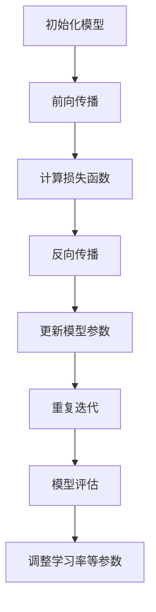
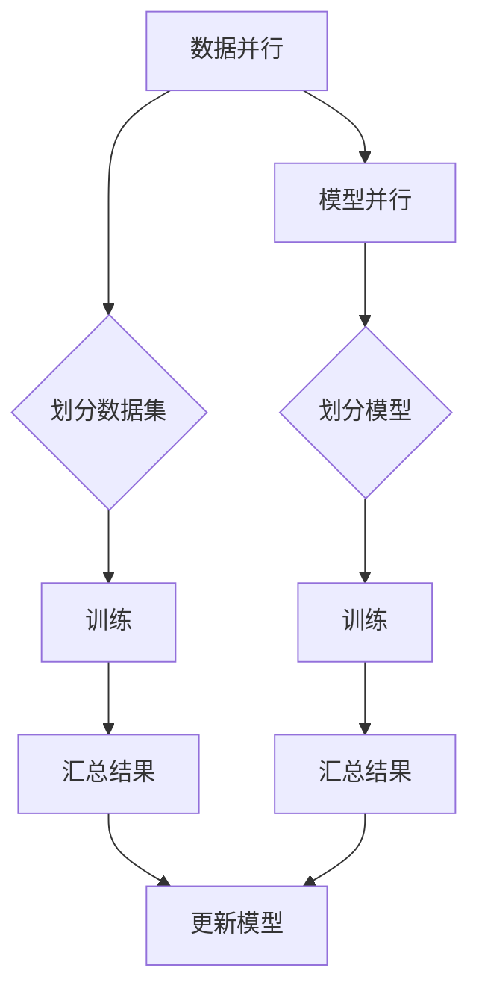
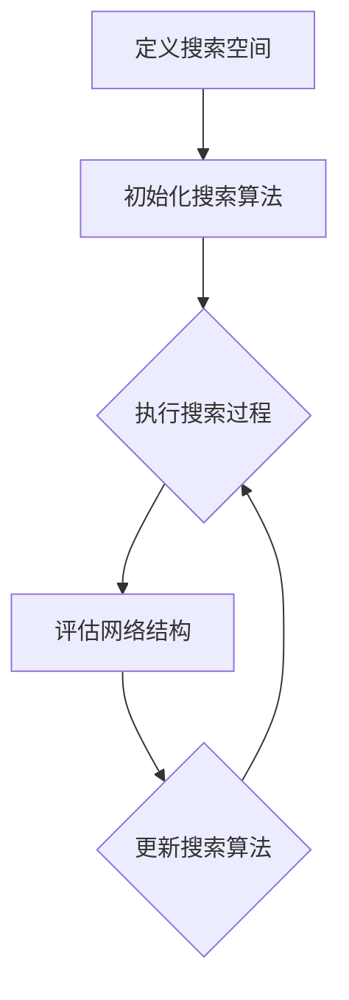
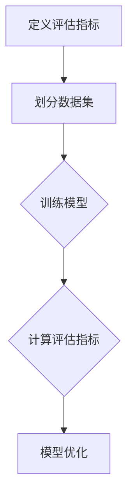

                 

### 第1章 神经网络基础

#### 1.1 神经网络的基本原理

神经网络（Neural Network）是一种模仿人脑神经元连接方式的计算模型，主要用于机器学习领域。神经网络通过多层节点（或称为“神经元”）的相互连接来处理数据，模拟人类大脑的信息处理过程。

**神经网络的数学模型**：

神经网络可以用一个有向图来表示，这个图包含以下几个部分：

1. **输入层（Input Layer）**：接收外部输入信号，传递给下一层。
2. **隐藏层（Hidden Layers）**：对输入信号进行处理，可以有一个或多个隐藏层。
3. **输出层（Output Layer）**：产生最终的输出结果。

神经网络中的每个节点（神经元）都有一个权重（weight）和偏置（bias），用于计算输入和输出的关系。节点接收输入信号，通过加权求和处理，然后加上偏置，最后通过激活函数（activation function）产生输出。

激活函数是神经网络的核心组成部分，常用的激活函数有：

- **Sigmoid函数**：\( f(x) = \frac{1}{1 + e^{-x}} \)
- **ReLU函数**：\( f(x) = \max(0, x) \)
- **Tanh函数**：\( f(x) = \frac{e^x - e^{-x}}{e^x + e^{-x}} \)

**神经网络的学习过程**：

神经网络通过一个迭代的学习过程来调整权重和偏置，以达到预期的输出。这个过程主要包括以下几个步骤：

1. **前向传播（Forward Propagation）**：输入信号从输入层传递到输出层，每个节点计算其输出值。
2. **损失函数（Loss Function）**：计算输出值与真实值之间的误差，常用的损失函数有均方误差（MSE）和交叉熵（Cross-Entropy）。
3. **反向传播（Back Propagation）**：根据误差计算每个节点的梯度，然后更新权重和偏置。
4. **优化算法（Optimization Algorithm）**：常用的优化算法有随机梯度下降（SGD）、Adam等。

#### 1.2 神经网络的层次结构

神经网络的层次结构对于模型性能有着重要的影响。层次结构可以分为以下几类：

1. **单层神经网络**：只有一层隐藏层，适用于简单的数据处理任务。
2. **多层神经网络**：具有多个隐藏层，可以捕捉更复杂的特征和模式，但训练过程更为复杂。
3. **深度神经网络**：具有多个隐藏层，甚至超过几十层，可以处理大规模数据和复杂的任务。

**层与节点数量对模型性能的影响**：

- **层与节点数量的选择**：过多的层或节点可能导致过拟合，即模型在训练数据上表现良好，但在未见过的数据上表现较差。反之，过少的层或节点可能导致欠拟合，即模型无法捕捉到足够的信息。因此，层与节点数量的选择需要在过拟合和欠拟合之间找到平衡。

- **深层网络的优势与挑战**：深层网络可以捕捉更复杂的特征和模式，但在训练过程中容易出现梯度消失或梯度爆炸等问题，导致训练困难。此外，深层网络的训练时间和计算资源需求也更高。

#### 1.3 优化算法与调参策略

优化算法用于调整神经网络的权重和偏置，以减少损失函数。常用的优化算法有：

- **随机梯度下降（SGD）**：每次迭代使用一个样本的梯度进行更新，计算效率较高。
- **Adam算法**：结合了SGD和Momentum的特点，适用于大规模数据和长时间训练。

调参策略是神经网络训练过程中至关重要的一环，以下是一些常用的调参策略：

- **学习率（Learning Rate）**：控制每次迭代权重的更新步长，需要根据模型和数据的特点进行调节。
- **批量大小（Batch Size）**：每次迭代使用的样本数量，较小的批量大小可以减少过拟合，但会增加训练时间。
- **正则化（Regularization）**：用于防止过拟合，常用的正则化方法有L1和L2正则化。
- **dropout**：在训练过程中随机丢弃一部分神经元，减少过拟合。

#### 1.4 模型验证与性能评估

模型验证与性能评估是确保神经网络模型在实际应用中表现良好的关键步骤。以下是一些常用的评估指标和验证方法：

- **准确性（Accuracy）**：分类任务中正确分类的样本数占总样本数的比例。
- **召回率（Recall）**：分类任务中被正确分类的负样本数占所有负样本数的比例。
- **F1值（F1-Score）**：综合考虑准确率和召回率的一个指标。
- **交叉验证（Cross-Validation）**：将数据集划分为多个子集，每次使用一个子集作为验证集，其余子集作为训练集，多次迭代，最终取平均性能。

通过模型验证与性能评估，我们可以确定神经网络模型的鲁棒性和泛化能力，从而为实际应用提供可靠的依据。

---

> **核心概念与联系：**

神经网络的数学模型可以用以下 Mermaid 流程图表示：

```mermaid
graph TD
A[输入层] --> B[隐藏层1]
B --> C[隐藏层2]
C --> D[输出层]
A --> B
A --> C
A --> D
class B
class C
class D
```

在神经网络中，每个节点（神经元）都通过权重和偏置与其他节点相连，并通过激活函数产生输出。这个过程可以用以下伪代码表示：

```python
# 前向传播
for each layer in hidden_layers:
    for each neuron in layer:
        z = sum(input * weight) + bias
        output = activation_function(z)

# 反向传播
for each layer in hidden_layers:
    for each neuron in layer:
        delta = (expected_output - actual_output) * activation_function_derivative(output)
        weight_gradient = input * delta
        bias_gradient = delta
```

其中，`input` 代表输入信号，`weight` 代表权重，`bias` 代表偏置，`activation_function` 代表激活函数，`activation_function_derivative` 代表激活函数的导数。

---

> **核心算法原理讲解：**

在神经网络中，损失函数用于衡量预测值与真实值之间的差距。常用的损失函数有均方误差（MSE）和交叉熵（Cross-Entropy）。以下是对这两种损失函数的详细讲解：

**均方误差（MSE）**：

均方误差是一种常用的损失函数，用于计算预测值与真实值之间的平均平方误差。其数学公式如下：

$$
MSE = \frac{1}{n}\sum_{i=1}^{n}(y_i - \hat{y}_i)^2
$$

其中，$y_i$ 表示第 $i$ 个真实值，$\hat{y}_i$ 表示第 $i$ 个预测值，$n$ 表示样本数量。

**交叉熵（Cross-Entropy）**：

交叉熵是一种用于分类问题的损失函数，其数学公式如下：

$$
CE = -\frac{1}{n}\sum_{i=1}^{n}y_i \log(\hat{y}_i)
$$

其中，$y_i$ 表示第 $i$ 个真实值（0或1），$\hat{y}_i$ 表示第 $i$ 个预测值（介于0和1之间）。

**优化算法原理：**

优化算法用于调整神经网络的权重和偏置，以最小化损失函数。以下是对随机梯度下降（SGD）和Adam算法的详细讲解：

**随机梯度下降（SGD）**：

随机梯度下降是一种简单的优化算法，其基本思想是使用每个样本的梯度进行权重更新。其数学公式如下：

$$
\theta = \theta - \alpha \cdot \nabla_{\theta}J(\theta)
$$

其中，$\theta$ 表示权重，$\alpha$ 表示学习率，$J(\theta)$ 表示损失函数。

**Adam算法**：

Adam算法是一种结合了SGD和Momentum的优化算法，其能够更好地处理大规模数据和长时间训练。其数学公式如下：

$$
m_t = \beta_1 x_t + (1 - \beta_1) (x_t - x_{t-1})
$$

$$
v_t = \beta_2 y_t + (1 - \beta_2) (y_t - y_{t-1})
$$

$$
\theta = \theta - \alpha \cdot \frac{m_t}{\sqrt{v_t} + \epsilon}
$$

其中，$m_t$ 和 $v_t$ 分别表示一阶矩估计和二阶矩估计，$\beta_1$ 和 $\beta_2$ 分别表示一阶矩和二阶矩的衰减率，$\alpha$ 表示学习率，$\epsilon$ 表示一个很小的常数。

---

> **数学模型和公式：**

神经网络的数学模型可以用以下公式表示：

$$
\hat{y} = \sigma(z)
$$

其中，$\hat{y}$ 表示预测值，$z$ 表示输入经过权重和偏置加权求和处理后的结果，$\sigma$ 表示激活函数。

**均方误差（MSE）**：

$$
MSE = \frac{1}{n}\sum_{i=1}^{n}(y_i - \hat{y}_i)^2
$$

**交叉熵（Cross-Entropy）**：

$$
CE = -\frac{1}{n}\sum_{i=1}^{n}y_i \log(\hat{y}_i)
$$

**随机梯度下降（SGD）**：

$$
\theta = \theta - \alpha \cdot \nabla_{\theta}J(\theta)
$$

**Adam算法**：

$$
m_t = \beta_1 x_t + (1 - \beta_1) (x_t - x_{t-1})
$$

$$
v_t = \beta_2 y_t + (1 - \beta_2) (y_t - y_{t-1})
$$

$$
\theta = \theta - \alpha \cdot \frac{m_t}{\sqrt{v_t} + \epsilon}
$$

---

> **举例说明：**

假设我们有一个二分类问题，数据集包含100个样本，每个样本有两个特征（$x_1$ 和 $x_2$）。我们要使用神经网络进行分类，输出概率 $p$，其中 $p > 0.5$ 表示正类，$p \leq 0.5$ 表示负类。

**1. 数据预处理：**

将数据集划分为训练集和验证集，例如训练集占比80%，验证集占比20%。

对数据进行标准化处理，将每个特征缩放到0-1范围内。

**2. 网络结构设计：**

设计一个简单的神经网络，包含一个输入层、一个隐藏层和一个输出层。隐藏层节点数为10。

**3. 模型训练：**

使用随机梯度下降（SGD）算法进行模型训练，学习率为0.01，批量大小为32。

在前向传播过程中，计算输入经过权重和偏置加权求和处理后的结果，并使用Sigmoid函数作为激活函数。

在后向传播过程中，计算损失函数的梯度，并更新权重和偏置。

**4. 模型评估：**

在验证集上评估模型性能，计算准确率、召回率、F1值等指标。

**5. 结果分析：**

通过调整学习率、批量大小、隐藏层节点数等超参数，优化模型性能。

---

以上是一个简单的二分类问题中使用神经网络进行分类的实例。在实际应用中，神经网络结构可能更加复杂，涉及多个隐藏层、多种激活函数、正则化方法等。但基本的原理和步骤是相似的。

---

### 第2章 大规模神经网络模型

#### 2.1 计算机图形学与传统神经网络

计算机图形学（Computer Graphics）和传统神经网络（Neural Network）在技术原理和应用场景上有所不同，但两者之间存在着紧密的联系。

**计算机图形学的基本概念**：

计算机图形学是利用计算机技术和图形学原理来创建、处理和显示图形的方法和技术的总称。它包括以下几个方面：

1. **几何建模**：通过数学方法描述物体的几何形状，如点、线、面、体等。
2. **纹理映射**：在物体表面添加纹理，以增加视觉效果的真实感。
3. **光照模型**：模拟光线在物体表面的反射、折射和散射，以产生逼真的光影效果。
4. **渲染**：将几何建模、纹理映射和光照模型结合起来，生成最终的图像。

**传统神经网络的基本概念**：

传统神经网络是一种基于人工神经元的计算模型，主要用于机器学习和人工智能领域。它通过多层神经元之间的连接和激活函数来模拟人类大脑的信息处理过程。传统神经网络的基本组成部分包括：

1. **输入层**：接收外部输入信号，传递给下一层。
2. **隐藏层**：对输入信号进行处理，可以有一个或多个隐藏层。
3. **输出层**：产生最终的输出结果。

**计算机图形学与神经网络的关系**：

计算机图形学和神经网络在技术原理上有一定的相似性，它们都涉及数据的处理和建模。具体来说，以下几个方面展示了两者之间的联系：

1. **几何建模与神经网络**：计算机图形学中的几何建模可以通过神经网络来实现，例如，使用卷积神经网络（CNN）对图像进行特征提取和分类。

2. **光照模型与神经网络**：神经网络可以用来模拟计算机图形学中的光照模型，如使用生成对抗网络（GAN）生成逼真的光照效果。

3. **渲染与神经网络**：神经网络可以用于渲染过程的加速和优化，例如，使用神经网络来预测渲染像素的颜色，从而减少渲染时间。

**大规模神经网络的优势与局限**：

大规模神经网络在处理大规模数据、复杂任务方面具有显著优势：

1. **数据拟合能力**：大规模神经网络通过增加层数和节点数，可以捕捉到更复杂的特征和模式，从而提高模型的拟合能力。
2. **泛化能力**：大规模神经网络通过更充分的训练，可以减少过拟合现象，提高模型的泛化能力。
3. **计算能力**：随着计算机硬件的发展，大规模神经网络可以在短时间内处理海量数据，实现高效计算。

然而，大规模神经网络也存在一定的局限：

1. **训练成本**：大规模神经网络的训练需要大量的计算资源和时间，训练成本较高。
2. **梯度消失和梯度爆炸**：在深层网络中，梯度可能因为层数过多而变得非常小或非常大，导致训练困难。
3. **模型可解释性**：大规模神经网络的决策过程复杂，难以解释，降低了模型的可解释性。

#### 2.2 大规模神经网络的设计原则

为了充分发挥大规模神经网络的优势，同时克服其局限，设计大规模神经网络时需要遵循以下原则：

1. **模型压缩与加速**：

   - **模型压缩**：通过剪枝、量化等技术减少模型的参数数量，降低模型的计算复杂度，从而提高计算效率。
   - **加速技术**：利用GPU、TPU等硬件加速器来加速神经网络的训练和推理过程。

2. **神经网络架构设计要点**：

   - **模块化设计**：将神经网络分解为多个模块，每个模块负责特定的任务，便于模型优化和调整。
   - **层次化结构**：根据任务需求设计合适的层次结构，合理分配计算资源，提高模型性能。
   - **并行化设计**：利用数据并行和模型并行的策略，加速神经网络的训练和推理过程。

3. **跨层连接与梯度传递**：

   - **跨层连接**：在神经网络中引入跨层连接，可以更好地传递梯度，缓解梯度消失和梯度爆炸问题。
   - **梯度传递**：通过合适的梯度传递方法，如ResNet中的残差连接，提高模型的训练效果。

#### 2.3 大规模神经网络训练策略

大规模神经网络的训练策略对于模型的性能和训练效率具有重要影响。以下是一些常用的训练策略：

1. **分布式训练原理**：

   - **数据并行**：将训练数据集划分为多个子集，每个子集分别在不同的设备上训练模型，最后汇总结果。
   - **模型并行**：将神经网络分解为多个部分，每个部分分别在不同的设备上训练，最后将结果合并。

2. **梯度下降算法的并行化**：

   - **同步梯度下降**：所有设备上的模型同步更新，适用于数据并行。
   - **异步梯度下降**：不同设备上的模型异步更新，适用于模型并行。

3. **模型融合与优化策略**：

   - **模型融合**：将多个模型的结果进行融合，提高模型的鲁棒性和性能。
   - **优化策略**：根据任务需求和计算资源，选择合适的优化策略，如Adam、SGD等。

通过上述训练策略，可以有效地提高大规模神经网络的训练效率，提高模型性能。

---

> **核心概念与联系：**

大规模神经网络的训练可以通过以下 Mermaid 流程图表示：



在分布式训练过程中，数据并行和模型并行的策略如图所示：



---

> **核心算法原理讲解：**

**分布式训练原理**：

分布式训练是指将训练任务分散到多个计算节点上，以加快训练速度和降低训练成本。分布式训练主要分为数据并行和模型并行两种策略。

1. **数据并行**：

   - **基本思想**：将训练数据集划分为多个子集，每个子集分别在不同的设备上（如GPU、CPU）进行训练。
   - **优点**：可以充分利用多个计算节点的计算资源，提高训练速度。
   - **挑战**：需要处理数据同步和模型参数的同步问题。

2. **模型并行**：

   - **基本思想**：将神经网络分解为多个部分，每个部分分别在不同的设备上进行训练。
   - **优点**：可以处理更大规模的神经网络，提高模型性能。
   - **挑战**：需要处理模型参数的同步和通信开销。

**梯度下降算法的并行化**：

梯度下降算法是神经网络训练的核心算法。在分布式训练中，梯度下降算法可以进行并行化，以提高训练效率。

1. **同步梯度下降**：

   - **基本思想**：所有设备上的模型同步更新。
   - **公式**：
     $$
     \theta = \theta - \alpha \cdot \nabla_{\theta}J(\theta)
     $$
   - **优点**：收敛速度较快。
   - **缺点**：需要等待所有设备上的梯度计算完成，通信开销较大。

2. **异步梯度下降**：

   - **基本思想**：不同设备上的模型异步更新。
   - **公式**：
     $$
     \theta_i = \theta_i - \alpha \cdot \nabla_{\theta_i}J(\theta_i)
     $$
   - **优点**：减少通信开销，提高训练速度。
   - **缺点**：收敛速度较慢，容易出现局部最优。

**模型融合与优化策略**：

模型融合是指将多个模型的预测结果进行融合，以提高模型的性能和鲁棒性。优化策略是指根据训练数据和任务需求，选择合适的优化算法和参数。

1. **模型融合**：

   - **基本思想**：将多个模型的预测结果进行加权平均或投票，得到最终的预测结果。
   - **公式**：
     $$
     \hat{y} = \sum_{i=1}^{k} w_i \cdot \hat{y}_i
     $$
   - **优点**：提高模型的性能和鲁棒性。
   - **缺点**：需要计算多个模型的预测结果，增加计算开销。

2. **优化策略**：

   - **随机梯度下降（SGD）**：
     - **基本思想**：每次迭代使用一个样本的梯度进行更新。
     - **公式**：
       $$
       \theta = \theta - \alpha \cdot \nabla_{\theta}J(\theta)
       $$
     - **优点**：简单有效。
     - **缺点**：收敛速度较慢，容易陷入局部最优。

   - **Adam算法**：
     - **基本思想**：结合SGD和Momentum的特点。
     - **公式**：
       $$
       m_t = \beta_1 x_t + (1 - \beta_1) (x_t - x_{t-1})
       $$
       $$
       v_t = \beta_2 y_t + (1 - \beta_2) (y_t - y_{t-1})
       $$
       $$
       \theta = \theta - \alpha \cdot \frac{m_t}{\sqrt{v_t} + \epsilon}
       $$
     - **优点**：收敛速度较快，适用于大规模数据。
     - **缺点**：参数较多，需要调节。

---

> **数学模型和公式：**

**分布式训练中的同步梯度下降**：

$$
\theta = \theta - \alpha \cdot \nabla_{\theta}J(\theta)
$$

**分布式训练中的异步梯度下降**：

$$
\theta_i = \theta_i - \alpha \cdot \nabla_{\theta_i}J(\theta_i)
$$

**模型融合**：

$$
\hat{y} = \sum_{i=1}^{k} w_i \cdot \hat{y}_i
$$

**随机梯度下降（SGD）**：

$$
\theta = \theta - \alpha \cdot \nabla_{\theta}J(\theta)
$$

**Adam算法**：

$$
m_t = \beta_1 x_t + (1 - \beta_1) (x_t - x_{t-1})
$$

$$
v_t = \beta_2 y_t + (1 - \beta_2) (y_t - y_{t-1})
$$

$$
\theta = \theta - \alpha \cdot \frac{m_t}{\sqrt{v_t} + \epsilon}
$$

---

> **举例说明：**

假设我们有一个大规模图像分类任务，数据集包含1000万张图像，每个图像有1000个特征。我们要使用大规模神经网络进行分类，输出概率 $p$，其中 $p > 0.5$ 表示正类，$p \leq 0.5$ 表示负类。

**1. 数据预处理：**

将数据集划分为训练集和验证集，例如训练集占比80%，验证集占比20%。

对数据进行标准化处理，将每个特征缩放到0-1范围内。

**2. 网络结构设计：**

设计一个简单的神经网络，包含一个输入层、两个隐藏层和一个输出层。隐藏层节点数分别为1000和500。

**3. 模型训练：**

使用异步梯度下降算法进行模型训练，学习率为0.001，批量大小为256。

在前向传播过程中，计算输入经过权重和偏置加权求和处理后的结果，并使用ReLU函数作为激活函数。

在后向传播过程中，计算损失函数的梯度，并更新权重和偏置。

**4. 模型评估：**

在验证集上评估模型性能，计算准确率、召回率、F1值等指标。

**5. 结果分析：**

通过调整学习率、批量大小、隐藏层节点数等超参数，优化模型性能。

---

以上是一个简单的图像分类任务中使用大规模神经网络进行分类的实例。在实际应用中，神经网络结构可能更加复杂，涉及多个隐藏层、多种激活函数、正则化方法等。但基本的原理和步骤是相似的。

---

### 第3章 神经网络在大模型中的应用

#### 3.1 自然语言处理中的神经网络

自然语言处理（Natural Language Processing，NLP）是人工智能领域的一个重要分支，它涉及对人类语言的计算机处理和理解。神经网络在NLP中发挥了关键作用，通过深度学习技术实现了许多复杂的NLP任务。以下是神经网络在NLP中的几个主要应用领域：

**词嵌入与编码器**

**词嵌入（Word Embedding）** 是将单词映射到高维向量空间的一种方法，这些向量可以捕获单词的语义和语法信息。词嵌入技术使得神经网络能够处理文本数据，成为NLP中的基础技术之一。

- **Word2Vec**：Word2Vec 是一种基于神经网络的词嵌入方法，它通过预测邻近词来学习单词的向量表示。Word2Vec 主要有两种算法：连续词袋（CBOW）和Skip-Gram。
- **GloVe**：GloVe（Global Vectors for Word Representation）是一种基于矩阵分解的方法，通过优化单词的共现矩阵来学习词向量。

**编码器（Encoder）** 是一种神经网络结构，用于将输入序列（如单词序列）编码为固定长度的向量表示。编码器在NLP任务中扮演着重要的角色，如机器翻译、文本分类等。

- **循环神经网络（RNN）**：RNN 是一种能够处理序列数据的神经网络，它通过隐藏状态来捕捉序列中的长期依赖关系。RNN 在文本分类和语言模型任务中得到了广泛应用。
- **长短期记忆网络（LSTM）**：LSTM 是 RNN 的一个变种，它通过引入门控机制来缓解梯度消失问题，从而更好地捕捉序列中的长期依赖关系。
- **门控循环单元（GRU）**：GRU 是 LSTM 的简化版，它在保留 LSTM 长期记忆能力的同时，降低了计算复杂度。

**序列模型与注意力机制**

**序列模型** 是一类用于处理序列数据的神经网络模型，包括 RNN、LSTM 和 GRU 等。序列模型能够处理输入序列的时序信息，使其在语言生成、情感分析等任务中具有优势。

- **语言模型（Language Model）**：语言模型用于预测下一个单词的概率，它在文本生成和机器翻译任务中至关重要。
- **文本分类（Text Classification）**：文本分类是将文本数据分类到预定义的类别中，如情感分析、主题分类等。

**注意力机制（Attention Mechanism）** 是一种在序列模型中提高模型性能的重要技术。注意力机制能够使模型在处理序列数据时，能够动态地关注重要的部分，从而提高模型的表达能力。

- **自注意力（Self-Attention）**：自注意力机制是一种在序列中计算权重的方法，它能够使模型在处理序列数据时，自动关注重要的部分。
- **双向注意力（Bidirectional Attention）**：双向注意力机制结合了前向和后向的注意力信息，能够更好地捕捉序列中的依赖关系。

**语言模型与文本生成**

**语言模型** 是一种用于预测下一个单词的概率的模型，它在文本生成任务中发挥着重要作用。语言模型通常使用神经网络进行训练，如 RNN、LSTM 和 Transformer 等。

- **生成式模型**：生成式模型通过生成概率分布来生成文本。例如，使用 RNN 或 LSTM 生成文本序列。
- **判别式模型**：判别式模型通过预测给定文本序列的标签来生成文本。例如，使用条件生成式模型生成文本序列。

**文本生成** 是一个具有广泛应用的任务，包括聊天机器人、自动摘要、诗歌创作等。神经网络在文本生成任务中发挥了关键作用，使得生成文本更加自然、连贯。

**总结**

神经网络在自然语言处理中发挥了重要作用，从词嵌入、编码器、序列模型到注意力机制，再到语言模型和文本生成，神经网络为许多NLP任务提供了强大的支持。随着深度学习技术的发展，神经网络在NLP中的应用将越来越广泛，为人工智能领域带来更多的创新和突破。

#### 3.2 计算机视觉中的神经网络

计算机视觉（Computer Vision）是人工智能领域的一个重要分支，它致力于使计算机能够像人类一样理解和解析视觉信息。神经网络，特别是深度学习技术，在计算机视觉中发挥了关键作用，推动了该领域的快速发展。以下是神经网络在计算机视觉中的主要应用：

**卷积神经网络（CNN）**

卷积神经网络（Convolutional Neural Network，CNN）是计算机视觉中最常用的神经网络结构之一。CNN 通过卷积操作、池化操作和全连接层来提取图像特征并进行分类。

- **卷积操作**：卷积层通过卷积核（filter）在图像上滑动，提取局部特征。每个卷积核可以提取不同类型的特征，如边缘、纹理等。
- **池化操作**：池化层用于减少特征图的尺寸，提高模型的计算效率。常见的池化操作有最大池化和平均池化。
- **全连接层**：全连接层将卷积层的特征图展开成一维向量，并通过全连接层进行分类。

**递归神经网络（RNN）**

递归神经网络（Recurrent Neural Network，RNN）是一种能够处理序列数据的神经网络。在计算机视觉中，RNN 可以用于处理视频序列数据，提取时间上的特征。

- **循环操作**：RNN 通过循环结构来处理序列数据，每个时间步的输出依赖于前面的输出和当前输入。
- **门控操作**：长短期记忆网络（Long Short-Term Memory，LSTM）和门控循环单元（Gated Recurrent Unit，GRU）是 RNN 的两个变种，它们通过门控机制来缓解梯度消失问题，更好地捕捉序列中的长期依赖关系。

**图像生成与处理**

神经网络在图像生成与处理方面也具有广泛的应用。生成对抗网络（Generative Adversarial Network，GAN）是一种重要的图像生成模型，它由生成器和判别器两个部分组成。

- **生成器**：生成器尝试生成逼真的图像，以欺骗判别器。
- **判别器**：判别器尝试区分真实图像和生成图像。

GAN 通过对抗训练来优化生成器和判别器的参数，从而生成高质量的图像。GAN 在图像合成、风格迁移、人脸生成等方面取得了显著成果。

**目标检测与跟踪**

目标检测（Object Detection）是计算机视觉中的一个重要任务，它旨在识别图像中的多个目标并定位其位置。神经网络在目标检测中发挥了重要作用，如 R-CNN、Fast R-CNN、Faster R-CNN、SSD、YOLO 等。

- **区域建议（Region Proposal）**：目标检测算法首先通过区域建议生成可能的物体区域。
- **分类与定位**：然后，算法对每个区域进行分类，并确定其位置。

目标跟踪（Object Tracking）是另一个重要的计算机视觉任务，它旨在跟踪图像序列中的物体。神经网络在目标跟踪中用于处理目标的状态估计、目标识别和姿态估计等问题。

**总结**

神经网络在计算机视觉中具有广泛的应用，从图像分类、目标检测到图像生成与处理，神经网络为计算机视觉任务提供了强大的支持。随着深度学习技术的不断发展，神经网络在计算机视觉中的应用将更加广泛，推动计算机视觉领域的创新和发展。

#### 3.3 推荐系统中的神经网络

推荐系统（Recommendation System）是一种常用的信息过滤技术，旨在根据用户的兴趣和偏好，向其推荐相关的商品、内容或其他信息。神经网络在推荐系统中发挥着重要作用，通过深度学习技术，推荐系统可以实现更准确的预测和更好的用户体验。

**基于内容的推荐**

基于内容的推荐（Content-Based Recommendation）是一种推荐系统的方法，它根据用户过去的行为或偏好，找到具有相似内容的物品进行推荐。神经网络在基于内容的推荐中主要用于特征提取和相似性计算。

- **特征提取**：神经网络可以学习到用户和物品的特征表示，如文本、图像、音频等。通过将原始数据进行编码，神经网络可以提取出具有语义信息的高维特征向量。
- **相似性计算**：基于内容的推荐系统通过计算用户和物品之间的相似度来生成推荐列表。神经网络通过学习用户和物品的交互数据，可以更好地计算相似度。

**基于协同过滤的推荐**

基于协同过滤的推荐（Collaborative Filtering）是一种推荐系统的方法，它通过分析用户之间的相似性，找到具有共同兴趣的用户或物品进行推荐。神经网络在基于协同过滤的推荐中主要用于用户和物品的嵌入表示和学习。

- **用户嵌入（User Embedding）**：神经网络将用户的行为数据（如购买记录、浏览历史等）转换为高维向量表示，从而捕获用户的兴趣和偏好。
- **物品嵌入（Item Embedding）**：神经网络将物品的特征数据（如商品属性、文本描述等）转换为高维向量表示，从而捕获物品的属性和特征。
- **相似性计算**：基于协同过滤的推荐系统通过计算用户和物品之间的相似度来生成推荐列表。神经网络通过学习用户和物品的交互数据，可以更好地计算相似度。

**深度学习方法在推荐系统中的应用**

深度学习方法在推荐系统中的应用主要包括以下两个方面：

- **深度特征表示**：通过神经网络学习到用户和物品的深度特征表示，可以更好地捕捉用户和物品的复杂关系。深度特征表示可以用于个性化推荐、推荐排序等任务。
- **模型融合**：将深度学习模型与传统协同过滤模型结合，可以进一步提高推荐系统的性能。例如，可以使用神经网络生成用户和物品的嵌入表示，然后结合这些表示进行协同过滤。

**挑战与优化策略**

虽然神经网络在推荐系统中具有许多优势，但仍然面临一些挑战：

- **数据稀疏性**：推荐系统中的用户和物品交互数据通常是稀疏的，这使得基于协同过滤的方法难以捕捉用户和物品之间的潜在关系。
- **冷启动问题**：新用户或新物品在没有足够交互数据的情况下，难以获得有效的推荐。
- **模型可解释性**：深度学习模型通常具有“黑盒”性质，难以解释其推荐决策过程。

为了解决上述挑战，可以采取以下优化策略：

- **数据增强**：通过引入额外的数据源或对现有数据进行扩展，可以缓解数据稀疏性问题。
- **迁移学习**：利用预训练的模型或跨域数据，可以更好地应对冷启动问题。
- **模型解释性**：通过可解释的模型结构或解释性算法，可以提升模型的可解释性。

**总结**

神经网络在推荐系统中具有广泛的应用，通过深度学习技术，推荐系统可以实现更准确的预测和更好的用户体验。未来，随着深度学习技术的不断发展，推荐系统将在更多领域发挥重要作用，为用户提供个性化的推荐服务。

---

### 第4章 神经网络结构优化

#### 4.1 神经网络结构搜索

神经网络结构搜索（Neural Architecture Search，NAS）是一种自动化神经网络设计的方法，旨在通过搜索算法自动寻找最优的网络结构。NAS 的核心思想是从一组候选结构中，通过搜索算法选择出性能最优的网络结构。以下是 NAS 的基本原理、方法和应用。

**基本原理**

神经网络结构搜索的基本原理可以分为两个阶段：搜索空间定义和搜索算法设计。

- **搜索空间定义**：搜索空间是指所有可能的神经网络结构的集合。搜索空间可以包括网络的层数、每层的神经元数量、激活函数、连接方式等。
- **搜索算法设计**：搜索算法负责在搜索空间中搜索最优的网络结构。常见的搜索算法有基于梯度的搜索算法、基于遗传算法的搜索算法和基于强化学习的搜索算法。

**方法**

1. **基于梯度的搜索算法**：

   基于梯度的搜索算法通过计算网络结构的梯度来优化网络结构。梯度计算通常基于网络在训练数据上的性能，通过梯度下降等方法来更新网络结构。

   - **梯度提升（Gradient Ascent）**：通过计算网络结构在训练数据上的性能梯度，逐步提升网络结构的性能。
   - **梯度下降（Gradient Descent）**：通过计算网络结构在训练数据上的性能梯度，逐步降低网络结构的性能。

2. **基于遗传算法的搜索算法**：

   基于遗传算法的搜索算法模拟生物进化过程，通过交叉、变异和选择等操作来搜索最优网络结构。

   - **交叉（Crossover）**：通过组合两个网络结构的特征，生成新的网络结构。
   - **变异（Mutation）**：通过随机修改网络结构的部分特征，生成新的网络结构。
   - **选择（Selection）**：通过评估网络结构的性能，选择最优的网络结构。

3. **基于强化学习的搜索算法**：

   基于强化学习的搜索算法通过训练一个强化学习模型来搜索最优网络结构。强化学习模型通过与环境（训练数据）进行交互，学习最优的网络结构。

   - **奖励机制**：通过定义一个奖励函数来评估网络结构的性能，奖励函数通常基于网络在训练数据上的性能。
   - **策略网络**：通过训练一个策略网络来生成新的网络结构，策略网络负责选择下一个网络结构。

**应用**

神经网络结构搜索在许多领域都取得了显著的成果，以下是一些应用示例：

- **计算机视觉**：在图像分类、目标检测和图像生成任务中，NAS 方法能够自动设计出性能更优的网络结构。
- **自然语言处理**：在机器翻译、文本分类和文本生成任务中，NAS 方法能够自动设计出适合的语言模型结构。
- **语音识别**：在语音分类、说话人识别和语音生成任务中，NAS 方法能够自动设计出适合的语音处理模型。

**总结**

神经网络结构搜索是一种自动化神经网络设计的方法，通过搜索算法自动寻找最优的网络结构。NAS 方法在许多领域都取得了显著的成果，为神经网络设计提供了新的思路和工具。未来，随着搜索算法和硬件技术的发展，NAS 方法将在更多领域中发挥重要作用。

---

> **核心概念与联系：**

神经网络结构搜索（NAS）可以表示为一个 Mermaid 流程图：



**搜索空间**：定义了所有可能的神经网络结构。

**初始化搜索算法**：选择并初始化一个搜索算法，如基于梯度的搜索算法、基于遗传算法的搜索算法或基于强化学习的搜索算法。

**执行搜索过程**：搜索算法在搜索空间中执行搜索过程，生成新的网络结构。

**评估网络结构**：通过训练数据评估网络结构的性能，如准确率、召回率等。

**更新搜索算法**：根据网络结构的性能更新搜索算法，如调整搜索策略、优化搜索参数等。

---

> **核心算法原理讲解：**

**神经架构搜索（NAS）**：

神经架构搜索（Neural Architecture Search，NAS）是一种自动化神经网络设计的方法，旨在通过搜索算法自动寻找最优的网络结构。NAS 的基本流程如下：

1. **搜索空间定义**：定义神经网络结构的搜索空间，包括网络的层数、每层的神经元数量、激活函数、连接方式等。

2. **初始化搜索算法**：选择并初始化一个搜索算法，如基于梯度的搜索算法、基于遗传算法的搜索算法或基于强化学习的搜索算法。

3. **执行搜索过程**：搜索算法在搜索空间中执行搜索过程，生成新的网络结构。常见的搜索策略包括随机搜索、贝叶斯优化、进化策略等。

4. **评估网络结构**：通过训练数据评估网络结构的性能，如准确率、召回率等。评估指标的选择取决于具体任务。

5. **更新搜索算法**：根据网络结构的性能更新搜索算法，如调整搜索策略、优化搜索参数等。这有助于提高搜索效率，找到更好的网络结构。

**神经架构优化（NPO）**：

神经架构优化（Neural Architecture Optimization，NPO）是一种在给定神经网络结构上进行优化的方法。NPO 的基本流程如下：

1. **给定初始网络结构**：指定一个初始的神经网络结构。

2. **初始化优化算法**：选择并初始化一个优化算法，如基于梯度的优化算法、基于遗传算法的优化算法等。

3. **执行优化过程**：优化算法在给定网络结构上执行优化过程，通过调整网络参数（如权重、偏置等）来提高网络性能。

4. **评估网络性能**：通过训练数据评估优化后网络结构的性能，如准确率、召回率等。

5. **更新优化算法**：根据网络性能更新优化算法，如调整学习率、优化策略等。

**自动机器学习（AutoML）**：

自动机器学习（Automated Machine Learning，AutoML）是一种自动化机器学习过程的方法，旨在自动设计、训练和优化机器学习模型。AutoML 的基本流程如下：

1. **数据预处理**：对输入数据进行预处理，如数据清洗、特征工程等。

2. **模型搜索**：使用 NAS、NPO 等方法自动搜索最优的网络结构。

3. **模型训练**：使用训练数据训练选定的模型，并进行模型优化。

4. **模型评估**：通过验证数据评估模型性能，选择最佳模型。

5. **模型部署**：将最佳模型部署到实际应用中，如预测、决策等。

---

> **数学模型和公式：**

**搜索空间定义**：

设 $S$ 为神经网络结构的搜索空间，$s$ 为神经网络结构的一个可能取值，则 $S$ 可以表示为：

$$
S = \{s | s \in \{L, N, A, C\}\}
$$

其中，$L$ 表示层数，$N$ 表示每层的神经元数量，$A$ 表示激活函数，$C$ 表示连接方式。

**初始化搜索算法**：

设 $f$ 为搜索算法，$s_0$ 为初始神经网络结构，则初始化搜索算法可以表示为：

$$
s_0 = f(S)
$$

**执行搜索过程**：

设 $s_t$ 为当前神经网络结构，$p_t$ 为搜索概率分布，则执行搜索过程可以表示为：

$$
s_{t+1} = f(s_t, p_t)
$$

**评估网络结构**：

设 $L$ 为损失函数，$s$ 为神经网络结构，则评估网络结构可以表示为：

$$
L(s) = L(\theta_s)
$$

**更新搜索算法**：

设 $g$ 为更新函数，$p_t$ 为当前搜索概率分布，则更新搜索算法可以表示为：

$$
p_{t+1} = g(p_t, L(s_t))
$$

---

> **举例说明：**

假设我们要设计一个用于图像分类的神经网络，任务为识别猫和狗。我们需要通过神经架构搜索（NAS）来找到最优的网络结构。

**1. 搜索空间定义**：

我们定义搜索空间包括以下参数：

- 层数：$L \in \{2, 3, 4\}$
- 每层神经元数量：$N \in \{32, 64, 128\}$
- 激活函数：$A \in \{\text{ReLU}, \text{Sigmoid}\}$
- 连接方式：$C \in \{\text{全连接}, \text{卷积}\}$

**2. 初始化搜索算法**：

我们选择基于梯度的搜索算法，初始化搜索概率分布 $p_0$ 为每个参数的均匀分布。

**3. 执行搜索过程**：

我们通过梯度下降算法在搜索空间中搜索最优的网络结构。每次迭代，我们根据搜索概率分布 $p_t$ 生成一个新的网络结构 $s_{t+1}$。

**4. 评估网络结构**：

我们使用训练数据对每个网络结构进行评估，计算其分类准确率。

**5. 更新搜索算法**：

根据网络结构的准确率，我们更新搜索概率分布 $p_{t+1}$，使得性能更好的网络结构具有更高的搜索概率。

通过以上步骤，我们最终找到了一个最优的网络结构，用于图像分类任务。

---

### 第5章 神经网络模型评估

#### 5.1 评估指标与方法

评估神经网络模型性能是确保其能够有效解决实际问题的重要环节。常用的评估指标包括准确性、召回率、F1值、精确率等。这些指标能够从不同角度衡量模型的性能，帮助开发者优化模型。

**准确性（Accuracy）**：

准确性是评估分类模型性能的最基本指标，表示正确分类的样本数占总样本数的比例。其计算公式为：

$$
Accuracy = \frac{TP + TN}{TP + FN + FP + TN}
$$

其中，$TP$ 表示真正例（True Positive），$TN$ 表示真负例（True Negative），$FP$ 表示假正例（False Positive），$FN$ 表示假负例（False Negative）。

**召回率（Recall）**：

召回率表示模型能够正确识别出的真正例数占总真正例数的比例。其计算公式为：

$$
Recall = \frac{TP}{TP + FN}
$$

召回率强调的是模型对负例的识别能力，适用于实际场景中负例更为重要的情况。

**精确率（Precision）**：

精确率表示模型识别出的正例中，真正例所占的比例。其计算公式为：

$$
Precision = \frac{TP}{TP + FP}
$$

精确率强调的是模型对正例的识别准确性，适用于实际场景中正例更为重要的情况。

**F1值（F1 Score）**：

F1值是精确率和召回率的调和平均值，用于综合考虑两者的性能。其计算公式为：

$$
F1 Score = 2 \times \frac{Precision \times Recall}{Precision + Recall}
$$

当模型的精确率和召回率存在明显差异时，F1值能够提供更全面的性能评估。

**评估方法**：

在实际应用中，常用的评估方法包括交叉验证和网格搜索。

**交叉验证（Cross-Validation）**：

交叉验证是一种评估模型性能的方法，通过将数据集划分为多个子集，每次使用一个子集作为验证集，其余子集作为训练集，多次迭代，最终取平均性能。常见的交叉验证方法有K折交叉验证和留一法交叉验证。

**网格搜索（Grid Search）**：

网格搜索是一种通过遍历多个参数组合来寻找最优参数的方法。网格搜索首先定义一个参数网格，然后遍历所有可能的参数组合，对每个组合进行模型训练和评估，最终选择性能最佳的参数组合。

通过使用这些评估指标和方法，开发者可以全面评估神经网络模型在各个任务上的性能，从而优化模型参数，提高模型性能。

---

> **核心概念与联系：**

神经网络模型评估可以通过以下 Mermaid 流程图表示：



**定义评估指标**：确定使用哪些评估指标来衡量模型性能，如准确性、召回率、F1值等。

**划分数据集**：将数据集划分为训练集、验证集和测试集，用于训练模型和评估模型性能。

**训练模型**：使用训练集训练神经网络模型，并调整模型参数。

**计算评估指标**：使用验证集计算模型的评估指标，如准确性、召回率、F1值等。

**模型优化**：根据评估指标的结果，调整模型参数，优化模型性能。

---

> **核心算法原理讲解：**

**交叉验证（Cross-Validation）**：

交叉验证是一种评估模型性能的方法，其基本思想是将数据集划分为多个子集，每次使用一个子集作为验证集，其余子集作为训练集，多次迭代，最终取平均性能。

**1. 划分数据集**：

首先，将数据集 $D$ 划分为 $k$ 个子集，每个子集大小为 $\frac{1}{k}$，记为 $D_1, D_2, ..., D_k$。

**2. 迭代训练与评估**：

对于每次迭代，选择一个子集作为验证集，其余子集作为训练集。具体步骤如下：

- 使用训练集训练模型。
- 使用验证集评估模型性能，计算评估指标。

**3. 计算平均性能**：

重复以上步骤 $k$ 次，每次使用不同的验证集。最后，计算每个评估指标的平均值，作为模型的整体性能。

**数学公式**：

$$
\bar{Accuracy} = \frac{1}{k} \sum_{i=1}^{k} Accuracy(D_i)
$$

其中，$Accuracy(D_i)$ 表示使用子集 $D_i$ 作为验证集时模型的准确性。

**网格搜索（Grid Search）**：

网格搜索是一种通过遍历多个参数组合来寻找最优参数的方法。

**1. 定义参数网格**：

首先，定义一个参数网格，包括所有可能的参数组合。例如，对于学习率和批量大小，我们可以定义一个参数网格：

$$
\{(lr_1, bs_1), (lr_2, bs_2), ..., (lr_n, bs_m)\}
$$

**2. 遍历参数组合**：

对于每个参数组合，进行以下步骤：

- 使用当前参数组合训练模型。
- 使用验证集评估模型性能。

**3. 选择最优参数**：

根据评估指标的结果，选择性能最佳的参数组合。

**数学公式**：

$$
\bar{Performance} = \frac{1}{n} \sum_{i=1}^{n} Performance(params_i)
$$

其中，$Performance(params_i)$ 表示使用参数组合 $params_i$ 时模型的性能。

---

> **数学模型和公式**：

**交叉验证的数学公式**：

$$
\bar{Accuracy} = \frac{1}{k} \sum_{i=1}^{k} Accuracy(D_i)
$$

其中，$Accuracy(D_i)$ 表示使用子集 $D_i$ 作为验证集时模型的准确性。

**网格搜索的数学公式**：

$$
\bar{Performance} = \frac{1}{n} \sum_{i=1}^{n} Performance(params_i)
$$

其中，$Performance(params_i)$ 表示使用参数组合 $params_i$ 时模型的性能。

---

> **举例说明**：

假设我们有一个包含100个样本的数据集，其中50个样本为正类，50个样本为负类。我们要使用交叉验证和网格搜索评估一个二分类神经网络的性能。

**1. 交叉验证**：

- 将数据集划分为10个子集，每个子集包含10个样本。
- 对于每个子集，将其作为验证集，其余子集作为训练集。
- 使用训练集训练模型，并在验证集上评估模型性能。
- 计算每个子集的准确性，并取平均值作为模型的准确性。

**2. 网格搜索**：

- 定义一个参数网格，包括学习率和批量大小的所有可能组合。
- 对于每个参数组合，使用训练集训练模型，并在验证集上评估模型性能。
- 计算每个参数组合的性能，并选择性能最佳的参数组合。

通过交叉验证和网格搜索，我们可以得到一个性能更优的神经网络模型，从而提高其在实际任务中的表现。

---

### 第6章 神经网络模型的应用挑战与未来趋势

#### 6.1 应用挑战

神经网络模型在实际应用中面临着诸多挑战，这些挑战限制了神经网络模型在更多领域和更大规模上的应用。

**数据隐私与安全**

随着神经网络模型在各个领域的应用越来越广泛，数据隐私与安全问题日益凸显。神经网络模型通常需要对大量敏感数据进行训练，如医疗数据、金融数据等。如果这些数据泄露，可能会导致严重的安全问题和隐私侵犯。因此，如何在保证模型性能的同时，保护数据隐私成为了一个重要的挑战。

**模型可解释性**

神经网络模型，特别是深度神经网络，通常被称为“黑盒”模型，因为它们的决策过程非常复杂，难以解释。这对于一些需要模型可解释性的应用场景，如金融风险评估、医疗诊断等，是一个重大的挑战。用户和监管机构通常要求能够理解模型的决策过程，以确保模型的公正性和透明性。

**能耗与计算资源**

训练大规模神经网络模型通常需要大量的计算资源和时间。这不仅增加了计算成本，也导致了大量的能耗。随着神经网络模型的应用越来越广泛，如何在有限的计算资源下，高效地训练和部署模型成为了一个重要的挑战。

#### 6.2 未来趋势

尽管神经网络模型面临诸多挑战，但它们的发展前景依然非常广阔。以下是一些未来趋势：

**新型神经网络架构**

随着深度学习技术的不断进步，新型神经网络架构层出不穷。例如，Transformer 架构在自然语言处理领域取得了巨大的成功，其基于自注意力机制的设计思想为神经网络架构的创新提供了新的思路。未来，我们可能会看到更多基于自注意力、图神经网络等新型架构的神经网络模型。

**神经网络在边缘计算中的应用**

随着物联网（IoT）和边缘计算的发展，越来越多的计算任务需要在边缘设备上完成。神经网络模型由于其计算复杂度高，通常难以在边缘设备上部署。未来，如何优化神经网络模型，使其能够在边缘设备上高效运行，是一个重要的研究方向。

**神经网络与其他技术的融合**

神经网络在人工智能领域的应用已经取得了显著的成果，但仅靠神经网络本身很难解决复杂的问题。未来，神经网络可能会与其他技术，如强化学习、迁移学习、联邦学习等，进行深度融合，形成更加综合和强大的智能系统。

**总结**

神经网络模型在实际应用中面临着数据隐私、模型可解释性、能耗和计算资源等挑战，但它们的发展前景依然非常广阔。通过不断创新和优化，神经网络模型有望在更多领域和更大规模上发挥重要作用，推动人工智能技术的进一步发展。

---

### 第7章 神经网络结构在大模型中的实际应用

#### 7.1 自然语言处理中的应用

自然语言处理（NLP）是人工智能领域的一个分支，它涉及语言理解、生成和翻译等任务。神经网络，特别是深度学习技术，在NLP中取得了显著的成果。以下是一些具体的实际应用案例。

**语言模型与机器翻译**

语言模型是NLP中的一个核心任务，它旨在预测下一个单词或句子。神经网络，如循环神经网络（RNN）、长短期记忆网络（LSTM）和Transformer，广泛应用于语言模型的训练。其中，Transformer模型由于其自注意力机制，在机器翻译任务中表现出色。

**文本分类与情感分析**

文本分类是将文本数据分类到预定义的类别中，如情感分类、主题分类等。神经网络在文本分类任务中发挥了重要作用，通过特征提取和分类算法，可以实现高精度的文本分类。情感分析是文本分类的一种应用，它旨在判断文本的情感倾向，如正面、负面或中性。

**问答系统与对话生成**

问答系统是NLP的一个重要应用，它能够根据用户的问题提供相应的答案。神经网络，如序列到序列（Seq2Seq）模型和Transformer模型，广泛应用于问答系统的训练。对话生成是另一个重要的应用，它旨在生成自然、流畅的对话。

**案例研究：BERT模型**

BERT（Bidirectional Encoder Representations from Transformers）是一种基于Transformer的预训练语言模型，它通过预训练和微调，在多个NLP任务中取得了优异的性能。BERT的预训练过程包括两个阶段：未mask的文本序列和 masked 的文本序列。在微调阶段，BERT 模型被用于文本分类、问答系统、命名实体识别等任务。

**总结**

神经网络在自然语言处理中发挥了重要作用，从语言模型、文本分类到问答系统，神经网络为NLP任务提供了强大的支持。随着深度学习技术的不断发展，神经网络在NLP中的应用将越来越广泛，推动NLP领域的创新和发展。

#### 7.2 计算机视觉中的应用

计算机视觉是人工智能领域的一个重要分支，它旨在使计算机能够像人类一样理解和解析视觉信息。神经网络，特别是深度学习技术，在计算机视觉中取得了显著的成果。以下是一些具体的实际应用案例。

**图像识别与分类**

图像识别与分类是将图像或视频中的对象分类到预定义的类别中。神经网络，如卷积神经网络（CNN）、循环神经网络（RNN）和Transformer，广泛应用于图像识别与分类任务。其中，CNN 是计算机视觉中最常用的神经网络结构，通过卷积操作、池化操作和全连接层，CNN 能够提取图像特征并进行分类。

**目标检测与跟踪**

目标检测是计算机视觉中的一个重要任务，它旨在识别图像或视频中的多个目标并定位其位置。神经网络，如 R-CNN、Fast R-CNN、Faster R-CNN、SSD 和 YOLO，广泛应用于目标检测任务。目标跟踪是另一个重要的任务，它旨在跟踪图像或视频序列中的目标。神经网络，如 RNN 和 LSTM，通过处理目标状态序列，可以实现对目标的实时跟踪。

**图像生成与处理**

图像生成是计算机视觉中的一个有趣的应用，它旨在生成新的图像或修改现有图像。生成对抗网络（GAN）是一种重要的图像生成模型，它通过生成器和判别器的对抗训练，可以生成高质量的图像。图像处理是将图像进行增强、压缩、去噪等操作。神经网络，如 CNN 和 RNN，可以通过学习图像特征，实现高效的图像处理。

**案例研究：GAN模型**

生成对抗网络（GAN）是一种重要的图像生成模型，它由生成器和判别器两个部分组成。生成器尝试生成逼真的图像，以欺骗判别器。判别器则尝试区分真实图像和生成图像。GAN 通过对抗训练来优化生成器和判别器的参数，从而生成高质量的图像。GAN 在图像合成、风格迁移、人脸生成等方面取得了显著成果。

**总结**

神经网络在计算机视觉中发挥了重要作用，从图像识别、目标检测到图像生成与处理，神经网络为计算机视觉任务提供了强大的支持。随着深度学习技术的不断发展，神经网络在计算机视觉中的应用将越来越广泛，推动计算机视觉领域的创新和发展。

#### 7.3 推荐系统中的应用

推荐系统是人工智能领域的一个重要应用，它旨在根据用户的兴趣和偏好，向其推荐相关的商品、内容或其他信息。神经网络，特别是深度学习技术，在推荐系统中发挥了关键作用，通过学习用户行为和物品特征，实现更准确的推荐。

**基于内容的推荐**

基于内容的推荐（Content-Based Recommendation）是一种推荐系统的方法，它根据用户过去的行为或偏好，找到具有相似内容的物品进行推荐。神经网络在基于内容的推荐中主要用于特征提取和相似性计算。

- **特征提取**：神经网络可以学习到用户和物品的特征表示，如文本、图像、音频等。通过将原始数据进行编码，神经网络可以提取出具有语义信息的高维特征向量。
- **相似性计算**：基于内容的推荐系统通过计算用户和物品之间的相似度来生成推荐列表。神经网络通过学习用户和物品的交互数据，可以更好地计算相似度。

**基于协同过滤的推荐**

基于协同过滤的推荐（Collaborative Filtering）是一种推荐系统的方法，它通过分析用户之间的相似性，找到具有共同兴趣的用户或物品进行推荐。神经网络在基于协同过滤的推荐中主要用于用户和物品的嵌入表示和学习。

- **用户嵌入（User Embedding）**：神经网络将用户的行为数据（如购买记录、浏览历史等）转换为高维向量表示，从而捕获用户的兴趣和偏好。
- **物品嵌入（Item Embedding）**：神经网络将物品的特征数据（如商品属性、文本描述等）转换为高维向量表示，从而捕获物品的属性和特征。
- **相似性计算**：基于协同过滤的推荐系统通过计算用户和物品之间的相似度来生成推荐列表。神经网络通过学习用户和物品的交互数据，可以更好地计算相似度。

**深度学习方法在推荐系统中的应用**

深度学习方法在推荐系统中的应用主要包括以下两个方面：

- **深度特征表示**：通过神经网络学习到用户和物品的深度特征表示，可以更好地捕捉用户和物品的复杂关系。深度特征表示可以用于个性化推荐、推荐排序等任务。
- **模型融合**：将深度学习模型与传统协同过滤模型结合，可以进一步提高推荐系统的性能。例如，可以使用神经网络生成用户和物品的嵌入表示，然后结合这些表示进行协同过滤。

**挑战与优化策略**

虽然神经网络在推荐系统中具有许多优势，但仍然面临一些挑战：

- **数据稀疏性**：推荐系统中的用户和物品交互数据通常是稀疏的，这使得基于协同过滤的方法难以捕捉用户和物品之间的潜在关系。
- **冷启动问题**：新用户或新物品在没有足够交互数据的情况下，难以获得有效的推荐。
- **模型可解释性**：深度学习模型通常具有“黑盒”性质，难以解释其推荐决策过程。

为了解决上述挑战，可以采取以下优化策略：

- **数据增强**：通过引入额外的数据源或对现有数据进行扩展，可以缓解数据稀疏性问题。
- **迁移学习**：利用预训练的模型或跨域数据，可以更好地应对冷启动问题。
- **模型解释性**：通过可解释的模型结构或解释性算法，可以提升模型的可解释性。

**总结**

神经网络在推荐系统中具有广泛的应用，通过深度学习技术，推荐系统可以实现更准确的预测和更好的用户体验。未来，随着深度学习技术的不断发展，推荐系统将在更多领域发挥重要作用，为用户提供个性化的推荐服务。

---

### 第8章 神经网络在大模型中的开发实践

#### 8.1 开发环境与工具

在开发神经网络模型时，选择合适的开发环境与工具至关重要。以下是一些常用的开发环境与工具：

**神经网络框架**：

- **TensorFlow**：TensorFlow 是由谷歌开发的开源深度学习框架，支持多种神经网络结构和优化算法。
- **PyTorch**：PyTorch 是由 Facebook AI 研究团队开发的开源深度学习框架，具有简洁的 API 和动态计算图。
- **Keras**：Keras 是一个高层神经网络 API，能够运行在 TensorFlow 和 PyTorch 上，简化了神经网络模型的开发过程。

**开发工具**：

- **Jupyter Notebook**：Jupyter Notebook 是一个交互式的开发环境，适用于编写和运行代码。
- **Google Colab**：Google Colab 是基于 Jupyter Notebook 的在线开发环境，提供了免费的 GPU 和 TPU 支持。
- **Visual Studio Code**：Visual Studio Code 是一个流行的代码编辑器，支持多种编程语言和扩展，适用于神经网络模型的开发。

**实验环境配置**：

为了确保神经网络模型的开发环境稳定，通常需要进行以下配置：

- **操作系统**：建议使用 Linux 系统，如 Ubuntu。
- **Python**：安装 Python 3.7 或以上版本。
- **CUDA**：安装 NVIDIA CUDA 工具包，以支持 GPU 加速。
- **CUDA Toolkit**：安装 CUDA Toolkit，以支持深度学习框架的 GPU 编译和运行。

通过配置合适的开发环境与工具，可以确保神经网络模型的高效开发和部署。

#### 8.2 模型训练与优化

**数据预处理与数据增强**

在训练神经网络模型之前，需要对数据进行预处理和数据增强。以下是一些常用的数据预处理和数据增强方法：

- **数据预处理**：
  - **数据清洗**：去除数据中的噪声和异常值。
  - **数据标准化**：将数据缩放到相同的范围，便于模型训练。
  - **数据归一化**：将数据转换为具有均值为 0、标准差为 1 的形式，提高模型的泛化能力。

- **数据增强**：
  - **随机裁剪**：随机裁剪图像或文本的一部分，增加数据的多样性。
  - **随机旋转、翻转**：对图像或文本进行随机旋转、翻转，增加数据的多样性。
  - **填充、缩放**：对图像或文本进行填充、缩放，增加数据的多样性。

**模型训练流程与策略**

在训练神经网络模型时，需要遵循以下步骤：

- **定义损失函数**：选择合适的损失函数，如均方误差（MSE）、交叉熵等，用于衡量模型预测值与真实值之间的差距。
- **选择优化算法**：选择合适的优化算法，如随机梯度下降（SGD）、Adam 等，用于调整模型参数。
- **设置超参数**：设置学习率、批量大小、迭代次数等超参数，以优化模型性能。
- **模型训练**：使用训练数据进行模型训练，通过前向传播和反向传播更新模型参数。
- **模型评估**：使用验证数据评估模型性能，调整超参数，优化模型。

**模型评估与调优**

在模型训练完成后，需要对模型进行评估和调优，以确保其在实际应用中的性能。以下是一些常用的评估指标和调优策略：

- **评估指标**：
  - **准确性（Accuracy）**：模型正确预测的样本占总样本的比例。
  - **召回率（Recall）**：模型正确预测的样本占所有实际正样本的比例。
  - **F1值（F1 Score）**：综合考虑准确率和召回率的一个指标。

- **调优策略**：
  - **交叉验证**：通过交叉验证评估模型性能，选择最佳的超参数组合。
  - **网格搜索**：通过遍历多个超参数组合，寻找最优的超参数。
  - **模型融合**：将多个模型的预测结果进行融合，提高模型性能。

通过遵循上述步骤和策略，可以有效地训练和优化神经网络模型，提高其在实际应用中的性能。

---

> **项目实战：**

**项目背景：** 我们将开发一个用于图像分类的神经网络模型，该模型能够识别出输入图像中的对象类别。项目的主要目标是实现一个准确率较高的图像分类模型，并在实际数据集上验证其性能。

**1. 数据预处理：**

首先，我们需要对图像数据集进行预处理。预处理步骤包括：

- **数据清洗**：去除数据集中的噪声和异常值。
- **数据标准化**：将图像缩放到相同的大小，便于模型训练。
- **数据增强**：对图像进行随机裁剪、旋转、翻转等操作，增加数据的多样性。

**2. 模型设计与实现：**

接下来，我们需要设计并实现神经网络模型。以下是一个简单的卷积神经网络（CNN）模型结构：

```python
import tensorflow as tf
from tensorflow.keras import layers

model = tf.keras.Sequential([
    layers.Conv2D(32, (3, 3), activation='relu', input_shape=(128, 128, 3)),
    layers.MaxPooling2D((2, 2)),
    layers.Conv2D(64, (3, 3), activation='relu'),
    layers.MaxPooling2D((2, 2)),
    layers.Conv2D(128, (3, 3), activation='relu'),
    layers.Flatten(),
    layers.Dense(128, activation='relu'),
    layers.Dense(10, activation='softmax')
])
```

**3. 模型训练与优化：**

使用训练数据集对模型进行训练，并设置以下超参数：

- **学习率**：0.001
- **批量大小**：32
- **迭代次数**：100

```python
model.compile(optimizer='adam', loss='categorical_crossentropy', metrics=['accuracy'])
model.fit(train_images, train_labels, epochs=100, batch_size=32, validation_split=0.2)
```

**4. 模型评估：**

使用验证数据集评估模型性能，计算准确率、召回率、F1值等指标。

```python
test_loss, test_acc = model.evaluate(test_images, test_labels)
print('Test accuracy:', test_acc)
```

**5. 结果分析：**

通过调整学习率、批量大小、迭代次数等超参数，优化模型性能。在实际应用中，可以根据具体任务和数据集的特点，选择不同的神经网络结构和优化算法。

---

**总结：** 通过以上实战项目，我们了解了神经网络模型在大模型中的应用开发过程，包括数据预处理、模型设计、模型训练与优化、模型评估等步骤。在实际应用中，需要根据具体任务和数据集的特点，选择合适的神经网络结构和优化策略，以提高模型的性能和适用性。

---

### 附加材料：神经网络结构在大模型中的开发资源与资料清单

在开发神经网络结构在大模型中的应用时，以下是一些建议的资源与资料清单，这些资料涵盖了从基础概念到高级实践的各个方面，有助于开发者深入学习和实践。

**基础资料：**

1. **《深度学习》（Goodfellow, Bengio, Courville 著）**：这是深度学习领域的经典教材，详细介绍了神经网络的基础理论、算法和应用。
2. **《神经网络与深度学习》（邱锡鹏 著）**：本书系统地介绍了神经网络和深度学习的理论、算法与应用，适合初学者和进阶者。
3. **《动手学深度学习》（阿斯顿·张等 著）**：这是一本实战导向的教材，通过大量的代码实例，帮助读者掌握深度学习的基本技能。

**进阶资料：**

1. **《动手学强化学习》（阿斯顿·张等 著）**：本书介绍了强化学习的基础知识和应用，以及如何将神经网络与强化学习相结合。
2. **《神经网络架构搜索：自动设计深度神经网络》（Quoc V. Le 著）**：这本书详细介绍了神经网络架构搜索（NAS）的基本概念、方法和应用。
3. **《生成对抗网络》（Ian J. Goodfellow 著）**：本书是关于生成对抗网络（GAN）的权威著作，涵盖了GAN的理论基础、实现方法和应用案例。

**在线资源和教程：**

1. **TensorFlow 官方文档**：TensorFlow 官方文档提供了丰富的教程和示例代码，帮助开发者快速上手 TensorFlow。
2. **PyTorch 官方文档**：PyTorch 官方文档提供了详细的 API 文档和教程，是学习 PyTorch 的重要资料。
3. **Keras 官方文档**：Keras 是一个简单易用的深度学习框架，其官方文档提供了丰富的教程和示例代码。

**开源项目与代码库：**

1. **TensorFlow Models**：TensorFlow Models 是一个包含多个深度学习模型的代码库，涵盖了计算机视觉、自然语言处理等领域的应用。
2. **PyTorch Projects**：PyTorch Projects 是一个包含多个 PyTorch 实践项目的代码库，包括图像分类、目标检测、自然语言处理等任务。
3. **Keras GitHub**：Keras GitHub 页面上有很多由社区贡献的示例代码和项目，是学习 Keras 的重要资源。

**论文与研究报告：**

1. **《Attention is All You Need》**：这篇论文介绍了 Transformer 架构，该架构在自然语言处理任务中取得了显著成果。
2. **《EfficientNet： scale-up of deep neural networks with moderate computational budget》**：这篇论文提出了 EfficientNet，一种在计算资源有限的情况下实现高效性能的神经网络架构。
3. **《Large-scale Language Modeling in 2018 and Beyond》**：这篇论文详细介绍了大规模语言模型的研究进展和应用，是自然语言处理领域的重要文献。

通过以上资源与资料清单，开发者可以系统地学习神经网络结构在大模型中的应用，不断提升自己的技术水平。同时，开源项目、论文和报告也为开发者提供了丰富的实践案例和学习范例。

