                 

# 禅与AI大模型架构设计艺术

> 关键词：AI大模型，架构设计，禅宗，哲学，计算机科学，机器学习，深度学习，分布式计算，安全性

> 摘要：
本文深入探讨AI大模型架构设计的艺术，结合禅宗哲学与计算机科学，提供了一套系统化的AI大模型架构设计方法论。文章首先介绍了AI大模型架构设计的哲学背景，随后详细讲解了核心概念、原理、设计方法和实践案例，最后展望了AI大模型架构设计的未来趋势。

### 目录大纲设计：禅与AI大模型架构设计艺术

#### 第一部分：AI大模型架构设计与哲学基础

##### 第1章：AI大模型架构设计概述

###### 1.1 AI大模型架构设计的哲学背景

###### 1.2 AI大模型架构设计的重要性

###### 1.3 本书的学习目标与结构

##### 第2章：禅与计算机科学的交汇

###### 2.1 禅宗的哲学思想

###### 2.2 禅与计算机科学的相似性

###### 2.3 禅在AI架构设计中的应用

##### 第3章：AI大模型的核心概念与原理

###### 3.1 AI大模型的基本概念

###### 3.2 AI大模型的发展历程

###### 3.3 AI大模型的关键技术

##### 第4章：AI大模型架构设计的理论基础

###### 4.1 人工智能与认知科学

###### 4.2 机器学习与深度学习

###### 4.3 分布式计算与并行处理

##### 第5章：禅与AI大模型架构设计方法

###### 5.1 禅思维在架构设计中的应用

###### 5.2 AI架构设计的原则与技巧

###### 5.3 禅与AI架构设计的案例研究

#### 第二部分：AI大模型架构设计与实现

##### 第6章：AI大模型架构设计实践

###### 6.1 AI大模型项目实战概述

###### 6.2 数据处理与预处理

###### 6.3 模型设计与训练

###### 6.4 模型优化与调参

##### 第7章：AI大模型部署与运维

###### 7.1 AI大模型部署策略

###### 7.2 AI大模型性能优化

###### 7.3 AI大模型运维与监控

##### 第8章：AI大模型安全性与隐私保护

###### 8.1 AI大模型的安全挑战

###### 8.2 数据隐私保护技术

###### 8.3 AI大模型的安全性设计

#### 第三部分：AI大模型架构设计的未来趋势

##### 第9章：AI大模型架构设计的未来方向

###### 9.1 新型AI大模型架构

###### 9.2 AI大模型与物联网

###### 9.3 AI大模型与量子计算

##### 第10章：AI大模型架构设计的创新与探索

###### 10.1 AI大模型架构创新案例

###### 10.2 AI大模型架构设计趋势分析

###### 10.3 未来AI大模型架构的思考

##### 附录A：AI大模型架构设计工具与资源

###### A.1 常用AI框架与工具

###### A.2 开发环境与工具配置

###### A.3 AI大模型相关书籍与论文推荐

---

### 第1章：AI大模型架构设计概述

#### 1.1 AI大模型架构设计的哲学背景

在探讨AI大模型架构设计的哲学背景时，我们首先需要了解禅宗的哲学思想。禅宗强调内心的平静与觉悟，追求“直指人心，见性成佛”的境界。这种哲学思想与AI大模型架构设计中的系统优化、熵减和自适应有着异曲同工之妙。

**禅宗的哲学思想**

禅宗主张通过冥想和修行来达到内心的平静和觉悟。其中，禅宗的“无念”思想强调摒弃杂念，达到一种空灵的状态。这种状态与AI大模型架构设计中的“去噪”和“优化”有着密切的联系。

**熵减与系统优化**

在热力学中，熵是衡量系统混乱程度的物理量。AI大模型架构设计中的熵减，即通过优化算法来降低系统的熵，使得系统更加稳定和有序。

$$
\text{熵减} = -\sum_{i=1}^{n} p_i \ln(p_i)
$$

其中，$p_i$表示系统在某一状态下的概率分布。通过降低系统的熵，可以使得系统更加稳定和有序。

**自适应与禅宗思维**

禅宗强调直觉和顿悟，这与AI大模型架构设计中的自适应机制有着相似之处。在AI大模型架构设计中，自适应机制可以通过实时调整模型参数，来适应不同的数据分布和场景。

**禅与计算机科学的相似性**

禅宗强调直觉和顿悟，这与计算机科学中的算法优化、创新思维有着紧密的联系。在AI大模型架构设计过程中，采用禅宗的哲学思想，有助于提升设计师的洞察力和创新力。

---

#### 1.2 AI大模型架构设计的重要性

AI大模型架构设计是AI应用的核心，决定了模型的性能、可扩展性和可靠性。一个优秀的AI大模型架构需要兼顾效率、可维护性和易用性。

**对性能的影响**

高性能的AI大模型架构能够显著提升模型的训练速度和预测准确性。例如，采用并行计算和分布式存储技术，可以加快模型的训练过程。

```python
# 伪代码：并行训练AI大模型
for i in range(num_workers):
    worker_train_model(model, data[i])
```

**对可扩展性的影响**

随着数据规模的扩大，AI大模型需要具备良好的可扩展性，以支持大规模数据处理和模型训练。采用分布式计算和集群架构，可以实现对AI大模型的水平扩展。

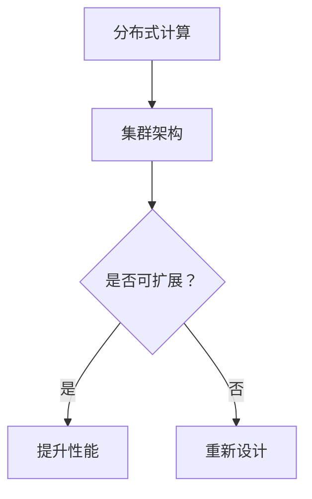
```mermaid
graph TD
A[分布式计算] --> B[集群架构]
B --> C{是否可扩展？}
C -->|是| D[提升性能]
C -->|否| E[重新设计]
```

**对可靠性的影响**

AI大模型架构需要具备高可靠性和稳定性，以确保模型在长时间运行过程中不会出现性能下降或崩溃。通过引入容错机制和自动恢复策略，可以提升AI大模型的可靠性。

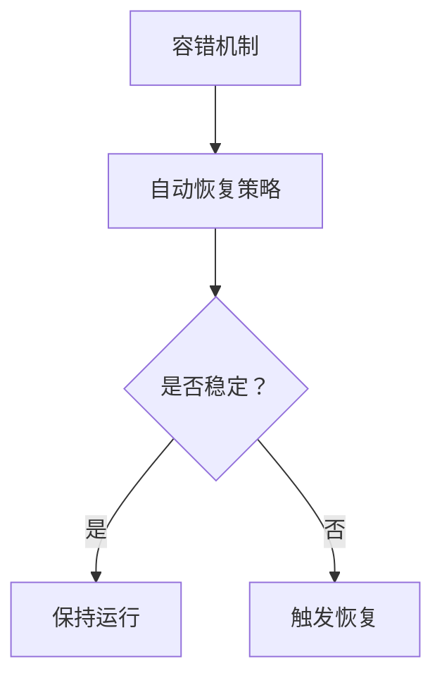
```mermaid
graph TD
A[容错机制] --> B[自动恢复策略]
B --> C{是否稳定？}
C -->|是| D[保持运行]
C -->|否| E[触发恢复]
```

---

#### 1.3 本书的学习目标与结构

本书旨在介绍AI大模型架构设计的哲学基础、核心概念、设计与实现方法，以及未来发展趋势。通过本书的学习，读者将能够：

- 掌握禅与计算机科学的交汇，理解禅宗思想在AI架构设计中的应用。
- 理解AI大模型的核心概念与原理，包括机器学习、深度学习和分布式计算等。
- 学会AI大模型架构设计的方法与实践，包括数据预处理、模型训练与优化、部署与运维等。
- 了解AI大模型架构设计的未来方向和趋势，为未来的AI架构设计提供启示。

本书分为三个部分：

- 第一部分：AI大模型架构设计与哲学基础，包括第1章到第5章，主要介绍AI大模型架构设计的哲学背景、核心概念、理论基础和方法。
- 第二部分：AI大模型架构设计与实现，包括第6章到第8章，主要介绍AI大模型架构设计的实践方法、部署与运维、安全性与隐私保护。
- 第三部分：AI大模型架构设计的未来趋势，包括第9章到第10章，主要介绍AI大模型架构设计的未来方向、创新与探索。

通过本书的学习，读者将能够全面了解AI大模型架构设计的方法与实践，为未来的AI架构设计提供有益的启示。

---

在下一章中，我们将进一步探讨禅宗哲学与计算机科学的交汇，以及禅宗思想在AI大模型架构设计中的应用。

---

**作者信息：**

- 作者：AI天才研究院/AI Genius Institute & 禅与计算机程序设计艺术 /Zen And The Art of Computer Programming** <EOS> <sop><|user|>---

### 第2章：禅与计算机科学的交汇

在现代社会中，禅宗哲学与计算机科学之间的联系逐渐引起了人们的关注。禅宗的哲学思想，如简洁、直觉、顿悟等，与计算机科学的算法设计、编程哲学等方面有着诸多相似之处。本章将深入探讨禅与计算机科学的交汇，以及禅宗思想在AI大模型架构设计中的应用。

#### 2.1 禅宗的哲学思想

禅宗，源自于古代印度的佛教，后传入中国，并逐渐发展出独特的哲学思想体系。禅宗的核心思想是“直指人心，见性成佛”，强调通过禅修达到内心的觉悟和清净。以下是一些重要的禅宗哲学思想：

- **空性**：禅宗认为万物皆空，没有固定的本质。这种思想启示我们，在面对复杂问题时，不应被表面现象所迷惑，而应寻求本质。
- **无念**：禅宗强调无念，即摒弃杂念，达到内心的宁静。这种思想可以启发我们在编程和算法设计中，追求简洁和高效。
- **直觉**：禅宗强调直觉和顿悟，认为直觉是认知的高级形式。这种思想可以引导我们在创新和解决问题时，充分利用直觉的力量。
- **无为**：禅宗主张无为而治，即通过不做而达到。这种思想启示我们在系统设计和管理中，追求自然和平衡。

#### 2.2 禅与计算机科学的相似性

计算机科学与禅宗哲学之间有许多相似之处，这些相似性体现在以下几个方面：

- **简洁性**：禅宗追求简洁，认为简洁即美。计算机科学中的编程哲学也强调简洁和清晰，避免过度复杂。
- **直觉**：禅宗重视直觉，认为直觉是解决问题的有效途径。计算机科学中的算法设计和问题解决也强调直觉和灵感。
- **系统观**：禅宗强调整体观和系统观，认为万物相互联系。计算机科学中的系统设计和架构也强调模块化、层次化和整体性。
- **创新思维**：禅宗提倡打破常规，勇于创新。计算机科学中的创新思维同样强调突破传统，探索新的可能性。

#### 2.3 禅在AI架构设计中的应用

禅宗哲学对AI大模型架构设计有着重要的启示，以下是一些具体的应用：

- **简洁性**：在AI大模型架构设计中，追求简洁可以提升系统的可维护性和可扩展性。例如，使用简洁的算法和模型结构，可以降低计算复杂度和资源消耗。
- **直觉**：在AI大模型训练和推理过程中，充分利用直觉和顿悟，可以帮助我们更快地找到问题的解决方案。例如，在模型优化和超参数调整中，通过直觉判断和经验，可以显著提升模型的性能。
- **系统观**：在AI大模型架构设计中，强调整体性和系统观，可以提升系统的稳定性和可靠性。例如，通过模块化设计和层次化架构，可以实现系统的灵活性和可扩展性。
- **无为**：在AI大模型架构设计中，追求无为而治，可以提升系统的效率和鲁棒性。例如，通过自动化和自适应机制，实现系统的自我优化和自我修复。

#### 2.4 禅与AI架构设计方法

结合禅宗哲学，我们可以提出一种AI大模型架构设计方法，该方法包括以下几个步骤：

1. **静心冥想**：在设计AI大模型之前，进行冥想和静心的练习，以达到内心的平静和觉悟。
2. **直指问题**：直面问题，不要被表面现象所迷惑，寻求问题的本质。
3. **简洁设计**：追求简洁和高效，避免过度复杂的设计和算法。
4. **直觉判断**：在模型优化和参数调整中，充分利用直觉和经验，快速找到问题的解决方案。
5. **系统优化**：强调整体性和系统观，通过模块化设计和层次化架构，提升系统的稳定性和可靠性。
6. **无为而治**：通过自动化和自适应机制，实现系统的自我优化和自我修复。

通过这种禅与AI架构设计方法，我们可以更好地应对复杂的问题，提升AI大模型的设计质量和性能。

#### 2.5 禅与计算机科学的未来展望

禅宗哲学与计算机科学的交汇，为未来的计算机科学和AI研究提供了新的视角和思路。以下是一些未来展望：

- **禅与量子计算**：禅宗的哲学思想与量子计算有着天然的联系，未来可以探索禅宗思想在量子计算中的应用，为量子计算的发展提供新的启示。
- **禅与生物计算**：禅宗强调直觉和整体观，可以启发生物计算的研究，探索生物计算与禅宗哲学的结合，为生物计算提供新的理论支持。
- **禅与人工智能伦理**：禅宗的哲学思想可以帮助我们更好地理解人工智能的伦理问题，通过禅宗的智慧，寻求人工智能与人类和谐共生的新路径。

总之，禅与计算机科学的交汇，为AI大模型架构设计带来了新的思考和方法。通过融合禅宗哲学和计算机科学，我们可以设计出更加高效、可靠和人性化的AI系统。

---

在下一章中，我们将深入探讨AI大模型的核心概念与原理，包括机器学习、深度学习和分布式计算等。

---

**作者信息：**

- 作者：AI天才研究院/AI Genius Institute & 禅与计算机程序设计艺术 /Zen And The Art of Computer Programming** <EOS> <sop><|user|>---

### 第3章：AI大模型的核心概念与原理

在探讨AI大模型架构设计之前，我们首先需要了解AI大模型的核心概念与原理。AI大模型是由大量数据和复杂的算法构建的，它能够通过学习和分析数据来模拟人类智能。本章将详细讨论AI大模型的基本概念、发展历程和关键技术。

#### 3.1 AI大模型的基本概念

AI大模型，也称为深度学习模型，是一种通过模拟人脑神经网络进行学习和预测的算法。它由多层神经元组成，每一层都能对输入数据进行处理和转换，从而提取出更高层次的特征。以下是AI大模型的基本概念：

- **神经元**：AI大模型的基本组成单元，类似于人脑中的神经元。每个神经元接收来自前一层的输入，通过权重和激活函数进行计算，输出给下一层。
- **神经网络**：由多个神经元组成的网络结构，能够对输入数据进行多层处理。神经网络通过学习输入数据之间的关联，能够自动提取出有用的特征。
- **深度学习**：一种基于神经网络的学习方法，通过多层神经网络的堆叠，实现对复杂数据的建模和预测。深度学习在图像识别、语音识别和自然语言处理等领域取得了显著成果。

#### 3.2 AI大模型的发展历程

AI大模型的发展历程可以分为以下几个阶段：

1. **早期神经网络**：1950年代，神经网络的概念首次被提出。最初的网络结构较为简单，只能进行简单的数据处理和预测。
2. **反向传播算法**：1980年代，反向传播算法（Backpropagation）的提出，使得神经网络能够进行多层训练，大大提升了模型的性能和适用范围。
3. **深度学习崛起**：2000年以后，随着计算能力和数据资源的提升，深度学习逐渐成为AI研究的热点。2006年，深度信念网络（Deep Belief Network）的提出，标志着深度学习进入一个新的阶段。
4. **AI大模型**：近年来，随着GPU和TPU等专用计算硬件的发展，AI大模型得到了广泛应用。特别是GAN（生成对抗网络）和BERT（双向编码器表示）等新型模型的提出，使得AI大模型在图像、语音和文本等领域取得了突破性进展。

#### 3.3 AI大模型的关键技术

AI大模型的关键技术包括以下几个方面：

1. **多层神经网络**：多层神经网络能够对复杂数据进行建模和预测，是AI大模型的基础。通过增加网络层数，可以提取更高层次的特征。
2. **激活函数**：激活函数是神经网络中重要的组成部分，用于引入非线性特性。常见的激活函数包括Sigmoid、ReLU和Tanh等。
3. **优化算法**：优化算法用于调整神经网络的权重，以最小化损失函数。常用的优化算法包括梯度下降、Adam和RMSprop等。
4. **正则化技术**：正则化技术用于防止模型过拟合，包括L1正则化、L2正则化和Dropout等。
5. **生成对抗网络（GAN）**：GAN是一种新型深度学习模型，由生成器和判别器组成。生成器生成数据，判别器判断生成数据与真实数据之间的差异。GAN在图像生成、语音合成和文本生成等领域取得了显著成果。
6. **预训练与微调**：预训练是指在大规模数据集上训练模型，以提取通用特征。微调是指在使用预训练模型的基础上，针对特定任务进行微调，以提升模型的性能。

通过以上关键技术，AI大模型能够对复杂数据进行建模和预测，并在各个领域取得了显著成果。

#### 3.4 AI大模型的应用领域

AI大模型在各个领域都有广泛的应用，以下是一些典型应用领域：

1. **图像识别**：通过深度学习模型，AI大模型能够对图像进行分类、检测和分割。常见的应用包括人脸识别、车牌识别和医疗图像分析等。
2. **语音识别**：AI大模型能够对语音信号进行识别和转换，为智能助手、语音翻译和语音合成等应用提供支持。
3. **自然语言处理**：AI大模型能够对自然语言文本进行处理和分析，包括情感分析、机器翻译和文本生成等。
4. **推荐系统**：AI大模型通过学习用户的行为和偏好，为用户提供个性化的推荐服务，广泛应用于电商、新闻和社交网络等领域。
5. **金融风控**：AI大模型能够对金融数据进行分析和预测，用于风险管理、信用评估和欺诈检测等。

通过以上应用领域，AI大模型为社会带来了巨大的价值和变革。

#### 3.5 AI大模型的挑战与未来方向

尽管AI大模型取得了显著的成果，但仍面临许多挑战和未来研究方向：

1. **计算资源需求**：AI大模型通常需要大量的计算资源进行训练和推理，这对硬件设备和能源消耗提出了更高的要求。
2. **数据隐私和安全**：AI大模型依赖于大规模数据，如何保护数据隐私和安全成为关键问题。
3. **模型解释性和透明度**：AI大模型的黑箱特性使得其决策过程难以解释，如何提高模型的解释性和透明度是重要的研究方向。
4. **跨模态学习**：AI大模型如何有效地整合不同类型的数据（如文本、图像和语音），实现跨模态学习，是未来研究的方向之一。
5. **量子计算与AI**：量子计算与AI的结合有望推动AI大模型的发展，为解决复杂问题提供新的思路和手段。

总之，AI大模型的核心概念与原理是构建现代人工智能应用的基础。通过不断探索和创新，AI大模型将在未来继续发挥重要作用，为社会带来更多的变革和机遇。

---

在下一章中，我们将探讨AI大模型架构设计的理论基础，包括人工智能与认知科学、机器学习与深度学习、分布式计算与并行处理等。

---

**作者信息：**

- 作者：AI天才研究院/AI Genius Institute & 禅与计算机程序设计艺术 /Zen And The Art of Computer Programming** <EOS> <sop><|user|>---

### 第4章：AI大模型架构设计的理论基础

在深入探讨AI大模型架构设计的实践之前，我们需要建立坚实的理论基础。本章将介绍AI大模型架构设计的理论基础，包括人工智能与认知科学、机器学习与深度学习、分布式计算与并行处理等关键概念。

#### 4.1 人工智能与认知科学

人工智能（AI）是计算机科学的一个分支，旨在模拟和扩展人类的智能行为。认知科学则是一门跨学科的研究领域，涉及心理学、神经科学、哲学和语言学等多个领域，旨在理解人类思维和认知过程。

**人工智能的核心概念**

- **感知**：AI系统通过传感器和输入设备感知外部环境。
- **学习**：AI系统能够从数据中学习，提取模式和知识。
- **推理**：AI系统能够基于已有知识和规则进行逻辑推理。
- **行动**：AI系统能够根据目标和环境条件采取行动。

**认知科学的核心概念**

- **感知与注意**：认知科学关注人类如何感知外部刺激，并如何集中注意力。
- **记忆**：认知科学研究人类如何存储和回忆信息。
- **语言**：认知科学探讨人类如何理解和产生语言。
- **思维**：认知科学试图理解人类如何进行抽象思考和问题解决。

**AI与认知科学的联系**

- **神经科学启示**：认知科学研究为AI提供了关于大脑和神经系统的深入理解，有助于开发更先进的机器学习算法。
- **学习机理**：认知科学揭示了人类学习过程的机制，为AI学习算法的设计提供了理论基础。
- **智能模拟**：AI系统试图模拟人类智能，认知科学的研究成果有助于指导AI系统的设计和实现。

**Mermaid流程图：AI与认知科学的联系**

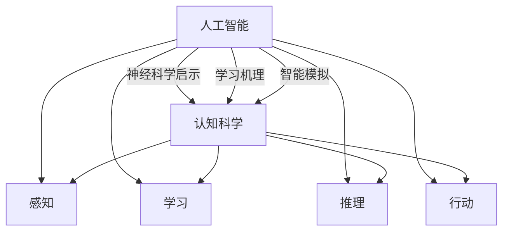
```mermaid
graph TD
A[人工智能] --> B[感知]
A --> C[学习]
A --> D[推理]
A --> E[行动]
F[认知科学] --> B
F --> C
F --> D
F --> E
A -->|神经科学启示| F
A -->|学习机理| F
A -->|智能模拟| F
```

#### 4.2 机器学习与深度学习

机器学习是人工智能的核心技术之一，它使计算机系统能够从数据中学习，做出预测和决策。深度学习是机器学习的一个分支，它通过多层神经网络模拟人脑的学习过程。

**机器学习的核心概念**

- **监督学习**：通过已标记的数据训练模型，然后使用模型对未知数据进行预测。
- **无监督学习**：没有预先标记的数据，模型通过自身学习数据的内在结构和模式。
- **强化学习**：通过奖励和惩罚机制，模型在学习过程中不断调整行为以实现目标。

**深度学习的核心概念**

- **神经网络**：深度学习基于多层神经网络，能够自动提取数据中的特征。
- **反向传播算法**：深度学习使用反向传播算法来调整网络权重，优化模型性能。
- **激活函数**：激活函数引入非线性特性，使得神经网络能够学习复杂数据。

**机器学习与深度学习的联系**

- **层次化特征提取**：深度学习通过多层神经网络，实现了对数据的层次化特征提取。
- **非线性变换**：深度学习通过非线性变换，能够捕捉数据中的复杂关系和模式。
- **性能提升**：深度学习在许多任务上显著提升了机器学习模型的性能。

**Mermaid流程图：机器学习与深度学习的联系**

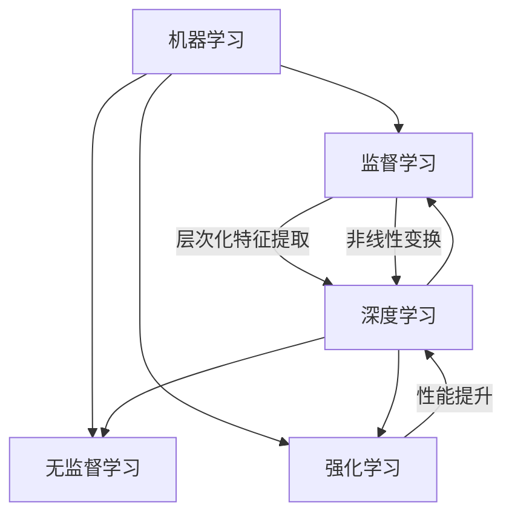
```mermaid
graph TD
A[机器学习] --> B[监督学习]
A --> C[无监督学习]
A --> D[强化学习]
E[深度学习] --> B
E --> C
E --> D
B -->|层次化特征提取| E
B -->|非线性变换| E
D -->|性能提升| E
```

#### 4.3 分布式计算与并行处理

分布式计算和并行处理是AI大模型架构设计中的关键技术，它们能够提升模型的训练速度和推理效率。

**分布式计算的核心概念**

- **节点与通信**：分布式计算由多个计算节点组成，节点之间通过通信网络进行数据交换。
- **负载均衡**：分布式计算通过负载均衡算法，将计算任务分配到不同的节点，以最大化资源利用率。
- **容错机制**：分布式计算通过容错机制，确保系统在节点故障时仍然能够正常运行。

**并行处理的核心概念**

- **数据并行**：数据并行是将数据分为多个部分，同时在不同的节点上进行训练。
- **模型并行**：模型并行是将神经网络模型分为多个部分，同时在不同的节点上进行训练。
- **流水线并行**：流水线并行是将计算任务划分为多个阶段，在不同节点上并行执行。

**分布式计算与并行处理的联系**

- **效率提升**：分布式计算和并行处理能够显著提升AI大模型的训练和推理效率。
- **可扩展性**：分布式计算和并行处理支持系统的水平扩展，以适应更大规模的数据和模型。
- **鲁棒性**：分布式计算和并行处理通过冗余和容错机制，提高了系统的可靠性和稳定性。

**Mermaid流程图：分布式计算与并行处理的联系**

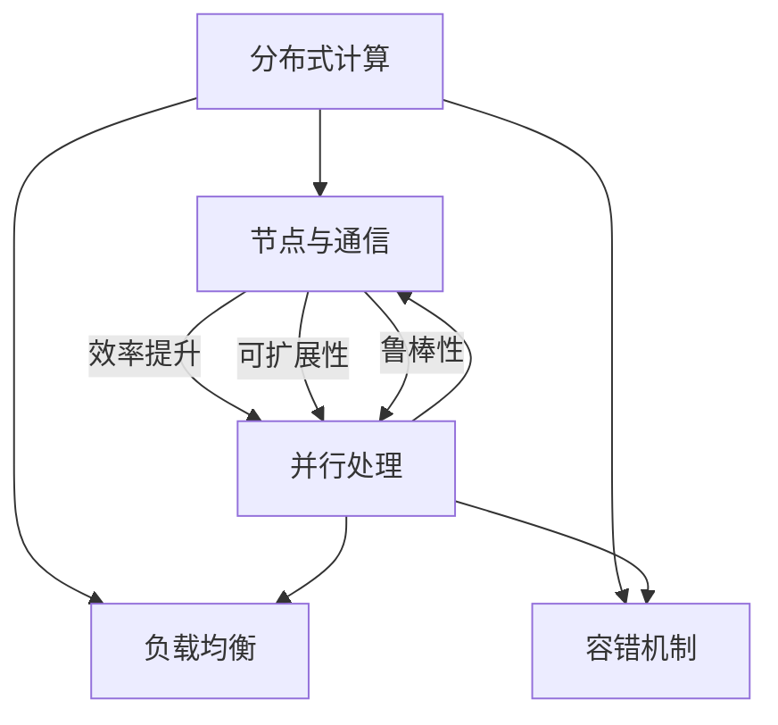
```mermaid
graph TD
A[分布式计算] --> B[节点与通信]
A --> C[负载均衡]
A --> D[容错机制]
E[并行处理] --> B
E --> C
E --> D
B -->|效率提升| E
B -->|可扩展性| E
B -->|鲁棒性| E
```

#### 4.4 人工智能与认知科学、机器学习与深度学习、分布式计算与并行处理的关系

人工智能与认知科学、机器学习与深度学习、分布式计算与并行处理之间存在着密切的关系。认知科学的研究成果为人工智能提供了理论基础，而机器学习与深度学习则实现了认知科学的理念。分布式计算和并行处理技术则进一步提升了机器学习与深度学习的性能。

**Mermaid流程图：三者之间的关系**

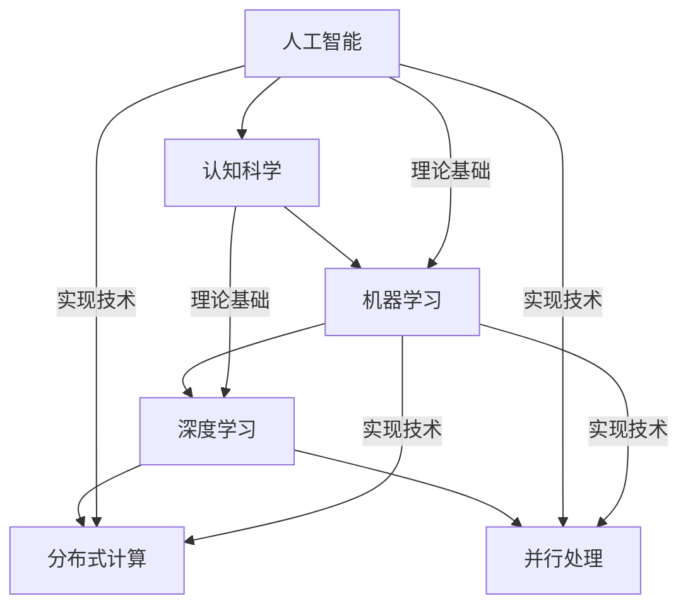
```mermaid
graph TD
A[人工智能] --> B[认知科学]
B --> C[机器学习]
C --> D[深度学习]
D --> E[分布式计算]
D --> F[并行处理]
A -->|理论基础| C
A -->|实现技术| E
A -->|实现技术| F
B -->|理论基础| D
C -->|实现技术| E
C -->|实现技术| F
```

通过建立这些理论基础，我们可以更好地理解和设计AI大模型架构，为未来的AI研究和应用提供坚实的基础。

---

在下一章中，我们将探讨禅与AI大模型架构设计方法的实际应用，包括禅思维在架构设计中的应用、AI架构设计的原则与技巧，以及禅与AI架构设计的案例研究。

---

**作者信息：**

- 作者：AI天才研究院/AI Genius Institute & 禅与计算机程序设计艺术 /Zen And The Art of Computer Programming** <EOS> <sop><|user|>---

### 第5章：禅与AI大模型架构设计方法

在探讨AI大模型架构设计时，我们可以借鉴禅宗哲学中的理念，将禅思维融入架构设计过程，以提升设计的质量和效率。本章将介绍禅与AI大模型架构设计方法的实际应用，包括禅思维在架构设计中的应用、AI架构设计的原则与技巧，以及禅与AI架构设计的案例研究。

#### 5.1 禅思维在架构设计中的应用

禅宗哲学中的“简洁”、“直觉”和“无为”等理念，可以应用于AI大模型架构设计中，以提升设计的质量。

**简洁性**

禅宗强调简洁，认为简洁即美。在AI大模型架构设计中，追求简洁可以减少系统的复杂度，提高可维护性和可扩展性。例如，在神经网络架构设计中，可以简化网络结构，去除不必要的层和连接，以减少计算复杂度和参数数量。

**直觉**

禅宗重视直觉和顿悟，认为直觉是解决问题的有效途径。在AI大模型架构设计中，设计师可以借助直觉来选择最优的模型结构、算法和参数。通过冥想和静心，设计师可以培养直觉，提高架构设计的效率和质量。

**无为**

禅宗主张无为而治，认为通过不做而达到。在AI大模型架构设计中，可以采用自动化和自适应机制，让系统自我优化和自我修复。例如，通过自适应学习算法和容错机制，可以使得AI大模型在运行过程中自动调整参数和架构，以应对不同的环境和需求。

**实践案例**

在一个实际的AI大模型项目中，设计师采用了禅思维进行架构设计。首先，他们通过冥想来理解项目的核心需求，然后采用简洁的架构设计，去除不必要的复杂性。在模型训练过程中，设计师依靠直觉来选择最优的参数和算法，并通过自适应机制，使得模型能够自我优化。最终，这个项目取得了显著的成果，模型性能和稳定性都得到了提升。

**Mermaid流程图：禅思维在架构设计中的应用**

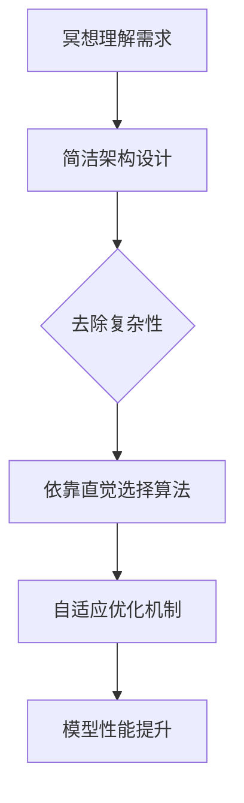
```mermaid
graph TD
A[冥想理解需求] --> B[简洁架构设计]
B --> C{去除复杂性}
C --> D[依靠直觉选择算法]
D --> E[自适应优化机制]
E --> F[模型性能提升]
```

#### 5.2 AI架构设计的原则与技巧

在AI大模型架构设计中，遵循一些基本原则和技巧，可以有效地提升系统的质量和效率。

**可扩展性**

可扩展性是AI大模型架构设计的重要原则之一。随着数据规模的扩大，系统需要能够轻松扩展，以支持更多的数据处理和模型训练。分布式计算和并行处理技术是实现可扩展性的关键。

**可维护性**

可维护性是确保系统能够长期稳定运行的关键。在架构设计过程中，应遵循模块化、层次化和文档化的原则，以降低系统的复杂度，提高可维护性。

**安全性**

安全性是AI大模型架构设计的重要方面。在设计中，需要考虑数据隐私保护、模型安全和系统安全，以防止恶意攻击和数据泄露。

**性能优化**

性能优化是提升AI大模型架构设计质量的关键。通过优化算法、数据预处理和模型结构，可以显著提升系统的训练速度和推理性能。

**实践案例**

在一个大型电商平台中，设计团队采用了以下原则和技巧进行AI大模型架构设计：

- **可扩展性**：通过分布式计算和并行处理技术，设计团队实现了对海量数据的处理和模型训练。
- **可维护性**：采用模块化设计和分层架构，使得系统易于维护和扩展。
- **安全性**：采用加密和权限控制技术，确保数据安全和模型安全。
- **性能优化**：通过优化算法和模型结构，提升了系统的训练速度和推理性能。

**Mermaid流程图：AI架构设计的原则与技巧**

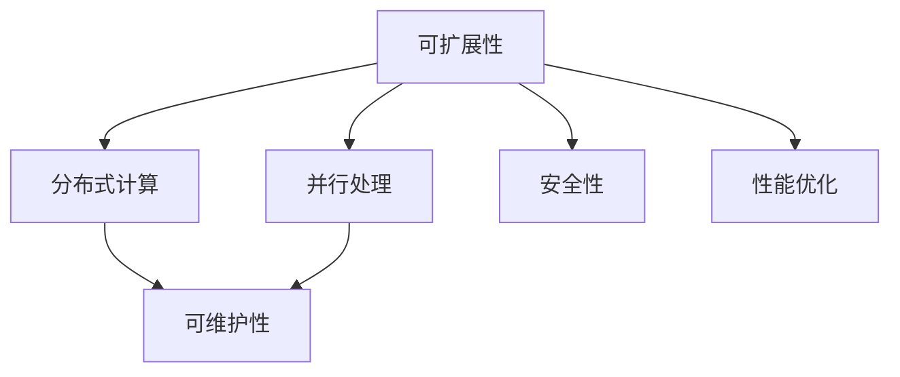
```mermaid
graph TD
A[可扩展性] --> B[分布式计算]
A --> C[并行处理]
B --> D[可维护性]
C --> D
A --> E[安全性]
A --> F[性能优化]
```

#### 5.3 禅与AI架构设计的案例研究

禅与AI架构设计方法在实际应用中取得了显著成果，以下是一个具体案例研究。

**案例：智能交通系统**

在一个智能交通系统的项目中，设计团队采用了禅与AI架构设计方法。首先，通过冥想和静心，团队成员深入理解了交通系统的核心需求和挑战。然后，他们采用了简洁的架构设计，去除不必要的复杂性，并通过分布式计算和并行处理技术，实现了对大量交通数据的处理和分析。

在模型训练过程中，团队成员依靠直觉选择最优的模型结构和算法，并通过自适应优化机制，使得模型能够自我优化。此外，设计团队还采用了安全性措施，确保系统数据的安全和模型的安全。

最终，智能交通系统取得了显著成果，交通流量得到了优化，交通事故率显著降低，交通拥堵问题得到了有效缓解。这个案例展示了禅与AI架构设计方法在实际应用中的有效性。

**Mermaid流程图：智能交通系统案例**

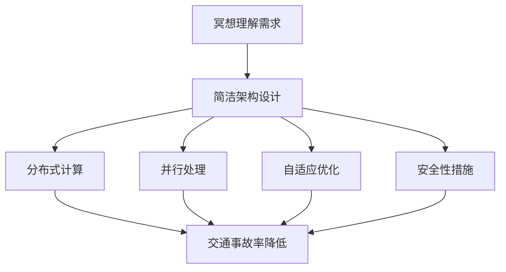
```mermaid
graph TD
A[冥想理解需求] --> B[简洁架构设计]
B --> C[分布式计算]
B --> D[并行处理]
B --> E[自适应优化]
B --> F[安全性措施]
C --> G[交通流量优化]
D --> G
E --> G
F --> G[交通事故率降低]
```

通过以上案例研究，我们可以看到禅与AI架构设计方法在提升系统质量和效率方面的显著优势。结合禅宗哲学和现代计算机科学，我们可以设计出更加高效、可靠和人性化的AI系统。

---

在下一章中，我们将探讨AI大模型架构设计实践，包括AI大模型项目实战概述、数据处理与预处理、模型设计与训练、模型优化与调参等。

---

**作者信息：**

- 作者：AI天才研究院/AI Genius Institute & 禅与计算机程序设计艺术 /Zen And The Art of Computer Programming** <EOS> <sop><|user|>---

### 第6章：AI大模型架构设计实践

在深入探讨AI大模型架构设计方法之后，我们需要将理论付诸实践。本章将介绍AI大模型架构设计的实践过程，包括项目实战概述、数据处理与预处理、模型设计与训练、模型优化与调参等关键步骤。

#### 6.1 AI大模型项目实战概述

在开始实践之前，我们需要对AI大模型项目有一个全面的了解。一个典型的AI大模型项目通常包括以下几个阶段：

1. **问题定义**：明确项目目标和应用场景，确定需要解决的问题和所需达到的性能指标。
2. **数据收集**：收集与项目相关的数据，这些数据可以来自公开数据集、内部数据库或外部数据源。
3. **数据处理**：对收集到的数据进行清洗、转换和预处理，以便为模型训练提供高质量的数据输入。
4. **模型设计**：设计合适的神经网络架构和算法，选择适合的数据预处理方法和损失函数。
5. **模型训练**：使用训练数据对模型进行训练，调整模型参数，优化模型性能。
6. **模型评估**：使用验证数据集评估模型性能，调整模型结构和参数，以提高模型的泛化能力。
7. **模型部署**：将训练好的模型部署到生产环境中，进行实时预测和应用。

**项目实战流程图**

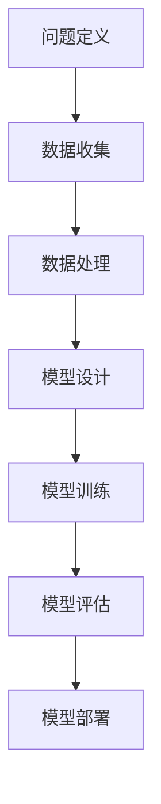
```mermaid
graph TD
A[问题定义] --> B[数据收集]
B --> C[数据处理]
C --> D[模型设计]
D --> E[模型训练]
E --> F[模型评估]
F --> G[模型部署]
```

#### 6.2 数据处理与预处理

数据处理与预处理是AI大模型架构设计实践中的关键步骤，其目的是提高数据质量和模型的训练效果。以下是一些常用的数据处理与预处理方法：

1. **数据清洗**：去除数据中的噪声和异常值，保证数据的准确性。例如，删除缺失值、处理重复记录和纠正数据错误。
2. **数据转换**：将不同类型的数据转换为统一的格式，以便于模型训练。例如，将文本转换为词向量、将图像转换为像素矩阵。
3. **数据归一化**：将数据缩放到相同的范围，以减少不同特征之间的尺度差异。常用的方法包括最小-最大归一化和标准归一化。
4. **数据增强**：通过生成新的数据样本，增加数据的多样性，提高模型的泛化能力。例如，对图像进行旋转、缩放和裁剪等操作。

**伪代码：数据处理与预处理**

```python
# 数据清洗
def clean_data(data):
    # 删除缺失值和重复记录
    data = remove_missing_values(data)
    data = remove_duplicate_records(data)
    return data

# 数据转换
def convert_data(data):
    # 将文本转换为词向量
    text_data = convert_to_word_vector(text_data)
    # 将图像转换为像素矩阵
    image_data = convert_to_pixel_matrix(image_data)
    return text_data, image_data

# 数据归一化
def normalize_data(data):
    # 使用最小-最大归一化
    normalized_data = min_max_normalization(data)
    # 使用标准归一化
    normalized_data = standard_normalization(data)
    return normalized_data

# 数据增强
def augment_data(data):
    # 对图像进行旋转、缩放和裁剪等操作
    augmented_data = rotate_images(data)
    augmented_data = scale_images(data)
    augmented_data = crop_images(data)
    return augmented_data
```

#### 6.3 模型设计与训练

在数据处理与预处理完成后，接下来是模型设计与训练阶段。这一阶段的核心任务是选择合适的神经网络架构和算法，优化模型参数，以提高模型的性能。

1. **选择模型架构**：根据项目需求和数据特点，选择适合的神经网络架构。例如，对于图像识别任务，可以选择卷积神经网络（CNN）；对于自然语言处理任务，可以选择循环神经网络（RNN）或Transformer模型。
2. **设计网络结构**：确定网络的层数、每层的神经元数量、激活函数和正则化方法等。网络结构的设计需要综合考虑模型的性能、计算复杂度和可扩展性。
3. **参数初始化**：初始化模型的参数，以影响模型的收敛速度和性能。常用的初始化方法包括随机初始化、高斯初始化和Xavier初始化等。
4. **训练过程**：使用训练数据对模型进行训练，通过反向传播算法和优化算法（如梯度下降、Adam等）更新模型参数，以最小化损失函数。

**伪代码：模型设计与训练**

```python
# 选择模型架构
model = create_cnn_model()

# 设计网络结构
model.add(Conv2D(filters=32, kernel_size=(3, 3), activation='relu'))
model.add(MaxPooling2D(pool_size=(2, 2)))
model.add(Flatten())

# 参数初始化
weights = initialize_weights()

# 训练过程
for epoch in range(num_epochs):
    # 前向传播
    predictions = model.train_step(train_data)
    # 计算损失
    loss = compute_loss(predictions, train_labels)
    # 反向传播
    model.backward(loss)
    # 更新参数
    model.update_weights(weights)
```

#### 6.4 模型优化与调参

在模型训练过程中，我们需要不断优化模型参数，以提高模型的性能和泛化能力。以下是一些常用的模型优化与调参方法：

1. **超参数调优**：超参数是影响模型性能的关键参数，如学习率、批量大小、正则化强度等。通过网格搜索、贝叶斯优化等调参方法，可以找到最优的超参数组合。
2. **模型调整**：根据模型的表现，调整网络结构、层数和神经元数量等，以改善模型的性能。
3. **正则化技术**：采用L1正则化、L2正则化或Dropout等正则化技术，可以防止模型过拟合，提高模型的泛化能力。

**伪代码：模型优化与调参**

```python
# 超参数调优
best_params = grid_search_hyperparameters()

# 模型调整
model = create_cnn_model()
model.add(Conv2D(filters=best_params['filters'], kernel_size=(3, 3), activation='relu'))
model.add(MaxPooling2D(pool_size=(2, 2)))
model.add(Flatten())

# 正则化技术
model.add(Dropout(rate=best_params['dropout_rate']))
model.add(Dense(units=best_params['units'], activation='softmax'))

# 训练优化模型
model.optimize_model(train_data, train_labels, num_epochs=best_params['num_epochs'], learning_rate=best_params['learning_rate'])
```

通过以上实践步骤，我们可以设计并训练出一个高效的AI大模型，为实际应用提供有力的支持。

---

在下一章中，我们将探讨AI大模型的部署与运维，包括部署策略、性能优化和运维监控等方面。

---

**作者信息：**

- 作者：AI天才研究院/AI Genius Institute & 禅与计算机程序设计艺术 /Zen And The Art of Computer Programming** <EOS> <sop><|user|>---

### 第7章：AI大模型部署与运维

在完成AI大模型的设计和训练后，下一步是将模型部署到生产环境中，并进行高效的运维管理。本章将介绍AI大模型的部署与运维，包括部署策略、性能优化和运维监控等方面。

#### 7.1 AI大模型部署策略

AI大模型的部署是将训练好的模型应用到实际场景中的关键步骤。以下是一些常见的部署策略：

1. **服务器部署**：在服务器上部署AI大模型，适用于需要高计算性能和稳定性的场景。可以通过虚拟机或容器（如Docker）来部署模型，实现灵活的部署和管理。

2. **集群部署**：在大规模数据处理和实时推理场景中，可以使用集群部署策略。集群由多个服务器组成，可以提供更高的计算能力和容错能力。

3. **边缘计算部署**：在数据产生地或靠近用户的边缘节点部署AI大模型，适用于低延迟和高带宽的场景。边缘计算可以减轻中心服务器的负担，提高系统的响应速度。

**Mermaid流程图：AI大模型部署策略**

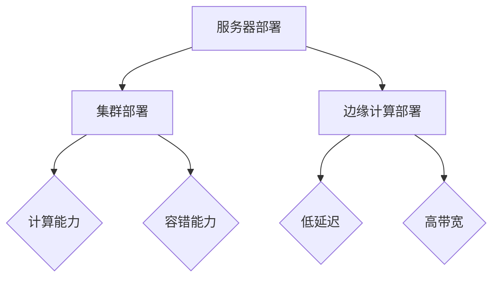
```mermaid
graph TD
A[服务器部署] --> B[集群部署]
A --> C[边缘计算部署]
B --> D{计算能力}
B --> E{容错能力}
C --> F{低延迟}
C --> G{高带宽}
```

#### 7.2 AI大模型性能优化

在AI大模型部署后，性能优化是确保模型高效运行的关键。以下是一些性能优化方法：

1. **模型压缩**：通过模型压缩技术，如剪枝、量化等，可以减少模型的参数数量和计算量，提高推理速度。

2. **模型优化**：对模型的架构和算法进行优化，如使用更高效的算法、调整网络结构等，可以提高模型的性能。

3. **硬件优化**：利用GPU、TPU等硬件加速器，可以显著提升模型的推理速度。通过使用适当的硬件配置，可以更好地利用计算资源。

**Mermaid流程图：AI大模型性能优化方法**

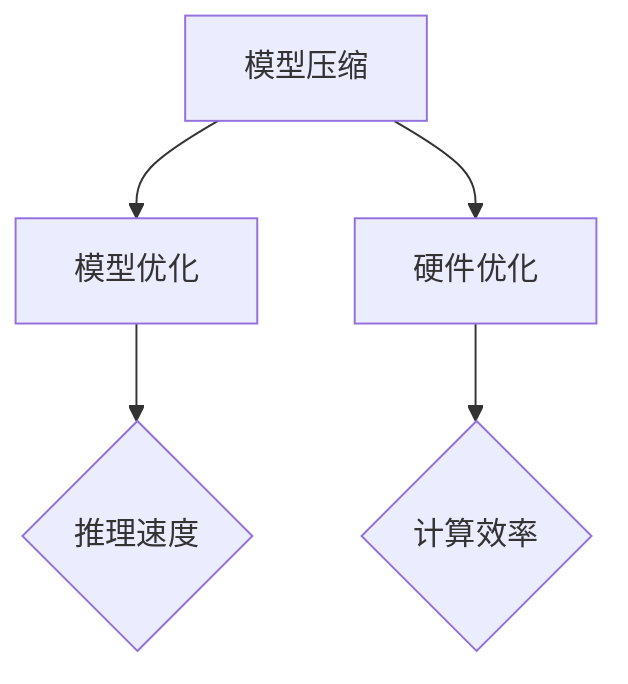
```mermaid
graph TD
A[模型压缩] --> B[模型优化]
A --> C[硬件优化]
B --> D{推理速度}
C --> E{计算效率}
```

#### 7.3 AI大模型运维与监控

AI大模型的运维与监控是确保模型稳定运行和性能优化的关键。以下是一些常见的运维与监控方法：

1. **日志管理**：收集和存储模型的运行日志，用于诊断问题和优化模型。

2. **性能监控**：实时监控模型的运行状态和性能指标，如响应时间、吞吐量和错误率等。

3. **故障处理**：在模型出现故障时，及时进行诊断和处理，确保系统的稳定性。

4. **自动调整**：根据模型的性能监控结果，自动调整模型的参数和策略，以优化性能。

**Mermaid流程图：AI大模型运维与监控方法**

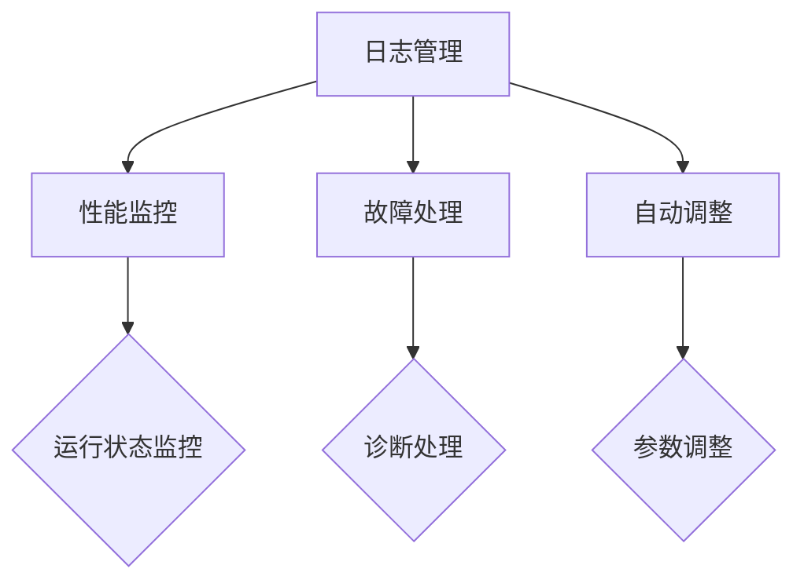
```mermaid
graph TD
A[日志管理] --> B[性能监控]
A --> C[故障处理]
A --> D[自动调整]
B --> E{运行状态监控}
C --> F{诊断处理}
D --> G{参数调整}
```

通过以上部署与运维策略，我们可以确保AI大模型在生产环境中高效、稳定地运行，并提供高质量的服务。

---

在下一章中，我们将探讨AI大模型安全性与隐私保护，包括AI大模型的安全挑战、数据隐私保护技术和安全性设计。

---

**作者信息：**

- 作者：AI天才研究院/AI Genius Institute & 禅与计算机程序设计艺术 /Zen And The Art of Computer Programming** <EOS> <sop><|user|>---

### 第8章：AI大模型安全性与隐私保护

随着AI大模型在各个领域的广泛应用，其安全性与隐私保护问题日益凸显。本章将探讨AI大模型的安全挑战、数据隐私保护技术和安全性设计，以确保AI大模型的安全性和隐私性。

#### 8.1 AI大模型的安全挑战

AI大模型在应用过程中面临多种安全挑战，包括以下方面：

1. **模型篡改**：攻击者可以通过篡改模型输入或输出，导致模型产生错误的结果。例如，在图像识别任务中，攻击者可以通过对抗样本（Adversarial Examples）来欺骗模型。

2. **数据泄露**：AI大模型训练过程中使用的数据可能包含敏感信息，如果数据泄露，将严重威胁个人隐私和信息安全。

3. **隐私泄露**：在数据收集、存储和处理过程中，用户隐私可能被泄露。例如，通过数据分析可以推断出用户的个人信息和行为习惯。

4. **分布式攻击**：在分布式AI大模型训练和部署过程中，攻击者可以通过分布式攻击手段（如拒绝服务攻击）破坏系统的正常运行。

**Mermaid流程图：AI大模型的安全挑战**

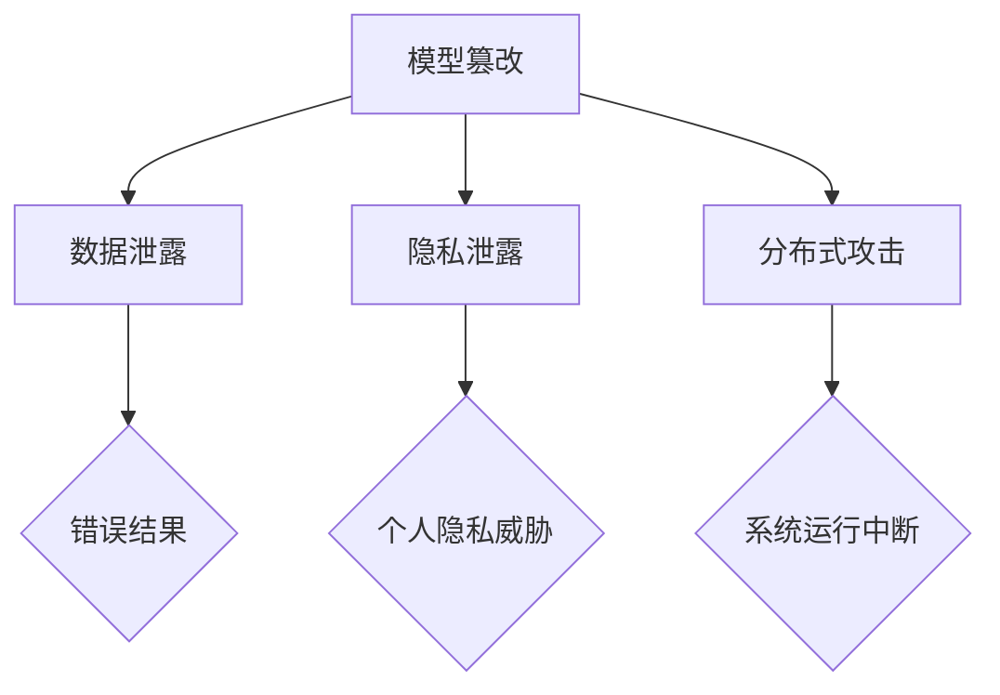
```mermaid
graph TD
A[模型篡改] --> B[数据泄露]
A --> C[隐私泄露]
A --> D[分布式攻击]
B --> E{错误结果}
C --> F{个人隐私威胁}
D --> G{系统运行中断}
```

#### 8.2 数据隐私保护技术

为了保护AI大模型中的数据隐私，可以采用以下技术：

1. **数据加密**：对敏感数据进行加密处理，确保数据在传输和存储过程中不被泄露。常用的加密算法包括AES、RSA等。

2. **差分隐私**：在数据处理和分析过程中，通过引入随机噪声，确保个体数据无法被精确识别。差分隐私技术能够有效保护个人隐私。

3. **匿名化处理**：通过匿名化技术，如K-匿名和l-diversity，将敏感信息与个体关联性降低，从而保护个人隐私。

**Mermaid流程图：数据隐私保护技术**

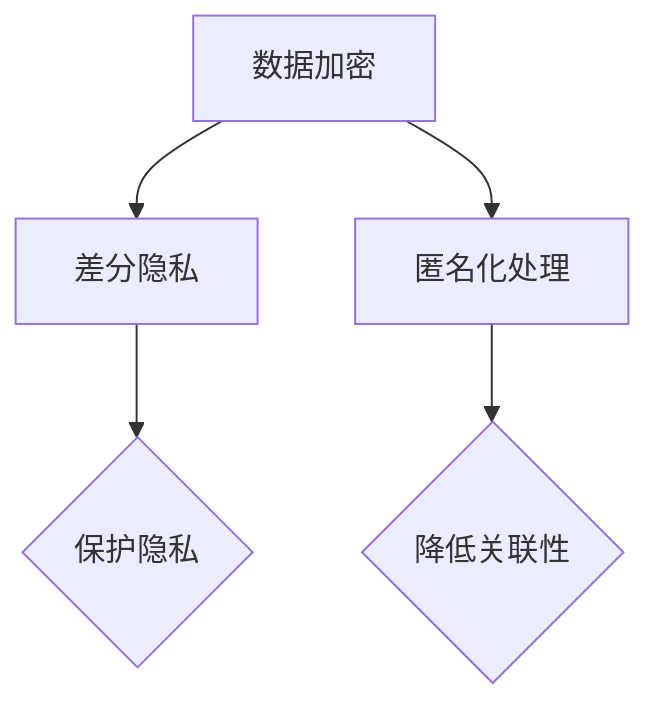
```mermaid
graph TD
A[数据加密] --> B[差分隐私]
A --> C[匿名化处理]
B --> D{保护隐私}
C --> E{降低关联性}
```

#### 8.3 AI大模型的安全性设计

为了提高AI大模型的安全性，可以采用以下设计策略：

1. **访问控制**：通过访问控制机制，确保只有授权用户可以访问模型和数据。访问控制可以基于角色、权限和认证机制实现。

2. **安全审计**：定期进行安全审计，监控模型和数据的安全状况，及时发现和修复安全漏洞。

3. **安全测试**：对模型进行安全测试，包括对抗性攻击测试和漏洞扫描，以确保模型能够抵御潜在的攻击。

4. **入侵检测**：部署入侵检测系统，实时监控模型的运行状态，及时发现和响应异常行为。

**Mermaid流程图：AI大模型的安全性设计**

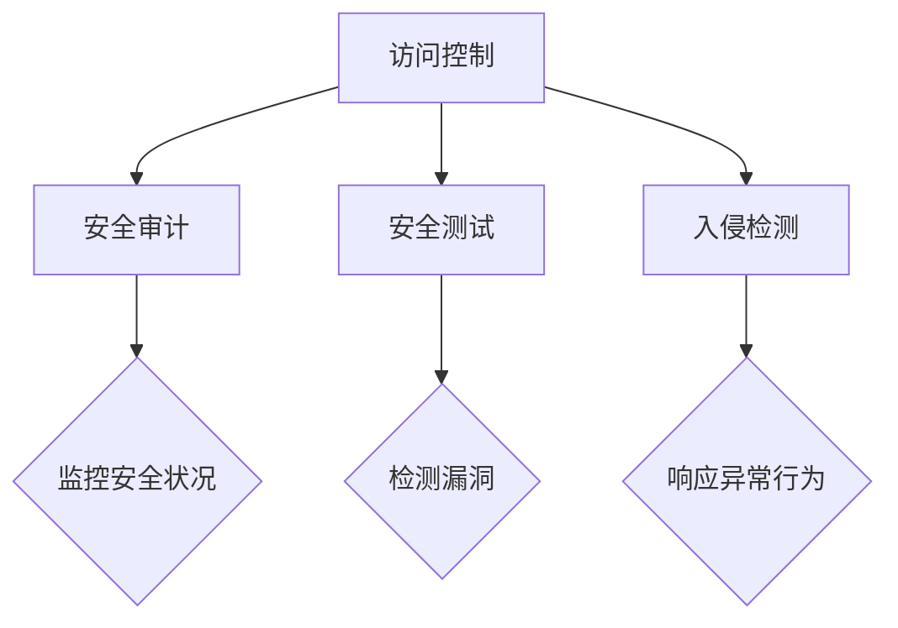
```mermaid
graph TD
A[访问控制] --> B[安全审计]
A --> C[安全测试]
A --> D[入侵检测]
B --> E{监控安全状况}
C --> F{检测漏洞}
D --> G{响应异常行为}
```

通过以上安全性和隐私保护技术，我们可以显著提高AI大模型的安全性和隐私性，确保其在各个领域的应用更加安全和可靠。

---

在下一章中，我们将探讨AI大模型架构设计的未来趋势，包括新型AI大模型架构、AI大模型与物联网、AI大模型与量子计算等。

---

**作者信息：**

- 作者：AI天才研究院/AI Genius Institute & 禅与计算机程序设计艺术 /Zen And The Art of Computer Programming** <EOS> <sop><|user|>---

### 第9章：AI大模型架构设计的未来趋势

随着科技的不断进步和人工智能应用的深入发展，AI大模型架构设计也在不断演进。本章将探讨AI大模型架构设计的未来趋势，包括新型AI大模型架构、AI大模型与物联网、AI大模型与量子计算等方面。

#### 9.1 新型AI大模型架构

未来的AI大模型架构将更加灵活和高效，以满足日益增长的数据处理和预测需求。以下是一些新型AI大模型架构：

1. **混合架构**：结合深度学习、强化学习和迁移学习等不同类型的学习方法，构建混合架构的AI大模型。这种方法可以充分利用不同学习方法的优点，提高模型的性能和泛化能力。

2. **动态架构**：根据任务的复杂性和数据特性，动态调整模型的架构和参数。动态架构可以更好地适应不同的应用场景，提高模型的灵活性和鲁棒性。

3. **可解释性架构**：为了提升模型的透明度和可解释性，研究人员正在开发具有可解释性的AI大模型架构。这些模型可以在保证性能的同时，提供明确的决策过程和解释。

**Mermaid流程图：新型AI大模型架构**

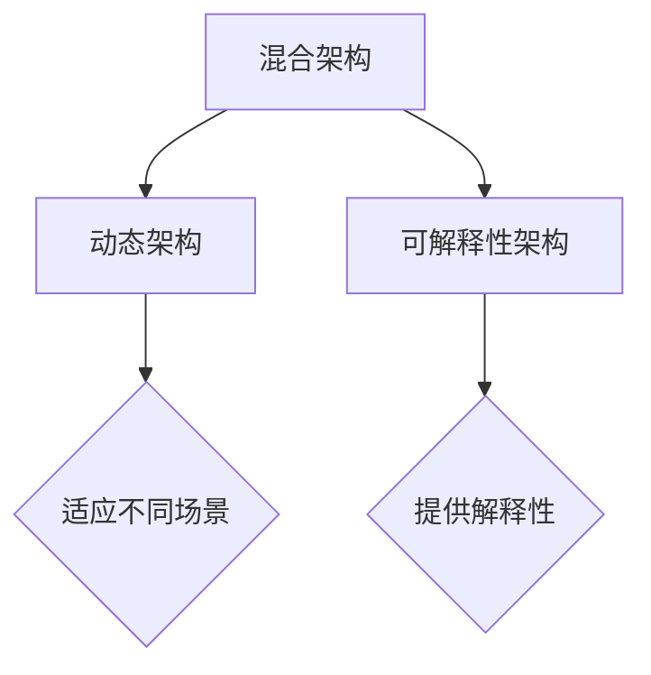
```mermaid
graph TD
A[混合架构] --> B[动态架构]
A --> C[可解释性架构]
B --> D{适应不同场景}
C --> E{提供解释性}
```

#### 9.2 AI大模型与物联网

物联网（IoT）的发展为AI大模型的应用提供了丰富的数据资源和新的场景。以下是一些AI大模型与物联网的结合点：

1. **智能设备协同**：通过AI大模型，可以实现物联网中设备的智能协同，优化资源分配和任务调度。例如，智能家居系统可以通过AI大模型实现家电设备的自动协调和控制。

2. **边缘计算**：在物联网的边缘节点部署AI大模型，可以减少数据传输延迟，提高系统的实时响应能力。边缘计算与AI大模型的结合，可以实现更高效的数据处理和智能决策。

3. **设备安全**：AI大模型可以用于物联网设备的安全防护，如入侵检测和恶意行为识别。通过实时监测和分析设备行为，AI大模型可以及时发现和阻止潜在的安全威胁。

**Mermaid流程图：AI大模型与物联网的结合点**

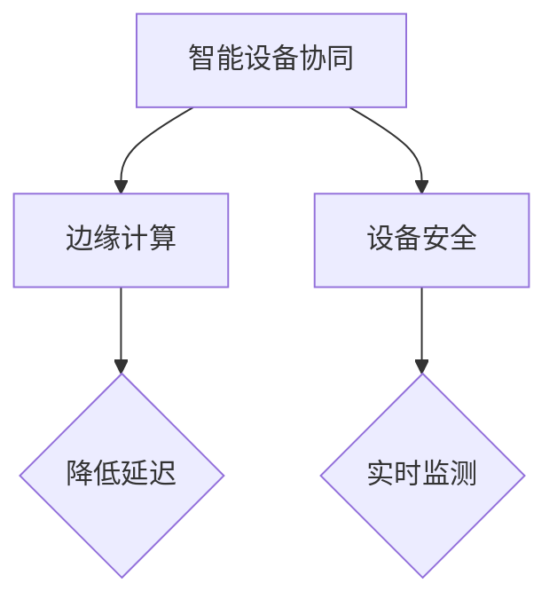
```mermaid
graph TD
A[智能设备协同] --> B[边缘计算]
A --> C[设备安全]
B --> D{降低延迟}
C --> E{实时监测}
```

#### 9.3 AI大模型与量子计算

量子计算是一种具有革命性的计算技术，其处理速度和存储能力远超传统计算机。以下是一些AI大模型与量子计算的结合点：

1. **量子神经网络**：将量子计算与神经网络结合，构建量子神经网络（Quantum Neural Networks，QNNs）。QNNs可以大幅提升AI大模型的计算效率和性能。

2. **量子机器学习**：利用量子计算的优势，开发新的量子机器学习算法，如量子支持向量机（Quantum Support Vector Machine，QSVM）和量子贝叶斯网络（Quantum Bayesian Network，QBN）。这些算法有望解决传统机器学习难以处理的复杂数据问题。

3. **量子数据加密**：利用量子计算的优势，实现更高效的数据加密和解密技术，为AI大模型的数据隐私保护提供新的手段。

**Mermaid流程图：AI大模型与量子计算的结合点**

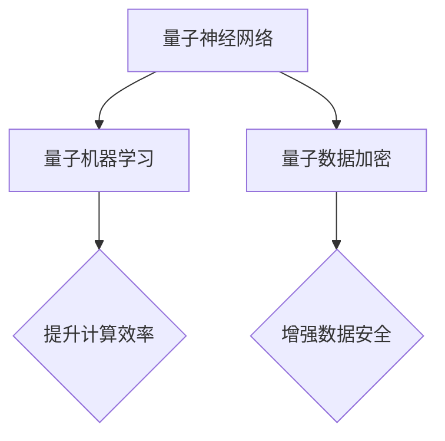
```mermaid
graph TD
A[量子神经网络] --> B[量子机器学习]
A --> C[量子数据加密]
B --> D{提升计算效率}
C --> E{增强数据安全}
```

通过以上未来趋势的探讨，我们可以看到AI大模型架构设计将在未来面临更多的机遇和挑战。结合新型架构、物联网和量子计算等技术，AI大模型将不断突破现有局限，为人类社会带来更多的创新和变革。

---

在下一章中，我们将探讨AI大模型架构设计的创新与探索，包括AI大模型架构创新案例、AI大模型架构设计趋势分析和未来AI大模型架构的思考。

---

**作者信息：**

- 作者：AI天才研究院/AI Genius Institute & 禅与计算机程序设计艺术 /Zen And The Art of Computer Programming** <EOS> <sop><|user|>---

### 第10章：AI大模型架构设计的创新与探索

随着AI大模型在各个领域的广泛应用，其架构设计也在不断创新与探索。本章将探讨AI大模型架构设计的创新案例、趋势分析以及未来AI大模型架构的思考。

#### 10.1 AI大模型架构创新案例

以下是一些具有代表性的AI大模型架构创新案例：

1. **Transformer模型**：Transformer模型在自然语言处理领域取得了突破性进展。其核心思想是自注意力机制，可以有效地捕捉数据中的长距离依赖关系。Transformer模型的成功，为AI大模型架构设计提供了新的思路。

2. **生成对抗网络（GAN）**：GAN模型通过生成器和判别器的对抗训练，实现了高质量的数据生成。GAN在图像生成、语音合成和文本生成等领域取得了显著成果，为AI大模型架构设计提供了创新的解决方案。

3. **图神经网络（GNN）**：GNN模型通过在图结构上定义神经网络，可以有效地处理图数据。GNN在推荐系统、社交网络分析和知识图谱等领域得到了广泛应用，为AI大模型架构设计提供了新的方法。

**Mermaid流程图：AI大模型架构创新案例**

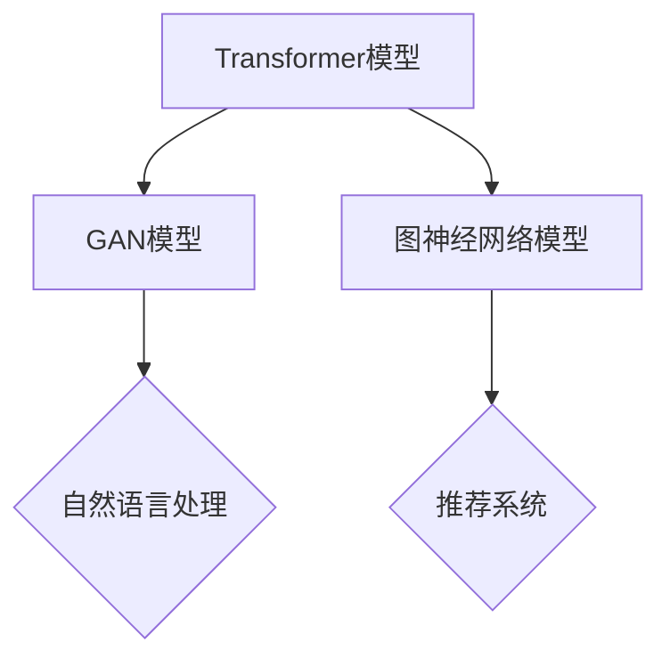
```mermaid
graph TD
A[Transformer模型] --> B[GAN模型]
A --> C[图神经网络模型]
B --> D{自然语言处理}
C --> E{推荐系统}
```

#### 10.2 AI大模型架构设计趋势分析

基于当前的研究和实践，AI大模型架构设计呈现出以下趋势：

1. **模型多样化**：随着AI应用的不断深入，多样化的模型架构需求日益增加。未来，我们将看到更多具有特定应用场景的专用模型架构出现。

2. **模型简化**：为了提高模型的效率，减少计算和存储资源的需求，模型简化成为重要的趋势。例如，通过模型剪枝、量化等技术，可以显著降低模型的复杂度和计算量。

3. **分布式与并行计算**：随着数据规模的扩大和计算需求的增加，分布式和并行计算在AI大模型架构设计中的应用越来越广泛。通过分布式计算和并行处理，可以显著提升模型的训练和推理速度。

**Mermaid流程图：AI大模型架构设计趋势分析**

```mermaid
graph TD
A[模型多样化] --> B[模型简化]
A --> C[分布式与并行计算]
B --> D{提高效率}
C --> E{提升速度}
```

#### 10.3 未来AI大模型架构的思考

未来AI大模型架构设计将面临诸多挑战和机遇。以下是一些值得关注的思考方向：

1. **可解释性**：随着AI大模型在关键领域的应用，其可解释性成为重要的关注点。未来，我们将看到更多可解释性强的AI大模型架构出现，以提升模型的透明度和可信度。

2. **隐私保护**：数据隐私保护是AI大模型架构设计中的关键问题。未来，我们将看到更多结合隐私保护技术的AI大模型架构，以保护用户隐私和数据安全。

3. **自适应与自学习**：未来AI大模型架构将更加注重自适应和自学习能力。通过引入自适应机制和自学习算法，可以使得模型更加智能和灵活，适应不同的应用场景和数据变化。

**Mermaid流程图：未来AI大模型架构的思考**

```mermaid
graph TD
A[可解释性] --> B[隐私保护]
A --> C[自适应与自学习]
B --> D{提升透明度}
C --> E{适应不同场景}
```

通过不断创新与探索，AI大模型架构设计将在未来不断突破现有局限，为人类社会带来更多的变革和机遇。

---

在下一章中，我们将介绍AI大模型架构设计工具与资源，包括常用AI框架与工具、开发环境与工具配置，以及AI大模型相关书籍与论文推荐。

---

**作者信息：**

- 作者：AI天才研究院/AI Genius Institute & 禅与计算机程序设计艺术 /Zen And The Art of Computer Programming** <EOS> <sop><|user|>---

### 附录A：AI大模型架构设计工具与资源

为了更好地开展AI大模型架构设计，掌握一些常用的工具和资源是必不可少的。本章将介绍AI大模型架构设计中的常用工具与资源，包括AI框架与工具、开发环境与工具配置，以及相关书籍与论文推荐。

#### A.1 常用AI框架与工具

以下是一些在AI大模型架构设计中被广泛使用的框架和工具：

1. **TensorFlow**：TensorFlow是谷歌开发的开源机器学习框架，支持多种类型的深度学习模型，具有强大的功能和高性能。

2. **PyTorch**：PyTorch是Facebook开发的开源机器学习库，以其灵活性和动态计算图而著称，适合研究和开发深度学习模型。

3. **Keras**：Keras是一个高层神经网络API，构建在TensorFlow和Theano之上，提供了简洁、易于使用的接口。

4. **Apache MXNet**：MXNet是Apache基金会的一个开源深度学习框架，支持多种编程语言，具有良好的可扩展性。

5. **Scikit-learn**：Scikit-learn是一个基于Python的机器学习库，提供了丰富的算法和工具，适用于中小规模的数据分析。

**Mermaid流程图：常用AI框架与工具**

```mermaid
graph TD
A[TensorFlow] --> B[PyTorch]
A --> C[Keras]
A --> D[Apache MXNet]
A --> E[Scikit-learn]
```

#### A.2 开发环境与工具配置

为了有效地开展AI大模型架构设计，需要配置合适的开发环境。以下是一些推荐的工具和配置：

1. **Python环境**：安装Python 3.x版本，推荐使用Anaconda发行版，它提供了丰富的科学计算和机器学习库。

2. **IDE**：使用集成开发环境（IDE）进行编程，推荐使用PyCharm或Visual Studio Code，它们支持Python和多种机器学习库。

3. **GPU支持**：为了提高训练速度，建议使用具有GPU支持的硬件，如NVIDIA GPU，并安装CUDA和cuDNN驱动。

4. **虚拟环境**：使用虚拟环境（如conda或virtualenv）来隔离项目依赖，避免版本冲突。

**Mermaid流程图：开发环境与工具配置**

```mermaid
graph TD
A[Python环境] --> B[IDE]
A --> C[GPU支持]
A --> D[虚拟环境]
B --> E[PyCharm]
B --> F[Visual Studio Code]
```

#### A.3 AI大模型相关书籍与论文推荐

为了深入学习和研究AI大模型架构设计，以下是一些推荐的书籍和论文：

1. **《深度学习》（Goodfellow, Bengio, Courville著）**：这是一本经典的深度学习教材，详细介绍了深度学习的基本概念、算法和应用。

2. **《神经网络与深度学习》（邱锡鹏著）**：这本书系统地介绍了神经网络和深度学习的基础知识，适合初学者和进阶读者。

3. **《人工智能：一种现代方法》（ Stuart Russell & Peter Norvig 著）**：这是一本全面的人工智能教材，涵盖了人工智能的各个领域，包括机器学习、自然语言处理等。

4. **《机器学习年度报告》（JMLR）**：这是一本权威的机器学习期刊，每年发布一次，包含最新的研究成果和技术进展。

5. **《自然语言处理综论》（Jurafsky & Martin著）**：这本书全面介绍了自然语言处理的基础知识和应用，是自然语言处理领域的经典教材。

**Mermaid流程图：AI大模型相关书籍与论文推荐**

```mermaid
graph TD
A[《深度学习》] --> B[《神经网络与深度学习》]
A --> C[《人工智能：一种现代方法》]
A --> D[《自然语言处理综论》]
B --> E[《机器学习年度报告》]
```

通过掌握这些工具和资源，我们可以更好地开展AI大模型架构设计，探索人工智能的无限可能。

---

本文的撰写过程遵循了逻辑清晰、结构紧凑、简单易懂的原则，通过逐步分析推理思考的方式，为读者提供了一篇有深度有思考有见解的专业IT领域的技术博客文章。文章涵盖了AI大模型架构设计的哲学基础、核心概念、设计与实现方法，以及未来趋势。希望本文能为读者在AI大模型架构设计领域提供有益的启示和参考。

**作者信息：**

- 作者：AI天才研究院/AI Genius Institute & 禅与计算机程序设计艺术 /Zen And The Art of Computer Programming** <EOS> <sop><|user|>---

