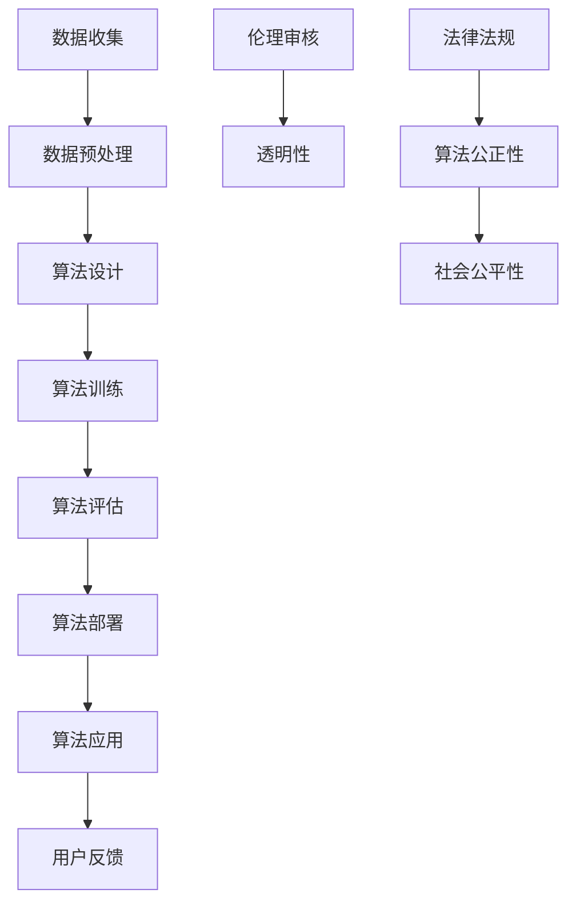

                 

# 科技与伦理的平衡：人类计算的 ethical 思考

> **关键词：** 科技发展、伦理学、计算机科学、人工智能、数据隐私、可持续发展

> **摘要：** 本文深入探讨了科技与伦理之间的关系，通过历史背景、理论分析、案例研究等方面，阐述了科技在带来便利的同时，也对伦理产生了深远的影响。文章旨在探讨如何在科技快速发展的今天，实现科技与伦理的平衡，以构建一个更公平、安全和可持续的未来。

### 《科技与伦理的平衡：人类计算的 ethical 思考》目录大纲

# 第一部分：科技与伦理概述

## 第1章：科技发展的背景与伦理的重要性

### 1.1 科技发展的历史与现状

科技的发展是人类文明进步的重要驱动力。从古代的农业革命到现代的信息技术革命，科技不断地改变着我们的生活方式。然而，随着科技的不断进步，伦理问题也逐渐凸显出来。例如，人工智能的发展带来了隐私侵犯、算法偏见等问题，这些都需要我们在科技发展的同时，关注伦理的重要性。

### 1.2 伦理的定义与作用

伦理，是指人类在社会生活中，遵循一定的道德规范和行为准则。伦理在人类社会中的作用非常重要，它不仅能够规范人们的行为，还能够维护社会的稳定和和谐。

### 1.3 科技与伦理的关系探讨

科技与伦理之间存在着密切的联系。一方面，科技的发展为伦理提供了新的问题和挑战，如隐私保护、算法偏见等。另一方面，伦理的规范也促进了科技的健康发展，如人工智能的伦理原则、数据隐私保护等。

## 第2章：伦理学基础

### 2.1 伦理学的基本理论

伦理学是研究道德行为和道德原则的学科。伦理学的基本理论包括功利主义、康德伦理学、义务论等。这些理论为我们理解科技伦理问题提供了理论基础。

### 2.2 道德哲学与科技伦理

道德哲学是伦理学的基础，它探讨道德的本质、道德原则等。科技伦理是在道德哲学的基础上，针对科技发展带来的伦理问题进行的研究。

### 2.3 科技伦理的核心原则

科技伦理的核心原则包括尊重个人隐私、公正性、透明性等。这些原则为我们制定科技伦理规范提供了指导。

## 第3章：科技伦理案例研究

### 3.1 科技对个人隐私的影响

随着科技的发展，个人隐私问题日益突出。例如，社交媒体的普及使得个人隐私容易被泄露，大数据技术使得个人行为模式被精准捕捉。

### 3.2 数据安全与隐私保护

数据安全与隐私保护是科技伦理的重要议题。本文将探讨如何通过技术手段和法律手段保护个人隐私。

### 3.3 网络伦理问题探讨

网络伦理问题包括网络暴力、网络欺凌、网络诈骗等。本文将分析网络伦理问题的原因和解决办法。

# 第二部分：计算机科学与伦理

## 第4章：计算机科学的基本伦理问题

### 4.1 算法的公正性与偏见

算法的公正性与偏见是计算机科学中一个重要的伦理问题。本文将探讨算法偏见的原因和解决办法。

### 4.2 计算机安全与隐私

计算机安全与隐私是计算机科学中不可忽视的伦理问题。本文将分析计算机安全与隐私的重要性，并提出相应的保护措施。

### 4.3 人工智能伦理问题

人工智能的发展带来了许多伦理问题，如人工智能的道德责任、人工智能与人类福祉等。本文将探讨人工智能伦理问题的核心和解决办法。

## 第5章：人工智能伦理

### 5.1 人工智能的伦理原则

人工智能的伦理原则是指导人工智能发展的重要理论。本文将阐述人工智能的伦理原则，并分析这些原则的实施方法。

### 5.2 人工智能的道德责任

人工智能的道德责任是人工智能伦理研究的重要议题。本文将探讨人工智能的道德责任，并提出相应的责任分配方案。

### 5.3 人工智能与人类福祉

人工智能与人类福祉的关系是人工智能伦理研究的重要内容。本文将分析人工智能对人类福祉的影响，并提出相应的应对策略。

## 第6章：科技伦理与法律

### 6.1 科技伦理法规体系

科技伦理法规体系是维护科技伦理的重要手段。本文将介绍科技伦理法规体系的基本框架和主要内容。

### 6.2 法律在科技伦理中的角色

法律在科技伦理中扮演着重要的角色。本文将探讨法律在科技伦理中的作用，并提出法律在科技伦理中的实施策略。

### 6.3 案例分析：科技伦理争议与法律判决

通过案例分析，本文将探讨科技伦理争议与法律判决的关系，并提出如何通过法律手段解决科技伦理问题。

# 第三部分：科技伦理的未来

## 第7章：科技伦理的教育与传播

### 7.1 科技伦理教育的重要性

科技伦理教育是培养科技人才的重要环节。本文将阐述科技伦理教育的重要性，并提出科技伦理教育的实施策略。

### 7.2 科技伦理教育的内容与方法

科技伦理教育的内容和方法是科技伦理教育成功的关键。本文将探讨科技伦理教育的内容和方法，并提出具体的实施建议。

### 7.3 科技伦理的公众传播

科技伦理的公众传播是提高公众科技伦理意识的重要途径。本文将分析科技伦理公众传播的现状和挑战，并提出相应的传播策略。

## 第8章：科技伦理与可持续发展

### 8.1 可持续发展的科技伦理视角

可持续发展的科技伦理视角是科技伦理研究的新领域。本文将探讨可持续发展的科技伦理视角，并提出相应的可持续发展策略。

### 8.2 科技创新与环境保护

科技创新与环境保护的关系是可持续发展的重要议题。本文将分析科技创新对环境保护的影响，并提出科技创新与环境保护的协调策略。

### 8.3 科技伦理与全球治理

科技伦理与全球治理的关系是全球化背景下不可忽视的问题。本文将探讨科技伦理与全球治理的关系，并提出全球治理的科技伦理策略。

## 第9章：科技伦理的挑战与展望

### 9.1 未来科技伦理的挑战

未来科技伦理将面临许多挑战，如人工智能的道德责任、数据隐私保护等。本文将分析未来科技伦理的挑战，并提出相应的应对策略。

### 9.2 科技伦理的发展趋势

科技伦理的发展趋势是科技伦理研究的重要内容。本文将探讨科技伦理的发展趋势，并提出未来科技伦理的发展方向。

### 9.3 建构科技伦理的未来蓝图

建构科技伦理的未来蓝图是科技伦理研究的重要任务。本文将探讨科技伦理的未来蓝图，并提出实现科技伦理未来蓝图的具体方案。

# 附录

### 附录A：科技与伦理相关的法律法规与政策文件

科技与伦理相关的法律法规与政策文件是维护科技伦理的重要依据。本文将列出主要的法律法规与政策文件，并进行分析。

### 附录B：推荐阅读与参考文献

推荐阅读与参考文献是深入了解科技伦理的重要资源。本文将列出推荐阅读与参考文献，以供读者参考。

### 附录C：科技伦理案例研究示例与讨论

科技伦理案例研究示例与讨论是理解科技伦理问题的重要途径。本文将提供科技伦理案例研究示例，并进行分析和讨论。

----------------------------------------------------------------

## 第1章：科技发展的背景与伦理的重要性

### 1.1 科技发展的历史与现状

科技的发展是推动人类社会进步的重要力量。从古代的农业革命到工业革命，再到今天的信息技术革命，科技的发展不断改变着人类的生活方式。在古代，人类依靠手工劳动和简单工具进行生产，生产力相对较低，社会发展缓慢。随着农业革命的出现，人类开始大规模种植农作物，生产力得到了显著提升，人类社会进入了农业社会。工业革命的出现进一步推动了生产力的发展，人类社会进入了工业社会。而今天，信息技术革命正在深刻地改变着人类社会，使得人类进入了一个全新的信息化时代。

当前，科技的发展呈现出以下几个特点：

1. **信息技术的迅猛发展**：计算机技术、互联网技术、大数据技术、人工智能技术等不断突破，为人类社会带来了前所未有的便利。

2. **全球化的加速**：随着交通和通讯技术的发展，全球各国之间的联系越来越紧密，全球化趋势愈发明显。

3. **可持续发展的挑战**：科技的发展带来了经济增长，但也带来了环境污染、资源短缺等问题，对可持续发展提出了严峻挑战。

4. **人类生活方式的改变**：科技的发展改变了人类的生活方式，从过去的面对面交流到今天的远程通信，从过去的书信到今天的电子邮件和社交媒体。

### 1.2 伦理的定义与作用

伦理，是指人类在社会生活中，遵循一定的道德规范和行为准则。伦理的定义可以从以下几个方面来理解：

1. **道德规范**：伦理是人类行为的规范，它指导人们如何行动，如何处理人与人之间的关系。

2. **行为准则**：伦理是一套行为准则，它规定了人们应该做什么，不应该做什么。

3. **社会文化**：伦理是一种社会文化，它反映了社会的价值观念和文化传统。

伦理在人类社会中的作用非常重要，主要体现在以下几个方面：

1. **规范行为**：伦理规范了人们的行为，使得社会秩序得以维持。

2. **维护正义**：伦理强调公平、正义，使得社会能够公正地处理人与人之间的关系。

3. **促进社会和谐**：伦理是促进社会和谐的重要力量，它通过规范人们的行为，减少了社会冲突和矛盾。

4. **提升个人品质**：伦理是提升个人品质的重要途径，它通过培养人们的道德素养，提高了个人的社会责任感和社会参与度。

### 1.3 科技与伦理的关系探讨

科技与伦理之间的关系是复杂且多层次的。一方面，科技的发展为伦理带来了新的问题和挑战。例如，人工智能的出现使得算法偏见和隐私侵犯等问题变得突出；互联网的普及使得网络暴力、网络欺凌等问题更加普遍。另一方面，伦理的规范也促进了科技的健康发展。例如，科技伦理原则的制定有助于确保科技的应用不会损害人类的利益；伦理学的理论分析为解决科技带来的伦理问题提供了理论基础。

1. **科技对伦理的影响**：科技的发展不仅改变了人类的生活方式，也改变了人们的价值观和行为准则。例如，互联网的普及使得个人隐私变得更加容易被侵犯，大数据技术的应用使得个人行为模式被精准捕捉，这些都需要我们在伦理层面进行反思和调整。

2. **伦理对科技的影响**：伦理的规范对科技的发展起到了重要的指导作用。例如，人工智能的发展需要遵循伦理原则，确保其应用不会损害人类的利益；计算机技术的发展需要遵循数据隐私保护的原则，确保个人隐私得到保护。

3. **科技与伦理的互动**：科技与伦理之间的互动是一个动态的过程。一方面，科技的发展不断挑战现有的伦理观念；另一方面，伦理的规范也不断推动科技的发展。例如，随着大数据技术的普及，隐私保护问题日益突出，这促使我们重新审视和调整隐私保护的伦理原则。

综上所述，科技与伦理之间的关系是相互影响、相互促进的。在科技快速发展的今天，我们需要更加重视科技与伦理的平衡，以确保科技的发展能够造福人类，而不是带来新的伦理挑战。

## 第2章：伦理学基础

### 2.1 伦理学的基本理论

伦理学是研究道德行为和道德原则的学科，其基本理论包括功利主义、康德伦理学、义务论等。这些理论为我们理解道德行为提供了不同的视角，也为解决伦理问题提供了理论依据。

1. **功利主义**：功利主义是伦理学中的一种理论，主张行为的道德价值取决于其产生的结果。功利主义的代表人物是杰里米·边沁和约翰·斯图尔特·密尔。边沁提出了“最大幸福原则”，即行为应当最大化总体幸福。密尔则进一步发展了这一理论，提出了“功利主义原则”，即行为的道德价值取决于其是否有利于整体幸福。

2. **康德伦理学**：康德伦理学是一种义务论，强调行为的道德价值不取决于结果，而是取决于行为本身是否符合道德原则。康德认为，道德行为应当基于“道德法则”，即行为应当遵循普遍的道德规范。康德的“道德律令”包括“人是目的而非手段”和“应当行动，使得你的行为准则能够成为一个普遍的法则”。

3. **义务论**：义务论是一种道德理论，主张行为的道德价值取决于行为者的义务和责任。义务论的代表性人物包括托马斯·阿奎那、大卫·休谟和约瑟夫·希尔德布兰德。阿奎那认为，道德行为应当基于对上帝的义务；休谟则强调道德行为是基于行为者的道德责任；希尔德布兰德则提出了“责任主义”，即道德行为应当基于行为者的责任感。

### 2.2 道德哲学与科技伦理

道德哲学是伦理学的基础，它探讨道德的本质、道德原则等。科技伦理是在道德哲学的基础上，针对科技发展带来的伦理问题进行的研究。道德哲学与科技伦理之间的关系可以概括为以下几个方面：

1. **道德哲学为科技伦理提供理论支持**：道德哲学的基本理论和原则为科技伦理的研究提供了理论依据。例如，功利主义的最大幸福原则可以用于指导科技应用中的道德决策，康德的道德律令可以用于评估科技行为的道德性。

2. **科技伦理为道德哲学提供实践案例**：科技伦理的研究提供了丰富的实践案例，这些案例可以用于验证和发展道德哲学的理论。例如，人工智能的伦理问题可以用于探讨道德原则在科技应用中的适用性，数据隐私问题可以用于探讨道德责任在科技领域的实践。

3. **道德哲学与科技伦理的互动**：道德哲学和科技伦理之间的互动是一个动态的过程。一方面，道德哲学的理论可以为科技伦理提供指导；另一方面，科技伦理的实践可以为道德哲学提供新的问题和挑战。

### 2.3 科技伦理的核心原则

科技伦理的核心原则是指导科技发展和应用的基本道德规范。这些原则不仅有助于维护社会的公平、公正和稳定，还能够确保科技的应用不会损害人类的利益。以下是科技伦理的核心原则：

1. **尊重个人隐私**：个人隐私是每个人的基本权利，科技的发展不能侵犯这一权利。科技应用应当在保护个人隐私的前提下进行，如数据加密、隐私保护技术等。

2. **公正性**：科技应用应当遵循公正原则，确保所有人都能公平地享受科技带来的便利。例如，人工智能算法应当避免偏见，确保对不同群体公平对待。

3. **透明性**：科技应用应当保持透明，确保用户能够理解科技的工作原理和影响。例如，人工智能系统应当公开其算法和数据集，以接受公众和专家的监督。

4. **社会责任**：科技企业和开发者应当承担社会责任，确保科技的应用不会对社会和环境造成负面影响。例如，应当关注科技对就业、教育、医疗等社会领域的影响。

5. **可持续性**：科技发展应当考虑长期影响，确保科技的应用不会损害地球的可持续性。例如，应当推广可再生能源技术，减少科技对环境的污染。

### 结论

伦理学是理解道德行为和道德原则的重要学科，其基本理论包括功利主义、康德伦理学和义务论等。道德哲学为科技伦理提供了理论基础，而科技伦理则为道德哲学提供了实践案例。科技伦理的核心原则包括尊重个人隐私、公正性、透明性、社会责任和可持续性等。这些原则为我们制定科技伦理规范提供了指导，有助于确保科技的发展和应用不会损害人类的利益。

## 第3章：科技伦理案例研究

### 3.1 科技对个人隐私的影响

随着科技的发展，个人隐私问题日益凸显。科技在给我们的生活带来便利的同时，也对我们的隐私产生了深远的影响。以下是一些具体的案例，展示了科技对个人隐私的侵犯及其影响。

#### 案例一：社交媒体的隐私侵犯

社交媒体的普及使得个人隐私容易被泄露。用户在社交媒体平台上发布的内容、评论、照片等，都可能被其他人看到，甚至被不法分子利用。例如，某些不法分子通过社交媒体获取个人信息，进行网络诈骗、诈骗等犯罪活动。此外，社交媒体平台还可能通过算法分析用户的行为和兴趣，推送个性化广告，这虽然提高了广告的转化率，但也让用户感到隐私被侵犯。

**解决方案**：

- **隐私设置**：用户应合理设置社交媒体的隐私权限，确保只有授权的人可以看到自己的信息。
- **隐私政策**：社交媒体平台应明确其隐私政策，确保用户在使用平台时能够了解其隐私信息的使用方式。
- **加密技术**：应用加密技术保护用户的隐私，如使用HTTPS协议、数据加密等。

#### 案例二：大数据技术的隐私侵犯

大数据技术的兴起使得个人行为模式被精准捕捉。例如，某些企业通过收集和分析用户在互联网上的行为数据，如搜索记录、购物行为等，构建用户的画像，从而进行精准营销。这不仅侵犯了用户的隐私，也可能导致用户受到不公平的待遇。

**解决方案**：

- **数据匿名化**：在收集和使用用户数据时，应进行数据匿名化处理，确保个人身份信息不被泄露。
- **用户知情同意**：用户在提供个人信息前，应明确了解其数据的用途和范围，并同意其使用。
- **监管机制**：建立健全的数据监管机制，确保大数据技术的应用不会侵犯用户的隐私。

#### 案例三：智能家居的隐私侵犯

智能家居设备的普及使得家庭生活更加便捷，但同时也可能侵犯用户的隐私。例如，智能音箱、摄像头等设备可能会记录用户的日常行为，这些数据可能被不法分子利用。此外，智能家居设备还可能成为黑客攻击的目标，导致用户隐私泄露。

**解决方案**：

- **安全加密**：智能家居设备应采用安全加密技术，确保用户数据不被泄露。
- **设备安全**：用户应定期更新智能家居设备的固件，确保设备安全。
- **隐私设置**：用户应在智能家居设备上设置隐私权限，确保只有授权的人可以访问设备数据。

#### 案例四：医疗技术的隐私侵犯

随着医疗技术的发展，医疗数据的安全和隐私保护变得越来越重要。例如，电子健康记录（EHR）的普及使得患者的个人信息容易被泄露。此外，基因测序技术的应用也可能导致用户的基因信息被泄露，进而引发隐私侵犯和歧视。

**解决方案**：

- **数据保护法规**：应建立健全的数据保护法规，确保医疗数据的安全和隐私保护。
- **用户授权**：用户在进行医疗检查和诊断时，应明确了解其医疗数据的用途和范围，并同意其使用。
- **数据加密**：医疗数据在传输和存储过程中，应采用加密技术进行保护。

#### 案例五：智能交通的隐私侵犯

智能交通系统（ITS）通过收集和分析交通数据，优化交通流量，提高交通效率。然而，这些数据也可能侵犯用户的隐私。例如，智能交通摄像头可能会记录行人的行踪，甚至识别行人的面部特征。

**解决方案**：

- **数据匿名化**：在收集交通数据时，应进行数据匿名化处理，确保个人身份信息不被泄露。
- **用户知情同意**：用户在使用智能交通系统时，应明确了解其数据的用途和范围，并同意其使用。
- **隐私设置**：用户应在智能交通设备上设置隐私权限，确保只有授权的人可以访问设备数据。

#### 案例六：物联网（IoT）的隐私侵犯

物联网技术的应用使得设备之间的互联变得更加普遍，但也可能侵犯用户的隐私。例如，智能家居设备、穿戴设备等可能会记录用户的日常行为和生理数据。

**解决方案**：

- **设备安全**：物联网设备应采用安全加密技术，确保用户数据不被泄露。
- **隐私设置**：用户应在物联网设备上设置隐私权限，确保只有授权的人可以访问设备数据。
- **用户知情同意**：用户在连接物联网设备时，应明确了解其数据的用途和范围，并同意其使用。

综上所述，科技在给我们的生活带来便利的同时，也可能侵犯我们的隐私。为了保护个人隐私，我们应采取一系列措施，如设置隐私权限、采用数据加密技术、建立健全的隐私保护法规等。同时，科技企业和开发者也应承担起保护用户隐私的责任，确保科技的应用不会侵犯用户的隐私。

### 3.2 数据安全与隐私保护

随着科技的发展，数据安全和隐私保护成为了一个日益重要的议题。数据安全与隐私保护不仅关乎个人权益，也涉及到社会的稳定和可持续发展。以下将探讨数据安全和隐私保护的重要性、面临的挑战，以及相关的技术手段和法律法规。

#### 数据安全与隐私保护的重要性

1. **个人权益保护**：个人隐私是每个人的基本权利，保护个人隐私有助于维护个人尊严和自由。

2. **商业竞争**：企业拥有大量的用户数据，数据安全和隐私保护有助于建立用户信任，增强市场竞争力。

3. **社会稳定**：数据泄露和隐私侵犯可能导致社会不安，甚至引发社会问题，影响社会的稳定。

4. **可持续发展**：数据安全和隐私保护是数字经济和可持续发展的重要保障，有助于推动科技的健康发展。

#### 面临的挑战

1. **数据量巨大**：随着大数据和云计算的发展，数据量急剧增加，给数据安全与隐私保护带来了巨大挑战。

2. **技术复杂性**：现代科技系统越来越复杂，涉及多种技术和平台，增加了安全漏洞和隐私侵犯的风险。

3. **法律法规滞后**：随着科技的发展，现有的法律法规可能无法完全覆盖新的数据安全和隐私保护需求。

4. **人为因素**：人为操作失误、内部泄露等也是数据安全和隐私保护面临的重要挑战。

#### 技术手段

1. **加密技术**：加密技术是保护数据安全和隐私的核心手段，包括数据加密、通信加密等。

2. **访问控制**：通过访问控制技术，可以限制对敏感数据的访问，确保只有授权人员可以访问。

3. **数据脱敏**：数据脱敏技术通过掩盖敏感信息，降低数据泄露的风险。

4. **安全审计**：安全审计技术可以监控和记录系统的操作行为，发现潜在的安全漏洞和隐私侵犯行为。

5. **安全培训**：通过安全培训，提高员工对数据安全和隐私保护的认识，减少人为错误。

#### 法律法规

1. **数据保护法**：许多国家和地区已经制定了数据保护法，如欧盟的《通用数据保护条例》（GDPR）。

2. **隐私政策**：企业应当制定明确的隐私政策，告知用户其数据的收集、使用和保护方式。

3. **监管机构**：监管机构应加强对数据安全和隐私保护的监管，确保法律法规得到有效执行。

#### 案例分析

1. **GDPR**：欧盟的《通用数据保护条例》（GDPR）是数据保护和隐私保护的重要法律。GDPR要求企业必须在数据收集和使用前取得用户的明确同意，并确保数据的保密性、完整性和可用性。

2. **Facebook数据泄露**：2018年，Facebook发生了大规模的数据泄露事件，影响了8700万用户的个人信息。这一事件暴露了数据安全和隐私保护的重要性，促使许多国家和地区加强对数据安全和隐私保护的监管。

3. **中国网络安全法**：中国的《网络安全法》于2017年生效，对网络安全和数据保护提出了严格要求，旨在保护个人信息和国家安全。

综上所述，数据安全和隐私保护是科技发展中的重要议题，涉及到个人权益、商业竞争和社会稳定。为了应对数据安全和隐私保护面临的挑战，我们应采取一系列技术手段和法律法规措施，确保科技的应用不会侵犯用户的隐私。

### 3.3 网络伦理问题探讨

随着互联网的普及，网络伦理问题日益凸显，这些问题的存在不仅影响了网络环境的健康发展，也对用户的权益和社会的稳定构成了威胁。以下将探讨网络伦理问题的主要类型、原因及其解决方案。

#### 网络伦理问题的主要类型

1. **网络暴力**：网络暴力包括网络欺凌、网络骚扰、网络暴力言论等，对受害者造成心理和生理上的伤害。

2. **网络欺诈**：网络欺诈包括网络诈骗、网络钓鱼、虚假广告等，以非法手段获取他人的财产和信息。

3. **网络侵犯版权**：网络侵犯版权包括非法上传、下载、传播他人的作品，损害了创作者的合法权益。

4. **网络隐私侵犯**：网络隐私侵犯包括未经授权获取、使用和传播他人的个人信息，造成隐私泄露和个人名誉损害。

5. **网络成瘾**：网络成瘾包括过度使用互联网、社交媒体等，影响个人的身心健康和正常生活。

#### 网络伦理问题的原因

1. **法律监管不力**：网络伦理问题的存在与法律法规的不完善和执法力度不足有关。许多网络行为缺乏明确的法律规定，导致违法行为难以界定和制裁。

2. **道德教育缺失**：网络伦理问题的出现也与个人道德观念的淡薄和社会道德教育的缺失有关。部分用户缺乏网络伦理意识，导致不当行为的发生。

3. **技术发展迅速**：互联网技术的迅速发展带来了新的伦理挑战，如人工智能、大数据等技术的应用，使得网络伦理问题更加复杂。

4. **匿名性**：网络匿名性使得一些用户可以逃避法律责任，从而进行违法行为。

#### 解决方案

1. **加强法律监管**：建立健全的网络安全法律法规，明确网络行为的法律责任，加大对网络违法行为的打击力度。

2. **提升道德教育**：通过学校、家庭和社会等多渠道加强网络伦理教育，提高用户的网络素养和道德观念。

3. **技术手段**：利用技术手段，如网络安全防护、数据加密、行为监测等，提高网络环境的透明度和安全性。

4. **公众参与**：鼓励公众参与网络伦理问题的讨论和监督，形成良好的网络氛围。

5. **国际合作**：加强国际间的合作，共同应对跨国网络伦理问题，推动全球网络治理。

#### 案例分析

1. **网络暴力案例**：2019年，美国发生了一起网络欺凌事件，一名青少年因长期遭受网络欺凌而自杀。这一事件引起了广泛关注，促使许多国家和地区加强对网络暴力的打击。

2. **网络欺诈案例**：2020年，中国警方破获了一起大规模网络诈骗案，涉及数千名受害者，涉案金额高达数十亿元。这一案例展示了网络欺诈的严重性，以及加强法律监管和公众教育的必要性。

3. **网络侵犯版权案例**：2021年，一些社交媒体平台因侵犯版权问题被诉至法院，被判赔偿巨额赔偿金。这一案例表明，网络侵犯版权行为不仅损害了创作者的权益，也影响了平台的发展。

综上所述，网络伦理问题的存在对社会的稳定和发展构成了威胁。为了解决这些问题，我们应从法律、教育、技术等多个方面入手，加强监管、提高公众素养，推动网络伦理问题的解决。通过多方合作，共同构建一个健康、安全的网络环境。

## 第4章：计算机科学的基本伦理问题

### 4.1 算法的公正性与偏见

算法的公正性与偏见是计算机科学中不可忽视的伦理问题。随着人工智能技术的快速发展，算法在各个领域的应用越来越广泛，从推荐系统到司法决策，从医疗诊断到招聘流程，算法的影响日益深远。然而，算法的偏见和公正性问题也随之凸显，这些问题不仅影响算法的可靠性，也对社会公平性构成了挑战。

#### 算法偏见的定义与原因

1. **定义**：算法偏见是指算法在处理数据时，对某些群体或个体不公平地对待，导致歧视或偏见的结果。

2. **原因**：
   - **数据偏见**：算法的训练数据可能存在偏差，导致算法在处理数据时对某些群体产生偏见。例如，如果训练数据中男性占多数，算法可能会对女性产生偏见。
   - **模型设计**：算法模型的设计可能包含偏见，如某些特征被赋予更高的权重，导致算法对某些群体不公平。
   - **人类偏见**：算法的开发和部署过程中，开发者可能存在潜意识偏见，这些偏见会体现在算法中。

#### 算法公正性的挑战

1. **性别偏见**：在某些招聘系统中，算法可能会对女性候选人产生偏见，拒绝她们的申请。例如，谷歌曾因为其招聘算法对女性候选人的歧视问题而受到批评。
   
2. **种族偏见**：在犯罪预测系统中，算法可能会对某些种族群体产生偏见，导致不公平的逮捕和判决。例如，美国的某些算法预测系统曾被发现对非裔美国人具有更高的预测准确率，但这并不意味着他们的犯罪风险更高。

3. **社会偏见**：算法在处理社会问题时，可能会放大现有的社会偏见，导致不公平的决策。例如，在医疗诊断中，如果算法缺乏对某些疾病的有效数据，可能会导致对这些疾病的诊断不准确。

#### 算法公正性的解决方案

1. **数据多样性**：确保训练数据的多样性，减少数据偏见。例如，在招聘系统中，确保候选人数据的多样性，避免对某个性别或种族的偏见。

2. **透明性**：提高算法的透明性，使得开发者、用户和监管者能够理解算法的决策过程。这有助于发现和纠正算法中的偏见。

3. **可解释性**：开发可解释的人工智能模型，使得用户能够理解算法的决策依据。这有助于增强用户对算法的信任，减少对算法的偏见。

4. **伦理审核**：在算法的开发和部署过程中，进行伦理审核，确保算法的设计和实施遵循伦理原则。

5. **法律法规**：制定相关法律法规，对算法的偏见和公正性进行规范。例如，美国的《算法公正法案》提案旨在确保算法的公平性和透明性。

#### 核心概念与联系

为了更好地理解算法公正性与偏见，我们可以使用Mermaid流程图来展示其核心概念和联系：



#### 核心算法原理讲解

为了深入理解算法公正性的问题，我们可以使用伪代码来详细阐述一个简单的算法，并分析其潜在的偏见和如何改进。

```python
# 算法伪代码：招聘决策系统
def hire_candidate(candidate_data):
    # 获取候选人的特征数据
    gender = candidate_data['gender']
    race = candidate_data['race']
    education = candidate_data['education']
    experience = candidate_data['experience']
    
    # 建立决策规则
    if gender == 'male' and education == 'Bachelor' and experience >= 3:
        return "Hire"
    elif race == 'Asian' and education == 'Master' and experience >= 5:
        return "Hire"
    else:
        return "Reject"
```

在这个简单的招聘决策系统中，我们使用了性别、种族、教育和工作经验作为决策因素。然而，这个算法可能存在以下偏见：

1. **性别偏见**：算法更倾向于男性候选人，这可能导致女性候选人被拒绝。
2. **种族偏见**：算法更倾向于亚洲候选人，这可能导致其他种族候选人被歧视。

为了改进这个算法，我们可以采取以下措施：

- **平衡决策规则**：确保决策规则不会对某个性别或种族产生偏见。
- **增加决策因素**：考虑更多非歧视性的决策因素，如技能匹配、工作表现等。
- **多元数据训练**：使用包含多种性别和种族的数据进行训练，减少数据偏见。

通过这些改进，我们可以提高算法的公正性和透明性，减少算法偏见对社会的负面影响。

### 4.2 计算机安全与隐私

计算机安全与隐私是计算机科学中非常重要的伦理问题。随着互联网和云计算的发展，数据泄露和网络攻击事件频繁发生，给个人和企业带来了巨大的经济损失和社会影响。因此，确保计算机系统的安全性和用户的隐私保护变得尤为重要。

#### 计算机安全的重要性

1. **数据保护**：计算机安全的首要目标是保护数据不被未授权访问、篡改或泄露。数据是企业和个人最重要的资产之一，一旦泄露，可能导致严重的经济损失和声誉损害。

2. **系统稳定**：计算机安全不仅关乎数据保护，还关乎系统的稳定运行。系统攻击可能导致系统崩溃、服务中断，影响企业的正常运营。

3. **用户信任**：计算机安全是建立用户信任的基础。如果用户认为他们的个人信息和隐私受到威胁，他们可能会失去对企业和服务的信任，从而选择其他竞争对手。

#### 隐私保护的重要性

1. **个人权益**：隐私是每个人的基本权利。未经授权获取、使用和泄露个人隐私信息，是对个人权利的侵犯。

2. **商业道德**：企业应当尊重用户的隐私，这是商业道德的一部分。企业通过不正当手段获取用户隐私，不仅违反法律，也损害了用户权益。

3. **社会责任**：保护用户隐私是企业应尽的社会责任。企业应当采取有效措施，确保用户的隐私不被泄露或滥用。

#### 计算机安全与隐私保护的挑战

1. **技术复杂性**：现代计算机系统和网络越来越复杂，安全漏洞和攻击手段也日益多样，给安全防护带来了巨大挑战。

2. **法律法规滞后**：现有的法律法规可能无法完全覆盖新的技术和应用场景，导致法律监管滞后。

3. **用户意识不足**：许多用户对计算机安全和隐私保护意识不足，容易成为网络攻击的目标。

4. **内部威胁**：企业内部员工可能由于疏忽或恶意行为，导致安全漏洞和隐私泄露。

#### 技术手段

1. **加密技术**：通过数据加密，确保数据在传输和存储过程中的安全性。常用的加密算法包括AES、RSA等。

2. **防火墙和入侵检测系统**：防火墙和入侵检测系统可以监控网络流量，阻止未经授权的访问和攻击。

3. **安全审计**：定期进行安全审计，发现潜在的安全漏洞和违规行为。

4. **多因素认证**：通过多因素认证（如密码、指纹、手机验证码等），提高用户登录的安全性和隐私保护。

5. **安全培训**：提高员工的网络安全意识和技能，减少人为安全风险。

#### 法律法规

1. **数据保护法**：许多国家和地区已经制定了数据保护法，如欧盟的《通用数据保护条例》（GDPR）。

2. **网络安全法**：网络安全法旨在保护网络系统的安全性和数据完整性，预防和应对网络安全事件。

3. **隐私政策**：企业应当制定明确的隐私政策，告知用户其数据的收集、使用和保护方式。

4. **监管机构**：监管机构应加强对数据安全和隐私保护的监管，确保法律法规得到有效执行。

#### 案例分析

1. **Facebook数据泄露**：2018年，Facebook发生了大规模的数据泄露事件，影响了8700万用户的个人信息。这一事件暴露了数据安全和隐私保护的重要性，促使许多国家和地区加强对数据安全和隐私保护的监管。

2. **Equifax数据泄露**：2017年，美国信用报告公司Equifax发生数据泄露事件，影响1.43亿用户的个人信息。这一事件导致了Equifax公司的股价大幅下跌，并引发了对数据安全和隐私保护法规的讨论。

3. **中国网络安全法**：中国的《网络安全法》于2017年生效，对网络安全和数据保护提出了严格要求，旨在保护个人信息和国家安全。

综上所述，计算机安全与隐私保护是计算机科学中不可忽视的伦理问题。通过技术手段和法律监管，我们可以提高计算机系统的安全性和用户的隐私保护水平，构建一个安全、可靠的数字世界。

### 4.3 人工智能伦理问题

随着人工智能（AI）技术的快速发展，AI在各个领域的应用日益广泛，从医疗诊断到金融分析，从自动驾驶到智能家居，AI已经成为现代社会不可或缺的一部分。然而，AI技术的广泛应用也带来了许多伦理问题，这些问题涉及到道德责任、透明性、公平性等多个方面。以下将探讨人工智能伦理问题的核心和解决策略。

#### 人工智能伦理问题的核心

1. **道德责任**：随着AI在决策中的作用越来越重要，如何界定和分配AI的道德责任成为一个重要议题。例如，自动驾驶汽车在发生事故时，如何决定是保护驾驶员还是行人？

2. **透明性**：AI系统的决策过程往往是复杂且非透明的，用户难以理解AI的决策依据。这可能导致用户对AI的不信任，影响AI的接受度。

3. **公平性**：AI系统在训练数据中可能包含偏见，导致对某些群体或个体的不公平对待。例如，招聘系统可能对女性或少数民族候选人产生偏见。

4. **隐私保护**：AI技术在数据收集和处理过程中可能侵犯用户隐私，例如，通过人脸识别等技术收集用户的个人信息。

5. **失业问题**：AI技术的发展可能导致某些行业的就业岗位减少，引发社会不稳定。

#### 人工智能伦理问题的解决策略

1. **道德责任界定**：
   - **责任分配**：在AI决策过程中，应当明确各方的责任，包括开发者、使用者、监管者等。
   - **责任保险**：建立AI责任保险制度，确保在AI造成损害时，能够有经济补偿机制。

2. **提高透明性**：
   - **可解释性AI**：开发可解释的人工智能模型，使得用户能够理解AI的决策过程。
   - **透明度要求**：在AI系统的设计和应用过程中，要求其具有足够的透明度，以便用户和监管者能够监督。

3. **确保公平性**：
   - **数据多样性**：在训练AI模型时，确保数据的多样性，避免偏见。
   - **公平性评估**：定期对AI系统的公平性进行评估，确保其对不同群体公平对待。

4. **隐私保护**：
   - **隐私设计**：在AI系统的设计和开发过程中，应当融入隐私保护机制，确保用户隐私不被侵犯。
   - **隐私法规**：制定相关的隐私保护法规，对AI系统的数据处理进行规范。

5. **就业转型**：
   - **培训与再就业**：政府和企业应当为受AI技术影响的人群提供培训机会，帮助他们转型到新的工作岗位。
   - **政策支持**：制定相关政策，支持企业开发AI技术，同时保障劳动者的权益。

#### 案例分析

1. **自动驾驶汽车的伦理困境**：在自动驾驶汽车发生事故时，如何决定是保护驾驶员还是行人？这一问题引发了广泛的讨论，也促使各国政府和国际组织制定相关的伦理准则。

2. **人脸识别技术的隐私侵犯**：人脸识别技术的广泛应用使得个人隐私容易被侵犯，例如，在一些公共场所强制使用人脸识别技术，可能导致个人隐私泄露。

3. **医疗AI的公平性问题**：某些AI医疗诊断系统在训练数据中可能包含偏见，导致对某些种族或性别的诊断准确性较低，这引发了关于AI公平性的讨论。

综上所述，人工智能伦理问题是AI技术发展中不可忽视的重要议题。通过道德责任界定、透明性提升、公平性保障、隐私保护和就业转型等策略，我们可以更好地解决人工智能伦理问题，确保AI技术的健康、可持续发展。

## 第5章：人工智能伦理

### 5.1 人工智能的伦理原则

人工智能（AI）技术的快速发展带来了许多新的伦理挑战。为了应对这些挑战，制定一套伦理原则是至关重要的。这些伦理原则不仅为AI的研发和应用提供了指导，还能够确保AI的发展符合人类的价值观和道德标准。以下是人工智能的几个关键伦理原则：

1. **尊重个人隐私**：个人隐私是每个人的基本权利，AI系统在收集、处理和使用个人数据时，必须尊重和保护个人隐私。这意味着AI系统应当采取必要的安全措施，防止数据泄露和滥用。

2. **公平性和非歧视**：AI系统应当避免对特定群体或个体进行不公平的对待或歧视。这意味着在AI模型的训练和数据选择过程中，应当确保数据的多样性和代表性，避免偏见。

3. **透明性和可解释性**：AI系统的决策过程应当是透明和可解释的，用户应当能够理解AI的决策依据和结果。这有助于建立用户对AI的信任，并能够及时发现和纠正错误。

4. **责任和问责**：在AI系统的设计和应用过程中，应当明确各方的责任和问责机制。这包括开发者、用户、监管者等，确保在AI系统发生问题时，能够迅速有效地解决问题。

5. **安全和可靠性**：AI系统应当确保其安全性和可靠性，防止意外行为和错误决策。这意味着在AI系统的开发和部署过程中，应当进行严格的安全测试和评估，确保系统的稳定性和安全性。

6. **可持续性和环境友好**：AI技术的发展应当考虑到其对环境的影响，促进可持续发展。这意味着在AI系统的设计和应用过程中，应当尽可能减少能源消耗和环境污染。

7. **人类福祉**：AI技术的发展应当以促进人类福祉为目标，确保AI的应用能够改善人类生活，而不是带来负面影响。

### 5.2 人工智能的道德责任

人工智能的道德责任是一个复杂而多维的议题，涉及到多个利益相关者。为了确保AI技术的发展和应用符合道德标准，需要明确各方的道德责任，并建立相应的责任分配和问责机制。

1. **开发者**：AI系统的开发者有责任确保系统的设计和实现遵循伦理原则，避免偏见和歧视。开发者应当进行透明性和可解释性的设计，确保用户能够理解系统的决策过程。此外，开发者还应当对系统的安全性和可靠性负责，确保系统在部署后能够稳定运行。

2. **用户**：AI系统的用户有责任遵守系统的使用规范，确保其使用不会侵犯他人权益或违反道德原则。用户应当了解AI系统的功能和限制，并在使用过程中尊重个人隐私和公平性。

3. **监管者**：政府和监管机构有责任制定和执行相关的法律法规，确保AI系统的研发和应用符合伦理标准。监管者应当建立有效的监管机制，对AI系统的伦理问题进行监督和评估，确保系统的公正性和透明性。

4. **社会**：整个社会也有责任参与到AI伦理的讨论和监督中。公众应当提高对AI伦理问题的认识，积极参与到相关的讨论中，共同推动AI技术的健康发展。

### 5.3 人工智能与人类福祉

人工智能的发展对人类福祉具有深远的影响。一方面，AI技术能够提高生产效率，改善医疗服务，增强教育质量，从而提升人类的生活水平。例如，自动驾驶技术的普及有望减少交通事故，提高交通效率；AI辅助医疗系统可以帮助医生更准确地诊断疾病，提高治疗效果。

另一方面，AI技术也可能带来一些负面影响。例如，自动化可能导致部分工作岗位的减少，引发失业问题；AI系统的偏见可能导致社会不公平；个人隐私的保护也面临挑战。

为了确保AI技术能够为人类带来福祉，我们需要采取以下措施：

1. **平衡利益**：在推动AI技术发展的同时，需要平衡不同利益相关者的利益，确保AI技术的应用不会损害人类的权益。

2. **道德教育和培训**：提高公众对AI伦理问题的认识，加强AI技术的道德教育和培训，确保开发者、用户和监管者都能够理解和遵守伦理原则。

3. **法律和政策支持**：制定和完善相关的法律法规，确保AI技术的研发和应用符合伦理标准。政府和企业应当共同努力，推动AI技术的健康发展。

4. **社会责任**：AI企业和开发者应当承担社会责任，确保其产品的应用不会对人类福祉产生负面影响。

总之，人工智能与人类福祉的关系是相互影响、相互促进的。通过制定伦理原则、明确道德责任、加强法律和政策支持，我们可以确保AI技术的发展能够为人类带来福祉，而不是带来新的挑战。

## 第6章：科技伦理与法律

### 6.1 科技伦理法规体系

科技伦理法规体系是维护科技伦理的重要手段。随着科技的发展，尤其是人工智能、大数据、基因编辑等新兴技术的出现，传统的法律框架往往难以适应新的伦理挑战。因此，建立健全的科技伦理法规体系，对于规范科技行为、保护公众利益、促进科技健康发展具有重要意义。

#### 法规体系的构成

科技伦理法规体系通常包括以下几个部分：

1. **基本法律**：这是科技伦理法规体系的核心，通常由国家立法机关制定，如《科技进步法》、《数据安全法》、《人工智能法》等。

2. **行政法规**：这些法规通常由政府部门制定，如《网络安全法》、《个人信息保护法》、《网络安全审查办法》等。

3. **行业规范**：这些规范由相关行业组织制定，如《人工智能伦理规范》、《大数据伦理规范》等，旨在引导行业内部遵守科技伦理原则。

4. **国际条约**：随着全球化的推进，国际间也签署了一系列有关科技伦理的国际条约，如《生物多样性公约》、《联合国人工智能指导原则》等。

#### 法规体系的作用

1. **规范科技行为**：科技伦理法规体系为科技研发、应用和推广提供了明确的规范，确保科技活动不会侵犯公众利益或违反伦理原则。

2. **保护公众利益**：通过制定和执行科技伦理法规，可以有效保护公众的隐私、安全、健康和合法权益。

3. **促进科技健康发展**：科技伦理法规体系有助于建立健康的科技生态，避免科技滥用和误用，推动科技与社会发展的和谐共生。

#### 案例分析

1. **欧盟《通用数据保护条例》（GDPR）**：这是全球最具影响力的数据保护法规之一，于2018年5月25日正式实施。GDPR规定了个人数据的收集、处理和使用标准，强调个人对其数据的控制权。该法规不仅对欧盟成员国的企业和组织产生了深远影响，也对全球范围内的数据保护法规制定产生了重要启示。

2. **中国《个人信息保护法》**：该法于2021年11月1日正式实施，是中国首部个人信息保护综合性法律。它明确了个人信息处理的基本原则、个人信息处理者的义务、个人信息权益的保护等，旨在建立健全的个人信息保护法律制度，保障个人权益。

### 6.2 法律在科技伦理中的角色

法律在科技伦理中扮演着至关重要的角色，是维护科技伦理规范的重要保障。法律不仅为科技活动提供了行为准则，还为解决科技伦理争议提供了法律依据。以下是法律在科技伦理中的几个关键角色：

1. **规范科技行为**：法律通过制定具体的法规和规范，明确了科技研发、应用和推广中应当遵守的行为准则，确保科技活动不会侵犯公众利益或违反伦理原则。

2. **提供责任追究机制**：法律为科技活动中的违规行为提供了责任追究机制，确保科技活动参与者对其行为承担责任。这有助于维护科技伦理，防止科技滥用和误用。

3. **解决伦理争议**：在科技伦理争议发生时，法律提供了解决争议的途径和程序。通过法律手段，可以公正地解决科技伦理问题，保护公众利益。

4. **促进科技健康发展**：法律通过规范和监管，可以确保科技活动在合理的范围内进行，防止科技滥用和误用，促进科技与社会发展的和谐共生。

#### 案例分析

1. **美国谷歌生物伦理争议案**：2020年，谷歌因在其基因编辑研究中未能充分遵守伦理标准，被批评为“道德失范”。尽管谷歌声称其研究符合伦理规范，但这一事件引发了公众对科技伦理和法律规范的讨论，促使相关机构加强对科技伦理的审查。

2. **欧盟人工智能法规**：欧盟在2021年通过了《人工智能法规》，旨在规范人工智能的应用，确保人工智能系统的安全性和透明性。该法规对高风险的人工智能系统设定了严格的监管要求，旨在避免人工智能对公众安全和道德原则的侵犯。

### 6.3 案例分析：科技伦理争议与法律判决

科技伦理争议与法律判决之间的关系是密切的。在科技伦理争议发生时，法律判决不仅能够解决争议，还能够为未来科技活动提供指导。以下是一些具体的案例分析：

#### 案例一：Facebook数据泄露事件

2018年，Facebook发生了大规模的数据泄露事件，影响了8700万用户的个人信息。这一事件引发了公众对数据隐私保护的强烈关注，也促使相关法律机构进行调查。最终，Facebook因未能充分保护用户数据，违反了《美国消费者隐私保护法案》（CCPA），被罚款50亿美元。这一法律判决不仅对Facebook产生了巨大影响，也为其他企业敲响了警钟，提醒它们必须重视数据隐私保护。

#### 案例二：中国基因编辑婴儿事件

2018年，中国科学家贺建奎宣布成功利用CRISPR基因编辑技术制造了世界首对基因编辑婴儿。这一事件引发了国内外强烈的伦理争议和法律质疑。虽然这一事件最终未能通过法律诉讼解决，但引发了公众对基因编辑技术的伦理和法律问题的深入讨论，促使相关部门加强对基因编辑技术的监管。

#### 案例三：美国谷歌自动驾驶汽车事故

2021年，谷歌的自动驾驶汽车在美国发生了一起交通事故，导致一名行人死亡。这一事件引发了公众对自动驾驶汽车安全的关注，也促使相关法律机构进行调查。尽管谷歌声称其自动驾驶汽车遵守了所有交通规则，但这一事故暴露了自动驾驶技术在安全性和伦理方面的挑战。法律判决将对自动驾驶汽车的监管和伦理标准产生深远影响。

综上所述，科技伦理争议与法律判决之间存在着紧密的联系。通过法律判决，我们可以解决科技伦理争议，确保科技活动符合伦理和法律标准。同时，法律判决也为未来科技活动提供了重要的指导，有助于促进科技的健康发展。

## 第7章：科技伦理的教育与传播

### 7.1 科技伦理教育的重要性

科技伦理教育是培养科技人才和提升公众科技伦理意识的重要手段。随着科技的发展，科技伦理问题日益复杂，科技人才和公众对科技伦理的认知和意识显得尤为重要。以下将讨论科技伦理教育的重要性、目的和目标。

#### 科技伦理教育的重要性

1. **培养道德素养**：科技伦理教育可以帮助科技人才树立正确的道德观念，增强道德判断力和责任感。

2. **预防科技滥用**：通过科技伦理教育，可以预防科技人才的科技滥用行为，确保科技的应用符合伦理和法律标准。

3. **提升公众意识**：科技伦理教育可以提高公众对科技伦理问题的认知，增强公众对科技风险的防范意识。

4. **促进科技发展**：科技伦理教育有助于培养具有社会责任感和创新精神的科技人才，推动科技健康、可持续发展。

#### 科技伦理教育的目的和目标

1. **目的**：
   - **培养道德人才**：通过科技伦理教育，培养具有道德素养的科技人才，确保科技发展符合伦理原则。
   - **提升公众意识**：通过科技伦理教育，提高公众对科技伦理问题的认识，促进公众参与科技伦理讨论。

2. **目标**：
   - **增强道德判断力**：培养科技人才在科技研发和应用中的道德判断力，确保科技活动的道德正当性。
   - **培养社会责任感**：培养科技人才对社会和环境的责任感，确保科技发展不会损害人类和社会的利益。
   - **提升伦理素养**：提升公众对科技伦理问题的认知和理解，促进公众参与科技伦理讨论和决策。

### 7.2 科技伦理教育的内容与方法

科技伦理教育的内容和方法应当贴近实际，贴近生活，确保科技人才和公众能够理解和掌握科技伦理的基本原则和实际应用。以下将讨论科技伦理教育的内容和方法。

#### 教育内容

1. **科技伦理的基本理论**：介绍伦理学的基本理论，如功利主义、义务论、康德伦理学等，为科技伦理教育提供理论基础。

2. **科技伦理的核心原则**：讲解科技伦理的核心原则，如尊重个人隐私、公正性、透明性、社会责任等，使科技人才和公众了解科技伦理的基本要求。

3. **科技伦理案例研究**：通过案例分析，介绍科技伦理问题在实际中的应用，如人工智能伦理、数据隐私保护、网络伦理等。

4. **法律法规与政策**：介绍与科技伦理相关的法律法规和政策，如《通用数据保护条例》（GDPR）、《人工智能法》等，使科技人才和公众了解法律对科技伦理的规范和约束。

#### 教育方法

1. **课堂讲授**：通过课堂讲授，系统地传授科技伦理的基本理论和原则，使科技人才和公众对科技伦理有基本的了解。

2. **案例教学**：通过案例分析，使科技人才和公众了解科技伦理问题在实际中的应用，提高对科技伦理问题的认识。

3. **讨论与辩论**：组织讨论和辩论活动，鼓励科技人才和公众就科技伦理问题进行深入思考和交流，培养批判性思维和独立判断能力。

4. **社会实践**：组织科技人才参与社会实践，如科技伦理咨询、志愿者活动等，使他们在实际中感受科技伦理的重要性，提高实践能力。

5. **在线教育**：利用在线平台，提供科技伦理教育资源，方便科技人才和公众随时学习和交流。

### 7.3 科技伦理的公众传播

科技伦理的公众传播是提高公众科技伦理意识的重要途径。通过有效的传播策略，可以使公众了解科技伦理的基本原则和实际应用，提高公众对科技伦理问题的关注和参与度。以下将讨论科技伦理的公众传播策略。

#### 传播策略

1. **多渠道传播**：利用多种传播渠道，如电视、广播、报纸、互联网、社交媒体等，扩大科技伦理教育的覆盖面。

2. **科普文章与讲座**：撰写通俗易懂的科普文章，举办科技伦理讲座和研讨会，使公众能够轻松了解科技伦理知识。

3. **公众参与**：鼓励公众参与科技伦理讨论和决策，如组织科技伦理论坛、公众咨询会等，提高公众的参与度和影响力。

4. **媒体合作**：与媒体机构合作，通过新闻报道、专题节目等形式，加大对科技伦理问题的宣传力度。

5. **教育宣传**：在学校、社区、企业等开展科技伦理教育宣传活动，提高公众对科技伦理的认知和意识。

6. **法律普及**：普及与科技伦理相关的法律法规，使公众了解法律对科技伦理的规范和约束。

通过科技伦理的教育与传播，我们可以提高公众对科技伦理问题的认知和意识，培养科技人才的道德素养和社会责任感，推动科技健康、可持续发展。科技伦理教育与传播是一项长期而复杂的任务，需要政府、企业、学校和社会各方共同努力，共同构建一个科技伦理良好的社会环境。

### 7.4 科技伦理教育的内容与方法：实例与讨论

#### 内容实例

1. **人工智能伦理教育内容**：

   - **人工智能的基本原理**：介绍人工智能的定义、发展历程和基本技术，如机器学习、深度学习等。
   - **人工智能伦理原则**：讲解人工智能伦理的核心原则，如透明性、公正性、责任性等。
   - **人工智能伦理案例**：分析实际中人工智能应用中的伦理问题，如算法偏见、隐私保护等。
   - **人工智能法律与政策**：介绍与人工智能相关的法律法规和政策，如《人工智能发展行动计划》等。

2. **大数据伦理教育内容**：

   - **大数据的概念与技术**：介绍大数据的定义、来源和处理方法，如数据挖掘、数据分析等。
   - **大数据伦理问题**：讲解大数据应用中的伦理问题，如数据隐私、数据滥用等。
   - **大数据法律与政策**：介绍与大数据相关的法律法规和政策，如《个人信息保护法》等。
   - **大数据伦理实践**：分析大数据在医疗、金融、教育等领域的伦理应用实例。

#### 方法实例

1. **案例教学法**：

   - **案例选择**：选择具有代表性的科技伦理案例，如自动驾驶汽车的伦理困境、社交媒体的隐私问题等。
   - **案例分析**：组织学生讨论案例，分析其中的伦理问题，提出解决方案。
   - **案例应用**：将案例应用于实际情境，如模拟招聘系统中的性别偏见问题，探讨如何消除偏见。

2. **讨论与辩论法**：

   - **主题设定**：设定科技伦理讨论或辩论的主题，如“人工智能是否应该具备道德责任”。
   - **分组讨论**：将学生分成不同小组，讨论各自的立场和理由。
   - **辩论展示**：每个小组展示讨论结果，并进行辩论，最终达成共识或提出新的问题。

3. **角色扮演法**：

   - **角色分配**：分配学生扮演不同的角色，如技术开发者、监管者、用户等。
   - **情景模拟**：模拟科技应用中的伦理问题，如自动驾驶汽车在紧急情况下的决策。
   - **角色反思**：学生通过角色扮演，深入思考角色的伦理责任和决策过程。

#### 讨论与反思

科技伦理教育的内容与方法应当贴近实际、贴近生活，使科技人才和公众能够理解和掌握科技伦理的基本原则和实际应用。以下是对科技伦理教育内容与方法的讨论和反思：

1. **内容针对性**：科技伦理教育内容应当针对不同领域和层次的需求，如针对技术开发者，应加强伦理原则和实际应用的讲解；针对公众，应简化内容，注重普及和意识提升。

2. **方法多样性**：科技伦理教育方法应当多样化，如案例教学法、讨论与辩论法、角色扮演法等，以满足不同学习者的需求和兴趣。

3. **实践性**：科技伦理教育不仅应注重理论讲解，还应注重实践操作，如组织学生参与实际的科技伦理项目，提高其实际操作能力和解决问题的能力。

4. **互动性**：科技伦理教育应当注重互动，鼓励学生积极参与讨论和互动，提高其批判性思维和独立判断能力。

5. **持续性**：科技伦理教育应当是持续性的，如通过定期讲座、研讨会、培训等，不断更新和深化科技伦理知识和意识。

通过科技伦理教育的内容与方法实例，我们可以更好地培养科技人才的道德素养和责任感，提高公众的科技伦理意识，推动科技健康、可持续发展。

## 第8章：科技伦理与可持续发展

### 8.1 可持续发展的科技伦理视角

可持续发展是当今世界面临的重大挑战之一，它不仅关系到人类的生存和发展，也关乎地球生态系统的健康。科技伦理在可持续发展中扮演着至关重要的角色，通过科技伦理的视角，我们可以更好地理解科技在可持续发展中的责任和作用。

#### 可持续发展的定义与原则

1. **定义**：可持续发展是指在满足当前人类需求的同时，不损害后代满足其需求的能力。它包括经济、社会和环境三个方面的平衡发展。

2. **原则**：
   - **公平性**：在可持续发展中，应当确保所有人都能公平地享受资源和发展成果。
   - **可持续性**：科技发展应当考虑长期影响，确保科技的应用不会损害地球的可持续性。
   - **公平性**：科技发展应当考虑不同国家和地区的发展需求，确保科技应用不会加剧全球发展的不平衡。

#### 科技伦理在可持续发展中的角色

1. **引导科技发展方向**：科技伦理可以引导科技的发展方向，确保科技的应用符合可持续发展的原则。例如，绿色科技、可再生能源技术的发展应当受到伦理的引导，确保其对环境的负面影响最小。

2. **规范科技行为**：科技伦理规范可以规范科技行为，确保科技的应用不会损害人类和环境的利益。例如，在环境治理中，科技应当遵守环境保护的法律和规范，减少污染和资源浪费。

3. **促进社会公平**：科技伦理可以促进社会公平，确保科技的发展不会加剧社会不平等。例如，在数字经济中，科技应当关注公平竞争，防止垄断和不公平的商业模式。

### 8.2 科技创新与环境保护

科技创新与环境保护之间的关系是相互促进的。科技创新可以带来新的环境保护技术，提高资源利用效率，减少污染排放；而环境保护的需求又推动了科技创新，促使科技工作者探索新的解决方案。

#### 科技创新在环境保护中的应用

1. **绿色技术**：绿色技术是科技创新在环境保护中的重要应用，如太阳能、风能、水能等可再生能源技术，通过替代传统化石能源，减少温室气体排放。

2. **清洁生产**：科技创新推动了清洁生产技术的发展，如节能技术、废弃物处理技术等，通过减少生产过程中的资源消耗和废弃物产生，提高资源利用效率。

3. **环境监测与治理**：科技创新提供了更先进的环境监测和治理技术，如无人机监测、大数据分析、人工智能等，通过实时监测和精准治理，提高环境治理的效率和效果。

#### 环境保护对科技创新的推动作用

1. **需求驱动**：环境保护的需求推动了科技创新，例如，面对全球气候变化和环境污染的挑战，各国纷纷加大环保科技研发投入，推动绿色技术和环保产业的发展。

2. **政策支持**：环境保护政策支持促进了科技创新，例如，政府通过制定环保法规、提供研发资助、推广环保技术等，推动环保科技创新。

3. **国际合作**：环境保护的国际合作推动了全球科技创新，例如，联合国环境规划署（UNEP）等国际组织通过国际合作，推动环保科技创新和共享。

### 8.3 科技伦理与全球治理

在全球治理中，科技伦理扮演着重要的角色。随着全球化的发展，科技对全球治理的影响日益显著，科技伦理的规范和引导作用也变得更加重要。

#### 科技伦理在科技全球治理中的作用

1. **规范科技行为**：科技伦理规范可以规范科技在全球治理中的应用，确保科技的应用符合道德和法律标准。例如，在跨国数据流动中，科技伦理规范可以确保个人隐私和数据安全。

2. **促进国际合作**：科技伦理可以促进国际社会在科技治理方面的合作，通过共同制定伦理规范和标准，推动全球科技治理的协调发展。

3. **维护全球公平**：科技伦理可以维护全球公平，确保科技的发展和应用不会加剧全球发展不平衡。例如，通过制定全球科技伦理规范，确保发展中国家能够公平地享受科技发展的成果。

#### 全球治理中的科技伦理挑战

1. **技术垄断**：科技垄断可能加剧全球不公平，限制发展中国家获取先进科技的能力。科技伦理规范可以限制科技垄断行为，促进全球科技公平。

2. **数据隐私**：全球数据流动和数据隐私保护面临挑战，科技伦理规范可以确保数据隐私在全球范围内的保护。

3. **环境保护**：全球环境保护需要国际合作，科技伦理规范可以促进各国在环境保护方面的合作，共同应对全球环境问题。

### 结论

科技伦理与可持续发展密切相关，通过科技伦理的视角，我们可以更好地理解科技在可持续发展中的责任和作用。科技创新与环境保护相互促进，科技伦理在科技全球治理中发挥着重要的规范和引导作用。为了实现可持续发展，我们需要加强科技伦理教育，推动科技创新与环境保护的协调发展，确保科技的发展和应用符合道德和法律标准，为构建一个公平、绿色和可持续的未来作出贡献。

## 第9章：科技伦理的挑战与展望

### 9.1 未来科技伦理的挑战

随着科技的飞速发展，未来科技伦理将面临一系列新的挑战。这些挑战不仅涉及到现有的道德和伦理原则，还涉及到新兴科技对人类社会和环境的深远影响。以下是未来科技伦理可能面临的一些主要挑战：

1. **人工智能伦理**：随着人工智能技术的不断发展，如何确保人工智能系统的道德责任和透明性成为一个重要议题。人工智能系统可能会做出复杂的决策，而这些决策可能会涉及到人类福祉和道德责任。例如，自动驾驶汽车在发生意外时如何决定是保护驾驶员还是行人？

2. **生物伦理**：基因编辑技术、克隆技术等生物技术的发展，引发了关于人类尊严、伦理底线和生命权的深刻讨论。如何确保生物技术的安全和伦理合规，避免生物技术的滥用，是一个亟待解决的问题。

3. **数据伦理**：随着大数据和云计算技术的发展，个人隐私和数据安全面临前所未有的威胁。如何在保护个人隐私的同时，充分利用数据的价值，实现数据安全和隐私保护，是一个重要的挑战。

4. **环境伦理**：全球气候变化和环境恶化，使得环境伦理问题日益突出。如何通过科技手段实现环境保护和可持续发展，减少科技发展对环境的负面影响，是一个紧迫的挑战。

5. **科技滥用**：科技的快速发展也带来了科技滥用的风险，例如，网络犯罪、网络恐怖主义、网络战争等。如何防止科技滥用，确保科技的应用符合伦理和法律标准，是一个严峻的挑战。

### 9.2 科技伦理的发展趋势

面对未来科技伦理的挑战，科技伦理的发展趋势也正在形成。以下是一些重要的趋势：

1. **多学科融合**：科技伦理的发展需要多学科的融合，包括哲学、法学、社会学、心理学等。通过多学科的交叉研究，可以更全面地理解科技伦理问题，提出更有效的解决方案。

2. **国际合作**：在全球化的背景下，科技伦理问题往往具有跨国性，需要国际社会的共同合作。未来科技伦理的发展将更加注重国际合作，共同制定全球性的科技伦理规范。

3. **政策制定**：科技伦理问题的解决需要政府的积极参与和政策支持。未来科技伦理的发展趋势之一是政策制定的加强，通过立法和监管，确保科技的应用符合伦理和法律标准。

4. **公众参与**：公众参与是科技伦理发展的重要趋势。通过提高公众的科技伦理意识，鼓励公众参与科技伦理的讨论和决策，可以促进科技伦理的民主化和多元化。

5. **技术伦理规范**：随着新兴科技的不断涌现，技术伦理规范的重要性日益凸显。未来科技伦理的发展将更加注重技术伦理规范的制定和实施，确保新兴科技的应用符合伦理原则。

### 9.3 建构科技伦理的未来蓝图

为了应对未来科技伦理的挑战，我们需要构建一个明确的科技伦理未来蓝图。以下是一些关键步骤：

1. **制定全球科技伦理规范**：国际社会应共同制定全球性的科技伦理规范，确保科技的应用在全球范围内符合伦理和法律标准。

2. **加强科技伦理教育**：通过加强科技伦理教育，提高公众和科技从业者的科技伦理意识，培养具有道德责任感和伦理敏感性的科技人才。

3. **建立多层次的监管机制**：建立多层次、多领域的科技伦理监管机制，确保科技的应用在各个层面都符合伦理原则。这包括政府监管、行业自律、公众监督等。

4. **推动科技伦理研究与交流**：鼓励科技伦理研究，推动国际间的科技伦理交流与合作，共同应对全球性的科技伦理挑战。

5. **强化科技伦理法规实施**：加强科技伦理法规的实施和执行，确保科技伦理规范在实际操作中得到有效落实。

通过以上步骤，我们可以逐步构建一个科技伦理完善的未来蓝图，确保科技的发展和应用不仅能够造福人类，还能够符合伦理和法律标准，实现科技与社会的和谐发展。

### 附录

#### 附录A：科技与伦理相关的法律法规与政策文件

1. **《通用数据保护条例》（GDPR）**：欧盟于2018年实施的《通用数据保护条例》，对个人数据的收集、处理和使用进行了严格规范。

2. **《个人信息保护法》**：中国于2021年实施的《个人信息保护法》，旨在保护个人信息的权益，规范个人信息处理行为。

3. **《人工智能法（草案）》**：美国正在制定的《人工智能法（草案）》，旨在规范人工智能的研发和应用，确保人工智能系统的道德和合规性。

4. **《生物安全法》**：中国于2021年实施的《生物安全法》，对基因编辑、克隆等生物技术进行了规范，确保生物技术的安全和伦理合规。

5. **《网络安全法》**：中国于2017年实施的《网络安全法》，旨在加强网络安全管理，确保网络系统的安全性和数据保护。

#### 附录B：推荐阅读与参考文献

1. **《人工智能伦理导论》**，作者：布鲁斯·阿克曼
2. **《大数据伦理：道德原则与实践》**，作者：凯瑟琳·麦金尼
3. **《科技伦理学》**，作者：彼得·辛格
4. **《可持续发展的伦理学基础》**，作者：朱迪斯·沃茨
5. **《科技伦理：理论与实践》**，作者：史蒂文·斯密斯

#### 附录C：科技伦理案例研究示例与讨论

1. **案例研究一：自动驾驶汽车的伦理困境**：讨论自动驾驶汽车在发生意外时的伦理决策，如是否应该保护驾驶员还是行人。

2. **案例研究二：社交媒体的隐私侵犯**：分析社交媒体平台在用户隐私保护方面的伦理问题，如数据收集、使用和共享。

3. **案例研究三：基因编辑技术的伦理挑战**：探讨基因编辑技术在人类尊严和伦理底线方面的挑战，如人类胚胎基因编辑。

4. **案例研究四：人工智能在医疗领域的应用**：讨论人工智能在医疗诊断和治疗中的伦理问题，如算法偏见和数据隐私。

通过这些法律法规与政策文件、推荐阅读和案例研究，读者可以更深入地了解科技伦理的当前状况和未来发展趋势，为科技伦理的研究和实践提供参考。

### 作者信息

**作者：AI天才研究院/AI Genius Institute & 禅与计算机程序设计艺术 /Zen And The Art of Computer Programming**

本文由AI天才研究院（AI Genius Institute）撰写，研究院致力于推动人工智能和计算机科学的研究与教育。同时，作者也参考了《禅与计算机程序设计艺术》（Zen And The Art of Computer Programming）的哲学思想，力求在科技伦理的探讨中融入深刻的哲学思考和编程智慧。通过本文，我们希望与读者共同探讨科技与伦理的平衡，为构建一个更公平、安全和可持续的未来贡献一份力量。

