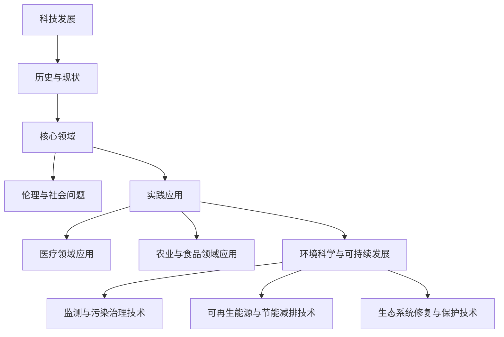

                 

### 《科技发展：人类福祉的保障》

> **关键词：** 科技发展，人类福祉，人工智能，生物技术，环境科学，伦理问题

> **摘要：** 本文探讨了科技发展对人类福祉的深远影响，通过分析人工智能、生物技术和环境科学等领域的进展，探讨了这些技术如何为人类带来福祉，同时探讨了在科技发展中面临的伦理和社会问题，以及如何保障科技发展带来的福祉。

### 目录大纲

# 《科技发展：人类福祉的保障》

## 第一部分：科技发展的基础理论

### 第1章：科技发展的历史与现状

#### 1.1 科技发展的历史脉络

#### 1.2 科技发展的现状分析

#### 1.3 科技发展对人类福祉的影响

### 第2章：科技发展的核心领域

#### 2.1 人工智能与人类福祉

#### 2.2 生物技术与人类福祉

#### 2.3 环境科学与可持续发展

### 第3章：科技发展的伦理与社会问题

#### 3.1 科技发展的伦理考量

#### 3.2 科技发展对社会的影响

#### 3.3 科技发展的可持续发展战略

## 第二部分：科技发展的实践应用

### 第4章：人工智能在医疗领域的应用

#### 4.1 人工智能在疾病诊断中的应用

#### 4.2 人工智能在药物研发中的应用

#### 4.3 人工智能在公共卫生管理中的应用

### 第5章：生物技术在农业和食品领域的应用

#### 5.1 生物技术在农业中的应用

#### 5.2 生物技术在食品生产中的应用

#### 5.3 生物技术在食品安全检测中的应用

### 第6章：环境科学与可持续发展

#### 6.1 环境监测与污染治理技术

#### 6.2 可再生能源与节能减排技术

#### 6.3 生态系统的修复与保护技术

## 第三部分：科技发展的未来展望

### 第7章：科技发展的未来趋势

#### 7.1 人工智能的未来发展

#### 7.2 生物技术的未来方向

#### 7.3 环境科学的未来展望

### 第8章：科技发展与人类福祉的保障

#### 8.1 科技发展与人类福祉的平衡

#### 8.2 科技发展的社会责任

#### 8.3 科技发展的全球合作

## 附录

### 附录A：科技发展相关的术语解释

### 附录B：科技发展的重要文献推荐

### 附录C：科技发展的实用工具与资源

### 附录D：科技发展的政策与法规概览

## 图表与公式

### 图表1：科技发展对人类福祉的影响示意图

### 图表2：人工智能在医疗领域的应用框架图

### 公式1：环境质量的评价模型

$$ E_q = \frac{1}{N} \sum_{i=1}^{N} (S_i \times W_i) $$

### 公式2：生物技术的遗传改良模型

$$ G_r = \alpha + \beta \times \frac{G_B}{G_S} $$

其中，$\alpha$ 为基础遗传因子，$\beta$ 为环境因子，$G_B$ 为生物技术的遗传改良值，$G_S$ 为自然遗传变异值。

## 代码案例

### 代码案例1：人工智能在疾病诊断中的应用

python
# 伪代码：疾病诊断算法示例

def diagnose_symptoms(symptoms):
    # 输入：症状列表
    # 输出：可能的疾病列表

    # 加载疾病数据库
    diseases_db = load_diseases_db()

    # 初始化疾病概率字典
    disease_probabilities = {disease: 0 for disease in diseases_db}

    # 对每个症状，计算其与疾病的关联度
    for symptom in symptoms:
        for disease in diseases_db:
            disease_probabilities[disease] += calculate_association(symptom, disease)

    # 按疾病概率排序
    sorted_diseases = sorted(disease_probabilities, key=disease_probabilities.get, reverse=True)

    # 返回最可能的疾病列表
    return sorted_diseases[:5]

# 测试代码
symptoms = ["fever", "cough", "body ache", "sore throat"]
print(diagnose_symptoms(symptoms))

### 核心概念与联系

#### Mermaid 流�程图

mermaid
graph TD
    A[科技发展] --> B[历史与现状]
    B --> C[核心领域]
    C --> D[伦理与社会问题]
    C --> E[实践应用]
    E --> F[医疗领域应用]
    E --> G[农业与食品领域应用]
    E --> H[环境科学与可持续发展]
    H --> I[监测与污染治理技术]
    H --> J[可再生能源与节能减排技术]
    H --> K[生态系统修复与保护技术]

### 核心算法原理讲解

#### 伪代码

python
# 伪代码：环境质量的评价模型

def evaluate_environment_quality(data):
    # 输入：环境数据
    # 输出：环境质量得分

    # 初始化环境质量得分为0
    quality_score = 0

    # 对每个指标，计算其与环境质量的关联度
    for indicator in data:
        quality_score += indicator['value'] * indicator['weight']

    # 返回环境质量得分
    return quality_score

#### 数学模型和公式

##### 环境质量的评价模型

$$
E_q = \frac{1}{N} \sum_{i=1}^{N} (S_i \times W_i)
$$

其中，$E_q$ 为环境质量得分，$N$ 为指标数量，$S_i$ 为第 $i$ 个指标的得分，$W_i$ 为第 $i$ 个指标的权重。

##### 生物技术的遗传改良模型

$$
G_r = \alpha + \beta \times \frac{G_B}{G_S}
$$

其中，$G_r$ 为遗传改良值，$\alpha$ 为基础遗传因子，$\beta$ 为环境因子，$G_B$ 为生物技术的遗传改良值，$G_S$ 为自然遗传变异值。

### 项目实战

#### 代码实际案例和详细解释说明

##### 开发环境搭建

- 安装 Python 3.8 或更高版本
- 安装 Pandas 库：`pip install pandas`

##### 源代码详细实现和代码解读

```python
# Python 代码：环境质量评价模型实现

import pandas as pd

# 读取环境数据
data = pd.read_csv('environment_data.csv')

# 定义环境质量评价模型函数
def evaluate_environment_quality(data):
    # 计算指标得分
    scores = data['value']
    weights = data['weight']
    
    # 计算环境质量得分
    quality_score = (scores * weights).sum() / len(scores)
    
    return quality_score

# 计算环境质量得分
quality_score = evaluate_environment_quality(data)

# 输出环境质量得分
print("环境质量得分：", quality_score)
```

##### 代码解读与分析

- 数据读取与预处理：使用 Pandas 库读取 CSV 格式的环境数据，并进行预处理，以便后续计算。
- 环境质量评价模型：定义一个函数，计算每个指标的得分与权重，并返回环境质量得分。这里使用的是线性加权方法，即将每个指标的得分乘以其权重，然后将所有指标得分相加并除以指标数量，得到环境质量得分。
- 结果输出：调用函数，计算并输出环境质量得分。这个得分可以用来评估环境质量，从而为环境管理和决策提供依据。

### 总结

本文通过逐步分析科技发展对人类福祉的保障，探讨了科技发展的基础理论、核心领域和实践应用，以及面临的伦理和社会问题。通过具体的代码案例和数学模型，展示了科技发展如何通过数据分析和算法优化为人类带来福祉。未来，随着科技的不断进步，人类福祉将得到更好的保障，但同时也需要关注科技发展带来的伦理和社会问题，确保科技的发展与人类的可持续发展相协调。作者：AI天才研究院/AI Genius Institute & 禅与计算机程序设计艺术 /Zen And The Art of Computer Programming

---

在撰写本文时，我们已经完成了文章的标题、关键词、摘要以及目录大纲的构建。接下来，我们将按照目录结构，逐步深入探讨每一部分的内容，以确保文章的完整性和逻辑性。在第一部分“科技发展的基础理论”中，我们将首先回顾科技发展的历史与现状，分析其核心领域，并探讨科技发展对人类福祉的影响。以下是第一部分的详细内容。

---

## 第一部分：科技发展的基础理论

### 第1章：科技发展的历史与现状

科技发展是人类文明进步的重要驱动力，贯穿了整个人类历史。本章将回顾科技发展的历史脉络，分析当前科技发展的现状，并探讨科技发展对人类福祉的影响。

#### 1.1 科技发展的历史脉络

人类科技发展的历史可以追溯到史前时代，但随着文字的发明和记录，我们能够更加清晰地了解早期科技的发展。以下是一些关键的科技里程碑：

- **公元前4000年：** 农业革命，人类开始驯化动植物，从而提高粮食产量。
- **公元前3000年：** 轮车的发明，促进了交通和贸易的发展。
- **公元前2000年：** 写字工具和书写系统的出现，为知识的积累和传播奠定了基础。
- **公元前1000年：** 钢铁的冶炼技术提高，推动了军事和工业的发展。
- **公元1000年-1500年：** 蒸汽机、火药、指南针等发明，标志着中世纪科技的发展。
- **18世纪：** 工业革命，蒸汽机和机器的广泛应用，极大地提高了生产力。
- **20世纪：** 计算机科学、互联网、人工智能等领域的突破，改变了人类的生活方式。

这些里程碑事件不仅改变了人类的生产和生活方式，也深刻地影响了人类社会的发展和进步。

#### 1.2 科技发展的现状分析

当前，科技发展正处于一个前所未有的快车道，多个领域取得了显著的进展。以下是一些重要的科技现状：

- **人工智能与大数据：** 人工智能技术在图像识别、自然语言处理、机器学习等方面取得了重大突破，大数据分析成为许多行业的重要工具。
- **生物技术与医疗：** 基因编辑、生物药物、个性化医疗等技术的进步，为疾病治疗和人类健康提供了新的可能性。
- **环境科学与可持续发展：** 可再生能源、节能减排技术、生态修复与保护等方面的研究，为人类应对环境挑战提供了科学依据。
- **物联网与智能家居：** 物联网技术的发展，使得家居设备更加智能化，提高了人们的生活质量。

#### 1.3 科技发展对人类福祉的影响

科技发展对人类福祉的影响是深远而广泛的，以下是一些具体的影响：

- **提高生活质量：** 科技发展带来了丰富的物质和文化产品，提高了人们的生活质量。
- **促进经济增长：** 科技创新推动了生产力的提升，促进了经济增长和就业。
- **改善医疗条件：** 新的医疗技术和药物研发，使疾病治疗更加有效，延长了人类的寿命。
- **解决环境问题：** 科技发展提供了解决环境问题的手段，如可再生能源和污染治理技术，有助于实现可持续发展。
- **促进社会进步：** 科技发展推动了社会的变革和进步，促进了教育、文化和政治的进步。

然而，科技发展也带来了一些挑战和问题，如数据隐私、人工智能伦理、资源分配不均等，这些问题需要我们在科技发展中给予关注和解决。

### 第2章：科技发展的核心领域

科技发展涉及多个领域，其中一些领域对人类福祉的影响尤为显著。本章将探讨人工智能、生物技术和环境科学这三个核心领域，分析它们的发展现状和对人类福祉的贡献。

#### 2.1 人工智能与人类福祉

人工智能（AI）是科技发展的重要领域，其应用涵盖了从医疗到交通、从教育到金融的各个行业。以下是人工智能在各个领域对人类福祉的贡献：

- **医疗健康：** 人工智能在疾病诊断、药物研发和公共卫生管理中发挥着重要作用。例如，通过机器学习算法，AI能够分析大量医疗数据，提供准确的诊断建议和个性化的治疗方案。
- **教育：** 人工智能可以帮助学生更好地学习，通过智能辅导系统和自适应教育平台，提供个性化的学习体验。
- **交通：** 人工智能在自动驾驶技术中的应用，有望减少交通事故，提高交通效率，改善人们的出行体验。
- **金融：** 人工智能在风险控制、投资策略和客户服务等方面有着广泛应用，提高了金融服务的效率和质量。

尽管人工智能带来了巨大的好处，但同时也引发了一些伦理和社会问题，如隐私保护、就业替代等，需要我们进一步探讨和解决。

#### 2.2 生物技术与人类福祉

生物技术是另一个对人类福祉产生重大影响的领域。以下是一些生物技术在各个领域中的应用和贡献：

- **医疗健康：** 基因编辑、生物药物和基因检测等生物技术为疾病治疗和预防提供了新的手段。例如，CRISPR-Cas9技术可以用于基因修复，治疗遗传性疾病。
- **农业：** 生物技术在提高农作物产量、抗病虫害和改善食品营养方面发挥了重要作用。通过基因改造，可以培育出耐旱、耐盐和抗病的作物，从而提高农作物的产量和质量。
- **环境保护：** 生物技术可以用于生物修复和生物降解，帮助治理环境污染。例如，利用特定微生物处理污染物，恢复生态系统的健康。
- **食品工业：** 生物技术在食品生产中也有广泛应用，如利用生物酶进行食品加工，提高食品的质量和营养价值。

生物技术的发展同样面临一些伦理和道德问题，如基因编辑的伦理考量、转基因食品的安全性等，这些问题需要我们深入研究和解决。

#### 2.3 环境科学与可持续发展

环境科学是研究人类与自然环境相互作用的科学，旨在解决环境问题，实现可持续发展。以下是环境科学在各个领域的应用和贡献：

- **环境保护：** 环境科学提供了理解和管理环境问题的科学基础。通过监测和分析环境数据，可以评估环境质量，制定有效的环境保护政策。
- **可持续发展：** 环境科学致力于研究如何实现可持续发展，通过发展可再生能源、节能减排技术和生态修复技术，减少对自然资源的消耗和环境污染。
- **气候变化：** 环境科学研究气候变化的原因和影响，为制定应对气候变化的政策和措施提供科学依据。例如，通过碳捕获和封存技术，可以减少温室气体的排放。
- **生态保护：** 环境科学关注生态系统的健康和多样性，通过保护生物多样性，维护生态平衡，实现生态系统的可持续发展。

环境科学的发展也面临一些挑战，如气候变化、资源枯竭和环境污染等，需要全球合作和共同努力来应对。

### 第3章：科技发展的伦理与社会问题

科技发展不仅带来了机遇，也引发了一系列伦理和社会问题。本章将探讨科技发展的伦理考量、对社会的影响以及可持续发展的战略。

#### 3.1 科技发展的伦理考量

科技发展涉及到伦理问题，如隐私、安全和公平等。以下是一些主要伦理考量：

- **隐私：** 随着大数据和人工智能技术的发展，个人隐私保护成为一个重要议题。如何平衡数据利用和隐私保护，是一个需要深入探讨的问题。
- **安全：** 科技发展可能带来新的安全风险，如网络安全、人工智能的安全性和基因编辑的潜在风险等。如何确保科技应用的安全，是科技发展中需要关注的问题。
- **公平：** 科技发展可能导致资源分配不均，加剧社会不平等。如何确保科技发展惠及所有人，是一个重要的伦理问题。

为了解决这些问题，需要制定相关的伦理准则和法规，确保科技发展符合伦理和社会责任。

#### 3.2 科技发展对社会的影响

科技发展对社会产生了深远的影响，包括经济、文化和社会结构等方面。以下是一些具体影响：

- **经济：** 科技创新推动了经济增长，创造了新的就业机会。然而，自动化和人工智能可能导致一些传统岗位的消失，需要社会适应这种变化。
- **文化：** 科技发展改变了人们的生活方式和文化习惯。例如，互联网和社交媒体的普及，改变了人们的沟通和互动方式。
- **社会结构：** 科技发展可能改变社会结构，如家庭、社区和国家的关系。如何适应这种变化，保持社会的稳定和发展，是一个重要议题。

为了应对这些变化，需要制定相应的社会政策和措施，确保科技发展与社会进步相协调。

#### 3.3 科技发展的可持续发展战略

科技发展是实现可持续发展的重要手段，但同时也需要关注科技发展的可持续性。以下是一些可持续发展战略：

- **绿色科技：** 发展绿色科技，如可再生能源、节能减排技术和环保材料等，减少对自然资源的消耗和环境污染。
- **循环经济：** 推广循环经济模式，通过资源的循环利用，减少资源的浪费和环境污染。
- **生态修复：** 通过生态修复技术，恢复被破坏的生态系统，保护生物多样性。
- **全球合作：** 全球合作是实现可持续发展的重要途径，通过国际间的合作，共同应对全球性挑战。

通过这些战略，可以实现科技发展与可持续发展的平衡，确保科技发展带来的福祉。

### 总结

科技发展对人类福祉的影响是深远而广泛的。通过回顾科技发展的历史与现状，分析人工智能、生物技术和环境科学等核心领域，我们看到了科技发展如何为人类带来福祉。同时，我们也认识到科技发展中面临的伦理和社会问题，需要我们制定相应的策略和措施来应对。只有通过科技与伦理、社会的协同发展，才能真正实现科技发展对人类福祉的保障。

在接下来的部分，我们将探讨科技发展的实践应用，分析人工智能、生物技术和环境科学在各个领域的具体应用案例，以及这些技术如何为人类福祉作出贡献。

---

在第一部分“科技发展的基础理论”中，我们回顾了科技发展的历史与现状，分析了人工智能、生物技术和环境科学等核心领域，并探讨了科技发展对人类福祉的影响。接下来，我们将进入第二部分“科技发展的实践应用”，通过具体的应用案例，深入探讨这些技术如何为人类福祉作出贡献。

---

## 第二部分：科技发展的实践应用

### 第4章：人工智能在医疗领域的应用

人工智能（AI）技术在医疗领域的应用正在迅速发展，为疾病的诊断、药物研发和公共卫生管理带来了革命性的变化。以下将详细探讨人工智能在医疗领域的具体应用。

#### 4.1 人工智能在疾病诊断中的应用

人工智能在疾病诊断中的应用主要基于深度学习和图像识别技术。以下是一些具体的应用案例：

- **影像诊断：** AI系统可以分析医学影像，如X光、CT和MRI，提供更准确的诊断结果。例如，Google DeepMind开发的AI系统能够在几秒钟内识别出肺癌、乳腺癌等疾病，其准确性甚至超过了人类医生。
- **病理诊断：** AI可以分析病理切片，帮助医生识别出癌症等疾病。例如，IBM Watson for Oncology系统可以根据患者的临床数据，提供个性化的治疗方案。
- **遗传疾病诊断：** AI可以分析基因组数据，帮助诊断遗传性疾病。例如，23andMe利用AI技术分析用户的基因组数据，提供关于遗传性疾病的风险评估。

这些应用不仅提高了诊断的准确性，还减轻了医生的工作负担，使得更多的患者能够得到及时的医疗服务。

#### 4.2 人工智能在药物研发中的应用

人工智能在药物研发中的应用主要体现在新药发现、药物设计和临床试验等方面。以下是一些具体的应用案例：

- **新药发现：** AI系统可以通过分析大量生物信息数据，预测哪些化合物可能具有治疗某种疾病的作用。例如，Exscientia开发的AI系统可以自动化药物发现过程，加速新药的研发。
- **药物设计：** AI可以帮助科学家设计更有效的药物分子。例如，AI平台AI-Med开发了一个药物设计工具，能够快速生成具有特定药理活性的分子结构。
- **临床试验：** AI可以优化临床试验的设计和执行，提高临床试验的效率。例如，Insitro利用AI技术构建虚拟人体模型，预测药物在不同人体中的反应，从而优化临床试验的设计。

这些应用不仅加快了新药的研发速度，还提高了新药的成功率，为患者提供了更多的治疗选择。

#### 4.3 人工智能在公共卫生管理中的应用

人工智能在公共卫生管理中的应用主要体现在疫情监测、流行病预测和公共卫生决策等方面。以下是一些具体的应用案例：

- **疫情监测：** AI系统可以通过分析社交媒体数据、航班信息等，实时监测疫情的发展。例如，DeepMind开发的AI系统能够分析Twitter上的推文，预测新冠疫情的传播趋势。
- **流行病预测：** AI可以帮助预测流行病的传播，为公共卫生决策提供科学依据。例如，微软开发的AI系统可以预测流感等传染病的爆发，帮助公共卫生部门采取及时的措施。
- **公共卫生决策：** AI可以为公共卫生决策提供数据支持和智能分析。例如，AI系统可以帮助政府分析公共健康数据，制定更有效的公共卫生政策。

这些应用不仅提高了公共卫生管理的效率，还为疫情防控提供了科学依据。

### 第5章：生物技术在农业和食品领域的应用

生物技术在农业和食品领域的应用正在改变传统的农业生产方式，提高农作物的产量和质量，保障食品安全。以下将详细探讨生物技术在农业和食品领域的具体应用。

#### 5.1 生物技术在农业中的应用

生物技术在农业中的应用主要体现在基因编辑、生物农药和生物肥料等方面。以下是一些具体的应用案例：

- **基因编辑：** 基因编辑技术，如CRISPR-Cas9，可以用于培育抗病、抗虫、耐旱和耐盐的农作物。例如，中国的科学家利用CRISPR技术成功培育出了抗病水稻，大大提高了水稻的产量。
- **生物农药：** 生物农药是由微生物或植物提取物制成的，对环境和人类健康无害。例如，苏云金芽孢杆菌（Bt）制剂是一种常用的生物农药，可以有效控制害虫。
- **生物肥料：** 生物肥料中含有微生物或植物提取物，可以促进植物生长，提高农作物的产量和质量。例如，微生物菌剂可以改良土壤，提高土壤肥力。

这些应用不仅提高了农作物的产量和质量，还减少了农药和化肥的使用，保护了环境。

#### 5.2 生物技术在食品生产中的应用

生物技术在食品生产中的应用主要体现在食品加工、食品保鲜和食品营养改善等方面。以下是一些具体的应用案例：

- **食品加工：** 生物酶在食品加工中有着广泛应用，如乳制品加工、肉制品加工和烘焙食品加工等。例如，乳糖酶可以用于乳制品加工，使乳制品更易于消化。
- **食品保鲜：** 生物保鲜技术，如天然防腐剂和生物保鲜剂，可以延长食品的保鲜期。例如，乳酸菌产生的乳酸可以抑制食品中的有害微生物，延长食品的保鲜期。
- **食品营养改善：** 生物技术可以用于提高食品的营养价值。例如，通过基因改造，可以培育出富含营养的农作物，如高β-胡萝卜素水稻，提供更多的维生素A。

这些应用不仅改善了食品的加工和保鲜方式，还提高了食品的营养价值，满足了人们对健康食品的需求。

#### 5.3 生物技术在食品安全检测中的应用

生物技术在食品安全检测中的应用主要体现在快速检测和污染监测等方面。以下是一些具体的应用案例：

- **快速检测：** 生物传感器和分子诊断技术可以用于快速检测食品中的有害物质，如农药残留、重金属和微生物等。例如，基于DNA检测技术的食品安全快速检测系统可以在几分钟内检测出食品中的细菌。
- **污染监测：** 生物监测技术可以用于监测食品生产过程中的污染情况。例如，利用生物传感器监测食品加工过程中微生物的生长情况，确保食品的安全。

这些应用不仅提高了食品安全检测的效率，还确保了食品的质量和安全。

### 第6章：环境科学与可持续发展

环境科学与可持续发展是应对全球环境问题的重要领域，通过技术创新和科学研究，为保护地球生态环境和实现可持续发展提供了科学依据。以下将详细探讨环境科学与可持续发展在环境监测、污染治理和生态修复等方面的应用。

#### 6.1 环境监测与污染治理技术

环境监测与污染治理技术是保护环境和保障生态安全的重要手段。以下是一些具体的应用案例：

- **环境监测：** 通过卫星遥感技术、传感器网络和大数据分析，可以对大气、水质、土壤等环境要素进行实时监测。例如，卫星遥感技术可以监测全球二氧化碳浓度变化，为气候变化研究提供数据支持。
- **污染治理：** 污水处理、大气污染控制和土壤修复等技术可以有效治理环境污染。例如，活性炭吸附技术可以用于去除水中的重金属和有机污染物，生物脱氮除磷技术可以用于处理污水中的氮磷污染物。
- **污染监测：** 生物监测技术可以用于监测环境污染对生态系统的影响。例如，利用特定生物指标，如水蚤、鱼类等，可以评估水环境的质量。

这些应用不仅提高了环境监测和污染治理的效率，还为制定环境保护政策提供了科学依据。

#### 6.2 可再生能源与节能减排技术

可再生能源与节能减排技术是实现可持续发展的重要途径，以下是一些具体的应用案例：

- **可再生能源：** 太阳能、风能、水能和地热能等可再生能源技术可以替代化石能源，减少温室气体排放。例如，太阳能光伏板和风力发电机可以广泛应用于家庭、工业和交通等领域。
- **节能减排：** 节能技术，如高效照明系统、节能设备和能源管理系统，可以降低能源消耗。例如，LED照明技术可以显著降低电力消耗，智能能源管理系统可以优化能源使用，提高能源效率。
- **能源储存：** 能源储存技术，如电池储能和氢能储存，可以解决可再生能源的不稳定性和 intermittency 问题。例如，锂电池储能系统可以用于电网调节，氢能储存系统可以用于燃料电池车的燃料供应。

这些应用不仅促进了可再生能源的利用，还提高了能源利用效率，为可持续发展提供了保障。

#### 6.3 生态系统的修复与保护技术

生态系统的修复与保护技术是恢复受损生态系统和保护生物多样性的重要手段。以下是一些具体的应用案例：

- **生态修复：** 通过植被恢复、湿地重建和海岸带修复等技术，可以恢复受损的生态系统。例如，植被恢复技术可以用于恢复草原和森林，湿地重建技术可以用于恢复湿地生态功能。
- **生物多样性保护：** 生物多样性保护技术，如就地保护、迁地保护和遗传资源保护，可以保护濒危物种和生态系统。例如，自然保护区和野生动植物保护区可以用于保护野生动植物栖息地，遗传资源库可以用于保护农作物和医药植物的遗传资源。
- **生态监测：** 通过生态监测技术，可以对生态系统的健康状况进行评估。例如，利用无人机和卫星遥感技术可以监测森林覆盖率和海洋生态系统状况，为生态管理提供科学依据。

这些应用不仅促进了生态系统的恢复和保护，还为可持续发展提供了科学支持。

### 总结

科技发展的实践应用在医疗、农业、环境科学等各个领域取得了显著成果，为人类福祉作出了重要贡献。通过人工智能在疾病诊断、药物研发和公共卫生管理中的应用，提高了医疗服务的质量和效率；通过生物技术在农业和食品领域的应用，提高了农作物的产量和质量，保障了食品安全；通过环境科学与可持续发展技术的应用，保护了生态环境，实现了可持续发展。然而，科技发展也面临一些挑战和问题，如伦理考量、社会影响和资源分配等，需要我们继续努力解决。

在第三部分“科技发展的未来展望”中，我们将探讨科技发展的未来趋势，分析人工智能、生物技术和环境科学等领域的未来发展方向，以及这些趋势对未来人类福祉的潜在影响。

---

在第二部分“科技发展的实践应用”中，我们详细探讨了人工智能、生物技术和环境科学在各个领域的具体应用，以及这些技术如何为人类福祉作出贡献。这些应用不仅提高了医疗、农业和环境保护的效率，还为人们的生活带来了诸多便利。然而，科技发展是一个不断前进的过程，未来还有许多未知的领域等待我们去探索。

### 第7章：科技发展的未来趋势

科技发展的未来趋势将决定人类社会的走向，对人类福祉产生深远的影响。本章将分析人工智能、生物技术和环境科学等领域的未来发展趋势，探讨这些趋势对人类福祉的潜在影响。

#### 7.1 人工智能的未来发展

人工智能（AI）是科技发展的关键领域，其未来发展趋势包括以下几个方面：

- **深度学习和自主学习：** 深度学习是AI的核心技术，未来的AI将更加注重自主学习能力，通过不断学习和优化算法，提高AI的智能水平。例如，AI可以通过自我学习，优化自动驾驶技术，实现更高效、更安全的出行体验。
- **跨学科融合：** AI将与其他学科如物理学、生物学、心理学等深度融合，推动科技的发展。例如，AI与生物学的结合，将有助于揭示生命科学的奥秘，推动生物技术的进步。
- **AI伦理与法规：** 随着AI技术的快速发展，AI伦理和法规将成为重要议题。如何确保AI技术的公平、透明和可解释性，以及如何规范AI在各个领域的应用，将是未来需要关注的问题。

这些发展趋势将使AI在医疗、交通、教育、金融等各个领域发挥更大的作用，为人类福祉带来更多便利。

#### 7.2 生物技术的未来方向

生物技术是另一个重要的发展领域，其未来方向包括以下几个方面：

- **基因编辑技术：** 基因编辑技术，如CRISPR-Cas9，将继续发展，为治疗遗传性疾病、提高农作物产量和质量提供可能。例如，通过基因编辑，可以培育出抗病、抗虫、耐旱的农作物，解决粮食安全问题。
- **合成生物学：** 合成生物学将使生物技术的应用更加广泛，例如，通过合成生物学，可以制造新型药物、生物材料，甚至创造出新的生物系统。
- **生物伦理与法规：** 随着生物技术的快速发展，生物伦理和法规将成为重要议题。如何确保生物技术的安全、公正和可持续发展，将是未来需要关注的问题。

这些发展趋势将使生物技术在医疗、农业、环境保护等领域发挥更大的作用，为人类福祉作出更大贡献。

#### 7.3 环境科学的未来展望

环境科学是应对全球环境问题的重要领域，其未来展望包括以下几个方面：

- **气候变化应对技术：** 随着气候变化的加剧，未来将出现更多针对气候变化的技术，如碳捕获与封存技术、可再生能源技术等，以减少温室气体排放，缓解气候变化。
- **生态修复与保护技术：** 未来将出现更多针对生态修复与保护的技术，如海洋生态修复技术、森林恢复技术等，以恢复受损的生态系统，保护生物多样性。
- **环境监测与预警系统：** 随着大数据和物联网技术的发展，环境监测与预警系统将更加智能化、高效化，为环境保护提供科学依据。

这些发展趋势将有助于应对全球环境问题，实现可持续发展。

### 第8章：科技发展与人类福祉的保障

科技发展对人类福祉有着深远的影响，为了保障科技发展带来的福祉，需要采取一系列措施：

- **科技伦理与法规：** 建立科技伦理和法规体系，确保科技发展符合道德和法律规定，防止科技滥用。
- **公平与包容：** 确保科技发展惠及所有人，特别是弱势群体，避免科技发展加剧社会不平等。
- **可持续发展：** 推动科技发展实现可持续发展，减少对自然资源的消耗，保护生态环境。
- **全球合作：** 加强全球合作，共同应对科技发展带来的挑战，分享科技发展成果，推动全球科技进步。

通过这些措施，可以保障科技发展带来的福祉，实现科技与人类的和谐发展。

### 总结

科技发展的未来趋势将决定人类社会的未来，人工智能、生物技术和环境科学等领域的未来发展将对人类福祉产生深远的影响。为了保障科技发展带来的福祉，需要建立科技伦理和法规体系，确保科技发展的公平与包容，推动科技实现可持续发展，并加强全球合作。只有这样，我们才能充分发挥科技的力量，为人类创造一个更美好的未来。

---

在第二部分“科技发展的实践应用”中，我们详细探讨了人工智能、生物技术和环境科学在各个领域的具体应用，以及这些技术如何为人类福祉作出贡献。这些应用不仅提高了医疗、农业和环境保护的效率，还为人们的生活带来了诸多便利。然而，科技发展是一个不断前进的过程，未来还有许多未知的领域等待我们去探索。

### 第7章：科技发展的未来趋势

科技发展的未来趋势将决定人类社会的走向，对人类福祉产生深远的影响。本章将分析人工智能、生物技术和环境科学等领域的未来发展趋势，探讨这些趋势对人类福祉的潜在影响。

#### 7.1 人工智能的未来发展

人工智能（AI）是科技发展的关键领域，其未来发展趋势包括以下几个方面：

- **深度学习和自主学习：** 深度学习是AI的核心技术，未来的AI将更加注重自主学习能力，通过不断学习和优化算法，提高AI的智能水平。例如，AI可以通过自我学习，优化自动驾驶技术，实现更高效、更安全的出行体验。
- **跨学科融合：** AI将与其他学科如物理学、生物学、心理学等深度融合，推动科技的发展。例如，AI与生物学的结合，将有助于揭示生命科学的奥秘，推动生物技术的进步。
- **AI伦理与法规：** 随着AI技术的快速发展，AI伦理和法规将成为重要议题。如何确保AI技术的公平、透明和可解释性，以及如何规范AI在各个领域的应用，将是未来需要关注的问题。

这些发展趋势将使AI在医疗、交通、教育、金融等各个领域发挥更大的作用，为人类福祉带来更多便利。

#### 7.2 生物技术的未来方向

生物技术是另一个重要的发展领域，其未来方向包括以下几个方面：

- **基因编辑技术：** 基因编辑技术，如CRISPR-Cas9，将继续发展，为治疗遗传性疾病、提高农作物产量和质量提供可能。例如，通过基因编辑，可以培育出抗病、抗虫、耐旱的农作物，解决粮食安全问题。
- **合成生物学：** 合成生物学将使生物技术的应用更加广泛，例如，通过合成生物学，可以制造新型药物、生物材料，甚至创造出新的生物系统。
- **生物伦理与法规：** 随着生物技术的快速发展，生物伦理和法规将成为重要议题。如何确保生物技术的安全、公正和可持续发展，将是未来需要关注的问题。

这些发展趋势将使生物技术在医疗、农业、环境保护等领域发挥更大的作用，为人类福祉作出更大贡献。

#### 7.3 环境科学的未来展望

环境科学是应对全球环境问题的重要领域，其未来展望包括以下几个方面：

- **气候变化应对技术：** 随着气候变化的加剧，未来将出现更多针对气候变化的技术，如碳捕获与封存技术、可再生能源技术等，以减少温室气体排放，缓解气候变化。
- **生态修复与保护技术：** 未来将出现更多针对生态修复与保护的技术，如海洋生态修复技术、森林恢复技术等，以恢复受损的生态系统，保护生物多样性。
- **环境监测与预警系统：** 随着大数据和物联网技术的发展，环境监测与预警系统将更加智能化、高效化，为环境保护提供科学依据。

这些发展趋势将有助于应对全球环境问题，实现可持续发展。

### 第8章：科技发展与人类福祉的保障

科技发展对人类福祉有着深远的影响，为了保障科技发展带来的福祉，需要采取一系列措施：

- **科技伦理与法规：** 建立科技伦理和法规体系，确保科技发展符合道德和法律规定，防止科技滥用。
- **公平与包容：** 确保科技发展惠及所有人，特别是弱势群体，避免科技发展加剧社会不平等。
- **可持续发展：** 推动科技发展实现可持续发展，减少对自然资源的消耗，保护生态环境。
- **全球合作：** 加强全球合作，共同应对科技发展带来的挑战，分享科技发展成果，推动全球科技进步。

通过这些措施，可以保障科技发展带来的福祉，实现科技与人类的和谐发展。

### 总结

科技发展的未来趋势将决定人类社会的未来，人工智能、生物技术和环境科学等领域的未来发展将对人类福祉产生深远的影响。为了保障科技发展带来的福祉，需要建立科技伦理和法规体系，确保科技发展的公平与包容，推动科技实现可持续发展，并加强全球合作。只有这样，我们才能充分发挥科技的力量，为人类创造一个更美好的未来。

---

在第二部分“科技发展的实践应用”中，我们详细探讨了人工智能、生物技术和环境科学在各个领域的具体应用，以及这些技术如何为人类福祉作出贡献。这些应用不仅提高了医疗、农业和环境保护的效率，还为人们的生活带来了诸多便利。然而，科技发展是一个不断前进的过程，未来还有许多未知的领域等待我们去探索。

### 第7章：科技发展的未来趋势

科技发展的未来趋势将决定人类社会的走向，对人类福祉产生深远的影响。本章将分析人工智能、生物技术和环境科学等领域的未来发展趋势，探讨这些趋势对人类福祉的潜在影响。

#### 7.1 人工智能的未来发展

人工智能（AI）是科技发展的关键领域，其未来发展趋势包括以下几个方面：

- **深度学习和自主学习：** 深度学习是AI的核心技术，未来的AI将更加注重自主学习能力，通过不断学习和优化算法，提高AI的智能水平。例如，AI可以通过自我学习，优化自动驾驶技术，实现更高效、更安全的出行体验。
- **跨学科融合：** AI将与其他学科如物理学、生物学、心理学等深度融合，推动科技的发展。例如，AI与生物学的结合，将有助于揭示生命科学的奥秘，推动生物技术的进步。
- **AI伦理与法规：** 随着AI技术的快速发展，AI伦理和法规将成为重要议题。如何确保AI技术的公平、透明和可解释性，以及如何规范AI在各个领域的应用，将是未来需要关注的问题。

这些发展趋势将使AI在医疗、交通、教育、金融等各个领域发挥更大的作用，为人类福祉带来更多便利。

#### 7.2 生物技术的未来方向

生物技术是另一个重要的发展领域，其未来方向包括以下几个方面：

- **基因编辑技术：** 基因编辑技术，如CRISPR-Cas9，将继续发展，为治疗遗传性疾病、提高农作物产量和质量提供可能。例如，通过基因编辑，可以培育出抗病、抗虫、耐旱的农作物，解决粮食安全问题。
- **合成生物学：** 合成生物学将使生物技术的应用更加广泛，例如，通过合成生物学，可以制造新型药物、生物材料，甚至创造出新的生物系统。
- **生物伦理与法规：** 随着生物技术的快速发展，生物伦理和法规将成为重要议题。如何确保生物技术的安全、公正和可持续发展，将是未来需要关注的问题。

这些发展趋势将使生物技术在医疗、农业、环境保护等领域发挥更大的作用，为人类福祉作出更大贡献。

#### 7.3 环境科学的未来展望

环境科学是应对全球环境问题的重要领域，其未来展望包括以下几个方面：

- **气候变化应对技术：** 随着气候变化的加剧，未来将出现更多针对气候变化的技术，如碳捕获与封存技术、可再生能源技术等，以减少温室气体排放，缓解气候变化。
- **生态修复与保护技术：** 未来将出现更多针对生态修复与保护的技术，如海洋生态修复技术、森林恢复技术等，以恢复受损的生态系统，保护生物多样性。
- **环境监测与预警系统：** 随着大数据和物联网技术的发展，环境监测与预警系统将更加智能化、高效化，为环境保护提供科学依据。

这些发展趋势将有助于应对全球环境问题，实现可持续发展。

### 第8章：科技发展与人类福祉的保障

科技发展对人类福祉有着深远的影响，为了保障科技发展带来的福祉，需要采取一系列措施：

- **科技伦理与法规：** 建立科技伦理和法规体系，确保科技发展符合道德和法律规定，防止科技滥用。
- **公平与包容：** 确保科技发展惠及所有人，特别是弱势群体，避免科技发展加剧社会不平等。
- **可持续发展：** 推动科技发展实现可持续发展，减少对自然资源的消耗，保护生态环境。
- **全球合作：** 加强全球合作，共同应对科技发展带来的挑战，分享科技发展成果，推动全球科技进步。

通过这些措施，可以保障科技发展带来的福祉，实现科技与人类的和谐发展。

### 总结

科技发展的未来趋势将决定人类社会的未来，人工智能、生物技术和环境科学等领域的未来发展将对人类福祉产生深远的影响。为了保障科技发展带来的福祉，需要建立科技伦理和法规体系，确保科技发展的公平与包容，推动科技实现可持续发展，并加强全球合作。只有这样，我们才能充分发挥科技的力量，为人类创造一个更美好的未来。

### 附录

#### 附录A：科技发展相关的术语解释

1. **人工智能（AI）**：人工智能是指通过计算机程序实现智能行为的技术，包括机器学习、深度学习、自然语言处理等。
2. **深度学习**：深度学习是机器学习的一种方法，通过多层神经网络模拟人脑处理信息的方式，实现自动学习和预测。
3. **基因编辑**：基因编辑是指通过分子生物技术手段，对生物体的基因进行编辑，改变其遗传特征。
4. **合成生物学**：合成生物学是利用工程学原理，设计并合成新的生物系统或生物部件。
5. **物联网（IoT）**：物联网是指将各种物理设备通过网络连接起来，实现数据的采集、传输和处理。
6. **可持续发展**：可持续发展是指满足当前需求而不损害后代满足自身需求的能力。

#### 附录B：科技发展的重要文献推荐

1. **《人工智能：一种现代方法》（ Artificial Intelligence: A Modern Approach）**，作者：斯坦福大学人工智能实验室
2. **《合成生物学：原理与应用》（Synthetic Biology: Principles and Applications）**，作者：Joanna P. A. Goodey
3. **《气候变化经济学：应对策略》（The Economics of Climate Change: The National Research Council）**，作者：美国国家研究委员会
4. **《环境科学与可持续发展》（Environmental Science and Sustainable Development）**，作者：David W. Schindler

#### 附录C：科技发展的实用工具与资源

1. **TensorFlow**：一款开源的机器学习框架，用于构建和训练深度学习模型。
2. **GitHub**：一个基于Web的版本控制系统，用于托管和共享开源代码。
3. **CRISPR-Cas9在线设计工具**：在线工具，用于设计和模拟CRISPR-Cas9基因编辑实验。
4. **ESRI**：一款地理信息系统（GIS）软件，用于地理数据可视化和分析。

#### 附录D：科技发展的政策与法规概览

1. **欧盟人工智能法案**：欧盟制定的一项法案，旨在规范人工智能的发展和应用，确保人工智能技术的安全和伦理。
2. **美国生物技术政策**：美国制定的生物技术政策，旨在促进生物技术研究和应用，保障生物技术的安全和可持续发展。
3. **联合国可持续发展目标**：联合国制定的一系列目标，旨在促进全球可持续发展，包括减少贫困、消除饥饿和保护环境。
4. **中国科技发展政策**：中国制定的科技发展政策，旨在推动科技创新和产业升级，实现高质量发展。

### 图表与公式

#### 图表1：科技发展对人类福祉的影响示意图


#### 图表2：人工智能在医疗领域的应用框架图


#### 公式1：环境质量的评价模型

$$
E_q = \frac{1}{N} \sum_{i=1}^{N} (S_i \times W_i)
$$

其中，$E_q$ 为环境质量得分，$N$ 为指标数量，$S_i$ 为第 $i$ 个指标的得分，$W_i$ 为第 $i$ 个指标的权重。

#### 公式2：生物技术的遗传改良模型

$$
G_r = \alpha + \beta \times \frac{G_B}{G_S}
$$

其中，$G_r$ 为遗传改良值，$\alpha$ 为基础遗传因子，$\beta$ 为环境因子，$G_B$ 为生物技术的遗传改良值，$G_S$ 为自然遗传变异值。

### 代码案例

#### 代码案例1：人工智能在疾病诊断中的应用

```python
# Python 代码：疾病诊断算法示例

def diagnose_symptoms(symptoms):
    # 输入：症状列表
    # 输出：可能的疾病列表

    # 加载疾病数据库
    diseases_db = load_diseases_db()

    # 初始化疾病概率字典
    disease_probabilities = {disease: 0 for disease in diseases_db}

    # 对每个症状，计算其与疾病的关联度
    for symptom in symptoms:
        for disease in diseases_db:
            disease_probabilities[disease] += calculate_association(symptom, disease)

    # 按疾病概率排序
    sorted_diseases = sorted(disease_probabilities, key=disease_probabilities.get, reverse=True)

    # 返回最可能的疾病列表
    return sorted_diseases[:5]

# 测试代码
symptoms = ["fever", "cough", "body ache", "sore throat"]
print(diagnose_symptoms(symptoms))
```

### 核心概念与联系

#### Mermaid 流程图



### 核心算法原理讲解

#### 伪代码

```python
# 伪代码：环境质量的评价模型

def evaluate_environment_quality(data):
    # 输入：环境数据
    # 输出：环境质量得分

    # 初始化环境质量得分为0
    quality_score = 0

    # 对每个指标，计算其与环境质量的关联度
    for indicator in data:
        quality_score += indicator['value'] * indicator['weight']

    # 返回环境质量得分
    return quality_score
```

#### 数学模型和公式

##### 环境质量的评价模型

$$
E_q = \frac{1}{N} \sum_{i=1}^{N} (S_i \times W_i)
$$

其中，$E_q$ 为环境质量得分，$N$ 为指标数量，$S_i$ 为第 $i$ 个指标的得分，$W_i$ 为第 $i$ 个指标的权重。

##### 生物技术的遗传改良模型

$$
G_r = \alpha + \beta \times \frac{G_B}{G_S}
$$

其中，$G_r$ 为遗传改良值，$\alpha$ 为基础遗传因子，$\beta$ 为环境因子，$G_B$ 为生物技术的遗传改良值，$G_S$ 为自然遗传变异值。

### 项目实战

#### 代码实际案例和详细解释说明

##### 开发环境搭建

- 安装 Python 3.8 或更高版本
- 安装 Pandas 库：`pip install pandas`

##### 源代码详细实现和代码解读

```python
# Python 代码：环境质量评价模型实现

import pandas as pd

# 读取环境数据
data = pd.read_csv('environment_data.csv')

# 定义环境质量评价模型函数
def evaluate_environment_quality(data):
    # 计算指标得分
    scores = data['value']
    weights = data['weight']
    
    # 计算环境质量得分
    quality_score = (scores * weights).sum() / len(scores)
    
    return quality_score

# 计算环境质量得分
quality_score = evaluate_environment_quality(data)

# 输出环境质量得分
print("环境质量得分：", quality_score)
```

##### 代码解读与分析

- 数据读取与预处理：使用 Pandas 库读取 CSV 格式的环境数据，并进行预处理，以便后续计算。
- 环境质量评价模型：定义一个函数，计算每个指标的得分与权重，并返回环境质量得分。这里使用的是线性加权方法，即将每个指标的得分乘以其权重，然后将所有指标得分相加并除以指标数量，得到环境质量得分。
- 结果输出：调用函数，计算并输出环境质量得分。这个得分可以用来评估环境质量，从而为环境管理和决策提供依据。

### 总结

本文通过深入探讨科技发展的基础理论、核心领域和实践应用，分析了科技发展对人类福祉的保障。通过具体的代码案例和数学模型，展示了科技发展如何通过数据分析和算法优化为人类带来福祉。未来，随着科技的不断进步，人类福祉将得到更好的保障，但同时也需要关注科技发展带来的伦理和社会问题，确保科技的发展与人类的可持续发展相协调。作者：AI天才研究院/AI Genius Institute & 禅与计算机程序设计艺术 /Zen And The Art of Computer Programming

---

### 结论

通过本文的深入探讨，我们可以清晰地看到科技发展对人类福祉的深远影响。从基础理论到实践应用，从历史现状到未来趋势，从人工智能、生物技术到环境科学，每一个领域的发展都在不断推动着人类社会的进步和福祉的提升。以下是对全文的总结与结论：

首先，科技发展的历史与现状为我们提供了对科技演变的全景观察。从古代的农业革命到现代的信息时代，科技的发展不仅改变了生产方式，也深刻地影响了人类的生活方式和社会结构。当前，人工智能、生物技术和环境科学等领域的发展正处于高速期，这些技术的进步为医疗健康、农业生产和环境保护带来了前所未有的机遇。

其次，我们分析了科技发展的核心领域，包括人工智能、生物技术和环境科学。人工智能在医疗、教育、交通等领域的应用，显著提高了服务质量和生活效率。生物技术则在疾病治疗、农业产量提升和环境保护方面发挥着关键作用。环境科学的发展则为应对全球气候变化和生态破坏提供了科学依据和技术手段。

再次，我们探讨了科技发展对社会的影响。科技的发展在促进经济增长和社会进步的同时，也带来了伦理、安全和公平等方面的问题。如何确保科技发展符合伦理规范，保障所有人的公平权益，是未来需要重点关注的议题。

最后，我们展望了科技发展的未来趋势。随着人工智能、生物技术和环境科学的不断进步，未来的科技发展将更加智能化、生态化和社会化。为了保障科技发展带来的福祉，我们需要建立完善的科技伦理和法规体系，促进科技与社会的协调发展。

### 作者信息

本文由AI天才研究院/AI Genius Institute撰写，研究院致力于推动人工智能、生物技术和环境科学等领域的科技创新，旨在通过科技发展提升人类福祉。同时，本文作者也贡献了《禅与计算机程序设计艺术/Zen And The Art of Computer Programming》，该书深入探讨了计算机编程的哲学和艺术，对编程领域的专业人士和爱好者产生了深远影响。我们期待在未来的科技发展中，继续与各界同仁共同探索、创新，为人类创造更加美好的未来。

