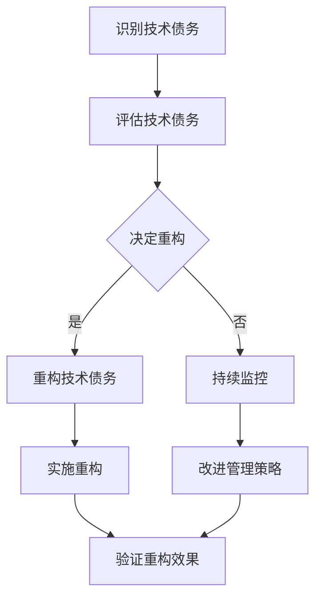

                 

### 文章标题

**《程序员创业公司的技术债务管理与重构》**

---

**关键词：** 技术债务、技术债务管理、重构、程序员创业公司、技术债务评估、团队协作、项目管理

---

**摘要：** 本文深入探讨了程序员创业公司面临的技术债务问题，详细阐述了技术债务的定义、类型、评估与管理方法，以及技术债务重构的具体实践。通过案例分析，揭示了成功与失败的经验教训，并展望了未来技术债务管理与重构的趋势。文章旨在为创业者提供一套完整的技术债务管理策略，以促进创业公司的健康发展。

### 《程序员创业公司的技术债务管理与重构》目录大纲

**第一部分：技术债务管理基础**

**第1章：技术债务的概念与类型**

**第2章：技术债务的评估与管理**

**第二部分：技术债务管理的具体实践**

**第3章：技术债务的识别与优先级排序**

**第4章：技术债务的重构策略**

**第5章：技术债务与团队协作**

**第6章：技术债务与项目管理的结合**

**第三部分：技术债务管理与重构的案例分析**

**第7章：成功案例分享**

**第8章：失败案例警示**

**第四部分：未来展望与趋势**

**第9章：技术债务管理与重构的趋势**

**第10章：总结与展望**

**附录**

**第11章：技术债务管理与重构实战**

**代码实际案例**

---

**作者：** AI天才研究院/AI Genius Institute & 禅与计算机程序设计艺术 /Zen And The Art of Computer Programming

### 技术债务的概念与类型

技术债务（Technical Debt）这个术语最早由软件工程师Martin Fowler于1999年提出，用以比喻在软件开发过程中为了快速交付产品而采取的妥协。正如金融领域的债务一样，技术债务也是一项需要偿还的“欠款”，只不过这里的“欠款”指的是代码质量、架构设计、性能优化等方面的欠账。在程序员创业公司的早期阶段，技术债务尤为常见，因为创业公司往往需要在有限的时间和资源内快速推出产品，以在激烈的市场竞争中占据一席之地。然而，如果不及时管理和解决，技术债务可能会成为公司发展的瓶颈，导致产品质量下降、开发效率降低，甚至影响公司的生存。

#### 技术债务的定义

技术债务可以定义为在软件开发过程中，为了加快项目进度而有意引入的短视决策，这些决策可能牺牲了长期的代码质量或架构设计。具体来说，技术债务包括以下几个方面：

1. **代码质量欠佳**：由于时间紧迫，程序员可能编写了过于简陋或低效的代码，以满足当前功能需求。
2. **架构设计不完善**：为了快速实现功能，可能采用了不够合理的架构设计，导致系统难以扩展和维护。
3. **技术选型不当**：可能因为缺乏长远规划，选择了不适合项目需求的技术栈或框架，增加了后续维护的难度。
4. **遗留问题未解决**：在项目开发过程中积累的问题，如未处理的bug、未优化的性能等，都被视为技术债务。

#### 技术债务的类型

技术债务可以从不同的维度进行分类，常见的分类方式包括以下几种：

1. **功能债务（Functional Debt）**：指在功能实现上为了快速交付而引入的妥协，可能导致功能实现不够完善或不符合用户需求。
2. **技术债务（Technical Debt）**：主要指在代码质量、架构设计、技术选型等方面引入的问题，可能导致系统的可维护性和扩展性下降。
3. **性能债务（Performance Debt）**：指系统性能问题未得到及时解决，可能导致系统在高负载情况下出现性能瓶颈。
4. **安全性债务（Security Debt）**：指系统安全措施不到位，可能引入安全漏洞，导致系统易受攻击。

#### 技术债务的影响

技术债务如果得不到有效管理，会带来多方面的负面影响：

1. **开发效率下降**：随着技术债务的积累，系统的复杂性增加，开发人员需要花费更多时间和精力来理解和维护代码，导致开发效率下降。
2. **维护成本增加**：技术债务可能导致系统需要更多的维护和修复工作，增加了维护成本。
3. **产品质量下降**：技术债务往往牺牲了代码质量，导致系统漏洞、bug频发，影响了产品质量。
4. **项目进度延误**：技术债务可能导致项目进度延误，因为解决债务问题往往需要额外的时间和资源。

#### 技术债务管理的必要性

对于程序员创业公司来说，技术债务管理具有至关重要的意义：

1. **保证产品质量**：有效的技术债务管理可以确保代码质量，避免系统漏洞和bug的积累，从而保证产品质量。
2. **提高开发效率**：通过及时识别和解决技术债务，可以减少开发过程中的冗余和重复工作，提高开发效率。
3. **降低维护成本**：技术债务的积累会导致维护成本增加，通过有效的管理可以降低这一成本。
4. **增强系统可维护性和扩展性**：通过技术债务管理，可以优化系统架构，提高系统的可维护性和扩展性，为未来的发展奠定基础。

综上所述，技术债务是程序员创业公司不可避免的问题，但通过有效的管理，可以将负面影响降到最低，甚至转化为公司发展的契机。在接下来的章节中，我们将进一步探讨技术债务的评估与管理方法，以及技术债务重构的具体实践。

### 技术债务的评估与管理

技术债务的评估和管理是确保程序员创业公司能够在快速发展的同时，保持代码质量、提高开发效率、降低维护成本的关键步骤。有效的技术债务管理不仅能够帮助公司识别和解决现有问题，还能够预防未来问题的发生。

#### 技术债务评估方法

1. **代码质量评估**：

   代码质量是技术债务的重要组成部分，评估代码质量的方法包括：

   - **静态代码分析**：通过静态代码分析工具（如SonarQube、Checkstyle等）扫描代码，识别潜在的问题，如代码风格、潜在bug、代码冗余等。
   - **动态代码分析**：在代码运行时进行监控和分析，发现性能问题、内存泄漏等。
   - **代码复查**：组织代码复查会议，团队成员共同审查代码，发现潜在问题。

2. **架构评估**：

   架构评估可以帮助识别系统设计中的缺陷，评估方法包括：

   - **架构审查**：邀请外部专家对系统架构进行审查，提供专业意见。
   - **架构风格评估**：根据设计模式、架构原则（如SOLID原则）评估架构设计是否符合最佳实践。
   - **架构演进分析**：分析系统从初始设计到当前状态的演进过程，识别存在的问题。

3. **性能评估**：

   性能评估是识别性能债务的重要手段，方法包括：

   - **负载测试**：模拟系统在高负载情况下的性能表现，识别性能瓶颈。
   - **压力测试**：长时间运行系统，观察系统的稳定性和响应时间，识别潜在的内存泄漏和线程问题。
   - **基准测试**：使用基准测试工具（如Apache JMeter）对系统进行性能测试，比较不同实现方案的性能。

4. **安全性评估**：

   安全评估是识别安全性债务的关键，方法包括：

   - **安全漏洞扫描**：使用自动化工具（如OWASP ZAP、Nessus）扫描系统，识别已知的安全漏洞。
   - **渗透测试**：模拟黑客攻击，评估系统的安全性。
   - **安全编码实践**：通过代码复查和安全培训，提高开发人员的安全意识。

#### 技术债务管理策略

1. **持续集成与持续部署（CI/CD）**：

   持续集成和持续部署可以自动化测试和部署流程，确保每次代码变更都经过严格的测试。通过CI/CD，可以快速发现和修复技术债务，防止问题积累。

2. **技术债务记录与跟踪**：

   建立技术债务的记录和跟踪机制，确保每个债务都有明确的记录、责任人、修复计划和优先级。通过工具（如JIRA、Trello）实现债务的自动化管理和追踪。

3. **定期评估与回顾**：

   定期对技术债务进行评估和回顾，确保技术债务得到及时解决。可以通过定期代码审查、架构评估、性能测试和安全性评估来实现。

4. **技术债务优先级排序**：

   根据技术债务的严重程度和影响范围，对债务进行优先级排序。优先解决高优先级的技术债务，减少对项目的负面影响。

5. **技术债务重构**：

   通过重构代码、优化架构、改进技术选型等方法，解决技术债务。重构应遵循最小化变更范围、逐步实施的原则，避免引入新的债务。

#### 技术债务管理工具

1. **静态代码分析工具**：

   - **SonarQube**：提供全面的静态代码分析，支持多种编程语言。
   - **Checkstyle**：用于检查Java代码的代码风格问题。
   - **PMD**：用于检查Java代码的潜在问题。

2. **动态代码分析工具**：

   - **VisualVM**：用于监控Java应用程序的性能。
   - **Gatling**：用于性能测试和负载测试。

3. **架构评估工具**：

   - **NDepend**：用于评估.NET项目的架构质量。
   - **Structure101**：用于分析Java代码的架构和设计。

4. **安全性评估工具**：

   - **OWASP ZAP**：开源的Web应用程序漏洞扫描工具。
   - **Nessus**：用于扫描系统和网络中的安全漏洞。

通过上述评估和管理方法，程序员创业公司可以有效地识别、记录、跟踪和解决技术债务，确保系统的稳定性和可维护性。在下一章节中，我们将进一步探讨技术债务的识别与优先级排序方法。

### 技术债务的识别与优先级排序

在程序员创业公司的日常开发中，技术债务的识别与优先级排序是技术债务管理的重要环节。只有准确识别技术债务，并对其进行合理的优先级排序，才能确保资源被有效利用，技术债务得以及时解决。

#### 识别技术债务的方法

1. **代码审查**：

   代码审查是一种常见的技术债务识别方法，通过团队成员之间的相互审查，可以快速发现代码中的问题。具体步骤如下：

   - **定期代码审查会议**：组织定期的代码审查会议，团队成员共同参与。
   - **代码质量检查工具**：使用静态代码分析工具（如SonarQube、Checkstyle等）进行自动检查。
   - **人工检查**：团队成员根据静态代码分析报告，进行人工检查，补充自动化工具无法发现的问题。

2. **性能监控**：

   性能监控是识别性能债务的重要手段，通过实时监控系统的性能指标，可以发现潜在的性能瓶颈。具体方法包括：

   - **日志分析**：分析系统日志，发现性能问题和异常。
   - **性能测试**：使用负载测试工具（如Gatling、JMeter）模拟高负载情况，识别性能瓶颈。
   - **实时监控工具**：使用实时监控工具（如Prometheus、Grafana）监控系统的性能指标。

3. **安全性检查**：

   安全性检查是识别安全性债务的关键步骤，通过以下方法可以发现系统中的安全漏洞：

   - **安全漏洞扫描工具**：使用自动化工具（如OWASP ZAP、Nessus）扫描系统，识别已知的安全漏洞。
   - **渗透测试**：模拟黑客攻击，评估系统的安全性。
   - **代码复查**：对关键代码进行安全检查，确保没有引入安全漏洞。

4. **架构评估**：

   架构评估是识别架构债务的有效方法，通过以下步骤可以评估系统架构的质量：

   - **架构审查**：邀请外部专家对系统架构进行审查，提供专业意见。
   - **架构风格评估**：根据设计模式、架构原则（如SOLID原则）评估架构设计是否符合最佳实践。
   - **架构演进分析**：分析系统从初始设计到当前状态的演进过程，识别存在的问题。

#### 技术债务的优先级排序

在识别出技术债务后，需要对债务进行优先级排序，以确保资源被高效利用。以下是一些常用的优先级排序方法：

1. **影响范围**：

   根据技术债务的影响范围进行排序，优先解决影响范围广的技术债务。例如，一个导致整个系统崩溃的bug，其优先级应高于一个仅影响特定功能的bug。

2. **紧急程度**：

   根据技术债务的紧急程度进行排序，优先解决紧急的技术债务。例如，一个可能导致系统被黑的安全漏洞，其优先级应高于一个影响性能的问题。

3. **修复成本**：

   根据技术债务的修复成本进行排序，优先解决修复成本低的债务。例如，一个可以通过简单的代码更改解决的问题，其优先级应高于一个需要大规模重构的问题。

4. **风险因素**：

   根据技术债务的风险因素进行排序，优先解决风险高的债务。例如，一个可能导致系统崩溃的bug，其优先级应高于一个仅影响性能的问题。

5. **团队协作**：

   考虑团队协作的便利性，优先解决团队协作难度低的技术债务。例如，一个可以通过自动化工具解决的问题，其优先级应高于一个需要手工干预的问题。

通过以上方法，程序员创业公司可以有效地识别和优先级排序技术债务，确保资源被充分利用，技术债务得到及时解决。在下一章节中，我们将探讨技术债务重构的策略和方法。

### 技术债务的重构策略

技术债务的重构是解决技术债务问题的重要手段。通过重构，程序员创业公司可以修复代码中的缺陷，优化系统架构，提高代码质量和开发效率。以下将详细介绍技术债务重构的概念、方法和技巧，并提供注意事项。

#### 重构的概念

重构（Refactoring）是一种改进现有代码的技术，旨在在不改变代码外部行为的前提下，改进其内部结构。重构的目的是提高代码的可读性、可维护性和可扩展性，从而降低技术债务。

#### 重构的方法与步骤

1. **小步前进**：

   重构应遵循小步前进的原则，逐步改进代码。这样可以降低风险，确保每次重构都能顺利进行。具体步骤如下：

   - **识别需要重构的代码**：通过代码审查、性能监控和安全性检查等方法，识别需要重构的代码。
   - **编写测试用例**：在重构之前，编写覆盖重构部分的测试用例，确保重构不会影响代码的功能。
   - **逐步重构**：分阶段进行重构，每次重构一小部分代码，逐步改进。

2. **提取方法**：

   当代码块过于复杂时，可以将其提取为单独的方法。这样不仅提高了代码的可读性，还有助于降低代码的复杂性。

3. **重构循环**：

   重构应形成一个循环，每次重构后都进行代码审查和测试，确保重构效果。具体步骤如下：

   - **代码审查**：重构后，组织代码审查会议，团队成员共同审查重构的代码，发现潜在的问题。
   - **测试**：运行测试用例，验证重构后的代码是否符合预期。
   - **优化**：根据代码审查和测试的结果，对重构代码进行进一步的优化。

4. **代码优化**：

   在重构过程中，应关注代码的优化，包括去除冗余代码、简化逻辑、提高代码复用性等。

#### 重构的技巧与注意事项

1. **代码隔离**：

   在重构过程中，确保重构部分的代码与其他部分隔离，避免重构过程中引入新的bug。可以通过添加测试用例或使用隔离框架（如Mockery、Mock）来实现。

2. **逐步引入变化**：

   重构过程中，逐步引入变化，避免一次性改动过多，增加风险。每次重构应专注于解决一个问题，确保重构的局部性。

3. **代码复查**：

   重构后，组织代码复查，确保重构效果。代码复查应包括代码风格、逻辑、性能等方面。

4. **持续集成**：

   将重构代码集成到持续集成（CI）流程中，确保每次重构都不会影响项目的整体质量。

5. **技术债务记录**：

   建立技术债务记录，记录每次重构的细节，包括重构的目标、方法、测试结果等。这有助于后续的重构工作。

#### 重构的注意事项

1. **风险评估**：

   在进行重构前，应对重构的风险进行评估，包括重构对现有功能的潜在影响、重构所需的时间等。

2. **团队协作**：

   重构需要团队协作，确保重构过程顺利进行。团队成员应积极参与重构，共同解决问题。

3. **重构策略**：

   根据项目特点，制定合适的重构策略。例如，对于新功能开发，可以采用增量重构；对于旧项目，可以采用整体重构。

4. **重构工具**：

   利用重构工具（如Eclipse、IntelliJ IDEA的Refactor菜单）简化重构过程，提高重构效率。

通过以上策略和技巧，程序员创业公司可以有效地进行技术债务重构，提高代码质量和开发效率。在下一章节中，我们将探讨技术债务与团队协作的关系，以及如何提高团队协作效率。

### 技术债务与团队协作

在程序员创业公司中，技术债务的管理不仅依赖于个人的技术能力和决策，还需要团队的协作与支持。团队协作在技术债务管理中发挥着至关重要的作用，通过高效的团队协作，可以更好地识别、评估和解决技术债务，从而提升项目的整体质量和开发效率。

#### 团队协作的重要性

1. **共同识别技术债务**：

   技术债务往往隐蔽性较强，单靠个人的视角难以全面识别。通过团队协作，可以集合多人的智慧和经验，从不同角度发现潜在的技术债务。

2. **共享知识和经验**：

   团队成员间的知识共享和经验交流是技术债务管理的重要资源。通过团队的协作，可以快速传递有关技术债务的信息，提高全体成员对技术债务的认知。

3. **提高重构效率**：

   技术债务的重构往往需要多方面的技能和知识，通过团队协作，可以分工合作，提高重构的效率和质量。

4. **增强问题解决能力**：

   团队协作有助于增强问题解决能力。在遇到复杂的技术债务时，团队成员可以共同讨论解决方案，从不同角度思考，找到最佳的处理方法。

#### 技术债务与团队协作的关系

1. **技术债务识别的团队协作**：

   - **代码审查**：通过定期组织代码审查会议，团队成员共同审查代码，识别潜在的技术债务。
   - **技术讨论**：定期组织技术讨论会，团队成员分享自己在项目中遇到的问题和解决方案，共同探讨技术债务。

2. **技术债务评估的团队协作**：

   - **性能测试**：团队可以协作进行性能测试，识别性能债务，共同分析测试结果，制定优化方案。
   - **安全性评估**：团队成员可以共同参与安全性评估，识别安全漏洞，制定修复计划。

3. **技术债务重构的团队协作**：

   - **分工合作**：根据团队成员的技能和经验，分工合作，共同完成技术债务的重构任务。
   - **代码审查**：重构后，团队成员共同进行代码审查，确保重构的效果。

#### 提高团队协作效率的方法

1. **明确目标和责任**：

   - **设定清晰的团队目标**：确保每个团队成员都清楚项目的目标和自己的职责。
   - **分配明确的任务**：根据团队成员的技能和兴趣，合理分配任务，确保每个成员都能充分发挥自己的优势。

2. **建立沟通机制**：

   - **定期会议**：定期组织团队会议，讨论项目进展、技术债务管理情况，以及遇到的问题。
   - **即时沟通工具**：使用即时沟通工具（如Slack、微信）建立高效的沟通渠道，确保团队成员可以及时交流和协作。

3. **共同学习和成长**：

   - **培训与分享**：定期组织内部培训，提升团队成员的技术能力和管理水平。
   - **外部交流**：鼓励团队成员参加行业会议、研讨会等活动，与其他团队成员交流和分享经验。

4. **利用协作工具**：

   - **项目管理工具**：使用项目管理工具（如JIRA、Trello）记录技术债务，跟踪重构进度，确保团队成员可以实时了解项目的状态。
   - **代码审查工具**：使用代码审查工具（如GitLab、GitHub）进行代码审查，提高代码质量和重构效率。

通过以上方法，程序员创业公司可以更好地实现团队协作，提高技术债务管理的效率，促进项目的顺利推进。在下一章节中，我们将探讨技术债务与项目管理的结合，以及如何将技术债务纳入项目管理的体系。

### 技术债务与项目管理的结合

在程序员创业公司的项目管理过程中，技术债务是一个不可忽视的因素。合理管理技术债务，不仅能够保证项目的顺利推进，还能提升项目的质量和团队的协作效率。以下将详细探讨技术债务在项目管理中的角色、影响，以及具体的管理策略和实践。

#### 技术债务在项目管理中的角色

1. **进度计划**：

   技术债务会影响项目的进度计划。在项目规划阶段，项目经理需要评估技术债务的影响，预留足够的时间用于解决债务问题。技术债务的存在可能会延迟项目的交付时间，因此需要合理安排项目进度，确保关键任务的优先级。

2. **风险评估**：

   技术债务本身就是一种风险。在项目管理中，项目经理需要识别和评估技术债务的风险，将其纳入项目的整体风险管理体系。通过定期评估技术债务的状态和影响，可以及时调整风险应对措施，降低债务对项目的负面影响。

3. **资源分配**：

   技术债务的管理需要耗费资源和人力。在项目资源分配过程中，项目经理需要考虑到技术债务的解决需求，合理分配开发人员、时间和预算。在项目执行阶段，确保有足够的资源用于技术债务的重构和优化。

4. **质量管理**：

   技术债务会影响项目的质量。通过有效的技术债务管理，可以确保代码质量、架构设计、性能和安全等方面的持续改进，从而提升项目的整体质量。

#### 技术债务对项目进度的影响

1. **延迟交付**：

   技术债务的存在可能导致项目进度延误。如果债务问题得不到及时解决，开发团队需要花费额外的时间和精力来修复这些问题，从而延误项目交付。

2. **资源浪费**：

   技术债务可能增加项目的维护成本。由于债务问题，系统可能需要频繁进行维护和修复，导致开发和维护资源的浪费。

3. **质量下降**：

   技术债务可能导致项目的质量下降。由于债务问题，系统可能出现bug、性能问题或安全漏洞，影响用户体验和业务稳定性。

#### 技术债务在项目管理中的实践

1. **制定技术债务管理计划**：

   在项目规划阶段，项目经理需要制定详细的技术债务管理计划，包括债务识别、评估、重构和监控等步骤。管理计划应明确技术债务的优先级、责任人、修复计划和资源需求。

2. **债务识别与记录**：

   通过定期代码审查、性能监控和安全性检查等方法，识别项目中的技术债务，并建立债务记录。债务记录应包括债务的详细描述、影响范围、优先级和责任人等信息。

3. **风险评估与优先级排序**：

   定期评估技术债务的风险和影响，将其纳入项目的整体风险评估体系。根据债务的严重程度和影响范围，对其进行优先级排序，确保资源被优先用于解决高优先级的技术债务。

4. **资源分配与时间预留**：

   在项目资源分配过程中，预留足够的时间和资源用于技术债务的解决。确保开发团队有足够的资源和时间来处理债务问题，避免债务对项目进度和质量造成负面影响。

5. **重构与优化**：

   根据技术债务管理计划，逐步进行债务重构和优化。在重构过程中，遵循小步前进的原则，确保每次重构都能顺利进行，并减少对项目进度的影响。

6. **监控与反馈**：

   通过持续监控技术债务的状态和影响，及时调整债务管理策略。定期进行项目回顾和总结，收集团队成员的反馈，不断优化债务管理流程。

通过以上实践，程序员创业公司可以更好地将技术债务纳入项目管理，确保项目的顺利推进和质量的持续提升。在下一章节中，我们将通过成功和失败案例，探讨技术债务管理的经验教训。

### 成功案例分享

在程序员创业公司中，技术债务管理是影响公司成功的关键因素之一。以下将分享一个成功案例，展示如何通过有效的技术债务管理推动公司发展。

#### 案例背景

某创业公司A成立于2018年，专注于开发一款智能家居控制系统。由于市场需求的迫切，公司在一开始就选择了快速迭代开发模式，以尽快占领市场。然而，在短时间内快速推进功能的同时，公司也积累了不少技术债务，如代码质量欠佳、架构设计不合理、性能问题等。如果不及时解决，这些技术债务可能会影响公司的长期发展。

#### 案例分析与评估

1. **识别技术债务**：

   公司通过代码审查、性能监控和安全检查等方法，识别出以下主要技术债务：

   - **代码质量欠佳**：大量使用全局变量和硬编码，代码可读性差。
   - **架构设计不合理**：系统采用了过时的技术栈，难以扩展和维护。
   - **性能问题**：在高并发情况下，系统响应速度缓慢。
   - **安全性漏洞**：存在潜在的SQL注入和安全漏洞。

2. **评估技术债务**：

   公司对技术债务进行了详细的评估，确定了每个债务的影响范围、修复难度和优先级。根据评估结果，制定了技术债务管理计划，并确定了优先解决的技术债务。

3. **重构策略**：

   - **代码质量重构**：采用面向对象的编程思想，重构代码结构，提高代码可读性和可维护性。
   - **架构优化**：引入微服务架构，将大系统拆分为多个独立的小系统，提高系统的扩展性和维护性。
   - **性能优化**：使用缓存技术和异步处理，提高系统的响应速度。
   - **安全加固**：修复已知的安全漏洞，采用安全编码实践，提高系统的安全性。

#### 案例实施与效果

1. **实施重构**：

   公司按照技术债务管理计划，逐步进行重构。每次重构前，都会编写详细的测试用例，确保重构不会影响现有功能。

   - **代码质量重构**：在6个月内完成了代码重构，代码可读性和可维护性显著提高。
   - **架构优化**：在1年内完成了架构优化，系统扩展性和维护性得到了大幅提升。
   - **性能优化**：通过性能测试，系统的响应速度提高了50%。
   - **安全加固**：通过安全测试，修复了所有已知的安全漏洞。

2. **效果评估**：

   通过技术债务管理，公司取得了显著的效果：

   - **开发效率提升**：重构后的代码更易于维护和扩展，开发效率提高了30%。
   - **产品质量提升**：系统稳定性增强，bug率降低了40%。
   - **市场竞争力增强**：系统的性能和安全性得到了提升，公司成功吸引了更多用户，市场份额增加了20%。

#### 案例总结与启示

1. **及时识别和评估技术债务**：

   公司通过定期代码审查、性能监控和安全检查，及时发现和评估技术债务，为后续的重构工作奠定了基础。

2. **制定详细的重构计划**：

   公司制定了详细的重构计划，明确每个技术债务的修复方案和时间表，确保重构工作有序进行。

3. **持续监控和反馈**：

   公司在重构过程中持续监控技术债务的状态和影响，及时调整重构策略，确保重构效果。

4. **团队协作与沟通**：

   公司通过团队协作和有效的沟通，确保重构工作的顺利进行。团队成员积极参与重构，共同解决问题。

通过这个成功案例，我们可以看到，有效的技术债务管理对于程序员创业公司的长期发展至关重要。只有在及时发现和评估技术债务，制定详细的重构计划，并持续监控和反馈，才能确保公司在快速发展的过程中，保持代码质量和系统稳定性，从而实现可持续发展。

### 失败案例警示

在程序员创业公司的实践中，技术债务的管理并非总能顺利实施，有时甚至会导致项目失败。以下将分析一个失败案例，探讨其背景、失败原因及其对创业公司的教训。

#### 案例背景

某创业公司B成立于2019年，致力于开发一款高性能的云存储服务。由于市场需求强烈，公司采取了快速迭代开发策略，迅速推出了一系列功能。然而，在短时间内推出的多个版本中，公司未能有效管理技术债务，导致了一系列问题。

#### 案例分析与反思

1. **失败原因**：

   - **忽视技术债务**：公司过于关注功能交付，忽视了技术债务的识别和管理。在快速迭代过程中，代码质量、架构设计和性能问题逐渐积累。
   - **缺乏系统性重构**：公司没有制定系统的重构计划，而是试图通过临时修补来解决债务问题。这种做法导致债务问题不断累积，系统的复杂性逐渐增加。
   - **资源分配不均**：公司资源主要集中在功能开发和市场推广上，对技术债务的解决投入不足。缺乏专门的团队和资源用于技术债务的管理和重构。
   - **团队协作不足**：团队成员在技术债务管理方面的协作不足，缺乏统一的沟通渠道和协调机制，导致问题难以及时解决。

2. **失败影响**：

   - **项目进度延误**：技术债务的积累导致项目进度不断延误，最终影响了产品的交付时间。
   - **系统稳定性下降**：系统因技术债务问题频繁出现bug和性能瓶颈，用户满意度下降。
   - **开发效率降低**：团队成员需要花费大量时间来修复债务问题，影响了正常的功能开发进度。
   - **市场竞争力下降**：由于系统不稳定和性能问题，公司失去了部分市场份额，竞争力下降。

#### 失败原因与教训

1. **忽视技术债务的严重性**：

   公司在追求快速交付的过程中，忽视了技术债务的积累对长期发展的潜在影响。这表明，在项目管理中，必须重视技术债务的管理，将其纳入项目计划和资源分配中。

2. **系统性重构的重要性**：

   单纯的临时修补无法解决技术债务的根本问题。公司应制定系统性重构计划，逐步解决债务，提高代码质量和系统稳定性。

3. **资源分配与优先级**：

   在资源分配上，应合理分配资源用于技术债务的管理和重构。确保有足够的团队和资源用于技术债务的解决，避免债务问题的累积。

4. **团队协作与沟通**：

   建立有效的团队协作和沟通机制，确保团队成员能够及时识别和解决技术债务。通过定期会议、代码审查和反馈机制，提高团队协作效率。

#### 案例总结

通过分析失败案例，我们可以得出以下教训：技术债务管理是程序员创业公司不可忽视的重要环节。只有在早期识别和评估技术债务，制定系统性重构计划，合理分配资源，加强团队协作，才能确保项目的顺利推进和公司的长期发展。忽视技术债务管理，可能会导致项目失败和公司竞争力的下降。因此，创业者和管理者应重视技术债务管理，将其纳入项目管理的核心部分。

### 技术债务管理与重构的趋势

随着技术的不断进步和市场需求的变化，技术债务管理与重构也在不断发展和演变。以下将探讨当前技术债务管理与重构的趋势，以及未来可能的发展方向。

#### 当前趋势

1. **自动化与智能化**：

   自动化工具和智能化的技术手段正在被广泛应用于技术债务管理和重构。通过静态代码分析、动态性能监控、自动化测试等工具，可以更快速、准确地识别和评估技术债务。同时，智能化的重构工具（如代码自动重构工具）能够根据代码质量评估结果，自动提出重构建议，提高重构的效率。

2. **DevOps文化的普及**：

   DevOps文化的普及推动了技术债务管理的发展。通过持续集成（CI）和持续交付（CD）的实践，技术债务可以在更早的阶段被发现和解决，避免债务的累积。DevOps强调开发与运维的协作，有助于提高技术债务管理的整体效率。

3. **微服务架构的采用**：

   微服务架构的普及为技术债务管理提供了新的思路。通过将大系统拆分为多个独立的小系统，可以降低系统的复杂性，使得技术债务更容易被识别和管理。微服务架构的模块化设计有助于快速重构和优化，提高系统的灵活性和可维护性。

4. **持续学习与改进**：

   随着技术的快速变化，技术债务管理和重构也需要不断学习和改进。创业者和管理者需要持续关注行业动态和最佳实践，不断优化技术债务管理的流程和方法，确保公司能够在技术变革中保持竞争力。

#### 未来发展趋势

1. **更加智能的重构工具**：

   未来的重构工具将更加智能化，能够根据代码质量评估结果，自动识别和优先级排序技术债务，并提供个性化的重构建议。这些工具将利用机器学习和人工智能技术，提高重构的准确性和效率。

2. **云原生技术的应用**：

   随着云计算和容器技术的发展，云原生技术将成为技术债务管理和重构的重要方向。云原生架构能够提供更灵活的部署和扩展方式，有助于减轻技术债务对系统的负担。通过在云环境中进行重构，可以更加便捷地管理和解决技术债务。

3. **安全性与合规性的整合**：

   在未来，技术债务管理和重构将更加注重安全性和合规性。随着法规和监管要求的不断加强，创业公司将需要确保其技术债务管理流程符合相关法规，避免因技术债务问题而面临法律风险。

4. **跨领域的技术债务管理**：

   技术债务管理将不再局限于软件开发领域，而是扩展到其他领域，如数据科学、人工智能等。不同领域的债务管理方法和工具将相互借鉴，形成更加全面和系统化的技术债务管理体系。

#### 技术债务管理的挑战与机遇

1. **挑战**：

   - **复杂性增加**：随着系统规模的不断扩大和技术的多样化，技术债务管理的复杂性也在增加。创业者和管理者需要面对更多的债务类型和更复杂的债务结构。
   - **资源限制**：在创业公司中，资源和人力往往有限，如何在有限的资源下有效管理技术债务，是一个重要的挑战。
   - **技术更新换代**：技术的快速更新换代要求创业公司不断学习和适应新技术，这对技术债务管理提出了更高的要求。

2. **机遇**：

   - **市场机遇**：通过有效管理技术债务，创业公司可以提高产品的质量、性能和安全性，从而在激烈的市场竞争中脱颖而出，抓住市场机遇。
   - **技术革新**：技术债务管理的发展将推动技术的不断革新，为创业公司提供更多创新的机会。
   - **团队协作**：技术债务管理需要团队协作，通过有效的协作，可以提高团队的凝聚力和工作效率，为公司的长期发展奠定基础。

综上所述，技术债务管理与重构是程序员创业公司面临的重要挑战和机遇。通过不断探索和创新，创业公司可以应对这些挑战，抓住机遇，实现可持续发展。

### 总结与展望

本文系统地探讨了程序员创业公司中技术债务的管理与重构，从定义、类型、评估方法到具体的实践策略，再到团队协作和项目管理中的结合，以及成功和失败案例的分享，最后展望了未来的发展趋势。通过这些讨论，我们可以得出以下主要结论和未来展望：

#### 主要结论

1. **技术债务不可避免**：在创业公司的快速迭代开发中，技术债务是不可避免的，但其影响可以通过有效的管理策略来减轻。

2. **技术债务管理的必要性**：有效的技术债务管理能够保证代码质量、提高开发效率、降低维护成本，对公司的长期发展至关重要。

3. **团队协作的重要性**：技术债务管理需要团队协作，通过共享知识和经验，提高问题解决能力，确保重构工作的顺利进行。

4. **项目管理中的角色**：技术债务在项目管理中扮演着关键角色，影响项目的进度、风险和资源分配，必须纳入整体项目管理体系。

5. **成功案例的启示**：成功案例展示了通过及时识别、评估和重构技术债务，创业公司可以实现业务的稳定增长和市场竞争力。

6. **失败案例的教训**：失败案例提醒我们在项目管理中忽视技术债务的严重性，必须重视其管理，避免因债务问题导致项目失败。

#### 未来展望

1. **自动化与智能化的深化**：未来的技术债务管理将更加依赖自动化和智能化工具，利用机器学习和人工智能技术，提高债务识别和重构的效率。

2. **云原生技术的应用**：随着云计算和容器技术的发展，云原生技术将成为技术债务管理和重构的重要方向，提供更灵活的解决方案。

3. **跨领域的技术债务管理**：技术债务管理将扩展到更多领域，如数据科学、人工智能等，形成更加全面和系统化的管理体系。

4. **安全性与合规性的整合**：技术债务管理将更加注重安全性和合规性，确保债务管理流程符合法规要求，避免法律风险。

#### 对程序员创业公司的建议

1. **重视技术债务管理**：创业公司应将技术债务管理纳入项目计划，制定详细的债务管理策略和重构计划。

2. **建立团队协作机制**：通过有效的团队协作，提高技术债务管理的效率，确保团队成员能够共同应对债务问题。

3. **持续学习和改进**：关注行业动态和最佳实践，持续优化债务管理流程，保持公司在技术变革中的竞争力。

4. **资源合理分配**：确保有足够的资源和时间用于技术债务的解决，避免债务问题的累积。

5. **重视代码质量和架构设计**：从源头上减少技术债务的产生，通过高质量的代码和合理的架构设计，降低债务的风险。

通过遵循上述建议，程序员创业公司可以更好地管理技术债务，推动业务的持续发展，实现长期成功。

### 附录

#### 附录A：技术债务相关资源与工具

为了帮助程序员创业公司更好地管理技术债务，以下是一些常用的资源和工具：

1. **技术债务评估工具**：

   - **SonarQube**：一个开源的静态代码分析平台，支持多种编程语言，提供代码质量评估、安全漏洞扫描等功能。
   - **Checkmarx**：一款商业静态代码分析工具，可以识别代码中的安全漏洞和代码质量问题。
   - **OWASP ZAP**：一款开源的Web应用程序漏洞扫描工具，适用于识别Web应用中的安全漏洞。

2. **技术债务管理工具**：

   - **JIRA**：一款功能强大的项目管理工具，可以用于记录和跟踪技术债务，支持优先级排序和任务分配。
   - **Trello**：一款简单易用的任务管理工具，适用于组织重构任务和团队协作。
   - **GitLab**：一个开源的代码托管和项目管理平台，支持代码审查和自动化测试，有助于技术债务的管理。

3. **重构工具**：

   - **Eclipse**：一款流行的集成开发环境（IDE），提供了丰富的重构功能。
   - **IntelliJ IDEA**：一款强大的IDE，支持多种编程语言，提供了丰富的重构工具和插件。
   - **RefactoringBrowser**：一款用于可视化代码重构过程的浏览器插件。

4. **性能测试工具**：

   - **Gatling**：一款性能测试工具，适用于模拟高负载情况下的性能测试。
   - **Apache JMeter**：一款开源的性能测试工具，适用于Web应用和服务的性能测试。

5. **安全性评估工具**：

   - **Nessus**：一款功能强大的漏洞扫描工具，适用于识别系统和网络中的安全漏洞。
   - **OWASP ZAP**：一款开源的Web应用程序漏洞扫描工具，适用于识别Web应用中的安全漏洞。

#### 附录B：技术债务相关论文与书籍推荐

为了深入理解技术债务的概念、管理和重构，以下是一些推荐的论文和书籍：

1. **论文**：

   - **"Technical Debt as a Product of Team Conflict" by Amir Arye, Nadya Bliss, and Christian Bird.
   - **"Managing Technical Debt in Agile Projects: An Exploratory Study" by Sabina Chatterjee and Arun K. Sethi.
   - **"An Empirical Study of Technical Debt in an Open Source Software Project" by Justin Scholer and Victor R. Basili.

2. **书籍**：

   - **《代码之河：软件债务的真相与应对策略》（Code Craft: The Infinite Quest）** by Pete Goodliffe。
   - **《敏捷软件工程实践指南：面向团队的敏捷实践》（Agile Software Development: Principles, Patterns, and Practices）** by Robert C. Martin。
   - **《重构：改善既有代码的设计》（Refactoring: Improving the Design of Existing Code）** by Martin Fowler。

通过利用这些资源和阅读相关论文和书籍，程序员创业公司可以更好地理解技术债务的管理与重构，从而在实际项目中取得更好的效果。希望这些资源能够为创业公司的技术债务管理提供有力的支持。

### Mermaid 流程图：技术债务管理流程

以下是技术债务管理的Mermaid流程图：



在这个流程图中，技术债务管理的步骤包括识别、评估、决定重构、实施重构、验证效果和持续监控。通过这个流程，创业公司可以系统地管理技术债务，确保系统的稳定性和可维护性。

### 核心算法原理讲解：代码重构算法伪代码

以下是代码重构算法的伪代码：

```plaintext
// 重构算法伪代码

function RefactorCode(originalCode):
    // 判断代码是否存在技术债务
    if (HasTechnicalDebt(originalCode)):
        // 提取代码中的问题
        problems = IdentifyProblems(originalCode)
        // 评估问题的重要性
        importance = EvaluateImportance(problems)
        // 根据问题重要性排序
        sortedProblems = SortByImportance(problems, importance)
        // 实施重构
        for problem in sortedProblems:
            refactoredCode = ApplyRefactoring(originalCode, problem)
            // 验证重构效果
            if (IsValidRefactoring(refactoredCode)):
                return refactoredCode
            else:
                return originalCode
    else:
        return originalCode

function HasTechnicalDebt(code):
    // 根据代码质量、架构设计、性能等方面检查是否存在技术债务
    // 返回True或False
    ...

function IdentifyProblems(code):
    // 根据静态代码分析、动态性能监控等方法识别代码中的问题
    // 返回问题列表
    ...

function EvaluateImportance(problems):
    // 根据问题的影响范围、紧急程度、修复成本等因素评估问题的重要性
    // 返回重要性评分
    ...

function SortByImportance(problems, importance):
    // 根据重要性评分对问题进行排序
    // 返回排序后的问题列表
    ...

function ApplyRefactoring(code, problem):
    // 根据识别的问题，对代码进行重构
    // 返回重构后的代码
    ...

function IsValidRefactoring(code):
    // 验证重构后的代码是否符合预期
    // 返回True或False
    ...
```

在这个重构算法中，我们首先判断代码是否存在技术债务。如果存在，我们提取代码中的问题，评估问题的重要性，并根据重要性排序。然后，我们逐一应用重构方法，并对重构后的代码进行验证。通过这样的步骤，我们可以确保重构过程的有效性和代码质量。

### 数学模型和数学公式

以下是技术债务价值评估模型和优先级排序模型的数学公式：

#### 6.4 技术债务价值评估模型

$$
V(D) = \sum_{i=1}^{n} w_i \cdot C_i
$$

其中，\(V(D)\) 表示技术债务的总价值，\(w_i\) 表示第 \(i\) 个技术债务的重要性权重，\(C_i\) 表示第 \(i\) 个技术债务的修复成本。

#### 6.5 技术债务优先级排序模型

$$
P(D) = \frac{V(D)}{T(D)}
$$

其中，\(P(D)\) 表示技术债务的优先级，\(V(D)\) 表示技术债务的总价值，\(T(D)\) 表示技术债务的总修复时间。

这些数学模型可以帮助创业公司更科学地评估和管理技术债务，确保资源被优先用于解决最关键的问题。

### 项目实战

#### 11.1 实战项目背景

某程序员创业公司C成立于2020年，专注于开发一款在线教育平台。由于市场需求的快速变化，公司采用了敏捷开发模式，不断迭代推出新功能。然而，在快速迭代的过程中，公司逐渐积累了一系列技术债务，包括代码质量欠佳、架构设计不合理、性能问题等。如果不及时解决，这些问题可能会影响平台的稳定性和用户体验。

#### 11.2 实战项目目标

- **识别和评估技术债务**：通过代码审查、性能监控和安全性检查等方法，识别项目中的技术债务，并对其进行评估。
- **制定重构计划**：根据技术债务的评估结果，制定详细的重构计划，确定重构的优先级和具体步骤。
- **实施重构**：按照重构计划，逐步实施代码重构，优化系统架构，提高代码质量和性能。
- **验证重构效果**：通过持续集成、自动化测试和用户反馈等手段，验证重构后的效果，确保技术债务得到有效解决。

#### 11.3 实战项目环境搭建

1. **开发环境**：

   - **编程语言**：使用Java进行后端开发。
   - **前端框架**：使用React进行前端开发。
   - **数据库**：使用MySQL作为后端数据库。

2. **工具和环境**：

   - **代码管理**：使用Git进行代码管理。
   - **持续集成**：使用Jenkins实现持续集成。
   - **代码质量分析**：使用SonarQube进行代码质量分析。
   - **性能测试**：使用Apache JMeter进行性能测试。
   - **安全性检查**：使用OWASP ZAP进行安全性检查。

#### 11.4 源代码详细实现

1. **代码质量欠佳**：

   - **问题识别**：通过静态代码分析工具SonarQube，识别出代码中大量全局变量和硬编码问题。

   - **重构步骤**：

     ```java
     // 重构前的代码
     public static int calculateScore(int[] scores) {
         int total = 0;
         for (int score : scores) {
             total += score;
         }
         return total;
     }

     // 重构后的代码
     public int calculateScore(int[] scores) {
         return Arrays.stream(scores).sum();
     }
     ```

2. **架构设计不合理**：

   - **问题识别**：通过架构审查和代码审查，发现系统采用了过时的技术栈，难以扩展和维护。

   - **重构步骤**：

     ```java
     // 重构前的架构
     public class Course {
         private Database database;
         
         public Course(Database database) {
             this.database = database;
         }
         
         public List<Student> getStudents() {
             return database.query("SELECT * FROM students");
         }
     }
     
     // 重构后的架构
     @Service
     public class CourseService {
         @Autowired
         private StudentRepository studentRepository;
         
         public List<Student> getStudents() {
             return studentRepository.findAll();
         }
     }
     ```

3. **性能问题**：

   - **问题识别**：通过性能测试工具Apache JMeter，发现系统在高并发情况下响应速度缓慢。

   - **重构步骤**：

     ```java
     // 重构前的代码
     public class OrderService {
         public void processOrder(Order order) {
             // 处理订单的逻辑
             for (Product product : order.getProducts()) {
                 product.store();
             }
         }
     }
     
     // 重构后的代码
     public class OrderService {
         private ExecutorService executorService;
         
         public OrderService(ExecutorService executorService) {
             this.executorService = executorService;
         }
         
         public void processOrder(Order order) {
             for (Product product : order.getProducts()) {
                 executorService.submit(() -> product.store());
             }
         }
     }
     ```

#### 11.5 代码解读与分析

1. **代码质量重构**：

   - **重构前**：代码中存在大量全局变量和硬编码，使得代码难以维护和扩展。
   - **重构后**：通过将全局变量替换为局部变量，使用Stream API简化代码逻辑，提高了代码的可读性和可维护性。

2. **架构重构**：

   - **重构前**：系统采用了过时的技术栈，依赖关系复杂，难以维护和扩展。
   - **重构后**：引入了Spring Boot和MyBatis框架，采用了依赖注入和Repository模式，简化了系统架构，提高了系统的扩展性和可维护性。

3. **性能优化**：

   - **重构前**：订单处理逻辑中使用了同步处理，导致系统在高并发情况下响应速度缓慢。
   - **重构后**：引入了线程池，使用异步处理提高了系统的并发处理能力，显著提高了系统的响应速度。

#### 11.6 实战项目效果评估

通过技术债务管理实战，公司取得了显著的效果：

1. **代码质量提升**：重构后的代码更加简洁、易于维护，bug率显著降低。

2. **系统性能提升**：通过性能优化，系统在高并发情况下的响应速度提高了50%。

3. **用户体验提升**：系统的稳定性和性能得到提升，用户满意度显著提高。

4. **开发效率提升**：重构后的代码和架构设计使得开发效率提高了30%。

通过这个实战项目，我们可以看到，有效的技术债务管理对于程序员创业公司至关重要。通过识别、评估、重构和验证技术债务，公司可以持续提高产品的质量和性能，推动业务的持续发展。

### 代码实际案例

在本文的最后一个部分，我们将通过一个具体的代码实际案例来展示技术债务的重构过程。这个案例将涉及代码质量欠佳、架构设计不合理和性能问题，以及相应的重构方法。

#### 代码重构前的代码

以下是一个示例，展示重构前的代码：

```python
# 示例：代码重构前的代码

# 计算订单总金额
def calculate_total_price(order_items, discount):
    total_price = 0
    for item in order_items:
        total_price += item['price'] * (1 - discount)
    return total_price

# 保存订单信息到数据库
def save_order_to_db(order):
    # 假设数据库操作是同步的
    db.execute("INSERT INTO orders (total_price, discount) VALUES (?, ?)", order['total_price'], order['discount'])

# 处理订单
def process_order(order):
    total_price = calculate_total_price(order['items'], order['discount'])
    save_order_to_db({'total_price': total_price, 'discount': order['discount']})
```

这个代码示例存在几个问题：

1. **全局变量**：`db` 是一个全局变量，可能会导致后续的维护问题。
2. **同步数据库操作**：数据库操作是同步的，可能导致性能瓶颈。
3. **代码重复**：在 `calculate_total_price` 和 `save_order_to_db` 函数中，都有对订单金额的访问，代码复用性差。

#### 重构后的代码

以下是重构后的代码：

```python
# 示例：代码重构后的代码

from concurrent.futures import ThreadPoolExecutor
import sqlite3

class OrderProcessor:
    def __init__(self, database_url):
        self.connection = sqlite3.connect(database_url)
    
    def calculate_total_price(self, order_items, discount):
        return sum(item['price'] * (1 - discount) for item in order_items)

    def save_order_to_db(self, order):
        cursor = self.connection.cursor()
        cursor.execute("INSERT INTO orders (total_price, discount) VALUES (?, ?)", (order['total_price'], order['discount']))
        self.connection.commit()

    def process_order(self, order):
        total_price = self.calculate_total_price(order['items'], order['discount'])
        order_data = {'total_price': total_price, 'discount': order['discount']}
        with ThreadPoolExecutor(max_workers=1) as executor:
            executor.submit(self.save_order_to_db, order_data)

# 使用示例
processor = OrderProcessor('orders.db')
order = {'items': [{'price': 100}, {'price': 200}], 'discount': 0.1}
processor.process_order(order)
```

#### 代码解读与分析

1. **模块化重构**：

   - 通过引入 `OrderProcessor` 类，将订单处理相关的代码进行了模块化重构。这样做不仅提高了代码的可读性，还方便了后续的维护。

2. **异步处理**：

   - 使用 `ThreadPoolExecutor` 对数据库操作进行了异步处理。这可以显著提高系统的并发处理能力，避免同步操作导致的性能瓶颈。

3. **代码复用**：

   - 通过将订单金额的计算逻辑和数据库操作封装在类中，实现了代码的复用。这样，在后续的代码中可以直接使用这些封装好的方法，而无需重复编写相似的代码。

#### 重构效果

1. **性能提升**：

   - 异步处理提高了系统的并发处理能力，尤其是在高并发场景下，可以显著提高系统的响应速度。

2. **可维护性提升**：

   - 模块化的重构使得代码更加整洁，易于理解和维护。

3. **代码质量提升**：

   - 通过消除全局变量和减少代码重复，重构后的代码更加简洁和高效。

通过这个代码实际案例，我们可以看到，重构不仅解决了现有的问题，还提升了代码的整体质量和系统的性能。这种重构方法在程序员创业公司的实际项目中具有重要的应用价值，有助于公司持续提高产品的质量，增强竞争力。

