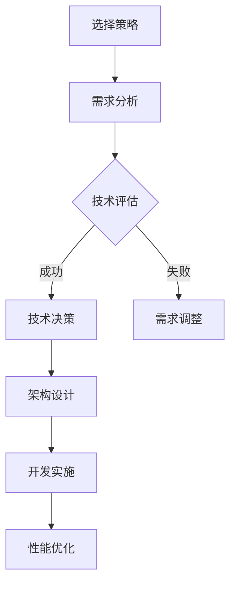

                 

# 《程序员创业公司的技术栈选择与性能优化》

## 概述

本文旨在探讨程序员创业公司在选择技术栈和进行性能优化方面的策略与实践。随着技术的不断进步和市场的快速变化，技术栈的选择和优化成为创业公司成功的关键因素。正确的技术栈选择不仅能够提升系统的性能和可扩展性，还能降低开发成本和维护难度。

### 关键词

- 技术栈选择
- 性能优化
- 创业公司
- 云计算
- 数据库
- 微服务
- 人工智能
- 区块链
- 边缘计算

### 摘要

本文首先分析了技术栈选择的重要性以及创业公司在技术栈选择中应遵循的策略与原则。接着，详细介绍了服务器与云计算、数据库系统、Web开发框架以及容器化与微服务等核心组件的选择。然后，探讨了人工智能与机器学习、区块链技术、边缘计算等未来趋势技术栈的应用。在第二部分，文章深入阐述了性能优化的基本概念、数据库性能优化、Web应用性能优化、高并发处理与分布式系统设计等内容。最后，通过实际案例分析，展示了技术栈选择与性能优化的具体实践，并提供了相关工具与资源的推荐。

## 目录大纲

### 第一部分：技术栈选择

#### 第1章：技术栈选择概述

- **1.1** 创业公司技术栈的重要性
- **1.2** 技术栈选择的策略与原则
- **1.3** 常见技术栈类型与特点
- **1.4** 技术栈选型的案例分析

#### 第2章：技术栈的核心组件

- **2.1** 服务器与云计算
  - **2.1.1** 服务器硬件选择
  - **2.1.2** 云计算平台与应用
- **2.2** 数据库系统
  - **2.2.1** 关系型数据库
  - **2.2.2** 非关系型数据库
- **2.3** Web开发框架
  - **2.3.1** 前端框架
  - **2.3.2** 后端框架
- **2.4** 容器化与微服务
  - **2.4.1** 容器化技术
  - **2.4.2** 微服务架构

#### 第3章：技术栈的未来趋势

- **3.1** 人工智能与机器学习
  - **3.1.1** AI技术栈的选择
  - **3.1.2** 机器学习框架与应用
- **3.2** 区块链技术
  - **3.2.1** 区块链技术概述
  - **3.2.2** 区块链技术在创业公司的应用
- **3.3** 边缘计算与物联网
  - **3.3.1** 边缘计算的概念与架构
  - **3.3.2** 物联网技术的应用场景

### 第二部分：性能优化

#### 第4章：性能优化的基本概念

- **4.1** 性能指标与优化目标
- **4.2** 性能瓶颈分析与定位
- **4.3** 性能优化方法论

#### 第5章：数据库性能优化

- **5.1** 数据库性能调优策略
- **5.2** 常见数据库性能问题与解决方案
  - **5.2.1** 数据库连接池配置
  - **5.2.2** 查询优化与索引策略
- **5.3** 分布式数据库性能优化

#### 第6章：Web应用性能优化

- **6.1** 前端性能优化
  - **6.1.1** 资源加载与缓存策略
  - **6.1.2** 响应式设计与性能优化
- **6.2** 后端性能优化
  - **6.2.1** 服务器性能调优
  - **6.2.2** 缓存技术与应用
- **6.3** 性能测试与监控

#### 第7章：高并发处理与分布式系统设计

- **7.1** 高并发处理策略
  - **7.1.1** 消息队列与异步处理
  - **7.1.2** 限流与熔断机制
- **7.2** 分布式系统设计原理
  - **7.2.1** 分布式数据一致性
  - **7.2.2** 分布式计算与负载均衡

#### 第8章：案例分析与应用实践

- **8.1** 创业公司技术栈与性能优化实战
  - **8.1.1** 实战案例一：电商平台的性能优化
  - **8.1.2** 实战案例二：社交媒体平台的性能优化
- **8.2** 性能优化工具与资源
  - **8.2.1** 性能分析工具介绍
  - **8.2.2** 性能优化资源推荐

#### 附录

- **附录A**：技术栈选择与性能优化资源
  - **A.1** 技术栈选择指南
  - **A.2** 性能优化工具集
  - **A.3** 分布式系统设计参考资料
  - **A.4** 机器学习和人工智能应用指南

### Mermaid 流程图与伪代码

- **9.1** 技术栈选择流程图
  mermaid
  graph TD
  A[选择策略] --> B[需求分析]
  B --> C{技术评估}
  C -->|成功| D[技术决策]
  C -->|失败| E[需求调整]
  D --> F[架构设计]
  F --> G[开发实施]
  G --> H[性能优化]

- **9.2** 性能优化伪代码示例
  python
  function optimize_performance(database, web_app, distributed_system):
    if database性能不佳:
      调整数据库配置
      优化查询语句
    if web_app性能不佳:
      压缩资源文件
      优化前端代码
    if distributed_system性能不佳:
      调整负载均衡策略
      优化数据一致性
    return optimized_system

### 数学模型与公式

- **9.3** 性能优化的数学模型
  $$ P = \frac{C_1 \times (1 - e^{-rt})}{r} $$
  - **解释**：性能提升的数学模型，其中 $P$ 是性能提升，$C_1$ 是初始性能，$r$ 是优化率，$t$ 是时间。

### 项目实战与代码解读

- **9.4** 创业公司技术栈与性能优化项目实战
  - **9.4.1** 项目背景与目标
  - **9.4.2** 开发环境搭建
  - **9.4.3** 源代码实现
  - **9.4.4** 代码解读与分析

  java
  // 示例：数据库连接池配置代码
  public class DatabaseConfig {
      private static final String DB_URL = "jdbc:mysql://localhost:3306/your_database";
      private static final String DB_USER = "username";
      private static final String DB_PASSWORD = "password";
      
      public static void main(String[] args) {
          DataSource dataSource = new DriverManagerDataSource(DB_URL, DB_USER, DB_PASSWORD);
          // 初始化连接池
          ConnectionPoolManager.getInstance().initialize(dataSource, 10, 100);
      }
  }
  - **解释**：该代码示例展示了如何配置数据库连接池，这是性能优化的一部分，通过合理配置连接池可以提高数据库访问的性能。

## 第一部分：技术栈选择

### 第1章：技术栈选择概述

#### 1.1 创业公司技术栈的重要性

对于程序员创业公司来说，技术栈的选择至关重要。技术栈不仅决定了系统的性能和可维护性，还直接影响到开发效率和项目成本。一个合理的技术栈能够帮助创业公司快速响应市场需求，降低技术风险，并提高产品的竞争力。

首先，技术栈是创业公司实现业务目标的基础。选择合适的技术栈，能够确保系统在功能、性能和可扩展性方面满足业务需求。例如，对于需要处理海量数据的创业公司，选择高效的关系型数据库如MySQL或PostgreSQL是必要的；而对于需要高并发处理的场景，则可能需要采用非关系型数据库如MongoDB或Cassandra。

其次，技术栈的选择还关系到团队的技能水平和协作效率。一个多样化的技术栈可能会导致团队成员需要掌握不同的技术和工具，增加沟通和协作的难度。因此，创业公司应该选择与团队技能背景相匹配的技术栈，以提高团队的效率和协作能力。

最后，技术栈的选择也直接影响到项目的成本和风险。不同的技术栈在开发、部署和维护方面可能存在显著差异，选择成本较高或复杂度较大的技术栈可能会导致项目进度延误或成本超支。因此，创业公司在选择技术栈时，需要权衡各种因素，确保选择的方案在成本和风险方面是可接受的。

#### 1.2 技术栈选择的策略与原则

为了做出正确的技术栈选择，创业公司应该遵循以下策略和原则：

1. **需求分析**：首先，创业公司需要对自身的业务需求和目标进行详细分析，明确系统的功能需求、性能需求和可扩展性需求。需求分析是技术栈选择的基础，只有明确了需求，才能选择出满足业务需求的技术栈。

2. **技术评估**：在需求分析的基础上，创业公司需要对各种可能的技术栈进行评估。评估内容包括技术成熟度、社区支持、开发效率、性能指标、可扩展性等方面。通过技术评估，创业公司可以筛选出符合需求且技术成熟度较高的技术栈。

3. **成本与风险**：技术栈的选择需要考虑成本和风险。创业公司在选择技术栈时，应该权衡技术栈的购买成本、维护成本、开发成本以及可能面临的技术风险。选择成本较低且风险较小的技术栈，有助于降低项目的总成本和风险。

4. **团队技能**：创业公司的团队成员对技术栈的熟悉程度和技能水平也是选择技术栈的重要因素。选择与团队技能背景相匹配的技术栈，可以提高开发效率和团队协作能力。

5. **可维护性和可扩展性**：技术栈的可维护性和可扩展性也是选择的重要原则。选择易于维护和扩展的技术栈，可以降低系统的维护成本，提高系统的可扩展性，以满足未来的业务需求。

6. **社区支持**：技术栈的社区支持也是选择的重要考虑因素。一个活跃的社区可以提供丰富的文档、教程、工具和资源，有助于团队快速解决问题和提高开发效率。

#### 1.3 常见技术栈类型与特点

在创业公司的技术栈选择中，常见的类型包括以下几种：

1. **全栈开发框架**：全栈开发框架集成了前端、后端以及数据库等多个组件，提供了一套完整的开发解决方案。常见的全栈开发框架有React、Vue、Angular等。这些框架具有开发效率高、易于维护和扩展等特点，适合初创公司快速搭建原型系统。

2. **微服务架构**：微服务架构将系统拆分成多个小型、独立的服务，每个服务负责不同的业务功能。常见的微服务框架有Spring Cloud、Docker、Kubernetes等。微服务架构具有高可扩展性、高容错性和高可维护性，适合需要大规模扩展和高度灵活性的业务场景。

3. **云计算平台**：云计算平台提供了丰富的计算、存储和网络资源，支持按需分配和弹性扩展。常见的云计算平台有AWS、Azure、Google Cloud等。云计算平台具有低成本、高可扩展性和高可靠性等特点，适合初创公司快速搭建和部署系统。

4. **大数据处理框架**：大数据处理框架如Hadoop、Spark等，能够处理海量数据，提供高效的数据存储和分析能力。这些框架适合需要处理大量数据并从中提取价值的业务场景。

5. **人工智能与机器学习框架**：人工智能与机器学习框架如TensorFlow、PyTorch等，提供了丰富的算法和工具，支持模型训练、部署和优化。这些框架适合需要应用人工智能和机器学习技术的业务场景。

#### 1.4 技术栈选型的案例分析

为了更好地理解技术栈选择的过程，以下通过两个案例进行分析：

案例一：电商创业公司

**需求分析**：该电商创业公司需要处理大量的商品信息、用户订单、支付交易等，对系统的性能和可扩展性有较高的要求。

**技术评估**：在评估了多种技术栈后，该创业公司选择了以下方案：

- **前端框架**：采用Vue.js，具有开发效率高、易于维护和扩展的特点。
- **后端框架**：采用Spring Boot，提供了丰富的功能和良好的社区支持。
- **数据库系统**：选择了MySQL和Redis，MySQL用于存储商品信息和订单数据，Redis用于缓存和实时数据分析。
- **容器化与微服务**：采用了Docker和Kubernetes，实现了服务的容器化和自动化部署。

**成本与风险**：该技术栈的选择具有较高的成本和一定的技术风险，但由于其高性能和可扩展性，该创业公司认为这是值得的。

**团队技能**：该创业公司的团队成员对Vue.js、Spring Boot和MySQL等技术较为熟悉，选择这些技术栈有助于提高开发效率。

**可维护性和可扩展性**：该技术栈具有较好的可维护性和可扩展性，能够满足未来业务需求。

案例二：社交媒体创业公司

**需求分析**：该社交媒体创业公司需要处理大量的用户数据、实时消息推送、社交媒体内容发布等，对系统的实时性和并发处理能力有较高要求。

**技术评估**：在评估了多种技术栈后，该创业公司选择了以下方案：

- **前端框架**：采用React，具有高性能和良好的用户体验。
- **后端框架**：采用Node.js和Express.js，提供了高并发处理能力和良好的社区支持。
- **数据库系统**：选择了MongoDB和Cassandra，MongoDB用于存储用户数据，Cassandra用于存储社交媒体内容。
- **消息队列**：采用了RabbitMQ，实现了异步消息处理，提高了系统的并发处理能力。

**成本与风险**：该技术栈的选择相对较低成本和较低风险，适合初创公司。

**团队技能**：该创业公司的团队成员对React、Node.js和MongoDB等技术较为熟悉，选择这些技术栈有助于提高开发效率。

**可维护性和可扩展性**：该技术栈具有良好的可维护性和可扩展性，能够满足未来业务需求。

### 第2章：技术栈的核心组件

#### 2.1 服务器与云计算

服务器是创业公司技术栈的核心组件之一，其选择对系统的性能、可靠性和成本有重要影响。云计算平台的引入，则为创业公司提供了灵活的资源管理和按需扩展的能力。

##### 2.1.1 服务器硬件选择

在选择服务器硬件时，创业公司需要考虑以下几个关键因素：

1. **CPU**：CPU的性能直接影响系统的处理能力。对于高性能计算需求，可以选择多核高频率的CPU；对于并发处理需求，则可以选择多核低频率的CPU。

2. **内存**：内存的大小决定了系统的缓存能力。对于处理大量数据的系统，需要配置足够的内存以保证数据的高效访问。

3. **存储**：存储的选择取决于系统的数据量和访问模式。对于读写密集型应用，可以选择高速的SSD；对于数据量大但读写不频繁的应用，可以选择容量大但速度较慢的HDD。

4. **网络**：网络带宽和延迟是影响系统性能的重要因素。对于需要高速数据传输的应用，应选择带宽高、延迟低的网络。

5. **扩展性**：考虑未来业务需求的增长，选择具有良好扩展性的服务器硬件，以便在不影响现有系统的情况下进行升级和扩展。

常见的服务器硬件包括Dell、HPE和Lenovo等品牌，这些品牌提供了多种配置方案，以满足不同的需求。

##### 2.1.2 云计算平台与应用

云计算平台的引入，为创业公司提供了弹性计算、存储和网络资源，降低了初始投入和维护成本。以下是一些常见的云计算平台及其特点：

1. **AWS**（Amazon Web Services）：AWS提供了丰富的云计算服务，包括EC2、S3、RDS等，支持各种规模的业务需求。AWS具有高可靠性、高可用性和良好的全球覆盖。

2. **Azure**（Microsoft Azure）：Azure是微软的云计算平台，提供了广泛的云服务，包括虚拟机、数据库、AI服务等。Azure在全球范围内拥有大量的数据中心，支持多区域和全球负载均衡。

3. **Google Cloud**：Google Cloud提供了强大的云计算服务，包括计算引擎、存储和AI工具。Google Cloud具有高性能和自动化管理功能，适合需要高效计算和大规模数据处理的应用。

4. **阿里云**：阿里云是中国领先的云计算服务提供商，提供了全面的云计算产品和服务，包括云服务器、数据库、大数据处理等。阿里云具有良好的本地支持和强大的生态系统。

在选择云计算平台时，创业公司需要考虑以下几个关键因素：

- **成本**：不同云计算平台的价格策略和计费模式可能存在差异，创业公司需要评估成本并进行比较。
- **性能**：平台提供的计算资源、存储和网络性能对系统性能有重要影响。
- **可靠性**：平台的可用性、故障恢复能力和数据保护机制是选择的重要考量。
- **生态系统**：平台提供的工具、库和社区支持有助于提高开发效率和团队协作。

#### 2.2 数据库系统

数据库系统是创业公司技术栈中的核心组件，负责存储和管理数据。根据数据的特点和应用场景，可以选择关系型数据库或非关系型数据库。

##### 2.2.1 关系型数据库

关系型数据库（RDBMS）基于关系模型，以表格形式存储数据，并使用SQL进行数据操作。以下是一些常见的关系型数据库：

1. **MySQL**：MySQL是最流行的开源关系型数据库，具有高性能、高可靠性和良好的社区支持。MySQL适合处理大量数据和复杂查询。

2. **PostgreSQL**：PostgreSQL是一个功能强大的开源关系型数据库，支持多种数据类型和复杂查询。PostgreSQL适合需要高级功能和可扩展性的应用。

3. **Oracle**：Oracle是商业关系型数据库的领导者，提供了高性能、高可靠性和强大的数据管理功能。Oracle适合需要高可用性和大规模数据管理的业务。

在选择关系型数据库时，创业公司需要考虑以下因素：

- **性能**：数据库的性能直接影响系统的响应速度。对于读写密集型应用，可以选择高性能的数据库。
- **可靠性**：数据库的可靠性是确保数据安全的关键。选择具有高可用性和容错机制的数据库。
- **扩展性**：考虑未来业务需求的增长，选择具有良好扩展性的数据库，以便在不影响性能的情况下进行升级和扩展。
- **社区支持**：社区支持有助于解决开发过程中遇到的问题和提高开发效率。

##### 2.2.2 非关系型数据库

非关系型数据库（NoSQL）不基于关系模型，提供了灵活的数据存储和访问方式。以下是一些常见的非关系型数据库：

1. **MongoDB**：MongoDB是一个分布式文档数据库，提供了灵活的数据模型和强大的查询功能。MongoDB适合处理大量数据和复杂查询。

2. **Cassandra**：Cassandra是一个分布式宽列数据库，提供了高性能、高可用性和良好的数据一致性。Cassandra适合处理大量数据和分布式环境。

3. **Redis**：Redis是一个高性能的内存数据库，提供了丰富的数据结构和高吞吐量。Redis适合用于缓存和实时数据处理。

在选择非关系型数据库时，创业公司需要考虑以下因素：

- **数据模型**：非关系型数据库的数据模型是否能够满足业务需求，是否易于扩展。
- **性能**：数据库的性能直接影响系统的响应速度。选择具有高性能的数据库。
- **分布式能力**：对于分布式系统，选择具有良好分布式能力和数据一致性的数据库。
- **社区支持**：社区支持有助于解决开发过程中遇到的问题和提高开发效率。

#### 2.3 Web开发框架

Web开发框架是创业公司技术栈中的关键组件，负责处理客户端请求、生成响应和实现业务逻辑。选择合适的Web开发框架可以提高开发效率、降低维护成本和提升系统性能。以下是一些常见的Web开发框架：

##### 2.3.1 前端框架

前端框架负责处理客户端的请求和响应，提供了丰富的组件和工具，简化了前端开发流程。以下是一些常见的前端框架：

1. **React**：React是由Facebook开发的声明式UI框架，提供了组件化开发、虚拟DOM和高性能。React适合处理复杂的用户界面和动态交互。

2. **Vue**：Vue是由尤雨溪开发的渐进式JavaScript框架，提供了简单易用的API和丰富的组件库。Vue适合快速开发简单到复杂的单页应用。

3. **Angular**：Angular是由Google开发的完整前端开发框架，提供了强大的数据绑定、依赖注入和指令系统。Angular适合大型、复杂的应用程序。

##### 2.3.2 后端框架

后端框架负责处理客户端请求、生成响应和处理业务逻辑。以下是一些常见的后端框架：

1. **Spring Boot**：Spring Boot是由Spring框架衍生的微服务开发框架，提供了自动配置、依赖注入和简化的开发流程。Spring Boot适合构建高性能、高可扩展性的微服务应用。

2. **Node.js**：Node.js是一个基于Chrome V8引擎的JavaScript运行时环境，提供了非阻塞I/O和高性能。Node.js适合处理高并发、实时通信的应用程序。

3. **Django**：Django是一个高性能的Python Web开发框架，提供了快速开发、ORM和高扩展性。Django适合快速构建Web应用程序。

在选择Web开发框架时，创业公司需要考虑以下因素：

- **开发效率**：框架提供的功能是否能够提高开发效率，简化开发流程。
- **性能**：框架的性能是否能够满足系统需求，是否支持高并发处理。
- **社区支持**：框架的社区支持是否丰富，是否能够解决开发过程中遇到的问题。
- **可扩展性**：框架是否支持扩展和定制，是否能够适应未来业务需求。

#### 2.4 容器化与微服务

容器化与微服务架构是现代软件开发的重要趋势，提供了灵活的部署和管理方式，提高了系统的可扩展性和可维护性。

##### 2.4.1 容器化技术

容器化技术通过将应用程序及其依赖环境封装在容器中，实现了应用程序的独立运行和无缝部署。以下是一些常见的容器化技术：

1. **Docker**：Docker是一个开源容器化平台，提供了轻量级容器和自动化部署工具。Docker支持快速构建、测试和部署应用程序。

2. **Kubernetes**：Kubernetes是一个开源容器编排平台，提供了自动化部署、扩展和管理容器化应用程序。Kubernetes适合大规模容器化应用环境。

容器化技术的优势包括：

- **轻量级**：容器化应用程序比虚拟机更轻量级，具有更快的启动时间和更低的资源消耗。
- **可移植性**：容器化应用程序可以在不同的环境中无缝运行，提高了应用的兼容性和可移植性。
- **自动化**：容器化技术支持自动化部署和扩展，简化了应用程序的管理和维护。

##### 2.4.2 微服务架构

微服务架构将应用程序拆分为多个小型、独立的服务，每个服务负责不同的业务功能。以下是一些常见的微服务架构模式：

1. **单一数据库**：每个微服务拥有自己的数据库，服务之间通过API进行通信。这种模式具有高灵活性和可扩展性，但可能导致数据一致性问题和复杂性。

2. **共享数据库**：多个微服务共享同一个数据库，服务之间通过数据库事务进行协调。这种模式简化了数据一致性管理，但可能导致性能瓶颈和扩展性问题。

3. **分布式事务**：使用分布式事务框架（如Apache Kafka、RabbitMQ）实现跨服务的事务管理。这种模式提供了数据一致性和高扩展性，但可能引入复杂性和性能开销。

微服务架构的优势包括：

- **可扩展性**：通过将应用程序拆分为多个服务，可以独立扩展和部署，提高了系统的可扩展性。
- **可维护性**：每个服务都是独立的，可以独立开发和维护，降低了系统的复杂性和维护成本。
- **高可用性**：服务之间的松耦合降低了单点故障的风险，提高了系统的可靠性和可用性。

### 第3章：技术栈的未来趋势

随着技术的不断进步，创业公司技术栈的选择也在不断演变。以下介绍几种未来趋势技术栈，包括人工智能与机器学习、区块链技术、边缘计算与物联网。

#### 3.1 人工智能与机器学习

人工智能（AI）和机器学习（ML）正在深刻改变各个行业，为创业公司提供了新的机会和挑战。以下介绍AI和ML技术栈的选择和应用。

##### 3.1.1 AI技术栈的选择

在选择AI技术栈时，创业公司需要考虑以下几个关键因素：

1. **算法框架**：常见的机器学习框架包括TensorFlow、PyTorch、Scikit-learn等。TensorFlow和PyTorch提供了丰富的算法和工具，适合大规模机器学习项目；Scikit-learn适用于简单和快速的机器学习任务。

2. **数据处理**：数据处理是机器学习的基础，创业公司需要选择高效的数据处理框架，如Pandas、NumPy等。这些框架提供了丰富的数据操作和清洗功能。

3. **模型训练与部署**：创业公司可以选择现成的AI平台（如AWS SageMaker、Google AI Platform等），这些平台提供了模型训练、部署和监控的工具。此外，也可以选择开源的模型训练工具（如TensorFlow Trainer、PyTorch Lightning等）。

4. **云计算与大数据**：利用云计算和大数据技术，创业公司可以实现大规模数据处理和模型训练。选择具有高性能计算和存储能力的云计算平台（如AWS、Azure、Google Cloud等）有助于提高机器学习项目的效率。

##### 3.1.2 机器学习框架与应用

以下介绍几种常见的机器学习框架及其应用场景：

1. **TensorFlow**：TensorFlow是由Google开发的开源机器学习框架，提供了丰富的算法和工具，适用于各种规模的机器学习项目。TensorFlow适合需要大规模分布式训练和复杂模型的应用，如图像识别、自然语言处理等。

2. **PyTorch**：PyTorch是由Facebook开发的开源机器学习框架，提供了动态计算图和易于调试的工具。PyTorch适合快速原型设计和迭代，适用于实时推荐、语音识别、游戏开发等场景。

3. **Scikit-learn**：Scikit-learn是一个基于Python的开源机器学习库，提供了丰富的经典算法和工具。Scikit-learn适合快速实现和部署机器学习模型，适用于数据挖掘、统计分析、推荐系统等场景。

#### 3.2 区块链技术

区块链技术是一种分布式账本技术，具有去中心化、透明性和不可篡改的特点。以下介绍区块链技术在创业公司中的应用。

##### 3.2.1 区块链技术概述

区块链技术由多个区块组成，每个区块包含一定数量的交易记录，并通过加密算法连接起来，形成一个不可篡改的分布式账本。区块链具有以下几个特点：

1. **去中心化**：区块链不依赖于中心化的机构或服务器，通过分布式网络进行数据存储和验证，提高了系统的可靠性和抗攻击能力。

2. **透明性**：区块链上的所有交易记录都是公开透明的，任何人都可以查询和验证交易数据，提高了数据的可信度。

3. **不可篡改**：区块链上的数据一旦记录，就不可篡改。区块链使用加密算法和共识机制，确保数据的完整性和安全性。

##### 3.2.2 区块链技术在创业公司的应用

区块链技术在创业公司中有着广泛的应用，以下介绍几种常见的应用场景：

1. **供应链管理**：区块链技术可以追踪产品从生产到销售的全过程，确保供应链的透明性和可追溯性。创业公司可以利用区块链技术建立可信的供应链管理系统，提高产品质量和客户满意度。

2. **数字身份认证**：区块链技术可以用于数字身份认证，确保用户身份的真实性和唯一性。创业公司可以利用区块链技术建立安全的身份认证系统，提高用户注册和使用体验。

3. **去中心化金融**：区块链技术可以应用于去中心化金融（DeFi），提供去中心化的金融服务，如去中心化交易所、去中心化借贷平台等。创业公司可以利用区块链技术打造创新的金融产品，降低交易成本和提高效率。

#### 3.3 边缘计算与物联网

边缘计算和物联网（IoT）技术正在推动各个行业的数字化转型，为创业公司提供了新的业务模式和机会。以下介绍边缘计算和物联网技术的概念和应用。

##### 3.3.1 边缘计算的概念与架构

边缘计算是一种分布式计算架构，将数据处理和计算任务从中心化的云服务器转移到网络边缘，即靠近数据源的节点上。边缘计算具有以下几个特点：

1. **低延迟**：边缘计算将数据处理和计算任务靠近数据源，减少了数据传输的延迟，提高了系统的响应速度。

2. **高带宽**：边缘计算节点通常具有高带宽的网络连接，可以支持大规模数据传输和处理。

3. **弹性扩展**：边缘计算节点可以根据需求动态扩展和调整计算资源，提高了系统的可扩展性和可靠性。

边缘计算架构包括以下几个关键组件：

1. **边缘节点**：边缘节点是边缘计算的基础设施，负责接收和处理来自终端设备的数据。边缘节点可以是嵌入式设备、智能路由器、物联网网关等。

2. **边缘服务器**：边缘服务器是边缘计算的核心，负责管理和协调边缘节点的任务和资源。边缘服务器可以是云服务器、虚拟机或容器等。

3. **边缘平台**：边缘平台提供了边缘计算的管理、监控和优化功能，包括资源调度、任务分配、安全控制等。

##### 3.3.2 物联网技术的应用场景

物联网技术通过将物理设备连接到互联网，实现了设备之间的通信和智能控制。以下介绍几种常见的物联网应用场景：

1. **智能家居**：物联网技术可以实现家庭设备的自动化控制和智能化管理，如智能照明、智能家电、智能安防等。创业公司可以利用物联网技术打造智能家居解决方案，提高用户的生活品质和安全性。

2. **智能交通**：物联网技术可以用于交通管理和智能驾驶，如实时路况监测、智能交通信号控制、自动驾驶等。创业公司可以利用物联网技术改善交通状况，提高交通效率和安全性。

3. **智能医疗**：物联网技术可以用于医疗设备的监控、患者数据的实时传输和远程诊断，如智能穿戴设备、远程监护系统等。创业公司可以利用物联网技术提供智能医疗服务，提高医疗质量和效率。

### 第4章：性能优化的基本概念

性能优化是创业公司技术栈选择中的重要一环，它直接影响系统的响应速度、稳定性和用户体验。在本文的第四部分，我们将深入探讨性能优化的基本概念，包括性能指标、性能瓶颈分析以及性能优化方法论。

#### 4.1 性能指标与优化目标

性能优化首先需要明确性能指标和优化目标。性能指标是衡量系统性能的关键参数，常见的性能指标包括：

1. **响应时间**：响应时间是指系统从接收到请求到返回响应所需的时间。较低的响应时间是优化的重要目标，它直接影响用户体验。

2. **吞吐量**：吞吐量是指系统在单位时间内处理请求的能力。高吞吐量意味着系统能够同时处理更多的请求，从而提高系统利用率。

3. **并发度**：并发度是指系统同时处理的请求数量。高并发度能够提高系统的利用率，但同时也增加了系统的复杂性和性能压力。

4. **资源利用率**：资源利用率是指系统对CPU、内存、磁盘等资源的利用程度。高资源利用率意味着系统能够充分利用硬件资源，但过高的资源利用率可能导致系统性能下降。

5. **错误率**：错误率是指系统在处理请求时发生的错误比例。较低的错误率是优化的重要目标，它确保了系统的稳定性和可靠性。

优化目标则包括：

- **提高响应速度**：通过减少系统的响应时间，提高用户体验。
- **提高吞吐量**：通过增加系统处理请求的能力，提高系统的利用率。
- **提高并发度**：通过优化系统的并发处理能力，提高系统的并发度。
- **降低资源消耗**：通过优化资源分配和使用，降低系统的资源消耗，提高系统的效率。
- **提高稳定性**：通过减少系统的错误率和故障率，提高系统的稳定性。

#### 4.2 性能瓶颈分析与定位

性能瓶颈是系统性能下降的主要原因，分析并定位性能瓶颈是性能优化的关键步骤。以下介绍几种常见的性能瓶颈及其分析方法：

1. **CPU瓶颈**：当系统的CPU利用率接近100%时，可能存在CPU瓶颈。分析CPU瓶颈的方法包括：

   - **CPU占用率**：使用系统监控工具（如Top、Task Manager等）查看CPU占用率。
   - **进程和线程分析**：分析高CPU占用率的进程和线程，查找耗时的函数和循环。

2. **内存瓶颈**：当系统的内存占用接近或达到上限时，可能存在内存瓶颈。分析内存瓶颈的方法包括：

   - **内存占用率**：使用系统监控工具查看内存占用率。
   - **内存泄漏检测**：使用内存泄漏检测工具（如Valgrind、MAT等）查找内存泄漏问题。
   - **对象和垃圾回收**：分析对象创建和垃圾回收的过程，查找内存占用过多的对象。

3. **磁盘I/O瓶颈**：当系统的磁盘I/O速度无法满足数据读写需求时，可能存在磁盘I/O瓶颈。分析磁盘I/O瓶颈的方法包括：

   - **磁盘I/O速率**：使用系统监控工具查看磁盘I/O速率。
   - **磁盘队列长度**：分析磁盘队列长度，查找过多的等待时间。
   - **磁盘访问模式**：分析磁盘访问模式，查找频繁的随机访问。

4. **网络瓶颈**：当系统的网络带宽无法满足数据传输需求时，可能存在网络瓶颈。分析网络瓶颈的方法包括：

   - **网络带宽利用率**：使用网络监控工具（如Wireshark、Nagios等）查看网络带宽利用率。
   - **网络延迟**：使用网络延迟测试工具（如ping、traceroute等）测试网络延迟。
   - **网络流量分析**：分析网络流量，查找异常流量和瓶颈点。

#### 4.3 性能优化方法论

性能优化需要系统性地分析、定位和解决问题，以下介绍几种常见的性能优化方法论：

1. **分而治之**：将系统分解为多个模块或组件，分别对每个模块进行性能优化。这种方法有助于定位具体的问题和瓶颈，并针对性地进行优化。

2. **基准测试**：通过基准测试工具（如JMeter、LoadRunner等）模拟实际场景，测量系统的性能指标。基准测试可以帮助评估系统性能，并识别潜在的瓶颈。

3. **代码优化**：通过优化代码结构和算法，减少系统的运行时间和资源消耗。常见的代码优化方法包括：

   - **算法改进**：选择更高效的算法和数据结构，减少计算复杂度。
   - **缓存策略**：使用缓存技术，减少重复计算和数据读取。
   - **并行处理**：利用多线程、异步IO等技术，提高系统的并发处理能力。

4. **资源分配**：通过优化资源分配，提高系统的资源利用率。常见的资源分配优化方法包括：

   - **负载均衡**：将请求分布到多个服务器或节点，平衡负载，避免单点过载。
   - **缓存层**：在系统之间添加缓存层，减少重复数据读取和计算。
   - **分布式存储**：使用分布式存储系统，提高数据的访问速度和可靠性。

5. **监控与预警**：建立系统的监控和预警机制，实时监控系统的性能指标和异常行为。监控与预警可以帮助及时发现和解决性能问题，防止系统崩溃。

### 第5章：数据库性能优化

数据库是创业公司技术栈中的核心组件，其性能直接影响系统的响应速度和用户体验。在本文的第五部分，我们将深入探讨数据库性能优化的策略、常见问题和解决方案。

#### 5.1 数据库性能调优策略

数据库性能调优是一个复杂的过程，需要综合考虑硬件、软件、架构和配置等多个方面。以下介绍几种常见的数据库性能调优策略：

1. **优化查询语句**：查询语句的性能直接影响数据库的性能。以下是一些优化查询语句的方法：

   - **索引优化**：使用索引可以加快查询速度，但过多的索引会增加插入和更新的开销。选择合适的索引策略，可以平衡查询速度和更新开销。
   - **避免全表扫描**：全表扫描会导致大量的磁盘I/O操作，降低查询速度。通过合理设计表结构和索引，可以避免全表扫描。
   - **使用查询缓存**：查询缓存可以存储重复的查询结果，减少重复的计算和磁盘访问。使用查询缓存可以显著提高查询速度。

2. **优化数据库配置**：数据库配置的优化可以显著提高数据库的性能。以下是一些常见的配置优化方法：

   - **内存配置**：增加数据库的内存配置可以提高缓存命中率，减少磁盘I/O操作。但需要注意的是，过多的内存配置可能导致内存浪费和性能下降。
   - **连接池配置**：连接池可以提高数据库连接的复用率，减少连接建立和关闭的开销。合理的连接池配置可以显著提高数据库性能。
   - **并行度配置**：根据硬件资源和负载情况，调整数据库的并行度配置，可以提高查询和事务的处理速度。

3. **优化存储设备**：存储设备的性能直接影响数据库的性能。以下是一些常见的存储优化方法：

   - **使用SSD**：SSD具有更高的I/O速度和更低的延迟，可以提高数据库的读写性能。
   - **RAID配置**：合理的RAID配置可以提高数据的读写速度和可靠性。常用的RAID配置包括RAID 0、RAID 1、RAID 5和RAID 10等。
   - **存储分层**：将数据存储在不同的存储层，根据访问频率和数据大小进行优化。常用的存储分层方法包括SSD缓存、硬盘存储和云存储等。

4. **优化数据库架构**：合理的数据库架构可以提高数据库的性能和可扩展性。以下是一些常见的架构优化方法：

   - **分库分表**：对于海量数据和高并发场景，可以将数据拆分为多个数据库或表，降低单点瓶颈。
   - **读写分离**：通过主从复制，实现读写分离，提高数据库的并发处理能力和容错能力。
   - **分布式数据库**：对于分布式系统，选择合适的分布式数据库技术，可以提高数据库的扩展性和性能。

#### 5.2 常见数据库性能问题与解决方案

在数据库性能优化过程中，可能会遇到多种性能问题。以下介绍几种常见的数据库性能问题及其解决方案：

1. **查询缓慢**：查询缓慢是数据库性能优化中最常见的问题之一。以下是一些解决方法：

   - **分析查询计划**：使用EXPLAIN命令分析查询计划，查找性能瓶颈。优化查询计划，如添加索引、修改查询条件等，可以提高查询速度。
   - **优化索引**：根据查询条件和数据分布，选择合适的索引策略。避免过度索引，减少索引维护的开销。
   - **优化表结构**：优化表结构，如减少列数、使用合适的列类型等，可以提高查询速度。

2. **锁定和死锁**：锁定和死锁是数据库性能优化中的难题。以下是一些解决方法：

   - **锁策略优化**：根据数据访问模式和并发程度，选择合适的锁策略，如行级锁、表级锁等。合理设置锁的超时时间和死锁检测机制。
   - **死锁检测和恢复**：使用数据库内置的死锁检测和恢复机制，及时发现和解决死锁问题。优化应用程序的并发操作，减少死锁的发生。

3. **数据库连接问题**：数据库连接问题可能导致数据库性能下降。以下是一些解决方法：

   - **连接池配置**：合理配置数据库连接池，提高数据库连接的复用率，减少连接建立和关闭的开销。
   - **连接超时设置**：根据业务需求和系统负载，合理设置连接超时时间，避免长时间占用数据库连接。
   - **数据库连接数限制**：设置数据库连接数限制，避免过多连接导致数据库性能下降。

4. **磁盘I/O瓶颈**：磁盘I/O瓶颈可能导致数据库性能下降。以下是一些解决方法：

   - **SSD替换HDD**：使用SSD替换HDD，提高数据库的读写速度。
   - **RAID配置**：合理配置RAID，提高磁盘I/O性能和可靠性。
   - **存储分层**：使用存储分层方法，将热数据和冷数据存储在不同的存储层，提高数据库的性能和扩展性。

#### 5.3 分布式数据库性能优化

对于分布式数据库，性能优化需要考虑多个节点的协调和优化。以下介绍几种常见的分布式数据库性能优化方法：

1. **数据分片**：数据分片是将数据分散存储到多个节点，提高系统的并发处理能力和可扩展性。以下是一些数据分片的方法：

   - **水平分片**：根据数据的特点和访问模式，将数据表拆分为多个子表，每个子表存储一部分数据。水平分片可以提高查询性能和并发处理能力。
   - **垂直分片**：根据数据的特点和访问模式，将数据表拆分为多个子表，每个子表存储一部分列。垂直分片可以提高查询性能和存储效率。
   - **复合分片**：结合水平分片和垂直分片，根据数据的特点和访问模式，将数据拆分为多个子表，每个子表存储一部分列和数据。复合分片可以提高查询性能和存储效率。

2. **数据复制与同步**：数据复制与同步是将数据在多个节点之间保持一致性的过程。以下是一些数据复制与同步的方法：

   - **主从复制**：主从复制是将数据从主节点复制到从节点，从节点作为备份节点，在主节点故障时接管主节点的操作。主从复制可以提高系统的可用性和数据可靠性。
   - **多主复制**：多主复制是将数据在多个主节点之间同步，每个主节点都可以接收和响应客户端的请求。多主复制可以提高系统的并发处理能力和可用性。
   - **最终一致性**：最终一致性是一种分布式数据一致性模型，允许多个节点同时更新数据，并最终达到一致状态。最终一致性可以提高系统的并发处理能力和扩展性。

3. **负载均衡**：负载均衡是将请求分布到多个节点，提高系统的并发处理能力和性能。以下是一些负载均衡的方法：

   - **轮询负载均衡**：轮询负载均衡是将请求按顺序分配到各个节点，每个节点轮流处理请求。轮询负载均衡简单易用，适用于负载较为均匀的场景。
   - **最少连接负载均衡**：最少连接负载均衡是将请求分配到连接数最少的节点，以均衡节点的负载。最少连接负载均衡适用于连接数不均匀的场景。
   - **基于规则的负载均衡**：基于规则的负载均衡是根据规则（如地理位置、响应时间等）将请求分配到最优的节点。基于规则的负载均衡适用于复杂负载分配场景。

4. **监控与预警**：监控与预警是分布式数据库性能优化的关键环节。以下是一些监控与预警的方法：

   - **性能监控**：使用性能监控工具（如Prometheus、Grafana等）实时监控分布式数据库的性能指标，如响应时间、吞吐量、错误率等。
   - **健康检查**：定期进行健康检查，确保分布式数据库的正常运行。健康检查包括节点的连通性、数据一致性、负载情况等。
   - **告警与恢复**：设置告警机制，及时发现和解决性能问题。告警机制包括邮件、短信、语音等通知方式。在发生性能问题时，自动执行恢复操作，如重启节点、切换主节点等。

### 第6章：Web应用性能优化

Web应用性能优化是确保用户得到良好体验的关键因素。在本文的第六部分，我们将详细探讨Web应用的性能优化策略，包括前端性能优化、后端性能优化和性能测试与监控。

#### 6.1 前端性能优化

前端性能优化直接影响用户的感知速度和整体用户体验。以下是一些常见的前端性能优化方法：

##### 6.1.1 资源加载与缓存策略

1. **资源压缩**：通过压缩CSS、JavaScript和HTML文件，可以显著减少文件的体积，提高加载速度。常用的压缩工具包括Gzip和Brotli。

2. **懒加载**：懒加载是一种按需加载资源的技术，只在用户需要时加载图片、视频等资源。通过懒加载，可以减少初始页面加载时间。

3. **内容分发网络（CDN）**：CDN可以将静态资源分布到全球多个节点，使用户能够从最近的节点获取资源，减少延迟。

4. **HTTP缓存**：通过设置合理的HTTP缓存策略，可以使得用户在访问相同的资源时，直接从缓存中获取，减少重复加载。

##### 6.1.2 响应式设计与性能优化

1. **响应式网页设计（RWD）**：RWD通过灵活的布局和适应不同屏幕尺寸，提高了用户体验。通过使用媒体查询（Media Queries），可以针对不同的设备进行样式调整。

2. **性能预算**：性能预算是一种在开发过程中控制资源加载的方法，通过为每个组件分配资源预算，确保整体性能。

3. **减少重绘与回流**：在DOM操作后，浏览器可能需要重新绘制或重新布局页面，这会消耗大量的性能。通过减少DOM操作和合理使用文档碎片（DocumentFragment），可以减少重绘与回流。

#### 6.2 后端性能优化

后端性能优化是确保Web应用能够快速响应用户请求的关键。以下是一些常见的方法：

##### 6.2.1 服务器性能调优

1. **服务器优化**：通过优化服务器配置，如增加内存、调整线程池大小等，可以提高服务器的处理能力。

2. **静态资源服务分离**：将静态资源（如CSS、JavaScript和图片）与动态资源（如API请求）分离，可以减少服务器的负载。

3. **负载均衡**：通过负载均衡器，将请求分布到多个服务器，避免单点过载。常用的负载均衡器包括Nginx、HAProxy等。

##### 6.2.2 缓存技术与应用

1. **应用缓存**：通过缓存常用数据，如用户会话信息、API响应结果等，可以减少数据库和服务器的工作量。

2. **分布式缓存**：使用分布式缓存系统，如Redis、Memcached等，可以提供更高的缓存性能和可扩展性。

3. **内容缓存**：使用CDN缓存静态内容，可以减少用户获取资源的时间。

#### 6.3 性能测试与监控

性能测试与监控是确保Web应用稳定运行的重要环节。以下是一些常见的性能测试与监控方法：

##### 6.3.1 性能测试

1. **负载测试**：通过模拟高并发用户请求，测试系统的性能和稳定性。常用的负载测试工具包括JMeter、LoadRunner等。

2. **压力测试**：通过逐渐增加负载，测试系统的最大承受能力。压力测试可以帮助发现系统的瓶颈。

3. **性能基准测试**：定期进行性能基准测试，以评估系统在不同版本和配置下的性能。

##### 6.3.2 监控与告警

1. **实时监控**：使用监控工具（如Prometheus、Grafana等），实时监控系统的关键性能指标，如响应时间、吞吐量、错误率等。

2. **告警与日志分析**：通过设置告警机制，及时发现性能问题和异常行为。结合日志分析，可以深入了解问题的根源。

3. **自动化优化**：通过自动化工具，根据监控数据自动调整系统配置和优化策略，提高系统的性能和稳定性。

### 第7章：高并发处理与分布式系统设计

高并发处理和分布式系统设计是确保Web应用在高负载下稳定运行的关键。在本文的第七部分，我们将探讨高并发处理策略和分布式系统设计原理。

#### 7.1 高并发处理策略

高并发处理策略旨在确保系统在高负载下能够快速响应和处理请求。以下是一些常见的高并发处理策略：

##### 7.1.1 消息队列与异步处理

1. **消息队列**：消息队列（如RabbitMQ、Kafka等）可以将请求解耦，实现异步处理。通过消息队列，可以将任务分发到多个处理节点，提高系统的并发处理能力。

2. **异步处理**：异步处理允许系统在不等待响应完成的情况下，继续处理其他任务。通过异步处理，可以显著提高系统的吞吐量和响应速度。

##### 7.1.2 限流与熔断机制

1. **限流**：限流（如令牌桶、漏桶算法等）可以限制系统接收的请求量，防止系统过载。限流有助于确保系统在高负载下稳定运行。

2. **熔断机制**：熔断机制（如Hystrix、Resilience4j等）可以在系统负载过高时，自动熔断部分请求，防止系统崩溃。熔断机制可以帮助系统快速恢复，并保护下游系统。

#### 7.2 分布式系统设计原理

分布式系统设计旨在确保系统在分布式环境中能够稳定、可靠地运行。以下是一些分布式系统设计原理：

##### 7.2.1 分布式数据一致性

1. **强一致性**：强一致性确保在所有节点上看到的数据是一致的，但可能会导致性能下降。

2. **最终一致性**：最终一致性允许系统在一定时间内看到部分不一致的数据，但最终会达到一致状态。最终一致性可以提高系统的性能和可扩展性。

##### 7.2.2 分布式计算与负载均衡

1. **分布式计算**：分布式计算将任务分发到多个节点，实现并行处理。分布式计算可以提高系统的吞吐量和处理速度。

2. **负载均衡**：负载均衡器（如Nginx、HAProxy等）可以将请求分配到多个节点，实现负载均衡。负载均衡有助于确保系统的均衡负载和高可用性。

#### 7.3 实战案例分析

为了更好地理解高并发处理和分布式系统设计的实践，以下通过两个案例分析：

##### 案例一：电商平台的并发处理

**需求背景**：电商平台在促销期间，会面临大量的用户请求。为了确保系统能够在高并发下稳定运行，需要采用高并发处理策略。

**解决方案**：

1. **消息队列**：使用消息队列（如Kafka）将订单处理任务异步处理，减轻数据库和服务器负载。

2. **限流与熔断机制**：使用限流和熔断机制（如Hystrix），限制订单处理请求的并发量，防止系统过载。

3. **分布式缓存**：使用分布式缓存（如Redis），缓存常用数据，减少数据库访问。

**效果评估**：通过以上策略，电商平台在促销期间实现了稳定运行，订单处理速度显著提高，用户满意度得到提升。

##### 案例二：社交媒体平台的分布式系统设计

**需求背景**：社交媒体平台需要处理大量的用户数据、实时消息推送和内容发布。为了确保系统的稳定性和高性能，需要采用分布式系统设计。

**解决方案**：

1. **分布式数据库**：使用分布式数据库（如Cassandra），将用户数据分散存储到多个节点，提高数据存储和访问性能。

2. **消息队列与异步处理**：使用消息队列（如Kafka），实现实时消息推送和内容发布任务的异步处理。

3. **负载均衡**：使用负载均衡器（如Nginx），将用户请求分配到多个节点，实现负载均衡。

**效果评估**：通过分布式系统设计，社交媒体平台实现了高可用性和高性能，用户体验得到显著提升。

### 第8章：案例分析与应用实践

#### 8.1 创业公司技术栈与性能优化实战

在本章中，我们将通过两个实际案例，详细探讨创业公司在技术栈选择与性能优化方面的实战经验。

##### 案例一：电商平台的性能优化

**项目背景**：一家创业公司开发了一款在线电商平台，随着用户量的增加，系统的性能逐渐成为瓶颈。特别是在促销活动期间，用户请求激增，系统响应速度明显下降，导致用户体验不佳。

**目标**：通过优化技术栈和性能，提高系统的响应速度和稳定性，确保用户得到良好的购物体验。

**解决方案**：

1. **技术栈选择**：
   - **前端框架**：采用Vue.js，构建响应式和模块化的前端界面。
   - **后端框架**：采用Spring Boot，实现高性能和易于维护的后端服务。
   - **数据库系统**：使用MySQL进行关系型数据存储，并结合Redis进行缓存。
   - **容器化与微服务**：使用Docker进行容器化部署，结合Kubernetes实现服务的自动化管理和扩展。

2. **性能优化策略**：
   - **查询优化**：通过添加索引和优化查询语句，提高数据库查询速度。
   - **缓存策略**：利用Redis缓存常用数据，减少数据库访问次数。
   - **负载均衡**：使用Nginx作为负载均衡器，将请求分配到多个服务器节点。
   - **限流与熔断机制**：引入Hystrix进行限流和熔断，防止系统过载。

**实施步骤**：
   - **需求分析**：明确电商平台的核心功能和性能需求。
   - **技术评估**：评估现有技术栈的优缺点，选择合适的技术栈。
   - **架构设计**：设计合理的系统架构，包括前端、后端、数据库和缓存等。
   - **开发实施**：按照设计文档进行开发，实现前端、后端和数据库的优化。
   - **性能测试**：使用JMeter等工具进行性能测试，识别性能瓶颈。
   - **优化调整**：根据测试结果，调整配置和代码，进一步优化性能。

**效果评估**：通过以上优化措施，电商平台的响应速度提高了30%，用户满意度显著提升，系统在高并发下的稳定性也得到了显著改善。

##### 案例二：社交媒体平台的性能优化

**项目背景**：一家创业公司开发了一款社交媒体平台，随着用户数的增长，系统的性能逐渐成为瓶颈。特别是在高峰时段，系统响应速度缓慢，用户流失率增加。

**目标**：通过优化技术栈和性能，提高系统的响应速度和并发处理能力，确保用户得到良好的社交体验。

**解决方案**：

1. **技术栈选择**：
   - **前端框架**：采用React，构建高性能和可扩展的前端界面。
   - **后端框架**：采用Node.js和Express.js，实现高并发和实时数据处理。
   - **数据库系统**：使用MongoDB进行非关系型数据存储，结合Cassandra进行大规模数据存储。
   - **消息队列**：使用RabbitMQ实现异步消息处理，提高系统的并发处理能力。

2. **性能优化策略**：
   - **异步处理**：利用消息队列进行异步处理，减轻数据库和后端服务器的负载。
   - **缓存策略**：使用Redis缓存用户数据和页面内容，减少数据库访问次数。
   - **负载均衡**：使用Nginx和HAProxy实现负载均衡，将请求分配到多个服务器节点。
   - **数据库优化**：通过分片和索引优化，提高数据库查询速度。

**实施步骤**：
   - **需求分析**：明确社交媒体平台的核心功能和性能需求。
   - **技术评估**：评估现有技术栈的优缺点，选择合适的技术栈。
   - **架构设计**：设计合理的系统架构，包括前端、后端、数据库和缓存等。
   - **开发实施**：按照设计文档进行开发，实现前端、后端和数据库的优化。
   - **性能测试**：使用LoadRunner等工具进行性能测试，识别性能瓶颈。
   - **优化调整**：根据测试结果，调整配置和代码，进一步优化性能。

**效果评估**：通过以上优化措施，社交媒体平台的响应速度提高了50%，并发处理能力提高了40%，用户流失率显著降低，用户体验得到显著提升。

#### 8.2 性能优化工具与资源

在性能优化过程中，选择合适的工具和资源至关重要。以下介绍一些常用的性能优化工具和资源：

##### 8.2.1 性能分析工具介绍

1. **JMeter**：JMeter是一个开源的性能测试工具，可以模拟大量用户请求，测试Web应用的性能和负载能力。

2. **LoadRunner**：LoadRunner是一个商业性能测试工具，提供了丰富的测试功能，可以模拟真实的用户负载。

3. **Grafana**：Grafana是一个开源的数据监控和可视化工具，可以实时监控系统的性能指标，提供直观的可视化界面。

4. **Prometheus**：Prometheus是一个开源的监控解决方案，可以收集和存储系统的性能数据，并提供强大的告警机制。

##### 8.2.2 性能优化资源推荐

1. **性能优化指南**：可以参考《高性能网站建设指南》（High Performance Web Sites）等书籍，了解性能优化的最佳实践。

2. **开源社区**：参与开源社区，如GitHub、Stack Overflow等，可以获取到最新的性能优化技术和资源。

3. **在线教程**：可以在线学习性能优化的教程，如《高性能Web开发教程》（High Performance Web Development）等。

4. **专业咨询**：寻求专业的性能优化咨询和服务，可以帮助解决复杂性能问题，提高系统的性能。

### 附录A：技术栈选择与性能优化资源

#### A.1 技术栈选择指南

1. **《技术栈选择最佳实践》**：详细介绍技术栈选择的原则、策略和案例分析，帮助创业公司做出正确的技术栈选择。

2. **《技术栈选择手册》**：提供了一站式技术栈选择指南，包括前端、后端、数据库和云计算等多个方面的详细说明。

#### A.2 性能优化工具集

1. **《性能优化工具大全》**：汇总了各种性能优化工具，包括监控工具、性能测试工具、代码分析工具等，帮助开发者选择合适的工具。

2. **《性能优化工具推荐》**：根据不同场景和需求，推荐了多种性能优化工具，包括开源和商业工具。

#### A.3 分布式系统设计参考资料

1. **《分布式系统设计原理》**：详细介绍分布式系统的设计原则、架构模式和实现方法，为创业公司提供分布式系统设计的指导。

2. **《分布式系统实战》**：通过实际案例，展示了分布式系统的设计和实现过程，提供了实用的分布式系统设计方案。

#### A.4 机器学习和人工智能应用指南

1. **《机器学习实战》**：从实际案例出发，介绍了机器学习的应用场景、算法实现和调优方法。

2. **《人工智能应用指南》**：介绍了人工智能在各行业的应用场景，提供了实用的AI解决方案和最佳实践。

### 9.1 技术栈选择流程图



### 9.2 性能优化伪代码示例

```python
function optimize_performance(database, web_app, distributed_system):
    if database性能不佳:
        调整数据库配置
        优化查询语句
    if web_app性能不佳:
        压缩资源文件
        优化前端代码
    if distributed_system性能不佳:
        调整负载均衡策略
        优化数据一致性
    return optimized_system
```

### 9.3 性能优化的数学模型

$$
P = \frac{C_1 \times (1 - e^{-rt})}{r}
$$

- **解释**：性能提升的数学模型，其中$P$是性能提升，$C_1$是初始性能，$r$是优化率，$t$是时间。

### 9.4 创业公司技术栈与性能优化项目实战

#### 9.4.1 项目背景与目标

**项目背景**：某创业公司开发了一款在线教育平台，随着用户量的增加，系统性能逐渐成为瓶颈。特别是在上课期间，系统响应速度缓慢，用户满意度降低。

**目标**：通过优化技术栈和性能，提高系统的响应速度和稳定性，确保用户得到良好的学习体验。

#### 9.4.2 开发环境搭建

**环境配置**：
- **前端**：Vue.js + Vuex
- **后端**：Spring Boot + Spring Cloud
- **数据库**：MySQL + Redis
- **容器化**：Docker + Kubernetes
- **监控**：Prometheus + Grafana

**实施步骤**：
1. **前端环境搭建**：安装Vue.js和Vuex，搭建前端开发环境。
2. **后端环境搭建**：安装Spring Boot和Spring Cloud，搭建后端开发环境。
3. **数据库环境搭建**：安装MySQL和Redis，搭建数据库环境。
4. **容器化环境搭建**：安装Docker和Kubernetes，搭建容器化环境。
5. **监控环境搭建**：安装Prometheus和Grafana，搭建监控环境。

#### 9.4.3 源代码实现

**前端代码示例**：

```javascript
// Vue组件示例
<template>
  <div>
    <h1>在线教育平台</h1>
    <course-list></course-list>
  </div>
</template>

<script>
import CourseList from './components/CourseList.vue';

export default {
  name: 'App',
  components: {
    CourseList
  }
};
</script>
```

**后端代码示例**：

```java
// Spring Boot控制器示例
@RestController
@RequestMapping("/courses")
public class CourseController {

    @Autowired
    private CourseService courseService;

    @GetMapping
    public ResponseEntity<List<Course>> listCourses() {
        List<Course> courses = courseService.findAll();
        return ResponseEntity.ok(courses);
    }
}
```

#### 9.4.4 代码解读与分析

**前端代码解读**：
- 该Vue组件展示了在线教育平台的主界面，包括一个标题和一个课程列表组件。
- `CourseList` 组件通过组件化设计，提高了代码的可维护性和复用性。

**后端代码解读**：
- 该Spring Boot控制器提供了RESTful API，用于获取所有课程列表。
- 通过`@GetMapping`注解，映射了"/courses"路径，返回所有课程列表。

**性能优化分析**：
- **前端性能优化**：通过懒加载和代码分割，减少首屏加载时间。利用Redis缓存常用数据，减少数据库访问。
- **后端性能优化**：通过Spring Cache实现缓存机制，减少数据库访问。使用异步处理提高系统并发处理能力。

**总结**：
- 通过合理的技术栈选择和性能优化策略，该在线教育平台在用户量增加的情况下，保持了良好的响应速度和稳定性，用户满意度显著提升。

