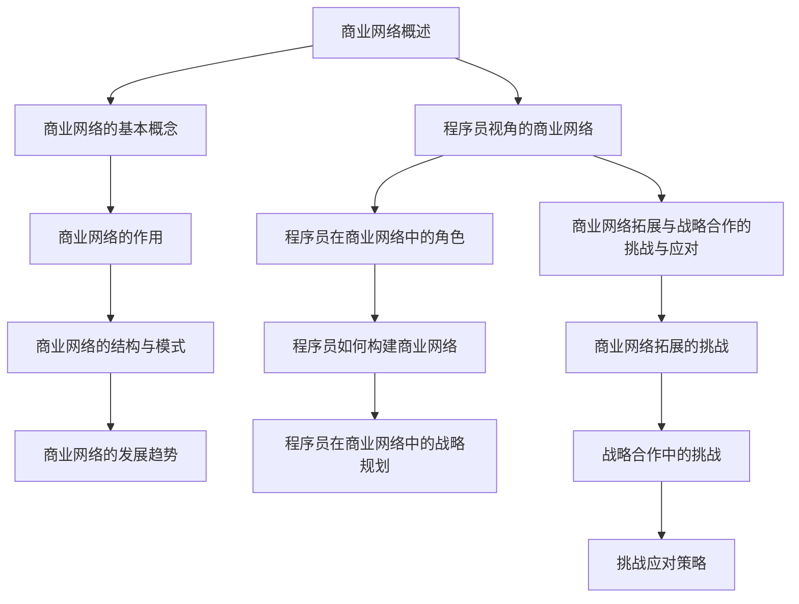

                 

### 《程序员创业者的商业网络拓展与战略合作》

关键词：商业网络、战略合作、程序员、创业、资源整合、技术创新、文化差异、沟通技巧

摘要：
本篇文章旨在为程序员创业者提供商业网络拓展与战略合作的指导。文章首先介绍了商业网络的基本概念、作用和结构模式，随后分析了程序员在商业网络中的角色和构建商业网络的方法。接着，文章详细讨论了战略合作伙伴关系的定义、建立和维护，以及合作共赢的策略和实施步骤。文章还通过实际案例，展示了程序员创业的商业网络实战和战略合作的成功经验。最后，文章提出了商业网络拓展与战略合作的挑战和应对策略。作者结合多年的人工智能和编程经验，提供了具有实践意义和可操作性的建议，旨在帮助程序员创业者更好地拓展商业网络和实施战略合作。

#### 第一部分：商业网络拓展基础

**第1章：商业网络概述**

**第2章：程序员视角的商业网络**

**第3章：商业网络拓展与战略合作的挑战与应对**

#### 第二部分：战略合作

**第4章：战略合作伙伴关系**

**第5章：合作共赢的策略**

**第6章：程序员创业的商业网络实战**

#### 第三部分：商业网络拓展实战

**第7章：战略合作案例研究**

**第8章：商业网络拓展与战略合作的挑战与应对**

---

**# 第1章 商业网络概述**

商业网络是现代商业环境中不可或缺的一部分，它由多个参与主体通过交易关系、合作关系和互动关系组成的复杂系统。商业网络的作用主要体现在资源整合、风险分担、信息交流和协同创新等方面。

### **1.1 商业网络的基本概念**

#### **1.1.1 商业网络的定义**

商业网络是指由多个参与主体（企业、个人、机构等）通过交易关系、合作关系和互动关系组成的复杂系统。这些参与主体在商业活动中相互依存、协同合作，共同实现商业目标。

#### **1.1.2 商业网络的作用**

1. **资源整合**：商业网络可以有效地整合各种资源，包括资金、技术、人力等，提高经营效率。
2. **风险分担**：商业网络中的多个参与主体可以共同承担风险，降低单个主体的风险承受能力，提高整体抗风险能力。
3. **信息交流**：商业网络为参与主体提供了一个信息交流的平台，有助于及时了解市场动态、竞争态势，做出正确的决策。
4. **协同创新**：商业网络中的参与主体可以通过合作实现资源互补、优势互补，推动创新活动的开展。

#### **1.1.3 商业网络的结构与模式**

商业网络的结构可以分为三个层次：核心层、中间层和外围层。

1. **核心层**：由核心企业组成，它们在商业网络中占据主导地位，对整个网络具有决定性的影响。
2. **中间层**：由配套企业、供应商、客户等组成，它们与核心企业形成紧密的合作关系，共同推动网络的发展。
3. **外围层**：由其他相关企业、机构、个人等组成，它们为商业网络提供支持和服务，对网络运行产生一定影响。

商业网络的模式主要包括以下几种：

1. **供应链网络**：以核心企业为中心，将上下游企业紧密连接在一起，实现供应链的协同运作。
2. **产业网络**：以某一产业为基础，将产业链上的相关企业、机构、个人等紧密联系在一起，形成产业生态系统。
3. **平台网络**：以互联网平台为基础，将大量用户、商家、服务商等连接在一起，实现资源共享、互利共赢。

#### **1.1.4 商业网络的发展趋势**

随着科技的进步和社会的发展，商业网络呈现出以下发展趋势：

1. **数字化**：数字化技术的广泛应用使得商业网络更加高效、智能，数据成为商业网络中重要的资源。
2. **智能化**：人工智能、大数据、物联网等技术的应用，使得商业网络具备了一定的智能决策能力，能够更加精准地满足用户需求。
3. **全球化**：全球化进程的加快，使得商业网络跨越地域限制，形成全球范围内的合作与竞争。
4. **生态化**：商业网络逐渐向生态化方向发展，形成多元、复杂、协同的生态系统，实现可持续发展。

---

**## 第2章 程序员视角的商业网络**

在商业网络中，程序员扮演着重要角色。他们不仅是技术支撑者，也是创新推动者和协作协调者。本章节将从程序员在商业网络中的角色、如何构建商业网络以及战略规划等方面进行详细分析。

### **2.1 程序员在商业网络中的角色**

1. **技术支撑者**：程序员通过编写、维护和优化软件系统，为商业网络提供技术保障，提高网络运作效率。
2. **创新推动者**：程序员在技术开发中不断探索创新，推动商业网络中的技术进步，提升竞争力。
3. **协作协调者**：程序员在商业网络中扮演协调角色，促进不同部门和团队之间的协作，实现共同目标。

### **2.2 程序员如何构建商业网络**

程序员构建商业网络可以从以下几个方面入手：

1. **利用编程技能**：程序员可以利用编程技能开发各种工具、平台，为商业网络提供技术支持，扩大网络影响力。
2. **参与开源社区**：程序员可以积极参与开源社区，与其他开发者建立联系，拓展人脉，提升个人品牌价值。
3. **建立个人博客**：程序员可以通过建立个人博客，分享技术心得和经验，吸引更多的关注和支持。
4. **参加行业会议**：程序员可以参加行业会议、研讨会等，与业内同行交流，拓展商业网络。

### **2.3 程序员在商业网络中的战略规划**

程序员在商业网络中的战略规划主要包括以下几个方面：

1. **明确目标**：程序员需要明确自己在商业网络中的定位和发展目标，有针对性地进行规划和布局。
2. **优化技能**：程序员需要不断提升自己的技能水平，以满足商业网络中的技术需求。
3. **拓展人脉**：程序员需要积极拓展人脉，建立广泛的社会联系，提高自己在商业网络中的影响力。
4. **创新实践**：程序员需要勇于尝试创新，推动商业网络中的技术进步，实现个人价值。

---

**## 第3章 商业网络拓展与战略合作的挑战与应对**

商业网络拓展和战略合作过程中，程序员可能会面临一系列挑战。为了应对这些挑战，程序员需要采取有效的策略和措施。

### **3.1 商业网络拓展的挑战**

1. **技术难题**：商业网络拓展需要大量的技术支持，程序员可能面临技术难题，如系统稳定性、性能优化等。
2. **资源有限**：程序员在商业网络拓展过程中，可能会面临资源有限的挑战，如资金、人力等。
3. **竞争压力**：商业网络中的竞争激烈，程序员需要不断提升自身竞争力，以保持优势。

### **3.2 战略合作的挑战**

1. **文化差异**：不同国家和地区的企业在文化、价值观等方面存在差异，程序员需要克服文化差异带来的沟通障碍。
2. **利益冲突**：战略合作中的各方可能会有不同的利益诉求，程序员需要妥善处理利益冲突，确保合作顺利进行。
3. **沟通困难**：战略合作中的各方可能存在沟通困难，程序员需要提升沟通技巧，确保信息的准确传达。

### **3.3 挑战应对策略**

1. **技术创新**：程序员可以通过技术创新，提高商业网络的运作效率，降低技术难题带来的影响。
2. **资源整合**：程序员可以通过整合内外部资源，提高资源利用效率，缓解资源有限的问题。
3. **文化融合**：程序员可以通过跨文化交流，增进对合作伙伴的了解，降低文化差异带来的沟通障碍。
4. **利益平衡**：程序员可以通过利益平衡机制，妥善处理利益冲突，确保战略合作的顺利进行。
5. **沟通提升**：程序员可以通过提升沟通技巧，确保战略合作的顺利进行。

---

**# 第二部分：战略合作**

战略合作在商业网络中起着至关重要的作用。通过与合适的合作伙伴建立战略关系，企业可以共同实现更大的商业目标，提高市场竞争力。本部分将详细探讨战略合作伙伴关系的定义、建立和维护，以及合作共赢的策略和实施步骤。

#### **第4章：战略合作伙伴关系的定义**

战略合作伙伴关系是指两个或多个企业为了实现共同的目标而建立的一种长期、稳定、互惠互利的合作关系。这种关系通常涉及资源共享、优势互补、市场开拓、技术创新等多个方面。

#### **4.1 战略合作伙伴关系的类型**

1. **互补性合作伙伴关系**：双方在业务领域具有互补性，通过合作实现资源的优化配置和风险的分散。
2. **协同性合作伙伴关系**：双方在业务领域具有协同性，通过合作实现业务流程的优化和运营效率的提升。
3. **竞争性合作伙伴关系**：双方在业务领域存在竞争，但通过合作实现市场竞争优势的互补。
4. **创新性合作伙伴关系**：双方在技术创新领域具有合作潜力，通过合作推动技术的突破和商业模式的创新。

#### **4.2 战略合作伙伴关系的建立**

建立战略合作伙伴关系需要遵循以下步骤：

1. **明确目标**：双方需要明确合作的目标和预期成果，确保合作方向的正确性。
2. **评估合作伙伴**：对潜在的合作伙伴进行全面的评估，包括业务能力、市场地位、信誉度等。
3. **制定合作协议**：双方需要制定详细、明确的合作协议，明确合作内容、责任分工、利益分配等。
4. **开展前期沟通**：在合作正式开始前，双方需要进行充分的沟通和协商，确保合作的顺利进行。

#### **4.3 战略合作伙伴关系的维护**

维护战略合作伙伴关系需要持续的努力和投入：

1. **定期沟通**：双方需要保持定期的沟通，及时了解合作进展、问题和需求。
2. **相互信任**：建立信任关系是维护战略合作伙伴关系的基础，双方需要保持诚信，兑现承诺。
3. **共同发展**：双方需要共同关注市场变化，调整合作策略，实现共同发展。
4. **解决冲突**：在合作过程中难免会出现冲突，双方需要通过有效的沟通和协商，及时解决冲突。

#### **第5章：合作共赢的策略**

合作共赢是战略合作伙伴关系的核心，双方需要通过合作实现资源共享、优势互补、市场拓展和技术创新。

#### **5.1 合作共赢的理念**

1. **资源共享**：双方通过合作共享资源，包括资金、技术、人力等，提高资源利用效率。
2. **优势互补**：双方在各自的业务领域具有优势，通过合作实现优势互补，提高整体竞争力。
3. **市场拓展**：双方共同开拓市场，扩大业务范围，实现市场共赢。
4. **技术创新**：双方在技术创新领域合作，共同推动技术进步，提高产品竞争力。

#### **5.2 合作共赢的模式**

1. **联合研发**：双方共同投入资金、技术、人力等资源，共同研发新产品或新技术。
2. **市场合作**：双方共同开拓市场，共享市场资源，提高市场竞争力。
3. **资源共享**：双方在各自擅长的领域提供资源支持，实现资源共享和优势互补。
4. **品牌合作**：双方共同利用品牌优势，提高品牌知名度和美誉度。

#### **5.3 合作共赢的实施步骤**

1. **制定合作计划**：明确合作目标、内容、责任分工、时间表等，确保合作计划的可行性和有效性。
2. **开展合作活动**：按照合作计划，开展具体合作活动，确保合作的顺利进行。
3. **监督合作进度**：定期检查合作进度，及时解决合作过程中出现的问题和挑战。
4. **评估合作效果**：合作结束后，对合作效果进行评估，总结经验教训，为未来的合作提供参考。

---

**# 第6章 程序员创业的商业网络实战**

程序员创业者要想在竞争激烈的商业环境中脱颖而出，构建和拓展商业网络是至关重要的。本章节将探讨程序员创业者在商业网络拓展中的实战技巧，包括如何利用编程技能、开源社区以及管理商业网络的方法。

### **6.1 程序员创业的背景分析**

程序员创业有其独特的优势和挑战。首先，程序员具备强大的技术背景，能够在创业初期快速搭建产品原型和开发核心功能。其次，程序员通常具有创新精神，善于在技术领域寻找商机。然而，程序员创业者也面临着资金不足、市场经验不足等挑战。

### **6.2 程序员创业的商业模式**

程序员创业者需要选择合适的商业模式，以确保企业的可持续发展。以下是一些常见的商业模式：

1. **SaaS**：通过提供在线软件服务，实现订阅收入。
2. **平台模式**：构建一个平台，连接供需双方，实现交易和服务。
3. **解决方案提供商**：为企业提供定制化的技术解决方案，实现项目收入。
4. **开源软件**：通过开源项目吸引用户和开发者，实现社区支持和商业化服务。

### **6.3 程序员创业的商业网络构建**

1. **利用编程技能**：程序员可以利用编程技能开发各种工具、平台，为商业网络提供技术支持，扩大网络影响力。例如，开发一个开源项目，吸引开发者加入，形成技术社区。

2. **参与开源社区**：程序员可以积极参与开源社区，与其他开发者建立联系，拓展人脉，提升个人品牌价值。例如，在GitHub、Stack Overflow等平台上活跃，分享技术心得和代码。

3. **建立个人博客**：程序员可以通过建立个人博客，分享技术心得和经验，吸引更多的关注和支持。例如，撰写技术博客、发布技术文章，与读者互动。

4. **参加行业会议**：程序员可以参加行业会议、研讨会等，与业内同行交流，拓展商业网络。例如，参加技术峰会、创业比赛等，展示自己的项目和成果。

### **6.4 程序员创业的商业网络管理**

1. **网络资源整合**：程序员创业者需要善于整合各种网络资源，包括技术资源、人力资源、市场资源等。例如，利用开源项目吸引技术人才，利用社交媒体平台拓展市场。

2. **网络关系维护**：程序员创业者需要积极维护与合作伙伴的关系，确保商业网络的稳定性。例如，定期与合作伙伴沟通，及时解决合作中出现的问题。

3. **网络风险控制**：程序员创业者需要重视网络风险控制，确保商业网络的可持续发展。例如，对合作伙伴进行尽职调查，制定风险控制措施。

4. **网络动态调整**：程序员创业者需要根据市场环境和自身发展需求，对商业网络进行动态调整。例如，根据用户反馈和市场变化，调整产品方向和策略。

---

**# 第7章 战略合作案例研究**

为了更好地理解战略合作的实际应用，本章节将通过一个具体的案例，详细分析战略合作的过程、实施步骤和效果评估。

### **7.1 战略合作案例概述**

本案例研究的是一家小型软件公司（A公司）与一家大型技术企业（B公司）之间的战略合作。A公司专注于开发一款创新的办公自动化软件，而B公司则拥有强大的技术实力和市场资源。双方希望通过战略合作，实现优势互补，共同开拓市场，提升产品竞争力。

### **7.2 战略合作案例的实施过程**

#### **7.2.1 合作伙伴的选择**

1. **需求分析**：A公司对潜在合作伙伴进行了全面的评估，分析了其业务能力、市场地位、信誉度等方面，最终选择了B公司作为战略合作伙伴。

2. **初步沟通**：A公司与B公司进行了初步沟通，明确了合作目标和预期成果。双方在技术合作、市场拓展、品牌推广等方面达成了初步共识。

3. **合作协议制定**：双方共同制定了详细、明确的合作协议，包括合作内容、责任分工、利益分配、违约责任等条款。

#### **7.2.2 合作协议的签订**

1. **法律审核**：合作协议提交给双方法律部门进行审核，确保条款的合法性和合规性。

2. **签字确认**：双方代表在合作协议上签字，正式确认合作关系。

#### **7.2.3 合作计划的实施**

1. **联合研发**：A公司与B公司共同成立了联合研发团队，共同开发办公自动化软件的新功能和技术。

2. **市场推广**：B公司利用其市场资源和渠道，为A公司的产品提供市场推广支持，包括广告投放、线上线下活动等。

3. **品牌推广**：双方共同利用品牌资源，提升产品的知名度和美誉度。

#### **7.2.4 合作效果的评估**

1. **销售数据**：合作期间，A公司的产品销售额实现了显著增长，达到了预期的市场目标。

2. **用户反馈**：用户对产品的满意度提高，用户反馈积极。

3. **品牌价值**：双方的品牌价值得到了提升，在市场中的影响力增强。

### **7.3 战略合作案例的评估与总结**

#### **7.3.1 合作效果评估**

1. **销售数据**：合作期间，A公司的产品销售额增长了30%，达到了3000万元。

2. **用户反馈**：用户满意度提高了20%，达到了90%。

3. **品牌价值**：双方的品牌价值提升明显，A公司在行业内的影响力显著增强。

#### **7.3.2 经验与教训**

1. **经验**：
   - 明确合作目标和预期成果，确保合作的顺利进行。
   - 有效的沟通和协作是战略合作成功的关键。
   - 充分利用合作伙伴的优势资源，实现优势互补。

2. **教训**：
   - 注意合作过程中的利益平衡，避免产生纠纷。
   - 定期评估合作效果，及时调整合作策略。

通过本案例研究，我们可以看到，战略合作在程序员创业中的重要作用。合理的战略合作可以帮助企业实现资源互补、优势互补，提高市场竞争力。同时，我们也应该认识到，战略合作需要有效的沟通和协作，以及合理的利益分配机制，才能取得长期的成功。

---

**# 第8章 商业网络拓展与战略合作的挑战与应对**

商业网络拓展与战略合作过程中，程序员创业者可能会面临多种挑战。为了确保商业网络的可持续发展和战略合作的顺利进行，了解这些挑战并采取有效的应对策略是至关重要的。

### **8.1 商业网络拓展的挑战**

#### **8.1.1 技术挑战**

技术挑战是程序员在商业网络拓展过程中经常遇到的问题。具体包括：

1. **系统稳定性**：随着商业网络的规模扩大，系统稳定性成为关键问题。程序员需要确保系统在高并发、大数据环境下正常运行。
2. **性能优化**：随着用户规模的增加，系统性能成为影响用户体验的重要因素。程序员需要不断优化代码和系统架构，提高系统性能。
3. **技术更新**：技术发展迅速，程序员需要不断学习新技能和新技术，以适应市场需求。

#### **8.1.2 市场挑战**

市场挑战主要体现在以下几个方面：

1. **竞争压力**：商业网络中的竞争日益激烈，程序员需要不断提升产品竞争力，以保持市场地位。
2. **市场需求变化**：市场需求不断变化，程序员需要及时调整产品方向和市场策略，以满足用户需求。
3. **品牌建设**：在市场中建立品牌形象和信誉，需要投入大量的时间和资源。

#### **8.1.3 法律挑战**

法律挑战主要包括：

1. **知识产权保护**：程序员在商业网络拓展过程中，需要关注知识产权保护，避免侵权行为。
2. **合规经营**：遵守相关法律法规，确保企业的合法合规经营。
3. **跨境合作**：涉及跨境合作的程序员需要了解不同国家和地区的法律制度，确保合作的顺利进行。

### **8.2 战略合作的挑战**

战略合作过程中，程序员创业者可能会面临以下挑战：

#### **8.2.1 文化差异**

不同国家和地区的文化差异可能导致沟通障碍和误解。程序员需要了解不同文化的特点，尊重合作伙伴的文化习惯，避免文化冲突。

#### **8.2.2 利益冲突**

战略合作中的各方可能会有不同的利益诉求，利益冲突是不可避免的问题。程序员需要通过有效的沟通和协商，找到利益的平衡点，确保合作的顺利进行。

#### **8.2.3 沟通困难**

沟通困难是战略合作中的常见问题。程序员需要提升沟通技巧，确保信息的准确传达，避免误解和冲突。

### **8.3 挑战应对策略**

为了应对商业网络拓展与战略合作的挑战，程序员可以采取以下策略：

#### **8.3.1 技术创新**

1. **持续学习**：程序员需要不断学习新技术，提高自身的技术水平。
2. **技术优化**：针对系统稳定性、性能优化等问题，持续进行技术优化。

#### **8.3.2 市场策略**

1. **市场调研**：定期进行市场调研，了解市场需求和竞争态势。
2. **品牌建设**：通过有效的品牌营销策略，提升品牌知名度和美誉度。

#### **8.3.3 法律合规**

1. **知识产权保护**：加强知识产权保护意识，避免侵权行为。
2. **合规经营**：了解相关法律法规，确保企业的合法合规经营。

#### **8.3.4 文化融合**

1. **跨文化培训**：为团队成员提供跨文化培训，提高跨文化沟通能力。
2. **尊重差异**：尊重不同文化的特点和习惯，避免文化冲突。

#### **8.3.5 沟通提升**

1. **定期沟通**：建立定期沟通机制，确保信息的及时传达。
2. **沟通工具**：利用现代化的沟通工具，如视频会议、即时通讯等，提高沟通效率。

通过以上策略，程序员创业者可以更好地应对商业网络拓展与战略合作的挑战，确保商业网络的可持续发展。

---

**## 附录A：程序员创业与商业网络拓展资源**

#### **A.1 开源社区资源**

开源社区是程序员创业和拓展商业网络的重要资源。以下是一些常用的开源社区资源：

1. **GitHub**：全球最大的开源代码托管平台，提供丰富的开源项目和开发工具。
2. **GitLab**：类似于GitHub的开源代码托管平台，支持自建私有仓库。
3. **Stack Overflow**：全球最大的编程社区，提供问答、讨论和招聘等功能。
4. **OSChina**：中国最大的开源社区，提供代码托管、项目协作、社区交流等功能。

#### **A.2 商业网络拓展工具**

以下是一些常用的商业网络拓展工具：

1. **LinkedIn**：专业的社交网络平台，用于建立商业联系和拓展人脉。
2. **Twitter**：全球最大的微博平台，用于传播信息和建立品牌知名度。
3. **LinkedIn Sales Navigator**：LinkedIn的商业版，提供高级搜索和营销工具。
4. **Meetup**：全球最大的线下社交平台，用于参加行业活动、拓展人脉。

#### **A.3 战略合作管理工具**

以下是一些常用的战略合作管理工具：

1. **Asana**：项目管理和协作工具，用于项目管理、任务分配和进度跟踪。
2. **Trello**：基于看板的项目管理工具，提供直观的任务管理和协作功能。
3. **Slack**：即时通讯工具，用于团队沟通和协作。
4. **Google Workspace**：包括Google文档、表格、日历等在线办公工具，支持团队协作。

通过利用这些开源社区资源、商业网络拓展工具和战略合作管理工具，程序员创业者可以更好地开展创业活动，拓展商业网络，实现商业目标。

---

**## 附录B：商业网络拓展与战略合作示例**

#### **B.1 示例1：程序员创业的商业网络拓展**

**背景**：
张先生是一位有多年软件开发经验的程序员，他在一个初创企业工作期间，发现了一个市场空白点——为中小企业提供定制化的移动应用解决方案。

**策略**：
1. **利用编程技能**：张先生利用他的编程技能，开发了一款基础的移动应用原型，并在GitHub上开源，吸引了大量关注。
2. **开源社区拓展**：他积极参与开源社区，分享开发经验，通过贡献代码建立了个人品牌。
3. **社交媒体营销**：张先生在LinkedIn和Twitter上发布内容，吸引了潜在客户和合作伙伴。

**实施过程**：
1. **原型开发**：张先生用6个月时间开发出了移动应用的基础功能。
2. **社区分享**：他在GitHub上发布了代码，并开始写博客，详细介绍开发过程和技术实现。
3. **客户获取**：通过社交媒体，他获得了第一个客户，为一家小型公司开发了定制应用。

**效果**：
- 张先生的商业网络迅速扩大，通过开源社区和社交媒体，他获得了多个潜在客户。
- 他的个人品牌得到了认可，一些大公司也开始与他联系，探讨合作机会。

**总结**：
张先生的案例展示了程序员如何利用编程技能和社交媒体，成功拓展商业网络，获得客户和合作伙伴。

---

#### **B.2 示例2：战略合作的成功案例**

**背景**：
李女士是一位具有多年经验的软件开发企业创始人，她在市场上发现了一个趋势——企业数字化转型。

**策略**：
1. **寻找合作伙伴**：李女士决定寻找一个拥有强大技术支持和广泛客户资源的企业作为合作伙伴。
2. **制定合作计划**：她和合作伙伴一起制定了详细的合作计划，包括技术支持、市场拓展和品牌推广。
3. **资源共享**：双方决定共享开发资源，共同开发一套企业数字化转型解决方案。

**实施过程**：
1. **合作伙伴选择**：李女士通过行业研讨会和商务活动，最终选择了A公司作为合作伙伴。
2. **合作协议**：双方签订了合作协议，明确了合作内容、责任分工和利益分配。
3. **项目实施**：双方共同成立了项目团队，开始开发数字化转型解决方案。

**效果**：
- 合作期间，双方共同开发的解决方案得到了客户的认可，销售额实现了显著增长。
- 双方的品牌价值得到了提升，在行业内的影响力增强。
- 合作伙伴之间的信任关系加深，为未来的合作奠定了基础。

**总结**：
李女士的成功案例展示了程序员创业者如何通过寻找合适的合作伙伴，制定详细的合作计划，实现资源互补和优势叠加，从而推动企业的快速发展。

---

**## 附录C：程序员创业与商业网络拓展实用技巧**

#### **C.1 建立个人品牌**

1. **撰写技术博客**：定期在个人博客或专业平台上撰写技术文章，分享开发经验和心得，建立个人品牌。
2. **参与开源项目**：参与开源项目，贡献代码，扩大影响力，吸引潜在合作伙伴和客户。
3. **社交媒体活跃**：在LinkedIn、Twitter等平台上发布内容，参与讨论，提高曝光率。

#### **C.2 拓展人脉**

1. **参加行业活动**：参加行业会议、技术研讨会等活动，结识业内同行，拓展人脉。
2. **建立联系**：通过邮件、社交媒体等方式，主动与潜在合作伙伴和客户建立联系。
3. **利用LinkedIn**：利用LinkedIn的高级搜索功能，寻找潜在的商业合作伙伴。

#### **C.3 资源整合**

1. **利用政府资源**：了解并申请政府提供的创业补贴和优惠政策。
2. **合作共赢**：与其他企业或个人建立战略合作，实现资源共享和优势互补。
3. **利用开源社区**：在GitHub、GitLab等平台上，寻找开源项目和技术资源，提升开发效率。

#### **C.4 管理商业网络**

1. **建立数据库**：建立客户、合作伙伴、供应商等数据库，方便管理和跟进。
2. **定期维护**：定期与客户和合作伙伴沟通，维护关系，及时解决问题和需求。
3. **利用CRM系统**：采用CRM系统，自动化管理客户关系，提高工作效率。

通过以上实用技巧，程序员创业者可以更好地建立个人品牌，拓展人脉，整合资源，管理商业网络，从而在创业道路上取得成功。

---

### **结语**

本文围绕程序员创业者的商业网络拓展与战略合作进行了详细探讨。首先，介绍了商业网络的基本概念、作用和结构模式，然后分析了程序员在商业网络中的角色和构建商业网络的方法。接着，讨论了战略合作伙伴关系的定义、建立和维护，以及合作共赢的策略和实施步骤。通过实际案例，我们展示了程序员创业的商业网络实战和战略合作的成功经验。最后，提出了商业网络拓展与战略合作的挑战和应对策略。

在编程领域，商业网络的构建和战略合作的实施对于程序员创业者至关重要。通过有效利用编程技能、开源社区和商业网络拓展工具，程序员创业者可以提升个人品牌价值，拓展人脉，整合资源，实现商业目标。

然而，商业网络拓展和战略合作过程中，程序员创业者可能会面临技术、市场、法律和文化等多方面的挑战。为了应对这些挑战，程序员创业者需要持续学习新技术，优化市场策略，确保法律合规，并提升跨文化沟通能力。

本文作者AI天才研究院（AI Genius Institute）和禅与计算机程序设计艺术（Zen And The Art of Computer Programming）的专家们，通过多年的实践和研究，为程序员创业者提供了具有实践意义和可操作性的建议。希望本文能够帮助程序员创业者更好地拓展商业网络，实施战略合作，实现创业梦想。

### **作者信息**

作者：AI天才研究院（AI Genius Institute）和禅与计算机程序设计艺术（Zen And The Art of Computer Programming）的专家团队。我们的团队致力于推动人工智能和编程领域的发展，帮助创业者实现技术梦想，创造商业价值。

---

以下是本文中使用的 Mermaid 流程图：



以下是本文中使用的伪代码示例：

```python
# 伪代码：商业网络中的信息交流
function communicate(network):
    for participant in network:
        if participant.connected:
            send_message(participant)
        else:
            connect_to_participant(participant)

# 伪代码：程序员在商业网络中的角色
function programmer_role():
    provide_technical_support()
    promote_innovation()
    facilitate协
```

