                 

### 《程序员利用知识付费实现财富增值》

> **关键词：** 程序员、知识付费、财富增值、盈利模式、营销策略、用户运营、案例分析

**摘要：** 在当今数字化时代，知识付费成为了一种新兴的商业模式，程序员通过利用自己的专业技能和知识，可以借助各种知识付费平台，实现个人品牌的建立和财富的增值。本文将探讨程序员如何通过知识付费实现财富增值的路径，包括知识付费基础、平台运作原理、内容创作策略、盈利模式、营销策略、用户运营以及未来发展趋势等方面的内容。

#### 第一部分：知识付费基础

##### 第1章：知识付费概述

知识付费，是指用户为获取知识内容、专业技能培训或咨询服务而支付的费用。这一现象在互联网时代得以迅速发展，主要得益于以下几个因素：

1. **互联网的普及**：互联网的普及使得知识和信息可以高效传播，降低了知识获取的门槛。
2. **技能需求的增加**：随着经济结构转型和新兴行业的崛起，技能需求多样化，人们更加注重通过付费获取高质量的技能培训。
3. **用户付费习惯的养成**：随着互联网消费模式的成熟，用户逐渐接受为知识和服务付费。

知识付费的定义和演变可以从经济学角度进行阐述。知识付费的核心价值体现在知识的经济价值上。公式 $E = \frac{K}{C}$ 可以描述这一现象：

- **$E$**：知识经济价值，即知识为用户带来的价值。
- **$K$**：知识含量，即知识本身的丰富程度和质量。
- **$C$**：知识传播成本，即用户获取知识所需支付的成本。

随着知识传播成本的降低，知识经济价值逐渐凸显，促使知识付费模式的发展。

知识付费的市场现状与趋势显示，这一领域正在快速扩展。根据艾瑞咨询的数据，2019年中国知识付费市场规模已达到392亿元，预计到2023年将达到1282亿元。这表明知识付费已经成为一个潜力巨大的市场。

知识付费的核心要素包括：

- **内容质量**：高质量的内容是知识付费的基础，直接关系到用户付费的意愿和复购率。
- **用户体验**：良好的用户体验可以提升用户粘性，增加付费转化率。
- **用户粘性**：高粘性的用户群体可以确保内容的持续消费和付费行为。
- **付费转化率**：即访问用户中实际付费的比例，是衡量平台收益能力的关键指标。
- **复购率**：复购率反映了用户对内容价值的认可程度，是平台稳定收益的重要保障。

为了更好地理解知识付费的核心要素，我们可以借助 Mermaid 流程图来展示其关系：

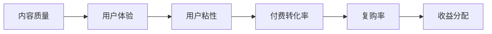

##### 第2章：知识付费平台运作原理

知识付费平台作为连接内容创作者和用户的桥梁，其运作原理涉及到多个环节。下面将详细探讨这些环节，包括商业模式、运营策略和技术架构。

**2.1 知识付费平台的商业模式**

知识付费平台的商业模式通常包括以下环节：

1. **内容创作**：内容创作者在平台上上传知识内容，如课程、文章、音频等。
2. **内容审核**：平台对上传的内容进行审核，确保内容的质量和合规性。
3. **内容发布**：审核通过的内容在平台上发布，供用户浏览和消费。
4. **用户浏览**：用户在平台上浏览和选择感兴趣的知识内容。
5. **用户互动**：用户可以与内容创作者互动，提出问题或参与讨论。
6. **用户付费**：用户为获取完整的内容或额外服务支付费用。
7. **收益分配**：平台根据协议将收益分配给内容创作者和平台自身。

以下是一个简化的 Mermaid 流程图，展示知识付费平台的商业模式：

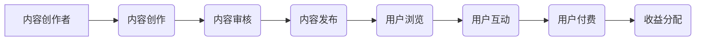

**2.2 知识付费平台的运营策略**

知识付费平台的成功不仅依赖于商业模式，还需要有效的运营策略。以下是一些关键的运营策略：

1. **用户画像分析**：通过数据分析，了解用户的兴趣、行为和需求，进行精准推荐。
2. **精准推荐**：基于用户画像，为用户提供个性化的内容推荐，提高用户粘性。
3. **活动策划**：定期举办活动，如课程促销、用户互动活动等，提升用户活跃度。
4. **社群运营**：建立内容创作者和用户的社群，促进用户互动和内容传播。
5. **内容营销**：通过多种渠道推广优质内容，提高平台知名度和用户转化率。
6. **品牌建设**：塑造平台品牌形象，提高用户对平台的信任和忠诚度。

以下是一个 Mermaid 流程图，展示知识付费平台的运营策略：

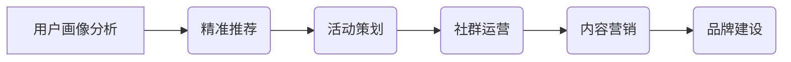

**2.3 知识付费平台的技术架构**

知识付费平台的技术架构通常包括以下组件：

1. **用户端**：用户通过网站、移动应用等途径访问平台，浏览和消费内容。
2. **内容端**：内容创作者上传、管理和发布内容，包括课程、文章、音频等。
3. **支付端**：用户完成支付操作，通过支付系统进行交易。
4. **后台管理**：平台管理员进行内容审核、用户管理、数据分析和系统维护等工作。
5. **数据分析**：通过数据分析，了解用户行为、内容效果等，为运营决策提供支持。
6. **内容审核**：对上传的内容进行审核，确保内容的质量和合规性。

以下是一个 Mermaid 流程图，展示知识付费平台的技术架构：

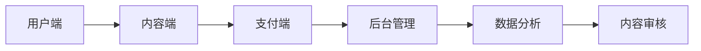

##### 第3章：知识付费的内容创作

知识付费的内容创作是平台的核心环节，内容的质量直接影响用户的付费意愿和平台的市场竞争力。以下是关于内容创作的一些重要观点。

**3.1 内容创作的类型与特点**

知识付费的内容创作类型多样，主要包括以下几种：

1. **专业知识分享**：专家或行业从业者分享他们在专业领域的经验和见解。
2. **行业洞察**：通过对行业趋势、市场动态的分析，为用户提供前瞻性的观点和策略。
3. **技能培训**：针对特定的技能或工具，进行系统性的培训，帮助用户提升技能水平。
4. **案例分析**：通过具体案例的分析，帮助用户理解和应用相关知识和方法。
5. **兴趣爱好**：围绕用户的兴趣爱好，提供相关的内容，满足用户的娱乐和休闲需求。

不同类型的内容创作具有不同的特点：

- **专业知识分享**：内容深度高，针对性强，适用于专业人士。
- **行业洞察**：信息量大，时效性强，适用于对行业动态感兴趣的用户。
- **技能培训**：系统性强，实操性高，适用于希望提升技能水平的用户。
- **案例分析**：案例具体，分析深入，适用于希望提高解决问题能力的用户。
- **兴趣爱好**：内容轻松，趣味性强，适用于追求休闲娱乐的用户。

以下是一个 Mermaid 流程图，展示知识付费内容创作的类型：

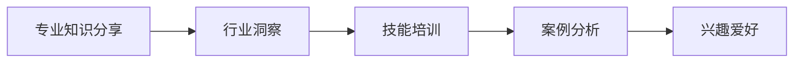

**3.2 内容创作的策略与方法**

为了提高内容创作的效果，程序员可以采取以下策略和方法：

1. **用户需求分析**：通过调研、用户反馈等方式，了解用户的需求和痛点，确定内容创作的方向。
2. **内容定位**：根据用户需求，明确内容的主旨和定位，确保内容的专业性和针对性。
3. **选题策划**：选择具有吸引力和实际应用价值的话题，制定详细的内容策划方案。
4. **内容表达**：采用多种表达方式，如文字、图片、视频等，提高内容的吸引力和易读性。
5. **持续更新**：定期更新内容，保持内容的新鲜感和用户粘性。

以下是一个 Mermaid 流程图，展示内容创作的策略与方法：

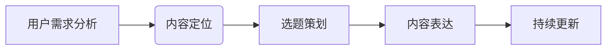

**3.3 内容创作的优化与实践**

为了提升内容创作的效果，程序员可以通过以下方式进行优化和实践：

1. **数据分析**：通过数据分析，了解内容的点击率、用户停留时间、转化率等关键指标，优化内容策略。
2. **用户反馈**：积极收集用户反馈，了解用户对内容的看法和建议，及时进行调整和改进。
3. **内容迭代**：根据用户反馈和数据分析结果，对内容进行迭代和优化，提高内容的实用性和吸引力。
4. **优化效果评估**：定期评估内容优化的效果，确保优化措施的有效性。

以下是一个 Mermaid 流程图，展示内容创作的优化与实践：

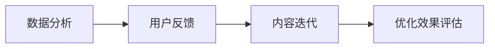

通过上述策略和方法的实践，程序员可以创作出高质量、具有吸引力的知识付费内容，提升用户满意度和付费转化率，从而实现财富增值。

### 第二部分：知识付费变现策略

#### 第4章：知识付费的盈利模式

知识付费的盈利模式多样，主要包括会员制、付费课程、广告收入等。本文将详细探讨这些盈利模式及其运作方式。

**4.1 会员制**

会员制是一种通过提供专属服务来吸引用户持续付费的模式。会员制的主要特点包括：

1. **会员服务**：提供专属内容、高级功能、优惠活动等会员权益，提升用户忠诚度。
2. **会员权益**：根据会员等级，提供不同的服务内容和权益，如免费课程、会员专属折扣等。
3. **会员升级**：鼓励用户升级为更高等级的会员，以获取更多权益。
4. **会员续费**：通过优惠活动、增值服务等方式，提高会员的续费率。
5. **会员转化率**：即从免费用户转化为付费会员的比例，是衡量会员制盈利能力的关键指标。

会员制的盈利模式可以通过以下 Mermaid 流程图进行展示：

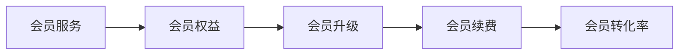

**4.2 付费课程**

付费课程是知识付费平台的主要盈利模式之一。其运作方式包括：

1. **课程定价**：根据课程内容、时长、市场需求等因素，制定合理的课程价格。
2. **课程销售**：通过平台推广、用户推荐等方式，销售课程给学员。
3. **学员反馈**：收集学员的学习反馈，改进课程内容，提高学员满意度。
4. **课程迭代**：根据学员反馈和市场变化，定期更新和优化课程。
5. **收益分配**：平台与内容创作者之间按照约定比例分配收益。

付费课程的盈利模式可以通过以下 Mermaid 流程图进行展示：

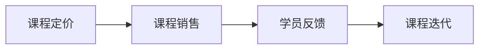

**4.3 广告收入**

广告收入是知识付费平台通过广告投放获取收益的盈利模式。其运作方式包括：

1. **广告投放**：平台根据广告商的需求，在其平台上投放广告。
2. **广告展示**：用户在浏览内容时，看到广告并产生点击。
3. **广告点击**：用户点击广告，为广告商带来流量和收益。
4. **广告收益**：平台根据广告展示量和点击量，与广告商结算收益。

广告收入的盈利模式可以通过以下 Mermaid 流程图进行展示：

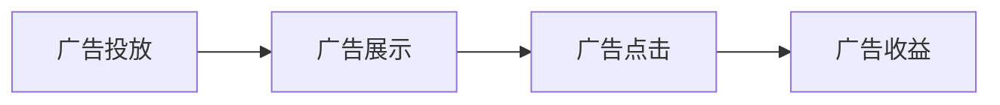

通过以上三种盈利模式的结合，知识付费平台可以实现对内容的有效变现，从而实现可持续的商业模式。

#### 第5章：知识付费的营销策略

知识付费领域的营销策略至关重要，它决定了知识产品的市场推广效果和用户转化率。以下是一些关键的营销策略，包括社交媒体营销、KOL营销和活动营销。

**5.1 社交媒体营销**

社交媒体营销是通过社交媒体平台推广知识产品，增加品牌曝光度和用户参与度的一种策略。其主要方法包括：

1. **内容推广**：发布高质量的内容，如课程介绍、作者访谈、用户评价等，吸引用户关注。
2. **社群互动**：在社交媒体平台上建立社群，与用户进行互动，提升用户参与度和忠诚度。
3. **口碑传播**：鼓励用户在社交媒体上分享知识产品，通过口碑传播扩大影响力。
4. **用户转化**：通过社交媒体上的营销活动，引导用户进行付费转化。

以下是一个 Mermaid 流程图，展示社交媒体营销策略：

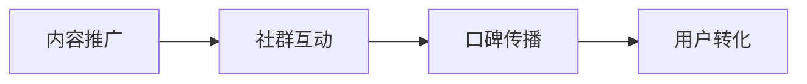

**5.2 KOL营销**

KOL（Key Opinion Leader）营销是通过与知名意见领袖合作，利用其影响力和粉丝基础推广知识产品的一种策略。其主要方法包括：

1. **选择KOL**：根据知识产品的特点和目标用户群体，选择合适的KOL进行合作。
2. **内容合作**：与KOL合作制作内容，如直播课程、访谈、体验分享等，提高内容的吸引力和可信度。
3. **效果评估**：通过数据分析，评估KOL营销的效果，优化合作策略。
4. **品牌宣传**：通过KOL的推广，提高知识产品的品牌知名度和影响力。

以下是一个 Mermaid 流程图，展示KOL营销策略：

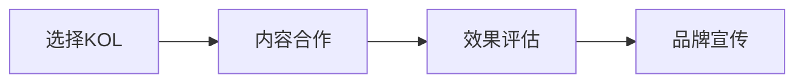

**5.3 活动营销**

活动营销是通过举办各种营销活动，吸引用户参与，提升产品销量的一种策略。其主要方法包括：

1. **活动策划**：根据产品特点和目标用户群体，策划具有吸引力的活动，如限时优惠、免费试听、直播课程等。
2. **活动推广**：通过社交媒体、邮件、短信等渠道，广泛推广活动信息，吸引更多用户参与。
3. **用户参与**：通过互动环节，增加用户参与度，提高活动的效果。
4. **活动效果评估**：通过数据分析，评估活动的效果，为后续活动提供参考。

以下是一个 Mermaid 流程图，展示活动营销策略：

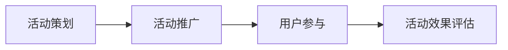

通过以上营销策略的合理运用，知识付费平台可以有效提升产品的市场竞争力，吸引更多用户，实现盈利目标。

#### 第6章：知识付费的用户运营

知识付费平台的核心在于用户运营，有效的用户运营可以提高用户满意度和留存率，从而实现平台的长远发展。以下是关于用户运营的一些关键策略和实践。

**6.1 用户画像与精准营销**

用户画像是指通过数据分析和用户行为分析，对用户进行全面描述的过程。用户画像的核心目的是了解用户的兴趣、需求和行为，从而进行精准营销。

1. **用户数据分析**：通过数据分析，获取用户的基本信息、浏览行为、购买行为等数据。
2. **用户画像构建**：基于数据分析结果，构建用户的兴趣模型、行为模型等，形成用户画像。
3. **个性化推荐**：根据用户画像，为用户推荐个性化的知识内容，提高内容的匹配度和用户满意度。
4. **精准营销**：通过用户画像，制定精准的营销策略，如定向广告投放、定制化优惠活动等。

以下是一个 Mermaid 流程图，展示用户画像与精准营销的过程：

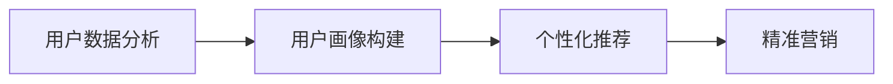

**6.2 用户反馈与互动**

用户反馈和互动是用户运营的重要组成部分，可以有效提高用户满意度和忠诚度。

1. **用户反馈收集**：通过问卷调查、用户评价、在线反馈等渠道，收集用户的意见和建议。
2. **问题解决**：对用户反馈的问题进行及时解决，提高用户满意度。
3. **用户互动**：通过社群、直播、问答等形式，与用户进行互动，建立良好的用户关系。
4. **用户满意度提升**：通过持续的用户互动和问题解决，提高用户满意度，增强用户忠诚度。

以下是一个 Mermaid 流程图，展示用户反馈与互动的过程：

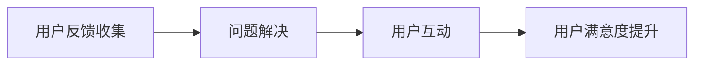

**6.3 用户忠诚度管理**

用户忠诚度管理旨在通过一系列策略和措施，提高用户的忠诚度和复购率。

1. **用户忠诚度评估**：通过用户行为数据，评估用户的忠诚度水平，如购买频率、停留时长等。
2. **用户激励**：通过优惠券、会员权益、积分奖励等方式，激励用户进行复购和推荐。
3. **用户留存**：通过持续的用户运营和服务，提高用户的留存率，降低用户流失率。
4. **复购策略**：通过定期推出优惠活动、更新优质内容等方式，提高用户的复购率。

以下是一个 Mermaid 流程图，展示用户忠诚度管理的过程：

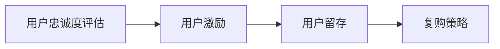

通过以上用户运营策略和实践，知识付费平台可以更好地了解用户需求，提高用户满意度和忠诚度，实现持续的业务增长。

#### 第7章：知识付费的案例分析

在探讨知识付费的实践过程中，成功和失败的案例为我们提供了宝贵的经验和教训。本文将分析两个典型的知识付费案例：知乎Live和某知识付费平台的失败原因。

**7.1 成功案例分析：知乎Live**

知乎Live是知乎推出的付费直播知识分享产品，通过邀请各领域专家进行直播，为用户提供高质量的付费知识内容。知乎Live的成功可从以下几个方面进行分析：

1. **内容质量**：知乎Live邀请的专家均为各领域内的知名人士，保证了内容的专业性和权威性，这吸引了大量用户前来付费学习。
2. **用户体验**：知乎Live提供了直播互动功能，用户可以在直播过程中提问，专家实时回答，这种互动性增强了用户的参与感和体验感。
3. **市场定位**：知乎Live针对的是有强烈求知欲望的用户群体，尤其是那些希望快速获取某一方面知识的用户，这种精准的市场定位使得知乎Live在短时间内获得了大量用户。
4. **收益分配**：知乎Live采用了合理的收益分配机制，创作者可以获得一定比例的收益，这激励了更多优秀的内容创作者加入。

知乎Live的盈利模式主要包括：

- **会员服务**：知乎Live为用户提供会员服务，会员可以享受更多专属内容和优惠。
- **付费直播**：用户为专家的直播课程付费，这是知乎Live的主要收入来源。
- **广告收入**：知乎Live在直播过程中会插入广告，为平台带来额外收入。

以下是一个 Mermaid 流程图，展示知乎Live的盈利模式：

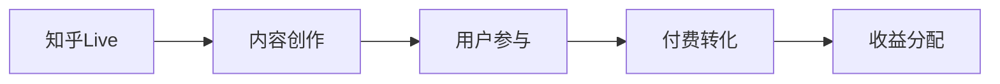

**7.2 失败案例分析：某知识付费平台**

某知识付费平台在初期曾取得一定成功，但后来因为多种原因导致失败。以下是该平台的几个主要问题：

1. **内容同质化**：该平台上的内容过于雷同，缺乏特色和创新，难以吸引和留住用户。
2. **用户体验不佳**：平台在用户界面设计和交互体验上存在不足，用户在使用过程中遇到很多困扰，降低了用户的满意度和忠诚度。
3. **用户流失**：由于内容质量和用户体验问题，用户逐渐流失，导致平台的用户基数减少。
4. **运营困难**：平台在用户运营方面缺乏有效的策略和方法，无法有效提升用户留存率和转化率。
5. **收益不佳**：由于用户流失和用户留存率低，平台收益不佳，最终导致运营困难。

以下是一个 Mermaid 流程图，展示该知识付费平台失败的原因：

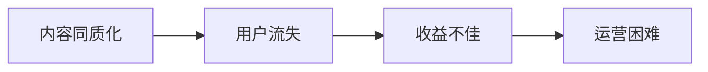

通过分析知乎Live的成功和某知识付费平台的失败，我们可以得出以下结论：

- **内容质量**是知识付费平台成功的关键，高质量的内容可以吸引用户并提高用户满意度。
- **用户体验**是知识付费平台成功的重要因素，良好的用户体验可以增强用户粘性和忠诚度。
- **市场定位**和**收益分配**策略也是知识付费平台成功的关键因素，合理的市场定位和收益分配可以激励更多优秀内容创作者加入，提高平台的竞争力。

### 第三部分：知识付费的未来发展趋势

#### 第8章：技术进步与知识付费

随着技术的不断进步，知识付费领域也面临着新的机遇和挑战。人工智能、区块链、5G与AR/VR等新兴技术正在深刻改变知识付费的形态和模式。

**8.1 人工智能在知识付费中的应用**

人工智能（AI）技术在知识付费中的应用日益广泛，以下是一些典型的应用场景：

1. **内容推荐**：通过机器学习算法，分析用户的兴趣和行为，为用户推荐个性化的知识内容。
2. **用户画像分析**：利用大数据和AI技术，对用户进行全面画像，了解其需求和行为，提高精准营销的效果。
3. **智能客服**：采用自然语言处理技术，实现与用户的智能对话，提供7*24小时的在线服务。
4. **个性化学习**：通过分析用户的学习数据和反馈，提供个性化的学习建议和课程推荐，提高学习效果。

以下是一个 Mermaid 流程图，展示人工智能在知识付费中的应用：

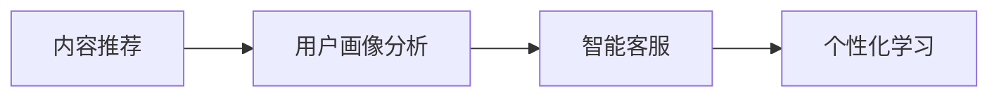

**8.2 区块链在知识付费中的作用**

区块链技术为知识付费带来了新的机遇，主要体现在以下几个方面：

1. **版权保护**：通过区块链技术，实现知识内容的版权登记和保护，防止内容被非法复制和传播。
2. **价值传递**：区块链技术可以实现去中心化的价值传递，确保知识付费过程中的透明性和安全性。
3. **去中心化交易**：通过区块链，实现用户与内容创作者之间的直接交易，减少中间环节，提高效率。
4. **增强信任**：区块链技术提供了一种透明、不可篡改的记录方式，增强了用户对知识付费平台的信任。

以下是一个 Mermaid 流程图，展示区块链在知识付费中的应用：

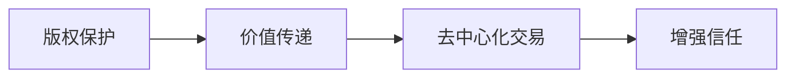

**8.3 5G与AR/VR在知识付费中的影响**

5G和AR/VR技术的发展，为知识付费带来了更多的可能性和体验：

1. **实时互动**：5G技术的高带宽和低延迟，使得知识付费内容可以更加实时和互动，提高用户的参与感。
2. **沉浸式学习**：通过AR/VR技术，用户可以沉浸在虚拟的学习环境中，获得更加丰富和直观的学习体验。
3. **远程教学**：5G和AR/VR技术的结合，使得远程教学成为可能，解决了地域限制，扩大了知识付费的受众范围。
4. **虚拟体验**：通过虚拟现实技术，用户可以体验虚拟课程、模拟实验等，提高学习的趣味性和互动性。

以下是一个 Mermaid 流程图，展示5G与AR/VR在知识付费中的应用：

```mermaid
graph LR
A[实时互动] --> B[沉浸式学习]
B --> C[远程教学]
C --> D[虚拟体验]
```

通过以上技术的应用，知识付费领域将迎来更加个性化和互动化的变革，为用户带来更加丰富和优质的学习体验。

#### 第9章：知识付费的社会影响与伦理问题

知识付费作为一种新兴商业模式，不仅对行业本身产生了深远影响，也对社会和伦理产生了诸多影响。以下将探讨知识付费对社会的影响以及涉及的伦理问题。

**9.1 知识付费对社会的影响**

知识付费对社会的影响是多方面的，主要体现在以下几个方面：

1. **教育公平**：知识付费平台为用户提供了多样化的学习资源，降低了优质教育资源获取的门槛，有助于缩小教育差距，促进教育公平。
2. **知识传播**：知识付费鼓励优质内容的创作和传播，促进了知识的广泛传播和共享，提高了社会的整体知识水平。
3. **技能提升**：知识付费平台提供了丰富的技能培训资源，帮助用户提升专业技能，满足职场发展的需求，提高了社会生产力。
4. **经济变革**：知识付费成为了一种新的经济增长点，推动了数字经济的发展，为传统产业注入了新的活力。

**9.2 知识付费的伦理问题**

知识付费在带来积极影响的同时，也引发了一系列伦理问题，主要包括：

1. **内容真实性**：知识付费平台上的内容质量参差不齐，存在虚假信息和夸大宣传的现象，这可能导致用户误解和误导。
2. **用户隐私**：知识付费平台在收集用户数据时，可能涉及用户隐私的保护问题，如数据泄露、滥用等。
3. **知识产权**：知识付费平台上的内容创作涉及知识产权保护问题，如何确保创作者的权益，防止抄袭和侵权行为，是一个重要挑战。
4. **道德责任**：知识付费平台和内容创作者在推广知识产品时，应承担相应的社会责任，如传播正确价值观、避免误导用户等。

以下是一个 Mermaid 流程图，展示知识付费的伦理问题：

```mermaid
graph LR
A[内容真实性] --> B[用户隐私]
B --> C[知识产权]
C --> D[道德责任]
```

通过上述分析，我们可以看到，知识付费对社会的影响是积极的，但也需要关注和解决其中涉及的伦理问题，以确保知识付费的健康可持续发展。

#### 第10章：知识付费的未来展望

随着技术的不断进步和社会的快速发展，知识付费领域正迎来前所未有的机遇和挑战。以下是关于知识付费未来发展趋势的展望。

**10.1 知识付费的全球趋势**

全球知识付费市场正呈现以下趋势：

1. **市场规模扩大**：随着知识经济的崛起和人们对终身学习的需求增加，知识付费市场规模将继续扩大。
2. **内容多样化**：知识付费内容将更加多样化，包括在线课程、电子书、音频、视频等多种形式，满足不同用户的需求。
3. **个性化学习**：人工智能和大数据技术的应用，将推动个性化学习的发展，为用户提供量身定制的学习方案。
4. **跨领域融合**：知识付费将与教育培训、企业培训、在线娱乐等领域深度融合，形成新的商业模式。

**10.2 知识付费在中国的发展**

在中国，知识付费市场正迎来快速发展期，主要表现在：

1. **用户增长**：随着移动互联网的普及和消费升级，知识付费用户数量将持续增长。
2. **市场规模扩大**：知识付费市场规模不断扩大，预计未来几年将保持高速增长。
3. **内容创新**：国内知识付费平台在内容创作和运营方面不断创新，推出更多高质量、有特色的内容。
4. **技术驱动**：人工智能、区块链、5G等新兴技术的应用，将推动知识付费领域的技术创新和服务升级。

**10.3 知识付费的未来方向**

知识付费的未来发展方向主要包括：

1. **终身教育**：知识付费将逐渐融入终身教育体系，为用户提供全生命周期的学习支持。
2. **跨界融合**：知识付费将与更多行业领域融合，如健康、金融、艺术等，提供多元化的学习内容和服务。
3. **全球共享**：知识付费将实现全球共享，打破地域限制，为全球用户带来更加便捷的学习体验。
4. **个性化学习**：通过大数据和人工智能技术，实现真正意义上的个性化学习，满足用户的个性化需求。

以下是一个 Mermaid 流程图，展示知识付费的未来发展方向：

```mermaid
graph LR
A[个性化学习] --> B[终身教育]
B --> C[跨界融合]
C --> D[全球共享]
```

通过以上分析，我们可以看到，知识付费领域在未来将继续保持高速发展，成为推动社会进步和经济发展的重要力量。

### 附录

#### 附录A：知识付费平台资源汇总

为了帮助程序员更好地了解和利用知识付费平台，以下汇总了一些主流知识付费平台及其资源。

**A.1 主流知识付费平台简介**

以下是当前市场上一些主流的知识付费平台及其简介：

1. **得到**：得到是中国领先的音频付费知识平台，提供包括课程、文章、电子书等多种形式的知识内容。
2. **知乎Live**：知乎Live是知乎推出的付费直播知识分享产品，涵盖多个领域的专业知识和经验分享。
3. **喜马拉雅**：喜马拉雅是中国领先的音频分享平台，提供丰富的音频内容，包括课程、小说、音乐等。
4. **分答**：分答是一个问答社区平台，用户可以付费向专家提问，获取专业解答。
5. **网易云课堂**：网易云课堂是网易云推出的在线教育平台，提供编程、设计、语言等多种课程。

以下是一个 Mermaid 流程图，展示主流知识付费平台：

```mermaid
graph LR
A[得到] --> B[知乎Live]
B --> C[喜马拉雅]
C --> D[分答]
D --> E[网易云课堂]
```

**A.2 知识付费开发工具与资源**

以下是程序员在进行知识付费平台开发时可能用到的工具和资源：

1. **内容管理系统（CMS）**：如WordPress、Joomla等，用于管理平台上的知识内容。
2. **用户管理系统（UMS）**：如Userify、Userfront等，用于管理用户信息和权限。
3. **支付系统**：如PayPal、Stripe等，用于处理用户支付和退款操作。
4. **数据分析工具**：如Google Analytics、Mixpanel等，用于分析用户行为和数据。
5. **内容审核工具**：如Cloudflare、Contenta等，用于审核上传的内容，确保内容质量。

以下是一个 Mermaid 流程图，展示知识付费开发工具与资源：

```mermaid
graph LR
A[内容管理系统] --> B[用户管理系统]
B --> C[支付系统]
C --> D[数据分析工具]
D --> E[内容审核工具]
```

**A.3 知识付费行业报告**

以下是几份关于知识付费行业的重要报告：

1. **艾瑞咨询**：艾瑞咨询发布的《2020年中国知识付费行业研究报告》。
2. **企鹅智库**：企鹅智库发布的《2021年中国知识付费行业报告》。
3. **高德纳咨询公司**：高德纳咨询公司发布的《全球在线教育市场预测》报告。
4. **其他市场研究机构**：如领英、网易云课堂等机构发布的知识付费行业报告。

以下是一个 Mermaid 流程图，展示知识付费行业报告：

```mermaid
graph LR
A[艾瑞咨询] --> B[企鹅智库]
B --> C[高德纳咨询公司]
C --> D[其他市场研究机构]
```

通过以上资源，程序员可以更好地了解知识付费行业的发展动态，为自己的知识付费项目提供参考和指导。

