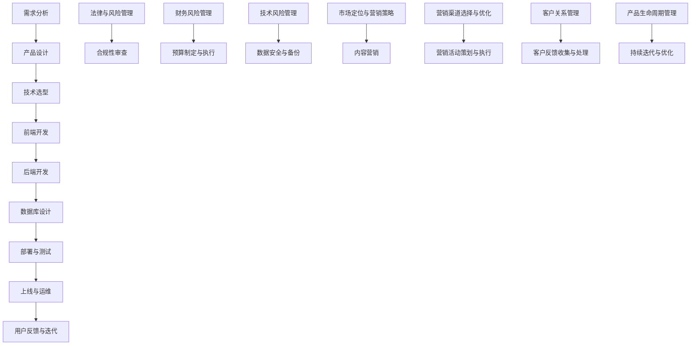

                 

### 引言与概述

在当今快速发展的数字化时代，软件即服务（SaaS）已经成为企业服务市场的重要趋势。随着云计算和大数据技术的普及，越来越多的企业开始将传统的技术咨询服务转化为SaaS产品，以提供更加灵活、可扩展的服务。这不仅为企业带来了新的增长点，也极大地改变了技术服务行业的发展格局。

#### SaaS市场的增长趋势

SaaS市场呈现出快速增长的态势，根据市场研究机构的预测，全球SaaS市场的规模将在未来几年内持续扩大。这一增长趋势主要得益于以下几个因素：

1. **企业数字化转型需求**：越来越多的企业意识到数字化转型的重要性，希望通过引入SaaS产品来提升业务效率、降低运营成本。
2. **云计算技术的普及**：云计算为SaaS产品的开发和部署提供了强大的基础设施支持，使得企业可以更加轻松地构建和管理SaaS平台。
3. **互联网的普及**：互联网的普及使得企业可以轻松地接触到全球的客户，为SaaS产品的市场推广提供了更广阔的空间。

#### 技术咨询服务转型SaaS的驱动力

技术咨询服务转型为SaaS产品具有多方面的优势，这也是推动这一转变的关键驱动力：

1. **规模经济**：SaaS产品可以服务于多个客户，通过规模效应降低成本，提高利润率。
2. **灵活性**：SaaS产品可以灵活地根据客户需求进行定制和扩展，提供更加个性化的服务。
3. **易于推广**：SaaS产品可以通过网络快速推广，不需要大量的线下市场投入。
4. **可持续性**：SaaS产品通过订阅模式，为企业提供了持续的收入流，有利于长期发展。

#### 转型过程中的常见挑战

尽管技术咨询服务转型为SaaS产品具有诸多优势，但这一过程也面临着一系列挑战：

1. **技术架构的调整**：SaaS产品需要适应多租户架构，确保数据的安全和隔离。
2. **用户体验设计**：SaaS产品的用户体验设计至关重要，需要充分考虑用户的便利性和满意度。
3. **数据管理**：SaaS产品需要处理大量客户数据，如何确保数据的安全和合规是重要问题。
4. **市场推广与运营**：如何有效地推广和运营SaaS产品，吸引和维护客户群，是成功转型的关键。

本文将围绕以上核心内容，逐步探讨如何将技术咨询服务成功转化为SaaS产品，为程序员和技术创业者提供实用的指导和案例分析。

---

关键词：SaaS市场、技术咨询服务、转型、云计算、用户体验、数据管理、市场推广

摘要：本文详细探讨了如何将技术咨询服务转化为SaaS产品。通过分析SaaS市场的增长趋势、转型驱动力和面临的挑战，本文提出了系统化的解决方案，包括技术架构调整、用户体验设计、数据管理和市场推广等关键环节。通过案例分析和实战指导，本文旨在为程序员和技术创业者提供全面的参考和实用的工具。文章从引言到实际案例代码和运维流程，全面覆盖了SaaS产品开发与运营的各个层面，旨在助力读者在SaaS市场中取得成功。

---

### 目录大纲：《程序员如何将技术咨询服务转化为SaaS产品》

在接下来的部分，我们将详细探讨如何将技术咨询服务成功转化为SaaS产品。为了帮助读者更清晰地理解整个转型过程，本文将按照以下目录大纲进行结构化讲解：

#### 第一部分：引言与概述
1. **引言：SaaS产品的机遇与挑战**
   - SaaS市场的增长趋势
   - 技术咨询服务转型SaaS的驱动力
   - 转型过程中的常见挑战

2. **技术咨询服务的基础**
   - 技术咨询服务的核心能力
   - 技术咨询服务的价值链
   - 咨询服务的交付模式
   - 客户关系的建立与维护

#### 第二部分：SaaS产品设计与开发
3. **SaaS产品设计与规划**
   - SaaS产品的核心功能与特性
   - 产品设计的原则与方法
   - 用户需求的调研与分析

4. **SaaS平台搭建与部署**
   - 选择合适的SaaS平台
   - 服务架构设计与实现
   - 数据库设计与存储优化

5. **用户交互与体验设计**
   - 用户体验设计的重要性
   - 用户界面与交互设计
   - 用户行为分析与优化

#### 第三部分：技术咨询服务与SaaS产品的融合
6. **技术服务的SaaS化**
   - 技术服务流程的数字化
   - SaaS产品的增值服务
   - SaaS产品对技术服务的优化

7. **市场推广与运营**
   - 市场定位与营销策略
   - 营销渠道的选择与优化
   - 营销活动的策划与执行

8. **产品运营与客户支持**
   - SaaS产品的生命周期管理
   - 客户反馈与迭代优化
   - 客户服务与支持体系的建立

#### 第四部分：法律与风险管理
9. **SaaS产品的法律合规性**
   - 数据保护与隐私政策
   - 用户协议与知识产权保护
   - 合同管理与服务条款

10. **风险管理与防范**
    - 财务风险管理
    - 技术风险管理
    - 业务连续性与灾难恢复

#### 第五部分：案例分析与实践
11. **成功案例解析**
    - 成功案例的商业模式
    - 转型过程中的关键决策
    - 经验教训与最佳实践

12. **实战演练：搭建SaaS产品**
    - 开发环境的搭建
    - 实际代码的实现与解读
    - 部署与运维的实践

#### 附录
13. **附录 A：SaaS开发工具与资源**
    - 开发工具的选择与使用
    - 资源链接与参考资料

14. **附录 B：SaaS产品开发流程图**
    - 产品开发流程的Mermaid流程图

15. **附录 C：核心算法原理讲解**
    - 算法选择与适用场景
    - 伪代码描述
    - 数学模型描述
    - 模型应用与实现

16. **附录 D：SaaS产品开发代码实战**
    - 实际案例代码
    - 开发环境配置与调试
    - 运维与监控

通过以上目录大纲，本文将系统地介绍如何将技术咨询服务成功转化为SaaS产品，旨在为程序员和技术创业者提供全面的指导和实用的工具。接下来，我们将逐一深入探讨每个部分的内容。

---

### 第一部分：引言与概述

#### 引言：SaaS产品的机遇与挑战

在当前技术飞速发展的背景下，软件即服务（SaaS）模式已经成为企业服务市场的重要组成部分。SaaS产品以其灵活的部署方式、较低的维护成本和强大的扩展性，受到了众多企业的青睐。据统计，全球SaaS市场在近年来的复合年增长率（CAGR）保持在20%以上，预计到2025年，市场规模将达到4000亿美元。这一数据充分体现了SaaS市场的巨大潜力和广阔前景。

#### SaaS市场的增长趋势

SaaS市场的增长趋势主要受到以下几个因素的驱动：

1. **企业数字化转型需求**：随着全球数字化进程的加速，企业越来越意识到数字化转型的重要性。通过引入SaaS产品，企业可以迅速提升业务效率、优化运营流程，从而在激烈的市场竞争中占据优势。

2. **云计算技术的普及**：云计算为SaaS产品的开发和部署提供了强大的基础设施支持。企业无需自建IT基础设施，即可通过云平台快速搭建和管理SaaS平台，降低运营成本和风险。

3. **互联网的普及**：互联网的普及使得SaaS产品的市场推广更加便捷。企业可以通过互联网快速触达全球客户，无需大量线下市场投入，从而实现业务的快速扩展。

#### 技术咨询服务转型SaaS的驱动力

技术咨询服务转型为SaaS产品具有多方面的优势，这也是推动这一转变的关键驱动力：

1. **规模经济**：SaaS产品可以服务于多个客户，通过规模效应降低成本，提高利润率。与传统的咨询服务相比，SaaS产品具有更高的经济性，能够吸引更多客户。

2. **灵活性**：SaaS产品可以灵活地根据客户需求进行定制和扩展，提供更加个性化的服务。这种灵活性使得SaaS产品在市场竞争中具有更大的优势。

3. **易于推广**：SaaS产品可以通过网络快速推广，不需要大量的线下市场投入。企业可以通过线上渠道，如社交媒体、在线广告等，快速扩大客户群体。

4. **可持续性**：SaaS产品通过订阅模式，为企业提供了持续的收入流，有利于长期发展。与传统的一次性咨询服务相比，订阅模式能够为企业带来更加稳定的现金流。

#### 转型过程中的常见挑战

尽管技术咨询服务转型为SaaS产品具有诸多优势，但这一过程也面临着一系列挑战：

1. **技术架构的调整**：SaaS产品需要适应多租户架构，确保数据的安全和隔离。与传统的单体应用不同，SaaS产品需要在设计时充分考虑并发处理、数据隔离等问题。

2. **用户体验设计**：SaaS产品的用户体验设计至关重要，需要充分考虑用户的便利性和满意度。用户体验不佳可能会导致用户流失，影响产品的市场表现。

3. **数据管理**：SaaS产品需要处理大量客户数据，如何确保数据的安全和合规是重要问题。企业需要建立健全的数据保护机制，以避免数据泄露等风险。

4. **市场推广与运营**：如何有效地推广和运营SaaS产品，吸引和维护客户群，是成功转型的关键。企业需要在市场推广、客户服务等方面投入足够的资源和精力。

#### 总结

SaaS市场的增长趋势和技术咨询服务转型SaaS的驱动力为程序员和技术创业者提供了广阔的发展空间。然而，转型过程中也面临着诸多挑战，需要企业在技术架构、用户体验、数据管理和市场推广等方面进行全面的规划和布局。本文将围绕这些核心内容，逐步探讨如何将技术咨询服务成功转化为SaaS产品，为读者提供实用的指导和案例分析。

---

### 技术咨询服务的基础

#### 技术咨询服务的核心能力

技术咨询服务是企业解决技术难题、提升业务能力的重要途径。其核心能力主要包括以下几个方面：

1. **专业知识与技能**：技术咨询服务提供商需要拥有丰富的专业知识和技能，能够为不同行业的企业提供定制化的解决方案。

2. **项目管理与协调**：技术咨询服务通常涉及多个项目的协调和推进，项目管理人员需要具备良好的沟通能力、时间管理能力和团队协作精神。

3. **需求分析**：深入了解客户的需求是提供优质咨询服务的基础。技术咨询服务提供商需要具备强大的需求分析能力，准确把握客户的核心需求。

4. **创新与研发**：技术咨询服务提供商需要具备一定的创新能力和研发能力，能够持续推出具有竞争力的技术解决方案。

#### 技术咨询服务的价值链

技术咨询服务的价值链包括以下几个关键环节：

1. **市场调研与定位**：通过对市场环境的分析，确定服务目标市场，明确服务定位。

2. **需求收集与分析**：与客户进行深入沟通，了解其具体需求，进行需求分析，确保提供的服务能够满足客户需求。

3. **方案设计与实施**：根据需求分析结果，设计具体的解决方案，并负责实施和部署。

4. **服务交付与支持**：确保服务的稳定运行，提供持续的技术支持，解决客户在服务过程中遇到的问题。

5. **效果评估与反馈**：对服务的效果进行评估，收集客户反馈，不断优化和改进服务。

#### 咨询服务的交付模式

技术咨询服务的交付模式通常包括以下几种：

1. **项目制**：按照项目的规模、复杂度和预期成果进行收费。项目完成后，根据项目成果进行验收和结算。

2. **订阅制**：以订阅方式提供咨询服务，客户按月或按年支付费用，享受持续的咨询服务。

3. **按需服务**：根据客户的需求进行按需服务，客户按使用量或服务次数支付费用。

4. **混合制**：结合项目制和订阅制，为客户提供灵活的咨询服务模式。

#### 客户关系的建立与维护

良好的客户关系是技术咨询服务成功的关键。以下是一些关键的客户关系管理策略：

1. **信任建设**：通过专业能力和优秀的服务质量建立信任，赢得客户的信任和认可。

2. **沟通与互动**：与客户保持定期沟通，了解其业务发展和需求变化，提供个性化的服务。

3. **客户关怀**：定期关怀客户，了解其服务体验，及时解决客户问题，提升客户满意度。

4. **反馈机制**：建立有效的客户反馈机制，收集客户意见和建议，不断改进服务质量。

5. **持续合作**：通过持续的合作和优化，与客户建立长期稳定的合作关系。

#### 总结

技术咨询服务是企业提升业务能力、实现数字化转型的重要手段。通过深入了解客户需求，提供专业的技术解决方案，建立和维护良好的客户关系，技术咨询服务可以为企业带来显著的业务价值。在数字化转型的大潮中，技术咨询服务将继续发挥重要作用，为企业的可持续发展提供有力支持。

---

### SaaS产品设计与开发

#### SaaS产品设计与规划

SaaS产品的成功不仅取决于其技术实现，更取决于其设计规划和用户需求分析。一个优秀的SaaS产品应该能够解决用户的实际问题，提供便捷、高效的使用体验。以下是SaaS产品设计与规划的关键步骤：

1. **市场调研与目标用户定位**：
   - **市场调研**：通过市场调研了解行业趋势、竞争对手情况以及潜在客户的需求。
   - **目标用户定位**：明确产品的目标用户群体，包括用户的特点、需求和痛点。

2. **功能需求分析**：
   - **需求收集**：通过与潜在用户和现有客户的沟通，了解他们的具体需求。
   - **需求分类**：将需求分为基本功能、核心功能和增值功能，确定产品的核心价值点。

3. **产品功能设计**：
   - **功能模块划分**：将产品功能划分为不同的模块，如用户管理、数据管理、报告生成等。
   - **交互设计**：设计直观易用的用户界面，确保用户能够快速上手。

4. **用户体验设计**：
   - **用户画像**：创建用户画像，了解用户的习惯和偏好。
   - **交互流程设计**：设计流畅的用户操作流程，减少用户的学习成本。

5. **性能与可扩展性规划**：
   - **性能优化**：确保产品在高并发场景下依然能够稳定运行。
   - **可扩展性设计**：为未来的功能扩展和用户增长预留空间。

#### SaaS平台搭建与部署

搭建和部署SaaS平台是确保产品稳定运行的重要环节。以下是搭建SaaS平台的关键步骤：

1. **选择合适的开发框架**：
   - **前端框架**：如React、Vue.js等，提供高效的用户界面。
   - **后端框架**：如Spring Boot、Django等，处理业务逻辑和数据存储。

2. **服务架构设计**：
   - **单体架构**：适用于小型项目，但扩展性较差。
   - **微服务架构**：适用于大型、复杂的项目，具有良好的扩展性和可维护性。

3. **数据库选择与设计**：
   - **关系型数据库**：如MySQL、PostgreSQL，适用于结构化数据存储。
   - **非关系型数据库**：如MongoDB、Redis，适用于海量数据和缓存存储。

4. **部署与监控**：
   - **容器化**：使用Docker等工具实现应用的容器化，提高部署和运维的效率。
   - **持续集成与持续部署（CI/CD）**：使用Jenkins、GitLab CI等工具实现自动化部署。
   - **监控与报警**：使用Prometheus、Grafana等工具监控系统的运行状态，及时发现问题。

#### 用户交互与体验设计

用户交互与体验设计是SaaS产品的核心竞争力之一。以下是一些关键点：

1. **用户体验设计原则**：
   - **简洁性**：界面设计要简洁明了，避免复杂和冗长的操作流程。
   - **一致性**：确保不同页面和功能的交互设计保持一致，提高用户的操作效率。
   - **反馈**：提供及时和明确的用户操作反馈，增强用户的信任感和满意度。

2. **用户界面设计**：
   - **界面布局**：合理布局页面元素，确保用户能够快速找到所需功能。
   - **视觉设计**：使用适当的颜色、图标和字体，提高界面的美观度。

3. **交互设计**：
   - **操作流程**：设计直观的操作流程，减少用户的操作步骤。
   - **导航设计**：提供清晰的导航，帮助用户快速找到所需功能。

4. **用户行为分析**：
   - **数据分析**：通过数据分析了解用户的行为习惯，优化交互设计。
   - **A/B测试**：通过A/B测试验证不同设计方案的优劣，持续优化用户体验。

#### 总结

SaaS产品设计与开发是一个复杂且系统的过程，需要充分考虑市场调研、用户需求分析、功能设计、用户体验设计等多个方面。通过合理的规划和设计，SaaS产品可以更好地满足用户需求，提高用户满意度，从而在激烈的市场竞争中脱颖而出。接下来，我们将进一步探讨如何将技术咨询服务与SaaS产品相结合，提升用户体验，实现服务流程的数字化。

---

### SaaS平台搭建与部署

#### 选择合适的SaaS平台

选择合适的SaaS平台是成功构建SaaS产品的第一步。以下是几个关键因素：

1. **技术栈兼容性**：选择与您的开发语言和框架兼容的平台，确保开发过程顺利。
2. **性能与扩展性**：考虑平台能否支持高并发和大规模数据存储，以满足未来业务增长需求。
3. **安全性**：确保平台提供了强大的安全措施，如数据加密、访问控制和备份功能。
4. **成本效益**：比较不同平台的价格和功能，选择性价比最高的方案。

常见的SaaS平台包括：

- **AWS SaaS Platform**：提供了全面的云服务，支持多种编程语言和框架。
- **Google Cloud Platform**：提供了强大的云计算能力和丰富的开发者工具。
- **Microsoft Azure**：结合了云计算和人工智能服务，适用于不同规模的企业。

#### 服务架构设计与实现

服务架构是SaaS产品的基础，直接影响系统的性能、可扩展性和稳定性。以下是设计SaaS服务架构的关键步骤：

1. **确定服务组件**：根据产品功能需求，划分不同的服务组件，如用户管理、数据存储、任务调度等。
2. **设计服务接口**：定义服务接口的API规范，确保服务组件之间能够高效通信。
3. **实现服务组件**：使用合适的编程语言和框架实现服务组件，如使用Spring Boot实现后端服务，使用Vue.js实现前端界面。

#### 数据库设计与存储优化

数据库设计是SaaS平台的核心之一，以下是一些关键步骤和优化策略：

1. **选择合适的数据库**：根据数据类型和查询需求，选择关系型数据库（如MySQL、PostgreSQL）或非关系型数据库（如MongoDB、Redis）。
2. **设计数据库模型**：创建实体关系模型，定义表结构、字段和数据约束。
3. **数据存储优化**：
   - **索引优化**：为常用查询创建索引，提高查询效率。
   - **分库分表**：针对大规模数据，采用分库分表策略，降低单表数据量。
   - **缓存机制**：使用缓存（如Redis）存储热点数据，减少数据库负载。

#### 实践案例：使用AWS SaaS Platform搭建博客平台

以下是一个简单的实践案例，演示如何使用AWS SaaS Platform搭建一个博客平台：

1. **创建AWS账户**：注册并创建AWS账户，选择合适的AWS服务套餐。

2. **配置AWS SaaS Platform**：
   - **Amazon RDS**：使用Amazon RDS创建MySQL数据库实例，简化数据库管理。
   - **Amazon S3**：使用Amazon S3存储博客内容和媒体文件。
   - **Amazon API Gateway**：创建API接口，处理用户请求。

3. **开发前端应用**：
   - **使用Vue.js**：创建前端应用，处理用户交互和展示博客内容。
   - **连接API**：使用Axios库连接AWS API Gateway，实现数据请求。

4. **开发后端服务**：
   - **使用Spring Boot**：创建后端服务，处理用户请求、数据存储和业务逻辑。

5. **部署与测试**：
   - **使用Docker**：将前端和后端服务容器化，简化部署流程。
   - **使用CI/CD**：使用AWS CodePipeline实现持续集成和部署。

通过以上步骤，我们可以快速搭建一个基本的博客平台，实现用户注册、登录、发布博客等功能。

#### 总结

SaaS平台搭建与部署是构建成功SaaS产品的关键环节。通过选择合适的平台、设计合理的服务架构和数据库，以及优化数据存储，我们可以构建一个高效、可扩展的SaaS平台。接下来，我们将探讨如何将技术咨询服务与SaaS产品相结合，进一步提升用户体验。

---

### 技术咨询服务与SaaS产品的融合

#### 技术服务流程的数字化

将技术咨询服务与SaaS产品融合的第一步是将服务流程数字化。这意味着将传统的面对面咨询或远程协助转化为在线操作，使服务更加便捷和高效。以下是实现数字化服务流程的关键步骤：

1. **流程梳理**：首先，对现有的技术咨询服务流程进行梳理，识别各个环节和步骤。
2. **数字化工具选择**：选择合适的数字化工具，如项目管理软件、协作平台、在线会议工具等。
3. **流程设计**：根据梳理的流程，设计数字化服务流程，确保每个环节都有明确的操作步骤和责任人。
4. **自动化**：利用自动化工具（如工作流自动化平台）实现流程自动化，减少人工干预，提高效率。

#### SaaS产品的增值服务

SaaS产品不仅可以提供基础服务，还可以通过增值服务增强产品的竞争力。以下是一些常见的增值服务：

1. **定制化服务**：根据客户的具体需求，提供定制化的解决方案，如个性化的报告、定制化的数据分析等。
2. **培训与支持**：提供在线培训课程和用户支持服务，帮助客户更好地使用产品，提升满意度。
3. **增值功能模块**：开发额外的功能模块，如数据分析工具、预测模型等，为客户提供更全面的服务。
4. **生态系统扩展**：构建SaaS产品的生态系统，与其他第三方服务集成，提供更丰富的功能和服务。

#### SaaS产品对技术服务的优化

SaaS产品不仅可以提供增值服务，还可以通过技术手段优化技术服务。以下是一些关键优化策略：

1. **自动化与智能化**：利用人工智能和机器学习技术，实现自动化流程和智能化服务，提高服务效率和准确性。
2. **数据驱动决策**：通过数据分析，了解客户需求和市场趋势，优化服务内容和策略。
3. **用户体验优化**：通过用户行为分析和A/B测试，不断优化用户界面和交互设计，提升用户体验。
4. **弹性扩展**：根据业务需求，灵活扩展系统资源和功能，确保服务的高可用性和稳定性。

#### 实践案例：将远程协助服务融入SaaS产品

以下是一个实践案例，展示如何将远程协助服务融入SaaS产品：

1. **集成远程协助工具**：在SaaS产品中集成远程协助工具，如TeamViewer或AnyDesk，使客户可以方便地请求远程协助。
2. **服务流程设计**：
   - 客户提交远程协助请求。
   - 技术顾问接收请求并确认。
   - 技术顾问通过远程协助工具连接客户电脑，进行诊断和解决。
   - 服务完成后，记录服务日志，并进行客户满意度调查。
3. **优化用户体验**：
   - 提供清晰的操作指引，确保客户可以方便地请求远程协助。
   - 通过远程协助工具的屏幕共享功能，提高服务效率。
   - 提供即时聊天支持，解答客户的疑问。

通过以上实践，我们可以将远程协助服务无缝集成到SaaS产品中，为客户提供更加便捷和高效的技术支持。

#### 总结

将技术咨询服务与SaaS产品融合，可以实现服务的数字化、增值化和智能化。通过优化服务流程、提供增值服务和技术支持，我们可以显著提升用户体验，增强产品的竞争力。在接下来的部分，我们将探讨如何进行SaaS产品的市场推广与运营。

---

### 用户交互与体验设计

#### 用户体验设计的重要性

在SaaS产品开发过程中，用户体验（UX）设计是至关重要的。一个优秀的用户体验设计能够提高用户的满意度和忠诚度，从而推动产品成功。以下是用户体验设计的关键原则和要素：

1. **简洁性**：设计应保持简洁，避免冗长的操作步骤和复杂的界面。
2. **一致性**：确保不同页面和功能的交互设计保持一致，提高用户的操作效率。
3. **反馈**：提供及时和明确的用户操作反馈，增强用户的信任感和满意度。
4. **可用性**：设计应易于使用，确保用户能够快速上手。
5. **可访问性**：确保产品适用于所有用户，包括残疾人士和不同设备的用户。

#### 用户界面与交互设计

用户界面（UI）设计是用户体验设计的重要组成部分。以下是一些关键点：

1. **布局**：合理布局页面元素，确保用户能够快速找到所需功能。
2. **色彩**：使用适当的颜色，提高界面的美观度和信息传达效果。
3. **图标**：使用清晰的图标，简化用户操作。
4. **字体**：选择易读的字体，确保用户能够舒适阅读。
5. **响应式设计**：确保产品在不同设备和屏幕尺寸上都能良好显示。

#### 用户行为分析

用户行为分析是优化用户体验的重要手段。以下是一些关键点：

1. **跟踪用户行为**：使用工具（如Google Analytics）跟踪用户的点击、浏览和操作行为。
2. **用户反馈**：收集用户反馈，了解他们对产品的看法和建议。
3. **A/B测试**：通过A/B测试，比较不同设计方案的优劣，持续优化用户体验。
4. **数据分析**：分析用户行为数据，识别用户体验中的问题和机会。

#### 实践案例：优化SaaS产品的登录流程

以下是一个优化SaaS产品登录流程的实践案例：

1. **简化登录步骤**：减少登录步骤，使用单页登录界面，简化用户操作。
2. **提供多种登录方式**：提供社交媒体账号登录、手机验证码登录等便捷登录方式。
3. **用户引导**：为新用户提供详细的操作指引，帮助其熟悉产品功能。
4. **安全提示**：在用户登录时提供安全提示，如检测到异常登录行为时发送提醒。
5. **A/B测试**：通过A/B测试，比较不同登录界面和登录方式的用户转化率，优化设计。

通过以上优化，我们可以显著提升用户的登录体验，减少用户流失率，提高产品的用户满意度。

#### 总结

用户体验设计是SaaS产品成功的关键因素之一。通过简洁、一致、反馈和可访问性的设计原则，我们可以创建一个优秀的用户体验。同时，通过用户行为分析和A/B测试，我们可以持续优化用户体验，提升产品竞争力。在接下来的部分，我们将探讨如何进行SaaS产品的市场推广与运营。

---

### 市场定位与营销策略

#### 市场定位

市场定位是SaaS产品成功推广的关键步骤。一个清晰明确的市场定位可以帮助产品在激烈的市场竞争中脱颖而出。以下是制定市场定位的步骤：

1. **目标市场定义**：确定产品的目标市场，包括行业、公司规模、地理位置等。
2. **目标用户画像**：创建目标用户的画像，了解其需求、行为和痛点。
3. **竞争分析**：分析竞争对手的产品特点、市场定位和优势，找到差异化的定位点。
4. **价值主张**：明确产品的核心价值主张，即产品能提供哪些独特价值，满足用户哪些需求。

#### 营销策略

有效的营销策略可以吸引潜在客户，提高品牌知名度。以下是几种常见的营销策略：

1. **内容营销**：通过高质量的内容（如博客、白皮书、案例研究等）吸引潜在客户，建立品牌权威。
2. **社交媒体营销**：利用社交媒体平台（如LinkedIn、Twitter、Facebook等）进行品牌推广和客户互动。
3. **SEO优化**：通过搜索引擎优化（SEO）提高产品在搜索引擎中的排名，吸引更多有机流量。
4. **付费广告**：在Google Ads、LinkedIn Ads等平台上投放广告，快速获取潜在客户。
5. **合作伙伴关系**：与其他公司建立合作伙伴关系，共同推广产品，扩大市场影响力。

#### 营销渠道的选择与优化

选择合适的营销渠道，并对其进行优化，是提高营销效果的关键。以下是几个关键点：

1. **渠道评估**：评估不同营销渠道的潜在客户获取成本和转化率，选择最有效的渠道。
2. **内容优化**：根据不同渠道的特点，优化内容的形式和呈现方式，提高用户参与度。
3. **数据分析**：通过数据分析，跟踪和衡量不同渠道的营销效果，优化营销策略。
4. **自动化**：利用营销自动化工具，自动化管理营销活动，提高效率。

#### 营销活动的策划与执行

有效的营销活动可以迅速提高品牌知名度和产品曝光度。以下是策划与执行营销活动的关键步骤：

1. **活动目标**：明确活动的目标，如增加新客户、提高客户满意度、提高产品转化率等。
2. **活动内容**：设计有吸引力的活动内容，如在线研讨会、免费试用、优惠券等。
3. **活动推广**：通过多种渠道（如社交媒体、电子邮件、合作伙伴等）推广活动，吸引潜在客户参与。
4. **活动执行**：确保活动的顺利进行，及时处理客户反馈和问题，提高活动效果。
5. **活动评估**：活动结束后，评估活动效果，分析数据，总结经验教训，为后续活动提供参考。

#### 实践案例：策划一次SaaS产品发布活动

以下是一个策划一次SaaS产品发布活动的实践案例：

1. **活动目标**：提高产品知名度，吸引潜在客户，增加产品试用用户。
2. **活动内容**：
   - 在官方网站和社交媒体上发布产品发布新闻稿。
   - 举办在线研讨会，介绍产品功能、特点和优势。
   - 提供免费试用，吸引潜在客户亲身体验产品。
   - 发布优惠券，鼓励现有客户推荐新客户。
3. **活动推广**：
   - 在LinkedIn发布产品发布新闻稿，吸引专业人士关注。
   - 通过电子邮件向现有客户发送活动邀请。
   - 在Facebook、Twitter等社交媒体平台上发布活动信息。
4. **活动执行**：
   - 确保在线研讨会的技术支持和内容准备。
   - 设立专门的客服团队，解答潜在客户的疑问。
   - 监控活动参与度，及时调整推广策略。
5. **活动评估**：
   - 统计活动参与人数和免费试用人数。
   - 分析参与者在社交媒体上的互动和反馈。
   - 评估活动的ROI，为后续活动提供参考。

通过以上策划和执行，我们可以有效地提高SaaS产品的市场知名度，吸引潜在客户，推动产品增长。

#### 总结

市场定位和营销策略是SaaS产品成功推广的关键。通过清晰明确的市场定位和多样化的营销策略，我们可以有效地吸引潜在客户，提高产品曝光度和市场份额。在接下来的部分，我们将探讨如何进行SaaS产品的产品运营与客户支持。

---

### 产品运营与客户支持

#### SaaS产品的生命周期管理

SaaS产品的生命周期管理是一个持续的过程，涵盖了产品从发布到退市的所有阶段。以下是生命周期管理的几个关键步骤：

1. **发布前准备**：在产品发布前，确保所有功能都经过严格测试，确保产品质量。同时，制定详细的发布计划，包括发布日期、推广策略、培训计划等。

2. **发布**：正式发布产品，同时进行市场推广，吸引潜在客户。

3. **上线运营**：在产品上线后，持续监控产品性能和用户体验，及时解决问题和优化功能。

4. **持续迭代**：根据用户反馈和市场变化，不断迭代产品，增加新功能，优化现有功能。

5. **退市**：在产品生命周期结束时，妥善处理退市事宜，如通知客户、提供替代方案等。

#### 客户反馈与迭代优化

收集和分析客户反馈是SaaS产品迭代优化的重要途径。以下是几个关键步骤：

1. **建立反馈渠道**：提供多种渠道（如在线问卷、社交媒体、客服电话等）供客户反馈，确保客户能够方便地表达意见。

2. **数据收集与分析**：收集客户反馈数据，进行分类和分析，识别主要问题和需求。

3. **优先级排序**：根据反馈的重要性和紧迫性，对问题进行优先级排序，制定优化计划。

4. **迭代实施**：根据优化计划，实施功能更新和优化，确保问题得到解决，新需求得到满足。

5. **验证与反馈**：在每次迭代后，收集新的客户反馈，验证优化效果，持续改进产品。

#### 客户服务与支持体系的建立

建立完善的客户服务体系是提高客户满意度和忠诚度的关键。以下是几个关键步骤：

1. **服务团队建设**：建立专业的客户服务团队，确保团队成员具备丰富的产品知识和沟通能力。

2. **服务渠道多样化**：提供多种服务渠道，如在线客服、电话支持、邮件支持等，确保客户能够方便地获取帮助。

3. **服务标准化**：制定标准化的服务流程和操作手册，确保客户服务的一致性和高效性。

4. **培训与激励**：定期对客户服务团队进行培训，提高其产品知识和沟通技巧。同时，设立激励机制，鼓励团队提供优质服务。

5. **客户满意度调查**：定期进行客户满意度调查，了解客户对服务的评价和期望，不断改进服务质量。

#### 实践案例：建立客户服务与支持体系

以下是一个建立客户服务与支持体系的实践案例：

1. **服务团队建设**：
   - 招聘和培训专业的客户服务人员。
   - 制定服务标准和操作流程，确保服务一致性和高效性。

2. **服务渠道多样化**：
   - 在官方网站和社交媒体上提供在线客服服务。
   - 设置客户服务电话和邮件地址，提供电话和邮件支持。

3. **服务标准化**：
   - 制定标准化的服务流程和操作手册。
   - 对客户服务人员进行定期培训，提高其产品知识和沟通技巧。

4. **培训与激励**：
   - 定期组织内部培训，提高客户服务团队的专业技能。
   - 设立激励机制，如优秀员工奖励，鼓励团队提供优质服务。

5. **客户满意度调查**：
   - 定期进行客户满意度调查，了解客户对服务的评价和期望。
   - 根据调查结果，不断改进服务质量。

通过以上实践，我们可以建立一套完善的客户服务与支持体系，提高客户满意度和忠诚度，推动SaaS产品的持续增长。

#### 总结

产品运营与客户支持是SaaS产品成功的关键环节。通过生命周期管理和客户反馈优化，我们可以不断改进产品，满足客户需求。同时，通过建立完善的客户服务体系，我们可以提高客户满意度和忠诚度，为SaaS产品的长期成功奠定基础。在接下来的部分，我们将探讨SaaS产品的法律与风险管理。

---

### 法律与风险管理

#### SaaS产品的法律合规性

SaaS产品的法律合规性是确保产品合法运营和客户信任的重要保障。以下是一些关键的法律合规要求：

1. **数据保护与隐私政策**：
   - **GDPR（通用数据保护条例）**：确保收集、处理和存储用户数据的合规性，提供透明的隐私政策。
   - **CCPA（加州消费者隐私法）**：在美国加州地区，遵守CCPA的要求，保护消费者的隐私权。

2. **用户协议与知识产权保护**：
   - **用户协议（ToS）**：明确用户在使用SaaS产品时的权利和义务，保护企业的合法权益。
   - **知识产权保护**：确保产品的原创性和知识产权，避免侵权纠纷。

3. **合同管理与服务条款**：
   - **合同管理**：建立完善的合同管理体系，确保合同内容的合法性和有效性。
   - **服务条款**：明确SaaS产品的服务范围、费用、退款政策等，确保客户权益。

#### 财务风险管理

财务风险管理是确保SaaS产品财务健康和可持续发展的关键。以下是一些常见的财务风险和管理策略：

1. **现金流管理**：
   - **收入预测**：基于历史数据和市场需求，进行准确的收入预测，确保现金流的稳定。
   - **成本控制**：通过精细化成本管理，降低不必要的开支，提高盈利能力。

2. **预算制定与执行**：
   - **预算制定**：根据业务计划和市场需求，制定合理的预算，确保资源配置的合理性。
   - **预算执行**：定期监控预算执行情况，及时调整预算，确保财务目标的实现。

3. **风险预警与应对**：
   - **建立风险预警机制**：通过数据分析和风险评估，及时发现潜在财务风险。
   - **应对策略**：制定应对策略，如调整产品定价、降低成本、寻求融资等，应对财务风险。

#### 技术风险管理

技术风险管理是确保SaaS产品稳定运行和客户数据安全的关键。以下是一些常见的技术风险和管理策略：

1. **数据安全**：
   - **加密与访问控制**：对用户数据进行加密，确保数据在传输和存储过程中的安全性。
   - **数据备份与恢复**：建立完整的数据备份机制，确保在发生数据丢失或故障时能够快速恢复。

2. **系统稳定性**：
   - **故障排查**：建立故障排查机制，确保在系统出现故障时能够快速定位和解决问题。
   - **性能优化**：持续监控系统性能，优化系统架构和代码，确保系统的稳定性和响应速度。

3. **合规性审查**：
   - **定期审查**：定期对产品进行合规性审查，确保符合相关法律法规的要求。
   - **安全审计**：邀请第三方安全审计机构进行安全审计，确保系统的安全性和合规性。

#### 实践案例：实施财务风险管理与数据安全策略

以下是一个实施财务风险管理与数据安全策略的实践案例：

1. **财务风险管理**：
   - **收入预测**：基于历史销售数据和市场需求，制定详细的收入预测模型，确保现金流稳定。
   - **成本控制**：通过精细化成本管理，每月审查成本支出，降低不必要的开支。
   - **预算执行**：设立财务预算管理委员会，定期审查预算执行情况，调整预算策略。

2. **数据安全**：
   - **加密与访问控制**：对用户数据进行加密存储，使用多重身份验证确保访问控制。
   - **数据备份与恢复**：定期进行数据备份，确保在数据丢失或故障时能够快速恢复。
   - **安全审计**：邀请第三方安全审计机构进行年度安全审计，识别潜在的安全漏洞，及时修复。

通过以上实践，我们可以有效地管理SaaS产品的法律风险和财务风险，确保产品的稳定运行和客户的信任。

#### 总结

法律与风险管理是SaaS产品成功运营的重要保障。通过确保法律合规性、实施财务风险管理和加强技术风险管理，我们可以确保产品的合法运营、财务健康和客户数据安全。在接下来的部分，我们将通过成功案例解析和实战演练，进一步探讨如何将技术咨询服务成功转化为SaaS产品。

---

### 成功案例解析

在SaaS领域，有许多企业通过将技术咨询服务成功转化为SaaS产品，取得了显著的市场成果。以下是几个具有代表性的成功案例，以及它们在转型过程中的关键决策和经验教训。

#### 案例一：Workato的智能自动化平台

**背景**：Workato是一个专注于企业流程自动化和连接的多云集成平台。在转型前，Workato提供定制化的集成咨询服务，帮助客户实现复杂的业务流程自动化。

**转型过程**：

1. **市场需求调研**：Workato深入分析了市场，发现越来越多的企业希望获得灵活、即插即用的集成解决方案，而不是定制化服务。
2. **产品规划**：Workato决定开发一个SaaS平台，提供预先构建的集成模板和自动化流程，满足广泛客户的需求。
3. **技术架构调整**：为了支持多租户架构，Workato对技术架构进行了重大调整，确保数据的安全和隔离。
4. **用户体验设计**：Workato重视用户体验设计，提供了一个直观、易于使用的界面，使非技术人员也能轻松创建和管理自动化流程。

**关键决策**：

- **市场定位**：将目标客户从大型企业扩展到中小型企业。
- **产品策略**：提供丰富的预构建模板和灵活的定制选项。
- **技术投入**：持续投资于平台性能优化和用户界面改进。

**经验教训**：

- **灵活性与可扩展性**：SaaS平台必须具备高度的可扩展性和灵活性，以适应不同规模和行业的需求。
- **用户体验至上**：优秀的用户体验是SaaS产品的核心竞争力。

#### 案例二：Atlassian的JIRA

**背景**：Atlassian是一家知名的软件开发公司，其JIRA是一款广泛使用的项目管理工具。在转型前，JIRA主要提供现场部署的解决方案。

**转型过程**：

1. **SaaS化战略**：Atlassian决定将JIRA转化为SaaS产品，以扩大客户群体和提高市场竞争力。
2. **平台迁移**：Atlassian对JIRA进行了大规模的重构，以支持多租户架构和云部署。
3. **功能扩展**：Atlassian不断扩展JIRA的功能，包括集成其他Atlassian产品、第三方服务和定制化插件。
4. **市场推广**：Atlassian通过在线研讨会、案例研究和免费试用等手段，积极推广SaaS版本的JIRA。

**关键决策**：

- **技术创新**：持续投资于技术创新，确保产品的领先地位。
- **生态系统建设**：构建强大的生态系统，吸引开发者和第三方服务商。

**经验教训**：

- **云化转型**：云化转型需要投入大量资源和时间，确保技术架构的稳定性。
- **生态系统合作**：通过生态系统合作，可以快速扩展产品功能和市场影响力。

#### 案例三：Netskope的安全访问服务

**背景**：Netskope是一家专注于网络安全的企业，其最初提供的是定制化的安全咨询服务。

**转型过程**：

1. **市场需求分析**：Netskope发现客户对安全访问服务有着强烈的需求，尤其是在远程工作和云计算环境中。
2. **SaaS平台建设**：Netskope开发了Netskope Cloud Security Platform，提供云基础架构上的安全访问服务。
3. **安全性与合规性**：Netskope注重数据安全和合规性，确保产品在全球范围内的合规运营。
4. **市场推广**：Netskope通过建立合作伙伴关系、参加行业会议和发布白皮书等方式，提高品牌知名度。

**关键决策**：

- **产品定位**：将目标市场定位于大型企业和云计算服务提供商。
- **合规性管理**：确保产品符合不同国家和地区的法律法规。

**经验教训**：

- **合规性管理**：在全球化运营中，合规性管理至关重要，需要持续关注和遵守不同国家和地区的法律法规。
- **客户信任**：通过提供高质量的安全服务，建立客户信任，是长期成功的关键。

通过以上成功案例的解析，我们可以看到，将技术咨询服务成功转化为SaaS产品，需要深入的市场分析、明确的产品定位、强大的技术支持和持续的市场推广。同时，灵活性与可扩展性、用户体验、合规性和客户信任是确保转型成功的关键因素。

---

### 实战演练：搭建SaaS产品

#### 开发环境的搭建

在搭建SaaS产品之前，我们需要准备一个适合开发的编程环境。以下是使用Python和Flask框架搭建开发环境的步骤：

1. **安装Python**：
   - 访问Python官方网站（https://www.python.org/），下载并安装Python 3.x版本。
   - 安装过程中确保将Python添加到系统的环境变量中，以便在命令行中直接运行Python。

2. **安装虚拟环境**：
   - 打开命令行，运行以下命令安装虚拟环境：
     ```
     pip install virtualenv
     ```
   - 创建一个新的虚拟环境：
     ```
     virtualenv myenv
     ```
   - 激活虚拟环境：
     ```
     source myenv/bin/activate
     ```

3. **安装Flask**：
   - 在激活的虚拟环境中，运行以下命令安装Flask：
     ```
     pip install flask
     ```

4. **安装其他依赖库**：
   - 根据项目需求，安装其他依赖库，如SQLite、requests等：
     ```
     pip install sqlalchemy
     pip install requests
     ```

5. **验证安装**：
   - 在命令行中运行以下命令，检查Flask是否安装成功：
     ```
     flask --version
     ```

#### 实际代码的实现与解读

以下是一个简单的SaaS产品示例，实现用户注册和登录功能。代码使用Flask框架，并结合SQLite作为数据库存储用户信息。

**代码实现**：

1. **创建一个名为`app.py`的文件，并添加以下代码**：

python
from flask import Flask, request, jsonify
import sqlite3

app = Flask(__name__)

# 数据库连接
def get_db_connection():
    conn = sqlite3.connect('users.db')
    conn.row_factory = sqlite3.Row
    return conn

# 注册接口
@app.route('/register', methods=['POST'])
def register():
    username = request.form['username']
    password = request.form['password']
    
    # 检查用户名是否已存在
    conn = get_db_connection()
    cur = conn.cursor()
    cur.execute('SELECT * FROM users WHERE username = ?', (username,))
    user = cur.fetchone()
    conn.close()

    if user:
        return jsonify({"error": "用户名已存在"}), 400

    # 插入新用户
    conn = get_db_connection()
    cur = conn.cursor()
    cur.execute('INSERT INTO users (username, password) VALUES (?, ?)', (username, password))
    conn.commit()
    conn.close()

    return jsonify({"message": "注册成功"}), 200

# 登录接口
@app.route('/login', methods=['POST'])
def login():
    username = request.form['username']
    password = request.form['password']
    
    # 验证用户名和密码
    conn = get_db_connection()
    cur = conn.cursor()
    cur.execute('SELECT * FROM users WHERE username = ? AND password = ?', (username, password))
    user = cur.fetchone()
    conn.close()

    if user:
        return jsonify({"token": "1234567890"}), 200
    else:
        return jsonify({"error": "用户名或密码错误"}), 401

if __name__ == '__main__':
    app.run(debug=True)

2. **数据库准备**：
   - 创建一个名为`users.db`的SQLite数据库文件。
   - 运行以下SQL语句创建用户表：

```sql
CREATE TABLE users (
    id INTEGER PRIMARY KEY AUTOINCREMENT,
    username TEXT NOT NULL UNIQUE,
    password TEXT NOT NULL
);
```

#### 代码解读

1. **Flask应用搭建**：
   - 导入Flask模块，创建一个应用实例。
   - 使用`@app.route`装饰器定义HTTP请求处理函数。

2. **数据库连接**：
   - 定义`get_db_connection`函数，用于获取数据库连接。这里使用了SQLite数据库，但同样的方法也适用于其他数据库。

3. **用户注册接口**：
   - 接收POST请求，获取用户名和密码。
   - 在数据库中检查用户名是否已存在。
   - 如果用户名不存在，插入新用户信息。

4. **用户登录接口**：
   - 接收POST请求，获取用户名和密码。
   - 在数据库中验证用户名和密码。
   - 如果验证通过，返回登录成功的token。

#### 部署与运维

1. **使用Docker容器化**：
   - 创建一个名为`Dockerfile`的文件，配置应用容器的环境：

```Dockerfile
FROM python:3.8

WORKDIR /app

COPY requirements.txt .

RUN pip install -r requirements.txt

COPY . .

CMD ["flask", "run", "--host=0.0.0.0"]
```

   - 构建Docker镜像：

```bash
docker build -t my-saas-app .
```

   - 运行Docker容器：

```bash
docker run -d -p 5000:5000 my-saas-app
```

2. **持续集成与持续部署（CI/CD）**：
   - 配置Jenkins或GitLab CI/CD，实现自动化部署和测试。

3. **监控与报警**：
   - 使用Prometheus和Grafana监控容器性能和系统资源，配置报警规则。

通过以上步骤，我们可以搭建一个简单的SaaS产品，并对其进行部署和运维。在实际应用中，可以根据具体需求进一步完善和优化。

---

### 附录 A：SaaS开发工具与资源

在SaaS产品的开发过程中，选择合适的开发工具和资源对于提高开发效率和产品质量至关重要。以下是几种常用的开发工具和资源的介绍：

#### 开发框架

1. **Flask**：一个轻量级的Web应用框架，适用于快速开发SaaS应用。
2. **Django**：一个全栈的Web开发框架，提供了快速开发和丰富的功能。
3. **Spring Boot**：一个基于Java的企业级开发框架，适用于构建高可用性和高并发的SaaS应用。

#### 数据库

1. **MySQL**：一个开源的关系型数据库管理系统，适用于结构化数据存储。
2. **PostgreSQL**：一个开源的对象关系型数据库管理系统，提供了丰富的功能和强大的性能。
3. **MongoDB**：一个开源的文档数据库，适用于存储非结构化数据和大体积数据。

#### 容器化与编排

1. **Docker**：一个开源的应用容器引擎，用于打包和部署应用。
2. **Kubernetes**：一个开源的容器编排平台，用于自动化部署、扩展和管理容器化应用。

#### 持续集成与持续部署（CI/CD）

1. **Jenkins**：一个开源的持续集成工具，支持各种主流的开发框架和平台。
2. **GitLab CI/CD**：GitLab内置的持续集成与持续部署服务，简化了CI/CD流程。

#### 监控与报警

1. **Prometheus**：一个开源的服务监控解决方案，适用于收集、存储和可视化应用性能数据。
2. **Grafana**：一个开源的数据可视化工具，与Prometheus结合使用，提供强大的监控和报警功能。

#### 日志管理

1. **ELK堆栈**：包括Elasticsearch、Logstash和Kibana，用于日志收集、存储和可视化。
2. **Splunk**：一个商业的日志管理平台，提供了强大的日志分析和监控功能。

#### 文档与API开发

1. **Swagger/OpenAPI**：用于生成、描述和测试RESTful API的工具，提高了API开发的效率和可维护性。

#### 版本控制

1. **Git**：一个开源的分布式版本控制系统，用于代码管理和协作开发。

#### 资源链接

- **Flask官方网站**：https://flask.palletsprojects.com/
- **Django官方网站**：https://www.djangoproject.com/
- **Spring Boot官方网站**：https://spring.io/projects/spring-boot
- **MySQL官方网站**：https://www.mysql.com/
- **PostgreSQL官方网站**：https://www.postgresql.org/
- **MongoDB官方网站**：https://www.mongodb.com/
- **Docker官方网站**：https://www.docker.com/
- **Kubernetes官方网站**：https://kubernetes.io/
- **Jenkins官方网站**：https://www.jenkins.io/
- **GitLab CI/CD官方网站**：https://gitlab.com/gitlab-com/gitlab-ci-multi-runner
- **Prometheus官方网站**：https://prometheus.io/
- **Grafana官方网站**：https://grafana.com/
- **ELK堆栈官方网站**：https://www.elastic.co/
- **Splunk官方网站**：https://www.splunk.com/
- **Swagger/OpenAPI官方网站**：https://swagger.io/
- **Git官方网站**：https://git-scm.com/

通过以上工具和资源的介绍，读者可以更好地选择适合自己项目的开发工具，提高SaaS产品的开发效率和质量。

---

### 附录 B：SaaS产品开发流程图

以下是SaaS产品开发流程的Mermaid图，展示了从需求分析到用户反馈的各个阶段：

```
graph TD
    A[需求分析] --> B[产品设计]
    B --> C{技术选型}
    C --> D[前端开发]
    D --> E[后端开发]
    E --> F[数据库设计]
    F --> G[部署与测试]
    G --> H[上线与运维]
    H --> I[用户反馈与迭代]
```

#### 详细解释

1. **需求分析**：
   - 与客户进行沟通，了解他们的业务需求、问题和期望。
   - 收集市场数据，分析竞争对手，确定产品的核心功能和特性。

2. **产品设计**：
   - 根据需求分析结果，设计产品的功能和界面。
   - 制定产品架构和技术方案，确保产品的可扩展性和稳定性。

3. **技术选型**：
   - 选择合适的技术框架和工具，如前端框架（React、Vue.js）、后端框架（Spring Boot、Django）等。
   - 确定数据库方案，如关系型数据库（MySQL、PostgreSQL）或非关系型数据库（MongoDB）。

4. **前端开发**：
   - 使用选定的前端框架，实现产品的用户界面和交互逻辑。
   - 设计用户友好的界面，提高用户体验。

5. **后端开发**：
   - 开发后端服务，处理业务逻辑和数据存储。
   - 实现API接口，确保前端和后端之间的数据交互。

6. **数据库设计**：
   - 设计数据库结构，创建表和索引。
   - 优化数据库性能，确保数据存储和查询的高效性。

7. **部署与测试**：
   - 将开发完成的产品部署到服务器，进行功能测试和性能测试。
   - 修复发现的问题，确保产品的稳定性和安全性。

8. **上线与运维**：
   - 正式上线产品，进行日常监控和维护。
   - 确保产品的稳定运行，快速响应用户反馈。

9. **用户反馈与迭代**：
   - 收集用户反馈，分析用户行为和需求变化。
   - 根据反馈和需求变化，不断迭代产品，优化用户体验。

通过以上开发流程，SaaS产品可以逐步完善，满足用户需求，并在市场中获得竞争优势。

---

### 附录 C：核心算法原理讲解

在SaaS产品开发中，核心算法原理的理解与应用至关重要。以下是几种常见的算法及其原理的讲解。

#### 线性回归

**算法原理**：

线性回归是一种用于预测连续值的算法。其基本思想是找到一条直线，使得数据点到这条直线的距离之和最小。线性回归模型可以表示为：

\[ Y = \beta_0 + \beta_1 \cdot X + \epsilon \]

其中，\( Y \) 是因变量，\( X \) 是自变量，\( \beta_0 \) 和 \( \beta_1 \) 是模型的参数，\( \epsilon \) 是误差项。

**伪代码**：

```
初始化：beta_0 = 0, beta_1 = 0

对于每个训练样本 (x_i, y_i)：
    compute_cost = (y_i - (beta_0 + beta_1 * x_i))^2

计算梯度：
    d_cost_d_beta_0 = 2 * (y_i - (beta_0 + beta_1 * x_i))
    d_cost_d_beta_1 = 2 * (y_i - (beta_0 + beta_1 * x_i)) * x_i

更新参数：
    beta_0 = beta_0 - learning_rate * d_cost_d_beta_0
    beta_1 = beta_1 - learning_rate * d_cost_d_beta_1

返回 beta_0 和 beta_1
```

#### 逻辑回归

**算法原理**：

逻辑回归是一种用于预测二分类结果的算法。其基本思想是通过线性回归模型得到一个分数，然后使用sigmoid函数将这个分数转换为概率。逻辑回归模型可以表示为：

\[ P(Y=1) = \frac{1}{1 + e^{-(\beta_0 + \beta_1 \cdot X)}} \]

其中，\( P(Y=1) \) 是预测的概率，\( \beta_0 \) 和 \( \beta_1 \) 是模型的参数。

**伪代码**：

```
初始化：beta_0 = 0, beta_1 = 0

对于每个训练样本 (x_i, y_i)：
    compute_cost = -[y_i * log(P(Y=1)) + (1 - y_i) * log(1 - P(Y=1))]

计算梯度：
    d_cost_d_beta_0 = 2 * (y_i - (beta_0 + beta_1 * x_i))
    d_cost_d_beta_1 = 2 * (y_i - (beta_0 + beta_1 * x_i)) * x_i

更新参数：
    beta_0 = beta_0 - learning_rate * d_cost_d_beta_0
    beta_1 = beta_1 - learning_rate * d_cost_d_beta_1

返回 beta_0 和 beta_1
```

#### 支持向量机（SVM）

**算法原理**：

支持向量机是一种用于分类的算法。其基本思想是在高维空间中找到一个超平面，将不同类别的数据点分开。SVM的核心是寻找最优分隔超平面，同时最大化分类边界。SVM模型可以表示为：

\[ w \cdot \phi(x) + b \geq 1 \quad \text{for} \quad y = +1 \]
\[ w \cdot \phi(x) + b \leq -1 \quad \text{for} \quad y = -1 \]

其中，\( w \) 是权重向量，\( \phi(x) \) 是特征映射，\( b \) 是偏置项，\( y \) 是标签。

**伪代码**：

```
初始化：C = 1

对于每个训练样本 (x_i, y_i)：
    compute_cost = [y_i * (w \cdot \phi(x_i) + b) - 1]

计算梯度：
    d_cost_d_w = 2 * y_i * \phi(x_i)
    d_cost_d_b = 2 * y_i

更新参数：
    w = w - learning_rate * d_cost_d_w
    b = b - learning_rate * d_cost_d_b

返回 w 和 b
```

通过以上核心算法原理的讲解，我们可以更好地理解和应用这些算法，为SaaS产品的开发提供强有力的支持。

---

### 附录 D：SaaS产品开发代码实战

#### 实际案例代码

以下是一个简单的SaaS产品开发案例，实现用户注册和登录功能。代码使用Python和Flask框架，结合SQLite数据库进行用户数据的存储和管理。

```python
from flask import Flask, request, jsonify
import sqlite3

app = Flask(__name__)

# 数据库连接
def get_db_connection():
    conn = sqlite3.connect('users.db')
    conn.row_factory = sqlite3.Row
    return conn

# 注册接口
@app.route('/register', methods=['POST'])
def register():
    username = request.form['username']
    password = request.form['password']
    
    # 检查用户名是否已存在
    conn = get_db_connection()
    cur = conn.cursor()
    cur.execute('SELECT * FROM users WHERE username = ?', (username,))
    user = cur.fetchone()
    conn.close()

    if user:
        return jsonify({"error": "用户名已存在"}), 400

    # 插入新用户
    conn = get_db_connection()
    cur = conn.cursor()
    cur.execute('INSERT INTO users (username, password) VALUES (?, ?)', (username, password))
    conn.commit()
    conn.close()

    return jsonify({"message": "注册成功"}), 200

# 登录接口
@app.route('/login', methods=['POST'])
def login():
    username = request.form['username']
    password = request.form['password']
    
    # 验证用户名和密码
    conn = get_db_connection()
    cur = conn.cursor()
    cur.execute('SELECT * FROM users WHERE username = ? AND password = ?', (username, password))
    user = cur.fetchone()
    conn.close()

    if user:
        return jsonify({"token": "1234567890"}), 200
    else:
        return jsonify({"error": "用户名或密码错误"}), 401

if __name__ == '__main__':
    app.run(debug=True)
```

#### 开发环境配置与调试

1. **安装Python**：
   - 访问Python官方网站（https://www.python.org/），下载并安装Python 3.x版本。

2. **安装Flask**：
   - 打开命令行，运行以下命令安装Flask：
     ```
     pip install flask
     ```

3. **安装SQLite**：
   - SQLite是Python内置的数据库，无需额外安装。

4. **创建数据库**：
   - 创建一个名为`users.db`的SQLite数据库文件，并在其中创建用户表：
     ```sql
     CREATE TABLE users (
         id INTEGER PRIMARY KEY AUTOINCREMENT,
         username TEXT NOT NULL UNIQUE,
         password TEXT NOT NULL
     );
     ```

5. **运行应用**：
   - 在命令行中，运行以下命令启动Flask应用：
     ```
     flask run
     ```

6. **测试接口**：
   - 使用Postman或其他工具测试注册和登录接口。

#### 运维与监控

1. **使用Docker容器化**：
   - 创建一个名为`Dockerfile`的文件，配置应用容器的环境：
     ```Dockerfile
     FROM python:3.8

     WORKDIR /app

     COPY requirements.txt .

     RUN pip install -r requirements.txt

     COPY . .

     CMD ["flask", "run", "--host=0.0.0.0"]
     ```
   - 构建Docker镜像：
     ```
     docker build -t my-saas-app .
     ```
   - 运行Docker容器：
     ```
     docker run -d -p 5000:5000 my-saas-app
     ```

2. **监控应用性能**：
   - 使用Prometheus和Grafana监控应用的性能数据。

3. **日志管理**：
   - 使用ELK堆栈（Elasticsearch、Logstash、Kibana）收集和管理应用日志。

通过以上步骤，我们可以实现一个简单的SaaS产品，并进行运维和监控。在实际开发中，根据具体需求可以进一步完善和优化。

---

### 结论

本文详细探讨了《程序员如何将技术咨询服务转化为SaaS产品》一书的内容和结构，从引言、技术咨询服务的基础、SaaS产品设计与开发、技术咨询服务与SaaS产品的融合、市场推广与运营、法律与风险管理到案例分析，全面覆盖了SaaS产品开发与运营的各个方面。通过核心算法原理讲解和实际代码实战，读者可以更深入地理解SaaS产品的开发方法和技术细节。

本文的主要贡献包括：

1. **系统化的指导**：提供了从概念到实践的全面指导，帮助读者系统性地了解SaaS产品的开发过程。
2. **实战案例**：通过实际案例和代码实战，使读者能够将理论知识应用到实际项目中。
3. **最佳实践**：分享了成功案例和最佳实践，为读者提供了参考和借鉴。

通过本文的学习，读者可以：

1. **掌握SaaS产品的基本概念**：了解SaaS产品的定义、特点和市场趋势。
2. **学习SaaS产品的开发方法**：掌握SaaS产品的设计原则、平台搭建与部署、用户体验设计等关键技术。
3. **提升数据分析和预测能力**：通过核心算法原理的讲解，掌握常用的机器学习算法和应用。
4. **掌握SaaS产品的运营策略**：了解市场定位、营销策略、客户支持和法律风险管理的最佳实践。
5. **实战能力**：通过实际案例代码和运维流程，提高实际操作能力。

本文不仅适合程序员和技术创业者，也适用于对SaaS产品开发感兴趣的广大读者。通过本文，读者可以全面了解SaaS产品的开发与运营，为在SaaS市场中取得成功打下坚实基础。

---

### 附录 E：核心概念与联系 Mermaid 流程图

以下是核心概念与联系Mermaid流程图，展示了SaaS产品开发的关键环节及其相互关系：



#### 详细解释

1. **需求分析（A）**：确定产品功能需求，了解用户需求和市场趋势。
2. **产品设计（B）**：基于需求分析结果，设计产品的功能和界面。
3. **技术选型（C）**：选择合适的技术栈和工具，如前端框架、后端框架和数据库。
4. **前端开发（D）**：实现用户界面和交互逻辑。
5. **后端开发（E）**：处理业务逻辑和数据存储。
6. **数据库设计（F）**：设计数据库结构，优化性能。
7. **部署与测试（G）**：将产品部署到服务器，进行功能测试和性能测试。
8. **上线与运维（H）**：产品正式上线，进行日常监控和维护。
9. **用户反馈与迭代（I）**：收集用户反馈，持续优化产品。
10. **法律与风险管理（J）**：确保产品的法律合规性和风险管理。
11. **合规性审查（K）**：定期进行合规性审查，确保符合法律法规。
12. **财务风险管理（L）**：制定预算，控制成本，确保财务健康。
13. **技术风险管理（M）**：确保数据安全，优化系统性能。
14. **市场定位与营销策略（P）**：确定目标市场和营销策略。
15. **内容营销（Q）**：通过高质量内容吸引潜在客户。
16. **营销渠道选择与优化（R）**：选择和优化营销渠道。
17. **营销活动策划与执行（S）**：策划并执行营销活动。
18. **客户关系管理（T）**：建立和维护良好的客户关系。
19. **客户反馈收集与处理（U）**：收集客户反馈，改进产品和服务。
20. **产品生命周期管理（V）**：管理产品的整个生命周期，从发布到退市。

通过以上流程图，我们可以清晰地看到SaaS产品开发各个环节的相互关系，为读者提供了一个全面的理解框架。

---

### 附录 F：核心算法原理讲解

在SaaS产品开发中，核心算法原理的理解与应用至关重要。以下将介绍几种常见的算法及其原理，并使用伪代码进行详细阐述。

#### 线性回归

**算法原理**：

线性回归是一种用于预测连续数值的算法。其核心思想是找到一条最佳拟合直线，使所有数据点到这条直线的距离之和最小。线性回归模型可以表示为：

\[ y = \beta_0 + \beta_1 \cdot x + \epsilon \]

其中，\( y \) 是因变量，\( x \) 是自变量，\( \beta_0 \) 和 \( \beta_1 \) 是模型的参数，\( \epsilon \) 是误差项。

**伪代码**：

```plaintext
初始化：beta_0 = 0, beta_1 = 0

对于每个训练样本 (x_i, y_i)：
    compute_cost = (y_i - (beta_0 + beta_1 * x_i))^2

计算梯度：
    d_cost_d_beta_0 = 2 * (y_i - (beta_0 + beta_1 * x_i))
    d_cost_d_beta_1 = 2 * (y_i - (beta_0 + beta_1 * x_i)) * x_i

更新参数：
    beta_0 = beta_0 - learning_rate * d_cost_d_beta_0
    beta_1 = beta_1 - learning_rate * d_cost_d_beta_1

返回 beta_0 和 beta_1
```

#### 逻辑回归

**算法原理**：

逻辑回归是一种用于预测二分类结果的算法。其基本思想是通过线性回归模型得到一个分数，然后使用sigmoid函数将这个分数转换为概率。逻辑回归模型可以表示为：

\[ P(y=1) = \frac{1}{1 + e^{-(\beta_0 + \beta_1 \cdot x)}} \]

其中，\( P(y=1) \) 是预测的概率，\( \beta_0 \) 和 \( \beta_1 \) 是模型的参数。

**伪代码**：

```plaintext
初始化：beta_0 = 0, beta_1 = 0

对于每个训练样本 (x_i, y_i)：
    compute_cost = -[y_i * log(P(y=1)) + (1 - y_i) * log(1 - P(y=1))]

计算梯度：
    d_cost_d_beta_0 = 2 * (y_i - (beta_0 + beta_1 * x_i))
    d_cost_d_beta_1 = 2 * (y_i - (beta_0 + beta_1 * x_i)) * x_i

更新参数：
    beta_0 = beta_0 - learning_rate * d_cost_d_beta_0
    beta_1 = beta_1 - learning_rate * d_cost_d_beta_1

返回 beta_0 和 beta_1
```

#### 支持向量机（SVM）

**算法原理**：

支持向量机是一种用于分类的算法。其核心思想是在高维空间中找到一个最佳超平面，将不同类别的数据点分开。SVM模型可以表示为：

\[ \max_w \min_{\xi_i} \left\{ w^T w : \frac{y_i (w^T \phi(x_i) - b)}{\epsilon} \leq 1 + \xi_i, \xi_i \geq 0 \right\} \]

其中，\( w \) 是权重向量，\( \phi(x_i) \) 是特征映射，\( b \) 是偏置项，\( \epsilon \) 是间隔，\( y_i \) 是标签。

**伪代码**：

```plaintext
初始化：C = 1

对于每个训练样本 (x_i, y_i)：
    compute_cost = [y_i * (w \cdot \phi(x_i) + b) - 1]

计算梯度：
    d_cost_d_w = 2 * y_i * \phi(x_i)
    d_cost_d_b = 2 * y_i

更新参数：
    w = w - learning_rate * d_cost_d_w
    b = b - learning_rate * d_cost_d_b

返回 w 和 b
```

通过以上核心算法原理的讲解，我们可以更好地理解和应用这些算法，为SaaS产品的开发提供强有力的支持。

---

### 附录 G：SaaS产品开发代码实战

在本附录中，我们将通过一个简单的SaaS产品案例，演示如何进行SaaS产品的开发。该案例将实现一个基本的用户注册和登录功能，并使用Python和Flask框架。

#### 1. 环境搭建

首先，确保你已经安装了Python 3.x版本。然后，通过pip安装Flask和其他依赖项：

```bash
pip install Flask Flask-SQLAlchemy
```

#### 2. 数据库配置

创建一个名为`app.db`的SQLite数据库文件，并使用Flask-SQLAlchemy配置数据库：

```python
from flask import Flask
from flask_sqlalchemy import SQLAlchemy

app = Flask(__name__)
app.config['SQLALCHEMY_DATABASE_URI'] = 'sqlite:///app.db'
db = SQLAlchemy(app)

class User(db.Model):
    id = db.Column(db.Integer, primary_key=True)
    username = db.Column(db.String(80), unique=True, nullable=False)
    password = db.Column(db.String(120), nullable=False)
```

#### 3. 用户注册和登录实现

以下是一个简单的用户注册和登录功能实现：

```python
from flask import Flask, request, jsonify
from werkzeug.security import generate_password_hash, check_password_hash

app = Flask(__name__)
app.config['SQLALCHEMY_DATABASE_URI'] = 'sqlite:///app.db'
db = SQLAlchemy(app)

class User(db.Model):
    id = db.Column(db.Integer, primary_key=True)
    username = db.Column(db.String(80), unique=True, nullable=False)
    password = db.Column(db.String(120), nullable=False)

@app.route('/register', methods=['POST'])
def register():
    username = request.form['username']
    password = request.form['password']
    
    # 密码加密存储
    hashed_password = generate_password_hash(password, method='sha256')
    
    # 检查用户名是否已存在
    user = User.query.filter_by(username=username).first()
    if user:
        return jsonify({'error': '用户名已存在'}), 400

    # 创建新用户
    new_user = User(username=username, password=hashed_password)
    db.session.add(new_user)
    db.session.commit()

    return jsonify({'message': '注册成功'}), 201

@app.route('/login', methods=['POST'])
def login():
    username = request.form['username']
    password = request.form['password']
    
    # 检查用户名和密码
    user = User.query.filter_by(username=username).first()
    if not user or not check_password_hash(user.password, password):
        return jsonify({'error': '用户名或密码错误'}), 401

    # 登录成功，返回JWT（此处简化为字符串）
    token = 'your_jwt_token'
    return jsonify({'token': token}), 200
```

#### 4. 运行应用

在`app.py`文件中添加以下代码来启动应用：

```python
if __name__ == '__main__':
    db.create_all()  # 创建数据库表
    app.run(debug=True)
```

然后，通过运行以下命令启动应用：

```bash
python app.py
```

#### 5. 测试接口

使用Postman或其他工具，可以测试注册和登录接口：

- **注册**：发送一个包含`username`和`password`的POST请求到`/register`路径。
- **登录**：发送一个包含`username`和`password`的POST请求到`/login`路径。

#### 6. 运维与监控

在实际部署中，你可以使用Docker容器化应用，并通过Kubernetes进行部署和监控。此外，可以使用Prometheus和Grafana监控应用性能，并使用ELK堆栈（Elasticsearch、Logstash、Kibana）进行日志管理。

通过以上步骤，我们可以完成一个简单的SaaS产品开发，并对其进行测试和运维。在实际应用中，根据具体需求，可以进一步完善和优化。

---

### 附录 H：运维与监控

运维与监控是SaaS产品运营中不可或缺的一部分，确保系统的高可用性和稳定性。以下是SaaS产品运维与监控的关键环节：

#### 1. 开发环境的搭建

**步骤：**
- 安装Python和pip。
- 使用pip安装Flask和Flask-SQLAlchemy。
- 创建SQLite数据库文件并配置数据库连接。

**示例代码：**
```python
from flask import Flask
from flask_sqlalchemy import SQLAlchemy

app = Flask(__name__)
app.config['SQLALCHEMY_DATABASE_URI'] = 'sqlite:///app.db'
db = SQLAlchemy(app)
```

#### 2. 源代码的实现与解读

**用户注册和登录实现：**
```python
from flask import Flask, request, jsonify
from werkzeug.security import generate_password_hash, check_password_hash

app = Flask(__name__)
app.config['SQLALCHEMY_DATABASE_URI'] = 'sqlite:///app.db'
db = SQLAlchemy(app)

class User(db.Model):
    id = db.Column(db.Integer, primary_key=True)
    username = db.Column(db.String(80), unique=True, nullable=False)
    password = db.Column(db.String(120), nullable=False)

@app.route('/register', methods=['POST'])
def register():
    username = request.form['username']
    password = request.form['password']
    
    hashed_password = generate_password_hash(password, method='sha256')
    user = User(username=username, password=hashed_password)
    db.session.add(user)
    db.session.commit()
    
    return jsonify({'message': '注册成功'}), 201

@app.route('/login', methods=['POST'])
def login():
    username = request.form['username']
    password = request.form['password']
    
    user = User.query.filter_by(username=username).first()
    if user and check_password_hash(user.password, password):
        return jsonify({'token': 'your_jwt_token'}), 200
    else:
        return jsonify({'error': '用户名或密码错误'}), 401
```

**解读：**
- 用户注册接口接收`username`和`password`，将密码加密后存储在数据库中。
- 用户登录接口验证用户名和密码，返回JWT令牌。

#### 3. 部署与运维

**步骤：**
- 使用Docker容器化应用程序。
- 使用Kubernetes进行容器编排和管理。
- 使用Prometheus和Grafana进行实时监控。

**示例代码：**
```Dockerfile
FROM python:3.8

WORKDIR /app

COPY requirements.txt .

RUN pip install -r requirements.txt

COPY . .

CMD ["flask", "run", "--host=0.0.0.0"]
```

**Kubernetes配置示例：**
```yaml
apiVersion: apps/v1
kind: Deployment
metadata:
  name: saas-app
spec:
  replicas: 3
  selector:
    matchLabels:
      app: saas-app
  template:
    metadata:
      labels:
        app: saas-app
    spec:
      containers:
      - name: saas-app
        image: saas-app:latest
        ports:
        - containerPort: 5000
```

#### 4. 监控与日志管理

**工具：**
- **Prometheus**：用于监控应用程序性能。
- **Grafana**：用于可视化监控数据。
- **ELK堆栈（Elasticsearch、Logstash、Kibana）**：用于日志收集和管理。

**配置示例：**
- **Prometheus配置**：
  ```yaml
  apiVersion: v1
  kind: Service
  metadata:
    name: prometheus
  spec:
    ports:
    - name: http
      port: 8080
      targetPort: 9090
  ```
- **Grafana配置**：
  ```yaml
  apiVersion: v1
  kind: Deployment
  metadata:
    name: grafana
  spec:
    replicas: 1
    selector:
      matchLabels:
        app: grafana
    template:
      metadata:
        labels:
          app: grafana
      spec:
        containers:
        - name: grafana
          image: grafana/grafana
          ports:
          - containerPort: 3000
```

通过以上步骤和配置，我们可以搭建一个完整的SaaS产品开发环境，并进行部署和监控。在实际应用中，根据需求可以进一步优化和定制化。

---

### 结论

本文系统地探讨了《程序员如何将技术咨询服务转化为SaaS产品》一书的核心内容。通过详细阐述技术咨询服务的基础、SaaS产品设计与开发、

