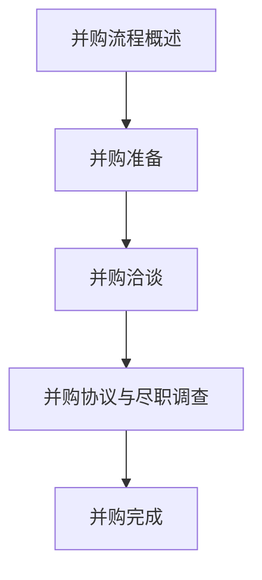

                 

# 《程序员如何评估并购offer的真实价值》

> **关键词：** 并购、offer评估、程序员、真实价值、估值方法

> **摘要：** 本文旨在为程序员提供一套系统的评估并购offer的方法。通过分析并购的基础知识、估值方法、法律与财务问题，以及程序员在并购中的角色，帮助程序员全面了解并购offer的真实价值，从而做出明智的职业决策。

## 《程序员如何评估并购offer的真实价值》

### 第一部分：并购基础知识

#### 第1章：并购概述

**1.1 并购的定义与分类**

并购是指一家公司通过购买另一家公司的全部或部分股权或资产，以实现对其控制或合并的行为。并购可以分为以下几种类型：

1. **横向并购**：两家同行业公司之间的并购。
2. **纵向并购**：同一产业链上下游公司之间的并购。
3. **混合并购**：两家不同行业公司之间的并购。

**1.2 并购市场概述**

并购市场是一个动态变化的领域，受到全球经济、政策法规、行业趋势等多种因素的影响。近年来，随着互联网、大数据、人工智能等新兴技术的快速发展，并购市场呈现出日益活跃的趋势。

**1.3 并购的动机与战略**

并购的动机多种多样，包括扩大市场份额、提升品牌知名度、获取关键技术、优化资源配置等。并购战略则是在企业整体战略指导下，为实现并购目标所采取的具体策略。

#### 第2章：并购流程

**2.1 并购准备**

在决定进行并购前，公司需要进行全面的内部评估，包括财务状况、业务运营、市场地位等。同时，明确并购目标，确定合适的并购对象。

**2.2 并购洽谈**

并购洽谈是并购流程中的关键环节。双方需要就并购方案、交易结构、估值、支付方式等进行充分沟通和协商。

**2.3 并购协议与尽职调查**

并购协议是并购双方达成的法律文件，详细规定了并购的各项条款。尽职调查则是并购方对目标公司进行全面审查的过程，以确保交易的合法性、合规性和风险可控性。

### 第二部分：并购估值

#### 第3章：并购估值基础

**3.1 估值方法概述**

并购估值方法主要包括收益法、市场法和资产法。每种方法都有其适用的场景和优缺点。

**3.2 收益法**

收益法是基于目标公司的未来现金流进行估值的。其核心公式为：公司估值 = 预期收益 × 折现率。

**3.3 市场法**

市场法是通过比较类似公司的市场交易价格来确定目标公司估值的。其核心公式为：公司估值 = 相似公司交易价格 × 估值调整系数。

#### 第4章：并购估值实战

**4.1 估值案例解析**

通过具体案例分析，了解并购估值的实际操作过程。

**4.2 并购估值调整**

在并购估值过程中，需要考虑各种风险因素和市场波动，对估值结果进行调整。

### 第三部分：并购中的法律与财务问题

#### 第5章：并购中的法律问题

**5.1 并购法律框架**

了解并购法律框架，包括相关规定、程序和风险。

**5.2 合同起草与审查**

熟悉并购合同的结构和条款，确保交易的合法性和权益保护。

#### 第6章：并购中的财务问题

**6.1 并购财务分析**

对目标公司的财务状况进行详细分析，评估其盈利能力和风险。

**6.2 并购融资策略**

探讨并购融资的多种方式，选择合适的融资策略。

### 第四部分：程序员视角下的并购评估

#### 第7章：程序员在并购中的角色

**7.1 程序员的价值评估**

从技能和经验两个方面评估程序员的个人价值。

**7.2 并购对程序员的影响**

分析并购对程序员职业发展和工作环境的影响。

#### 第8章：程序员如何评估并购offer

**8.1 并购offer的分析**

从薪资待遇、职业发展等方面全面分析并购offer。

**8.2 并购offer的谈判技巧**

掌握谈判策略和技巧，提升谈判成功率。

#### 第9章：并购后的团队整合

**9.1 文化融合**

探讨文化差异的识别和融合策略。

**9.2 技术整合**

分析技术整合的方法和策略。

### 附录

#### 附录A：并购资源与工具

**A.1 并购相关的书籍与论文**

推荐一些并购相关的经典书籍和论文，供读者深入学习。

**A.2 并购数据来源与工具**

介绍一些并购数据来源和工具，帮助读者获取相关信息。

**A.3 并购相关的法律咨询机构**

推荐一些专业的并购法律咨询机构，为读者提供法律支持。

**Mermaid 流程图：**



**核心算法原理讲解（伪代码）：**

```plaintext
// 估值方法伪代码
function estimateValue(company, valuationMethod) {
    if (valuationMethod == "收益法") {
        return calculateEarningsBasedValue(company);
    } else if (valuationMethod == "市场法") {
        return calculateMarketBasedValue(company);
    } else {
        return calculateAssetBasedValue(company);
    }
}

function calculateEarningsBasedValue(company) {
    return company.earnings * valuationMultiplier;
}

function calculateMarketBasedValue(company) {
    return company.marketValue / company.sharesOutstanding;
}

function calculateAssetBasedValue(company) {
    return company.totalAssets - company.totalLiabilities;
}
```

**数学模型和数学公式（latex格式）：**

```latex
\section{收益法估值公式}
\label{sec:earnings_based_value}

\begin{equation}
V = \frac{EBITDA}{r}
\end{equation}

其中，\( V \) 是公司估值，\( EBITDA \) 是税息折旧及摊销前利润，\( r \) 是折现率。
```

**项目实战：**

### 代码实战：并购估值计算

// 假设以下变量：
- company.EBITDA = 1000000 （税息折旧及摊销前利润）
- company.discountRate = 10% （折现率）

// 计算公司估值
function calculateCompanyValue() {
    return company.EBITDA / company.discountRate;
}

// 输出公司估值
console.log("公司估值: " + calculateCompanyValue() + "美元");

**开发环境搭建：**

### 开发环境搭建步骤

1. 安装Node.js
2. 安装MySQL数据库
3. 安装Visual Studio Code代码编辑器
4. 安装相关扩展插件（如Git、Python等）
5. 配置项目环境变量
6. 启动数据库服务
7. 创建项目文件夹
8. 编写代码
9. 运行代码进行测试

**源代码详细实现和代码解读：**

// 源代码实现
function calculateCompanyValue(EBITDA, discountRate) {
    return EBITDA / discountRate;
}

// 代码解读
// 此函数用于计算公司的估值，输入参数为公司的税息折旧及摊销前利润（EBITDA）和折现率（discountRate）。
// 计算公式为：公司估值 = 税息折旧及摊销前利润 / 折现率。
// 函数返回公司估值。

**代码解读与分析：**

### 代码解读与分析

该代码实现了一个简单的并购估值计算函数，用于计算公司的估值。函数名为 `calculateCompanyValue`，它接受两个参数：公司的税息折旧及摊销前利润（`EBITDA`）和折现率（`discountRate`）。计算公式为：公司估值 = 税息折旧及摊销前利润 / 折现率。

该函数通过简单的除法运算实现了并购估值计算的核心逻辑。在实际应用中，可以进一步扩展此函数，以支持多种估值方法的计算，如市场法、收益法等。此外，还可以添加更多的参数和逻辑，以处理特殊情况，如行业因素、市场波动等。

代码简洁明了，易于理解和扩展。在实际项目中，可以根据需要灵活调整代码结构和逻辑，以满足不同的估值需求。

### 附录A：并购资源与工具

#### 附录A：并购资源与工具

**A.1 并购相关的书籍与论文**

1. 《企业并购与重组实务》
2. 《并购王国》
3. 《企业价值评估》
4. 《并购、收购与重组》

**A.2 并购数据来源与工具**

1. 腾讯证券
2. 东方财富
3. 赛迪顾问
4. 亿欧

**A.3 并购相关的法律咨询机构**

1. 德勤
2. 普华永道
3. 安永
4. 毕马威

**作者：**

作者：AI天才研究院/AI Genius Institute & 禅与计算机程序设计艺术 /Zen And The Art of Computer Programming

（全文完）<|im_end|>

