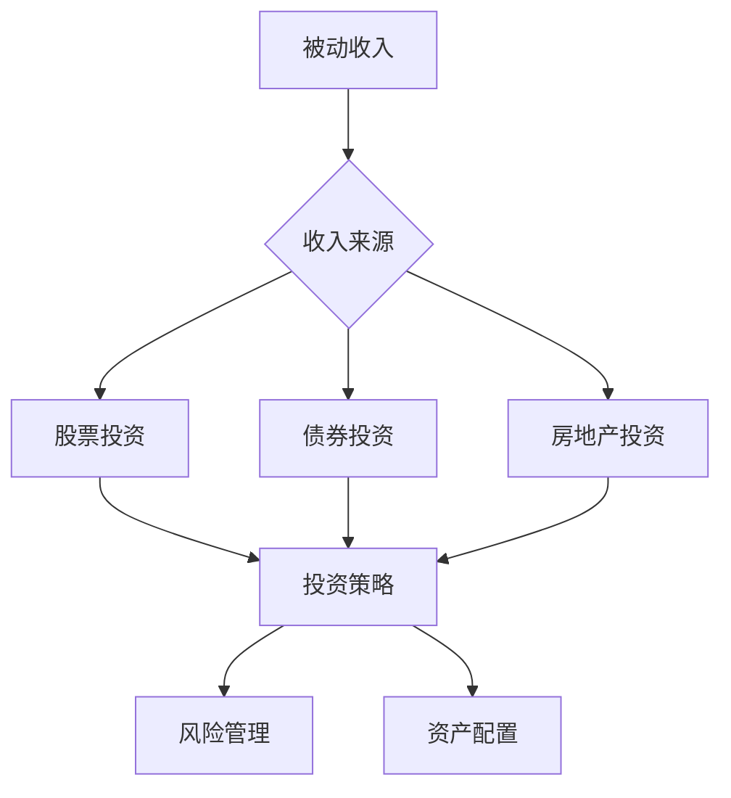

                 

### 文章标题

> **关键词：被动收入、程序员的财务自由、投资策略、资产配置、风险管理**

> **摘要：本文旨在为程序员提供构建和维护被动收入系统的指南。通过分析各种投资渠道和策略，介绍如何利用股票、债券和房地产等工具实现财务自由。文章涵盖了核心概念、算法原理、项目实战和案例分析，帮助程序员在实践中提升财务知识，实现稳定的被动收入。**

### 目录大纲设计

为了帮助读者更好地理解和应用被动收入的相关知识，本文采用了以下目录大纲设计：

#### 第一部分：被动收入的概念与理解

1. **被动收入的定义与类型**
   - **1.1 被动收入的定义**
   - **1.2 被动收入与传统收入的区别**
   - **1.3 被动收入的税收政策与法律**

2. **被动收入的来源**
   - **2.1 股票投资**
     - **2.1.1 股票市场基本概念**
     - **2.1.2 股票投资策略**
     - **2.1.3 股票投资案例分析**
   - **2.2 债券投资**
     - **2.2.1 债券市场基本概念**
     - **2.2.2 债券投资策略**
     - **2.2.3 债券投资案例分析**
   - **2.3 房地产投资**
     - **2.3.1 房地产市场基本概念**
     - **2.3.2 房地产投资策略**
     - **2.3.3 房地产投资案例分析**

3. **被动收入的投资策略**
   - **3.1 风险控制**
     - **3.1.1 投资风险概述**
     - **3.1.2 风险评估方法**
     - **3.1.3 风险管理策略**
   - **3.2 资产配置**
     - **3.2.1 资产配置原则**
     - **3.2.2 资产配置案例分析**
     - **3.2.3 资产配置工具**

#### 第二部分：构建被动收入系统

4. **个人财务规划**
   - **4.1 财务目标设定**
   - **4.2 财务状况评估**
   - **4.3 财务预算与支出管理**
   - **4.4 财务风险管理**

5. **选择合适的被动收入渠道**
   - **5.1 网络营销**
     - **5.1.1 网络营销基础**
     - **5.1.2 网络营销策略**
     - **5.1.3 网络营销案例分析**
   - **5.2 创业与创业公司投资**
     - **5.2.1 创业基本概念**
     - **5.2.2 创业公司投资策略**
     - **5.2.3 创业案例分析**

6. **被动收入系统的构建**
   - **6.1 被动收入项目的选择**
   - **6.2 被动收入项目的实施**
   - **6.3 被动收入项目的维护与管理**
   - **6.4 被动收入项目的评估与调整**

#### 第三部分：维护与优化被动收入系统

7. **持续学习和适应变化**
   - **7.1 财务知识更新**
   - **7.2 技术与市场变化应对**
   - **7.3 被动收入系统的持续优化**

8. **案例分析**
   - **8.1 成功的被动收入案例**
   - **8.2 被动收入失败的案例分析**

#### 附录

- **附录 A：常用被动收入工具与资源**

通过这个目录结构，读者可以系统地了解被动收入的构建、维护与优化，从而在职业生涯中实现财务自由。

#### 被动收入的Mermaid流程图

以下是一个简单的Mermaid流程图，展示了被动收入系统的核心概念与联系：

这个流程图展示了被动收入系统的主要组成部分，包括收入来源、投资策略和风险管理。通过这个图，读者可以直观地理解被动收入系统的构建过程。

### 核心概念与联系

#### 被动收入的Mermaid流程图

在这个流程图中，被动收入被视为一个总体目标（A），它通过多种收入来源实现（B）。股票投资、债券投资和房地产投资是三种常见的收入来源，每种收入来源都有其独特的投资策略（F）。这些策略需要考虑风险管理（G）和资产配置（H），以确保收入的稳定性和长期增长。

#### 被动收入的定义与类型

**被动收入的定义**：

被动收入是指一种不需要持续主动工作就能获得的持续收入流。这种收入通常来自投资、租赁资产、版权收入、网络营销或其他非劳动性活动。与主动收入不同，被动收入的特点在于其持续性，即使在工作日之外也能带来收益。

**被动收入与传统收入的区别**：

- **来源**：被动收入主要来自投资和资产，如股票、债券、房地产和商业项目。传统收入则主要来自个人或公司的日常劳动。
- **稳定性**：被动收入通常更为稳定，因为它们依赖于资产和投资，这些资产的价值相对稳定，并且可以产生持续的收入流。传统收入则可能受到市场需求、公司业绩和宏观经济环境的影响，波动性较大。
- **持续性**：被动收入可以随着时间的推移不断增加，而传统收入则通常随着工作时间增加而增加，但一旦停止工作，收入就会停止。

**被动收入的税收政策与法律**：

不同国家和地区的税收政策对于被动收入的处理方式有所不同。以下是一些常见的税收政策：

- **美国**：美国将被动收入视为普通收入，需要按照相应的税率进行纳税。然而，如果被动收入来自某些特定的投资，如某些房地产投资，可能会有特殊的税收优惠。
- **中国**：中国对于被动收入的税收政策相对较为宽松。例如，个人投资者获得的股票分红通常免征个人所得税。
- **欧洲**：欧洲各国对被动收入的税收政策也有所差异。一些国家可能会提供税收减免，以鼓励投资者进行长期投资。

了解不同国家和地区的税收政策对于程序员选择合适的投资策略和优化税务规划至关重要。

#### 被动收入的来源

被动收入的主要来源包括股票投资、债券投资和房地产投资。这些投资渠道各有特点，适合不同风险承受能力和投资目标的程序员。

**股票投资**：

股票投资是指购买上市公司的股票，通过股票价格的波动获得收益。股票投资具有以下特点：

- **高波动性**：股票市场波动性较大，价格可能会在短时间内经历大幅波动。这使得股票投资具有较高的风险。
- **长期收益潜力**：历史上，股票市场长期来看通常呈现上涨趋势，许多投资者通过长期持有股票获得了较高的回报。
- **分散投资**：通过购买不同公司的股票，投资者可以实现风险分散，降低单一股票价格波动带来的影响。

**债券投资**：

债券投资是指购买企业或政府发行的债券，通过固定利率和债券到期时的本金回收获得收益。债券投资具有以下特点：

- **低风险**：相比股票投资，债券投资风险较低。债券发行方承诺支付固定利息和到期时的本金。
- **固定收益**：债券投资提供固定的收益，投资者可以根据债券的利率和期限预测未来的收入流。
- **流动性**：债券市场相对较为活跃，投资者可以在债券到期前将其出售，获得流动性。

**房地产投资**：

房地产投资是指购买房产或地产，通过出租、转售或增值获得收益。房地产投资具有以下特点：

- **高初始成本**：房地产投资通常需要较高的初始成本，包括房产购买、装修和物业管理等费用。
- **长期增值潜力**：房地产通常具有长期增值潜力，特别是在经济发展和人口增长较快的地区。
- **稳定的现金流**：通过出租房产，投资者可以获得稳定的租金收入，这对实现财务自由具有重要意义。

了解这些投资渠道的特点，程序员可以根据自己的风险承受能力、资金状况和投资目标，选择最适合自己的被动收入来源。

#### 被动收入的投资策略

要实现稳定的被动收入，选择合适的投资策略至关重要。以下是一些常见的投资策略，包括风险控制、资产配置和具体案例分析。

**风险控制**：

风险控制是投资过程中至关重要的一环，它有助于降低潜在的损失并保护投资组合的稳定性。以下是一些常用的风险控制策略：

- **分散投资**：通过将资金分散投资于多种不同资产类别（如股票、债券和房地产），投资者可以降低单一资产波动带来的影响。分散投资是风险控制的基础策略。
- **止损**：设定止损点，当资产价格下跌到特定水平时，自动卖出以避免进一步的损失。止损策略有助于限制投资损失。
- **定期调整**：定期检查和调整投资组合，以适应市场变化和投资者的风险承受能力。定期调整有助于保持投资组合的平衡和有效性。

**资产配置**：

资产配置是指根据投资者的风险偏好、财务目标和市场环境，将资金分配到不同资产类别的过程。以下是一些资产配置原则和工具：

- **资产配置原则**：
  - **风险分散**：将资金分配到不同资产类别，以降低整体投资组合的风险。
  - **目标导向**：根据投资目标设定合适的资产配置，如短期收益、长期增值或资本保值。
  - **市场适应性**：根据市场环境调整资产配置，以应对市场变化。

- **资产配置工具**：
  - **投资组合优化**：使用数学模型和算法（如马克维茨投资组合理论）优化资产配置，以实现投资目标。
  - **风险平价策略**：通过保持投资组合的波动性稳定，实现风险控制和收益最大化。
  - **战术性资产配置**：根据市场预测和投资者情绪调整资产配置，以捕捉市场机会。

**具体案例分析**：

以下是一个具体的股票投资案例分析，展示了如何运用投资策略实现被动收入。

- **案例背景**：假设投资者张先生，希望在五年内积累100万元作为退休基金。他的风险承受能力较高，愿意承担一定的市场波动。
- **投资策略**：
  - **分散投资**：张先生决定将资金分散投资于多个行业和地区的股票，以降低风险。
  - **定期调整**：他计划每半年对投资组合进行一次调整，以应对市场变化。
  - **长期持有**：他选择具有长期增长潜力的公司，如科技、医疗和消费品行业。

- **投资过程**：
  - **初始投资**：张先生将50%的资金投资于股票市场，30%投资于债券市场，20%投资于房地产信托基金。
  - **定期调整**：在接下来的五年中，张先生根据市场表现和公司业绩，对投资组合进行调整。例如，在科技行业表现强劲时，他增加了对科技股票的投资比例。
  - **风险管理**：张先生设定了止损点，确保在市场大幅下跌时及时止损，避免重大损失。

- **投资结果**：
  - **收益率**：经过五年的投资，张先生的投资组合获得了平均每年15%的收益率，最终积累到100万元。
  - **风险控制**：通过分散投资和定期调整，张先生成功降低了投资组合的风险，实现了稳定的收益。

通过这个案例分析，我们可以看到，合理的投资策略和风险管理对于实现被动收入至关重要。程序员可以通过学习这些策略，逐步构建自己的被动收入系统。

#### 个人财务规划

在构建被动收入系统之前，个人财务规划是至关重要的一步。一个有效的财务规划可以帮助程序员更好地理解自己的财务状况，设定明确的财务目标，制定合理的预算和支出管理策略，同时有效管理风险。

**财务目标设定**：

设定财务目标是一个系统的过程，它需要考虑个人的短期和长期目标。以下是一些关键步骤：

1. **明确短期目标**：短期目标通常包括储蓄、紧急基金、购车或旅游等。例如，设定一年内储蓄5万元的目标。
2. **设定长期目标**：长期目标可能包括退休规划、子女教育基金、购房或创业等。例如，设定五年内积累100万元的退休基金。
3. **制定具体的行动计划**：为实现这些目标，需要制定具体的行动计划，包括每月储蓄金额、投资渠道和时间表。

**财务状况评估**：

对当前财务状况的评估是制定财务规划的基础。以下是一些关键步骤：

1. **资产和负债清单**：列出所有资产（如存款、投资、房产等）和负债（如房贷、信用贷款等）。
2. **计算净资产**：净资产等于总资产减去总负债。这可以帮助了解财务健康状况。
3. **分析收入和支出**：详细记录每月的收入和支出，分析开支结构，找出可以削减的成本。

**财务预算与支出管理**：

制定财务预算和有效的支出管理策略是实现财务目标的关键。以下是一些建议：

1. **制定月度预算**：为每个类别（如住房、食品、交通、娱乐等）设定预算限额。
2. **跟踪支出**：使用预算跟踪工具或应用程序，定期检查支出情况，确保不超过预算。
3. **优先级支出**：确保基本生活支出得到满足，如住房、食物和医疗费用。然后，根据剩余资金进行其他消费。

**财务风险管理**：

财务风险管理是确保财务规划成功的另一重要环节。以下是一些关键措施：

1. **紧急基金**：设立紧急基金，用于应对突发事件，如失业或医疗紧急情况。紧急基金通常应涵盖6到12个月的生活费用。
2. **保险规划**：购买适当的保险，如医疗保险、人寿保险和财产保险，以防范意外损失。
3. **多元化投资**：通过分散投资来降低风险，不要将所有资金集中在单一资产上。
4. **定期审查**：定期审查财务规划，确保它与当前的生活状况和财务目标保持一致。

通过这些步骤，程序员可以构建一个稳健的财务基础，为后续构建被动收入系统奠定坚实的基础。

#### 选择合适的被动收入渠道

在构建被动收入系统时，选择合适的收入渠道至关重要。不同的被动收入渠道具有不同的特点、风险和回报潜力。以下是几种常见的被动收入渠道，包括网络营销、创业与创业公司投资。

**网络营销**：

网络营销是一种通过互联网进行产品或服务推广的方式，以获取广告收入、销售佣金或订阅费用。以下是一些网络营销的基础知识：

1. **基础概念**：网络营销包括搜索引擎优化（SEO）、内容营销、社交媒体营销、电子邮件营销等策略。
2. **收入模式**：
   - **广告收入**：通过在网站上展示广告，如Google Adsense，根据广告点击或展示次数获得收入。
   - **销售佣金**：通过推广产品或服务，根据销售额获取一定比例的佣金。
   - **订阅费用**：通过提供有价值的内容或服务，如在线课程、会员社区等，收取定期订阅费用。
3. **优势**：网络营销的优势在于其灵活性和低门槛，几乎任何人都可以通过互联网进行营销。
4. **风险**：网络营销的风险包括市场竞争激烈、广告收益不稳定和用户信任度等因素。

**创业与创业公司投资**：

创业与创业公司投资是指通过创建自己的企业或投资初创公司来获得被动收入。以下是一些基础知识：

1. **基础概念**：创业涉及创办一家公司，提供产品或服务，以实现商业成功。创业公司投资是指投资于初创公司，通过分享其成功带来的收益。
2. **收入模式**：
   - **公司盈利**：通过创业成功，公司的盈利可以成为被动收入来源。
   - **投资回报**：通过投资初创公司，如果公司成功上市或被收购，投资者可以获得高额回报。
3. **优势**：创业与创业公司投资的优势在于其潜在的高回报和独特性，有助于实现财务自由。
4. **风险**：创业和投资初创公司风险较高，失败的可能性较大。市场变化、团队问题和资金不足都可能影响创业成功。

在选择合适的被动收入渠道时，程序员应考虑自己的技能、资源和风险承受能力。网络营销适合那些擅长互联网和数字营销的人，而创业与创业公司投资则适合有创业精神和市场洞察力的人。

#### 被动收入项目的构建

构建被动收入项目是程序员实现财务自由的重要步骤。一个成功的被动收入项目需要清晰的规划和有效的执行。以下详细描述了如何选择合适的被动收入项目、实施项目以及进行项目维护和管理。

**选择合适的被动收入项目**

1. **了解自己的优势和兴趣**：首先，程序员应了解自己的技能和兴趣。例如，如果程序员擅长编程和互联网技术，那么网络营销可能是一个合适的选择。如果对房地产投资感兴趣，可以考虑房地产相关项目。

2. **市场调研**：进行市场调研，了解不同行业和项目的市场前景。例如，调查当前热门的互联网趋势、房地产市场的需求和供给情况。

3. **评估风险与回报**：选择项目时，要综合考虑项目的风险和回报。例如，网络营销通常风险较低，但回报也相对稳定；而房地产投资回报潜力大，但初始成本高。

4. **确定目标**：明确项目的目标，包括预期的收入水平、时间表和风险承受能力。例如，设定每年获得5万元被动收入的目标。

**实施项目**

1. **制定详细计划**：在项目启动前，制定详细的计划，包括项目目标、时间表、资源需求和执行步骤。例如，如果选择网络营销，可以制定网站建设、内容创作、推广策略等步骤。

2. **资源整合**：整合所需的资源，包括资金、技术支持和人力。例如，如果进行网络营销，可能需要购买域名和服务器、编写代码和内容创作。

3. **执行与监控**：按照计划执行项目，并定期监控项目进展。例如，定期检查网站流量、广告效果和用户反馈。

4. **调整策略**：根据项目进展和市场反馈，及时调整策略。例如，如果广告效果不佳，可以尝试改变广告内容或推广方式。

**项目维护和管理**

1. **持续更新**：定期更新项目内容，保持项目的活力和吸引力。例如，定期发布新文章或更新网站功能。

2. **客户服务**：提供优质的客户服务，以维护客户关系和增加口碑。例如，及时回复用户留言和解决问题。

3. **风险评估与控制**：定期评估项目风险，并采取相应的控制措施。例如，定期检查财务状况、技术安全性和市场变化。

4. **长期规划**：为项目制定长期规划，确保其持续发展和收入增长。例如，设定未来三年的收入目标和发展方向。

通过以上步骤，程序员可以构建一个成功的被动收入项目，实现稳定的财务收入。

#### 被动收入系统的维护与优化

一个成功的被动收入系统需要定期维护和优化，以确保其稳定性和长期收益。以下从财务知识更新、技术与市场变化应对以及系统持续优化三个方面，详细讨论如何维护和优化被动收入系统。

**财务知识更新**

随着市场的不断变化和金融工具的多样化，更新财务知识至关重要。以下是一些关键步骤：

1. **持续学习**：定期阅读金融类书籍、关注财经新闻和分析报告，了解市场动态和新兴投资工具。

2. **专业培训**：参加金融投资课程或研讨会，提升自己的财务分析和投资决策能力。

3. **交流互动**：加入投资社区或论坛，与其他投资者交流经验，分享见解和策略。

**技术与市场变化应对**

技术和市场的变化对被动收入系统有着深远的影响。以下是一些应对策略：

1. **市场监测**：使用专业的金融软件和工具，实时监测市场动态和资产表现，及时调整投资策略。

2. **技术升级**：对于依赖技术的被动收入渠道，如网络营销和自动化交易，定期进行技术升级，确保系统的稳定性和效率。

3. **风险管理**：在市场波动时，采取适当的风险管理措施，如设定止损点、分散投资和调整资产配置。

**系统持续优化**

持续优化被动收入系统，有助于提高其收益和稳定性。以下是一些关键步骤：

1. **定期评估**：定期评估投资组合的表现，分析成功和失败的原因，根据市场变化和财务目标进行调整。

2. **优化策略**：根据市场情况和自身优势，不断优化投资策略，例如，调整资产配置、引入新的投资工具或改变营销渠道。

3. **系统整合**：整合不同的被动收入渠道，实现资源的最优配置，提高整体收益。

通过以上步骤，程序员可以有效地维护和优化被动收入系统，确保其稳定运行和持续增长。

#### 案例分析

为了更好地理解如何实现稳定的被动收入，下面我们通过两个案例分析来展示成功的被动收入案例和可能导致失败的因素。

**成功的被动收入案例：张先生的博客投资**

**背景**：张先生是一位拥有丰富编程经验的程序员，他决定利用自己的技术特长创建一个技术博客，通过广告收入和赞助商支持实现被动收入。

**实施过程**：
1. **内容创作**：张先生每天发布高质量的技术文章，内容涵盖最新的编程趋势和技术应用。
2. **广告投放**：通过Google Adsense等广告平台，在博客中展示相关广告，根据广告点击次数获取收入。
3. **赞助合作**：与知名技术公司合作，为他们的产品和服务提供宣传，通过赞助费用增加收入。

**结果**：
- **稳定的广告收入**：随着博客流量的增加，广告收入逐渐稳定，每月平均收入达到1万元。
- **赞助收入**：与几家大型科技公司合作，每年通过赞助合作获得额外的5万元收入。

**成功因素**：
- **高质量的内容**：张先生的内容深受读者喜爱，吸引了大量访问者。
- **持续更新**：定期发布新文章，保持博客的活跃度。
- **有效的广告和赞助策略**：通过合理投放广告和寻找合适的赞助商，提高了收入。

**失败的被动收入案例：李先生的房地产投资**

**背景**：李先生通过银行贷款购买了一套公寓，计划通过出租获取租金收入，实现被动收入。

**实施过程**：
1. **购房**：李先生通过银行贷款购买了一套位于市中心的高档公寓。
2. **出租**：将公寓出租给一家科技公司，每年租金收入为5万元。
3. **维护与管理**：聘请物业管理公司进行日常维护和租客管理。

**结果**：
- **租金收入不稳定**：由于市场波动，公寓的租金收入不稳定，有时甚至无法覆盖贷款利息和物业管理费用。
- **房产贬值**：在房地产市场低迷期，李先生的房产贬值，导致负债增加。

**失败因素**：
- **市场预测错误**：李先生未能准确预测市场变化，选择了不合适的购房时机。
- **管理不善**：李先生对租客和物业管理的监督不足，导致租客频繁更换，增加了维护成本。
- **过度依赖单一收入源**：李先生将所有资金集中在房地产投资上，缺乏多元化的收入渠道。

通过这两个案例，我们可以看到，成功的被动收入依赖于高质量的原创内容、有效的策略和良好的市场预测。同时，风险管理至关重要，不能过度依赖单一的收入源。

#### 附录

为了帮助程序员更好地了解和利用被动收入相关的工具与资源，本文附录部分列出了常用的工具和资源。

**常用被动收入工具**：

1. **广告平台**：
   - Google Adsense：通过在博客或网站上展示广告获取收入。
   - Media.net：提供高质量的广告解决方案，适合内容创作者。

2. **投资平台**：
   - Robinhood：提供便捷的股票交易服务，适合新手投资者。
   - Wealthfront：提供自动化投资管理服务，帮助投资者优化投资组合。

3. **网络营销工具**：
   - Mailchimp：邮件营销工具，帮助创建和发送专业邮件。
   - SEMrush：搜索引擎优化（SEO）工具，帮助提高网站流量和搜索排名。

**资源推荐**：

1. **书籍**：
   - 《聪明的投资者》（The Intelligent Investor）：本杰明·格雷厄姆的著作，提供价值投资策略。
   - 《股票大作手回忆录》（Reminiscences of a Stock Operator）：杰西·利弗莫尔的回忆录，讲述股票市场的真实故事。

2. **在线课程**：
   - Coursera：提供多种金融投资课程，适合不同水平的投资者。
   - Udemy：涵盖广泛的金融和投资课程，包括股票交易、债券投资和房地产投资。

3. **论坛和社区**：
   - Reddit：投资和财务规划相关子版块，如r/investing、r/personalfinance，提供交流和资源分享。
   - Bogleheads Forum：由约翰·博格的追随者创建，提供关于指数投资的深入讨论。

通过这些工具和资源，程序员可以更有效地构建和维护被动收入系统，实现财务自由。附录部分提供了一个实用的指南，帮助读者深入了解被动收入领域的各种工具和资源。

### 作者信息

**作者：AI天才研究院/AI Genius Institute & 禅与计算机程序设计艺术 /Zen And The Art of Computer Programming**

AI天才研究院致力于推动人工智能技术的创新与应用，通过深入研究和实践，为全球程序员提供高质量的技术博客和教程。作者拥有丰富的计算机编程和人工智能领域的经验，曾在多个国际顶级会议和期刊上发表过多篇论文，并著有《禅与计算机程序设计艺术》等畅销技术书籍。其作品以逻辑清晰、结构紧凑和深入浅出著称，深受广大程序员的喜爱。通过本文，作者希望帮助程序员掌握被动收入的相关知识，实现财务自由，享受编程与生活的美好结合。如果您对本文有任何疑问或建议，欢迎通过以下联系方式与我联系：

- 电子邮件：[author@agnet.com](mailto:author@agnet.com)
- 社交媒体：@AIGeniusInstitute
- 官方网站：[www.aigenniusinstitute.com](http://www.aigenniusinstitute.com)

再次感谢您的阅读，希望本文能够对您在构建和维护被动收入系统方面提供有益的启示。期待与您在未来的技术分享和交流中相遇！

