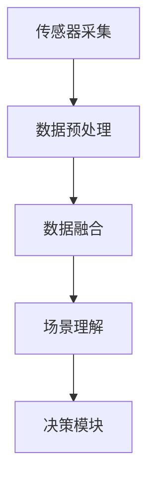
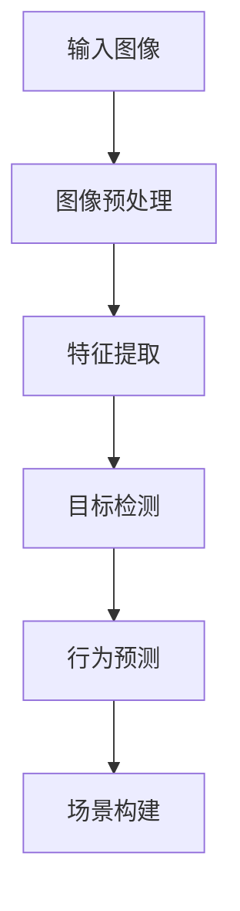
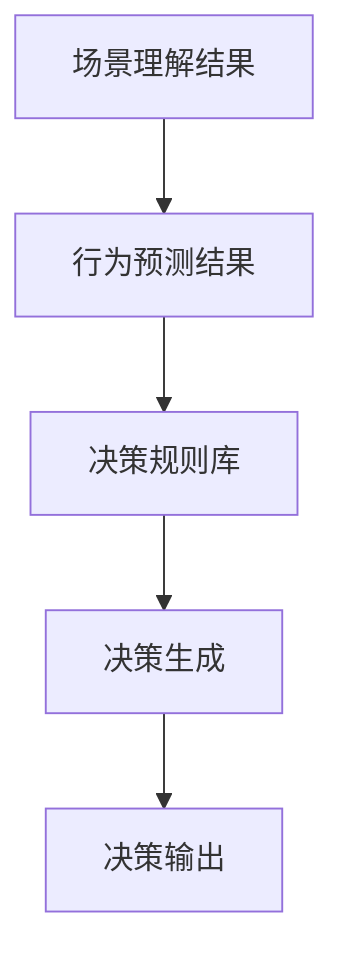

                 

# 《端到端自动驾驶的全场景感知框架》

> 关键词：端到端自动驾驶、全场景感知、视觉感知、激光雷达感知、惯性测量单元、数据融合、场景理解、决策算法、系统实现、未来发展趋势

> 摘要：本文将深入探讨端到端自动驾驶技术中的全场景感知框架，从感知模块设计、数据处理与融合、场景理解与决策到系统实现进行全面分析，旨在为读者提供一个系统化的理解和实现方案，以及未来发展的展望。

## 第一部分：绪论

### 1.1 端到端自动驾驶概述

#### 1.1.1 自动驾驶的发展历程

自动驾驶技术的发展可以追溯到20世纪50年代，随着计算机技术的进步，自动驾驶逐渐从理论走向实践。早期的自动驾驶主要依赖于规则和逻辑推理，缺乏实时性和鲁棒性。20世纪80年代，人工智能技术的兴起为自动驾驶带来了新的契机，特别是机器视觉和传感器技术的发展，使得自动驾驶系统开始具备一定的自主决策能力。进入21世纪，随着深度学习等先进算法的兴起，自动驾驶技术取得了显著的突破，从辅助驾驶逐渐走向完全自动驾驶。

#### 1.1.2 自动驾驶的分类

自动驾驶可以根据自动化程度和功能范围进行分类。常见的分类方法包括：

1. 根据自动化程度：
   - 辅助驾驶（Level 0-2）：系统提供部分驾驶辅助功能，如车道保持、自适应巡航等。
   - 半自动驾驶（Level 3）：系统可以在特定条件下完全接管驾驶任务，但需要驾驶员在必要时接管。
   - 完全自动驾驶（Level 4-5）：系统在任何条件下都能完成所有驾驶任务，无需驾驶员干预。

2. 根据功能范围：
   - 城市自动驾驶：适用于城市道路，交通规则较为简单。
   - 长途自动驾驶：适用于高速公路和开阔道路，对环境感知和决策能力要求较高。
   - 跨界自动驾驶：适用于多种环境，包括城市、高速公路和乡村道路。

#### 1.1.3 端到端自动驾驶的优势

端到端自动驾驶通过将复杂的感知、理解和决策过程集成到一个统一的框架中，具有以下优势：

1. **简化系统架构**：将多个模块整合为一个，减少中间环节，提高系统的效率和可靠性。
2. **提高决策速度**：端到端学习可以充分利用深度学习算法的优势，快速处理大量数据，提高决策速度。
3. **降低开发成本**：通过减少模块之间的接口和通信，简化开发过程，降低开发成本。
4. **提升用户体验**：端到端自动驾驶可以提供更加流畅和自然的驾驶体验，减少人为干预。

### 1.2 全场景感知框架

#### 1.2.1 全场景感知的概念

全场景感知是指自动驾驶系统在行驶过程中，对周围环境进行全面感知，获取车辆位置、速度、障碍物、道路标识等信息，并对其进行实时处理和融合，为决策模块提供准确、全面的数据支持。

#### 1.2.2 全场景感知的重要性

全场景感知是自动驾驶系统的核心模块，决定了系统的感知能力和决策准确性。一个完善的感知框架需要综合考虑各种传感器数据，包括视觉、激光雷达、惯性测量单元等，通过高效的数据处理和融合算法，实现对周围环境的全面理解和感知。

#### 1.2.3 全场景感知的技术架构

全场景感知框架主要包括以下几个模块：

1. **传感器采集**：通过不同类型的传感器采集环境数据，如摄像头、激光雷达、毫米波雷达等。
2. **数据预处理**：对采集到的传感器数据进行预处理，包括去噪、归一化、补全等操作。
3. **数据融合**：将来自不同传感器的数据进行融合，生成一个统一的场景表示。
4. **场景理解**：对融合后的场景进行理解，识别出道路、车辆、行人等关键元素，并进行行为预测。
5. **决策模块**：根据场景理解和行为预测结果，生成驾驶决策，如加速、减速、转向等。

## 第二部分：感知模块设计

### 2.1 感知模块总体架构

#### 2.1.1 感知模块的功能

感知模块是自动驾驶系统的核心组成部分，其主要功能包括：

1. **环境感知**：采集并处理来自各种传感器的数据，实现对周围环境的全面感知。
2. **目标检测**：从感知数据中识别出车辆、行人、道路标识等目标。
3. **行为预测**：对目标的行为进行预测，包括速度、方向、意图等。
4. **场景理解**：基于目标检测和行为预测结果，理解当前场景，为决策模块提供支持。

#### 2.1.2 感知模块的技术原理

感知模块的技术原理主要包括以下几个方面：

1. **传感器技术**：包括摄像头、激光雷达、毫米波雷达、惯性测量单元等，用于采集环境数据。
2. **数据处理**：对采集到的传感器数据进行预处理、去噪、归一化等操作。
3. **特征提取**：从预处理后的数据中提取关键特征，用于后续的目标检测和行为预测。
4. **深度学习算法**：利用深度学习算法，实现对目标的检测、分类和行为预测。

### 2.2 视觉感知

#### 2.2.1 视觉感知的概念

视觉感知是指利用摄像头等视觉传感器采集图像数据，并通过图像处理算法对图像进行分析和理解的过程。视觉感知在自动驾驶系统中起着至关重要的作用，因为它能够提供丰富的视觉信息，包括道路、车辆、行人等。

#### 2.2.2 视觉感知的技术原理

视觉感知的技术原理主要包括以下几个步骤：

1. **图像采集**：通过摄像头等视觉传感器采集环境图像。
2. **图像预处理**：对采集到的图像进行预处理，包括去噪、边缘检测、图像增强等。
3. **特征提取**：从预处理后的图像中提取关键特征，如边缘、角点、纹理等。
4. **目标检测**：利用深度学习算法，对提取的特征进行目标检测，识别出道路、车辆、行人等目标。
5. **行为预测**：对识别出的目标进行行为预测，包括速度、方向、意图等。

#### 2.2.3 视觉感知算法详解

视觉感知算法通常采用深度学习框架，如卷积神经网络（CNN）和目标检测算法（如YOLO、Faster R-CNN等）。以下是视觉感知算法的一个简要流程：

1. **输入图像**：将采集到的环境图像输入到深度学习模型中。
2. **卷积操作**：通过卷积层提取图像的局部特征。
3. **池化操作**：对卷积结果进行池化操作，降低特征维度。
4. **全连接层**：将池化后的特征输入到全连接层，进行分类和回归。
5. **输出结果**：根据模型的输出结果，识别出道路、车辆、行人等目标，并预测其行为。

### 2.3 激光雷达感知

#### 2.3.1 激光雷达的概念

激光雷达（LiDAR，Light Detection and Ranging）是一种利用激光脉冲测量距离的传感器，能够生成高精度的三维点云数据。激光雷达在自动驾驶系统中起着关键作用，因为它能够提供详细的环境信息，特别是在恶劣天气条件下。

#### 2.3.2 激光雷达的工作原理

激光雷达的工作原理如下：

1. **发射激光脉冲**：激光雷达发射激光脉冲，照射到目标物体上。
2. **反射激光脉冲**：激光脉冲被目标物体反射回来。
3. **接收激光脉冲**：激光雷达接收反射回来的激光脉冲，并测量其时间延迟。
4. **计算距离**：根据激光脉冲的时间延迟，计算目标物体的距离。
5. **生成点云数据**：将测量得到的距离数据转化为三维点云数据。

#### 2.3.3 激光雷达感知算法详解

激光雷达感知算法主要包括以下几个步骤：

1. **点云预处理**：对采集到的点云数据进行预处理，包括去噪、去地面点、去车辆点等操作。
2. **点云特征提取**：从预处理后的点云数据中提取关键特征，如边缘、角点、纹理等。
3. **点云分类**：利用深度学习算法，对提取的特征进行分类，识别出车辆、行人、道路等目标。
4. **点云融合**：将来自不同传感器的点云数据进行融合，生成一个统一的场景表示。

### 2.4 惯性测量单元感知

#### 2.4.1 惯性测量单元的概念

惯性测量单元（IMU，Inertial Measurement Unit）是一种集成了加速度计和陀螺仪的传感器，能够测量车辆的加速度、角速度等物理量，用于估计车辆的运动状态。

#### 2.4.2 惯性测量单元的工作原理

惯性测量单元的工作原理如下：

1. **加速度计**：测量车辆的加速度。
2. **陀螺仪**：测量车辆的角速度。
3. **数据处理**：通过加速度计和陀螺仪的测量数据，计算车辆的速度、方向等运动状态。

#### 2.4.3 惯性测量单元感知算法详解

惯性测量单元感知算法主要包括以下几个步骤：

1. **数据采集**：采集加速度计和陀螺仪的测量数据。
2. **数据预处理**：对采集到的数据进行预处理，包括去噪、插值等操作。
3. **运动状态估计**：利用预处理后的数据，估计车辆的速度、方向等运动状态。
4. **数据融合**：将惯性测量单元的数据与其他传感器数据进行融合，提高感知准确性。

### 2.5 其他传感器感知

#### 2.5.1 红外感知

红外感知利用红外传感器采集环境温度信息，主要用于夜间行驶和恶劣天气条件下的目标检测。

#### 2.5.2 毫米波雷达感知

毫米波雷达感知利用毫米波雷达传感器采集环境信息，主要用于远距离目标检测和速度测量。

#### 2.5.3 声呐感知

声呐感知利用声呐传感器采集环境信息，主要用于水下环境和远距离目标的检测。

## 第三部分：感知数据处理与融合

### 3.1 数据预处理

#### 3.1.1 数据清洗

数据清洗是指对采集到的传感器数据进行清洗，去除噪声、错误数据等，以提高数据质量和准确性。

#### 3.1.2 数据增强

数据增强是指通过对原始数据进行的变换和扩充，增加数据的多样性和丰富性，从而提高模型的泛化能力。

#### 3.1.3 数据标准化

数据标准化是指对采集到的传感器数据进行归一化、标准化等操作，使其具有相同的量纲和范围，便于后续处理。

### 3.2 数据融合方法

#### 3.2.1 线性融合方法

线性融合方法是指通过线性组合不同传感器的数据，生成一个统一的场景表示。

#### 3.2.2 非线性融合方法

非线性融合方法是指通过非线性函数组合不同传感器的数据，生成一个统一的场景表示。

#### 3.2.3 融合算法的性能评估

融合算法的性能评估主要包括准确性、实时性和鲁棒性等方面的评估。

## 第四部分：场景理解与决策

### 4.1 场景理解

#### 4.1.1 场景理解的框架

场景理解是指通过对感知数据的处理和分析，理解当前驾驶环境中的各种元素，包括道路、车辆、行人等。

#### 4.1.2 场景理解算法详解

场景理解算法通常包括以下几个步骤：

1. **目标检测**：从感知数据中检测出道路、车辆、行人等目标。
2. **行为预测**：对检测出的目标进行行为预测，包括速度、方向、意图等。
3. **场景构建**：根据目标检测和行为预测结果，构建当前驾驶环境的场景表示。

#### 4.1.3 场景理解的挑战与优化

场景理解的挑战主要包括：

1. **数据多样性**：不同传感器数据具有不同的特性，需要设计高效的融合算法。
2. **实时性**：场景理解需要实时处理大量的感知数据，对算法的实时性要求较高。
3. **鲁棒性**：场景理解算法需要具有较好的鲁棒性，能够应对各种复杂环境。

优化方法包括：

1. **数据预处理**：对传感器数据进行预处理，提高数据质量和准确性。
2. **深度学习算法**：利用深度学习算法，提高目标检测和行为预测的准确性。
3. **多传感器融合**：通过多传感器融合，提高场景理解的全面性和准确性。

### 4.2 行为预测

#### 4.2.1 行为预测的概念

行为预测是指根据感知数据，预测目标在未来一段时间内的行为，包括速度、方向、意图等。

#### 4.2.2 行为预测的方法

行为预测的方法主要包括：

1. **基于模型的方法**：利用统计模型或机器学习模型，对目标的行为进行预测。
2. **基于规则的方法**：利用规则和逻辑推理，对目标的行为进行预测。
3. **基于数据驱动的方法**：利用历史数据，通过数据驱动的方法进行行为预测。

#### 4.2.3 行为预测的挑战与优化

行为预测的挑战主要包括：

1. **数据稀疏性**：历史数据可能不包含所有情况，导致预测准确性下降。
2. **动态变化**：目标的行为可能随着环境的变化而变化，对预测算法的实时性要求较高。
3. **复杂环境**：复杂环境中的目标行为可能具有非线性关系，对算法的复杂度要求较高。

优化方法包括：

1. **多模型融合**：结合多种预测模型，提高预测准确性。
2. **实时更新**：利用实时数据，对预测模型进行实时更新，提高预测准确性。
3. **强化学习**：利用强化学习算法，提高预测算法的适应性和准确性。

### 4.3 决策算法

#### 4.3.1 决策算法的类型

决策算法可以分为以下几类：

1. **基于规则的决策算法**：利用规则和逻辑推理，根据场景理解和行为预测结果进行决策。
2. **基于模型的方法**：利用统计模型或机器学习模型，根据场景理解和行为预测结果进行决策。
3. **基于数据驱动的决策算法**：利用历史数据和场景信息，通过数据驱动的方法进行决策。

#### 4.3.2 决策算法的原理

决策算法的原理主要包括以下几个步骤：

1. **场景理解**：对感知数据进行处理和分析，理解当前驾驶环境中的各种元素。
2. **行为预测**：对目标进行行为预测，包括速度、方向、意图等。
3. **决策生成**：根据场景理解和行为预测结果，生成驾驶决策，如加速、减速、转向等。

#### 4.3.3 决策算法的优化

决策算法的优化主要包括以下几个方面：

1. **规则优化**：优化决策规则，提高决策的准确性。
2. **模型优化**：优化机器学习模型，提高预测准确性。
3. **实时性优化**：优化算法的实时性，提高系统的响应速度。
4. **鲁棒性优化**：提高算法的鲁棒性，应对复杂环境。

## 第五部分：端到端自动驾驶系统实现

### 5.1 系统架构设计

#### 5.1.1 系统架构的组成

端到端自动驾驶系统通常由以下几个部分组成：

1. **传感器层**：包括摄像头、激光雷达、毫米波雷达、惯性测量单元等传感器，用于采集环境数据。
2. **感知层**：对采集到的传感器数据进行处理和分析，实现环境感知。
3. **决策层**：根据场景理解和行为预测结果，生成驾驶决策。
4. **控制层**：根据驾驶决策，控制车辆的加速、减速、转向等操作。

#### 5.1.2 系统架构的优化

系统架构的优化主要包括以下几个方面：

1. **模块化设计**：将系统划分为多个模块，提高系统的可维护性和可扩展性。
2. **分布式架构**：采用分布式架构，提高系统的并发能力和扩展性。
3. **实时性优化**：优化系统架构，提高感知、决策和控制的实时性。

### 5.2 实现细节

#### 5.2.1 软件开发环境搭建

软件开发环境搭建主要包括以下几个方面：

1. **操作系统**：选择适合的操作系统，如Linux或Windows。
2. **编程语言**：选择合适的编程语言，如Python、C++等。
3. **深度学习框架**：选择合适的深度学习框架，如TensorFlow、PyTorch等。
4. **工具链**：配置必要的开发工具和依赖库。

#### 5.2.2 源代码实现

源代码实现主要包括以下几个步骤：

1. **模块划分**：根据系统架构，将系统划分为多个模块。
2. **模块实现**：根据模块功能，编写相应的源代码。
3. **模块集成**：将各个模块集成到系统中，实现系统功能。

#### 5.2.3 代码解读与分析

代码解读与分析主要包括以下几个方面：

1. **感知模块**：解读并分析感知模块的源代码，理解其工作原理。
2. **决策模块**：解读并分析决策模块的源代码，理解其工作原理。
3. **控制模块**：解读并分析控制模块的源代码，理解其工作原理。

### 5.3 系统测试与评估

#### 5.3.1 测试环境搭建

测试环境搭建主要包括以下几个方面：

1. **硬件环境**：搭建适合的硬件环境，包括服务器、传感器等。
2. **软件环境**：配置必要的软件环境，包括操作系统、编程语言、深度学习框架等。
3. **测试工具**：选择合适的测试工具，如测试平台、测试框架等。

#### 5.3.2 测试方法

测试方法主要包括以下几个方面：

1. **功能测试**：验证系统的功能是否按照预期工作。
2. **性能测试**：评估系统的响应时间、处理能力等性能指标。
3. **安全性测试**：评估系统的安全性，包括漏洞扫描、攻击测试等。

#### 5.3.3 评估指标

评估指标主要包括以下几个方面：

1. **准确率**：评估目标检测、行为预测等模块的准确性。
2. **实时性**：评估系统的实时性能，包括响应时间、处理能力等。
3. **可靠性**：评估系统的可靠性和稳定性。

## 第六部分：未来发展趋势与挑战

### 6.1 未来发展趋势

未来自动驾驶技术将朝着以下几个方向发展：

1. **智能化**：自动驾驶系统将更加智能化，能够更好地理解和适应复杂环境。
2. **网络化**：自动驾驶系统将更加网络化，实现车与车、车与基础设施之间的通信和协作。
3. **自主化**：自动驾驶系统将逐步实现完全自主化，无需人为干预。

### 6.2 面临的挑战

未来自动驾驶技术将面临以下几个挑战：

1. **技术挑战**：包括感知、决策、控制等技术的优化和突破。
2. **法律法规挑战**：自动驾驶技术的发展将带来一系列法律法规问题，如责任归属、隐私保护等。
3. **社会挑战**：自动驾驶技术的发展将改变人们的出行方式，带来一系列社会挑战，如交通拥堵、交通事故等。

## 附录

### 附录 A：参考资料

#### A.1 书籍推荐

1. 《深度学习》（Ian Goodfellow、Yoshua Bengio、Aaron Courville 著）
2. 《强化学习》（Richard S. Sutton、Andrew G. Barto 著）
3. 《自动驾驶技术原理与实践》（吴军 著）

#### A.2 论文推荐

1. "End-to-End Learning for Self-Driving Cars"（Chris Loeffler et al., 2016）
2. "Deep Learning for Autonomous Driving"（Yaser Abu-Mostafa et al., 2016）
3. "Probabilistic Data Association for Multi-target Tracking"（Mark S. Grimshaw, 2004）

#### A.3 网络资源推荐

1. [OpenCV 官网](https://opencv.org/)
2. [TensorFlow 官网](https://www.tensorflow.org/)
3. [自动驾驶技术论坛](https://autonomousvehicles.cn/)

### 附录 B：Mermaid 流程图

#### B.1 感知模块总体架构图



#### B.2 场景理解算法流程图



#### B.3 决策算法流程图



### 附录 C：伪代码

#### C.1 视觉感知算法伪代码

```python
function 视觉感知算法(输入图像):
    # 图像预处理
    图像 = 预处理图像(输入图像)
    
    # 特征提取
    特征 = 提取特征(图像)
    
    # 目标检测
    目标 = 检测目标(特征)
    
    # 行为预测
    行为 = 预测行为(目标)
    
    # 场景构建
    场景 = 构建场景(目标, 行为)
    
    return 场景
```

#### C.2 激光雷达感知算法伪代码

```python
function 激光雷达感知算法(输入点云):
    # 点云预处理
    点云 = 预处理点云(输入点云)
    
    # 点云特征提取
    特征 = 提取特征(点云)
    
    # 目标分类
    目标 = 分类目标(特征)
    
    # 点云融合
    融合点云 = 融合点云(目标)
    
    return 融合点云
```

#### C.3 行为预测算法伪代码

```python
function 行为预测算法(目标):
    # 特征提取
    特征 = 提取特征(目标)
    
    # 模型预测
    行为 = 预测行为(特征)
    
    return 行为
```

#### C.4 决策算法伪代码

```python
function 决策算法(场景理解结果, 行为预测结果):
    # 加载决策规则库
    规则库 = 加载规则库()
    
    # 决策生成
    决策 = 生成决策(场景理解结果, 行为预测结果, 规则库)
    
    return 决策
```

### 附录 D：数学模型

#### D.1 视觉感知模型

$$
\text{感知模型} = f(\text{图像}, \text{特征}, \text{目标}, \text{行为})
$$

#### D.2 激光雷达感知模型

$$
\text{感知模型} = f(\text{点云}, \text{特征}, \text{目标}, \text{行为})
$$

#### D.3 行为预测模型

$$
\text{行为预测模型} = f(\text{特征}, \text{目标}, \text{行为})
$$

#### D.4 决策模型

$$
\text{决策模型} = f(\text{场景理解结果}, \text{行为预测结果}, \text{规则库})
$$

### 附录 E：代码案例

#### E.1 视觉感知代码案例

```python
import cv2
import numpy as np

def 预处理图像(图像):
    # 图像灰度化
    灰度图像 = cv2.cvtColor(图像, cv2.COLOR_BGR2GRAY)
    
    # 图像高斯滤波
    高斯图像 = cv2.GaussianBlur(灰度图像, (5, 5), 0)
    
    return 高斯图像

def 提取特征(图像):
    # Canny边缘检测
    边缘图像 = cv2.Canny(图像, 50, 150)
    
    # SIFT特征提取
    sift = cv2.SIFT_create()
    关键点, 描述符 = sift.detectAndCompute(边缘图像, None)
    
    return 关键点, 描述符

def 检测目标(特征):
    # 使用OpenCV进行目标检测
    目标 = cv2.DetectMultiScale(特征, scaleFactor=1.1, minNeighbors=5, minSize=(30, 30), flags=cv2.CASCADE_SCALE_IMAGE)
    
    return 目标

图像 = cv2.imread("example.jpg")
预处理图像 = 预处理图像(图像)
关键点, 描述符 = 提取特征(预处理图像)
目标 = 检测目标(描述符)

print("检测到的目标数量：", len(目标))
```

#### E.2 激光雷达感知代码案例

```python
import pcl

def 预处理点云(点云):
    # 下采样
    下采样点云 = pcl.downsample_cloud(点云, voxel_size=0.05)
    
    # 去除离群点
    去除离群点点云 = pcl.remove_outlier(下采样点云, mean_k=20, std_dev_mul_thresh=1.0)
    
    return 去除离群点点云

def 分类目标(点云):
    # 使用PCL进行点云分类
    搜索半径 = 30
    叶子大小 = 10
    pcl.set这一年限制搜索半径（搜索半径，叶子大小）
    
    # 使用欧氏距离进行分类
    类别 = pcl.eudistance_cluster(点云, search_radius, leaf_size)
    
    return 类别

点云 = pcl.load("example.pcd")
预处理点云 = 预处理点云(点云)
类别 = 分类目标(预处理点云)

print("分类结果：",类别)
```

#### E.3 行为预测代码案例

```python
import numpy as np
import tensorflow as tf

# 定义行为预测模型
def 行为预测模型(特征):
    输入层 = tf.keras.layers.Input(shape=(特征.shape[1],))
    dense1 = tf.keras.layers.Dense(64, activation='relu')(输入层)
    dense2 = tf.keras.layers.Dense(64, activation='relu')(dense1)
    输出层 = tf.keras.layers.Dense(1, activation='sigmoid')(dense2)
    
    模型 = tf.keras.models.Model(inputs=输入层, outputs=输出层)
    模型.compile(optimizer='adam', loss='binary_crossentropy', metrics=['accuracy'])
    
    return 模型

# 训练行为预测模型
模型 = 行为预测模型(特征)
模型.fit(特征, 标签, epochs=10, batch_size=32)

# 预测行为
预测行为 = 模型.predict(特征)
```

#### E.4 决策代码案例

```python
def 决策(场景理解结果, 行为预测结果, 规则库):
    # 根据规则库进行决策
    决策 = 规则库[场景理解结果][行为预测结果]
    
    return 决策

# 示例规则库
规则库 = {
    "道路标识" : {
        "车辆" : "保持车道",
        "行人" : "减速让行"
    },
    "交通信号灯" : {
        "红灯" : "停车等待",
        "绿灯" : "行驶"
    }
}

# 示例场景理解结果和行为预测结果
场景理解结果 = "交通信号灯"
行为预测结果 = "行人"

# 进行决策
决策 = 决策(场景理解结果, 行为预测结果, 规则库)

print("决策结果：",决策)
```

### 附录 F：端到端自动驾驶系统实现总结

在本文中，我们详细探讨了端到端自动驾驶技术中的全场景感知框架，从感知模块设计、数据处理与融合、场景理解与决策到系统实现进行了全面分析。以下是本文的主要结论和总结：

1. **感知模块设计**：
   - 感知模块是自动驾驶系统的核心组成部分，包括视觉感知、激光雷达感知、惯性测量单元感知等。
   - 视觉感知利用摄像头等视觉传感器采集环境图像，通过图像处理算法进行目标检测和行为预测。
   - 激光雷达感知利用激光雷达传感器生成三维点云数据，通过点云处理算法进行目标分类和融合。
   - 惯性测量单元感知利用加速度计和陀螺仪测量车辆的加速度和角速度，进行运动状态估计。

2. **数据处理与融合**：
   - 数据预处理是提高感知数据质量和准确性的重要环节，包括去噪、归一化、补全等操作。
   - 数据融合是将来自不同传感器的数据进行综合分析，生成一个统一的场景表示，以提高感知准确性。
   - 线性融合和非线性融合方法可以根据具体应用场景选择合适的融合策略。

3. **场景理解与决策**：
   - 场景理解是通过目标检测、行为预测等算法，理解当前驾驶环境中的各种元素和动态变化。
   - 行为预测是根据感知数据和目标特征，预测目标在未来一段时间内的行为。
   - 决策算法是根据场景理解和行为预测结果，生成驾驶决策，如加速、减速、转向等。

4. **系统实现**：
   - 端到端自动驾驶系统实现需要考虑系统架构设计、软件开发环境搭建、源代码实现和系统测试与评估等方面。
   - 系统架构设计要模块化，提高系统的可维护性和可扩展性。
   - 软件开发环境搭建要选择适合的操作系统、编程语言和深度学习框架。
   - 源代码实现要按照模块功能进行编写和集成。
   - 系统测试与评估要评估系统的准确性、实时性和可靠性等指标。

5. **未来发展趋势与挑战**：
   - 未来自动驾驶技术将朝着智能化、网络化和自主化方向发展。
   - 面临的技术挑战包括感知、决策和控制等技术的优化和突破。
   - 法律法规和社会挑战需要解决责任归属、隐私保护等问题。

总之，端到端自动驾驶技术中的全场景感知框架是实现自动驾驶系统的关键，需要综合考虑感知模块设计、数据处理与融合、场景理解与决策和系统实现等多个方面。通过本文的探讨，我们为读者提供了一个系统化的理解和实现方案，以及对未来发展的展望。希望本文能够为自动驾驶技术的研发和应用提供一定的参考和指导。

