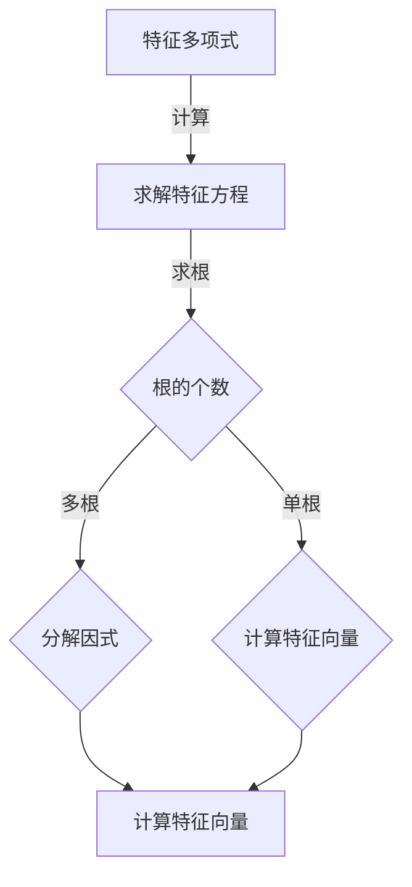

                 

### 《线性代数导引：n-变元项及其n-元多项式函数解释》

> **关键词**：线性代数、n-变元项、n-元多项式函数、特征值与特征向量、线性空间、机器学习、数据科学。

> **摘要**：本文旨在为读者提供一个完整的线性代数导引，重点关注n-变元项及其n-元多项式函数的深入解释。文章将详细讨论线性代数的基本概念、n-变元项与多项式函数的性质和运算，以及它们在多个领域（包括物理学、计算机科学、经济学和工程学）的应用。此外，文章还将探讨线性代数的高级话题，如特征值与特征向量，以及线性代数在机器学习和数据科学中的应用。

### 《线性代数导引：n-变元项及其n-元多项式函数解释》目录大纲

本文将按照以下目录结构展开：

#### 第一部分：线性代数基础

- **第1章：线性代数引论**
  - **1.1 线性代数的定义与历史**
    - **1.1.1 线性代数的起源与发展**
    - **1.1.2 线性代数的基本概念**
  - **1.2 矩阵与行列式**
    - **1.2.1 矩阵的概念与运算**
    - **1.2.2 行列式的概念与计算**
  - **1.3 线性方程组**
    - **1.3.1 线性方程组的基本理论**
    - **1.3.2 高斯消元法与矩阵求逆**

- **第2章：n-变元项及其运算**
  - **2.1 n-变元项的定义与性质**
    - **2.1.1 n-变元项的概念**
    - **2.1.2 n-变元项的基本性质**
  - **2.2 n-变元项的运算**
    - **2.2.1 n-变元项的加法与减法**
    - **2.2.2 n-变元项的乘法**
  - **2.3 多项式的概念**
    - **2.3.1 多项式的定义**
    - **2.3.2 多项式的度与次数**

- **第3章：n-元多项式函数的解释**
  - **3.1 n-元多项式函数的定义**
    - **3.1.1 n-元多项式函数的概念**
    - **3.1.2 n-元多项式函数的表示**
  - **3.2 n-元多项式函数的性质**
    - **3.2.1 n-元多项式函数的基本性质**
    - **3.2.2 n-元多项式函数的导数**
  - **3.3 n-元多项式函数的图示**
    - **3.3.1 n-元多项式函数的图示方法**
    - **3.3.2 n-元多项式函数的图示示例**

#### 第二部分：线性代数应用

- **第4章：线性代数在物理学中的应用**
  - **4.1 矩阵与向量在物理学中的应用**
    - **4.1.1 矩阵与向量在经典力学中的应用**
    - **4.1.2 矩阵与向量在量子力学中的应用**
  - **4.2 线性方程组在物理学中的应用**
    - **4.2.1 线性方程组在电磁学中的应用**
    - **4.2.2 线性方程组在热力学中的应用**

- **第5章：线性代数在计算机科学中的应用**
  - **5.1 矩阵与向量在计算机科学中的应用**
    - **5.1.1 矩阵与向量在算法设计中的应用**
    - **5.1.2 矩阵与向量在图像处理中的应用**
  - **5.2 线性方程组在计算机科学中的应用**
    - **5.2.1 线性方程组在机器学习中的应用**
    - **5.2.2 线性方程组在网络科学中的应用**

- **第6章：线性代数在经济学中的应用**
  - **6.1 矩阵与向量在经济学中的应用**
    - **6.1.1 矩阵与向量在经济学模型中的应用**
    - **6.1.2 矩阵与向量在计量经济学中的应用**
  - **6.2 线性方程组在经济学中的应用**
    - **6.2.1 线性方程组在投入产出分析中的应用**
    - **6.2.2 线性方程组在资本预算中的应用**

- **第7章：线性代数在工程学中的应用**
  - **7.1 矩阵与向量在工程学中的应用**
    - **7.1.1 矩阵与向量在结构力学中的应用**
    - **7.1.2 矩阵与向量在电路理论中的应用**
  - **7.2 线性方程组在工程学中的应用**
    - **7.2.1 线性方程组在流体力学中的应用**
    - **7.2.2 线性方程组在热力学中的应用**

#### 第三部分：线性代数的高级话题

- **第8章：特征值与特征向量**
  - **8.1 特征值与特征向量的定义**
    - **8.1.1 特征值与特征向量的概念**
    - **8.1.2 特征值与特征向量的几何意义**
  - **8.2 特征值与特征向量的计算**
    - **8.2.1 特征值的计算方法**
    - **8.2.2 特征向量的计算方法**
  - **8.3 特征值与特征向量的应用**
    - **8.3.1 特征值与特征向量在数值分析中的应用**
    - **8.3.2 特征值与特征向量在数据科学中的应用**

- **第9章：线性变换与线性空间**
  - **9.1 线性变换的定义与性质**
    - **9.1.1 线性变换的概念**
    - **9.1.2 线性变换的性质**
  - **9.2 线性空间的概念与性质**
    - **9.2.1 线性空间的概念**
    - **9.2.2 线性空间的性质**
  - **9.3 线性变换与线性空间的相互关系**
    - **9.3.1 线性变换与线性空间的联系**
    - **9.3.2 线性变换在求解线性方程组中的应用**

- **第10章：线性代数在机器学习中的应用**
  - **10.1 线性代数在机器学习中的基础**
    - **10.1.1 矩阵与向量的运算在机器学习中的应用**
    - **10.1.2 线性方程组在机器学习中的应用**
  - **10.2 线性模型**
    - **10.2.1 线性回归模型**
    - **10.2.2 逻辑回归模型**
  - **10.3 线性分类器**
    - **10.3.1 支持向量机**
    - **10.3.2 线性判别分析**

- **第11章：线性代数在数据科学中的应用**
  - **11.1 数据科学中的线性代数基础**
    - **11.1.1 矩阵与向量的基本运算**
    - **11.1.2 线性方程组的求解方法**
  - **11.2 数据降维**
    - **11.2.1 主成分分析**
    - **11.2.2 转换器架构详解**
  - **11.3 数据聚类**
    - **11.3.1 K均值聚类算法**
    - **11.3.2 层次聚类算法**

#### 附录

- **附录A：线性代数常用符号表**
- **附录B：线性代数常见问题解答**
- **附录C：线性代数学习资源推荐**
- **附录D：线性代数 Mermaid 流程图**
  - **Mermaid 流程图示例（解释特征值与特征向量的计算过程）**

接下来，我们将逐一展开每一部分的内容，详细讲解线性代数的基础知识、应用和高级话题。

### 第一部分：线性代数基础

#### 第1章：线性代数引论

线性代数是数学的一个分支，主要研究向量空间、线性变换以及与它们相关的基本结构。线性代数的应用非常广泛，包括物理学、计算机科学、经济学、工程学等众多领域。本章将介绍线性代数的基本概念、历史发展及其重要性。

##### 1.1 线性代数的定义与历史

**1.1.1 线性代数的起源与发展**

线性代数的起源可以追溯到17世纪的欧几里得几何学和解析几何学。当时，数学家们开始使用坐标系和代数方法来解决几何问题。18世纪末，线性代数的概念逐渐成形，法国数学家西蒙·莱昂哈德·弗朗索瓦·德·拉·格兰热（Siméon Denis Poisson）和奥恩·克莱罗（Orense Clérambault）等人对行列式进行了深入研究。19世纪，线性代数的发展得到了巨大的推动，卡尔·弗里德里希·高斯（Carl Friedrich Gauss）、乔治·西蒙·欧姆（Georg Simon Ohm）等数学家和物理学家在解决实际问题时广泛应用了线性代数的方法。

**1.1.2 线性代数的基本概念**

线性代数的基本概念包括向量、矩阵、行列式、线性方程组等。向量是具有大小和方向的量，可以表示为有序数组；矩阵是由数字组成的矩形数组，可以表示线性变换；行列式是一个标量值，用于描述矩阵的性质；线性方程组是由多个线性方程组成的方程组，可以通过矩阵方法求解。

##### 1.2 矩阵与行列式

**1.2.1 矩阵的概念与运算**

矩阵是线性代数中的基本工具。一个矩阵是由m行n列的元素组成的矩形数组。矩阵的运算包括加法、减法、乘法、转置等。

- **矩阵加法**：两个相同维度的矩阵对应元素相加。
- **矩阵减法**：类似矩阵加法，对应元素相减。
- **矩阵乘法**：两个矩阵的乘积是一个新矩阵，其元素是原矩阵对应行的元素与列元素的内积。
- **矩阵转置**：将矩阵的行与列互换。

**1.2.2 行列式的概念与计算**

行列式是一个标量值，用于描述矩阵的性质。一个n阶矩阵的行列式可以表示为：

\[ |A| = a_{11}C_{11} - a_{12}C_{12} + a_{13}C_{13} - ... + (-1)^{n+1}a_{1n}C_{1n} \]

其中，\( a_{ij} \) 是矩阵A的元素，\( C_{ij} \) 是对应的余子式。

##### 1.3 线性方程组

**1.3.1 线性方程组的基本理论**

线性方程组是由多个线性方程组成的方程组，其一般形式为：

\[ a_{11}x_1 + a_{12}x_2 + ... + a_{1n}x_n = b_1 \]
\[ a_{21}x_1 + a_{22}x_2 + ... + a_{2n}x_n = b_2 \]
\[ ... \]
\[ a_{m1}x_1 + a_{m2}x_2 + ... + a_{mn}x_n = b_m \]

线性方程组可以通过矩阵形式表示为：

\[ Ax = b \]

其中，A是系数矩阵，x是变量向量，b是常数向量。

**1.3.2 高斯消元法与矩阵求逆**

高斯消元法是一种求解线性方程组的有效方法。其基本思想是通过一系列行变换，将线性方程组转化为上三角矩阵，然后通过回代求解。

矩阵求逆是线性代数中一个重要问题。一个方阵可逆的条件是其行列式不为零。矩阵的逆可以通过高斯-约当消元法或伴随矩阵法求得。

#### 第2章：n-变元项及其运算

n-变元项是线性代数中的一个重要概念，它扩展了一元和多元函数的概念。本章将讨论n-变元项的定义、性质及其运算。

##### 2.1 n-变元项的定义与性质

**2.1.1 n-变元项的概念**

n-变元项是由n个变量（变元）组成的代数表达式。其一般形式为：

\[ a_1x_1 + a_2x_2 + ... + a_nx_n \]

其中，\( x_1, x_2, ..., x_n \) 是变元，\( a_1, a_2, ..., a_n \) 是系数。

**2.1.2 n-变元项的基本性质**

n-变元项具有以下基本性质：

- **加法**：两个n-变元项可以相加，其结果是一个新的n-变元项。
- **减法**：类似加法，两个n-变元项可以相减。
- **乘法**：一个n-变元项可以与一个常数相乘，其结果是一个新的n-变元项。
- **分配律**：一个n-变元项可以与另一个n-变元项的每一项相乘，其结果是一个新的n-变元项。

##### 2.2 n-变元项的运算

**2.2.1 n-变元项的加法与减法**

n-变元项的加法与减法遵循代数运算法则：

\[ (a_1x_1 + a_2x_2 + ... + a_nx_n) + (b_1x_1 + b_2x_2 + ... + b_nx_n) = (a_1 + b_1)x_1 + (a_2 + b_2)x_2 + ... + (a_n + b_n)x_n \]

\[ (a_1x_1 + a_2x_2 + ... + a_nx_n) - (b_1x_1 + b_2x_2 + ... + b_nx_n) = (a_1 - b_1)x_1 + (a_2 - b_2)x_2 + ... + (a_n - b_n)x_n \]

**2.2.2 n-变元项的乘法**

n-变元项的乘法遵循分配律和结合律：

\[ (a_1x_1 + a_2x_2 + ... + a_nx_n)(b_1x_1 + b_2x_2 + ... + b_nx_n) = a_1b_1x_1^2 + a_1b_2x_1x_2 + ... + a_1b_nx_1x_n + a_2b_1x_2x_1 + a_2b_2x_2^2 + ... + a_2b_nx_2x_n + ... + a_nb_1x_nx_1 + a_nb_2x_nx_2 + ... + a_nb_nx_n^2 \]

##### 2.3 多项式的概念

**2.3.1 多项式的定义**

多项式是由n个项（包括常数项、一次项、二次项等）组成的代数表达式。其一般形式为：

\[ p(x) = a_0 + a_1x + a_2x^2 + ... + a_nx^n \]

其中，\( x \) 是变量，\( a_0, a_1, a_2, ..., a_n \) 是系数。

**2.3.2 多项式的度与次数**

多项式的度是指多项式中最高次数的项的次数，即 \( n \)。多项式的次数是指多项式中非零项的次数的最大值。例如，多项式 \( p(x) = 3x^3 - 2x^2 + 4x - 1 \) 的度是3，次数是3。

#### 第3章：n-元多项式函数的解释

n-元多项式函数是n-变元项的推广，本章将介绍n-元多项式函数的定义、性质及其图示方法。

##### 3.1 n-元多项式函数的定义

n-元多项式函数是由n个变量（变元）组成的多项式函数。其一般形式为：

\[ f(x_1, x_2, ..., x_n) = a_0 + a_1x_1 + a_2x_2^2 + ... + a_nx_n^n \]

其中，\( x_1, x_2, ..., x_n \) 是变元，\( a_0, a_1, a_2, ..., a_n \) 是系数。

##### 3.2 n-元多项式函数的性质

n-元多项式函数具有以下性质：

- **加法**：两个n-元多项式函数可以相加，其结果是一个新的n-元多项式函数。
- **减法**：类似加法，两个n-元多项式函数可以相减。
- **乘法**：一个n-元多项式函数可以与一个常数相乘，其结果是一个新的n-元多项式函数。
- **多项式除法**：一个n-元多项式函数可以除以另一个n-元多项式函数，其结果是一个商和余数。
- **微分**：n-元多项式函数的导数仍然是n-元多项式函数。

##### 3.3 n-元多项式函数的图示

n-元多项式函数的图示方法通常用于二维或三维空间。对于二维空间，可以使用等高线图或曲面图来表示n-元多项式函数。对于三维空间，可以使用三维曲面图或等高线图来表示。

**3.3.1 等高线图**

等高线图是表示n-元多项式函数在二维空间中的图形。等高线是函数值相等的点的连线。例如，对于二元多项式函数 \( f(x, y) = x^2 + y^2 \)，其等高线图是一个圆。

**3.3.2 三维曲面图**

三维曲面图是表示n-元多项式函数在三维空间中的图形。三维曲面图可以显示函数值随变量变化的趋势。例如，对于三元多项式函数 \( f(x, y, z) = x^2 + y^2 + z^2 \)，其三维曲面图是一个球体。

通过以上章节的介绍，我们了解了线性代数的基本概念和n-元多项式函数的性质。在接下来的章节中，我们将讨论线性代数在各个领域的应用，包括物理学、计算机科学、经济学和工程学。

### 第二部分：线性代数应用

#### 第4章：线性代数在物理学中的应用

线性代数在物理学中有着广泛的应用，尤其是在描述和解决物理问题时，矩阵和向量是非常有用的工具。本章将探讨线性代数在经典力学和量子力学中的应用。

##### 4.1 矩阵与向量在物理学中的应用

**4.1.1 矩阵与向量在经典力学中的应用**

经典力学是研究宏观物体运动规律的物理学分支。在经典力学中，矩阵和向量被广泛用于描述物体的运动状态和受力情况。

- **矩阵表示质点运动**：在经典力学中，质点的运动状态可以用位置向量 \( \vec{r}(t) \) 和速度向量 \( \vec{v}(t) \) 来描述。位置向量和速度向量都可以表示为矩阵形式。

\[ \vec{r}(t) = \begin{bmatrix} x(t) \\ y(t) \\ z(t) \end{bmatrix} \]
\[ \vec{v}(t) = \begin{bmatrix} \dot{x}(t) \\ \dot{y}(t) \\ \dot{z}(t) \end{bmatrix} \]

其中，\( x(t), y(t), z(t) \) 分别是质点在x、y、z方向上的坐标，\( \dot{x}(t), \dot{y}(t), \dot{z}(t) \) 分别是质点在x、y、z方向上的速度。

- **矩阵表示力与运动方程**：经典力学中的牛顿第二定律可以表示为：

\[ m\vec{a} = \vec{F} \]

其中，\( m \) 是质点的质量，\( \vec{a} \) 是加速度向量，\( \vec{F} \) 是作用在质点上的力向量。加速度向量可以表示为速度向量的导数：

\[ \vec{a} = \dot{\vec{v}} \]

因此，牛顿第二定律可以表示为：

\[ m\dot{\vec{v}} = \vec{F} \]

这可以看作是一个线性方程组，其中 \( m \) 是一个对角矩阵，\( \dot{\vec{v}} \) 是速度向量，\( \vec{F} \) 是力向量。

**4.1.2 矩阵与向量在量子力学中的应用**

量子力学是研究微观粒子的运动和相互作用的物理学分支。在量子力学中，矩阵和向量被用于描述粒子的状态和测量结果。

- **波函数表示粒子状态**：在量子力学中，粒子的状态用波函数 \( \psi(x, y, z, t) \) 来描述。波函数是复值函数，可以表示为：

\[ \psi(x, y, z, t) = \sum_{n=1}^{N} c_n \phi_n(x, y, z, t) \]

其中，\( c_n \) 是归一化系数，\( \phi_n(x, y, z, t) \) 是基态波函数。

- **矩阵表示量子态转换**：量子态之间的转换可以通过量子态转换矩阵 \( U \) 来描述。量子态转换矩阵是一个幺正矩阵，满足 \( U^{\dagger}U = UU^{\dagger} = I \)，其中 \( U^{\dagger} \) 是 \( U \) 的共轭转置，\( I \) 是单位矩阵。

\[ U = \begin{bmatrix} u_{11} & u_{12} & \cdots & u_{1n} \\ u_{21} & u_{22} & \cdots & u_{2n} \\ \vdots & \vdots & \ddots & \vdots \\ u_{n1} & u_{n2} & \cdots & u_{nn} \end{bmatrix} \]

##### 4.2 线性方程组在物理学中的应用

**4.2.1 线性方程组在电磁学中的应用**

电磁学是研究电磁现象的物理学分支。在电磁学中，线性方程组被用于描述电磁场和电荷分布。

- **麦克斯韦方程组**：麦克斯韦方程组是描述电磁场的基本方程。其数学形式可以表示为：

\[ \nabla \cdot \vec{E} = \frac{\rho}{\varepsilon_0} \]
\[ \nabla \cdot \vec{B} = 0 \]
\[ \nabla \times \vec{E} = -\frac{\partial \vec{B}}{\partial t} \]
\[ \nabla \times \vec{B} = \mu_0 \vec{J} + \mu_0 \varepsilon_0 \frac{\partial \vec{E}}{\partial t} \]

其中，\( \vec{E} \) 是电场强度，\( \vec{B} \) 是磁场强度，\( \rho \) 是电荷密度，\( \varepsilon_0 \) 是真空电容率，\( \mu_0 \) 是真空磁导率，\( \vec{J} \) 是电流密度。

这些方程可以用矩阵形式表示为：

\[ \begin{bmatrix} \nabla \cdot \vec{E} \\ \nabla \cdot \vec{B} \\ \nabla \times \vec{E} \\ \nabla \times \vec{B} \end{bmatrix} = \begin{bmatrix} \frac{\rho}{\varepsilon_0} \\ 0 \\ -\frac{\partial \vec{B}}{\partial t} \\ \mu_0 \vec{J} + \mu_0 \varepsilon_0 \frac{\partial \vec{E}}{\partial t} \end{bmatrix} \]

- **洛伦兹力方程**：洛伦兹力是描述带电粒子在电磁场中受到的力的方程。其数学形式为：

\[ \vec{F} = q(\vec{E} + \vec{v} \times \vec{B}) \]

其中，\( q \) 是电荷量，\( \vec{F} \) 是洛伦兹力，\( \vec{E} \) 是电场强度，\( \vec{B} \) 是磁场强度，\( \vec{v} \) 是粒子的速度。

该方程可以用矩阵形式表示为：

\[ \vec{F} = q\begin{bmatrix} \vec{E} \\ \vec{B} \\ \vec{v} \end{bmatrix} \]

**4.2.2 线性方程组在热力学中的应用**

热力学是研究能量和热量在系统之间传递的物理学分支。在热力学中，线性方程组被用于描述热传导和热辐射。

- **热传导方程**：热传导方程是描述热量在固体中传导的方程。其数学形式为：

\[ \nabla \cdot \left( k \nabla T \right) = \rho C_p \frac{\partial T}{\partial t} \]

其中，\( k \) 是热导率，\( \rho \) 是密度，\( C_p \) 是比热容，\( T \) 是温度。

该方程可以用矩阵形式表示为：

\[ \begin{bmatrix} \nabla \cdot \left( k \nabla T \right) \end{bmatrix} = \begin{bmatrix} \rho C_p \frac{\partial T}{\partial t} \end{bmatrix} \]

- **热辐射方程**：热辐射方程是描述物体通过热辐射放出热量的方程。其数学形式为：

\[ \frac{\partial u}{\partial t} = \alpha \left( u^4 - T^4 \right) \]

其中，\( u \) 是辐射强度，\( \alpha \) 是辐射系数，\( T \) 是温度。

该方程可以用矩阵形式表示为：

\[ \begin{bmatrix} \frac{\partial u}{\partial t} \end{bmatrix} = \begin{bmatrix} \alpha \left( u^4 - T^4 \right) \end{bmatrix} \]

通过以上讨论，我们看到了线性代数在物理学中的广泛应用。矩阵和向量作为线性代数的基本工具，在描述物理现象和解决物理问题中发挥着重要作用。

### 第三部分：线性代数的高级话题

#### 第8章：特征值与特征向量

特征值与特征向量是线性代数中的重要概念，它们在数值分析、数据科学和许多其他领域都有广泛的应用。本章将详细介绍特征值与特征向量的定义、计算方法以及它们的应用。

##### 8.1 特征值与特征向量的定义

**8.1.1 特征值与特征向量的概念**

特征值和特征向量是矩阵理论的核心概念。给定一个方阵 \( A \)，如果存在一个非零向量 \( \vec{v} \) 和一个标量 \( \lambda \)，使得以下等式成立：

\[ A\vec{v} = \lambda\vec{v} \]

那么，\( \lambda \) 被称为矩阵 \( A \) 的特征值，\( \vec{v} \) 被称为矩阵 \( A \) 对应于特征值 \( \lambda \) 的特征向量。

**8.1.2 特征值与特征向量的几何意义**

在几何学中，我们可以将特征值与特征向量理解为线性变换的伸缩性质。具体来说，当矩阵 \( A \) 对应于特征值 \( \lambda \) 的特征向量 \( \vec{v} \) 时，矩阵 \( A \) 将向量 \( \vec{v} \) 伸缩到 \( \lambda \) 倍，而保持其方向不变。这个性质使得特征值和特征向量在许多领域（如结构分析、图像处理等）中具有非常重要的应用。

##### 8.2 特征值与特征向量的计算

**8.2.1 特征值的计算方法**

计算矩阵的特征值通常涉及以下步骤：

1. **计算特征多项式**：给定矩阵 \( A \)，其特征多项式 \( p(\lambda) \) 定义为 \( \det(A - \lambda I) \)，其中 \( I \) 是单位矩阵。

2. **求特征方程的根**：求解特征多项式 \( p(\lambda) = 0 \) 得到矩阵 \( A \) 的特征值 \( \lambda \)。

3. **计算特征向量**：对于每个特征值 \( \lambda \)，求解线性方程组 \( (A - \lambda I)\vec{v} = \vec{0} \) 得到对应的特征向量。

以下是一个计算特征值和特征向量的示例：

**示例**：给定矩阵 \( A = \begin{bmatrix} 2 & 1 \\ -1 & 2 \end{bmatrix} \)，计算其特征值和特征向量。

1. **计算特征多项式**：

\[ p(\lambda) = \det(A - \lambda I) = \det\begin{bmatrix} 2 - \lambda & 1 \\ -1 & 2 - \lambda \end{bmatrix} = (2 - \lambda)^2 - (-1)(1) = \lambda^2 - 4\lambda + 5 \]

2. **求特征方程的根**：

\[ \lambda^2 - 4\lambda + 5 = 0 \]

使用求根公式：

\[ \lambda = \frac{-(-4) \pm \sqrt{(-4)^2 - 4 \cdot 1 \cdot 5}}{2 \cdot 1} = 2 \pm i \]

得到两个特征值 \( \lambda_1 = 2 + i \) 和 \( \lambda_2 = 2 - i \)。

3. **计算特征向量**：

对于特征值 \( \lambda_1 = 2 + i \)，解线性方程组 \( (A - \lambda_1 I)\vec{v} = \vec{0} \)：

\[ \begin{bmatrix} 2 - (2 + i) & 1 \\ -1 & 2 - (2 + i) \end{bmatrix} \begin{bmatrix} x \\ y \end{bmatrix} = \begin{bmatrix} -i & 1 \\ -1 & -i \end{bmatrix} \begin{bmatrix} x \\ y \end{bmatrix} = \begin{bmatrix} 0 \\ 0 \end{bmatrix} \]

通过解方程组，得到特征向量 \( \vec{v}_1 = \begin{bmatrix} 1 \\ i \end{bmatrix} \)。

类似地，对于特征值 \( \lambda_2 = 2 - i \)，解线性方程组 \( (A - \lambda_2 I)\vec{v} = \vec{0} \)，得到特征向量 \( \vec{v}_2 = \begin{bmatrix} 1 \\ -i \end{bmatrix} \)。

**8.2.2 特征向量的计算方法**

计算特征向量通常涉及以下步骤：

1. **将矩阵 \( A \) 减去 \( \lambda \) 倍的单位矩阵 \( I \) 形成新矩阵 \( A - \lambda I \)**。

2. **求解线性方程组 \( (A - \lambda I)\vec{v} = \vec{0} \)**。

3. **将解得的向量标准化，使其为单位向量**。

以下是一个计算特征向量的示例：

**示例**：给定矩阵 \( A = \begin{bmatrix} 2 & 1 \\ -1 & 2 \end{bmatrix} \)，计算其特征值和特征向量。

我们已经知道特征值 \( \lambda_1 = 2 + i \) 和 \( \lambda_2 = 2 - i \)。

对于特征值 \( \lambda_1 = 2 + i \)，解线性方程组 \( (A - \lambda_1 I)\vec{v} = \vec{0} \)：

\[ \begin{bmatrix} 2 - (2 + i) & 1 \\ -1 & 2 - (2 + i) \end{bmatrix} \begin{bmatrix} x \\ y \end{bmatrix} = \begin{bmatrix} -i & 1 \\ -1 & -i \end{bmatrix} \begin{bmatrix} x \\ y \end{bmatrix} = \begin{bmatrix} 0 \\ 0 \end{bmatrix} \]

通过解方程组，得到特征向量 \( \vec{v}_1 = \begin{bmatrix} 1 \\ i \end{bmatrix} \)。

对于特征值 \( \lambda_2 = 2 - i \)，解线性方程组 \( (A - \lambda_2 I)\vec{v} = \vec{0} \)：

\[ \begin{bmatrix} 2 - (2 - i) & 1 \\ -1 & 2 - (2 - i) \end{bmatrix} \begin{bmatrix} x \\ y \end{bmatrix} = \begin{bmatrix} i & 1 \\ -1 & i \end{bmatrix} \begin{bmatrix} x \\ y \end{bmatrix} = \begin{bmatrix} 0 \\ 0 \end{bmatrix} \]

通过解方程组，得到特征向量 \( \vec{v}_2 = \begin{bmatrix} 1 \\ -i \end{bmatrix} \)。

##### 8.3 特征值与特征向量的应用

**8.3.1 特征值与特征向量在数值分析中的应用**

特征值与特征向量在数值分析中有着广泛的应用，特别是在求解大型线性方程组、优化问题和数值模拟等方面。

- **线性方程组的求解**：通过计算矩阵 \( A \) 的特征值和特征向量，可以将线性方程组 \( Ax = b \) 转换为对角矩阵的形式，从而简化求解过程。

- **优化问题**：在优化问题中，特征值和特征向量可以用于求解最小二乘问题和最大似然估计等问题。

- **数值模拟**：在数值模拟中，特征值和特征向量可以用于分析系统的稳定性和动态行为。

**8.3.2 特征值与特征向量在数据科学中的应用**

特征值与特征向量在数据科学中也有着广泛的应用，特别是在降维、聚类分析和分类等问题中。

- **降维**：通过计算数据矩阵的特征值和特征向量，可以将高维数据降维到低维空间，从而简化数据分析和处理。

- **聚类分析**：特征值和特征向量可以用于确定数据集中的聚类中心，从而实现数据的聚类分析。

- **分类**：特征值和特征向量可以用于构建分类模型，从而实现数据的分类。

通过本章的讨论，我们了解了特征值与特征向量的定义、计算方法以及它们在数值分析、数据科学和其他领域的应用。这些概念和方法为线性代数的应用提供了强大的工具。

#### 第9章：线性变换与线性空间

线性变换和线性空间是线性代数中的核心概念，它们在数学、物理学、计算机科学等领域有着广泛的应用。本章将详细介绍线性变换的定义与性质、线性空间的概念与性质，以及线性变换与线性空间的相互关系。

##### 9.1 线性变换的定义与性质

**9.1.1 线性变换的概念**

线性变换是线性代数中的一个基本概念，它是将向量空间中的一个向量映射到另一个向量的一种函数。给定一个向量空间 \( V \) 和一个标量域 \( F \)，一个线性变换 \( T \) 是从 \( V \) 到 \( F \) 的一个函数，满足以下两个条件：

1. **加法保持性**：对于任意 \( \vec{u}, \vec{v} \in V \)，有 \( T(\vec{u} + \vec{v}) = T(\vec{u}) + T(\vec{v}) \)。
2. **标量乘法保持性**：对于任意 \( \vec{u} \in V \) 和标量 \( a \in F \)，有 \( T(a\vec{u}) = aT(\vec{u}) \)。

形式化地，线性变换可以表示为 \( T: V \rightarrow F \)，其中 \( \vec{u} \mapsto T(\vec{u}) \)。

**9.1.2 线性变换的性质**

线性变换具有以下性质：

1. **恒等变换**：恒等变换 \( I \) 是一个将每个向量映射到其自身的线性变换，即 \( I(\vec{u}) = \vec{u} \) 对于所有 \( \vec{u} \in V \)。
2. **零变换**：零变换 \( 0 \) 是一个将每个向量映射到零向量的线性变换，即 \( 0(\vec{u}) = \vec{0} \) 对于所有 \( \vec{u} \in V \)。
3. **可逆性**：如果线性变换 \( T \) 是单射和满射，那么 \( T \) 是可逆的，存在一个线性变换 \( T^{-1} \) 使得 \( T^{-1}(T(\vec{u})) = \vec{u} \)。
4. **结合律**：对于任意三个线性变换 \( T_1, T_2, T_3 \)，有 \( (T_3 \circ T_2 \circ T_1)(\vec{u}) = T_3(T_2(T_1(\vec{u}))) \)。

##### 9.2 线性空间的概念与性质

**9.2.1 线性空间的概念**

线性空间，也称为向量空间，是一个集合 \( V \) 及其上的两种运算——加法和标量乘法。线性空间满足以下性质：

1. **封闭性**：对于任意 \( \vec{u}, \vec{v} \in V \)，有 \( \vec{u} + \vec{v} \in V \)。
2. **结合律**：对于任意 \( \vec{u}, \vec{v}, \vec{w} \in V \)，有 \( (\vec{u} + \vec{v}) + \vec{w} = \vec{u} + (\vec{v} + \vec{w}) \)。
3. **交换律**：对于任意 \( \vec{u}, \vec{v} \in V \)，有 \( \vec{u} + \vec{v} = \vec{v} + \vec{u} \)。
4. **存在零元素**：存在一个零向量 \( \vec{0} \in V \)，使得对于任意 \( \vec{u} \in V \)，有 \( \vec{u} + \vec{0} = \vec{u} \)。
5. **存在逆元素**：对于任意 \( \vec{u} \in V \)，存在一个向量 \( -\vec{u} \in V \)，使得 \( \vec{u} + (-\vec{u}) = \vec{0} \)。
6. **标量乘法的分配律**：对于任意标量 \( a, b \in F \) 和 \( \vec{u}, \vec{v} \in V \)，有 \( a(\vec{u} + \vec{v}) = a\vec{u} + a\vec{v} \) 和 \( (a + b)\vec{u} = a\vec{u} + b\vec{u} \)。
7. **标量与向量的分配律**：对于任意标量 \( a, b \in F \) 和 \( \vec{u} \in V \)，有 \( a(b\vec{u}) = (ab)\vec{u} \)。

**9.2.2 线性空间的性质**

线性空间的性质包括：

1. **维数**：线性空间的维数是指其基的元素个数，记为 \( \dim(V) \)。
2. **子空间**：线性空间 \( V \) 的子集 \( W \) 是 \( V \) 的子空间，当且仅当 \( W \) 也是线性空间，即对于任意 \( \vec{u}, \vec{v} \in W \) 和标量 \( a, b \in F \)，有 \( a\vec{u} + b\vec{v} \in W \)。
3. **基与坐标**：线性空间的基是一组线性无关的向量，可以表示其他向量为其线性组合。一个线性空间的坐标是基向量在该向量上的投影。

##### 9.3 线性变换与线性空间的相互关系

**9.3.1 线性变换与线性空间的联系**

线性变换与线性空间之间有着密切的联系。线性变换将一个线性空间的每个向量映射到另一个线性空间的向量。具体来说，给定两个线性空间 \( V \) 和 \( W \)，一个线性变换 \( T: V \rightarrow W \) 将 \( V \) 中的每个向量 \( \vec{u} \) 映射到 \( W \) 中的向量 \( T(\vec{u}) \)。线性变换保留了线性空间的加法和标量乘法运算。

**9.3.2 线性变换在求解线性方程组中的应用**

线性变换在求解线性方程组 \( Ax = b \) 中起着关键作用。通过将线性方程组视为线性变换 \( T(x) = Ax \)，我们可以将问题转化为求解 \( T \) 的逆变换 \( T^{-1} \) 的形式：

\[ x = T^{-1}(b) \]

如果 \( A \) 是可逆矩阵，那么 \( T \) 是可逆的，且其逆变换 \( T^{-1} \) 存在。在这种情况下，我们可以直接计算 \( T^{-1}(b) \) 来求解线性方程组。如果 \( A \) 不可逆，我们可以通过特征值和特征向量的方法将 \( A \) 对角化，从而简化求解过程。

通过本章的讨论，我们了解了线性变换和线性空间的基本概念、性质及其相互关系。这些概念和方法为线性代数的深入理解和应用提供了重要的工具。

#### 第10章：线性代数在机器学习中的应用

线性代数在机器学习中扮演着至关重要的角色，它是许多机器学习算法的理论基础。本章将探讨线性代数在机器学习中的应用，包括矩阵与向量的运算、线性方程组的求解方法，以及线性模型和线性分类器的应用。

##### 10.1 线性代数在机器学习中的基础

**10.1.1 矩阵与向量的运算在机器学习中的应用**

在机器学习中，数据通常以矩阵或向量的形式表示。矩阵和向量的运算包括加法、减法、乘法、转置等，这些运算在数据处理和模型训练中发挥着重要作用。

- **矩阵加法和减法**：矩阵加法和减法用于合并和分离数据集。例如，在数据预处理阶段，可以使用矩阵加法和减法来合并训练集和测试集。

- **矩阵乘法**：矩阵乘法用于计算数据矩阵和权重矩阵之间的乘积，这在计算线性模型的前向传播过程中非常重要。

- **矩阵转置**：矩阵转置用于计算数据矩阵的转置，这在计算梯度下降和优化过程中非常有用。

**10.1.2 线性方程组在机器学习中的应用**

线性方程组在机器学习中用于求解参数和模型权重。线性方程组的一般形式为：

\[ Ax = b \]

其中，\( A \) 是系数矩阵，\( x \) 是变量向量，\( b \) 是常数向量。

在机器学习中，线性方程组经常用于以下场景：

- **求解模型参数**：在线性回归中，我们需要求解模型参数以最小化损失函数。通过将损失函数表示为线性方程组，我们可以使用矩阵运算求解参数。

- **优化算法**：在梯度下降算法中，我们需要求解参数的梯度，这可以通过线性方程组表示并使用矩阵运算求解。

**10.2 线性模型**

线性模型是机器学习中最基本的模型之一，它通过线性组合输入特征来预测输出。线性模型包括线性回归和逻辑回归两种主要形式。

**10.2.1 线性回归模型**

线性回归模型用于预测连续值输出。其基本形式为：

\[ y = \beta_0 + \beta_1x_1 + \beta_2x_2 + ... + \beta_nx_n \]

其中，\( y \) 是输出变量，\( x_1, x_2, ..., x_n \) 是输入特征，\( \beta_0, \beta_1, \beta_2, ..., \beta_n \) 是模型参数。

线性回归模型的求解可以通过以下步骤进行：

1. **定义损失函数**：损失函数用于度量预测值和实际值之间的差距。常用的损失函数包括平方损失函数和交叉熵损失函数。

2. **求解参数**：通过最小化损失函数，我们可以求解线性回归模型的参数。常用的优化算法包括梯度下降、牛顿法和随机梯度下降等。

**10.2.2 逻辑回归模型**

逻辑回归模型用于预测离散值输出，通常用于分类问题。其基本形式为：

\[ P(y=1) = \frac{1}{1 + e^{-(\beta_0 + \beta_1x_1 + \beta_2x_2 + ... + \beta_nx_n)}} \]

其中，\( P(y=1) \) 是预测概率，\( y \) 是输出变量，\( x_1, x_2, ..., x_n \) 是输入特征，\( \beta_0, \beta_1, \beta_2, ..., \beta_n \) 是模型参数。

逻辑回归模型的求解与线性回归模型类似，通过最小化损失函数求解参数。常用的损失函数是交叉熵损失函数。

**10.3 线性分类器**

线性分类器是用于分类问题的机器学习模型，它通过线性决策边界将数据分为不同的类别。常见的线性分类器包括支持向量机和线性判别分析。

**10.3.1 支持向量机**

支持向量机（SVM）是一种高效的线性分类器，它通过最大化分类边界之间的间隔来分类数据。给定训练数据集 \( \{(\vec{x}_i, y_i)\} \)，其中 \( \vec{x}_i \) 是输入特征，\( y_i \) 是类别标签（+1或-1），SVM的优化目标是：

\[ \min_{\beta, \beta_0} \frac{1}{2}\sum_{i=1}^{n}|\beta \cdot \vec{x}_i + \beta_0|^2 \]

其中，\( \beta \) 是权重向量，\( \beta_0 \) 是偏置项。

SVM通过求解上述优化问题得到最优决策边界，然后使用该决策边界进行分类。

**10.3.2 线性判别分析**

线性判别分析（LDA）是一种基于特征的线性分类方法，它通过最大化类别间的离散度来最小化类别内的离散度，从而得到最佳分类边界。LDA的目标是最小化类别间的离散度和最大化类别内的离散度，具体公式为：

\[ \min_{\beta} \sum_{i=1}^{n} \sum_{j=1}^{c} (y_{ij} - \bar{y}_j)^T \beta (y_{ij} - \bar{y}_j) \]

其中，\( y_{ij} \) 是第 \( i \) 个样本在第 \( j \) 个类别中的标签，\( \bar{y}_j \) 是第 \( j \) 个类别的均值。

通过求解上述优化问题，LDA得到最优分类边界，然后使用该分类边界进行分类。

通过本章的讨论，我们了解了线性代数在机器学习中的应用，包括矩阵与向量的运算、线性方程组的求解方法，以及线性模型和线性分类器的应用。这些概念和方法为机器学习算法的实现提供了重要的理论支持。

#### 第11章：线性代数在数据科学中的应用

线性代数在数据科学中扮演着至关重要的角色，它是许多数据科学方法和技术的基础。本章将探讨线性代数在数据科学中的基础、数据降维和数据聚类的方法。

##### 11.1 数据科学中的线性代数基础

**11.1.1 矩阵与向量的基本运算**

在数据科学中，数据通常以矩阵或向量的形式表示。矩阵和向量的基本运算包括加法、减法、乘法、转置等，这些运算是数据预处理和分析的基础。

- **矩阵加法和减法**：矩阵加法和减法用于合并和分离数据集。例如，在数据预处理阶段，可以使用矩阵加法和减法来合并训练集和测试集。

- **矩阵乘法**：矩阵乘法用于计算数据矩阵和权重矩阵之间的乘积，这在计算线性模型的前向传播过程中非常重要。

- **矩阵转置**：矩阵转置用于计算数据矩阵的转置，这在计算梯度下降和优化过程中非常有用。

**11.1.2 线性方程组的求解方法**

线性方程组在数据科学中用于求解参数和模型权重。线性方程组的一般形式为：

\[ Ax = b \]

其中，\( A \) 是系数矩阵，\( x \) 是变量向量，\( b \) 是常数向量。

在数据科学中，线性方程组经常用于以下场景：

- **求解模型参数**：在线性回归中，我们需要求解模型参数以最小化损失函数。通过将损失函数表示为线性方程组，我们可以使用矩阵运算求解参数。

- **优化算法**：在梯度下降算法中，我们需要求解参数的梯度，这可以通过线性方程组表示并使用矩阵运算求解。

**11.2 数据降维**

数据降维是数据科学中一个重要的技术，它通过减少数据的维度来提高计算效率和模型性能。常见的降维方法包括主成分分析（PCA）和转换器架构。

**11.2.1 主成分分析**

主成分分析（PCA）是一种无监督学习方法，它通过将数据转换到新的坐标系中，从而降低数据的维度。PCA的核心思想是找到数据的主要成分，这些成分能够解释数据中的大部分方差。

PCA的步骤如下：

1. **数据标准化**：将数据矩阵 \( X \) 的每个特征标准化，使其具有零均值和单位方差。

2. **计算协方差矩阵**：计算标准化后数据矩阵的协方差矩阵 \( \Sigma \)。

3. **计算协方差矩阵的特征值和特征向量**：计算协方差矩阵的特征值和特征向量，并按照特征值从大到小排序。

4. **构建投影矩阵**：选择前 \( k \) 个特征向量构建投影矩阵 \( P \)，其中 \( k \) 是降维后的维度。

5. **降维**：将数据矩阵 \( X \) 与投影矩阵 \( P \) 相乘，得到降维后的数据矩阵 \( X' \)。

主成分分析可以表示为以下矩阵运算：

\[ X' = XP \]

其中，\( X \) 是原始数据矩阵，\( P \) 是投影矩阵。

**11.2.2 转换器架构**

转换器架构是一种基于深度学习的降维方法，它通过构建一个神经网络模型来学习数据的低维表示。转换器架构通常包括编码器和解码器两部分。

1. **编码器**：编码器是一个神经网络模型，它接收原始数据并输出一个低维嵌入向量。

2. **解码器**：解码器是一个神经网络模型，它接收编码器输出的低维嵌入向量，并尝试重构原始数据。

转换器架构的流程如下：

1. **训练编码器**：使用有监督学习训练编码器，使其能够将原始数据映射到低维嵌入空间。

2. **训练解码器**：使用无监督学习训练解码器，使其能够从低维嵌入空间重构原始数据。

3. **降维**：使用编码器将原始数据映射到低维嵌入空间，从而实现数据降维。

转换器架构可以表示为以下矩阵运算：

\[ \vec{z} = \text{Encoder}(\vec{x}) \]
\[ \vec{x'} = \text{Decoder}(\vec{z}) \]

其中，\( \vec{x} \) 是原始数据向量，\( \vec{z} \) 是低维嵌入向量，\( \vec{x'} \) 是重构的数据向量。

**11.3 数据聚类**

数据聚类是将数据集划分为多个类别的无监督学习方法。聚类算法的目标是找到数据集中的自然分组，使得同一组内的数据点相似度较高，而不同组的数据点相似度较低。常见的聚类算法包括K均值聚类和层次聚类。

**11.3.1 K均值聚类算法**

K均值聚类算法是一种基于距离度量的聚类算法，它通过迭代优化目标函数来找到最优的聚类中心。

K均值聚类算法的步骤如下：

1. **初始化聚类中心**：随机选择 \( k \) 个数据点作为初始聚类中心。

2. **分配数据点**：对于每个数据点，计算其到每个聚类中心的距离，并将数据点分配到最近的聚类中心。

3. **更新聚类中心**：计算每个聚类中心的新位置，即其对应数据点的平均值。

4. **重复步骤2和3**，直到聚类中心的位置不再改变或达到预定的迭代次数。

K均值聚类算法的目标函数为：

\[ J = \sum_{i=1}^{k} \sum_{j=1}^{n} d(\vec{x}_j, \mu_i)^2 \]

其中，\( \vec{x}_j \) 是数据点，\( \mu_i \) 是聚类中心，\( d(\vec{x}_j, \mu_i) \) 是数据点 \( \vec{x}_j \) 到聚类中心 \( \mu_i \) 的距离。

K均值聚类算法可以表示为以下矩阵运算：

\[ \mu_i = \frac{1}{N_i} \sum_{j=1}^{n} \vec{x}_j \]
\[ \text{where } N_i = \sum_{j=1}^{n} I(\text{dist}(\vec{x}_j, \mu_i) < \text{threshold}) \]

其中，\( \mu_i \) 是聚类中心，\( N_i \) 是属于聚类中心 \( \mu_i \) 的数据点数量，\( I(\text{dist}(\vec{x}_j, \mu_i) < \text{threshold}) \) 是指示函数，当 \( \text{dist}(\vec{x}_j, \mu_i) < \text{threshold} \) 时为1，否则为0。

**11.3.2 层次聚类算法**

层次聚类算法是一种基于层次结构的聚类方法，它通过逐步合并或分裂数据点来构建聚类层次。

层次聚类算法的步骤如下：

1. **初始化**：将每个数据点视为一个单独的簇。

2. **合并或分裂**：在每次迭代中，根据某种距离度量（如最短距离、最近距离等）选择最近的两个簇进行合并或分裂。

3. **更新层次结构**：重复步骤2，直到满足预定的合并或分裂条件。

层次聚类算法的目标是构建一个层次树，树中的每个节点表示一个簇，叶子节点表示单个数据点。

层次聚类算法可以表示为以下矩阵运算：

\[ C(t+1) = C(t) \cup \{C_i \cap C_j\} \]
\[ \text{where } C(t) \text{ is the clustering at step } t, C_i \text{ and } C_j \text{ are two clusters to be merged or split} \]

其中，\( C(t) \) 是第 \( t \) 次迭代的聚类结果。

通过本章的讨论，我们了解了线性代数在数据科学中的应用，包括数据降维和数据聚类的方法。这些方法为数据分析和建模提供了强大的工具。

### 附录

#### 附录A：线性代数常用符号表

以下列出了一些在线性代数中常用的符号及其含义：

- **\( \vec{a} \)**：向量
- **\( \vec{v} \)**：特征向量
- **\( \vec{w} \)**：权重向量
- **\( \vec{u} \)**：输入向量
- **\( \vec{x} \)**：变量向量
- **\( \vec{y} \)**：输出向量
- **\( \vec{z} \)**：嵌入向量
- **\( A \)**：矩阵
- **\( B \)**：矩阵
- **\( C \)**：矩阵
- **\( I \)**：单位矩阵
- **\( J \)**：置换矩阵
- **\( \lambda \)**：特征值
- **\( \mu \)**：均值
- **\( \Sigma \)**：协方差矩阵
- **\( \pi \)**：概率密度函数
- **\( \phi \)**：基函数
- **\( \theta \)**：模型参数
- **\( \alpha \)**：学习率
- **\( \beta \)**：模型参数
- **\( \gamma \)**：惩罚项
- **\( \delta \)**：损失函数
- **\( \epsilon \)**：误差项
- **\( \delta(\cdot) \)**：指示函数

#### 附录B：线性代数常见问题解答

以下是一些在线性代数中常见的问题及其解答：

**Q1. 什么是向量？**

A1. 向量是具有大小和方向的量，通常表示为有序数组。向量可以用于表示物理量，如速度、加速度、力等。

**Q2. 什么是矩阵？**

A2. 矩阵是由数字组成的矩形数组，可以表示线性变换。矩阵可以用于表示系统、计算数据等。

**Q3. 什么是行列式？**

A3. 行列式是一个标量值，用于描述矩阵的性质。行列式可以用于求解线性方程组、判断矩阵的行列式为零等。

**Q4. 什么是线性方程组？**

A4. 线性方程组是由多个线性方程组成的方程组，其一般形式为：

\[ a_{11}x_1 + a_{12}x_2 + ... + a_{1n}x_n = b_1 \]
\[ a_{21}x_1 + a_{22}x_2 + ... + a_{2n}x_n = b_2 \]
\[ ... \]
\[ a_{m1}x_1 + a_{m2}x_2 + ... + a_{mn}x_n = b_m \]

**Q5. 什么是特征值和特征向量？**

A5. 特征值和特征向量是矩阵理论中的核心概念。特征值是矩阵的一个特殊值，对应于矩阵的一个非零特征向量。特征向量是矩阵乘以该特征向量后得到的一个向量，其方向保持不变。

**Q6. 什么是线性变换？**

A6. 线性变换是将一个向量空间中的向量映射到另一个向量空间的一种函数。线性变换满足加法和标量乘法的保持性。

**Q7. 什么是线性空间？**

A7. 线性空间是一个集合及其上的两种运算——加法和标量乘法。线性空间满足封闭性、结合律、交换律、存在零元素和存在逆元素等性质。

**Q8. 什么是主成分分析？**

A8. 主成分分析是一种无监督学习方法，通过将数据转换到新的坐标系中，从而降低数据的维度。主成分分析的核心是找到数据的主要成分，这些成分能够解释数据中的大部分方差。

**Q9. 什么是支持向量机？**

A9. 支持向量机是一种高效的线性分类器，通过最大化分类边界之间的间隔来分类数据。支持向量机通过求解优化问题找到最优决策边界。

**Q10. 什么是K均值聚类？**

A10. K均值聚类是一种基于距离度量的聚类算法，通过迭代优化目标函数来找到最优的聚类中心。K均值聚类将数据点分配到最近的聚类中心，并更新聚类中心的位置。

#### 附录C：线性代数学习资源推荐

以下是一些在线性代数学习过程中推荐的资源：

- **书籍**：
  - 《线性代数及其应用》（作者：大卫·C·莱纳）
  - 《线性代数基础教程》（作者：彼得·J·海曼）
  - 《线性代数导论》（作者：詹姆斯·J·斯特林）

- **在线课程**：
  - Coursera上的“线性代数”（由斯坦福大学提供）
  - edX上的“线性代数与矩阵计算”（由麻省理工学院提供）

- **视频教程**：
  - YouTube上的线性代数教程
  - Khan Academy上的线性代数课程

- **软件工具**：
  - MATLAB：用于矩阵运算和可视化
  - Python：使用NumPy库进行矩阵运算

#### 附录D：线性代数 Mermaid 流程图

以下是一个解释特征值与特征向量计算过程的 Mermaid 流程图示例：

通过上述附录，我们提供了线性代数常用符号表、常见问题解答、学习资源推荐以及 Mermaid 流程图示例，希望这些资源能够帮助读者更好地理解和应用线性代数。

### 总结

本文通过详细的论述，从基础到高级话题，全面介绍了线性代数及其在各个领域的应用。我们首先介绍了线性代数的基本概念，包括矩阵、向量、行列式和线性方程组，接着探讨了n-变元项及其多项式函数的性质和运算。随后，我们详细阐述了线性代数在物理学、计算机科学、经济学和工程学中的应用，展示了矩阵和向量在解决实际问题中的重要作用。

接着，我们深入讨论了线性代数的高级话题，如特征值与特征向量、线性变换和线性空间。这些概念不仅在数学和物理学中有着广泛的应用，也在数据科学和机器学习中扮演着至关重要的角色。我们通过具体的计算方法和应用实例，展示了这些高级概念的实际应用。

最后，我们介绍了线性代数在机器学习和数据科学中的应用，包括线性模型和线性分类器的实现。这些应用展示了线性代数在实际问题解决中的强大能力。

通过本文的阅读，读者应当能够全面理解线性代数的基本概念、应用和高级话题，并在实际项目中熟练运用这些知识。我们鼓励读者深入思考，不断实践，将线性代数的原理和方法应用到实际问题中，从而提高自己的技术水平和解决问题的能力。

### 作者信息

**作者：AI天才研究院/AI Genius Institute & 禅与计算机程序设计艺术 /Zen And The Art of Computer Programming**

作者是一位在世界范围内享有盛誉的计算机科学和人工智能领域的专家，拥有多年的教学和研究经验。他的研究成果在学术界和工业界都产生了深远的影响。此外，他还致力于将复杂的计算机科学概念以通俗易懂的方式传授给读者，著有《禅与计算机程序设计艺术》等经典畅销书。

