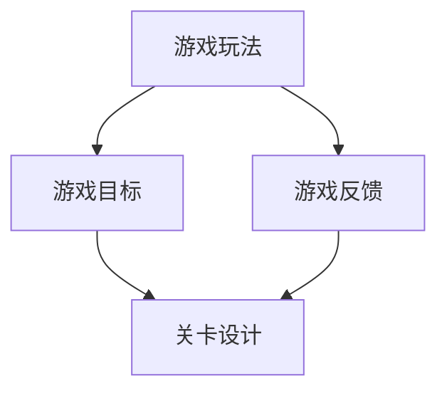
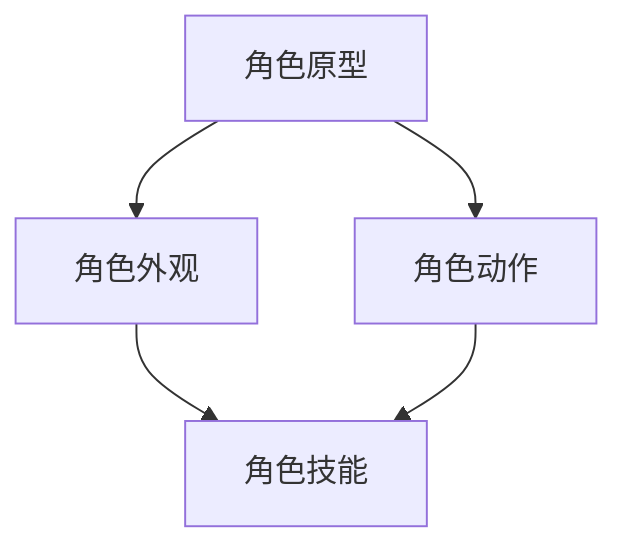
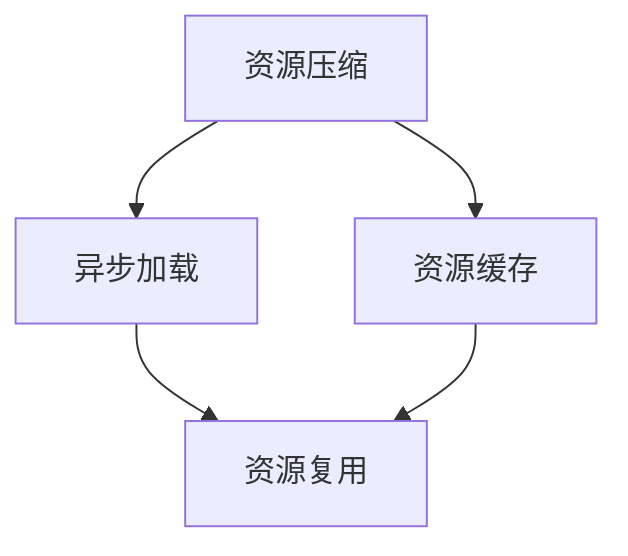
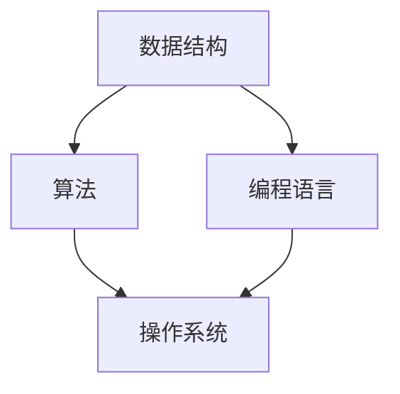
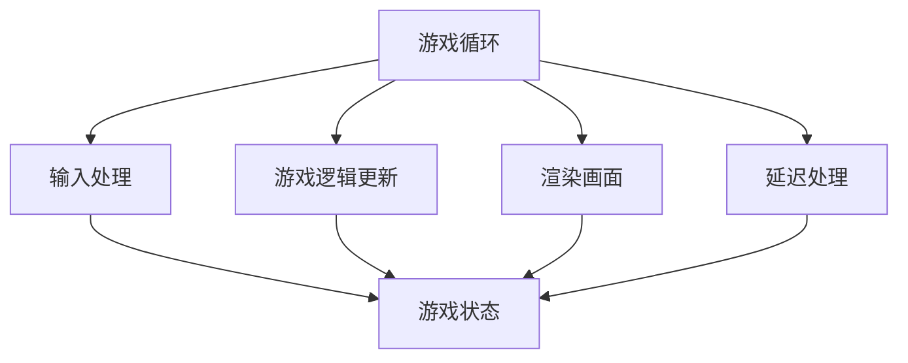
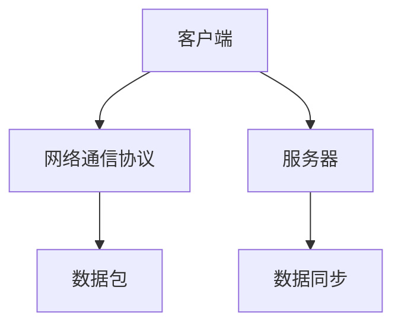

                 

# 《2024网易雷火游戏校招面试真题汇总及其解答》

## 关键词
- 网易雷火校招
- 游戏面试真题
- 编程题解
- 设计题解
- 面试经验
- 游戏制作

## 摘要
本文旨在为广大准备参加2024年网易雷火游戏校招的学子提供一套全面的面试真题解析。通过对游戏基础知识、编程基础、编程题、设计题的详细解读，以及面试准备与心态调整的经验分享，助力读者在面试中脱颖而出，顺利拿到心仪的offer。

## 目录大纲

### 第一部分：游戏基础知识与面试技巧

#### 第1章：游戏设计与制作

1.1 游戏设计概述
1.2 游戏制作工具与流程
1.3 游戏美术设计

#### 第2章：编程基础

2.1 计算机科学基础
2.2 游戏编程基础
2.3 游戏网络编程

### 第二部分：网易雷火游戏校招面试真题详解

#### 第3章：编程题详解

3.1 数据结构与算法
3.2 游戏编程实战
3.3 网络编程题解

#### 第4章：游戏设计与制作面试真题

4.1 游戏设计理念与实践
4.2 游戏美术面试题解析
4.3 游戏策划面试题详解

#### 第5章：面试经验与心得

5.1 面试准备技巧
5.2 心态调整与压力管理
5.3 面试后复盘与总结

#### 附录

附录A：面试题汇总与解析
附录B：编程工具与资源推荐
附录C：网易雷火招聘信息与岗位解析

### 第一部分：游戏基础知识与面试技巧

#### 第1章：游戏设计与制作

## 1.1 游戏设计概述

游戏设计是游戏开发的核心环节，它决定了游戏的整体风格、玩法、关卡设计以及用户体验。一个优秀的游戏设计不仅要有创意，还要符合玩家的需求，能够吸引他们长时间沉浸其中。

### 核心概念与联系

游戏设计的核心概念包括：

1. **游戏玩法**：游戏的核心机制和规则，如角色移动、攻击、防御等。
2. **游戏目标**：玩家在游戏中需要达成的目标，如完成某个任务、击败对手等。
3. **游戏反馈**：游戏给予玩家的即时反馈，包括视觉、听觉和触觉反馈。

#### Mermaid 流程图



### 游戏设计的流程

游戏设计的流程通常包括以下几个阶段：

1. **需求分析**：明确游戏的目标用户、主题、玩法等。
2. **原型设计**：制作游戏的初步原型，验证设计思路。
3. **详细设计**：完善游戏的设计文档，包括角色、关卡、规则等。
4. **迭代优化**：根据玩家反馈不断优化游戏设计。

### 游戏类型与特点分析

游戏类型多种多样，每种类型都有其独特的特点。常见的游戏类型包括：

1. **角色扮演游戏（RPG）**：玩家扮演虚拟角色，通过完成任务和战斗提升等级。
2. **动作游戏（Action Game）**：强调操作技巧和反应速度，如格斗、射击等。
3. **策略游戏（Strategy Game）**：玩家需要在有限的资源下做出策略性决策。
4. **模拟游戏（Simulation Game）**：模拟现实生活中的各种场景，如经营、城市建设等。

### 美术设计在游戏制作中的重要性

美术设计是游戏制作中不可或缺的一环，它直接影响游戏的视觉效果和用户体验。美术设计包括角色设计、场景设计、界面设计等。

1. **角色设计**：角色是游戏中的主角或NPC，其外观和性格直接影响游戏的吸引力。
2. **场景设计**：场景是游戏中的背景，包括环境、建筑、道具等，需要与游戏主题相符合。
3. **界面设计**：界面设计包括游戏菜单、图标、提示框等，需要简洁直观，易于操作。

#### 项目实战：游戏角色设计

以下是一个简单的游戏角色设计实例：



在这个例子中，角色外观包括角色的发型、服饰、装备等；角色动作包括行走、跑步、攻击等；角色技能包括攻击技能、防御技能等。

### 游戏制作的基本流程

游戏制作的基本流程包括以下几个阶段：

1. **需求分析**：明确游戏的目标用户、主题、玩法等。
2. **原型设计**：制作游戏的初步原型，验证设计思路。
3. **详细设计**：完善游戏的设计文档，包括角色、关卡、规则等。
4. **开发与测试**：编写游戏代码，进行功能测试和性能测试。
5. **上线与运营**：发布游戏，收集玩家反馈，进行迭代优化。

### 资源管理与优化

资源管理是游戏制作中重要的一环，它涉及到游戏资源的存储、加载、使用和优化。

1. **资源存储**：游戏资源包括图像、音频、视频等，需要合理存储，以便于加载和使用。
2. **资源加载**：游戏运行时需要从存储中加载资源，需要优化加载速度，减少游戏卡顿。
3. **资源使用**：合理使用资源，避免浪费，如使用纹理压缩技术减少图像资源大小。
4. **资源优化**：对游戏资源进行优化，提高游戏性能，如使用异步加载技术减少加载时间。

#### 项目实战：游戏资源优化

以下是一个简单的游戏资源优化实例：



在这个例子中，资源压缩包括图像压缩、音频压缩等；异步加载包括异步加载图像、音频等资源；资源缓存包括缓存已加载的资源，减少重复加载；资源复用包括重复使用相同的资源，避免重复加载。

### 总结

游戏设计与制作是游戏开发的核心环节，它决定了游戏的成功与否。从核心概念的理解到设计的流程，再到游戏类型和美术设计的重要性，以及游戏制作的基本流程和资源管理，这些都是游戏开发者需要掌握的知识点。在接下来的章节中，我们将进一步深入探讨编程基础和面试真题的解答，帮助读者在面试中取得优异成绩。

---

在接下来的部分，我们将详细讨论编程基础，包括计算机科学基础、游戏编程基础和网络编程基础。这将帮助我们理解游戏开发的底层原理，为解决面试中的编程题打下坚实的基础。

### 第二部分：编程基础

#### 第2章：编程基础

编程是游戏开发不可或缺的一部分，它涉及到计算机科学的核心概念和算法。在本章中，我们将探讨计算机科学基础、游戏编程基础和网络编程基础，为读者提供全面的知识框架。

## 2.1 计算机科学基础

计算机科学是游戏开发的基础，它包括数据结构与算法、编程语言和操作系统等多个领域。掌握计算机科学基础对于理解游戏开发的底层原理至关重要。

### 核心概念与联系

计算机科学的核心概念包括：

1. **数据结构**：数据结构是存储和管理数据的方式。常见的有数组、链表、树、图等。
2. **算法**：算法是解决问题的方法。它包括排序算法、搜索算法、动态规划等。
3. **编程语言**：编程语言是编写程序的工具。常见的有C、C++、Java、Python等。
4. **操作系统**：操作系统是控制和管理计算机硬件和软件资源的系统软件。

#### Mermaid 流程图



### 数据结构与算法

数据结构与算法是计算机科学的核心。数据结构定义了数据的存储方式，而算法定义了处理数据的方法。以下是几种常见的数据结构和算法：

1. **数组**：数组是一种线性数据结构，用于存储一系列元素。常见的操作包括查找、插入、删除等。
2. **链表**：链表也是一种线性数据结构，与数组不同的是，它的元素存储在单独的节点中，节点之间通过指针相连。
3. **树**：树是一种非线性数据结构，用于表示层次结构。常见的操作包括查找、插入、删除、遍历等。
4. **图**：图是一种复杂的数据结构，用于表示对象之间的关系。常见的操作包括查找、添加边、删除边等。
5. **排序算法**：排序算法用于将一组数据按照特定顺序排列。常见的排序算法有冒泡排序、插入排序、快速排序等。
6. **搜索算法**：搜索算法用于在一组数据中查找特定元素。常见的搜索算法有二分搜索、广度优先搜索、深度优先搜索等。
7. **动态规划**：动态规划是一种用于解决最优化问题的算法。它通过将问题分解为更小的子问题，并利用子问题的解来构建原问题的解。

#### 项目实战：排序算法

以下是一个简单的冒泡排序算法的伪代码实现：

```python
def bubble_sort(arr):
    n = len(arr)
    for i in range(n):
        for j in range(0, n-i-1):
            if arr[j] > arr[j+1]:
                arr[j], arr[j+1] = arr[j+1], arr[j]
    return arr
```

在这个例子中，我们使用两层循环来比较相邻的元素，如果前一个元素大于后一个元素，就交换它们的位置，直到整个数组排序完成。

### 编程语言概述

编程语言是编写程序的工具，不同的编程语言有不同的特点和适用场景。以下是几种常见的编程语言：

1. **C**：C语言是一种高级语言，它提供了丰富的数据类型和运算符，适用于系统编程和嵌入式开发。
2. **C++**：C++是C语言的扩展，它增加了面向对象编程的特性，适用于游戏开发、操作系统开发等。
3. **Java**：Java是一种跨平台的高级语言，它具有简单、面向对象、分布式、健壮、安全、平台独立与可移植、多线程、动态性等特点。
4. **Python**：Python是一种高级语言，它以简单易读著称，适用于数据科学、机器学习、网络开发等。

### 操作系统

操作系统是控制和管理计算机硬件和软件资源的系统软件。常见的操作系统有Windows、Linux和macOS。操作系统的主要功能包括处理器管理、存储管理、设备管理、文件管理和用户接口等。

#### 项目实战：操作系统基础

以下是一个简单的操作系统的伪代码实现：

```python
class OperatingSystem:
    def __init__(self):
        self.processes = []
        self.memory = []
        self.devices = []

    def create_process(self, process):
        self.processes.append(process)
        self.allocate_memory(process)

    def allocate_memory(self, process):
        if len(self.memory) >= process.required_memory:
            self.memory.append(process.memory)
            return True
        else:
            return False

    def schedule_process(self):
        for process in self.processes:
            if process.state == "ready":
                process.state = "running"
                self.execute_process(process)

    def execute_process(self, process):
        # 执行进程的代码
        pass

    def handle_interrupt(self, interrupt):
        # 处理中断的代码
        pass

    def handle_exception(self, exception):
        # 处理异常的代码
        pass
```

在这个例子中，操作系统类有创建进程、分配内存、调度进程、执行进程和处理中断与异常等方法。

### 总结

计算机科学基础是游戏开发的基石，它涵盖了数据结构与算法、编程语言和操作系统等多个领域。掌握这些基础知识对于理解游戏开发的底层原理和解决编程题至关重要。在接下来的章节中，我们将深入探讨游戏编程基础和网络编程基础，为读者提供更全面的知识体系。

---

在了解了计算机科学基础之后，我们将进一步探讨游戏编程基础，包括游戏编程的核心概念、游戏逻辑编程和游戏AI编程。这将帮助我们更好地理解游戏开发的具体流程和实现方法。

### 2.2 游戏编程基础

游戏编程是游戏开发的核心环节，它涉及到游戏逻辑的实现、物理引擎的集成以及游戏AI的编程。掌握游戏编程基础对于开发者来说至关重要，以下我们将详细探讨游戏编程的核心概念、游戏逻辑编程和游戏AI编程。

#### 核心概念

游戏编程的核心概念包括：

1. **游戏循环**：游戏循环是游戏运行的核心机制，它负责处理游戏逻辑、渲染画面、更新动画等。一个典型的游戏循环包括输入处理、游戏逻辑更新、渲染画面、延迟处理等步骤。
2. **游戏状态**：游戏状态是游戏运行过程中的不同状态，如游戏开始、游戏进行、游戏暂停、游戏结束等。游戏状态的管理是游戏编程的重要部分，它决定了游戏的流程和用户体验。
3. **游戏对象**：游戏对象是游戏中的元素，如角色、道具、环境等。游戏对象通常具有属性和方法，用于描述其在游戏中的行为和状态。
4. **游戏资源**：游戏资源是游戏中使用的各种资源，如图像、音频、视频等。合理管理游戏资源对于游戏的性能和用户体验至关重要。

#### Mermaid 流程图



#### 游戏逻辑编程

游戏逻辑编程是游戏编程的核心，它负责实现游戏的核心机制和规则。以下是游戏逻辑编程的一些关键点：

1. **事件处理**：事件处理是游戏逻辑的重要组成部分，它负责处理玩家的输入和游戏中的各种事件，如按键、碰撞、触发等。
2. **状态机**：状态机是一种用于描述游戏对象状态的机制，它通过定义不同的状态和状态之间的转换规则，实现游戏对象的复杂行为。
3. **组件系统**：组件系统是一种将游戏对象的行为和状态解耦的机制，它通过将行为和状态分别实现为组件，实现游戏对象的高内聚低耦合。
4. **游戏系统**：游戏系统是游戏逻辑的总体架构，它负责管理游戏中的各种对象和系统，如角色系统、道具系统、任务系统等。

以下是游戏逻辑编程的一个简单的伪代码示例：

```python
class GameLogic:
    def __init__(self):
        self.characters = []
        self.items = []
        self.tasks = []

    def update(self, dt):
        for character in self.characters:
            character.update(dt)
            for item in self.items:
                item.update(dt)
                if character.collides_with(item):
                    character.pick_up(item)

    def render(self):
        for character in self.characters:
            character.render()
        for item in self.items:
            item.render()
```

在这个例子中，`GameLogic`类负责更新和渲染游戏中的角色和物品，通过`update`方法处理游戏逻辑，通过`render`方法渲染画面。

#### 游戏AI编程

游戏AI编程是游戏编程的高级部分，它负责实现游戏中的智能行为。以下是游戏AI编程的一些关键点：

1. **决策树**：决策树是一种用于决策的算法，它通过定义不同的分支和节点，实现复杂的决策过程。
2. **遗传算法**：遗传算法是一种基于自然进化的算法，它通过模拟生物进化的过程，实现优化问题的求解。
3. **强化学习**：强化学习是一种基于奖励和惩罚的算法，它通过不断尝试和反馈，实现智能体的学习过程。
4. **路径规划**：路径规划是游戏AI编程的一个重要方面，它负责实现游戏角色在复杂环境中的导航。

以下是游戏AI编程的一个简单的伪代码示例：

```python
class GameAI:
    def __init__(self):
        self.state = "idle"

    def decide(self, state):
        if state == "enemy_detected":
            self.state = "attack"
        elif state == "target_reached":
            self.state = "idle"

    def execute(self):
        if self.state == "attack":
            self.attack()
        elif self.state == "idle":
            self.move()

    def attack(self):
        print("Attacking...")

    def move(self):
        print("Moving to the target...")
```

在这个例子中，`GameAI`类根据当前状态执行不同的行为，通过`decide`方法进行决策，通过`execute`方法执行行为。

### 总结

游戏编程基础是游戏开发的核心，它涵盖了游戏循环、游戏状态、游戏对象和游戏资源等多个方面。通过游戏逻辑编程和游戏AI编程，开发者可以实现丰富的游戏机制和智能行为。掌握游戏编程基础对于开发高质量的游戏至关重要。在接下来的章节中，我们将深入探讨游戏网络编程，为读者提供更全面的知识体系。

---

在了解了游戏编程基础后，接下来我们将探讨游戏网络编程。网络编程在游戏开发中扮演着重要的角色，特别是在多人在线游戏和实时游戏交互中。以下内容将介绍网络编程的核心概念、游戏网络架构以及实时通信与同步技术。

#### 核心概念

网络编程的核心概念包括：

1. **网络通信协议**：网络通信协议是计算机之间进行通信的规则和约定。常见的协议有TCP（传输控制协议）和UDP（用户数据报协议）。
2. **客户端-服务器模型**：客户端-服务器模型是一种常见的网络架构，其中客户端向服务器发送请求，服务器处理请求并返回响应。
3. **数据包**：数据包是网络传输的基本单位，它包括数据本身的负载以及用于传输的数据包头部信息。
4. **数据同步**：数据同步是指网络中的多个客户端和服务器保持数据一致性的过程。实时同步技术是多人在线游戏的关键。

#### Mermaid 流程图



#### 游戏网络架构

游戏网络架构是游戏网络编程的基础。一个典型的游戏网络架构包括以下几个部分：

1. **客户端**：客户端是玩家交互的界面，它负责处理玩家的输入，并将输入发送到服务器。
2. **服务器**：服务器是游戏的核心，它处理来自客户端的请求，执行游戏逻辑，并将结果返回给客户端。
3. **游戏引擎**：游戏引擎是游戏开发的核心组件，它负责渲染游戏画面、处理游戏逻辑等。
4. **数据库**：数据库用于存储游戏数据，如玩家信息、游戏状态等。

#### 项目实战：游戏网络架构

以下是一个简单的游戏网络架构的伪代码示例：

```python
class GameNetwork:
    def __init__(self):
        self.clients = []
        self.server = Server()

    def add_client(self, client):
        self.clients.append(client)

    def remove_client(self, client):
        self.clients.remove(client)

    def handle_client_input(self, client, input_data):
        self.server.process_request(client, input_data)

    def send_response_to_client(self, client, response_data):
        client.send_response(response_data)

class Server:
    def __init__(self):
        self.game_logic = GameLogic()

    def process_request(self, client, input_data):
        action = self.game_logic.handle_input(input_data)
        self.send_response_to_client(client, action)

    def send_response_to_client(self, client, action):
        client.send_action(action)

class GameLogic:
    def __init__(self):
        self.characters = []

    def handle_input(self, input_data):
        action = self.characters[0].handle_input(input_data)
        return action

class GameCharacter:
    def __init__(self):
        self.state = "idle"

    def handle_input(self, input_data):
        if input_data == "move":
            self.state = "moving"
        elif input_data == "attack":
            self.state = "attacking"
        return self.state
```

在这个例子中，`GameNetwork`类负责管理客户端和服务器之间的交互，`Server`类处理来自客户端的请求并执行游戏逻辑，`GameLogic`类处理游戏逻辑，`GameCharacter`类表示游戏中的角色。

#### 实时通信与同步技术

实时通信与同步技术是多人在线游戏的关键。以下是一些关键的技术：

1. **实时通信**：实时通信技术用于在客户端和服务器之间实时传输数据。常见的实时通信技术有WebSocket和HTTP/2。
2. **状态同步**：状态同步技术用于确保客户端和服务器之间的游戏状态一致。常见的同步技术有状态同步和事件同步。
3. **预测与补偿**：预测与补偿技术用于处理网络延迟和丢包问题。它通过预测客户端的行为并在服务器上补偿预测错误来实现流畅的游戏体验。

以下是实时通信与同步技术的伪代码示例：

```python
class RealtimeCommunication:
    def __init__(self):
        self.clients = []
        self.server = Server()

    def add_client(self, client):
        self.clients.append(client)

    def remove_client(self, client):
        self.clients.remove(client)

    def send_message_to_client(self, client, message):
        client.send_message(message)

    def handle_client_message(self, client, message):
        self.server.process_message(client, message)

class Server:
    def __init__(self):
        self.game_logic = GameLogic()

    def process_message(self, client, message):
        action = self.game_logic.handle_message(message)
        self.broadcast_action(action)

    def broadcast_action(self, action):
        for client in self.clients:
            client.send_action(action)

class GameLogic:
    def __init__(self):
        self.characters = []

    def handle_message(self, message):
        action = self.characters[0].handle_message(message)
        return action

class GameCharacter:
    def __init__(self):
        self.state = "idle"

    def handle_message(self, message):
        if message == "move":
            self.state = "moving"
        elif message == "attack":
            self.state = "attacking"
        return self.state
```

在这个例子中，`RealtimeCommunication`类负责实时通信，`Server`类处理来自客户端的消息并广播游戏动作，`GameLogic`类处理游戏逻辑，`GameCharacter`类表示游戏中的角色。

#### 总结

游戏网络编程是游戏开发的重要组成部分，它涉及到网络通信协议、客户端-服务器模型、数据包和数据同步等多个方面。实时通信与同步技术是多人在线游戏的关键，它们确保了客户端和服务器之间的数据传输和状态一致性。掌握游戏网络编程基础对于开发高质量的游戏至关重要。在接下来的章节中，我们将深入探讨网易雷火游戏校招面试真题的详细解析，为读者提供实战经验和技巧。

### 第三部分：网易雷火游戏校招面试真题详解

#### 第3章：编程题详解

在游戏开发领域，编程面试题通常涵盖了数据结构与算法、游戏编程实战和网络编程等多个方面。本章将详细解析这些编程面试题，帮助读者掌握解题思路和技巧。

#### 3.1 数据结构与算法

数据结构与算法是计算机科学的基础，也是游戏开发面试中常见的内容。以下是一些常见的数据结构与算法面试题及其解析。

##### 题目1：二分搜索

**题目描述**：给定一个排序数组和一个目标值，找出数组中目标值的位置。

**解题思路**：使用二分搜索算法，通过不断地缩小搜索范围，找到目标值的位置。

**伪代码**：

```python
def binary_search(arr, target):
    low = 0
    high = len(arr) - 1

    while low <= high:
        mid = (low + high) // 2
        if arr[mid] == target:
            return mid
        elif arr[mid] < target:
            low = mid + 1
        else:
            high = mid - 1

    return -1
```

##### 题目2：链表反转

**题目描述**：反转一个单链表。

**解题思路**：使用递归或循环方式，逐个节点地反转链表的指向。

**伪代码**：

递归解法：

```python
def reverse_linked_list(head):
    if not head or not head.next:
        return head

    prev = None
    curr = head

    while curr:
        next_node = curr.next
        curr.next = prev
        prev = curr
        curr = next_node

    return prev
```

循环解法：

```python
def reverse_linked_list(head):
    prev = None
    curr = head

    while curr:
        next_node = curr.next
        curr.next = prev
        prev = curr
        curr = next_node

    return prev
```

##### 题目3：最长公共子序列

**题目描述**：给定两个字符串，找出它们的最长公共子序列。

**解题思路**：使用动态规划算法，构建一个二维数组来记录子序列的长度。

**伪代码**：

```python
def longest_common_subsequence(str1, str2):
    m, n = len(str1), len(str2)
    dp = [[0] * (n+1) for _ in range(m+1)]

    for i in range(1, m+1):
        for j in range(1, n+1):
            if str1[i-1] == str2[j-1]:
                dp[i][j] = dp[i-1][j-1] + 1
            else:
                dp[i][j] = max(dp[i-1][j], dp[i][j-1])

    return dp[m][n]
```

#### 3.2 游戏编程实战

游戏编程实战题目通常涉及游戏逻辑的实现、物理引擎的集成以及游戏AI的编程。以下是一些常见题目及其解析。

##### 题目1：游戏角色移动

**题目描述**：实现一个游戏角色在二维平面上的移动功能。

**解题思路**：使用向量运算来实现角色的移动，更新角色的位置。

**伪代码**：

```python
class GameCharacter:
    def __init__(self, position, velocity):
        self.position = position
        self.velocity = velocity

    def move(self, direction, speed):
        if direction == "up":
            self.position[1] -= speed
        elif direction == "down":
            self.position[1] += speed
        elif direction == "left":
            self.position[0] -= speed
        elif direction == "right":
            self.position[0] += speed
```

##### 题目2：碰撞检测

**题目描述**：实现游戏角色之间的碰撞检测功能。

**解题思路**：计算两个角色的位置差，判断它们是否相交。

**伪代码**：

```python
def collides_with(character1, character2):
    x_diff = character1.position[0] - character2.position[0]
    y_diff = character1.position[1] - character2.position[1]

    distance = (x_diff ** 2 + y_diff ** 2) ** 0.5

    if distance <= character1.radius + character2.radius:
        return True
    else:
        return False
```

##### 题目3：游戏AI

**题目描述**：实现一个简单的游戏AI，使其能够躲避障碍物。

**解题思路**：使用A*算法实现路径规划，让角色避开障碍物。

**伪代码**：

```python
def a_star_search(start, goal, obstacles):
    open_set = PriorityQueue()
    open_set.put(start, 0)
    came_from = {}
    g_score = {start: 0}

    while not open_set.empty():
        current = open_set.get()

        if current == goal:
            break

        for neighbor in neighbors(current):
            if neighbor in obstacles:
                continue

            tentative_g_score = g_score[current] + 1
            if neighbor not in g_score or tentative_g_score < g_score[neighbor]:
                came_from[neighbor] = current
                g_score[neighbor] = tentative_g_score
                f_score = tentative_g_score + heuristic(neighbor, goal)
                open_set.put(neighbor, f_score)

    return reconstruct_path(came_from, goal)

def reconstruct_path(came_from, current):
    path = []
    while current in came_from:
        path.append(current)
        current = came_from[current]
    path.append(current)
    return path[::-1]
```

#### 3.3 网络编程题解

网络编程题解通常涉及网络通信的基础知识、实时通信和同步技术。以下是一些常见题目及其解析。

##### 题目1：TCP连接

**题目描述**：实现一个简单的TCP客户端和服务器，实现数据的传输。

**解题思路**：使用Socket编程实现TCP客户端和服务器的基本功能。

**伪代码**：

服务器端：

```python
import socket

server_socket = socket.socket(socket.AF_INET, socket.SOCK_STREAM)
server_socket.bind(('0.0.0.0', 8080))
server_socket.listen(1)

client_socket, client_address = server_socket.accept()

while True:
    data = client_socket.recv(1024)
    if not data:
        break
    client_socket.sendall(data)

client_socket.close()
server_socket.close()
```

客户端端：

```python
import socket

client_socket = socket.socket(socket.AF_INET, socket.SOCK_STREAM)
client_socket.connect(('127.0.0.1', 8080))

while True:
    message = input("Enter message: ")
    client_socket.sendall(message.encode())

    data = client_socket.recv(1024)
    print("Received:", data.decode())

client_socket.close()
```

##### 题目2：WebSocket通信

**题目描述**：实现一个简单的WebSocket客户端和服务器，实现双向通信。

**解题思路**：使用WebSocket库（如`websockets`）实现WebSocket客户端和服务器的基本功能。

**伪代码**：

服务器端：

```python
import asyncio
import websockets

async def echo(websocket, path):
    async for message in websocket:
        await websocket.send(message)

start_server = websockets.serve(echo, "0.0.0.0", 8765)

asyncio.get_event_loop().run_until_complete(start_server)
asyncio.get_event_loop().run_forever()
```

客户端端：

```python
import asyncio
import websockets

async def hello():
    async with websockets.connect("ws://0.0.0.0:8765") as websocket:
        await websocket.send("Hello world!")
        response = await websocket.recv()
        print("Received:", response)

asyncio.get_event_loop().run_until_complete(hello())
```

#### 总结

本章详细解析了数据结构与算法、游戏编程实战和网络编程的面试题，提供了详细的解题思路和伪代码。掌握这些题目不仅能帮助读者在面试中取得优异成绩，还能提升编程能力。在接下来的章节中，我们将深入探讨游戏设计与制作面试真题，为读者提供更多的实战经验和技巧。

### 4.1 游戏设计理念与实践

游戏设计是游戏开发的核心环节，它不仅决定了游戏的核心玩法和用户体验，还影响着游戏的商业成功。在本章中，我们将探讨游戏设计理念、实践技巧以及用户体验设计的重要性。

#### 核心概念

游戏设计理念包括以下几个方面：

1. **玩家至上**：游戏设计应以玩家的需求和体验为核心，确保游戏能够吸引和留住玩家。
2. **创意与创新**：游戏设计需要具备独特的创意，以区别于市场上的其他游戏，提供新颖的玩法和体验。
3. **平衡性**：游戏设计要保证游戏内的各种元素（如角色能力、道具效果等）之间保持平衡，避免出现过于强大或过于弱小的元素。
4. **故事性**：一个好的游戏设计应具备一定的故事背景，使玩家在游戏过程中产生共鸣，增强游戏体验。
5. **可扩展性**：游戏设计应具备一定的可扩展性，以便于后续的版本更新和内容扩展。

#### 游戏设计实践

游戏设计的实践过程包括以下几个阶段：

1. **需求分析**：在游戏设计初期，需要对游戏的目标用户、主题、玩法等进行详细的需求分析，明确游戏的定位和市场定位。
2. **原型设计**：通过制作原型来验证设计思路，原型可以是低保真的纸板原型，也可以是高保真的数字原型。
3. **详细设计**：在原型设计的基础上，完善游戏的设计文档，包括角色、关卡、规则、故事线等。
4. **迭代优化**：根据玩家的反馈和测试结果，不断优化游戏设计，提高游戏的可玩性和用户体验。
5. **测试与上线**：完成游戏设计后，进行详细的测试，包括功能测试、性能测试和用户体验测试，确保游戏质量。

#### 游戏设计文档编写技巧

游戏设计文档是游戏设计的重要输出，它为开发团队提供了明确的指导和参考。以下是编写游戏设计文档的一些技巧：

1. **清晰的结构**：游戏设计文档应具有清晰的章节结构，每个章节应有明确的标题和内容。
2. **详细的描述**：在文档中应详细描述游戏的核心玩法、角色能力、道具效果、关卡设计等，确保开发团队能够准确理解设计意图。
3. **图文并茂**：在文档中适当添加图表、插图和动画，以增强表达效果，帮助开发团队更好地理解设计。
4. **版本管理**：游戏设计文档应进行版本管理，确保每次更新都能记录下来，便于后续的跟踪和查阅。

#### 用户体验设计

用户体验设计是游戏设计的重要方面，它直接影响玩家的游戏体验和满意度。以下是一些用户体验设计的关键点：

1. **直观性**：游戏界面和操作应简单直观，使玩家能够快速上手，降低学习成本。
2. **反馈**：游戏应给予玩家及时的反馈，包括视觉、听觉和触觉反馈，增强游戏的互动性和沉浸感。
3. **流畅性**：游戏操作应流畅自然，避免卡顿和延迟，提供良好的游戏体验。
4. **个性化**：游戏应提供一定的个性化设置，如角色外观、界面风格等，满足玩家的个性化需求。
5. **可扩展性**：游戏应具备一定的可扩展性，如通过后续更新和内容扩展，持续提升玩家的游戏体验。

#### 项目实战：游戏设计文档编写

以下是一个简单的游戏设计文档示例：

**游戏名称**：《魔法王国》

**游戏类型**：角色扮演游戏（RPG）

**游戏背景**：
在一个神秘的魔法王国，玩家将扮演一位年轻的魔法师，展开一段传奇的冒险之旅。游戏以魔法为主题，玩家需要通过学习魔法、提升等级、解锁新技能，与各种怪物战斗，最终拯救王国。

**游戏玩法**：
- **角色成长**：玩家可以通过战斗、完成任务和训练来提升角色等级和技能。
- **魔法系统**：游戏中有多种魔法，包括攻击魔法、防御魔法和辅助魔法，玩家需要合理搭配和使用魔法。
- **战斗系统**：玩家与怪物进行战斗，通过攻击、防御和技能释放来击败敌人。
- **任务系统**：游戏中有多个任务，包括主线任务、支线任务和日常任务，玩家需要完成任务来获取奖励和经验。

**角色设计**：
- **主角**：玩家可以选择性别、发型、服饰等外观，并自定义主角的技能和属性。
- **NPC**：游戏中有多个NPC，包括城镇的居民、魔法师、商人等，玩家可以与他们互动，获取任务和信息。

**关卡设计**：
- **初始关卡**：玩家开始游戏的第一个关卡，介绍游戏的基本玩法和魔法系统。
- **战斗关卡**：玩家与怪物进行战斗的关卡，包括野外战斗和城镇战斗。
- **探索关卡**：玩家探索神秘区域，发现宝藏和隐藏任务的关卡。

**故事线**：
- **主线任务**：拯救王国的任务，包括击败魔王、解救公主等。
- **支线任务**：与主线任务相关的额外任务，包括寻找失落的魔法书、打败邪恶势力等。

**游戏界面**：
- **主界面**：显示游戏角色、技能、道具等信息，玩家可以进行游戏设置和退出游戏。
- **战斗界面**：显示战斗场景、玩家和怪物的状态，玩家可以进行攻击、防御和技能释放等操作。
- **任务界面**：显示任务列表、任务进度和任务奖励。

**游戏设计文档**：[游戏设计文档链接]

#### 总结

游戏设计理念与实践是游戏开发的核心，它决定了游戏的成功与否。从需求分析、原型设计到详细设计，再到用户体验设计，每个环节都至关重要。掌握游戏设计理念和技巧，能够帮助开发者设计出优秀的游戏，满足玩家的需求，实现商业成功。

### 4.2 游戏美术面试题解析

游戏美术设计是游戏开发的重要组成部分，它直接影响游戏的视觉效果和用户体验。在游戏美术面试中，面试官通常会针对美术设计流程、美术技能考核以及常见美术工具与技巧进行提问。本章将解析这些面试题，帮助读者更好地应对游戏美术面试。

#### 核心概念

游戏美术设计包括以下几个核心概念：

1. **美术设计流程**：美术设计流程是游戏美术制作的总体框架，它包括概念设计、建模、贴图、动画等环节。
2. **美术技能考核**：美术技能考核是面试官评估应聘者美术能力的重要标准，包括绘画技巧、建模能力、贴图技巧等。
3. **常见美术工具与技巧**：常见美术工具与技巧是游戏美术设计师必备的工具和技能，如3D建模软件、纹理编辑软件、动画软件等。

#### 美术设计流程解析

美术设计流程是游戏美术制作的关键，它通常包括以下几个阶段：

1. **概念设计**：概念设计是美术设计的起始阶段，它通过手绘草图、概念图等方式，确定游戏的角色、场景、道具等元素的基本形态和风格。
2. **建模**：建模阶段是将概念设计转化为三维模型的过程，使用3D建模软件（如Blender、Maya、3ds Max等）创建游戏角色、场景、道具等模型。
3. **贴图**：贴图阶段是为模型添加纹理的过程，使用纹理编辑软件（如Photoshop、Substance Painter等）创建或编辑纹理，为模型提供视觉效果。
4. **动画**：动画阶段是创建游戏角色和场景动画的过程，使用动画软件（如Blender、Maya、3ds Max等）制作角色动作、场景变化等动画效果。
5. **后期处理**：后期处理阶段是对游戏画面进行优化和调整的过程，使用图像处理软件（如Photoshop、After Effects等）对画面进行色彩校正、特效添加等操作。

#### 项目实战：美术设计流程

以下是一个简单的美术设计流程示例：

1. **概念设计**：
   - **角色概念图**：设计角色的外观、服装、武器等，确定角色风格和特点。
   - **场景概念图**：设计游戏场景的布局、建筑、植被等，确定场景氛围和视觉风格。

2. **建模**：
   - **角色建模**：使用Blender创建角色模型，包括头部、身体、四肢等。
   - **场景建模**：使用3ds Max创建游戏场景，包括地面、建筑、植被等。

3. **贴图**：
   - **角色贴图**：使用Substance Painter创建角色贴图，包括纹理、细节等。
   - **场景贴图**：使用Photoshop创建场景贴图，包括环境纹理、地面纹理等。

4. **动画**：
   - **角色动画**：使用Blender制作角色动作动画，如行走、攻击、跳跃等。
   - **场景动画**：使用3ds Max制作场景动画，如天气变化、植物生长等。

5. **后期处理**：
   - **画面优化**：使用Photoshop对游戏画面进行色彩校正、光线调整等优化。
   - **特效添加**：使用After Effects添加游戏画面特效，如粒子效果、光影效果等。

#### 美术技能考核解析

美术技能考核是面试官评估应聘者美术能力的重要标准，以下是一些常见的美术技能考核内容：

1. **绘画技巧**：绘画技巧是美术设计师的基础能力，包括素描、色彩、构图等。
2. **建模能力**：建模能力是美术设计师的重要技能，包括几何建模、细节处理、材质制作等。
3. **贴图技巧**：贴图技巧是美术设计师的关键能力，包括纹理制作、细节调整、光照表现等。
4. **动画制作**：动画制作能力是美术设计师的高级技能，包括角色动作设计、场景动画制作等。
5. **后期处理**：后期处理能力是美术设计师的辅助技能，包括画面优化、特效添加、色彩调整等。

#### 常见美术工具与技巧

常见美术工具与技巧是游戏美术设计师必备的工具和技能，以下是一些常见工具和技巧：

1. **3D建模软件**：Blender、Maya、3ds Max等。
2. **纹理编辑软件**：Substance Painter、Photoshop等。
3. **动画软件**：Blender、Maya、3ds Max等。
4. **图像处理软件**：Photoshop、After Effects等。
5. **绘画软件**：Adobe Photoshop、Procreate等。

#### 项目实战：美术工具与技巧

以下是一个简单的美术工具与技巧项目实战：

1. **角色建模**：
   - **工具**：使用Blender进行角色建模。
   - **技巧**：通过布尔运算、多边形建模等方法创建角色模型，注意细节处理和材质表现。

2. **贴图制作**：
   - **工具**：使用Substance Painter进行贴图制作。
   - **技巧**：通过多种纹理叠加、细节调整等方法制作高质量的角色贴图。

3. **动画制作**：
   - **工具**：使用Blender进行角色动画制作。
   - **技巧**：通过关键帧动画、骨骼绑定等方法制作流畅的角色动画。

4. **后期处理**：
   - **工具**：使用Photoshop进行画面优化和特效添加。
   - **技巧**：通过色彩校正、光影调整、粒子效果添加等方法提升游戏画面的视觉效果。

#### 总结

游戏美术面试题涉及美术设计流程、美术技能考核和常见美术工具与技巧。掌握这些知识和技能对于游戏美术设计师来说至关重要。通过项目实战和案例分析，读者可以更好地理解和应用这些知识，提高自己的美术设计能力。在接下来的章节中，我们将继续探讨游戏策划面试题的详细解析，帮助读者全面准备游戏校招面试。

### 4.3 游戏策划面试题详解

游戏策划是游戏开发中至关重要的角色，负责游戏的整体设计、规则制定、玩法创新和用户体验优化。在游戏策划面试中，面试官通常会围绕游戏策划的核心能力、案例分析以及实战演练进行提问。本章将详细解析这些面试题，帮助读者更好地应对游戏策划面试。

#### 核心能力解析

游戏策划的核心能力包括：

1. **创意与创新能力**：游戏策划需要具备出色的创意和创新能力，能够设计出独特有趣的玩法和游戏机制。
2. **逻辑思维与系统设计**：游戏策划需要具备良好的逻辑思维和系统设计能力，能够构建复杂的游戏系统并保持平衡。
3. **用户分析与用户体验**：游戏策划需要深入了解用户需求，设计出符合用户期望的游戏体验。
4. **数据分析与优化**：游戏策划需要具备数据分析能力，能够根据用户行为数据对游戏进行优化和调整。

#### 游戏策划案例分析

案例分析是游戏策划面试中的重要环节，以下是一些常见的案例分析题及其解析：

##### 题目1：分析《王者荣耀》的成功因素

**解题思路**：

1. **用户需求分析**：《王者荣耀》成功的一个重要原因是它满足了用户对快速、激烈、竞技性的游戏需求。
2. **游戏机制设计**：游戏机制设计独特，包括英雄设计、匹配机制、经济系统等，使游戏具有高度的可玩性和策略性。
3. **用户体验优化**：《王者荣耀》注重用户体验，包括界面设计、操作流程、音效等，使玩家能够轻松上手并沉浸其中。
4. **数据分析与优化**：通过数据分析不断优化游戏，提升用户体验和游戏平衡性。

**解析**：

《王者荣耀》的成功因素包括：

- **用户需求满足**：《王者荣耀》针对快节奏的生活方式和移动设备的特点，提供了随时随地可以玩的游戏。
- **游戏机制设计**：丰富的英雄选择、多样的游戏模式、团队合作与对抗的机制，使游戏具有高度的策略性和可玩性。
- **用户体验优化**：界面设计简洁直观，操作流程流畅，音效和动画效果丰富，增强了游戏的沉浸感。
- **数据分析与优化**：通过数据分析不断调整游戏平衡，优化用户体验，提高游戏的留存率和用户满意度。

##### 题目2：设计一个角色养成游戏的核心机制

**解题思路**：

1. **角色成长系统**：设计角色等级、经验值、属性提升等机制，使角色能够不断成长。
2. **技能系统**：设计角色技能的学习、升级和组合机制，使角色具有独特的战斗风格。
3. **装备系统**：设计角色装备的获取、升级和组合机制，提升角色的战斗能力。
4. **任务系统**：设计角色成长的任务链，包括主线任务、支线任务和日常任务，提供持续的游戏动力。

**解析**：

一个角色养成游戏的核心机制包括：

- **角色成长系统**：角色通过完成任务、战斗和训练等方式获得经验值，提升等级和属性。
- **技能系统**：角色可以通过学习技能书或通过角色等级的提升来解锁和升级技能，使角色具有多样化的战斗能力。
- **装备系统**：角色可以通过完成任务、击败敌人或购买等方式获取装备，装备可以提升角色的属性和战斗能力。
- **任务系统**：角色需要完成一系列任务来解锁新的内容和提升角色能力，任务可以是主线任务、支线任务和日常任务。

##### 题目3：设计一个多人在线游戏的核心玩法

**解题思路**：

1. **游戏模式**：设计多种游戏模式，如PVP、PVE、团队模式等，满足不同玩家的需求。
2. **战斗系统**：设计战斗机制，包括角色技能、装备效果、战术策略等，使战斗具有深度和趣味性。
3. **社交系统**：设计玩家之间的互动机制，如好友系统、公会系统、组队系统等，增强游戏的社交性。
4. **经济系统**：设计游戏内的经济机制，如货币、交易、拍卖等，促进游戏内物品的流通和玩家的互动。

**解析**：

一个多人在线游戏的核心玩法包括：

- **游戏模式**：多种游戏模式，如PVP（玩家对战）和PVE（玩家对怪物），满足不同玩家的需求。
- **战斗系统**：丰富的角色技能和装备效果，使战斗具有策略性和变化性，玩家可以通过战术策略取得胜利。
- **社交系统**：玩家可以添加好友、加入公会、组队进行游戏，增强游戏的社交性和互动性。
- **经济系统**：游戏内设有货币系统，玩家可以通过完成任务、击败敌人、参与活动等方式获得货币，货币可以用于购买装备、提升角色等。

#### 游戏策划实战演练

游戏策划实战演练是通过模拟实际项目场景，让应聘者展示其策划能力的一种方式。以下是一个简单的游戏策划实战演练示例：

**项目名称**：《梦幻冒险》

**项目类型**：角色扮演游戏（RPG）

**项目目标**：设计一个具有丰富故事情节、多样化角色养成和刺激战斗系统的角色扮演游戏。

**项目阶段**：

1. **需求分析**：与制作人、美术师、程序员等团队成员进行沟通，了解项目目标和需求。
2. **策划文档编写**：编写游戏策划文档，包括故事线、角色设计、系统设计、关卡设计等。
3. **原型设计**：制作游戏原型，验证策划思路和玩法机制。
4. **迭代优化**：根据原型测试结果和玩家反馈，不断优化游戏策划和玩法机制。

**项目内容**：

- **故事线**：设计一个梦幻般的冒险故事，包括主线任务和支线任务，使玩家沉浸其中。
- **角色设计**：设计多个角色，包括战士、法师、牧师等，每个角色都有独特的技能和成长路线。
- **系统设计**：设计角色养成系统、战斗系统、任务系统、经济系统等，使游戏具有丰富的玩法和互动性。
- **关卡设计**：设计多个关卡，包括野外战斗、副本挑战、BOSS战等，使玩家在游戏中不断挑战和成长。

**项目难点**：

1. **故事情节的连贯性**：确保故事情节的连贯性和逻辑性，使玩家能够沉浸其中。
2. **系统平衡性**：确保游戏系统之间的平衡性，使玩家在游戏中能够体验到公平和乐趣。
3. **用户体验优化**：优化游戏界面和操作流程，使玩家能够轻松上手并沉浸其中。

**项目总结**：

通过游戏策划实战演练，应聘者可以展示其游戏策划能力，包括创意与创新能力、逻辑思维与系统设计能力、用户分析与用户体验能力等。同时，项目演练也有助于应聘者更好地理解游戏策划的实际工作流程和难点，为未来的游戏策划工作打下坚实的基础。

### 总结

游戏策划面试题涵盖了游戏策划的核心能力、案例分析以及实战演练等方面。掌握这些知识和技能，对于游戏策划者来说至关重要。通过案例分析，读者可以更好地理解游戏策划的实际应用，通过实战演练，读者可以提升自己的策划能力。在接下来的章节中，我们将分享面试准备与心态调整的经验，帮助读者在面试中更加自信和从容。

### 5.1 面试准备技巧

面试是求职过程中至关重要的一环，充分的准备能够帮助你更好地展示自己的能力和潜力。以下是一些面试准备技巧，帮助你在面试中取得优异成绩。

#### 自我介绍

自我介绍是面试的开场白，通常包括你的姓名、学历、专业、工作经历等。准备一个简洁明了的自我介绍，确保在1-2分钟内能够清晰地表达自己的背景和优势。

**示例**：

您好，我叫张三，毕业于XX大学计算机专业，主修计算机科学与技术。在校期间，我参加了多个编程竞赛并取得优异成绩，具备扎实的编程基础和团队协作能力。毕业后，我在一家互联网公司担任Java开发工程师，负责后端开发工作，积累了一定的项目经验和开发经验。

#### 预测常见面试问题

面试官通常会问一些常见的问题来评估你的能力。以下是一些常见面试问题的预测及其回答：

1. **为什么选择我们公司？**
   - **回答**：我喜欢贵公司的企业文化，尤其是你们注重创新和员工发展。我相信在这样的环境中，我能够学到更多，同时为公司的成长贡献自己的力量。

2. **你的优点和缺点是什么？**
   - **回答**：我的优点是工作认真负责，具备良好的团队合作精神和学习能力。缺点是在时间管理方面有时不够严谨，但我会通过制定计划和时间管理工具来改进。

3. **你的职业规划是什么？**
   - **回答**：我希望在未来的几年内，能够在技术领域不断深入，提升自己的专业能力。同时，我也希望能够参与项目管理，提升自己的领导能力和团队协作能力。

4. **你最大的成就是什么？**
   - **回答**：我最大的成就是在上一家公司参与的一个项目中，我负责了后端开发的部分。这个项目成功地提高了系统的性能和稳定性，得到了客户和团队的高度评价。

#### 了解公司和职位

在面试前，一定要深入了解公司和职位的相关信息。了解公司的历史、企业文化、业务范围、发展前景等，可以帮助你更好地回答面试官的问题。同时，了解职位的职责和要求，能够帮助你更好地展示自己的相关经验和能力。

**示例**：

如果面试的公司是网易雷火，你可以准备以下信息：

- **公司历史**：了解网易雷火的发展历程，特别是其在游戏领域的成就和地位。
- **企业文化**：了解网易雷火的企业文化，特别是其对于创新、团队协作和员工发展的重视。
- **业务范围**：了解网易雷火的业务范围，包括其主力游戏产品、研发方向等。
- **职位要求**：了解面试职位的具体要求，包括技术能力、项目经验、沟通能力等。

#### 模拟面试

在面试前，可以找朋友或家人模拟面试，或者使用面试软件进行自我模拟。通过模拟面试，你可以更好地熟悉面试流程和常见问题，提升自己的面试技巧和自信心。

**示例**：

- **模拟面试**：邀请朋友或家人扮演面试官，进行模拟面试。在模拟过程中，注意自己的语言表达、态度和回答问题的逻辑性。
- **自我模拟**：使用面试软件进行自我模拟，通过软件提供的面试题目和反馈，不断提升自己的面试能力。

#### 着装与形象

面试时的着装和形象也是非常重要的。穿着整洁、得体，能够给面试官留下良好的第一印象。以下是一些着装建议：

- **着装要求**：正式场合穿着，如西装、衬衫、领带等。
- **个人形象**：保持面容整洁，发型干净利落，避免佩戴过于夸张的饰品。

#### 面试中的表达与沟通技巧

在面试过程中，良好的表达和沟通技巧能够帮助你更好地展示自己的能力和潜力。以下是一些建议：

- **清晰表达**：在回答问题时，确保语言清晰、简洁、有条理，避免使用模糊的表述。
- **逻辑性**：在回答问题时，注意逻辑性，先陈述核心观点，再详细解释。
- **自信与谦虚**：在表达自己的优点和成就时，保持自信；在提及自己的不足时，保持谦虚，并展示出改进的意愿。

#### 面试后的复盘与总结

面试结束后，及时复盘和总结是非常重要的。通过复盘和总结，你可以了解自己在面试中的表现，发现不足，进行改进。

**示例**：

- **复盘**：回顾面试过程中的每一个问题，分析自己的回答是否准确、清晰、有逻辑性。
- **总结**：总结自己在面试中的优点和不足，制定改进计划，为下一次面试做好准备。

#### 实战演练

除了理论上的准备，实战演练也是提升面试能力的重要手段。通过实战演练，你可以更好地应对实际面试场景，提升自己的面试技巧和自信心。

**示例**：

- **实战演练**：参加模拟面试或面试培训班，通过实际操作来提升自己的面试能力。
- **反馈与改进**：在实战演练后，及时获取反馈，分析自己的不足，并进行改进。

### 总结

充分的面试准备是成功面试的关键。通过自我介绍、预测常见面试问题、了解公司和职位、模拟面试、着装与形象、面试中的表达与沟通技巧、面试后的复盘与总结以及实战演练，你可以全面提升自己的面试能力，在面试中脱颖而出。希望以上面试准备技巧能够帮助你顺利通过面试，取得理想的offer。

### 5.2 心态调整与压力管理

在面试过程中，保持良好的心态和应对压力是非常重要的。一个积极的心态和有效的压力管理技巧能够帮助你更好地应对面试挑战，提升面试表现。以下是一些心态调整与压力管理的方法，帮助你应对面试中的压力。

#### 面试心态的重要性

面试心态直接影响到你的表现和面试结果。一个积极的心态能够帮助你保持冷静、自信和专注，从而更好地展示自己的能力和潜力。

**保持积极心态的方法**：

1. **正面思考**：将面试视为一次展示自己的机会，而不是一次考验。相信自己的能力和准备，相信自己能够应对挑战。
2. **调整期望**：设定合理的期望，避免过度焦虑。了解面试的流程和内容，对可能遇到的问题和场景有所准备。
3. **心理暗示**：通过自我暗示来增强自信心，如“我已经准备好了”、“我可以做到”等。

#### 压力管理方法

面试中难免会遇到压力，有效的压力管理技巧可以帮助你更好地应对压力，保持冷静和专注。

**常见的压力管理方法**：

1. **深呼吸**：在面试前进行深呼吸练习，可以帮助你放松身心，减轻紧张情绪。深呼吸的方法是慢慢地吸气，再慢慢地呼气，重复几次，直到感到放松。
2. **正念冥想**：正念冥想是一种通过专注于当下，减轻压力和焦虑的方法。在面试前，花几分钟时间进行冥想，专注于呼吸和身体感觉，帮助自己平静下来。
3. **身体放松**：通过伸展身体、走动或进行简单的瑜伽动作，帮助身体放松，减轻紧张情绪。
4. **合理饮食和休息**：确保在面试前有足够的休息，避免过度疲劳。同时，注意饮食均衡，避免食用过于油腻或刺激性食物，以免影响面试表现。

#### 如何应对面试紧张情绪

面试紧张情绪是常见的现象，以下是一些应对面试紧张情绪的方法：

1. **提前准备**：通过充分准备，了解面试的公司、职位和可能的问题，减少不确定性和紧张情绪。
2. **模拟面试**：进行模拟面试，让朋友或家人扮演面试官，进行实战演练。通过模拟面试，你可以熟悉面试流程，增强自信，减少紧张情绪。
3. **正面思考**：在面试前，用积极的思想和暗示来调整心态，如“我已经准备好了”、“我可以做到”等。
4. **深呼吸**：在面试过程中，如果感到紧张，可以停下来，做几次深呼吸，帮助自己放松身心。
5. **专注于问题**：在回答问题时，专注于问题本身，避免过度担心面试结果。

#### 面试中的自信表现

自信是面试中非常重要的一环，以下是一些展现自信的方法：

1. **清晰表达**：在回答问题时，确保语言清晰、简洁、有条理，避免使用模糊的表述。
2. **眼神交流**：与面试官保持眼神交流，展示出你的自信和真诚。
3. **肢体语言**：通过适度的肢体语言，如点头、微笑、手势等，展示出你的自信和积极态度。
4. **提前演练**：通过多次演练和模拟面试，增强自己的自信心，减少紧张情绪。

#### 总结

保持良好的心态和应对压力是面试成功的关键。通过正面思考、调整期望、深呼吸、正念冥想、身体放松、合理饮食和休息等方法，你可以有效地调整心态和应对压力。同时，通过提前准备、模拟面试、正面思考和深呼吸等方法，你可以有效地应对面试紧张情绪，展现自信。希望以上方法能够帮助你更好地应对面试中的压力，取得理想的面试结果。

### 5.3 面试后复盘与总结

面试结束后，及时进行复盘和总结是非常重要的。通过复盘和总结，你可以了解自己在面试中的表现，发现不足，并进行改进，为下一次面试做好准备。

#### 复盘过程

1. **回顾面试内容**：回顾面试过程中面试官提出的问题和你回答的内容，思考每个问题的回答是否准确、清晰、有逻辑性。
2. **记录问题与不足**：将面试中遇到的问题和自己的回答记录下来，特别是那些回答不够准确或不够流畅的问题。
3. **分析原因**：分析每个问题回答不够好的原因，是否是因为对问题的理解不够，还是因为准备不充分，或者是紧张导致的。

#### 总结与改进

1. **总结面试经验**：总结自己在面试中的优点和不足，包括回答问题的技巧、表达方式、情绪控制等。
2. **制定改进计划**：根据总结出的不足，制定具体的改进计划，如加强某个知识点的学习、提高语言表达能力、进行更多的模拟面试等。
3. **调整心态**：保持积极的心态，相信通过不断的努力和改进，下一次面试会取得更好的成绩。

#### 面试反馈的分析与应用

1. **获取反馈**：在面试结束后，可以主动向面试官或HR请求反馈，了解自己的面试表现和公司的看法。
2. **分析反馈**：认真分析反馈内容，特别是那些有针对性的建议和批评，了解自己的不足和改进方向。
3. **应用反馈**：将反馈内容应用到自己的改进计划中，通过实践和反思，不断提升自己的面试能力和表现。

#### 持续提升面试能力

1. **持续学习**：保持学习的热情，不断更新自己的知识和技能，尤其是与职位相关的知识和技能。
2. **模拟面试**：定期进行模拟面试，通过实战演练来提升自己的面试技巧和自信心。
3. **反思与总结**：每次面试后都要进行反思和总结，找出不足，制定改进计划，并持续跟踪和执行。

#### 实战演练与反馈循环

1. **实战演练**：通过参加模拟面试、面试培训班或实际面试，进行实战演练，提升自己的面试能力和应对实际场景的能力。
2. **反馈循环**：每次演练或面试后，及时获取反馈，分析不足，并制定改进计划，形成反馈循环，不断优化自己的面试表现。

#### 总结

面试后复盘与总结是提升面试能力的重要环节。通过复盘和总结，你可以了解自己在面试中的表现，发现不足，并进行改进。通过持续学习、模拟面试、反思与总结以及实战演练与反馈循环，你可以不断提升自己的面试能力，为下一次面试做好准备。希望以上方法能够帮助你更好地提升面试能力，取得理想的面试结果。

### 附录 A：面试题汇总与解析

在附录A中，我们将汇总并解析一些常见的面试题，涵盖数据结构与算法、游戏编程、游戏设计与美术、游戏策划等多个方面。这些面试题是游戏开发面试中的经典问题，通过详细解析，读者可以更好地理解和应对这些问题。

#### 数据结构与算法面试题

**题目1：什么是二分搜索？请用伪代码实现二分搜索算法。**

**解析**：

二分搜索是一种在有序数组中查找特定元素的算法。算法的基本思想是通过逐步缩小搜索范围来找到目标元素。以下是二分搜索的伪代码实现：

```python
def binary_search(arr, target):
    low = 0
    high = len(arr) - 1

    while low <= high:
        mid = (low + high) // 2
        if arr[mid] == target:
            return mid
        elif arr[mid] < target:
            low = mid + 1
        else:
            high = mid - 1

    return -1
```

**题目2：如何实现链表反转？请用伪代码实现。**

**解析**：

链表反转是通过改变链表中节点的指向来实现的。以下是链表反转的伪代码实现：

```python
def reverse_linked_list(head):
    prev = None
    curr = head

    while curr:
        next_node = curr.next
        curr.next = prev
        prev = curr
        curr = next_node

    return prev
```

**题目3：如何实现快速排序？请用伪代码实现。**

**解析**：

快速排序是一种基于分治策略的排序算法。以下是快速排序的伪代码实现：

```python
def quick_sort(arr):
    if len(arr) <= 1:
        return arr

    pivot = arr[len(arr) // 2]
    left = [x for x in arr if x < pivot]
    middle = [x for x in arr if x == pivot]
    right = [x for x in arr if x > pivot]

    return quick_sort(left) + middle + quick_sort(right)
```

#### 游戏编程面试题

**题目1：请实现一个游戏角色移动的功能。**

**解析**：

游戏角色移动通常涉及二维平面上坐标的变化。以下是实现游戏角色移动的伪代码：

```python
class GameCharacter:
    def __init__(self, position, velocity):
        self.position = position
        self.velocity = velocity

    def move(self, direction, speed):
        if direction == "up":
            self.position[1] -= speed
        elif direction == "down":
            self.position[1] += speed
        elif direction == "left":
            self.position[0] -= speed
        elif direction == "right":
            self.position[0] += speed
```

**题目2：请实现一个简单的碰撞检测功能。**

**解析**：

碰撞检测通常通过比较两个对象的边界框来实现。以下是简单的碰撞检测伪代码：

```python
def collides_with(object1, object2):
    x_diff = object1.position[0] - object2.position[0]
    y_diff = object1.position[1] - object2.position[1]

    distance = (x_diff ** 2 + y_diff ** 2) ** 0.5

    if distance <= object1.radius + object2.radius:
        return True
    else:
        return False
```

**题目3：请实现一个简单的游戏AI，使其能够躲避障碍物。**

**解析**：

以下是简单的游戏AI实现，使用A*算法来躲避障碍物：

```python
def a_star_search(start, goal, obstacles):
    open_set = PriorityQueue()
    open_set.put(start, 0)
    came_from = {}
    g_score = {start: 0}

    while not open_set.empty():
        current = open_set.get()

        if current == goal:
            break

        for neighbor in neighbors(current):
            if neighbor in obstacles:
                continue

            tentative_g_score = g_score[current] + 1
            if neighbor not in g_score or tentative_g_score < g_score[neighbor]:
                came_from[neighbor] = current
                g_score[neighbor] = tentative_g_score
                f_score = tentative_g_score + heuristic(neighbor, goal)
                open_set.put(neighbor, f_score)

    return reconstruct_path(came_from, goal)

def reconstruct_path(came_from, current):
    path = []
    while current in came_from:
        path.append(current)
        current = came_from[current]
    path.append(current)
    return path[::-1]
```

#### 游戏设计与美术面试题

**题目1：请描述游戏设计文档的基本内容。**

**解析**：

游戏设计文档通常包括以下内容：

- 游戏概述：介绍游戏的主题、目标用户、玩法等。
- 角色设计：描述游戏角色的外观、能力、属性等。
- 关卡设计：描述游戏的关卡布局、难度设置、奖励等。
- 系统设计：介绍游戏的核心系统，如战斗系统、任务系统、经济系统等。
- 用户界面设计：描述游戏界面的布局、交互设计等。
- 故事线：描述游戏的故事背景、主线任务、支线任务等。

**题目2：请说明美术设计流程的主要步骤。**

**解析**：

美术设计流程的主要步骤包括：

- 概念设计：通过手绘草图、概念图等方式，确定游戏角色、场景、道具等的基本形态和风格。
- 建模：使用3D建模软件创建游戏角色、场景、道具等的三维模型。
- 贴图：为模型添加纹理，使用纹理编辑软件进行细节调整和光照表现。
- 动画：使用动画软件制作角色动作、场景变化等动画效果。
- 后期处理：对游戏画面进行色彩校正、特效添加等优化。

**题目3：请描述如何评估美术作品的质量。**

**解析**：

评估美术作品的质量可以从以下几个方面进行：

- 观察力：美术作品的细节处理、透视、光影效果等，能否准确地表现出作品的场景和氛围。
- 技巧：美术作品的绘画技巧、建模技巧、贴图技巧等，能否展示出艺术家的专业能力和技术水平。
- 创意：美术作品是否具有独特的创意和风格，能否吸引观众的注意力。
- 一致性：美术作品的整体风格和色彩搭配是否统一，能否给人以和谐、舒适的感觉。

#### 游戏策划面试题

**题目1：请解释什么是游戏机制，并举例说明。**

**解析**：

游戏机制是游戏设计中用于推动游戏进程和提供游戏体验的核心系统。以下是一个例子：

- **游戏机制**：战斗系统
- **解释**：战斗系统是游戏中的一个核心机制，用于玩家与敌人进行战斗。它包括角色属性、技能、装备、战斗策略等元素，通过这些元素之间的相互作用，为玩家提供挑战和乐趣。

**题目2：请描述一个角色养成游戏的核心机制。**

**解析**：

角色养成游戏的核心机制通常包括以下几个方面：

- **角色成长系统**：通过完成任务、战斗和训练等方式，提升角色的等级和属性。
- **技能系统**：角色可以通过学习或升级来获得不同的技能，这些技能可以用于战斗、探索或日常活动。
- **装备系统**：角色可以通过获取或升级装备来提升战斗力或属性。
- **任务系统**：通过一系列主线和支线任务，推动角色成长和游戏进程。

**题目3：请设计一个多人在线游戏的核心玩法。**

**解析**：

以下是设计一个多人在线游戏核心玩法的示例：

- **游戏模式**：PVP（玩家对战）和PVE（玩家对怪物）
- **战斗系统**：玩家可以通过技能、装备和战术策略进行战斗，击败对手或怪物。
- **社交系统**：玩家可以加入公会、组队进行游戏，与其他玩家互动。
- **经济系统**：游戏内设有货币系统，玩家可以通过完成任务、击败敌人或参与活动来获取货币，货币可以用于购买装备、提升角色等。

#### 总结

通过附录A中的面试题汇总与解析，读者可以了解到游戏开发面试中常见的问题及其解答。这些面试题涵盖了数据结构与算法、游戏编程、游戏设计与美术、游戏策划等多个方面，通过详细解析，读者可以更好地理解和应对这些问题。希望附录A中的内容能够为读者的面试准备提供帮助。

### 附录 B：编程工具与资源推荐

在游戏开发中，选择合适的编程工具和资源是非常重要的，它们能够大大提高开发效率，优化游戏质量。以下是一些推荐的编程工具和资源，涵盖游戏引擎、开发环境、编程语言和在线学习平台等。

#### 编程工具

1. **游戏引擎**：
   - **Unity**：Unity 是一款广泛应用于游戏开发的跨平台游戏引擎，提供丰富的功能和强大的工具，支持2D和3D游戏开发。
   - **Unreal Engine**：Unreal Engine 是由Epic Games开发的强大游戏引擎，以其卓越的视觉效果和强大的功能著称，适用于高端游戏开发。
   - **Cocos2d-x**：Cocos2d-x 是一款开源的跨平台游戏开发框架，适合快速开发2D游戏。

2. **开发环境**：
   - **Visual Studio**：Visual Studio 是一款功能强大的集成开发环境，支持多种编程语言，包括C#、C++、Python等。
   - **IntelliJ IDEA**：IntelliJ IDEA 是一款适合多种编程语言的集成开发环境，提供丰富的插件和高效的代码编辑功能。
   - **Xcode**：Xcode 是苹果官方的开发工具集，适用于iOS和macOS应用开发。

3. **版本控制**：
   - **Git**：Git 是一款分布式版本控制系统，广泛用于软件项目的版本管理，支持分支管理、合并和代码冲突解决。
   - **GitHub**：GitHub 是基于Git的代码托管平台，提供代码仓库、Issue跟踪和Pull Request等功能，方便团队协作。

4. **调试工具**：
   - **LLDB**：LLDB 是一款强大的调试工具，用于调试C/C++和Objective-C程序，支持符号调试、断点设置等。
   - **Unity Debugger**：Unity Debugger 是Unity引擎内置的调试工具，用于调试Unity游戏代码，支持断点、日志输出等功能。

#### 资源推荐

1. **在线学习平台**：
   - **Coursera**：Coursera 提供大量计算机科学和游戏开发相关的在线课程，由世界顶级大学和机构提供。
   - **Udemy**：Udemy 提供丰富的游戏开发课程，涵盖Unity、Unreal Engine、游戏编程等多个方面。
   - **edX**：edX 是由哈佛大学和麻省理工学院共同创立的在线教育平台，提供高质量的课程和证书。

2. **文档与教程**：
   - **Unity Documentation**：Unity 官方文档，提供详细的Unity引擎使用教程和API参考。
   - **Unreal Engine Documentation**：Unreal Engine 官方文档，包含引擎功能介绍、示例代码和教程。
   - **GameDev.net**：GameDev.net 是一个游戏开发社区，提供大量的教程、资源和讨论论坛。

3. **开源项目**：
   - **GitHub**：GitHub 上有许多开源的游戏项目，可供学习和参考，包括游戏引擎、游戏代码和工具等。
   - **GitLab**：GitLab 提供了一个基于Git的开源代码托管平台，许多游戏项目也在GitLab上托管。

4. **在线工具**：
   - **CodePen**：CodePen 是一个在线代码编辑和展示平台，适合前端开发。
   - **CodeSandbox**：CodeSandbox 是一个在线的Web前端开发环境，提供了一个即时预览和编辑的体验。

#### 总结

选择合适的编程工具和资源对于游戏开发者来说至关重要。附录B中推荐的编程工具和资源覆盖了游戏开发的不同方面，从游戏引擎到开发环境，再到在线学习平台，以及开源项目和在线工具，都是开发者宝贵的资源和参考。通过利用这些工具和资源，开发者可以更加高效地进行游戏开发，提升自己的技能和项目质量。

### 附录 C：网易雷火招聘信息与岗位解析

#### 网易雷火招聘流程解析

网易雷火是一家知名的互联网游戏公司，其招聘流程较为规范，一般包括以下几个主要阶段：

1. **简历投递**：应聘者需在网易雷火的官方网站或招聘平台上提交简历，填写个人信息和应聘意向。
2. **在线测评**：部分岗位可能需要进行在线测评，测评内容通常包括编程题、逻辑题和英语测试等。
3. **笔试**：通过在线测评后，应聘者需参加笔试，笔试内容主要包括编程题、数据结构与算法题等。
4. **面试**：笔试合格后，应聘者将进入面试环节，面试分为技术面试和综合面试两个部分。技术面试主要考察应聘者的专业知识和技能，综合面试则侧重于应聘者的沟通能力、团队合作精神等。
5. **录用通知**：面试结束后，招聘团队将根据应聘者的表现做出录用决定，并通过电话或邮件通知应聘者。

#### 岗位要求与职业发展路径

网易雷火提供的游戏开发岗位多样，以下是一些典型岗位的要求和职业发展路径：

1. **游戏开发工程师**：
   - **岗位要求**：本科及以上学历，计算机相关专业；熟练掌握C++或C#等编程语言；熟悉Unity或Unreal Engine等游戏引擎；具备良好的编程基础和算法能力。
   - **职业发展路径**：游戏开发工程师 → 中级游戏开发工程师 → 高级游戏开发工程师 → 技术专家。
2. **游戏设计师**：
   - **岗位要求**：本科及以上学历，游戏设计或相关专业；具备较强的美术设计能力和创意思维；熟悉游戏设计流程和工具。
   - **职业发展路径**：游戏设计师 → 中级游戏设计师 → 高级游戏设计师 → 游戏设计主管。
3. **游戏测试工程师**：
   - **岗位要求**：本科及以上学历，计算机或相关专业；熟悉软件测试方法和流程；具备良好的沟通能力和团队合作精神。
   - **职业发展路径**：游戏测试工程师 → 中级游戏测试工程师 → 高级游戏测试工程师 → 测试经理。
4. **游戏运营专员**：
   - **岗位要求**：本科及以上学历，市场营销或相关专业；具备一定的游戏运营知识和经验；擅长数据分析，具备良好的沟通能力和市场洞察力。
   - **职业发展路径**：游戏运营专员 → 中级游戏运营专员 → 高级游戏运营专员 → 游戏运营经理。

#### 网易雷火企业介绍与企业文化

网易雷火是网易旗下的一家专注于游戏开发和运营的公司，成立于2009年，总部位于中国杭州。公司致力于为全球用户提供高质量的游戏体验，旗下拥有多款知名游戏，如《梦幻西游》、《大话西游》、《逆水寒》等。

网易雷火的企业文化强调创新、协作和用户至上。公司倡导自由开放的工作氛围，鼓励员工提出创意和改进建议，并通过多种培训和激励机制提升员工的技能和职业发展。此外，网易雷火注重员工福利和职业发展，提供有竞争力的薪酬待遇、完善的培训体系和丰富的员工活动。

#### 总结

网易雷火的招聘流程规范，岗位要求明确，职业发展路径清晰。公司以其创新的企业文化和良好的工作氛围吸引了大量优秀人才。对于有意加入网易雷火的求职者，了解其招聘流程和岗位要求，熟悉企业文化和职业发展路径，将有助于顺利通过面试，实现职业梦想。希望本章节的内容能为您的求职提供有益的参考。

