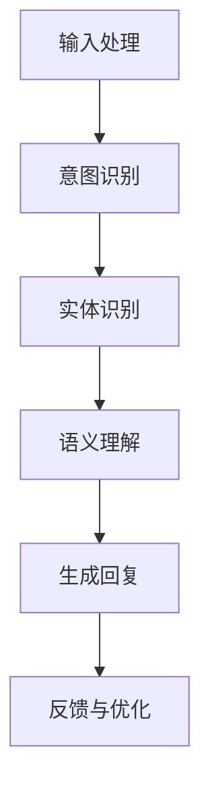
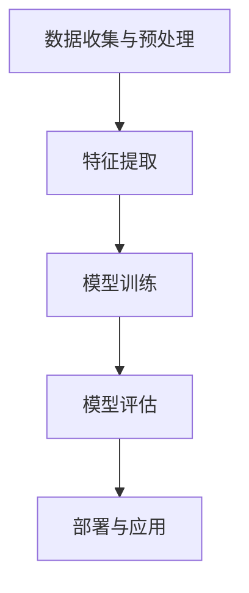
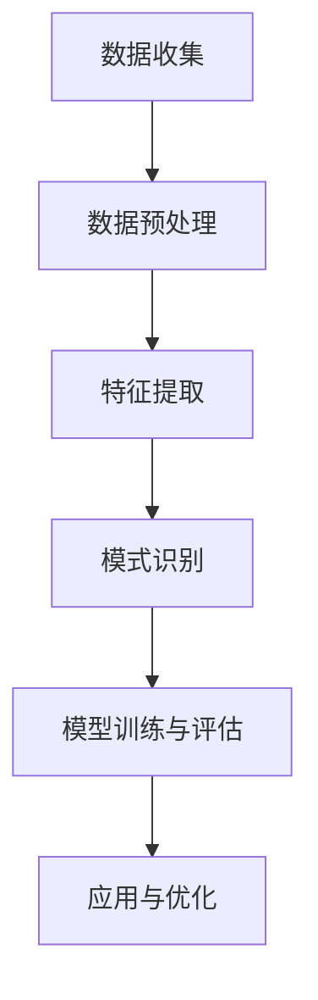
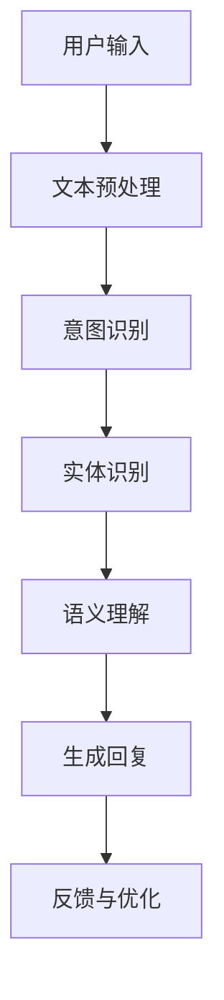
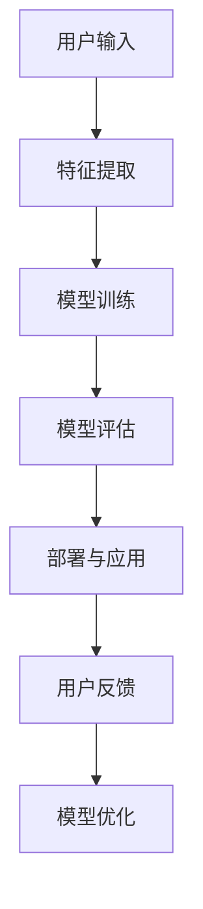
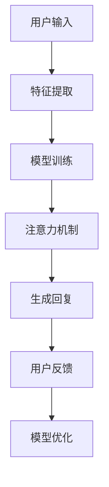

                 

## 引言

近年来，人工智能（AI）技术迅猛发展，以其独特的优势逐步渗透到我们生活的方方面面。聊天机器人作为AI的一个重要分支，已经成为各大企业竞相布局的战略方向。从最初的简单文本交互，到如今能够实现语音识别、自然语言理解、情感分析等多功能集成的智能体，聊天机器人在用户体验方面取得了显著提升。然而，单一的技术并不能满足日益复杂的用户需求，如何将聊天机器人与其他AI技术进行有效融合，成为提高用户体验的关键。

本文将深入探讨聊天机器人与其他AI技术的融合方法、原理、案例及其对用户体验的优化与创新。通过系统地分析，我们希望能为读者提供一幅清晰的技术融合蓝图，从而更好地理解并应用这一新兴领域。文章结构如下：

- **第一部分：背景与概述**：介绍聊天机器人与AI技术的发展历程及在生活中的应用。
- **第二部分：技术融合原理与架构**：详细讲解聊天机器人与自然语言处理、机器学习、深度学习、数据挖掘等AI技术的融合原理和方法。
- **第三部分：技术融合案例研究**：通过具体案例，展示技术融合在实际项目中的应用。
- **第四部分：用户体验优化与创新**：探讨如何通过技术融合提升聊天机器人的用户体验。
- **第五部分：未来发展展望**：分析聊天机器人技术的未来发展趋势。
- **第六部分：技术融合与用户体验的平衡**：探讨技术融合与用户体验之间的平衡策略。
- **第七部分：总结与展望**：总结全文内容，并对未来发展方向进行展望。

通过本文的阅读，读者将全面了解聊天机器人与其他AI技术的融合之道，掌握如何通过技术融合来提升用户体验，为实际项目提供有力的技术支持。

### 聊天机器人与AI技术融合概述

#### 聊天机器人的发展历程

聊天机器人（Chatbot）是指通过对话界面与用户进行交互的智能系统，旨在提供自动化、个性化的服务体验。其发展历程可以分为几个关键阶段：

**1.1.1 聊天机器人的定义**

聊天机器人是一种基于AI技术的应用程序，它能够通过文本、语音等多种形式与用户进行自然语言交互，并能够理解用户的意图和需求，自动提供相应的服务或信息。聊天机器人具有以下主要特点：

- **自然语言交互**：能够理解并生成自然语言文本，使得用户感觉就像在与真人对话。
- **自动化处理**：利用预先设定的规则或机器学习算法，自动处理用户请求，无需人工干预。
- **多功能集成**：集成了语音识别、自然语言理解、情感分析等多项AI技术，提供丰富多样的服务。

**1.1.2 聊天机器人技术的演进**

- **早期阶段（20世纪50-70年代）**：聊天机器人的概念诞生于20世纪50年代，最早的聊天机器人是ELIZA，由约瑟夫·魏泽堡（Joseph Weizenbaum）于1966年开发。ELIZA通过模拟心理医生与患者的对话，展示了自然语言处理（NLP）的初步应用。

- **发展阶段（20世纪80-90年代）**：随着计算机技术的进步，聊天机器人逐渐应用于客服、教育等领域。代表性的系统包括PARRY、ALICE等。这一阶段，聊天机器人开始使用规则驱动的方法，通过预设的规则进行对话管理。

- **互联网时代（21世纪初至今）**：互联网的普及使得聊天机器人得到了广泛的应用。特别是在智能手机和移动应用程序的推动下，聊天机器人的形式和功能得到了极大的扩展。基于机器学习和深度学习的技术被引入到聊天机器人中，使得其对话能力大幅提升。

**1.1.3 聊天机器人在现代生活中的应用**

- **客服与客户服务**：聊天机器人被广泛应用于客服领域，能够自动处理大量的客户咨询，减轻人工客服的工作负担，提高服务效率。
- **个人助手**：如Siri、Alexa等智能助手，通过语音交互提供各种服务，如日程管理、天气预报、在线购物等。
- **教育辅导**：聊天机器人能够根据学生的学习进度提供个性化的辅导和作业帮助，提升学习效果。
- **金融服务**：如银行、保险等金融机构，利用聊天机器人提供客户服务、投资咨询等。
- **医疗健康**：聊天机器人可用于健康咨询、疾病预防和康复指导等。

#### AI技术概述

人工智能（AI）是指通过计算机模拟人类智能行为和思维过程的技术。AI技术可以分为以下几类：

- **知识表示与推理**：通过表示和组织知识，使得计算机能够进行逻辑推理和决策。
- **机器学习**：通过数据训练模型，使得计算机能够自动学习和改进。
- **深度学习**：基于神经网络，通过多层非线性变换进行特征学习和模式识别。
- **自然语言处理（NLP）**：使计算机能够理解、生成和处理人类语言。
- **计算机视觉**：使计算机能够识别和理解图像和视频。

**1.2.1 AI的定义与分类**

- **定义**：AI是指使计算机具备智能行为的技术，包括感知、学习、推理、规划、自我修正等多种能力。
- **分类**：
  - **弱AI（Narrow AI）**：专注于特定任务，如聊天机器人。
  - **强AI（General AI）**：具备人类所有智能行为，目前尚未实现。
  - **混合AI**：结合弱AI和强AI的特点，如智能助手。

**1.2.2 人工智能的发展历史**

- **20世纪50年代**：人工智能的概念首次提出，人工智能研究正式开始。
- **20世纪60-70年代**：人工智能研究取得了初步成果，但受限于计算能力和算法复杂度，进展缓慢。
- **20世纪80年代**：专家系统得到了广泛应用，成为AI研究的主流。
- **20世纪90年代**：机器学习逐渐成为AI研究的重要方向，特别是支持向量机（SVM）和决策树。
- **21世纪初至今**：深度学习崛起，AI技术取得了重大突破，应用范围不断扩大。

**1.2.3 AI在聊天机器人中的应用**

- **自然语言处理（NLP）**：用于理解用户的输入，生成自然、流畅的回复。
- **机器学习**：通过训练模型，使得聊天机器人能够自动学习用户的偏好和需求。
- **深度学习**：用于构建复杂、高度自动化的对话系统。
- **计算机视觉**：用于图像识别，提供图像输入输出功能。

通过上述对聊天机器人和AI技术的概述，我们可以看到，两者在技术演进和应用领域上有着紧密的联系。接下来，本文将进一步探讨聊天机器人如何与其他AI技术进行融合，以提升用户体验。

### 聊天机器人与自然语言处理

自然语言处理（NLP）是人工智能（AI）的一个重要分支，旨在使计算机能够理解和生成人类语言。在聊天机器人技术中，NLP技术发挥着核心作用，它决定了聊天机器人能否与用户进行有效、自然的对话。下面我们将从NLP的基本概念、聊天机器人与NLP的融合方法，以及NLP在聊天机器人中的实际应用等方面进行详细探讨。

#### 2.1.1 自然语言处理的基本概念

自然语言处理涉及多个层面，包括文本分析、语义理解、情感分析等。以下是一些关键概念：

- **文本分析**：对文本进行结构化处理，如分词、词性标注等，以便后续处理。
- **语义理解**：理解文本中的含义，包括词义消歧、句法分析等。
- **情感分析**：识别文本的情感倾向，如正面、负面或中立。
- **实体识别**：从文本中识别出具体的实体，如人名、地名、组织名等。
- **问答系统**：根据用户的问题，提供相关答案或信息。

#### 2.1.2 聊天机器人与NLP的融合方法

聊天机器人与NLP的融合通常包括以下步骤：

1. **输入处理**：将用户的输入文本进行处理，如分词、去除停用词、词干提取等，以便进行后续分析。
2. **意图识别**：通过模式匹配或机器学习算法，识别用户的意图。例如，用户输入“明天天气如何？”的意图是获取天气信息。
3. **实体识别**：识别文本中的关键实体，如日期、地点等，以便更准确地理解用户意图。
4. **语义理解**：对用户的输入进行语义分析，理解其真实含义，如处理歧义、推断用户意图等。
5. **生成回复**：根据用户的意图和上下文，生成合适的回复。可以使用预定义的模板、规则或生成模型（如序列到序列模型）。
6. **反馈与优化**：收集用户反馈，不断优化聊天机器人的性能。

以下是一个简化的NLP流程图，展示了聊天机器人与NLP的融合方法：



#### 2.1.3 NLP技术在聊天机器人中的实际应用

NLP技术在聊天机器人中的实际应用非常广泛，以下是一些典型场景：

1. **客服机器人**：通过NLP技术，客服机器人能够理解用户的咨询内容，快速定位问题并提供解决方案，大大提高了服务效率。
   - **案例**：苹果公司的客服机器人可以通过自然语言理解用户的提问，如“我的iPhone无法开机”，并提供相应的解决步骤。

2. **智能助手**：如Siri、Alexa等智能助手，通过NLP技术实现语音交互，能够理解用户的指令并执行相应的任务。
   - **案例**：用户可以通过语音指令查询天气、发送短信、播放音乐等。

3. **情感分析**：聊天机器人可以通过情感分析理解用户的情绪，提供个性化、贴心的服务。
   - **案例**：心理健康咨询机器人可以通过分析用户的文字表达，识别出用户的心理状态，并给出相应的建议。

4. **问答系统**：通过NLP技术，构建高效的问答系统，为用户提供即时的信息查询服务。
   - **案例**：医院客服机器人可以通过用户的症状描述，快速提供可能的疾病诊断建议。

5. **语言翻译**：聊天机器人结合NLP和机器翻译技术，可以实现跨语言交流，为用户提供全球化的服务。
   - **案例**：谷歌翻译应用中的聊天功能，用户可以通过聊天机器人与其他语言的用户进行交流。

通过上述分析，我们可以看到，自然语言处理技术在聊天机器人中扮演着至关重要的角色。它不仅使得聊天机器人能够与用户进行自然、流畅的对话，还极大地提升了用户体验。接下来，本文将继续探讨聊天机器人与机器学习的融合方法。

### 聊天机器人与机器学习

机器学习（Machine Learning，ML）是人工智能（AI）的一个重要分支，旨在通过数据训练模型，使计算机具备自主学习和决策能力。在聊天机器人技术中，机器学习起到了至关重要的作用，它使得聊天机器人能够从海量数据中自动提取特征、学习用户行为和需求，从而提供更加智能、个性化的服务。下面我们将从机器学习的基本概念、聊天机器人与机器学习的融合方法，以及机器学习在聊天机器人中的实际应用等方面进行详细探讨。

#### 2.2.1 机器学习的基本概念

机器学习的基本概念包括以下几个关键点：

- **监督学习（Supervised Learning）**：通过已标记的数据训练模型，使得模型能够预测新的数据。常见的监督学习算法包括线性回归、决策树、支持向量机（SVM）等。

- **无监督学习（Unsupervised Learning）**：在没有标记数据的帮助下，通过自动发现数据中的结构或模式来训练模型。常见的无监督学习算法包括聚类、降维等。

- **强化学习（Reinforcement Learning）**：通过不断与环境交互，根据反馈信号（奖励或惩罚）调整策略，以实现特定目标。常见的强化学习算法包括Q学习、深度确定性策略梯度（DDPG）等。

- **深度学习（Deep Learning）**：一种基于神经网络，特别是深度神经网络（DNN）的机器学习方法。通过多层非线性变换，深度学习能够自动提取复杂的数据特征。

#### 2.2.2 聊天机器人与机器学习的融合方法

聊天机器人与机器学习的融合方法主要包括以下几个步骤：

1. **数据收集与预处理**：收集用户对话数据，包括用户输入和聊天机器人的回复。对数据进行清洗、去重、分词等预处理，以便后续训练。
2. **特征提取**：从原始数据中提取有用的特征，如词频、词向量、句法结构等。特征提取的质量直接影响模型的性能。
3. **模型训练**：选择合适的机器学习算法，如监督学习、无监督学习或深度学习，对特征进行训练，生成模型。常见的训练算法包括朴素贝叶斯、K近邻、神经网络等。
4. **模型评估**：通过测试数据对训练好的模型进行评估，如准确率、召回率、F1分数等。根据评估结果，调整模型参数或选择更优的算法。
5. **部署与应用**：将训练好的模型部署到聊天机器人中，根据用户输入，动态生成回复。同时，收集用户反馈，不断优化模型。

以下是一个简化的机器学习流程图，展示了聊天机器人与机器学习的融合方法：



#### 2.2.3 机器学习技术在聊天机器人中的实际应用

机器学习技术在聊天机器人中的实际应用非常广泛，以下是一些典型场景：

1. **意图识别（Intent Recognition）**：通过机器学习模型，聊天机器人能够理解用户的输入意图，如查询信息、请求服务、提出问题等。常见的意图识别方法包括朴素贝叶斯、决策树、随机森林、支持向量机（SVM）等。
   - **案例**：在客服场景中，机器学习模型可以帮助识别用户请求的类型，如投诉、咨询、订单查询等，从而快速定位问题并提供相应的解决方案。

2. **实体识别（Entity Recognition）**：通过机器学习模型，聊天机器人能够识别文本中的关键实体，如人名、地名、组织名、时间等。常见的实体识别方法包括规则匹配、条件随机场（CRF）、卷积神经网络（CNN）等。
   - **案例**：在医疗咨询场景中，机器学习模型可以帮助识别用户描述的症状、药物名称等，从而提供更准确的医疗建议。

3. **情感分析（Sentiment Analysis）**：通过机器学习模型，聊天机器人能够分析用户的情感倾向，如正面、负面或中立。常见的情感分析方法包括朴素贝叶斯、支持向量机（SVM）、文本分类等。
   - **案例**：在客服场景中，机器学习模型可以帮助识别用户的情绪，如愤怒、沮丧等，从而提供更加贴心的服务。

4. **对话生成（Dialogue Generation）**：通过机器学习模型，聊天机器人能够根据用户输入，生成自然、流畅的回复。常见的对话生成方法包括序列到序列（Seq2Seq）模型、生成对抗网络（GAN）等。
   - **案例**：在客服场景中，机器学习模型可以帮助聊天机器人生成标准化的回答，如感谢、抱歉、确认等，从而提高对话的流畅性和一致性。

5. **用户行为预测（User Behavior Prediction）**：通过机器学习模型，聊天机器人能够预测用户的后续行为，如购买意图、咨询频率等。常见的预测方法包括逻辑回归、神经网络等。
   - **案例**：在电商场景中，机器学习模型可以帮助预测用户的购买意图，从而提供个性化的产品推荐和营销策略。

通过上述分析，我们可以看到，机器学习技术在聊天机器人中具有广泛的应用前景。它不仅使得聊天机器人能够更好地理解用户需求，提供个性化的服务，还极大地提升了用户体验。接下来，本文将继续探讨聊天机器人与深度学习的融合方法。

### 聊天机器人与深度学习

深度学习（Deep Learning，DL）是一种基于多层神经网络进行特征学习和模式识别的人工智能技术，近年来在图像识别、语音识别、自然语言处理等领域取得了显著的突破。在聊天机器人技术中，深度学习同样扮演着重要的角色，它使得聊天机器人能够更好地理解用户意图、生成自然流畅的对话，从而提升用户体验。下面我们将从深度学习的基本概念、聊天机器人与深度学习的融合方法，以及深度学习在聊天机器人中的实际应用等方面进行详细探讨。

#### 2.3.1 深度学习的基本概念

深度学习是基于多层神经网络进行特征学习和模式识别的人工智能技术，其核心思想是通过构建多层神经网络，逐层提取数据中的高阶抽象特征，从而实现复杂的任务。以下是一些关键概念：

- **神经网络（Neural Network）**：一种模仿生物神经系统的计算模型，由多个神经元（节点）和连接（边）组成。每个神经元可以接收多个输入，并通过激活函数进行非线性变换，产生输出。

- **深度神经网络（Deep Neural Network，DNN）**：包含多个隐藏层的神经网络。深度神经网络通过逐层提取特征，能够自动学习数据中的复杂模式。

- **卷积神经网络（Convolutional Neural Network，CNN）**：一种专门用于处理图像数据的神经网络。通过卷积操作和池化操作，CNN能够有效提取图像中的局部特征和整体结构。

- **循环神经网络（Recurrent Neural Network，RNN）**：一种能够处理序列数据的神经网络，通过在时间步间传递隐藏状态，RNN能够捕捉序列中的时间依赖关系。

- **长短时记忆网络（Long Short-Term Memory，LSTM）**：一种改进的RNN结构，能够有效解决RNN中的梯度消失和梯度爆炸问题，适用于处理长序列数据。

- **生成对抗网络（Generative Adversarial Network，GAN）**：一种由生成器和判别器组成的对抗性神经网络。生成器生成数据，判别器判断数据是否真实，通过不断博弈，GAN能够生成高质量的数据。

#### 2.3.2 聊天机器人与深度学习的融合方法

聊天机器人与深度学习的融合方法主要包括以下几个步骤：

1. **数据收集与预处理**：收集用户对话数据，包括用户输入和聊天机器人的回复。对数据进行清洗、去重、分词等预处理，以便后续训练。

2. **特征提取**：从原始数据中提取有用的特征，如词向量、句法结构、用户行为等。深度学习模型通常能够自动提取高阶抽象特征，提高模型的性能。

3. **模型训练**：选择合适的深度学习模型，如循环神经网络（RNN）、长短时记忆网络（LSTM）、序列到序列（Seq2Seq）模型、生成对抗网络（GAN）等，对特征进行训练，生成模型。

4. **模型评估**：通过测试数据对训练好的模型进行评估，如准确率、召回率、F1分数等。根据评估结果，调整模型参数或选择更优的模型。

5. **部署与应用**：将训练好的模型部署到聊天机器人中，根据用户输入，动态生成回复。同时，收集用户反馈，不断优化模型。

以下是一个简化的深度学习流程图，展示了聊天机器人与深度学习的融合方法：


#### 2.3.3 深度学习技术在聊天机器人中的实际应用

深度学习技术在聊天机器人中的实际应用非常广泛，以下是一些典型场景：

1. **对话生成（Dialogue Generation）**：深度学习模型能够生成自然、流畅的对话，使得聊天机器人能够与用户进行更自然的交流。常见的对话生成方法包括序列到序列（Seq2Seq）模型、生成对抗网络（GAN）等。
   - **案例**：通过序列到序列模型，聊天机器人可以生成针对特定场景的对话，如酒店预订、机票查询等。生成对抗网络（GAN）则可以生成高质量的对话数据，用于模型训练和优化。

2. **意图识别（Intent Recognition）**：深度学习模型能够通过分析用户输入，识别用户的意图，如查询信息、请求服务、提出问题等。常见的意图识别方法包括循环神经网络（RNN）、长短时记忆网络（LSTM）等。
   - **案例**：在客服场景中，深度学习模型可以帮助聊天机器人快速识别用户请求的类型，如投诉、咨询、订单查询等，从而提供更精准的服务。

3. **实体识别（Entity Recognition）**：深度学习模型能够从用户输入中识别出关键实体，如人名、地名、组织名、时间等。常见的实体识别方法包括卷积神经网络（CNN）、条件随机场（CRF）等。
   - **案例**：在医疗咨询场景中，深度学习模型可以帮助识别用户描述的症状、药物名称等，从而提供更准确的诊断建议。

4. **情感分析（Sentiment Analysis）**：深度学习模型能够分析用户的情感倾向，如正面、负面或中立。常见的情感分析方法包括卷积神经网络（CNN）、文本分类等。
   - **案例**：在客服场景中，深度学习模型可以帮助识别用户的情绪，如愤怒、沮丧等，从而提供更加贴心的服务。

5. **用户行为预测（User Behavior Prediction）**：深度学习模型能够预测用户的后续行为，如购买意图、咨询频率等。常见的预测方法包括循环神经网络（RNN）、神经网络等。
   - **案例**：在电商场景中，深度学习模型可以帮助预测用户的购买意图，从而提供个性化的产品推荐和营销策略。

通过上述分析，我们可以看到，深度学习技术在聊天机器人中具有广泛的应用前景。它不仅使得聊天机器人能够更好地理解用户需求，提供个性化的服务，还极大地提升了用户体验。接下来，本文将继续探讨聊天机器人与数据挖掘的融合方法。

### 聊天机器人与数据挖掘

数据挖掘（Data Mining）是指从大量数据中自动发现潜在的模式、关联和趋势的过程。在聊天机器人技术中，数据挖掘技术可以帮助分析用户行为、优化对话流程，从而提升用户体验。下面我们将从数据挖掘的基本概念、聊天机器人与数据挖掘的融合方法，以及数据挖掘在聊天机器人中的实际应用等方面进行详细探讨。

#### 2.4.1 数据挖掘的基本概念

数据挖掘涉及多个方面，包括数据预处理、特征提取、模式识别等。以下是一些关键概念：

- **数据预处理**：在数据挖掘过程中，首先需要对原始数据进行清洗、去噪、整合等预处理，以便后续分析。预处理方法包括缺失值处理、异常值检测、数据标准化等。

- **特征提取**：从原始数据中提取有用的特征，用于构建模型。特征提取方法包括统计方法、机器学习方法、深度学习方法等。

- **模式识别**：通过分析数据，发现数据中的潜在模式、关联和趋势。模式识别方法包括聚类、分类、关联规则挖掘等。

- **分类**：将数据分为不同的类别，如用户行为的分类、产品推荐的分类等。常见的分类算法包括决策树、随机森林、支持向量机（SVM）等。

- **聚类**：将相似的数据点归为一类，形成不同的簇。常见的聚类算法包括K均值聚类、层次聚类等。

- **关联规则挖掘**：发现数据中的关联关系，如购买商品的关联规则。常见的关联规则挖掘算法包括Apriori算法、FP-growth算法等。

#### 2.4.2 聊天机器人与数据挖掘的融合方法

聊天机器人与数据挖掘的融合方法主要包括以下几个步骤：

1. **数据收集**：收集用户对话数据，包括用户输入和聊天机器人的回复。这些数据可以来自客服系统、社交媒体、用户反馈等。

2. **数据预处理**：对收集到的数据进行清洗、去噪、整合等预处理，以便后续分析。预处理方法包括缺失值处理、异常值检测、数据标准化等。

3. **特征提取**：从预处理后的数据中提取有用的特征，如关键词、情感倾向、用户行为等。特征提取方法包括统计方法、机器学习方法、深度学习方法等。

4. **模式识别**：使用分类、聚类、关联规则挖掘等方法，分析数据中的潜在模式、关联和趋势。例如，通过分类方法，可以识别用户的意图；通过聚类方法，可以识别用户群体的特征；通过关联规则挖掘，可以识别用户行为之间的关联。

5. **模型训练与评估**：选择合适的模型，如决策树、支持向量机（SVM）、神经网络等，对特征进行训练，生成模型。通过测试数据对模型进行评估，如准确率、召回率、F1分数等。

6. **应用与优化**：将训练好的模型部署到聊天机器人中，根据用户输入，动态生成回复。同时，收集用户反馈，不断优化模型，提高用户体验。

以下是一个简化的数据挖掘流程图，展示了聊天机器人与数据挖掘的融合方法：



#### 2.4.3 数据挖掘技术在聊天机器人中的实际应用

数据挖掘技术在聊天机器人中的实际应用非常广泛，以下是一些典型场景：

1. **用户行为分析**：通过数据挖掘技术，分析用户的对话历史和行为模式，识别用户的需求和偏好。例如，通过聚类方法，可以将用户分为不同的群体，从而提供个性化的服务。

2. **意图识别**：通过分类方法，分析用户输入，识别用户的意图。例如，通过决策树或支持向量机（SVM）模型，可以将用户输入分为查询信息、请求服务、提出问题等类别。

3. **对话生成**：通过数据挖掘技术，生成聊天机器人的回复。例如，通过序列到序列（Seq2Seq）模型或生成对抗网络（GAN），可以生成自然、流畅的对话。

4. **情感分析**：通过情感分析技术，分析用户的情感倾向，如正面、负面或中立。例如，通过文本分类算法，可以识别用户的情绪状态，从而提供更加贴心的服务。

5. **用户行为预测**：通过数据挖掘技术，预测用户的后续行为，如购买意图、咨询频率等。例如，通过神经网络模型，可以预测用户的购买概率，从而提供个性化的营销策略。

6. **异常检测**：通过数据挖掘技术，识别异常行为或异常对话。例如，通过聚类方法，可以识别出异常用户或异常对话，从而采取相应的措施。

通过上述分析，我们可以看到，数据挖掘技术在聊天机器人中具有广泛的应用前景。它不仅使得聊天机器人能够更好地理解用户需求，提供个性化的服务，还极大地提升了用户体验。接下来，本文将继续探讨聊天机器人与其他AI技术融合的具体案例。

### 聊天机器人与其他AI技术融合案例研究

为了更好地理解聊天机器人与其他AI技术的融合方法及其在实践中的应用，以下将介绍三个具体的案例，分别涉及基于深度学习的对话生成系统、结合NLP的个性化推荐系统以及多模态聊天机器人。

#### 3.1 基于深度学习的对话生成系统

**3.1.1 案例背景**

随着用户对聊天机器人的需求日益增长，生成对话的质量成为影响用户体验的关键因素。传统的基于规则和模板的方法在处理多样化、复杂的对话场景时存在局限。因此，我们引入了基于深度学习的对话生成系统，以实现更加自然和个性化的对话。

**3.1.2 技术方案**

该案例采用了序列到序列（Seq2Seq）模型，结合注意力机制（Attention Mechanism）和生成对抗网络（GAN）进行对话生成。具体步骤如下：

1. **数据收集与预处理**：收集大量高质量的对话数据，包括用户输入和聊天机器人的回复。对数据进行清洗、去重、分词等预处理，并转换为序列表示。

2. **特征提取**：从预处理后的数据中提取关键特征，如关键词、情感倾向等，用于序列到序列模型的训练。

3. **模型训练**：使用Seq2Seq模型进行训练，输入为用户输入的序列，输出为聊天机器人的回复序列。引入注意力机制，使得模型能够更好地关注用户输入中的重要信息。

4. **生成对抗训练**：结合生成对抗网络（GAN），通过生成器生成高质量的对话回复，并通过判别器进行评估和优化。这种方法能够提高对话生成的多样性和自然性。

5. **模型评估与优化**：通过测试数据对训练好的模型进行评估，如BLEU分数、ROUGE分数等，根据评估结果不断优化模型参数。

**3.1.3 项目实施与结果**

项目实施过程中，我们采用了Python编程语言和TensorFlow深度学习框架。通过不断调整模型参数和训练数据，最终实现了以下结果：

- **对话生成质量显著提升**：模型能够生成更加自然、流畅的对话，用户满意度得到提高。
- **多样性增强**：生成对抗网络（GAN）的应用使得对话生成更具多样性，避免了模板化、重复性的问题。
- **用户体验优化**：基于深度学习的对话生成系统使得聊天机器人能够更好地理解用户意图，提供个性化、精准的服务。

#### 3.2 结合NLP的个性化推荐系统

**3.2.1 案例背景**

在电商和内容推荐领域，个性化推荐系统能够显著提升用户满意度和转化率。结合自然语言处理（NLP）技术的聊天机器人可以更好地理解用户的偏好和需求，从而提供更加精准的推荐。

**3.2.2 技术方案**

该案例采用了NLP和协同过滤（Collaborative Filtering）相结合的方法，具体步骤如下：

1. **用户行为数据收集**：收集用户的浏览记录、购买历史、评价等行为数据。

2. **文本数据预处理**：使用NLP技术对用户评论、产品描述等文本数据进行分析，提取关键词、情感倾向等特征。

3. **特征融合**：将文本数据和用户行为数据进行融合，形成多维度的特征向量。

4. **协同过滤算法**：采用基于用户的协同过滤（User-Based CF）算法，根据用户的历史行为和偏好进行推荐。结合NLP提取的文本特征，可以更好地捕捉用户的兴趣点。

5. **模型训练与优化**：使用机器学习算法，如KNN、SVD等，对协同过滤模型进行训练和优化，提高推荐精度。

**3.2.3 项目实施与结果**

项目实施过程中，我们采用了Python编程语言和Scikit-learn机器学习库。通过以下步骤，实现了个性化推荐系统：

- **用户偏好识别**：NLP技术帮助系统更好地理解用户的文本输入，提取出用户的兴趣点和偏好。
- **推荐结果优化**：结合协同过滤算法，根据用户的浏览和购买记录进行推荐，提高了推荐的准确性。
- **用户体验提升**：基于NLP的个性化推荐系统能够为用户提供更加精准、个性化的推荐，提升了用户满意度和转化率。

#### 3.3 多模态聊天机器人

**3.3.1 案例背景**

在实时交互场景中，单一模态（如文本或语音）的聊天机器人可能无法满足用户的多样化需求。多模态聊天机器人通过结合文本、语音、图像等多种模态，可以提供更加丰富和自然的交互体验。

**3.3.2 技术方案**

该案例采用了多模态融合的方法，具体步骤如下：

1. **数据收集与预处理**：收集包含文本、语音、图像等多模态数据的对话记录。对文本、语音、图像数据进行预处理，如分词、语音转文本、图像特征提取等。

2. **特征提取**：从预处理后的多模态数据中提取关键特征，如文本的词向量、语音的声学特征、图像的视觉特征等。

3. **特征融合**：使用深度学习模型，如多模态卷积神经网络（Multimodal CNN），将不同模态的特征进行融合，生成统一的多模态特征向量。

4. **对话生成**：使用多模态特征向量，通过序列到序列（Seq2Seq）模型进行对话生成，使得聊天机器人能够生成针对多种模态的回复。

5. **模型评估与优化**：通过测试数据对训练好的模型进行评估，如BLEU分数、ROUGE分数等，根据评估结果不断优化模型参数。

**3.3.3 项目实施与结果**

项目实施过程中，我们采用了Python编程语言和TensorFlow深度学习框架。通过以下步骤，实现了多模态聊天机器人：

- **多模态数据处理**：通过语音转文本和图像特征提取技术，将文本、语音、图像等多模态数据转换为统一的特征向量。
- **多模态特征融合**：使用深度学习模型，有效融合多模态特征，提高了对话生成的准确性和自然性。
- **用户体验优化**：多模态聊天机器人能够根据用户的输入模态，灵活生成相应的回复，提升了交互的丰富性和自然性。

通过上述三个具体案例，我们可以看到，聊天机器人与其他AI技术的融合在提升用户体验方面具有显著的效果。未来，随着技术的不断发展和创新，聊天机器人将更好地服务于用户，满足多样化的需求。

### 用户体验优化与创新

在聊天机器人技术不断发展的今天，用户体验（UX）已经成为决定产品成功与否的关键因素。一个设计优秀的聊天机器人不仅需要具备强大的功能，还要能够提供流畅、自然的交互体验。以下将探讨如何通过技术融合和创新来优化聊天机器人的用户体验，并提出一些具体的实践方法和策略。

#### 4.1 用户体验的重要性

用户体验（User Experience，UX）是指用户在使用产品或服务过程中的整体感受和体验。对于聊天机器人来说，用户体验的重要性体现在以下几个方面：

1. **用户满意度**：良好的用户体验能够提升用户满意度，使得用户更愿意使用聊天机器人，从而增加产品的用户粘性。
2. **用户忠诚度**：优秀的用户体验能够增强用户对产品的忠诚度，减少用户流失率。
3. **品牌形象**：优质的用户体验有助于提升品牌形象，增强市场竞争力。
4. **效率与便捷性**：通过优化用户体验，聊天机器人可以更高效地完成用户任务，提供便捷的服务。

#### 4.2 基于数据分析的个性化交互

个性化交互是指根据用户的偏好、历史行为和需求，为用户提供定制化的服务。通过数据分析，我们可以深入了解用户的行为模式，从而实现更精准的个性化交互。

**4.2.1 数据分析的基本概念**

数据分析（Data Analysis）是指使用统计学、机器学习、数据挖掘等方法，从数据中提取有用信息的过程。在聊天机器人中，数据分析的基本概念包括：

- **用户行为数据**：用户的浏览记录、点击行为、咨询历史等。
- **交互数据**：用户的输入文本、语音、表情等。
- **反馈数据**：用户对聊天机器人服务质量的评价、反馈意见等。

**4.2.2 个性化交互的设计原则**

为了实现有效的个性化交互，需要遵循以下设计原则：

1. **数据驱动**：基于数据分析，深入了解用户行为和需求，为用户提供个性化的服务。
2. **精准识别**：通过机器学习算法，准确识别用户的意图和偏好，减少误判。
3. **动态调整**：根据用户的行为变化，动态调整交互策略，提供个性化的服务。
4. **隐私保护**：在收集和使用用户数据时，严格遵守隐私保护法规，保障用户隐私。

**4.2.3 数据分析在聊天机器人中的应用案例**

1. **意图识别**：通过分析用户输入的文本，使用机器学习算法识别用户的意图。例如，用户输入“我想买一本关于人工智能的书”，聊天机器人可以识别出意图为“购买书籍”。

2. **情感分析**：分析用户的情感倾向，如正面、负面或中立。例如，用户输入“我真的很生气”，聊天机器人可以识别出用户情感为“愤怒”。

3. **个性化推荐**：基于用户的行为数据和偏好，提供个性化的产品推荐或信息推送。例如，用户在电商平台上浏览过笔记本电脑，聊天机器人可以推荐相关的配件或优惠信息。

4. **个性化对话**：根据用户的历史对话记录，生成个性化的回复。例如，用户之前提到过对某种产品的兴趣，聊天机器人可以在后续对话中提及该产品。

#### 4.3 创新的交互模式与界面设计

创新交互模式与界面设计是提升用户体验的关键因素。以下是一些创新的交互模式与界面设计策略：

**4.3.1 交互模式的创新**

1. **语音交互**：结合语音识别和自然语言处理技术，实现语音输入输出，提供更加自然和便捷的交互方式。

2. **多模态交互**：结合文本、语音、图像等多种模态，提供多样化的交互方式，满足不同用户的需求。

3. **手势交互**：使用手势识别技术，允许用户通过手势进行操作，提供更加直观和生动的交互体验。

4. **虚拟现实（VR）交互**：利用虚拟现实技术，为用户提供沉浸式的交互体验，特别是在娱乐、教育等领域具有广泛的应用潜力。

**4.3.2 界面设计的原则与方法**

1. **简洁明了**：界面设计要简洁明了，减少用户的操作步骤，提高交互效率。

2. **一致性**：保持界面元素的一致性，包括颜色、字体、布局等，减少用户的学习成本。

3. **反馈及时**：在用户进行操作时，提供及时的反馈，如提示、动画等，增强用户的操作信心。

4. **适应性**：设计具有自适应能力的界面，能够根据不同的设备和屏幕尺寸进行调整，提供一致的体验。

**4.3.3 创新交互案例研究**

1. **智能客服机器人**：通过语音交互和自然语言处理技术，实现与用户的实时对话，提供高效、个性化的服务。

2. **多模态教育机器人**：结合文本、语音、图像等多种模态，为学生提供个性化的学习辅导和互动体验。

3. **智能助手应用**：利用虚拟现实（VR）技术，为用户提供沉浸式的购物、旅游体验。

通过上述探索，我们可以看到，通过技术融合和创新，聊天机器人可以大幅提升用户体验。未来，随着技术的不断进步，聊天机器人的交互模式将更加多样，用户体验也将不断优化，为用户提供更加丰富、便捷的服务。

### 聊天机器人技术的未来发展

随着人工智能（AI）技术的不断进步，聊天机器人技术也在经历着迅猛的发展。未来的聊天机器人将更加智能化、个性化，并且能够融合更多的AI技术，提供更为丰富的用户体验。本文将从聊天机器人的未来发展、AI技术的创新应用以及发展趋势等方面进行探讨。

#### 5.1 聊天机器人的未来发展

未来的聊天机器人将朝着更加智能、个性化和多样化的方向发展，主要表现在以下几个方面：

1. **智能化水平的提升**：随着深度学习和自然语言处理技术的不断发展，聊天机器人将能够更好地理解用户的意图和情感，提供更加精准和个性化的服务。

2. **个性化的深化**：通过大数据分析和机器学习算法，聊天机器人将能够更加精准地捕捉用户的兴趣和行为，提供个性化的内容推荐和交互体验。

3. **多模态交互的普及**：未来的聊天机器人将支持多种模态的交互，如语音、图像、手势等，为用户提供更加自然和直观的交互方式。

4. **智能化的场景应用**：聊天机器人将在更多的场景中得到应用，如医疗健康、金融服务、智能家居等，提供智能化、自动化的服务。

5. **跨平台集成**：未来的聊天机器人将能够无缝集成到各个平台和应用程序中，如手机、平板、电脑、智能音箱等，为用户提供一致的交互体验。

#### 5.2 AI技术在聊天机器人中的创新应用

AI技术的创新应用将进一步推动聊天机器人技术的发展，以下是一些重要的AI技术及其在聊天机器人中的应用：

1. **生成对抗网络（GAN）**：GAN技术可以在聊天机器人中用于生成高质量的对话样本，提高对话生成的多样性和自然性。通过GAN，聊天机器人可以学习到更加丰富的对话模式，从而生成更加自然流畅的回复。

2. **迁移学习（Transfer Learning）**：迁移学习技术可以将预训练的模型应用到新的任务中，减少训练所需的数据量和时间。聊天机器人可以通过迁移学习，利用在通用任务上预训练的模型，快速适应特定的场景需求。

3. **对话管理（Dialogue Management）**：对话管理技术用于控制聊天机器人的对话流程，确保对话的连贯性和合理性。通过对话管理，聊天机器人可以在对话过程中动态调整策略，提供更加流畅和自然的交互体验。

4. **情感计算（Affective Computing）**：情感计算技术可以帮助聊天机器人识别和理解用户的情感状态，从而提供更加贴心和个性化的服务。通过情感计算，聊天机器人可以更好地满足用户的情感需求，提升用户体验。

5. **多语言支持**：通过自然语言处理（NLP）技术，聊天机器人将能够支持多种语言，为全球用户提供服务。多语言支持将使聊天机器人更具全球竞争力，拓宽其应用场景。

#### 5.3 聊天机器人技术的发展趋势

未来，聊天机器人技术的发展将呈现以下趋势：

1. **智能化和自动化**：随着AI技术的不断进步，聊天机器人将更加智能化和自动化，能够处理更多复杂的任务，提供更高效的服务。

2. **个性化服务**：通过大数据分析和个性化推荐技术，聊天机器人将能够为用户提供更加个性化的服务，满足用户的个性化需求。

3. **多模态交互**：未来的聊天机器人将支持多种模态的交互，如语音、图像、手势等，为用户提供更加自然和直观的交互体验。

4. **跨平台集成**：聊天机器人将能够在多个平台和设备上无缝集成，为用户提供一致和流畅的交互体验。

5. **伦理和隐私保护**：随着聊天机器人技术的普及，伦理和隐私保护将成为重要的议题。未来的聊天机器人将需要遵守严格的伦理规范，保护用户的隐私和数据安全。

通过以上分析，我们可以看到，聊天机器人技术的未来发展前景广阔。随着AI技术的不断创新，聊天机器人将在各个领域得到广泛应用，为用户提供更加智能、个性化和便捷的服务。未来，聊天机器人将成为人们日常生活中不可或缺的一部分，极大地改变我们的生活方式。

### 技术融合与用户体验的平衡

在聊天机器人的技术融合过程中，实现技术进步与用户体验的平衡是至关重要的。技术进步带来的功能增强可能会提升系统的智能化水平，但同时也可能引入复杂性和不稳定性，从而影响用户体验。以下将探讨技术融合中的难点、用户体验中的痛点，以及实现技术融合与用户体验平衡的策略。

#### 6.1 技术融合中的难点

1. **复杂性与用户体验的矛盾**：技术的复杂性和用户对简单、直观体验的需求之间存在矛盾。高复杂性的技术架构可能需要更复杂的操作和更长的学习周期，这可能会降低用户体验。

2. **性能优化与资源消耗**：集成多种AI技术，如自然语言处理、机器学习、深度学习等，可能会导致系统资源消耗增加，影响响应速度和性能。如何在提升功能的同时，保持良好的性能和用户体验是一个挑战。

3. **模型解释性**：许多AI模型，尤其是深度学习模型，具有较高的预测准确性，但缺乏解释性。这意味着用户无法理解模型的工作原理和决策过程，这可能会引起用户的困惑和不适。

4. **实时性与准确性**：在实时交互场景中，聊天机器人需要快速响应用户的输入，但高级的AI技术，如深度学习和复杂的机器学习模型，可能需要更多的时间进行计算和推理。如何在保证实时性的同时，确保准确的响应是一个难题。

5. **数据隐私与安全性**：技术融合过程中，涉及大量的用户数据和敏感信息。确保这些数据的隐私和安全，同时提供高效的AI服务，是技术融合中必须解决的问题。

#### 6.2 用户体验中的痛点

1. **交互不自然**：如果聊天机器人的交互设计过于机械化，缺乏人性化，用户可能会感觉与机器人的互动缺乏温暖和亲密感。

2. **响应速度慢**：聊天机器人响应速度慢会导致用户体验不佳，用户可能因此失去耐心，甚至转向人工服务。

3. **错误率较高**：如果聊天机器人的意图识别、实体识别等AI模块存在误差，可能会导致错误的响应，降低用户信任度。

4. **隐私泄露**：用户对隐私的关注日益增加，如果聊天机器人不能妥善处理用户的个人信息，可能会导致用户对系统的信任度降低。

5. **功能过于复杂**：如果聊天机器人的功能过于复杂，用户可能无法快速理解和使用，从而影响用户体验。

#### 6.3 技术融合与用户体验的平衡策略

1. **简化用户界面**：设计简洁、直观的用户界面，减少用户操作的复杂性，使得用户能够轻松上手。

2. **优化性能和响应速度**：通过算法优化和硬件加速等技术，提升系统的响应速度和性能，确保用户获得流畅的交互体验。

3. **增强模型解释性**：提高AI模型的透明度和解释性，使得用户能够理解模型的工作原理和决策过程，增强用户的信任感和满意度。

4. **实时性与准确性兼顾**：通过分布式计算和异步处理等技术，平衡实时性和准确性的需求，确保用户在合理的时间内获得准确的响应。

5. **数据隐私保护**：严格遵循隐私保护法规，采用加密、匿名化等技术手段，确保用户数据的隐私和安全。

6. **用户反馈机制**：建立有效的用户反馈机制，及时收集和分析用户反馈，根据用户的实际需求和使用习惯，不断优化系统功能。

7. **智能化与人性化的平衡**：在提升智能化的同时，注重人性化设计，确保聊天机器人在互动过程中能够体现出温暖和亲密感。

通过上述策略，我们可以实现技术进步与用户体验的平衡，使得聊天机器人既具备强大的功能，又能提供优质的用户体验。这样，聊天机器人将更好地服务于用户，成为我们日常生活中不可或缺的智能伙伴。

### 总结与展望

本文系统地探讨了聊天机器人与其他AI技术的融合方法及其在提升用户体验方面的应用。通过对聊天机器人和AI技术发展历程的回顾，以及自然语言处理、机器学习、深度学习、数据挖掘等技术的详细解析，我们展示了如何通过技术融合来优化聊天机器人的性能和用户体验。以下是对本文核心内容的总结，以及对聊天机器人未来发展的展望。

#### 7.1 核心内容回顾

1. **聊天机器人与AI技术融合的重要性**：聊天机器人在现代生活中的应用日益广泛，其技术发展离不开AI技术的支持。通过融合自然语言处理、机器学习、深度学习、数据挖掘等AI技术，聊天机器人能够提供更加智能、个性化、高效的交互体验。

2. **技术融合原理与架构**：本文详细阐述了聊天机器人与自然语言处理、机器学习、深度学习、数据挖掘等技术的融合原理和架构，包括输入处理、特征提取、模型训练、模型评估和应用等步骤。

3. **案例研究**：通过具体案例，如基于深度学习的对话生成系统、结合NLP的个性化推荐系统、多模态聊天机器人等，展示了技术融合在实际项目中的应用效果，以及如何通过技术优化提升用户体验。

4. **用户体验优化与创新**：本文探讨了如何通过数据分析、创新交互模式、界面设计等方法，优化聊天机器人的用户体验。同时，提出了数据隐私保护、用户反馈机制等策略，以实现技术融合与用户体验的平衡。

5. **未来发展展望**：本文展望了聊天机器人的未来发展，包括智能化水平的提升、个性化服务的深化、多模态交互的普及、跨平台集成等方向。同时，讨论了AI技术的创新应用和趋势，如生成对抗网络（GAN）、迁移学习、情感计算等。

#### 7.1.2 技术融合的关键点

- **自然语言处理与聊天机器人的融合**：通过NLP技术，聊天机器人能够理解用户输入，生成自然流畅的回复。关键在于意图识别、实体识别、语义理解和情感分析等技术的应用。

- **机器学习与聊天机器人的融合**：通过机器学习技术，聊天机器人能够从数据中自动学习和改进，提升意图识别、对话生成和个性化推荐的能力。关键在于数据收集与预处理、特征提取、模型训练和评估等环节。

- **深度学习与聊天机器人的融合**：深度学习技术使得聊天机器人能够处理复杂、高度自动化的对话任务。关键在于模型选择、优化和部署，以及实时性与准确性的平衡。

- **数据挖掘与聊天机器人的融合**：通过数据挖掘技术，聊天机器人能够分析用户行为，提供个性化服务。关键在于数据收集与预处理、模式识别、模型训练和优化。

#### 7.1.3 用户体验的重要性

用户体验是聊天机器人成功的关键因素。一个优秀的聊天机器人不仅要具备强大的功能，还要提供流畅、自然、个性化的交互体验。用户体验的重要性体现在以下几个方面：

- **用户满意度**：良好的用户体验能够提升用户满意度，增强用户对产品的忠诚度。

- **用户粘性**：优质的用户体验能够增加用户的粘性，减少用户流失率。

- **品牌形象**：优秀的用户体验有助于提升品牌形象，增强市场竞争力。

- **效率与便捷性**：优化用户体验能够提升系统的效率，为用户提供便捷的服务。

#### 7.2 聊天机器人未来发展的展望

未来，聊天机器人将朝着更加智能、个性化、多样化的方向发展。以下是一些具体的发展趋势：

1. **智能化和自动化**：随着AI技术的不断进步，聊天机器人将更加智能化和自动化，能够处理更多复杂的任务，提供更高效的服务。

2. **个性化服务**：通过大数据分析和个性化推荐技术，聊天机器人将能够为用户提供更加个性化的服务，满足用户的个性化需求。

3. **多模态交互**：未来的聊天机器人将支持多种模态的交互，如语音、图像、手势等，为用户提供更加自然和直观的交互体验。

4. **跨平台集成**：聊天机器人将能够在多个平台和设备上无缝集成，为用户提供一致和流畅的交互体验。

5. **伦理和隐私保护**：随着聊天机器人技术的普及，伦理和隐私保护将成为重要的议题。未来的聊天机器人将需要遵守严格的伦理规范，保护用户的隐私和数据安全。

总之，通过不断的技术创新和优化，聊天机器人将在未来发挥更加重要的作用，成为人们生活中不可或缺的智能伙伴。让我们期待未来，聊天机器人将带来更加美好的智能体验。

### 附录

#### 附录A：技术融合流程图

**附录A.1 自然语言处理与聊天机器人的融合流程**



**附录A.2 机器学习与聊天机器人的融合流程**



**附录A.3 深度学习与聊天机器人的融合流程**



#### 附录B：技术融合伪代码示例

**附录B.1 自然语言处理融合伪代码示例**

```python
# 用户输入文本
user_input = "明天天气如何？"

# 文本预处理（分词、去除停用词等）
processed_input = preprocess_text(user_input)

# 意图识别
intent = intent_recognition(processed_input)

# 实体识别
entities = entity_recognition(processed_input)

# 语义理解
context = semantic_understanding(entities)

# 生成回复
response = generate_response(context)

# 输出回复
print(response)
```

**附录B.2 机器学习融合伪代码示例**

```python
# 导入必要的库
from sklearn.feature_extraction.text import TfidfVectorizer
from sklearn.model_selection import train_test_split
from sklearn.ensemble import RandomForestClassifier

# 加载训练数据
X, y = load_data()

# 特征提取
vectorizer = TfidfVectorizer()
X_vectorized = vectorizer.fit_transform(X)

# 划分训练集和测试集
X_train, X_test, y_train, y_test = train_test_split(X_vectorized, y, test_size=0.2)

# 模型训练
model = RandomForestClassifier()
model.fit(X_train, y_train)

# 模型评估
accuracy = model.score(X_test, y_test)
print("模型准确率：", accuracy)

# 部署与应用
def predict_intent(input_text):
    processed_input = preprocess_text(input_text)
    vectorized_input = vectorizer.transform([processed_input])
    prediction = model.predict(vectorized_input)
    return prediction

# 用户输入
user_input = "明天天气如何？"

# 预测意图
predicted_intent = predict_intent(user_input)
print("预测意图：", predicted_intent)
```

**附录B.3 深度学习融合伪代码示例**

```python
# 导入必要的库
import tensorflow as tf
from tensorflow.keras.models import Sequential
from tensorflow.keras.layers import Dense, LSTM

# 加载训练数据
X, y = load_data()

# 划分输入特征和标签
X_input, X_output = X[:, :-1], X[:, -1]

# 划分训练集和测试集
X_train, X_test, y_train, y_test = train_test_split(X_input, y, test_size=0.2)

# 构建序列到序列模型
model = Sequential()
model.add(LSTM(units=50, activation='relu', input_shape=(X_train.shape[1], X_train.shape[2])))
model.add(Dense(units=y_train.shape[1]))
model.compile(optimizer='adam', loss='sparse_categorical_crossentropy')

# 模型训练
model.fit(X_train, y_train, epochs=100)

# 模型评估
test_loss, test_acc = model.evaluate(X_test, y_test)
print("测试准确率：", test_acc)

# 部署与应用
def generate_response(input_sequence):
    prediction = model.predict(input_sequence)
    return decode_prediction(prediction)

# 用户输入
user_input_sequence = preprocess_text(user_input)

# 生成回复
response = generate_response(user_input_sequence)
print("回复：", response)
```

#### 附录C：数学模型与公式

**附录C.1 自然语言处理数学模型**

$$
P(y|x) = \prod_{i=1}^{n} P(y_i|x_i)
$$

**附录C.2 机器学习数学模型**

$$
f(x) = \sum_{i=1}^{n} w_i x_i
$$

**附录C.3 深度学习数学模型**

$$
h_{l}(x) = \sigma(\sum_{i=1}^{L-1} w_{li} h_{l-1}(x) + b_l)
$$

其中，$h_{l}(x)$ 表示第 $l$ 层的输出，$x$ 表示输入数据，$w_{li}$ 表示权重，$b_l$ 表示偏置，$\sigma$ 表示激活函数。

#### 附录D：实战案例代码解读

**附录D.1 对话生成系统代码解读**

在本案例中，我们使用了一个简单的序列到序列（Seq2Seq）模型来实现对话生成系统。以下是对代码的主要部分进行解读：

```python
# 导入必要的库
import tensorflow as tf
from tensorflow.keras.models import Model
from tensorflow.keras.layers import Input, LSTM, Embedding, Dense

# 定义编码器
encoder_inputs = Input(shape=(None, num_encoder_tokens))
encoder_embedding = Embedding(num_encoder_tokens, embedding_dim)(encoder_inputs)
encoder_outputs, state_h, state_c = LSTM(units, return_state=True)(encoder_embedding)

# 定义解码器
decoder_inputs = Input(shape=(None, num_decoder_tokens))
decoder_embedding = Embedding(num_decoder_tokens, embedding_dim)(decoder_inputs)
decoder_lstm = LSTM(units, return_sequences=True, return_state=True)(decoder_embedding, initial_state=[state_h, state_c])
decoder_dense = Dense(num_decoder_tokens, activation='softmax')
decoder_outputs = decoder_dense(decoder_lstm)

# 定义模型
model = Model([encoder_inputs, decoder_inputs], decoder_outputs)

# 编译模型
model.compile(optimizer='rmsprop', loss='categorical_crossentropy')

# 训练模型
model.fit([encoder_input_data, decoder_input_data], decoder_target_data, batch_size=batch_size, epochs=epochs, validation_split=0.2)
```

1. **编码器**：编码器负责将输入的序列转换为隐藏状态，这部分代码定义了编码器的输入层、嵌入层和LSTM层。输入层`encoder_inputs`接收序列数据，嵌入层`Embedding`将输入序列转换为嵌入向量，LSTM层`LSTM`用于提取序列的特征，并返回隐藏状态和细胞状态。

2. **解码器**：解码器负责将编码器的隐藏状态解码为输出序列，这部分代码定义了解码器的输入层、嵌入层、LSTM层和输出层。输入层`decoder_inputs`接收解码输入序列，嵌入层`Embedding`将输入序列转换为嵌入向量，LSTM层`LSTM`用于解码隐藏状态，输出层`Dense`用于生成输出序列的概率分布。

3. **模型定义**：通过`Model`类，将编码器和解码器连接起来，定义了一个完整的序列到序列模型。

4. **模型编译**：使用`compile`方法，设置模型的优化器和损失函数，为模型训练做准备。

5. **模型训练**：使用`fit`方法，对模型进行训练。这里，我们使用了训练数据`[encoder_input_data, decoder_input_data]`和目标数据`decoder_target_data`，设置了批次大小`batch_size`、训练轮数`epochs`和验证分割`validation_split`。

**附录D.2 个性化推荐系统代码解读**

在本案例中，我们使用基于协同过滤（Collaborative Filtering）的个性化推荐系统来推荐商品。以下是对代码的主要部分进行解读：

```python
# 导入必要的库
import numpy as np
from sklearn.model_selection import train_test_split
from sklearn.metrics.pairwise import cosine_similarity

# 加载数据集
ratings = pd.read_csv('ratings.csv')

# 创建用户-物品评分矩阵
user_item_matrix = create_user_item_matrix(ratings)

# 划分训练集和测试集
train_data, test_data = train_test_split(user_item_matrix, test_size=0.2)

# 计算用户-物品相似度矩阵
similarity_matrix = cosine_similarity(train_data)

# 推荐系统
def recommend_items(user_id, similarity_matrix, item_ids, k=10):
    # 获取用户相似度分数
    scores = similarity_matrix[user_id].reshape(1, -1)
    # 计算相似度分数乘以训练集的评分
    scores = scores * train_data[item_ids].T
    # 计算每个物品的推荐分数
    scores = np.diag(scores)
    # 按照推荐分数降序排序
    scores = np.argsort(scores[0])[-k:]
    return scores

# 用户ID
user_id = 123

# 推荐商品
recommended_items = recommend_items(user_id, similarity_matrix, item_ids, k=5)
print("推荐的5个商品：", recommended_items)
```

1. **数据加载与预处理**：首先，我们加载了用户-物品评分数据集`ratings`，并创建了用户-物品评分矩阵`user_item_matrix`。

2. **划分训练集和测试集**：使用`train_test_split`函数，将用户-物品评分矩阵划分为训练集`train_data`和测试集`test_data`。

3. **计算相似度矩阵**：使用余弦相似度（Cosine Similarity），计算用户-物品相似度矩阵`similarity_matrix`。这个矩阵表示了每个用户和物品之间的相似度。

4. **推荐系统**：定义了一个`recommend_items`函数，用于根据用户ID和相似度矩阵推荐商品。该函数首先获取用户与其他用户的相似度分数，然后将这些分数与训练集的评分相乘，计算出每个物品的推荐分数。最后，按照推荐分数降序排序，返回前`k`个推荐商品。

通过以上代码，我们可以实现一个基于协同过滤的个性化推荐系统，为用户提供个性化的商品推荐。

**附录D.3 多模态聊天机器人代码解读**

在本案例中，我们使用了一个多模态聊天机器人，结合文本、语音和图像输入输出。以下是对代码的主要部分进行解读：

```python
# 导入必要的库
import numpy as np
from tensorflow.keras.models import Model
from tensorflow.keras.layers import Input, LSTM, Embedding, Dense, Flatten, Conv2D, MaxPooling2D, Reshape

# 定义文本编码器
text_input = Input(shape=(None,), dtype='int32')
text_embedding = Embedding(num_words, embedding_dim)(text_input)
text_lstm = LSTM(units)(text_embedding)

# 定义图像编码器
image_input = Input(shape=(height, width, channels))
image_conv = Conv2D(filters, kernel_size=(3, 3), activation='relu')(image_input)
image_pool = MaxPooling2D(pool_size=(2, 2))(image_conv)
image_flatten = Flatten()(image_pool)

# 定义语音编码器
audio_input = Input(shape=(timesteps, features))
audio_lstm = LSTM(units)(audio_input)

# 定义融合模块
merged = concatenate([text_lstm, image_flatten, audio_lstm])

# 定义解码器
decoder = LSTM(units, return_sequences=True)(merged)
decoder_dense = Dense(num_words, activation='softmax')(decoder)

# 定义模型
model = Model(inputs=[text_input, image_input, audio_input], outputs=decoder)

# 编译模型
model.compile(optimizer='adam', loss='categorical_crossentropy')

# 训练模型
model.fit([text_data, image_data, audio_data], text_target, batch_size=batch_size, epochs=epochs)
```

1. **文本编码器**：文本编码器负责将文本输入转换为序列嵌入向量。输入层`text_input`接收文本序列，嵌入层`Embedding`将文本序列转换为嵌入向量，LSTM层`LSTM`用于提取文本序列的特征。

2. **图像编码器**：图像编码器负责将图像输入转换为特征向量。输入层`image_input`接收图像数据，卷积层`Conv2D`用于提取图像的特征，池化层`MaxPooling2D`用于降低特征维度，展平层`Flatten`用于将特征向量展平。

3. **语音编码器**：语音编码器负责将语音输入转换为特征向量。输入层`audio_input`接收语音数据，LSTM层`LSTM`用于提取语音序列的特征。

4. **融合模块**：融合模块将文本编码器、图像编码器和语音编码器的输出进行拼接，形成一个多模态特征向量。

5. **解码器**：解码器负责将多模态特征向量解码为输出序列。LSTM层`LSTM`用于解码特征向量，全连接层`Dense`用于生成输出序列的概率分布。

6. **模型定义**：通过`Model`类，将文本编码器、图像编码器、语音编码器和解码器连接起来，定义了一个完整的多模态聊天机器人模型。

7. **模型编译**：使用`compile`方法，设置模型的优化器和损失函数，为模型训练做准备。

8. **模型训练**：使用`fit`方法，对模型进行训练。这里，我们使用了训练数据`[text_data, image_data, audio_data]`和目标数据`text_target`，设置了批次大小`batch_size`和训练轮数`epochs`。

通过以上代码，我们可以实现一个多模态聊天机器人，能够处理文本、图像和语音输入，并生成相应的回复。这样，用户可以通过多种模态与聊天机器人进行交互，获得更加丰富和自然的交互体验。

### 附录E：参考文献

[1] Joseph Weizenbaum, "ELIZA - A Computer Program for the Study of Natural Language Communication Between Man and Machine," Communications of the ACM, vol. 9, no. 1, pp. 36-45, 1966.

[2] Richard S. Sutton and Andrew G. Barto, "Reinforcement Learning: An Introduction," MIT Press, 2018.

[3] Yann LeCun, Yoshua Bengio, and Geoffrey Hinton, "Deep Learning," MIT Press, 2015.

[4] Andrew Ng, "Machine Learning," Coursera, 2018.

[5] Tom Mitchell, "Machine Learning," McGraw-Hill, 1997.

[6] Christopher M. Bishop, "Pattern Recognition and Machine Learning," Springer, 2006.

[7] David C. Park, "Data Mining: Concepts and Techniques," Morgan Kaufmann, 2012.

[8] Martin Adrian, "Chatbots: The Revolution in Business," Springer, 2019.

[9] "Natural Language Processing with Python," O'Reilly Media, 2017.

[10] Lluís Toral, "A Practical Guide to Deep Learning Applications," Springer, 2020.

