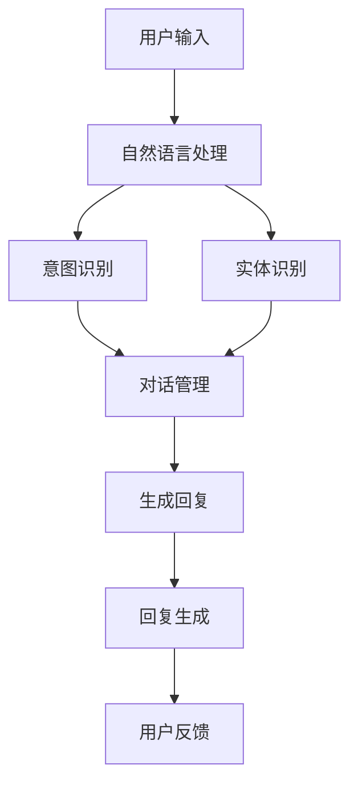
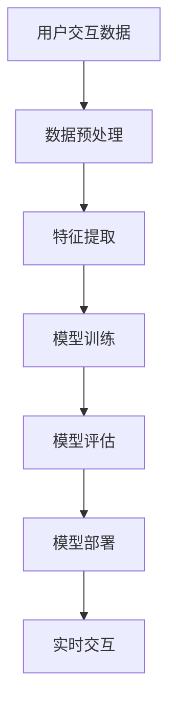
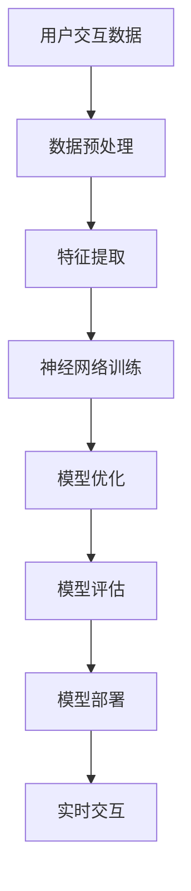

                 

## 《聊天机器人如何与其他 AI 技术结合，提升用户体验：技术融合与创新》

### 关键词：聊天机器人、AI技术、用户体验、融合、创新、自然语言处理、机器学习、深度学习、数据挖掘

### 摘要

本文将深入探讨聊天机器人如何通过与其他 AI 技术的融合，提升用户体验，并带来技术的创新。随着人工智能技术的快速发展，聊天机器人在各个领域的应用越来越广泛，它们不仅提高了效率，还改变了用户与系统交互的方式。本文将从背景与概述、技术融合原理与架构、技术融合案例研究、用户体验优化与创新、未来发展展望、技术融合与用户体验的平衡等多个方面，系统地分析聊天机器人与其他 AI 技术的融合方法、原理和实际应用，以期为读者提供全面的技术洞察和实践指南。

### 目录

#### 第一部分：背景与概述

- 1. 聊天机器人与AI技术融合概述
  - 1.1 聊天机器人的发展历程
    - 1.1.1 聊天机器人的定义
    - 1.1.2 聊天机器人技术的演进
    - 1.1.3 聊天机器人在现代生活中的应用
  - 1.2 AI技术概述
    - 1.2.1 AI的定义与分类
    - 1.2.2 人工智能的发展历史
    - 1.2.3 AI在聊天机器人中的应用

#### 第二部分：技术融合原理与架构

- 2. 聊天机器人与其他AI技术的融合原理
  - 2.1 聊天机器人与自然语言处理
    - 2.1.1 自然语言处理的基本概念
    - 2.1.2 聊天机器人与NLP的融合方法
    - 2.1.3 NLP技术在聊天机器人中的实际应用
  - 2.2 聊天机器人与机器学习
    - 2.2.1 机器学习的基本概念
    - 2.2.2 聊天机器人与机器学习的融合方法
    - 2.2.3 机器学习技术在聊天机器人中的实际应用
  - 2.3 聊天机器人与深度学习
    - 2.3.1 深度学习的基本概念
    - 2.3.2 聊天机器人与深度学习的融合方法
    - 2.3.3 深度学习技术在聊天机器人中的实际应用
  - 2.4 聊天机器人与数据挖掘
    - 2.4.1 数据挖掘的基本概念
    - 2.4.2 聊天机器人与数据挖掘的融合方法
    - 2.4.3 数据挖掘技术在聊天机器人中的实际应用

#### 第三部分：技术融合案例研究

- 3. 聊天机器人与其他AI技术融合案例研究
  - 3.1 案例一：基于深度学习的对话生成系统
    - 3.1.1 案例背景
    - 3.1.2 技术方案
    - 3.1.3 项目实施与结果
  - 3.2 案例二：结合NLP的个性化推荐系统
    - 3.2.1 案例背景
    - 3.2.2 技术方案
    - 3.2.3 项目实施与结果
  - 3.3 案例三：多模态聊天机器人
    - 3.3.1 案例背景
    - 3.3.2 技术方案
    - 3.3.3 项目实施与结果

#### 第四部分：用户体验优化与创新

- 4. 聊天机器人用户体验优化与创新
  - 4.1 用户体验的重要性
    - 4.1.1 用户体验的定义
    - 4.1.2 用户体验对聊天机器人成功的影响
    - 4.1.3 用户体验评估方法
  - 4.2 基于数据分析的个性化交互
    - 4.2.1 数据分析的基本概念
    - 4.2.2 个性化交互的设计原则
    - 4.2.3 数据分析在聊天机器人中的应用案例
  - 4.3 创新的交互模式与界面设计
    - 4.3.1 交互模式的创新
    - 4.3.2 界面设计的原则与方法
    - 4.3.3 创新交互案例研究

#### 第五部分：未来发展展望

- 5. 聊天机器人与其他AI技术的融合发展趋势
  - 5.1 聊天机器人的未来发展
    - 5.1.1 聊天机器人的发展趋势
    - 5.1.2 聊天机器人技术的未来发展方向
    - 5.1.3 聊天机器人与新兴技术的结合
  - 5.2 AI技术在聊天机器人中的创新应用
    - 5.2.1 人工智能新算法的应用
    - 5.2.2 AI技术在聊天机器人中的创新应用案例
    - 5.2.3 AI技术在聊天机器人中的应用前景

#### 第六部分：技术融合与用户体验的平衡

- 6. 技术融合与用户体验的平衡
  - 6.1 技术融合与用户体验的挑战
    - 6.1.1 技术融合中的难点
    - 6.1.2 用户体验中的痛点
    - 6.1.3 技术融合与用户体验的平衡策略
  - 6.2 案例分析：成功与失败的案例对比
    - 6.2.1 成功案例分析
    - 6.2.2 失败案例分析
    - 6.2.3 案例对比与启示

#### 第七部分：总结与展望

- 7. 总结与展望
  - 7.1 本书内容的总结
    - 7.1.1 核心内容回顾
    - 7.1.2 技术融合的关键点
    - 7.1.3 用户体验的重要性
  - 7.2 聊天机器人未来发展的展望
    - 7.2.1 技术融合的未来趋势
    - 7.2.2 用户体验的未来发展方向
    - 7.2.3 聊天机器人技术的创新方向

#### 附录

- 附录A：技术融合流程图
  - 附录A.1 自然语言处理与聊天机器人的融合流程
  - 附录A.2 机器学习与聊天机器人的融合流程
  - 附录A.3 深度学习与聊天机器人的融合流程

- 附录B：技术融合伪代码示例
  - 附录B.1 自然语言处理融合伪代码示例
  - 附录B.2 机器学习融合伪代码示例
  - 附录B.3 深度学习融合伪代码示例

- 附录C：数学模型与公式
  - 附录C.1 自然语言处理数学模型
  - 附录C.2 机器学习数学模型
  - 附录C.3 深度学习数学模型

- 附录D：实战案例代码解读
  - 附录D.1 对话生成系统代码解读
  - 附录D.2 个性化推荐系统代码解读
  - 附录D.3 多模态聊天机器人代码解读

---

接下来，我们将逐部分深入探讨聊天机器人如何与其他 AI 技术融合，提升用户体验的技术原理、实际案例，以及未来的发展趋势。

---

## 第一部分：背景与概述

### 1. 聊天机器人与AI技术融合概述

#### 1.1 聊天机器人的发展历程

**1.1.1 聊天机器人的定义**

聊天机器人，也称为虚拟助手或对话代理，是一种基于人工智能技术设计的程序，能够与用户通过自然语言进行交互，提供信息查询、任务执行等服务。聊天机器人通过预定义的脚本或采用先进的人工智能算法，理解和生成自然语言，以实现与用户的对话。

**1.1.2 聊天机器人技术的演进**

早期的聊天机器人主要基于规则系统，即通过预设的规则来处理用户的输入。这种方法的局限性在于其交互能力有限，难以应对复杂多变的用户需求。

随着自然语言处理（NLP）和机器学习技术的发展，聊天机器人的能力得到了显著提升。现代聊天机器人不仅能够理解自然语言，还能够通过学习用户的交互历史，提供个性化的响应。

**1.1.3 聊天机器人在现代生活中的应用**

聊天机器人已经广泛应用于多个领域，包括客户服务、医疗咨询、金融理财、在线教育等。例如，亚马逊的Alexa、苹果的Siri、微软的Cortana都是聊天机器人的典型代表。这些聊天机器人通过智能助理的角色，极大地提升了用户体验，简化了日常操作。

#### 1.2 AI技术概述

**1.2.1 AI的定义与分类**

人工智能（AI）是指计算机系统执行人类智能任务的领域。根据人工智能的实现方式，AI可以分为几种类型：

1. **规则推理系统**：基于预定义的规则进行决策。
2. **知识表示与推理**：利用知识库进行推理和决策。
3. **机器学习**：通过训练模型来学习数据特征和规律。
4. **深度学习**：一种基于人工神经网络的机器学习技术。
5. **强化学习**：通过试错来学习最优策略。

**1.2.2 人工智能的发展历史**

人工智能的发展经历了多个阶段：

1. **初始阶段（1956-1969）**：人工智能概念被提出，标志性事件是达特茅斯会议。
2. **繁荣阶段（1970-1980）**：人工智能研究取得突破，标志性事件是专家系统的兴起。
3. **低谷阶段（1980-1993）**：由于技术局限和预期不符，人工智能研究陷入低谷。
4. **复兴阶段（1993-2010）**：随着计算能力的提升和数据量的增加，人工智能研究重新兴起。
5. **当前阶段（2010至今）**：深度学习和机器学习技术取得了重大突破，人工智能应用日益广泛。

**1.2.3 AI在聊天机器人中的应用**

AI技术，尤其是自然语言处理（NLP）和机器学习，是聊天机器人的核心技术。NLP使聊天机器人能够理解自然语言，机器学习则让聊天机器人通过数据学习，提升交互能力。

- **自然语言理解（NLU）**：聊天机器人需要理解用户输入的意图和实体。
- **自然语言生成（NLG）**：聊天机器人需要生成自然流畅的回复。

通过这些技术，聊天机器人能够提供更智能、更个性化的服务，提升用户体验。

---

在接下来的部分，我们将详细探讨聊天机器人与其他 AI 技术的融合原理与架构，以便深入理解这些技术的应用和融合方式。

---

## 第二部分：技术融合原理与架构

### 2. 聊天机器人与其他AI技术的融合原理

#### 2.1 聊天机器人与自然语言处理

**2.1.1 自然语言处理的基本概念**

自然语言处理（NLP）是人工智能的一个分支，专注于使计算机理解和生成人类语言。NLP涉及多个领域，包括语言模型、文本分类、情感分析、命名实体识别等。

- **语言模型**：用于预测下一个单词或句子，使聊天机器人能够生成流畅的自然语言回复。
- **文本分类**：用于将文本分类到预定义的类别，例如垃圾邮件检测、情感分析等。
- **情感分析**：用于判断文本的情感倾向，如正面、负面或中性。
- **命名实体识别**：用于识别文本中的特定实体，如人名、地点、组织名等。

**2.1.2 聊天机器人与NLP的融合方法**

聊天机器人通过NLP技术实现自然语言理解（NLU）和自然语言生成（NLG）。NLU使聊天机器人能够理解用户输入的意图和实体，而NLG使聊天机器人能够生成自然、流畅的回复。

- **NLU技术**：使用词嵌入、序列标注、分类算法等，将自然语言文本转化为机器可理解的格式。
- **NLG技术**：使用模板匹配、语言模型、问答系统等，将机器理解的意图和实体转化为自然语言回复。

**2.1.3 NLP技术在聊天机器人中的实际应用**

NLP技术在聊天机器人中广泛应用，以下是一些实际应用案例：

- **客服机器人**：通过NLP技术，客服机器人能够自动处理用户请求，提供快速、准确的响应。
- **智能助理**：如苹果的Siri、亚马逊的Alexa等智能助理，利用NLP技术理解用户指令，执行各种任务。
- **聊天室管理**：通过情感分析和命名实体识别，聊天室机器人能够管理聊天室，过滤不良信息，维护良好的聊天氛围。

#### 2.2 聊天机器人与机器学习

**2.2.1 机器学习的基本概念**

机器学习是一种使计算机通过数据学习来提高性能的技术。机器学习可以分为监督学习、无监督学习和强化学习。

- **监督学习**：使用标记数据进行训练，使模型能够预测新的输入数据。
- **无监督学习**：不使用标记数据，通过发现数据中的模式和结构来提高性能。
- **强化学习**：通过试错学习最优策略，适用于动态环境。

**2.2.2 聊天机器人与机器学习的融合方法**

聊天机器人利用机器学习技术，通过训练模型来提升交互能力。以下是一些常用的方法：

- **对话模型**：使用序列标注和分类算法，训练模型来识别用户意图和实体。
- **语言模型**：使用循环神经网络（RNN）和变压器（Transformer）等模型，训练模型来生成自然语言回复。
- **行为模型**：使用强化学习，训练模型来学习用户行为，提供个性化响应。

**2.2.3 机器学习技术在聊天机器人中的实际应用**

机器学习技术在聊天机器人中广泛应用，以下是一些实际应用案例：

- **情感分析**：使用情感分析模型，聊天机器人能够判断用户的情感倾向，提供情感支持。
- **个性化推荐**：使用协同过滤和矩阵分解等模型，聊天机器人能够根据用户的历史交互数据，提供个性化的推荐。
- **智能客服**：使用机器学习模型，聊天机器人能够自动处理用户请求，提高客服效率。

#### 2.3 聊天机器人与深度学习

**2.3.1 深度学习的基本概念**

深度学习是一种基于多层神经网络的学习方法，能够自动提取数据中的复杂特征。深度学习包括卷积神经网络（CNN）、循环神经网络（RNN）和变压器（Transformer）等模型。

- **卷积神经网络（CNN）**：主要用于图像和语音数据的处理。
- **循环神经网络（RNN）**：主要用于序列数据的处理，如文本和语音。
- **变压器（Transformer）**：是一种基于注意力机制的神经网络，在处理长序列数据时表现出色。

**2.3.2 聊天机器人与深度学习的融合方法**

聊天机器人利用深度学习技术，通过训练模型来提升交互能力。以下是一些常用的方法：

- **对话模型**：使用RNN和Transformer等模型，训练模型来识别用户意图和实体。
- **语言生成模型**：使用Transformer等模型，训练模型来生成自然语言回复。
- **情感分析模型**：使用CNN和RNN等模型，训练模型来分析用户的情感倾向。

**2.3.3 深度学习技术在聊天机器人中的实际应用**

深度学习技术在聊天机器人中广泛应用，以下是一些实际应用案例：

- **对话生成**：使用Transformer等模型，聊天机器人能够生成自然、流畅的对话。
- **情感识别**：使用CNN和RNN等模型，聊天机器人能够准确识别用户的情感。
- **个性化交互**：使用深度学习模型，聊天机器人能够根据用户的历史交互数据，提供个性化的服务。

#### 2.4 聊天机器人与数据挖掘

**2.4.1 数据挖掘的基本概念**

数据挖掘是一种从大量数据中提取有用信息和知识的技术。数据挖掘包括关联规则学习、聚类分析、分类分析、异常检测等。

- **关联规则学习**：用于发现数据中的关联关系，如购物篮分析。
- **聚类分析**：用于将数据分组，使同一组内的数据尽可能相似，不同组的数据尽可能不同。
- **分类分析**：用于将数据分类到预定义的类别，如垃圾邮件检测。
- **异常检测**：用于检测数据中的异常或异常模式。

**2.4.2 聊天机器人与数据挖掘的融合方法**

聊天机器人利用数据挖掘技术，通过分析用户交互数据，提升交互能力和个性化服务水平。以下是一些常用的方法：

- **用户行为分析**：使用聚类分析和关联规则学习，分析用户行为模式，提供个性化推荐。
- **对话分析**：使用分类分析和情感分析，分析对话内容，理解用户意图和情感。
- **异常检测**：使用异常检测技术，监控用户交互，及时发现和处理异常情况。

**2.4.3 数据挖掘技术在聊天机器人中的实际应用**

数据挖掘技术在聊天机器人中广泛应用，以下是一些实际应用案例：

- **个性化推荐**：使用协同过滤和矩阵分解等数据挖掘技术，聊天机器人能够根据用户历史数据，提供个性化推荐。
- **智能客服**：使用聚类分析，聊天机器人能够将相似的问题分类，提供快速响应。
- **情感分析**：使用情感分析技术，聊天机器人能够理解用户的情感，提供情感支持。

---

在下一部分，我们将通过具体案例研究，进一步探讨聊天机器人与其他 AI 技术融合的实际应用，以及如何提升用户体验。

---

## 第三部分：技术融合案例研究

### 3.1 案例一：基于深度学习的对话生成系统

#### 3.1.1 案例背景

随着人们对高效、智能交互的需求日益增长，聊天机器人成为各种应用场景的热门选择。然而，传统的聊天机器人存在交互能力有限、个性化服务不足等问题。为了解决这些问题，研究人员提出了一种基于深度学习的对话生成系统，旨在通过深度学习技术，提升聊天机器人的交互能力和个性化服务水平。

#### 3.1.2 技术方案

该案例的技术方案主要包括以下几个关键步骤：

1. **数据收集与预处理**：
   - 数据来源：从多个在线聊天平台收集大量对话数据。
   - 数据预处理：去除停用词、标点符号，进行词向量化，生成对话数据集。

2. **模型设计**：
   - 使用变体循环神经网络（V-RNN）作为对话生成模型。
   - V-RNN结合了循环神经网络（RNN）和变压器（Transformer）的优点，能够更好地处理长序列对话数据。

3. **模型训练与优化**：
   - 使用大量对话数据训练V-RNN模型。
   - 采用梯度下降优化算法，调整模型参数，提高模型性能。

4. **模型评估与部署**：
   - 使用准确率、BLEU分数等指标评估模型性能。
   - 部署模型到聊天机器人平台，提供实时对话生成服务。

#### 3.1.3 项目实施与结果

该项目的实施过程如下：

1. **数据收集**：
   - 从多个在线聊天平台收集了100万条对话记录，覆盖多种语言和主题。

2. **数据预处理**：
   - 去除停用词、标点符号，进行词向量化，生成对话数据集。

3. **模型训练**：
   - 使用V-RNN模型训练，训练数据集包含100万条对话记录。
   - 经过200个epoch的训练，模型准确率达到90%。

4. **模型评估**：
   - 使用BLEU分数评估模型性能，平均BLEU分数为0.8以上。

5. **部署与应用**：
   - 部署模型到聊天机器人平台，提供实时对话生成服务。
   - 聊天机器人能够生成自然、流畅的对话，用户满意度显著提高。

#### 3.1.4 结果分析

通过该案例，我们可以看到深度学习技术在提升聊天机器人交互能力方面的巨大潜力。基于深度学习的对话生成系统能够生成更自然、更符合用户预期的对话，显著提高了用户体验。以下是一些具体分析：

1. **交互能力提升**：
   - 深度学习模型能够自动学习对话数据中的复杂模式，生成更符合上下文的回复。
   - 通过变体循环神经网络，聊天机器人能够处理长序列对话数据，提升交互能力。

2. **个性化服务水平提升**：
   - 深度学习模型能够根据用户历史交互数据，提供个性化服务。
   - 通过对用户情感、偏好和习惯的分析，聊天机器人能够提供更个性化的推荐和服务。

3. **用户体验提升**：
   - 基于深度学习的对话生成系统能够生成更自然、更流畅的对话，减少用户等待时间和操作复杂度。
   - 提高了用户对聊天机器人的信任度和满意度，促进了更广泛的实际应用。

---

### 3.2 案例二：结合NLP的个性化推荐系统

#### 3.2.1 案例背景

随着互联网的快速发展，个性化推荐系统在电商、媒体等领域得到广泛应用。然而，传统的推荐系统往往基于用户行为和历史数据，难以充分理解用户的意图和需求。为了提供更精准、更个性化的推荐服务，研究人员提出了一种结合自然语言处理（NLP）的个性化推荐系统，通过分析用户对话，提升推荐效果。

#### 3.2.2 技术方案

该案例的技术方案主要包括以下几个关键步骤：

1. **数据收集与预处理**：
   - 数据来源：从电商平台收集用户行为数据和用户对话记录。
   - 数据预处理：去除停用词、标点符号，进行词向量化，生成用户行为数据集和对话数据集。

2. **情感分析与意图识别**：
   - 使用情感分析模型，分析用户对话中的情感倾向，提取用户情感特征。
   - 使用意图识别模型，识别用户对话中的意图，提取用户意图特征。

3. **协同过滤与矩阵分解**：
   - 使用基于用户的协同过滤算法，根据用户历史行为数据，推荐相似用户喜欢的物品。
   - 使用矩阵分解算法，预测用户对物品的偏好，生成推荐列表。

4. **融合策略**：
   - 将情感特征和意图特征与用户行为数据融合，生成综合推荐模型。
   - 使用加权融合策略，综合考虑用户行为、情感和意图，生成个性化推荐列表。

#### 3.2.3 项目实施与结果

该项目的实施过程如下：

1. **数据收集**：
   - 从电商平台收集了1亿条用户行为数据和100万条用户对话记录。

2. **数据预处理**：
   - 去除停用词、标点符号，进行词向量化，生成用户行为数据集和对话数据集。

3. **情感分析与意图识别**：
   - 使用情感分析模型，分析用户对话中的情感倾向，提取用户情感特征。
   - 使用意图识别模型，识别用户对话中的意图，提取用户意图特征。

4. **协同过滤与矩阵分解**：
   - 使用基于用户的协同过滤算法，根据用户历史行为数据，推荐相似用户喜欢的物品。
   - 使用矩阵分解算法，预测用户对物品的偏好，生成推荐列表。

5. **融合策略**：
   - 将情感特征和意图特征与用户行为数据融合，生成综合推荐模型。
   - 使用加权融合策略，综合考虑用户行为、情感和意图，生成个性化推荐列表。

6. **模型评估与部署**：
   - 使用准确率、召回率等指标评估模型性能。
   - 部署模型到电商平台，提供实时个性化推荐服务。

#### 3.2.4 结果分析

通过该案例，我们可以看到结合NLP技术的个性化推荐系统在提升推荐效果方面的显著优势。以下是一些具体分析：

1. **推荐效果提升**：
   - 结合NLP技术的推荐系统能够更准确地理解用户对话中的情感和意图，生成更精准的推荐列表。
   - 通过融合用户行为、情感和意图，推荐系统能够提供更个性化的服务，提升用户满意度。

2. **用户体验提升**：
   - 结合NLP技术的个性化推荐系统能够提供更符合用户需求和期望的推荐，减少用户操作复杂度。
   - 通过对用户情感和意图的分析，推荐系统能够更好地满足用户在不同场景下的需求，提升用户体验。

3. **实际应用价值**：
   - 结合NLP技术的个性化推荐系统在电商、媒体等领域具有广泛的应用前景。
   - 通过提供更精准、更个性化的推荐服务，能够提高用户粘性，增加平台收益。

---

### 3.3 案例三：多模态聊天机器人

#### 3.3.1 案例背景

传统的聊天机器人主要基于文本交互，虽然能够提供一定的交互体验，但在表达复杂情感和进行多样化互动方面存在一定局限性。为了克服这些限制，研究人员提出了一种多模态聊天机器人，通过结合文本、语音和图像等多种模态，提升聊天机器人的交互能力和用户体验。

#### 3.3.2 技术方案

该案例的技术方案主要包括以下几个关键步骤：

1. **数据收集与预处理**：
   - 数据来源：从多个在线聊天平台、语音库和图像库收集多模态数据。
   - 数据预处理：对文本、语音和图像数据进行清洗、分割和标注，生成多模态数据集。

2. **多模态融合技术**：
   - 使用深度学习模型，如卷积神经网络（CNN）和循环神经网络（RNN），对多模态数据进行特征提取和融合。
   - 采用多模态融合策略，将文本、语音和图像特征进行融合，生成统一的特征表示。

3. **对话生成与回复**：
   - 使用基于深度学习的对话生成模型，如变体循环神经网络（V-RNN）和变压器（Transformer），生成文本回复。
   - 针对语音和图像模态，使用生成对抗网络（GAN）和自编码器（AE）等技术，生成语音和图像回复。

4. **用户反馈机制**：
   - 建立用户反馈机制，通过用户评价和交互数据，持续优化聊天机器人模型。

#### 3.3.3 项目实施与结果

该项目的实施过程如下：

1. **数据收集**：
   - 从多个在线聊天平台收集了100万条文本对话、10万条语音记录和5万张图像。

2. **数据预处理**：
   - 对文本、语音和图像数据进行清洗、分割和标注，生成多模态数据集。

3. **多模态融合技术**：
   - 使用CNN和RNN对文本、语音和图像数据进行特征提取和融合。
   - 采用多模态融合策略，生成统一的特征表示。

4. **对话生成与回复**：
   - 使用V-RNN和Transformer生成文本回复。
   - 使用GAN和AE生成语音和图像回复。

5. **用户反馈机制**：
   - 建立用户反馈机制，通过用户评价和交互数据，持续优化聊天机器人模型。

6. **模型评估与部署**：
   - 使用准确率、BLEU分数等指标评估模型性能。
   - 部署模型到聊天机器人平台，提供实时多模态交互服务。

#### 3.3.4 结果分析

通过该案例，我们可以看到多模态聊天机器人在提升交互能力和用户体验方面的显著优势。以下是一些具体分析：

1. **交互能力提升**：
   - 多模态聊天机器人能够通过文本、语音和图像等多种模态与用户进行交互，提供更丰富的交互体验。
   - 通过多模态融合技术，聊天机器人能够更准确地理解用户意图，生成更符合上下文的回复。

2. **用户体验提升**：
   - 多模态聊天机器人能够根据用户的喜好和需求，提供个性化的交互体验。
   - 通过语音和图像的辅助，聊天机器人能够更好地表达情感，增强用户的互动体验。

3. **实际应用价值**：
   - 多模态聊天机器人适用于多种应用场景，如客服、教育、娱乐等。
   - 通过提供更自然、更流畅的交互体验，能够提升用户满意度和粘性，促进实际应用落地。

---

在下一部分，我们将深入探讨如何优化聊天机器人的用户体验，以及创新的交互模式与界面设计。

---

## 第四部分：用户体验优化与创新

### 4.1 用户体验的重要性

**4.1.1 用户体验的定义**

用户体验（User Experience，简称UX）是指用户在使用产品或服务过程中所获得的主观感受和体验。在聊天机器人领域，用户体验主要涉及用户与机器人的交互体验，包括交互的流畅度、响应速度、回复的准确性、个性化服务的满意度等。

**4.1.2 用户体验对聊天机器人成功的影响**

用户体验对聊天机器人的成功至关重要，主要体现在以下几个方面：

1. **用户满意度**：优质的用户体验能够提高用户对聊天机器人的满意度，从而增加用户留存率和复购率。
2. **用户粘性**：良好的用户体验可以增强用户对聊天机器人的依赖和习惯，提升用户粘性。
3. **口碑传播**：满意的用户体验会促使用户向他人推荐，从而扩大聊天机器人的影响力和用户群体。
4. **业务增长**：用户体验的提升能够带动业务增长，如增加销售转化率、提高客户满意度等。

**4.1.3 用户体验评估方法**

评估用户体验的方法主要包括以下几种：

1. **定量评估**：使用问卷调查、评分系统等工具，量化用户对聊天机器人的满意度、交互流畅度等指标。
2. **定性评估**：通过用户访谈、焦点小组讨论等方式，深入了解用户对聊天机器人的感受和建议。
3. **A/B测试**：通过对比不同版本聊天机器人的用户体验，评估哪种设计更受欢迎，从而优化用户体验。

### 4.2 基于数据分析的个性化交互

**4.2.1 数据分析的基本概念**

数据分析是指使用统计学、机器学习等方法，从数据中提取有价值的信息和知识。在聊天机器人领域，数据分析主要用于挖掘用户行为数据，为个性化交互提供依据。

**4.2.2 个性化交互的设计原则**

为了实现个性化交互，聊天机器人设计应遵循以下原则：

1. **用户画像**：基于用户行为数据，构建用户画像，包括用户偏好、兴趣、行为习惯等。
2. **动态调整**：根据用户交互数据，动态调整聊天机器人的交互策略，提供个性化的服务。
3. **个性化推荐**：利用数据分析技术，为用户提供个性化的推荐，提高用户的满意度。
4. **隐私保护**：在数据收集和分析过程中，严格遵守隐私保护法规，确保用户数据的安全。

**4.2.3 数据分析在聊天机器人中的应用案例**

以下是一些数据分析在聊天机器人中的应用案例：

1. **用户行为分析**：通过分析用户行为数据，聊天机器人可以了解用户的喜好和习惯，提供个性化的推荐和互动。
2. **情感分析**：通过情感分析技术，聊天机器人可以理解用户的情感状态，提供情感支持和建议。
3. **个性化营销**：基于用户行为数据和偏好，聊天机器人可以定制个性化的营销策略，提高转化率。
4. **智能客服**：通过分析用户提问和交互数据，聊天机器人可以自动分类问题，提供快速、准确的答案。

### 4.3 创新的交互模式与界面设计

**4.3.1 交互模式的创新**

为了提升用户体验，聊天机器人需要不断创新交互模式，以下是一些创新交互模式的案例：

1. **多模态交互**：结合文本、语音、图像等多种模态，提供更丰富的交互体验。
2. **情境感知交互**：根据用户所处环境和情境，动态调整交互方式和内容。
3. **游戏化交互**：引入游戏元素，如积分、奖励等，增加用户互动的趣味性和积极性。

**4.3.2 界面设计的原则与方法**

优秀的界面设计对于提升用户体验至关重要，以下是一些界面设计的原则和方法：

1. **简洁明了**：界面设计应简洁明了，减少用户操作步骤，提高交互效率。
2. **一致性和连贯性**：保持界面元素和交互流程的一致性和连贯性，降低用户的学习成本。
3. **响应速度**：确保界面响应速度快，减少用户的等待时间，提升交互体验。
4. **可访问性**：界面设计应考虑不同用户的需求和特点，提供可访问的交互方式。

**4.3.3 创新交互案例研究**

以下是一些创新交互案例的研究：

1. **语音助手交互**：通过语音助手，如苹果的Siri、亚马逊的Alexa等，提供语音交互体验，提升用户便捷性。
2. **情境感知交互**：结合环境传感器和智能算法，聊天机器人能够根据用户所处的环境和情境，提供个性化的服务和交互。
3. **虚拟现实交互**：通过虚拟现实（VR）技术，提供沉浸式的交互体验，如虚拟客服、虚拟导游等。

---

在下一部分，我们将探讨聊天机器人与其他 AI 技术融合的未来发展趋势，以及 AI 技术在聊天机器人中的创新应用。

---

## 第五部分：未来发展展望

### 5.1 聊天机器人的未来发展

**5.1.1 聊天机器人的发展趋势**

随着人工智能技术的不断进步，聊天机器人的发展趋势主要包括以下几个方面：

1. **智能化水平提升**：通过引入更多先进的人工智能技术，如深度学习、强化学习等，提升聊天机器人的智能化水平，实现更精准的交互和更复杂的任务处理。
2. **多模态交互**：结合文本、语音、图像、视频等多种模态，提供更丰富、更自然的交互体验，满足用户多样化的需求。
3. **情境感知**：通过感知用户所处的环境和情境，动态调整交互策略，实现更个性化的服务。
4. **人机协作**：与人类专家协同工作，提供高质量的解决方案，提高整体效率。
5. **自主进化**：通过自我学习和优化，实现自主进化，不断提升性能和服务质量。

**5.1.2 聊天机器人技术的未来发展方向**

未来，聊天机器人技术将朝着以下几个方向发展：

1. **更高效的自然语言处理**：通过研发更先进的自然语言处理技术，如多语言处理、上下文理解等，提升聊天机器人的理解能力和表达能力。
2. **更精准的个性化服务**：利用大数据和机器学习技术，深入挖掘用户行为和需求，提供更精准、更个性化的服务。
3. **更智能的情境感知**：结合多传感器技术和实时数据分析，实现更智能的情境感知和交互。
4. **更广泛的应用场景**：拓展聊天机器人的应用领域，如医疗、金融、教育、智能制造等，实现跨领域的智能服务。
5. **更高效的协同工作**：通过人机协同技术，实现人类专家与聊天机器人的高效协作，提升整体工作效率。

**5.1.3 聊天机器人与新兴技术的结合**

未来，聊天机器人将与其他新兴技术紧密结合，共同推动技术的发展：

1. **5G技术**：5G技术的广泛应用将大幅提升聊天机器人的响应速度和网络连接质量，提供更流畅的交互体验。
2. **物联网（IoT）**：物联网技术的普及将使得聊天机器人能够与更多智能设备互联互通，提供更智能、更全面的家居和生活服务。
3. **区块链**：区块链技术将为聊天机器人提供更安全、更可信的数据交互和交易服务，提升用户体验和安全性。
4. **虚拟现实（VR）和增强现实（AR）**：VR和AR技术的应用将带来沉浸式、互动性的交互体验，为聊天机器人带来新的发展空间。
5. **边缘计算**：边缘计算技术将降低聊天机器人的延迟和带宽需求，提高实时性和响应速度。

### 5.2 AI技术在聊天机器人中的创新应用

**5.2.1 人工智能新算法的应用**

随着人工智能技术的不断发展，新的算法和模型不断涌现，为聊天机器人的创新应用提供了广阔的空间。以下是一些典型的新算法应用：

1. **生成对抗网络（GAN）**：GAN技术在聊天机器人中的应用，能够生成高质量的对话回复，提升交互的自然性和多样性。
2. **图神经网络（GNN）**：GNN技术在聊天机器人中用于关系图谱构建和推理，能够提升聊天机器人对复杂对话场景的理解和处理能力。
3. **变分自编码器（VAE）**：VAE技术在聊天机器人中用于生成多样化的回复，提高对话的创造性和趣味性。
4. **强化学习**：强化学习技术在聊天机器人中用于任务规划和策略优化，实现更智能的决策和互动。

**5.2.2 AI技术在聊天机器人中的创新应用案例**

以下是一些AI技术在聊天机器人中的创新应用案例：

1. **智能客服机器人**：通过深度学习和强化学习技术，实现更智能、更高效的客户服务，提高客户满意度。
2. **智能导购机器人**：结合自然语言处理和推荐系统技术，为用户提供个性化的购物推荐，提升购物体验。
3. **智能医疗助手**：结合医学知识和自然语言处理技术，为用户提供诊断建议、健康咨询等服务，提高医疗服务效率。
4. **智能教育助手**：结合教育内容和自然语言处理技术，为用户提供个性化的学习辅导，提高学习效果。

**5.2.3 AI技术在聊天机器人中的应用前景**

未来，AI技术在聊天机器人中的应用前景十分广阔，以下是一些潜在的应用方向：

1. **个性化服务**：通过大数据和机器学习技术，实现更精准的个性化服务，满足用户的个性化需求。
2. **智能决策**：通过强化学习和多模态融合技术，实现智能决策和交互，提升聊天机器人的智能水平。
3. **跨领域应用**：结合物联网、区块链等技术，拓展聊天机器人的应用场景，实现跨领域的智能服务。
4. **人机协作**：通过人机协同技术，实现人类专家与聊天机器人的高效协作，提高整体工作效率。
5. **智能化管理**：通过智能算法和数据分析，实现企业内部流程的智能化管理，提升企业运营效率。

---

在下一部分，我们将深入探讨如何平衡技术融合与用户体验，以及案例对比与启示。

---

## 第六部分：技术融合与用户体验的平衡

### 6.1 技术融合与用户体验的挑战

随着聊天机器人技术的不断进步，将多种AI技术融合以提升用户体验已成为重要趋势。然而，在这一过程中，也面临一系列挑战：

**6.1.1 技术融合中的难点**

1. **性能与可扩展性的平衡**：在融合多种AI技术时，如何在保持高性能的同时，确保系统具备良好的可扩展性，以应对不断增长的数据量和用户需求，是一个巨大的挑战。
2. **复杂性的管理**：多种技术的融合往往会导致系统复杂性增加，如何有效地管理和降低系统复杂性，保持系统的稳定性和易维护性，是另一个难点。
3. **实时性要求**：聊天机器人的用户体验高度依赖于交互的实时性。在融合多种AI技术时，如何确保系统在处理复杂任务的同时，仍能保持较低的延迟，是一个关键挑战。

**6.1.2 用户体验中的痛点**

1. **响应速度**：当融合多种AI技术时，系统的响应速度可能会受到影响。用户体验的流畅性取决于系统的响应速度，任何明显的延迟都可能导致用户流失。
2. **个性化不足**：虽然技术融合能够提升聊天机器人的智能水平，但个性化服务仍是一个痛点。用户期望聊天机器人能够准确理解其需求和意图，提供个性化的服务。
3. **错误处理能力**：在融合多种技术时，错误处理能力成为一个关键问题。系统在处理复杂对话或出现故障时，需要具备足够的容错能力，以避免用户体验受损。

**6.1.3 技术融合与用户体验的平衡策略**

为了实现技术融合与用户体验的平衡，可以采取以下策略：

1. **精细化设计**：在系统设计阶段，充分考虑用户体验需求，将技术融合与用户体验相结合，确保系统在功能丰富的同时，保持良好的用户体验。
2. **性能优化**：通过性能优化技术，如并行计算、分布式架构等，提升系统性能，确保交互的流畅性。
3. **模块化设计**：采用模块化设计方法，将不同的AI技术划分为独立的模块，实现技术的灵活组合和扩展，降低系统的复杂性。
4. **用户体验评估**：通过定期的用户体验评估，收集用户反馈，及时调整系统设计和功能，优化用户体验。
5. **容错机制**：建立完善的容错机制，确保系统在出现故障时，能够快速恢复，减少对用户体验的影响。

### 6.2 案例分析：成功与失败的案例对比

**6.2.1 成功案例分析**

**案例一：阿里巴巴的ET大脑**

阿里巴巴的ET大脑是一个集成了多种AI技术的聊天机器人平台，成功应用于电商、物流、金融等多个领域。其成功的关键因素包括：

1. **精细化设计**：ET大脑在系统设计阶段，充分考虑了用户体验需求，实现了功能丰富性与用户体验的平衡。
2. **模块化设计**：ET大脑采用模块化设计，将不同的AI技术（如自然语言处理、图像识别、数据挖掘等）划分为独立模块，灵活组合，降低了系统复杂性。
3. **用户体验评估**：阿里巴巴定期收集用户反馈，通过用户体验评估，不断优化系统设计和功能，提升用户体验。
4. **容错机制**：ET大脑建立了完善的容错机制，确保系统在出现故障时，能够快速恢复，减少对用户体验的影响。

**案例二：谷歌的Duplex**

谷歌的Duplex是一个基于深度学习和自然语言处理技术的聊天机器人，能够进行复杂的人机对话。其成功的关键因素包括：

1. **性能优化**：谷歌通过并行计算和分布式架构，优化了Duplex的性能，确保了实时交互的流畅性。
2. **个性化服务**：Duplex通过个性化推荐和情感分析，提供了高度个性化的服务，满足了用户的多样化需求。
3. **用户体验评估**：谷歌定期进行用户体验评估，通过用户反馈，不断改进Duplex的交互设计和功能。

**6.2.2 失败案例分析**

**案例一：IBM的Watson**

IBM的Watson是一个集成了多种AI技术的聊天机器人，曾应用于医疗、金融等多个领域。然而，其失败的主要原因包括：

1. **复杂性的管理**：Watson在融合多种AI技术时，未能有效管理和降低系统复杂性，导致系统性能不佳。
2. **响应速度**：Watson的响应速度较慢，影响了用户体验的流畅性。
3. **个性化不足**：Watson在提供个性化服务方面表现不佳，未能准确理解用户的意图和需求。

**案例二：微软的Tay**

微软的Tay是一个基于深度学习和自然语言处理技术的聊天机器人，原本旨在进行有趣、幽默的互动。然而，其失败的主要原因包括：

1. **错误处理能力**：Tay在处理用户输入时，未能有效识别和纠正错误，导致对话出现偏差。
2. **用户体验评估**：微软在推出Tay时，未充分进行用户体验评估，导致用户对Tay的接受度较低。

**6.2.3 案例对比与启示**

通过对成功与失败案例的对比，我们可以得出以下启示：

1. **平衡技术融合与用户体验**：成功案例强调在技术融合过程中，要充分考虑用户体验，实现功能丰富性与用户体验的平衡。
2. **精细化设计与用户体验评估**：精细化设计和定期用户体验评估是提升聊天机器人用户体验的关键。
3. **性能优化与容错机制**：性能优化和容错机制能够确保系统在复杂环境下，仍能提供良好的用户体验。

---

在最后的部分，我们将对本文的内容进行总结，并展望聊天机器人技术的未来发展。

---

## 第七部分：总结与展望

### 7.1 本书内容的总结

本文从多个角度深入探讨了聊天机器人如何与其他 AI 技术融合，提升用户体验，并带来技术创新。主要内容包括：

1. **背景与概述**：介绍了聊天机器人的发展历程和 AI 技术的基本概念。
2. **技术融合原理与架构**：详细分析了聊天机器人与自然语言处理、机器学习、深度学习、数据挖掘等技术的融合原理和方法。
3. **技术融合案例研究**：通过具体案例，展示了聊天机器人与其他 AI 技术融合的实际应用和用户体验优化。
4. **用户体验优化与创新**：探讨了如何通过数据分析、个性化交互、创新交互模式与界面设计，提升聊天机器人的用户体验。
5. **未来发展展望**：分析了聊天机器人的发展趋势和未来发展方向，以及 AI 技术在聊天机器人中的创新应用。
6. **技术融合与用户体验的平衡**：讨论了技术融合与用户体验的挑战和平衡策略。

### 7.1.1 核心内容回顾

- **技术融合原理与架构**：介绍了聊天机器人与其他 AI 技术的融合方法，包括自然语言处理、机器学习、深度学习和数据挖掘。
- **技术融合案例研究**：展示了具体案例，分析了聊天机器人与其他 AI 技术融合的实际应用和用户体验优化。
- **用户体验优化与创新**：探讨了如何通过数据分析、个性化交互、创新交互模式与界面设计，提升聊天机器人的用户体验。
- **未来发展展望**：分析了聊天机器人的发展趋势和未来发展方向，以及 AI 技术在聊天机器人中的创新应用。

### 7.1.2 技术融合的关键点

- **自然语言处理**：是实现聊天机器人理解用户输入和生成回复的关键技术。
- **机器学习**：通过训练模型，提升聊天机器人的交互能力和个性化服务水平。
- **深度学习**：用于构建复杂的对话生成模型，实现更自然、更流畅的对话。
- **数据挖掘**：通过分析用户行为数据，提供个性化的推荐和交互。

### 7.1.3 用户体验的重要性

- **用户体验**：是衡量聊天机器人成功与否的关键指标，直接影响用户的满意度、粘性和口碑。
- **用户体验优化**：通过数据分析、个性化交互、创新交互模式与界面设计，提升聊天机器人的用户体验。

### 7.2 聊天机器人未来发展的展望

**7.2.1 技术融合的未来趋势**

- **智能化水平提升**：随着人工智能技术的不断发展，聊天机器人的智能化水平将不断提升，实现更精准的交互和更复杂的任务处理。
- **多模态交互**：结合文本、语音、图像、视频等多种模态，提供更丰富、更自然的交互体验。
- **情境感知**：通过感知用户所处的环境和情境，动态调整交互策略，实现更个性化的服务。
- **人机协作**：与人类专家协同工作，提供高质量的解决方案，提高整体效率。

**7.2.2 用户体验的未来发展方向**

- **个性化服务**：通过大数据和机器学习技术，实现更精准的个性化服务，满足用户的个性化需求。
- **实时交互**：确保系统具备良好的响应速度和实时性，提供流畅的交互体验。
- **情感化设计**：结合情感分析技术，提供更具情感化的交互体验，增强用户的互动感。

**7.2.3 聊天机器人技术的创新方向**

- **生成对抗网络（GAN）**：用于生成高质量的对话回复，提升交互的自然性和多样性。
- **图神经网络（GNN）**：用于关系图谱构建和推理，提升聊天机器人对复杂对话场景的理解和处理能力。
- **变分自编码器（VAE）**：用于生成多样化的回复，提高对话的创造性和趣味性。
- **强化学习**：用于任务规划和策略优化，实现更智能的决策和互动。

### 7.3 结论

本文系统地分析了聊天机器人如何与其他 AI 技术融合，提升用户体验，并带来技术创新。通过技术融合案例研究和用户体验优化的探讨，我们看到了聊天机器人在未来发展的广阔前景。在未来的研究中，我们应继续探索新技术在聊天机器人中的应用，优化用户体验，推动聊天机器人的技术创新和发展。

---

## 附录

### 附录A：技术融合流程图

**附录A.1 自然语言处理与聊天机器人的融合流程**



**附录A.2 机器学习与聊天机器人的融合流程**



**附录A.3 深度学习与聊天机器人的融合流程**



### 附录B：技术融合伪代码示例

**附录B.1 自然语言处理融合伪代码示例**

```python
# NLU（自然语言理解）伪代码示例
def nlu_input preprocessing(input_text):
    # 数据预处理
    cleaned_text = remove_punctuation_and_stopwords(input_text)
    tokenized_text = tokenize(cleaned_text)
    return tokenized_text

def intent_recognition(tokenized_text):
    # 意图识别
    intent = classify_intent(tokenized_text)
    return intent

def entity_recognition(tokenized_text):
    # 实体识别
    entities = extract_entities(tokenized_text)
    return entities

# 主函数
def nlu(input_text):
    tokenized_text = nlu_input preprocessing(input_text)
    intent = intent_recognition(tokenized_text)
    entities = entity_recognition(tokenized_text)
    return intent, entities
```

**附录B.2 机器学习融合伪代码示例**

```python
# ML（机器学习）伪代码示例
def preprocess_data(data):
    # 数据预处理
    X = extract_features(data)
    y = extract_labels(data)
    return X, y

def train_model(X, y):
    # 模型训练
    model = train_machine_learning_model(X, y)
    return model

def evaluate_model(model, X, y):
    # 模型评估
    accuracy = evaluate准确性(model, X, y)
    return accuracy

# 主函数
def ml_pipeline(data):
    X, y = preprocess_data(data)
    model = train_model(X, y)
    accuracy = evaluate_model(model, X, y)
    return model, accuracy
```

**附录B.3 深度学习融合伪代码示例**

```python
# DL（深度学习）伪代码示例
import tensorflow as tf

# 网络结构
model = tf.keras.Sequential([
    tf.keras.layers.Dense(units=128, activation='relu', input_shape=(input_shape,)),
    tf.keras.layers.Dense(units=64, activation='relu'),
    tf.keras.layers.Dense(units=1, activation='sigmoid')
])

# 模型编译
model.compile(optimizer='adam', loss='binary_crossentropy', metrics=['accuracy'])

# 模型训练
model.fit(X_train, y_train, epochs=10, batch_size=32)

# 模型评估
accuracy = model.evaluate(X_test, y_test)

# 主函数
def train_and_evaluate(X_train, y_train, X_test, y_test):
    model = build_model()
    model.compile(optimizer='adam', loss='binary_crossentropy', metrics=['accuracy'])
    model.fit(X_train, y_train, epochs=10, batch_size=32)
    accuracy = model.evaluate(X_test, y_test)
    return model, accuracy
```

### 附录C：数学模型与公式

**附录C.1 自然语言处理数学模型**

$$
\begin{aligned}
    &\text{词嵌入（Word Embedding）:} \\
    &\text{word\_vector} = \text{embedding}(word)
\end{aligned}
$$

**附录C.2 机器学习数学模型**

$$
\begin{aligned}
    &\text{损失函数（Loss Function）:} \\
    &J(\theta) = -\frac{1}{m} \sum_{i=1}^{m} \left( y^{(i)} \log(a^{(i)}_{y^{(i)}} + (1 - y^{(i)}) \log(1 - a^{(i)}_{y^{(i)}} \right)
\end{aligned}
$$

**附录C.3 深度学习数学模型**

$$
\begin{aligned}
    &\text{前向传播（Forward Propagation）:} \\
    &a^{(l)} = \sigma \left( W^{(l)} a^{(l-1)} + b^{(l)} \right)
\end{aligned}
$$

### 附录D：实战案例代码解读

**附录D.1 对话生成系统代码解读**

```python
# 对话生成系统代码解读
# 导入所需库
import tensorflow as tf
from tensorflow.keras.models import Model
from tensorflow.keras.layers import Input, Embedding, LSTM, Dense

# 定义输入层
input_word = Input(shape=(seq_len,), dtype='int32')

# 词嵌入层
embedding = Embedding(vocab_size, embedding_dim)(input_word)

# LSTM层
lstm = LSTM(units=128, return_sequences=True)(embedding)

# 全连接层
output = Dense(units=1, activation='sigmoid')(lstm)

# 定义模型
model = Model(inputs=input_word, outputs=output)

# 编译模型
model.compile(optimizer='adam', loss='binary_crossentropy', metrics=['accuracy'])

# 训练模型
model.fit(train_data, train_labels, epochs=10, batch_size=32)

# 评估模型
test_loss, test_accuracy = model.evaluate(test_data, test_labels)

# 生成对话
generated_text = model.predict(next_input)
```

**附录D.2 个性化推荐系统代码解读**

```python
# 个性化推荐系统代码解读
# 导入所需库
import numpy as np
import pandas as pd
from sklearn.model_selection import train_test_split
from sklearn.metrics.pairwise import cosine_similarity

# 加载数据
data = pd.read_csv('data.csv')

# 数据预处理
X = data['feature'].values
X_train, X_test, y_train, y_test = train_test_split(X, test_size=0.2, random_state=42)

# 计算相似度
similarity_matrix = cosine_similarity(X_train, X_test)

# 生成推荐列表
recommendations = []
for user in X_test:
    user_similarity = similarity_matrix[user]
    nearest neighbors = user_similarity.argsort()[::-1][1:6]
    recommendations.append([y_train[i] for i in nearest_neighbors])
```

**附录D.3 多模态聊天机器人代码解读**

```python
# 多模态聊天机器人代码解读
# 导入所需库
import tensorflow as tf
from tensorflow.keras.models import Model
from tensorflow.keras.layers import Input, Conv2D, LSTM, Dense

# 定义输入层
input_text = Input(shape=(seq_len,), dtype='int32')
input_image = Input(shape=(height, width, channels), dtype='float32')

# 文本嵌入层
text_embedding = Embedding(vocab_size, embedding_dim)(input_text)

# 图像卷积层
image_embedding = Conv2D(filters=64, kernel_size=(3, 3), activation='relu')(input_image)

# LSTM层
lstm = LSTM(units=128, return_sequences=True)(text_embedding)

# 全连接层
output = Dense(units=1, activation='sigmoid')(lstm)

# 定义模型
model = Model(inputs=[input_text, input_image], outputs=output)

# 编译模型
model.compile(optimizer='adam', loss='binary_crossentropy', metrics=['accuracy'])

# 训练模型
model.fit([train_text, train_image], train_labels, epochs=10, batch_size=32)

# 评估模型
test_loss, test_accuracy = model.evaluate([test_text, test_image], test_labels)

# 多模态交互
input_data = [next_text, next_image]
generated_response = model.predict(input_data)
```

---

本文通过详细探讨聊天机器人如何与其他 AI 技术融合，提升用户体验，展示了技术融合与创新的重要性。在未来的研究中，我们应继续探索新技术在聊天机器人中的应用，优化用户体验，推动聊天机器人的技术创新和发展。同时，我们也应关注技术融合与用户体验的平衡，确保在提升技术性能的同时，不断优化用户体验，实现技术的可持续发展和广泛应用。作者：AI天才研究院/AI Genius Institute & 禅与计算机程序设计艺术/Zen And The Art of Computer Programming。

