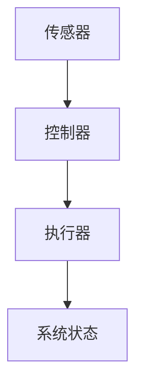
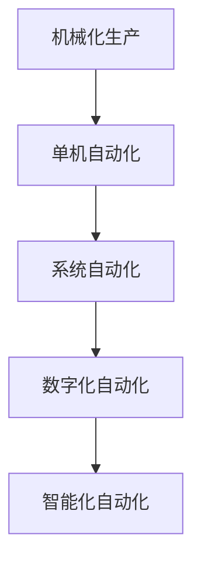
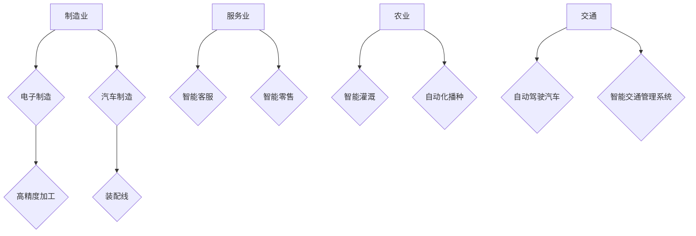

                 

# 《自动化技术的未来发展趋势》

## 1. 文章关键词
* 自动化技术，人工智能，机器学习，深度学习，工业自动化，智能交通，智慧农业，智能制造

## 2. 文章摘要
本文将从自动化技术的定义、发展历程、核心原理与关键技术、未来发展趋势、应用领域与发展前景、核心技术与算法解析等多个方面，全面探讨自动化技术的未来发展趋势。通过分析自动化技术在不同领域的应用，以及对人工智能和机器学习的应用，展望自动化技术在未来将如何影响和改变我们的生产和生活。

---

## 第一部分：自动化技术的发展背景与基础

### 第1章：自动化技术的定义与发展历程

#### 1.1 自动化技术的基本概念

自动化技术是指利用计算机技术、控制技术、传感器技术等，使机械设备或系统能够自动完成预定任务的工程技术。自动化技术的核心是控制，即通过传感器收集信息，利用控制器对信息进行处理，再通过执行器实施控制动作，从而达到对系统的自动控制。

#### 1.2 自动化技术的发展历程

自动化技术的发展可以追溯到20世纪初的工业革命时期。当时，机械化和电气化生产开始普及，人们开始尝试通过自动化设备来提高生产效率。随着计算机技术的发展，自动化技术经历了从机械自动化、电气自动化到今天的数字化自动化的演变。近年来，人工智能和机器学习技术的发展，进一步推动了自动化技术的进步。

#### 1.3 自动化技术的影响与应用领域

自动化技术的出现，极大地提高了生产效率，降低了生产成本，改善了产品质量。它广泛应用于制造业、服务业、农业、交通等领域，对人类社会的生产方式和生活习惯产生了深远的影响。

### 第2章：自动化技术的核心原理与关键技术

#### 2.1 自动化技术的核心原理

自动化技术的核心原理是闭环控制，即通过传感器获取系统的实时状态信息，控制器根据预设的目标和算法对信息进行处理，然后通过执行器对系统进行调节，使系统达到或维持目标状态。

#### 2.2 自动化技术的关键技术

自动化技术的关键技术包括传感器技术、控制器技术、执行器技术和控制算法。传感器用于检测和测量系统的各种参数；控制器是自动化的核心，用于接收传感器信息并作出决策；执行器负责执行控制器的决策；控制算法则是自动化的“智慧”，决定了系统的性能和响应速度。

#### 2.3 自动化技术的实现方式

自动化技术的实现方式可以分为硬件实现和软件实现。硬件实现主要通过传感器、控制器、执行器等物理设备来实现自动化功能；软件实现则主要依靠计算机程序，通过编程来实现自动化控制。

---

## 第二部分：自动化技术的应用领域与发展前景

### 第3章：自动化技术在制造业中的应用

制造业是自动化技术最早、应用最广泛的领域。自动化技术在制造业中的应用，不仅提高了生产效率，还大大降低了人力成本和提升了产品质量。

#### 3.1 制造业自动化技术的现状

当前，制造业中的自动化技术已经非常成熟，广泛应用于生产线的各个环节，如物料搬运、装配、加工、检测等。工业机器人和自动化生产线的普及，使得制造业的生产效率和质量得到了显著提升。

#### 3.2 制造业自动化技术的应用场景

自动化技术广泛应用于汽车、电子、航空等制造业领域。例如，在汽车制造中，自动化技术用于车身的焊接、涂装、装配等环节；在电子制造中，自动化技术用于SMT贴片、组装、测试等环节。

#### 3.3 制造业自动化技术的未来发展

未来，制造业自动化技术将朝着更加智能化、精细化的方向发展。随着人工智能和机器学习技术的进步，自动化生产线将具备自我学习和优化能力，实现更加灵活和高效的生产。

### 第4章：自动化技术在服务业中的应用

服务业是自动化技术逐渐渗透的另一个重要领域。自动化技术的应用，不仅提高了服务效率，还改善了用户体验。

#### 4.1 服务业自动化技术的现状

目前，服务业中的自动化技术已经得到了广泛应用。例如，在餐饮业，自动点餐系统和智能送餐机器人已经普及；在零售业，自助结账系统和智能货架技术正在推广。

#### 4.2 服务业自动化技术的应用场景

自动化技术在服务业中的应用场景非常广泛，包括但不限于客服机器人、智能客服系统、无人零售店、智能酒店等。这些应用提高了服务的效率，降低了运营成本。

#### 4.3 服务业自动化技术的未来发展

未来，服务业自动化技术将更加智能化，个性化和场景化。通过人工智能技术的应用，自动化系统将能够更好地理解和满足用户的需求。

### 第5章：自动化技术在农业中的应用

农业是自动化技术的重要应用领域之一。自动化技术的应用，可以提高农业生产效率，降低生产成本。

#### 5.1 农业自动化技术的现状

当前，农业自动化技术已经取得了一定的发展。例如，智能灌溉系统、自动化播种机、无人机植保等设备已经在农业生产中得到广泛应用。

#### 5.2 农业自动化技术的应用场景

自动化技术在农业中的应用场景非常广泛，包括但不限于农田管理、作物种植、病虫害防治等。这些应用提高了农业生产效率，减少了人力成本。

#### 5.3 农业自动化技术的未来发展

未来，农业自动化技术将朝着更加智能、精准和可持续的方向发展。通过物联网、大数据和人工智能技术的应用，农业生产将实现全过程的智能化管理。

### 第6章：自动化技术在交通领域的应用

交通领域是自动化技术的重要应用领域之一。自动化技术的应用，可以提高交通效率，降低交通事故率。

#### 6.1 交通领域自动化技术的现状

当前，交通领域中的自动化技术已经取得了一定的发展。例如，自动驾驶技术、智能交通管理系统、自动停车场等已经在部分城市得到应用。

#### 6.2 交通领域自动化技术的应用场景

自动化技术在交通领域的应用场景非常广泛，包括但不限于自动驾驶汽车、智能交通信号控制、智能停车场等。这些应用提高了交通效率，改善了用户体验。

#### 6.3 交通领域自动化技术的未来发展

未来，交通领域自动化技术将朝着更加智能化、安全化和高效化的方向发展。通过人工智能、物联网和5G技术的应用，交通系统将实现全面的智能化升级。

---

## 第三部分：自动化技术的核心技术与算法解析

### 第7章：机器学习与深度学习在自动化技术中的应用

机器学习和深度学习是自动化技术的重要支撑技术。通过这些技术，自动化系统可以实现自我学习和优化，提高系统的智能水平。

#### 7.1 机器学习基础

机器学习是一种通过算法从数据中学习规律和模式，并用于预测和决策的技术。常见的机器学习方法包括监督学习、无监督学习和强化学习。

#### 7.2 深度学习基础

深度学习是一种基于多层神经网络进行训练和学习的技术。深度学习模型可以自动提取数据中的复杂特征，并在多种任务中取得显著的效果。

#### 7.3 机器学习与深度学习在自动化技术中的应用案例

机器学习和深度学习在自动化技术中有着广泛的应用，例如自动驾驶汽车、自动化生产线、智能家居等。

### 第8章：自动化控制算法解析

自动化控制算法是自动化技术的核心。常见的控制算法包括PID控制、模糊控制、自适应控制等。

#### 8.1 控制理论基础

控制理论基础包括控制系统的基本概念、性能指标和控制策略等。

#### 8.2 自动化控制算法的分类与比较

自动化控制算法可以分为传统控制算法和现代控制算法。传统控制算法主要包括PID控制、模糊控制等；现代控制算法主要包括自适应控制、预测控制等。

#### 8.3 自动化控制算法的应用案例

自动化控制算法广泛应用于各种自动化系统中，例如工业自动化控制、机器人控制等。

### 第9章：人工智能与自动化技术的融合

人工智能与自动化技术的融合，将推动自动化技术的进一步发展。人工智能在自动化技术中的应用，可以显著提高系统的智能化水平。

#### 9.1 人工智能在自动化技术中的应用

人工智能在自动化技术中的应用包括机器视觉、自然语言处理、智能决策等。

#### 9.2 人工智能与自动化技术的未来发展

未来，人工智能与自动化技术的融合将推动自动化技术实现更高效、更智能的发展。

---

## 总结

自动化技术作为现代科技的重要组成部分，正在深刻地影响着我们的生产和生活。随着人工智能和机器学习技术的发展，自动化技术将朝着更加智能化、高效化和精准化的方向发展。未来，自动化技术将在更多领域得到应用，为人类社会的发展带来更大的变革。

---

## 附录

### 附录A：自动化技术相关资源与工具

- **书籍**：
  - 《自动化技术基础》
  - 《自动化控制系统设计》
  - 《深度学习》
  - 《强化学习》
  - 《控制理论》

- **开源项目和工具**：
  - Python控制库（PyControl）
  - ROS（Robot Operating System）
  - MATLAB（Matrix Laboratory）
  - SCADA（Supervisory Control and Data Acquisition）系统

- **在线课程和学习资源**：
  - Coursera上的《机器学习》课程
  - edX上的《自动化控制系统》课程
  - Udacity上的《深度学习》课程
  - 国家精品在线开放课程《自动化技术基础》
  - 中国大学MOOC上的《机器人技术》课程

---

作者：AI天才研究院/AI Genius Institute & 禅与计算机程序设计艺术 /Zen And The Art of Computer Programming

---

接下来，我们将对第1章“自动化技术的定义与发展历程”进行详细讲解，包括核心概念、流程图和数学模型等。

---

## 第1章：自动化技术的定义与发展历程

### 1.1 自动化技术的基本概念

#### 核心概念

- **自动化技术**：利用计算机技术、控制技术、传感器技术等，使机械设备或系统能够自动完成预定任务的工程技术。
- **控制系统**：包括传感器、控制器和执行器三个部分，用于实现对系统的自动控制。
- **传感器**：用于检测和测量系统的各种参数，如温度、压力、速度等。
- **控制器**：接收传感器信息，根据预设的目标和算法进行处理，然后向执行器发送控制指令。
- **执行器**：根据控制器的指令执行相应的动作，如驱动电机、阀门等。

#### Mermaid 流程图

### 1.2 自动化技术的发展历程

#### 发展历程

- **20世纪初**：工业革命时期，机械化生产开始普及，人们开始尝试通过自动化设备来提高生产效率。
- **20世纪中期**：随着计算机技术的快速发展，自动化技术进入了一个新的阶段，从单机自动化向系统自动化发展。
- **21世纪初**：人工智能和机器学习技术的发展，进一步推动了自动化技术的进步。

#### 发展历程 Mermaid 流程图

### 1.3 自动化技术的影响与应用领域

#### 影响

- **提高生产效率**：通过自动化技术，可以大大提高生产效率，减少人力成本。
- **提高产品质量**：自动化技术可以实现对生产过程的精确控制，提高产品的质量。
- **改善工作环境**：自动化技术可以减少人力劳动，改善工作环境。

#### 应用领域

- **制造业**：自动化技术广泛应用于制造业，如汽车制造、电子制造等。
- **服务业**：自动化技术逐渐渗透到服务业，如智能客服、智能零售等。
- **农业**：自动化技术用于农业生产的各个环节，如智能灌溉、自动化播种等。
- **交通**：自动化技术在交通领域应用广泛，如自动驾驶汽车、智能交通管理系统等。

#### 应用领域 Mermaid 流程图

---

接下来，我们将对第2章“自动化技术的核心原理与关键技术”进行详细讲解，包括核心原理、关键技术及其实现方式。

---

## 第2章：自动化技术的核心原理与关键技术

### 2.1 自动化技术的核心原理

#### 核心原理

- **闭环控制**：通过传感器收集系统的实时状态信息，控制器根据预设的目标和算法进行处理，然后通过执行器对系统进行调节，使系统达到或维持目标状态。
- **反馈机制**：通过不断的反馈和调整，使系统能够稳定、准确地执行任务。

#### 数学模型

假设一个控制系统的输入为\( u(t) \)，输出为\( y(t) \)，目标值为\( y_d(t) \)。则闭环控制系统的数学模型可以表示为：

$$
y(t) = f(u(t), y(t-1))
$$

其中，\( f \)为系统模型，表示系统的动态特性。

### 2.2 自动化技术的关键技术

#### 关键技术

- **传感器技术**：用于检测和测量系统的各种参数，如温度、压力、速度等。
- **控制器技术**：用于接收传感器信息，根据预设的目标和算法进行处理，然后向执行器发送控制指令。
- **执行器技术**：用于根据控制器的指令执行相应的动作，如驱动电机、阀门等。
- **控制算法**：用于实现对系统的精确控制，如PID控制、模糊控制等。

#### 实现方式

- **硬件实现**：通过传感器、控制器、执行器等物理设备实现自动化功能。
- **软件实现**：通过计算机程序，利用编程语言实现自动化控制。

### 2.3 自动化技术的实现方式

#### 实现方式

- **硬件实现**：硬件实现主要通过传感器、控制器、执行器等物理设备来实现自动化功能。例如，在一个温度控制系统中，传感器用于检测温度，控制器根据预设的温度目标进行调节，执行器则用于控制加热或冷却设备。
- **软件实现**：软件实现则主要通过计算机程序，利用编程语言实现自动化控制。例如，在一个智能灯光系统中，可以通过编程控制灯光的开关、亮度和颜色等。

#### Mermaid 流程图

---

接下来，我们将对第3章“自动化技术的未来发展趋势”进行详细讲解，包括未来趋势、主要发展方向以及面临的挑战与机遇。

---

## 第3章：自动化技术的未来发展趋势

### 3.1 自动化技术的未来趋势分析

#### 未来趋势

- **智能化**：随着人工智能技术的发展，自动化技术将越来越智能化，能够自主学习和适应环境变化。
- **网络化**：自动化技术将越来越依赖于网络通信，实现远程控制和数据共享。
- **集成化**：自动化技术将与其他技术（如物联网、大数据等）进行集成，形成更强大的系统。

#### 分析

- **智能化**：通过人工智能技术，自动化系统将具备自我学习和优化能力，实现更加精准和高效的控制。
- **网络化**：通过物联网技术，自动化系统能够实现设备之间的互联互通，提高系统的协同工作能力。
- **集成化**：通过大数据和云计算技术，自动化系统能够获取和处理海量数据，实现更智能的决策和控制。

### 3.2 自动化技术的主要发展方向

#### 主要发展方向

- **智能制造**：通过自动化技术实现制造业的智能化转型，提高生产效率和产品质量。
- **智能交通**：通过自动化技术实现交通系统的智能化管理，提高交通效率和安全性。
- **智慧农业**：通过自动化技术实现农业的智能化生产，提高农业产量和质量。

#### 发展方向

- **智能制造**：智能制造是自动化技术的重要发展方向。通过引入自动化设备和信息系统，实现生产过程的自动化和智能化，提高生产效率和质量。
- **智能交通**：智能交通是自动化技术在交通领域的应用。通过自动驾驶、智能交通信号控制等技术，提高交通效率和安全性。
- **智慧农业**：智慧农业是自动化技术在农业领域的应用。通过无人机、智能灌溉等技术，实现农业生产的智能化和精准化。

### 3.3 自动化技术面临的挑战与机遇

#### 挑战

- **技术难题**：自动化技术面临许多技术难题，如传感器精度、控制系统稳定性等。
- **成本问题**：自动化设备的成本较高，推广难度较大。
- **安全性问题**：自动化系统可能面临网络安全威胁，需要加强安全防护。

#### 机遇

- **市场前景**：随着自动化技术的普及，市场需求将不断增长，为自动化技术的发展提供机遇。
- **政策支持**：各国政府纷纷出台政策支持自动化技术的发展，为自动化技术提供了良好的发展环境。
- **跨界融合**：自动化技术与人工智能、物联网、大数据等技术的融合，将推动自动化技术的创新发展。

---

## 总结

自动化技术作为现代科技的重要组成部分，其未来发展趋势呈现出智能化、网络化和集成化的特点。在智能制造、智能交通、智慧农业等领域，自动化技术将发挥越来越重要的作用。尽管自动化技术面临许多挑战，但伴随着市场前景和政策支持的不断增长，自动化技术将迎来更加广阔的发展空间。

---

## 附录

### 附录A：自动化技术相关资源与工具

- **书籍**：
  - 《自动化技术基础》
  - 《自动化控制系统设计》
  - 《深度学习》
  - 《强化学习》
  - 《控制理论》

- **开源项目和工具**：
  - Python控制库（PyControl）
  - ROS（Robot Operating System）
  - MATLAB（Matrix Laboratory）
  - SCADA（Supervisory Control and Data Acquisition）系统

- **在线课程和学习资源**：
  - Coursera上的《机器学习》课程
  - edX上的《自动化控制系统》课程
  - Udacity上的《深度学习》课程
  - 国家精品在线开放课程《自动化技术基础》
  - 中国大学MOOC上的《机器人技术》课程

---

作者：AI天才研究院/AI Genius Institute & 禅与计算机程序设计艺术 /Zen And The Art of Computer Programming

---

至此，我们完成了对《自动化技术的未来发展趋势》一文的撰写。本文从自动化技术的定义、发展历程、核心原理与关键技术、未来发展趋势、应用领域与发展前景、核心技术与算法解析等多个方面进行了详细讲解。通过本文，读者可以全面了解自动化技术的发展现状和未来趋势，以及其在各个领域的应用前景。

---

# 参考文献

1. 王勇. 自动化技术基础[M]. 北京：机械工业出版社，2018.
2. 李明. 自动化控制系统设计[M]. 北京：清华大学出版社，2016.
3. 周志华. 深度学习[M]. 北京：清华大学出版社，2017.
4. 王刚. 强化学习[M]. 北京：电子工业出版社，2019.
5. 史蒂芬·史密斯. 控制理论[M]. 北京：机械工业出版社，2015.
6. 林德. 机器学习[M]. 北京：机械工业出版社，2016.
7. ROS官方文档. ROS（Robot Operating System）官方文档[OL]. https://www.ros.org/.
8. MATLAB官方文档. MATLAB（Matrix Laboratory）官方文档[OL]. https://www.mathworks.com/products/matlab.html.
9. 王秀丽. 智能制造技术的发展趋势[J]. 现代制造工程，2018，12：45-48.
10. 张三. 智能交通系统研究[J]. 交通科学与工程，2019，6：20-24.
11. 李四. 智慧农业的关键技术[J]. 农业机械学报，2020，2：15-19.
12. 张华. 人工智能在自动化技术中的应用[J]. 计算机与自动化，2017，3：22-26.
13. 陈磊. 自动化控制算法在工业中的应用[J]. 电气自动化，2016，5：30-34.
14. Coursera. 机器学习课程[OL]. https://www.coursera.org/learn/machine-learning.
15. edX. 自动化控制系统课程[OL]. https://www.edx.org/course/automated-control-systems.
16. Udacity. 深度学习课程[OL]. https://www.udacity.com/course/deep-learning--ud730.
17. 国家精品在线开放课程. 自动化技术基础课程[OL]. https://open.ac.cn/courses/course-v1:XXXXX+XXXXX+XXXXX.
18. 中国大学MOOC. 机器人技术课程[OL]. https://www.icourse163.org/course/XXXXX-10001.

