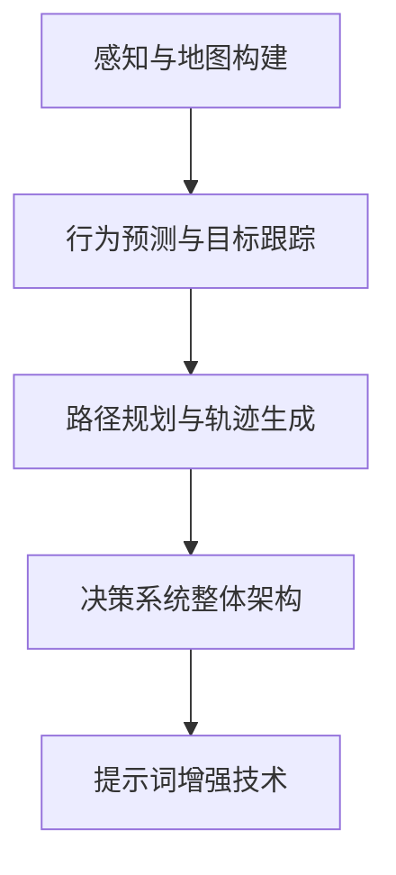
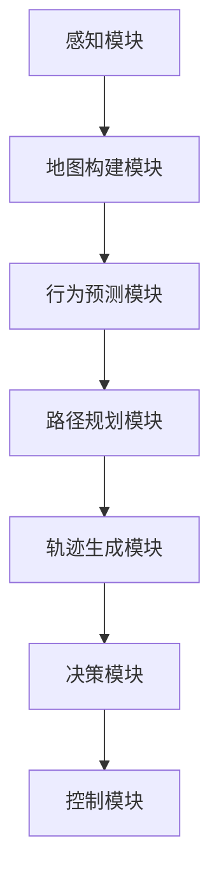

                 

# 自动驾驶决策系统：提升环境理解能力

## 关键词
- 自动驾驶
- 决策系统
- 环境理解
- 感知
- 行为预测
- 路径规划
- 提示词增强

## 摘要
自动驾驶决策系统是自动驾驶汽车的核心，它负责处理感知、理解环境和做出安全、高效的驾驶决策。本文将探讨如何通过提升环境理解能力来增强自动驾驶决策系统的性能。文章首先介绍了自动驾驶技术的历史背景和决策系统的重要性，然后详细分析了决策系统的理论基础，包括感知与地图构建、行为预测与目标跟踪、路径规划与轨迹生成。接着，文章讨论了决策系统的架构与实现，重点介绍了提示词增强技术。最后，通过实际应用案例和未来展望，展示了自动驾驶决策系统在复杂环境中的挑战和解决方案。

### 目录大纲

#### 第一部分：引言与背景

**第1章：自动驾驶与决策系统概述**

- **1.1 自动驾驶技术发展历程**
- **1.2 自动驾驶决策系统的重要性**
- **1.3 本书结构安排与学习目标**

#### 第二部分：决策系统理论基础

**第2章：感知与地图构建**

- **2.1 感知系统的基本功能**
  - **2.1.1 视觉感知**
  - **2.1.2 激光雷达感知**
  - **2.1.3 基于深度学习的感知算法**
- **2.2 环境建模与地图构建**
  - **2.2.1 地图表示方法**
  - **2.2.2 建模算法详解**
  - **2.2.3 地图更新与维护**

**第3章：行为预测与目标跟踪**

- **3.1 行为预测基本原理**
  - **3.1.1 基于统计模型的行为预测**
  - **3.1.2 基于深度学习的行为预测**
- **3.2 目标跟踪算法**
  - **3.2.1 单目标跟踪算法**
  - **3.2.2 多目标跟踪算法**
  - **3.2.3 跟踪算法的性能评估**

**第4章：路径规划与轨迹生成**

- **4.1 路径规划基本概念**
  - **4.1.1 确定性路径规划算法**
  - **4.1.2 随机规划算法**
  - **4.1.3 避障与避让策略**
- **4.2 轨迹生成方法**
  - **4.2.1 线性轨迹生成**
  - **4.2.2 贝塞尔曲线轨迹生成**
  - **4.2.3 动力学约束下的轨迹优化**

**第5章：决策系统的架构与实现**

- **5.1 决策系统整体架构**
  - **5.1.1 模块功能与数据流**
  - **5.1.2 系统性能优化**
- **5.2 提示词增强技术**
  - **5.2.1 提示词的概念与作用**
  - **5.2.2 提示词生成算法**
  - **5.2.3 提示词在决策系统中的应用**

#### 第三部分：实际应用与案例分析

**第6章：自动驾驶决策系统在复杂场景中的应用**

- **6.1 复杂场景下的挑战**
  - **6.1.1 动态交通环境**
  - **6.1.2 非法行为的处理**
  - **6.1.3 突发事件的应对**
- **6.2 案例分析**
  - **6.2.1 自动驾驶出租车系统**
  - **6.2.2 自动驾驶卡车物流系统**

**第7章：未来展望与趋势**

- **7.1 自动驾驶决策系统的发展趋势**
  - **7.1.1 算法创新**
  - **7.1.2 硬件与软件的结合**
  - **7.1.3 法规与伦理问题**
- **7.2 可能的未来应用场景**

#### 第四部分：附录与参考文献

**附录A：常用算法与数据集介绍**

- **A.1 常用路径规划算法**
- **A.2 常用行为预测模型**
- **A.3 常用数据集与工具**

**附录B：参考资料与进一步阅读**

- **B.1 相关书籍推荐**
- **B.2 学术论文精选**
- **B.3 在线课程与讲座**

### 核心概念与联系

以下是一个简单的 Mermaid 流程图，展示了自动驾驶决策系统中各个核心模块的关系：

接下来，我们将逐一深入探讨各个部分的内容，逐步构建出一个完整的自动驾驶决策系统。

#### 第一部分：引言与背景

**第1章：自动驾驶与决策系统概述**

**1.1 自动驾驶技术发展历程**

自动驾驶技术是人工智能和机器人技术领域的前沿课题，其发展历程可以追溯到20世纪50年代。早期的自动驾驶研究主要集中在理论研究阶段，随着计算机技术的发展和人工智能算法的进步，自动驾驶技术逐渐从理论走向实践。

1950年，美国科学家约翰·麦克卡比（John McCarthy）提出了自动驾驶汽车的概念。20世纪70年代，美国马萨诸塞理工学院（MIT）的研究团队成功开发了第一个自动驾驶车辆——MOTORCAR，这标志着自动驾驶技术的实际应用开始起步。

进入21世纪，随着计算机性能的飞速提升和传感器技术的突破，自动驾驶技术进入了一个快速发展的阶段。2005年，谷歌公司开始研发自动驾驶汽车，并在随后的几年中取得了显著的进展。2010年后，特斯拉、通用、福特等汽车制造商也纷纷加入自动驾驶技术的研发和应用。

目前，自动驾驶技术已经从L0（无自动化）发展到L4（高度自动化），部分自动驾驶车辆已经在特定场景下实现商业化运营。例如，Waymo的自动驾驶出租车已经在美国部分地区进行试运营，特斯拉的自动驾驶功能也在全球范围内得到了广泛应用。

**1.2 自动驾驶决策系统的重要性**

自动驾驶决策系统是自动驾驶汽车的核心，它负责处理车辆感知环境、理解场景、做出驾驶决策以及控制车辆的运动。一个高效的自动驾驶决策系统能够确保车辆在复杂、多变的环境中安全、可靠地行驶。

决策系统的重要性体现在以下几个方面：

1. **安全**：自动驾驶决策系统必须能够处理各种意外情况，包括突发障碍、异常交通状况等，确保车辆和乘客的安全。
2. **效率**：高效的决策系统能够优化车辆的行驶路径，减少能耗，提高交通效率。
3. **舒适性**：良好的决策系统可以提高乘坐舒适性，减少驾驶疲劳。
4. **法规遵从**：自动驾驶车辆需要遵守交通法规和规则，决策系统必须具备良好的合规性。

**1.3 本书结构安排与学习目标**

本书旨在系统地介绍自动驾驶决策系统的原理、技术和实现。本书分为四个部分：

1. **第一部分：引言与背景**，介绍自动驾驶技术的发展历程和决策系统的重要性。
2. **第二部分：决策系统理论基础**，详细分析感知与地图构建、行为预测与目标跟踪、路径规划与轨迹生成。
3. **第三部分：实际应用与案例分析**，通过具体案例展示决策系统在复杂场景中的应用。
4. **第四部分：未来展望与趋势**，探讨自动驾驶决策系统的未来发展方向。

学习目标：

- **理解**自动驾驶技术的发展历程和决策系统的重要性。
- **掌握**决策系统中的核心算法和原理。
- **应用**所学知识，分析和解决实际的自动驾驶问题。

通过本书的学习，读者将能够全面了解自动驾驶决策系统的构建方法，为从事相关领域的研究和实践打下坚实的基础。

### 第二部分：决策系统理论基础

#### 第2章：感知与地图构建

感知与地图构建是自动驾驶决策系统的基石，直接影响到车辆对环境的理解和决策能力。本章将详细介绍感知系统的基本功能、环境建模与地图构建的方法，以及地图的更新与维护。

**2.1 感知系统的基本功能**

感知系统是自动驾驶决策系统的核心组成部分，其主要功能是获取车辆周围的环境信息，包括交通状况、道路信息、障碍物位置等。感知系统通常依赖于多种传感器，包括摄像头、激光雷达、雷达、超声波传感器等。

**2.1.1 视觉感知**

视觉感知是通过摄像头获取图像信息，然后利用计算机视觉技术进行处理和分析。摄像头具有高分辨率、低延迟等优点，适用于捕捉道路标志、行人和车辆等目标。

**2.1.2 激光雷达感知**

激光雷达（LiDAR，Light Detection and Ranging）是一种通过发射激光脉冲并测量其反射时间来获取三维环境信息的传感器。激光雷达具有高分辨率、高精度等优点，适用于构建详细的环境地图和检测障碍物。

**2.1.3 基于深度学习的感知算法**

深度学习技术在感知系统中的应用日益广泛，通过训练大规模神经网络模型，可以实现对图像和点云数据的自动分类、检测和分割。常见的深度学习算法包括卷积神经网络（CNN）、循环神经网络（RNN）和生成对抗网络（GAN）等。

**2.2 环境建模与地图构建**

环境建模是将感知系统获取的环境信息转换为车辆可以理解和处理的形式。地图构建则是将环境建模的结果保存下来，供决策系统使用。

**2.2.1 地图表示方法**

地图的表示方法通常包括二维和三维表示。二维表示主要使用栅格地图（Raster Map）和矢量地图（Vector Map）。三维表示则使用点云地图（Point Cloud Map）和体素地图（Voxel Map）。

- **栅格地图**：以像素为单位，将环境划分为栅格网格，每个栅格存储障碍物信息。栅格地图简单直观，但数据量大，处理速度较慢。
- **矢量地图**：以顶点和边的形式表示道路、障碍物等，信息量小，处理速度快。矢量地图适用于动态环境建模，但难以表示复杂的三维信息。
- **点云地图**：通过激光雷达获取的三维点云数据，可以精确表示环境的三维结构。点云地图适用于三维场景建模，但处理复杂，存储需求大。
- **体素地图**：将环境划分为体素（三维栅格），每个体素存储物体的类别和概率。体素地图可以同时表示二维和三维信息，但数据量巨大，处理复杂。

**2.2.2 建模算法详解**

环境建模算法主要包括特征提取、目标检测和场景分割等。

- **特征提取**：从感知数据中提取具有区分性的特征，如颜色、形状、纹理等。特征提取是后续目标检测和场景分割的基础。
- **目标检测**：通过检测感知数据中的目标，如行人、车辆、交通标志等。常见的目标检测算法包括单阶段检测算法（如SSD、YOLO）和多阶段检测算法（如Faster R-CNN、Mask R-CNN）。
- **场景分割**：将感知数据分割为不同的区域，如道路、人行道、车辆等。常见的场景分割算法包括基于深度学习的语义分割算法（如SegNet、U-Net）。

**2.2.3 地图更新与维护**

环境是动态变化的，感知系统需要实时更新地图，以反映当前的环境状态。地图更新与维护包括以下步骤：

- **感知数据采集**：通过感知系统采集当前环境信息。
- **数据预处理**：对感知数据进行预处理，如去噪、滤波等。
- **地图更新**：将预处理后的数据整合到现有的地图中，更新地图信息。
- **地图维护**：定期对地图进行维护，包括去除过期信息、添加新信息等。

通过感知与地图构建，自动驾驶决策系统可以准确地获取和表示环境信息，为后续的行为预测、路径规划和轨迹生成提供基础。

**2.3 实际案例**

以特斯拉的自动驾驶系统为例，特斯拉采用摄像头、激光雷达和超声波传感器进行环境感知，通过深度学习算法对感知数据进行处理，构建高精度的三维环境地图。特斯拉的地图构建算法包括目标检测、场景分割和动态更新等步骤，确保系统能够实时、准确地获取和表示环境信息。

#### 第3章：行为预测与目标跟踪

行为预测与目标跟踪是自动驾驶决策系统中至关重要的一部分，它负责预测车辆和目标（如行人、其他车辆等）的未来运动轨迹，以便做出安全的驾驶决策。本章将详细介绍行为预测与目标跟踪的基本原理、常用算法，以及性能评估方法。

**3.1 行为预测基本原理**

行为预测的目的是根据当前环境信息和历史行为数据，预测车辆或目标在未来一段时间内的运动轨迹。行为预测的准确性直接影响到自动驾驶系统的安全性和可靠性。

**3.1.1 基于统计模型的行为预测**

基于统计模型的行为预测通常使用马尔可夫模型（Markov Model）或卡尔曼滤波（Kalman Filter）等算法。这些算法通过分析历史行为数据，建立概率模型，预测未来行为。

- **马尔可夫模型**：马尔可夫模型假设当前状态仅依赖于前一个状态，通过状态转移概率矩阵和初始状态概率分布，预测未来状态。马尔可夫模型简单易实现，但在复杂环境中可能不够准确。
- **卡尔曼滤波**：卡尔曼滤波是一种线性状态估计方法，通过预测和更新步骤，结合观测数据，逐步优化状态估计。卡尔曼滤波在处理动态系统时具有较好的准确性和稳定性。

**3.1.2 基于深度学习的行为预测**

随着深度学习技术的发展，基于深度学习的行为预测方法逐渐成为研究热点。深度学习模型可以从大量数据中自动学习复杂的特征和模式，提高行为预测的准确性。

- **循环神经网络（RNN）**：循环神经网络能够处理序列数据，通过捕捉时间序列的特征，预测未来行为。常见的RNN模型包括LSTM（长短时记忆网络）和GRU（门控循环单元）。
- **卷积神经网络（CNN）**：卷积神经网络擅长处理空间数据，通过卷积操作提取图像特征，用于行为预测。结合RNN和CNN的模型，如C3D（三维卷积神经网络），在行为预测方面表现出色。
- **变分自编码器（VAE）**：变分自编码器通过引入概率模型，学习数据的高斯分布，预测未来行为。VAE在行为预测中具有较好的灵活性和鲁棒性。

**3.2 目标跟踪算法**

目标跟踪是行为预测的一个重要应用，它负责在连续的视频帧中跟踪特定的目标。目标跟踪算法可以分为单目标跟踪算法和多目标跟踪算法。

**3.2.1 单目标跟踪算法**

单目标跟踪算法的目标是在视频序列中持续跟踪单个目标。常见的单目标跟踪算法包括基于光流的跟踪、基于模板匹配的跟踪和基于深度学习的跟踪。

- **光流跟踪**：光流跟踪通过分析视频帧之间的像素运动，跟踪目标的运动轨迹。光流跟踪简单高效，但在复杂场景中可能失效。
- **模板匹配跟踪**：模板匹配跟踪通过将视频帧与预设的模板进行比较，跟踪目标的运动。模板匹配跟踪计算量较小，但在目标变形或遮挡时效果不佳。
- **深度学习跟踪**：深度学习跟踪通过训练卷积神经网络，从视频序列中自动学习目标的特征，实现跟踪。深度学习跟踪在复杂场景中具有较好的鲁棒性和准确性。

**3.2.2 多目标跟踪算法**

多目标跟踪算法的目标是在视频序列中同时跟踪多个目标。常见的多目标跟踪算法包括基于图的跟踪、基于卡尔曼滤波的跟踪和基于深度学习的跟踪。

- **基于图的跟踪**：基于图的跟踪将视频序列中的目标表示为图节点，通过优化图结构，实现多目标跟踪。基于图的跟踪在处理复杂场景时具有较好的灵活性。
- **基于卡尔曼滤波的跟踪**：基于卡尔曼滤波的多目标跟踪算法结合单个目标的卡尔曼滤波估计，实现多目标跟踪。卡尔曼滤波跟踪在处理动态环境时具有较好的稳定性。
- **基于深度学习的跟踪**：基于深度学习的多目标跟踪算法通过训练卷积神经网络，从视频序列中自动学习目标特征，实现多目标跟踪。深度学习跟踪在处理复杂场景时具有较好的准确性和鲁棒性。

**3.2.3 跟踪算法的性能评估**

跟踪算法的性能评估通常包括以下指标：

- **准确率（Accuracy）**：准确率表示跟踪算法正确跟踪目标的百分比。
- **平均帧间误差（Average Inter-Frame Error, AIFE）**：平均帧间误差表示跟踪轨迹与真实轨迹之间的平均误差。
- **重叠率（Overlap Rate）**：重叠率表示跟踪框与真实目标框的重叠面积比例。
- **平均重叠率（Average Overlap Rate, AOR）**：平均重叠率表示多个跟踪框的平均重叠率。

通过性能评估，可以客观地比较不同跟踪算法的性能，为实际应用提供参考。

**3.3 实际案例**

以谷歌的自动驾驶系统为例，谷歌采用了基于深度学习的行为预测算法，结合多目标跟踪技术，实现了对车辆、行人和交通标志的实时预测和跟踪。通过大规模数据集的训练，谷歌的算法能够准确预测目标的运动轨迹，提高自动驾驶系统的安全性和可靠性。

通过本章的学习，读者可以了解行为预测与目标跟踪的基本原理和常用算法，为构建高效的自动驾驶决策系统打下理论基础。

#### 第4章：路径规划与轨迹生成

路径规划与轨迹生成是自动驾驶决策系统中的核心模块，其任务是根据环境信息和目标位置，为车辆规划出一条安全、高效的行驶路径，并生成相应的运动轨迹。本章将详细介绍路径规划与轨迹生成的基本概念、算法原理，以及实际应用中的挑战和解决方案。

**4.1 路径规划基本概念**

路径规划是指在一个给定的环境中，为移动实体（如车辆、机器人）寻找一条从起点到终点的最优路径。路径规划的主要目标是保证路径的安全性和效率。

**4.1.1 确定性路径规划算法**

确定性路径规划算法在静态环境中具有较好的性能，主要分为以下几种：

- **A*算法**：A*算法是一种启发式搜索算法，通过结合起点到当前节点的代价和当前节点到终点的估计代价，找到最优路径。A*算法的时间复杂度较高，但在计算资源允许的情况下，能够得到较好的规划结果。
- **Dijkstra算法**：Dijkstra算法是一种基于贪心策略的路径规划算法，通过逐步扩展已访问节点，找到起点到终点的最短路径。Dijkstra算法的时间复杂度较高，但能够在资源有限的情况下找到最优路径。
- **RRT（快速随机树）算法**：RRT算法通过随机采样生成树结构，逐步逼近最优路径。RRT算法在处理动态环境时具有较好的灵活性和鲁棒性。

**4.1.2 随机规划算法**

随机规划算法在处理动态和不确定性环境时具有较好的性能，主要分为以下几种：

- **RRT*算法**：RRT*算法是RRT算法的改进版本，通过引入优化策略，提高路径规划的鲁棒性和效率。
- **PRM（概率路网）算法**：PRM算法通过构建一个概率路网，在路网中搜索最优路径。PRM算法在处理高维空间问题时具有较好的性能。
- **ATR（自适应轨迹规划）算法**：ATR算法通过实时更新环境信息，动态调整规划路径，提高路径规划的适应性和鲁棒性。

**4.1.3 避障与避让策略**

在路径规划中，避障与避让策略是确保路径安全的关键。常见的避障与避让策略包括：

- **动态避障**：动态避障通过实时监测车辆周围的障碍物，动态调整路径，避免碰撞。动态避障策略适用于复杂和动态环境。
- **静态避障**：静态避障通过提前计算车辆与障碍物之间的碰撞时间，提前调整路径，避免碰撞。静态避障策略适用于静态和确定性环境。

**4.2 轨迹生成方法**

轨迹生成是将路径规划的结果转化为车辆可以执行的连续运动轨迹。常见的轨迹生成方法包括：

- **线性轨迹生成**：线性轨迹生成通过将路径划分为多个直线段，生成线性运动轨迹。线性轨迹生成简单高效，但在转弯和急停时可能产生较大的抖动。
- **贝塞尔曲线轨迹生成**：贝塞尔曲线轨迹生成通过使用贝塞尔曲线，平滑地连接路径上的关键点，生成连续的运动轨迹。贝塞尔曲线轨迹生成具有良好的平滑性和控制性，但计算复杂度较高。
- **动力学约束下的轨迹优化**：动力学约束下的轨迹优化通过优化轨迹参数，使轨迹满足车辆动力学约束，提高行驶性能。常见的轨迹优化方法包括优化的二次规划（QP）和直接方法（如数值梯度下降）。

**4.2.1 动力学约束下的轨迹优化**

动力学约束下的轨迹优化是路径规划与轨迹生成中的重要环节，其主要目标是：

- **速度约束**：确保车辆的速度在允许范围内，避免超速或急加速。
- **加速度约束**：确保车辆的加速度在安全范围内，避免急加速或急减速。
- **转向约束**：确保车辆的转向角度在允许范围内，避免过度转向或转向不足。

**4.3 实际应用中的挑战与解决方案**

在自动驾驶系统中，路径规划与轨迹生成面临以下挑战：

- **动态环境**：动态环境中的障碍物和目标会不断变化，要求路径规划与轨迹生成具有实时性和鲁棒性。
- **不确定性**：环境中的不确定因素（如天气、道路状况等）会影响路径规划的准确性。
- **复杂场景**：复杂场景中的路径规划与轨迹生成需要同时考虑多个目标和约束条件。

针对这些挑战，常见的解决方案包括：

- **多目标规划**：通过考虑多个目标（如安全、效率、舒适性等），优化路径规划与轨迹生成。
- **实时性优化**：通过优化算法和硬件加速，提高路径规划与轨迹生成的实时性。
- **不确定性建模**：通过建模和预测环境中的不确定因素，提高路径规划与轨迹生成的鲁棒性。

**4.4 实际案例**

以特斯拉的自动驾驶系统为例，特斯拉采用了基于深度学习的路径规划与轨迹生成算法，通过实时监测车辆周围环境，生成安全、高效的行驶轨迹。特斯拉的路径规划与轨迹生成算法具有较好的实时性和鲁棒性，能够适应复杂和动态环境。

通过本章的学习，读者可以了解路径规划与轨迹生成的基本概念、算法原理和实际应用，为构建高效的自动驾驶决策系统提供理论支持。

#### 第5章：决策系统的架构与实现

决策系统是自动驾驶汽车的大脑，它负责处理感知数据、分析环境、预测未来情况并做出决策。本章将详细讨论决策系统的整体架构，包括各个模块的功能与数据流，以及如何通过系统性能优化来提升决策能力。

**5.1 决策系统整体架构**

自动驾驶决策系统通常由多个子系统和模块组成，这些模块协同工作，确保车辆能够安全、可靠地行驶。决策系统的整体架构可以概括为以下几个关键模块：

1. **感知模块**：感知模块是决策系统的输入部分，它通过摄像头、激光雷达、雷达、超声波传感器等设备获取车辆周围的环境信息。感知模块的主要任务是检测和识别道路、车辆、行人、交通标志等。

2. **地图构建模块**：地图构建模块负责将感知模块获取的数据进行处理，构建出用于决策的环境地图。地图不仅包含静态的道路信息，还包括动态的交通状况。地图构建模块需要不断更新和修正，以反映实时环境。

3. **行为预测模块**：行为预测模块基于感知模块和地图构建模块提供的信息，预测车辆和目标（如行人、其他车辆）的未来行为。这一模块通常采用深度学习算法，如RNN或CNN，来分析历史数据和实时数据，预测可能的运动轨迹。

4. **路径规划模块**：路径规划模块根据当前的位置、目标位置和障碍物的信息，规划出一条从起点到终点的安全、高效的路径。路径规划算法包括A*算法、Dijkstra算法和RRT算法等，这些算法可以处理静态和动态环境。

5. **轨迹生成模块**：轨迹生成模块将路径规划的结果转化为具体的运动轨迹。这一模块需要考虑车辆的动力学特性，如加速度、速度和转向角度等，生成平滑且符合物理约束的运动轨迹。

6. **决策模块**：决策模块是整个系统的核心，它根据行为预测、路径规划和轨迹生成模块提供的信息，做出实时的驾驶决策。决策模块需要考虑多种因素，如安全、效率和舒适性，选择最佳的动作指令，如加速、减速、转弯或停车。

7. **控制模块**：控制模块根据决策模块的指令，控制车辆的执行系统，包括发动机、刹车、转向等，使车辆按照规划的运动轨迹行驶。

**5.1.1 模块功能与数据流**

各模块之间的数据流如图所示：

- **感知模块**：传感器数据输入到感知模块，经过预处理和特征提取，生成感知数据。
- **地图构建模块**：感知数据经过地图构建模块，生成环境地图。
- **行为预测模块**：地图和感知数据输入到行为预测模块，预测车辆和目标的行为。
- **路径规划模块**：行为预测结果和当前车辆位置输入到路径规划模块，生成最优路径。
- **轨迹生成模块**：路径规划结果输入到轨迹生成模块，生成运动轨迹。
- **决策模块**：轨迹生成结果和车辆状态输入到决策模块，生成驾驶决策。
- **控制模块**：决策结果输入到控制模块，控制车辆执行相应的动作。

**5.1.2 系统性能优化**

为了提升决策系统的性能，可以采取以下优化措施：

1. **算法优化**：优化各模块的算法，提高计算效率和准确性。例如，使用更高效的感知算法、更准确的预测模型和更优的路径规划算法。
2. **硬件加速**：利用GPU等硬件加速，提高数据处理的实时性。GPU在矩阵运算和深度学习模型训练方面具有显著的优势。
3. **多线程处理**：采用多线程或并行处理技术，提高系统的整体计算能力。例如，在路径规划和轨迹生成模块中，可以同时处理多个任务，提高处理速度。
4. **传感器融合**：将多种传感器数据进行融合，提高环境感知的准确性和鲁棒性。例如，结合摄像头和激光雷达的数据，可以更准确地识别道路和障碍物。
5. **实时性优化**：优化系统的实时性能，确保在短时间内完成感知、预测和决策任务。例如，通过减少数据处理延迟和优化代码，提高系统的响应速度。

**5.2 提示词增强技术**

提示词增强技术是近年来发展起来的一种增强学习技术，它通过给决策系统提供额外的信息，帮助系统更好地理解和应对复杂环境。提示词可以是预定义的规则、先前的经验或基于外部知识库的建议。

**5.2.1 提示词的概念与作用**

提示词（Hint）是在决策过程中提供的一种辅助信息，它可以帮助决策系统更好地理解和处理复杂环境。提示词的作用包括：

- **提高决策准确性**：通过提供额外的信息，提示词可以帮助系统更准确地预测车辆和目标的行为。
- **加速学习过程**：提示词可以提供一些先验知识，减少系统的探索过程，加速学习速度。
- **增强鲁棒性**：在不确定性环境中，提示词可以帮助系统应对异常情况，提高鲁棒性。

**5.2.2 提示词生成算法**

提示词的生成通常基于以下几种方法：

- **规则生成**：根据先验知识或经验规则生成提示词。这种方法简单直观，但可能无法适应复杂的动态环境。
- **机器学习生成**：通过训练机器学习模型（如分类器、回归模型等），从历史数据中自动生成提示词。这种方法能够自适应地调整提示词，但需要大量训练数据。
- **知识图谱生成**：利用知识图谱（Knowledge Graph）构建提示词，将不同实体和关系映射到提示词中。这种方法能够提供丰富的上下文信息，但构建和维护成本较高。

**5.2.3 提示词在决策系统中的应用**

提示词在决策系统中的应用主要包括以下几个方面：

- **辅助预测**：在行为预测模块中，提示词可以提供额外的信息，帮助系统更准确地预测车辆和目标的行为。
- **路径规划**：在路径规划模块中，提示词可以帮助系统避免某些危险区域或优先选择某些道路。
- **决策优化**：在决策模块中，提示词可以提供额外的信息，帮助系统做出更合理的驾驶决策。

通过提示词增强技术，决策系统的性能可以得到显著提升，尤其是在复杂和动态环境下。

**5.3 实际案例**

以Waymo的自动驾驶系统为例，Waymo采用了多种传感器融合技术和深度学习算法，并结合提示词增强技术，实现了高效、安全的自动驾驶。Waymo的提示词生成基于大量历史数据和先验知识，通过训练机器学习模型自动生成，极大地提高了系统的预测准确性和决策能力。

通过本章的学习，读者可以了解自动驾驶决策系统的整体架构和实现方法，以及如何通过系统性能优化和提示词增强技术来提升决策能力。

#### 第6章：自动驾驶决策系统在复杂场景中的应用

自动驾驶决策系统在实际应用中面临诸多复杂场景，这些场景包括动态交通环境、非法行为处理和突发事件的应对。本章将探讨这些复杂场景下的挑战，并分析自动驾驶决策系统如何应对这些挑战。

**6.1 复杂场景下的挑战**

**6.1.1 动态交通环境**

动态交通环境是自动驾驶决策系统面临的主要挑战之一。交通环境是不断变化的，包括车辆的动态移动、行人的随机行为和突发交通事件等。这些动态因素对自动驾驶系统的感知、预测和决策提出了极高的要求。

- **车辆动态移动**：自动驾驶系统需要实时监测周围车辆的动态移动，预测其行驶轨迹，避免碰撞和危险情况。特别是在多车交汇、变道和急刹等复杂场景中，车辆的动态移动给决策系统带来了巨大的挑战。
- **行人随机行为**：行人行为具有高度不确定性和随机性，行人的行走方向、速度和突然停顿等行为难以预测。自动驾驶系统需要具备高度的安全性和鲁棒性，确保在行人出现突发行为时能够及时响应。
- **突发交通事件**：突发交通事件，如交通事故、道路施工、紧急车辆通过等，会对自动驾驶系统的决策产生重大影响。系统需要迅速识别事件并做出相应的调整，以确保行车安全。

**6.1.2 非法行为的处理**

非法行为，如闯红灯、逆行、占用紧急车道等，对自动驾驶系统的决策系统提出了额外的挑战。自动驾驶系统需要识别和应对这些非法行为，以确保行车安全和遵守交通法规。

- **识别非法行为**：自动驾驶系统需要具备先进的感知能力，通过摄像头、激光雷达等传感器实时监测道路状况，识别非法行为。这需要系统具备高精度的目标检测和识别算法。
- **决策应对**：在识别非法行为后，自动驾驶系统需要做出相应的决策，如减速、停车或绕行等，以避免与非法行为者发生碰撞。这要求决策系统具备灵活的应对策略和高鲁棒性。

**6.1.3 突发事件的应对**

突发事件，如恶劣天气、道路障碍物、动物横穿等，对自动驾驶系统的稳定性提出了严峻考验。系统需要具备快速响应和调整能力，以应对这些突发情况。

- **恶劣天气**：恶劣天气，如雨、雪、雾等，会降低传感器的感知能力，影响系统的决策。系统需要具备自适应的感知和决策能力，以应对不同天气条件下的挑战。
- **道路障碍物**：道路障碍物，如树木倒塌、施工障碍等，会对自动驾驶系统的路径规划和轨迹生成提出挑战。系统需要能够实时检测和识别障碍物，并迅速调整路径，以避免碰撞。
- **动物横穿**：在乡村或野生动物出没的地区，动物横穿道路是常见的情况。自动驾驶系统需要具备对动物行为的识别和预测能力，以避免与动物发生碰撞。

**6.2 案例分析**

**6.2.1 自动驾驶出租车系统**

自动驾驶出租车系统（如Waymo One、特斯拉AutoPilot等）在实际运营中面临诸多复杂场景。以Waymo One为例，Waymo的自动驾驶出租车在旧金山和亚利桑那州等地进行试运营。

- **动态交通环境**：Waymo的传感器和感知算法能够实时监测周围交通环境，识别车辆、行人、交通标志和信号灯等。通过深度学习和机器学习算法，Waymo能够预测交通参与者的行为，并做出相应的驾驶决策。
- **非法行为的处理**：Waymo的决策系统具备识别和处理非法行为的能力。例如，当识别到前方车辆闯红灯时，Waymo的自动驾驶出租车会减速或停车，以避免碰撞。
- **突发事件的应对**：Waymo的自动驾驶出租车系统具备应对突发事件的算法和机制。例如，当系统检测到前方有障碍物或动物时，系统会立即减速或停车，并尝试绕行。

**6.2.2 自动驾驶卡车物流系统**

自动驾驶卡车物流系统在高速公路和货运场景中具有广泛的应用前景。以自动驾驶卡车制造商TuSimple为例，其自动驾驶系统在复杂场景下表现出色。

- **动态交通环境**：TuSimple的自动驾驶系统通过多个传感器（包括激光雷达、摄像头、雷达等）实时监测周围交通环境。系统能够识别道路标志、交通信号灯、其他车辆和行人等，并做出相应的驾驶决策。
- **非法行为的处理**：TuSimple的系统具备识别和处理非法行为的能力。例如，当检测到前方车辆逆行或占用紧急车道时，系统会减速或停车，以避免碰撞。
- **突发事件的应对**：TuSimple的系统具备应对突发事件的算法和机制。例如，当系统检测到前方有障碍物或动物时，系统会立即减速或停车，并尝试绕行。

**6.3 总结**

自动驾驶决策系统在复杂场景下面临诸多挑战，但通过先进的感知技术、深度学习和机器学习算法，以及自适应的决策机制，系统能够有效应对这些挑战。随着技术的不断进步，自动驾驶决策系统在复杂场景下的性能和可靠性将不断提升，为自动驾驶的广泛应用奠定坚实基础。

#### 第7章：未来展望与趋势

自动驾驶决策系统正处于快速发展的阶段，随着技术的不断进步，其性能和功能将得到显著提升。本章将探讨自动驾驶决策系统的未来发展趋势，包括算法创新、硬件与软件的结合、法规与伦理问题，以及可能的应用场景。

**7.1 自动驾驶决策系统的发展趋势**

**7.1.1 算法创新**

算法创新是自动驾驶决策系统未来发展的重要方向。以下是一些关键的算法创新趋势：

- **强化学习**：强化学习（Reinforcement Learning，RL）在自动驾驶决策系统中具有巨大潜力。通过模拟和试错，RL算法能够学习复杂环境中的最佳行为策略，提高系统的自适应性和鲁棒性。例如，DeepMind开发的AlphaPilot项目利用深度强化学习实现了自动驾驶卡车的训练。
- **联邦学习**：联邦学习（Federated Learning）允许多个分布式设备共同参与模型的训练，而不需要共享原始数据。这一技术能够保护用户隐私，同时提高模型的整体性能和泛化能力。在自动驾驶领域，联邦学习有助于优化决策系统的感知和预测能力。
- **多模态感知**：多模态感知（Multimodal Perception）结合了多种传感器数据（如摄像头、激光雷达、雷达等），能够提供更全面、准确的环境信息。通过多模态感知，自动驾驶系统能够更好地应对复杂和动态环境。

**7.1.2 硬件与软件的结合**

硬件与软件的结合是提升自动驾驶决策系统性能的关键。以下是一些硬件与软件结合的发展趋势：

- **高效计算平台**：高性能计算平台（如GPU、TPU和专用AI芯片）在自动驾驶系统中得到广泛应用。这些计算平台能够加速复杂算法的运行，提高系统的实时性和决策能力。
- **边缘计算**：边缘计算（Edge Computing）将计算任务分散到靠近数据源的边缘设备上，减少数据传输延迟，提高系统的响应速度。在自动驾驶领域，边缘计算有助于实时处理大量传感器数据，提高感知和决策的准确性。
- **车联网（V2X）**：车联网（Vehicle-to-Everything，V2X）技术通过车辆与其他设备（如道路基础设施、其他车辆等）的互联互通，实现更高效、更安全的交通管理。V2X技术能够提供额外的环境信息，辅助自动驾驶决策系统做出更明智的驾驶决策。

**7.1.3 法规与伦理问题**

自动驾驶决策系统的普及带来了新的法规与伦理问题，需要全球范围内的合作和协调来解决：

- **法规制定**：各国政府和国际组织需要制定统一、明确的自动驾驶法规，确保系统的安全性和合规性。例如，欧盟发布了《自动驾驶车辆法规框架》，规定了自动驾驶车辆的技术标准和测试要求。
- **责任划分**：自动驾驶决策系统的责任划分是法规制定的关键问题。需要明确驾驶员、制造商和运营者之间的责任界限，以保护用户和第三方的权益。
- **伦理问题**：自动驾驶决策系统在面临道德困境时，如何做出符合伦理的决策是一个重要议题。例如，在避免碰撞时，系统应该选择牺牲哪一方。这需要开发基于伦理准则的决策框架，确保系统在复杂场景下做出合理的决策。

**7.2 可能的未来应用场景**

随着自动驾驶技术的不断进步，未来将出现许多新的应用场景，包括：

- **自动驾驶出租车**：自动驾驶出租车将成为城市交通的重要组成部分，提供便捷、高效的出行服务。Waymo、特斯拉等公司正在积极开发自动驾驶出租车服务，预计在未来几年内实现商业化运营。
- **自动驾驶卡车**：自动驾驶卡车在长途货运和物流领域具有广泛的应用前景。通过提高运输效率、减少驾驶疲劳和事故风险，自动驾驶卡车有望显著降低物流成本。
- **自动驾驶公共交通**：自动驾驶公交车和地铁等公共交通工具将提高运营效率，减少交通拥堵，提升乘客体验。例如，波士顿的MBTA正在测试自动驾驶公交车，以优化城市交通流量。
- **自动驾驶农业机械**：自动驾驶农业机械能够提高农业生产效率，减少劳动力成本。自动驾驶拖拉机、收割机和喷洒设备正在逐步推广应用。
- **自动驾驶无人机**：自动驾驶无人机在物流配送、环境监测和应急救援等领域具有巨大的应用潜力。例如，亚马逊正在开发无人机送货服务，以实现“最后一公里”的快速配送。

通过持续的技术创新和法规完善，自动驾驶决策系统将在未来带来更加智能、安全、高效的出行体验，为人类社会的可持续发展贡献力量。

#### 附录A：常用算法与数据集介绍

为了帮助读者更好地理解和应用自动驾驶决策系统中的核心算法，本附录将对一些常用的算法和数据集进行详细介绍。

**A.1 常用路径规划算法**

路径规划算法在自动驾驶决策系统中扮演着关键角色，以下是一些常用的路径规划算法：

- **A*算法**：A*算法是一种启发式搜索算法，用于在静态环境中找到从起点到终点的最优路径。算法通过计算每个节点的“代价”来评估路径的优劣，从而找到最优路径。
- **Dijkstra算法**：Dijkstra算法是基于贪心策略的路径规划算法，用于在静态环境中找到从起点到终点的最短路径。算法通过逐步扩展已访问节点，直到找到终点。
- **RRT（快速随机树）算法**：RRT算法是一种随机规划算法，适用于动态环境。算法通过随机生成树结构，逐步逼近最优路径，具有较强的鲁棒性和灵活性。
- **RRT*算法**：RRT*算法是RRT算法的改进版本，通过引入优化策略，提高路径规划的鲁棒性和效率。RRT*算法在处理动态和不确定性环境时表现出色。
- **PRM（概率路网）算法**：PRM算法通过构建概率路网，在路网中搜索最优路径。PRM算法在处理高维空间问题时具有较好的性能。

**A.2 常用行为预测模型**

行为预测模型是自动驾驶决策系统的重要组成部分，以下是一些常用的行为预测模型：

- **卡尔曼滤波器**：卡尔曼滤波器是一种线性状态估计方法，通过预测和更新步骤，逐步优化状态估计。卡尔曼滤波器在处理动态系统时具有较好的准确性和稳定性。
- **循环神经网络（RNN）**：RNN能够处理序列数据，通过捕捉时间序列的特征，预测未来行为。常见的RNN模型包括LSTM（长短时记忆网络）和GRU（门控循环单元）。
- **卷积神经网络（CNN）**：CNN擅长处理空间数据，通过卷积操作提取图像特征，用于行为预测。结合RNN和CNN的模型，如C3D（三维卷积神经网络），在行为预测方面表现出色。
- **变分自编码器（VAE）**：VAE通过引入概率模型，学习数据的高斯分布，预测未来行为。VAE在行为预测中具有较好的灵活性和鲁棒性。

**A.3 常用数据集与工具**

为了训练和评估自动驾驶决策系统中的算法，需要大量的高质量数据集。以下是一些常用的数据集和工具：

- **KITTI数据集**：KITTI数据集是一个广泛使用的自动驾驶数据集，包括激光雷达、摄像头和IMU数据。KITTI数据集适用于行为预测、目标检测、场景分割等研究。
- **NYU Depth V2数据集**：NYU Depth V2数据集包含大量室内和室外场景的深度数据，用于深度估计和场景理解研究。
- **COCO数据集**：COCO数据集是一个大规模的视觉识别数据集，包括图像分类、物体检测、语义分割等任务。COCO数据集适用于目标检测、场景分割等研究。
- **PyTorch**：PyTorch是一个流行的深度学习框架，提供丰富的API和工具，用于构建和训练深度学习模型。
- **TensorFlow**：TensorFlow是一个开源的机器学习框架，由Google开发。TensorFlow提供强大的工具和API，适用于构建和训练各种机器学习模型。
- **OpenCV**：OpenCV是一个开源的计算机视觉库，提供丰富的图像处理和计算机视觉算法，适用于感知系统的开发和实现。

通过使用这些常用的算法和数据集，研究人员和开发者可以更有效地研究和开发自动驾驶决策系统。

#### 附录B：参考资料与进一步阅读

为了帮助读者深入了解自动驾驶决策系统的相关知识，本附录提供了详细的参考资料和进一步阅读的建议，包括相关书籍、学术论文和在线课程。

**B.1 相关书籍推荐**

- 《自动驾驶系统：技术原理与实现》
  - 作者：王宏伟
  - 简介：本书详细介绍了自动驾驶系统的技术原理、实现方法和应用场景，适合对自动驾驶感兴趣的读者。

- 《深度学习》
  - 作者：Ian Goodfellow、Yoshua Bengio、Aaron Courville
  - 简介：作为深度学习领域的经典教材，本书全面介绍了深度学习的理论基础和实现方法，对自动驾驶决策系统中的算法研究具有重要参考价值。

- 《计算机视觉：算法与应用》
  - 作者：Donald P. Green、David G. Stufken
  - 简介：本书涵盖了计算机视觉的基本理论、算法和应用，是计算机视觉领域的重要参考书，对于自动驾驶感知系统的开发具有指导意义。

**B.2 学术论文精选**

- "End-to-End Learning for Self-Driving Cars"（端到端学习自动驾驶汽车）
  - 作者：Chris Quirk, Praveer Singla, Kevin Jamieson, Michael Littman
  - 简介：本文介绍了利用端到端学习实现自动驾驶汽车的方法，是自动驾驶领域的重要论文之一。

- "A Tour of Computer Vision"（计算机视觉之旅）
  - 作者：Adam Geitgey
  - 简介：本文以实例的形式介绍了计算机视觉中的多种算法和应用，对于初学者和研究人员都有很大帮助。

- "Learning to Drive by Playing Gamified Self-Driving Sumo"
  - 作者：Carl Doersch, Chris Olah, Mitchell Stern
  - 简介：本文利用博弈游戏的方式训练自动驾驶系统，是一种创新的行为预测方法，为自动驾驶决策系统的研究提供了新的思路。

**B.3 在线课程与讲座**

- "Deep Learning Specialization"（深度学习专项课程）
  - 提供方：Andrew Ng，斯坦福大学
  - 简介：由斯坦福大学著名教授Andrew Ng主讲，这是一系列关于深度学习的在线课程，涵盖了深度学习的理论基础、实现方法和应用场景。

- "Introduction to Autonomous Vehicles"（自动驾驶入门）
  - 提供方：加州大学伯克利分校
  - 简介：这是一门介绍自动驾驶技术的入门课程，涵盖了自动驾驶系统的基本原理、实现方法和应用场景。

- "Computer Vision: From DSA to DNN"（计算机视觉：从传统算法到深度学习网络）
  - 提供方：伯克利机器学习 summer school
  - 简介：这门课程详细介绍了计算机视觉的基本算法和深度学习网络，是计算机视觉领域的重要学习资源。

通过阅读这些书籍、论文和参加在线课程，读者可以进一步深入了解自动驾驶决策系统的相关技术，为实际研究和应用奠定坚实的基础。

