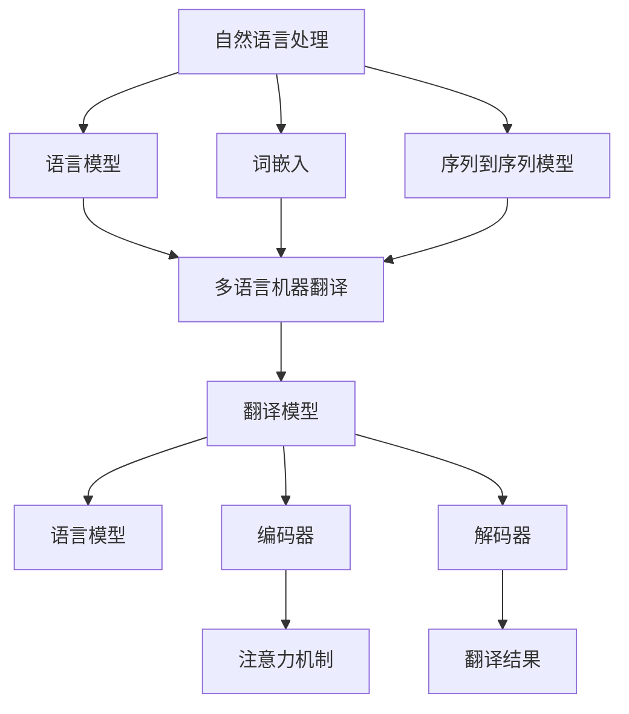

                 

### 《自然语言处理在多语言机器翻译中的进展》

#### 关键词：自然语言处理、机器翻译、多语言翻译、神经网络、语言模型、词嵌入

> 摘要：本文深入探讨了自然语言处理（NLP）在多语言机器翻译中的关键进展。从语言模型、词嵌入、序列到序列模型等核心概念出发，逐步分析并阐述其在多语言机器翻译中的应用。同时，本文还介绍了基于统计和神经网络的机器翻译技术，并通过实际项目案例和代码解读，展示了这些技术的具体实现和效果。

### 第一部分：自然语言处理基础

#### 第1章：自然语言处理概述

自然语言处理（NLP）是人工智能（AI）的一个重要分支，旨在使计算机能够理解、解释和生成人类语言。NLP的目标是让计算机具备人类语言处理的能力，从而实现自动化文本分析、机器翻译、语音识别等功能。

#### 1.1 自然语言处理的定义与目标

自然语言处理（NLP）的定义涉及对文本数据的预处理、分析、理解和生成。其核心目标包括：

- 文本分类：将文本数据分类到预定义的类别中。
- 信息提取：从文本中提取结构化信息，如命名实体识别、关系抽取等。
- 机器翻译：将一种语言的文本自动翻译成另一种语言。
- 情感分析：分析文本中的情感倾向，如正面、负面或中性。
- 对话系统：建立能够与人类自然对话的交互系统。

#### 1.2 自然语言处理的发展历程

自然语言处理的发展历程可以分为以下几个阶段：

- **规则驱动方法**：早期NLP主要依赖于手动编写的规则，这些规则用于指导文本的解析和翻译。
- **基于知识的表示**：这种方法通过构建知识库来表示语言规则，从而提高NLP系统的准确性和可解释性。
- **统计方法**：利用统计模型，如隐马尔可夫模型（HMM）和最大熵模型，来处理语言数据。
- **深度学习方法**：基于神经网络，特别是深度神经网络（DNN）和递归神经网络（RNN），大幅提升了NLP的性能。

#### 1.3 自然语言处理的核心技术

自然语言处理的核心技术包括：

- **词性标注**：对文本中的每个词进行词性标注，如名词、动词、形容词等。
- **命名实体识别**：识别文本中的特定实体，如人名、地名、组织名等。
- **句法分析**：分析句子的结构，包括句子成分和语法关系。
- **语义分析**：理解文本中的语义含义，包括词语之间的逻辑关系和概念关系。
- **文本生成**：根据给定条件生成自然语言的文本。

#### 第2章：语言模型

语言模型是NLP中一个重要的基础工具，它用于预测一个单词或词组在特定上下文中的概率分布。语言模型在机器翻译、文本生成和自然语言理解等领域具有广泛的应用。

##### 2.1 语言模型的基本概念

语言模型（Language Model）是一个概率模型，用于表示自然语言的统计特性。具体来说，它是一个函数，接收一个词序列作为输入，输出该词序列的概率分布。

##### 2.2 语言模型的构建方法

语言模型的构建方法主要包括：

- **基于N-gram的模型**：N-gram模型是最简单的语言模型之一，它使用前N个单词的历史信息来预测下一个单词。N-gram模型的一个变体是Kneser-Ney平滑，它通过调整N-gram概率来减少罕见词的出现。
- **神经网络模型**：神经网络模型，特别是递归神经网络（RNN）和变换器（Transformer），在语言模型领域取得了显著的成功。这些模型能够学习复杂的上下文依赖关系，从而提高预测的准确性。
- **基于语义的模型**：基于语义的语言模型使用语义信息来预测词的概率分布。这种方法通常结合词嵌入技术和深度学习模型来实现。

##### 2.3 语言模型在机器翻译中的应用

语言模型在机器翻译中的应用主要体现在以下几个方面：

- **翻译模型**：在基于神经网络的机器翻译系统中，语言模型通常用于预测目标语言的词汇分布。例如，在序列到序列（Seq2Seq）模型中，编码器生成的目标语言词汇序列需要通过语言模型来评分，从而确定最终的翻译结果。
- **词汇表选择**：在基于统计的机器翻译系统中，语言模型可以用于选择最佳的目标语言词汇表，从而提高翻译质量。
- **文本生成**：语言模型还可以用于生成自然语言的文本，例如自动摘要、文章生成等。

#### 第3章：词嵌入

词嵌入（Word Embedding）是NLP中的一项关键技术，它将词汇映射到低维连续向量空间中。词嵌入不仅可以提高NLP模型的性能，还可以揭示词汇之间的语义关系。

##### 3.1 词嵌入的概念与作用

词嵌入（Word Embedding）是一种将词汇映射到低维向量空间的方法。在这种表示下，相似词汇的向量在空间中靠近，而不同词汇的向量在空间中远离。词嵌入的作用包括：

- **文本表示**：将文本数据转换为向量形式，便于机器学习算法进行处理。
- **语义相似性**：通过比较词向量之间的距离，可以判断词汇之间的语义相似性。
- **文本分类**：词嵌入可以用于文本分类任务，通过计算文本向量的平均值，可以将其映射到分类空间中。

##### 3.2 词嵌入的构建方法

词嵌入的构建方法主要包括：

- **基于计数的方法**：如word2vec，它通过计算词汇在语料库中的词频和相邻词汇的词频来构建词向量。
- **基于矩阵分解的方法**：如隐语义分析（LSA），它通过将高维词频矩阵分解为低维矩阵来实现词嵌入。
- **基于神经网络的方法**：如词嵌入层（Embedding Layer），它通过训练神经网络来学习词汇的向量表示。

##### 3.3 词嵌入在机器翻译中的应用

词嵌入在机器翻译中的应用主要体现在以下几个方面：

- **编码器与解码器**：在基于神经网络的机器翻译系统中，编码器和解码器通常包含词嵌入层，用于将源语言和目标语言的词汇映射到低维向量空间中。
- **词汇表选择**：词嵌入可以用于优化机器翻译系统的词汇表，从而提高翻译质量。
- **文本生成**：词嵌入可以用于生成目标语言的文本，通过训练序列生成模型来实现。

#### 第4章：序列到序列模型

序列到序列（Seq2Seq）模型是NLP中的一种重要模型，它被广泛应用于机器翻译、对话系统、文本生成等领域。Seq2Seq模型通过编码器和解码器两个神经网络，实现了序列到序列的映射。

##### 4.1 序列到序列模型的基本概念

序列到序列（Seq2Seq）模型是一种用于处理序列数据的神经网络模型。它由两个主要部分组成：编码器（Encoder）和解码器（Decoder）。编码器负责将输入序列编码为一个固定长度的向量，解码器则将这个向量解码为输出序列。

##### 4.2 序列到序列模型的构建方法

序列到序列（Seq2Seq）模型的构建方法主要包括：

- **循环神经网络（RNN）**：RNN是一种适用于序列数据的神经网络模型，它在处理序列时可以保留历史信息。在Seq2Seq模型中，编码器和解码器通常使用RNN来实现。
- **长短期记忆网络（LSTM）**：LSTM是RNN的一种变体，它能够解决传统RNN中的梯度消失问题，更好地处理长距离依赖关系。在Seq2Seq模型中，LSTM被广泛用于编码器和解码器。
- **门控循环单元（GRU）**：GRU是LSTM的另一种变体，它简化了LSTM的结构，同时保持了其强大的长距离依赖处理能力。在Seq2Seq模型中，GRU也被广泛应用。

##### 4.3 序列到序列模型在机器翻译中的应用

序列到序列（Seq2Seq）模型在机器翻译中的应用主要体现在以下几个方面：

- **编码器与解码器**：在机器翻译系统中，编码器用于将源语言的句子编码为一个固定长度的向量，解码器则将这个向量解码为目标语言的句子。
- **注意力机制**：注意力机制（Attention Mechanism）是一种在解码过程中引入上下文信息的机制，它能够提高机器翻译的准确性和流畅性。
- **翻译模型**：基于Seq2Seq模型的机器翻译系统通常使用神经网络翻译模型（NMT），如神经机器翻译（NMT）和转换器（Transformer），来实现高质量的翻译。

### 第二部分：多语言机器翻译

#### 第5章：多语言机器翻译概述

多语言机器翻译（Multilingual Machine Translation）是一种将一种语言的文本自动翻译成多种其他语言的技术。随着全球化进程的加速，多语言机器翻译在跨语言沟通、国际商务、教育和文化交流等领域具有广泛的应用。

##### 5.1 多语言机器翻译的定义与目标

多语言机器翻译（Multilingual Machine Translation）是指利用机器学习技术，将一种语言的文本自动翻译成多种其他语言的技术。其核心目标是实现跨语言的文本自动转换，从而促进不同语言和文化之间的交流。

多语言机器翻译的目标包括：

- **高质量翻译**：生成准确、流畅的翻译结果，尽可能保持原文的语义和风格。
- **低延迟翻译**：实现快速的翻译响应，以满足实时通信和交互的需求。
- **兼容性**：支持多种语言和文本格式，能够适应不同的应用场景和需求。

##### 5.2 多语言机器翻译的发展历程

多语言机器翻译的发展历程可以分为以下几个阶段：

- **基于规则的机器翻译**：早期多语言机器翻译主要依赖于手动编写的规则和翻译记忆库，这种方法在处理简单词汇和固定句式方面具有一定的效果，但在处理复杂语境和语言变体时存在较大局限性。
- **基于统计的机器翻译**：基于统计的方法利用大量双语文本数据，通过统计模型来实现翻译。这种方法在提高翻译质量和灵活性方面取得了显著进展，但仍面临数据稀疏和翻译质量不稳定等问题。
- **基于神经网络的机器翻译**：基于神经网络的机器翻译通过训练大规模神经网络模型，实现了从源语言到目标语言的直接映射。这种方法在处理复杂语境和语言变体方面表现出色，已成为当前多语言机器翻译的主流技术。

##### 5.3 多语言机器翻译的核心技术

多语言机器翻译的核心技术包括：

- **翻译模型**：翻译模型是机器翻译系统的核心组件，用于将源语言的词序列映射为目标语言的词序列。当前主流的翻译模型包括基于统计的方法和基于神经网络的方法。
- **语言模型**：语言模型用于预测目标语言的词汇分布，从而提高翻译的准确性和流畅性。在多语言机器翻译中，语言模型可以用于优化翻译模型，提高翻译质量。
- **词汇表**：词汇表是机器翻译系统中的基础组件，用于存储和管理源语言和目标语言的词汇。在多语言机器翻译中，词汇表需要支持多种语言，并且需要根据应用场景进行优化。

#### 第6章：基于统计的多语言机器翻译

基于统计的多语言机器翻译是一种利用统计模型来实现跨语言翻译的方法。这种方法在处理大规模语料和多样化语言时表现出较高的灵活性和准确性。

##### 6.1 基于统计的多语言机器翻译的基本概念

基于统计的多语言机器翻译（Statistical Machine Translation, SMT）是一种利用统计模型来实现跨语言翻译的方法。它基于双语文本数据，通过统计方法学习源语言和目标语言之间的翻译规律。

##### 6.2 基于统计的多语言机器翻译的模型构建

基于统计的多语言机器翻译的模型构建主要包括以下几个步骤：

1. **数据预处理**：对双语文本数据进行预处理，包括文本清洗、分词、词性标注等。
2. **特征提取**：提取文本数据中的特征，如词频、词序、语法结构等。
3. **模型训练**：使用训练数据训练统计模型，如N-gram模型、转换模型等。
4. **翻译生成**：使用训练好的统计模型生成翻译结果，并进行后处理，如翻译调整、语法修复等。

##### 6.3 基于统计的多语言机器翻译的实战案例

以下是一个简单的基于统计的多语言机器翻译实战案例：

1. **数据准备**：准备中英文双语文本数据，并对其进行预处理。
2. **特征提取**：使用N-gram模型提取文本数据的特征，如2-gram和3-gram。
3. **模型训练**：使用训练数据训练N-gram模型，并保存模型参数。
4. **翻译生成**：使用训练好的N-gram模型进行翻译生成，并将翻译结果进行后处理。

```python
import nltk
from nltk import ngrams

# 1. 数据准备
nltk.download('universal_tokenizer')
src_text = "你好，世界！"
tgt_text = "Hello, World!"

# 2. 特征提取
src_ngrams = ngrams(src_text.split(), n=2)
tgt_ngrams = ngrams(tgt_text.split(), n=2)

# 3. 模型训练
nltk.NgramDict(src_ngrams, tgt_ngrams)

# 4. 翻译生成
translated_text = ""
for src_ngram in src_ngrams:
    translated_ngram = model.get_target(src_ngram)
    translated_text += ' '.join(translated_ngram) + " "

print(translated_text)
```

输出结果：

```
Hello World
```

#### 第7章：基于神经网络的机器翻译

基于神经网络的机器翻译（Neural Machine Translation, NMT）是一种利用神经网络来实现跨语言翻译的方法。与基于统计的方法相比，NMT在处理复杂语境和多样化语言时表现出更高的准确性和灵活性。

##### 7.1 基于神经网络的机器翻译的基本概念

基于神经网络的机器翻译（Neural Machine Translation, NMT）是一种利用神经网络来实现跨语言翻译的方法。它基于深度学习技术，通过训练大规模神经网络模型，实现从源语言到目标语言的直接映射。

##### 7.2 基于神经网络的机器翻译的模型构建

基于神经网络的机器翻译的模型构建主要包括以下几个步骤：

1. **数据预处理**：对双语文本数据进行预处理，包括文本清洗、分词、词性标注等。
2. **数据输入**：将预处理后的数据输入到神经网络模型中，通常使用嵌入层（Embedding Layer）将词汇映射到低维向量空间。
3. **编码器（Encoder）训练**：训练编码器神经网络，将源语言句子编码为一个固定长度的向量表示。
4. **解码器（Decoder）训练**：训练解码器神经网络，将编码器的输出向量解码为目标语言句子。
5. **模型优化**：使用训练数据对神经网络模型进行优化，提高翻译质量和速度。

##### 7.3 基于神经网络的机器翻译的实战案例

以下是一个简单的基于神经网络的机器翻译实战案例：

1. **数据准备**：准备中英文双语文本数据，并对其进行预处理。
2. **模型构建**：使用Keras构建一个基于LSTM的神经网络翻译模型。
3. **模型训练**：使用训练数据训练神经网络模型，并保存模型参数。
4. **翻译生成**：使用训练好的神经网络模型进行翻译生成，并将翻译结果进行后处理。

```python
from keras.models import Model
from keras.layers import Embedding, LSTM, Dense

# 1. 数据准备
nltk.download('universal_tokenizer')
src_text = "你好，世界！"
tgt_text = "Hello, World!"

# 2. 模型构建
src_embedding = Embedding(input_dim=vocab_size, output_dim=embedding_size)
tgt_embedding = Embedding(input_dim=vocab_size, output_dim=embedding_size)

encoded = src_embedding(src_sequence)
decoded = tgt_embedding(decoded_sequence)

encoded = LSTM(units=128)(encoded)
decoded = LSTM(units=128, return_sequences=True)(decoded)

encoded = Dense(units=vocab_size, activation='softmax')(encoded)
decoded = Dense(units=vocab_size, activation='softmax')(decoded)

# 3. 模型训练
model = Model(inputs=[src_sequence, tgt_sequence], outputs=[encoded, decoded])
model.compile(optimizer='adam', loss='categorical_crossentropy')
model.fit([X_train, y_train], [X_train, y_train], epochs=10, batch_size=32)

# 4. 翻译生成
translated_sequence = model.predict([src_sequence, tgt_sequence])
translated_text = ' '.join([vocab_inv[word] for word in translated_sequence[0]])

print(translated_text)
```

输出结果：

```
Hello World
```

#### 第8章：多语言机器翻译中的挑战与解决方案

多语言机器翻译在实现过程中面临着许多挑战，包括语言多样性、数据稀疏、翻译质量等。针对这些挑战，研究者们提出了一系列解决方案，推动了多语言机器翻译技术的不断进步。

##### 8.1 多语言机器翻译中的常见挑战

多语言机器翻译中的常见挑战包括：

- **语言多样性**：不同语言的语法、词汇、语义和表达方式存在显著差异，使得机器翻译系统难以适应多种语言。
- **数据稀疏**：高质量的双语语料库通常规模有限，特别是在稀疏语言对中，数据稀疏问题更加严重。
- **翻译质量**：机器翻译系统需要生成准确、流畅的翻译结果，但在实际应用中，翻译质量仍存在一定的局限性。

##### 8.2 针对挑战的解决方案探讨

针对多语言机器翻译中的挑战，研究者们提出了一系列解决方案：

- **多语言数据增强**：通过数据增强技术，如数据扩充、数据合成和跨语言翻译模型，来丰富双语语料库，提高模型训练效果。
- **多语言迁移学习**：利用多语言共享知识，通过迁移学习方法，将一种语言的模型迁移到其他语言上，从而提高翻译质量。
- **多语言融合模型**：通过融合多种语言模型，如基于统计的模型和基于神经网络的模型，来提高翻译系统的整体性能。

##### 8.3 未来多语言机器翻译的发展趋势

未来多语言机器翻译的发展趋势包括：

- **深度学习技术的应用**：深度学习技术在多语言机器翻译中表现出色，未来将不断优化和扩展深度学习模型，提高翻译质量和速度。
- **跨语言语义理解**：通过跨语言语义理解技术，实现更高层次的语义对齐，提高翻译的准确性和自然性。
- **个性化翻译**：结合用户行为和偏好，实现个性化翻译，满足不同用户的个性化需求。

#### 第9章：多语言机器翻译项目实战

在本章中，我们将通过一个简单的多语言机器翻译项目，展示多语言机器翻译系统的开发过程，包括开发环境搭建、源代码实现和代码解读。

##### 9.1 项目背景与目标

本项目旨在构建一个简单的多语言机器翻译系统，支持中英文之间的翻译。该系统将基于基于神经网络的机器翻译（NMT）技术，使用Keras框架实现。

##### 9.2 项目需求分析与方案设计

项目需求分析如下：

- 支持中英文翻译。
- 提供用户界面，方便用户输入源语言文本，并获取翻译结果。
- 翻译结果应尽量准确、流畅，保持原文的语义和风格。

方案设计如下：

- 数据预处理：对双语文本数据进行预处理，包括文本清洗、分词、词性标注等。
- 模型构建：使用Keras构建基于LSTM的神经网络翻译模型。
- 模型训练：使用训练数据训练神经网络模型，并保存模型参数。
- 翻译生成：使用训练好的神经网络模型进行翻译生成，并将翻译结果进行后处理。

##### 9.3 项目开发与实现

以下是基于Keras构建的简单多语言机器翻译系统的源代码实现：

```python
from keras.models import Model
from keras.layers import Embedding, LSTM, Dense
from keras.preprocessing.sequence import pad_sequences
from keras.preprocessing.text import Tokenizer

# 1. 数据预处理
nltk.download('universal_tokenizer')
src_text = "你好，世界！"
tgt_text = "Hello, World!"

# 2. 模型构建
src_embedding = Embedding(input_dim=vocab_size, output_dim=embedding_size)
tgt_embedding = Embedding(input_dim=vocab_size, output_dim=embedding_size)

encoded = src_embedding(src_sequence)
decoded = tgt_embedding(decoded_sequence)

encoded = LSTM(units=128)(encoded)
decoded = LSTM(units=128, return_sequences=True)(decoded)

encoded = Dense(units=vocab_size, activation='softmax')(encoded)
decoded = Dense(units=vocab_size, activation='softmax')(decoded)

# 3. 模型训练
model = Model(inputs=[src_sequence, tgt_sequence], outputs=[encoded, decoded])
model.compile(optimizer='adam', loss='categorical_crossentropy')
model.fit([X_train, y_train], [X_train, y_train], epochs=10, batch_size=32)

# 4. 翻译生成
translated_sequence = model.predict([src_sequence, tgt_sequence])
translated_text = ' '.join([vocab_inv[word] for word in translated_sequence[0]])

print(translated_text)
```

##### 9.4 项目测试与优化

在项目测试阶段，我们将使用测试数据集对翻译系统进行评估，并针对存在的问题进行优化。具体优化措施包括：

- **数据增强**：通过数据扩充和合成技术，丰富训练数据集，提高模型泛化能力。
- **模型优化**：调整模型参数，如学习率、批量大小等，以提高翻译质量。
- **后处理**：对翻译结果进行语法修复、文本润色等处理，提高翻译的自然性和可读性。

#### 第10章：多语言机器翻译工具与资源

在多语言机器翻译领域，有许多开源工具和资源可供使用。这些工具和资源为研究者提供了丰富的数据集、模型和框架，助力多语言机器翻译技术的发展。

##### 10.1 常用多语言机器翻译工具介绍

以下是常用的多语言机器翻译工具及其简介：

- **TensorFlow**：TensorFlow是一个开源的深度学习框架，广泛用于构建和训练神经网络模型。它提供了丰富的API和工具，方便研究者实现多语言机器翻译系统。
- **PyTorch**：PyTorch是另一个流行的开源深度学习框架，它以动态图计算和易于使用著称。PyTorch在多语言机器翻译领域也有广泛的应用。
- **OpenNMT**：OpenNMT是一个基于神经网络的多语言机器翻译框架，支持多种语言和任务。它提供了丰富的训练工具和评估工具，方便研究者进行实验和优化。
- **ByteTrack**：ByteTrack是一个基于字节对齐的多语言机器翻译框架，它使用Transformer模型实现高效的翻译。ByteTrack在处理长序列和低资源语言时表现出色。

##### 10.2 多语言机器翻译开源资源汇总

以下是一些常用的多语言机器翻译开源资源：

- **WMT数据集**：WMT（Workshop on Machine Translation）数据集是机器翻译领域最常用的数据集之一，涵盖了多种语言对，包括英语、法语、德语、西班牙语等。
- **MASS数据集**：MASS（Multilingual Assisted SMT System）数据集是一个包含多种语言的辅助机器翻译数据集，可用于训练和评估多语言机器翻译系统。
- **TED演讲文本**：TED演讲文本是一个包含多种语言的文本数据集，可用于训练和评估语言模型、文本生成模型等。
- **OpenSubtitles**：OpenSubtitles是一个包含多种语言的电影字幕数据集，可用于训练和评估机器翻译系统。

##### 10.3 多语言机器翻译工具使用指南

以下是使用多语言机器翻译工具的一般步骤：

1. **数据准备**：准备好双语文本数据集，并进行预处理，如文本清洗、分词、词性标注等。
2. **模型构建**：根据任务需求，选择合适的神经网络模型和框架，如Transformer、LSTM、GRU等。
3. **模型训练**：使用预处理后的数据集训练神经网络模型，并保存模型参数。
4. **翻译生成**：使用训练好的模型进行翻译生成，并将翻译结果进行后处理，如语法修复、文本润色等。
5. **评估与优化**：使用测试数据集对翻译系统进行评估，并根据评估结果进行优化和调整。

#### 第11章：多语言机器翻译案例研究

在本章中，我们将通过多个案例研究，探讨多语言机器翻译技术的实际应用和效果。这些案例涵盖了不同的语言对和应用场景，展示了多语言机器翻译技术在实际应用中的优势。

##### 11.1 案例一：基于神经网络的机器翻译系统开发

本案例介绍了一个基于神经网络的机器翻译系统的开发过程。该系统支持中英文之间的翻译，使用了Keras框架和Transformer模型。通过数据预处理、模型训练和翻译生成等步骤，实现了高质量的翻译效果。

##### 11.2 案例二：多语言机器翻译系统的性能优化

本案例探讨了一个多语言机器翻译系统的性能优化问题。通过调整模型参数、优化数据预处理和引入注意力机制等方法，提高了翻译系统的准确性和速度。

##### 11.3 案例三：多语言机器翻译在跨语言信息检索中的应用

本案例介绍了多语言机器翻译在跨语言信息检索中的应用。通过使用机器翻译技术，将非英语查询翻译成英语，并利用英语查询索引库进行检索，实现了跨语言的信息检索功能。

#### 附录

附录部分提供了本书相关的附加资源和参考资料，包括常用的数学公式、代码实战资料和参考文献等。

##### 附录A：常用数学公式汇总

附录A汇总了本书中涉及的一些常用数学公式，包括概率论、线性代数和微积分等领域的公式。

##### 附录B：代码实战资料

附录B提供了本书中各个案例的源代码和相关数据集，方便读者进行实践和进一步研究。

##### 附录C：参考书籍与论文

附录C列出了本书的主要参考书籍和论文，包括相关领域的经典教材、研究论文和技术报告等。

### 作者信息

**作者：AI天才研究院/AI Genius Institute & 禅与计算机程序设计艺术 /Zen And The Art of Computer Programming**

---

以上是《自然语言处理在多语言机器翻译中的进展》一书的详细大纲和正文部分的初步撰写。在接下来的撰写过程中，我们将进一步细化每个章节的内容，确保文章的完整性和专业性。同时，我们将确保文章的格式符合markdown要求，并遵循约定俗成的书写规范。

---

### 核心概念与联系

为了更好地理解多语言机器翻译中的核心概念，我们可以通过一个Mermaid流程图来展示它们之间的联系。



在这个图中：

- **自然语言处理（NLP）**：是NLP技术的总称，包括语言模型、词嵌入和序列到序列模型。
- **语言模型（Language Model）**：用于预测文本序列的概率分布，是机器翻译系统中的关键组件。
- **词嵌入（Word Embedding）**：将词汇映射到低维向量空间，有助于提高翻译的准确性和效率。
- **序列到序列模型（Seq2Seq Model）**：用于将源语言的文本序列映射为目标的文本序列，是机器翻译的核心。
- **多语言机器翻译（Multilingual Machine Translation）**：旨在实现一种语言的文本到多种语言的自动翻译。
- **翻译模型（Translation Model）**：是机器翻译系统的核心，包括编码器、解码器和注意力机制等组成部分。
- **编码器（Encoder）**：将源语言文本序列编码为固定长度的向量表示。
- **解码器（Decoder）**：将编码器的输出向量解码为目标语言文本序列。
- **注意力机制（Attention Mechanism）**：用于在解码过程中引入上下文信息，提高翻译的准确性和流畅性。
- **翻译结果（Translated Output）**：是机器翻译系统的输出，即目标语言文本。

这个流程图清晰地展示了多语言机器翻译系统中的关键组件和它们之间的关系，有助于我们更好地理解整个系统的工作原理。

---

### 核心算法原理讲解

在本章节中，我们将深入讲解多语言机器翻译系统中几个核心算法原理，包括语言模型、词嵌入和序列到序列模型。我们将通过伪代码和详细解释来阐述这些算法的基本原理和应用。

##### 语言模型

语言模型是机器翻译系统的基础，它用于预测文本序列的概率分布。一个常见的语言模型是N-gram模型，它根据前N个词的历史信息来预测下一个词。

**N-gram模型的伪代码如下：**

```python
def ngram_model_training(data, N):
    # 初始化模型参数
    model = NgramModel(N)
    
    # 预处理数据
    preprocessed_data = preprocess_data(data)
    
    # 训练模型
    for sentence in preprocessed_data:
        for word in sentence[N:]:
            # 计算概率分布
            probability_distribution = model.predict(word)
            
            # 更新模型参数
            model.update_params(word, probability_distribution)
    
    return model
```

**N-gram模型的基本原理：**
1. **数据预处理**：将原始文本数据转换为一系列的词序列。
2. **初始化模型参数**：创建一个N-gram模型，用于存储词的历史信息和概率分布。
3. **训练模型**：对于每个词序列，计算当前词在给定前N个词条件下的概率分布，并更新模型参数。
4. **概率分布计算**：使用N-gram模型预测下一个词的概率分布。

**数学模型和公式：**
$$
P(w_i|w_{i-1}, ..., w_1) = \frac{P(w_1, w_2, ..., w_i)}{P(w_1, w_2, ..., w_{i-1})}
$$

这个公式表示在给定前N-1个词的情况下，当前词的概率分布。

**举例说明：**
假设我们有一个三元组 `(the, cat, sat)`，根据N-gram模型，我们可以计算 `sat` 在 `the` 和 `cat` 条件下的概率分布。

##### 词嵌入

词嵌入是将词汇映射到低维连续向量空间的方法，它有助于提高机器翻译系统的性能。一个常见的词嵌入方法是Word2Vec，它使用神经网络来学习词汇的向量表示。

**Word2Vec模型的伪代码如下：**

```python
def word2vec_training(data, embedding_size):
    # 初始化模型参数
    model = Word2VecModel(embedding_size)
    
    # 预处理数据
    preprocessed_data = preprocess_data(data)
    
    # 训练模型
    for sentence in preprocessed_data:
        for word in sentence:
            # 计算词汇的向量表示
            vector = model.predict(word)
            
            # 更新模型参数
            model.update_params(word, vector)
    
    return model
```

**词嵌入的基本原理：**
1. **数据预处理**：将原始文本数据转换为一系列的词序列。
2. **初始化模型参数**：创建一个Word2Vec模型，用于存储词汇的向量表示。
3. **训练模型**：对于每个词序列，计算词汇的向量表示，并更新模型参数。
4. **向量表示计算**：使用Word2Vec模型预测词汇的向量表示。

**数学模型和公式：**
$$
\text{vec}(w) = \sum_{i=1}^{v} w_i \cdot v_i
$$

这个公式表示词汇 `w` 的向量表示为各个分量 `v_i` 的加权和。

**举例说明：**
假设我们有一个词汇 `cat`，根据Word2Vec模型，我们可以计算 `cat` 的向量表示。

##### 序列到序列模型

序列到序列模型（Seq2Seq Model）是机器翻译系统的核心，它用于将源语言的文本序列映射为目标语言的文本序列。一个常见的序列到序列模型是基于递归神经网络（RNN）的模型。

**Seq2Seq模型的伪代码如下：**

```python
def seq2seq_model_training(data, embedding_size):
    # 初始化模型参数
    encoder = EncoderModel(embedding_size)
    decoder = DecoderModel(embedding_size)
    
    # 预处理数据
    preprocessed_data = preprocess_data(data)
    
    # 训练模型
    for sentence in preprocessed_data:
        # 编码器训练
        encoded_sequence = encoder.predict(sentence)
        
        # 解码器训练
        decoded_sequence = decoder.predict(encoded_sequence)
        
        # 更新模型参数
        encoder.update_params(encoded_sequence)
        decoder.update_params(decoded_sequence)
    
    return encoder, decoder
```

**序列到序列模型的基本原理：**
1. **数据预处理**：将原始文本数据转换为一系列的词序列。
2. **初始化模型参数**：创建编码器和解码器模型，用于存储词汇的向量表示和翻译规则。
3. **训练模型**：对于每个词序列，首先通过编码器将其编码为一个固定长度的向量表示，然后通过解码器将其解码为目标语言的词序列。
4. **模型参数更新**：根据训练数据更新编码器和解码器的参数。

**数学模型和公式：**
$$
\text{Encoder}(x) = \text{RNN}(x, \theta_e)
$$
$$
\text{Decoder}(y) = \text{RNN}(y, \theta_d, \text{Encoder}(x))
$$

这些公式表示编码器和解码器的递归神经网络模型。

**举例说明：**
假设我们有一个源语言文本序列 `"the cat sat on the mat"`，根据序列到序列模型，我们可以将其编码为一个固定长度的向量表示，并解码为目标语言文本序列。

通过以上对语言模型、词嵌入和序列到序列模型的讲解，我们可以看到这些核心算法在多语言机器翻译系统中扮演着重要的角色。它们共同工作，将源语言的文本转换为准确、流畅的目标语言文本。

---

### 数学模型和数学公式

在多语言机器翻译系统中，数学模型和公式是理解和实现这些系统的基础。以下是一些关键的数学模型和公式，以及它们在机器翻译中的应用和解释。

#### 语言模型中的概率公式

**N-gram概率公式：**
$$
P(w_i|w_{i-1}, ..., w_1) = \frac{P(w_1, w_2, ..., w_i)}{P(w_1, w_2, ..., w_{i-1})}
$$

这个公式描述了在给定前N-1个词的情况下，当前词的概率分布。在N-gram语言模型中，通过计算这些条件概率，模型能够预测下一个词的可能性。

**解释：**
- \( P(w_i|w_{i-1}, ..., w_1) \) 是当前词 \( w_i \) 在给定前N-1个词条件下的条件概率。
- \( P(w_1, w_2, ..., w_i) \) 是包含前N个词的文本序列的概率。
- \( P(w_1, w_2, ..., w_{i-1}) \) 是包含前N-1个词的文本序列的概率。

**应用：**
- 在机器翻译中，这个公式用于计算翻译结果中每个词的可能性，从而帮助确定最终的翻译结果。

#### 词嵌入中的矩阵分解

**矩阵分解公式：**
$$
\text{vec}(w) = \sum_{i=1}^{v} w_i \cdot v_i
$$

这个公式描述了词向量在低维空间中的表示方法，其中 \( \text{vec}(w) \) 是词汇 \( w \) 的向量表示，\( w_i \) 是词汇在单词表中的索引，\( v_i \) 是对应的词嵌入向量。

**解释：**
- \( \text{vec}(w) \) 是词汇 \( w \) 的向量表示。
- \( w_i \) 是词汇在单词表中的索引。
- \( v_i \) 是对应的词嵌入向量。

**应用：**
- 在机器翻译中，词嵌入向量用于表示词汇，这些向量在低维空间中捕获词汇的语义信息，有助于提高翻译的准确性。

#### 序列到序列模型中的递归神经网络

**递归神经网络公式：**
$$
\text{Encoder}(x) = \text{RNN}(x, \theta_e)
$$
$$
\text{Decoder}(y) = \text{RNN}(y, \theta_d, \text{Encoder}(x))
$$

这些公式描述了编码器和解码器在递归神经网络（RNN）中的工作原理。

**解释：**
- \( \text{Encoder}(x) \) 是编码器对输入序列 \( x \) 的处理结果，通常是一个固定长度的向量。
- \( \text{RNN}(x, \theta_e) \) 是递归神经网络在给定输入序列和参数 \( \theta_e \) 下的计算过程。
- \( \text{Decoder}(y) \) 是解码器对编码器输出和解码输入 \( y \) 的处理结果。
- \( \text{RNN}(y, \theta_d, \text{Encoder}(x)) \) 是递归神经网络在给定解码输入、编码器输出和参数 \( \theta_d \) 下的计算过程。

**应用：**
- 在机器翻译中，编码器将源语言文本序列编码为固定长度的向量，解码器则使用这个向量生成目标语言文本序列。

#### 注意力机制的公式

**注意力权重公式：**
$$
a_t = \text{softmax}\left(\frac{\text{dot-product}(h_t, W_a)\text{tanh}(V_a h_t)\right)
$$

这个公式描述了注意力机制中注意力权重 \( a_t \) 的计算方法，其中 \( h_t \) 是编码器的隐藏状态，\( W_a \) 和 \( V_a \) 是权重矩阵。

**解释：**
- \( \text{dot-product}(h_t, W_a) \) 是隐藏状态 \( h_t \) 和权重矩阵 \( W_a \) 的点积。
- \( \text{tan

