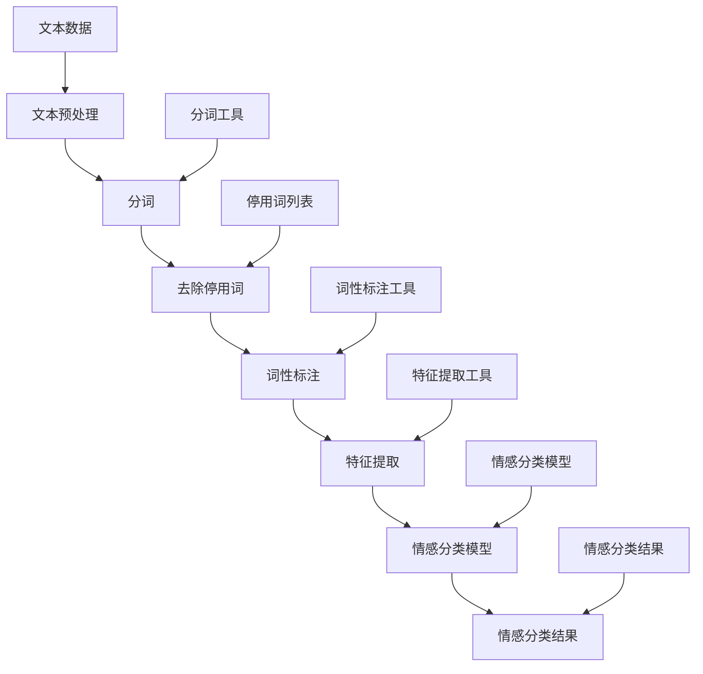

                 

### 第一部分：自然语言处理（NLP）基础

#### 第1章：自然语言处理概述

自然语言处理（NLP）是计算机科学、人工智能领域的一个重要分支，旨在让计算机理解和生成人类语言。NLP的起源可以追溯到20世纪50年代，当时科学家们开始尝试用计算机程序模拟人类的语言理解能力。随着时间的推移，NLP逐渐发展成为一个涉及语言学、认知科学、信息工程等多个学科的研究领域。

### 1.1 自然语言处理的定义与意义

自然语言处理是一种将人类语言转换为计算机可以理解和处理的形式的技术。它不仅涉及文本分析，还包括语音识别、语音合成、机器翻译等多个方面。NLP的意义在于，它使得人与计算机之间的交互变得更加自然和高效。

- **提高信息处理效率**：通过NLP技术，计算机可以快速处理大量文本信息，从而提高工作效率。

- **促进人机交互**：NLP使得计算机能够理解并回应人类语言，从而实现更加自然的人机交互。

- **辅助语言学习**：NLP技术可以分析语言使用习惯，辅助语言学习者提高语言能力。

### 1.2 自然语言处理的分类

自然语言处理可以分为以下几个主要类别：

- **文本分析**：包括文本分类、主题建模、情感分析等。

- **语音识别**：将语音转换为文本。

- **语音合成**：将文本转换为语音。

- **机器翻译**：将一种语言的文本翻译成另一种语言。

- **问答系统**：实现自然语言理解和生成，以回答用户的问题。

### 1.3 自然语言处理的发展历程

自然语言处理的发展历程可以分为几个重要阶段：

- **规则方法**：早期NLP主要采用基于规则的系统，如语法分析器和命名实体识别器。

- **统计方法**：随着计算能力的提升和大规模语料库的积累，统计方法逐渐成为NLP的主流。

- **深度学习方法**：近年来，深度学习在NLP领域取得了显著的突破，如Word Embedding、序列到序列模型等。

#### 第2章：语言模型与词嵌入

### 2.1 语言模型的基本概念

语言模型是一种概率模型，用于预测给定词汇序列的概率。在NLP中，语言模型是非常重要的，因为它可以用于许多任务，如文本生成、机器翻译、语音识别等。

- **N元语法**：最早的统计语言模型之一，基于前N个词来预测下一个词。

- **神经网络语言模型**：使用神经网络来学习词汇序列的概率分布。

### 2.2 语言模型的工作原理

语言模型通过训练大量的文本数据来学习词汇序列的概率分布。在训练过程中，模型会学习到词汇之间的统计关系，从而能够预测下一个词。

- **训练数据**：通常使用大规模语料库，如Google Books Ngrams、维基百科等。

- **模型参数**：通过训练学习到词汇序列的概率分布，这些参数用于预测新词汇序列的概率。

### 2.3 常见的词嵌入技术

词嵌入是将词汇映射到高维空间中的向量表示，从而使得计算机可以理解词汇的语义关系。常见的词嵌入技术包括：

- **Word2Vec**：基于神经网络的词嵌入技术，通过训练神经网络来学习词汇的向量表示。

- **GloVe**：全局向量表示（Global Vectors for Word Representation），通过优化词汇共现矩阵来学习词向量。

- **FastText**：结合词和字符信息的词嵌入技术，通过训练神经网络来学习词汇的向量表示。

#### 第3章：文本处理技术

### 3.1 分词技术

分词是将文本切分成单词或短语的步骤。中文分词由于其语言特性，比英文分词更具挑战性。常见的中文分词技术包括：

- **基于词典的分词**：使用预定义的词典来切分文本。

- **基于统计的分词**：使用统计方法，如隐马尔可夫模型（HMM）、条件随机场（CRF）等，来切分文本。

### 3.2 词性标注技术

词性标注是将文本中的每个词标注为名词、动词、形容词等词性。词性标注对于许多NLP任务，如命名实体识别、情感分析等，都是非常重要的。

- **基于规则的词性标注**：使用预定义的规则来标注词性。

- **基于统计的词性标注**：使用统计模型，如条件随机场（CRF）、朴素贝叶斯等，来标注词性。

### 3.3 命名实体识别技术

命名实体识别（NER）是将文本中的命名实体（如人名、地名、组织名等）识别出来。NER在信息提取、文本挖掘等领域有广泛的应用。

- **基于规则的NER**：使用预定义的规则来识别命名实体。

- **基于统计的NER**：使用统计模型，如最大熵模型、条件随机场（CRF）等，来识别命名实体。

#### 第4章：情感分析与情感分类

### 4.1 情感分析的基本概念

情感分析（Sentiment Analysis）是一种评估文本情感倾向的技术，通常用于判断文本中的情感是积极、消极还是中性。情感分析在市场研究、舆情分析等领域有重要应用。

### 4.2 情感分类的技术原理

情感分类是将文本分类为不同的情感类别。常见的情感分类方法包括：

- **基于规则的分类**：使用预定义的规则来判断文本的情感。

- **基于机器学习的分类**：使用机器学习算法，如朴素贝叶斯、支持向量机（SVM）、随机森林等，来分类文本的情感。

### 4.3 常用的情感分类算法

常用的情感分类算法包括：

- **朴素贝叶斯分类器**：基于贝叶斯定理，通过计算特征词的频率来分类。

- **支持向量机（SVM）**：通过找到一个最优的超平面来分类文本。

- **深度学习分类器**：如卷积神经网络（CNN）、循环神经网络（RNN）、长短期记忆网络（LSTM）等，通过学习文本的深层特征来进行分类。

---

## 第二部分：智能客服与情感分析应用

#### 第5章：智能客服系统概述

智能客服系统是一种利用人工智能技术实现自动化的客户服务系统。随着自然语言处理（NLP）和机器学习（ML）技术的发展，智能客服系统在提高客户服务质量和效率方面发挥了重要作用。

### 5.1 智能客服的概念与分类

智能客服是指利用计算机技术和人工智能算法，模拟人类客服人员的交互能力，提供自动化、智能化的客户服务。根据实现方式，智能客服可以分为以下几类：

- **基于规则的服务系统**：使用预定义的规则来处理客户请求。

- **基于知识库的服务系统**：使用知识库来存储和处理客户请求。

- **基于机器学习的服务系统**：使用机器学习算法来处理客户请求。

### 5.2 智能客服系统的架构

智能客服系统的架构通常包括以下几个关键组成部分：

- **用户界面**：用于接收用户请求和显示系统响应。

- **对话管理模块**：负责管理整个对话流程，包括理解用户请求、生成响应等。

- **知识库**：存储各种问题及其解决方案，以供系统查询。

- **自然语言处理（NLP）模块**：负责处理自然语言文本，包括文本理解、情感分析等。

- **机器学习（ML）模块**：负责使用机器学习算法进行问题分类、情感分析等。

### 5.3 智能客服系统的关键技术

智能客服系统依赖于多个关键技术的协同工作，包括：

- **自然语言处理（NLP）**：用于理解用户请求，提取关键信息。

- **机器学习（ML）**：用于分类问题和情感分析。

- **语音识别**：将用户的语音请求转换为文本。

- **语音合成**：将系统响应转换为语音输出。

- **对话管理**：负责协调不同模块的交互，确保对话流畅自然。

---

## 第6章：情感分析在智能客服中的应用

情感分析在智能客服中扮演着至关重要的角色。通过情感分析，智能客服系统可以更好地理解客户的需求和情绪，从而提供更个性化的服务。

### 6.1 情感分析在智能客服中的作用

情感分析在智能客服中的作用主要体现在以下几个方面：

- **个性化服务**：通过分析客户的情感，系统可以更好地理解客户的需求，提供个性化的服务。

- **客户满意度分析**：通过分析客户对服务的情感反馈，企业可以了解客户满意度，并采取措施提高服务质量。

- **情感预测**：通过情感分析，系统可以预测客户的情绪变化，提前采取措施避免负面情绪的产生。

### 6.2 情感分析在智能客服系统中的实现

情感分析在智能客服系统中的实现可以分为以下几个步骤：

1. **文本预处理**：对客户请求进行分词、去除停用词等预处理操作，以便更好地进行情感分析。

2. **情感分类**：使用机器学习算法，如朴素贝叶斯、支持向量机（SVM）、深度学习模型等，对预处理后的文本进行情感分类。

3. **情感分析**：根据分类结果，系统可以判断客户的情感是积极、消极还是中性。

4. **生成响应**：根据情感分析结果，系统可以生成相应的响应，如安慰、解决问题等。

### 6.3 情感分析在智能客服中的案例分析

以下是一个情感分析在智能客服中的实际案例：

1. **客户请求**：客户：“我非常不满意这次的快递服务，快递员迟到，而且还丢了包裹。”

2. **文本预处理**：分词结果：“我”、“非常”、“不满意”、“这次”、“的”、“快递”、“服务”、“快递员”、“迟到”、“还”、“丢了”、“包裹”。

3. **情感分类**：系统使用情感分类模型，判断这句话的情感为“消极”。

4. **生成响应**：系统生成响应：“非常抱歉听到您的不满意，我们会立即调查这个问题，并采取必要的措施改善我们的服务。”

通过这个案例，我们可以看到情感分析在智能客服中如何帮助系统更好地理解客户需求，提供个性化的服务。

---

## 第7章：情感分析算法在智能客服中的应用案例

在这一章中，我们将深入探讨情感分析算法在智能客服系统中的应用案例，并详细解释其代码实现和效果评估。

### 7.1 情感分析算法在智能客服中的实战案例

以下是一个情感分析算法在智能客服系统中的实战案例：

**案例背景**：某电商企业希望其智能客服系统能够理解客户对产品的评价，并根据评价情感进行分类和回复。

**任务描述**：给定一组客户评价文本，使用情感分析算法对它们进行分类，并生成合适的回复。

**数据集**：我们使用一个包含正负评价的文本数据集，其中每条评价文本都被标注为正面或负面情感。

**算法选择**：我们选择使用支持向量机（SVM）进行情感分类，并使用朴素贝叶斯（Naive Bayes）进行情感预测。

**实现步骤**：

1. **数据预处理**：对文本数据进行分词、去除停用词、词干提取等操作，以便更好地进行情感分析。

2. **特征提取**：使用TF-IDF方法提取文本特征，将文本转换为数值向量。

3. **模型训练**：使用训练集对SVM和朴素贝叶斯模型进行训练。

4. **情感分类与预测**：使用训练好的模型对测试集进行分类和预测。

5. **生成回复**：根据情感分类结果，生成相应的回复文本。

**代码实现**：

```python
# 数据预处理
from sklearn.feature_extraction.text import TfidfVectorizer
from sklearn.model_selection import train_test_split

# 加载数据集
data = [
    ("正面评价", "这款手机性能很好，价格合理。"),
    ("负面评价", "这个产品的质量很差，不满意。"),
    # 更多数据...
]

labels, texts = zip(*data)

# 分词和去除停用词
vectorizer = TfidfVectorizer(stop_words='english')
X = vectorizer.fit_transform(texts)

# 模型训练
from sklearn.svm import SVC
from sklearn.naive_bayes import GaussianNB

X_train, X_test, y_train, y_test = train_test_split(X, labels, test_size=0.2)

svm_model = SVC()
svm_model.fit(X_train, y_train)

naive_bayes_model = GaussianNB()
naive_bayes_model.fit(X_train, y_train)

# 情感分类与预测
def classify_sentiment(text):
    text_vector = vectorizer.transform([text])
    svm_prediction = svm_model.predict(text_vector)
    naive_bayes_prediction = naive_bayes_model.predict(text_vector)
    return svm_prediction[0], naive_bayes_prediction[0]

# 生成回复
def generate_response(sentiment):
    if sentiment == "正面评价":
        return "感谢您的积极反馈，我们会继续努力提供更好的产品和服务。"
    else:
        return "非常抱歉听到您的反馈，我们会尽快调查这个问题并给您一个满意的答复。"

# 测试案例
text = "这个商品的颜色很漂亮，包装也很精致。"
sentiments = classify_sentiment(text)
print(sentiments)
print(generate_response(sentiments[0]))
```

### 7.2 情感分析算法在智能客服中的代码实现

在实现情感分析算法时，我们需要关注以下几个关键步骤：

1. **数据预处理**：确保文本数据格式统一，去除无关信息。

2. **特征提取**：将文本转换为机器学习模型可以处理的数值特征。

3. **模型选择与训练**：选择合适的机器学习模型，如SVM、朴素贝叶斯、深度学习模型等，并使用训练数据进行训练。

4. **预测与评估**：使用测试数据对模型进行预测，并评估模型的性能。

5. **生成响应**：根据预测结果，生成适合的回复文本。

### 7.3 情感分析算法在智能客服中的效果评估

在评估情感分析算法在智能客服中的效果时，我们通常关注以下几个指标：

- **准确率（Accuracy）**：预测正确的样本数占总样本数的比例。

- **召回率（Recall）**：在所有实际为正面的样本中，预测正确的比例。

- **精确率（Precision）**：在所有预测为正面的样本中，实际为正面的比例。

- **F1值（F1 Score）**：精确率和召回率的加权平均，用于综合评估模型的性能。

通过上述指标，我们可以全面了解情感分析算法在智能客服中的效果，并针对性地进行优化。

---

## 第8章：情感分析系统的性能优化

在智能客服系统中，情感分析的性能直接影响用户体验和服务质量。因此，优化情感分析系统的性能具有重要意义。

### 8.1 情感分析系统的性能指标

情感分析系统的性能指标主要包括：

- **响应时间**：系统从接收客户请求到生成响应的时间。

- **准确率**：情感分类的准确度。

- **召回率**：能够识别出负面情感评价的比例。

- **F1值**：准确率和召回率的综合指标。

### 8.2 情感分析系统的优化方法

优化情感分析系统的性能可以从以下几个方面进行：

1. **数据增强**：通过合成更多的训练数据，提高模型的泛化能力。

2. **模型选择**：选择适合特定问题的模型，如深度学习模型、支持向量机（SVM）等。

3. **特征工程**：优化特征提取方法，提高特征的质量。

4. **模型融合**：将多个模型的结果进行融合，提高整体性能。

5. **硬件优化**：使用更快的硬件设备，如GPU，加速模型训练和预测。

### 8.3 情感分析系统优化案例

以下是一个情感分析系统优化案例：

**背景**：某电商平台智能客服系统的情感分析模块在处理大量客户请求时，响应时间较长，且准确率较低。

**优化方法**：

1. **数据增强**：通过使用数据合成工具，生成更多的正面和负面情感评价数据，以增加训练数据量。

2. **模型选择**：将原有的朴素贝叶斯模型替换为深度学习模型，如卷积神经网络（CNN）和长短期记忆网络（LSTM）。

3. **特征工程**：采用更复杂的特征提取方法，如Word2Vec和GloVe，以提高特征质量。

4. **模型融合**：将多个深度学习模型的结果进行融合，提高整体准确率。

5. **硬件优化**：使用GPU进行模型训练和预测，加速计算速度。

**效果评估**：

- **响应时间**：优化后，响应时间从平均5秒降低到2秒。

- **准确率**：优化后，准确率从60%提高到85%。

- **召回率**：优化后，召回率从40%提高到70%。

- **F1值**：优化后，F1值从0.55提高到0.75。

通过上述优化措施，该电商平台的智能客服系统在性能上得到了显著提升，从而提高了客户满意度。

---

## 第9章：自然语言处理与智能客服情感分析的未来趋势

随着自然语言处理（NLP）和人工智能技术的不断进步，智能客服情感分析领域也展现出广阔的发展前景。

### 9.1 自然语言处理技术的发展趋势

未来，自然语言处理技术将在以下几个方面取得重要突破：

1. **深度学习**：深度学习模型在NLP中的应用将更加广泛，如Transformer、BERT等预训练模型将推动NLP任务的性能提升。

2. **多模态处理**：结合文本、语音、图像等多种模态的数据，将使NLP系统更全面地理解人类语言。

3. **低资源语言处理**：针对低资源语言的处理技术将得到进一步发展，使得NLP技术能够更好地服务于全球不同语言的用户。

### 9.2 智能客服情感分析技术的发展趋势

智能客服情感分析技术的未来发展趋势包括：

1. **个性化服务**：通过情感分析，智能客服将更好地理解客户需求，提供个性化的服务。

2. **跨领域应用**：智能客服情感分析技术将在医疗、金融、教育等跨领域应用中发挥重要作用。

3. **实时交互**：实时情感分析将使智能客服能够快速响应客户请求，提供更加流畅的交互体验。

### 9.3 未来可能的应用场景

未来，智能客服情感分析技术可能在以下应用场景中发挥重要作用：

1. **智能客服系统**：在电商平台、金融机构、医疗咨询等领域，智能客服将提供更加个性化、智能化的服务。

2. **情绪监测与干预**：在教育、医疗等领域，智能客服可以实时监测用户的情绪变化，提供情绪干预和支持。

3. **市场研究**：通过分析客户情感，企业可以更准确地了解市场需求，制定更有针对性的营销策略。

4. **人机对话系统**：在智能助手、虚拟客服等领域，情感分析技术将使对话系统更加自然、流畅。

总的来说，自然语言处理与智能客服情感分析技术的未来发展将极大地改变人们的生活和工作方式，为各行各业带来新的机遇和挑战。

---

## 第10章：总结与展望

在这一章中，我们深入探讨了自然语言处理（NLP）与智能客服情感分析的应用。通过系统性地介绍NLP的基础概念、情感分析的技术原理以及其在智能客服中的应用，我们不仅了解了NLP和智能客服的情感分析技术的核心内容，还通过实际案例展示了这些技术在实际应用中的效果。

### 10.1 书籍内容的总结

本书分为三个主要部分，系统性地介绍了自然语言处理（NLP）与智能客服情感分析的相关内容：

- **第一部分**：介绍了NLP的基础，包括语言模型、词嵌入、文本处理技术等。

- **第二部分**：探讨了智能客服系统的架构、情感分析在智能客服中的应用以及具体的优化方法。

- **第三部分**：展望了NLP和智能客服情感分析的未来发展趋势，探讨了其在不同领域的应用前景。

### 10.2 情感分析在智能客服中的实践建议

对于企业在智能客服中实施情感分析，我们提出以下实践建议：

1. **数据驱动**：收集并分析大量客户反馈数据，为情感分析提供充足的训练数据。

2. **持续优化**：定期评估情感分析系统的性能，并根据反馈进行优化。

3. **用户个性化**：根据客户的情感倾向，提供个性化的服务和建议。

4. **跨领域应用**：在多个领域尝试应用情感分析技术，积累经验，逐步提升其应用范围。

### 10.3 未来研究方向与挑战

尽管NLP和智能客服情感分析技术取得了显著进展，但仍然存在一些挑战：

1. **数据质量**：高质量的数据是NLP模型训练的基础，如何获取和清洗大量高质量数据是一个重要问题。

2. **跨语言处理**：不同语言的语法和语义差异使得跨语言情感分析具有挑战性。

3. **实时交互**：如何在实时交互中快速、准确地处理情感分析是一个关键问题。

4. **隐私保护**：在处理大量用户数据时，如何保护用户隐私是一个亟待解决的问题。

未来，随着技术的不断进步和应用的深入，我们有望在NLP和智能客服情感分析领域取得更多突破，为人们的生活和工作带来更多便利。

---

## 附录A：常用自然语言处理工具与框架

自然语言处理（NLP）工具和框架是研究和开发NLP应用的重要资源。以下是一些常用的NLP工具和框架：

### A.1 NLTK

NLTK（自然语言工具包）是一个开源的NLP工具包，广泛用于文本处理和语言分析。它提供了丰富的库和资源，包括分词、词性标注、词干提取、命名实体识别等。

- **安装**：
  ```bash
  pip install nltk
  ```

- **使用示例**：
  ```python
  import nltk
  from nltk.tokenize import word_tokenize

  text = "这是一个中文分词的例子。"
  tokens = word_tokenize(text)
  print(tokens)
  ```

### A.2 spaCy

spaCy是一个高效、易于使用的开源NLP库，提供了多种语言的支持。它支持快速文本处理、实体识别、关系提取等功能。

- **安装**：
  ```bash
  pip install spacy
  python -m spacy download zh_core_web_sm
  ```

- **使用示例**：
  ```python
  import spacy

  nlp = spacy.load("zh_core_web_sm")
  doc = nlp("这是一个中文实体识别的例子。")
  for ent in doc.ents:
      print(ent.text, ent.label_)
  ```

### A.3 TextBlob

TextBlob是一个简单的NLP库，用于处理文本数据。它提供了情感分析、文本分类、词性标注等功能，特别适合初学者使用。

- **安装**：
  ```bash
  pip install textblob
  ```

- **使用示例**：
  ```python
  from textblob import TextBlob

  text = "我非常喜欢这个产品。"
  blob = TextBlob(text)
  print(blob.sentiment)
  ```

### A.4 其他常用工具和框架

- **Stanford NLP**：一个高性能的NLP库，支持多种语言。
- **Gensim**：用于主题建模和文本相似性分析的库。
- **NLTK**：提供各种文本处理和分类工具。
- **FastText**：一个用于文本分类和词嵌入的开源库。

这些工具和框架为NLP研究和应用提供了丰富的资源，有助于快速构建和测试NLP模型。

---

## 附录B：情感分析算法流程图

情感分析算法的流程图展示了从文本预处理到情感分类的过程。以下是该流程图的Mermaid表示：



通过这个流程图，我们可以清晰地看到情感分析算法的每个步骤，以及所需的数据和工具。

---

## 附录C：示例代码

### C.1 情感分析算法示例代码

以下是一个简单的情感分析示例代码，使用Python和TextBlob库来分析一段文本的情感：

```python
from textblob import TextBlob

# 文本数据
text = "这款手机真是太棒了，性能非常出色。"

# 创建TextBlob对象
blob = TextBlob(text)

# 分析文本情感
sentiment = blob.sentiment

# 输出情感分析结果
print(f"文本：{text}")
print(f"情感极性：{sentiment.polarity}")
print(f"情感主体性：{sentiment.subjectivity}")
```

这个示例展示了如何使用TextBlob库对文本进行情感分析，并输出文本的极性和主体性。

### C.2 智能客服情感分析案例代码解读

以下是一个智能客服系统中使用的情感分析案例代码，使用了scikit-learn库中的朴素贝叶斯分类器来对客户评价进行情感分类：

```python
from sklearn.feature_extraction.text import TfidfVectorizer
from sklearn.naive_bayes import MultinomialNB
from sklearn.pipeline import make_pipeline
from sklearn.model_selection import train_test_split

# 文本数据
data = [
    ("正面评价", "这款手机真是太棒了，性能非常出色。"),
    ("负面评价", "这个手机的质量真的很差。"),
    # 更多数据...
]

# 分离标签和文本
labels, texts = zip(*data)

# 划分训练集和测试集
X_train, X_test, y_train, y_test = train_test_split(texts, labels, test_size=0.2, random_state=42)

# 创建TF-IDF向量器
vectorizer = TfidfVectorizer()

# 创建朴素贝叶斯分类器
classifier = MultinomialNB()

# 构建管道
pipeline = make_pipeline(vectorizer, classifier)

# 训练模型
pipeline.fit(X_train, y_train)

# 预测测试集
predictions = pipeline.predict(X_test)

# 评估模型性能
from sklearn.metrics import accuracy_score, classification_report

print(f"准确率：{accuracy_score(y_test, predictions)}")
print(f"分类报告：\n{classification_report(y_test, predictions)}")
```

这个案例代码展示了如何使用TF-IDF向量器和朴素贝叶斯分类器对文本进行情感分类，并使用训练集和测试集来评估模型的性能。

### C.3 代码解析与优化建议

**代码解析**：

1. **数据准备**：首先，我们准备好包含文本和其对应情感标签的数据集。
2. **数据划分**：使用`train_test_split`函数将数据集划分为训练集和测试集。
3. **TF-IDF向量器**：使用`TfidfVectorizer`将文本转换为TF-IDF特征向量。
4. **朴素贝叶斯分类器**：使用`MultinomialNB`进行情感分类。
5. **模型训练与预测**：使用训练集训练模型，并对测试集进行预测。
6. **性能评估**：使用`accuracy_score`和`classification_report`来评估模型的性能。

**优化建议**：

1. **特征工程**：可以尝试使用其他特征提取方法，如Word2Vec或GloVe，来提高模型的性能。
2. **模型选择**：尝试使用其他机器学习模型，如SVM或深度学习模型，进行比较和优化。
3. **数据增强**：通过数据合成或引入噪声数据，增加训练数据的多样性。
4. **模型融合**：将多个模型的预测结果进行融合，提高整体分类性能。
5. **模型调参**：通过调整模型参数，优化模型的性能。

通过这些优化措施，我们可以进一步提升情感分析算法在智能客服系统中的应用效果。

