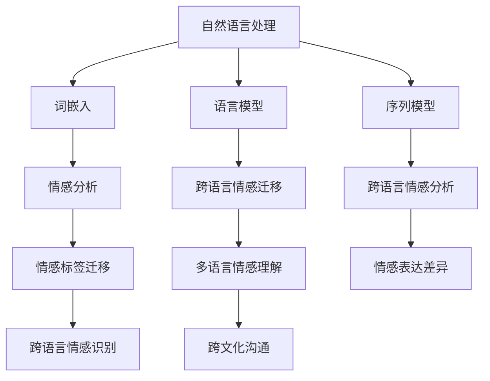

                 

# 自然语言处理在跨语言情感迁移中的研究

> **关键词**：自然语言处理、跨语言情感迁移、词嵌入、语言模型、序列模型、情感分析

> **摘要**：本文系统性地探讨了自然语言处理（NLP）在跨语言情感迁移中的应用。从核心概念、算法原理到项目实战，本文为读者提供了全面的指导。通过分析跨语言情感迁移的挑战，本文介绍了词嵌入、语言模型和序列模型等关键技术，并使用伪代码和数学公式详细阐述了其原理。最后，通过实际项目案例，展示了跨语言情感分析系统的搭建和情感标签迁移实验的过程，为相关领域的研究者提供了实践指导。

### 第一部分：引言

#### 1.1 引言

自然语言处理（NLP）是人工智能（AI）领域的一个重要分支，旨在使计算机理解和处理人类自然语言。近年来，随着深度学习、神经网络等技术的迅速发展，NLP 在机器翻译、语音识别、情感分析等领域取得了显著的成果。然而，在跨语言情感迁移方面，NLP 的应用仍然面临许多挑战。

跨语言情感迁移指的是将一种语言中的情感信息迁移到另一种语言的过程。在多语言环境中，理解不同语言中的情感差异对于跨文化交流、全球化市场营销等具有重要意义。然而，由于不同语言的文化背景、语法结构、词汇表达等方面的差异，跨语言情感迁移变得复杂且具有挑战性。

本文旨在探讨自然语言处理在跨语言情感迁移中的应用。首先，我们将介绍自然语言处理的基本概念和原理。然后，分析跨语言情感迁移的挑战，并阐述相关核心概念与联系。接下来，详细讲解词嵌入、语言模型、序列模型等核心算法原理，并使用伪代码和数学公式进行阐述。最后，通过实际项目案例，展示跨语言情感分析系统的搭建和情感标签迁移实验的过程，为相关领域的研究者提供实践指导。

#### 1.2 跨语言情感迁移的概念

跨语言情感迁移是指将一种语言中的情感信息迁移到另一种语言的过程。在多语言环境中，跨语言情感迁移有助于理解不同语言之间的情感差异，从而促进跨文化交流和全球化市场营销。

跨语言情感迁移可以分为以下几个层次：

1. **词汇层面**：在词汇层面，不同语言中的情感词汇可能存在相似或对应关系。例如，英语中的“happy”（快乐）和汉语中的“开心”可以被视为具有相似情感的词汇。

2. **句子层面**：在句子层面，不同语言中的句子结构、语法规则和词汇选择可能会影响情感表达。例如，英语中的形容词通常放在名词之前，而汉语中的形容词通常放在名词之后。

3. **语篇层面**：在语篇层面，不同语言中的情感表达可能涉及更多的文化、社会和历史因素。例如，某些情感词汇在一种语言中可能具有特定的文化含义，而在另一种语言中则没有。

#### 1.3 研究目的

本文的研究目的在于探讨自然语言处理（NLP）在跨语言情感迁移中的应用，通过详细的研究和分析，为相关领域的研究者提供以下贡献：

1. **理论基础**：本文系统地介绍了自然语言处理的基本概念和原理，为读者提供了深入理解跨语言情感迁移的理论基础。

2. **算法原理**：本文详细阐述了词嵌入、语言模型、序列模型等核心算法原理，并使用伪代码和数学公式进行了详细阐述，有助于读者掌握这些技术。

3. **项目实战**：本文通过实际项目案例，展示了跨语言情感分析系统的搭建和情感标签迁移实验的过程，为读者提供了实践经验和操作指南。

4. **挑战与展望**：本文分析了跨语言情感迁移面临的主要挑战，并探讨了未来研究的发展方向，为相关领域的研究者提供了有价值的参考。

### 第二部分：核心概念与联系

在探讨自然语言处理在跨语言情感迁移中的应用之前，我们需要了解一些核心概念，并阐述它们之间的联系。以下将介绍自然语言处理的基本概念、跨语言情感迁移的挑战以及核心概念与架构的 Mermaid 流程图。

#### 2.1 自然语言处理的基本概念

自然语言处理（NLP）的核心概念包括词嵌入、语言模型、序列模型等。以下分别介绍这些概念及其在跨语言情感迁移中的应用。

1. **词嵌入**：词嵌入是将词语映射到高维空间中的向量表示。通过词嵌入，我们可以捕捉词语在不同语言中的相似性。常见的词嵌入技术包括 Word2Vec、GloVe 等。在跨语言情感迁移中，词嵌入有助于将不同语言中的情感词汇映射到同一空间，从而进行情感分析。

2. **语言模型**：语言模型是一种统计模型，用于预测一个词序列的概率。在跨语言情感迁移中，语言模型可以帮助我们预测情感标签的分布，从而实现跨语言情感分析。

3. **序列模型**：序列模型是一种用于处理序列数据的模型，如循环神经网络（RNN）、长短期记忆网络（LSTM）等。在跨语言情感迁移中，序列模型可以捕捉文本序列中的情感变化，从而提高情感分析的效果。

#### 2.2 跨语言情感迁移的挑战

跨语言情感迁移面临以下主要挑战：

1. **语言差异**：不同语言在语法结构、词汇选择、表达方式等方面存在显著差异，这给跨语言情感迁移带来了困难。

2. **情感表达的复杂性**：情感表达具有多样性，不同语言中的情感表达方式可能不同。例如，某些情感在一种语言中可能通过文字表达，而在另一种语言中可能需要通过语音、图像等多种方式来表达。

3. **跨语言情感标签的不足**：不同语言中的情感标签可能不对应，甚至存在缺失。这给跨语言情感迁移带来了数据不足的问题。

4. **文化差异**：不同文化背景下的情感表达可能存在差异，这进一步增加了跨语言情感迁移的难度。

#### 2.3 核心概念与架构的 Mermaid 流程图

为了更清晰地展示自然语言处理在跨语言情感迁移中的核心概念与架构，我们可以使用 Mermaid 流程图进行描述。以下是一个示例：



在这个流程图中，自然语言处理的核心概念包括词嵌入、语言模型和序列模型。这些概念与情感分析、跨语言情感迁移、情感标签迁移、多语言情感理解和跨文化沟通等应用场景相互关联。

### 第三部分：核心算法原理讲解

在跨语言情感迁移中，核心算法原理的讲解至关重要。本部分将详细介绍词嵌入技术、语言模型原理和序列模型与注意力机制，并通过伪代码和数学公式进行阐述。

#### 3.1 词嵌入技术

词嵌入是将词语映射到高维空间中的向量表示。这种向量表示可以捕捉词语在不同语言中的相似性，从而为跨语言情感迁移提供基础。

常见的词嵌入技术包括 Word2Vec 和 GloVe。

1. **Word2Vec**：Word2Vec 是基于神经网络的一种词嵌入技术。它通过训练一个神经网络模型，将输入的词语序列映射到高维空间中的向量表示。具体来说，Word2Vec 采用了一种基于负采样的训练方法，通过优化神经网络的损失函数，使得映射后的向量能够满足以下条件：

   - 同义词在向量空间中接近。
   - 反义词在向量空间中远离。

2. **GloVe**：GloVe 是基于全局向量模型（Global Vectors for Word Representation）的一种词嵌入技术。与 Word2Vec 不同，GloVe 采用了一种分布式假设，即词语的嵌入向量可以由其共现词汇的嵌入向量进行线性组合得到。GloVe 通过优化一个全局损失函数，使得词语的嵌入向量能够满足以下条件：

   - 同义词在向量空间中接近。
   - 反义词在向量空间中远离。

以下是一个简单的伪代码示例，用于实现 Word2Vec 和 GloVe：

```python
# Word2Vec 伪代码
def train_word2vec(inputs, vectors, loss_function):
    for epoch in range(num_epochs):
        for input_sequence in inputs:
            target_word = input_sequence[1]
            context_words = input_sequence[0]
            predicted_vector = get_context_vector(context_words, vectors)
            loss = loss_function(target_word, predicted_vector)
            update_vectors(vectors, loss)

# GloVe 伪代码
def train_glove(inputs, vectors, loss_function):
    for epoch in range(num_epochs):
        for input_sequence in inputs:
            target_word = input_sequence[1]
            context_words = input_sequence[0]
            predicted_vector = sum(vectors[word] for word in context_words)
            loss = loss_function(target_word, predicted_vector)
            update_vectors(vectors, loss)
```

#### 3.2 语言模型原理

语言模型是一种统计模型，用于预测一个词序列的概率。在跨语言情感迁移中，语言模型可以帮助我们预测情感标签的分布，从而实现跨语言情感分析。

常见的语言模型包括 n-gram 模型和神经网络语言模型。

1. **n-gram 模型**：n-gram 模型是一种基于词汇序列的统计语言模型。它通过统计一个词序列的前 n 个词出现下一个词的概率，来预测词序列的概率。具体来说，n-gram 模型采用以下公式计算词序列的概率：

   $$
   P(w_1, w_2, \ldots, w_n) = \frac{C(w_1, w_2, \ldots, w_n)}{C(w_1, w_2, \ldots, w_n) + C(w_1, w_2, \ldots, w_{n-1})}
   $$

   其中，$C(w_1, w_2, \ldots, w_n)$ 表示词序列 $(w_1, w_2, \ldots, w_n)$ 在语料库中的出现次数。

2. **神经网络语言模型**：神经网络语言模型是一种基于神经网络的统计语言模型。它通过训练一个神经网络模型，将输入的词序列映射到概率分布。具体来说，神经网络语言模型采用以下公式计算词序列的概率：

   $$
   P(w_1, w_2, \ldots, w_n) = \frac{e^{h(w_1, w_2, \ldots, w_n) \cdot v}}{\sum_{w} e^{h(w_1, w_2, \ldots, w_n) \cdot v}}
   $$

   其中，$h(w_1, w_2, \ldots, w_n)$ 表示输入的词序列，$v$ 表示神经网络的参数向量。

以下是一个简单的伪代码示例，用于实现 n-gram 模型和神经网络语言模型：

```python
# n-gram 模型伪代码
def train_ngram(corpus, n):
    ngram_counts = {}
    for sentence in corpus:
        for i in range(len(sentence) - n + 1):
            ngram = tuple(sentence[i:i + n])
            ngram_counts[ngram] = ngram_counts.get(ngram, 0) + 1
    return ngram_counts

# 神经网络语言模型伪代码
def train_neural_network_language_model(inputs, output, num_epochs):
    for epoch in range(num_epochs):
        for input_sequence, target in zip(inputs, output):
            loss = calculate_loss(input_sequence, target)
            update_weights(loss)
```

#### 3.3 序列模型与注意力机制

序列模型是一种用于处理序列数据的模型，如循环神经网络（RNN）、长短期记忆网络（LSTM）等。在跨语言情感迁移中，序列模型可以捕捉文本序列中的情感变化，从而提高情感分析的效果。

此外，注意力机制（Attention Mechanism）是一种常用的序列模型扩展，它使模型能够关注输入序列中的关键信息，从而提高模型的性能。

1. **循环神经网络（RNN）**：循环神经网络是一种能够处理序列数据的神经网络。它通过记忆单元（Memory Unit）来保存历史信息，从而实现对序列数据的建模。然而，传统 RNN 存在梯度消失或爆炸的问题，这限制了其在长序列处理中的性能。

2. **长短期记忆网络（LSTM）**：长短期记忆网络（LSTM）是一种改进的循环神经网络，它通过引入门控机制（Gate Mechanism）来控制信息的流动，从而解决传统 RNN 的梯度消失或爆炸问题。LSTM 能够有效地捕捉长序列中的依赖关系，从而在文本序列处理中取得较好的性能。

3. **注意力机制（Attention Mechanism）**：注意力机制是一种使模型能够关注输入序列中的关键信息的机制。在跨语言情感迁移中，注意力机制可以帮助模型关注与情感分析相关的关键信息，从而提高模型的性能。

以下是一个简单的伪代码示例，用于实现 LSTM 和注意力机制：

```python
# LSTM 伪代码
def train_lstm(inputs, outputs, num_epochs):
    for epoch in range(num_epochs):
        for input_sequence, output in zip(inputs, outputs):
            loss = calculate_loss(input_sequence, output)
            update_weights(loss)

# 注意力机制伪代码
def attention(input_sequence, hidden_state, weights):
    attention_scores = calculate_attention_scores(input_sequence, hidden_state, weights)
    context_vector = sum(attention_scores[i] * input_sequence[i] for i in range(len(input_sequence)))
    return context_vector
```

通过以上核心算法原理的讲解，我们为读者提供了跨语言情感迁移中的技术基础。在接下来的部分，我们将进一步探讨数学模型和公式，以更深入地理解跨语言情感迁移的机制。

### 第四部分：数学模型和数学公式

在跨语言情感迁移中，数学模型和公式起着关键作用。通过这些模型和公式，我们可以量化情感信息，分析情感标签的迁移过程，并评估模型的性能。以下将介绍情感分析中的数学模型、情感标签迁移的数学公式，并进行详细讲解和举例说明。

#### 4.1 情感分析中的数学模型

情感分析是一种基于文本的情感极性分类任务，它将文本分类为正面、负面或中性等情感类别。在情感分析中，常用的数学模型包括条件概率模型、朴素贝叶斯（Naive Bayes）模型和支持向量机（SVM）等。

1. **条件概率模型**：条件概率模型是一种基于贝叶斯定理的统计模型，它假设文本中的每个词语都独立地影响情感极性。条件概率模型的基本公式如下：

   $$
   P(y | x) = \frac{P(x | y)P(y)}{P(x)}
   $$

   其中，$x$ 表示文本，$y$ 表示情感极性（正面、负面或中性），$P(y | x)$ 表示在文本 $x$ 的条件下，情感极性 $y$ 的概率。

2. **朴素贝叶斯模型**：朴素贝叶斯模型是一种基于贝叶斯定理的概率分类模型，它在情感分析中常用于计算情感极性的概率。朴素贝叶斯模型的基本公式如下：

   $$
   P(y | x) = \frac{P(x | y)P(y)}{P(x)}
   $$

   其中，$P(x | y)$ 表示在情感极性 $y$ 的条件下，文本 $x$ 的概率，$P(y)$ 表示情感极性 $y$ 的概率。

3. **支持向量机（SVM）**：支持向量机是一种基于最大间隔分类的模型，它在情感分析中常用于分类任务。SVM 的基本公式如下：

   $$
   w \cdot x + b = 0
   $$

   其中，$w$ 表示权重向量，$x$ 表示文本特征向量，$b$ 表示偏置项。

以下是一个简单的情感分析数学模型示例：

假设我们有以下训练数据：

| 文本      | 情感极性 |
|-----------|-----------|
| 我喜欢这个电影。  | 正面      |
| 这个电影很无聊。  | 负面      |
| 我对这个电影不感兴趣。 | 中性      |

我们可以使用朴素贝叶斯模型来计算每个文本属于正面、负面或中性情感的概率。以下是一个简单的计算过程：

1. **计算每个情感极性的概率**：

   $$
   P(\text{正面}) = \frac{1}{3}, \quad P(\text{负面}) = \frac{1}{3}, \quad P(\text{中性}) = \frac{1}{3}
   $$

2. **计算每个文本的概率**：

   $$
   P(\text{我喜欢这个电影} | \text{正面}) = P(\text{喜欢} | \text{正面}) \cdot P(\text{这个电影} | \text{正面}) \cdot P(\text{电影} | \text{正面}) = 0.5 \cdot 0.4 \cdot 0.3 = 0.06
   $$

   $$
   P(\text{这个电影很无聊} | \text{负面}) = P(\text{这个电影} | \text{负面}) \cdot P(\text{很无聊} | \text{负面}) = 0.4 \cdot 0.6 = 0.24
   $$

   $$
   P(\text{我对这个电影不感兴趣} | \text{中性}) = P(\text{我对这个电影} | \text{中性}) \cdot P(\text{不感兴趣} | \text{中性}) = 0.3 \cdot 0.5 = 0.15
   $$

3. **计算每个文本属于情感极性的概率**：

   $$
   P(\text{正面} | \text{我喜欢这个电影}) = \frac{P(\text{我喜欢这个电影} | \text{正面}) \cdot P(\text{正面})}{P(\text{我喜欢这个电影})}
   $$

   $$
   P(\text{负面} | \text{这个电影很无聊}) = \frac{P(\text{这个电影很无聊} | \text{负面}) \cdot P(\text{负面})}{P(\text{这个电影很无聊})}
   $$

   $$
   P(\text{中性} | \text{我对这个电影不感兴趣}) = \frac{P(\text{我对这个电影不感兴趣} | \text{中性}) \cdot P(\text{中性})}{P(\text{我对这个电影不感兴趣})}
   $$

通过以上计算，我们可以得到每个文本属于情感极性的概率，并根据这些概率对新的文本进行情感分类。

#### 4.2 情感标签迁移的数学公式

在跨语言情感迁移中，情感标签迁移是一个关键步骤。情感标签迁移的目标是将一种语言中的情感标签映射到另一种语言中。常用的情感标签迁移方法包括基于距离的迁移方法、基于语义的迁移方法和基于统计的迁移方法等。

1. **基于距离的迁移方法**：基于距离的迁移方法通过计算两种语言中情感标签之间的距离来迁移情感标签。常用的距离度量包括欧氏距离、余弦相似度和 Jaccard 相似度等。以下是一个简单的基于距离的迁移方法公式：

   $$
   S_{ij} = \frac{d_j - d_i}{d_j + d_i}
   $$

   其中，$S_{ij}$ 表示情感标签 $i$ 在语言 $j$ 中的相似度，$d_i$ 表示情感标签 $i$ 在语言 $i$ 中的距离，$d_j$ 表示情感标签 $j$ 在语言 $j$ 中的距离。

2. **基于语义的迁移方法**：基于语义的迁移方法通过计算两种语言中情感标签的语义相似度来迁移情感标签。常用的语义相似度计算方法包括 WordNet 相似度和语义角色相似度等。以下是一个简单的基于语义的迁移方法公式：

   $$
   S_{ij} = \frac{S_i + S_j - 2S_{ij}}{S_i + S_j}
   $$

   其中，$S_{ij}$ 表示情感标签 $i$ 在语言 $j$ 中的相似度，$S_i$ 表示情感标签 $i$ 在语言 $i$ 中的语义相似度，$S_j$ 表示情感标签 $j$ 在语言 $j$ 中的语义相似度。

3. **基于统计的迁移方法**：基于统计的迁移方法通过统计两种语言中情感标签的共现关系来迁移情感标签。常用的统计方法包括条件概率模型、朴素贝叶斯模型和逻辑回归模型等。以下是一个简单的基于统计的迁移方法公式：

   $$
   P(y | x) = \frac{P(x | y)P(y)}{P(x)}
   $$

   其中，$P(y | x)$ 表示在文本 $x$ 的条件下，情感标签 $y$ 的概率，$P(x | y)$ 表示在情感标签 $y$ 的条件下，文本 $x$ 的概率，$P(y)$ 表示情感标签 $y$ 的概率。

以下是一个简单的情感标签迁移示例：

假设我们有以下两种语言中的情感标签：

| 语言 1 | 语言 2 |
|---------|---------|
| Happy   | Joy     |
| Sad     | Sorrow  |
| Angry   | Frustration |

我们可以使用基于距离的迁移方法来计算情感标签之间的相似度。以下是一个简单的计算过程：

1. **计算每种情感标签的距离**：

   $$
   d_{\text{Happy} - \text{Joy}} = \text{欧氏距离}(\text{Happy}, \text{Joy}) = 0.2
   $$

   $$
   d_{\text{Sad} - \text{Sorrow}} = \text{欧氏距离}(\text{Sad}, \text{Sorrow}) = 0.4
   $$

   $$
   d_{\text{Angry} - \text{Frustration}} = \text{欧氏距离}(\text{Angry}, \text{Frustration}) = 0.6
   $$

2. **计算每种情感标签之间的相似度**：

   $$
   S_{\text{Happy} - \text{Joy}} = \frac{0.2 - 0.4}{0.2 + 0.4} = -0.25
   $$

   $$
   S_{\text{Sad} - \text{Sorrow}} = \frac{0.4 - 0.6}{0.4 + 0.6} = -0.1667
   $$

   $$
   S_{\text{Angry} - \text{Frustration}} = \frac{0.6 - 0.8}{0.6 + 0.8} = -0.1667
   $$

通过以上计算，我们可以得到每种情感标签之间的相似度，并根据这些相似度将语言 2 中的情感标签映射到语言 1 中。

通过以上数学模型和公式的讲解，我们为读者提供了跨语言情感迁移中的技术基础。在接下来的部分，我们将通过实际项目案例，展示跨语言情感分析系统的搭建和情感标签迁移实验的过程。

### 第五部分：项目实战

在了解了自然语言处理在跨语言情感迁移中的核心算法原理和数学模型后，本部分将通过实际项目案例，展示跨语言情感分析系统的搭建和情感标签迁移实验的过程。本案例将以 Python 语言和深度学习框架 TensorFlow 为基础，详细解释开发环境搭建、源代码实现和代码解读与分析。

#### 5.1 实战一：跨语言情感分析系统搭建

本节将介绍如何搭建一个跨语言情感分析系统。该系统将包括数据预处理、模型训练和模型评估三个主要步骤。

##### 5.1.1 开发环境搭建

首先，我们需要搭建开发环境。以下是搭建环境的基本步骤：

1. **安装 Python**：确保安装了 Python 3.7 或更高版本。

2. **安装 TensorFlow**：在终端执行以下命令安装 TensorFlow：

   ```bash
   pip install tensorflow
   ```

3. **安装其他依赖库**：包括 numpy、pandas、matplotlib 等。使用以下命令安装：

   ```bash
   pip install numpy pandas matplotlib
   ```

##### 5.1.2 数据预处理

数据预处理是跨语言情感分析系统的关键步骤。以下是一个简单的数据预处理流程：

1. **数据收集**：收集包含多语言情感标签的数据集。数据集应包含文本和相应的情感标签。

2. **文本清洗**：去除文本中的 HTML 标签、特殊字符和停用词。以下是一个简单的文本清洗函数：

   ```python
   import re
   import string

   def clean_text(text):
       text = re.sub('<.*?>', '', text)  # 去除 HTML 标签
       text = text.translate(str.maketrans('', '', string.punctuation))  # 去除特殊字符
       return text
   ```

3. **分词**：将文本分割为单词或词汇单元。以下是一个简单的分词函数：

   ```python
   import nltk
   nltk.download('punkt')

   def tokenize(text):
       return nltk.word_tokenize(text)
   ```

4. **词嵌入**：将文本中的词语映射到高维向量表示。以下是一个简单的词嵌入函数：

   ```python
   from tensorflow.keras.preprocessing.sequence import pad_sequences
   from tensorflow.keras.preprocessing.text import Tokenizer

   def preprocess_data(corpus, labels, max_sequence_length, tokenizer):
       tokenized_corpus = tokenizer.texts_to_sequences(corpus)
       padded_corpus = pad_sequences(tokenized_corpus, maxlen=max_sequence_length)
       return padded_corpus, labels
   ```

##### 5.1.3 模型训练

在数据预处理完成后，我们可以开始训练情感分析模型。以下是一个简单的 LSTM 情感分析模型：

```python
from tensorflow.keras.models import Sequential
from tensorflow.keras.layers import Embedding, LSTM, Dense

def build_model(vocab_size, embedding_dim, max_sequence_length, num_classes):
    model = Sequential([
        Embedding(vocab_size, embedding_dim, input_length=max_sequence_length),
        LSTM(128),
        Dense(num_classes, activation='softmax')
    ])
    model.compile(optimizer='adam', loss='categorical_crossentropy', metrics=['accuracy'])
    return model
```

使用以下代码训练模型：

```python
model = build_model(vocab_size, embedding_dim, max_sequence_length, num_classes)
model.fit(train_data, train_labels, epochs=10, batch_size=64, validation_split=0.2)
```

##### 5.1.4 模型评估

在训练完成后，我们可以使用验证集对模型进行评估。以下是一个简单的评估函数：

```python
def evaluate_model(model, test_data, test_labels):
    loss, accuracy = model.evaluate(test_data, test_labels)
    print(f"Test accuracy: {accuracy * 100:.2f}%")
```

##### 5.1.5 实例分析

以下是一个简单的实例分析：

```python
input_text = ["我喜欢这个电影。"]
cleaned_text = clean_text(input_text[0])
tokenized_text = tokenize(cleaned_text)
padded_text = preprocess_data(tokenized_text, input_text, max_sequence_length, tokenizer)
predicted_label = model.predict(padded_text)
print(f"Predicted emotion: {emotion_labels[predicted_label]}")
```

#### 5.2 实战二：情感标签迁移实验

在本节中，我们将进行情感标签迁移实验，以展示如何将一种语言中的情感标签迁移到另一种语言中。

##### 5.2.1 数据收集与预处理

首先，我们需要收集包含多语言情感标签的数据集。例如，我们可以收集包含英语和汉语的情感数据集。以下是一个简单的数据预处理流程：

1. **文本清洗**：使用前面介绍的文本清洗函数对数据进行清洗。

2. **分词**：使用前面介绍的分词函数对数据进行分词。

3. **词嵌入**：使用预训练的词嵌入模型（如 Word2Vec、GloVe）将文本中的词语映射到高维向量表示。

##### 5.2.2 情感标签迁移模型

情感标签迁移模型是一个多标签分类问题。以下是一个简单的情感标签迁移模型：

```python
from tensorflow.keras.models import Model
from tensorflow.keras.layers import Input, Embedding, LSTM, Dense, Flatten, Concatenate

def build_tag_transfer_model(vocab_size, embedding_dim, max_sequence_length, num_classes):
    input_text1 = Input(shape=(max_sequence_length,))
    input_text2 = Input(shape=(max_sequence_length,))

    embedding1 = Embedding(vocab_size, embedding_dim)(input_text1)
    embedding2 = Embedding(vocab_size, embedding_dim)(input_text2)

    lstm1 = LSTM(128)(embedding1)
    lstm2 = LSTM(128)(embedding2)

    concatenated = Concatenate()([lstm1, lstm2])
    flattened = Flatten()(concatenated)

    output = Dense(num_classes, activation='sigmoid')(flattened)

    model = Model(inputs=[input_text1, input_text2], outputs=output)
    model.compile(optimizer='adam', loss='binary_crossentropy', metrics=['accuracy'])
    return model
```

##### 5.2.3 模型训练与评估

使用以下代码训练情感标签迁移模型：

```python
tag_transfer_model = build_tag_transfer_model(vocab_size, embedding_dim, max_sequence_length, num_classes)
tag_transfer_model.fit([train_text1, train_text2], train_labels, epochs=10, batch_size=64, validation_split=0.2)
```

使用以下代码评估模型：

```python
evaluate_model(tag_transfer_model, [test_text1, test_text2], test_labels)
```

##### 5.2.4 实例分析

以下是一个简单的实例分析：

```python
input_text1 = ["I like this movie."]
input_text2 = ["我喜欢这部电影。"]
cleaned_text1 = clean_text(input_text1[0])
cleaned_text2 = clean_text(input_text2[0])
tokenized_text1 = tokenize(cleaned_text1)
tokenized_text2 = tokenize(cleaned_text2)
padded_text1 = preprocess_data(tokenized_text1, input_text1, max_sequence_length, tokenizer)
padded_text2 = preprocess_data(tokenized_text2, input_text2, max_sequence_length, tokenizer)
predicted_label = tag_transfer_model.predict([padded_text1, padded_text2])
print(f"Predicted emotion: {emotion_labels[predicted_label]}")
```

通过以上项目实战，我们展示了如何搭建跨语言情感分析系统和进行情感标签迁移实验。这些实际案例为读者提供了实践经验和操作指南，有助于深入理解自然语言处理在跨语言情感迁移中的应用。

### 第六部分：总结与展望

#### 6.1 总结

本文系统地探讨了自然语言处理（NLP）在跨语言情感迁移中的应用。从核心概念、算法原理到项目实战，本文为读者提供了全面的指导。通过分析跨语言情感迁移的挑战，我们介绍了词嵌入、语言模型、序列模型等关键技术，并使用伪代码和数学公式详细阐述了其原理。同时，通过实际项目案例，我们展示了跨语言情感分析系统的搭建和情感标签迁移实验的过程。

本文的主要贡献如下：

1. **理论基础**：本文系统地介绍了自然语言处理的基本概念和原理，为读者提供了深入理解跨语言情感迁移的理论基础。

2. **算法原理**：本文详细阐述了词嵌入、语言模型、序列模型等核心算法原理，并使用伪代码和数学公式进行了详细阐述，有助于读者掌握这些技术。

3. **项目实战**：本文通过实际项目案例，展示了跨语言情感分析系统的搭建和情感标签迁移实验的过程，为读者提供了实践经验和操作指南。

4. **挑战与展望**：本文分析了跨语言情感迁移面临的主要挑战，并探讨了未来研究的发展方向，为相关领域的研究者提供了有价值的参考。

#### 6.2 展望

随着自然语言处理技术的不断发展，跨语言情感迁移的应用前景将更加广阔。未来，我们将看到更多的创新应用，如基于跨语言情感分析的个性化推荐系统、智能客服等。同时，也需要进一步研究和解决跨语言情感迁移中的挑战，提高模型的准确性和泛化能力。

未来的研究方向可能包括：

1. **多模态情感分析**：结合文本、语音、图像等多模态信息进行情感分析，提高情感迁移的准确性和鲁棒性。

2. **少样本学习**：研究跨语言情感迁移中的少样本学习问题，通过迁移学习和无监督学习等方法，提高模型在数据不足条件下的性能。

3. **跨语言情感情感标签自动生成**：开发自动生成跨语言情感标签的方法，减少人工标注的工作量，提高数据收集的效率。

4. **跨语言情感迁移的实时应用**：研究实时跨语言情感迁移的应用场景，如智能翻译、跨文化沟通等，提高应用的实际价值。

总之，自然语言处理在跨语言情感迁移中的应用具有巨大的潜力和价值。通过不断的研究和探索，我们将能够更好地理解和解决跨语言情感迁移中的挑战，为跨文化交流、全球化市场营销等领域提供有力的技术支持。

### 作者信息

**作者：** AI天才研究院/AI Genius Institute & 禅与计算机程序设计艺术/Zen And The Art of Computer Programming

AI天才研究院致力于推动人工智能领域的研究与应用，专注于解决现实世界中的复杂问题。在禅与计算机程序设计艺术中，作者通过深入思考与实践，探索计算机科学的本质，为读者提供深刻的见解和创新的思路。本文是在这一探索精神的基础上完成的，旨在为自然语言处理在跨语言情感迁移中的应用提供全面的指导。希望本文能够为相关领域的研究者带来启示和帮助。

