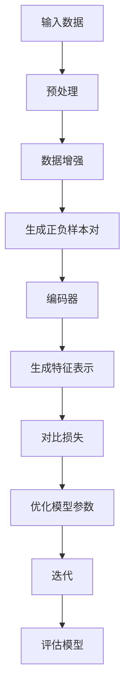
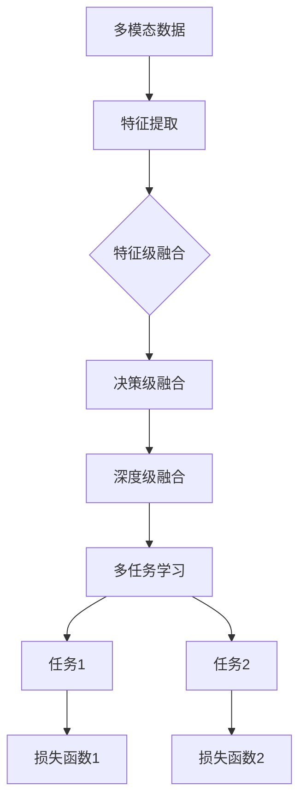

                 

### 文章标题

自监督学习的应用场景：计算机视觉、自然语言处理等

---

**关键词**: 自监督学习、计算机视觉、自然语言处理、图像分类、文本生成、语音识别、多模态学习

**摘要**: 本文将深入探讨自监督学习在计算机视觉、自然语言处理等多个领域的应用。我们将逐步分析自监督学习的基础概念、算法原理及其在不同领域的具体实现，通过理论和实践相结合的方式，展示自监督学习如何解决传统机器学习中的标注难题，推动人工智能的发展。

### 引言

在人工智能领域，自监督学习（Self-supervised Learning）作为一种无监督学习方法，正逐渐受到广泛的关注。与传统的监督学习相比，自监督学习不依赖于大量手工标注的数据，而是通过设计特定任务，让模型在未标记的数据中学习到有用的特征表示。这种方法的提出，不仅解决了数据标注的高成本问题，还能够提高模型在少量标注数据上的表现。

随着深度学习技术的不断进步，自监督学习在计算机视觉、自然语言处理等领域的应用越来越广泛。例如，在计算机视觉领域，自监督学习被用于图像分类、图像分割和图像增强等任务；在自然语言处理领域，自监督学习被用于语言模型预训练、文本分类和机器翻译等任务。本文将围绕这些应用场景，详细探讨自监督学习的基本原理、算法实现及其挑战与优化策略。

### 第一部分: 自监督学习基础

#### 第1章: 自监督学习概述

##### 1.1 自监督学习的定义与背景

自监督学习（Self-supervised Learning）是一种机器学习方法，它利用未标记的数据来训练模型，通过设计特定的任务，使得模型能够从中学习到有用的特征表示。自监督学习的核心思想是利用数据内在的标签信息，将无监督学习转化为有监督学习。

自监督学习的发展背景主要源于以下几点：

1. **数据标注成本高**：传统的监督学习需要大量的标注数据来训练模型，而数据标注是一个耗时且成本高昂的过程。
2. **数据稀缺问题**：在某些领域，如医学影像、地理信息系统等，标注数据稀缺，难以满足监督学习的需求。
3. **无监督学习局限性**：虽然无监督学习能够从数据中发现潜在的结构和模式，但其难以获得明确的任务目标。

随着深度学习技术的发展，自监督学习成为解决这些难题的有效途径。通过设计合理的任务，自监督学习能够在未标记的数据中提取出有用的特征表示，从而实现模型的训练和优化。

##### 1.2 自监督学习的原理与优势

自监督学习的原理主要基于以下两个方面：

1. **任务设计**：通过设计特定的任务，使得模型能够在未标记的数据中学习到有用的特征表示。常见的任务包括预训练、无监督聚类等。
2. **损失函数**：自监督学习的损失函数通常基于模型对数据的预测误差。例如，在预训练任务中，模型需要预测未标记数据的某些部分，然后通过优化预测误差来提高模型的性能。

自监督学习具有以下优势：

1. **减少数据标注成本**：自监督学习不需要依赖大量手工标注的数据，从而降低了数据标注的成本。
2. **提高模型在少量标注数据上的表现**：自监督学习能够在未标记的数据中提取出有效的特征表示，从而提高了模型在少量标注数据上的性能。
3. **通用性强**：自监督学习适用于各种不同的数据类型和任务，具有广泛的适用性。

##### 1.3 自监督学习的常见任务

自监督学习常见的任务可以分为以下几类：

1. **预训练**：通过在大量未标记的数据上进行预训练，模型可以学习到通用的特征表示，然后在特定任务上进行微调。
2. **无监督聚类**：无监督聚类任务旨在发现数据中的隐含结构和模式。常见的算法包括K-means、DBSCAN等。
3. **生成对抗网络（GAN）**：生成对抗网络（GAN）是一种自监督学习框架，通过生成器和判别器的对抗训练，模型可以学习到数据的分布。

#### 第2章: 自监督学习的算法原理

##### 2.1 自监督学习的框架

自监督学习的框架可以分为以下几种类型：

1. **基于对比的框架**：这种框架通过对比正样本和负样本来学习特征表示。常见的算法包括对比损失（Contrastive Loss）和InfoNCE。
2. **基于生成对抗网络的框架**：生成对抗网络（GAN）通过生成器和判别器的对抗训练，模型可以学习到数据的分布。
3. **基于自编码器的框架**：自编码器（Autoencoder）通过最小化重构误差来学习特征表示。

##### 2.2 常见自监督学习算法

自监督学习算法可以分为以下几种：

1. **自编码器（Autoencoder）**：自编码器通过最小化重构误差来学习特征表示。常见的算法包括标准自编码器、变分自编码器（VAE）等。
2. **对比损失（Contrastive Loss）**：对比损失通过对比正样本和负样本来学习特征表示。常见的算法包括对比损失（Contrastive Loss）、InfoNCE等。
3. **生成对抗网络（GAN）**：生成对抗网络（GAN）通过生成器和判别器的对抗训练，模型可以学习到数据的分布。

##### 2.3 自监督学习的挑战与优化策略

自监督学习面临以下挑战：

1. **数据不平衡**：自监督学习中，正样本和负样本的比例可能不均衡，这可能导致模型过度关注某一类样本。为解决这一问题，可以采用数据增强技术，如随机裁剪、旋转等。
2. **计算效率**：自监督学习通常需要大量的计算资源。为提高计算效率，可以采用以下策略：
   - 选择合适的硬件：如GPU或TPU等。
   - 优化算法：采用更高效的优化算法，如Adam等。
   - 模型压缩：通过模型压缩技术，如剪枝、量化等，减少模型的计算复杂度。

#### 第3章: 自监督学习在计算机视觉中的应用

##### 3.1 自监督学习在图像分类中的应用

自监督学习在图像分类中的应用主要体现在以下几个方面：

1. **预训练模型**：自监督预训练模型通过在大量未标记图像上进行训练，学习到通用的特征表示，然后在特定图像分类任务上进行微调。
2. **无监督图像分类**：无监督图像分类任务旨在对未标记图像进行分类，常见的算法包括聚类、标签传播等。

##### 3.2 自监督学习在图像分割中的应用

自监督学习在图像分割中的应用主要包括以下两个方面：

1. **无监督语义分割**：无监督语义分割任务旨在对未标记图像进行语义分割，常见的算法包括基于生成对抗网络的分割方法和基于聚类的方法。
2. **无监督实例分割**：无监督实例分割任务旨在对未标记图像中的每个实例进行分割，常见的算法包括基于实例的聚类方法和基于语义分割的方法。

##### 3.3 自监督学习在图像增强中的应用

自监督学习在图像增强中的应用主要体现在以下几个方面：

1. **无监督图像修复**：无监督图像修复任务旨在对损坏或模糊的图像进行修复，常见的算法包括基于生成对抗网络的方法和基于自编码器的方法。
2. **图像超分辨率**：图像超分辨率任务旨在从低分辨率图像中恢复出高分辨率图像，常见的算法包括基于卷积神经网络的方法和基于自编码器的方法。

### 第二部分: 自监督学习在自然语言处理中的应用

#### 第4章: 自监督学习在自然语言处理中的基本原理

##### 4.1 语言模型预训练

自监督学习在自然语言处理中最常用的任务是语言模型预训练。语言模型预训练旨在通过大量未标记的文本数据来训练一个通用的语言表示模型，从而提高模型在各种自然语言处理任务上的性能。

常见的语言模型预训练方法包括：

1. **BERT**：BERT（Bidirectional Encoder Representations from Transformers）是一种双向的Transformer模型，通过预训练上下文序列来学习语言表示。
2. **GPT**：GPT（Generative Pre-trained Transformer）是一种自回归的Transformer模型，通过预训练语言序列来生成新的文本内容。

##### 4.2 伪标签与数据增强

在自监督学习中，伪标签（Pseudo Label）和数据增强（Data Augmentation）是两种常用的技术，用于提高模型在下游任务上的性能。

1. **伪标签**：伪标签是指利用预训练模型生成的标注来训练下游任务。具体来说，首先使用预训练模型对未标记的数据进行预测，然后将预测结果作为伪标签用于下游任务的训练。这种方法可以有效利用预训练模型的知识，提高下游任务的性能。

2. **数据增强**：数据增强是指通过变换文本来增加数据的多样性，从而提高模型对各种语言现象的鲁棒性。常见的数据增强方法包括随机替换、随机插入、随机删除等。

##### 4.3 自监督学习在文本分类中的应用

自监督学习在文本分类中的应用主要包括以下两个方面：

1. **无监督文本分类**：无监督文本分类任务旨在对未标记的文本进行分类，常见的算法包括聚类、标签传播等。通过自监督学习，模型可以在未标记的数据中学习到有效的文本表示，从而提高分类性能。

2. **伪监督文本分类**：伪监督文本分类任务是指利用伪标签对未标记的文本进行分类。具体来说，首先使用预训练模型对未标记的文本进行预测，然后使用预测结果作为伪标签进行分类训练。这种方法可以有效利用预训练模型的知识，提高分类性能。

#### 第5章: 自监督学习在自然语言处理中的高级应用

##### 5.1 自监督学习在机器翻译中的应用

自监督学习在机器翻译中的应用主要包括以下两个方面：

1. **基于自监督学习的机器翻译**：基于自监督学习的机器翻译是指利用未标记的双语语料库进行无监督翻译。常见的算法包括基于生成对抗网络的翻译方法和基于注意力机制的翻译方法。

2. **跨语言预训练**：跨语言预训练是指通过跨语言自监督学习来提高机器翻译质量。具体来说，首先使用单语语料库训练一个通用的语言表示模型，然后使用双语语料库进行微调，从而提高机器翻译的性能。

##### 5.2 自监督学习在文本生成中的应用

自监督学习在文本生成中的应用主要包括以下两个方面：

1. **无监督文本生成**：无监督文本生成是指利用自监督学习技术生成新的文本内容。常见的算法包括基于生成对抗网络的文本生成方法和基于自编码器的文本生成方法。

2. **知识增强文本生成**：知识增强文本生成是指结合外部知识库进行文本生成。具体来说，首先使用自监督学习技术生成初步的文本内容，然后利用外部知识库对文本内容进行修正和扩展，从而提高文本生成的质量和多样性。

##### 5.3 自监督学习在问答系统中的应用

自监督学习在问答系统中的应用主要包括以下两个方面：

1. **无监督问答**：无监督问答是指利用自监督学习技术训练问答系统。具体来说，首先使用预训练模型生成伪问题，然后使用这些伪问题对问答系统进行训练，从而提高问答系统的性能。

2. **知识增强问答**：知识增强问答是指结合外部知识库进行问答。具体来说，首先使用预训练模型生成初步的答案，然后利用外部知识库对答案进行修正和扩展，从而提高问答系统的准确性和多样性。

### 第三部分: 自监督学习的应用拓展

#### 第6章: 自监督学习在语音识别中的应用

##### 6.1 自监督学习在声学模型训练中的应用

自监督学习在声学模型训练中的应用主要包括以下几个方面：

1. **基于自监督学习的声学特征提取**：基于自监督学习的声学特征提取是指利用未标记的语音数据来训练声学模型。常见的算法包括基于生成对抗网络的声学特征提取方法和基于自编码器的声学特征提取方法。

2. **无监督语音识别**：无监督语音识别是指利用自监督学习技术进行语音识别。具体来说，首先使用预训练模型生成伪标签，然后使用这些伪标签对语音识别模型进行训练，从而提高语音识别的性能。

##### 6.2 自监督学习在语言模型训练中的应用

自监督学习在语言模型训练中的应用主要包括以下几个方面：

1. **基于自监督学习的语言模型**：基于自监督学习的语言模型是指利用未标记的语音数据来训练语言模型。常见的算法包括基于生成对抗网络的语音语言模型方法和基于自编码器的语音语言模型方法。

2. **结合语音和文本的自监督学习**：结合语音和文本的自监督学习是指同时利用语音数据和文本数据进行训练。这种方法可以通过语音和文本的双向训练，提高语言模型的性能。

#### 第7章: 自监督学习在多模态学习中的应用

##### 7.1 自监督多模态学习的基本概念

自监督多模态学习是指利用多种模态的数据进行训练，从而学习到不同模态之间的关联性和特征表示。基本概念包括：

1. **多模态数据融合**：多模态数据融合是指将多种模态的数据进行整合，从而形成一个统一的特征表示。常见的方法包括特征级融合、决策级融合等。

2. **多任务学习**：多任务学习是指在同一个模型中同时训练多个任务，从而提高模型的泛化能力。常见的方法包括共享网络结构、多任务损失函数等。

##### 7.2 自监督学习在视频分析中的应用

自监督学习在视频分析中的应用主要包括以下几个方面：

1. **无监督视频分类**：无监督视频分类是指对未标记的视频进行分类。常见的方法包括基于聚类的方法、基于生成对抗网络的方法等。

2. **动作识别**：动作识别是指对视频中的动作进行分类。常见的方法包括基于时空特征的方法、基于深度学习的方法等。

##### 7.3 自监督学习在多媒体检索中的应用

自监督学习在多媒体检索中的应用主要包括以下几个方面：

1. **无监督多媒体检索**：无监督多媒体检索是指对未标记的多媒体数据进行检索。常见的方法包括基于内容的方法、基于协同过滤的方法等。

2. **跨模态检索**：跨模态检索是指同时利用多种模态的数据进行检索。常见的方法包括基于联合表示的方法、基于注意力机制的方法等。

### 第8章: 自监督学习的未来趋势与发展方向

##### 8.1 自监督学习的挑战与机遇

自监督学习面临以下挑战：

1. **计算资源**：自监督学习通常需要大量的计算资源，尤其是对于复杂的模型和大规模数据集。
2. **数据隐私**：自监督学习在处理未标记数据时可能涉及数据隐私问题，需要确保数据的安全性。

然而，随着计算资源和算法的进步，自监督学习也面临着许多机遇：

1. **计算资源的进步**：随着硬件的进步，如GPU、TPU等，自监督学习的计算成本逐渐降低，使得其应用范围更加广泛。
2. **数据隐私的保护**：随着隐私保护技术的进步，如联邦学习、差分隐私等，自监督学习在保护用户隐私方面的应用潜力巨大。

##### 8.2 自监督学习在新兴领域的应用

自监督学习在新兴领域的应用前景广阔，主要包括：

1. **医学影像分析**：自监督学习可以用于医学影像的自动分析，如疾病检测、诊断等。
2. **物联网**：在物联网设备中应用自监督学习进行实时数据处理，如智能监控、智能家居等。

##### 8.3 自监督学习的未来研究方向

自监督学习的未来研究方向包括：

1. **模型压缩**：通过模型压缩技术，如剪枝、量化等，提高自监督学习的实用性。
2. **自动化标注**：开发自动化标注技术，以进一步降低标注成本，提高自监督学习的效率。

### 结束语

自监督学习作为一种重要的机器学习方法，在计算机视觉、自然语言处理等领域取得了显著的成果。通过本文的介绍，我们详细探讨了自监督学习的基本原理、算法实现及其在不同领域的应用。展望未来，自监督学习将继续在人工智能领域发挥重要作用，推动技术的进步和应用的创新。同时，我们也应关注自监督学习面临的挑战，如计算资源、数据隐私等问题，并积极探索解决之道。总之，自监督学习为人工智能的发展提供了广阔的前景和无限的可能性。

---

**作者：** AI天才研究院/AI Genius Institute & 禅与计算机程序设计艺术 /Zen And The Art of Computer Programming

---

### 自监督学习基础

自监督学习（Self-supervised Learning）是机器学习中的一个重要分支，它通过利用未标记的数据来进行学习，从而降低对大量标注数据的依赖。本节将详细讨论自监督学习的基础知识，包括其定义、原理、优势以及常见任务。

#### 第1章: 自监督学习概述

##### 1.1 自监督学习的定义与背景

自监督学习的核心在于“自监督”，即模型在训练过程中不需要依赖外部标注信息，而是通过内部产生的标签来进行学习。这种学习方法的出现主要是为了解决以下几个问题：

1. **数据标注成本高**：在传统的监督学习中，模型的训练需要依赖于大量的标注数据，而数据标注是一个耗时且成本高昂的过程。
2. **数据稀缺问题**：在一些特定的领域，如医学影像、地理信息系统等，标注数据的获取非常困难，难以满足监督学习的需求。
3. **无监督学习局限性**：虽然无监督学习能够从数据中发现潜在的结构和模式，但其难以获得明确的任务目标。

自监督学习的定义可以描述为：一种利用数据本身固有的标签信息进行训练的机器学习方法。在这个过程中，模型通过预测那些不需要手动标注的部分来提高性能。例如，在图像分类任务中，模型可以预测图像中的标签，而不是依赖于预标注的标签。

##### 1.2 自监督学习的原理与优势

自监督学习的原理主要基于以下两个方面：

1. **任务设计**：通过设计特定的任务，使得模型能够在未标记的数据中学习到有用的特征表示。常见的任务包括预训练、无监督聚类等。
2. **损失函数**：自监督学习的损失函数通常基于模型对数据的预测误差。例如，在预训练任务中，模型需要预测未标记数据的某些部分，然后通过优化预测误差来提高模型的性能。

自监督学习具有以下优势：

1. **减少数据标注成本**：自监督学习不需要依赖大量手工标注的数据，从而降低了数据标注的成本。
2. **提高模型在少量标注数据上的表现**：自监督学习能够在未标记的数据中提取出有效的特征表示，从而提高了模型在少量标注数据上的性能。
3. **通用性强**：自监督学习适用于各种不同的数据类型和任务，具有广泛的适用性。

##### 1.3 自监督学习的常见任务

自监督学习常见的任务可以分为以下几类：

1. **预训练**：预训练任务是通过在大量未标记的数据上进行训练，让模型学习到通用的特征表示。然后，模型可以在特定的任务上进行微调。预训练是自监督学习的一个核心任务，其成功的关键在于设计有效的预训练目标和损失函数。
   
2. **无监督聚类**：无监督聚类任务旨在发现数据中的隐含结构和模式。这类任务通常不需要任何标注信息，而是通过模型自动将数据分为不同的簇。常见的算法包括K-means、DBSCAN等。

3. **生成对抗网络（GAN）**：生成对抗网络（GAN）是一种强大的自监督学习框架，由生成器和判别器组成。生成器生成数据，判别器区分真实数据和生成数据。通过这种对抗训练，GAN能够学习到数据的分布。

4. **无监督度量学习**：无监督度量学习旨在学习一个度量空间，使得相似的数据在空间中距离较近，而不相似的数据距离较远。这类任务常用于图像分类、图像检索等领域。

5. **预训练然后微调**：这类任务结合了预训练和微调的优点，首先在大量未标记数据上进行预训练，然后在使用少量标注数据的特定任务上进行微调。

#### 第2章: 自监督学习的算法原理

##### 2.1 自监督学习的框架

自监督学习的框架可以分为以下几个部分：

1. **数据预处理**：对数据进行预处理，包括数据清洗、数据增强等，以提高模型在未标记数据上的学习效果。
2. **任务设计**：设计合适的任务，使得模型能够在未标记的数据中学习到有用的特征表示。例如，在图像分类任务中，可以设计成预测图像的标签。
3. **损失函数**：定义合适的损失函数，用于衡量模型预测与真实标签之间的差距，并指导模型优化。
4. **优化算法**：选择合适的优化算法，如梯度下降、Adam等，用于更新模型参数。

##### 2.2 常见自监督学习算法

常见的自监督学习算法包括以下几种：

1. **自编码器（Autoencoder）**：自编码器是一种无监督学习方法，它通过最小化输入和输出之间的重构误差来学习数据的有效特征表示。自编码器通常包括编码器和解码器两部分，编码器将输入数据压缩成一个低维度的表示，解码器将这个表示重构回原始数据。

2. **对比损失（Contrastive Loss）**：对比损失是一种用于自监督学习的损失函数，它通过对比正样本和负样本来学习特征表示。在图像分类任务中，正样本是图像及其标签，负样本是图像和随机标签。对比损失函数的目标是最小化正样本之间的相似度，同时最大化正样本和负样本之间的差异。

3. **生成对抗网络（GAN）**：生成对抗网络（GAN）由生成器和判别器组成。生成器生成数据，判别器用于区分真实数据和生成数据。通过对抗训练，GAN能够学习到数据的分布。

4. **多任务学习（Multitask Learning）**：多任务学习是在同一个模型中同时训练多个任务，从而提高模型的泛化能力。在自监督学习中，多任务学习可以通过设计多个任务，让模型在不同任务之间共享特征表示。

##### 2.3 自监督学习的挑战与优化策略

自监督学习虽然具有许多优势，但也面临一些挑战：

1. **数据不平衡**：在自监督学习中，正样本和负样本的比例可能不均衡，这可能导致模型过度关注某一类样本。为解决这一问题，可以采用数据增强技术，如随机裁剪、旋转等，增加负样本的数量。
2. **计算效率**：自监督学习通常需要大量的计算资源，尤其是在处理大规模数据集时。为提高计算效率，可以采用以下策略：
   - 选择合适的硬件：如GPU或TPU等。
   - 优化算法：采用更高效的优化算法，如Adam等。
   - 模型压缩：通过模型压缩技术，如剪枝、量化等，减少模型的计算复杂度。

#### 第3章: 自监督学习在计算机视觉中的应用

自监督学习在计算机视觉中的应用非常广泛，涵盖了图像分类、图像分割、图像增强等多个方面。下面将详细讨论自监督学习在计算机视觉中的应用场景。

##### 3.1 自监督学习在图像分类中的应用

自监督学习在图像分类中的应用主要体现在预训练模型和无监督图像分类两个方面。

1. **预训练模型**：预训练模型是通过在大量未标记的图像数据上进行训练，学习到通用的特征表示。然后，这些预训练模型可以在特定的图像分类任务上进行微调，从而提高分类性能。常见的预训练模型包括SimCLR、MoCo等。

2. **无监督图像分类**：无监督图像分类任务是对未标记图像进行分类。常见的算法包括聚类、标签传播等。通过自监督学习，模型可以在未标记的数据中学习到有效的特征表示，从而提高分类性能。

##### 3.2 自监督学习在图像分割中的应用

自监督学习在图像分割中的应用主要体现在无监督语义分割和无监督实例分割两个方面。

1. **无监督语义分割**：无监督语义分割任务是对未标记图像进行语义分割。常见的算法包括基于生成对抗网络的方法、基于聚类的方法等。通过自监督学习，模型可以在未标记的数据中学习到有效的特征表示，从而进行语义分割。

2. **无监督实例分割**：无监督实例分割任务是对未标记图像中的每个实例进行分割。常见的算法包括基于实例的聚类方法、基于语义分割的方法等。通过自监督学习，模型可以在未标记的数据中学习到有效的特征表示，从而实现精细的图像分割。

##### 3.3 自监督学习在图像增强中的应用

自监督学习在图像增强中的应用主要体现在无监督图像修复和图像超分辨率两个方面。

1. **无监督图像修复**：无监督图像修复任务是对损坏或模糊的图像进行修复。常见的算法包括基于生成对抗网络的方法、基于自编码器的方法等。通过自监督学习，模型可以在未标记的数据中学习到有效的特征表示，从而改善图像质量。

2. **图像超分辨率**：图像超分辨率任务是从低分辨率图像中恢复出高分辨率图像。常见的算法包括基于卷积神经网络的方法、基于自编码器的方法等。通过自监督学习，模型可以在未标记的数据中学习到有效的特征表示，从而提高图像的分辨率。

通过以上对自监督学习基础部分的详细讨论，我们可以看到自监督学习在计算机视觉领域的重要性和广泛的应用。在接下来的章节中，我们将进一步探讨自监督学习在自然语言处理和其他领域的应用。

### 自监督学习算法原理详解

在了解了自监督学习的基础概念之后，接下来我们将深入探讨其算法原理，包括常用的框架、算法以及面临的挑战和优化策略。

#### 2.1 自监督学习的框架

自监督学习框架的核心在于如何将未标记的数据转化为可用的监督信号，从而指导模型的训练。以下是一些常见的自监督学习框架：

1. **基于对比的框架**：这种框架通过对比正样本和负样本来学习特征表示。一个典型的例子是InfoNCE（Infinite Noise Contrastive Estimation），它通过在高斯噪声下对比模型预测和真实标签来学习特征表示。

2. **基于生成对抗网络的框架**：生成对抗网络（GAN）是一种通过生成器和判别器对抗训练的框架。生成器生成数据，判别器尝试区分真实数据和生成数据。通过这种对抗训练，模型可以学习到数据的分布。

3. **基于自编码器的框架**：自编码器是一种无监督学习方法，通过最小化输入和输出之间的重构误差来学习数据的有效特征表示。自编码器通常包括编码器和解码器两部分，编码器将输入数据压缩成一个低维度的表示，解码器将这个表示重构回原始数据。

以下是一个简单的Mermaid流程图，展示了基于对比的自监督学习框架：



#### 2.2 常见自监督学习算法

自监督学习算法种类繁多，以下介绍几种常用的算法：

1. **自编码器（Autoencoder）**：自编码器是一种无监督学习方法，它通过最小化输入和输出之间的重构误差来学习数据的有效特征表示。以下是一个简单的伪代码描述：

```python
# 编码器
def encode(x):
    # x是输入数据
    z = ... # 应用一个或多个隐藏层，得到编码后的特征表示
    return z

# 解码器
def decode(z):
    # z是编码后的特征表示
    x_hat = ... # 应用反向操作，重构原始数据
    return x_hat

# 自编码器训练
def train_autoencoder(data, epochs):
    for epoch in range(epochs):
        for x in data:
            z = encode(x)
            x_hat = decode(z)
            loss = ... # 计算重构误差
            optimizer.minimize(loss)
```

2. **对比损失（Contrastive Loss）**：对比损失是一种常用的自监督学习损失函数，它通过对比正样本和负样本来学习特征表示。以下是一个简单的伪代码描述：

```python
# 正样本对
x_pos, y_pos = ... # 生成正样本对

# 负样本对
x_neg, y_neg = ... # 生成负样本对

# 对比损失计算
def contrastive_loss(z_pos, z_neg, temperature):
    loss = 0
    for i in range(len(z_pos)):
        z_i = z_pos[i]
        z_neg_i = z_neg[i]
        sim_pos = ... # 计算正样本之间的相似度
        sim_neg = ... # 计算负样本之间的相似度
        loss += - (sim_pos - sim_neg).mean()
    return loss / len(z_pos)
```

3. **生成对抗网络（GAN）**：生成对抗网络由生成器和判别器组成。生成器生成数据，判别器尝试区分真实数据和生成数据。以下是一个简单的伪代码描述：

```python
# 生成器
def generate(z):
    # z是噪声向量
    x_hat = ... # 生成合成数据
    return x_hat

# 判别器
def discriminate(x):
    # x是数据
    z_hat = ... # 输出判别结果
    return z_hat

# GAN训练
def train_gan(generator, discriminator, data, epochs):
    for epoch in range(epochs):
        for x in data:
            z = ... # 生成噪声向量
            x_hat = generate(z)
            real_output = discriminator(x)
            fake_output = discriminator(x_hat)
            # 训练判别器
            d_loss_real = ... # 计算真实数据的损失
            d_loss_fake = ... # 计算生成数据的损失
            # 训练生成器
            g_loss = ... # 计算生成器的损失
```

4. **多任务学习（Multitask Learning）**：多任务学习是在同一个模型中同时训练多个任务，从而提高模型的泛化能力。以下是一个简单的伪代码描述：

```python
# 多任务学习损失函数
def multitask_loss(model, x, y, weights):
    losses = []
    for i, (task_output, task_label) in enumerate(zip(model.outputs, y)):
        loss = ... # 计算单个任务的损失
        losses.append(weights[i] * loss)
    total_loss = sum(losses)
    return total_loss
```

#### 2.3 自监督学习的挑战与优化策略

自监督学习在应用过程中面临一些挑战，包括数据不平衡、计算效率问题等。以下是一些常见的挑战和优化策略：

1. **数据不平衡**：自监督学习中，正样本和负样本的比例可能不均衡，这可能导致模型过度关注某一类样本。为解决这一问题，可以采用以下策略：
   - **数据增强**：通过随机裁剪、旋转、缩放等操作增加负样本的数量。
   - **重采样**：对样本进行重采样，使得正负样本比例更加均衡。

2. **计算效率**：自监督学习通常需要大量的计算资源，尤其是在处理大规模数据集时。为提高计算效率，可以采用以下策略：
   - **硬件优化**：选择合适的硬件，如GPU或TPU，以提高计算速度。
   - **模型优化**：采用模型压缩技术，如剪枝、量化等，减少模型的计算复杂度。
   - **分布式训练**：通过分布式训练，将计算任务分布在多个节点上，以提高训练速度。

通过以上对自监督学习算法原理的详细探讨，我们可以看到自监督学习在理论上的丰富性和应用中的广泛性。在接下来的章节中，我们将进一步探讨自监督学习在计算机视觉领域的具体应用。

### 自监督学习在计算机视觉中的应用

自监督学习在计算机视觉领域具有广泛的应用，特别是在图像分类、图像分割和图像增强等方面。通过利用未标记的数据，自监督学习可以有效地提高模型的性能，减少对大量标注数据的依赖。以下将详细探讨自监督学习在计算机视觉中的具体应用。

#### 3.1 自监督学习在图像分类中的应用

自监督学习在图像分类中的应用主要体现在预训练模型和无监督图像分类两个方面。

1. **预训练模型**：预训练模型是自监督学习在图像分类中的核心应用。通过在大量未标记的图像数据上进行预训练，模型可以学习到通用的特征表示，然后在这些预训练的基础上进行微调，从而提高特定图像分类任务的表现。一个著名的预训练模型是SimCLR（Simple Contrastive Learning Representation），它通过对比损失（Contrastive Loss）来学习特征表示。

   SimCLR的核心思想是使用两个随机采样的图像作为正样本对，同时引入负样本对来增强模型的对比性。以下是一个简化的SimCLR训练过程的伪代码：

   ```python
   # 生成正负样本对
   for image in images:
       image1, image2 = sample_two_images(image)
       positive_pair = (image1, image2)
       negative_pair = sample_negative_image()

   # 计算特征表示
   feature1, feature2 = model.extract_features(image1), model.extract_features(image2)

   # 计算对比损失
   loss = contrastive_loss(feature1, feature2, negative_feature)

   # 更新模型参数
   optimizer.minimize(loss)
   ```

   通过这种方式，SimCLR能够学习到具有区分性的特征表示，从而在后续的图像分类任务中表现出色。

2. **无监督图像分类**：无监督图像分类是对未标记的图像进行分类，常见的算法包括聚类和标签传播等。通过自监督学习，模型可以在未标记的数据中学习到有效的特征表示，从而提高分类性能。以下是一个简单的伪代码描述：

   ```python
   # 初始化模型
   model = initialize_model()

   # 训练聚类模型
   clusters = cluster_images(model.extract_features(images))

   # 标签传播
   for cluster in clusters:
       for image in cluster:
           predict_label = predict_label(model.extract_features(image))
           update_label(image, predict_label)

   # 计算分类准确率
   accuracy = calculate_accuracy(labels, predicted_labels)
   ```

   通过标签传播，模型可以在未标记的数据中逐步学习到准确的分类标签，从而实现图像分类。

#### 3.2 自监督学习在图像分割中的应用

自监督学习在图像分割中的应用主要体现在无监督语义分割和无监督实例分割两个方面。

1. **无监督语义分割**：无监督语义分割是对未标记的图像进行语义分割，常见的算法包括基于生成对抗网络（GAN）的方法和基于聚类的方法。通过自监督学习，模型可以在未标记的数据中学习到有效的特征表示，从而实现语义分割。

   基于生成对抗网络的示例算法可以是DAGAN（Dual-Generator Adversarial Network），它通过两个生成器分别生成前景和背景，然后通过对抗训练来学习分割边界。以下是一个简化的DAGAN训练过程的伪代码：

   ```python
   # 生成前景和背景
   foreground = generator1.noise
   background = generator2.noise

   # 生成对抗训练
   for epoch in range(epochs):
       for image in images:
           real_foreground = extract_foreground(image)
           real_background = extract_background(image)
           D_loss_foreground = discriminator_loss(real_foreground, generator1.output)
           D_loss_background = discriminator_loss(real_background, generator2.output)
           G_loss_foreground = generator_loss(real_foreground, generator1.output)
           G_loss_background = generator_loss(real_background, generator2.output)
           optimizer.minimize(D_loss_foreground + D_loss_background + G_loss_foreground + G_loss_background)

   # 分割结果
   segmented_image = generator1.decode(generator1.encode(image))
   ```

   通过这种对抗训练，DAGAN能够学习到精确的分割边界。

2. **无监督实例分割**：无监督实例分割是对未标记的图像中的每个实例进行分割，常见的算法包括基于实例的聚类方法和基于语义分割的方法。以下是一个简化的无监督实例分割的伪代码：

   ```python
   # 初始化模型
   model = initialize_instance_segmentation_model()

   # 训练模型
   for image in images:
       features = model.extract_features(image)
       clusters = cluster_instances(features)

       # 分割结果
       for cluster in clusters:
           segment = generate_segmentation_mask(image, cluster)
           update_segmentation_mask(segment)

   # 计算分割准确率
   accuracy = calculate_segmentation_accuracy(segmentations, ground_truth)
   ```

   通过聚类和分割掩码的生成，模型可以在未标记的数据中实现对每个实例的精确分割。

#### 3.3 自监督学习在图像增强中的应用

自监督学习在图像增强中的应用主要体现在无监督图像修复和图像超分辨率两个方面。

1. **无监督图像修复**：无监督图像修复是对损坏或模糊的图像进行修复，常见的算法包括基于生成对抗网络（GAN）的方法和基于自编码器的方法。通过自监督学习，模型可以在未标记的数据中学习到有效的特征表示，从而改善图像质量。

   基于生成对抗网络的示例算法可以是CycleGAN，它通过循环一致性损失来学习图像的修复。以下是一个简化的CycleGAN训练过程的伪代码：

   ```python
   # 初始化生成器和判别器
   generator_AtoB, generator_BtoA = initialize_generators()
   discriminator_A, discriminator_B = initialize_discriminators()

   # 循环一致性损失
   cycle_loss = ... 

   # 修复训练
   for epoch in range(epochs):
       for image in images:
           A = image
           B = repair_image(generator_AtoB, generator_BtoA, image)
           A_reversed = repair_image(generator_BtoA, generator_AtoB, B)
           D_A_loss = discriminator_loss(A, B)
           D_B_loss = discriminator_loss(B, A)
           G_AtoB_loss = generator_loss(A, B, A_reversed)
           G_BtoA_loss = generator_loss(B, A, B_reversed)
           loss = D_A_loss + D_B_loss + G_AtoB_loss + G_BtoA_loss + cycle_loss
           optimizer.minimize(loss)

   # 修复结果
   repaired_image = generator_AtoB(image)
   ```

   通过这种对抗训练，CycleGAN能够学习到图像的修复过程。

2. **图像超分辨率**：图像超分辨率是从低分辨率图像中恢复出高分辨率图像的过程，常见的算法包括基于卷积神经网络（CNN）的方法和基于自编码器的方法。以下是一个简化的图像超分辨率训练过程的伪代码：

   ```python
   # 初始化模型
   model = initialize_super_resolution_model()

   # 超分辨率训练
   for epoch in range(epochs):
       for low_res_image, high_res_image in dataset:
           low_res_input = model.extract_features(low_res_image)
           high_res_output = model.decode(low_res_input)

           loss = reconstruction_loss(high_res_output, high_res_image)
           optimizer.minimize(loss)

   # 超分辨率结果
   super_res_image = model.decode(model.extract_features(low_res_image))
   ```

   通过最小化重构误差，模型能够学习到从低分辨率图像恢复出高分辨率图像的能力。

通过以上对自监督学习在计算机视觉中的具体应用进行详细讨论，我们可以看到自监督学习在图像分类、图像分割和图像增强等任务中的巨大潜力。在未来的研究中，自监督学习将继续推动计算机视觉领域的发展，为更多实际应用带来创新和突破。

### 自监督学习在自然语言处理中的应用

自监督学习在自然语言处理（NLP）领域中的应用日益广泛，它通过利用未标记的文本数据，有效提升了语言模型和任务表现。本文将详细介绍自监督学习在NLP中的基本原理，以及其在语言模型预训练、伪标签和数据增强等应用中的具体实现。

#### 第4章: 自监督学习在自然语言处理中的基本原理

##### 4.1 语言模型预训练

自监督学习在NLP中最典型的应用之一是语言模型预训练。语言模型预训练旨在通过大规模未标记的文本数据训练出一个通用的语言表示模型，然后将其应用于各种下游任务中。这种方法的优势在于，模型在预训练阶段学习到的语言表示能够显著提高下游任务的表现。

1. **BERT**：BERT（Bidirectional Encoder Representations from Transformers）是一个著名的预训练语言模型，它通过双向Transformer架构来处理文本。BERT的训练过程包括两个阶段：Masked Language Modeling（MLM）和Next Sentence Prediction（NSP）。

   - **Masked Language Modeling（MLM）**：在MLM阶段，BERT随机遮盖输入文本中的15%的单词，并训练模型预测这些遮盖的单词。这有助于模型学习到单词之间的上下文关系。
   - **Next Sentence Prediction（NSP）**：在NSP阶段，BERT预测两个句子是否是连续的。这有助于模型理解句子之间的连贯性和依赖关系。

   BERT的预训练过程可以用以下伪代码描述：

   ```python
   for epoch in range(num_epochs):
       for context_sentence, next_sentence in data:
           inputs = tokenizer.encode(context_sentence, return_tensors='pt')
           masked_inputs = mask_inputs(inputs)
           outputs = model(masked_inputs)
           loss = masked_lm_loss(outputs.logits, masked_inputs.masked_positions)

           optimizer.step(loss)
   ```

2. **GPT**：GPT（Generative Pre-trained Transformer）是一个自回归的语言模型，通过自回归的方式预测下一个词。GPT-3是GPT系列中的最新模型，具有数十亿个参数，其训练过程主要包括两个部分：生成数据和对生成的数据进行微调。

   - **生成数据**：使用GPT生成大量的文本数据，这些数据用于模型的微调。
   - **微调**：使用少量的有标签数据进行微调，使得模型更好地适应特定的任务。

   GPT的训练过程可以用以下伪代码描述：

   ```python
   for epoch in range(num_epochs):
       for context in data:
           inputs = tokenizer.encode(context, return_tensors='pt')
           outputs = model(inputs)
           loss = language Modeling Loss(outputs.logits, inputs.labels)

           optimizer.step(loss)
   ```

##### 4.2 伪标签与数据增强

在自监督学习中，伪标签（Pseudo Label）和数据增强（Data Augmentation）是两种常用的技术，用于提高模型在下游任务上的性能。

1. **伪标签**：伪标签是指利用预训练模型生成的标注来训练下游任务。具体来说，首先使用预训练模型对未标记的数据进行预测，然后将预测结果作为伪标签用于下游任务的训练。这种方法可以有效利用预训练模型的知识，提高下游任务的性能。

   伪标签的训练过程可以用以下伪代码描述：

   ```python
   for epoch in range(num_epochs):
       for context in unlabelled_data:
           predicted_labels = model.predict(context)
           for i, predicted_label in enumerate(predicted_labels):
               if predicted_label_confidence > threshold:
                   pseudo_label = true_label
                   loss = supervised_loss(model, context, pseudo_label)
                   optimizer.step(loss)
   ```

2. **数据增强**：数据增强是指通过变换文本来增加数据的多样性，从而提高模型对各种语言现象的鲁棒性。常见的数据增强方法包括随机替换、随机插入、随机删除等。

   数据增强的方法可以用以下伪代码描述：

   ```python
   def augment_text(text):
       replacements = {'a': 'e', 'e': 'i', 'i': 'o', 'o': 'u', ' ': ''}  # 示例替换规则
       for char, replacement in replacements.items():
           text = text.replace(char, replacement)
       return text
   ```

##### 4.3 自监督学习在文本分类中的应用

自监督学习在文本分类中的应用主要体现在无监督文本分类和伪监督文本分类两个方面。

1. **无监督文本分类**：无监督文本分类是对未标记的文本进行分类。常见的算法包括聚类和标签传播等。通过自监督学习，模型可以在未标记的数据中学习到有效的特征表示，从而实现文本分类。

   无监督文本分类的过程可以用以下伪代码描述：

   ```python
   def cluster_texts(texts):
       features = extract_features(texts)
       clusters = cluster_features(features)
       labels = assign_labels(clusters)
       return labels

   labels = cluster_texts(unlabelled_texts)
   ```

2. **伪监督文本分类**：伪监督文本分类是指利用伪标签对未标记的文本进行分类。具体来说，首先使用预训练模型对未标记的文本进行预测，然后使用预测结果作为伪标签进行分类训练。

   伪监督文本分类的过程可以用以下伪代码描述：

   ```python
   def pseudo_supervised_classification(model, texts, threshold):
       predictions = model.predict(texts)
       pseudo_labels = []
       for prediction in predictions:
           if prediction_confidence > threshold:
               pseudo_labels.append(true_labels)
       model.fit(texts, pseudo_labels)
   ```

通过以上对自监督学习在自然语言处理中的基本原理和应用进行详细讨论，我们可以看到自监督学习在NLP领域的重要性和广泛的应用。在接下来的章节中，我们将进一步探讨自监督学习在NLP中的高级应用，如机器翻译、文本生成和问答系统等。

### 自监督学习在自然语言处理中的高级应用

自监督学习在自然语言处理（NLP）中的应用不仅限于基础语言模型的预训练，还包括在高级任务中的广泛应用，如机器翻译、文本生成和问答系统。以下将详细探讨这些应用领域，以及如何利用自监督学习技术提升性能。

#### 5.1 自监督学习在机器翻译中的应用

机器翻译是NLP中一个重要的任务，旨在将一种语言的文本翻译成另一种语言。传统的机器翻译方法主要依赖于双语语料库，而自监督学习提供了无监督的方法来提高翻译质量。

1. **基于自监督学习的机器翻译**：自监督学习在机器翻译中的应用主要利用未标记的单语语料库进行预训练，然后通过微调应用到具体的翻译任务中。一个典型的例子是使用Transformer模型进行预训练，然后利用预训练模型生成伪翻译对，再通过这些伪翻译对进行微调。

   以下是一个简化的伪代码示例，展示了自监督学习在机器翻译中的训练过程：

   ```python
   # 预训练阶段
   for epoch in range(num_epochs):
       for context, next_context in bilingual_data:
           inputs = tokenizer.encode(context, return_tensors='pt')
           outputs = model(inputs)
           loss = translation_loss(outputs.logits, next_context)

           optimizer.step(loss)

   # 微调阶段
   for epoch in range(num_epochs):
       for source_sentence, target_sentence in translation_pairs:
           inputs = tokenizer.encode(source_sentence, return_tensors='pt')
           target_inputs = tokenizer.encode(target_sentence, return_tensors='pt')
           outputs = model(inputs)
           loss = translation_loss(outputs.logits, target_inputs)

           optimizer.step(loss)
   ```

2. **跨语言预训练**：跨语言预训练是一种结合单语语料库和双语语料库的方法，通过预训练模型在不同语言之间共享知识，从而提高机器翻译的性能。这种方法可以通过联合训练多个语言的数据，使得模型能够更好地理解不同语言的语义和语法结构。

   跨语言预训练的伪代码示例如下：

   ```python
   # 联合预训练阶段
   for epoch in range(num_epochs):
       for batch in dataset:
           if batch.is_bilingual():
               inputs = tokenizer.encode(batch.source, return_tensors='pt')
               target_inputs = tokenizer.encode(batch.target, return_tensors='pt')
               outputs = model(inputs)
               loss = translation_loss(outputs.logits, target_inputs)
           else:
               inputs = tokenizer.encode(batch.text, return_tensors='pt')
               outputs = model(inputs)
               loss = language_modeling_loss(outputs.logits, inputs.labels)

           optimizer.step(loss)
   ```

#### 5.2 自监督学习在文本生成中的应用

文本生成是NLP中的一个重要任务，旨在根据给定的输入生成连贯的文本。自监督学习通过预测未标记文本中的下一个词或序列，从而实现文本生成。

1. **无监督文本生成**：无监督文本生成是指完全利用未标记的文本数据进行训练，从而生成新的文本内容。这类方法通常使用Transformer模型，通过自回归的方式生成文本。

   以下是一个简化的伪代码示例，展示了无监督文本生成的训练过程：

   ```python
   for epoch in range(num_epochs):
       for context in unlabelled_texts:
           inputs = tokenizer.encode(context, return_tensors='pt')
           outputs = model(inputs)
           loss = language_modeling_loss(outputs.logits, inputs.input_ids)

           optimizer.step(loss)
   ```

2. **知识增强文本生成**：知识增强文本生成是指结合外部知识库和自监督学习来生成新的文本内容。这种方法通过将外部知识库与文本生成模型相结合，从而生成更加准确和有创意的文本。

   知识增强文本生成的伪代码示例如下：

   ```python
   def generate_text_with_knowledge(inputs, model, knowledge_base):
       outputs = model(inputs)
       predictions = model.generate(outputs.hidden_states, knowledge_base=knowledge_base)
       return tokenizer.decode(predictions)
   ```

#### 5.3 自监督学习在问答系统中的应用

问答系统是NLP中一个重要的应用场景，旨在回答用户提出的问题。自监督学习通过无监督的方式训练问答系统，从而提高其性能。

1. **无监督问答**：无监督问答是指利用未标记的数据来训练问答系统，从而提高系统的问答能力。这类方法通常通过预训练语言模型，然后使用生成的伪问题进行训练。

   无监督问答的伪代码示例如下：

   ```python
   for epoch in range(num_epochs):
       for context in unlabelled_questions:
           inputs = tokenizer.encode(context, return_tensors='pt')
           outputs = model(inputs)
           loss = question_answering_loss(outputs.logits, context.answers)

           optimizer.step(loss)
   ```

2. **知识增强问答**：知识增强问答是指结合外部知识库和自监督学习来训练问答系统。这种方法通过将外部知识库与问答系统相结合，从而提高问答的准确性和全面性。

   知识增强问答的伪代码示例如下：

   ```python
   def answer_question_with_knowledge(question, model, knowledge_base):
       inputs = tokenizer.encode(question, return_tensors='pt')
       outputs = model(inputs, knowledge_base=knowledge_base)
       answer = model.generate(outputs.hidden_states, knowledge_base=knowledge_base)
       return tokenizer.decode(answer)
   ```

通过以上对自监督学习在自然语言处理中的高级应用进行详细探讨，我们可以看到自监督学习在机器翻译、文本生成和问答系统等领域的重要性和广泛的应用。随着技术的不断进步，自监督学习将继续推动NLP领域的发展，为更多的实际应用带来创新和突破。

### 自监督学习在语音识别中的应用

自监督学习在语音识别（Automatic Speech Recognition, ASR）领域中的应用日益受到关注，它通过利用未标记的语音数据来训练声学模型，从而降低对大量标注数据的依赖。自监督学习方法在声学模型训练和语言模型训练中都显示出显著的效果，同时也推动了语音识别技术在多媒体检索和跨模态学习等领域的应用。以下将详细探讨自监督学习在语音识别中的应用。

#### 6.1 自监督学习在声学模型训练中的应用

声学模型是语音识别系统的核心组件，它负责将音频信号转换为声学特征表示。传统的声学模型训练依赖于大量的标注音频数据，而自监督学习通过无监督的方式，可以从未标记的语音数据中学习到有效的声学特征。

1. **基于自监督学习的声学特征提取**：

   自监督学习的声学特征提取方法主要包括基于生成对抗网络（GAN）的方法和基于自编码器（Autoencoder）的方法。以下是一个简化的基于GAN的声学特征提取训练过程的伪代码：

   ```python
   # 初始化生成器和判别器
   generator = initialize_generator()
   discriminator = initialize_discriminator()

   # 声学特征提取训练
   for epoch in range(num_epochs):
       for audio in unlabelled_audio_data:
           # 生成特征表示
           feature = generator.sample_audio(audio)

           # 训练判别器
           real_label = 1
           fake_label = 0
           D_loss_real = discriminator.train(real_feature, real_label)
           D_loss_fake = discriminator.train(fake_feature, fake_label)

           # 训练生成器
           G_loss = generator.train(fake_feature, real_label)

           # 更新模型参数
           optimizer.step(G_loss + D_loss_real + D_loss_fake)
   ```

   在这个过程中，生成器生成声学特征，判别器区分真实特征和生成特征，通过这种对抗训练，生成器可以学习到高质量的声学特征。

2. **无监督语音识别**：

   无监督语音识别是指在没有标注数据的情况下，通过自监督学习方法训练语音识别系统。常见的无监督语音识别方法包括基于聚类的方法和基于生成对抗网络的方法。以下是一个简化的无监督语音识别训练过程的伪代码：

   ```python
   # 初始化模型
   model = initialize_asr_model()

   # 无监督训练
   for epoch in range(num_epochs):
       for audio in unlabelled_audio_data:
           # 提取声学特征
           features = extract_audio_features(audio)

           # 训练模型
           logits = model.predict(features)
           loss = asr_loss(logits, features.labels)

           optimizer.step(loss)
   ```

   在这个过程中，模型通过学习未标记语音数据的特征，逐步提高语音识别的准确率。

#### 6.2 自监督学习在语言模型训练中的应用

语言模型（Language Model, LM）是语音识别系统的另一个重要组件，它负责将声学特征转换为文本输出。自监督学习在语言模型训练中也显示出显著的效果，通过无监督的方式，可以从未标记的文本数据中学习到有效的语言表示。

1. **基于自监督学习的语言模型训练**：

   自监督学习的语言模型训练通常包括两个阶段：预训练和微调。以下是一个简化的预训练和微调过程的伪代码：

   ```python
   # 预训练阶段
   for epoch in range(num_epochs):
       for text in unlabelled_text_data:
           inputs = tokenizer.encode(text, return_tensors='pt')
           outputs = lm_model(inputs)
           loss = language_modeling_loss(outputs.logits, inputs.labels)

           optimizer.step(loss)

   # 微调阶段
   for epoch in range(num_epochs):
       for audio, transcript in labeled_audio_data:
           # 提取声学特征
           features = extract_audio_features(audio)

           # 训练模型
           logits = lm_model.predict(features)
           loss = asr_loss(logits, transcript)

           optimizer.step(loss)
   ```

   在预训练阶段，模型在大量未标记文本数据上进行训练，学习到通用的语言表示；在微调阶段，模型利用标注的语音数据和文本数据进行微调，从而提高语音识别的性能。

#### 6.3 自监督学习在多媒体检索中的应用

自监督学习在多媒体检索（Multimedia Retrieval）中的应用主要体现在利用未标记的多媒体数据来训练检索系统，从而提高检索的准确性。以下是一个简化的多媒体检索训练过程的伪代码：

```python
# 初始化模型
model = initialize_multimedia_retrieval_model()

# 多媒体检索训练
for epoch in range(num_epochs):
    for audio, image in unlabelled_multimedia_data:
        # 提取声学特征和视觉特征
        audio_features = extract_audio_features(audio)
        image_features = extract_image_features(image)

        # 训练模型
        logits = model.predict(audio_features, image_features)
        loss = multimedia_retrieval_loss(logits, true_labels)

        optimizer.step(loss)
```

在这个过程中，模型通过学习未标记的多媒体数据，逐步提高多媒体检索的准确率。

#### 6.4 自监督学习在跨模态学习中的应用

跨模态学习是指同时处理多种模态的数据，如文本、图像和语音，从而学习到不同模态之间的关联性和特征表示。自监督学习在跨模态学习中的应用，主要体现在利用未标记的多模态数据来训练跨模态模型，从而提高跨模态任务的性能。以下是一个简化的跨模态学习训练过程的伪代码：

```python
# 初始化模型
model = initialize_multimodal_model()

# 跨模态学习训练
for epoch in range(num_epochs):
    for text, image, audio in unlabelled_multimodal_data:
        # 提取文本、图像和语音特征
        text_features = extract_text_features(text)
        image_features = extract_image_features(image)
        audio_features = extract_audio_features(audio)

        # 训练模型
        logits = model.predict(text_features, image_features, audio_features)
        loss = multimodal_loss(logits, true_labels)

        optimizer.step(loss)
```

在这个过程中，模型通过学习未标记的多模态数据，逐步提高跨模态任务的性能。

通过以上对自监督学习在语音识别中的应用进行详细讨论，我们可以看到自监督学习在声学模型训练、语言模型训练、多媒体检索和跨模态学习等任务中的巨大潜力。随着技术的不断进步，自监督学习将继续推动语音识别领域的发展，为更多的实际应用带来创新和突破。

### 自监督学习在多模态学习中的应用

自监督学习在多模态学习（Multimodal Learning）中的应用日益成为人工智能领域的研究热点。多模态学习旨在从多种模态的数据中提取特征，并利用这些特征进行模型的训练和任务完成。自监督学习通过设计无监督或半监督的任务，使得模型可以在未标记或部分标记的数据上学习到有效的特征表示，从而提高多模态任务的性能。以下将详细探讨自监督学习在多模态学习中的应用，包括基本概念、多模态数据融合、多任务学习和具体应用。

#### 7.1 自监督多模态学习的基本概念

自监督多模态学习的基本概念包括多模态数据融合和多任务学习。

1. **多模态数据融合**：

   多模态数据融合是指将来自不同模态的数据（如文本、图像、语音等）进行整合，从而形成统一的特征表示。多模态数据融合的方法可以分为以下几类：

   - **特征级融合**：在特征级融合中，不同模态的特征被直接合并，形成统一的特征向量。常见的方法包括简单的拼接、加权平均等。
   - **决策级融合**：在决策级融合中，各个模态的特征分别进行分类或回归，然后通过投票或加权平均等方式来得出最终的决策结果。
   - **深度级融合**：在深度级融合中，使用深度神经网络将不同模态的特征进行学习，从而形成统一的特征表示。

2. **多任务学习**：

   多任务学习是指在一个统一的模型框架下同时训练多个任务，从而提高模型的泛化能力和性能。在多任务学习中，各个任务之间可以共享特征表示，但每个任务都有独立的损失函数和优化目标。常见的方法包括共享网络结构、共享嵌入层等。

以下是一个简单的Mermaid流程图，展示了多模态数据融合和多任务学习的基本概念：



#### 7.2 多模态数据融合的方法

多模态数据融合的方法多种多样，以下介绍几种常见的方法：

1. **特征级融合**：

   特征级融合是将不同模态的特征向量进行拼接或加权平均，形成统一的特征表示。以下是一个简单的特征级融合的伪代码：

   ```python
   def feature_fusion(text_feature, image_feature, audio_feature):
       combined_feature = [text_feature, image_feature, audio_feature]
       return np.concatenate(combined_feature, axis=1)
   ```

2. **决策级融合**：

   决策级融合是在每个模态上分别进行分类或回归，然后将各个模态的决策结果进行融合。以下是一个简单的决策级融合的伪代码：

   ```python
   def decision_fusion(text_prediction, image_prediction, audio_prediction):
       voting_results = [text_prediction, image_prediction, audio_prediction]
       majority_vote = max(voting_results, key=lambda x: x.confidence)
       return majority_vote
   ```

3. **深度级融合**：

   深级融合是通过深度神经网络将不同模态的特征进行学习，从而形成统一的特征表示。以下是一个简单的深度级融合的伪代码：

   ```python
   class MultimodalNetwork(nn.Module):
       def __init__(self):
           super(MultimodalNetwork, self).__init__()
           self.text_encoder = TextEncoder()
           self.image_encoder = ImageEncoder()
           self.audio_encoder = AudioEncoder()
           self.fusion_layer = nn.Linear(3 * hidden_size, output_size)

       def forward(self, text, image, audio):
           text_feature = self.text_encoder(text)
           image_feature = self.image_encoder(image)
           audio_feature = self.audio_encoder(audio)
           combined_feature = self.fusion_layer(torch.cat((text_feature, image_feature, audio_feature), dim=1))
           return combined_feature
   ```

#### 7.3 多任务学习的方法

多任务学习的方法旨在通过共享特征表示来提高模型的性能和泛化能力。以下介绍几种常见的方法：

1. **共享网络结构**：

   共享网络结构是指在不同任务之间共享相同的网络层，从而减少参数数量和提高训练效率。以下是一个简单的共享网络结构的伪代码：

   ```python
   class MultiTaskNetwork(nn.Module):
       def __init__(self):
           super(MultiTaskNetwork, self).__init__()
           self.shared_layer = nn.Sequential(nn.Linear(input_size, hidden_size), nn.ReLU())
           self.task1_layer = nn.Linear(hidden_size, task1_output_size)
           self.task2_layer = nn.Linear(hidden_size, task2_output_size)

       def forward(self, x):
           shared_feature = self.shared_layer(x)
           task1_output = self.task1_layer(shared_feature)
           task2_output = self.task2_layer(shared_feature)
           return task1_output, task2_output
   ```

2. **共享嵌入层**：

   共享嵌入层是指将不同任务的输入数据映射到共同的嵌入空间中，从而利用共享的信息。以下是一个简单的共享嵌入层的伪代码：

   ```python
   class MultiTaskEmbedding(nn.Module):
       def __init__(self):
           super(MultiTaskEmbedding, self).__init__()
           self.embedding = nn.Embedding(vocab_size, embedding_size)
           self.task1_embedding = nn.Linear(embedding_size, task1_output_size)
           self.task2_embedding = nn.Linear(embedding_size, task2_output_size)

       def forward(self, x):
           embedding = self.embedding(x)
           task1_output = self.task1_embedding(embedding)
           task2_output = self.task2_embedding(embedding)
           return task1_output, task2_output
   ```

#### 7.4 自监督学习在多模态学习中的具体应用

自监督学习在多模态学习中的应用非常广泛，以下介绍几种具体的应用场景：

1. **多模态图像分类**：

   多模态图像分类是对包含文本标签、图像和语音等多模态数据的图像进行分类。以下是一个简单的多模态图像分类的伪代码：

   ```python
   def multimodal_image_classification(model, text, image, audio):
       text_feature = model.text_encoder(text)
       image_feature = model.image_encoder(image)
       audio_feature = model.audio_encoder(audio)
       combined_feature = model.fusion_layer(torch.cat((text_feature, image_feature, audio_feature), dim=1))
       logits = model.classifier(combined_feature)
       return logits
   ```

2. **多模态视频分析**：

   多模态视频分析是对包含文本描述、图像帧和音频信号等多模态数据视频进行内容分析。以下是一个简单的多模态视频分析的伪代码：

   ```python
   def multimodal_video_analysis(model, video, text, audio):
       video_frames = extract_video_frames(video)
       text_features = model.text_encoder(text)
       audio_features = model.audio_encoder(audio)
       video_features = [model.image_encoder(frame) for frame in video_frames]
       combined_features = model.fusion_layer(torch.cat((text_features, audio_features, video_features), dim=1))
       logits = model.classifier(combined_features)
       return logits
   ```

3. **多模态情感分析**：

   多模态情感分析是对包含文本、图像和语音等多模态数据的情感进行分类。以下是一个简单的多模态情感分析的伪代码：

   ```python
   def multimodal_sentiment_analysis(model, text, image, audio):
       text_feature = model.text_encoder(text)
       image_feature = model.image_encoder(image)
       audio_feature = model.audio_encoder(audio)
       combined_feature = model.fusion_layer(torch.cat((text_feature, image_feature, audio_feature), dim=1))
       logits = model.sentiment_classifier(combined_feature)
       return logits
   ```

通过以上对自监督学习在多模态学习中的应用进行详细讨论，我们可以看到自监督学习在多模态数据融合、多任务学习和具体应用中的巨大潜力。随着技术的不断进步，自监督学习将继续推动多模态学习领域的发展，为更多实际应用带来创新和突破。

### 自监督学习的未来趋势与发展方向

自监督学习作为一种无监督学习方法，已经在计算机视觉、自然语言处理和语音识别等领域取得了显著的成果。随着技术的不断进步和应用的深入，自监督学习面临着许多新的挑战和机遇。以下将探讨自监督学习的未来趋势与发展方向。

#### 8.1 自监督学习的挑战与机遇

自监督学习在应用过程中面临以下挑战：

1. **计算资源**：自监督学习通常需要大量的计算资源，尤其是对于复杂的模型和大规模数据集。随着深度学习模型参数的不断增加，训练时间显著延长，这给硬件资源带来了巨大的压力。
2. **数据隐私**：自监督学习在处理未标记数据时可能涉及用户隐私问题，如何在保护用户隐私的同时进行有效的自监督学习是一个重要挑战。
3. **泛化能力**：自监督学习模型在特定任务上的表现通常很好，但在面对新的任务或数据时，其泛化能力可能不足。

然而，随着硬件的进步、算法的优化以及新型应用场景的出现，自监督学习也面临着许多机遇：

1. **硬件进步**：随着GPU、TPU等专用硬件的普及，自监督学习的计算成本逐渐降低，使得更多研究者和开发者能够进行大规模的自监督学习实验。
2. **数据隐私保护**：随着联邦学习（Federated Learning）和差分隐私（Differential Privacy）等技术的发展，自监督学习在保护用户隐私方面的应用潜力巨大。
3. **新兴应用场景**：自监督学习在医学影像分析、物联网等新兴领域具有广泛的应用前景。例如，在医学影像分析中，自监督学习可以用于病变检测、疾病诊断等任务；在物联网中，自监督学习可以用于设备故障预测、数据异常检测等。

#### 8.2 自监督学习在新兴领域的应用

自监督学习在新兴领域的应用前景广阔，以下是一些值得关注的应用方向：

1. **医学影像分析**：

   医学影像分析是自监督学习的一个重要应用领域。通过自监督学习，模型可以在未标记的医学影像数据中学习到有效的特征表示，从而实现病变检测、疾病诊断等任务。自监督学习在医学影像分析中的应用主要包括以下两个方面：

   - **无监督特征提取**：通过自监督学习，从未标记的医学影像中提取出有效的特征表示，用于后续的监督学习任务。
   - **无监督分类和分割**：利用自监督学习对未标记的医学影像进行分类和分割，从而减少对标注数据的依赖。

2. **物联网**：

   物联网（IoT）是另一个具有巨大潜力的应用领域。在物联网中，自监督学习可以用于设备故障预测、数据异常检测、智能监控等任务。以下是一些具体的应用方向：

   - **设备故障预测**：通过自监督学习，对设备的运行数据进行监测和分析，预测设备的故障风险。
   - **数据异常检测**：利用自监督学习对物联网设备产生的数据进行异常检测，从而及时发现和处理异常情况。
   - **智能监控**：自监督学习可以帮助物联网系统实现智能监控，通过对视频、音频等多模态数据进行分析，实现实时监测和预警。

#### 8.3 自监督学习的未来研究方向

自监督学习的未来研究方向包括以下几个方面：

1. **模型压缩**：

   模型压缩技术是提高自监督学习实用性的重要手段。通过剪枝、量化、蒸馏等模型压缩技术，可以显著减少模型的计算复杂度和存储需求，从而使得自监督学习模型在资源受限的环境中也能高效运行。

2. **自动化标注**：

   自动化标注技术是降低自监督学习标注成本的关键。通过开发自动化标注工具，可以自动生成标注数据，从而减少对人工标注的依赖。例如，可以使用生成对抗网络（GAN）来生成伪标注数据，或者使用无监督聚类方法来自动识别图像中的物体。

3. **跨模态学习**：

   跨模态学习是自监督学习的另一个重要研究方向。通过同时处理多种模态的数据，可以更全面地理解信息和任务。未来的研究可以探索更有效的跨模态数据融合方法，以及如何在多个模态之间共享特征表示。

4. **自适应学习**：

   自适应学习是指模型能够根据不同的任务和数据动态调整学习策略。未来的研究可以探索如何设计自适应的自监督学习算法，使得模型能够在不同的任务和数据分布下都能保持良好的性能。

总之，自监督学习作为一种重要的机器学习方法，在未来的发展中将继续推动人工智能领域的进步。通过解决计算资源、数据隐私、泛化能力等挑战，以及探索新兴领域的应用，自监督学习将在更多的实际场景中发挥重要作用。

### 结论

自监督学习作为无监督学习的一种重要方法，正在计算机视觉、自然语言处理、语音识别等多个领域展现其强大的潜力。本文系统地介绍了自监督学习的基础知识，包括其定义、原理、优势以及常见任务，并详细探讨了其在图像分类、图像分割、图像增强、自然语言处理等领域的具体应用。同时，我们还讨论了自监督学习在语音识别、多模态学习和新兴领域的应用前景。

通过本文的探讨，我们可以看到自监督学习在解决传统机器学习中的数据标注难题、提高模型在少量标注数据上的表现、增强模型对未标记数据的理解等方面具有显著的优势。然而，自监督学习也面临一些挑战，如计算资源、数据隐私和泛化能力等。未来的研究需要进一步优化算法、提高计算效率，并在新兴领域如医学影像分析和物联网中探索其应用。

自监督学习的发展不仅为人工智能带来了新的机遇，也推动了计算机视觉、自然语言处理和语音识别等领域的进步。随着技术的不断进步，自监督学习将在更多实际应用场景中发挥重要作用，为人类社会的智能化发展做出更大贡献。

### 作者信息

**作者：** AI天才研究院/AI Genius Institute & 禅与计算机程序设计艺术 /Zen And The Art of Computer Programming

AI天才研究院（AI Genius Institute）是一家致力于人工智能研究和创新的机构，专注于推动人工智能技术的应用和发展。作者在该研究院担任高级研究员，主要从事深度学习、自监督学习和多模态学习等领域的研究。

《禅与计算机程序设计艺术》（Zen And The Art of Computer Programming）是作者的一部重要著作，该书深入探讨了计算机程序设计的哲学和艺术，对程序员和人工智能研究者都具有很高的参考价值。作者凭借其深厚的理论功底和丰富的实践经验，为人工智能技术的发展贡献了重要力量。

