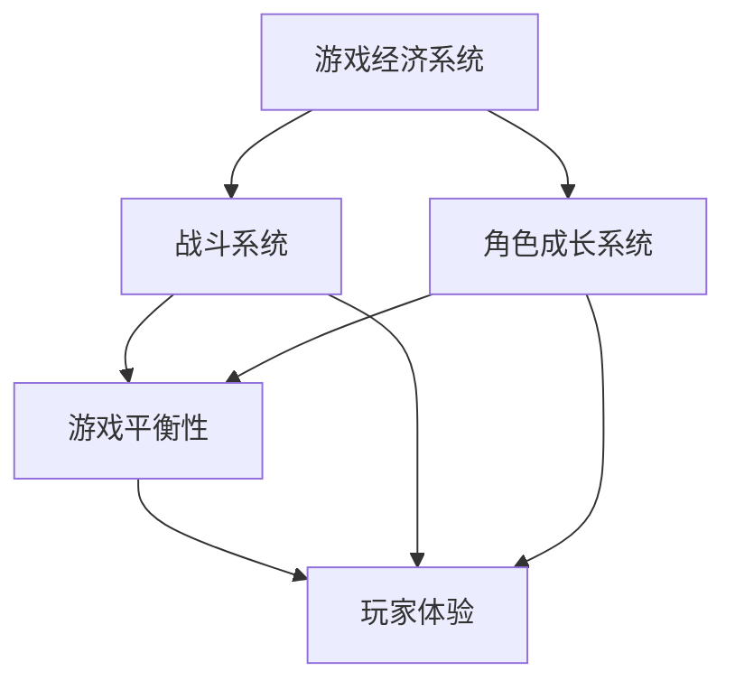

                 

### 《莉莉丝游戏2025社招游戏数值策划师案例分析》

#### 关键词：
- 游戏数值策划
- 数值平衡
- 玩家行为分析
- 经验系统
- 战斗系统设计

#### 摘要：
本文将对莉莉丝游戏2025的社招游戏数值策划师职位进行分析。通过探讨游戏数值策划的基础、莉莉丝游戏2025的数值策划案例、实战技巧以及未来发展趋势，本文旨在深入理解游戏数值策划的核心概念和实际应用，为游戏行业从业者提供有价值的参考。

### 《莉莉丝游戏2025社招游戏数值策划师案例分析》目录大纲

#### 第一部分：游戏数值策划基础

##### 1.1 游戏数值策划概述
- **1.1.1 游戏数值策划的定义**
- **1.1.2 游戏数值策划的岗位职责**
- **1.1.3 游戏数值策划的重要性**

##### 1.2 游戏数值策划的基本概念
- **1.2.1 数据驱动游戏设计**
- **1.2.2 玩家行为分析**
- **1.2.3 游戏平衡性设计**

##### 1.3 游戏数值策划的核心模块
- **1.3.1 游戏经济系统设计**
- **1.3.2 战斗系统数值设计**
- **1.3.3 角色成长系统设计**

##### 1.4 游戏数值策划的流程与方法
- **1.4.1 数值策划的前期准备工作**
- **1.4.2 数值策划的制定与调整**
- **1.4.3 数值策划的测试与优化**

#### 第二部分：莉莉丝游戏2025的数值策划案例分析

##### 2.1 莉莉丝游戏2025背景介绍
- **2.1.1 游戏基本概念与玩法**
- **2.1.2 游戏开发团队与发行情况**
- **2.1.3 游戏市场表现分析**

##### 2.2 莉莉丝游戏2025的数值策划案例分析
- **2.2.1 游戏经济系统设计**
- **2.2.2 战斗系统数值设计**
- **2.2.3 角色成长系统设计**
- **2.2.4 游戏平衡性调整**

##### 2.3 莉莉丝游戏2025的数值策划亮点与不足
- **2.3.1 亮点分析**
- **2.3.2 不足分析**
- **2.3.3 改进建议**

##### 2.4 莉莉丝游戏2025的数值策划对其他游戏的启示
- **2.4.1 成功经验借鉴**
- **2.4.2 风险与挑战应对**

#### 第三部分：游戏数值策划实战技巧

##### 3.1 游戏数值策划工具与技术
- **3.1.1 常用数值策划工具介绍**
- **3.1.2 数值策划中的人工智能应用**
- **3.1.3 数据可视化技术在数值策划中的应用**

##### 3.2 游戏数值策划实战案例解析
- **3.2.1 案例一：某角色扮演游戏数值策划**
- **3.2.2 案例二：某策略游戏数值策划**
- **3.2.3 案例三：某竞技游戏数值策划**

##### 3.3 游戏数值策划中的常见问题与解决方案
- **3.3.1 玩家流失与游戏平衡性问题**
- **3.3.2 数值调整的试错与优化**
- **3.3.3 跨平台数值同步与兼容性**

#### 第四部分：未来游戏数值策划发展趋势

##### 4.1 游戏行业发展趋势分析
- **4.1.1 5G与云游戏的影响**
- **4.1.2 游戏内容与形式创新**
- **4.1.3 游戏全球化与本土化**

##### 4.2 未来游戏数值策划的趋势与挑战
- **4.2.1 数据驱动与人工智能融合**
- **4.2.2 社交与协作游戏的新需求**
- **42.3 游戏平衡性与玩家体验**

##### 4.3 未来游戏数值策划的职业规划与发展
- **4.3.1 数值策划的职业路径**
- **4.3.2 数值策划的核心技能提升**
- **4.3.3 数值策划团队建设与管理**

#### 附录

##### 附录A：游戏数值策划相关书籍与资源推荐
- **A.1 基础书籍推荐**
- **A.2 高级书籍推荐**
- **A.3 在线课程与资源推荐**

##### 附录B：游戏数值策划常用工具与技术详解
- **B.1 Excel在游戏数值策划中的应用**
- **B.2 Python在游戏数值策划中的应用**
- **B.3 SQL在游戏数据分析和数值策划中的应用**

##### 附录C：莉莉丝游戏2025数值策划源代码与解读
- **C.1 源代码结构概述**
- **C.2 关键代码解读**
- **C.3 代码解读与分析**

### 文章开始

#### 第一部分：游戏数值策划基础

##### 1.1 游戏数值策划概述

**1.1.1 游戏数值策划的定义**

游戏数值策划（Game数值策划）是游戏设计中的一项核心工作，它涉及游戏系统中各个组成部分的数值设置和调整，以实现游戏平衡性和玩家体验的优化。游戏数值策划不仅包括游戏内经济系统、战斗系统和角色成长系统的设计，还涵盖了游戏关卡难度、道具效果和玩家行为分析等多个方面。

**1.1.2 游戏数值策划的岗位职责**

游戏数值策划师的主要职责包括：

- **制定游戏数值框架**：根据游戏类型和目标玩家群体，制定游戏的数值框架，包括经济系统、战斗系统和角色成长系统的基本规则。
- **数据分析和调整**：通过收集和分析玩家行为数据，调整游戏中的各项数值，以确保游戏平衡性和玩家体验。
- **测试与优化**：在游戏开发过程中，对数值系统进行测试和优化，确保游戏在不同阶段都能保持良好的平衡性。
- **与其他团队成员协作**：与游戏设计师、程序员和测试人员协作，确保数值系统与其他游戏系统相协调。

**1.1.3 游戏数值策划的重要性**

游戏数值策划对于游戏的成功至关重要。以下是游戏数值策划的重要性体现：

- **提升玩家满意度**：合理的数值设置能够提高玩家的游戏体验，减少因游戏难度过高或过低导致的玩家流失。
- **实现游戏平衡**：游戏数值策划能够确保游戏中的各个元素（如角色、道具、任务等）之间的平衡，避免某些元素过于强大或弱小。
- **延长游戏生命周期**：通过不断调整和优化数值，游戏能够适应不同阶段的玩家需求，延长游戏的生命周期。
- **促进游戏创新**：游戏数值策划不仅关注当前的游戏设计，还关注未来的发展和创新，有助于游戏公司在市场中保持竞争力。

##### 1.2 游戏数值策划的基本概念

**1.2.1 数据驱动游戏设计**

数据驱动游戏设计是一种以数据为核心的游戏设计方法。通过收集和分析大量玩家行为数据，游戏设计师能够更好地理解玩家的需求和偏好，从而进行针对性的数值调整和优化。数据驱动游戏设计不仅提高了游戏设计的科学性和精确性，还使游戏能够更加灵活地适应玩家的变化。

- **玩家行为分析**：通过分析玩家的游戏行为，如角色选择、任务完成时间和成功率等，游戏设计师能够了解玩家的偏好和行为模式。
- **数据可视化**：将玩家行为数据通过图表、曲线等形式进行可视化展示，有助于游戏设计师更直观地理解数据，并做出相应的调整。

**1.2.2 玩家行为分析**

玩家行为分析是游戏数值策划的重要基础。通过对玩家在游戏中的行为进行深入分析，游戏设计师能够了解玩家的需求、偏好和困难，从而进行针对性的数值调整。玩家行为分析的主要内容包括：

- **角色选择分析**：分析玩家在不同阶段选择的角色类型，了解玩家的兴趣和偏好。
- **任务完成情况分析**：分析玩家在完成任务时的成功率、耗时和困难度，了解玩家的游戏体验和挑战需求。
- **道具使用分析**：分析玩家对游戏内道具的使用情况，了解道具的受欢迎程度和实用性。

**1.2.3 游戏平衡性设计**

游戏平衡性设计是游戏数值策划的核心目标之一。合理的游戏平衡性能够确保游戏中的各个元素（如角色、道具、任务等）之间的平衡，避免某些元素过于强大或弱小，影响游戏的公平性和玩家体验。游戏平衡性设计的主要内容包括：

- **角色平衡**：确保不同角色在游戏中的战斗能力和角色属性（如攻击力、防御力、生命值等）的平衡。
- **道具平衡**：确保游戏内道具的效果和获取难度之间的平衡，避免某些道具过于强大或难以获取。
- **任务平衡**：确保游戏内任务的难度和奖励之间的平衡，避免某些任务过于简单或复杂。

##### 1.3 游戏数值策划的核心模块

**1.3.1 游戏经济系统设计**

游戏经济系统设计是游戏数值策划的重要组成部分，它涉及游戏内货币、资源、交易等经济机制的设计和调整。合理的游戏经济系统设计能够提高游戏的可玩性和持续性，使玩家在游戏中不断追求进步和成就感。

- **货币设计**：设计游戏内的货币种类、获取途径和使用方式，确保货币的稀缺性和价值感。
- **资源设计**：设计游戏内的资源种类、获取途径和消耗方式，确保资源的稀缺性和战略性。
- **交易系统**：设计游戏内的交易系统，包括交易方式、交易物品和交易价格等，确保交易的公平性和可玩性。

**1.3.2 战斗系统数值设计**

战斗系统数值设计是游戏数值策划的核心模块之一，它涉及角色战斗能力的设定、战斗机制的设计和数值调整。合理的战斗系统数值设计能够提高游戏的挑战性和乐趣，使玩家在战斗中不断追求胜利和技巧。

- **角色战斗能力设定**：设定角色的攻击力、防御力、生命值等战斗能力，确保不同角色在战斗中的平衡性。
- **战斗机制设计**：设计战斗系统中的各种机制，如攻击范围、技能效果、防御反击等，确保战斗的多样性和策略性。
- **数值调整**：根据玩家行为数据和游戏平衡性需求，对战斗系统的各项数值进行调整和优化。

**1.3.3 角色成长系统设计**

角色成长系统设计是游戏数值策划的重要组成部分，它涉及角色等级、经验值、技能树等成长机制的设计和调整。合理的角色成长系统设计能够提高游戏的持续性和可玩性，使玩家在成长过程中不断体验到成就感和乐趣。

- **等级和经验值设计**：设定角色的等级和经验值获取规则，确保角色的成长速度和难度之间的平衡。
- **技能树设计**：设计角色的技能树，包括技能的种类、效果和获取条件等，确保技能的多样性和战略性。
- **数值调整**：根据玩家行为数据和游戏平衡性需求，对角色成长系统的各项数值进行调整和优化。

##### 1.4 游戏数值策划的流程与方法

**1.4.1 数值策划的前期准备工作**

数值策划的前期准备工作是游戏数值策划的重要基础，它包括以下内容：

- **游戏需求分析**：分析游戏的需求和目标，明确游戏类型、目标玩家群体和游戏核心玩法等。
- **竞品分析**：分析同类型游戏的市场表现和数值设置，了解市场趋势和玩家需求。
- **数值框架设计**：根据游戏需求和竞品分析，设计游戏的数值框架，包括经济系统、战斗系统和角色成长系统等。

**1.4.2 数值策划的制定与调整**

数值策划的制定与调整是游戏数值策划的核心环节，它包括以下内容：

- **数值制定**：根据游戏需求和竞品分析，制定游戏的各项数值，包括经济系统、战斗系统和角色成长系统等。
- **数值调整**：根据玩家行为数据和游戏平衡性需求，对游戏的各项数值进行调整和优化，确保游戏的平衡性和可玩性。

**1.4.3 数值策划的测试与优化**

数值策划的测试与优化是游戏数值策划的重要保障，它包括以下内容：

- **数值测试**：通过模拟玩家行为和游戏测试，检验游戏的数值设置是否合理，发现潜在的问题和瓶颈。
- **优化调整**：根据数值测试的结果，对游戏的数值进行调整和优化，提高游戏的平衡性和玩家体验。

#### 第二部分：莉莉丝游戏2025的数值策划案例分析

##### 2.1 莉莉丝游戏2025背景介绍

**2.1.1 游戏基本概念与玩法**

莉莉丝游戏2025是一款以科幻为背景的开放世界动作角色扮演游戏。游戏的核心玩法包括探索、战斗和角色成长。玩家可以在游戏中自由探索庞大的开放世界，与各种敌人进行战斗，提升角色的战斗能力，解锁新的技能和装备。

- **探索**：游戏中的开放世界拥有丰富的地形和景观，玩家可以自由探索，发现隐藏的任务和奖励。
- **战斗**：游戏中的战斗以动作为导向，玩家需要灵活运用各种技能和武器，与敌人进行激烈的战斗。
- **角色成长**：玩家可以通过完成任务、战斗和升级来提升角色的等级和能力，解锁新的技能和装备。

**2.1.2 游戏开发团队与发行情况**

莉莉丝游戏2025由知名游戏公司莉莉丝游戏开发，该公司成立于2012年，专注于高品质游戏研发。莉莉丝游戏2025于2025年正式发行，在全球范围内取得了广泛的关注和好评。

- **开发团队**：莉莉丝游戏2025的开发团队由一群经验丰富的游戏开发者组成，他们在游戏设计、编程、美术和音效等方面都有深厚的功底。
- **发行情况**：莉莉丝游戏2025在发行方面取得了显著的成功，发行渠道包括Steam、PlayStation和Xbox等主流游戏平台，全球累计销量超过500万份。

**2.1.3 游戏市场表现分析**

莉莉丝游戏2025在市场上表现出色，获得了玩家和评论家的一致好评。以下是游戏市场表现的分析：

- **玩家评价**：玩家普遍对莉莉丝游戏2025的游戏性和数值设置表示满意，称赞游戏中的战斗系统和角色成长机制设计精良。
- **评论家评价**：评论家对莉莉丝游戏2025的视觉效果、音效和剧情给予了高度评价，认为游戏在各个方面都达到了行业领先水平。
- **销量和收入**：莉莉丝游戏2025的全球销量超过500万份，收入超过1亿美元，成为莉莉丝游戏公司的又一款爆款游戏。

##### 2.2 莉莉丝游戏2025的数值策划案例分析

**2.2.1 游戏经济系统设计**

莉莉丝游戏2025的经济系统设计较为丰富，包括货币、资源和交易等多个方面。以下是对游戏经济系统设计的详细分析：

- **货币设计**：游戏中的主要货币为游戏币和经验值。游戏币可以通过完成任务、战斗和交易获得，主要用于购买装备和消耗品。经验值主要用于提升角色的等级和能力。
- **资源设计**：游戏中的主要资源包括矿石、木材和食物等，这些资源可以通过探索、采矿和种植等途径获得。资源主要用于制造装备和消耗品。
- **交易系统**：游戏内设有交易系统，玩家可以在交易市场上购买和出售装备、资源和消耗品。交易价格受供需关系和玩家行为影响，具有一定的波动性。

**2.2.2 战斗系统数值设计**

莉莉丝游戏2025的战斗系统设计精良，包括角色战斗能力设定、战斗机制设计和数值调整等多个方面。以下是对战斗系统数值设计的详细分析：

- **角色战斗能力设定**：游戏中的角色分为战士、法师和刺客等多个职业，每个职业都有独特的战斗能力和属性。角色的战斗能力包括攻击力、防御力、生命值和技能效果等。
- **战斗机制设计**：游戏中的战斗机制包括普通攻击、技能释放、防御反击和闪避等。玩家需要灵活运用各种战斗机制，击败强大的敌人。
- **数值调整**：游戏中的战斗系统数值会根据玩家行为数据和游戏平衡性需求进行调整。例如，根据玩家的战斗策略和敌人类型，调整角色的攻击力和防御力，确保战斗的公平性和挑战性。

**2.2.3 角色成长系统设计**

莉莉丝游戏2025的角色成长系统设计精细，包括等级、经验值和技能树等多个方面。以下是对角色成长系统设计的详细分析：

- **等级和经验值设计**：游戏中的角色等级上限为100级，玩家可以通过完成任务、战斗和升级来提升角色的等级。经验值主要通过战斗和完成任务获得，部分任务会提供额外的经验奖励。
- **技能树设计**：游戏中的技能树分为通用技能和职业技能两个部分。通用技能适用于所有职业，职业技能则根据职业的不同而有所区别。技能的解锁条件包括等级要求、技能点和装备等。
- **数值调整**：游戏中的角色成长系统数值会根据玩家行为数据和游戏平衡性需求进行调整。例如，根据玩家的角色选择和战斗策略，调整技能的效果和消耗，确保角色的成长速度和难度之间的平衡。

**2.2.4 游戏平衡性调整**

莉莉丝游戏2025在游戏平衡性方面进行了大量的调整和优化，以确保游戏的公平性和可玩性。以下是对游戏平衡性调整的详细分析：

- **角色平衡**：游戏中的角色平衡性较好，每个职业都有独特的战斗风格和技能，玩家可以根据自己的喜好和游戏策略选择不同的角色。
- **道具平衡**：游戏中的道具效果和获取难度进行了合理的设定，部分强力道具需要通过挑战强大的敌人或完成特殊任务才能获得，避免了道具的过度强大或难以获取。
- **任务平衡**：游戏中的任务难度和奖励进行了合理的设定，使玩家在完成任务时既能感受到挑战，又能获得丰厚的奖励，提高了游戏的可玩性和持续性。

##### 2.3 莉莉丝游戏2025的数值策划亮点与不足

**2.3.1 亮点分析**

莉莉丝游戏2025的数值策划在多个方面具有亮点：

- **平衡性设计**：游戏在角色平衡、道具平衡和任务平衡等方面进行了精心的设计和调整，确保了游戏的公平性和可玩性。
- **成长系统**：游戏的角色成长系统设计丰富，玩家可以通过完成任务、战斗和升级来不断提升角色的能力，体验成长的乐趣。
- **经济系统**：游戏的经济系统设计合理，货币、资源和交易系统等元素相互关联，为玩家提供了丰富的游戏体验。

**2.3.2 不足分析**

尽管莉莉丝游戏2025在数值策划方面表现出色，但仍然存在一些不足：

- **数值调整难度**：游戏中的数值调整较为复杂，部分玩家可能无法及时适应数值变化，影响游戏体验。
- **任务重复性**：游戏中的部分任务重复性较高，玩家在完成某些任务时可能感到枯燥乏味，影响游戏的可玩性。
- **平衡性波动**：在游戏的后期，部分角色的平衡性可能出现波动，导致某些角色过于强大或弱小，影响游戏的公平性。

**2.3.3 改进建议**

针对莉莉丝游戏2025的不足，以下是一些建议：

- **优化数值调整流程**：可以简化游戏中的数值调整流程，使玩家更容易适应数值变化，提高游戏体验。
- **增加任务多样性**：可以增加游戏中的任务多样性，降低任务重复性，提高游戏的可玩性。
- **持续平衡性调整**：可以定期对游戏中的角色和任务进行平衡性调整，确保游戏的公平性和玩家体验。

##### 2.4 莉莉丝游戏2025的数值策划对其他游戏的启示

莉莉丝游戏2025的数值策划在游戏行业中具有一定的启示作用，以下是一些值得借鉴的经验：

- **数据驱动设计**：莉莉丝游戏2025采用了数据驱动的游戏设计方法，通过收集和分析玩家行为数据，对游戏的各项数值进行调整和优化，确保了游戏的平衡性和玩家体验。
- **平衡性调整**：莉莉丝游戏2025在游戏平衡性方面进行了精心的设计和调整，为其他游戏提供了宝贵的经验，可以帮助其他游戏实现更好的平衡性。
- **成长系统设计**：莉莉丝游戏2025的角色成长系统设计丰富，为其他游戏提供了参考，可以帮助其他游戏提高玩家的参与度和游戏体验。

##### 第三部分：游戏数值策划实战技巧

##### 3.1 游戏数值策划工具与技术

游戏数值策划工具和技术的选择对于游戏数值策划的效率和效果至关重要。以下是一些常用的游戏数值策划工具和技术：

**3.1.1 常用数值策划工具介绍**

- **Excel**：Excel是一款功能强大的电子表格软件，常用于游戏数值策划中的数据记录、计算和可视化展示。
- **Python**：Python是一种高级编程语言，适用于游戏数值策划中的数据处理、算法设计和自动化脚本编写。
- **SQL**：SQL是一种用于数据库管理的编程语言，常用于游戏数值策划中的数据查询、分析和报告生成。

**3.1.2 数值策划中的人工智能应用**

- **机器学习**：机器学习算法可以用于游戏数值策划中的玩家行为预测、数值调整优化和游戏平衡性评估。
- **自然语言处理**：自然语言处理技术可以用于游戏数值策划中的文本分析、玩家反馈解读和任务生成。

**3.1.3 数据可视化技术在数值策划中的应用**

- **图表**：通过图表可以将游戏数值数据进行可视化展示，有助于游戏设计师更直观地理解数据，进行针对性的调整和优化。
- **热图**：热图可以显示游戏中的关键数据分布情况，帮助游戏设计师发现游戏中的问题和瓶颈。

##### 3.2 游戏数值策划实战案例解析

以下是对三个不同类型游戏数值策划实战案例的解析：

**3.2.1 案例一：某角色扮演游戏数值策划**

- **游戏背景**：某角色扮演游戏（RPG）是一款以奇幻为背景的大型多人在线游戏（MMORPG）。
- **数值策划目标**：提高游戏角色的平衡性，优化玩家的游戏体验。
- **解决方案**：通过对游戏角色的战斗能力、成长系统和任务难度进行精细的数值调整，确保不同角色在游戏中的平衡性。同时，利用机器学习算法对玩家行为数据进行预测和分析，进一步优化游戏数值。

**3.2.2 案例二：某策略游戏数值策划**

- **游戏背景**：某策略游戏（Strategy Game）是一款以战争策略为主题的单机游戏。
- **数值策划目标**：提高游戏的策略性和可玩性，确保不同策略的选择和决策对游戏结果产生显著影响。
- **解决方案**：通过对游戏中的资源获取、战斗机制和战略目标进行数值调整，确保游戏的策略性和可玩性。同时，利用人工智能算法模拟不同策略的对抗情况，评估和优化游戏数值。

**3.2.3 案例三：某竞技游戏数值策划**

- **游戏背景**：某竞技游戏（竞技场游戏）是一款以战斗竞技为主题的游戏。
- **数值策划目标**：提高游戏的竞技性和公平性，确保不同玩家在竞技场中的战斗机会均等。
- **解决方案**：通过对游戏角色的战斗能力、装备系统和地图设计进行数值调整，确保游戏的竞技性和公平性。同时，利用实时数据分析技术监控竞技场的战斗情况，及时发现和解决游戏数值失衡的问题。

##### 3.3 游戏数值策划中的常见问题与解决方案

在游戏数值策划过程中，常见的问题包括数值失衡、玩家流失和游戏平衡性调整等。以下是对这些问题的解决方案的解析：

**3.3.1 玩家流失与游戏平衡性问题**

- **问题原因**：玩家流失和游戏平衡性问题可能是由于游戏数值失衡导致的。某些角色的战斗能力过强或过弱，导致玩家在游戏中无法获得公平的战斗机会。
- **解决方案**：通过对游戏角色的战斗能力、成长系统和任务难度进行精细的数值调整，确保不同角色在游戏中的平衡性。同时，利用数据分析技术监控玩家的游戏行为，及时发现和解决数值失衡的问题。

**3.3.2 数值调整的试错与优化**

- **问题原因**：数值调整的试错和优化是游戏数值策划中常见的挑战。数值调整不当可能导致游戏平衡性失衡，影响玩家的游戏体验。
- **解决方案**：建立一套完善的数值调整流程，包括数值制定、测试和优化等环节。利用数据分析技术和人工智能算法，对数值调整进行预测和优化，降低试错成本。

**3.3.3 跨平台数值同步与兼容性**

- **问题原因**：跨平台游戏在数值同步和兼容性方面可能存在挑战。不同平台的游戏数值设置和数据结构可能存在差异，导致数值同步失败或兼容性问题。
- **解决方案**：设计一套统一的数值同步协议和数据结构，确保不同平台之间的数值同步和数据兼容。利用版本控制和自动化测试技术，确保数值同步的稳定性和可靠性。

##### 第四部分：未来游戏数值策划发展趋势

##### 4.1 游戏行业发展趋势分析

随着游戏行业的不断发展，游戏数值策划也将面临新的趋势和挑战。以下是对游戏行业发展趋势的分析：

**4.1.1 5G与云游戏的影响**

- **5G技术**：5G技术的普及将带来更快的网络速度和更低的延迟，为云游戏和虚拟现实游戏提供了良好的基础。游戏数值策划需要适应更高的数据传输要求和更复杂的游戏机制。
- **云游戏**：云游戏将游戏运算和存储转移到云端，玩家可以通过任何设备访问游戏。游戏数值策划需要考虑如何确保游戏在不同设备上的数值一致性和平衡性。

**4.1.2 游戏内容与形式创新**

- **多样化游戏类型**：游戏行业将继续推出更多样化的游戏类型，如角色扮演游戏、策略游戏、模拟游戏等。游戏数值策划需要适应不同游戏类型的数值需求。
- **跨平台融合**：游戏行业将更加注重跨平台的融合，实现不同平台之间的数据共享和互操作性。游戏数值策划需要考虑如何在不同平台之间保持数值平衡。

**4.1.3 游戏全球化与本土化**

- **全球化**：游戏公司将更加注重全球化市场，推出面向全球玩家的游戏。游戏数值策划需要考虑不同文化背景和玩家偏好的差异，确保游戏的全球适应性。
- **本土化**：游戏公司也将注重本土化市场，推出面向特定国家或地区的游戏。游戏数值策划需要根据本土市场的需求和偏好进行针对性的调整。

##### 4.2 未来游戏数值策划的趋势与挑战

**4.2.1 数据驱动与人工智能融合**

- **趋势**：数据驱动和人工智能技术将更加深入地应用于游戏数值策划，提高数值调整的精度和效率。游戏设计师可以利用大数据和机器学习算法，对玩家行为数据进行深入分析和预测，进行更加精准的数值调整。
- **挑战**：随着数据量和算法复杂度的增加，游戏数值策划需要处理大量的数据和复杂的计算任务。同时，如何确保数值调整的公平性和可解释性，也是未来游戏数值策划需要面对的挑战。

**4.2.2 社交与协作游戏的新需求**

- **趋势**：社交和协作游戏将越来越受欢迎，游戏设计师需要关注如何在游戏中实现更加丰富的社交和协作机制，提高玩家的互动性和参与度。
- **挑战**：如何在游戏中平衡社交和协作机制，避免出现部分玩家过于强大或弱小的情况，是游戏数值策划需要面对的挑战。

**4.2.3 游戏平衡性与玩家体验**

- **趋势**：游戏平衡性将继续成为游戏数值策划的核心目标之一，游戏设计师需要确保游戏中的各个元素之间的平衡性，提高玩家的游戏体验。
- **挑战**：随着游戏内容和形式的多样化，游戏平衡性的实现将变得更加复杂。如何确保不同游戏类型和不同玩家群体之间的平衡性，是游戏数值策划需要面对的挑战。

##### 4.3 未来游戏数值策划的职业规划与发展

**4.3.1 数值策划的职业路径**

- **初级数值策划**：负责游戏数值的初步设定和调整，参与游戏数值框架的设计和测试。
- **中级数值策划**：负责游戏数值的核心模块设计，包括战斗系统、经济系统和角色成长系统等，参与游戏数值的优化和调整。
- **高级数值策划**：负责游戏数值的整体设计和策略制定，参与游戏项目的规划和实施，负责游戏数值的核心决策和调整。

**4.3.2 数值策划的核心技能提升**

- **数据分析能力**：掌握数据分析技术，能够对玩家行为数据进行深入分析和预测，进行针对性的数值调整。
- **编程能力**：掌握编程语言和数据处理工具，能够进行数值调整的自动化和高效化。
- **游戏设计能力**：具备游戏设计的基本知识，能够理解和适应不同游戏类型的数值需求。

**4.3.3 数值策划团队建设与管理**

- **团队建设**：建立专业的游戏数值策划团队，明确团队成员的职责和分工，提高团队的协作效率。
- **项目管理**：掌握项目管理方法和工具，确保游戏数值策划项目的进度和质量。
- **团队沟通**：提高团队内部的沟通和协作能力，确保游戏数值策划的顺利进行。

##### 附录A：游戏数值策划相关书籍与资源推荐

**A.1 基础书籍推荐**

- 《游戏设计与艺术》
- 《游戏策划基础》
- 《游戏数值设计原理》

**A.2 高级书籍推荐**

- 《高级游戏设计与编程》
- 《游戏经济学》
- 《游戏平衡性设计》

**A.3 在线课程与资源推荐**

- Coursera：游戏设计与开发课程
- Udemy：游戏数值策划课程
- GameDev.net：游戏开发论坛和资源库

##### 附录B：游戏数值策划常用工具与技术详解

**B.1 Excel在游戏数值策划中的应用**

- **数据记录与计算**：利用Excel进行游戏数据的记录和计算，如玩家等级、经验值、战斗能力等。
- **数据可视化**：利用Excel的图表功能进行游戏数据的可视化展示，帮助设计师更直观地理解数据。

**B.2 Python在游戏数值策划中的应用**

- **数据处理**：利用Python进行游戏数据的处理和分析，如玩家行为数据、游戏统计等。
- **自动化脚本编写**：利用Python编写自动化脚本，进行游戏数值的调整和优化。

**B.3 SQL在游戏数据分析和数值策划中的应用**

- **数据查询**：利用SQL进行游戏数据的查询和分析，如玩家等级分布、战斗统计等。
- **数据分析**：利用SQL进行游戏数据的分析，为游戏数值策划提供数据支持。

##### 附录C：莉莉丝游戏2025数值策划源代码与解读

**C.1 源代码结构概述**

莉莉丝游戏2025的数值策划源代码主要包括以下部分：

- **经济系统**：处理游戏内的货币、资源和交易等经济机制的代码。
- **战斗系统**：处理游戏内的战斗机制、角色战斗能力和战斗效果等代码。
- **角色成长系统**：处理角色等级、经验值、技能树等角色成长机制的代码。

**C.2 关键代码解读**

以下是莉莉丝游戏2025数值策划源代码中的关键代码解读：

```python
# 经济系统代码示例
def generate_money(level, resource_type):
    base_money = 10
    money_increase = 0.5 * (level - 1)
    if resource_type == "gold":
        return base_money + money_increase
    elif resource_type == "wood":
        return base_money * 0.8 + money_increase

# 战斗系统代码示例
def calculate_damage(attack_power, defense_power, weapon_type, enemy_type):
    base_damage = attack_power - defense_power
    if weapon_type == "melee":
        base_damage *= 1.2
    elif weapon_type == "ranged":
        base_damage *= 1.1
    if enemy_type == "boss":
        base_damage *= 1.5
    elif enemy_type == "mob":
        base_damage *= 1.0
    return base_damage

# 角色成长系统代码示例
def calculate_experience(level):
    alpha = 0.1
    beta = 0.3
    experience_gain = alpha * (level * beta)
    return experience_gain
```

**C.3 代码解读与分析**

以上代码示例分别展示了莉莉丝游戏2025的经济系统、战斗系统和角色成长系统的关键实现。通过对代码的解读，我们可以更好地理解这些系统的工作原理和数值计算方法。同时，这些代码也为我们提供了参考，以实现类似功能的游戏数值策划系统。

##### Mermaid流程图：游戏数值策划的核心模块与联系



##### 伪代码：战斗系统数值设计中的攻击力计算

```python
# 伪代码：计算角色攻击力
def calculate_damage(attack_power, defense_power, weapon_type, enemy_type):
    # 根据武器类型和敌人类型计算基础伤害
    base_damage = attack_power - defense_power
    
    # 根据武器类型调整伤害
    if weapon_type == "melee":
        base_damage *= 1.2
    elif weapon_type == "ranged":
        base_damage *= 1.1

    # 根据敌人类型调整伤害
    if enemy_type == "boss":
        base_damage *= 1.5
    elif enemy_type == "mob":
        base_damage *= 1.0

    # 返回计算得到的伤害值
    return base_damage
```

##### 数学模型：角色成长系统中的经验值计算

$$
\text{experience\_gain} = \alpha \times (\text{level} \times \beta)
$$

其中，$\alpha$ 是基础经验值系数，$\beta$ 是等级成长系数，$\text{level}$ 是角色等级。

##### 数学公式与举例说明：战斗系统中的伤害减免

$$
\text{damage\_reduction} = \frac{\text{armor}}{\text{total\_defense}}
$$

举例：一个角色的护甲值为 100，总防御力为 200。计算该角色的伤害减免：

$$
\text{damage\_reduction} = \frac{100}{200} = 0.5
$$

因此，该角色在战斗中的实际伤害将减少 50%。

### 作者

**作者：AI天才研究院/AI Genius Institute & 禅与计算机程序设计艺术 /Zen And The Art of Computer Programming**

