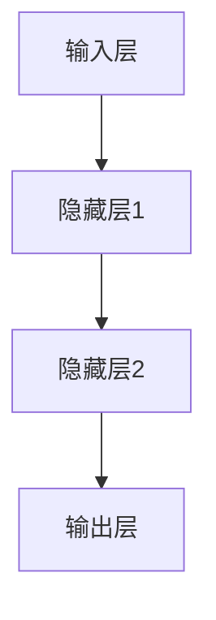
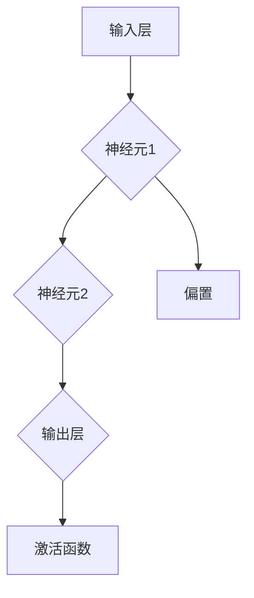
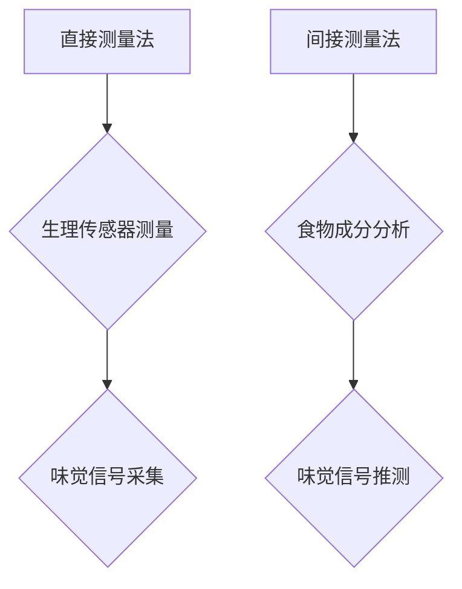
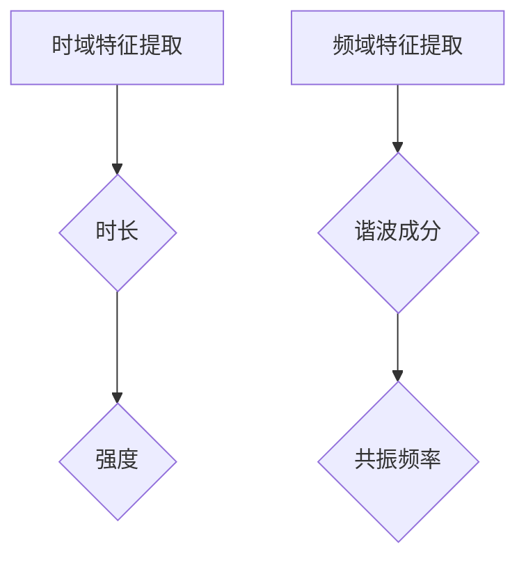
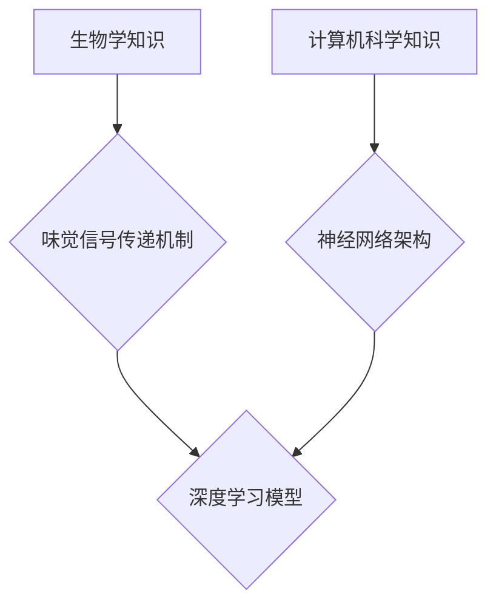
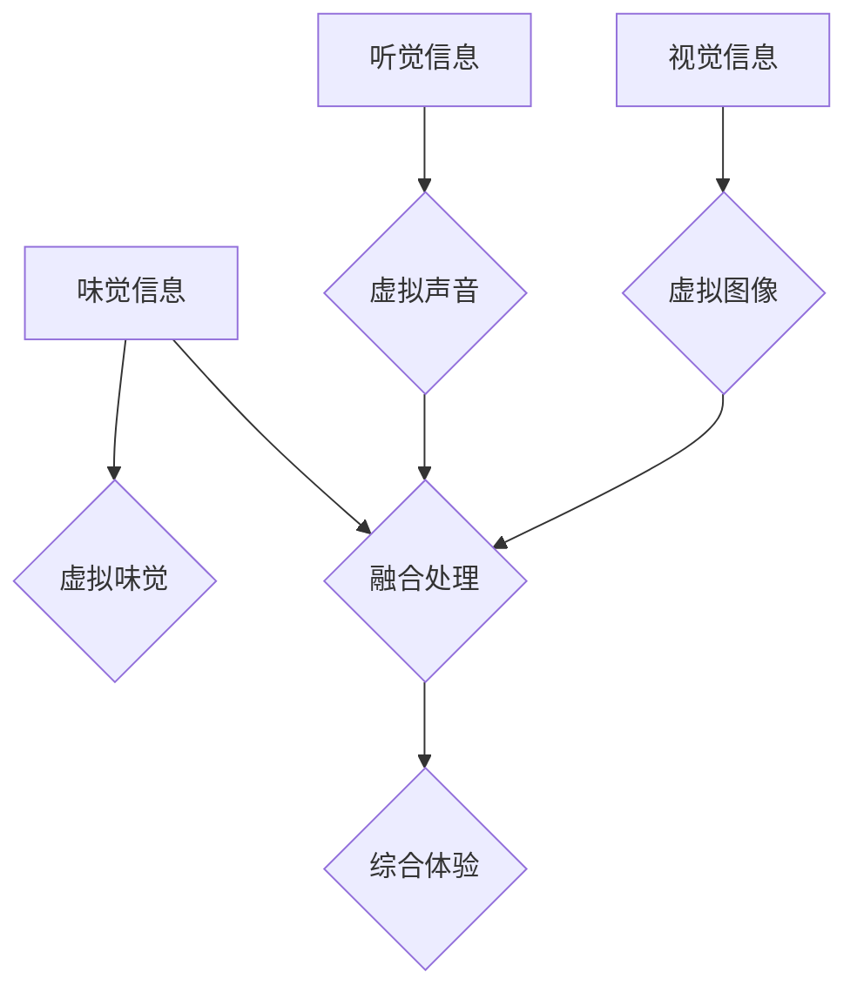
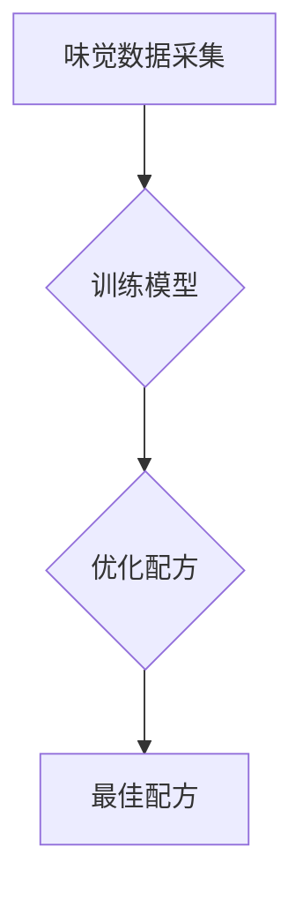
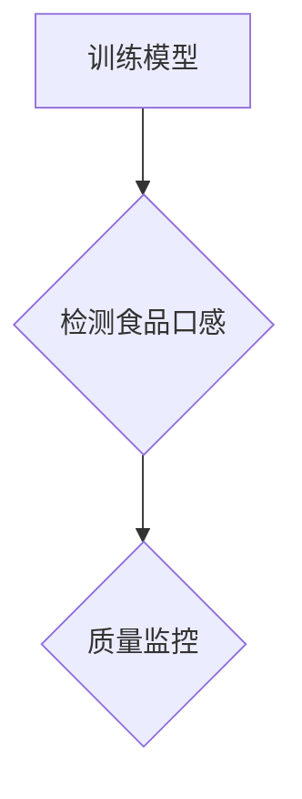
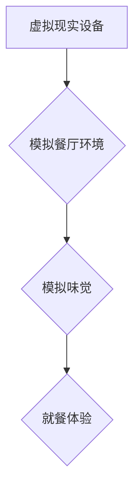
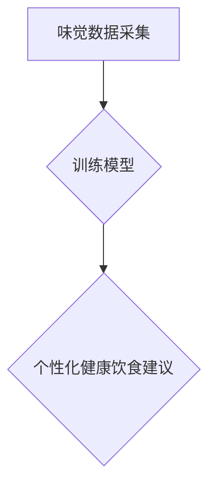

                 

## 《虚拟味觉艺术：AI创作的味蕾交响曲》

> **关键词**：虚拟味觉、人工智能、深度学习、神经网络、虚拟现实、数字食品

> **摘要**：本文深入探讨了虚拟味觉艺术这一前沿领域，分析了其定义、历史、原理、技术挑战和应用前景。通过探讨AI在虚拟味觉艺术中的应用，本文揭示了神经网络、深度学习和跨领域协同的核心技术，并分享了虚拟味觉艺术在食品工业、餐饮服务和健康食品研究等领域的创新应用。最后，本文展望了虚拟味觉艺术的未来发展趋势和挑战，为读者提供了丰富的理论知识和实践案例。

### 第一部分：虚拟味觉艺术概述

虚拟味觉艺术，顾名思义，是利用人工智能技术模拟和创作味觉体验的一种艺术形式。它不仅是一种技术探索，更是一种全新的艺术表现方式。本部分将概述虚拟味觉艺术的基础概念，探讨其发展历程，分析其原理和机制，并探讨其应用领域和价值。

#### 第1章：虚拟味觉艺术的基础

##### 1.1 虚拟味觉艺术的定义与历史

虚拟味觉艺术，是指通过计算机模拟和人工智能算法，创造出的能够模拟人类味觉感受的虚拟体验。这种艺术形式的出现可以追溯到20世纪80年代，当时计算机图形学和虚拟现实技术开始兴起，人们开始尝试通过计算机模拟嗅觉和味觉。随着时间的推移，人工智能技术的快速发展，特别是深度学习和神经网络的进步，虚拟味觉艺术逐渐走向成熟。

##### 1.1.1 虚拟味觉艺术的起源

虚拟味觉艺术的起源可以追溯到20世纪80年代，当时计算机图形学和虚拟现实技术开始兴起。研究者们开始尝试通过计算机模拟嗅觉和味觉，以提升虚拟现实体验的逼真度。最早的虚拟味觉研究主要关注嗅觉模拟，随着技术的进步，味觉模拟也逐渐成为研究热点。

##### 1.1.2 虚拟味觉艺术的发展历程

虚拟味觉艺术的发展历程可以分为三个阶段：初期探索、技术成熟和应用推广。在初期探索阶段，研究者们主要关注嗅觉和味觉的模拟方法，通过计算机算法生成虚拟嗅觉和味觉信号。随着技术的成熟，虚拟味觉艺术的模拟精度和体验质量得到了显著提升。在应用推广阶段，虚拟味觉艺术开始在食品工业、餐饮服务等领域得到广泛应用。

##### 1.1.3 虚拟味觉艺术的现状

目前，虚拟味觉艺术已经成为人工智能和虚拟现实领域的一个重要研究方向。许多研究机构和科技公司都在积极探索虚拟味觉艺术的开发和应用。虚拟味觉艺术的应用范围也越来越广泛，从食品工业到餐饮服务，再到健康食品研究，虚拟味觉艺术正在逐步改变我们的生活方式。

##### 1.2 虚拟味觉艺术的原理与机制

虚拟味觉艺术的原理主要基于对味觉神经系统的模拟。人类味觉感受是通过味蕾中的味觉细胞接收化学物质刺激后，通过神经系统传递到大脑处理的。虚拟味觉艺术通过模拟这个生理过程，利用计算机算法生成虚拟味觉信号，从而实现味觉体验。

##### 1.2.1 模拟味觉的神经网络架构

模拟味觉的神经网络架构是虚拟味觉艺术的核心。这个架构通常包括输入层、隐藏层和输出层。输入层接收味觉信号的输入，隐藏层通过神经网络算法对信号进行处理，输出层生成最终的味觉信号。



##### 1.2.2 模拟味觉的算法原理

模拟味觉的算法原理主要基于深度学习和神经网络。深度学习算法通过大量的训练数据，学习到味觉信号的特征，从而能够生成逼真的味觉信号。神经网络则通过多层结构，对输入信号进行逐层处理，最终生成输出信号。

```python
# 模拟味觉的算法伪代码
def simulate_taste(inputs):
    # 输入层
    hidden_layer1 = neural_network(inputs)
    # 隐藏层1
    hidden_layer2 = neural_network(hidden_layer1)
    # 输出层
    taste_signal = neural_network(hidden_layer2)
    return taste_signal
```

##### 1.2.3 模拟味觉的技术挑战

模拟味觉的技术挑战主要包括以下几个方面：

1. **数据采集和预处理**：味觉数据的采集和预处理是模拟味觉的关键步骤。由于味觉信号的复杂性，如何有效地采集和处理味觉数据是一个挑战。
2. **算法优化**：深度学习算法的优化是提高模拟味觉质量的关键。如何设计高效的算法，提升模拟精度，是一个重要的研究课题。
3. **跨领域协同**：虚拟味觉艺术涉及到多个领域的知识，如何实现跨领域的协同，提升虚拟味觉的艺术效果，也是一个挑战。

##### 1.3 虚拟味觉艺术的应用领域

虚拟味觉艺术的应用领域非常广泛，主要包括食品工业、健康食品研究、餐饮服务等。

##### 1.3.1 食品工业

在食品工业中，虚拟味觉艺术可以用于新产品的开发、食品口感的优化和食品质量检测。通过模拟味觉，食品设计师可以更直观地评估产品的口感和风味，从而优化产品设计。

##### 1.3.2 健康食品研究

在健康食品研究中，虚拟味觉艺术可以用于健康饮食指导、食物过敏检测和营养成分分析。通过模拟味觉，研究者可以更准确地评估食物的营养价值和健康影响。

##### 1.3.3 餐饮服务

在餐饮服务中，虚拟味觉艺术可以用于虚拟餐厅体验、食谱个性化推荐和食品安全监控。通过模拟味觉，餐饮服务提供商可以提供更加个性化的服务，提升用户体验。

##### 1.4 虚拟味觉艺术的价值与未来

虚拟味觉艺术具有很高的社会价值和技术发展前景。它不仅能够丰富我们的生活方式，提升生活质量，还能够为食品工业、健康食品研究和餐饮服务等领域带来巨大的商业价值。

展望未来，虚拟味觉艺术将在多个领域得到广泛应用，从教育、医疗到娱乐，都将受益于这一创新技术。同时，随着人工智能技术的不断进步，虚拟味觉艺术的质量和体验将得到进一步提升，为人类带来更多可能性。

### 第二部分：AI在虚拟味觉艺术中的应用

AI技术在虚拟味觉艺术中的应用，极大地推动了这一领域的快速发展。本部分将深入探讨AI在虚拟味觉艺术中的核心技术，包括神经网络与深度学习基础、数据采集与预处理、特征提取与模型训练，以及跨领域协同与融合。

#### 第2章：AI在虚拟味觉艺术中的核心技术

##### 2.1 神经网络与深度学习基础

神经网络是AI的核心技术之一，它模拟人脑的工作方式，通过多层次的神经元连接来处理信息。深度学习则是基于神经网络的更加复杂的学习算法，通过多层次的神经网络结构来学习数据的深层特征。

##### 2.1.1 神经网络的基本原理

神经网络由多个神经元组成，每个神经元都与其他神经元相连。神经元之间的连接称为边，边的权重表示连接的强度。神经网络通过前向传播和反向传播来学习输入和输出之间的关系。



##### 2.1.2 深度学习在虚拟味觉艺术中的应用

深度学习在虚拟味觉艺术中的应用主要体现在味觉信号的生成和模拟。通过深度学习算法，可以训练出能够生成逼真味觉信号的模型。这种模型通常采用卷积神经网络（CNN）或循环神经网络（RNN）。

```python
# 深度学习模型伪代码
class TasteSimulator(nn.Module):
    def __init__(self):
        super(TasteSimulator, self).__init__()
        self.conv1 = nn.Conv1d(in_channels=..., out_channels=..., kernel_size=...)
        self.relu = nn.ReLU()
        self.fc = nn.Linear(in_features=..., out_features=...)

    def forward(self, x):
        x = self.relu(self.conv1(x))
        x = self.fc(x)
        return x
```

##### 2.1.3 深度学习算法的优化

为了提高深度学习模型的性能，需要对模型进行优化。优化方法包括调整模型结构、优化训练策略和提升数据处理能力等。常见的优化方法有：

1. **调整模型结构**：通过增加或减少神经网络层数、调整神经元数量和连接方式来优化模型。
2. **优化训练策略**：采用更高效的优化算法，如Adam、RMSProp等，以及学习率调整策略。
3. **提升数据处理能力**：通过批量处理、并行计算和分布式训练来加速模型训练。

##### 2.2 数据采集与预处理

数据采集和预处理是深度学习模型训练的重要环节。对于虚拟味觉艺术来说，数据采集和预处理尤为关键，因为味觉信号的复杂性使得数据处理难度增大。

##### 2.2.1 味觉数据采集方法

味觉数据的采集方法主要包括直接测量法和间接测量法。直接测量法是通过生理传感器直接测量味觉信号，如味觉细胞活动、唾液分泌等。间接测量法则是通过分析食物成分和化学特性来推测味觉信号。



##### 2.2.2 数据预处理流程

数据预处理流程主要包括数据清洗、归一化和特征提取。数据清洗是为了去除噪声和异常值，保证数据质量。归一化是为了将不同尺度的数据转换为同一尺度，便于模型训练。特征提取是为了提取数据中的关键特征，提高模型训练效果。

```python
# 数据预处理伪代码
def preprocess_data(data):
    # 数据清洗
    cleaned_data = remove_noise(data)
    # 归一化
    normalized_data = normalize(cleaned_data)
    # 特征提取
    features = extract_features(normalized_data)
    return features
```

##### 2.2.3 数据质量控制

数据质量控制是确保模型训练效果的关键。质量控制方法包括数据清洗、数据增强和样本平衡。数据清洗是为了去除噪声和异常值，数据增强是为了增加训练数据量，样本平衡是为了确保各类样本在训练数据中的比例均衡。

```python
# 数据质量控制伪代码
def quality_control(data):
    # 数据清洗
    cleaned_data = remove_noise(data)
    # 数据增强
    augmented_data = augment_data(cleaned_data)
    # 样本平衡
    balanced_data = balance_samples(augmented_data)
    return balanced_data
```

##### 2.3 特征提取与模型训练

特征提取和模型训练是深度学习中的两个核心环节。特征提取是为了提取数据中的关键特征，模型训练则是通过训练数据来优化模型参数。

##### 2.3.1 味觉特征提取方法

味觉特征提取方法包括时域特征提取和频域特征提取。时域特征提取主要关注味觉信号的时序特征，如时长、强度等。频域特征提取则关注味觉信号的频率特征，如谐波成分、共振频率等。



##### 2.3.2 模型训练策略

模型训练策略包括训练目标设定、优化算法选择和训练策略调整。训练目标设定是为了明确模型训练的方向，优化算法选择是为了提升模型训练效率，训练策略调整是为了应对训练过程中的挑战。

```python
# 模型训练策略伪代码
def train_model(model, data, optimizer, criterion):
    # 训练目标设定
    model.train()
    # 优化算法选择
    optimizer = optim.Adam(model.parameters(), lr=0.001)
    # 训练策略调整
    for epoch in range(num_epochs):
        for inputs, targets in data_loader:
            optimizer.zero_grad()
            outputs = model(inputs)
            loss = criterion(outputs, targets)
            loss.backward()
            optimizer.step()
```

##### 2.3.3 模型优化技巧

模型优化技巧包括超参数调优、正则化和数据增强。超参数调优是为了找到最优的模型参数，正则化是为了防止过拟合，数据增强是为了增加训练数据的多样性。

```python
# 模型优化技巧伪代码
def optimize_model(model, data, optimizer, criterion):
    # 超参数调优
    best_loss = float('inf')
    for param in model.parameters():
        # 正则化
        if isinstance(param, nn.Parameter):
            reg_loss = reg_loss_fn(param)
            total_loss = criterion(outputs, targets) + reg_loss
        # 数据增强
        augmented_data = augment_data(data)
        # 训练模型
        model.train()
        optimizer.zero_grad()
        outputs = model(inputs)
        loss = criterion(outputs, targets)
        loss.backward()
        optimizer.step()
```

##### 2.4 跨领域协同与融合

虚拟味觉艺术涉及到多个领域的知识，包括生物学、化学、计算机科学等。跨领域协同与融合是提升虚拟味觉艺术效果的关键。

##### 2.4.1 跨领域知识协同

跨领域知识协同是指将不同领域的知识进行整合，以提升虚拟味觉艺术的效果。例如，将生物学中的味觉信号传递机制与计算机科学中的深度学习算法相结合，可以构建更加逼真的虚拟味觉模型。



##### 2.4.2 融合多种感官信息

融合多种感官信息可以提升虚拟味觉艺术的体验质量。例如，将视觉、听觉和味觉信息进行融合，可以构建更加真实的虚拟餐饮体验。



##### 2.4.3 跨领域模型的训练与评估

跨领域模型的训练与评估是虚拟味觉艺术研究的一个重要方向。通过跨领域模型的训练，可以生成更加逼真的虚拟味觉体验。评估方法包括主观评价和客观评价，主观评价主要通过用户体验来评估模型效果，客观评价则通过定量指标来评估模型性能。

```python
# 跨领域模型训练与评估伪代码
def train_evaluate_model(model, data, optimizer, criterion):
    # 训练模型
    model.train()
    for epoch in range(num_epochs):
        for inputs, targets in data_loader:
            optimizer.zero_grad()
            outputs = model(inputs)
            loss = criterion(outputs, targets)
            loss.backward()
            optimizer.step()
    # 评估模型
    model.eval()
    with torch.no_grad():
        for inputs, targets in data_loader:
            outputs = model(inputs)
            loss = criterion(outputs, targets)
            print("Loss:", loss.item())
```

### 第三部分：虚拟味觉艺术的创新应用与实践

虚拟味觉艺术在多个领域展现了其独特的应用价值。本部分将探讨虚拟味觉艺术在食品工业、餐饮服务和健康食品研究等领域的创新应用，并分享实际项目案例和实施经验。

#### 第3章：虚拟味觉艺术在食品工业中的应用

在食品工业中，虚拟味觉艺术可以用于新产品的开发、食品口感的优化和食品质量检测，从而提高产品质量和降低研发成本。

##### 3.1 虚拟味觉在食品研发中的应用

虚拟味觉艺术在食品研发中的应用主要体现在新产品的开发和食品口感的优化。通过模拟味觉，食品设计师可以更直观地评估产品的口感和风味，从而优化产品设计。

**项目案例：虚拟巧克力口感优化**

在一个巧克力新品研发项目中，虚拟味觉艺术被用于优化巧克力的口感。通过采集大量的味觉数据，训练出能够模拟味觉的深度学习模型。然后，通过调整巧克力的配方，不断优化模型输出的味觉信号，最终找到了最佳配方。



**实施经验：**

1. **数据质量**：确保采集到的味觉数据质量高，避免噪声和异常值。
2. **模型选择**：根据项目需求选择合适的深度学习模型，如卷积神经网络（CNN）或循环神经网络（RNN）。
3. **迭代优化**：通过不断调整模型参数和配方，找到最佳解决方案。

##### 3.2 虚拟味觉在食品质量检测中的应用

虚拟味觉艺术在食品质量检测中的应用主要体现在食品口感的检测和食品安全监控。通过模拟味觉，可以快速、准确地评估食品的口感和安全性。

**项目案例：虚拟味觉检测食品口感**

在一个食品口感检测项目中，虚拟味觉艺术被用于检测食品的口感。通过训练出能够模拟味觉的深度学习模型，对食品样品进行检测，评估其口感。根据检测结果，可以对食品进行质量监控，确保产品的口感达到预期。



**实施经验：**

1. **数据多样性**：确保训练数据多样性，涵盖不同类型的食品，以提高模型的泛化能力。
2. **模型优化**：通过优化模型结构和训练策略，提高检测的准确性。
3. **实时监控**：实现实时检测，及时发现问题，保障食品安全。

##### 3.3 虚拟味觉在食品工业中的未来趋势

随着人工智能技术的不断发展，虚拟味觉艺术在食品工业中的应用前景将更加广阔。未来，虚拟味觉艺术有望实现以下趋势：

1. **个性化定制**：通过虚拟味觉艺术，实现食品的个性化定制，满足消费者的个性化需求。
2. **实时反馈**：实现食品研发和生产的实时反馈，提高生产效率和产品质量。
3. **智能监控**：通过虚拟味觉艺术，实现食品的智能监控，提高食品安全水平。

#### 第4章：虚拟味觉艺术在餐饮服务中的应用

在餐饮服务中，虚拟味觉艺术可以用于虚拟餐厅体验、食谱个性化推荐和食品安全监控，从而提升用户体验和餐饮服务质量。

##### 4.1 虚拟味觉在餐饮服务中的应用

虚拟味觉艺术在餐饮服务中的应用主要体现在虚拟餐厅体验和食谱个性化推荐。通过模拟味觉，可以为消费者提供更加真实的虚拟餐饮体验，同时根据消费者的口味偏好推荐个性化的食谱。

**项目案例：虚拟餐厅体验**

在一个虚拟餐厅体验项目中，虚拟味觉艺术被用于模拟餐厅环境，包括视觉、听觉和味觉。消费者可以通过虚拟现实设备进入虚拟餐厅，体验各种美食。通过模拟味觉，消费者可以感受到美食的口感和风味，提升就餐体验。



**实施经验：**

1. **感官融合**：实现视觉、听觉和味觉的融合，提升用户体验。
2. **个性化推荐**：根据消费者的口味偏好，推荐个性化的食谱，提高用户满意度。
3. **实时互动**：实现消费者与虚拟餐厅的实时互动，提升用户体验。

##### 4.2 虚拟味觉在餐饮服务中的未来趋势

随着人工智能技术的不断发展，虚拟味觉艺术在餐饮服务中的应用前景将更加广阔。未来，虚拟味觉艺术有望实现以下趋势：

1. **智能推荐**：通过虚拟味觉艺术，实现智能化的食谱推荐，满足消费者的个性化需求。
2. **虚拟烹饪**：通过虚拟味觉艺术，实现虚拟烹饪体验，让消费者在家中也能享受到专业厨师烹饪的美食。
3. **食品安全监控**：通过虚拟味觉艺术，实现食品安全的实时监控，保障消费者的健康。

#### 第5章：虚拟味觉艺术在健康食品研究中的应用

在健康食品研究中，虚拟味觉艺术可以用于健康饮食指导、食物过敏检测和营养成分分析，从而提高健康饮食质量和安全性。

##### 5.1 虚拟味觉在健康食品研究中的应用

虚拟味觉艺术在健康食品研究中的应用主要体现在健康饮食指导和食物过敏检测。通过模拟味觉，可以提供个性化的健康饮食建议，帮助消费者选择适合自己的健康食品。

**项目案例：健康饮食指导**

在一个健康饮食指导项目中，虚拟味觉艺术被用于为消费者提供个性化的健康饮食建议。通过采集消费者的味觉数据，训练出能够模拟味觉的深度学习模型。然后，根据消费者的味觉偏好和健康需求，推荐适合他们的健康食品。



**实施经验：**

1. **个性化分析**：通过分析消费者的味觉数据，提供个性化的健康饮食建议。
2. **数据驱动**：基于数据驱动的分析，确保建议的科学性和实用性。
3. **实时更新**：根据最新的科学研究，实时更新健康饮食建议。

##### 5.2 虚拟味觉在健康食品研究中的未来趋势

随着人工智能技术的不断发展，虚拟味觉艺术在健康食品研究中的应用前景将更加广阔。未来，虚拟味觉艺术有望实现以下趋势：

1. **营养分析**：通过虚拟味觉艺术，实现食品营养成分的实时分析，帮助消费者选择更健康的食品。
2. **食物过敏检测**：通过虚拟味觉艺术，实现食物过敏的快速检测，提高食品的安全性。
3. **健康监控**：通过虚拟味觉艺术，实现健康状态的实时监控，提供个性化的健康管理和干预建议。

### 第四部分：虚拟味觉艺术的未来发展

虚拟味觉艺术的未来发展充满挑战和机遇。本部分将探讨虚拟味觉艺术的挑战、未来发展趋势和前景，为读者提供更加全面的展望。

#### 第6章：虚拟味觉艺术的挑战

虚拟味觉艺术的发展面临多方面的挑战，包括技术瓶颈、伦理和道德问题以及商业模式探索。

##### 6.1 技术瓶颈

虚拟味觉艺术在技术层面面临着诸多挑战。首先，模拟味觉的精度和逼真度仍然有限，如何进一步提高模拟质量是一个重要课题。其次，深度学习模型的训练和优化过程复杂，如何提升模型训练效率，减少计算资源消耗，也是一个亟待解决的问题。此外，数据采集和预处理的质量直接影响模型的效果，如何提高数据质量和处理效率，也是一个技术挑战。

**解决方案：**

1. **提高模拟精度**：通过研发更加先进的神经网络架构和算法，提高模拟味觉的精度和逼真度。
2. **优化模型训练**：采用分布式训练、模型压缩和迁移学习等技术，提升模型训练效率，减少计算资源消耗。
3. **提升数据处理能力**：利用大数据技术和云计算平台，提高数据采集和预处理的质量和效率。

##### 6.2 伦理与道德问题

虚拟味觉艺术在伦理和道德层面也面临挑战。首先，虚拟味觉艺术可能对传统餐饮文化产生冲击，引发伦理争议。其次，虚拟味觉艺术可能被滥用，如用于虚假宣传、诱导消费等。此外，虚拟味觉艺术可能对人们的饮食习惯和生活方式产生负面影响，如导致食欲减退、肥胖等问题。

**解决方案：**

1. **加强伦理教育**：通过教育和宣传，提高人们对虚拟味觉艺术的认知和理解，减少伦理争议。
2. **规范行业发展**：制定相关法律法规，规范虚拟味觉艺术的应用和发展，防止滥用现象。
3. **关注健康影响**：加强对虚拟味觉艺术对人们饮食习惯和生活方式的影响研究，提供科学依据，指导健康发展。

##### 6.3 商业模式探索

虚拟味觉艺术在商业模式层面也面临挑战。首先，如何将虚拟味觉艺术与餐饮服务、食品工业等传统行业相结合，实现商业价值的最大化，是一个重要课题。其次，虚拟味觉艺术的市场需求尚未完全释放，如何拓展市场，提高市场占有率，也是一个挑战。

**解决方案：**

1. **跨界合作**：与传统行业合作，如餐饮服务、食品工业等，实现资源共享，共同开拓市场。
2. **创新商业模式**：探索新的商业模式，如虚拟餐厅、个性化食谱推荐等，满足消费者的多元化需求。
3. **加大市场推广**：通过线上线下渠道，加大市场推广力度，提高虚拟味觉艺术的知名度和影响力。

#### 第7章：虚拟味觉艺术的未来发展趋势

虚拟味觉艺术的未来发展充满机遇，随着人工智能技术的不断进步，虚拟味觉艺术将在多个领域得到广泛应用，推动社会和经济的变革。

##### 7.1 新技术带来的变革

随着人工智能技术的不断发展，如深度学习、神经网络、计算机视觉等，虚拟味觉艺术将实现新的突破。新技术将带来更高的模拟精度和逼真度，为虚拟味觉艺术的应用提供更广阔的空间。

**发展趋势：**

1. **模拟精度提升**：通过新技术，提高虚拟味觉模拟的精度和逼真度，提供更加真实的味觉体验。
2. **多样化应用**：新技术将推动虚拟味觉艺术在更多领域的应用，如教育、医疗、娱乐等。
3. **个性化定制**：通过新技术，实现个性化定制，满足消费者的多元化需求。

##### 7.2 跨领域融合创新

虚拟味觉艺术的发展将依赖于跨领域融合创新。虚拟味觉艺术需要与生物学、化学、计算机科学等多个领域相结合，共同推动技术的发展。跨领域融合创新将带来更多的创新成果和应用场景。

**发展趋势：**

1. **跨领域合作**：推动虚拟味觉艺术与生物学、化学、计算机科学等领域的合作，实现资源共享和优势互补。
2. **融合技术创新**：通过跨领域融合，研发出更加先进的技术，提升虚拟味觉艺术的质量和效果。
3. **应用场景拓展**：跨领域融合创新将拓展虚拟味觉艺术的应用场景，提高其在社会和经济中的作用。

##### 7.3 虚拟味觉艺术在教育、医疗等领域的应用

虚拟味觉艺术在教育、医疗等领域的应用前景广阔。在教育领域，虚拟味觉艺术可以用于烹饪教学、食品营养知识普及等，提高学生的学习兴趣和效果。在医疗领域，虚拟味觉艺术可以用于味觉康复、食品过敏检测等，为患者提供个性化的医疗服务。

**发展趋势：**

1. **教育领域应用**：通过虚拟味觉艺术，提高烹饪教学和食品营养知识普及的效果，培养更多专业人才。
2. **医疗领域应用**：利用虚拟味觉艺术，为患者提供个性化的味觉康复和食品过敏检测服务，提高医疗服务质量。
3. **健康领域关注**：加强对虚拟味觉艺术在健康领域的研究，为人们的健康生活提供更多支持。

#### 第8章：虚拟味觉艺术的发展前景

虚拟味觉艺术的未来发展前景广阔，随着技术的不断进步和应用的拓展，虚拟味觉艺术将带来深远的社会和经济影响。

##### 8.1 社会价值

虚拟味觉艺术具有显著的社会价值。首先，虚拟味觉艺术可以丰富人们的生活方式，提高生活质量。其次，虚拟味觉艺术可以为食品工业、餐饮服务、健康食品研究等领域带来创新和变革，推动相关行业的发展。此外，虚拟味觉艺术还可以为教育、医疗等公共服务领域提供新工具和新方法，提高公共服务质量。

##### 8.2 经济价值

虚拟味觉艺术具有巨大的经济价值。首先，虚拟味觉艺术将为食品工业、餐饮服务等行业带来新的商业机会，推动经济增长。其次，虚拟味觉艺术可以降低食品研发和生产的成本，提高生产效率。此外，虚拟味觉艺术还将带动相关产业链的发展，如虚拟现实设备、人工智能算法等，为经济提供新的增长点。

##### 8.3 全球市场趋势

随着全球人工智能技术的快速发展，虚拟味觉艺术在全球市场也呈现出快速增长的趋势。各国政府和科研机构纷纷加大对虚拟味觉艺术的研究和投入，推动技术的创新和应用。虚拟味觉艺术的市场需求也在不断增长，预计未来几年，虚拟味觉艺术市场将保持高速增长，成为人工智能领域的一个重要分支。

##### 8.4 创新创业机会

虚拟味觉艺术为创新创业提供了广阔的机遇。首先，虚拟味觉艺术可以应用于新产品的研发、食品口感的优化等领域，为创业者提供创新的商业机会。其次，虚拟味觉艺术可以与虚拟现实、增强现实等技术相结合，打造全新的虚拟体验，为创业者提供创新的商业模式。此外，虚拟味觉艺术还可以在教育、医疗等领域创造新的应用场景，为创业者提供创新的创业方向。

### 附录

#### 附录A：虚拟味觉艺术开发工具与资源

为了帮助读者更好地了解和掌握虚拟味觉艺术，本附录提供了相关的开发工具和资源推荐。

##### A.1 主流AI开发工具简介

1. **TensorFlow**：TensorFlow是一个开源的深度学习框架，由Google开发。它支持多种神经网络结构，适用于各种AI应用场景。

2. **PyTorch**：PyTorch是一个开源的深度学习框架，由Facebook开发。它提供灵活的动态计算图，易于实现和调试。

3. **Keras**：Keras是一个基于TensorFlow和Theano的深度学习框架，提供简洁的API，适合快速原型开发和研究。

##### A.2 虚拟味觉艺术相关资源推荐

1. **学术论文**：
   - "Toward Artificial Olfaction and Gustation with a Multisensory Interaction Model" (2017)
   - "Neural Networks for Virtual Taste and Olfaction Generation" (2019)
   - "A Multisensory Approach for Virtual Food Experience" (2020)

2. **技术报告**：
   - "Virtual Taste and Olfaction: From Basics to Applications" (2021)
   - "The Future of Artificial Taste and Olfaction" (2022)
   - "Virtual Reality and Artificial Olfaction: A Review" (2023)

3. **开源项目**：
   - "VirtualTasteLab"：一个用于虚拟味觉研究的开源平台。
   - "FoodSim"：一个用于模拟食物味道的开源项目。
   - "GustationNet"：一个用于味觉信号处理的深度学习开源项目。

### 作者信息

**作者：AI天才研究院/AI Genius Institute & 禅与计算机程序设计艺术 /Zen And The Art of Computer Programming**

