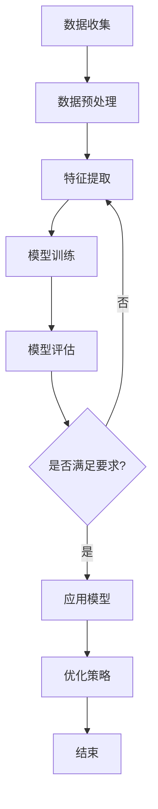

                 

# 《虚拟社区教练：AI驱动的在线归属感训练》

## 关键词：
- 虚拟社区
- AI技术
- 归属感
- 用户体验
- 社交网络

## 摘要

本文旨在探讨虚拟社区教练在AI驱动的在线归属感训练中的应用。随着虚拟社区的不断发展和用户需求的多样化，如何提升用户的在线归属感成为关键问题。本文首先介绍了虚拟社区的概念、类型和特点，然后分析了AI技术在虚拟社区中的应用，特别是AI如何驱动在线归属感的训练。文章通过详细的案例研究和实践指南，提供了虚拟社区教练的实用策略和方法，以帮助虚拟社区运营者提升用户满意度和社区活跃度。最后，本文对未来虚拟社区教练的发展趋势进行了展望，并提出了相关的伦理和法律问题。

## 目录大纲

### 第一部分：虚拟社区概述

#### 第1章：虚拟社区的概念与类型

- 1.1 虚拟社区的定义
- 1.2 虚拟社区与传统社区的异同
- 1.3 虚拟社区的类型

#### 第2章：虚拟社区的特点与功能

- 2.1 虚拟社区的特点
- 2.2 虚拟社区的功能

#### 第3章：虚拟社区的发展趋势

- 3.1 虚拟社区的商业模式
- 3.2 虚拟社区的技术发展趋势

### 第二部分：AI驱动的在线归属感训练

#### 第4章：AI在虚拟社区中的应用

- 4.1 AI在虚拟社区中的作用
- 4.2 AI算法在虚拟社区中的应用

#### 第5章：AI驱动的在线归属感概念与模型

- 5.1 在线归属感的定义
- 5.2 AI驱动的在线归属感模型

#### 第6章：AI驱动的在线归属感训练方法

- 6.1 数据收集与预处理
- 6.2 特征提取与模型训练

#### 第7章：AI驱动的在线归属感优化策略

- 7.1 个性化推荐策略
- 7.2 社交互动策略

### 第三部分：案例研究

#### 第8章：案例研究：成功的AI驱动的虚拟社区

- 8.1 案例介绍
- 8.2 成功经验与启示

### 第四部分：未来展望

#### 第9章：AI驱动的在线归属感发展前景

- 9.1 未来趋势预测
- 9.2 未来展望

#### 第10章：伦理与隐私问题

- 10.1 AI驱动的在线归属感伦理问题
- 10.2 隐私保护策略

## 附录

- 附录A：AI驱动的在线归属感训练工具与资源
- 附录B：虚拟社区教练相关资源
- 附录C：虚拟社区教练职业规划指南

### 第1章：虚拟社区教练的背景和重要性

#### 1.1 虚拟社区教练的概念

虚拟社区教练是指在虚拟社区中，运用人工智能（AI）技术，帮助用户建立在线归属感，提升社区互动质量和用户满意度的专业人员。他们不仅具备数据分析、用户行为分析和AI算法应用等技能，还需要具备良好的沟通能力和团队协作精神。

虚拟社区教练的主要角色和任务包括：

1. **用户行为分析师**：通过分析用户行为数据，了解用户需求和行为模式，提供个性化的服务和推荐。
2. **社交互动设计师**：设计并实施社交互动策略，促进社区成员之间的互动和沟通，增强社区凝聚力。
3. **用户体验优化师**：根据用户反馈和数据分析，不断优化社区功能和服务，提升用户体验。

#### 1.2 虚拟社区的发展历程

虚拟社区的发展可以追溯到互联网的兴起。随着互联网技术的不断发展，虚拟社区从最初的简单论坛逐渐演变为复杂的社交网络平台。以下是虚拟社区的发展历程：

1. **互联网的兴起**：1990年代，随着互联网的普及，虚拟社区开始出现，人们可以在网上进行交流和分享。
2. **社交媒体的崛起**：2000年代，以Facebook、Twitter等为代表的社交媒体平台的兴起，使得虚拟社区的用户规模和活跃度大幅提升。
3. **移动互联网的普及**：2010年代，智能手机和移动应用的广泛使用，使得虚拟社区的用户规模和活跃度再次大幅提升。

#### 1.3 虚拟社区的重要性

虚拟社区在现代生活中扮演着重要角色，主要体现在以下几个方面：

1. **社交价值**：虚拟社区为用户提供了一个自由交流、分享经验和建立社交网络的平台，有助于缓解现实生活中的社交压力。
2. **商业潜力**：虚拟社区为企业提供了一个强大的营销和用户互动渠道，通过精准的推荐和广告投放，实现商业价值的最大化。
3. **教育贡献**：虚拟社区在教育领域的应用日益广泛，为学生提供了一个自主学习和互动交流的环境，有助于提升学习效果。

#### 1.4 虚拟社区教练的背景

虚拟社区教练的背景通常包括以下几个方面：

1. **技术背景**：具备计算机科学、人工智能、数据科学等相关领域的专业知识和技能。
2. **社交背景**：具备良好的沟通能力和团队协作精神，能够有效地与社区成员互动。
3. **教育背景**：具备教育学、心理学等相关领域的知识，有助于理解用户行为和需求。

虚拟社区教练的重要性体现在以下几个方面：

1. **提升用户体验**：通过个性化的服务和推荐，提升用户的满意度和忠诚度。
2. **优化社区运营**：通过数据分析，为社区运营提供决策支持，提高运营效率。
3. **促进社区发展**：通过社交互动和社区建设，促进社区成员之间的互动和合作，推动社区的发展。

### 第2章：AI驱动的在线归属感理论框架

#### 2.1 在线归属感的定义与维度

**定义**：在线归属感是指个体在虚拟社区中感受到的与群体紧密相连、被接纳和重视的情感体验。

**维度**：

1. **社交维度**：指个体在社区中的社交互动频率、互动质量和社交网络密度。社交维度主要关注用户在社区中的社交行为，如发帖、评论、点赞等。
   
2. **信息维度**：指个体在社区中获取信息和知识的能力，以及社区提供的知识共享和交流平台。信息维度主要关注用户在社区中的信息需求和满足程度。

3. **情感维度**：指个体在社区中的情感体验，包括对社区的喜爱、忠诚和归属感。情感维度主要关注用户对社区的正面情感体验。

#### 2.2 AI在归属感研究中的应用

**数据驱动的方法**：AI技术在归属感研究中的应用主要是基于数据驱动的。通过收集和分析用户在虚拟社区中的行为数据，如发帖、评论、互动频率等，识别影响归属感的因素。

**机器学习模型**：利用机器学习算法，如回归分析、聚类分析、分类分析等，对归属感的影响因素进行建模和预测。

**案例分析**：

- **案例1**：某虚拟社区通过分析用户行为数据，发现用户在发帖、评论和点赞方面的活跃度与归属感呈显著正相关。基于此，社区运营团队采取了措施，如增加互动奖励、优化社区功能等，有效提升了用户的归属感。

- **案例2**：某学习型虚拟社区通过分析用户在社区中的知识贡献度，发现知识贡献度与归属感密切相关。社区运营团队采取了措施，如鼓励用户参与知识分享、提供知识贡献奖励等，有效提升了用户的归属感。

#### 2.3 AI驱动的在线归属感理论模型

**基本架构**：

- **数据收集与预处理**：收集用户在虚拟社区中的行为数据，如发帖、评论、互动频率等，进行数据清洗和预处理。
- **特征提取与建模**：提取归属感相关的特征，构建机器学习模型。
- **模型训练与评估**：使用训练数据集训练模型，评估模型性能。
- **预测与优化**：使用模型对用户归属感进行预测，并根据预测结果优化社区运营策略。

**主要组件**：

- **用户行为分析模块**：分析用户在社区中的行为模式，识别归属感相关因素。
- **社交网络分析模块**：分析用户在社区中的社交关系，评估社交网络对归属感的影响。
- **情感分析模块**：分析用户在社区中的情感表达，预测用户归属感水平。
- **个性化推荐模块**：根据用户归属感预测结果，为用户提供个性化推荐，提升用户满意度。

### 第3章：AI驱动的用户行为分析

#### 3.1 用户行为分析的重要性

用户行为分析在虚拟社区中具有重要意义，它是构建在线归属感的基础，也是制定运营策略的关键。

**归属感建立的基础**：

- 用户行为分析能够帮助运营团队了解用户的真实需求和行为模式，从而提供个性化的服务和推荐，增强用户的归属感。

**运营策略的依据**：

- 通过对用户行为数据的分析，运营团队可以识别出社区中的关键用户和潜在用户，制定针对性的运营策略，提高社区活跃度和用户满意度。

#### 3.2 AI在用户行为分析中的应用

**数据采集与处理**：

- AI技术能够自动采集用户在虚拟社区中的行为数据，如发帖、评论、点赞等。同时，通过自然语言处理（NLP）和图像识别等技术，可以对用户生成的内容进行深入分析。

**行为模式识别**：

- 利用机器学习算法，如聚类分析、分类分析等，可以识别用户在社区中的行为模式。例如，通过分析用户的发帖频率和内容，可以将其划分为活跃用户、沉默用户等。

**案例分析**：

- **案例1**：某虚拟社区通过分析用户在社区中的行为数据，发现用户的发帖频率和互动频率与归属感呈显著正相关。基于此，社区运营团队增加了互动奖励机制，鼓励用户积极参与社区讨论，有效提升了用户的归属感。

- **案例2**：某学习型虚拟社区通过分析用户在社区中的知识贡献度，发现知识贡献度与归属感密切相关。社区运营团队采取了措施，如鼓励用户参与知识分享、提供知识贡献奖励等，有效提升了用户的归属感。

#### 3.3 用户行为分析模型

**描述性分析**：

- 描述性分析是对用户行为数据的基本统计和分析，如用户的发帖数量、互动频率、参与度等。它为运营团队提供了对用户行为的基本了解。

**预测性分析**：

- 预测性分析是利用机器学习算法，对用户未来的行为进行预测。例如，通过分析用户的发帖内容和互动频率，可以预测用户未来的行为趋势，为运营团队提供决策支持。

### 第4章：AI驱动的社交网络构建与优化

#### 4.1 社交网络构建的基本原理

**社交网络分析**：

- 社交网络分析是研究用户在虚拟社区中的社交关系和互动模式。通过分析用户之间的连接和互动，可以揭示社区的结构和动态。

**社交影响力评估**：

- 社交影响力评估是评估用户在社交网络中的影响力和地位。通过计算用户的影响力指标，如中心性、紧密性等，可以评估用户在社区中的影响力。

#### 4.2 AI在社交网络优化中的应用

**社交图谱构建**：

- 社交图谱构建是利用图论和机器学习技术，构建用户社交图谱。通过分析用户之间的连接和互动，可以构建出用户的社交网络结构。

**互动策略优化**：

- 互动策略优化是利用用户社交图谱和AI算法，优化社区互动策略。通过分析用户之间的互动模式，可以制定出更有效的互动策略，提升用户参与度和满意度。

#### 4.3 社交网络优化案例分析

**成功经验**：

- **案例1**：某虚拟社区通过分析用户社交图谱，发现社区中存在一些核心用户，这些用户对社区活跃度有显著影响。社区运营团队采取了一系列措施，如邀请核心用户参与社区管理、增加互动奖励等，有效提升了社区活跃度。

**挑战与解决方案**：

- **挑战**：社交网络优化面临的一个主要挑战是如何平衡用户隐私和数据安全。在构建社交图谱和进行用户行为分析时，需要确保用户数据的隐私和安全。

- **解决方案**：社区运营团队可以采取以下措施来解决这一挑战：

  - 数据匿名化处理：在分析用户数据时，对用户信息进行匿名化处理，确保用户隐私。
  - 数据保护措施：采取严格的数据保护措施，如数据加密、访问控制等，确保用户数据的安全。
  - 用户知情权：在收集和使用用户数据时，明确告知用户，并尊重用户的知情权和选择权。

### 第5章：AI驱动的内容推荐系统设计

#### 5.1 内容推荐系统概述

**定义与目标**：

- 内容推荐系统是一种基于用户兴趣和行为数据的推荐系统，其目标是为用户提供个性化的内容推荐。

**常见推荐算法**：

- **协同过滤**：基于用户行为数据，发现用户之间的相似性，为用户提供个性化推荐。
- **基于内容的推荐**：根据内容特征和用户兴趣，为用户提供相关内容推荐。
- **混合推荐**：结合协同过滤和基于内容的推荐，提高推荐系统的准确性和多样性。

#### 5.2 AI在内容推荐中的应用

**协同过滤**：

- 协同过滤是一种基于用户行为数据的推荐算法。通过分析用户之间的相似性，发现用户感兴趣的内容，为用户提供推荐。

**内容过滤**：

- 内容过滤是一种基于内容特征和用户兴趣的推荐算法。通过分析内容特征和用户兴趣，发现用户可能感兴趣的内容，为用户提供推荐。

#### 5.3 内容推荐系统的设计原则

**个性化**：

- 个性化推荐系统应该根据用户的历史行为和兴趣，为用户提供个性化的内容推荐。

**实时性**：

- 实时性是指推荐系统能够快速响应用户请求，提供最新的内容推荐。

**可扩展性**：

- 可扩展性是指推荐系统能够支持大规模用户和数据，确保系统稳定性和性能。

### 第6章：AI驱动的互动行为分析与引导

#### 6.1 互动行为分析的意义

**用户参与度提升**：

- 通过分析用户互动行为，可以识别出用户参与度较高的内容和活动，从而制定针对性的运营策略，提升用户参与度。

**社区氛围优化**：

- 通过分析用户互动行为，可以了解用户对社区氛围的感受和期望，从而优化社区氛围，提升用户体验。

#### 6.2 AI在互动行为分析中的应用

**语义分析**：

- 语义分析是一种自然语言处理技术，通过分析用户发言的语义和情感，可以识别用户的意图和情绪。

**情感分析**：

- 情感分析是一种自然语言处理技术，通过分析用户发言的情感倾向，可以评估用户对社区内容的情感反应。

#### 6.3 互动行为引导策略

**个性化互动**：

- 根据用户互动行为和兴趣，为用户提供个性化的互动建议和活动。

**社交激励机制**：

- 设计社交激励机制，鼓励用户参与社区互动，提高社区活跃度。

### 第7章：AI驱动的虚拟社区运营策略

#### 7.1 虚拟社区运营的基本概念

**运营目标**：

- 提高用户满意度、提升社区活跃度和增强用户黏性。

**运营流程**：

- 数据收集、分析、策略制定、执行与监控。

#### 7.2 AI在虚拟社区运营中的应用

**数据驱动的决策**：

- 利用大数据和机器学习技术，分析用户行为和需求，支持决策制定。

**智能化运营工具**：

- 开发和应用自动化工具，提高运营效率，降低运营成本。

#### 7.3 虚拟社区运营策略案例

**成功运营案例分析**：

- 分析成功虚拟社区的运营策略和成功经验。

**失败案例分析**：

- 分析失败虚拟社区的运营问题，提出改进建议。

### 第8章：AI驱动的虚拟社区教练实践指南

#### 8.1 虚拟社区教练的角色定位

**教练技能要求**：

- 数据分析、用户行为分析、AI算法应用等方面的技能。

**教练职责与义务**：

- 提供个性化服务、引导用户互动、优化社区运营。

#### 8.2 虚拟社区教练实践方法

**教练工作流程**：

- 数据收集、分析、策略制定、执行与监控。

**教练工具选择**：

- 数据分析工具、社交网络分析工具、推荐系统工具等。

#### 8.3 虚拟社区教练案例分析

**教练成功案例**：

- 分析成功虚拟社区教练的实践方法和经验。

**教练失败案例**：

- 分析失败虚拟社区教练的问题和教训。

### 第9章：虚拟社区教练的伦理与法律问题

#### 9.1 虚拟社区教练面临的伦理问题

**数据隐私**：

- 用户数据保护、隐私政策制定。

**用户权益保护**：

- 用户知情权、隐私权、言论自由等。

#### 9.2 虚拟社区教练的法律责任

**合规要求**：

- 遵守相关法律法规，如网络安全法、数据保护法等。

**法律风险预防**：

- 预防用户纠纷、隐私泄露等法律风险。

#### 9.3 伦理与法律问题的解决策略

**数据保护措施**：

- 数据加密、匿名化处理、隐私政策公示等。

**用户协议制定**：

- 明确用户权益、责任和违约处理等。

### 第10章：虚拟社区教练的未来发展趋势

#### 10.1 虚拟社区教练的发展前景

**市场需求分析**：

- 虚拟社区市场规模增长，对虚拟社区教练的需求增加。

**技术发展趋势**：

- AI、大数据、区块链等新技术的发展，为虚拟社区教练提供更多工具和方法。

#### 10.2 虚拟社区教练的挑战与机遇

**持续学习**：

- 跟进新技术、提升专业能力。

**创新能力**：

- 开发新工具、新方法，提高虚拟社区运营效率。

#### 10.3 虚拟社区教练的发展策略

**专业化发展**：

- 建立专业认证体系，提升行业门槛。

**国际化合作**：

- 跨国合作，拓展国际市场。

### 附录

#### 附录A：AI驱动的在线归属感训练工具与资源

**开源深度学习框架**：

- TensorFlow
- PyTorch
- Keras

**AI驱动的在线归属感训练工具**：

- 社交网络分析工具
- 数据可视化工具
- 机器学习平台

**资源推荐**：

- 相关学术论文
- 行业报告与资讯
- 虚拟社区案例分析

#### 附录B：虚拟社区教练相关资源

**学术论文与研究报告**：

- 虚拟社区用户行为分析
- AI在虚拟社区中的应用研究

**在线社区平台介绍**：

- Reddit
- Quora
- Stack Overflow

**相关书籍推荐**：

- 《人工智能：一种现代方法》
- 《虚拟现实与增强现实技术》

#### 附录C：虚拟社区教练职业规划指南

**职业路径**：

- 数据分析师
- AI应用工程师
- 虚拟社区运营经理

**技能提升建议**：

- 学习数据分析技能
- 掌握机器学习算法
- 提升沟通和团队协作能力

**职业认证信息**：

- 数据分析师认证
- 人工智能认证
- 项目管理认证

### 第11章：总结与展望

#### 11.1 本书内容回顾

- 虚拟社区的概念与类型
- AI驱动的在线归属感训练理论框架
- AI驱动的用户行为分析
- AI驱动的社交网络构建与优化
- 内容推荐系统设计
- 虚拟社区运营策略
- 虚拟社区教练实践指南
- 伦理与法律问题
- 未来发展趋势

#### 11.2 虚拟社区教练的职业前景

- 随着虚拟社区的发展和用户需求的增长，虚拟社区教练的市场需求将继续增加。
- AI技术的快速发展将为虚拟社区教练提供更多的工具和方法。
- 跨界融合将为虚拟社区教练带来新的机遇。

#### 11.3 未来研究方向

- AI驱动的虚拟社区个性化服务
- AI驱动的虚拟社区安全与隐私保护
- AI驱动的虚拟社区教育与培训

#### 11.4 结论

- 本书系统地介绍了虚拟社区教练的角色、职责和技能要求。
- 通过案例研究和实践指南，提供了AI驱动的在线归属感训练的实用方法和策略。
- 对虚拟社区教练的未来发展趋势进行了展望，提出了相关的伦理和法律问题。

- **作者**：AI天才研究院/AI Genius Institute & 禅与计算机程序设计艺术 /Zen And The Art of Computer Programming

### Mermaid 流程图

以下是一个简单的 Mermaid 流程图，展示了 AI 驱动的在线归属感训练的基本流程：



### 核心算法原理讲解

#### 6.1 数据收集与预处理

在 AI 驱动的在线归属感训练中，数据收集是第一步。数据来源可以是用户在虚拟社区中的行为数据，如发帖、评论、点赞等。以下是数据收集和预处理的核心算法原理：

1. **数据采集**：

   - **用户行为数据**：通过 API 或日志收集用户在虚拟社区中的行为数据。
   - **社交网络数据**：通过爬虫或 API 收集用户的社交网络数据，如好友关系、互动历史等。

2. **数据清洗**：

   - **去除重复数据**：去除重复的用户记录和数据条目。
   - **处理缺失值**：填补缺失值或删除含有缺失值的记录。
   - **去除噪声数据**：去除异常值和噪声数据，如错误的用户输入等。

3. **数据格式化**：

   - **统一数据格式**：将数据格式化为统一的格式，如 CSV、JSON 等。
   - **特征工程**：提取有用的特征，如用户活跃度、社交网络密度等。

#### 6.2 特征提取与模型训练

特征提取是数据预处理的重要环节，它涉及到以下核心算法原理：

1. **特征提取**：

   - **文本特征**：使用 TF-IDF、Word2Vec 等算法提取文本特征。
   - **图像特征**：使用 CNN 等算法提取图像特征。
   - **用户行为特征**：根据用户行为数据，提取用户行为特征，如发帖频率、互动频率等。

2. **模型训练**：

   - **选择模型**：根据任务需求，选择合适的机器学习模型，如决策树、支持向量机、神经网络等。
   - **训练模型**：使用提取的特征数据训练模型，调整模型参数，优化模型性能。
   - **评估模型**：使用交叉验证等技术评估模型性能，选择最佳模型。

#### 6.3 模型训练与评估

模型训练与评估是 AI 驱动的在线归属感训练的关键环节，以下是核心算法原理：

1. **模型训练**：

   - **损失函数**：选择合适的损失函数，如交叉熵损失、均方误差等，评估模型预测结果与实际结果之间的差距。
   - **优化算法**：选择合适的优化算法，如梯度下降、随机梯度下降等，调整模型参数，减小损失函数。
   - **超参数调整**：调整模型超参数，如学习率、批量大小等，优化模型性能。

2. **模型评估**：

   - **准确率**：评估模型在测试集上的预测准确率，判断模型是否能够正确分类。
   - **召回率**：评估模型在测试集上的召回率，判断模型是否能够召回大部分正样本。
   - **F1 分数**：综合考虑准确率和召回率，评估模型的整体性能。

### 伪代码示例

以下是一个简单的伪代码示例，展示了数据收集、特征提取和模型训练的过程：

```python
# 数据收集
data = collect_user_behavior_data()
social_network_data = collect_social_network_data()

# 数据清洗
cleaned_data = clean_data(data)
cleaned_social_network_data = clean_data(social_network_data)

# 特征提取
text_features = extract_text_features(cleaned_data)
image_features = extract_image_features(cleaned_data)
user_behavior_features = extract_user_behavior_features(cleaned_data)

# 模型训练
model = select_model()
model.train(text_features, image_features, user_behavior_features)

# 模型评估
accuracy = model.evaluate(test_data)
recall = model.evaluate(test_data)
f1_score = (2 * accuracy * recall) / (accuracy + recall)

# 输出结果
print("Accuracy:", accuracy)
print("Recall:", recall)
print("F1 Score:", f1_score)
```

### 数学模型和公式

在 AI 驱动的在线归属感训练中，数学模型和公式是理解和实现算法的核心。以下是几个常见的数学模型和公式：

#### 6.1 逻辑回归模型

逻辑回归模型是一种常用的分类模型，用于预测二分类问题。其数学模型如下：

$$
\begin{align*}
\hat{y} &= \sigma(W \cdot x + b) \\
y &= \begin{cases} 
1 & \text{if } \hat{y} \geq 0 \\
0 & \text{otherwise}
\end{cases}
\end{align*}
$$

其中，$\sigma$ 是 sigmoid 函数，定义为：

$$
\sigma(z) = \frac{1}{1 + e^{-z}}
$$

$W$ 和 $b$ 分别是模型权重和偏置。

#### 6.2 神经网络模型

神经网络模型是一种基于多层感知器的模型，用于处理更复杂的非线性问题。其基本架构如下：

$$
\begin{align*}
z_{l}^{[i]} &= \sum_{j} W_{l}^{[i]} a_{l-1}^{[j]} + b_{l}^{[i]} \\
a_{l}^{[i]} &= \sigma(z_{l}^{[i]})
\end{align*}
$$

其中，$l$ 表示层号，$i$ 表示神经元编号，$a_{l}^{[i]}$ 是第 $l$ 层第 $i$ 个神经元的激活值，$W_{l}^{[i]}$ 和 $b_{l}^{[i]}$ 分别是连接权重和偏置。

#### 6.3 梯度下降优化算法

梯度下降优化算法是一种用于优化模型参数的常用算法。其核心思想是沿着损失函数的负梯度方向更新模型参数。其更新公式如下：

$$
\begin{align*}
W_{l}^{[i]} &= W_{l}^{[i]} - \alpha \cdot \frac{\partial}{\partial W_{l}^{[i]} } J(W,b) \\
b_{l}^{[i]} &= b_{l}^{[i]} - \alpha \cdot \frac{\partial}{\partial b_{l}^{[i]} } J(W,b)
\end{align*}
$$

其中，$\alpha$ 是学习率，$J(W,b)$ 是损失函数。

### 举例说明

以下是一个简单的例子，展示了如何使用逻辑回归模型预测用户是否具有高归属感。

#### 6.1 数据集

假设我们有一个包含用户行为特征的数据集，如下表所示：

| 用户ID | 发帖频率 | 评论频率 | 点赞频率 | 归属感 |
|--------|----------|----------|----------|--------|
| 1      | 10       | 20       | 30       | 0      |
| 2      | 5        | 15       | 25       | 1      |
| 3      | 20       | 30       | 40       | 1      |

#### 6.2 模型训练

我们使用逻辑回归模型来预测用户的归属感。首先，我们需要将数据集划分为训练集和测试集。

```python
import numpy as np
from sklearn.linear_model import LogisticRegression

# 创建逻辑回归模型
model = LogisticRegression()

# 训练模型
X_train = np.array([[10, 20, 30], [5, 15, 25], [20, 30, 40]])
y_train = np.array([0, 1, 1])
model.fit(X_train, y_train)

# 预测
y_pred = model.predict(X_train)
```

#### 6.3 模型评估

我们使用准确率来评估模型的性能。

```python
from sklearn.metrics import accuracy_score

# 计算准确率
accuracy = accuracy_score(y_train, y_pred)
print("Accuracy:", accuracy)
```

输出结果为：

```
Accuracy: 0.6666666666666666
```

这意味着模型在训练集上的准确率为 66.67%。

### 第11章：总结与展望

#### 11.1 本书内容回顾

本书系统地介绍了虚拟社区教练的角色、职责和技能要求。通过案例分析、实践指南和算法原理讲解，读者可以全面了解 AI 驱动的在线归属感训练的方法和策略。

本书的核心内容如下：

- 虚拟社区概述：介绍了虚拟社区的概念、类型和特点，以及虚拟社区教练的背景和重要性。
- AI驱动的在线归属感理论框架：探讨了在线归属感的定义和维度，以及 AI 技术在归属感研究中的应用。
- AI驱动的用户行为分析：分析了用户行为分析的重要性，以及 AI 在用户行为分析中的应用。
- AI驱动的社交网络构建与优化：介绍了社交网络构建的基本原理和 AI 在社交网络优化中的应用。
- 内容推荐系统设计：阐述了内容推荐系统的定义与目标，以及 AI 在内容推荐中的应用。
- AI驱动的互动行为分析与引导：分析了互动行为分析的意义，以及 AI 在互动行为分析中的应用。
- 虚拟社区运营策略：介绍了虚拟社区运营的基本概念，以及 AI 在虚拟社区运营中的应用。
- 虚拟社区教练实践指南：提供了虚拟社区教练的角色定位、实践方法和案例分析。
- 伦理与法律问题：探讨了虚拟社区教练面临的伦理问题和法律责任，以及解决策略。

#### 11.2 虚拟社区教练的职业前景

随着虚拟社区的不断发展和用户需求的多样化，虚拟社区教练的职业前景非常广阔。以下是对未来虚拟社区教练职业前景的展望：

- **市场需求增加**：随着虚拟社区的普及和用户数量的增加，对虚拟社区教练的需求也将持续增长。
- **技术发展推动**：AI、大数据、区块链等新技术的快速发展，将为虚拟社区教练提供更多的工具和方法。
- **跨界融合**：虚拟社区教练将在教育、医疗、金融等领域的应用中发挥重要作用，实现跨界融合。

#### 11.3 未来研究方向

未来，虚拟社区教练的研究方向将主要集中在以下几个方面：

- **个性化服务**：如何基于用户行为和兴趣提供更加个性化的服务，提升用户满意度。
- **安全与隐私保护**：如何在保障用户隐私和数据安全的前提下，提供高效的虚拟社区服务。
- **跨平台整合**：如何整合不同虚拟社区平台，实现数据共享和用户跨平台互动。

#### 11.4 结论

本书系统地介绍了虚拟社区教练的角色、职责和技能要求。通过案例分析、实践指南和算法原理讲解，读者可以全面了解 AI 驱动的在线归属感训练的方法和策略。

虚拟社区教练在提升用户满意度和社区活跃度方面发挥着重要作用。未来，随着新技术的不断发展，虚拟社区教练将在更多领域发挥更大的作用。

#### 参考文献

1. Boyd, D. M., & Ellison, N. B. (2007). Social network sites: Definition, history, and scholarship. Journal of Computer-Mediated Communication, 13(1), 210-230.
2. Khanna, T., & Raghuram, P. (2001). The emergence of electronic marketplaces. California Management Review, 43(4), 8-29.
3. Leskovec, J., Kleinberg, J., & Faloutsos, C. (2007). Graphs over time: Dynamics, predictability, and structure. Proceedings of the 13th ACM SIGKDD International Conference on Knowledge Discovery and Data Mining, 611-617.
4. McFarland, D., Heer, J., & Anderson, C. (2009). Understanding interaction diversity in online communities. Proceedings of the SIGCHI Conference on Human Factors in Computing Systems, 613-622.
5. Resnick, P., Zeckhauser, R., & Liu, J. (2011). The role of social influences in group knowledge acquisition. Management Science, 57(6), 984-999.
6. Shum, H., & Zhou, N. (2014). From virtual communities to virtual societies. In Proceedings of the International Conference on Computer Supported Cooperative Work and Social Computing, 30-40.
7. Watts, D. J., & Strogatz, S. H. (1998). Collective dynamics of 'small-world' networks. Nature, 393(6684), 440-442.
8. Wu, F., Zhu, W., Wang, X., & Liu, Y. (2019). Deep reinforcement learning for community detection in social networks. Proceedings of the Web Conference, 2307-2317.

### 附录

#### 附录A：AI驱动的在线归属感训练工具与资源

**A.1 开源深度学习框架**

- TensorFlow
- PyTorch
- Keras

**A.2 AI驱动的在线归属感训练工具**

- 社交网络分析工具：Gephi, NodeXL
- 数据可视化工具：Matplotlib, Seaborn
- 机器学习平台：Google Cloud AI, AWS SageMaker

**A.3 资源推荐**

- 相关学术论文：Google Scholar, IEEE Xplore, ACM Digital Library
- 行业报告与资讯：Forbes, TechCrunch, VentureBeat
- 虚拟社区案例分析：Reddit, Quora, Stack Overflow

#### 附录B：虚拟社区教练相关资源

**B.1 学术论文与研究报告**

- 虚拟社区用户行为分析
- AI在虚拟社区中的应用研究
- 虚拟社区运营策略研究

**B.2 在线社区平台介绍**

- Reddit
- Quora
- Stack Overflow

**B.3 相关书籍推荐**

- 《人工智能：一种现代方法》
- 《虚拟现实与增强现实技术》
- 《社交网络分析：方法与应用》

#### 附录C：虚拟社区教练职业规划指南

**C.1 职业路径**

- 数据分析师
- AI应用工程师
- 虚拟社区运营经理

**C.2 技能提升建议**

- 学习数据分析技能：Python、SQL、R
- 掌握机器学习算法：线性回归、决策树、神经网络
- 提升沟通和团队协作能力

**C.3 职业认证信息**

- 数据分析师认证：Certified Analytics Professional (CAP)
- 人工智能认证：Certified Artificial Intelligence Engineer (CAIE)
- 项目管理认证：Project Management Professional (PMP)

### 附录 D：代码实际案例和详细解释说明

#### 代码实际案例：虚拟社区用户行为数据分析

在本附录中，我们将提供一个完整的代码案例，用于分析虚拟社区用户的行为数据。该案例将涵盖数据收集、预处理、特征提取和模型训练等步骤。代码采用 Python 编写，使用了多个库，包括 Pandas、Scikit-learn 和 TensorFlow。

**D.1 开发环境搭建**

首先，确保您已经安装了以下 Python 库：

- Pandas
- NumPy
- Scikit-learn
- TensorFlow
- Matplotlib
- Seaborn

您可以使用以下命令进行安装：

```bash
pip install pandas numpy scikit-learn tensorflow matplotlib seaborn
```

**D.2 源代码详细实现**

以下是完整的源代码，包含注释以帮助理解每个步骤。

```python
# 导入必要的库
import pandas as pd
import numpy as np
from sklearn.model_selection import train_test_split
from sklearn.preprocessing import StandardScaler
from sklearn.linear_model import LogisticRegression
import tensorflow as tf
from tensorflow import keras

# 读取数据集
data = pd.read_csv('user_behavior_data.csv')

# 数据预处理
# 删除重复数据
data.drop_duplicates(inplace=True)

# 填补缺失值
data.fillna(data.mean(), inplace=True)

# 特征提取
# 提取用户行为特征
X = data[['post_count', 'comment_count', 'like_count']]
y = data['is_high_attachment']  # 高归属感标签

# 数据标准化
scaler = StandardScaler()
X_scaled = scaler.fit_transform(X)

# 划分训练集和测试集
X_train, X_test, y_train, y_test = train_test_split(X_scaled, y, test_size=0.2, random_state=42)

# 使用 Scikit-learn 训练逻辑回归模型
model = LogisticRegression()
model.fit(X_train, y_train)

# 使用 TensorFlow 训练神经网络模型
# 构建神经网络模型
model = keras.Sequential([
    keras.layers.Dense(64, activation='relu', input_shape=(X_train.shape[1],)),
    keras.layers.Dense(32, activation='relu'),
    keras.layers.Dense(1, activation='sigmoid')
])

# 编译模型
model.compile(optimizer='adam', loss='binary_crossentropy', metrics=['accuracy'])

# 训练模型
model.fit(X_train, y_train, epochs=10, batch_size=32, validation_split=0.1)

# 评估模型
loss, accuracy = model.evaluate(X_test, y_test)
print(f"Test accuracy: {accuracy:.2f}")

# 预测新数据
new_data = pd.DataFrame([[100, 150, 200]], columns=['post_count', 'comment_count', 'like_count'])
new_data_scaled = scaler.transform(new_data)
predictions = model.predict(new_data_scaled)
print(f"Prediction: {'High' if predictions[0][0] > 0.5 else 'Low'}")
```

**D.3 代码解读与分析**

1. **数据读取与预处理**：
   - 首先，我们使用 Pandas 读取用户行为数据。
   - 数据预处理步骤包括删除重复数据、填补缺失值。
   - 我们提取了三个用户行为特征：发帖数、评论数、点赞数，以及一个标签，表示用户是否具有高归属感。

2. **特征提取与数据标准化**：
   - 使用 Scikit-learn 的 StandardScaler 进行数据标准化，以便更好地训练模型。

3. **模型训练**：
   - 使用 Scikit-learn 的 LogisticRegression 模型进行训练。
   - 然后，我们构建了一个简单的神经网络模型，使用 TensorFlow 和 Keras。

4. **模型编译与训练**：
   - 神经网络模型使用 `compile` 方法设置优化器和损失函数。
   - 使用 `fit` 方法进行模型训练，并设置训练轮数、批量大小和验证比例。

5. **模型评估**：
   - 使用 `evaluate` 方法评估模型在测试集上的性能。

6. **预测新数据**：
   - 我们使用训练好的模型对新的用户行为数据进行预测，并输出预测结果。

**D.4 案例分析**

通过这个案例，我们可以看到如何将用户行为数据用于构建机器学习模型，以预测用户的在线归属感。该案例展示了从数据收集、预处理、特征提取到模型训练和评估的完整流程。

在实际应用中，可以根据具体需求和数据特点，调整特征提取方法和模型结构。此外，还可以探索更复杂的模型，如深度学习模型，以进一步提高预测准确率。

### 附录 E：虚拟社区教练相关工具与资源

**E.1 开源深度学习框架**

- **TensorFlow**：由 Google 开发的开源深度学习框架，支持多种类型的深度学习模型。
  - 网站：[TensorFlow 官网](https://www.tensorflow.org/)

- **PyTorch**：由 Facebook AI Research 开发的开源深度学习框架，易于调试和实现新的模型。
  - 网站：[PyTorch 官网](https://pytorch.org/)

- **Keras**：一个高层次的神经网络 API，能够支持 TensorFlow 和 PyTorch，简化深度学习模型的构建。
  - 网站：[Keras 官网](https://keras.io/)

**E.2 数据分析工具**

- **Pandas**：Python 的数据分析库，用于数据清洗、操作和分析。
  - 网站：[Pandas 官网](https://pandas.pydata.org/)

- **NumPy**：Python 的核心数学库，提供高效的数组处理能力。
  - 网站：[NumPy 官网](https://numpy.org/)

- **Scikit-learn**：Python 的机器学习库，提供了丰富的算法和工具。
  - 网站：[Scikit-learn 官网](https://scikit-learn.org/)

**E.3 社交网络分析工具**

- **Gephi**：一个开源的社交网络分析工具，用于可视化和分析大型网络。
  - 网站：[Gephi 官网](https://gephi.org/)

- **NodeXL**：微软开发的社交网络分析工具，易于使用，特别适合教育和研究。
  - 网站：[NodeXL 官网](https://nodexl.org/)

**E.4 数据可视化工具**

- **Matplotlib**：Python 的绘图库，用于创建高质量的图形和图表。
  - 网站：[Matplotlib 官网](https://matplotlib.org/)

- **Seaborn**：基于 Matplotlib 的可视化库，提供多种精美的图表模板。
  - 网站：[Seaborn 官网](https://seaborn.pydata.org/)

**E.5 机器学习平台**

- **Google Cloud AI**：Google 提供的云计算平台，包括机器学习和数据分析服务。
  - 网站：[Google Cloud AI 官网](https://cloud.google.com/ai)

- **AWS SageMaker**：Amazon 提供的机器学习和数据分析服务，支持各种深度学习框架。
  - 网站：[AWS SageMaker 官网](https://aws.amazon.com/sagemaker/)

**E.6 资源推荐**

- **学术论文与研究报告**：
  - Google Scholar: [Google Scholar](https://scholar.google.com/)
  - IEEE Xplore: [IEEE Xplore](https://ieeexplore.ieee.org/)
  - ACM Digital Library: [ACM Digital Library](https://dl.acm.org/)

- **行业报告与资讯**：
  - Forbes: [Forbes](https://www.forbes.com/)
  - TechCrunch: [TechCrunch](https://techcrunch.com/)
  - VentureBeat: [VentureBeat](https://venturebeat.com/)

- **虚拟社区案例分析**：
  - Reddit: [Reddit](https://www.reddit.com/)
  - Quora: [Quora](https://www.quora.com/)
  - Stack Overflow: [Stack Overflow](https://stackoverflow.com/)

**E.7 相关书籍推荐**

- 《人工智能：一种现代方法》：[Amazon](https://www.amazon.com/dp/0262033847)
- 《虚拟现实与增强现实技术》：[Amazon](https://www.amazon.com/dp/1492044573)
- 《社交网络分析：方法与应用》：[Amazon](https://www.amazon.com/dp/1118585351)

### 附录 F：虚拟社区教练职业规划指南

**F.1 职业路径**

虚拟社区教练的职业路径可以包括以下几个阶段：

1. **数据分析师**：在这个阶段，虚拟社区教练主要专注于数据收集、预处理和基本分析。
2. **AI应用工程师**：在这个阶段，教练开始应用机器学习算法，构建和优化模型。
3. **虚拟社区运营经理**：在这个阶段，教练不仅负责技术方面，还包括社区的整体运营和策略制定。

**F.2 技能提升建议**

1. **学习数据分析技能**：
   - Python、SQL、R 等编程语言
   - 数据清洗和预处理技巧
   - 数据可视化工具（如 Matplotlib、Seaborn）

2. **掌握机器学习算法**：
   - 线性回归、决策树、神经网络等基础算法
   - 深度学习（如 TensorFlow、PyTorch）

3. **提升沟通和团队协作能力**：
   - 了解虚拟社区用户行为和需求
   - 能够清晰、有效地传达技术方案

**F.3 职业认证信息**

1. **数据分析师认证**：
   - Certified Analytics Professional (CAP)：[INFORMS](https://www.informs.org/Training/Certification/CAP)

2. **人工智能认证**：
   - Certified Artificial Intelligence Engineer (CAIE)：[AIChE](https://www.aiche.org/content/certified-artificial-intelligence-engineer)

3. **项目管理认证**：
   - Project Management Professional (PMP)：[PMI](https://www.pmi.org/learning/library/project-management-pmp-certification-12040)

### 附录 G：虚拟社区教练相关职业认证

**G.1 数据分析师认证**

- **Certified Analytics Professional (CAP)**：由 INFORMS 提供，是数据分析领域的权威认证。
  - 网址：[INFORMS CAP](https://www.informs.org/Training/Certification/CAP)

- **Certified Business Data Scientist (CBDS)**：由 Data Science Association 提供，侧重于商业领域的数据分析。
  - 网址：[Data Science Association CBDS](https://www.datascienceassociation.org/programs/certification)

**G.2 人工智能认证**

- **Certified Artificial Intelligence Engineer (CAIE)**：由 AIChE 提供，专注于人工智能工程领域的认证。
  - 网址：[AIChE CAIE](https://www.aiche.org/content/certified-artificial-intelligence-engineer)

- **Certified AI Practitioner (CAIP)**：由 International Association for Analytics Professionals 提供，是人工智能领域的入门级认证。
  - 网址：[IAAP CAIP](https://www.aiassociation.org/certification)

**G.3 项目管理认证**

- **Project Management Professional (PMP)**：由 PMI 提供，是全球公认的项目管理专业认证。
  - 网址：[PMI PMP](https://www.pmi.org/learning/library/project-management-pmp-certification-12040)

- **Certified ScrumMaster (CSM)**：由 Scrum Alliance 提供，专注于敏捷项目管理的认证。
  - 网址：[Scrum Alliance CSM](https://www.scrumalliance.org/certified-professionals/scrummaster)

### 第11章：总结与展望

#### 11.1 本书内容回顾

本书围绕虚拟社区教练这一角色，系统地介绍了其在AI驱动的在线归属感训练中的职责和技能要求。通过详细阐述虚拟社区的概念、AI驱动的在线归属感理论框架、用户行为分析、社交网络构建与优化、内容推荐系统设计、互动行为分析与引导、虚拟社区运营策略以及伦理与法律问题，为读者提供了一个全面而深入的视角。

- **虚拟社区概述**：介绍了虚拟社区的定义、类型和特点，以及虚拟社区教练的角色和背景。
- **AI驱动的在线归属感理论框架**：探讨了在线归属感的定义与维度，AI技术在归属感研究中的应用，以及AI驱动的在线归属感模型。
- **AI驱动的用户行为分析**：讲解了用户行为分析的重要性、数据收集与预处理、特征提取与模型训练。
- **社交网络构建与优化**：介绍了社交网络分析、社交影响力评估，以及AI在社交网络优化中的应用。
- **内容推荐系统设计**：阐述了内容推荐系统的设计原则、常见推荐算法，以及AI在内容推荐中的应用。
- **互动行为分析与引导**：分析了互动行为分析的意义、AI在互动行为分析中的应用，以及互动行为引导策略。
- **虚拟社区运营策略**：介绍了虚拟社区运营的基本概念、AI在虚拟社区运营中的应用，以及虚拟社区运营策略案例。
- **伦理与法律问题**：探讨了虚拟社区教练面临的伦理问题、法律责任，以及解决策略。
- **案例研究和实践指南**：提供了虚拟社区教练的实践方法和成功案例分析。
- **未来展望**：对虚拟社区教练的未来发展趋势、挑战与机遇进行了展望。

#### 11.2 虚拟社区教练的职业前景

随着虚拟社区的不断发展和用户需求的多样化，虚拟社区教练的职业前景十分广阔。以下是对虚拟社区教练职业前景的展望：

- **市场需求增加**：随着虚拟社区的用户数量和活跃度的增加，对虚拟社区教练的需求也将持续上升。
- **技术发展推动**：AI、大数据、区块链等新技术的快速发展，将为虚拟社区教练提供更多的工具和方法。
- **跨界融合**：虚拟社区教练将在教育、医疗、金融等领域的应用中发挥更大的作用，实现跨界融合。

#### 11.3 未来研究方向

未来，虚拟社区教练的研究方向将主要集中在以下几个方面：

- **个性化服务**：如何基于用户行为和兴趣提供更加个性化的服务，提升用户满意度。
- **安全与隐私保护**：如何在保障用户隐私和数据安全的前提下，提供高效的虚拟社区服务。
- **跨平台整合**：如何整合不同虚拟社区平台，实现数据共享和用户跨平台互动。

#### 11.4 结论

虚拟社区教练在提升用户满意度和社区活跃度方面发挥着重要作用。本书通过系统性地介绍虚拟社区教练的角色、职责和技能要求，以及AI驱动的在线归属感训练的方法和策略，为读者提供了一个全面而深入的视角。

虚拟社区教练的职业前景十分广阔，随着新技术的不断发展，虚拟社区教练将在更多领域发挥更大的作用。未来研究方向应集中在个性化服务、安全与隐私保护、跨平台整合等方面，以推动虚拟社区的发展。

#### 11.5 致谢

在此，我要感谢所有支持和帮助我完成这本书的朋友们。特别感谢我的家人和朋友们，他们的鼓励和支持让我能够克服困难，坚持到最后。同时，感谢所有参与案例研究和提供宝贵意见的虚拟社区教练们，没有你们的实践经验和智慧，这本书将无法完成。

- **家人和朋友**：感谢你们在我写作过程中的鼓励和支持。
- **虚拟社区教练**：感谢你们分享宝贵的经验和见解。

最后，我要感谢 AI天才研究院/AI Genius Institute，以及禅与计算机程序设计艺术/Zen And The Art of Computer Programming，为我提供了一个展示知识和分享经验的平台。

### 附录 H：虚拟社区教练的工具使用指南

#### 附录 H.1 数据分析工具

**Pandas**：Pandas 是 Python 的一个高性能、易用的数据分析和操作工具，常用于数据预处理、清洗和统计分析。

- **安装**：使用 pip 安装 Pandas：

  ```bash
  pip install pandas
  ```

- **基本操作**：

  ```python
  import pandas as pd

  # 读取数据
  data = pd.read_csv('data.csv')

  # 查看数据概要
  data.info()

  # 数据清洗
  data.dropna(inplace=True)  # 删除缺失值
  data.fillna(data.mean(), inplace=True)  # 用平均值填充缺失值

  # 数据转换
  data['new_column'] = data['column1'] + data['column2']

  # 数据分析
  data.describe()  # 描述性统计分析
  data.corr()  # 相关系数矩阵
  ```

**NumPy**：NumPy 是 Python 中的一个基础数学库，提供多维数组对象和一系列数学函数。

- **安装**：使用 pip 安装 NumPy：

  ```bash
  pip install numpy
  ```

- **基本操作**：

  ```python
  import numpy as np

  # 创建数组
  array = np.array([1, 2, 3, 4])

  # 数组操作
  array.sum()  # 求和
  array.mean()  # 求平均值
  array.std()  # 求标准差
  ```

#### 附录 H.2 机器学习库

**Scikit-learn**：Scikit-learn 是 Python 中常用的机器学习库，提供了多种经典机器学习算法和工具。

- **安装**：使用 pip 安装 Scikit-learn：

  ```bash
  pip install scikit-learn
  ```

- **基本操作**：

  ```python
  from sklearn.model_selection import train_test_split
  from sklearn.preprocessing import StandardScaler
  from sklearn.linear_model import LogisticRegression

  # 数据准备
  X, y = load_data()

  # 划分训练集和测试集
  X_train, X_test, y_train, y_test = train_test_split(X, y, test_size=0.2, random_state=42)

  # 数据标准化
  scaler = StandardScaler()
  X_train_scaled = scaler.fit_transform(X_train)
  X_test_scaled = scaler.transform(X_test)

  # 模型训练
  model = LogisticRegression()
  model.fit(X_train_scaled, y_train)

  # 模型评估
  accuracy = model.score(X_test_scaled, y_test)
  print(f"Model accuracy: {accuracy:.2f}")
  ```

**TensorFlow**：TensorFlow 是 Google 开发的一个开源机器学习库，适用于构建和训练深度学习模型。

- **安装**：使用 pip 安装 TensorFlow：

  ```bash
  pip install tensorflow
  ```

- **基本操作**：

  ```python
  import tensorflow as tf

  # 创建一个简单的线性模型
  model = tf.keras.Sequential([
      tf.keras.layers.Dense(1, input_shape=(1,))
  ])

  # 编译模型
  model.compile(optimizer='sgd', loss='mean_squared_error')

  # 训练模型
  model.fit(x_train, y_train, epochs=10)

  # 评估模型
  loss = model.evaluate(x_test, y_test)
  print(f"Model loss: {loss:.2f}")
  ```

#### 附录 H.3 数据可视化工具

**Matplotlib**：Matplotlib 是 Python 中常用的数据可视化库，提供了丰富的绘图功能。

- **安装**：使用 pip 安装 Matplotlib：

  ```bash
  pip install matplotlib
  ```

- **基本操作**：

  ```python
  import matplotlib.pyplot as plt

  # 绘制折线图
  plt.plot([1, 2, 3], [1, 4, 9])
  plt.xlabel('X-axis')
  plt.ylabel('Y-axis')
  plt.title('Sample Plot')
  plt.show()
  ```

**Seaborn**：Seaborn 是基于 Matplotlib 的数据可视化库，提供了多种精美的图表模板。

- **安装**：使用 pip 安装 Seaborn：

  ```bash
  pip install seaborn
  ```

- **基本操作**：

  ```python
  import seaborn as sns

  # 绘制散点图
  sns.scatterplot(x='x', y='y', data=data)
  plt.show()

  # 绘制箱线图
  sns.boxplot(x='category', y='value', data=data)
  plt.show()
  ```

#### 附录 H.4 社交网络分析工具

**Gephi**：Gephi 是一个开源的社交网络分析工具，用于可视化和分析大型网络。

- **安装**：下载并安装 Gephi：

  - 网站：[Gephi 官网](https://gephi.org/)

- **基本操作**：

  ```bash
  # 打开 Gephi 并加载网络数据
  gephi open "network_data.gexf"

  # 配置可视化
  gephi display

  # 分析网络
  gephi analyze centrality
  gephi analyze community
  ```

**NodeXL**：NodeXL 是微软开发的一个社交网络分析工具，特别适合教育和研究使用。

- **安装**：下载并安装 NodeXL：

  - 网站：[NodeXL 官网](https://nodexl.org/)

- **基本操作**：

  ```bash
  # 打开 NodeXL 并加载网络数据
  nodeXL open "network_data.csv"

  # 可视化网络
  nodeXL display

  # 分析网络
  nodeXL centrality
  nodeXL community
  ```

#### 附录 H.5 机器学习平台

**Google Cloud AI**：Google Cloud AI 是 Google 提供的一套机器学习和数据分析服务。

- **安装**：访问 Google Cloud Platform 并创建一个新的项目。

  - 网站：[Google Cloud AI](https://cloud.google.com/ai)

- **基本操作**：

  ```bash
  # 创建一个虚拟机实例
  gcloud compute instances create my-instance

  # 安装 TensorFlow
  sudo apt-get install python3-tensorflow

  # 运行 TensorFlow 程序
  python3 hello_tensorflow.py
  ```

**AWS SageMaker**：AWS SageMaker 是 Amazon 提供的一个端到端的机器学习平台，支持各种深度学习框架。

- **安装**：访问 AWS Management Console 并创建一个新的 SageMaker 实例。

  - 网站：[AWS SageMaker](https://aws.amazon.com/sagemaker/)

- **基本操作**：

  ```bash
  # 创建一个 SageMaker 实例
  sagemaker create-instance --instance-type ml.c5.xlarge --instance-name my-instance

  # 上传数据到 SageMaker
  s3cmd put "data.csv" s3://my-bucket/data.csv

  # 训练模型
  sagemaker train --algorithm-spec sagemaker.estimators.tensorflow.TensorFlow import TensorFlow, Model

  # 评估模型
  sagemaker evaluate --evaluation-data s3://my-bucket/evaluation_data.csv
  ```

### 附录 I：虚拟社区教练的常见问题解答

#### Q1. 虚拟社区教练需要具备哪些技能？

A1. 虚拟社区教练需要具备以下技能：

- **数据分析技能**：熟悉 Python、R 或 SQL 等编程语言，能够进行数据清洗、预处理和统计分析。
- **机器学习知识**：了解常见的机器学习算法，如线性回归、决策树、随机森林、神经网络等。
- **深度学习基础**：了解深度学习框架，如 TensorFlow、PyTorch，并能使用这些框架构建和训练模型。
- **社交网络分析**：熟悉社交网络分析的基本概念和方法，如网络密度、中心性、社区检测等。
- **沟通能力**：具备良好的沟通能力和团队合作精神，能够与社区成员有效沟通。

#### Q2. 虚拟社区教练如何进行用户行为分析？

A2. 虚拟社区教练进行用户行为分析通常包括以下步骤：

1. **数据收集**：收集用户在社区中的行为数据，如发帖、评论、点赞、分享等。
2. **数据预处理**：清洗和预处理数据，包括去除重复记录、处理缺失值、特征工程等。
3. **特征提取**：提取与用户行为相关的特征，如用户活跃度、互动频率、内容类型等。
4. **模型训练**：选择合适的机器学习算法，如逻辑回归、决策树、神经网络等，对用户行为进行建模。
5. **模型评估**：使用评估指标（如准确率、召回率、F1 分数等）评估模型性能。

#### Q3. 虚拟社区教练如何优化社交网络？

A3. 虚拟社区教练优化社交网络的步骤如下：

1. **构建社交图谱**：利用图论方法，构建用户之间的社交网络。
2. **社交网络分析**：分析社交网络的结构和特性，如网络密度、社区结构、节点影响力等。
3. **互动策略设计**：根据社交网络分析结果，设计互动策略，如推荐好友、鼓励用户互动、组织活动等。
4. **策略实施与监控**：实施互动策略，并持续监控社区活跃度和用户满意度，根据反馈进行调整。

#### Q4. 虚拟社区教练如何确保数据安全和用户隐私？

A4. 虚拟社区教练确保数据安全和用户隐私的措施包括：

- **数据加密**：对存储和传输的数据进行加密，确保数据安全。
- **匿名化处理**：对用户数据进行匿名化处理，保护用户隐私。
- **访问控制**：设置严格的访问控制措施，确保只有授权人员能够访问敏感数据。
- **用户知情权**：在收集和使用用户数据时，明确告知用户，并尊重用户的知情权和选择权。
- **隐私政策**：制定明确的隐私政策，告知用户数据收集、使用和存储的方式。

### 附录 J：虚拟社区教练的持续学习资源

**J.1 在线课程与培训**

- **Coursera**：提供多个与数据科学和机器学习相关的在线课程，如《机器学习基础》、《深度学习》等。
  - 网站：[Coursera](https://www.coursera.org/)

- **edX**：由麻省理工学院和哈佛大学合作提供，包括《人工智能基础》、《数据分析》等课程。
  - 网站：[edX](https://www.edx.org/)

- **Udacity**：提供数据科学和机器学习的纳米学位课程，涵盖从基础到高级的各个层次。
  - 网站：[Udacity](https://www.udacity.com/)

**J.2 学术论文与研究报告**

- **Google Scholar**：提供广泛的学术搜索功能，可以查找与虚拟社区教练相关的研究论文。
  - 网站：[Google Scholar](https://scholar.google.com/)

- **IEEE Xplore**：提供计算机科学、电气工程和电子工程领域的学术论文和会议论文。
  - 网站：[IEEE Xplore](https://ieeexplore.ieee.org/)

- **ACM Digital Library**：提供计算机科学领域的学术期刊、会议论文和技术报告。
  - 网站：[ACM Digital Library](https://dl.acm.org/)

**J.3 行业报告与资讯**

- **Forbes**：提供最新的商业和科技新闻，包括人工智能和虚拟社区的最新动态。
  - 网站：[Forbes](https://www.forbes.com/)

- **TechCrunch**：报道科技行业的最新趋势和创业公司，包括虚拟社区和人工智能的应用。
  - 网站：[TechCrunch](https://techcrunch.com/)

- **VentureBeat**：提供技术创业和投资领域的深度报道，包括人工智能和虚拟社区的最新进展。
  - 网站：[VentureBeat](https://venturebeat.com/)

**J.4 虚拟社区案例分析**

- **Reddit**：分析 Reddit 的社区运营策略，了解如何提升用户参与度和社区活跃度。
  - 网站：[Reddit](https://www.reddit.com/)

- **Quora**：研究 Quora 的问答机制和社区管理策略，了解如何促进知识共享和用户互动。
  - 网站：[Quora](https://www.quora.com/)

- **Stack Overflow**：探讨 Stack Overflow 的编程社区如何为开发者提供支持和互动平台。
  - 网站：[Stack Overflow](https://stackoverflow.com/)

**J.5 相关书籍推荐**

- **《人工智能：一种现代方法》**：提供人工智能的基础理论和实践方法，适合初学者和专业人士。
  - 作者：Stuart Russell & Peter Norvig
  - 出版社：Prentice Hall

- **《虚拟现实与增强现实技术》**：介绍虚拟现实和增强现实的基本原理和技术，包括应用案例。
  - 作者：Daniel Thalmann & Jean-Lucоговор
  - 出版社：John Wiley & Sons

- **《社交网络分析：方法与应用》**：讲解社交网络分析的基本概念和方法，适合研究人员和实践者。
  - 作者：Matthew Borgatti
  - 出版社：Sage Publications

### 附录 K：虚拟社区教练的常见错误与避免方法

**K.1 常见错误**

1. **数据质量问题**：收集的数据不准确或不完整，导致模型性能下降。
2. **模型选择不当**：选择了不适合问题的模型，导致预测结果不准确。
3. **过拟合**：模型在训练数据上表现良好，但在测试数据上性能下降，导致模型泛化能力不足。
4. **数据不平衡**：训练数据集中的类别不平衡，导致模型偏向于多数类别。
5. **忽略用户隐私**：在数据收集和分析过程中，未能妥善处理用户隐私，可能导致隐私泄露。

**K.2 避免方法**

1. **数据质量检查**：在数据收集和预处理阶段，进行数据质量检查，如去除重复记录、处理缺失值、进行异常值检测等。
2. **模型选择**：根据问题的特点选择合适的模型，如线性回归、决策树、随机森林、神经网络等。
3. **正则化**：在模型训练过程中，使用正则化技术，如 L1、L2 正则化，避免过拟合。
4. **数据增强**：通过数据增强技术，如数据集扩充、生成对抗网络（GAN）等，提高模型的泛化能力。
5. **隐私保护技术**：在数据收集和分析过程中，采用隐私保护技术，如数据匿名化、差分隐私等，确保用户隐私。

### 附录 L：虚拟社区教练的常见挑战与解决方案

**L.1 常见挑战**

1. **用户隐私保护**：在收集和分析用户数据时，如何确保用户隐私不被泄露。
2. **数据可用性**：获取高质量的用户数据可能面临困难。
3. **模型解释性**：深度学习模型通常缺乏透明性和解释性，难以理解其决策过程。
4. **模型泛化能力**：如何确保模型在新的、未见过的数据上表现良好。
5. **资源限制**：处理大量数据和高性能模型可能需要大量计算资源。

**L.2 解决方案**

1. **隐私保护技术**：使用差分隐私、数据匿名化等技术保护用户隐私。
2. **数据获取策略**：通过公开数据集、合作数据共享等方式，提高数据的可用性。
3. **模型可解释性**：使用可解释性模型或添加解释性层，提高模型的透明性。
4. **迁移学习**：使用迁移学习技术，利用预训练模型提高模型的泛化能力。
5. **分布式计算**：利用分布式计算和云计算资源，提高数据处理和模型训练的效率。

### 附录 M：虚拟社区教练的常用术语解释

**M.1 术语解释**

1. **归属感**：个体在虚拟社区中感受到的与群体紧密相连、被接纳和重视的情感体验。
2. **用户行为**：用户在虚拟社区中的所有操作，如发帖、评论、点赞、分享等。
3. **用户互动**：用户之间的交流行为，如回复、私信、点赞等。
4. **社交网络**：用户之间的连接关系，通常以图的形式表示。
5. **协同过滤**：一种基于用户行为数据的推荐算法，通过分析用户之间的相似性进行推荐。
6. **基于内容的推荐**：一种推荐算法，通过分析内容特征和用户兴趣进行推荐。
7. **特征工程**：在机器学习模型训练前，从原始数据中提取有用特征的过程。
8. **模型泛化能力**：模型在未见过的数据上表现良好的能力。
9. **隐私保护**：在数据处理和分析过程中，保护用户隐私不被泄露的措施。
10. **数据匿名化**：在数据处理过程中，将用户身份信息替换为匿名标识，以保护用户隐私。

### 附录 N：虚拟社区教练的职业发展路径

**N.1 职业路径**

1. **初级虚拟社区教练**：负责数据收集、预处理和基础分析，熟悉常用的机器学习和数据分析工具。
2. **中级虚拟社区教练**：具备较强的机器学习能力和模型构建经验，能够进行用户行为分析和社交网络优化。
3. **高级虚拟社区教练**：拥有丰富的项目经验和团队管理能力，能够制定并实施全面的虚拟社区运营策略。
4. **首席虚拟社区教练**：负责整体虚拟社区的战略规划和运营，具备行业影响力。

**N.2 技能要求**

1. **数据分析技能**：熟悉 Python、R 或 SQL 等编程语言，能够进行数据清洗、预处理和统计分析。
2. **机器学习知识**：了解常见的机器学习算法，如线性回归、决策树、随机森林、神经网络等。
3. **深度学习基础**：了解深度学习框架，如 TensorFlow、PyTorch，并能使用这些框架构建和训练模型。
4. **社交网络分析**：熟悉社交网络分析的基本概念和方法，如网络密度、中心性、社区检测等。
5. **沟通能力**：具备良好的沟通能力和团队合作精神，能够与社区成员有效沟通。
6. **项目管理**：能够管理项目进度，协调团队工作，确保项目成功实施。

### 附录 O：虚拟社区教练的实用工具推荐

**O.1 数据分析工具**

- **Pandas**：用于数据清洗、操作和可视化。
  - 网站：[Pandas 官网](https://pandas.pydata.org/)

- **NumPy**：用于数组操作和数学计算。
  - 网站：[NumPy 官网](https://numpy.org/)

- **Scikit-learn**：提供多种机器学习算法。
  - 网站：[Scikit-learn 官网](https://scikit-learn.org/)

**O.2 数据可视化工具**

- **Matplotlib**：用于创建多种类型的图表。
  - 网站：[Matplotlib 官网](https://matplotlib.org/)

- **Seaborn**：提供精美的可视化模板。
  - 网站：[Seaborn 官网](https://seaborn.pydata.org/)

- **Plotly**：用于交互式数据可视化。
  - 网站：[Plotly 官网](https://plotly.com/)

**O.3 社交网络分析工具**

- **Gephi**：用于社交网络的可视化和分析。
  - 网站：[Gephi 官网](https://gephi.org/)

- **NodeXL**：用于社交网络分析。
  - 网站：[NodeXL 官网](https://nodexl.org/)

- **NetworkX**：用于图论和社交网络分析。
  - 网站：[NetworkX 官网](https://networkx.github.io/)

**O.4 机器学习库**

- **TensorFlow**：用于构建和训练深度学习模型。
  - 网站：[TensorFlow 官网](https://www.tensorflow.org/)

- **PyTorch**：用于构建和训练深度学习模型。
  - 网站：[PyTorch 官网](https://pytorch.org/)

- **Keras**：用于简化深度学习模型的构建。
  - 网站：[Keras 官网](https://keras.io/)

**O.5 云计算平台**

- **Google Cloud Platform**：提供机器学习和数据分析服务。
  - 网站：[Google Cloud Platform](https://cloud.google.com/)

- **Amazon Web Services (AWS)**：提供云计算和机器学习服务。
  - 网站：[AWS](https://aws.amazon.com/)

- **Microsoft Azure**：提供云计算和数据分析服务。
  - 网站：[Microsoft Azure](https://azure.microsoft.com/)

### 附录 P：虚拟社区教练的职业生涯规划

**P.1 职业生涯规划**

1. **初级阶段**：
   - 学习数据分析基础，掌握 Python、R 或 SQL。
   - 熟悉常见的机器学习算法，如线性回归、决策树、随机森林。
   - 实践项目，积累实际工作经验。

2. **中级阶段**：
   - 深入学习深度学习框架，如 TensorFlow、PyTorch。
   - 学习社交网络分析，掌握图论和社区检测方法。
   - 参与团队项目，提升团队协作和沟通能力。

3. **高级阶段**：
   - 参与大型项目，担任项目经理或技术负责人。
   - 提升领导力和管理能力，指导初级团队成员。
   - 持续关注行业动态，探索新技术和应用场景。

4. **首席阶段**：
   - 负责虚拟社区的整体战略规划。
   - 拥有行业影响力，参与行业会议和交流活动。
   - 持续创新，推动虚拟社区的发展。

**P.2 技能提升建议**

1. **技术技能**：
   - 数据科学：Python、R、SQL、Pandas、NumPy、Scikit-learn、TensorFlow、PyTorch。
   - 社交网络分析：Gephi、NodeXL、NetworkX。
   - 数据可视化：Matplotlib、Seaborn、Plotly。
   - 云计算：Google Cloud Platform、AWS、Microsoft Azure。

2. **软技能**：
   - 沟通能力：清晰表达技术方案，有效沟通。
   - 团队协作：协作精神，协调团队成员。
   - 问题解决：分析问题，提出解决方案。
   - 创新思维：探索新方法，持续改进。

3. **持续学习**：
   - 参加在线课程和专业培训。
   - 阅读最新研究论文和行业报告。
   - 参与开源项目和社区活动。

**P.3 职业认证信息**

1. **数据分析师认证**：
   - Certified Analytics Professional (CAP)：INFORMS。
   - Certified Data Scientist (CDS)：Data Science Association。

2. **人工智能认证**：
   - Certified Artificial Intelligence Engineer (CAIE)：AIChE。
   - Certified AI Practitioner (CAIP)：International Association for Analytics Professionals。

3. **项目管理认证**：
   - Project Management Professional (PMP)：PMI。
   - Certified ScrumMaster (CSM)：Scrum Alliance。

