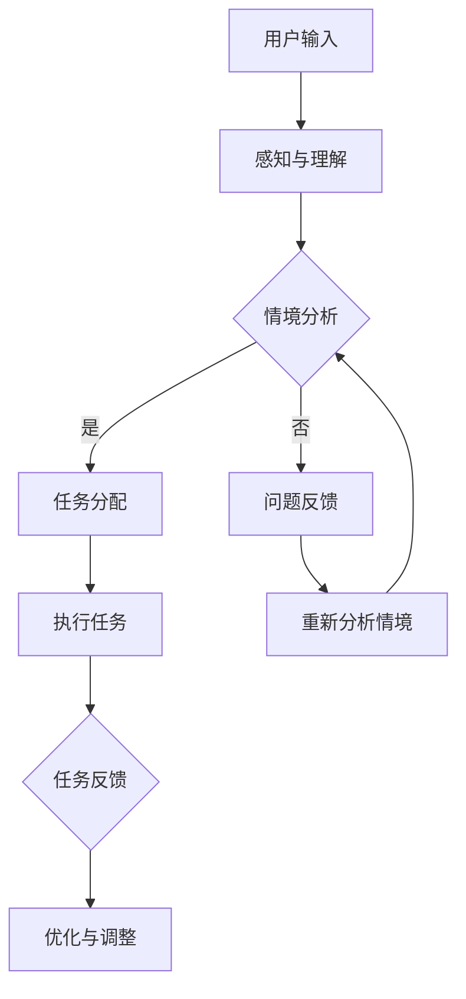

                 

### 虚拟空间与AI概述

在当今信息化和数字化的时代，虚拟空间（Virtual Space）已成为人们生活和工作的重要一部分。虚拟空间是一种通过计算机技术构建的虚拟环境，它能够模拟和增强现实世界中的各种交互和体验。而人工智能（AI）作为计算机科学的一个分支，通过模拟人类的认知能力来实现自动化和智能化的决策。虚拟空间与AI的结合，不仅为人类带来了全新的交互方式，也为各行业的发展注入了强大的动力。

#### 虚拟空间的定义与特征

虚拟空间，简单来说，就是通过计算机和网络技术创建的、虚拟的三维环境。它不仅包含了视觉和听觉的感知，还可以模拟触觉和嗅觉等感官体验。虚拟空间具有以下几个特征：

- **交互性**：虚拟空间中的用户可以通过各种设备（如VR头盔、手柄、手势识别设备等）与环境进行实时交互。
- **沉浸感**：虚拟空间能够为用户提供沉浸式的体验，使人们感觉仿佛置身于一个真实的环境中。
- **扩展性**：虚拟空间可以无限扩展，容纳更多的用户和数据，从而满足不同应用场景的需求。
- **多样性**：虚拟空间可以模拟各种环境，从室内到室外，从城市到乡村，从古代到未来，为用户带来丰富的体验。

#### 虚拟空间与传统空间的区别

传统空间和虚拟空间在多个方面存在显著差异：

- **物理存在**：传统空间是真实存在的物理空间，而虚拟空间是通过计算机技术模拟出来的。
- **交互方式**：传统空间中的交互主要是通过物理接触，而虚拟空间则更多依赖于电子设备和网络连接。
- **体验感**：传统空间给人的感觉是真实的，而虚拟空间则提供了一种全新的、沉浸式的体验。
- **限制性**：传统空间受到物理条件的限制，如空间大小、资源有限等，而虚拟空间可以突破这些限制，提供更多的可能性。

#### 虚拟空间的发展历程

虚拟空间的发展可以追溯到20世纪60年代。最早的虚拟现实（VR）设备是头戴式显示器，它们仅能提供简单的视觉体验。随着计算机技术的不断进步，虚拟现实技术逐渐发展起来，不仅视觉体验得到了提升，触觉、嗅觉等感官体验也得到了模拟。以下是一些关键的发展里程碑：

- **1968年**：美国计算机科学家伊凡·苏瑟兰（Ivan Sutherland）发明了第一个头戴式显示器，这被视为虚拟现实技术的诞生。
- **1987年**：任天堂推出虚拟现实游戏设备“Virtual Boy”，虽然销量不佳，但引起了广泛关注。
- **1990年代**：VR设备逐渐进入研究领域和商业应用，如医学、军事、教育等领域。
- **2010年代**：随着移动互联网和云计算的发展，虚拟现实技术取得了重大突破，VR头戴设备和相关应用层出不穷。
- **2020年代**：增强现实（AR）技术逐渐成熟，与虚拟现实技术共同推动了虚拟空间的发展，应用范围扩展到娱乐、教育、医疗、工业等多个领域。

#### AI在虚拟空间中的角色

AI在虚拟空间中扮演着多种角色，其主要作用包括：

- **交互助手**：AI可以作为虚拟空间中的智能助手，帮助用户进行各种操作，如导航、搜索、交互等。
- **内容生成**：AI可以生成虚拟空间中的内容，如场景、角色、对话等，提供个性化的体验。
- **情境感知**：AI可以通过对用户行为和环境数据的分析，感知用户的情感和需求，提供智能化的服务。
- **优化调度**：AI可以优化虚拟空间中的任务调度，提高效率和资源利用率。

#### AI应用的优势与挑战

AI在虚拟空间中的应用具有显著的优势和挑战：

- **优势**：
  - 提高用户体验：通过智能化的交互和个性化的内容生成，AI能够为用户提供更好的体验。
  - 提高效率：AI能够自动化和优化虚拟空间中的各种任务，提高工作效率。
  - 降低成本：AI可以减少对人力资源的依赖，降低运营成本。

- **挑战**：
  - 技术成熟度：虚拟空间中的AI应用需要高性能的计算能力和复杂的算法支持，这要求AI技术不断发展和成熟。
  - 数据隐私：虚拟空间中的用户数据安全是一个重要问题，如何保护用户隐私是AI应用需要解决的挑战。
  - 伦理问题：AI在虚拟空间中的应用可能引发伦理问题，如隐私侵犯、算法歧视等，需要建立相应的伦理和法律框架。

#### 虚拟空间中的AI应用案例

以下是虚拟空间中AI应用的几个典型案例：

- **在线教育平台**：通过AI技术，虚拟课堂可以实现个性化教学，根据学生的学习情况和需求提供针对性的教学内容和辅导。
- **虚拟现实游戏**：AI可以生成虚拟现实游戏中的场景、角色和剧情，提供丰富的游戏体验。
- **远程医疗**：AI技术可以实现远程医疗的诊断和治疗，通过虚拟空间为患者提供高质量的医疗服务。
- **智能制造**：在智能制造领域，AI可以优化生产流程，提高生产效率，降低成本。

通过以上对虚拟空间与AI的概述，我们可以看到，虚拟空间与AI的结合正逐步改变着我们的生活方式和工作方式，为各领域的发展带来了新的机遇和挑战。

#### 虚拟空间中的AI协作模式

在虚拟空间中，人工智能不仅仅是一个单独的实体，它更像是一个协作网络中的节点，与其他智能体共同完成复杂的任务。这种协作模式不仅提高了AI系统的效率和可靠性，还丰富了虚拟空间的互动性和沉浸感。以下我们将探讨虚拟空间中的AI协作模式，分析其优势与局限，并介绍几种常见的协作模式及其应用场景。

##### 虚拟空间中的AI协作模型

虚拟空间中的AI协作可以看作是一种多智能体系统（MAS，Multi-Agent System），其中每个智能体都是具有独立自主性的计算实体。多智能体系统通常由以下几部分组成：

- **智能体（Agent）**：智能体是协作的基本单位，可以是软件程序、机器人、甚至是人类用户。每个智能体具有感知、决策和执行能力。
- **环境（Environment）**：环境是智能体所处的上下文，它提供了智能体的感知信息，并接收智能体的执行结果。
- **通信机制**：智能体之间的通信机制决定了协作的效率和可靠性，常见的通信方式包括直接通信、广播通信和中介通信。
- **协作协议**：协作协议是智能体之间进行协作的规则和准则，确保协作的有序进行和目标的实现。

##### 协作模式的优势与局限

虚拟空间中的AI协作模式具有以下优势：

- **灵活性与适应性**：多智能体系统能够根据环境和任务的变化，灵活调整协作策略，适应不同的应用场景。
- **分布式计算**：通过分布式计算，多智能体系统可以分担任务，提高计算效率，降低单个智能体的负担。
- **容错性**：在多智能体系统中，如果一个智能体出现故障，其他智能体可以继续执行任务，从而提高系统的可靠性。

然而，AI协作模式也存在一些局限：

- **通信开销**：智能体之间的通信需要消耗网络资源和计算资源，过多的通信可能导致系统性能下降。
- **协作一致性**：在分布式系统中，如何确保智能体之间的协作一致性是一个挑战，特别是在动态变化的环境中。
- **协同效率**：如何优化智能体之间的协作效率，提高整体任务完成速度，是一个需要不断探索的问题。

##### 常见的协作模式及应用场景

在虚拟空间中，根据协作的目的和方式，可以区分出以下几种常见的AI协作模式：

- **任务分配协作**：在这种模式中，智能体根据自身的任务能力和环境需求，自动分配任务。常见的应用场景包括虚拟现实游戏中的角色分工、智能制造中的任务调度等。

  **示例**：在一个虚拟现实游戏中，AI智能体可以根据玩家的技能水平和游戏进程，自动分配不同的任务，如探索、战斗、资源管理等，从而提高游戏的趣味性和挑战性。

- **共享信息协作**：在这种模式中，智能体通过共享信息和知识，协同完成复杂的任务。常见的应用场景包括在线协同编辑、远程医疗诊断、智能交通管理等。

  **示例**：在远程医疗诊断中，医生和AI智能体可以通过共享病人的病历、影像数据和诊断结果，共同分析病情，提高诊断的准确性和效率。

- **协同决策协作**：在这种模式中，智能体通过协作决策，共同制定最优的行动策略。常见的应用场景包括智能交通、自动驾驶、应急响应等。

  **示例**：在智能交通系统中，AI智能体可以通过协同决策，实时调整交通信号灯的时序，优化交通流量，减少拥堵和交通事故。

- **情境感知协作**：在这种模式中，智能体通过感知环境和用户的行为，提供个性化的服务和交互。常见的应用场景包括虚拟购物体验、智能客服、智能家庭等。

  **示例**：在虚拟购物体验中，AI智能体可以根据用户的购买历史和偏好，推荐个性化的商品，并提供购物指导和咨询服务。

通过以上分析，我们可以看到，虚拟空间中的AI协作模式具有多种形式和应用场景，这些协作模式不仅提高了AI系统的智能化水平，也为用户提供了更加丰富和个性化的体验。

### 虚拟空间中的AI技术基础

在探讨虚拟空间中的AI协作与任务之前，我们首先需要了解虚拟空间中的一些关键AI技术基础。这些技术不仅为虚拟空间提供了丰富的功能，也为AI协作和任务规划提供了必要的支持。本文将重点介绍虚拟现实（VR）技术、增强现实（AR）技术和人工智能（AI）技术的基础知识，以及它们在虚拟空间中的应用。

#### 虚拟现实技术

虚拟现实（VR）是一种通过计算机技术生成三维虚拟环境，使用户能够沉浸其中的技术。VR技术的基本原理是通过头戴式显示器（HMD）或其他显示设备，给用户呈现一个逼真的虚拟世界，同时通过传感器和控制器捕捉用户的行为和动作，实现与虚拟环境的互动。

- **VR技术的原理与架构**：

  VR系统的核心是头戴式显示器，它通常配备两个高分辨率屏幕，用于模拟双眼的视觉效果。此外，VR系统还包括以下几个关键组件：

  - **定位与追踪系统**：用于实时跟踪用户的头部和手部运动，确保虚拟环境中的物体和用户动作保持同步。
  - **传感器与控制器**：用于捕捉用户的动作和输入，如手柄、手套、手势识别设备等。
  - **计算机系统**：负责渲染虚拟环境、处理传感器数据、执行用户输入等。

- **VR技术的最新发展**：

  近年来，VR技术取得了显著的发展，主要体现在以下几个方面：

  - **分辨率提升**：随着显示技术的进步，VR头戴设备的分辨率和画面质量不断提高，为用户带来更加真实的视觉体验。
  - **交互方式创新**：除了传统的手柄和控制台，VR技术引入了手势识别、眼球追踪、语音控制等新的交互方式，提高了用户与虚拟环境的互动性。
  - **应用场景拓展**：VR技术已经广泛应用于游戏、教育、医疗、娱乐、军事等多个领域，推动虚拟空间的发展。

- **VR技术中的AI应用**：

  AI技术在VR中的应用主要体现在以下几个方面：

  - **场景生成与渲染**：AI可以生成虚拟环境中的内容，如场景、角色、物体等，提高渲染效率和画面质量。
  - **交互优化**：AI可以分析用户的行为和偏好，优化虚拟环境的交互体验，提高用户满意度。
  - **个性化推荐**：AI可以根据用户的兴趣和行为，提供个性化的VR内容和推荐，增强用户体验。

#### 增强现实技术

增强现实（AR）是一种通过计算机技术将虚拟信息叠加到现实世界中的技术。与VR不同，AR并不需要用户完全沉浸在一个虚拟环境中，而是在现实世界的基础上，通过增强显示和交互方式，提供额外的信息和服务。

- **AR技术的原理与架构**：

  AR系统的核心是增强显示技术，它通常包括以下几个组件：

  - **增强显示设备**：如智能手机、平板电脑、头戴式显示器等，用于叠加虚拟信息到现实画面中。
  - **传感器与定位系统**：用于跟踪用户的姿态和位置，确保虚拟信息与现实世界的准确对齐。
  - **计算机系统**：负责处理传感器数据、渲染虚拟信息、处理用户输入等。

- **AR技术的最新发展**：

  AR技术近年来也取得了显著的进展，主要体现在以下几个方面：

  - **增强显示效果提升**：随着显示技术的进步，AR设备的显示效果和视觉体验得到了显著改善。
  - **实时定位与追踪技术**：通过先进的计算机视觉算法和传感器技术，AR系统的实时定位与追踪能力不断提高，提高了应用的准确性和稳定性。
  - **应用场景扩展**：AR技术已经应用于教育、医疗、零售、营销等多个领域，为用户提供了丰富的应用场景。

- **AR技术中的AI应用**：

  AI技术在AR中的应用主要体现在以下几个方面：

  - **场景理解与识别**：AI可以分析现实世界中的图像和场景，识别目标对象，提供相关的信息和服务。
  - **交互优化**：AI可以优化AR交互体验，如通过语音控制、手势识别等方式，提高用户的操作便捷性。
  - **个性化推荐**：AI可以根据用户的行为和偏好，提供个性化的AR内容和推荐，增强用户体验。

#### 人工智能技术基础

人工智能（AI）技术是虚拟空间中实现智能化和自动化决策的关键。AI技术涵盖了多个领域，包括机器学习、深度学习、自然语言处理等。以下简要介绍这些技术的基础知识。

- **机器学习（Machine Learning）**：

  机器学习是一种通过数据驱动的方法，使计算机能够从数据中学习并作出预测或决策的技术。其主要特点是无监督学习和有监督学习。

  - **无监督学习**：无监督学习是指在没有明确标注的数据集上进行学习，常见的算法包括聚类、降维等。
  - **有监督学习**：有监督学习是指在已标注的数据集上进行学习，常见的算法包括线性回归、决策树、支持向量机等。

- **深度学习（Deep Learning）**：

  深度学习是机器学习的一个分支，它通过多层神经网络模型，对大量数据进行自动特征提取和模式识别。

  - **卷积神经网络（CNN）**：CNN是一种用于图像识别和处理的神经网络，广泛应用于计算机视觉领域。
  - **循环神经网络（RNN）**：RNN是一种用于序列数据处理的神经网络，广泛应用于自然语言处理领域。

- **自然语言处理（NLP）**：

  自然语言处理是人工智能的一个重要分支，旨在使计算机能够理解和处理自然语言。

  - **词向量表示**：词向量表示是NLP中的一个重要概念，它将单词映射到一个高维空间中的向量，以便进行计算和分析。
  - **语言模型**：语言模型是一种用于预测单词序列的模型，广泛应用于机器翻译、文本生成等应用。

通过以上对虚拟现实技术、增强现实技术和人工智能技术的基础知识的介绍，我们可以看到这些技术在虚拟空间中的应用不仅丰富了用户的体验，也为AI协作和任务规划提供了坚实的基础。在接下来的章节中，我们将进一步探讨AI协作与任务规划的具体实现和案例分析。

### AI协作原理

在虚拟空间中，人工智能（AI）协作是通过多个智能体（Agent）之间的互动和协作来实现复杂任务的。理解AI协作的基本原理是设计和实现高效AI系统的关键。以下我们将详细探讨多智能体系统（MAS，Multi-Agent System）和分布式AI系统，以及AI协作的基本原则。

#### 多智能体系统

多智能体系统是一种由多个具有独立自主性、协作性的智能体组成的系统。在多智能体系统中，每个智能体都是一个具有感知、决策和执行能力的实体，能够独立地完成特定任务。多智能体系统具有以下几个特点：

- **分布式计算**：多智能体系统能够将任务分散到不同的智能体上，利用分布式计算的优势提高系统效率。
- **冗余和容错性**：多智能体系统中的智能体可以相互备份，如果一个智能体失效，其他智能体可以继续完成任务。
- **灵活性和适应性**：多智能体系统可以根据环境的变化和任务的需求，灵活调整智能体之间的协作策略。
- **开放性和扩展性**：多智能体系统可以与其他系统进行交互，易于扩展和集成。

#### 分布式AI系统

分布式AI系统是一种在多个计算节点上运行AI算法的系统。与传统的集中式AI系统不同，分布式AI系统能够充分利用多台计算机的计算能力，实现大规模数据和高性能计算的需求。分布式AI系统的核心组成部分包括：

- **计算节点**：计算节点是分布式AI系统中的基本计算单元，可以独立运行AI算法和模型。
- **通信网络**：通信网络用于连接不同的计算节点，实现数据传输和任务调度。
- **调度算法**：调度算法负责分配任务到不同的计算节点，优化计算资源的利用率。

#### AI协作的基本原则

为了实现高效和可靠的AI协作，以下原则是设计和实现多智能体系统和分布式AI系统的关键：

- **自治性**：每个智能体都应该具有独立自主的能力，能够在没有外部干预的情况下进行感知、决策和执行。
- **合作性**：智能体之间需要通过协作来实现共同的目标，相互依赖和补充各自的能力。
- **适应性**：智能体需要能够适应环境的变化和任务的需求，灵活调整协作策略。
- **协调性**：智能体之间需要通过通信机制和协调算法，确保协作的一致性和协同效果。
- **可扩展性**：系统需要能够支持智能体数量的扩展和任务的多样化，易于扩展和维护。

在实际应用中，AI协作的实现通常涉及到以下几个方面：

- **任务分配**：根据智能体的能力和任务需求，将任务合理分配给不同的智能体。
- **协作通信**：智能体之间需要通过有效的通信机制，共享信息和资源，实现协作任务。
- **协调算法**：通过协调算法，解决智能体之间的冲突和矛盾，确保协作的一致性和高效性。
- **情境感知**：智能体需要能够感知环境变化和用户需求，动态调整协作策略。

通过理解AI协作的基本原理，我们可以设计和实现更加高效和可靠的AI系统，为虚拟空间中的任务规划和协作提供坚实的基础。

### 任务规划与调度

在虚拟空间中，任务规划和调度是实现高效AI协作的关键环节。任务规划和调度涉及到如何分配、执行和管理任务，以确保系统在资源有限的情况下，能够高效地完成既定目标。以下我们将详细探讨任务分配策略、调度算法和优化方法与评估。

#### 任务分配策略

任务分配策略是决定如何将任务分配给不同智能体的关键。有效的任务分配策略能够提高系统的整体效率，确保任务在合理的智能体上执行。常见的任务分配策略包括：

- **负载均衡**：负载均衡策略旨在将任务分配给负载较轻的智能体，避免个别智能体过载，提高系统的均衡性。常用的负载均衡算法包括最小负载算法、最大剩余能力算法等。

  **最小负载算法**：将新任务分配给当前任务数量最少的智能体，确保每个智能体的负载相对均衡。

  **最大剩余能力算法**：将新任务分配给剩余能力最大的智能体，利用智能体的空闲资源，提高系统的整体利用率。

- **技能匹配**：技能匹配策略根据智能体的能力和任务需求，将任务分配给最适合执行的智能体。这种策略能够充分利用每个智能体的技能，提高任务完成的质量。

  **技能优先算法**：将任务分配给具有相关技能的智能体，确保任务得到最优的执行。

- **动态调整**：动态调整策略根据系统的实时状态，动态调整任务分配。这种方法能够适应环境的变化和智能体状态的更新，确保系统的高效运行。

  **自适应任务分配**：通过监测智能体的状态和任务执行情况，实时调整任务分配，以最大化系统的整体性能。

#### 调度算法

调度算法负责确定任务执行的时间和顺序，确保任务能够在有效时间内完成。常见的调度算法包括：

- **优先级调度**：优先级调度算法根据任务的优先级进行调度，优先级高的任务优先执行。常用的优先级调度算法包括最高优先级算法（HPF，Highest Priority First）和最低优先级算法（LRF，Lowest Priority First）。

  **最高优先级算法**：优先执行优先级最高的任务，适用于紧急任务的优先处理。

  **最低优先级算法**：优先执行优先级最低的任务，适用于任务逐步完成的情况。

- **时间片调度**：时间片调度算法将系统的时间划分为固定的时间片，每个任务在一个时间片内执行。常用的时间片调度算法包括轮转调度（RR，Round-Robin）和优先级时间片调度（PRIO，Priority Scheduling）。

  **轮转调度**：每个任务轮流执行一个时间片，适用于公平性和负载均衡的要求。

  **优先级时间片调度**：根据任务的优先级分配时间片，优先级高的任务分配更多的时间片，适用于优先级任务的处理。

- **动态调度**：动态调度算法根据任务的执行情况和系统状态，动态调整任务的执行顺序和时间。这种方法能够更好地适应系统的变化和任务需求。

  **基于预测的动态调度**：通过预测任务的执行时间和系统状态，动态调整任务执行顺序，以最大化系统的性能。

#### 优化方法与评估

任务规划与调度的目标是提高系统的效率和性能。优化方法和评估标准是实现这一目标的关键。以下是一些常见的优化方法和评估标准：

- **资源利用率**：优化任务分配和调度策略，最大化系统的资源利用率，确保计算资源和智能体资源得到充分利用。

  **资源利用率评估指标**：计算系统在一段时间内的资源利用率，如CPU利用率、内存利用率等。

- **任务完成时间**：优化任务调度和执行策略，缩短任务完成时间，提高系统的响应速度。

  **任务完成时间评估指标**：计算任务的平均完成时间、最短完成时间和最长完成时间等指标。

- **系统稳定性**：优化任务分配和调度策略，确保系统在长时间运行过程中保持稳定，避免过载和崩溃。

  **系统稳定性评估指标**：计算系统的平均故障时间、故障频率和恢复时间等指标。

- **协作效率**：优化智能体之间的协作和任务分配，提高系统的协作效率，确保任务高质量地完成。

  **协作效率评估指标**：计算系统的任务完成率、任务完成时间和协作效率等指标。

通过以上方法，我们可以设计出高效的任务规划和调度策略，确保虚拟空间中的AI系统能够在资源有限的情况下，高效地完成任务。在接下来的章节中，我们将进一步探讨情境感知与决策，以实现更加智能化和自动化的任务规划与调度。

### 情境感知与决策

在虚拟空间中，情境感知与决策是实现高效AI协作和任务规划的重要环节。情境感知指的是系统通过感知环境中的各种信息和数据，对当前状态和事件进行理解和分析。而决策则是在对情境进行感知和分析的基础上，选择最优的应对策略。以下将详细讨论情境感知技术和决策理论，以及如何通过这些技术构建决策支持系统。

#### 情境感知技术

情境感知技术是指系统通过传感器、数据分析和机器学习等方法，对环境中的各种信息进行感知和处理。情境感知的关键在于如何有效地获取、处理和分析数据，从而实现对当前情境的准确理解。以下是一些常见的情境感知技术：

- **传感器技术**：传感器是情境感知的重要数据来源。通过使用各种传感器，如温度传感器、湿度传感器、摄像头、麦克风等，系统可以获取环境中的物理量和视觉、听觉信息。

  **多模态感知**：结合多种传感器数据，如将摄像头与温度传感器结合，可以实现更全面的情境感知。

- **数据采集与处理**：情境感知需要对大量的数据进行采集和处理。通过数据清洗、数据整合和特征提取等方法，可以将原始数据转化为有用的信息。

  **实时数据处理**：情境感知系统通常需要实时处理数据，以确保对当前情境的快速响应。

- **机器学习技术**：机器学习技术可以用于训练模型，从数据中学习并提取特征，实现对情境的预测和分析。

  **监督学习与无监督学习**：监督学习用于分类和回归任务，无监督学习用于聚类和降维任务，两者结合可以提升情境感知的准确性。

#### 决策理论

决策理论是研究在不确定环境下如何进行合理决策的学科。在虚拟空间中，AI系统需要根据情境感知的结果，做出最优的决策。以下是一些基本的决策理论：

- **期望最大化**：期望最大化（Expected Maximization, EM）是一种用于概率模型参数估计的方法。通过最大化期望值来估计模型参数，从而做出最优决策。

  **应用场景**：在虚拟空间中，可以通过期望最大化算法来估计用户的行为模式，从而优化任务分配和资源调度。

- **马尔可夫决策过程**（MDP, Markov Decision Process）：马尔可夫决策过程是一种用于决策的理论模型，它描述了在不确定环境中，如何通过决策序列实现长期目标。

  **应用场景**：在虚拟空间中，MDP可以用于任务规划，如自动化仓储系统中的货物分配和路径规划。

- **贝叶斯网络**：贝叶斯网络是一种概率图模型，用于表示变量之间的概率关系。通过贝叶斯网络，可以实现对复杂情境的概率推理和决策。

  **应用场景**：在虚拟空间中，贝叶斯网络可以用于风险评估，如虚拟环境中的安全监测和威胁分析。

#### 决策支持系统

决策支持系统（DSS，Decision Support System）是一种辅助决策者进行决策的计算机系统。通过情境感知和决策理论，DSS可以为用户提供全面的信息和模型，帮助决策者做出更加明智的决策。以下是一个典型的决策支持系统的架构：

- **数据采集模块**：用于收集来自传感器和用户输入的数据，并将数据预处理为适合分析的形式。
- **情境感知模块**：利用机器学习和数据挖掘技术，对采集到的数据进行分析和感知，提取关键特征和情境信息。
- **决策模型模块**：根据情境感知的结果，利用决策理论构建和运行决策模型，生成可能的决策方案。
- **用户界面模块**：提供用户与决策支持系统交互的界面，展示情境信息、模型结果和决策方案，帮助用户进行决策。

#### 应用示例

以下是一个情境感知与决策在虚拟空间中的应用示例：

- **虚拟工厂调度系统**：在虚拟工厂中，系统通过传感器实时监测生产设备和原料的状态，利用情境感知技术分析生产流程中的瓶颈和问题。基于马尔可夫决策过程，系统可以自动调整生产计划和资源分配，优化生产效率和产品质量。

  - **情境感知**：通过传感器采集温度、湿度、速度等数据，分析生产设备的运行状态。
  - **决策支持**：根据当前状态和历史数据，利用MDP模型生成最优的生产计划和资源分配方案。
  - **执行与反馈**：系统自动执行决策方案，并根据执行结果调整后续的决策。

通过情境感知与决策技术，虚拟空间中的AI系统能够更智能地理解和应对复杂环境，提高任务规划和执行的效率，为用户提供更加优质的体验。

### 虚拟空间中的AI应用案例

虚拟空间中的AI技术已经深入到教育、医疗、娱乐等各个领域，通过智能化和自动化的方式改变了传统的工作方式和生活方式。以下我们将通过具体案例，探讨AI在这些领域的应用，以及其带来的影响和潜在价值。

#### 虚拟空间中的教育应用

AI技术在教育领域的应用主要体现在个性化教学和虚拟课堂两个方面。

- **在线教育平台**：AI技术可以分析学生的学习行为和数据，提供个性化的教学建议和资源。例如，通过自然语言处理和推荐算法，平台可以为学生推荐最适合的学习路径和内容。

  **案例**：Coursera等在线教育平台利用AI技术分析学生的学习历史和表现，提供个性化的学习建议，帮助学生更高效地学习。

- **虚拟课堂**：虚拟现实（VR）技术结合AI，可以创建沉浸式的学习环境，模拟真实的课堂场景。学生可以通过VR设备进行互动式学习，提高学习效果。

  **案例**：一些大学已经开始使用VR技术开设虚拟课堂，学生可以通过VR设备进入虚拟教室，与教师和其他学生进行实时互动，提升学习体验。

#### 虚拟空间中的医疗应用

AI技术在医疗领域的应用极大地提高了诊断的准确性、治疗的效率以及医疗服务的覆盖范围。

- **远程医疗**：AI技术可以实现远程诊断和治疗，通过视频会议和远程监控，医生可以实时查看患者的病情，提供诊断和建议。

  **案例**：疫情期间，很多医院利用远程医疗系统，为无法前往医院的病人提供诊断和治疗，有效缓解了医疗资源的压力。

- **虚拟手术**：AI技术可以通过分析手术数据，提供手术规划和操作指导，辅助医生进行复杂手术。

  **案例**：在神经外科手术中，AI技术可以实时分析患者的大脑图像，为医生提供精确的手术路径和操作建议，降低手术风险。

- **医疗数据挖掘**：AI技术可以挖掘大量的医疗数据，发现潜在的疾病模式和治疗方案，为医学研究提供重要支持。

  **案例**：研究机构利用AI技术分析大量患者的病历数据，发现某些罕见病的发病规律，为疾病的早期诊断和治疗提供了重要依据。

#### 虚拟空间中的娱乐应用

AI技术在娱乐领域的应用，极大地丰富了用户的内容消费体验。

- **虚拟现实游戏**：AI技术可以生成虚拟现实游戏中的场景、角色和剧情，提供丰富的游戏体验。此外，AI还可以根据玩家的行为和偏好，调整游戏的难度和剧情，提高玩家的满意度。

  **案例**：一些虚拟现实游戏利用AI技术，生成动态变化的游戏场景和情节，使游戏更具挑战性和趣味性。

- **社交虚拟空间**：AI技术可以帮助构建智能化的社交虚拟空间，通过自然语言处理和情感分析，提供个性化的社交体验。

  **案例**：一些社交虚拟空间利用AI技术分析用户的社交行为和偏好，推荐合适的朋友圈内容和互动方式，提升社交体验。

- **娱乐内容生成**：AI技术可以自动生成音乐、视频和动画等内容，为创作者提供新的创作工具。

  **案例**：一些音乐和视频创作平台利用AI技术，自动生成音乐和视频内容，帮助用户快速创作个性化的作品。

通过以上案例，我们可以看到，AI技术在虚拟空间中的应用，不仅提升了各领域的效率和效果，也为用户带来了更加丰富和个性化的体验。随着AI技术的不断进步，其在虚拟空间中的应用前景将更加广阔。

### 虚拟空间中的AI伦理与安全

随着AI技术在虚拟空间中的广泛应用，伦理和安全问题成为不可忽视的重要议题。虚拟空间中的AI不仅面临传统的伦理挑战，还引入了新的隐私、安全以及法律问题。本文将探讨虚拟空间中的AI伦理问题、安全挑战以及相关的法律问题。

#### AI伦理问题

在虚拟空间中，AI伦理问题主要体现在以下几个方面：

- **隐私保护**：虚拟空间中的AI系统需要收集和处理大量的用户数据，包括个人身份信息、行为习惯等。如何保护用户的隐私，防止数据泄露和滥用，是一个重要伦理问题。

  **案例**：一些虚拟现实（VR）游戏和社交平台可能通过追踪用户的行为，收集用户的数据，用于个性化推荐和广告投放。这些数据的收集和使用需要明确用户的知情权和选择权。

- **算法歧视**：AI系统在决策过程中可能会因为数据偏差或算法设计不当，导致歧视性结果，如性别、种族或年龄歧视。

  **案例**：在虚拟招聘平台中，如果AI系统的训练数据中存在性别或种族偏见，可能会导致某些群体在招聘中受到不公平对待。

- **责任归属**：当虚拟空间中的AI系统出现错误或造成损害时，责任归属问题变得复杂。是开发者、用户还是AI系统本身应承担责任？

  **案例**：如果AI系统在虚拟医疗诊断中误诊，导致患者受到伤害，责任如何分配？是开发AI系统的公司、使用AI系统的医院还是患者本人？

#### 安全挑战

虚拟空间中的AI系统面临多种安全挑战，包括数据安全、系统安全和网络安全。

- **数据安全**：AI系统需要处理大量的敏感数据，如医疗记录、个人身份信息等。如何确保这些数据的安全，防止数据泄露和篡改，是一个重要问题。

  **措施**：实施严格的数据加密和访问控制措施，确保只有授权用户能够访问敏感数据。

- **系统安全**：虚拟空间中的AI系统需要抵御各种攻击，如恶意代码注入、拒绝服务攻击等。确保系统的稳定性和可靠性，防止系统被攻击者控制。

  **措施**：采用先进的安全防护技术，如入侵检测系统、防火墙和加密技术，确保系统的安全运行。

- **网络安全**：虚拟空间中的AI系统通过网络与其他系统进行交互，如何确保网络通信的安全，防止网络攻击和数据窃取，是一个关键问题。

  **措施**：实施安全的网络通信协议，如HTTPS，确保数据在传输过程中的安全。同时，定期进行网络监控和漏洞扫描，及时发现和修复安全漏洞。

#### 法律问题

虚拟空间中的AI应用涉及多个法律问题，包括数字产权、用户行为规范和法律责任界定。

- **数字产权**：虚拟空间中的AI系统生成的作品，如虚拟艺术品、音乐、视频等，其数字产权归属问题需要明确。

  **措施**：明确AI生成的作品的版权归属，保护创作者的合法权益。同时，制定相应的法律法规，规范AI作品的创作和使用。

- **用户行为规范**：虚拟空间中的用户行为需要规范，以防止违法行为和不良信息的传播。

  **措施**：制定用户行为规范，明确禁止的行为，如网络欺诈、侵犯他人隐私等。同时，建立完善的投诉和举报机制，及时处理违规行为。

- **法律责任界定**：当虚拟空间中的AI系统造成损害时，如何界定法律责任，是一个复杂的问题。

  **措施**：制定明确的法律法规，明确AI系统开发者和使用者的责任范围，确保受害者的合法权益得到保障。同时，加强对AI系统的监管，确保其合规运行。

通过上述探讨，我们可以看到，虚拟空间中的AI伦理、安全和法律问题具有重要性和复杂性。解决这些问题，需要技术、伦理和法律等多方面的共同努力，以实现虚拟空间中AI技术的健康发展和广泛应用。

### AI协作与任务开发基础

在虚拟空间中，AI协作与任务的开发不仅需要深厚的理论基础，还需要实际的操作经验和技能。以下我们将从开发环境搭建、数据预处理与模型训练、模型评估与优化三个方面，详细介绍AI协作与任务开发的基础。

#### 开发环境搭建

搭建一个合适的开发环境是进行AI协作与任务开发的前提。开发环境的选择和配置直接影响到开发效率和系统的性能。以下是一些关键步骤和工具：

- **硬件选择**：

  - **计算能力**：选择具备高性能计算能力的硬件，如高性能CPU或GPU，以支持复杂的AI算法和模型训练。
  - **存储容量**：确保足够的存储容量，以存储大量的数据和训练结果。
  - **网络连接**：具备稳定的网络连接，以便快速传输数据和共享资源。

- **软件安装**：

  - **操作系统**：选择Linux或Windows操作系统，其中Linux因其开源特性和可定制性，常被用于AI开发。
  - **开发工具**：安装常用的开发工具，如Jupyter Notebook、PyCharm或Visual Studio Code，方便编写和调试代码。
  - **深度学习框架**：安装常用的深度学习框架，如TensorFlow、PyTorch或Keras，这些框架提供了丰富的API和工具，支持各种AI模型和算法的开发。

- **开发框架与库**：

  - **深度学习框架**：选择合适的深度学习框架，如TensorFlow或PyTorch，以支持模型的训练、评估和部署。
  - **数据处理库**：安装常用的数据处理库，如NumPy、Pandas和Scikit-learn，用于数据清洗、预处理和分析。
  - **机器学习库**：安装常用的机器学习库，如Scikit-learn和XGBoost，用于实现各种机器学习算法和模型。

#### 数据预处理与模型训练

数据预处理和模型训练是AI协作与任务开发的核心步骤，直接影响模型的效果和性能。

- **数据收集与标注**：

  - **数据收集**：收集与任务相关的数据，如文本、图像、声音等。数据来源可以包括公开数据集、自采集数据或第三方数据服务。
  - **数据标注**：对收集到的数据进行标注，以便模型能够学习和识别。标注方法包括手动标注、半监督标注和自动标注。

- **数据预处理方法**：

  - **数据清洗**：去除数据中的噪声和异常值，如缺失值、重复值和错误值。
  - **数据归一化**：将数据缩放到相同的范围，如0到1或-1到1，以消除不同特征之间的量级差异。
  - **特征提取**：从原始数据中提取有用的特征，如文本的词频、图像的边缘特征等。

- **模型训练策略**：

  - **模型选择**：根据任务需求，选择合适的模型，如卷积神经网络（CNN）用于图像处理，循环神经网络（RNN）用于序列数据。
  - **训练过程**：使用训练数据对模型进行训练，调整模型的参数，以最小化预测误差。训练过程中可以使用优化算法，如随机梯度下降（SGD）和Adam优化器。
  - **超参数调优**：调整模型中的超参数，如学习率、批量大小和正则化参数，以优化模型的性能。

#### 模型评估与优化

模型评估与优化是确保AI协作与任务开发成功的关键步骤，以下是一些常见的评估指标和优化方法：

- **评估指标**：

  - **准确率（Accuracy）**：模型预测正确的样本数占总样本数的比例。
  - **精确率（Precision）**：模型预测为正类的实际正类样本数与预测为正类的总样本数之比。
  - **召回率（Recall）**：模型预测为正类的实际正类样本数与实际正类样本总数的比例。
  - **F1分数（F1 Score）**：精确率和召回率的调和平均值。

- **优化方法**：

  - **交叉验证**：使用交叉验证方法，将数据集划分为多个子集，轮流训练和测试模型，以评估模型的泛化能力。
  - **超参数调优**：使用网格搜索（Grid Search）或随机搜索（Random Search）等方法，自动调整模型中的超参数，以找到最优参数组合。
  - **集成方法**：使用集成方法，如随机森林（Random Forest）和堆叠（Stacking），结合多个模型的优势，提高整体模型的性能。

通过以上步骤和方法，我们可以构建和优化AI协作与任务模型，为虚拟空间中的智能应用提供坚实的基础。

### 虚拟空间中的AI协作与任务开发实践

在了解了虚拟空间中的AI协作与任务开发基础后，接下来我们将通过三个具体的实践案例，深入探讨如何在实际应用中实现AI协作与任务。这三个案例分别是：虚拟客服机器人、虚拟空间智能导航系统和虚拟空间协作游戏。我们将详细介绍这些案例的系统设计、交互流程、代码实现和解读，以帮助读者更好地理解AI协作与任务在实际中的应用。

#### 实践案例一：虚拟客服机器人

虚拟客服机器人是一种基于AI技术的智能客服系统，它能够自动响应用户的咨询，提供即时的帮助和支持。以下是虚拟客服机器人的系统设计和实现过程。

- **系统设计**：

  虚拟客服机器人系统主要包括以下几个模块：

  - **用户交互模块**：负责与用户进行交互，接收用户的咨询并返回回答。
  - **对话管理模块**：负责管理对话流程，包括理解用户意图、生成回答和引导对话。
  - **知识库模块**：存储和提供与业务相关的知识，如常见问题、解决方案和产品信息。
  - **自然语言处理模块**：负责处理用户的自然语言输入，提取关键信息并生成回答。

- **交互流程**：

  虚拟客服机器人与用户的交互流程如下：

  1. 用户输入咨询问题。
  2. 自然语言处理模块接收用户输入并提取关键信息。
  3. 对话管理模块根据关键信息查询知识库，生成回答。
  4. 用户交互模块将回答返回给用户。
  5. 如果用户对回答不满意，可以继续提问或结束对话。

- **代码实现与解读**：

  **用户交互模块**：

  ```python
  class UserInterface:
      def receive_question(self, question):
          # 接收用户输入的问题
          print("用户提问：", question)
          
      def send_answer(self, answer):
          # 返回回答给用户
          print("机器人回答：", answer)
  ```

  **自然语言处理模块**：

  ```python
  class NLPProcessor:
      def extract_key_info(self, question):
          # 提取关键信息
          # 这里可以加入更复杂的自然语言处理算法
          key_info = question.split()[0]
          return key_info

  nlp_processor = NLPProcessor()
  ```

  **对话管理模块**：

  ```python
  class DialogueManager:
      def __init__(self, knowledge_base):
          self.knowledge_base = knowledge_base

      def generate_answer(self, key_info):
          # 根据关键信息生成回答
          if key_info in self.knowledge_base:
              answer = self.knowledge_base[key_info]
          else:
              answer = "对不起，我不明白您的意思。"
          return answer

  knowledge_base = {
      "价格": "我们的产品价格在XX元左右。",
      "功能": "我们的产品具备XX功能。",
      "售后": "我们的售后政策是XX。"
  }
  dialogue_manager = DialogueManager(knowledge_base)
  ```

  **主程序**：

  ```python
  user_interface = UserInterface()
  question = input("请提出您的问题：")
  user_interface.receive_question(question)

  key_info = nlp_processor.extract_key_info(question)
  answer = dialogue_manager.generate_answer(key_info)
  user_interface.send_answer(answer)
  ```

  通过以上代码实现，我们可以构建一个基本的虚拟客服机器人系统，能够自动回答用户的问题。

#### 实践案例二：虚拟空间智能导航系统

虚拟空间智能导航系统是一种基于AI技术的导航系统，它能够为用户提供虚拟空间中的导航服务，如路径规划、景点推荐等。

- **系统设计**：

  虚拟空间智能导航系统主要包括以下几个模块：

  - **地图管理模块**：负责管理虚拟空间的地图数据，包括地图的加载、更新和存储。
  - **路径规划模块**：负责根据用户的需求，规划最佳路径。
  - **推荐系统模块**：负责根据用户的兴趣和行为，推荐相关的景点和活动。

- **交互流程**：

  虚拟空间智能导航系统与用户的交互流程如下：

  1. 用户输入目的地或需求。
  2. 地图管理模块加载虚拟空间的地图数据。
  3. 路径规划模块规划最佳路径，并返回结果。
  4. 推荐系统模块根据用户的需求和兴趣，推荐相关的景点和活动。
  5. 将路径和推荐信息返回给用户。

- **代码实现与解读**：

  **地图管理模块**：

  ```python
  class MapManager:
      def load_map(self, map_data):
          # 加载地图数据
          print("地图加载成功：", map_data)
          
  map_manager = MapManager()
  map_manager.load_map("虚拟空间地图")
  ```

  **路径规划模块**：

  ```python
  class PathPlanner:
      def plan_path(self, start, end, map_data):
          # 规划最佳路径
          # 这里可以使用A*算法或Dijkstra算法进行路径规划
          path = "从起点" + start + "到终点" + end + "的最佳路径："
          return path

  path_planner = PathPlanner()
  path = path_planner.plan_path("起点A", "终点B", "虚拟空间地图")
  print(path)
  ```

  **推荐系统模块**：

  ```python
  class RecommendationSystem:
      def generate_recommendations(self, user_interests, map_data):
          # 根据用户兴趣生成推荐
          # 这里可以使用协同过滤或基于内容的推荐算法
          recommendations = "为您推荐的景点："
          return recommendations

  recommendation_system = RecommendationSystem()
  recommendations = recommendation_system.generate_recommendations(["历史遗迹", "自然风光"], "虚拟空间地图")
  print(recommendations)
  ```

  **主程序**：

  ```python
  start = input("请输入起点：")
  end = input("请输入终点：")
  path = path_planner.plan_path(start, end, "虚拟空间地图")
  print(path)

  user_interests = input("请输入您的兴趣：")
  recommendations = recommendation_system.generate_recommendations(user_interests, "虚拟空间地图")
  print(recommendations)
  ```

  通过以上代码实现，我们可以构建一个基本的虚拟空间智能导航系统，能够为用户提供路径规划和推荐服务。

#### 实践案例三：虚拟空间协作游戏

虚拟空间协作游戏是一种基于AI技术的多人在线游戏，玩家需要在虚拟空间中协作完成任务，如探险、战斗等。

- **系统设计**：

  虚拟空间协作游戏主要包括以下几个模块：

  - **游戏管理模块**：负责管理游戏的进程和规则，包括角色创建、任务分配和游戏结束。
  - **协作系统模块**：负责处理玩家之间的协作，包括信息共享、任务协调和决策支持。
  - **场景生成模块**：负责生成游戏的场景和角色，提供丰富的游戏体验。

- **交互流程**：

  虚拟空间协作游戏与玩家的交互流程如下：

  1. 玩家登录游戏并创建角色。
  2. 游戏管理模块为玩家分配任务和角色。
  3. 玩家在虚拟空间中完成任务，并与队友协作。
  4. 当任务完成后，游戏管理模块评估玩家的表现并结束游戏。

- **代码实现与解读**：

  **游戏管理模块**：

  ```python
  class GameManager:
      def create_role(self, role_name):
          # 创建角色
          print("角色创建成功：", role_name)
          
      def assign_task(self, role, task):
          # 分配任务
          print(role, "被分配任务：", task)

  game_manager = GameManager()
  game_manager.create_role("角色1")
  game_manager.assign_task("角色1", "任务1")
  ```

  **协作系统模块**：

  ```python
  class CollaborationSystem:
      def share_info(self, role1, role2, info):
          # 分享信息
          print(role1, "向", role2, "分享信息：", info)
          
      def coordinate_task(self, roles, task):
          # 协调任务
          print("任务协调：", roles, "执行任务", task)

  collaboration_system = CollaborationSystem()
  collaboration_system.share_info("角色1", "角色2", "任务进展")
  collaboration_system.coordinate_task(["角色1", "角色2"], "任务1")
  ```

  **场景生成模块**：

  ```python
  class SceneGenerator:
      def generate_scene(self, scene_type):
          # 生成场景
          print("场景生成：", scene_type)
          
  scene_generator = SceneGenerator()
  scene_generator.generate_scene("丛林探险")
  ```

  **主程序**：

  ```python
  role_name = input("请输入角色名：")
  game_manager.create_role(role_name)

  task = input("请输入任务名：")
  game_manager.assign_task(role_name, task)

  role1 = input("请输入队友角色名：")
  role2 = input("请输入队友角色名：")
  info = input("请输入需要分享的信息：")
  collaboration_system.share_info(role_name, role1, info)

  scene_type = input("请输入场景类型：")
  scene_generator.generate_scene(scene_type)
  ```

  通过以上代码实现，我们可以构建一个基本的虚拟空间协作游戏系统，玩家可以在虚拟空间中协作完成任务。

通过以上三个实践案例，我们可以看到AI协作与任务在实际应用中的实现方法和步骤。这些案例不仅展示了AI协作与任务开发的实际应用，也为开发者提供了宝贵的经验和启示。

### 总结与展望

在本文中，我们详细探讨了虚拟空间中的AI协作与任务开发。通过分析虚拟空间与AI的关系，了解了虚拟空间的概念、特征和发展历程，我们深入探讨了AI在虚拟空间中的应用角色、优势和挑战。随后，我们介绍了虚拟现实（VR）、增强现实（AR）以及人工智能（AI）技术的基础知识，并探讨了AI协作的基本原理和任务规划与调度的策略。

#### 虚拟空间中的AI协作与任务发展趋势

展望未来，虚拟空间中的AI协作与任务将呈现以下趋势：

- **技术进步**：随着计算能力的提升和算法的优化，AI在虚拟空间中的应用将更加智能化和自动化。例如，更高效的机器学习算法和更先进的自然语言处理技术，将进一步提升AI的协作能力和任务执行效率。
- **应用扩展**：虚拟空间的应用领域将不断扩展，从娱乐、教育、医疗到工业制造等，AI将深入融入各个领域，提供更加个性化、智能化的服务。
- **伦理和安全**：随着AI在虚拟空间中的应用日益广泛，伦理和安全问题将更加突出。如何保护用户隐私、防止算法歧视、确保系统的安全性，将成为重要的研究课题。

#### 开发者与研究者面临的挑战

虽然前景广阔，但开发者与研究者仍面临诸多挑战：

- **技术难题**：如何设计高效、可靠的AI协作系统和任务规划算法，实现大规模、实时的虚拟空间应用，是一个重要挑战。
- **伦理问题**：在AI协作与任务开发过程中，如何平衡技术进步与伦理责任，确保系统的公平性和透明性，是一个复杂的伦理问题。
- **法律法规**：随着AI技术的快速发展，现有的法律法规可能难以满足新的需求。如何制定和完善相关法律法规，确保虚拟空间中AI应用的安全和合规，是一个亟待解决的问题。

#### 推荐资源与扩展学习

为了更好地了解虚拟空间中的AI协作与任务开发，以下是一些建议的资源和扩展学习内容：

- **优秀论文**：查阅顶级会议和期刊上的相关论文，如IEEE Virtual Reality Conference（IEEE VR）、ACM Conference on Computer and Communications Security（CCS）等，了解最新的研究成果。
- **开源项目**：参与和贡献开源项目，如OpenAI、TensorFlow、PyTorch等，可以深入理解AI技术的应用和实践。
- **学术会议与论坛**：参加虚拟现实、人工智能等领域的学术会议和论坛，与同行交流和分享研究成果。
- **在线课程与书籍**：学习相关的在线课程和书籍，如《深度学习》（Goodfellow et al.）、《Python机器学习》（Seiffert et al.）等，提升自己的技术水平。

通过不断学习和探索，开发者与研究者将能够更好地应对挑战，推动虚拟空间中的AI协作与任务开发迈向新的高度。

### 附录

#### 附录A：技术资源与工具

在虚拟空间中的AI协作与任务开发过程中，选择合适的技术资源与工具是至关重要的。以下是一些推荐的技术资源和工具：

- **虚拟现实与增强现实开发工具**：
  - **Unity**：一款广泛使用的游戏和虚拟现实开发平台，提供了丰富的API和插件，支持VR和AR应用的开发。
  - **Unreal Engine**：由Epic Games开发的强大游戏引擎，适用于开发高质量的VR和AR应用。
  - **ARKit**：苹果公司推出的增强现实开发框架，适用于iOS平台的AR应用开发。
  - **ARCore**：谷歌公司开发的增强现实开发框架，适用于Android平台的AR应用开发。

- **人工智能开发工具与框架**：
  - **TensorFlow**：由Google开发的开放源代码机器学习框架，适用于各种机器学习应用。
  - **PyTorch**：由Facebook开发的机器学习框架，以其灵活的动态图模型而著称。
  - **Scikit-learn**：一款开源的Python机器学习库，提供了广泛的机器学习算法和工具。
  - **Keras**：一个高层神经网络API，为TensorFlow和Theano提供简化版的接口。

- **其他相关工具**：
  - **Jupyter Notebook**：一个交互式计算环境，适用于数据科学和机器学习项目的开发。
  - **Docker**：一种容器化技术，用于开发、测试和部署应用程序。
  - **Kubernetes**：一个用于容器编排的工具，可以自动部署、扩展和管理容器化应用程序。

#### 附录B：流程图与伪代码

为了更好地理解和实现虚拟空间中的AI协作与任务，以下提供了相关的流程图与伪代码示例：

##### 虚拟空间中的AI协作流程图



##### AI协作与任务规划伪代码

```python
# 伪代码：AI协作与任务规划

# 初始化智能体与任务
agents = initialize_agents()
tasks = initialize_tasks()

# 感知与理解
perception_results = perceive_environment()

# 情境分析
context = analyze_context(perception_results)

# 任务分配
assign_tasks_to_agents(context, agents, tasks)

# 执行任务
execute_tasks(agents, tasks)

# 任务反馈
feedback = get_task_feedback(agents, tasks)

# 优化与调整
optimize_and_adjust(context, feedback)

# 重新分析情境
new_context = reanalyze_context(context, feedback)

# 循环执行任务规划与优化
while not task_completion():
    context = new_context
    assign_tasks_to_agents(context, agents, tasks)
    execute_tasks(agents, tasks)
    feedback = get_task_feedback(agents, tasks)
    optimize_and_adjust(context, feedback)
```

通过以上附录内容，开发者可以更好地了解虚拟空间中的AI协作与任务开发所需的技术资源和工具，以及实现过程的基本步骤。这些资源与工具将有助于开发者在实际项目中实现高效的AI协作与任务规划。

