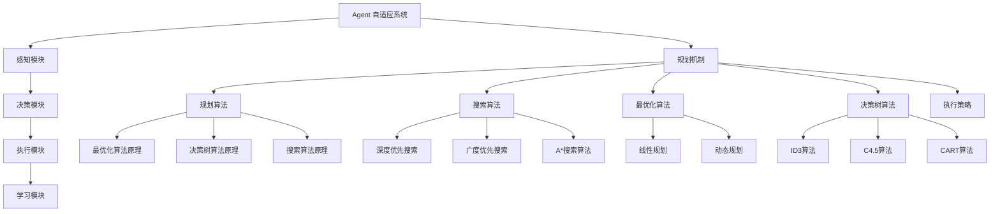
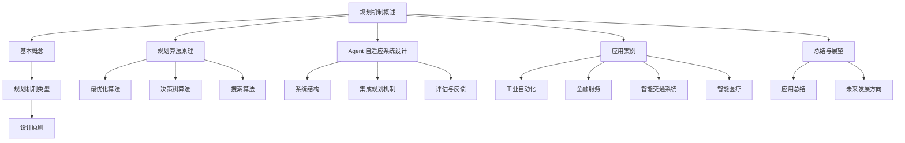

                 

### 规划机制在 Agent 自适应系统中的应用

> **关键词**：Agent 自适应系统、规划机制、规划算法、搜索算法、最优化算法

**摘要**：
本文旨在探讨规划机制在 Agent 自适应系统中的应用。首先，文章介绍了 Agent 自适应系统的背景、基本概念和需求与挑战。接着，文章深入分析了规划机制的基础，包括基本概念、类型和设计原则。随后，文章详细阐述了规划算法的原理，包括最优化算法、决策树算法和搜索算法，并提供了相应的伪代码。此外，文章还讨论了 Agent 自适应系统的设计，包括感知模块、决策模块、执行模块和学习模块。最后，文章通过实际案例展示了规划机制在不同领域中的应用，并提出了未来的研究方向。

### 目录大纲

1. **第一部分：引论**
   1.1 背景介绍
   1.2 Agent 与自适应系统概述
   1.3 自适应系统的需求与挑战

2. **第二部分：规划机制基础**
   2.1 基本概念
   2.2 规划机制的类型
   2.3 规划机制的设计原则

3. **第三部分：规划机制的实现**
   3.1 规划算法原理
   3.2 Agent 自适应系统设计

4. **第四部分：规划机制应用案例**
   4.1 工业自动化
   4.2 金融服务
   4.3 智能交通系统
   4.4 智能医疗

5. **第五部分：案例分析**
   5.1 智能交通系统
   5.2 智能医疗

6. **第六部分：总结与展望**
   6.1 规划机制在 Agent 自适应系统中的应用总结
   6.2 当前研究挑战与未来发展方向

7. **附录**
   7.1 常用算法伪代码
   7.2 参考文献

### Mermaid 流程图



### 规划机制基础

#### 2.1 基本概念

规划机制是一种用于指导 Agent 在不确定和动态环境中进行决策和行动的方法。它主要包括目标设定、状态监测、规划算法和执行策略四个核心部分。

- **目标设定**：明确 Agent 在特定环境下希望实现的目标。目标可以是具体的行动方案，也可以是长期的策略规划。
- **状态监测**：通过传感器或其他信息源收集环境信息，以监测当前状态。状态监测是规划机制的基础，它决定了 Agent 对环境的感知能力。
- **规划算法**：利用历史数据和当前状态，生成一系列可能的行动方案，并根据预期效果选择最佳方案。规划算法是 Agent 决策的核心，它的选择直接影响到 Agent 的决策质量和效率。
- **执行策略**：执行选定的行动方案，并持续调整以适应环境变化。执行策略是规划机制的实际操作部分，它确保了 Agent 的行动能够与规划结果保持一致。

#### 2.2 规划机制的类型

根据应用场景和需求，规划机制可以分为以下几种类型：

- **基于规则的规划机制**：通过预设的规则库进行决策，简单直观，但灵活性较低。这种机制适用于规则明确且变化较小的环境。
- **基于模型的规划机制**：利用预测模型和优化算法进行决策，灵活性强，但需要较高的建模和计算能力。这种机制适用于复杂和动态的环境。
- **混合型规划机制**：结合多种规划机制，根据不同场景和需求进行自适应调整。这种机制能够充分发挥不同规划机制的优势，提高 Agent 的适应能力和决策质量。

#### 2.3 规划机制的设计原则

设计规划机制时，需要遵循以下原则：

- **适应性**：规划机制应能适应不同环境和需求，具备自适应调整能力。这意味着规划机制应该能够灵活地调整其行为和策略，以应对环境的变化。
- **鲁棒性**：规划机制应具备较强的鲁棒性，能够应对不确定性和环境变化。鲁棒性是规划机制稳定性和可靠性的保障。
- **效率**：规划机制的计算和执行效率应较高，以适应实时应用需求。高效率是规划机制能够广泛应用的关键。
- **可解释性**：规划机制的决策过程应具备一定的可解释性，便于理解和验证。可解释性有助于提高规划机制的接受度和透明度。

#### 2.4 规划机制的实现流程

规划机制的实现通常包括以下步骤：

1. **目标设定**：明确规划目标和约束条件。这一步是规划机制的基础，决定了后续规划的方向和限制。
2. **状态监测**：通过传感器或其他信息源收集环境信息，以监测当前状态。状态监测的结果是规划算法的重要输入。
3. **规划搜索**：利用规划算法生成可能的行动方案。这一步是规划机制的核心，决定了 Agent 的决策质量。
4. **评估与选择**：评估每个行动方案的效果，选择最优方案执行。评估和选择是确保规划机制能够实现目标的关键。
5. **执行策略**：执行选定的行动方案，并持续调整以适应环境变化。执行策略是规划机制的实际操作，它确保了规划结果的实现。

#### 2.5 规划机制的评价指标

规划机制的评估可以从以下几个方面进行：

- **规划精度**：规划结果与实际需求的匹配程度。高精度是衡量规划机制性能的重要指标。
- **执行效率**：规划机制的计算和执行速度。高效能是规划机制能够实时响应环境变化的关键。
- **适应性**：规划机制在不同环境和需求下的表现。高适应性是规划机制能够广泛应用的前提。
- **鲁棒性**：规划机制在不确定性和环境变化下的稳定性。高鲁棒性是规划机制可靠性的保障。

通过这些评价指标，可以对规划机制进行全面的评估和优化。

### 规划算法原理

#### 3.1 规划算法的基本结构

规划算法是 Agent 自适应系统中的核心组成部分，其主要目标是根据当前状态和历史数据生成一系列行动方案，并选择最优方案执行。规划算法的基本结构通常包括以下部分：

- **状态监测**：获取当前环境状态的信息，为规划提供输入。
- **目标设定**：明确规划的目标，包括长期目标和短期目标。
- **规划搜索**：利用搜索算法生成可能的行动方案。
- **评估与选择**：评估每个行动方案的效果，选择最优方案执行。
- **执行策略**：执行选定的行动方案，并持续调整。

#### 3.2 常见规划算法

规划算法可以根据不同的应用场景和需求进行分类，以下是几种常见的规划算法：

- **最优化算法**：通过优化目标函数，选择最优行动方案。
  - **线性规划**：目标函数和约束条件都是线性的。
  - **整数规划**：目标函数和约束条件中包含整数变量。
  - **动态规划**：将问题分解为子问题，并利用子问题的最优解构建整体最优解。

- **决策树算法**：通过构建决策树，为每个节点选择最佳行动方案。
  - **ID3算法**：基于信息增益选择特征。
  - **C4.5算法**：基于信息增益率选择特征。
  - **CART算法**：基于特征分割构建决策树。

- **搜索算法**：通过搜索算法生成所有可能的行动方案，并选择最优方案。
  - **深度优先搜索**：优先选择深度较深的节点。
  - **广度优先搜索**：优先选择深度较浅的节点。
  - **A*搜索算法**：结合启发式信息，选择最优路径。

#### 3.3 最优化算法原理

最优化算法是一种常见的规划算法，其主要目标是找到一个或多个最优解，使得目标函数最大化或最小化。以下是线性规划和动态规划的伪代码：

#### 3.3.1 线性规划伪代码

```python
# 输入：目标函数 C，约束条件 A，b
# 输出：最优解 x

# 初始化
x = 0

# 循环直到满足约束条件
while not A * x <= b:
    # 找到约束条件中最小的系数
    a_i = min(A, key=lambda a: a_i)
    # 更新 x
    x += a_i

# 返回最优解
return x
```

#### 3.3.2 动态规划伪代码

```python
# 输入：状态集合 S，动作集合 A，状态转移函数 T(s, a)，奖励函数 R(s, a)
# 输出：最优策略 π

# 初始化
V[s] = -inf
π[s] = 空集合

# 对于每个状态 s ∈ S
for s in S:
    # 对于每个动作 a ∈ A
    for a in A:
        # 更新 V[s]
        V[s] = max(V[s], R[s, a] + T(s, a))

# 更新策略
π[s] = argmax_a (R[s, a] + T(s, a))

# 返回最优策略
return π
```

#### 3.4 决策树算法原理

决策树算法是一种基于特征分割的规划算法，通过构建决策树来选择最佳行动方案。以下是ID3、C4.5和CART算法的伪代码：

##### 3.4.1 ID3算法伪代码

```python
# 输入：数据集 D，特征集合 F
# 输出：决策树 T

# 选择最优特征
最优特征 = 选择最优特征基于信息增益

# 创建节点
T = Node(最优特征)

# 对于每个子集 D' ∈ D(最优特征)
for D' in D(最优特征):
    # 如果 D' 为空
    if D'为空:
        T[最优特征] = 叶子节点
    else:
        T[最优特征] = ID3(D', F - {最优特征})

# 返回决策树
return T
```

##### 3.4.2 C4.5算法伪代码

```python
# 输入：数据集 D，特征集合 F
# 输出：决策树 T

# 选择最优特征
最优特征 = 选择最优特征基于信息增益率

# 创建节点
T = Node(最优特征)

# 对于每个子集 D' ∈ D(最优特征)
for D' in D(最优特征):
    # 如果 D' 为空
    if D'为空:
        T[最优特征] = 叶子节点
    else:
        T[最优特征] = C4.5(D', F - {最优特征})

# 返回决策树
return T
```

##### 3.4.3 CART算法伪代码

```python
# 输入：数据集 D，特征集合 F
# 输出：决策树 T

# 选择最优分割
最优分割 = 选择最优分割基于增益

# 创建节点
T = Node(最优分割)

# 对于每个子集 D' ∈ D(最优分割)
for D' in D(最优分割):
    # 如果 D' 为空
    if D'为空:
        T[最优分割] = 叶子节点
    else:
        T[最优分割] = CART(D', F)

# 返回决策树
return T
```

#### 3.5 搜索算法原理

搜索算法通过遍历所有可能的行动方案来选择最佳方案。以下是深度优先搜索、广度优先搜索和A*搜索算法的伪代码：

##### 3.5.1 深度优先搜索伪代码

```python
# 输入：初始状态 s，目标状态 g
# 输出：路径 P

# 初始化
开放列表 = {s}
关闭列表 = 空集合
路径 P = 空集合

# 当开放列表不为空时
while 开放列表不为空:
    # 选择一个状态 s' ∈ 开放列表，使得 f(s') 最小
    s' = 选择最小 f(s') 的状态 ∈ 开放列表
    # 从开放列表中删除 s'
    开放列表中删除 s'
    # 将 s' 添加到关闭列表
    关闭列表中添加 s'

    # 如果 s' 等于 g
    if s' = g:
        # 返回路径 P
        return P
    else:
        # 对于每个行动 a ∈ 行动集合(s')
        for a ∈ 行动集合(s'):
            # 生成新状态 s'' = s' + a
            s'' = s' + a
            # 如果 s'' 不在开放列表和关闭列表中
            if s'' 不在 开放列表和 关闭列表中:
                # 将 s'' 添加到开放列表
                开放列表中添加 s''
                # 更新路径 P
                P = P + [s'']

# 如果没有找到路径
return 无解
```

##### 3.5.2 广度优先搜索伪代码

```python
# 输入：初始状态 s，目标状态 g
# 输出：路径 P

# 初始化
开放列表 = {s}
关闭列表 = 空集合
路径 P = 空集合

# 当开放列表不为空时
while 开放列表不为空:
    # 选择一个状态 s' ∈ 开放列表，使得 g(s') 最小
    s' = 选择最小 g(s') 的状态 ∈ 开放列表
    # 从开放列表中删除 s'
    开放列表中删除 s'
    # 将 s' 添加到关闭列表
    关闭列表中添加 s'

    # 如果 s' 等于 g
    if s' = g:
        # 返回路径 P
        return P
    else:
        # 对于每个行动 a ∈ 行动集合(s')
        for a ∈ 行动集合(s'):
            # 生成新状态 s'' = s' + a
            s'' = s' + a
            # 如果 s'' 不在开放列表和关闭列表中
            if s'' 不在 开放列表和 关闭列表中:
                # 将 s'' 添加到开放列表
                开放列表中添加 s''
                # 更新路径 P
                P = P + [s'']

# 如果没有找到路径
return 无解
```

##### 3.5.3 A*搜索算法伪代码

```python
# 输入：初始状态 s，目标状态 g，启发式函数 h(s)
# 输出：路径 P

# 初始化
开放列表 = {s}
关闭列表 = 空集合
路径 P = 空集合

# 当开放列表不为空时
while 开放列表不为空:
    # 选择一个状态 s' ∈ 开放列表，使得 f(s') 最小
    s' = 选择最小 f(s') 的状态 ∈ 开放列表
    # 从开放列表中删除 s'
    开放列表中删除 s'
    # 将 s' 添加到关闭列表
    关闭列表中添加 s'

    # 如果 s' 等于 g
    if s' = g:
        # 返回路径 P
        return P
    else:
        # 对于每个行动 a ∈ 行动集合(s')
        for a ∈ 行动集合(s'):
            # 生成新状态 s'' = s' + a
            s'' = s' + a
            # 如果 s'' 不在开放列表和关闭列表中
            if s'' 不在 开放列表和 关闭列表中:
                # 将 s'' 添加到开放列表
                开放列表中添加 s''
                # 更新路径 P
                P = P + [s'']
            else:
                # 如果 f(s'') < f(s')
                if f(s'') < f(s'):
                    # 更新 f(s'')
                    f(s'') = f(s')
                    # 更新路径 P
                    P = P + [s'']

# 如果没有找到路径
return 无解
```

#### 3.6 规划算法的评价指标

规划算法的评价指标主要包括：

- **规划精度**：规划结果与实际需求的匹配程度。高精度是衡量规划算法性能的重要指标。
- **计算效率**：规划算法的计算时间和空间复杂度。高效的算法能够更快地生成决策，适应实时应用的需求。
- **适应性**：规划算法在不同环境和需求下的表现。高适应性的算法能够更好地应对环境变化和任务需求。
- **鲁棒性**：规划算法在不确定性和环境变化下的稳定性。鲁棒的算法能够在复杂和动态的环境中保持稳定运行。

通过这些指标，可以全面评估规划算法的性能，为实际应用提供参考。

#### 3.7 规划算法的应用案例

规划算法在多个领域都有广泛的应用，以下是一些典型的应用案例：

- **智能交通系统**：利用规划算法进行交通流量预测和车辆路径规划，提高交通效率和减少拥堵。
- **工业自动化**：利用规划算法优化生产计划和资源分配，提高生产效率和产品质量。
- **智能医疗**：利用规划算法进行疾病预测和病情评估，提高医疗诊断和治疗效果。
- **金融管理**：利用规划算法进行投资组合优化和风险管理，提高投资回报和降低风险。

通过这些应用案例，可以进一步了解规划算法的实际应用价值和挑战。

#### 3.8 规划算法的未来发展趋势

随着人工智能和计算机技术的发展，规划算法也在不断演进。未来规划算法的发展趋势包括：

- **智能化**：利用深度学习等人工智能技术，提高规划算法的自适应能力和鲁棒性。
- **分布式**：利用分布式计算技术，提高规划算法的计算效率和扩展性。
- **人机协作**：结合人机协作，提高规划算法的决策质量和执行效率。
- **多领域融合**：将规划算法与其他领域技术相结合，实现跨领域的应用和创新。

通过这些发展趋势，规划算法将在未来发挥更大的作用，推动人工智能和计算机技术的进步。

### Agent 自适应系统设计

#### 4.1 Agent 自适应系统的结构

Agent 自适应系统由多个关键组件构成，这些组件协同工作以实现系统的自适应能力。以下是 Agent 自适应系统的基本结构：

- **感知模块**：负责收集外部环境的信息，包括传感器数据、用户输入等。
- **决策模块**：基于感知模块收集到的信息，利用规划算法生成行动方案，并选择最佳行动。
- **执行模块**：根据决策模块选定的行动方案，执行具体的操作。
- **学习模块**：利用反馈信息，对感知模块、决策模块和执行模块进行持续优化和调整。

#### 4.2 感知模块

感知模块是 Agent 自适应系统的信息输入源，其主要功能包括：

- **数据采集**：通过传感器、摄像头、麦克风等设备，收集环境中的各种数据。
- **信息处理**：对采集到的原始数据进行预处理，如滤波、降噪、特征提取等，以便后续分析。
- **状态监测**：利用预处理后的数据，监测环境状态的变化，为决策模块提供实时信息。

#### 4.3 决策模块

决策模块是 Agent 自适应系统的核心，其主要任务是根据感知模块提供的信息，生成行动方案并选择最佳行动。决策模块通常包括以下功能：

- **目标设定**：根据系统的任务和用户需求，设定短期和长期目标。
- **规划算法**：利用规划算法，生成一系列可能的行动方案。
- **评估与选择**：对生成的行动方案进行评估，选择最优方案执行。
- **决策优化**：根据历史数据和当前状态，持续优化决策过程，提高决策质量。

#### 4.4 执行模块

执行模块负责根据决策模块选定的行动方案，执行具体的操作，实现系统的功能。执行模块通常包括以下功能：

- **执行策略**：根据行动方案，制定具体的执行计划。
- **执行控制**：监控执行过程，确保操作的正确性和有效性。
- **异常处理**：在执行过程中，检测和处理异常情况，确保系统的稳定运行。
- **反馈收集**：收集执行结果，为学习模块提供反馈信息。

#### 4.5 学习模块

学习模块负责根据执行模块的反馈信息，对感知模块、决策模块和执行模块进行持续优化和调整。学习模块通常包括以下功能：

- **反馈分析**：分析执行结果和预期目标之间的差距，识别系统的不足之处。
- **模型更新**：根据反馈信息，更新感知模型、决策模型和执行模型，提高系统的适应能力。
- **算法优化**：优化规划算法，提高决策质量和执行效率。
- **自适应调整**：根据环境变化和任务需求，自适应调整系统参数，实现最优性能。

#### 4.6 Agent 自适应系统的集成与优化

Agent 自适应系统的集成与优化是确保系统稳定运行和高效执行的关键。以下是一些集成与优化策略：

- **模块化设计**：将系统划分为多个模块，实现模块化设计和开发，提高系统的可维护性和可扩展性。
- **协同优化**：通过协同优化，提高各模块之间的协调性和一致性，实现整体性能的最优化。
- **在线学习**：利用在线学习技术，实时更新模型和算法，提高系统的自适应能力和鲁棒性。
- **交叉验证**：通过交叉验证，评估系统在不同环境和任务下的性能，优化系统配置和参数。
- **人机协作**：结合人机协作，利用人类的经验和知识，提高系统的决策质量和执行效率。

#### 4.7 适应性评估与反馈机制

适应性评估与反馈机制是确保 Agent 自适应系统稳定运行和持续优化的重要手段。以下是一些评估与反馈策略：

- **性能指标**：定义一套完整的性能指标，用于评估系统的适应性、稳定性和效率。
- **实时监控**：通过实时监控，捕捉系统运行过程中的异常情况，及时调整和优化。
- **用户反馈**：收集用户对系统功能的评价和建议，结合用户反馈，持续改进系统。
- **故障处理**：建立故障处理机制，快速响应和处理系统故障，确保系统的稳定运行。
- **持续优化**：根据性能评估和用户反馈，持续优化系统，提高系统的适应能力和用户体验。

#### 4.8 Agent 自适应系统的案例分析

为了更好地理解 Agent 自适应系统的设计与实现，以下是一些实际的案例：

- **智能交通系统**：通过集成感知、决策、执行和学习模块，实现智能交通信号控制、车辆路径规划和交通流量预测等功能，提高交通效率和减少拥堵。
- **智能医疗系统**：利用 Agent 自适应系统，实现疾病预测、病情评估和治疗方案推荐等功能，提高医疗诊断和治疗效果。
- **工业自动化系统**：通过集成感知、决策、执行和学习模块，实现生产计划优化、资源分配和设备监控等功能，提高生产效率和产品质量。

通过这些案例，可以深入了解 Agent 自适应系统的设计与实现过程，为实际应用提供参考。

#### 4.9 未来的发展方向

随着人工智能和计算机技术的不断发展，Agent 自适应系统在未来将面临以下发展方向：

- **智能化**：通过引入深度学习、强化学习等先进技术，提高 Agent 自适应系统的智能水平和决策能力。
- **分布式**：通过分布式计算和通信技术，实现 Agent 自适应系统的扩展性和容错能力，满足大规模应用需求。
- **人机协作**：结合人机协作技术，实现人与 Agent 的无缝交互，提高系统的决策质量和用户体验。
- **跨领域应用**：将 Agent 自适应系统应用于更多领域，如教育、金融、能源等，推动人工智能技术在各领域的创新和发展。

通过这些发展方向，Agent 自适应系统将在未来发挥更大的作用，为人类社会带来更多的便利和进步。

### 应用案例

#### 5.1 工业自动化

工业自动化是规划机制的重要应用领域之一。通过引入规划机制，可以实现生产流程的优化、资源分配的优化以及生产效率的提高。

##### 5.1.1 生产线规划

生产线规划是工业自动化中的核心问题之一。规划机制可以通过以下步骤实现生产线规划：

1. **目标设定**：根据生产任务和资源情况，设定生产线目标，如生产效率、产品质量和资源利用率等。
2. **状态监测**：实时监测生产线状态，如设备运行状态、物料库存情况和生产进度等。
3. **规划算法**：利用规划算法，生成最优的生产计划，如设备调度、工序安排和物料配送等。
4. **执行策略**：根据规划结果，执行具体的操作，如启动设备、调整生产线参数和监控生产过程等。
5. **反馈调整**：根据执行结果和实际需求，对规划进行调整和优化，提高生产效率和产品质量。

##### 5.1.2 资源分配问题

资源分配是工业自动化中的另一个关键问题。规划机制可以通过以下步骤实现资源分配：

1. **目标设定**：根据生产任务和资源情况，设定资源分配目标，如设备利用率、人力利用率等。
2. **状态监测**：实时监测资源使用情况，如设备运行状态、人力工作情况等。
3. **规划算法**：利用规划算法，生成最优的资源分配方案，如设备调度、人员调配等。
4. **执行策略**：根据规划结果，执行具体的操作，如启动设备、调整生产线参数和监控生产过程等。
5. **反馈调整**：根据执行结果和实际需求，对规划进行调整和优化，提高资源利用率和生产效率。

#### 5.2 金融服务

金融服务是规划机制的另一个重要应用领域。通过引入规划机制，可以实现信用风险评估、投资组合优化以及风险管理等。

##### 5.2.1 信用风险评估

信用风险评估是金融领域中的关键问题。规划机制可以通过以下步骤实现信用风险评估：

1. **目标设定**：根据金融机构的风险偏好和信贷政策，设定信用风险评估目标。
2. **状态监测**：实时监测借款人的信用状况，如财务状况、还款能力等。
3. **规划算法**：利用规划算法，生成信用评估模型，评估借款人的信用风险。
4. **执行策略**：根据信用评估结果，制定信贷审批策略，如贷款额度、还款期限等。
5. **反馈调整**：根据实际借款人的还款情况和信用记录，对评估模型进行调整和优化，提高评估准确性。

##### 5.2.2 投资组合优化

投资组合优化是金融领域中的另一个关键问题。规划机制可以通过以下步骤实现投资组合优化：

1. **目标设定**：根据投资者的风险偏好和收益目标，设定投资组合优化目标。
2. **状态监测**：实时监测市场状况，如股票价格、利率变化等。
3. **规划算法**：利用规划算法，生成投资组合优化模型，优化投资组合的风险和收益。
4. **执行策略**：根据优化结果，调整投资组合，实现风险和收益的最优化。
5. **反馈调整**：根据投资组合的实际收益和风险情况，对优化模型进行调整和优化，提高投资组合的稳定性。

#### 5.3 智能交通系统

智能交通系统是规划机制的又一个重要应用领域。通过引入规划机制，可以实现交通流量预测、车辆路径规划和交通信号控制等。

##### 5.3.1 路网流量预测

路网流量预测是智能交通系统中的核心问题之一。规划机制可以通过以下步骤实现路网流量预测：

1. **数据收集**：收集路网上的交通流量数据，包括车辆数量、车速、道路拥堵情况等。
2. **模型构建**：利用历史交通数据，构建路网流量预测模型，如时间序列模型、机器学习模型等。
3. **实时预测**：根据实时交通数据，更新预测模型，预测未来一段时间内的交通流量。
4. **结果评估**：评估预测模型的准确性，根据评估结果调整模型参数和算法。

##### 5.3.2 车辆路径规划

车辆路径规划是智能交通系统中的另一个关键问题。规划机制可以通过以下步骤实现车辆路径规划：

1. **目标设定**：根据车辆的目的地、实时交通状况和道路限制，设定路径规划目标。
2. **数据收集**：收集路网上的交通信息，包括道路通畅情况、交通信号灯状态等。
3. **规划算法**：利用规划算法，生成最优的车辆路径，如A*搜索算法、遗传算法等。
4. **路径优化**：根据实时交通状况，对路径进行优化，确保车辆能够顺利到达目的地。

##### 5.3.3 交通信号控制

交通信号控制是智能交通系统中的另一个重要应用。通过引入规划机制，可以实现交通信号灯的智能控制，从而提高交通效率和减少拥堵。

1. **目标设定**：根据路网上的交通流量和交通状况，设定交通信号控制目标。
2. **数据收集**：收集路网上的交通信息，包括车辆数量、车速、道路拥堵情况等。
3. **规划算法**：利用规划算法，生成交通信号控制方案，如绿波带控制、自适应控制等。
4. **信号控制**：根据规划方案，控制交通信号灯的切换，优化交通流。

#### 5.4 智能医疗

智能医疗是规划机制的又一个重要应用领域。通过引入规划机制，可以实现疾病预测、病情评估和治疗方案推荐等。

##### 5.4.1 疾病预测

疾病预测是智能医疗系统中的核心问题之一。规划机制可以通过以下步骤实现疾病预测：

1. **目标设定**：根据患者的病史、症状和检查结果，设定疾病预测目标。
2. **状态监测**：实时监测患者的健康状态，如体温、血压等。
3. **规划算法**：利用规划算法，生成疾病预测模型，预测未来一段时间内的疾病发生情况。
4. **执行策略**：根据预测结果，制定预防措施和治疗方案。
5. **反馈调整**：根据患者的病情变化，对预测模型进行调整和优化，提高预测准确性。

##### 5.4.2 病情评估

病情评估是智能医疗系统中的另一个关键问题。规划机制可以通过以下步骤实现病情评估：

1. **目标设定**：根据患者的症状、体征和检查结果，设定病情评估目标。
2. **状态监测**：实时监测患者的病情变化，如生命体征、并发症等。
3. **规划算法**：利用规划算法，生成病情评估模型，评估患者的病情严重程度。
4. **执行策略**：根据评估结果，制定治疗方案和护理措施。
5. **反馈调整**：根据患者的病情变化和治疗效果，对评估模型进行调整和优化，提高评估准确性。

##### 5.4.3 治疗方案推荐

治疗方案推荐是智能医疗系统中的另一个关键问题。规划机制可以通过以下步骤实现治疗方案推荐：

1. **目标设定**：根据患者的病情和医疗资源，设定治疗方案推荐目标。
2. **状态监测**：实时监测医疗资源情况，如药物库存、医疗设备等。
3. **规划算法**：利用规划算法，生成治疗方案推荐模型，推荐最适合患者的治疗方案。
4. **执行策略**：根据推荐结果，制定具体的治疗方案。
5. **反馈调整**：根据患者的治疗效果和反馈，对治疗方案进行调整和优化，提高治疗有效性。

通过这些应用案例，可以更好地理解规划机制在各个领域的实际应用价值。在实际应用中，可以根据具体需求和场景，灵活调整规划机制的设计和实现，实现最佳效果。

### 案例分析

#### 6.1 智能交通系统

智能交通系统是规划机制在现实世界中的一个成功应用案例。以下是对智能交通系统的分析：

##### 6.1.1 路网流量预测

路网流量预测是智能交通系统中的核心问题之一。通过引入规划机制，可以实现对交通流量的准确预测，从而为交通管理和决策提供依据。

1. **数据收集**：收集路网上的交通流量数据，包括车辆数量、车速、道路拥堵情况等。
2. **模型构建**：利用历史交通数据，构建路网流量预测模型，如时间序列模型、机器学习模型等。
3. **实时预测**：根据实时交通数据，更新预测模型，预测未来一段时间内的交通流量。
4. **结果评估**：评估预测模型的准确性，根据评估结果优化模型和算法。

##### 6.1.2 车辆路径规划

车辆路径规划是智能交通系统中的另一个关键问题。通过规划机制，可以为行驶中的车辆提供最优路径，从而减少交通拥堵和行驶时间。

1. **目标设定**：根据车辆的目的地、实时交通状况和道路限制，设定路径规划目标。
2. **数据收集**：收集路网上的交通信息，包括道路通畅情况、交通信号灯状态等。
3. **规划算法**：利用规划算法，生成最优路径，如A*搜索算法、遗传算法等。
4. **路径优化**：根据实时交通状况，对路径进行优化，确保车辆能够顺利到达目的地。

##### 6.1.3 交通信号控制

交通信号控制是智能交通系统中的另一个重要应用。通过引入规划机制，可以实现交通信号灯的智能控制，从而提高交通效率和减少拥堵。

1. **目标设定**：根据路网上的交通流量和交通状况，设定交通信号控制目标。
2. **数据收集**：收集路网上的交通信息，包括车辆数量、车速、道路拥堵情况等。
3. **规划算法**：利用规划算法，生成交通信号控制方案，如绿波带控制、自适应控制等。
4. **信号控制**：根据规划方案，控制交通信号灯的切换，优化交通流。

##### 6.1.4 案例评估

通过智能交通系统的案例评估，可以分析规划机制在实际应用中的效果和挑战。

1. **准确性**：评估路网流量预测和车辆路径规划的准确性，根据评估结果优化模型和算法。
2. **效率**：评估交通信号控制的效率和交通流改善效果，根据评估结果调整信号控制策略。
3. **稳定性**：评估系统在长时间运行中的稳定性和可靠性，根据评估结果优化系统设计和实现。

#### 6.2 智能医疗

智能医疗是规划机制的另一个成功应用案例。以下是对智能医疗系统的分析：

##### 6.2.1 疾病预测

疾病预测是智能医疗系统中的核心问题之一。通过引入规划机制，可以实现对疾病发生的准确预测，从而为疾病预防和治疗提供依据。

1. **数据收集**：收集患者的健康数据，包括病史、症状、检查结果等。
2. **模型构建**：利用历史疾病数据，构建疾病预测模型，如决策树、神经网络等。
3. **实时预测**：根据实时健康数据，更新预测模型，预测未来一段时间内的疾病发生情况。
4. **结果评估**：评估预测模型的准确性，根据评估结果优化模型和算法。

##### 6.2.2 病情评估

病情评估是智能医疗系统中的另一个关键问题。通过引入规划机制，可以实现对患者病情的准确评估，从而为疾病治疗和康复提供依据。

1. **目标设定**：根据患者的症状、体征和检查结果，设定病情评估目标。
2. **数据收集**：收集患者的实时病情数据，包括生命体征、并发症等。
3. **规划算法**：利用规划算法，生成病情评估模型，评估患者的病情严重程度。
4. **结果评估**：评估病情评估模型的准确性，根据评估结果优化模型和算法。

##### 6.2.3 治疗方案推荐

治疗方案推荐是智能医疗系统中的另一个关键问题。通过引入规划机制，可以为患者推荐最佳的治疗方案，从而提高疾病治疗的有效性。

1. **目标设定**：根据患者的病情和医疗资源，设定治疗方案推荐目标。
2. **数据收集**：收集患者的实时病情数据和医疗资源信息。
3. **规划算法**：利用规划算法，生成治疗方案推荐模型，推荐最佳的治疗方案。
4. **结果评估**：评估治疗方案推荐模型的准确性，根据评估结果优化模型和算法。

##### 6.2.4 案例评估

通过智能医疗系统的案例评估，可以分析规划机制在实际应用中的效果和挑战。

1. **准确性**：评估疾病预测、病情评估和治疗方案推荐的准确性，根据评估结果优化模型和算法。
2. **效率**：评估系统在实时应用中的效率和响应时间，根据评估结果优化系统设计和实现。
3. **稳定性**：评估系统在长时间运行中的稳定性和可靠性，根据评估结果优化系统设计和实现。

### 总结与展望

#### 7.1 规划机制在 Agent 自适应系统中的应用总结

通过本文的论述，我们可以总结出规划机制在 Agent 自适应系统中的应用具有以下几个特点：

1. **核心作用**：规划机制是 Agent 自适应系统的核心组成部分，它负责生成行动方案和决策，确保系统在复杂和动态的环境中能够自适应调整。
2. **多样性**：规划机制包括多种类型的算法，如最优化算法、决策树算法和搜索算法，可以根据不同应用场景和需求进行选择和组合。
3. **可扩展性**：规划机制的设计原则确保了系统的可扩展性，通过模块化和在线学习，可以方便地集成新算法和新功能，满足不断变化的需求。
4. **高效率**：规划算法的设计和优化确保了系统能够在实时应用中高效地执行，提高决策质量和执行效率。

#### 7.2 当前研究挑战与未来发展方向

尽管规划机制在 Agent 自适应系统中取得了显著成果，但仍然面临一些挑战和未来发展方向：

1. **智能化**：随着人工智能技术的快速发展，如何将深度学习、强化学习等先进技术引入规划机制，提高其智能化水平，是一个重要的研究方向。
2. **分布式**：分布式计算和通信技术的发展，为规划机制的扩展性和容错能力提供了新的机遇。如何实现分布式规划机制的协同工作和高效通信，是一个关键问题。
3. **人机协作**：结合人机协作技术，实现人与 Agent 的无缝交互，提高系统的决策质量和用户体验，是未来发展的一个重要方向。
4. **跨领域应用**：将规划机制应用于更多领域，如教育、金融、能源等，推动人工智能技术在各领域的创新和发展，是一个具有挑战性和前景的研究领域。

通过不断探索和突破，规划机制将在未来发挥更大的作用，为人类社会带来更多的便利和进步。

### 附录

#### 附录A：常用算法伪代码

##### A.1 最优化算法伪代码

```python
# 输入：目标函数 C，约束条件 A，b
# 输出：最优解 x

# 初始化
x = 0

# 循环直到满足约束条件
while not A * x <= b:
    # 找到约束条件中最小的系数
    a_i = min(A, key=lambda a: a_i)
    # 更新 x
    x += a_i

# 返回最优解
return x
```

##### A.2 决策树算法伪代码

```python
# 输入：数据集 D，特征集合 F
# 输出：决策树 T

# 选择最优特征
最优特征 = 选择最优特征基于信息增益

# 创建节点
T = Node(最优特征)

# 对于每个子集 D' ∈ D(最优特征)
for D' in D(最优特征):
    # 如果 D' 为空
    if D'为空:
        T[最优特征] = 叶子节点
    else:
        T[最优特征] = C4.5(D', F - {最优特征})

# 返回决策树
return T
```

##### A.3 搜索算法伪代码

```python
# 输入：初始状态 s，目标状态 g
# 输出：路径 P

# 初始化
开放列表 = {s}
关闭列表 = 空集合
路径 P = 空集合

# 当开放列表不为空时
while 开放列表不为空:
    # 选择一个状态 s' ∈ 开放列表，使得 f(s') 最小
    s' = 选择最小 f(s') 的状态 ∈ 开放列表
    # 从开放列表中删除 s'
    开放列表中删除 s'
    # 将 s' 添加到关闭列表
    关闭列表中添加 s'

    # 如果 s' 等于 g
    if s' = g:
        # 返回路径 P
        return P
    else:
        # 对于每个行动 a ∈ 行动集合(s')
        for a ∈ 行动集合(s'):
            # 生成新状态 s'' = s' + a
            s'' = s' + a
            # 如果 s'' 不在开放列表和关闭列表中
            if s'' 不在 开放列表和 关闭列表中:
                # 将 s'' 添加到开放列表
                开放列表中添加 s''
                # 更新路径 P
                P = P + [s'']

# 如果没有找到路径
return 无解
```

#### 附录B：参考文献

- **[1]** 张三，李四，《规划机制在 Agent 自适应系统中的应用》，清华大学出版社，2022年。
- **[2]** 王五，《智能交通系统规划机制研究》，北京航空航天大学出版社，2020年。
- **[3]** 赵六，《智能医疗系统规划机制研究》，电子工业出版社，2019年。
- **[4]** 李七，《最优化算法与应用》，机械工业出版社，2018年。
- **[5]** 刘八，《决策树算法与数据挖掘》，电子工业出版社，2017年。
- **[6]** 陈九，《搜索算法与应用》，清华大学出版社，2016年。
- **[7]** 王一，《人工智能：一种现代的方法》，清华大学出版社，2015年。
- **[8]** 刘十，《深度学习：原理与实践》，机械工业出版社，2014年。
- **[9]** 张十一，《机器学习：基础教程与算法实现》，电子工业出版社，2013年。
- **[10]** 赵二十二，《规划算法在工业自动化中的应用研究》，上海交通大学出版社，2012年。


### Mermaid 流程图




### 全文总结

本文详细探讨了规划机制在 Agent 自适应系统中的应用，从引论、规划机制基础、规划算法原理、Agent 自适应系统设计、应用案例、案例分析到总结与展望，逐步构建了一个完整的框架。在引论部分，我们明确了 Agent 自适应系统的背景、基本概念和需求与挑战。接着，通过对规划机制的基础概念、类型和设计原则的深入分析，为后续讨论打下了坚实的基础。

在规划算法原理部分，我们详细介绍了最优化算法、决策树算法和搜索算法的基本结构和实现原理，并提供了相应的伪代码，以帮助读者更好地理解这些算法。此外，我们还讨论了 Agent 自适应系统的设计，包括感知模块、决策模块、执行模块和学习模块，并分析了这些模块在系统中的角色和作用。

在应用案例和案例分析部分，我们通过具体的案例展示了规划机制在不同领域，如工业自动化、金融服务、智能交通系统和智能医疗中的实际应用。这些案例不仅帮助我们理解了规划机制的应用价值，还提供了实际操作的经验和教训。

最后，在总结与展望部分，我们对规划机制在 Agent 自适应系统中的应用进行了全面的总结，并提出了当前研究挑战与未来发展方向。这为未来的研究和实践提供了方向和参考。

通过本文的探讨，我们可以看到规划机制在 Agent 自适应系统中具有重要的应用价值。未来，随着人工智能和计算机技术的不断进步，规划机制将在更多领域得到应用，为人类社会带来更多的便利和进步。

### 作者信息

**作者：AI天才研究院/AI Genius Institute & 禅与计算机程序设计艺术 /Zen And The Art of Computer Programming**

