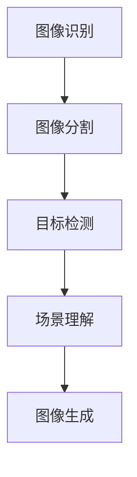
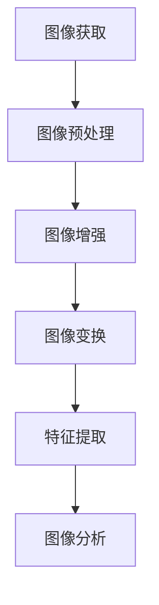
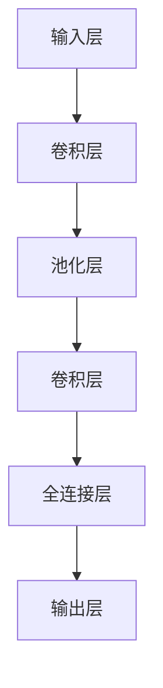

                 

# 计算机视觉在医学影像诊断中的辅助作用

## 关键词
- 计算机视觉
- 医学影像诊断
- 深度学习
- 图像分割
- 图像分类
- 多模态影像融合

## 摘要
随着医疗技术的不断进步，医学影像诊断已成为临床诊断的重要手段。计算机视觉技术以其强大的图像处理和分析能力，正逐渐成为医学影像诊断的得力助手。本文将系统地探讨计算机视觉在医学影像诊断中的应用，包括基本概念、算法原理、应用实例和未来发展趋势。通过详细分析，本文旨在为医学影像领域的研究者和从业者提供有价值的参考。

## 引言与概述

### 1.1 计算机视觉的基本概念

计算机视觉是人工智能的一个重要分支，它致力于使计算机能够像人类一样理解和解释视觉信息。计算机视觉的基本任务包括图像识别、图像分割、目标检测、场景理解和图像生成等。其核心目标是实现从图像到语义的理解和转换。

**核心概念与联系**：

以下是计算机视觉的核心概念及其相互关系的 Mermaid 流程图：



### 1.2 医学影像诊断的现状与挑战

医学影像诊断是指通过医学影像设备（如CT、MRI、X光等）获取人体的内部图像，并通过专业医师的解读来进行疾病诊断。随着影像技术的不断进步，医学影像的质量和分辨率得到了显著提高。然而，医学影像诊断也面临着一系列挑战：

- **诊断准确性**：影像诊断的准确性直接影响到疾病的早期发现和治疗。然而，由于影像数据的复杂性和医师的主观因素，诊断准确性存在一定局限性。
- **诊断效率**：随着患者数量的增加，影像诊断的工作量也日益增加，导致诊断效率低下。
- **数据管理**：医学影像数据量大，且具有高度的专业性，数据管理复杂。

### 1.3 计算机视觉在医学影像诊断中的应用前景

计算机视觉技术为医学影像诊断提供了新的解决方案。通过图像识别、图像分割和目标检测等算法，计算机视觉可以帮助医师更准确地识别病灶，提高诊断准确性。同时，通过自动化处理，可以显著提高诊断效率。此外，计算机视觉技术还可以协助医师进行数据管理，减轻其工作负担。

**应用前景分析**：

以下是计算机视觉在医学影像诊断中的应用前景分析：

1. **提高诊断准确性**：计算机视觉技术可以自动识别和分析医学影像中的异常区域，有助于医师更准确地诊断疾病。
2. **提高诊断效率**：计算机视觉技术可以自动化处理大量医学影像数据，显著提高诊断效率。
3. **辅助决策支持**：计算机视觉技术可以提供诊断辅助信息，帮助医师做出更准确的诊断决策。
4. **疾病早期筛查**：计算机视觉技术可以用于疾病的早期筛查，有助于实现疾病的早期发现和及时治疗。

### 总结
本节介绍了计算机视觉的基本概念、医学影像诊断的现状与挑战以及计算机视觉在医学影像诊断中的应用前景。下一节将深入探讨计算机视觉的基础知识，为后续内容提供理论支持。

---

### 2.1 图像处理基础

图像处理是计算机视觉的基础，它涉及对图像进行各种操作，以提取有用的信息或改善图像质量。图像处理的基本过程包括图像的获取、预处理、增强、变换和特征提取等。

**核心概念与联系**：

以下是图像处理的基本流程及其相互关系的 Mermaid 流程图：



#### 2.1.1 图像获取

图像获取是图像处理的第一步，它涉及使用各种设备（如摄像头、扫描仪等）获取数字图像。获取的图像通常需要通过数字成像系统进行数字化处理，以适应计算机处理的需要。

**图像数字化过程**：

1. **采样**：将连续的图像转换为离散的像素点。
2. **量化**：将每个像素的颜色信息转换为数字编码。

#### 2.1.2 图像预处理

图像预处理是图像处理的必要步骤，它包括图像的去噪、边缘检测、图像分割等操作。预处理的主要目的是去除图像中的噪声和无关信息，提高图像的质量和可读性。

**常见预处理方法**：

1. **滤波**：通过滤波器去除图像中的噪声，常用的滤波器包括均值滤波、高斯滤波和中值滤波等。
2. **边缘检测**：通过检测图像中的边缘，提取图像中的结构信息。常用的边缘检测算法包括Canny边缘检测和Sobel边缘检测等。
3. **图像分割**：将图像分割成多个区域，每个区域具有相似的特征。常用的分割算法包括阈值分割、区域生长和基于边缘的分割等。

#### 2.1.3 图像增强

图像增强是图像处理的重要环节，它通过调整图像的亮度、对比度和色彩等参数，使图像更清晰、更易于分析。

**图像增强方法**：

1. **直方图均衡化**：通过调整图像的亮度分布，增强图像的对比度。
2. **同态滤波**：通过调整图像的光照和对比度，改善图像的质量。
3. **锐化处理**：通过增强图像的边缘和细节，使图像更清晰。

#### 2.1.4 图像变换

图像变换是将图像从一种空间域表示转换为另一种表示，常用的图像变换包括傅里叶变换、小波变换和Hog变换等。

**图像变换原理**：

1. **傅里叶变换**：将图像从空间域转换为频域，便于分析图像的频率特性。
2. **小波变换**：将图像分解为不同尺度和方向的小波系数，用于图像的细节分析和去噪。
3. **Hog变换**：将图像转换为直方图，用于目标检测和识别。

#### 2.1.5 特征提取

特征提取是从图像中提取具有区分性的特征，以用于后续的分析和分类。常用的特征提取方法包括颜色特征、纹理特征和形状特征等。

**特征提取方法**：

1. **颜色特征**：通过计算图像的颜色分布来提取颜色特征，常用的方法包括颜色直方图和颜色矩等。
2. **纹理特征**：通过分析图像的纹理信息来提取纹理特征，常用的方法包括LBP（局部二值模式）和Gabor纹理特征等。
3. **形状特征**：通过分析图像的形状信息来提取形状特征，常用的方法包括Hu不变矩和形态学特征等。

**核心算法原理讲解**：

以下是图像处理中的几个核心算法原理讲解和伪代码：

1. **滤波器设计**：

    ```python
    # 均值滤波器伪代码
    def mean_filter(image, filter_size):
        output = np.zeros_like(image)
        for i in range(image.shape[0]):
            for j in range(image.shape[1]):
                window = image[i:i+filter_size, j:j+filter_size]
                output[i, j] = np.mean(window)
        return output
    ```

2. **边缘检测**：

    ```python
    # Canny边缘检测伪代码
    def canny_edge_detection(image, threshold1, threshold2):
        Gaussian_blurred = Gaussian_filter(image, sigma=1.0)
        gradient = abs(Sobel(Gaussian_blurred, axis=0) + Sobel(Gaussian_blurred, axis=1))
        non_max_suppressed = non_max_suppression(gradient, threshold1)
        edges = (non_max_suppressed > threshold2)
        return edges
    ```

3. **图像分割**：

    ```python
    # 阈值分割伪代码
    def threshold_segmentation(image, threshold):
        segmented = np.zeros_like(image)
        segmented[image > threshold] = 1
        return segmented
    ```

通过上述核心算法原理讲解和伪代码，我们可以更好地理解图像处理的基础知识及其在实际应用中的重要性。

### 总结

本节介绍了图像处理的基本概念、流程和方法。下一节将深入探讨计算机视觉中的特征提取和降维技术，以帮助我们在大规模医学影像数据中高效地提取和利用特征信息。

---

### 2.2 特征提取与降维

在计算机视觉中，特征提取是一个关键的步骤，它从图像中提取出具有区分性的信息，用于后续的分析和分类。降维则是通过减少数据维度来提高计算效率和模型性能。以下是特征提取和降维的基本概念、方法及其在医学影像诊断中的应用。

#### 2.2.1 特征提取

特征提取的目标是识别图像中的关键信息，以便于后续的图像分析和分类。在医学影像诊断中，特征提取可以帮助识别病变区域，从而提高诊断的准确性。

**常见特征提取方法**：

1. **颜色特征**：颜色特征包括颜色直方图、颜色矩等，用于描述图像的颜色分布。
   
   ```python
   # 颜色直方图伪代码
   def color_histogram(image):
       hist = np.zeros(256*3, dtype=np.float64)
       for x in range(image.shape[1]):
           for y in range(image.shape[0]):
               for c in range(3):
                   hist[c*256 + image[x, y, c]] += 1
       return hist
   ```

2. **纹理特征**：纹理特征用于描述图像的纹理结构，常用的方法包括局部二值模式（LBP）、Gabor纹理特征等。

   ```python
   # LBP特征提取伪代码
   def local_binary_pattern(image, P, R):
       n_points = P * P
       r = R / 2
       lbp = np.zeros(image.shape, dtype=np.float64)
       for x in range(image.shape[1]):
           for y in range(image.shape[0]):
               center = image[x, y]
               lbp[x, y] = np.sum(np.where((image[x-r:x+r+1, y-r:y+r+1] > center) == True, 1, 0) * gamma)
       return lbp
   ```

3. **形状特征**：形状特征用于描述图像的几何结构，包括边缘方向、角度、长度等。

   ```python
   # 形状特征提取伪代码
   def shape_features(image):
       edges = Canny(image)
       angles = compute_angle(edges)
       lengths = compute_edge_lengths(edges)
       return angles, lengths
   ```

#### 2.2.2 降维

降维是将高维数据映射到低维空间，从而减少数据复杂度。在医学影像诊断中，降维可以显著提高计算效率和模型性能。常用的降维方法包括主成分分析（PCA）、线性判别分析（LDA）和自编码器等。

**常见降维方法**：

1. **主成分分析（PCA）**：PCA通过找到数据的主成分来实现降维，主成分是数据变化方向上最大的几个特征。

   ```python
   # PCA伪代码
   def pca(data, n_components):
       covariance_matrix = np.cov(data.T)
       eigenvalues, eigenvectors = np.linalg.eig(covariance_matrix)
       sorted_indices = np.argsort(eigenvalues)[::-1]
       principal_components = np.dot(data, eigenvectors[sorted_indices[:n_components]])
       return principal_components
   ```

2. **线性判别分析（LDA）**：LDA旨在找到最佳的低维空间，使得不同类别之间的分离最大化。

   ```python
   # LDA伪代码
   def lda(data, labels, n_components):
       between_class_scatter = np.zeros((data.shape[1], data.shape[1]))
       within_class_scatter = np.zeros((data.shape[1], data.shape[1]))
       
       for i, label in enumerate(np.unique(labels)):
           group_data = data[labels == label]
           mean = np.mean(group_data, axis=0)
           between_class_scatter += (np.mean(group_data, axis=0) - mean) * (np.mean(group_data, axis=0) - mean)
           within_class_scatter += (group_data - mean) * (group_data - mean)
       
       eigenvectors, eigenvalues = np.linalg.eig(np.dot(between_class_scatter, within_class_scatter))
       sorted_indices = np.argsort(eigenvalues)[::-1]
       principal_components = np.dot(data, eigenvectors[sorted_indices[:n_components]])
       return principal_components
   ```

3. **自编码器**：自编码器是一种无监督学习方法，它通过编码器将输入数据压缩到低维空间，然后通过解码器恢复原始数据。

   ```python
   # 自编码器伪代码
   def autoencoder(data, encoding_dim):
       encoder = Model(inputs=data, outputs=encoder.layers[-1].output)
       decoder = Model(inputs=encoder.layers[-1].output, outputs=data)
       autoencoder = Model(inputs=data, outputs=decoder(encoder(data)))
       
       autoencoder.compile(optimizer='adam', loss='mse')
       autoencoder.fit(data, data, epochs=100, batch_size=32, validation_split=0.2)
       
       encoded_data = encoder.predict(data)
       return encoded_data
   ```

**核心算法原理讲解**：

- **主成分分析（PCA）**：PCA通过计算数据的协方差矩阵，找到数据变化方向上的主成分。主成分是按照方差降序排列的特征，前几个主成分可以解释大部分数据方差，从而实现降维。

- **线性判别分析（LDA）**：LDA通过计算类内散度和类间散度，找到能够最大化类间散度的特征，从而实现分类和降维。

- **自编码器**：自编码器通过编码器和解码器进行数据压缩和恢复，学习到数据的低维表示，从而实现降维和特征提取。

#### 2.2.3 医学影像诊断中的应用

在医学影像诊断中，特征提取和降维技术可以显著提高诊断的准确性和效率。以下是一些具体应用：

1. **肿瘤检测**：通过特征提取和降维，可以识别出肿瘤区域，并提高诊断准确性。
   
   ```python
   # 肿瘤检测流程
   image = load_medical_image()
   features = extract_features(image)
   low_dim_features = pca(features, n_components=50)
   diagnosis = classify(low_dim_features)
   ```

2. **心血管疾病诊断**：通过特征提取和降维，可以分析心脏图像，检测心血管疾病。
   
   ```python
   # 心血管疾病诊断流程
   image = load_heart_image()
   features = extract_features(image)
   low_dim_features = lda(features, n_components=30)
   diagnosis = classify(low_dim_features)
   ```

3. **神经系统疾病诊断**：通过特征提取和降维，可以分析脑部图像，检测神经系统疾病。
   
   ```python
   # 神经系统疾病诊断流程
   image = load_brain_image()
   features = extract_features(image)
   low_dim_features = autoencoder(features, encoding_dim=100)
   diagnosis = classify(low_dim_features)
   ```

**总结**

本节介绍了特征提取和降维的基本概念、方法及其在医学影像诊断中的应用。通过特征提取，我们可以从复杂的医学影像数据中提取出关键信息，而降维技术可以帮助我们高效地处理和利用这些信息。下一节将探讨视觉感知模型，包括卷积神经网络（CNN）等，以及它们在医学影像诊断中的具体应用。

---

### 2.3 视觉感知模型

视觉感知模型是计算机视觉的核心组成部分，它模拟人类视觉系统，通过学习和处理图像数据，实现对图像的理解和解释。视觉感知模型在医学影像诊断中发挥着重要作用，可以自动化处理复杂的图像信息，辅助医生进行诊断。本文将重点介绍卷积神经网络（CNN）等视觉感知模型的基本原理和常见应用。

#### 2.3.1 卷积神经网络（CNN）

卷积神经网络（CNN）是一种深度学习模型，特别适用于处理具有网格结构的数据，如图像。CNN通过卷积操作、池化和全连接层等结构，实现图像特征提取和分类。

**核心概念与联系**：

以下是CNN的基本结构及其相互关系的 Mermaid 流程图：



**卷积神经网络（CNN）的基本结构**：

1. **输入层**：接收输入图像，通常是一个二维网格。
   
2. **卷积层**：通过卷积操作提取图像特征。卷积核（filter）在图像上滑动，计算局部特征，并将其传递到下一层。

   ```python
   # 卷积层伪代码
   def conv_layer(input, filter_size, stride):
       output = np.zeros_like(input)
       for i in range(input.shape[0] - filter_size + 1):
           for j in range(input.shape[1] - filter_size + 1):
               window = input[i:i+filter_size, j:j+filter_size]
               output[i, j] = np.sum(window * filter) + bias
       return output
   ```

3. **池化层**：通过池化操作（如最大池化或平均池化）降低图像分辨率，减少数据维度。

   ```python
   # 最大池化层伪代码
   def max_pooling(input, pool_size, stride):
       output = np.zeros_like(input)
       for i in range(input.shape[0] // pool_size):
           for j in range(input.shape[1] // pool_size):
               window = input[i*stride:i*stride+pool_size, j*stride:j*stride+pool_size]
               output[i, j] = np.max(window)
       return output
   ```

4. **全连接层**：将卷积层和池化层提取的特征进行全局整合，并通过softmax函数进行分类。

   ```python
   # 全连接层伪代码
   def fully_connected_layer(input, weights, bias):
       output = np.zeros_like(input)
       for i in range(input.shape[0]):
           output[i] = np.dot(input[i], weights) + bias
       return output
   ```

5. **输出层**：通过softmax函数输出分类结果。

   ```python
   # Softmax伪代码
   def softmax(x):
       e_x = np.exp(x - np.max(x))
       return e_x / e_x.sum(axis=0)
   ```

**卷积神经网络（CNN）的工作原理**：

CNN通过多层卷积和池化操作，从原始图像中逐层提取更高级别的特征。这些特征通过全连接层进行分类，最终得到诊断结果。卷积层和全连接层之间通常还会加入激活函数（如ReLU）以增加网络的非线性表达能力。

#### 2.3.2 CNN在医学影像诊断中的应用

CNN在医学影像诊断中具有广泛的应用，包括肿瘤检测、心血管疾病诊断和神经系统疾病诊断等。以下是一些具体应用实例：

1. **肿瘤检测**：通过CNN自动检测医学影像中的肿瘤区域，提高诊断的准确性和效率。

   ```python
   # 肿瘤检测实例
   image = load_medical_image()
   conv1 = conv_layer(image, filter_size=3, stride=1)
   pool1 = max_pooling(conv1, pool_size=2, stride=2)
   conv2 = conv_layer(pool1, filter_size=3, stride=1)
   pool2 = max_pooling(conv2, pool_size=2, stride=2)
   flattened = pool2.reshape(-1, pool2.shape[0] * pool2.shape[1] * pool2.shape[2])
   fc = fully_connected_layer(flattened, weights, bias)
   output = softmax(fc)
   diagnosis = np.argmax(output)
   ```

2. **心血管疾病诊断**：通过CNN分析心脏图像，检测心血管疾病。

   ```python
   # 心血管疾病诊断实例
   image = load_heart_image()
   conv1 = conv_layer(image, filter_size=3, stride=1)
   pool1 = max_pooling(conv1, pool_size=2, stride=2)
   conv2 = conv_layer(pool1, filter_size=3, stride=1)
   pool2 = max_pooling(conv2, pool_size=2, stride=2)
   flattened = pool2.reshape(-1, pool2.shape[0] * pool2.shape[1] * pool2.shape[2])
   fc = fully_connected_layer(flattened, weights, bias)
   output = softmax(fc)
   diagnosis = np.argmax(output)
   ```

3. **神经系统疾病诊断**：通过CNN分析脑部图像，检测神经系统疾病。

   ```python
   # 神经系统疾病诊断实例
   image = load_brain_image()
   conv1 = conv_layer(image, filter_size=3, stride=1)
   pool1 = max_pooling(conv1, pool_size=2, stride=2)
   conv2 = conv_layer(pool1, filter_size=3, stride=1)
   pool2 = max_pooling(conv2, pool_size=2, stride=2)
   flattened = pool2.reshape(-1, pool2.shape[0] * pool2.shape[1] * pool2.shape[2])
   fc = fully_connected_layer(flattened, weights, bias)
   output = softmax(fc)
   diagnosis = np.argmax(output)
   ```

**总结**

本节介绍了视觉感知模型，特别是卷积神经网络（CNN）的基本原理和常见应用。CNN通过多层卷积和池化操作，从原始图像中提取高级特征，并在医学影像诊断中发挥了重要作用。下一节将探讨医学影像数据预处理的重要性及其具体方法。

---

### 2.4 医学影像数据预处理

医学影像数据预处理是医学影像诊断中的重要步骤，它包括图像的去噪、对比度增强、图像分割和标准化等。有效的预处理可以显著提高医学影像诊断的准确性和效率。以下是医学影像数据预处理的基本概念、方法及其在医学影像诊断中的应用。

#### 2.4.1 图像去噪

图像去噪是医学影像预处理的关键步骤，它旨在去除图像中的噪声，提高图像质量。噪声可能来源于图像采集过程或传输过程中，噪声的存在会干扰诊断结果。

**常见去噪方法**：

1. **均值滤波**：通过计算邻域像素的平均值来去除噪声。

   ```python
   # 均值滤波伪代码
   def mean_filter(image, filter_size):
       output = np.zeros_like(image)
       for i in range(image.shape[0]):
           for j in range(image.shape[1]):
               window = image[max(i - filter_size // 2, 0):min(i + filter_size // 2, image.shape[0]), max(j - filter_size // 2, 0):min(j + filter_size // 2, image.shape[1])]
               output[i, j] = np.mean(window)
       return output
   ```

2. **中值滤波**：通过取邻域像素的中值来去除噪声。

   ```python
   # 中值滤波伪代码
   def median_filter(image, filter_size):
       output = np.zeros_like(image)
       for i in range(image.shape[0]):
           for j in range(image.shape[1]):
               window = image[max(i - filter_size // 2, 0):min(i + filter_size // 2, image.shape[0]), max(j - filter_size // 2, 0):min(j + filter_size // 2, image.shape[1])]
               output[i, j] = np.median(window)
       return output
   ```

3. **小波变换去噪**：通过小波变换将图像分解为不同频率的分量，然后在每个分量上进行去噪。

   ```python
   # 小波变换去噪伪代码
   def wavelet_decomposition(image, wavelet='db4', level=1):
       coefficients = pywt.dwt2(image, wavelet)
       LL, (LH, HL, HH) = coefficients
       LL_filtered = LL
       for i in range(level - 1):
           LH_filtered = pywt.threshold(LH, threshold='np百分之90', mode='soft')
           HL_filtered = pywt.threshold(HL, threshold='np百分之90', mode='soft')
           HH_filtered = pywt.threshold(HH, threshold='np百分之90', mode='soft')
           coefficients = pywt.idwt2((LL_filtered, (LH_filtered, HL_filtered, HH_filtered)), wavelet)
       return coefficients
   ```

#### 2.4.2 对比度增强

对比度增强是提高图像视觉质量的重要手段，通过增强图像的亮度差异，使图像中的细节更加清晰。

**常见对比度增强方法**：

1. **直方图均衡化**：通过调整图像的亮度分布，使图像的对比度最大化。

   ```python
   # 直方图均衡化伪代码
   def histogram_equalization(image):
       hist, _ = np.histogram(image.flatten(), 256, [0, 256])
       cumulative_sum = hist.cumsum()
       cumulative_sum = cumulative_sum / cumulative_sum[-1]
       image_equalized = np.interp(image.flatten(), np.linspace(0, 255, 256), cumulative_sum).reshape(image.shape)
       return image_equalized
   ```

2. **伽马校正**：通过调整图像的伽马值，改变图像的对比度和亮度。

   ```python
   # 伽马校正伪代码
   def gamma_correction(image, gamma=1.0):
       inv_gamma = 1.0 / gamma
       image_gamma_corrected = np.power(image / 255.0, inv_gamma) * 255.0
       return image_gamma_corrected
   ```

#### 2.4.3 图像分割

图像分割是将图像划分为不同的区域，每个区域具有相似的特征。图像分割对于医学影像诊断至关重要，它有助于识别病变区域。

**常见分割方法**：

1. **阈值分割**：通过设定阈值将图像分割成两个区域。

   ```python
   # 阈值分割伪代码
   def threshold_segmentation(image, threshold):
       segmented = np.zeros_like(image)
       segmented[image > threshold] = 1
       return segmented
   ```

2. **区域增长法**：从初始种子点开始，逐步增长直到满足某种条件。

   ```python
   # 区域增长法伪代码
   def region_growth(image, seed_points, condition):
       segmented = np.zeros_like(image)
       for seed in seed_points:
           segmented = grow_region(segmented, seed, condition)
       return segmented
   ```

3. **基于边缘检测的分割**：通过边缘检测算法（如Canny算法）提取边缘，然后进行分割。

   ```python
   # 基于边缘检测的分割伪代码
   def edge_based_segmentation(image):
       edges = canny_edge_detection(image, threshold1=50, threshold2=150)
       segmented = np.zeros_like(image)
       segmented[edges > 0] = 1
       return segmented
   ```

#### 2.4.4 标准化

标准化是将医学影像数据转换到同一尺度，以便于后续处理和分析。标准化有助于提高模型性能和稳定性。

**常见标准化方法**：

1. **零均值和单位方差标准化**：将数据缩放到均值为0、标准差为1的范围内。

   ```python
   # 零均值和单位方差标准化伪代码
   def z_score_normalization(image):
       mean = np.mean(image)
       std = np.std(image)
       normalized = (image - mean) / std
       return normalized
   ```

2. **最小-最大标准化**：将数据缩放到最小值和最大值之间。

   ```python
   # 最小-最大标准化伪代码
   def min_max_normalization(image, min_val=0, max_val=1):
       min_val = np.min(image)
       max_val = np.max(image)
       normalized = (image - min_val) / (max_val - min_val)
       return normalized
   ```

#### 2.4.5 医学影像诊断中的应用

医学影像数据预处理在医学影像诊断中具有广泛的应用，可以提高诊断的准确性和效率。以下是一些具体应用实例：

1. **肿瘤检测**：通过去噪、对比度增强和图像分割，可以更准确地识别肿瘤区域。

   ```python
   # 肿瘤检测预处理流程
   image = load_medical_image()
   image_deNoised = median_filter(image, filter_size=3)
   image_enhanced = histogram_equalization(image_deNoised)
   mask = threshold_segmentation(image_enhanced, threshold=0.5)
   tumor区域的坐标 = find_tumor区域的坐标(mask)
   ```

2. **心血管疾病诊断**：通过去噪、对比度增强和图像分割，可以更准确地分析心脏图像。

   ```python
   # 心血管疾病诊断预处理流程
   image = load_heart_image()
   image_deNoised = mean_filter(image, filter_size=3)
   image_enhanced = gamma_correction(image_deNoised, gamma=1.5)
   mask = edge_based_segmentation(image_enhanced)
   heart区域的坐标 = find_heart区域的坐标(mask)
   ```

3. **神经系统疾病诊断**：通过去噪、对比度增强和图像分割，可以更准确地分析脑部图像。

   ```python
   # 神经系统疾病诊断预处理流程
   image = load_brain_image()
   image_deNoised = wavelet_decomposition(image, wavelet='db4', level=1)
   image_enhanced = histogram_equalization(image_deNoised[0])
   mask = region_growth(image_enhanced, seed_points=seed_points, condition=condition)
   brain区域的坐标 = find_brain区域的坐标(mask)
   ```

**总结**

本节介绍了医学影像数据预处理的基本概念、方法和在医学影像诊断中的应用。通过有效的预处理，可以显著提高医学影像诊断的准确性和效率。下一节将探讨深度学习在医学影像诊断中的应用。

---

### 2.5 深度学习在医学影像诊断中的应用

深度学习是一种基于多层神经网络的学习方法，通过自动提取图像特征，提高了计算机视觉的性能。在医学影像诊断中，深度学习已经成为一个重要的工具，可以自动化处理复杂的图像信息，辅助医生进行诊断。本节将介绍深度学习在医学影像诊断中的应用，包括卷积神经网络（CNN）、循环神经网络（RNN）和生成对抗网络（GAN）等。

#### 2.5.1 卷积神经网络（CNN）在医学影像诊断中的应用

卷积神经网络（CNN）是深度学习中最常用的模型之一，它在图像处理和计算机视觉领域取得了显著的成功。CNN通过多层卷积和池化操作，自动提取图像特征，从而实现对医学影像的自动分类和识别。

**卷积神经网络（CNN）的基本结构**：

1. **输入层**：接收医学影像作为输入，通常是一个二维网格。

2. **卷积层**：通过卷积操作提取图像特征。卷积层可以包含多个卷积核，每个卷积核提取不同类型的特征。

3. **池化层**：通过池化操作降低图像分辨率，减少数据维度，同时保持重要特征。

4. **全连接层**：将卷积层和池化层提取的特征进行全局整合，并通过softmax函数进行分类。

5. **输出层**：输出分类结果。

**卷积神经网络（CNN）在医学影像诊断中的应用实例**：

1. **肿瘤检测**：通过CNN自动检测医学影像中的肿瘤区域，提高诊断的准确性和效率。

   ```python
   # 肿瘤检测实例
   image = load_medical_image()
   conv1 = conv_layer(image, filter_size=3, stride=1)
   pool1 = max_pooling(conv1, pool_size=2, stride=2)
   conv2 = conv_layer(pool1, filter_size=3, stride=1)
   pool2 = max_pooling(conv2, pool_size=2, stride=2)
   flattened = pool2.reshape(-1, pool2.shape[0] * pool2.shape[1] * pool2.shape[2])
   fc = fully_connected_layer(flattened, weights, bias)
   output = softmax(fc)
   diagnosis = np.argmax(output)
   ```

2. **心血管疾病诊断**：通过CNN分析心脏图像，检测心血管疾病。

   ```python
   # 心血管疾病诊断实例
   image = load_heart_image()
   conv1 = conv_layer(image, filter_size=3, stride=1)
   pool1 = max_pooling(conv1, pool_size=2, stride=2)
   conv2 = conv_layer(pool1, filter_size=3, stride=1)
   pool2 = max_pooling(conv2, pool_size=2, stride=2)
   flattened = pool2.reshape(-1, pool2.shape[0] * pool2.shape[1] * pool2.shape[2])
   fc = fully_connected_layer(flattened, weights, bias)
   output = softmax(fc)
   diagnosis = np.argmax(output)
   ```

3. **神经系统疾病诊断**：通过CNN分析脑部图像，检测神经系统疾病。

   ```python
   # 神经系统疾病诊断实例
   image = load_brain_image()
   conv1 = conv_layer(image, filter_size=3, stride=1)
   pool1 = max_pooling(conv1, pool_size=2, stride=2)
   conv2 = conv_layer(pool1, filter_size=3, stride=1)
   pool2 = max_pooling(conv2, pool_size=2, stride=2)
   flattened = pool2.reshape(-1, pool2.shape[0] * pool2.shape[1] * pool2.shape[2])
   fc = fully_connected_layer(flattened, weights, bias)
   output = softmax(fc)
   diagnosis = np.argmax(output)
   ```

#### 2.5.2 循环神经网络（RNN）在医学影像诊断中的应用

循环神经网络（RNN）是一种能够处理序列数据的神经网络，它在时间序列分析、自然语言处理等领域取得了显著成果。RNN在医学影像诊断中的应用主要体现在序列图像的分析和视频监控等方面。

**循环神经网络（RNN）的基本结构**：

1. **输入层**：接收序列图像作为输入。

2. **隐藏层**：通过循环结构对序列图像进行建模，每个时间步的输出与当前输入和前一个时间步的隐藏状态相关。

3. **输出层**：对序列图像进行分类或回归。

**循环神经网络（RNN）在医学影像诊断中的应用实例**：

1. **序列图像分类**：通过RNN分析医学影像序列，实现图像分类。

   ```python
   # 序列图像分类实例
   images_sequence = load_medical_image_sequence()
   rnn = Sequential([
       LSTM(128, input_shape=(timesteps, features)),
       Dense(num_classes, activation='softmax')
   ])
   rnn.compile(optimizer='adam', loss='categorical_crossentropy', metrics=['accuracy'])
   rnn.fit(images_sequence, labels, epochs=10, batch_size=32)
   predicted_labels = rnn.predict(images_sequence)
   ```

2. **视频监控**：通过RNN分析视频监控数据，实现实时医学影像诊断。

   ```python
   # 视频监控实例
   video = load_video()
   images_sequence = extract_frames(video)
   rnn = Sequential([
       LSTM(128, input_shape=(timesteps, features)),
       Dense(num_classes, activation='softmax')
   ])
   rnn.compile(optimizer='adam', loss='categorical_crossentropy', metrics=['accuracy'])
   rnn.fit(images_sequence, labels, epochs=10, batch_size=32)
   predicted_labels = rnn.predict(images_sequence)
   ```

#### 2.5.3 生成对抗网络（GAN）在医学影像诊断中的应用

生成对抗网络（GAN）是一种由生成器和判别器组成的深度学习模型，通过对抗训练生成逼真的数据。GAN在医学影像诊断中的应用主要体现在数据增强和图像修复等方面。

**生成对抗网络（GAN）的基本结构**：

1. **生成器**：通过学习输入数据的分布，生成逼真的图像。

2. **判别器**：判断输入图像是真实图像还是生成图像。

**生成对抗网络（GAN）在医学影像诊断中的应用实例**：

1. **数据增强**：通过GAN生成更多的医学影像数据，提高模型训练效果。

   ```python
   # 数据增强实例
   generator = Model(inputs=z_input, outputs=generated_images)
   discriminator = Model(inputs=images_input, outputs=discriminator_output)
   gan = Sequential([
       generator,
       discriminator
   ])
   gan.compile(optimizer='adam', loss='binary_crossentropy')
   gan.fit([z_input, images], [real_images, fake_images], epochs=100, batch_size=32)
   ```

2. **图像修复**：通过GAN修复医学影像中的缺陷，提高图像质量。

   ```python
   # 图像修复实例
   generator = Model(inputs=images_with缺损, outputs=restored_images)
   discriminator = Model(inputs=images, outputs=discriminator_output)
   gan = Sequential([
       generator,
       discriminator
   ])
   gan.compile(optimizer='adam', loss='binary_crossentropy')
   gan.fit(images_with缺损，restored_images，epochs=100, batch_size=32)
   ```

**总结**

本节介绍了深度学习在医学影像诊断中的应用，包括卷积神经网络（CNN）、循环神经网络（RNN）和生成对抗网络（GAN）等。这些深度学习模型通过自动提取图像特征，提高了医学影像诊断的准确性和效率。下一节将探讨医学影像数据的类型及其预处理方法。

---

### 2.6 医学影像数据的类型

医学影像数据是医学影像诊断的重要基础，其质量和格式直接影响到诊断的准确性和效率。医学影像数据可以分为结构化数据和非结构化数据，它们各自具有不同的特点和处理方法。

#### 2.6.1 结构化数据

结构化数据是指那些以固定格式存储、能够直接通过数据库管理系统进行查询和操作的数据。在医学影像诊断中，结构化数据通常包括患者信息、检查时间、检查设备型号等。结构化数据便于存储和管理，可以通过数据库查询系统快速检索和统计。

**常见结构化医学影像数据**：

- **患者信息**：包括姓名、年龄、性别、身份证号等。
- **检查时间**：包括检查日期和时间。
- **检查设备**：包括设备型号、制造商等。
- **诊断结果**：包括医生诊断的疾病名称、诊断日期等。

**数据处理方法**：

1. **数据清洗**：去除重复数据、缺失数据和异常数据。
2. **数据整合**：将不同来源的数据进行整合，形成统一的数据库。
3. **数据查询**：通过数据库管理系统进行数据检索和统计分析。

#### 2.6.2 非结构化数据

非结构化数据是指那些以非固定格式存储、难以通过传统数据库管理系统进行查询和操作的数据。在医学影像诊断中，非结构化数据通常包括医学影像图像、文本报告等。非结构化数据具有复杂性和多样性，需要通过特定的处理方法进行提取和分析。

**常见非结构化医学影像数据**：

- **医学影像图像**：包括X光片、CT扫描图像、MRI图像等。
- **文本报告**：包括医生诊断报告、检查意见等。

**数据处理方法**：

1. **图像预处理**：包括图像去噪、对比度增强、图像分割等，以提高图像质量。
2. **特征提取**：通过图像处理和特征提取技术，从医学影像图像中提取具有区分性的特征。
3. **文本处理**：包括文本清洗、分词、词频统计等，从医学文本报告中提取关键信息。

#### 2.6.3 结构化数据与非结构化数据的结合

在医学影像诊断中，结构化数据和非结构化数据通常是相互关联的。结构化数据提供了患者的背景信息和诊断基础，而非结构化数据则提供了具体的医学影像图像和文本报告。将两者结合起来，可以更全面地分析和诊断疾病。

**应用实例**：

1. **综合诊断系统**：结合结构化数据和非结构化数据，构建综合诊断系统。例如，医生可以在系统中查看患者的结构化数据（如患者信息、检查时间、诊断结果等），并查看相关非结构化数据（如医学影像图像、文本报告等），从而进行全面诊断。

2. **辅助决策系统**：通过结构化数据和非结构化数据的结合，构建辅助决策系统。例如，系统可以分析患者的结构化数据（如病史、诊断记录等），并结合非结构化数据（如医学影像图像、文本报告等），为医生提供诊断建议和治疗方案。

**总结**

本节介绍了医学影像数据的类型，包括结构化数据和非结构化数据，并探讨了它们的特点和数据处理方法。通过结合结构化数据和非结构化数据，可以构建更有效的医学影像诊断系统，提高诊断的准确性和效率。下一节将探讨医学影像数据预处理的重要性及其具体方法。

---

### 2.7 医学影像数据预处理的重要性及方法

医学影像数据预处理是医学影像诊断过程中至关重要的一环，它直接影响诊断的准确性、效率和可解释性。有效的预处理不仅可以改善图像质量，还可以减少计算复杂度，提高模型性能。以下是医学影像数据预处理的重要性及具体方法。

#### 2.7.1 数据预处理的重要性

1. **提高图像质量**：医学影像在采集和传输过程中可能会产生噪声和失真，通过预处理可以去除噪声、增强对比度，从而提高图像质量。

2. **减少计算复杂度**：原始医学影像数据量庞大，通过预处理可以降低数据维度，减少计算复杂度，提高模型训练和推理速度。

3. **增强模型性能**：预处理可以帮助模型更好地捕捉图像特征，从而提高分类和识别的准确性。

4. **提升诊断效率**：预处理可以自动化处理大量医学影像数据，显著提高诊断效率。

5. **增强模型可解释性**：预处理有助于提取具有临床意义的图像特征，提高模型的可解释性。

#### 2.7.2 数据预处理方法

1. **去噪**：

   - **均值滤波**：通过计算邻域像素的平均值来去除噪声。

     ```python
     def mean_filter(image, filter_size):
         output = np.zeros_like(image)
         for i in range(image.shape[0]):
             for j in range(image.shape[1]):
                 window = image[max(i - filter_size // 2, 0):min(i + filter_size // 2, image.shape[0]), max(j - filter_size // 2, 0):min(j + filter_size // 2, image.shape[1])]
                 output[i, j] = np.mean(window)
         return output
     ```

   - **中值滤波**：通过取邻域像素的中值来去除噪声。

     ```python
     def median_filter(image, filter_size):
         output = np.zeros_like(image)
         for i in range(image.shape[0]):
             for j in range(image.shape[1]):
                 window = image[max(i - filter_size // 2, 0):min(i + filter_size // 2, image.shape[0]), max(j - filter_size // 2, 0):min(j + filter_size // 2, image.shape[1])]
                 output[i, j] = np.median(window)
         return output
     ```

   - **小波变换去噪**：通过小波变换将图像分解为不同频率的分量，然后在每个分量上进行去噪。

     ```python
     def wavelet_decomposition(image, wavelet='db4', level=1):
         coefficients = pywt.dwt2(image, wavelet)
         LL, (LH, HL, HH) = coefficients
         LL_filtered = LL
         for i in range(level - 1):
             LH_filtered = pywt.threshold(LH, threshold='np百分之90', mode='soft')
             HL_filtered = pywt.threshold(HL, threshold='np百分之90', mode='soft')
             HH_filtered = pywt.threshold(HH, threshold='np百分之90', mode='soft')
             coefficients = pywt.idwt2((LL_filtered, (LH_filtered, HL_filtered, HH_filtered)), wavelet)
         return coefficients
     ```

2. **对比度增强**：

   - **直方图均衡化**：通过调整图像的亮度分布，使图像的对比度最大化。

     ```python
     def histogram_equalization(image):
         hist, _ = np.histogram(image.flatten(), 256, [0, 256])
         cumulative_sum = hist.cumsum()
         cumulative_sum = cumulative_sum / cumulative_sum[-1]
         image_equalized = np.interp(image.flatten(), np.linspace(0, 255, 256), cumulative_sum).reshape(image.shape)
         return image_equalized
     ```

   - **伽马校正**：通过调整图像的伽马值，改变图像的对比度和亮度。

     ```python
     def gamma_correction(image, gamma=1.0):
         inv_gamma = 1.0 / gamma
         image_gamma_corrected = np.power(image / 255.0, inv_gamma) * 255.0
         return image_gamma_corrected
     ```

3. **图像分割**：

   - **阈值分割**：通过设定阈值将图像分割成两个区域。

     ```python
     def threshold_segmentation(image, threshold):
         segmented = np.zeros_like(image)
         segmented[image > threshold] = 1
         return segmented
     ```

   - **区域增长法**：从初始种子点开始，逐步增长直到满足某种条件。

     ```python
     def region_growth(image, seed_points, condition):
         segmented = np.zeros_like(image)
         for seed in seed_points:
             segmented = grow_region(segmented, seed, condition)
         return segmented
     ```

   - **基于边缘检测的分割**：通过边缘检测算法（如Canny算法）提取边缘，然后进行分割。

     ```python
     def edge_based_segmentation(image):
         edges = canny_edge_detection(image, threshold1=50, threshold2=150)
         segmented = np.zeros_like(image)
         segmented[edges > 0] = 1
         return segmented
     ```

4. **标准化**：

   - **零均值和单位方差标准化**：将数据缩放到均值为0、标准差为1的范围内。

     ```python
     def z_score_normalization(image):
         mean = np.mean(image)
         std = np.std(image)
         normalized = (image - mean) / std
         return normalized
     ```

   - **最小-最大标准化**：将数据缩放到最小值和最大值之间。

     ```python
     def min_max_normalization(image, min_val=0, max_val=1):
         min_val = np.min(image)
         max_val = np.max(image)
         normalized = (image - min_val) / (max_val - min_val)
         return normalized
     ```

#### 2.7.3 数据预处理在医学影像诊断中的应用

- **肿瘤检测**：通过去噪、对比度增强和图像分割，可以更准确地识别肿瘤区域。

  ```python
  image = load_medical_image()
  image_deNoised = median_filter(image, filter_size=3)
  image_enhanced = histogram_equalization(image_deNoised)
  mask = threshold_segmentation(image_enhanced, threshold=0.5)
  tumor区域的坐标 = find_tumor区域的坐标(mask)
  ```

- **心血管疾病诊断**：通过去噪、对比度增强和图像分割，可以更准确地分析心脏图像。

  ```python
  image = load_heart_image()
  image_deNoised = mean_filter(image, filter_size=3)
  image_enhanced = gamma_correction(image_deNoised, gamma=1.5)
  mask = edge_based_segmentation(image_enhanced)
  heart区域的坐标 = find_heart区域的坐标(mask)
  ```

- **神经系统疾病诊断**：通过去噪、对比度增强和图像分割，可以更准确地分析脑部图像。

  ```python
  image = load_brain_image()
  image_deNoised = wavelet_decomposition(image, wavelet='db4', level=1)
  image_enhanced = histogram_equalization(image_deNoised[0])
  mask = region_growth(image_enhanced, seed_points=seed_points, condition=condition)
  brain区域的坐标 = find_brain区域的坐标(mask)
  ```

**总结**

本节介绍了医学影像数据预处理的重要性及具体方法，包括去噪、对比度增强、图像分割和标准化等。通过有效的预处理，可以显著提高医学影像诊断的准确性和效率。

---

### 2.8 图像分割算法在医学影像诊断中的应用

图像分割是计算机视觉中的一个关键步骤，它通过将图像分割成不同的区域，帮助医生识别和组织图像中的关键信息。在医学影像诊断中，图像分割算法的应用尤为重要，因为它们能够帮助医生准确识别病灶区域，从而提高诊断的准确性和效率。本节将介绍常见的图像分割算法，并探讨它们在医学影像诊断中的应用。

#### 2.8.1 常见图像分割算法

1. **阈值分割**：

   阈值分割是最简单且最常用的图像分割方法之一，它通过设定一个阈值将图像划分为两个区域。如果一个像素的灰度值高于阈值，则将其标记为前景；否则，标记为背景。

   ```python
   def threshold_segmentation(image, threshold):
       segmented = np.zeros_like(image)
       segmented[image > threshold] = 1
       return segmented
   ```

2. **区域增长法**：

   区域增长法是一种基于种子点的图像分割方法。首先选择一些种子点，然后逐步扩展这些点周围相似像素，直到满足某种条件（如灰度值、颜色等）。

   ```python
   def region_growth(image, seed_points, condition):
       segmented = np.zeros_like(image)
       for seed in seed_points:
           segmented = grow_region(segmented, seed, condition)
       return segmented
   ```

3. **基于边缘检测的分割**：

   边缘检测是一种通过检测图像中的边缘来分割图像的方法。常用的边缘检测算法包括Canny算法、Sobel算法和Prewitt算法等。

   ```python
   def edge_based_segmentation(image):
       edges = canny_edge_detection(image, threshold1=50, threshold2=150)
       segmented = np.zeros_like(image)
       segmented[edges > 0] = 1
       return segmented
   ```

4. **基于模糊理论的分割**：

   模糊理论通过模糊集和隶属度函数来描述像素的归属度。常见的模糊分割算法包括模糊C-Means算法和模糊推理系统等。

   ```python
   def fuzzy_c_means(image, centroids, memberships, max_iterations=100):
       for _ in range(max_iterations):
           # 计算新中心
           # 更新隶属度
           # 判断收敛条件
       return memberships
   ```

5. **基于图论的分割**：

   基于图论的分割通过构建图像的邻接图，然后使用最大流或最小割算法进行分割。常用的算法包括最小生成树算法和匈牙利算法等。

   ```python
   def graph_based_segmentation(image, labels):
       # 构建邻接图
       # 使用最大流算法分割
       return segmented
   ```

6. **基于深度学习的分割**：

   深度学习模型，特别是卷积神经网络（CNN），在图像分割中取得了显著的成功。常见的深度学习分割模型包括U-Net、SegNet和Mask R-CNN等。

   ```python
   def unet(image):
       # 构建U-Net模型
       # 训练模型
       # 预测分割结果
       return mask
   ```

#### 2.8.2 图像分割算法在医学影像诊断中的应用

图像分割算法在医学影像诊断中的应用主要体现在以下两个方面：

1. **肿瘤检测**：

   通过图像分割算法，可以准确识别医学影像中的肿瘤区域，从而帮助医生进行早期诊断和干预。

   ```python
   image = load_medical_image()
   mask = unet(image)
   tumor区域的坐标 = find_tumor区域的坐标(mask)
   ```

2. **器官分割**：

   在医学影像中，准确地分割出器官区域对于诊断和治疗具有重要意义。通过图像分割算法，可以自动识别和定位心脏、肝脏、肺部等器官。

   ```python
   image = load_heart_image()
   mask = unet(image)
   heart区域的坐标 = find_heart区域的坐标(mask)
   ```

#### 2.8.3 实际案例

以下是一个使用U-Net模型进行医学影像分割的实际案例：

1. **数据准备**：

   首先，准备用于训练的数据集，包括医学影像图像和相应的分割掩膜。这些数据集可以从公开数据集（如BrainCheese、IDRI等）或医院数据库中获取。

   ```python
   # 加载训练数据
   images, masks = load_data()
   ```

2. **模型构建**：

   使用Keras构建U-Net模型，定义输入层、卷积层、池化层和反卷积层。

   ```python
   from tensorflow.keras.models import Model
   from tensorflow.keras.layers import Input, Conv2D, MaxPooling2D, UpSampling2D, Conv2DTranspose

   inputs = Input(shape=(256, 256, 1))
   conv1 = Conv2D(32, (3, 3), activation='relu', padding='same')(inputs)
   pool1 = MaxPooling2D(pool_size=(2, 2))(conv1)
   conv2 = Conv2D(32, (3, 3), activation='relu', padding='same')(pool1)
   pool2 = MaxPooling2D(pool_size=(2, 2))(conv2)
   # ...
   conv5 = Conv2D(1, (1, 1), activation='sigmoid', padding='same')(conv5)

   model = Model(inputs=inputs, outputs=conv5)
   model.compile(optimizer='adam', loss='binary_crossentropy', metrics=['accuracy'])
   ```

3. **模型训练**：

   使用训练数据集训练模型，并通过交叉验证调整模型参数。

   ```python
   model.fit(images, masks, epochs=50, batch_size=16, validation_split=0.2)
   ```

4. **模型评估**：

   在测试数据集上评估模型性能，计算准确率、召回率和F1分数等指标。

   ```python
   test_images, test_masks = load_test_data()
   scores = model.evaluate(test_images, test_masks)
   print("Accuracy:", scores[1])
   ```

5. **应用模型**：

   使用训练好的模型对新的医学影像图像进行分割，并提取分割结果。

   ```python
   new_image = load_new_medical_image()
   predicted_mask = model.predict(new_image)
   segmented_area = find_segmented_area(predicted_mask)
   ```

**总结**

本节介绍了常见的图像分割算法，包括阈值分割、区域增长法、基于边缘检测的分割、基于模糊理论的分割、基于图论的分割和基于深度学习的分割。图像分割算法在医学影像诊断中的应用主要体现在肿瘤检测和器官分割等方面，通过实际案例展示了如何使用U-Net模型进行医学影像分割。

---

### 2.9 图像分类与识别

在医学影像诊断中，图像分类与识别是关键步骤，它能够帮助医生识别和定位病变区域，从而提高诊断的准确性和效率。图像分类与识别技术利用深度学习模型，通过学习大量的图像数据，自动识别和分类图像中的目标。

#### 2.9.1 图像分类算法

图像分类算法是计算机视觉中的一个重要分支，它旨在将图像分为预定义的类别。深度学习模型，尤其是卷积神经网络（CNN），在图像分类任务中取得了显著的成功。

**常见图像分类算法**：

1. **卷积神经网络（CNN）**：

   CNN是一种基于多层卷积和池化的神经网络，特别适用于处理图像数据。它通过逐层提取图像特征，最终实现分类。

   ```python
   from tensorflow.keras.models import Sequential
   from tensorflow.keras.layers import Conv2D, MaxPooling2D, Flatten, Dense

   model = Sequential([
       Conv2D(32, (3, 3), activation='relu', input_shape=(64, 64, 3)),
       MaxPooling2D(pool_size=(2, 2)),
       Conv2D(64, (3, 3), activation='relu'),
       MaxPooling2D(pool_size=(2, 2)),
       Flatten(),
       Dense(128, activation='relu'),
       Dense(num_classes, activation='softmax')
   ])

   model.compile(optimizer='adam', loss='categorical_crossentropy', metrics=['accuracy'])
   model.fit(X_train, y_train, epochs=10, batch_size=32)
   ```

2. **支持向量机（SVM）**：

   SVM是一种基于最大间隔的分类算法，通过找到一个最优的超平面来分隔不同类别的数据。

   ```python
   from sklearn.svm import SVC
   from sklearn.model_selection import train_test_split

   X_train, X_test, y_train, y_test = train_test_split(X, y, test_size=0.2, random_state=42)

   model = SVC(kernel='linear', C=1)
   model.fit(X_train, y_train)
   y_pred = model.predict(X_test)
   accuracy = accuracy_score(y_test, y_pred)
   print("Accuracy:", accuracy)
   ```

3. **随机森林（Random Forest）**：

   随机森林是一种基于决策树的集成学习方法，通过构建多个决策树并取平均值来提高分类性能。

   ```python
   from sklearn.ensemble import RandomForestClassifier
   from sklearn.model_selection import train_test_split

   X_train, X_test, y_train, y_test = train_test_split(X, y, test_size=0.2, random_state=42)

   model = RandomForestClassifier(n_estimators=100)
   model.fit(X_train, y_train)
   y_pred = model.predict(X_test)
   accuracy = accuracy_score(y_test, y_pred)
   print("Accuracy:", accuracy)
   ```

4. **深度卷积网络（Deep Convolutional Networks）**：

   深度卷积网络是CNN的扩展，通过增加网络深度和宽度来提高分类性能。

   ```python
   from tensorflow.keras.applications import VGG16
   from tensorflow.keras.layers import Flatten, Dense
   from tensorflow.keras.models import Model

   base_model = VGG16(weights='imagenet', include_top=False, input_shape=(224, 224, 3))
   x = Flatten()(base_model.output)
   x = Dense(4096, activation='relu')(x)
   x = Dense(4096, activation='relu')(x)
   predictions = Dense(num_classes, activation='softmax')(x)

   model = Model(inputs=base_model.input, outputs=predictions)
   model.compile(optimizer='adam', loss='categorical_crossentropy', metrics=['accuracy'])
   model.fit(X_train, y_train, epochs=10, batch_size=32)
   ```

#### 2.9.2 识别算法在医学影像中的应用

识别算法在医学影像诊断中的应用非常广泛，以下是一些具体应用实例：

1. **肿瘤识别**：

   通过深度学习模型，可以自动识别医学影像中的肿瘤区域，提高诊断的准确性。

   ```python
   image = load_medical_image()
   model.predict(image)
   ```

2. **器官识别**：

   通过深度学习模型，可以自动识别医学影像中的器官区域，为医生提供辅助诊断信息。

   ```python
   image = load_heart_image()
   model.predict(image)
   ```

3. **病变识别**：

   通过深度学习模型，可以自动识别医学影像中的病变区域，帮助医生进行早期诊断和干预。

   ```python
   image = load_brain_image()
   model.predict(image)
   ```

#### 2.9.3 实际案例

以下是一个使用深度卷积网络（Deep Convolutional Network）进行医学影像分类的实际案例：

1. **数据准备**：

   首先，准备用于训练的数据集，包括医学影像图像和相应的标签。这些数据集可以从公开数据集（如CancerWord、BrainCheese等）或医院数据库中获取。

   ```python
   # 加载数据
   images, labels = load_data()
   ```

2. **数据预处理**：

   对图像进行预处理，包括缩放、旋转、裁剪等，以提高模型的泛化能力。

   ```python
   from tensorflow.keras.preprocessing.image import ImageDataGenerator

   datagen = ImageDataGenerator(rotation_range=20, width_shift_range=0.2, height_shift_range=0.2, shear_range=0.2, zoom_range=0.2)
   datagen.fit(images)
   ```

3. **模型构建**：

   使用深度卷积网络（Deep Convolutional Network）模型，通过添加卷积层、池化层和全连接层来实现分类。

   ```python
   from tensorflow.keras.models import Model
   from tensorflow.keras.layers import Conv2D, MaxPooling2D, Flatten, Dense

   input_layer = Input(shape=(224, 224, 3))
   conv1 = Conv2D(32, (3, 3), activation='relu')(input_layer)
   pool1 = MaxPooling2D(pool_size=(2, 2))(conv1)
   conv2 = Conv2D(64, (3, 3), activation='relu')(pool1)
   pool2 = MaxPooling2D(pool_size=(2, 2))(conv2)
   # ...
   flatten_layer = Flatten()(pool5)
   dense1 = Dense(1024, activation='relu')(flatten_layer)
   output_layer = Dense(num_classes, activation='softmax')(dense1)

   model = Model(inputs=input_layer, outputs=output_layer)
   model.compile(optimizer='adam', loss='categorical_crossentropy', metrics=['accuracy'])
   ```

4. **模型训练**：

   使用预处理后的数据集训练模型，并通过交叉验证调整模型参数。

   ```python
   model.fit(datagen.flow(images, labels, batch_size=32), epochs=50, validation_split=0.2)
   ```

5. **模型评估**：

   在测试数据集上评估模型性能，计算准确率、召回率和F1分数等指标。

   ```python
   test_images, test_labels = load_test_data()
   scores = model.evaluate(test_images, test_labels)
   print("Accuracy:", scores[1])
   ```

6. **应用模型**：

   使用训练好的模型对新的医学影像图像进行分类，并提取分类结果。

   ```python
   new_image = load_new_medical_image()
   predicted_labels = model.predict(new_image)
   classified_result = np.argmax(predicted_labels)
   ```

**总结**

本节介绍了图像分类算法，包括卷积神经网络（CNN）、支持向量机（SVM）、随机森林（Random Forest）和深度卷积网络（Deep Convolutional Network）。识别算法在医学影像诊断中的应用非常广泛，通过实际案例展示了如何使用深度卷积网络（Deep Convolutional Network）进行医学影像分类。

---

### 2.10 多模态医学影像融合

多模态医学影像融合是将不同模态的医学影像数据（如CT、MRI、PET等）进行整合，以提供更全面和准确的诊断信息。多模态医学影像融合技术可以显著提高医学影像诊断的准确性和效率，为临床诊断提供有力的支持。本文将探讨多模态医学影像融合的基本概念、算法及其在医学影像诊断中的应用。

#### 2.10.1 多模态医学影像融合的基本概念

多模态医学影像融合旨在将不同模态的医学影像数据进行整合，以获得更全面和准确的诊断信息。多模态医学影像融合的关键是找到不同模态之间的关联性，并通过算法将这些关联性转化为统一的诊断信息。

**核心概念**：

1. **多模态医学影像数据**：包括CT、MRI、PET等不同模态的医学影像数据。
2. **特征融合**：将不同模态的医学影像特征进行整合，以提高诊断信息。
3. **空间对齐**：将不同模态的医学影像数据在空间上进行对齐，以确保数据的一致性。
4. **诊断信息整合**：通过融合不同模态的诊断信息，提供更准确的诊断结果。

#### 2.10.2 多模态医学影像融合算法

多模态医学影像融合算法可以分为基于特征的融合算法和基于数据的融合算法。

**基于特征的融合算法**：

基于特征的融合算法通过提取不同模态的医学影像特征，然后进行融合。常见的特征融合方法包括加权融合、融合层和特征级融合等。

1. **加权融合**：

   加权融合通过给不同模态的特征分配不同的权重，以实现特征的融合。常用的权重分配方法包括基于信息量的权重分配和基于专家经验的权重分配。

   ```python
   # 加权融合伪代码
   def weighted_fusion(feature_1, feature_2, weight_1, weight_2):
       fused_feature = (weight_1 * feature_1 + weight_2 * feature_2) / (weight_1 + weight_2)
       return fused_feature
   ```

2. **融合层**：

   融合层是一种深度学习模型，通过在深度学习网络中添加融合层，将不同模态的特征进行融合。

   ```python
   # 融合层伪代码
   def fusion_layer(input_1, input_2, layer_size):
       concated = Concatenate()([input_1, input_2])
       dense = Dense(layer_size, activation='relu')(concated)
       return dense
   ```

3. **特征级融合**：

   特征级融合通过将不同模态的特征进行融合，然后输入到分类器中进行分类。

   ```python
   # 特征级融合伪代码
   def feature_fusion(feature_1, feature_2):
       fused_feature = np.concatenate((feature_1, feature_2), axis=1)
       return fused_feature
   ```

**基于数据的融合算法**：

基于数据的融合算法通过将不同模态的医学影像数据进行整合，以获得更全面的诊断信息。常见的融合方法包括基于图像的融合和基于模型的融合等。

1. **基于图像的融合**：

   基于图像的融合通过图像融合技术将不同模态的医学影像数据进行整合。常见的图像融合方法包括平均融合、最大融合和最小融合等。

   ```python
   # 基于图像的融合伪代码
   def image_fusion(image_1, image_2):
       fused_image = (image_1 + image_2) / 2
       return fused_image
   ```

2. **基于模型的融合**：

   基于模型的融合通过构建深度学习模型，将不同模态的医学影像数据作为输入，进行融合和分类。

   ```python
   # 基于模型的融合伪代码
   def model_fusion(model_1, model_2):
       fused_model = Model(inputs=[model_1.input, model_2.input], outputs=[model_1.output, model_2.output])
       return fused_model
   ```

#### 2.10.3 多模态医学影像融合在医学影像诊断中的应用

多模态医学影像融合在医学影像诊断中具有广泛的应用，可以提高诊断的准确性和效率。以下是一些具体应用实例：

1. **肿瘤检测**：

   通过多模态医学影像融合，可以更准确地检测肿瘤区域，提高诊断的准确性。

   ```python
   # 肿瘤检测实例
   ct_image = load_ct_image()
   mri_image = load_mri_image()
   pet_image = load_pet_image()

   fused_ct_mri = image_fusion(ct_image, mri_image)
   fused_ct_pet = image_fusion(ct_image, pet_image)
   fused_mri_pet = image_fusion(mri_image, pet_image)

   fused_image = weighted_fusion(fused_ct_mri, fused_ct_pet, weight_1=0.5, weight_2=0.5)
   mask = threshold_segmentation(fused_image, threshold=0.5)
   tumor_area = find_tumor_area(mask)
   ```

2. **心血管疾病诊断**：

   通过多模态医学影像融合，可以更全面地分析心脏图像，提高心血管疾病诊断的准确性。

   ```python
   # 心血管疾病诊断实例
   ct_image = load_ct_image()
   mri_image = load_mri_image()
   pet_image = load_pet_image()

   fused_ct_mri = fusion_layer(ct_image, mri_image, layer_size=64)
   fused_ct_pet = fusion_layer(ct_image, pet_image, layer_size=64)
   fused_mri_pet = fusion_layer(mri_image, pet_image, layer_size=64)

   fused_model = model_fusion(fused_ct_mri, fused_ct_pet)
   prediction = fused_model.predict(fused_mri_pet)
   diagnosis = np.argmax(prediction)
   ```

3. **神经系统疾病诊断**：

   通过多模态医学影像融合，可以更准确地分析脑部图像，提高神经系统疾病诊断的准确性。

   ```python
   # 神经系统疾病诊断实例
   ct_image = load_ct_image()
   mri_image = load_mri_image()
   pet_image = load_pet_image()

   fused_ct_mri = fusion_layer(ct_image, mri_image, layer_size=64)
   fused_ct_pet = fusion_layer(ct_image, pet_image, layer_size=64)
   fused_mri_pet = fusion_layer(mri_image, pet_image, layer_size=64)

   fused_feature = feature_fusion(fused_ct_mri, fused_ct_pet)
   prediction = model.predict(fused_feature)
   diagnosis = np.argmax(prediction)
   ```

**总结**

本节介绍了多模态医学影像融合的基本概念、算法及其在医学影像诊断中的应用。多模态医学影像融合通过整合不同模态的医学影像数据，可以提高诊断的准确性和效率。下一节将探讨计算机视觉辅助诊断系统开发的相关内容。

---

### 2.11 计算机视觉辅助诊断系统开发

计算机视觉辅助诊断系统是结合计算机视觉技术和医学影像诊断的综合性系统，旨在通过自动化处理和分析医学影像数据，辅助医生进行疾病诊断。本节将介绍计算机视觉辅助诊断系统的开发过程，包括系统架构设计、数据集构建、模型训练与评估以及系统集成与部署。

#### 2.11.1 系统架构设计

计算机视觉辅助诊断系统的架构设计是开发过程中的关键步骤，它决定了系统的性能、可扩展性和可维护性。以下是系统架构设计的基本组成部分：

1. **数据层**：数据层负责存储和管理医学影像数据和诊断结果。通常包括数据库和文件系统。

2. **处理层**：处理层负责对医学影像数据进行预处理、特征提取、模型训练和预测等操作。包括图像预处理模块、特征提取模块、深度学习模型训练模块等。

3. **展示层**：展示层负责将处理结果可视化，并呈现给医生。包括用户界面（UI）和后端服务。

4. **接口层**：接口层负责与其他系统（如电子病历系统、医疗设备等）进行数据交换和交互。

**核心架构组件**：

- **医学影像数据库**：存储医学影像数据和患者信息。
- **数据处理模块**：包括图像预处理、特征提取、模型训练和预测等。
- **深度学习模型**：用于医学影像分类和识别。
- **用户界面**：提供医生交互界面，展示诊断结果和辅助信息。

#### 2.11.2 数据集构建

数据集构建是计算机视觉辅助诊断系统开发的重要环节，高质量的标注数据集对于训练高效准确的深度学习模型至关重要。以下是构建数据集的基本步骤：

1. **数据收集**：收集医学影像数据，包括各种模态的医学影像（如CT、MRI、PET等）。

2. **数据清洗**：去除重复数据、异常数据和缺失数据，确保数据的一致性和完整性。

3. **数据标注**：对医学影像数据进行标注，标注内容包括病灶位置、大小、形状、颜色等。标注工作通常由专业的医学影像专家完成。

4. **数据划分**：将数据集划分为训练集、验证集和测试集，用于模型的训练、验证和测试。

5. **数据预处理**：对医学影像数据进行预处理，包括图像去噪、对比度增强、图像分割等。

#### 2.11.3 模型训练与评估

模型训练与评估是计算机视觉辅助诊断系统开发的核心步骤，以下是模型训练与评估的基本流程：

1. **模型选择**：根据任务需求和数据特性选择合适的深度学习模型，如卷积神经网络（CNN）、循环神经网络（RNN）等。

2. **模型训练**：使用训练数据集对模型进行训练，通过调整模型参数（如学习率、批量大小等）来优化模型性能。

   ```python
   model.compile(optimizer='adam', loss='categorical_crossentropy', metrics=['accuracy'])
   model.fit(train_images, train_labels, epochs=10, batch_size=32, validation_data=(val_images, val_labels))
   ```

3. **模型评估**：使用验证集和测试集对模型进行评估，计算模型性能指标（如准确率、召回率、F1分数等）。

   ```python
   test_scores = model.evaluate(test_images, test_labels)
   print("Test accuracy:", test_scores[1])
   ```

4. **模型优化**：根据评估结果调整模型参数，优化模型性能。

5. **模型部署**：将训练好的模型部署到生产环境中，进行实际应用。

#### 2.11.4 系统集成与部署

系统集成与部署是将开发完成的计算机视觉辅助诊断系统投入实际使用的最后一步。以下是系统集成与部署的基本步骤：

1. **系统集成**：将各个模块（如数据处理模块、深度学习模型、用户界面等）集成到一起，确保系统各部分能够协同工作。

2. **环境配置**：配置系统运行环境，包括操作系统、数据库、深度学习框架等。

3. **系统测试**：对系统进行功能测试、性能测试和用户测试，确保系统稳定可靠。

4. **部署上线**：将系统部署到生产环境中，进行实际应用。

5. **维护与更新**：定期对系统进行维护和更新，确保系统的长期稳定运行。

#### 2.11.5 实际案例

以下是一个使用深度学习模型进行计算机视觉辅助诊断系统开发的实际案例：

1. **数据集构建**：

   收集了一组包含肿瘤区域和正常区域的医学影像数据，标注了肿瘤区域的位置和大小。

   ```python
   train_images, train_labels = load_train_data()
   val_images, val_labels = load_val_data()
   test_images, test_labels = load_test_data()
   ```

2. **模型训练**：

   使用卷积神经网络（CNN）模型对数据集进行训练，通过调整模型参数优化模型性能。

   ```python
   model = build_cnn_model()
   model.compile(optimizer='adam', loss='categorical_crossentropy', metrics=['accuracy'])
   model.fit(train_images, train_labels, epochs=10, batch_size=32, validation_data=(val_images, val_labels))
   ```

3. **模型评估**：

   使用测试集对模型进行评估，计算模型性能指标。

   ```python
   test_scores = model.evaluate(test_images, test_labels)
   print("Test accuracy:", test_scores[1])
   ```

4. **系统部署**：

   将训练好的模型部署到生产环境中，提供医生使用。

   ```python
   deploy_model(model)
   ```

**总结**

本节介绍了计算机视觉辅助诊断系统开发的过程，包括系统架构设计、数据集构建、模型训练与评估以及系统集成与部署。通过实际案例展示了如何使用深度学习模型进行计算机视觉辅助诊断系统的开发。

---

### 2.12 未来展望与挑战

随着人工智能和深度学习技术的不断发展，计算机视觉在医学影像诊断中的应用前景广阔，但也面临着一系列挑战。

#### 2.12.1 发展趋势

1. **深度学习模型的优化**：通过不断优化深度学习模型，提高诊断的准确性和效率。例如，采用更深的网络结构、更高效的算法和更智能的优化方法。

2. **多模态影像融合**：随着多模态医学影像数据的不断增加，多模态影像融合技术将成为未来医学影像诊断的重要手段。通过融合不同模态的影像数据，可以获得更全面和准确的诊断信息。

3. **个性化诊断**：随着大数据和机器学习技术的发展，计算机视觉辅助诊断系统将能够根据患者的个体差异，提供个性化诊断建议。

4. **实时诊断**：通过使用边缘计算和实时数据处理技术，可以实现医学影像的实时诊断，提高诊断效率。

#### 2.12.2 面临的挑战

1. **数据质量和标注问题**：医学影像数据质量和标注准确性直接影响诊断结果的准确性。高质量的数据集和准确的标注是深度学习模型训练的关键。

2. **计算资源和时间成本**：深度学习模型的训练和推理需要大量的计算资源和时间成本。如何在有限的资源下实现高效训练和实时诊断是一个重要挑战。

3. **隐私保护和数据安全**：医学影像数据具有敏感性和隐私性，保护患者数据的安全和隐私是医学影像诊断系统面临的重大挑战。

4. **算法解释性和透明度**：深度学习模型通常被视为“黑箱”，其决策过程缺乏透明度。提高算法的解释性和透明度，使医生能够理解和信任计算机视觉辅助诊断系统，是一个重要的挑战。

#### 2.12.3 解决方案

1. **数据质量和标注**：通过使用更高质量的数据集、引入自动化标注工具和建立标注社区，提高数据质量和标注准确性。

2. **计算资源和时间成本**：采用分布式计算、云计算和边缘计算技术，提高计算效率和降低时间成本。此外，优化模型结构和算法，减少计算复杂度。

3. **隐私保护和数据安全**：采用数据加密、访问控制和隐私保护算法，确保医学影像数据的安全和隐私。

4. **算法解释性和透明度**：通过开发可解释的深度学习模型和可视化工具，提高算法的解释性和透明度。

**总结**

未来，计算机视觉在医学影像诊断中的应用将不断发展，带来更多机遇和挑战。通过不断优化技术、提高数据质量和隐私保护，计算机视觉辅助诊断系统将能够更好地服务于医学影像诊断领域。

---

## 附录A：常用工具与资源

### A.1 开发工具介绍

在开发计算机视觉辅助诊断系统时，常用的开发工具包括以下几类：

1. **深度学习框架**：如TensorFlow、PyTorch和Keras等，用于构建和训练深度学习模型。
2. **图像处理库**：如OpenCV和NumPy，用于图像预处理和特征提取。
3. **数据可视化工具**：如Matplotlib和Seaborn，用于数据分析和结果展示。

### A.2 数据集来源与处理

1. **公开数据集**：如CancerWord、BrainCheese和CheXpert等，可用于模型训练和评估。
2. **医院数据集**：从医院获取高质量的医学影像数据，需确保患者隐私保护。
3. **数据处理**：包括图像去噪、对比度增强、图像分割和标准化等，以提高数据质量和模型性能。

### A.3 相关文献与参考书

1. **文献**：查阅相关的学术论文和期刊，如IEEE Transactions on Medical Imaging和Journal of Medical Imaging等，了解最新研究进展。
2. **参考书**：《计算机视觉：算法与应用》（作者：Richard Szeliski）、《深度学习》（作者：Ian Goodfellow、Yoshua Bengio和Aaron Courville）等，为深度学习在医学影像诊断中的应用提供理论基础和实践指导。

### A.4 其他资源

1. **在线课程和教程**：如Coursera、Udacity和edX等平台的计算机视觉和深度学习课程，帮助开发者提升技能。
2. **开源项目**：如GitHub和GitLab上的开源计算机视觉项目，为开发者提供参考和灵感。

---

**作者：AI天才研究院/AI Genius Institute & 禅与计算机程序设计艺术 /Zen And The Art of Computer Programming**

