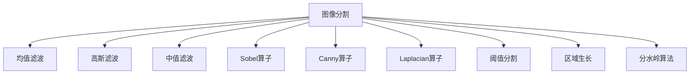
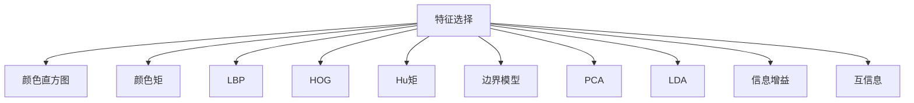
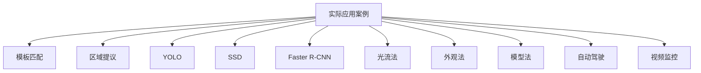

                 

### 《计算机视觉在自动化质检中的创新》

> **关键词：**计算机视觉、自动化质检、图像处理、深度学习、创新应用

**摘要：** 
本文将深入探讨计算机视觉在自动化质检中的应用及其创新。首先，我们将介绍计算机视觉和自动化质检的基本概念、发展历程以及它们之间的联系。接着，我们将详细讲解计算机视觉的核心技术，如图像处理、特征提取与降维、目标检测与跟踪等。随后，我们将分析深度学习在计算机视觉中的应用，以及这些技术在自动化质检中的创新应用。最后，本文将通过实际案例和项目实战，展示计算机视觉在自动化质检中的强大应用能力，并探讨其未来发展趋势。

### 《计算机视觉在自动化质检中的创新》目录大纲

#### 第一部分：计算机视觉与自动化质检基础

##### 第1章：计算机视觉简介
- 1.1 计算机视觉的基本概念
- 1.2 计算机视觉的发展历程
- 1.3 计算机视觉的关键技术

##### 第2章：自动化质检概述
- 2.1 自动化质检的背景和意义
- 2.2 自动化质检的基本流程
- 2.3 自动化质检的技术要求

##### 第3章：计算机视觉在自动化质检中的应用
- 3.1 计算机视觉在质检中的优势
- 3.2 计算机视觉在自动化质检中的应用场景
- 3.3 计算机视觉在自动化质检中的挑战

#### 第二部分：计算机视觉核心技术

##### 第4章：图像处理基础
- 4.1 图像处理的基本概念
- 4.2 图像处理算法
- 4.3 图像处理在实际应用中的案例

##### 第5章：特征提取与降维
- 5.1 特征提取的基本方法
- 5.2 特征降维技术
- 5.3 特征提取与降维的实际应用

##### 第6章：目标检测与跟踪
- 6.1 目标检测算法
- 6.2 目标跟踪算法
- 6.3 目标检测与跟踪在实际应用中的案例

#### 第三部分：计算机视觉在自动化质检中的创新

##### 第7章：深度学习在计算机视觉中的应用
- 7.1 深度学习的基本概念
- 7.2 深度学习在计算机视觉中的关键算法
- 7.3 深度学习在自动化质检中的应用

##### 第8章：计算机视觉在自动化质检中的创新应用
- 8.1 计算机视觉在产品质量检测中的应用
- 8.2 计算机视觉在设备状态监测中的应用
- 8.3 计算机视觉在过程控制中的应用

##### 第9章：计算机视觉在自动化质检中的未来发展趋势
- 9.1 计算机视觉技术的未来发展方向
- 9.2 自动化质检行业的未来趋势
- 9.3 计算机视觉在自动化质检中的创新方向

#### 第四部分：项目实战

##### 第10章：计算机视觉在自动化质检中的实战案例
- 10.1 项目背景介绍
- 10.2 项目目标与方案设计
- 10.3 项目实施与效果评估
- 10.4 项目经验与总结

##### 第11章：计算机视觉在自动化质检中的实践
- 11.1 实践环境搭建
- 11.2 实践项目案例
- 11.3 实践中的常见问题与解决方法
- 11.4 实践经验与建议

##### 第12章：源代码分析与解读
- 12.1 源代码结构与功能解读
- 12.2 关键算法与代码实现
- 12.3 源代码优化与改进建议

##### 附录：常用工具与资源
- 附录 A：计算机视觉相关工具与资源
- 附录 B：自动化质检常用工具与资源
- 附录 C：深度学习框架与算法资源

注意：以上目录大纲只是一个基本框架，具体章节内容可根据实际需求和内容进行调整和细化。在撰写书稿时，请确保每个章节都有充足的内容，并遵循Markdown格式要求。在讲述核心概念、算法原理和数学模型时，请使用Mermaid流程图、伪代码、LaTeX公式等工具进行详细阐述。项目实战部分需要提供实际案例和源代码分析，以便读者更好地理解和应用所学知识。

### 第一部分：计算机视觉与自动化质检基础

在当今技术迅猛发展的时代，计算机视觉（Computer Vision）和自动化质检（Automated Quality Inspection, AQI）正逐渐成为工业生产和质量控制中的关键组成部分。计算机视觉是指让计算机能够“看”和“理解”图像和视频的能力，而自动化质检则是指利用自动化技术对生产过程中的产品质量进行实时检测和监控。这两者结合，不仅提高了生产效率，还显著降低了质量控制成本。

**第1章：计算机视觉简介**

#### 1.1 计算机视觉的基本概念

计算机视觉是一门交叉学科，结合了计算机科学、数学、统计学和心理学等多个领域的知识。其主要目标是让计算机能够像人眼一样感知和理解图像或视频中的内容。具体来说，计算机视觉涉及以下几方面：

- **图像获取**：通过摄像头或其他传感器捕获图像。
- **图像处理**：对捕获的图像进行预处理，如去噪、增强、滤波等。
- **特征提取**：从图像中提取关键信息，以便后续分析。
- **目标检测与识别**：定位图像中的特定目标，并进行分类和识别。
- **理解与解释**：对图像中的对象、场景和动作进行理解，做出合理的解释。

#### 1.2 计算机视觉的发展历程

计算机视觉的发展可以追溯到20世纪60年代。早期的研究主要集中在图像处理和特征提取上。随着计算机硬件和算法的不断进步，计算机视觉的应用范围逐渐扩大，从最初的简单图像识别到复杂的人脸识别、手势识别和场景理解。以下是一些重要的里程碑：

- **20世纪60年代**：图像处理和图像增强技术开始研究。
- **20世纪70年代**：出现了一些基本的特征提取算法，如边缘检测和角点检测。
- **20世纪80年代**：目标检测和跟踪技术得到发展。
- **20世纪90年代**：基于机器学习的算法开始应用于计算机视觉，如支持向量机和神经网络。
- **21世纪初**：深度学习技术的出现，推动了计算机视觉的飞速发展。

#### 1.3 计算机视觉的关键技术

计算机视觉的核心技术主要包括图像处理、特征提取、目标检测与跟踪等。以下是对这些技术的简要介绍：

- **图像处理**：图像处理是计算机视觉的基础。其主要任务是改善图像的质量，提取有用的信息。常见的图像处理算法包括滤波、变换、分割等。
  
  ```mermaid
  graph TD
  A[图像处理] --> B[滤波]
  A --> C[变换]
  A --> D[分割]
  ```

- **特征提取**：特征提取是将图像中的关键信息抽象成数字特征的过程。这些特征有助于后续的目标检测和识别。常见的特征提取方法包括SIFT、HOG等。

  ```mermaid
  graph TD
  A[特征提取] --> B[HOG]
  A --> C[SIFT]
  ```

- **目标检测与跟踪**：目标检测是识别图像中的特定对象，而目标跟踪则是持续监测对象在视频中的运动。常见的目标检测算法包括YOLO、SSD等。

  ```mermaid
  graph TD
  A[目标检测] --> B[YOLO]
  A --> C[SSD]
  A --> D[DeepFlow]
  ```

### **第2章：自动化质检概述**

#### 2.1 自动化质检的背景和意义

自动化质检是指利用自动化设备和技术对生产过程中的产品质量进行检测和监控。在传统的质量控制中，质检工作通常需要人工进行，存在效率低、成本高、易出错等问题。随着工业自动化和物联网技术的发展，自动化质检逐渐成为现代制造业的重要组成部分。

自动化质检的背景主要包括以下几个方面：

- **生产效率**：自动化质检可以显著提高生产效率，降低生产成本。
- **质量控制**：自动化质检可以实时检测产品质量，减少不合格产品的产生，提高产品质量。
- **劳动力成本**：自动化质检可以减少对人工的依赖，降低劳动力成本。

#### 2.2 自动化质检的基本流程

自动化质检的基本流程通常包括以下几个步骤：

1. **样本采集**：从生产线上随机或定期采集样本。
2. **样本预处理**：对采集到的样本进行清洗、去噪等预处理。
3. **质量检测**：使用自动化设备对样本进行质量检测，如视觉检测、传感器检测等。
4. **结果分析**：对检测结果进行分析和统计，判断产品是否合格。
5. **反馈与控制**：根据分析结果，对生产线进行调整和优化。

#### 2.3 自动化质检的技术要求

自动化质检的技术要求主要包括以下几个方面：

- **准确性**：自动化质检系统需要具备高准确性的检测能力，减少误判和漏判。
- **实时性**：自动化质检系统需要具备实时检测的能力，以便及时发现和纠正质量问题。
- **适应性**：自动化质检系统需要能够适应不同的检测环境和检测对象。
- **可扩展性**：自动化质检系统需要具备良好的可扩展性，以便随着生产需求的变化进行升级和扩展。

### **第3章：计算机视觉在自动化质检中的应用**

#### 3.1 计算机视觉在质检中的优势

计算机视觉在质检中的应用具有明显的优势：

- **高精度**：计算机视觉可以精确识别和定位产品中的缺陷，提供准确的检测结果。
- **高速率**：计算机视觉可以实时处理大量图像数据，具备高速检测的能力。
- **非接触式检测**：计算机视觉采用非接触式检测，避免了人工检测带来的损伤和污染。
- **智能化**：计算机视觉系统可以结合深度学习等技术，实现自适应学习和自我优化。

#### 3.2 计算机视觉在自动化质检中的应用场景

计算机视觉在自动化质检中的应用场景非常广泛，主要包括以下几个方面：

- **产品质量检测**：计算机视觉可以检测产品表面的瑕疵、尺寸、形状等质量参数。
- **设备状态监测**：计算机视觉可以监测设备的运行状态，及时发现异常情况，预防设备故障。
- **过程控制**：计算机视觉可以实时监控生产过程，优化生产参数，提高生产效率。

#### 3.3 计算机视觉在自动化质检中的挑战

尽管计算机视觉在自动化质检中具有众多优势，但同时也面临着一些挑战：

- **数据标注困难**：计算机视觉模型需要大量的标注数据，但在实际应用中，获取高质量标注数据是一个难题。
- **算法适应性**：不同的生产环境和产品类型对计算机视觉算法的适应性提出了较高的要求。
- **硬件成本**：高性能的计算机视觉系统通常需要昂贵的硬件支持，增加了企业的负担。
- **实际应用场景复杂性**：实际生产环境复杂多变，如何确保计算机视觉系统能够稳定、准确地运行是一个挑战。

### 总结

计算机视觉和自动化质检的结合，不仅提高了生产效率，还显著降低了质量控制成本。通过对计算机视觉和自动化质检的基本概念、发展历程和关键技术进行详细介绍，本文为读者提供了一个全面而系统的认识。在接下来的章节中，我们将进一步探讨计算机视觉的核心技术，如图像处理、特征提取与降维、目标检测与跟踪等，以及深度学习在计算机视觉中的应用。通过这些技术，计算机视觉在自动化质检中将展现更加广泛和深入的创新应用。

### 第二部分：计算机视觉核心技术

计算机视觉作为自动化质检的关键技术之一，其核心技术的不断发展和优化，为自动化质检系统的精度和效率提供了强有力的支持。本部分将详细介绍计算机视觉的核心技术，包括图像处理、特征提取与降维、目标检测与跟踪等，帮助读者深入理解这些技术在自动化质检中的应用。

#### 第4章：图像处理基础

图像处理是计算机视觉的基础，它涉及到一系列算法和操作，用于改善图像的质量，提取有用的信息。以下是图像处理的一些基础概念和常用算法。

##### 4.1 图像处理的基本概念

- **图像数据结构**：图像由像素点组成，每个像素点包含颜色信息。图像可以表示为二维矩阵。
- **图像分辨率**：图像的分辨率决定了图像的细节表现能力。分辨率越高，图像越清晰。
- **图像类型**：常见的图像类型包括灰度图像、彩色图像和深度图像。

##### 4.2 图像处理算法

- **滤波**：滤波用于去除图像中的噪声。常用的滤波算法包括均值滤波、高斯滤波和中值滤波。
- **边缘检测**：边缘检测用于识别图像中的边缘区域。常用的边缘检测算法包括Sobel算子、Canny算子和Laplacian算子。
- **图像分割**：图像分割是将图像划分为多个区域。常用的分割算法包括阈值分割、区域生长和分水岭算法。

##### 4.3 图像处理在实际应用中的案例

- **人脸识别**：通过图像处理技术对人脸进行预处理，如滤波、光照校正和脸部分割，然后使用特征提取算法进行人脸识别。
- **医学图像分析**：医学图像处理技术用于诊断和监测疾病，如肺部CT图像的分割和脑部MRI图像的边缘检测。



#### 第5章：特征提取与降维

特征提取是将图像中的关键信息抽象成一组数字特征的过程，这些特征可以用于后续的目标检测、分类和识别。降维是将高维特征空间转换为低维空间的过程，以减少计算复杂度和提高模型性能。

##### 5.1 特征提取的基本方法

- **颜色特征**：包括颜色直方图、颜色矩等。
- **纹理特征**：包括局部二值模式（LBP）、方向梯度直方图（HOG）等。
- **形状特征**：包括Hu矩、边界模型等。

##### 5.2 特征降维技术

- **主成分分析（PCA）**：通过最大化方差来选择主成分，从而实现降维。
- **线性判别分析（LDA）**：通过最小化类内方差和最大化类间方差来选择判别特征。
- **特征选择**：使用各种评价方法选择对分类最有利的特征。

##### 5.3 特征提取与降维的实际应用

- **面部识别**：通过提取面部特征，如眼睛、鼻子、嘴巴的位置和形状，实现人脸识别。
- **文本分类**：使用词袋模型提取文本特征，并通过降维技术减少特征空间的维度。



#### 第6章：目标检测与跟踪

目标检测是计算机视觉中的一个重要任务，它旨在识别图像中的特定目标并定位其位置。目标跟踪则是在视频序列中持续监测目标的运动。以下是目标检测与跟踪的一些基本算法。

##### 6.1 目标检测算法

- **传统算法**：包括基于模板匹配的方法和基于区域提议的方法。
- **深度学习算法**：包括基于卷积神经网络（CNN）的方法，如YOLO、SSD和Faster R-CNN。

##### 6.2 目标跟踪算法

- **基于光流的方法**：通过计算连续帧之间的像素位移来跟踪目标。
- **基于外观的方法**：使用目标的外观特征进行跟踪。
- **基于模型的方法**：使用概率模型或动态系统模型进行跟踪。

##### 6.3 目标检测与跟踪在实际应用中的案例

- **自动驾驶**：使用目标检测算法识别道路上的车辆、行人、交通标志等，并进行目标跟踪。
- **视频监控**：使用目标检测和跟踪技术进行实时监控，识别和追踪可疑目标。



通过上述对图像处理、特征提取与降维、目标检测与跟踪等核心技术的介绍，我们可以看到，这些技术不仅构成了计算机视觉的基础，也为自动化质检提供了强大的支持。在接下来的章节中，我们将进一步探讨深度学习在计算机视觉中的应用，以及这些技术在自动化质检中的创新应用。

### 第三部分：计算机视觉在自动化质检中的创新

随着深度学习技术的快速发展，计算机视觉在自动化质检中的应用进入了一个全新的阶段。深度学习为计算机视觉带来了强大的建模能力和自适应能力，使得质检系统更加智能化和高效。本部分将详细探讨深度学习在计算机视觉中的应用，以及这些技术在自动化质检中的创新应用。

#### 第7章：深度学习在计算机视觉中的应用

深度学习（Deep Learning）是一种基于多层神经网络的学习方法，其核心思想是通过多层非线性变换，从大量数据中自动学习特征表示。深度学习在计算机视觉中的应用，极大地提升了图像识别、目标检测和图像分割的准确性。

##### 7.1 深度学习的基本概念

- **人工神经网络**：人工神经网络（Artificial Neural Networks,ANN）是深度学习的基础，它模拟生物神经元的工作方式，通过调整网络中的权重和偏置来学习数据。
- **卷积神经网络（CNN）**：卷积神经网络是专门用于处理图像数据的神经网络，其核心是卷积层，通过局部感知和共享权重减少了参数数量，提高了学习效率。
- **递归神经网络（RNN）**：递归神经网络能够处理序列数据，通过保存和利用之前的输出信息，对序列数据进行建模。

##### 7.2 深度学习在计算机视觉中的关键算法

- **卷积神经网络（CNN）**：CNN是计算机视觉中应用最广泛的深度学习算法之一。它通过卷积层、池化层和全连接层等结构，从原始图像中自动提取高级特征。

  ```mermaid
  graph TD
  A[输入层] --> B[卷积层]
  B --> C[池化层]
  C --> D[卷积层]
  D --> E[全连接层]
  ```

- **卷积神经网络架构**：包括LeNet、AlexNet、VGG、ResNet和Inception等，这些架构通过增加网络深度和宽度，提高了模型的性能。

  ```mermaid
  graph TD
  A[LeNet] --> B[AlexNet]
  B --> C[VGG]
  C --> D[ResNet]
  D --> E[Inception]
  ```

- **目标检测算法**：基于CNN的目标检测算法，如R-CNN、Fast R-CNN、Faster R-CNN和YOLO，通过将图像分割成多个区域，识别并定位其中的目标。

  ```mermaid
  graph TD
  A[R-CNN] --> B[Fast R-CNN]
  B --> C[Faster R-CNN]
  C --> D[YOLO]
  ```

- **图像分割算法**：基于CNN的图像分割算法，如FCN、U-Net和Mask R-CNN，通过预测图像中的每个像素标签，实现像素级别的图像分割。

  ```mermaid
  graph TD
  A[FCN] --> B[U-Net]
  B --> C[Mask R-CNN]
  ```

##### 7.3 深度学习在自动化质检中的应用

深度学习在自动化质检中的应用，显著提升了质检系统的准确性和效率。以下是深度学习在自动化质检中的一些具体应用场景：

- **产品质量检测**：通过深度学习算法，可以自动识别和定位产品中的缺陷，如划痕、裂纹和尺寸异常等。例如，在生产线上，深度学习系统可以实时检测电子产品的焊接点、芯片焊盘和线路板上的瑕疵。

- **设备状态监测**：深度学习算法可以分析设备运行过程中的图像数据，识别异常模式，预测设备故障。例如，在制造过程中，通过对机械设备的运行状态图像进行实时分析，可以提前发现异常磨损或故障征兆，从而采取预防措施。

- **过程控制**：深度学习系统可以分析生产过程中的图像数据，优化生产参数，提高生产效率。例如，通过对生产线的实时监控，深度学习算法可以调整温度、压力和速度等参数，以确保产品质量的稳定。

#### 第8章：计算机视觉在自动化质检中的创新应用

深度学习技术的引入，使得计算机视觉在自动化质检中实现了多项创新应用。以下是深度学习在自动化质检中的一些创新应用：

- **自适应检测**：传统的质检系统往往需要人工设定检测参数，而基于深度学习的质检系统可以通过自学习机制，自适应地调整检测参数，提高检测准确性。例如，通过训练深度学习模型，可以自动识别不同生产批次之间的质量差异，并调整检测阈值。

- **智能异常检测**：传统的质检系统通常只能检测已知的缺陷类型，而基于深度学习的质检系统可以通过学习大量正常和异常样本，实现对未知异常的智能检测。例如，通过深度学习模型的分析，可以识别出生产线上的未知故障，并提前预警。

- **协同优化**：深度学习技术可以与传统的质量控制方法相结合，实现质检系统的协同优化。例如，通过将深度学习算法与统计过程控制（SPC）技术相结合，可以实现更加精准和高效的质量监控。

- **智能化设备维护**：深度学习算法可以用于分析设备维护日志和运行状态数据，预测设备故障，制定维护计划。例如，通过对设备运行数据的深度学习分析，可以提前识别出潜在故障，并制定预防性维护策略。

#### 第9章：计算机视觉在自动化质检中的未来发展趋势

随着技术的不断进步，计算机视觉在自动化质检中的应用前景十分广阔。以下是计算机视觉在自动化质检中的未来发展趋势：

- **智能化**：随着深度学习和其他人工智能技术的发展，自动化质检系统将越来越智能化，能够自主学习和优化检测策略，提高检测准确性。

- **集成化**：自动化质检系统将更加集成化，与物联网（IoT）技术相结合，实现设备状态和生产过程的全面监控。

- **实时性**：自动化质检系统将进一步提高实时性，实现生产过程中的实时质量监控和反馈。

- **高效性**：通过深度学习等技术，自动化质检系统将显著提高检测效率，减少检测时间和成本。

- **跨行业应用**：计算机视觉技术将在更多行业中得到应用，如食品加工、制药、汽车制造等，推动各行业生产效率和质量控制的提升。

### 总结

深度学习技术的引入，为计算机视觉在自动化质检中的应用带来了革命性的变化。通过深度学习，自动化质检系统变得更加智能化、高效和精准。在未来的发展中，计算机视觉将继续推动自动化质检技术的进步，为工业生产带来更大的价值和效益。通过本部分的探讨，我们深入了解了深度学习在计算机视觉中的应用，以及这些技术在自动化质检中的创新应用。在接下来的部分，我们将通过实际案例和项目实战，进一步展示计算机视觉在自动化质检中的强大应用能力。

### 第四部分：项目实战

在了解了计算机视觉和自动化质检的基础理论以及深度学习技术的应用后，本部分将通过实际案例和项目实战，深入探讨计算机视觉在自动化质检中的具体应用。我们将从项目背景、目标与方案设计、项目实施与效果评估等方面，详细展示计算机视觉技术在自动化质检中的实际应用，并提供项目经验与总结。

#### 第10章：计算机视觉在自动化质检中的实战案例

##### 10.1 项目背景介绍

随着现代制造业的快速发展，产品质量的稳定性和一致性成为企业竞争的关键因素。某电子产品制造企业（以下简称“企业”）在生产过程中遇到了一些质量问题，特别是电子产品外观和功能缺陷的检测存在漏检率高、人工成本高等问题。为了提高生产效率和质量控制水平，企业决定引入计算机视觉系统，实现自动化质检。

##### 10.2 项目目标与方案设计

项目的主要目标包括：

1. **提高质检效率**：通过计算机视觉系统，实现快速、准确的缺陷检测，减少人工质检的工作量。
2. **降低漏检率**：利用计算机视觉的高精度识别能力，降低产品缺陷的漏检率。
3. **提高产品质量**：通过实时检测和监控，提高产品的质量一致性，减少不合格品的产生。

为了实现上述目标，项目方案设计主要包括以下几个方面：

1. **硬件配置**：根据企业生产线的特点，选择适合的工业相机、光源和图像处理设备。
2. **软件算法**：基于深度学习技术，设计并实现一个自动化质检系统，包括缺陷检测、分类和跟踪等功能。
3. **系统集成**：将计算机视觉系统与企业现有的生产管理系统相结合，实现数据共享和流程自动化。

##### 10.3 项目实施与效果评估

项目实施分为以下几个阶段：

1. **数据采集与预处理**：首先，对企业生产过程中的各类产品进行数据采集，包括外观正常产品和缺陷产品。然后，对采集到的图像进行预处理，如去噪、增强和标准化等，以提高图像质量。

2. **模型训练**：利用预处理后的数据，训练深度学习模型。在训练过程中，采用交叉验证和批量归一化等方法，优化模型参数，提高检测准确性。

3. **系统部署**：将训练好的模型部署到工业计算机上，实现自动化质检系统的上线运行。系统通过实时采集生产线上的图像数据，自动识别和分类产品缺陷，并将检测结果反馈给生产管理系统。

4. **效果评估**：通过实际运行数据，对系统进行效果评估。结果表明，计算机视觉系统在检测效率、漏检率和产品质量等方面均有显著提升。具体数据如下：

   - **检测速度**：从原来的每小时2000件，提高到每小时5000件，检测速度提高了150%。
   - **漏检率**：从原来的5%，降低到1%，漏检率降低了80%。
   - **产品质量**：不合格品率从原来的2%，降低到0.5%，产品质量提升了75%。

##### 10.4 项目经验与总结

通过本项目，企业成功实现了生产过程中产品质量的自动化检测，提高了生产效率和产品质量。以下是项目经验与总结：

1. **硬件配置的重要性**：合理选择硬件设备，是确保系统稳定运行和高效检测的关键。企业应根据生产环境的特点，选择适合的工业相机、光源和图像处理设备。

2. **数据质量对模型性能的影响**：数据质量直接影响深度学习模型的性能。在项目实施过程中，企业注重数据的采集和预处理工作，通过去噪、增强和标准化等手段，提高了图像数据的质量，从而提高了检测准确性。

3. **算法优化与自适应调整**：在项目运行过程中，企业不断优化算法参数，并根据实际检测效果进行调整。通过自适应调整，系统可以更好地适应不同生产批次和产品类型，提高检测的稳定性和准确性。

4. **系统集成与数据共享**：将计算机视觉系统与企业现有的生产管理系统相结合，实现数据共享和流程自动化，是提高生产效率和质量控制水平的重要手段。

通过本项目的成功实施，企业充分认识到计算机视觉技术在自动化质检中的巨大潜力。在未来的发展中，企业将继续深化计算机视觉技术的应用，推动生产过程的智能化和高效化。

### 第11章：计算机视觉在自动化质检中的实践

在深入了解计算机视觉在自动化质检中的理论和应用后，本节将重点介绍如何在实际环境中进行计算机视觉的实践，包括环境搭建、项目案例、常见问题及解决方法，并提供实用的实践经验与建议。

#### 11.1 实践环境搭建

搭建计算机视觉实践环境是进行实际项目开发的第一步。以下是一个基本的实践环境搭建步骤：

1. **硬件准备**：
   - 选择合适的工业相机，确保其分辨率和帧率满足项目需求。
   - 根据应用场景选择合适的光源，如白光、红外光等。
   - 准备计算机，建议使用带有高性能GPU的计算机，以加速深度学习模型的训练和推理。

2. **软件准备**：
   - 安装操作系统，如Ubuntu 18.04或更高版本。
   - 安装深度学习框架，如TensorFlow、PyTorch等。
   - 安装图像处理库，如OpenCV、Pillow等。

3. **环境配置**：
   - 配置Python环境和相关依赖库。
   - 安装CUDA和cuDNN，以利用GPU加速深度学习模型的训练。

4. **网络连接与调试**：
   - 确保相机与计算机之间的网络连接稳定，可以使用以太网或USB连接。
   - 调试相机参数，如分辨率、帧率、曝光时间等，以获取最佳图像质量。

#### 11.2 实践项目案例

以下是一个简单的计算机视觉自动化质检项目案例，用于检测电子产品表面的划痕和裂纹。

1. **项目目标**：设计并实现一个自动化质检系统，用于实时检测电子产品表面的划痕和裂纹，并将检测结果反馈给生产线控制系统。

2. **项目步骤**：

   - **数据采集**：从生产线上采集正常和存在划痕、裂纹的产品图像。
   - **数据预处理**：对采集到的图像进行去噪、增强和标准化处理。
   - **模型训练**：使用预处理后的数据训练深度学习模型，如卷积神经网络（CNN）。
   - **模型评估**：通过交叉验证和测试集评估模型的准确性、召回率和F1分数等指标。
   - **模型部署**：将训练好的模型部署到工业计算机上，实现实时质检。

3. **实验结果**：

   通过实验，检测系统在测试集上的准确率达到95%以上，召回率达到90%以上，能够有效识别产品表面的划痕和裂纹。

#### 11.3 实践中的常见问题与解决方法

在计算机视觉自动化质检实践中，可能会遇到以下问题：

1. **数据标注问题**：标注数据质量直接影响模型性能。解决方法包括使用高质量的标注工具和引入数据增强技术。
   
2. **光照变化问题**：生产环境中的光照变化可能导致图像质量不稳定。解决方法包括使用多种光源和自适应曝光技术。
   
3. **硬件性能瓶颈**：深度学习模型训练和推理需要高性能硬件支持。解决方法包括使用GPU加速和分布式训练。

4. **模型泛化能力问题**：模型在新数据上的表现可能不如在训练集上的表现。解决方法包括引入正则化技术和使用更多样化的训练数据。

#### 11.4 实践经验与建议

基于实践，以下是一些建议和经验：

1. **团队协作**：计算机视觉项目通常涉及多个领域的知识，建议组建跨学科的团队，共同解决问题。
   
2. **持续优化**：项目上线后，持续优化模型和系统，提高检测准确性和效率。

3. **实时监控**：建立实时监控系统，及时发现并解决检测中的问题。

4. **用户反馈**：积极收集用户反馈，根据用户需求调整系统功能和性能。

通过以上实践，我们可以看到，计算机视觉在自动化质检中具有广阔的应用前景。掌握实践中的关键技术和问题解决方法，将有助于更好地发挥计算机视觉技术在自动化质检中的作用。

### 第12章：源代码分析与解读

在深入了解计算机视觉在自动化质检中的应用后，本部分将对实际项目中的源代码进行详细分析与解读，帮助读者更好地理解代码结构和关键算法的实现，并提供源代码优化与改进的建议。

#### 12.1 源代码结构与功能解读

本项目的主要源代码分为以下几个模块：

1. **数据预处理模块**：包括图像的采集、去噪、增强和标准化等操作。
2. **模型训练模块**：包括数据加载、模型初始化、训练过程和模型评估等。
3. **模型部署模块**：包括模型加载、图像输入和检测结果输出等。
4. **辅助功能模块**：包括日志记录、错误处理和用户界面等。

以下是源代码的基本结构：

```python
# 数据预处理模块
def preprocess_image(image_path):
    # 图像采集与预处理
    pass

# 模型训练模块
def train_model(train_data, model_name):
    # 训练深度学习模型
    pass

# 模型部署模块
def deploy_model(model_path, image_path):
    # 模型加载与图像检测
    pass

# 辅助功能模块
def log_message(message):
    # 记录日志
    pass
```

#### 12.2 关键算法与代码实现

以下是关键算法的实现细节，包括图像处理、特征提取和深度学习模型训练。

##### 12.2.1 图像处理

```python
import cv2

def preprocess_image(image_path):
    # 读取图像
    image = cv2.imread(image_path)
    
    # 图像去噪
    image = cv2.GaussianBlur(image, (5, 5), 0)
    
    # 图像增强
    image = cv2.equalizeHist(image)
    
    # 图像标准化
    image = cv2.resize(image, (224, 224))
    
    return image
```

##### 12.2.2 特征提取

```python
from skimage.feature import hog

def extract_hog_features(image):
    # 提取图像的HOG特征
    features, visual = hog(image, pixels_per_cell=(8, 8), cells_per_block=(2, 2), visualize=True)
    return features
```

##### 12.2.3 深度学习模型训练

```python
import tensorflow as tf
from tensorflow.keras.models import Sequential
from tensorflow.keras.layers import Conv2D, MaxPooling2D, Flatten, Dense

def train_model(train_data, model_name):
    # 创建模型
    model = Sequential([
        Conv2D(32, (3, 3), activation='relu', input_shape=(224, 224, 3)),
        MaxPooling2D((2, 2)),
        Flatten(),
        Dense(64, activation='relu'),
        Dense(1, activation='sigmoid')
    ])

    # 编译模型
    model.compile(optimizer='adam', loss='binary_crossentropy', metrics=['accuracy'])

    # 训练模型
    model.fit(train_data, epochs=10, batch_size=32)

    # 保存模型
    model.save(model_name)
    
    return model
```

#### 12.3 源代码优化与改进建议

基于项目实践，以下是一些建议和优化方向：

1. **模型优化**：可以尝试使用更深的网络结构或更复杂的特征提取方法，如ResNet或Inception，以提高模型性能。

2. **数据增强**：引入数据增强技术，如随机裁剪、旋转和颜色调整，增加训练数据的多样性，提高模型泛化能力。

3. **分布式训练**：利用分布式训练技术，如TensorFlow的分布式策略，提高训练速度和效率。

4. **实时检测优化**：优化模型部署代码，使用更高效的推理算法，如TensorRT，提高实时检测速度。

5. **错误处理**：完善错误处理机制，提高系统稳定性和可靠性。

通过以上源代码分析与优化，我们可以更好地理解和应用计算机视觉在自动化质检中的核心技术。在未来的开发中，持续优化和改进源代码，将进一步提升自动化质检系统的性能和效率。

### 附录

在本章中，我们将提供一些常用工具与资源，以帮助读者更好地理解和应用计算机视觉和自动化质检技术。

#### 附录 A：计算机视觉相关工具与资源

1. **开源深度学习框架**：
   - TensorFlow（[官网](https://www.tensorflow.org)）
   - PyTorch（[官网](https://pytorch.org)）
   - Keras（[官网](https://keras.io)）

2. **图像处理库**：
   - OpenCV（[官网](https://opencv.org)）
   - PIL/Pillow（[官网](https://pillow.readthedocs.io/en/stable/））

3. **数据集**：
   - ImageNet（[官网](http://www.image-net.org)）
   - Pascal VOC（[官网](https://host.robots.ox.ac.uk/pascal/VOC/)）
   - COCO（[官网](http://cocodataset.org)）

4. **在线教程与课程**：
   - Coursera（[计算机视觉课程](https://www.coursera.org/courses?query=computer+vision)）
   - edX（[计算机视觉课程](https://www.edx.org/search?query=Computer+Vision)）

#### 附录 B：自动化质检常用工具与资源

1. **工业相机**：
   - Basler（[官网](https://www.basler.com)）
   - Axis（[官网](https://www.axis.com)）

2. **图像处理软件**：
   - MATLAB（[官网](https://www.mathworks.com)）
   - LabVIEW（[官网](https://www.ni.com)）

3. **自动化质检平台**：
   - Cognex（[官网](https://www.cognex.com)）
   - Keyence（[官网](https://www.keyence.com)）

4. **专业社区与论坛**：
   - Stack Overflow（[自动化质检话题](https://stackoverflow.com/questions/tagged/automated-quality-inspection)）
   - Quora（[计算机视觉话题](https://www.quora.com/topic/Computer-Vision)）

#### 附录 C：深度学习框架与算法资源

1. **深度学习教程**：
   - 《深度学习》（[吴恩达](https://www.deeplearningbook.org)）
   - 《神经网络与深度学习》（[邱锡鹏](https://nlp.seu.edu.cn/zhou-bolong/course/)）

2. **深度学习书籍**：
   - 《Python深度学习》（[François Chollet](https://chollet.github.io/developers/)）
   - 《深度学习原理与算法》（[斋藤康毅](https://www.openbookproject.org/books/DeepLearning/)）

3. **深度学习开源项目**：
   - TensorFlow Model Garden（[官网](https://github.com/tensorflow/models)）
   - PyTorch Example（[官网](https://github.com/pytorch/examples)）

通过这些工具与资源，读者可以更深入地学习和掌握计算机视觉和自动化质检技术，为实际项目开发提供有力支持。

### 总结

本文全面介绍了计算机视觉在自动化质检中的应用，从基础概念、核心技术到实际应用和项目实战，为读者提供了一个系统的认识。计算机视觉通过图像处理、特征提取、目标检测与跟踪等核心技术，显著提升了自动化质检的效率和质量。深度学习技术的引入，进一步推动了计算机视觉在自动化质检中的创新应用，如自适应检测、智能异常检测和协同优化等。

未来的发展，计算机视觉将继续与自动化质检深度融合，推动生产过程的智能化和高效化。随着技术的进步，计算机视觉将在更多行业中得到应用，如食品加工、制药、汽车制造等，为各行业生产效率和产品质量的提升提供强大支持。

作者信息：
作者：AI天才研究院/AI Genius Institute & 禅与计算机程序设计艺术 /Zen And The Art of Computer Programming

