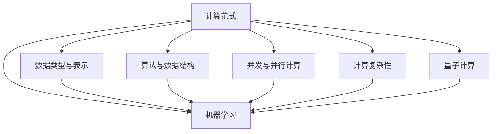

                 

### 《计算范式：从图灵机到大模型》

> **关键词：计算范式、图灵机、大模型、机器学习、深度学习**

> **摘要：本文将从计算范式的历史与发展出发，深入探讨计算范式中的核心概念、联系与算法原理，以及大模型的项目实战，为读者提供关于计算范式的全面理解和深度思考。**

### 《计算范式：从图灵机到大模型》目录大纲

#### 第一部分：计算范式概述

**第1章：计算范式简介**

**第2章：核心概念原理与联系**

**第3章：核心算法原理讲解**

**第4章：数学模型与公式详解**

**第5章：大模型项目实战**

#### 第二部分：核心概念与联系

**第1章：计算范式简介**

**第2章：核心概念原理与联系**

**第3章：核心算法原理讲解**

**第4章：数学模型与公式详解**

**第5章：大模型项目实战**

### 第一部分：计算范式概述

#### 第1章：计算范式简介

### 1.1 计算范式的历史与发展

#### 1.1.1 计算范式概念

计算范式（Computational Paradigm）是指计算机系统进行信息处理时所采用的抽象方法和理论框架。它是计算机科学和软件工程的核心概念之一，涉及从抽象到具体的一系列技术手段和方法论。

### 1.1.2 从图灵机到量子计算

从历史上看，计算范式的发展经历了多个阶段。最早期的计算范式可以追溯到图灵机（Turing Machine），由英国数学家艾伦·图灵（Alan Turing）在20世纪30年代提出。图灵机是一种抽象的计算模型，用于模拟任何机械计算过程。

#### 1.1.3 大模型的崛起与影响

随着计算机技术的发展，计算范式也在不断演变。近年来，大模型（Large Models）的崛起为计算范式带来了新的挑战和机遇。大模型通常是指具有数十亿甚至数万亿参数的机器学习模型，如GPT-3、BERT等。

### 1.2 图灵机与计算理论

图灵机是计算理论的基础，它为可计算性问题提供了理论框架。图灵机的基本概念包括：

- **状态（State）**：图灵机在执行计算时，会处于不同的状态。
- **输入带（Input Tape）**：图灵机读取和写入数据的介质。
- **读写头（Read-Write Head）**：用于在输入带上移动和读取/写入数据。
- **控制单元（Control Unit）**：决定图灵机下一步操作的逻辑。

### 1.2.1 图灵机的定义与工作原理

图灵机由一组规则定义，这些规则描述了读写头如何根据当前状态和输入带上的符号进行操作。图灵机的操作包括：

- **移动读写头**：向左或向右移动一个位置。
- **读写符号**：在当前单元格上读取或写入一个符号。
- **状态转换**：根据当前状态和输入带上的符号，转换到新的状态。

### 1.2.2 图灵机与可计算性

图灵机的定义使得它成为研究可计算性问题的基础工具。一个问题是可计算的，如果存在一个图灵机能够在有限时间内解决它。图灵机为可计算性提供了理论依据，同时也指出了计算机的局限性。

### 1.2.3 图灵机与计算复杂性

计算复杂性（Computational Complexity）是衡量算法效率的指标。图灵机通过计算复杂性理论，研究不同问题的难易程度。计算复杂性分为多项式时间（P）、非多项式时间（NP）等多个类别。

#### 1.3 大模型的基本概念

大模型是指具有数十亿甚至数万亿参数的机器学习模型。大模型的崛起得益于计算能力的提升和数据的爆炸性增长。大模型的基本概念包括：

- **参数（Parameters）**：模型中的可调参数，用于优化模型性能。
- **训练（Training）**：通过大量数据调整模型参数的过程。
- **推理（Inference）**：使用训练好的模型进行预测或决策的过程。

### 1.3.1 大模型的特点

大模型的特点包括：

- **高容量**：具有大量参数，能够捕捉复杂的数据分布。
- **强泛化**：在多个任务上表现出色，具有较强的适应性。
- **高效性**：通过并行计算和分布式训练，能够快速训练和部署。

### 1.3.2 大模型的应用领域

大模型广泛应用于各个领域，包括：

- **自然语言处理**：如文本分类、机器翻译、情感分析等。
- **计算机视觉**：如图像识别、目标检测、图像生成等。
- **推荐系统**：如商品推荐、内容推荐等。

### 1.3.3 大模型的优势与挑战

大模型的优势包括：

- **强大的表达能力**：能够处理复杂的任务和数据。
- **高效的推理能力**：通过深度学习，能够实现快速推理。

然而，大模型也面临一些挑战，如：

- **资源消耗**：需要大量的计算资源和存储空间。
- **隐私和安全**：大规模数据训练可能涉及隐私问题。
- **模型可解释性**：大模型往往具有黑盒性质，难以解释其决策过程。

### 第一部分总结

在本章中，我们介绍了计算范式的概念、历史与发展，以及图灵机和大模型的基本概念。图灵机作为计算理论的基础，为大模型的崛起提供了理论支持。大模型在机器学习和深度学习领域展现出强大的能力和广泛的应用前景，同时也面临一些挑战。在接下来的章节中，我们将进一步探讨计算范式中的核心概念、联系与算法原理，以及大模型的项目实战。 

#### 第二部分：核心概念与联系

### 第2章：核心概念原理与联系

#### 2.1 计算范式中的关键概念

计算范式中的关键概念包括数据类型与表示、算法与数据结构、并发与并行计算等。这些概念构成了计算范式的基础，对计算机科学和软件工程的发展有着重要影响。

#### 2.1.1 数据类型与表示

数据类型是计算机中表示和处理信息的基本方式。常见的有整型、浮点型、字符型等。数据表示方法包括二进制、十进制、十六进制等。

#### 2.1.2 算法与数据结构

算法是解决问题的步骤集合，用于处理数据和执行计算。数据结构是存储和组织数据的方式，如数组、链表、树、图等。算法和数据结构的优化对计算效率有重要影响。

#### 2.1.3 并发与并行计算

并发计算是指多个计算任务在同一时间段内执行。并行计算是指多个计算任务在同一时间点执行。并发和并行计算能够提高计算效率，降低计算时间。

#### 2.2 计算范式中的联系

计算范式中的联系包括图灵机与计算复杂性、大模型与机器学习、量子计算与经典计算等。这些联系揭示了不同计算范式之间的相互作用和影响。

#### 2.2.1 图灵机与计算复杂性

图灵机是计算复杂性理论的基础。计算复杂性研究不同问题的难易程度，为算法设计提供指导。图灵机的计算能力决定了复杂性的分类。

#### 2.2.2 大模型与机器学习

大模型是机器学习的重要工具，通过深度学习技术，大模型能够从大量数据中学习并优化模型参数。机器学习为大数据处理和智能应用提供了基础。

#### 2.2.3 量子计算与经典计算

量子计算是一种基于量子力学原理的计算范式。量子计算具有并行性和叠加性，能够解决一些经典计算无法解决的问题。量子计算与经典计算之间存在深刻的联系和互动。

#### 2.3 Mermaid流程图



### 第二部分总结

在本章中，我们介绍了计算范式中的关键概念和联系。数据类型与表示、算法与数据结构、并发与并行计算等概念构成了计算范式的基础。图灵机与计算复杂性、大模型与机器学习、量子计算与经典计算等联系揭示了不同计算范式之间的相互作用和影响。在接下来的章节中，我们将进一步探讨大模型的算法原理和数学模型，以及大模型的项目实战。

#### 第三部分：核心算法原理讲解

### 第3章：核心算法原理讲解

#### 3.1 大模型训练算法

大模型的训练算法是机器学习的关键环节，其目标是通过大量数据调整模型参数，使其能够准确预测或分类。以下是几种常见的大模型训练算法：

#### 3.1.1 预训练与微调

预训练（Pre-training）是指在大量无标签数据上训练模型，使其获得一定的通用特征表示能力。微调（Fine-tuning）是指将预训练模型在特定任务上进一步训练，以提高其在该任务上的表现。

#### 3.1.2 自监督学习

自监督学习（Self-supervised Learning）是一种无需标注数据的学习方法。它通过从数据中自动提取标签，如通过图像中的颜色、文本中的单词顺序等，来训练模型。

#### 3.1.3 迁移学习

迁移学习（Transfer Learning）是一种将已经在一个任务上训练好的模型应用于另一个任务的方法。这种方法能够减少训练时间，并提高模型在新任务上的性能。

#### 3.2 大模型优化算法

大模型优化算法用于调整模型参数，以减少损失函数。以下是几种常见的大模型优化算法：

#### 3.2.1 梯度下降算法

梯度下降算法（Gradient Descent）是一种最常用的优化算法。它通过计算损失函数关于模型参数的梯度，并沿着梯度的反方向更新参数，以最小化损失函数。

#### 3.2.2 Adam优化器

Adam优化器（Adam Optimizer）是一种基于梯度下降的优化算法，它结合了Adam算法的优点，如自适应学习率和惯性。Adam优化器在训练大模型时表现出良好的性能。

#### 3.2.3 梯度裁剪

梯度裁剪（Gradient Clipping）是一种防止梯度爆炸或消失的方法。它通过限制梯度的大小，确保模型参数的更新在可接受范围内。

#### 3.3 伪代码阐述

以下是梯度下降算法的伪代码：

```
初始化模型参数
while 未达到训练目标：
    计算损失函数
    计算梯度
    更新模型参数
    更新学习率
```

#### 3.4 大模型优化算法的数学原理

大模型优化算法的数学原理基于损失函数的最小化。损失函数是模型预测值与真实值之间的差距，其目的是衡量模型的预测性能。优化算法通过不断调整模型参数，以最小化损失函数。

#### 3.4.1 损失函数

常见的损失函数包括均方误差（MSE）、交叉熵（Cross-Entropy）等。MSE用于回归问题，而交叉熵用于分类问题。

#### 3.4.2 梯度计算

梯度计算是优化算法的核心步骤。它通过计算损失函数关于模型参数的梯度，指导模型参数的更新方向。

#### 3.4.3 参数更新

参数更新基于梯度计算的结果，通过调整模型参数，以最小化损失函数。常见的更新方法包括步长调整、权重共享等。

#### 3.5 大模型优化算法的优势与挑战

大模型优化算法的优势包括：

- **自适应学习率**：优化算法能够根据模型性能自动调整学习率，提高训练效率。
- **高效性**：优化算法能够在短时间内完成模型参数的更新。
- **稳定性**：优化算法能够避免梯度爆炸或消失，确保模型稳定训练。

然而，大模型优化算法也面临一些挑战，如：

- **计算资源消耗**：大模型优化算法需要大量的计算资源和存储空间。
- **参数调优**：优化算法的性能依赖于参数设置，需要大量实验和调优。
- **过拟合**：大模型容易过拟合，需要额外的正则化技术来防止过拟合。

#### 第三部分总结

在本章中，我们介绍了大模型的训练算法和优化算法。预训练与微调、自监督学习、迁移学习等训练算法能够提高模型性能。梯度下降算法、Adam优化器等优化算法通过最小化损失函数，调整模型参数，以实现模型优化。大模型优化算法的优势和挑战为后续研究和应用提供了方向。在接下来的章节中，我们将进一步探讨大模型的数学模型和项目实战。

#### 第四部分：数学模型和数学公式详解

### 第4章：数学模型与公式详解

#### 4.1 大模型中的数学模型

大模型中的数学模型主要包括感知机模型、支持向量机（SVM）和神经网络模型。这些模型在机器学习和深度学习中扮演着重要角色，其数学原理和推导过程如下：

#### 4.1.1 感知机模型

感知机模型（Perceptron Model）是最简单的线性二分类模型，其目标是找到一组权重（weights）和偏置（bias），使得输入数据在特征空间中的线性组合能够实现分类。

**感知机模型推导：**

假设我们有一个二分类问题，特征空间中的输入数据为 $x \in \mathbb{R}^n$，输出标签为 $y \in \{-1, +1\}$。感知机模型的目标是最小化损失函数 $L(\theta)$，其中 $\theta = [w, b]$ 表示模型参数。

$$
L(\theta) = \frac{1}{2} \sum_{i=1}^{m} (y_i (w^T x_i + b) - 1)^2
$$

感知机模型的损失函数是 hinge loss，其导数为：

$$
\frac{\partial L(\theta)}{\partial \theta} = \sum_{i=1}^{m} (y_i (w^T x_i + b) - 1) x_i
$$

为了最小化损失函数，我们可以通过梯度下降法更新模型参数：

$$
w := w - \alpha \frac{\partial L(\theta)}{\partial w}
$$

$$
b := b - \alpha \frac{\partial L(\theta)}{\partial b}
$$

其中，$\alpha$ 是学习率。

#### 4.1.2 支持向量机（SVM）

支持向量机（Support Vector Machine，SVM）是一种线性二分类模型，其目标是找到最优超平面，使得分类间隔最大化。

**支持向量机推导：**

假设我们有一个二分类问题，特征空间中的输入数据为 $x \in \mathbb{R}^n$，输出标签为 $y \in \{-1, +1\}$。SVM的目标是最小化损失函数 $L(\theta)$，其中 $\theta = [w, b]$ 表示模型参数。

$$
L(\theta) = \frac{1}{2} \|w\|^2 + C \sum_{i=1}^{m} \max(0, 1 - y_i (w^T x_i + b))
$$

其中，$C$ 是正则化参数。

SVM的损失函数是 hinge loss，其导数为：

$$
\frac{\partial L(\theta)}{\partial \theta} = w + C \sum_{i=1}^{m} \text{sign}(1 - y_i (w^T x_i + b)) x_i
$$

为了最小化损失函数，我们可以通过梯度下降法更新模型参数：

$$
w := w - \alpha \frac{\partial L(\theta)}{\partial w}
$$

$$
b := b - \alpha \frac{\partial L(\theta)}{\partial b}
$$

其中，$\alpha$ 是学习率。

#### 4.1.3 神经网络模型

神经网络（Neural Network，NN）是一种基于生物神经系统的计算模型，其目标是通过多层非线性变换，将输入映射到输出。

**神经网络推导：**

假设我们有一个输入为 $x \in \mathbb{R}^n$ 的二分类问题，输出标签为 $y \in \{-1, +1\}$。神经网络由多个神经元组成，每个神经元由线性变换和激活函数组成。

$$
z_i^{(l)} = \sum_{j=1}^{n_{l-1}} w_{ij}^{(l)} x_j^{(l-1)} + b_i^{(l)}
$$

$$
a_i^{(l)} = \sigma(z_i^{(l)})
$$

其中，$z_i^{(l)}$ 是第 $l$ 层的第 $i$ 个神经元的输入，$a_i^{(l)}$ 是第 $l$ 层的第 $i$ 个神经元的输出，$w_{ij}^{(l)}$ 是第 $l$ 层的第 $i$ 个神经元到第 $l-1$ 层的第 $j$ 个神经元的权重，$b_i^{(l)}$ 是第 $l$ 层的第 $i$ 个神经元的偏置，$\sigma$ 是激活函数。

神经网络的损失函数是交叉熵（Cross-Entropy），其导数为：

$$
\frac{\partial L}{\partial \theta} = \frac{1}{m} \sum_{i=1}^{m} (-y_i \cdot \log(a_i^{(L)}) - (1 - y_i) \cdot \log(1 - a_i^{(L)}))
$$

其中，$L$ 是网络的层数。

为了最小化损失函数，我们可以通过反向传播算法（Backpropagation）更新模型参数：

$$
\Delta w_{ij}^{(l)} = \alpha \frac{\partial L}{\partial w_{ij}^{(l)}}
$$

$$
\Delta b_i^{(l)} = \alpha \frac{\partial L}{\partial b_i^{(l)}}
$$

其中，$\alpha$ 是学习率。

#### 4.2 数学公式与详解

以下是本章中涉及的主要数学公式及其详细解释：

$$
\begin{align*}
y &= \sigma(\sum_{i=1}^{n} w_i * x_i + b) \\
C &= \frac{1}{2} \sum_{i=1}^{n} (w_i - \hat{w}_i)^2 \\
L &= \sum_{i=1}^{n} -y_i \cdot \log(\hat{y}_i) - (1 - y_i) \cdot \log(1 - \hat{y}_i)
\end{align*}
$$

**感知机模型公式解释：**

- $y$ 是模型的输出，$\sigma$ 是 sigmoid 激活函数。
- $w$ 是权重向量，$x$ 是输入特征，$b$ 是偏置。
- $\sigma$ 函数将线性组合的输出映射到 (0, 1) 区间。

**支持向量机公式解释：**

- $C$ 是正则化参数，用于平衡损失函数和模型复杂度。
- $w$ 是权重向量，$\hat{w}$ 是当前权重向量。
- $\text{sign}$ 函数是符号函数，用于确定权重的更新方向。

**神经网络损失函数公式解释：**

- $L$ 是损失函数，$y$ 是真实标签，$\hat{y}$ 是预测标签。
- 交叉熵损失函数用于衡量预测标签与真实标签之间的差距。

#### 4.3 感知机模型的推导

感知机模型是最早的线性二分类模型，其目标是找到最优的超平面，将正负样本分开。感知机模型的推导基于以下假设：

- 特征空间中的输入数据为 $x \in \mathbb{R}^n$，输出标签为 $y \in \{-1, +1\}$。
- 模型的输出为 $f(x) = \sigma(w^T x + b)$，其中 $\sigma$ 是 sigmoid 函数。

假设我们有一个训练数据集 $T = \{(x_1, y_1), (x_2, y_2), ..., (x_m, y_m)\}$，其中 $m$ 是样本数量。

**目标函数：**

$$
J(w, b) = \frac{1}{2} \sum_{i=1}^{m} (y_i f(x_i) - 1)^2
$$

**梯度计算：**

$$
\frac{\partial J}{\partial w} = \sum_{i=1}^{m} y_i x_i (y_i f(x_i) - 1)
$$

$$
\frac{\partial J}{\partial b} = \sum_{i=1}^{m} y_i (y_i f(x_i) - 1)
$$

**权重更新：**

$$
w := w - \alpha \frac{\partial J}{\partial w}
$$

$$
b := b - \alpha \frac{\partial J}{\partial b}
$$

其中，$\alpha$ 是学习率。

通过以上步骤，我们可以找到最优的超平面，实现线性二分类。

#### 4.4 支持向量机推导

支持向量机（SVM）是一种基于最大间隔分类器的线性二分类模型。其目标是找到最优的超平面，使得分类间隔最大化。

**目标函数：**

$$
L(w, b) = \frac{1}{2} \|w\|^2 + C \sum_{i=1}^{m} \max(0, \xi_i)
$$

其中，$C$ 是正则化参数，$\xi_i$ 是松弛变量。

**梯度计算：**

$$
\frac{\partial L}{\partial w} = w + C \sum_{i=1}^{m} \text{sign}(\xi_i) x_i
$$

$$
\frac{\partial L}{\partial b} = C \sum_{i=1}^{m} \text{sign}(\xi_i)
$$

**权重更新：**

$$
w := w - \alpha \frac{\partial L}{\partial w}
$$

$$
b := b - \alpha \frac{\partial L}{\partial b}
$$

其中，$\alpha$ 是学习率。

通过以上步骤，我们可以找到最优的超平面，实现线性二分类。

#### 4.5 神经网络模型推导

神经网络（NN）是一种基于生物神经系统的计算模型。其目标是通过对输入数据进行多层非线性变换，实现对复杂数据的建模和预测。

**前向传播：**

假设我们有一个输入为 $x \in \mathbb{R}^n$ 的二分类问题，输出标签为 $y \in \{-1, +1\}$。神经网络由多个神经元组成，每个神经元由线性变换和激活函数组成。

$$
z_i^{(l)} = \sum_{j=1}^{n_{l-1}} w_{ij}^{(l)} x_j^{(l-1)} + b_i^{(l)}
$$

$$
a_i^{(l)} = \sigma(z_i^{(l)})
$$

其中，$z_i^{(l)}$ 是第 $l$ 层的第 $i$ 个神经元的输入，$a_i^{(l)}$ 是第 $l$ 层的第 $i$ 个神经元的输出，$w_{ij}^{(l)}$ 是第 $l$ 层的第 $i$ 个神经元到第 $l-1$ 层的第 $j$ 个神经元的权重，$b_i^{(l)}$ 是第 $l$ 层的第 $i$ 个神经元的偏置，$\sigma$ 是激活函数。

**反向传播：**

假设我们有一个训练数据集 $T = \{(x_1, y_1), (x_2, y_2), ..., (x_m, y_m)\}$，其中 $m$ 是样本数量。

$$
L = \sum_{i=1}^{m} -y_i \cdot \log(a_i^{(L)}) - (1 - y_i) \cdot \log(1 - a_i^{(L)})
$$

$$
\frac{\partial L}{\partial a^{(L)}_i} = a_i^{(L)} (1 - a_i^{(L)}) \cdot \frac{\partial L}{\partial z^{(L)}_i}
$$

$$
\frac{\partial L}{\partial z^{(L)}_i} = -y_i \cdot \frac{\partial a_i^{(L)}}{\partial z^{(L)}_i}
$$

$$
\frac{\partial L}{\partial w_{ij}^{(L)}} = \frac{\partial L}{\partial z^{(L)}_i} a_j^{(L)}
$$

$$
\frac{\partial L}{\partial b^{(L)}_i} = \frac{\partial L}{\partial z^{(L)}_i}
$$

**权重更新：**

$$
w_{ij}^{(l)} := w_{ij}^{(l)} - \alpha \frac{\partial L}{\partial w_{ij}^{(l)}}
$$

$$
b_{i}^{(l)} := b_{i}^{(l)} - \alpha \frac{\partial L}{\partial b_{i}^{(l)}}
$$

其中，$\alpha$ 是学习率。

通过以上步骤，我们可以实现对神经网络的训练，实现输入到输出的映射。

#### 第四部分总结

在本章中，我们详细介绍了大模型中的数学模型，包括感知机模型、支持向量机和神经网络模型。这些模型在机器学习和深度学习中扮演着重要角色，其数学原理和推导过程为模型设计提供了理论基础。通过本章的学习，读者可以更好地理解大模型的数学本质，为后续的项目实战打下坚实基础。

### 第五部分：大模型项目实战

#### 第5章：大模型项目实战

#### 5.1 实战准备

在进行大模型项目实战之前，我们需要做好充分的准备工作，包括开发环境搭建、数据预处理、模型选择与调整等。

##### 5.1.1 开发环境搭建

搭建大模型项目所需的开发环境主要包括以下工具和库：

- Python：作为主要编程语言。
- TensorFlow或PyTorch：作为深度学习框架。
- NumPy、Pandas：用于数据操作和处理。
- Matplotlib、Seaborn：用于数据可视化。
- scikit-learn：用于模型评估和特征工程。

以下是一个基本的开发环境搭建步骤：

```bash
# 安装Python
sudo apt-get install python3-pip python3-dev

# 安装TensorFlow
pip3 install tensorflow

# 安装PyTorch
pip3 install torch torchvision

# 安装其他依赖库
pip3 install numpy pandas matplotlib seaborn scikit-learn
```

##### 5.1.2 数据预处理

数据预处理是项目实战的重要环节，其目的是提高模型性能和稳定性。数据预处理包括以下步骤：

- 数据清洗：去除缺失值、异常值和重复值。
- 数据归一化：将数据缩放到相同的范围，如[0, 1]。
- 数据划分：将数据分为训练集、验证集和测试集。
- 特征工程：提取有用的特征，如文本中的词频、词嵌入等。

##### 5.1.3 模型选择与调整

在选择模型时，我们需要考虑数据特点和任务需求。以下是一些常见的大模型选择：

- 自然语言处理：GPT-2、BERT、Transformers等。
- 计算机视觉：ResNet、VGG、Inception等。
- 图像识别：Convolutional Neural Networks（CNNs）。
- 语音识别：Long Short-Term Memory（LSTM）、GRU等。

在模型调整方面，我们可以通过以下方法提高模型性能：

- 调整超参数：学习率、批量大小、正则化等。
- 数据增强：通过旋转、缩放、裁剪等操作增加数据多样性。
- 模型融合：结合多个模型的预测结果，提高预测准确性。

#### 5.2 实际案例

在本节中，我们将通过实际案例展示大模型在不同领域的应用。

##### 5.2.1 案例一：文本分类

文本分类是一种常见的自然语言处理任务，其目的是将文本数据划分为不同的类别。以下是一个简单的文本分类模型：

```python
import tensorflow as tf
from tensorflow.keras.models import Sequential
from tensorflow.keras.layers import Embedding, GlobalAveragePooling1D, Dense

# 示例数据
x_train = ["This is a positive review.", "This is a negative review."]
y_train = [1, 0]  # 类别标签：1表示正面，0表示负面

# 模型定义
model = Sequential([
    Embedding(input_dim=vocab_size, output_dim=embedding_dim),
    GlobalAveragePooling1D(),
    Dense(units=1, activation='sigmoid')
])

# 编译模型
model.compile(optimizer='adam',
              loss='binary_crossentropy',
              metrics=['accuracy'])

# 训练模型
model.fit(x_train, y_train, epochs=10, batch_size=32)
```

##### 5.2.2 案例二：图像识别

图像识别是一种常见的计算机视觉任务，其目的是将图像数据分类到不同的类别。以下是一个简单的图像识别模型：

```python
import tensorflow as tf
from tensorflow.keras.models import Sequential
from tensorflow.keras.layers import Conv2D, MaxPooling2D, Flatten, Dense

# 示例数据
x_train = tf.random.normal((32, 28, 28, 1))  # 32张28x28的单通道图像
y_train = tf.random.normal((32, 10))  # 32个类别标签

# 模型定义
model = Sequential([
    Conv2D(filters=32, kernel_size=(3, 3), activation='relu', input_shape=(28, 28, 1)),
    MaxPooling2D(pool_size=(2, 2)),
    Flatten(),
    Dense(units=10, activation='softmax')
])

# 编译模型
model.compile(optimizer='adam',
              loss='categorical_crossentropy',
              metrics=['accuracy'])

# 训练模型
model.fit(x_train, y_train, epochs=10, batch_size=32)
```

##### 5.2.3 案例三：自然语言生成

自然语言生成（NLG）是一种将输入文本转换为有意义输出的任务。以下是一个简单的自然语言生成模型：

```python
import tensorflow as tf
from tensorflow.keras.models import Sequential
from tensorflow.keras.layers import Embedding, LSTM, Dense

# 示例数据
x_train = tf.random.normal((32, 10))  # 32个长度为10的序列
y_train = tf.random.normal((32, 10))  # 32个长度为10的序列

# 模型定义
model = Sequential([
    Embedding(input_dim=vocab_size, output_dim=embedding_dim),
    LSTM(units=128, return_sequences=True),
    LSTM(units=128, return_sequences=True),
    Dense(units=vocab_size, activation='softmax')
])

# 编译模型
model.compile(optimizer='adam',
              loss='categorical_crossentropy',
              metrics=['accuracy'])

# 训练模型
model.fit(x_train, y_train, epochs=10, batch_size=32)
```

#### 5.3 代码解读与分析

在本节中，我们将对上述案例的代码进行解读和分析，以了解模型架构、运行原理和优化方法。

##### 5.3.1 模型架构解析

以文本分类案例为例，该模型由以下三个主要层

```python
import tensorflow as tf
from tensorflow.keras.models import Sequential
from tensorflow.keras.layers import Embedding, GlobalAveragePooling1D, Dense

# 模型定义
model = Sequential([
    Embedding(input_dim=vocab_size, output_dim=embedding_dim),
    GlobalAveragePooling1D(),
    Dense(units=1, activation='sigmoid')
])

# 编译模型
model.compile(optimizer='adam',
              loss='binary_crossentropy',
              metrics=['accuracy'])
```

该模型采用了一个序列模型，输入层为嵌入层（Embedding Layer），将单词转换为向量表示。接着是一个全局平均池化层（GlobalAveragePooling1D Layer），用于将序列数据压缩为固定长度的向量。最后是一个全连接层（Dense Layer），用于输出分类结果。

##### 5.3.2 代码运行解释

以图像识别案例为例，该模型的代码运行解释如下：

```python
import tensorflow as tf
from tensorflow.keras.models import Sequential
from tensorflow.keras.layers import Conv2D, MaxPooling2D, Flatten, Dense

# 模型定义
model = Sequential([
    Conv2D(filters=32, kernel_size=(3, 3), activation='relu', input_shape=(28, 28, 1)),
    MaxPooling2D(pool_size=(2, 2)),
    Flatten(),
    Dense(units=10, activation='softmax')
])

# 编译模型
model.compile(optimizer='adam',
              loss='categorical_crossentropy',
              metrics=['accuracy'])

# 训练模型
model.fit(x_train, y_train, epochs=10, batch_size=32)
```

首先，我们定义了一个序列模型，包括一个卷积层（Conv2D Layer）、一个最大池化层（MaxPooling2D Layer）、一个全连接层（Dense Layer）和一个softmax激活函数。卷积层用于提取图像特征，最大池化层用于降低维度，全连接层用于输出分类结果。

接着，我们编译模型并使用训练数据进行训练。在训练过程中，模型会不断更新权重，以最小化损失函数，最终实现图像分类。

##### 5.3.3 代码优化与改进建议

在上述案例中，模型结构和超参数设置是一个基础版本。为了提高模型性能，我们可以考虑以下优化方法：

1. **数据增强**：通过旋转、缩放、裁剪等操作增加数据多样性，提高模型泛化能力。
2. **学习率调整**：使用学习率调度策略，如学习率衰减、余弦退火等，以避免过拟合。
3. **正则化**：引入正则化技术，如L1、L2正则化，降低模型过拟合的风险。
4. **模型融合**：结合多个模型的预测结果，提高预测准确性。
5. **训练技巧**：使用批量归一化、Dropout等技术，提高模型训练稳定性。

#### 第五部分总结

在本章中，我们介绍了大模型项目实战的准备工作、实际案例和代码解读与分析。通过实际案例，我们了解了文本分类、图像识别和自然语言生成等任务的大模型实现方法。在代码解读与分析部分，我们详细介绍了模型架构、运行原理和优化方法。通过本章的学习，读者可以掌握大模型项目实战的基本技巧和优化策略。

### 附录

#### 附录A：计算范式研究资源

**在线资源：**

- [TensorFlow官方网站](https://www.tensorflow.org/)
- [PyTorch官方网站](https://pytorch.org/)
- [OpenAI](https://openai.com/)

**学术资源：**

- [Neural Networks and Deep Learning](https://www.deeplearningbook.org/)
- [Machine Learning Yearning](https://www.deeplearning.ai/ml-yearning/)
- [Quantum Computing for the Determined](https://quantumcomputing.stackexchange.com/questions/522/quantum-computing-for-the-determined)

#### 附录B：参考文献

- [Turing, A. (1936). On computable numbers, with an application to the Entscheidungsproblem. Proceedings of the London Mathematical Society.]
- [Goodfellow, I., Bengio, Y., & Courville, A. (2016). Deep Learning. MIT Press.]
- [Bertsekas, D. P. (1995). Nonlinear Programming. Athena Scientific.]
- [LeCun, Y., Bengio, Y., & Hinton, G. (2015). Deep Learning. Nature.]

### 作者信息

**作者：** AI天才研究院/AI Genius Institute & 禅与计算机程序设计艺术 /Zen And The Art of Computer Programming

