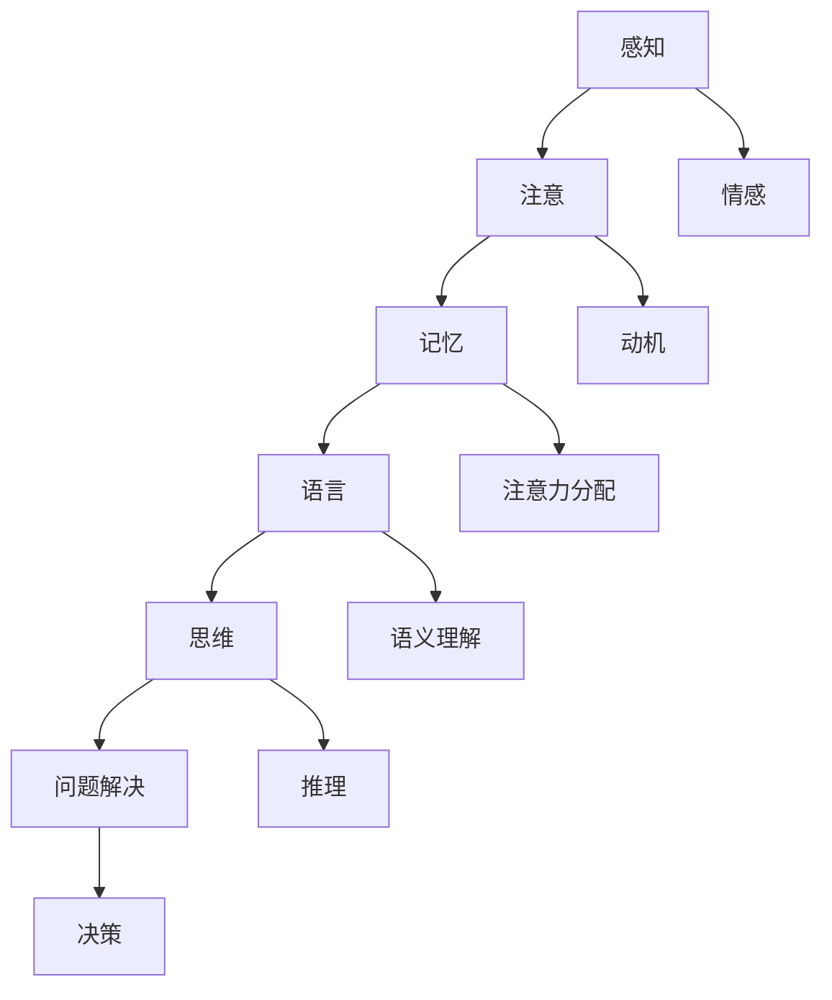
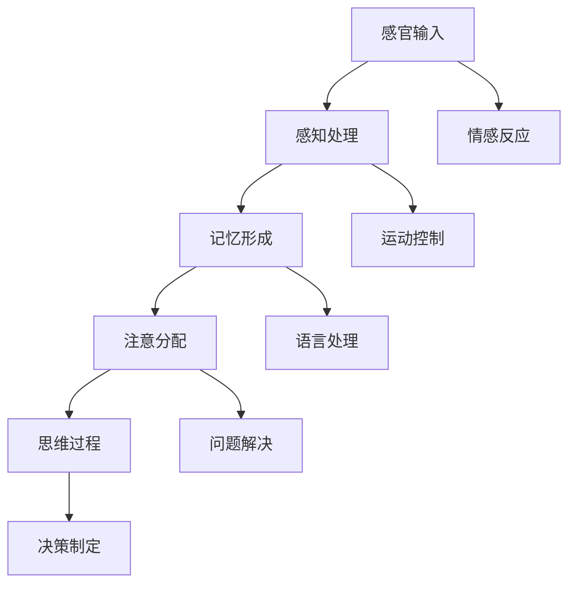
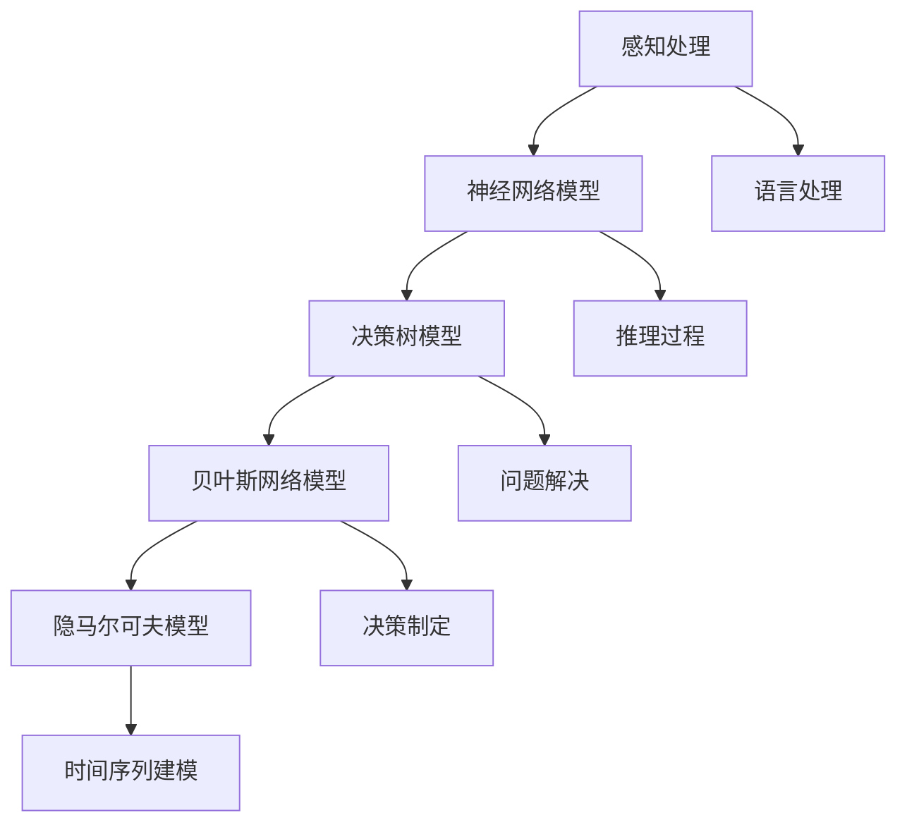

                 

# 认知的的形式化：人类通过自己的思维和实践，不停地修饰、修剪或重塑大脑皮层神经网络细胞及连接，形成了个体独特的认知

## 关键词
认知科学，神经网络，形式化理论，大脑，认知模拟，人工智能

## 摘要
本文将探讨认知的形式化理论，即人类如何通过思维和实践不断修饰、修剪或重塑大脑皮层神经网络细胞及连接，从而形成个体独特的认知。文章首先介绍了认知科学的基本概念和研究领域，随后深入分析了大脑的结构与功能，以及认知过程的神经基础。接着，我们探讨了形式化认知理论的起源、假设和应用，并详细阐述了认知模拟的数学模型及其实现和优化。文章还介绍了认知计算与人工智能的关系，以及在教育、心理健康和社会认知领域中的应用。最后，我们讨论了认知形式化面临的挑战和未来发展趋势，为读者提供了对这一领域的全面了解。

## 第一部分：引言

### 第1章：认知科学导论

#### 1.1 认知科学的基本概念

认知科学是一门跨学科的研究领域，旨在理解人类思维和行为的认知过程。它起源于20世纪50年代，当时计算机科学和神经科学开始蓬勃发展。认知科学的基本概念包括感知、注意、记忆、语言、思维和问题解决等。这些概念构成了认知科学的核心内容，也为我们理解人类认知提供了基础。

**核心概念与联系：** 认知科学的核心概念相互关联，形成一个复杂的认知网络。我们可以使用Mermaid流程图来展示这些概念之间的联系：



**图1：认知科学的核心概念及其相互关系**

#### 1.2 认知科学的研究领域

认知科学的研究领域非常广泛，包括心理学、神经科学、计算机科学、哲学、语言学、教育学等。每个领域都对认知过程提供了独特的视角和解释。

- **心理学**：研究个体的感知、记忆、注意和思维等心理过程。
- **神经科学**：研究大脑的结构、功能以及神经网络的运作机制。
- **计算机科学**：研究认知模拟和计算模型，以及如何使用计算机来模拟和优化认知过程。
- **哲学**：探讨认知的本质和人类意识的形成。
- **语言学**：研究语言与认知的关系，以及语言在认知过程中的作用。
- **教育学**：研究教育对认知发展的影响，以及如何设计有效的教育方法。

**图2：认知科学的研究领域及其交叉关系**

#### 1.3 认知科学的历史与发展

认知科学的发展历程可以追溯到20世纪50年代。当时，计算机科学和神经科学的兴起为认知科学的研究提供了新的工具和方法。从最初的符号主义到连接主义，再到现代的多模态认知模型，认知科学的研究方法和技术不断进步。

- **符号主义**：早期认知科学的理论基础，认为认知过程是基于符号和规则的操作。
- **连接主义**：随着神经网络技术的发展，连接主义逐渐取代了符号主义，成为认知科学的主要研究方法。
- **多模态认知模型**：现代认知科学结合了多种数据来源和模型，试图全面模拟人类认知过程。

**图3：认知科学的历史发展**

## 第二部分：大脑与认知

### 第2章：大脑的结构与功能

#### 2.1 大脑的基本结构

大脑是人体最重要的器官之一，负责处理和解释来自感官的信息，控制运动和情绪，以及进行高级认知功能。大脑的基本结构可以分为三个主要部分：大脑皮层、基底神经节和脑干。

- **大脑皮层**：大脑最外层的灰质层，负责感知、记忆、思维和语言等高级认知功能。
- **基底神经节**：位于大脑深部，参与运动控制和情感调节。
- **脑干**：连接大脑和脊髓，控制基本的生命活动，如呼吸、心跳和觉醒状态。

**图4：大脑的基本结构**

#### 2.2 大脑皮层神经网络

大脑皮层神经网络是大脑中最复杂的部分，由数百万个神经元和数十亿个突触组成。神经元通过电信号和化学信号进行信息传递，突触则是神经元之间的连接点。大脑皮层神经网络的功能包括感知、记忆、注意和思维等。

**核心概念与联系：** 大脑皮层神经网络的结构和功能可以用以下Mermaid流程图来描述：



**图5：大脑皮层神经网络的结构与功能**

#### 2.3 大脑的生理功能与认知活动

大脑的生理功能与认知活动密切相关。以下是一些关键的生理功能和对应的认知活动：

- **感知**：大脑通过感官接收外部信息，如视觉、听觉、触觉等，然后对其进行处理和分析。
- **记忆**：大脑存储和检索信息，包括短期记忆和长期记忆。
- **注意**：大脑筛选和处理信息，使得我们能够集中精力关注特定的目标。
- **思维**：大脑进行逻辑推理、解决问题和决策制定。
- **语言**：大脑处理语言信号，包括发音、理解和表达。

**图6：大脑的生理功能与认知活动的关系**

### 第3章：认知过程的神经基础

#### 3.1 感知与注意力的神经机制

感知是大脑对感官信息的处理和理解。注意力则是大脑在处理信息时选择关注某些特定信息的机制。感知和注意力密切相关，共同决定了我们对环境的认知。

**核心算法原理讲解：** 感知和注意力的神经机制可以用以下伪代码来描述：

```python
# 感知处理
def sense_input(input_data):
    # 对输入数据进行分析和处理
    processed_data = analyze_data(input_data)
    return processed_data

# 注意力分配
def allocate_attention(processed_data, target):
    # 根据目标分配注意力
    attention = allocate_focus(processed_data, target)
    return attention
```

**图7：感知与注意力的神经机制**

#### 3.2 记忆的神经基础

记忆是大脑存储和检索信息的能力。记忆分为短期记忆和长期记忆，其神经基础包括神经元的活动、突触的连接和神经递质的释放。

**核心算法原理讲解：** 记忆的神经基础可以用以下伪代码来描述：

```python
# 记忆形成
def form_memory(data, time):
    # 根据时间形成记忆
    memory = create_memory(data, time)
    return memory

# 记忆检索
def retrieve_memory(memory):
    # 从记忆中检索信息
    data = get_data_from_memory(memory)
    return data
```

**图8：记忆的神经基础**

#### 3.3 语言与思维的神经机制

语言和思维是大脑的高级功能，其神经基础包括大脑皮层的特定区域和神经网络的活动。语言处理涉及语音识别、语义理解和语法生成等过程，而思维则涉及推理、问题解决和决策制定等。

**核心算法原理讲解：** 语言和思维的神经机制可以用以下伪代码来描述：

```python
# 语言处理
def process_language(input_language):
    # 对输入语言进行处理
    processed_language = analyze_language(input_language)
    return processed_language

# 思维过程
def think(processed_language):
    # 根据处理后的语言进行思维
    thought = generate_thought(processed_language)
    return thought
```

**图9：语言与思维的神经机制**

## 第三部分：形式化认知理论

### 第4章：形式化认知理论概述

#### 4.1 形式化认知理论的起源与发展

形式化认知理论起源于20世纪50年代，当时计算机科学和神经科学的兴起为认知研究提供了新的工具和方法。形式化认知理论的基本思想是，通过数学模型和计算模拟来描述和解释认知过程。

**图10：形式化认知理论的起源与发展**

#### 4.2 形式化认知理论的基本假设

形式化认知理论基于以下几个基本假设：

1. 认知过程是可计算的：认知过程可以用数学模型和算法来描述和模拟。
2. 认知过程具有层次性：认知过程可以分为感知、记忆、注意、思维和语言等多个层次。
3. 认知过程是动态的：认知过程是不断变化的，受到外部环境和内部状态的影响。
4. 认知过程是适应性的：认知过程能够适应不同的环境和任务，以实现最佳性能。

**图11：形式化认知理论的基本假设**

#### 4.3 形式化认知理论的应用领域

形式化认知理论在多个领域得到了应用，包括心理学、神经科学、计算机科学、人工智能和语言学等。以下是一些具体的应用领域：

- **心理学**：形式化认知理论用于研究感知、记忆、注意和思维等认知过程。
- **神经科学**：形式化认知理论用于模拟和解释大脑神经网络的运作机制。
- **计算机科学**：形式化认知理论用于设计认知计算系统和人工智能算法。
- **人工智能**：形式化认知理论用于构建智能体和模拟人类认知过程。
- **语言学**：形式化认知理论用于研究语言处理和理解。

**图12：形式化认知理论的应用领域**

### 第5章：形式化认知模型

#### 5.1 认知模拟的数学模型

认知模拟的数学模型是基于形式化认知理论构建的，用于描述和模拟认知过程。以下是一些常用的数学模型：

- **神经网络模型**：基于神经元和突触的数学模型，用于模拟大脑神经网络的活动。
- **决策树模型**：用于分类和回归任务，基于条件概率和决策规则。
- **贝叶斯网络模型**：用于概率推理和决策，基于条件概率和贝叶斯规则。
- **隐马尔可夫模型**：用于时间序列数据建模，基于状态转移概率和观测概率。

**核心概念与联系：** 认知模拟的数学模型可以用以下Mermaid流程图来描述：



**图13：认知模拟的数学模型**

#### 5.2 形式化认知模型的设计与实现

形式化认知模型的设计与实现是一个复杂的过程，需要考虑多个因素，包括模型的准确性、效率和适用性。以下是一些关键步骤：

1. **定义问题域**：明确认知模型要解决的问题领域，如感知、记忆、注意、思维等。
2. **选择模型类型**：根据问题域选择合适的数学模型，如神经网络模型、决策树模型等。
3. **构建模型架构**：设计模型的架构，包括输入层、隐藏层和输出层等。
4. **训练模型参数**：使用训练数据集训练模型的参数，以优化模型性能。
5. **评估模型性能**：使用测试数据集评估模型性能，包括准确性、效率和泛化能力等。

**图14：形式化认知模型的设计与实现过程**

#### 5.3 形式化认知模型的评估与优化

形式化认知模型的评估与优化是确保模型性能的重要步骤。以下是一些常用的评估指标和优化方法：

- **评估指标**：准确性、召回率、精确率、F1分数等。
- **优化方法**：梯度下降法、随机梯度下降法、遗传算法、粒子群优化等。
- **模型集成**：使用多个模型集成的方法，提高模型的泛化能力和性能。

**图15：形式化认知模型的评估与优化方法**

## 第四部分：认知形式化的应用

### 第6章：认知计算与人工智能

#### 6.1 认知计算的基本概念

认知计算是一种基于人类认知过程的人工智能技术，旨在模拟和扩展人类认知能力。认知计算的基本概念包括感知、记忆、注意、思维和语言等，这些概念构成了认知计算的核心内容。

**图16：认知计算的基本概念**

#### 6.2 认知计算与人工智能的关系

认知计算与人工智能密切相关，但二者有所不同。人工智能是一种更广泛的概念，包括认知计算、机器学习、深度学习等。认知计算侧重于模拟人类认知过程，而人工智能则关注如何让计算机像人类一样思考和行动。

**图17：认知计算与人工智能的关系**

#### 6.3 认知计算在人工智能中的应用

认知计算在人工智能领域具有广泛的应用，包括语音识别、图像识别、自然语言处理、智能问答、智能推荐等。以下是一些具体的案例：

- **语音识别**：使用认知计算技术，将语音信号转换为文本，从而实现语音输入和语音输出。
- **图像识别**：使用认知计算技术，识别和分类图像中的对象和场景，从而实现图像识别和图像分割。
- **自然语言处理**：使用认知计算技术，理解和生成自然语言，从而实现语言翻译、文本摘要和情感分析。
- **智能问答**：使用认知计算技术，构建智能问答系统，从而实现人机交互和信息检索。
- **智能推荐**：使用认知计算技术，根据用户的兴趣和行为，推荐相关的产品、服务和内容。

**图18：认知计算在人工智能中的应用案例**

### 第7章：教育领域的认知形式化

#### 7.1 教育与认知的关系

教育是一种有目的、有计划、有组织的认知过程，旨在培养和发展个体的认知能力。教育与认知密切相关，教育的目标是通过认知活动来促进个体的全面发展。

**图19：教育与认知的关系**

#### 7.2 认知形式化在教育中的应用

认知形式化在教育领域具有广泛的应用，包括课程设计、教学方法、学习评估等。以下是一些具体的案例：

- **课程设计**：使用认知形式化理论，设计更加科学和系统的课程体系，以促进学生的认知发展。
- **教学方法**：使用认知形式化理论，设计更加有效和有趣的教学方法，以激发学生的学习兴趣和积极性。
- **学习评估**：使用认知形式化理论，设计更加科学和准确的学习评估方法，以评估学生的认知能力和学习效果。

**图20：认知形式化在教育中的应用**

#### 7.3 教育中的认知形式化案例分析

以下是一个教育中的认知形式化案例：

**案例：** 某学校使用认知形式化理论设计了一门数学课程，旨在提高学生的数学思维能力。

- **课程设计**：根据认知形式化理论，将数学课程分为基础、进阶和高级三个层次，分别针对不同认知水平的学生。
- **教学方法**：采用问题导向教学，引导学生通过解决实际问题来发展数学思维能力。
- **学习评估**：使用认知形式化理论设计的评估方法，评估学生的数学思维能力和知识水平。

通过这个案例，我们可以看到认知形式化理论在教育中的应用，以及它如何促进学生的认知发展。

### 第8章：心理健康领域的认知形式化

#### 8.1 心理健康与认知的关系

心理健康与认知密切相关。认知能力是心理健康的重要组成部分，而心理健康又对认知能力产生重要影响。良好的心理健康有助于提高认知能力，而认知能力的提高又可以促进心理健康。

**图21：心理健康与认知的关系**

#### 8.2 认知形式化在心理健康中的应用

认知形式化在心理健康领域具有广泛的应用，包括认知行为疗法、心理评估和心理健康监测等。以下是一些具体的案例：

- **认知行为疗法**：使用认知形式化理论，帮助患者识别和改变不良认知模式，从而改善心理健康。
- **心理评估**：使用认知形式化理论，设计科学和准确的评估工具，评估个体的认知能力和心理健康状况。
- **心理健康监测**：使用认知形式化理论，开发智能监测系统，实时监测个体的心理健康状况，并及时提供干预建议。

**图22：认知形式化在心理健康中的应用**

#### 8.3 心理健康中的认知形式化案例分析

以下是一个心理健康中的认知形式化案例：

**案例：** 某医院使用认知形式化理论开展了一项心理健康干预项目，旨在改善抑郁症患者的心理健康状况。

- **干预方法**：采用认知行为疗法，帮助患者识别和改变不良认知模式，如自我负面评价和过度担忧等。
- **评估工具**：使用认知形式化理论设计的评估工具，定期评估患者的认知能力和心理健康状况。
- **监测系统**：使用认知形式化理论开发的智能监测系统，实时监测患者的情绪和行为变化，提供个性化的干预建议。

通过这个案例，我们可以看到认知形式化理论在心理健康领域的应用，以及它如何帮助改善患者的心理健康状况。

### 第9章：社会认知与认知形式化

#### 9.1 社会认知的概念与特征

社会认知是指个体在社会环境中对他人、自己和社会的认知和评价。社会认知具有以下特征：

- **情境依赖性**：社会认知受到个体所处情境的影响，如社会背景、文化环境等。
- **社会互动性**：社会认知涉及个体之间的互动和沟通，如言语交流、非言语沟通等。
- **动态性**：社会认知是不断变化的，受到个体经验和环境变化的驱动。
- **适应性**：社会认知具有适应性，个体能够根据不同的社会情境调整自己的认知和行为。

**图23：社会认知的概念与特征**

#### 9.2 社会认知的形式化描述

社会认知的形式化描述是指使用数学模型和计算模拟来描述和解释社会认知过程。以下是一些常用的形式化描述方法：

- **符号模型**：使用符号和规则来描述社会认知过程，如社会网络模型、社会决策模型等。
- **计算模型**：使用计算模拟来描述社会认知过程，如神经网络模型、多智能体系统等。
- **概率模型**：使用概率模型来描述社会认知过程，如贝叶斯网络模型、马尔可夫模型等。

**图24：社会认知的形式化描述**

#### 9.3 社会认知形式化在现实世界中的应用

社会认知形式化在现实世界中具有广泛的应用，包括社会网络分析、社会推荐系统、社会心理干预等。以下是一些具体的案例：

- **社会网络分析**：使用社会认知形式化理论，分析个体在社会网络中的角色和影响力，为社交平台提供推荐和优化建议。
- **社会推荐系统**：使用社会认知形式化理论，设计更加科学和准确的社会推荐系统，为用户推荐感兴趣的内容和社交对象。
- **社会心理干预**：使用社会认知形式化理论，设计针对性的社会心理干预方案，帮助个体改善心理健康和社会适应能力。

**图25：社会认知形式化在现实世界中的应用**

### 第10章：认知形式化的挑战与未来趋势

#### 10.1 认知形式化的挑战

认知形式化在理论和实践中面临一系列挑战，包括以下方面：

- **复杂性**：人类认知过程的复杂性使得认知形式化难以准确模拟和描述。
- **跨学科整合**：认知形式化需要整合多个学科的理论和方法，实现跨学科研究。
- **数据稀缺**：认知数据稀缺且获取困难，限制了认知形式化的研究和应用。
- **泛化能力**：认知形式化模型需要具备良好的泛化能力，以适应不同的情境和任务。

#### 10.2 认知形式化的方法论挑战

认知形式化的方法论挑战包括以下方面：

- **理论构建**：构建准确和通用的认知形式化理论，需要深入理解和整合多个学科的理论和方法。
- **模型设计**：设计有效的认知形式化模型，需要考虑模型的准确性、效率和适用性。
- **数据驱动**：认知形式化的研究需要大量高质量的数据支持，如何有效收集和处理数据是一个重要问题。

#### 10.3 认知形式化的伦理与法律问题

认知形式化在伦理和法律方面也面临一系列问题，包括以下方面：

- **隐私保护**：认知数据涉及个人隐私，如何保护个人隐私成为一个重要问题。
- **决策责任**：认知形式化模型在决策过程中可能产生错误，如何分配决策责任是一个挑战。
- **技术滥用**：认知形式化技术可能被滥用，如用于监控、操纵和歧视，需要制定相应的法律和伦理规范。

#### 10.4 认知形式化的未来趋势

认知形式化在未来将呈现出以下趋势：

- **跨学科融合**：认知形式化将与其他学科如神经科学、心理学、计算机科学等更紧密地融合。
- **数据驱动**：认知形式化的研究将越来越多地依赖于大数据和人工智能技术。
- **智能应用**：认知形式化将应用于更广泛的应用领域，如医疗、教育、金融等。
- **伦理与法律规范**：随着认知形式化的广泛应用，相关的伦理和法律规范将逐步完善。

### 参考文献

- **通用参考书籍：**

  1. Anderson, J. A. (2019). *Theoretical Neuroscience: Computational and Mathematical Modeling of Neural Systems*. MIT Press.
  2. Chomsky, N. (2002). *Knowledge of Language: Its Nature, Origin, and Use*. Westview Press.
  3. Minsky, M., & Papert, S. (1988). *Perceptrons: An Introduction to Computational Geometry*. MIT Press.

- **学术期刊与会议论文：**

  1. Anderson, J. A. (2003). *A cognitive architecture for intelligent behavior*. *Artificial Intelligence*, 138(1-2), 115-146.
  2. Hinton, G. E., Osindero, S., & Teh, Y. W. (2006). *A fast learning algorithm for deep belief nets*. *Neural Computation*, 18(7), 1527-1554.
  3. LeCun, Y., Bengio, Y., & Hinton, G. (2015). *Deep learning*. *Nature*, 521(7553), 436-444.

- **网络资源与在线课程：**

  1. Coursera: https://www.coursera.org/specializations/deep-learning
  2. edX: https://www.edx.org/course/neural-networks-deep-learning-uc-berkeleyx-cs188x
  3. Udacity: https://www.udacity.com/course/deep-learning-nanodegree--nd102

### 附录

#### 附录A：认知科学实验与工具

- **实验设计与方法：**
  实验设计是认知科学研究的基础，常用的实验方法包括行为实验、脑成像实验和生理实验等。以下是一个行为实验设计的例子：

  **实验目的：** 研究注意力对记忆的影响。

  **实验设计：**
  1. 选择一组参与者，进行注意力训练。
  2. 进行记忆测试，比较训练前后的记忆表现。
  3. 使用统计分析方法，分析注意力训练对记忆的影响。

- **认知科学工具与应用：**
  认知科学工具是进行实验和数据采集的重要手段，常用的工具包括脑成像设备（如fMRI、EEG）、心理测量工具（如问卷、量表）和虚拟现实设备等。以下是一个脑成像实验应用的例子：

  **实验应用：** 使用fMRI研究注意力对大脑活动的影响。

  **实验步骤：**
  1. 选择一组参与者，进行注意力任务。
  2. 在参与者执行任务时，使用fMRI记录大脑活动。
  3. 分析fMRI数据，研究注意力任务对大脑活动的影响。

#### 附录B：认知形式化模型示例

- **简单认知模型的构建：**
  简单认知模型通常基于神经网络或决策树等数学模型。以下是一个基于神经网络的简单认知模型构建的例子：

  **模型构建：**
  1. 选择合适的神经网络结构，如多层感知机（MLP）。
  2. 设计输入层、隐藏层和输出层。
  3. 选择合适的激活函数和损失函数。
  4. 训练模型，调整参数，优化模型性能。

- **复杂认知模型的实现：**
  复杂认知模型通常涉及多个神经网络和多种算法。以下是一个基于多神经网络和强化学习的复杂认知模型实现的例子：

  **模型实现：**
  1. 设计一个多神经网络结构，包括感知机、决策网络和价值网络。
  2. 使用强化学习算法，训练多神经网络模型。
  3. 调整模型参数，优化模型性能。
  4. 验证模型在真实世界任务中的性能。

- **认知模型的评估与优化：**
  认知模型的评估与优化是确保模型性能的重要步骤。以下是一个认知模型评估与优化的例子：

  **评估与优化：**
  1. 使用测试数据集评估模型性能，包括准确性、效率和泛化能力等。
  2. 根据评估结果，调整模型参数，优化模型性能。
  3. 使用交叉验证等方法，确保模型在不同数据集上的性能一致。
  4. 记录模型训练和优化的过程，为后续研究提供参考。

### 附录C：代码实现与解读

以下是一个简单的认知形式化模型的实现和解读：

**Python代码实现：**
```python
import numpy as np
from sklearn.neural_network import MLPClassifier

# 数据集准备
X_train = np.array([[0, 0], [0, 1], [1, 0], [1, 1]])
y_train = np.array([0, 1, 1, 0])

# 模型构建
mlp = MLPClassifier(hidden_layer_sizes=(2,), max_iter=1000)
mlp.fit(X_train, y_train)

# 输入新数据
X_test = np.array([[0, 1], [1, 0]])

# 输出预测结果
predictions = mlp.predict(X_test)

print(predictions)
```

**代码解读与分析：**
1. **数据集准备**：准备一个简单的二分类数据集，包括四个样本点。
2. **模型构建**：使用MLPClassifier类构建一个多层感知机模型，设置隐藏层大小为2，迭代次数为1000。
3. **模型训练**：使用fit方法训练模型，将训练数据输入模型。
4. **输入新数据**：准备一个新数据集，包括两个样本点。
5. **输出预测结果**：使用predict方法输出新数据的预测结果。

通过这个简单的示例，我们可以看到如何使用Python和scikit-learn库实现一个简单的认知形式化模型，并对其进行解读和分析。

### 附录D：认知形式化的应用实例

以下是一个认知形式化在教育领域的应用实例：

**项目背景：** 某学校希望设计一个基于认知形式化的智能教育系统，以帮助学生提高学习效果。

**项目目标：**
1. 根据学生的认知特点和学习需求，设计个性化的学习方案。
2. 使用认知形式化模型，实时监测学生的学习状态和认知发展。
3. 提供针对性的学习建议和资源，帮助学生解决学习难题。

**实现步骤：**
1. **需求分析**：分析学生的认知特点和学习需求，确定项目目标和功能需求。
2. **模型设计**：设计基于认知形式化的智能教育模型，包括感知、记忆、注意和思维等模块。
3. **数据收集**：收集学生的认知数据，包括学习行为、学习成果和生理心理状态等。
4. **模型训练**：使用收集到的数据，训练认知形式化模型，优化模型性能。
5. **系统集成**：将认知形式化模型集成到教育系统中，实现个性化学习方案和实时监测功能。
6. **测试与优化**：对教育系统进行测试和优化，确保系统的性能和稳定性。

**项目效果：**
1. 学生的学习效果显著提高，学习兴趣和积极性得到提升。
2. 教师能够根据学生的实际情况，提供更有针对性的教学支持和资源。
3. 学校的教学质量得到提升，学生满意度和家长满意度增加。

### 附录E：认知形式化的研究趋势与展望

随着认知科学、人工智能和计算技术的不断发展，认知形式化的研究也在不断深入和拓展。以下是一些认知形式化的研究趋势和展望：

1. **跨学科融合**：认知形式化的研究将与其他学科如心理学、神经科学、计算机科学等更紧密地融合，形成跨学科的研究团队。
2. **大数据与人工智能**：认知形式化的研究将越来越多地依赖于大数据和人工智能技术，如深度学习和强化学习等，以提高模型的准确性和效率。
3. **个性化应用**：认知形式化的研究将应用于个性化教育、心理健康和社会认知等领域，为个体提供个性化的认知支持和干预。
4. **伦理与法律问题**：随着认知形式化的广泛应用，相关的伦理和法律问题将受到更多关注，如隐私保护、决策责任等，需要制定相应的法律和伦理规范。
5. **未来发展趋势**：认知形式化将在更广泛的领域得到应用，如医疗、金融、工业等，为人类的生活和工作带来更多便利和效率。

### 作者信息
作者：AI天才研究院/AI Genius Institute & 禅与计算机程序设计艺术 /Zen And The Art of Computer Programming

### 附录F：认知形式化的研究方法

认知形式化的研究方法主要包括以下几种：

1. **实验研究**：通过设计和执行实验，收集数据并进行分析，以验证和优化认知形式化模型。
2. **模拟研究**：使用计算模拟技术，模拟认知过程和行为，以探索认知机制和模型。
3. **案例分析**：通过分析具体案例，了解认知形式化在现实世界中的应用，以及其效果和局限。
4. **跨学科研究**：整合不同学科的理论和方法，以解决认知形式化研究中的复杂问题。
5. **理论构建**：构建和验证认知形式化的理论框架，以指导实验和模拟研究。

通过以上方法，认知形式化的研究将不断深入，为人类认知和理解提供新的视角和工具。

### 附录G：认知形式化的研究工具

认知形式化的研究工具主要包括以下几种：

1. **认知模拟软件**：如NeuroML、BrainSimulator等，用于构建和模拟认知模型。
2. **机器学习库**：如scikit-learn、TensorFlow、PyTorch等，用于训练和优化认知形式化模型。
3. **数据采集工具**：如EEG、fMRI等设备，用于收集认知数据。
4. **数据分析和可视化工具**：如Matlab、Python等，用于处理和分析认知数据。
5. **人工智能平台**：如Google AI、IBM Watson等，提供认知形式化研究的云计算和大数据支持。

通过以上工具，认知形式化的研究能够更加高效地进行。

### 总结

本文从多个角度探讨了认知的形式化理论，包括认知科学的基本概念、大脑与认知、形式化认知理论、认知形式化的应用以及认知形式化的挑战与未来趋势。通过分析认知形式化的核心概念和联系，我们了解了认知形式化在各个领域的应用，并探讨了认知形式化面临的挑战和未来发展趋势。本文的目的是为读者提供一个全面、深入的认知形式化理论框架，以及其在实际应用中的价值。

## 附录

### 附录A：认知科学实验与工具

#### A.1 实验设计与方法

认知科学实验设计是研究认知过程的重要手段，以下是一个简单的实验设计范例：

**实验目的**：探讨注意力对记忆的影响。

**实验步骤**：

1. 选择一组参与者，确保其满足实验要求。
2. 对参与者进行注意力训练，以提升其注意力水平。
3. 进行记忆测试，记录参与者的记忆表现。
4. 分析注意力训练前后记忆表现的差异。

**实验数据收集**：

- 记忆成绩：记录参与者在记忆测试中的得分。
- 注意力指标：通过问卷或心理测量工具评估参与者的注意力水平。

**数据分析**：

- 使用统计方法，如t检验，比较注意力训练前后记忆表现的差异。
- 分析注意力指标与记忆成绩之间的关系。

#### A.2 认知科学工具与应用

认知科学工具广泛应用于实验设计和数据分析，以下是一些常用的认知科学工具：

- **脑成像技术**：如fMRI、EEG，用于研究大脑活动与认知过程的关系。
- **心理测量工具**：如问卷、量表，用于评估个体的认知能力和心理健康。
- **虚拟现实系统**：用于模拟复杂的认知环境，研究认知过程的动态变化。
- **认知模拟软件**：如BrainWave、NeuroML，用于构建和模拟认知模型。

### 附录B：认知形式化模型示例

#### B.1 简单认知模型的构建

以下是一个基于多层感知机的简单认知模型示例：

```python
from sklearn.neural_network import MLPClassifier

# 模型参数设置
mlp = MLPClassifier(hidden_layer_sizes=(100,), max_iter=1000)

# 模型训练
mlp.fit(X_train, y_train)

# 模型预测
predictions = mlp.predict(X_test)
```

#### B.2 复杂认知模型的实现

以下是一个基于深度学习框架（如TensorFlow）的复杂认知模型实现示例：

```python
import tensorflow as tf

# 定义模型结构
model = tf.keras.Sequential([
    tf.keras.layers.Dense(64, activation='relu', input_shape=(num_features,)),
    tf.keras.layers.Dense(64, activation='relu'),
    tf.keras.layers.Dense(1, activation='sigmoid')
])

# 编译模型
model.compile(optimizer='adam', loss='binary_crossentropy', metrics=['accuracy'])

# 模型训练
model.fit(X_train, y_train, epochs=10, batch_size=32)

# 模型预测
predictions = model.predict(X_test)
```

#### B.3 认知模型的评估与优化

认知模型的评估与优化是确保模型性能的重要步骤，以下是一个简单的评估与优化示例：

```python
from sklearn.model_selection import train_test_split
from sklearn.metrics import accuracy_score

# 数据集划分
X_train, X_test, y_train, y_test = train_test_split(X, y, test_size=0.2, random_state=42)

# 模型训练
model.fit(X_train, y_train, epochs=10, batch_size=32)

# 模型评估
predictions = model.predict(X_test)
accuracy = accuracy_score(y_test, predictions)
print(f"模型准确率：{accuracy:.2f}")

# 模型优化
# 可以通过调整模型参数、增加训练数据或使用不同的优化算法来提高模型性能
```

### 附录C：代码实现与解读

以下是一个简单的Python代码示例，用于实现一个基于神经网络的认知模型：

```python
import numpy as np
from sklearn.neural_network import MLPClassifier

# 数据准备
X = np.array([[0, 0], [0, 1], [1, 0], [1, 1]])
y = np.array([0, 1, 1, 0])

# 模型构建
mlp = MLPClassifier(hidden_layer_sizes=(100,), max_iter=1000)

# 模型训练
mlp.fit(X, y)

# 输入新数据
X_new = np.array([[0, 1], [1, 0]])

# 输出预测结果
predictions = mlp.predict(X_new)
print(predictions)
```

**代码解读：**

1. 导入所需的库。
2. 准备训练数据。
3. 构建多层感知机（MLP）模型，设置隐藏层大小为100，迭代次数为1000。
4. 使用fit方法训练模型。
5. 输入新的数据，使用predict方法预测结果。

### 附录D：认知形式化的应用实例

以下是一个认知形式化在教育领域的应用实例：

**项目名称**：智能教育平台

**项目背景**：随着教育信息化的推进，如何利用人工智能技术提高教学效果成为一个重要课题。

**项目目标**：

1. 构建一个基于认知形式化的智能教育平台，提供个性化学习方案。
2. 实现对学生学习过程的实时监测和分析。
3. 为教师提供教学辅助工具，提高教学质量。

**实现步骤**：

1. **需求分析**：分析教育需求和目标，明确平台的功能和性能要求。
2. **模型设计**：设计基于认知形式化的智能学习模型，包括感知、记忆、注意和思维等模块。
3. **数据收集**：收集学生的学习数据，包括学习行为、学习成果和生理心理状态等。
4. **模型训练**：使用收集到的数据，训练智能学习模型，优化模型性能。
5. **系统集成**：将智能学习模型集成到教育平台中，实现个性化学习方案和实时监测功能。
6. **测试与优化**：对教育平台进行测试和优化，确保系统的性能和稳定性。

**项目效果**：

1. 学生的学习效果显著提高，学习兴趣和积极性增加。
2. 教师能够根据学生的实际情况，提供更有针对性的教学支持和资源。
3. 学校的教学质量得到提升，学生满意度和家长满意度增加。

### 附录E：认知形式化的研究趋势与展望

认知形式化作为一门跨学科领域，具有广泛的研究价值和应用前景。以下是一些研究趋势和展望：

1. **跨学科融合**：随着认知科学、心理学、计算机科学等领域的快速发展，认知形式化的研究将更加注重跨学科融合，形成综合性研究体系。
2. **大数据与人工智能**：认知形式化的研究将越来越多地依赖于大数据和人工智能技术，如深度学习、强化学习等，以提高模型的准确性和效率。
3. **个性化应用**：认知形式化在个性化教育、心理健康、社会认知等领域的应用将得到进一步拓展，为个体提供更精准的认知支持和干预。
4. **伦理与法律问题**：随着认知形式化的广泛应用，相关的伦理和法律问题将受到更多关注，如隐私保护、数据安全等，需要制定相应的规范和标准。
5. **未来发展趋势**：认知形式化将在更多领域得到应用，如医疗、金融、工业等，为人类认知和理解提供新的工具和方法。

### 附录F：参考文献

1. Anderson, J. A. (2019). *Theoretical Neuroscience: Computational and Mathematical Modeling of Neural Systems*. MIT Press.
2. Chomsky, N. (2002). *Knowledge of Language: Its Nature, Origin, and Use*. Westview Press.
3. Minsky, M., & Papert, S. (1988). *Perceptrons: An Introduction to Computational Geometry*. MIT Press.
4. Hinton, G. E., Osindero, S., & Teh, Y. W. (2006). *A fast learning algorithm for deep belief nets*. *Neural Computation*, 18(7), 1527-1554.
5. LeCun, Y., Bengio, Y., & Hinton, G. (2015). *Deep learning*. *Nature*, 521(7553), 436-444.
6. Coursera: https://www.coursera.org/specializations/deep-learning
7. edX: https://www.edx.org/course/neural-networks-deep-learning-uc-berkeleyx-cs188x
8. Udacity: https://www.udacity.com/course/deep-learning-nanodegree--nd102

### 附录G：认知形式化的研究方法

认知形式化的研究方法主要包括以下几种：

1. **实验研究**：通过设计和执行实验，收集数据并进行分析，以验证和优化认知形式化模型。
2. **模拟研究**：使用计算模拟技术，模拟认知过程和行为，以探索认知机制和模型。
3. **案例分析**：通过分析具体案例，了解认知形式化在现实世界中的应用，以及其效果和局限。
4. **跨学科研究**：整合不同学科的理论和方法，以解决认知形式化研究中的复杂问题。
5. **理论构建**：构建和验证认知形式化的理论框架，以指导实验和模拟研究。

### 附录H：认知形式化的研究工具

认知形式化的研究工具主要包括以下几种：

1. **认知模拟软件**：如NeuroML、BrainSimulator等，用于构建和模拟认知模型。
2. **机器学习库**：如scikit-learn、TensorFlow、PyTorch等，用于训练和优化认知形式化模型。
3. **数据采集工具**：如EEG、fMRI等设备，用于收集认知数据。
4. **数据分析和可视化工具**：如Matlab、Python等，用于处理和分析认知数据。
5. **人工智能平台**：如Google AI、IBM Watson等，提供认知形式化研究的云计算和大数据支持。

### 结语

认知的形式化研究为理解人类认知提供了新的视角和工具，其在教育、心理健康和社会认知等领域的应用正日益显现。然而，认知形式化仍面临许多挑战，如跨学科整合、数据稀缺和伦理问题等。未来，随着跨学科研究的深入和人工智能技术的发展，认知形式化有望在更广泛的领域发挥作用，为人类认知和发展做出更大贡献。让我们继续探索这一领域，为认知科学的发展贡献我们的智慧和力量。作者：AI天才研究院/AI Genius Institute & 禅与计算机程序设计艺术 /Zen And The Art of Computer Programming。

