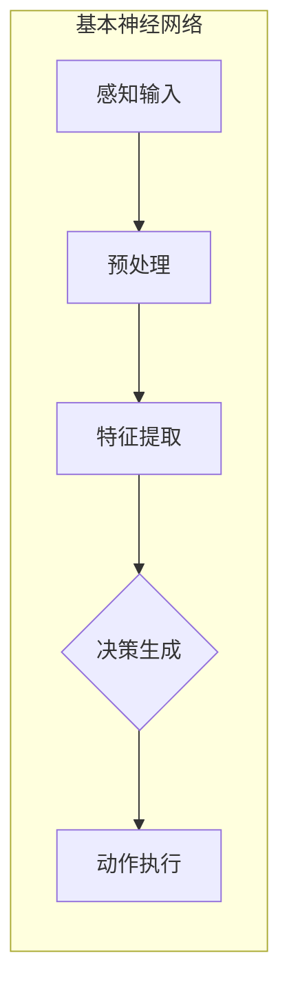
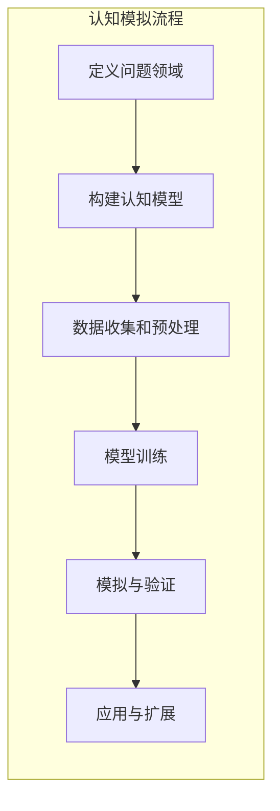
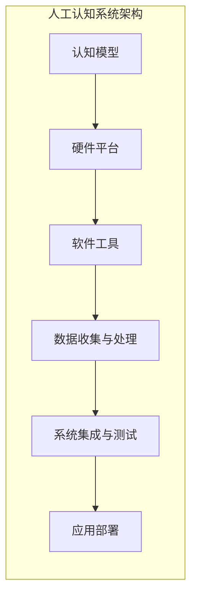
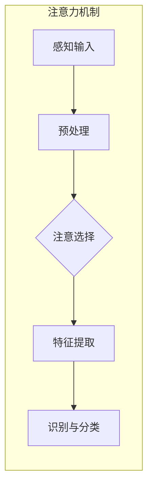
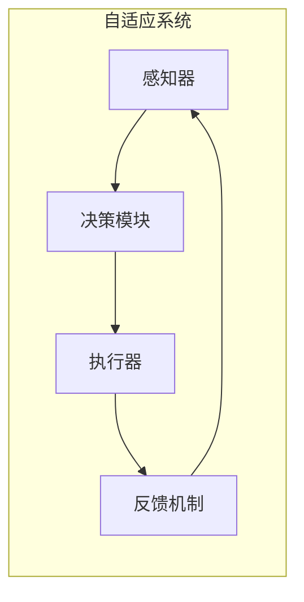
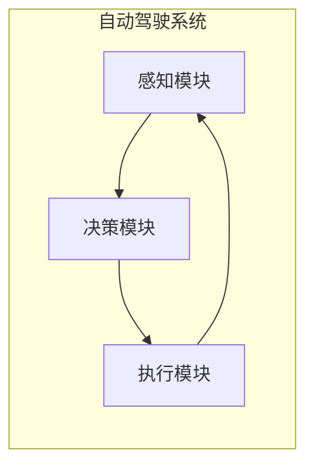
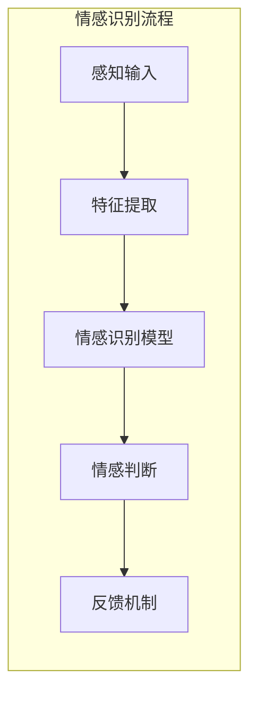
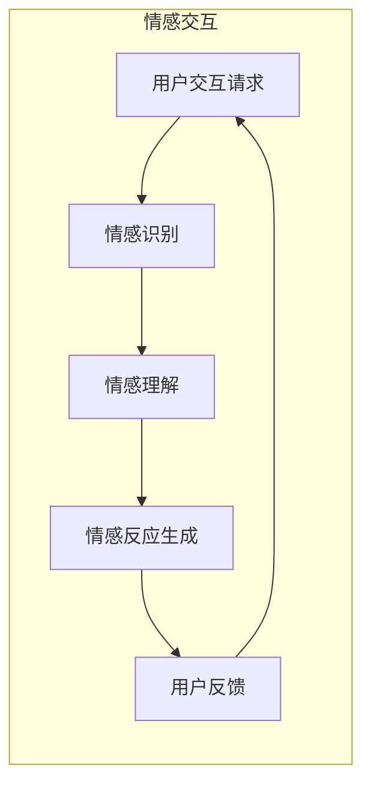

                 

### 第一部分：引论

#### 第1章：认知科学与人工智能概述

认知科学与人工智能（AI）是两个看似不同但实际紧密相关的领域。认知科学是一门跨学科的科学，旨在理解人类思维、感知、学习和记忆等心理过程。而人工智能则是通过模拟这些认知过程来创建智能机器。

##### 1.1 认知科学的定义与范围

认知科学可以追溯到20世纪60年代，当时认知心理学成为了研究人类认知过程的主流学科。认知科学结合了心理学、神经科学、计算机科学和哲学等多个学科的研究成果，致力于探索人类心智的运作机制。

认知科学的范围广泛，主要包括以下几个研究领域：

- **感知**：研究人类如何通过感官接收和处理信息。
- **记忆**：研究人类如何存储、检索和使用信息。
- **学习**：研究人类如何从经验中学习和适应。
- **语言**：研究人类如何理解和表达语言。
- **思维**：研究人类如何进行推理、决策和解决问题。

##### 1.2 人工智能的历史与分类

人工智能的历史可以追溯到20世纪50年代，当时的科学家首次提出了“人工智能”的概念。自那时以来，人工智能经历了多个发展阶段，包括早期的符号主义、行为主义和现代的基于数据和统计学的机器学习方法。

人工智能的主要分类包括：

- **符号主义（Symbolic AI）**：使用逻辑和符号表示知识，试图模拟人类的推理过程。
- **连接主义（Connectionist AI）**：使用神经网络模拟大脑的结构和功能。
- **行为主义（Behavior-based AI）**：基于机器的行为来模拟智能。
- **统计学习（Statistical Learning）**：使用统计学方法来分析大量数据，并从中学习规律。

##### 1.3 认知科学与人工智能的联系

认知科学与人工智能之间的联系体现在多个方面：

- **学习模拟**：人工智能通过模拟人类的感知、学习和记忆过程来开发学习算法。
- **认知模型**：认知科学提供了许多关于人类认知过程的模型，这些模型可以用于指导人工智能系统的设计。
- **神经科学**：认知科学和神经科学的结合为人工智能提供了深入了解大脑机制的基础。

##### 1.4 学习模拟与认知科学

学习模拟是认知科学在人工智能中应用的一个重要方面。人工智能系统通过模拟人类的学习过程，如感知学习、条件反射和强化学习，来实现自我优化和适应环境。

认知科学的学习模拟主要包括以下几种方法：

- **联结主义模型**：使用神经网络模拟人类大脑的学习机制。
- **符号主义模型**：使用符号逻辑模拟人类推理和学习。
- **混合模型**：结合联结主义和符号主义方法，以更好地模拟人类学习过程。

通过学习模拟，人工智能系统可以更有效地处理复杂问题，并在特定领域实现智能化。

总之，认知科学与人工智能的结合为智能系统的设计和开发提供了丰富的理论基础和实践指导。在接下来的章节中，我们将进一步探讨人类学习的理论基础、人工智能中的学习模拟以及认知科学方法在人工智能中的应用。

### 第2章：人类学习的理论基础

人类学习是一个复杂而神奇的过程，涉及多个方面，包括感知、记忆、注意力和动机等。理解这些理论对于构建有效的人工智能学习系统至关重要。

##### 2.1 人类学习的主要类型

人类学习可以大致分为以下几种类型：

- **知识学习**：获取事实和概念的过程，如学习历史事件或科学原理。
- **技能学习**：通过实践和重复操作来提高特定技能，如打字或驾驶。
- **情感学习**：通过体验情感反应来学习如何处理情感问题。
- **社会学习**：通过观察和模仿他人的行为来学习，如社交技能。

##### 2.2 反馈与强化学习原理

反馈和强化是学习过程中至关重要的要素。反馈是指个体对其行为结果的了解，它有助于个体了解其行为的正确与否。强化则是指个体对其行为的奖励或惩罚，它影响个体未来行为的决策。

强化学习原理基于以下原则：

- **强化信号**：个体通过强化信号（如奖励或惩罚）来评估其行为的效果。
- **学习规则**：个体通过调整其行为策略来最大化强化信号。
- **探索与利用**：在强化学习中，个体需要在探索新行为和利用已有行为之间进行平衡。

##### 2.3 联结主义学习模型

联结主义学习模型基于神经元之间相互连接的概念，模拟人类大脑的学习过程。这种模型通过调整神经元之间的连接强度来学习。

主要的联结主义学习模型包括：

- **感知器（Perceptron）**：一种简单的神经元模型，用于二分类问题。
- **反向传播（Backpropagation）**：一种多层神经网络的学习算法，用于复杂问题的分类和回归。
- **卷积神经网络（CNN）**：一种特殊类型的神经网络，用于图像识别等任务。

##### 2.4 人工神经网络与学习算法

人工神经网络（ANN）是模拟生物神经系统的计算模型。它们由大量相互连接的神经元组成，通过学习数据集来调整连接权重。

主要的人工神经网络和学习算法包括：

- **多层感知器（MLP）**：一种多层神经网络，用于复杂函数的建模和预测。
- **长短期记忆（LSTM）**：一种特殊的RNN结构，用于处理长序列数据。
- **生成对抗网络（GAN）**：一种生成模型，用于生成逼真的数据。

通过这些理论基础，我们可以更好地理解人类学习的本质，并将其应用于人工智能系统的设计中。在下一章中，我们将探讨人工智能中的学习模拟方法。

#### 第3章：人工智能中的学习模拟

在人工智能领域，学习模拟是通过构建能够模仿人类学习过程的算法和模型，使机器能够从数据中提取知识、改进性能和适应新环境。这一过程不仅需要理解人类学习的理论基础，还需要将理论与技术实现相结合。以下是一些主要的人工智能学习模拟方法：

##### 3.1 人工神经网络的结构

人工神经网络（ANN）是模仿生物神经系统结构和功能的一种计算模型。一个典型的ANN由以下几个部分组成：

- **输入层**：接收外部输入数据。
- **隐藏层**：对输入数据进行处理和特征提取。
- **输出层**：产生最终输出。

每个神经元在隐藏层和输出层之间都有一个激活函数，用于转换输入数据。常见的激活函数包括线性函数、Sigmoid函数和ReLU函数。

**例子**：以下是一个简单的多层感知器（MLP）的伪代码，用于实现一个二分类问题：

```python
# 定义输入层、隐藏层和输出层
input_layer = InputLayer(size=784)
hidden_layer = DenseLayer(input_layer, size=128, activation='sigmoid')
output_layer = DenseLayer(hidden_layer, size=1, activation='sigmoid')

# 训练神经网络
for epoch in range(num_epochs):
    for sample, label in training_data:
        output = output_layer.forward(sample)
        error = label - output
        output_layer.backward(error)
        hidden_layer.backward(output_layer.gradients)
        input_layer.backward(hidden_layer.gradients)

    # 更新权重
    input_layer.update_weights()
    hidden_layer.update_weights()
    output_layer.update_weights()
```

##### 3.2 深度学习与深度神经网络

深度学习是ANN的一个扩展，它引入了多个隐藏层，使得模型能够学习更复杂的特征和表示。深度神经网络（DNN）是深度学习的基础，它在图像识别、语音识别和自然语言处理等领域取得了显著成果。

**例子**：以下是一个简单的深度神经网络（DNN）的伪代码，用于图像分类：

```python
# 定义输入层、隐藏层和输出层
input_layer = InputLayer(size=784)
hidden_layer1 = DenseLayer(input_layer, size=128, activation='relu')
hidden_layer2 = DenseLayer(hidden_layer1, size=64, activation='relu')
output_layer = DenseLayer(hidden_layer2, size=10, activation='softmax')

# 训练神经网络
for epoch in range(num_epochs):
    for sample, label in training_data:
        output = output_layer.forward(sample)
        error = label - output
        output_layer.backward(error)
        hidden_layer2.backward(output_layer.gradients)
        hidden_layer1.backward(hidden_layer2.gradients)
        input_layer.backward(hidden_layer1.gradients)

    # 更新权重
    input_layer.update_weights()
    hidden_layer1.update_weights()
    hidden_layer2.update_weights()
    output_layer.update_weights()
```

##### 3.3 强化学习算法与实现

强化学习是一种通过与环境互动来学习最优策略的机器学习方法。它的核心概念包括状态、动作、奖励和策略。强化学习算法旨在最大化累积奖励，以找到最佳行为策略。

常见的强化学习算法包括：

- **Q-Learning**：通过学习状态-动作值函数来选择最佳动作。
- **深度Q网络（DQN）**：使用深度神经网络来近似Q值函数。
- **策略梯度方法**：直接优化策略函数。

**例子**：以下是一个简单的Q-Learning算法的伪代码：

```python
# 初始化Q表
Q = [[0 for _ in range(actions)] for _ in range(states)]

# Q-Learning算法
for episode in range(num_episodes):
    state = environment.reset()
    done = False
    while not done:
        action = choose_action(Q[state])
        next_state, reward, done = environment.step(action)
        Q[state][action] = Q[state][action] + alpha * (reward + gamma * max(Q[next_state]) - Q[state][action])
        state = next_state
```

##### 3.4 自监督学习的应用

自监督学习是一种无需明确标注数据标签的学习方法，它通过利用未标记的数据来学习有用的特征表示。自监督学习在语音识别、图像识别和自然语言处理等领域有着广泛的应用。

常见的自监督学习方法包括：

- **预训练与微调**：在大量未标记数据上预训练模型，然后在具体任务上进行微调。
- **预测任务**：如预测序列中的下一个元素，从输入数据中学习有用的特征表示。

**例子**：以下是一个简单的自监督学习算法的伪代码，用于文本分类：

```python
# 预训练模型
for epoch in range(pretrain_epochs):
    for sentence, label in unlabeled_data:
        embeddings = embedding_matrix[sentence]
        output = model.forward(embeddings)
        loss = loss_function(output, label)
        model.backward(loss)

# 微调模型
for epoch in range(finetune_epochs):
    for sentence, label in labeled_data:
        embeddings = embedding_matrix[sentence]
        output = model.forward(embeddings)
        loss = loss_function(output, label)
        model.backward(loss)
        model.update_weights()
```

通过上述方法，人工智能系统能够在数据中学习到有用的知识，从而提高其性能和适应性。在下一章中，我们将探讨认知科学方法在人工智能中的应用。

### 第4章：认知建模与模拟

认知建模是人工智能领域的一个重要研究方向，旨在通过创建数学模型来模拟人类认知过程。这一领域结合了认知科学、计算机科学、心理学和神经科学等多个学科的知识，为人工智能系统提供了更加接近人类认知的模拟方法。以下是关于认知建模与模拟的详细介绍：

##### 4.1 认知模型的基本概念

认知模型是对人类认知过程的一种抽象表示，它通常包括以下几个基本组成部分：

- **感知器（Perceptron）**：感知器是最简单的认知模型，它模拟单个神经元的功能，通过计算输入权重和偏置的加权和，然后应用一个激活函数来产生输出。
- **神经网络（Neural Network）**：神经网络是由多个感知器组成的复杂结构，能够通过学习数据来调整内部连接权重，从而实现更复杂的认知功能。
- **认知架构（Cognitive Architecture）**：认知架构是一种高层次的理论框架，它定义了认知系统的整体结构和工作原理。例如，SOAR、ACT-R和GOMS等模型都是认知架构的例子。

**例子**：以下是一个简化的神经网络模型，用于模拟人类决策过程：



##### 4.2 认知模拟的流程

认知模拟是一个复杂的过程，它通常包括以下几个步骤：

1. **定义问题领域**：明确需要模拟的认知任务和问题领域，例如，决策、规划或问题解决。
2. **构建认知模型**：根据问题领域，构建一个能够模拟人类认知过程的模型。这可能包括定义感知器、神经网络和认知架构。
3. **数据收集和预处理**：收集相关的数据，并对数据进行预处理，以确保模型能够有效学习和模拟。
4. **模型训练**：使用训练数据来调整模型的参数，使其能够更好地模拟人类认知过程。
5. **模拟与验证**：运行模拟实验，验证模型在特定任务上的性能，并根据结果对模型进行调整和优化。
6. **应用与扩展**：将验证过的模型应用到实际问题中，并不断扩展其功能，以应对更复杂的问题。

**例子**：以下是一个简化的认知模拟流程图：



##### 4.3 人工认知系统的构建

构建人工认知系统需要综合考虑认知模型、硬件平台和软件工具等多个方面。以下是构建人工认知系统的一些关键步骤：

1. **选择合适的认知模型**：根据应用需求，选择一个合适的认知模型，例如，神经网络、决策树或支持向量机。
2. **设计硬件平台**：选择适当的硬件设备，例如，CPU、GPU或专用硬件加速器，以支持大规模计算和实时模拟。
3. **开发软件工具**：使用编程语言和工具，如Python、MATLAB或R，开发用于模拟和训练的认知软件。
4. **数据收集与处理**：收集与问题领域相关的数据，并对数据进行分析和处理，以支持模型的训练和验证。
5. **系统集成与测试**：将认知模型、硬件和软件工具集成到一个系统中，并进行测试和优化，以确保系统能够稳定运行和有效模拟。
6. **应用部署**：将构建完成的人工认知系统部署到实际应用环境中，并进行维护和更新。

**例子**：以下是一个简化的人工认知系统架构图：



通过认知建模与模拟，我们可以更好地理解人类认知过程，并将其应用于人工智能系统中，以实现更智能化和自适应的行为。在下一章中，我们将探讨注意力机制与记忆模拟在人工智能中的应用。

### 第5章：注意力机制与记忆模拟

注意力机制和记忆模拟是认知科学和人工智能领域中至关重要的两个概念。它们在人类认知中起着核心作用，帮助我们处理复杂信息，并从经验中学习。在人工智能系统中，模拟这些机制可以帮助我们创建更加智能和自适应的机器学习模型。

##### 5.1 注意力机制在认知科学中的应用

注意力机制是指人类在处理信息时，对某些特定信息给予更高关注而忽略其他信息的能力。在认知科学中，注意力机制被认为是一种资源限制的过程，它帮助我们在有限的信息处理资源下，优先处理重要或相关的信息。

注意力机制的应用包括：

- **感知加工**：在视觉感知中，注意力机制帮助我们聚焦于感兴趣的物体，从而忽略其他干扰信息。
- **记忆**：在记忆过程中，注意力机制帮助我们将重要信息从背景中提取出来，从而更好地编码和存储。
- **决策**：在决策过程中，注意力机制帮助我们集中精力处理关键信息，从而做出更明智的选择。

**例子**：在视觉感知中，注意力机制可以帮助我们识别一张图片中的特定对象。以下是一个简化的过程：

1. **感知输入**：接收视觉输入，如一张包含多个物体的图片。
2. **预处理**：对输入图像进行预处理，提取基本特征。
3. **注意选择**：使用注意力机制选择一个或多个重要对象作为关注点。
4. **特征提取**：对关注点的特征进行深入提取和分析。
5. **识别与分类**：根据提取的特征对对象进行识别和分类。

以下是一个简化的注意力机制流程图：



##### 5.2 注意力机制模型

在人工智能中，注意力机制模型被广泛应用于自然语言处理、计算机视觉和语音识别等领域。以下是一些常见的注意力机制模型：

- **软注意力（Soft Attention）**：通过一个软评分函数计算每个输入的权重，然后加权求和。这种模型通常使用神经网络实现，例如，在文本分类中，可以计算每个单词的权重，然后加权求和得到文本的表示。
- **硬注意力（Hard Attention）**：通过选择最高权重的一个或几个输入，而不是加权求和。这种模型通常用于序列到序列学习，如机器翻译。
- **卷积注意力（Convolutional Attention）**：利用卷积神经网络（CNN）对输入特征进行局部处理，从而实现注意力机制。这种模型在图像处理任务中表现出色。

**例子**：以下是一个简单的软注意力模型的伪代码：

```python
# 输入特征矩阵
inputs = ...

# 注意力权重计算
attention_weights = softmax(inputs)

# 加权求和
attended_representation = sum(inputs * attention_weights)
```

##### 5.3 记忆模拟与长短期记忆模型

记忆是认知过程的核心组成部分，它使我们能够从经验中学习，并在未来做出更好的决策。在人工智能中，记忆模拟是通过设计特殊的算法和模型来实现的。

长短期记忆（LSTM）是一种特殊的循环神经网络（RNN）结构，它能够有效地解决传统RNN在处理长序列数据时遇到的梯度消失和梯度爆炸问题。LSTM通过引入三个门（输入门、遗忘门和输出门）来控制信息的流动和存储。

**例子**：以下是一个简化的LSTM模型的伪代码：

```python
# 初始化LSTM单元
class LSTMCell:
    def __init__(self, input_size, hidden_size):
        self.input_size = input_size
        self.hidden_size = hidden_size

        # 输入门、遗忘门和输出门权重
        self.wi = ...
        self.wf = ...
        self.wo = ...

        # 输入门、遗忘门和输出门偏置
        self.bi = ...
        self.bf = ...
        self.bo = ...

    def forward(self, input, hidden):
        # 输入门计算
        i = sigmoid(self.wi.dot(input) + self.bi)
        
        # 遗忘门计算
        f = sigmoid(self.wf.dot(input) + self.bf)
        
        # 输出门计算
        o = sigmoid(self.wo.dot(input) + self.bo)

        # 状态更新
        new_hidden = (f * hidden + i * tanh(self.Wh.dot(hidden) + self.bh))
        
        # 输出计算
        output = o * tanh(new_hidden)

        return output

# 训练LSTM模型
for epoch in range(num_epochs):
    for sample, label in training_data:
        hidden = model.forward(sample)
        loss = loss_function(label, hidden)
        model.backward(loss)
        model.update_weights()
```

通过模拟注意力机制和记忆，人工智能系统能够更好地理解和处理复杂信息，从而实现更高级的认知功能。在下一章中，我们将探讨学习策略与自适应系统在人工智能中的应用。

### 第6章：学习策略与自适应系统

学习策略和自适应系统在人工智能中扮演着关键角色，它们使得机器能够在不断变化的环境中不断优化其性能。理解这些策略和系统不仅有助于构建更智能的人工智能系统，还能提高机器在不同任务中的表现。

##### 6.1 学习策略的类型

学习策略是指机器在学习过程中采取的特定方法和步骤。根据学习方式的不同，学习策略可以分为以下几种类型：

- **监督学习（Supervised Learning）**：在这种学习中，机器使用预先标记的数据集来学习如何将输入映射到输出。常见的监督学习算法包括线性回归、支持向量机和决策树等。
- **无监督学习（Unsupervised Learning）**：在这种学习中，机器从未标记的数据中学习模式和结构，如聚类和降维。常见的无监督学习算法包括K-均值聚类、主成分分析（PCA）等。
- **强化学习（Reinforcement Learning）**：在这种学习中，机器通过与环境的互动来学习最优策略。它通常涉及一个智能体、环境、状态、动作和奖励的概念。常见的强化学习算法包括Q-Learning、深度Q网络（DQN）和策略梯度方法等。

**例子**：以下是一个简单的监督学习策略的伪代码：

```python
# 初始化模型
model = initialize_model(input_size, output_size)

# 训练模型
for epoch in range(num_epochs):
    for sample, label in training_data:
        prediction = model.forward(sample)
        error = label - prediction
        model.backward(error)
        model.update_weights()
```

##### 6.2 自适应系统的概念

自适应系统是指能够在运行时根据环境变化调整其行为和策略的系统。这种系统能够通过学习和适应来提高其性能和可靠性。自适应系统通常包括以下关键组成部分：

- **感知器（Perceptron）**：用于感知和收集环境信息。
- **决策模块**：根据感知到的信息做出决策。
- **执行器（Actuator）**：执行决策并影响环境。
- **反馈机制**：通过反馈来评估系统的性能，并指导未来的决策。

**例子**：以下是一个简单的自适应系统架构图：



##### 6.3 自适应算法的设计

自适应算法是使系统具有自适应能力的关键。设计自适应算法通常涉及以下几个步骤：

1. **目标定义**：明确系统需要适应的目标，如性能优化或成本最小化。
2. **环境建模**：建立环境模型，以更好地理解环境变化和系统行为。
3. **策略选择**：选择合适的策略，如基于规则的策略或机器学习策略。
4. **反馈机制**：设计反馈机制，以评估策略的有效性并指导调整。
5. **调整与优化**：根据反馈调整策略，并不断优化系统性能。

**例子**：以下是一个简单的自适应算法的伪代码：

```python
# 初始化策略
policy = initialize_policy()

# 运行自适应系统
while not convergence:
    # 感知环境
    observation = environment.observe()
    
    # 基于策略做出决策
    action = policy.select_action(observation)
    
    # 执行决策
    environment.execute_action(action)
    
    # 获取奖励
    reward = environment.get_reward(action)
    
    # 更新策略
    policy.update(reward)
```

##### 6.4 自适应系统在AI中的应用

自适应系统在人工智能中的应用非常广泛，以下是一些典型的应用场景：

- **自动驾驶**：自动驾驶系统通过感知车辆周围的环境，并不断调整其行为以适应路况和交通状况。
- **智能推荐系统**：智能推荐系统通过用户行为和反馈来不断优化推荐算法，从而提供更个性化的服务。
- **工业自动化**：工业自动化系统通过监测生产线状态，并自适应调整生产参数，以提高生产效率和产品质量。

**例子**：以下是一个简单的自动驾驶系统架构图：



通过学习策略和自适应系统，人工智能系统能够在复杂和动态的环境中实现自我优化和适应。在下一章中，我们将探讨情感计算与情绪模拟在人工智能中的应用。

### 第7章：情感计算与情绪模拟

情感计算，也称为计算情感学，是人工智能领域中的一个新兴研究方向，旨在让机器能够识别、理解并模拟人类情感。情感计算不仅有助于提高人机交互的体验，还可以在心理治疗、社交机器人、虚拟现实等多个领域发挥作用。

##### 7.1 情感计算的基本原理

情感计算的基本原理包括以下几个方面：

- **情感识别**：通过分析语音、面部表情、生理信号等，机器能够识别用户的情感状态。
- **情感理解**：机器通过上下文和情境信息，理解情感的含义和背景。
- **情感生成**：机器能够根据用户需求和环境条件，生成相应的情感反应。

情感计算的核心技术包括：

- **情感识别技术**：包括语音情感识别、面部表情识别、生理信号分析等。
- **情感理解技术**：涉及自然语言处理、机器学习、上下文分析等。
- **情感生成技术**：通过文本生成、语音合成、面部表情生成等手段实现。

**例子**：以下是一个简化的情感识别算法流程：



##### 7.2 情绪识别与模拟

情绪识别与模拟是情感计算中的重要组成部分。情绪识别是指机器能够识别用户当前的情绪状态，而情绪模拟是指机器能够根据识别到的情绪，生成相应的反应。

- **情绪识别**：常用的方法包括基于语音的识别、基于面部表情的识别和基于生理信号的识别。例如，通过分析语音的音调、音速和音量等特征，机器可以识别出用户的情感状态。
- **情绪模拟**：通过文本生成、语音合成和面部表情生成等技术，机器能够模拟出相应的情感反应。例如，在客户服务机器人中，当用户表现出愤怒情绪时，机器人可以通过改变语音的语调和音调，来模拟出同情和关心的情绪。

**例子**：以下是一个简单的情绪识别与模拟算法的伪代码：

```python
# 情绪识别
def recognize_emotion(voice_feature):
    # 特征提取
    feature_vector = extract_features(voice_feature)
    
    # 情绪分类
    emotion = emotion_classifier.predict(feature_vector)
    
    return emotion

# 情绪模拟
def simulate_emotion(emotion):
    if emotion == 'happy':
        # 生成开心的语音
        voice = generate_happy_voice()
    elif emotion == 'angry':
        # 生成生气的语音
        voice = generate_angry_voice()
    else:
        # 生成默认的语音
        voice = generate_default_voice()
    
    return voice
```

##### 7.3 人工智能中的情感交互

情感交互是指机器与人类之间的情感互动过程。在情感交互中，机器不仅需要识别和理解用户的情感状态，还需要生成相应的情感反应，以建立更自然和有效的交互。

- **情感交互设计**：在交互界面设计时，需要考虑用户的情感状态，并通过语言、视觉和非语言信号来传递情感。例如，在设计客户服务机器人时，可以通过改变语音的语调、音速和音量等来传递情感。
- **情感反馈机制**：在情感交互中，机器需要根据用户的情感反馈，调整其行为和反应。例如，当用户表现出不满意时，机器人可以通过询问用户的问题或提供额外的帮助来改善用户体验。

**例子**：以下是一个简单的情感交互流程：



##### 7.4 情感计算在实际应用中的挑战

尽管情感计算在许多领域展现出了巨大的潜力，但它在实际应用中仍然面临着一系列挑战：

- **准确性**：情感计算算法的准确性仍然是一个挑战，特别是在处理复杂和微妙的情感时。
- **泛化能力**：现有的情感计算模型往往在特定环境下表现出色，但在不同环境和情境下可能无法保持相同的性能。
- **隐私保护**：情感计算通常涉及对用户的个人情感信息的处理，如何保护用户隐私是一个重要的伦理和法律规定问题。
- **用户适应性**：情感计算系统需要能够适应不同的用户，并提供个性化的服务，这要求系统具备高度的自适应能力。

总之，情感计算与情绪模拟在人工智能中具有广阔的应用前景，但同时也面临着一系列技术和社会挑战。在未来的发展中，需要不断改进算法，提高系统的性能和可靠性，并解决相关的伦理和社会问题。

### 第8章：跨学科研究与未来展望

认知科学与人工智能的交叉研究正在推动两个领域的共同进步。这一章将探讨认知科学如何影响人工智能的发展，以及人工智能如何为认知科学研究提供新的工具和方法。

##### 8.1 认知科学与人工智能的融合趋势

认知科学和人工智能的融合趋势体现在多个方面：

- **跨学科研究**：认知科学家和人工智能研究者共同探讨认知过程，例如记忆、注意力和学习，以开发更准确的认知模型。
- **数据共享**：通过共享数据和资源，两个领域可以相互借鉴成果，加速研究和应用。
- **方法互鉴**：认知科学的方法，如认知模拟和脑成像技术，被应用于人工智能研究，而人工智能的算法和技术，如深度学习和强化学习，则被用于解决认知科学中的问题。

**例子**：一个典型的跨学科研究项目是使用深度学习模型来分析脑成像数据，以研究记忆和注意力的神经基础。研究人员使用基于卷积神经网络（CNN）的算法来分析功能磁共振成像（fMRI）数据，识别与记忆和注意力相关的脑区活动。

##### 8.2 认知科学对AI发展的启示

认知科学为人工智能提供了以下启示：

- **基于人类的模型**：认知科学提供了关于人类如何学习和思考的深入理解，这有助于开发更接近人类智能的人工智能系统。
- **心理实验设计**：认知科学的实验设计方法，如行为实验和认知任务，可以指导人工智能系统的测试和评估。
- **神经机制模拟**：通过模拟神经系统的结构和功能，认知科学为人工智能提供了新的算法和模型，如神经网络和长短期记忆（LSTM）模型。

**例子**：在游戏玩法设计中，认知科学的研究表明人类玩家在决策时会考虑多种因素，如奖励、风险和情境。这些发现可以指导设计更加吸引人的游戏AI，使其能够模拟人类玩家的决策过程。

##### 8.3 AI对认知科学研究的影响

人工智能技术也为认知科学研究带来了新的机会：

- **数据采集和分析**：人工智能技术，如深度学习和大数据分析，可以帮助研究人员处理海量的认知科学数据，揭示复杂的认知模式。
- **认知模拟**：通过人工智能模型，研究人员可以模拟认知过程，探索认知机制的细节，验证理论假设。
- **可重复性研究**：人工智能可以帮助研究人员设计更可控的实验条件，提高实验的可重复性和可靠性。

**例子**：在心理学研究中，人工智能可以用于分析复杂的实验数据，如眼动跟踪数据和生理信号数据，以揭示人类注意力分配的动态变化。

##### 8.4 未来研究方向与挑战

认知科学与人工智能的融合在未来的发展中面临以下研究方向和挑战：

- **理解复杂性**：认知过程非常复杂，需要更先进的算法和模型来模拟和理解。
- **跨领域合作**：需要更多的跨学科合作，以整合认知科学、神经科学、心理学和计算机科学的研究成果。
- **伦理和社会影响**：人工智能在认知科学中的应用需要关注隐私、安全和伦理问题，确保技术的发展不会对人类社会造成负面影响。

**例子**：在医疗领域，人工智能可以用于辅助诊断和治疗方案设计，但同时也需要确保患者的隐私和数据安全。

总之，认知科学与人工智能的融合为两个领域带来了新的机遇和挑战。通过跨学科研究和合作，我们可以期待在未来实现更加智能的人工智能系统和更深入的认知科学理解。

### 第9章：案例研究：认知科学在人工智能中的实际应用

在本章中，我们将探讨几个认知科学在人工智能中应用的案例，分析这些案例中的解决方案、应用效果、经验和教训，以及未来的展望。

##### 9.1 案例介绍

以下是三个具体的案例研究：

- **案例一**：基于认知模型的智能客服系统。该系统结合了情感计算和自然语言处理技术，旨在为用户提供个性化、情感化的服务。
- **案例二**：利用强化学习的智能交通管理系统。该系统通过模拟人类的决策过程，优化交通流量，减少交通拥堵。
- **案例三**：基于认知模拟的智能医疗诊断系统。该系统通过分析患者的临床数据和生物标记，提供准确的疾病诊断和个性化治疗方案。

##### 9.2 解决方案与应用效果

**案例一：智能客服系统**

- **解决方案**：该系统采用了情感计算技术，通过语音识别和文本分析，实时识别用户情绪，并根据情绪调整回答策略。此外，系统还结合了自然语言处理技术，实现多轮对话和上下文理解。
- **应用效果**：在实际应用中，智能客服系统显著提高了客户满意度，减少了人工客服的工作量。此外，通过分析用户交互数据，系统可以不断优化回答策略，提高对话质量。

**案例二：智能交通管理系统**

- **解决方案**：该系统利用强化学习算法，模拟人类驾驶员的决策过程，优化交通信号控制和路径规划。系统通过实时采集交通数据，如车辆流量和道路状况，动态调整交通策略。
- **应用效果**：在实际应用中，智能交通管理系统显著减少了交通拥堵和事故发生率。此外，系统还可以预测交通状况，为用户提供实时导航建议，提高出行效率。

**案例三：智能医疗诊断系统**

- **解决方案**：该系统基于认知模拟技术，结合机器学习和深度学习算法，分析患者的临床数据和生物标记，识别疾病特征。此外，系统还采用了决策树和规则引擎，为医生提供诊断建议。
- **应用效果**：在实际应用中，智能医疗诊断系统提高了诊断的准确性和效率，降低了误诊率。此外，系统可以实时更新和优化诊断算法，以适应不断变化的医疗数据。

##### 9.3 经验与教训

通过上述案例，我们可以总结出以下经验和教训：

- **跨学科合作**：认知科学、人工智能和其他领域的结合，可以产生更强大的解决方案。跨学科合作有助于解决复杂问题，提高系统的性能和可靠性。
- **数据质量**：数据的质量和准确性对人工智能系统的效果至关重要。在实际应用中，需要确保数据的可靠性、一致性和完整性。
- **用户反馈**：用户的反馈是优化系统的重要依据。通过收集和分析用户反馈，可以不断改进系统的性能和用户体验。
- **隐私保护**：在应用人工智能技术时，需要关注隐私保护问题。确保用户数据的安全和隐私是系统的关键要求。

##### 9.4 未来展望

在未来，认知科学在人工智能中的应用将呈现以下趋势：

- **更智能的交互**：随着情感计算和自然语言处理技术的进步，人工智能系统将能够提供更加自然、情感化的交互体验。
- **更广泛的应用领域**：人工智能将在更多领域得到应用，如教育、金融、制造业等。认知科学将为这些领域提供新的解决方案和思路。
- **更高效的学习**：通过结合认知科学和机器学习技术，人工智能系统将能够实现更高效、自适应的学习，提高系统的智能水平。
- **伦理和合规**：随着人工智能技术的普及，伦理和合规问题将越来越重要。确保人工智能技术的发展符合伦理和法律规定，是未来研究的一个重要方向。

总之，认知科学在人工智能中的应用已经取得了显著成果，但仍面临许多挑战。通过不断探索和创新，我们可以期待认知科学在人工智能领域发挥更大的作用。

### 附录A：认知科学与人工智能研究资源

认知科学与人工智能是一个充满活力且不断发展的领域，研究资源丰富多样。以下是一些主要的认知科学与人工智能研究机构、期刊与会议，以及开源工具和库，供研究人员和开发者参考。

#### A.1 主要研究机构与实验室

1. **美国麻省理工学院（MIT）** - 认知科学实验室（Cognitive Science Program）
2. **美国斯坦福大学** - 人工智能实验室（Stanford AI Lab）
3. **德国马克斯·普朗克智能系统研究所（MPI for Intelligent Systems）**
4. **英国剑桥大学** - 认知与发展心理学实验室
5. **日本东京大学** - 人工智能研究中心
6. **清华大学** - 人机交互与认知工程实验室
7. **北京大学** - 认知科学与心理学实验室

#### A.2 认知科学与人工智能期刊与会议

1. **期刊**：
   - **Journal of Cognitive Science**
   - **Cognitive Science**
   - **Journal of Memory and Language**
   - **Psychonomic Bulletin & Review**
   - **Artificial Intelligence Journal**

2. **会议**：
   - **认知科学年会（Annual Conference of the Cognitive Science Society）**
   - **国际人工智能与统计学会议（Neural Information Processing Systems, NIPS）**
   - **国际机器学习会议（International Conference on Machine Learning, ICML）**
   - **国际人工智能会议（International Joint Conference on Artificial Intelligence, IJCAI）**

#### A.3 开源工具与库

1. **Python库**：
   - **PyTorch**：一个流行的深度学习框架。
   - **TensorFlow**：由谷歌开发的开源深度学习平台。
   - **NLTK**：自然语言处理工具包。
   - **Scikit-learn**：机器学习库。

2. **神经科学工具**：
   - **NEURON**：一个用于模拟神经元和神经网络的仿真软件。
   - **Theano**：用于定义、优化和评估深度学习模型的库。

3. **认知建模工具**：
   - **OpenCog**：一个开源的通用智能平台。
   - **ACT-R**：一个基于认知架构的建模工具。

#### A.4 网络资源与社区

1. **网络资源**：
   - **AI索引**：一个涵盖人工智能领域各种资源的网站。
   - **认知科学与人工智能网络**：提供最新研究进展和讨论的在线平台。

2. **社区与论坛**：
   - **Reddit AI**：关于人工智能的讨论社区。
   - **Cognitive Science Stack Exchange**：一个专门针对认知科学问题的问答平台。
   - **LinkedIn AI and Cognitive Science Groups**：专业的在线讨论组。

通过利用这些研究资源，研究人员和开发者可以更好地了解认知科学与人工智能领域的最新动态，掌握前沿技术，推动这一领域的持续发展。

### 附录B：常见认知科学与人工智能术语解释

在本附录中，我们将解释一些常见的认知科学与人工智能领域的术语，帮助读者更好地理解这些概念。

#### B.1 认知科学术语

- **感知（Perception）**：感知是指个体接收外部刺激，并通过感官系统加工和理解这些刺激的过程。
- **注意力（Attention）**：注意力是指个体在处理信息时，对某些特定信息给予更高关注而忽略其他信息的能力。
- **记忆（Memory）**：记忆是指个体将信息存储在脑中，并能够在需要时提取这些信息的能力。
- **学习（Learning）**：学习是指个体通过经验、训练和互动来获取新知识、技能和适应性行为的过程。
- **认知过程（Cognitive Processes）**：认知过程包括感知、记忆、注意力、思维和语言等心理活动。
- **认知模拟（Cognitive Modeling）**：认知模拟是指使用数学模型和计算机程序来模拟人类认知过程。

#### B.2 人工智能术语

- **人工智能（Artificial Intelligence, AI）**：人工智能是指通过计算机系统模拟人类智能行为的技术。
- **机器学习（Machine Learning, ML）**：机器学习是指使计算机系统能够通过数据和经验自主学习和改进性能的技术。
- **深度学习（Deep Learning）**：深度学习是指使用多层神经网络（如深度神经网络和卷积神经网络）进行机器学习的方法。
- **神经网络（Neural Network）**：神经网络是一种由大量相互连接的节点（类似生物神经元）组成的计算模型。
- **强化学习（Reinforcement Learning）**：强化学习是指通过奖励和惩罚来训练智能体在特定环境中做出最佳决策的方法。
- **自然语言处理（Natural Language Processing, NLP）**：自然语言处理是指使计算机能够理解、生成和处理人类自然语言的技术。

#### B.3 相关算法与模型术语

- **反向传播（Backpropagation）**：反向传播是一种用于训练神经网络的算法，它通过计算输出误差并反向传播到网络中的每个神经元，以更新网络权重。
- **长短期记忆（Long Short-Term Memory, LSTM）**：长短期记忆是一种特殊的循环神经网络（RNN）结构，用于处理长序列数据，解决传统RNN的梯度消失问题。
- **卷积神经网络（Convolutional Neural Network, CNN）**：卷积神经网络是一种用于图像识别和处理的神经网络结构，它利用卷积层提取图像的特征。
- **生成对抗网络（Generative Adversarial Network, GAN）**：生成对抗网络是一种生成模型，由生成器和判别器组成，通过对抗训练生成逼真的数据。
- **支持向量机（Support Vector Machine, SVM）**：支持向量机是一种监督学习算法，用于分类和回归任务，通过最大化分类边界间隔来寻找最佳决策边界。

通过了解这些术语，读者可以更好地掌握认知科学与人工智能领域的基本概念和核心算法，为深入研究和实践打下坚实的基础。

