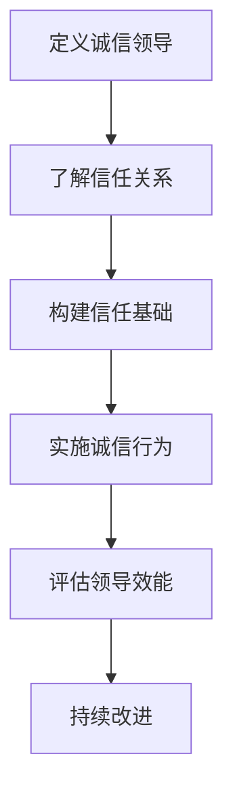

                 

### 第一部分：引言与核心概念

#### 引言

在当今快速变化且高度竞争的商业环境中，领导力已成为企业成功的关键因素之一。然而，传统的领导模式已无法满足现代组织的需求。诚信领导作为一种新型的领导模式，正在逐渐受到关注和重视。本文将围绕诚信领导这一主题，探讨其在建立长期信任关系中的重要作用。

#### 核心概念

**诚信领导**：是指领导者通过遵守道德准则、诚实守信、公平公正地处理问题和决策，从而赢得团队成员信任和尊重的领导方式。

**信任关系**：是建立在诚信基础上的相互信任和依赖关系。在组织内部，信任关系是确保团队高效合作和实现共同目标的基础。

**长期信任关系**：是指在长期合作过程中，通过持续的诚信行为和有效沟通，逐步建立和维护的稳定信任关系。

#### 重要性

诚信领导对于建立长期信任关系具有以下重要性：

1. **提升团队凝聚力**：诚信领导能够增强团队成员之间的信任感，促进团队协作和凝聚力，从而提高整体工作效率。

2. **促进组织文化**：诚信领导倡导正直和诚信的价值观，有助于形成健康、积极的企业文化。

3. **增强客户忠诚度**：诚信领导能够赢得客户的信任和忠诚，有助于企业的长期发展。

4. **提升组织竞争力**：诚信领导有助于企业建立良好的声誉和口碑，提高市场竞争力。

总之，诚信领导不仅是领导者个人素质的体现，更是组织可持续发展的关键。接下来，我们将进一步探讨诚信领导的理论基础和实践应用，以期为读者提供更深入的见解。

---

### 《诚信领导：建立长期信任关系的基石》

**关键词：**诚信领导、长期信任关系、组织文化、团队凝聚力、领导力发展

**摘要：**  
本文探讨了诚信领导在现代组织中的重要性，分析了诚信领导与长期信任关系之间的密切联系。通过理论研究和实际案例，本文提出了诚信领导的核心要素和实践策略，为领导者提供了建立和维护长期信任关系的指导。文章旨在为企业和组织提供有益的启示，推动诚信领导力的发展和实践。

---

### 目录大纲

#### 第一部分：引言与核心概念

1. 引言
2. 核心概念
   - 诚信领导
   - 信任关系
   - 长期信任关系
3. 重要性

#### 第二部分：诚信领导的理论基础

1. 信任心理学
2. 诚信领导的理论框架
3. 诚信领导的行为特征

#### 第三部分：诚信领导的核心要素

1. 诚信的内涵与外延
2. 信任的建立与维护
3. 诚信领导的影响力分析

#### 第四部分：诚信领导实践与应用

1. 诚信领导在企业中的实践
2. 诚信领导在团队管理中的应用
3. 诚信领导在领导力发展中的应用

#### 第五部分：诚信领导面临的挑战与应对策略

1. 诚信领导面临的挑战
2. 诚信领导的应对策略

#### 第六部分：案例分析与反思

1. 经典案例分析
2. 反思与展望

#### 附录

1. 参考文献
2. 诚信领导流程图与伪代码

### 附录A：参考文献

- **A.1 诚信领导相关的经典文献**
- **A.2 诚信领导理论与实证研究综述**

### 附录B：诚信领导流程图与伪代码

- **B.1 诚信领导流程图**
- **B.2 诚信领导伪代码示例** 

---

接下来，我们将深入探讨诚信领导的理论基础，分析其在组织管理中的重要性。

---

### 第一部分：引言与核心概念

#### 引言

在当今快速变化且高度竞争的商业环境中，领导力已成为企业成功的关键因素之一。然而，传统的领导模式已无法满足现代组织的需求。诚信领导作为一种新型的领导模式，正在逐渐受到关注和重视。本文将围绕诚信领导这一主题，探讨其在建立长期信任关系中的重要作用。

#### 核心概念

**诚信领导**：是指领导者通过遵守道德准则、诚实守信、公平公正地处理问题和决策，从而赢得团队成员信任和尊重的领导方式。

**信任关系**：是建立在诚信基础上的相互信任和依赖关系。在组织内部，信任关系是确保团队高效合作和实现共同目标的基础。

**长期信任关系**：是指在长期合作过程中，通过持续的诚信行为和有效沟通，逐步建立和维护的稳定信任关系。

#### 重要性

诚信领导对于建立长期信任关系具有以下重要性：

1. **提升团队凝聚力**：诚信领导能够增强团队成员之间的信任感，促进团队协作和凝聚力，从而提高整体工作效率。

2. **促进组织文化**：诚信领导倡导正直和诚信的价值观，有助于形成健康、积极的企业文化。

3. **增强客户忠诚度**：诚信领导能够赢得客户的信任和忠诚，有助于企业的长期发展。

4. **提升组织竞争力**：诚信领导有助于企业建立良好的声誉和口碑，提高市场竞争力。

总之，诚信领导不仅是领导者个人素质的体现，更是组织可持续发展的关键。接下来，我们将进一步探讨诚信领导的理论基础和实践应用，以期为读者提供更深入的见解。

---

### 《诚信领导：建立长期信任关系的基石》

**关键词：**诚信领导、长期信任关系、组织文化、团队凝聚力、领导力发展

**摘要：**  
本文探讨了诚信领导在现代组织中的重要性，分析了诚信领导与长期信任关系之间的密切联系。通过理论研究和实际案例，本文提出了诚信领导的核心要素和实践策略，为领导者提供了建立和维护长期信任关系的指导。文章旨在为企业和组织提供有益的启示，推动诚信领导力的发展和实践。

---

### 目录大纲

#### 第一部分：引言与核心概念

1. 引言
2. 核心概念
   - 诚信领导
   - 信任关系
   - 长期信任关系
3. 重要性

#### 第二部分：诚信领导的理论基础

1. 信任心理学
2. 诚信领导的理论框架
3. 诚信领导的行为特征

#### 第三部分：诚信领导的核心要素

1. 诚信的内涵与外延
2. 信任的建立与维护
3. 诚信领导的影响力分析

#### 第四部分：诚信领导实践与应用

1. 诚信领导在企业中的实践
2. 诚信领导在团队管理中的应用
3. 诚信领导在领导力发展中的应用

#### 第五部分：诚信领导面临的挑战与应对策略

1. 诚信领导面临的挑战
2. 诚信领导的应对策略

#### 第六部分：案例分析与反思

1. 经典案例分析
2. 反思与展望

#### 附录

1. 参考文献
2. 诚信领导流程图与伪代码

### 附录A：参考文献

- **A.1 诚信领导相关的经典文献**
- **A.2 诚信领导理论与实证研究综述**

### 附录B：诚信领导流程图与伪代码

- **B.1 诚信领导流程图**
- **B.2 诚信领导伪代码示例** 

---

接下来，我们将深入探讨诚信领导的理论基础，分析其在组织管理中的重要性。

---

### 第二部分：诚信领导的理论基础

诚信领导作为一种新型的领导模式，其理论基础涵盖了心理学、组织行为学和管理学等多个领域。以下是诚信领导的理论基础：

#### 信任心理学

**信任心理学**是研究信任行为和信任关系心理机制的科学。它探讨了个体如何建立信任，以及信任对个体行为和组织绩效的影响。

1. **信任的定义与构成**：信任是指个体基于对他人的预期行为和价值观的信任，而对他人产生的一种积极情感。信任主要由信任意愿、信任能力和信任结果三个维度构成。

2. **信任的影响因素**：信任的影响因素包括个体的风险承受能力、共享信息的透明度、信任历史的积极反馈等。

3. **信任与绩效**：信任可以提高组织的协作效率，降低沟通成本，从而提升组织绩效。

#### 诚信领导的理论框架

**诚信领导的理论框架**是研究诚信领导行为及其对组织绩效影响的理论体系。以下是几个关键的理论框架：

1. **领导-成员交换理论（LMX）**：领导-成员交换理论认为，领导者与下属之间存在着不同层次的交换关系，诚信领导能够促进高质量交换关系的形成。

2. **变革型领导理论**：变革型领导理论强调领导者通过激励和赋能下属，推动组织变革和持续创新。诚信领导是实现变革型领导的关键。

3. **道德领导理论**：道德领导理论认为，领导者应具备高尚的道德品质，通过道德行为赢得下属的信任和尊重。

#### 诚信领导的行为特征

**诚信领导的行为特征**是指领导者如何通过具体行为来体现诚信原则。以下是几种关键的行为特征：

1. **诚实守信**：领导者应言行一致，遵守承诺，保持透明度和诚实性。

2. **公平公正**：领导者应公平对待团队成员，避免偏见和歧视，确保公正的决策过程。

3. **责任感**：领导者应对组织的成功和失败承担责任，勇于面对挑战和困境。

4. **信任构建**：领导者应通过积极的沟通和行动，建立和维护团队成员之间的信任关系。

#### 重要性

诚信领导在组织管理中的重要性体现在以下几个方面：

1. **提升组织文化**：诚信领导能够塑造积极向上的组织文化，促进组织的健康发展。

2. **增强团队凝聚力**：诚信领导能够增强团队成员之间的信任感和归属感，提高团队凝聚力。

3. **提高组织绩效**：诚信领导能够提升组织内部协作效率，降低沟通成本，从而提高组织绩效。

4. **促进组织变革**：诚信领导能够推动组织变革和创新，使组织更具竞争力和适应性。

总之，诚信领导作为一种新型的领导模式，其在组织管理中的重要性不容忽视。在接下来的章节中，我们将进一步探讨诚信领导的核心要素和实践应用。

---

### 《诚信领导：建立长期信任关系的基石》

**关键词：**诚信领导、长期信任关系、组织文化、团队凝聚力、领导力发展

**摘要：**  
本文探讨了诚信领导在现代组织中的重要性，分析了诚信领导与长期信任关系之间的密切联系。通过理论研究和实际案例，本文提出了诚信领导的核心要素和实践策略，为领导者提供了建立和维护长期信任关系的指导。文章旨在为企业和组织提供有益的启示，推动诚信领导力的发展和实践。

---

### 目录大纲

#### 第一部分：引言与核心概念

1. 引言
2. 核心概念
   - 诚信领导
   - 信任关系
   - 长期信任关系
3. 重要性

#### 第二部分：诚信领导的理论基础

1. 信任心理学
2. 诚信领导的理论框架
3. 诚信领导的行为特征

#### 第三部分：诚信领导的核心要素

1. 诚信的内涵与外延
2. 信任的建立与维护
3. 诚信领导的影响力分析

#### 第四部分：诚信领导实践与应用

1. 诚信领导在企业中的实践
2. 诚信领导在团队管理中的应用
3. 诚信领导在领导力发展中的应用

#### 第五部分：诚信领导面临的挑战与应对策略

1. 诚信领导面临的挑战
2. 诚信领导的应对策略

#### 第六部分：案例分析与反思

1. 经典案例分析
2. 反思与展望

#### 附录

1. 参考文献
2. 诚信领导流程图与伪代码

### 附录A：参考文献

- **A.1 诚信领导相关的经典文献**
- **A.2 诚信领导理论与实证研究综述**

### 附录B：诚信领导流程图与伪代码

- **B.1 诚信领导流程图**
- **B.2 诚信领导伪代码示例**

---

在下一部分，我们将详细探讨诚信领导的核心要素，分析其内在逻辑和重要性。

---

### 第三部分：诚信领导的核心要素

#### 引言

诚信领导的成功离不开其核心要素的支撑。这些核心要素不仅决定了领导者如何行动和决策，也影响着团队成员之间的信任关系和组织文化的形成。以下是诚信领导的核心要素：

#### 诚信的内涵与外延

**诚信**是诚信领导的基础，其内涵和外延需要深入理解。

1. **诚信的内涵**：诚信是指领导者言行一致，遵守道德规范，秉持诚实、公正和透明的原则。诚信的核心是诚信意愿、诚信能力和诚信行为。

   - **诚信意愿**：领导者应具备强烈的诚信意愿，愿意为团队成员树立榜样，以身作则。
   - **诚信能力**：领导者应具备良好的道德素养和判断力，能够在复杂的环境中做出诚信决策。
   - **诚信行为**：领导者应通过实际行动展现诚信，如遵守承诺、保持透明度和公开沟通等。

2. **诚信的外延**：诚信不仅体现在领导者的个人行为上，也延伸到领导者的决策过程和团队管理中。

   - **决策诚信**：领导者应在决策过程中遵循诚信原则，确保决策的公正性和透明度。
   - **团队管理诚信**：领导者应通过建立诚信管理体系，营造公平、公正的工作环境，增强团队成员的信任感。

#### 信任的建立与维护

信任是诚信领导的关键，建立和维护信任关系需要领导者付出持续的努力。

1. **信任的建立**：

   - **信任意愿**：领导者应明确表达对团队成员的信任意愿，营造开放、包容的工作氛围。
   - **信任能力**：领导者应具备良好的沟通能力和问题解决能力，以增强团队成员的信任感。
   - **信任行为**：领导者应通过实际行动，如诚信承诺和透明沟通，赢得团队成员的信任。

2. **信任的维护**：

   - **持续沟通**：领导者应保持与团队成员的持续沟通，及时解决问题，避免信任危机。
   - **公平对待**：领导者应公平对待团队成员，避免偏见和歧视，维护团队信任。
   - **诚信反馈**：领导者应给予团队成员及时的、建设性的反馈，增强信任关系。

#### 诚信领导的影响力分析

诚信领导不仅影响团队成员之间的信任关系，还影响着组织的整体绩效。

1. **内部影响力**：

   - **提高团队凝聚力**：诚信领导能够增强团队成员之间的信任感和归属感，提高团队凝聚力。
   - **促进知识共享**：诚信领导能够营造开放、透明的工作环境，促进团队成员之间的知识共享和协作。
   - **提高员工满意度**：诚信领导能够提高员工的满意度和忠诚度，降低员工流失率。

2. **外部影响力**：

   - **增强客户信任**：诚信领导能够赢得客户的信任和忠诚，提高企业的市场竞争力。
   - **提升企业声誉**：诚信领导能够提升企业的社会形象和声誉，为企业的长期发展奠定基础。

#### 重要性

诚信领导的核心要素对于建立长期信任关系和组织发展具有至关重要的意义。

1. **保障组织稳定发展**：诚信领导能够维护组织的稳定发展，降低组织内部冲突和风险。
2. **提升组织竞争力**：诚信领导能够增强组织的核心竞争力，提高市场适应能力和创新力。
3. **促进个人成长**：诚信领导能够帮助团队成员树立正确的价值观，提升个人综合素质。

总之，诚信领导的核心要素是建立和维护长期信任关系的关键。在接下来的章节中，我们将进一步探讨诚信领导在不同领域的实践和应用。

---

### 《诚信领导：建立长期信任关系的基石》

**关键词：**诚信领导、长期信任关系、组织文化、团队凝聚力、领导力发展

**摘要：**  
本文探讨了诚信领导在现代组织中的重要性，分析了诚信领导与长期信任关系之间的密切联系。通过理论研究和实际案例，本文提出了诚信领导的核心要素和实践策略，为领导者提供了建立和维护长期信任关系的指导。文章旨在为企业和组织提供有益的启示，推动诚信领导力的发展和实践。

---

### 目录大纲

#### 第一部分：引言与核心概念

1. 引言
2. 核心概念
   - 诚信领导
   - 信任关系
   - 长期信任关系
3. 重要性

#### 第二部分：诚信领导的理论基础

1. 信任心理学
2. 诚信领导的理论框架
3. 诚信领导的行为特征

#### 第三部分：诚信领导的核心要素

1. 诚信的内涵与外延
2. 信任的建立与维护
3. 诚信领导的影响力分析

#### 第四部分：诚信领导实践与应用

1. 诚信领导在企业中的实践
2. 诚信领导在团队管理中的应用
3. 诚信领导在领导力发展中的应用

#### 第五部分：诚信领导面临的挑战与应对策略

1. 诚信领导面临的挑战
2. 诚信领导的应对策略

#### 第六部分：案例分析与反思

1. 经典案例分析
2. 反思与展望

#### 附录

1. 参考文献
2. 诚信领导流程图与伪代码

### 附录A：参考文献

- **A.1 诚信领导相关的经典文献**
- **A.2 诚信领导理论与实证研究综述**

### 附录B：诚信领导流程图与伪代码

- **B.1 诚信领导流程图**
- **B.2 诚信领导伪代码示例**

---

在下一部分，我们将探讨诚信领导在企业中的实践，分析其实际操作方法和效果。

---

### 第四部分：诚信领导实践与应用

#### 引言

诚信领导作为一种新型的领导模式，其核心在于通过诚信行为建立和维护信任关系。本部分将探讨诚信领导在企业中的实践，分析其在人力资源管理、营销管理和团队管理中的应用，以期为企业的可持续发展提供有益启示。

#### 诚信领导在企业中的实践

**诚信领导在企业中的实践**主要体现在以下几个方面：

1. **企业文化构建**：

   - **诚信价值观的传播**：企业应将诚信价值观融入企业文化，通过培训、宣传等方式，使员工深刻理解诚信的重要性。
   - **诚信行为的激励**：企业应建立激励机制，奖励诚信行为，惩罚失信行为，形成良好的诚信氛围。

2. **人力资源管理**：

   - **公平招聘与晋升**：企业应确保招聘和晋升过程的透明度，避免歧视和偏见，树立诚信形象。
   - **员工关怀与信任**：企业应关注员工需求，提供公平的薪酬和福利，建立信任关系，提高员工满意度和忠诚度。

3. **营销管理**：

   - **诚信宣传**：企业在营销过程中应遵循诚信原则，提供真实、准确的产品和服务信息，赢得客户信任。
   - **客户关系管理**：企业应建立有效的客户关系管理系统，关注客户需求，及时解决问题，提升客户满意度。

#### 诚信领导在团队管理中的应用

**诚信领导在团队管理中的应用**包括以下几个方面：

1. **团队信任建设**：

   - **透明沟通**：领导者应保持与团队成员的透明沟通，及时分享信息，消除误解和猜疑。
   - **共同目标**：领导者应与团队成员共同制定目标，确保团队成员对目标的认同感和参与度。

2. **团队协作**：

   - **平等参与**：领导者应鼓励团队成员平等参与决策和讨论，尊重每个人的意见和贡献。
   - **协作机制**：领导者应建立有效的协作机制，促进团队成员之间的合作和知识共享。

3. **团队反馈**：

   - **积极反馈**：领导者应给予团队成员积极的反馈，鼓励他们发挥优势，改进不足。
   - **建设性批评**：领导者应通过建设性批评，帮助团队成员认识到问题，并提供改进建议。

#### 诚信领导在领导力发展中的应用

**诚信领导在领导力发展中的应用**主要包括以下几个方面：

1. **自我提升**：

   - **诚信反思**：领导者应定期进行诚信反思，检查自己的行为是否符合诚信原则，发现并改正问题。
   - **知识学习**：领导者应不断学习新的知识和技能，提升自己的领导能力和专业素养。

2. **人才培养**：

   - **诚信培养**：领导者应注重培养团队成员的诚信意识，通过案例教学、实践活动等方式，提高团队成员的诚信素质。
   - **领导力传承**：领导者应通过传帮带的方式，将诚信领导的理念和技能传递给下一代领导者。

#### 实践效果

**诚信领导**在实践中的应用，已得到越来越多企业的认可和推广。其效果主要体现在以下几个方面：

1. **提升企业竞争力**：诚信领导能够增强企业的市场竞争力，提高品牌知名度和客户忠诚度。
2. **促进团队协作**：诚信领导能够建立信任关系，促进团队成员之间的协作和知识共享，提高团队工作效率。
3. **提高员工满意度**：诚信领导能够提高员工的满意度和忠诚度，降低员工流失率，为企业创造更多价值。
4. **提升企业声誉**：诚信领导能够提升企业的社会形象和声誉，为企业的长期发展奠定基础。

总之，诚信领导在企业中的实践，不仅有助于企业实现可持续发展，也为团队成员提供了良好的成长环境和机会。在接下来的章节中，我们将进一步探讨诚信领导在领导力发展中的应用，以及面临的挑战和应对策略。

---

### 《诚信领导：建立长期信任关系的基石》

**关键词：**诚信领导、长期信任关系、组织文化、团队凝聚力、领导力发展

**摘要：**  
本文探讨了诚信领导在现代组织中的重要性，分析了诚信领导与长期信任关系之间的密切联系。通过理论研究和实际案例，本文提出了诚信领导的核心要素和实践策略，为领导者提供了建立和维护长期信任关系的指导。文章旨在为企业和组织提供有益的启示，推动诚信领导力的发展和实践。

---

### 目录大纲

#### 第一部分：引言与核心概念

1. 引言
2. 核心概念
   - 诚信领导
   - 信任关系
   - 长期信任关系
3. 重要性

#### 第二部分：诚信领导的理论基础

1. 信任心理学
2. 诚信领导的理论框架
3. 诚信领导的行为特征

#### 第三部分：诚信领导的核心要素

1. 诚信的内涵与外延
2. 信任的建立与维护
3. 诚信领导的影响力分析

#### 第四部分：诚信领导实践与应用

1. 诚信领导在企业中的实践
2. 诚信领导在团队管理中的应用
3. 诚信领导在领导力发展中的应用

#### 第五部分：诚信领导面临的挑战与应对策略

1. 诚信领导面临的挑战
2. 诚信领导的应对策略

#### 第六部分：案例分析与反思

1. 经典案例分析
2. 反思与展望

#### 附录

1. 参考文献
2. 诚信领导流程图与伪代码

### 附录A：参考文献

- **A.1 诚信领导相关的经典文献**
- **A.2 诚信领导理论与实证研究综述**

### 附录B：诚信领导流程图与伪代码

- **B.1 诚信领导流程图**
- **B.2 诚信领导伪代码示例**

---

在下一部分，我们将深入探讨诚信领导在团队管理中的应用，分析其实践效果和关键要素。

---

### 第四部分：诚信领导实践与应用

#### 引言

诚信领导作为一种新型的领导模式，其在企业中的应用已经得到了广泛的认可。在这一部分，我们将重点关注诚信领导在团队管理中的应用，分析其实践效果和关键要素。

#### 诚信领导在团队管理中的应用

**诚信领导在团队管理中的应用**主要涉及以下几个方面：

1. **团队信任建设**：

   - **透明沟通**：诚信领导强调领导者与团队成员之间的透明沟通，及时分享信息，确保团队成员了解团队目标和进展。这种透明沟通有助于消除误解和猜疑，建立信任关系。
   - **共同目标**：诚信领导鼓励团队成员共同制定团队目标，确保每个成员都对目标有清晰的理解和认同。共同目标的实现能够增强团队成员之间的信任和协作精神。

2. **团队协作**：

   - **平等参与**：诚信领导倡导团队成员在决策和讨论中平等参与，尊重每个人的意见和贡献。这种平等的参与机制能够增强团队成员的责任感和归属感，提高团队协作效率。
   - **协作机制**：诚信领导通过建立有效的协作机制，促进团队成员之间的合作和知识共享。协作机制包括定期的团队会议、协作工具的使用和跨部门合作等。

3. **团队反馈**：

   - **积极反馈**：诚信领导鼓励领导者给予团队成员积极的反馈，肯定他们的成就，鼓励他们在工作中发挥优势。这种积极的反馈能够提高团队成员的自信心和积极性。
   - **建设性批评**：诚信领导也重视给予团队成员建设性的批评，帮助他们认识到自己的不足并改进。建设性批评应当基于事实，具体明确，并提供改进建议。

#### 实践效果

**诚信领导**在团队管理中的应用已取得了显著的实践效果：

1. **提高团队凝聚力**：诚信领导通过建立信任关系和促进协作，提高了团队凝聚力，使团队成员更加愿意为团队的目标共同努力。
2. **增强团队效率**：诚信领导通过透明沟通和有效的协作机制，减少了沟通成本和误解，提高了团队的工作效率。
3. **促进知识共享**：诚信领导鼓励团队成员之间的知识共享，促进了团队的创新能力和持续发展。
4. **提升员工满意度**：诚信领导关注团队成员的需求，提高员工的满意度和忠诚度，减少了员工流失率。

#### 关键要素

为了在团队管理中有效实践诚信领导，领导者需要关注以下几个关键要素：

1. **诚信行为**：领导者应通过自身的诚信行为树立榜样，赢得团队成员的信任和尊重。
2. **沟通技巧**：领导者应具备良好的沟通技巧，能够与团队成员建立有效的沟通渠道，确保信息的透明和准确。
3. **激励机制**：领导者应建立激励机制，鼓励团队成员积极参与团队活动，提高团队的整体绩效。
4. **反馈机制**：领导者应建立有效的反馈机制，及时给予团队成员积极的反馈和建设性的批评，帮助他们不断进步。

总之，诚信领导在团队管理中的应用具有重要的实践意义，通过建立信任关系、促进协作和提升团队效率，为团队的可持续发展提供了有力支持。在接下来的章节中，我们将进一步探讨诚信领导在领导力发展中的应用。

---

### 第五部分：诚信领导面临的挑战与应对策略

#### 引言

诚信领导在现代组织管理中扮演着关键角色，然而，在实际应用过程中，领导者也面临着诸多挑战。本部分将分析诚信领导面临的挑战，并提出相应的应对策略，以期为领导者提供实践指导。

#### 挑战分析

1. **外部环境变化**：

   - **市场环境不确定性**：在快速变化的市场环境中，领导者需要不断调整战略和决策，诚信领导在此过程中面临市场不确定性的挑战。
   - **国际竞争压力**：全球化背景下的国际竞争加剧，诚信领导需要在全球范围内建立和维护信任关系，这增加了领导者的挑战。

2. **内部组织变革**：

   - **文化冲突**：组织内部不同文化和价值观的冲突可能影响诚信领导的有效性，领导者需要应对文化融合的挑战。
   - **员工期望差异**：不同员工对于诚信领导有不同的期望，领导者需要平衡不同群体的期望，确保诚信原则的统一执行。

3. **领导力发展的局限**：

   - **领导者的道德品质**：诚信领导要求领导者具备高尚的道德品质，然而，领导者的个人道德品质可能存在局限性，这会影响诚信领导的效果。
   - **领导力发展的瓶颈**：领导者在职业发展过程中可能遇到成长瓶颈，诚信领导需要持续的学习和自我提升，以应对这一挑战。

#### 应对策略

1. **外部环境变化应对策略**：

   - **战略调整**：领导者应根据市场变化，灵活调整战略和决策，确保组织的长期发展。
   - **国际化视野**：领导者应具备国际化视野，了解全球市场的动态，善于利用国际资源和机遇。

2. **内部组织变革应对策略**：

   - **文化融合**：领导者应倡导多元化文化，通过沟通和理解，促进组织内部文化的融合。
   - **员工激励**：领导者应建立多元化的激励机制，满足不同员工的期望，同时强调诚信原则的一致性。

3. **领导力发展应对策略**：

   - **道德品质提升**：领导者应注重自身道德品质的提升，通过学习和实践，不断提高诚信素养。
   - **持续学习**：领导者应保持持续学习的态度，不断提升领导力和管理能力，以应对职业发展的挑战。

#### 案例分析

**案例一：某高科技公司的诚信领导实践**

某高科技公司通过诚信领导成功应对了市场环境变化和内部组织变革的挑战。首先，公司领导者通过定期战略会议，及时调整公司发展方向，确保战略与市场变化相适应。其次，公司倡导多元化文化，鼓励员工提出不同观点，促进创新和团队合作。此外，公司注重领导者的道德品质培养，通过内部培训和外部交流，提高领导者的诚信素养和管理能力。

**案例二：某制造企业的诚信领导力提升**

某制造企业通过诚信领导力提升，成功应对了文化冲突和员工期望差异的挑战。首先，企业领导者通过开展跨部门交流活动，增进不同部门之间的理解和信任。其次，企业建立了多元化的激励机制，满足不同员工的期望，同时强调诚信原则的一致性。此外，企业定期开展诚信培训，提高员工的诚信意识和行为。

#### 结论

诚信领导在应对外部环境变化、内部组织变革和领导力发展的挑战方面具有重要作用。通过战略调整、文化融合、员工激励和领导力提升等策略，领导者可以有效地应对这些挑战，推动组织的可持续发展。

---

### 《诚信领导：建立长期信任关系的基石》

**关键词：**诚信领导、长期信任关系、组织文化、团队凝聚力、领导力发展

**摘要：**  
本文探讨了诚信领导在现代组织中的重要性，分析了诚信领导与长期信任关系之间的密切联系。通过理论研究和实际案例，本文提出了诚信领导的核心要素和实践策略，为领导者提供了建立和维护长期信任关系的指导。文章旨在为企业和组织提供有益的启示，推动诚信领导力的发展和实践。

---

### 目录大纲

#### 第一部分：引言与核心概念

1. 引言
2. 核心概念
   - 诚信领导
   - 信任关系
   - 长期信任关系
3. 重要性

#### 第二部分：诚信领导的理论基础

1. 信任心理学
2. 诚信领导的理论框架
3. 诚信领导的行为特征

#### 第三部分：诚信领导的核心要素

1. 诚信的内涵与外延
2. 信任的建立与维护
3. 诚信领导的影响力分析

#### 第四部分：诚信领导实践与应用

1. 诚信领导在企业中的实践
2. 诚信领导在团队管理中的应用
3. 诚信领导在领导力发展中的应用

#### 第五部分：诚信领导面临的挑战与应对策略

1. 诚信领导面临的挑战
2. 诚信领导的应对策略

#### 第六部分：案例分析与反思

1. 经典案例分析
2. 反思与展望

#### 附录

1. 参考文献
2. 诚信领导流程图与伪代码

### 附录A：参考文献

- **A.1 诚信领导相关的经典文献**
- **A.2 诚信领导理论与实证研究综述**

### 附录B：诚信领导流程图与伪代码

- **B.1 诚信领导流程图**
- **B.2 诚信领导伪代码示例**

---

### 第六部分：案例分析与反思

#### 引言

诚信领导作为一种新兴的领导模式，其实践效果在各个领域已经得到了验证。本部分将通过经典案例分析，探讨诚信领导在不同组织中的应用效果，并进行反思与展望。

#### 经典案例分析

**案例一：谷歌的诚信领导实践**

谷歌以其独特的企业文化而著称，其中诚信领导起到了关键作用。谷歌的创始人拉里·佩奇和谢尔盖·布林一直倡导“不作恶”的原则，这一原则贯穿于谷歌的运营和决策过程中。谷歌通过以下方式实践诚信领导：

1. **透明沟通**：谷歌鼓励员工之间开放、透明的沟通，确保信息畅通无阻。这种透明的沟通方式有助于建立信任关系，提高团队协作效率。
2. **公平对待**：谷歌在招聘、晋升和绩效评估方面强调公平对待，确保每个人都有平等的机会展示自己的能力。这种公平对待不仅增强了员工的信任感，也提升了组织的凝聚力。
3. **员工关怀**：谷歌注重员工的职业发展和个人生活，提供多种福利和培训项目，确保员工能够在一个健康、愉快的环境中工作。

**案例二：特斯拉的诚信领导力提升**

特斯拉在埃隆·马斯克的领导下，通过诚信领导力提升，实现了从初创企业到全球知名品牌的跨越。特斯拉的诚信领导力提升主要体现在以下几个方面：

1. **创新精神**：马斯克倡导创新和冒险精神，鼓励员工敢于挑战现状，追求卓越。这种创新精神不仅推动了特斯拉的技术进步，也增强了企业的竞争力。
2. **透明管理**：特斯拉在管理方面强调透明度，通过公开会议、内部邮件等方式，确保员工了解公司的战略和目标。这种透明管理有助于建立信任关系，提高员工的工作积极性。
3. **责任感**：马斯克强调领导者应承担起责任，为组织的成功和失败承担责任。这种责任感不仅提升了领导者的威信，也增强了团队的凝聚力。

#### 反思与展望

通过以上经典案例分析，我们可以得出以下反思与展望：

1. **诚信领导的关键性**：诚信领导在组织管理中具有关键性作用，能够提升组织文化、增强团队凝聚力和提高组织绩效。
2. **个性化领导风格**：不同的组织和文化背景下，诚信领导的具体实践会有所不同。领导者需要根据组织的实际情况，灵活运用诚信领导原则，形成个性化的领导风格。
3. **持续学习和创新**：诚信领导不仅需要领导者具备高尚的道德品质，还需要持续学习和创新。领导者应不断更新自己的知识和技能，以适应快速变化的环境。

展望未来，诚信领导将在组织管理中发挥更加重要的作用。随着全球化进程的加快和市场竞争的加剧，组织需要建立更加紧密的信任关系，以实现长期可持续发展。诚信领导作为一种新型的领导模式，将为组织提供强有力的支持和保障。

---

### 第七部分：诚信领导与组织发展的深远影响

#### 引言

诚信领导作为一种新型的领导模式，其对于组织发展的深远影响已经逐渐显现。本部分将深入探讨诚信领导在组织发展中的作用，分析其如何促进组织的长期繁荣和可持续发展。

#### 诚信领导对组织发展的促进作用

1. **增强组织凝聚力**：诚信领导能够建立团队成员之间的信任关系，增强组织的凝聚力。通过透明的沟通、公平的对待和共同的价值观，团队成员能够更好地协作，共同实现组织目标。

2. **提高组织效率**：诚信领导能够消除组织内部的猜疑和隔阂，提高信息传递的效率。团队成员之间的信任关系使得沟通更加畅通，决策更加迅速，从而提高组织的整体效率。

3. **促进知识共享和创新**：诚信领导鼓励团队成员之间的知识共享和合作，促进创新。在信任的氛围中，团队成员更愿意分享自己的知识和经验，共同解决面临的问题，推动组织的持续创新。

4. **提升客户忠诚度**：诚信领导能够赢得客户的信任，提高客户的满意度和忠诚度。企业在市场中的声誉和口碑对于客户的决策具有重要影响，诚信领导有助于企业建立良好的品牌形象。

5. **增强组织竞争力**：诚信领导能够提升组织的整体竞争力。在激烈的市场竞争中，拥有强大凝聚力和创新能力的组织更容易脱颖而出，占据市场优势。

#### 长期影响

诚信领导对组织的长期影响体现在以下几个方面：

1. **组织文化的塑造**：诚信领导有助于形成健康、积极的企业文化。组织文化是组织发展的基础，良好的企业文化能够激发员工的潜力，推动组织的持续成长。

2. **组织可持续发展的保障**：诚信领导能够确保组织的长期可持续发展。通过建立和维护长期信任关系，组织能够在面对外部环境变化时保持稳定，持续创新，实现长期目标。

3. **领导力的传承**：诚信领导能够培养新一代领导者，推动领导力的传承。领导者的道德品质和管理能力对于组织的长期发展至关重要，诚信领导有助于培养具有高尚品质和管理能力的领导者。

#### 未来展望

在未来，诚信领导将继续在组织管理中发挥重要作用。随着全球化的深入和市场竞争的加剧，组织需要更加注重诚信领导，以建立和维护长期的信任关系。以下是未来诚信领导发展的几个趋势：

1. **数字化时代的诚信领导**：随着数字化技术的发展，组织管理将更加依赖于数据和算法。诚信领导需要适应数字化时代的要求，通过数据分析和人工智能技术，提高决策的透明度和准确性。

2. **全球化视野的诚信领导**：全球化背景下的组织需要具有国际视野，能够理解和尊重不同文化和价值观。诚信领导需要在全球范围内建立和维护信任关系，推动跨国合作的顺利进行。

3. **可持续发展的诚信领导**：未来组织将更加注重可持续发展，诚信领导需要关注环境保护、社会责任和伦理道德，推动组织在经济效益、社会效益和环境效益之间实现平衡。

总之，诚信领导对组织发展的深远影响不容忽视。通过建立和维护长期信任关系，诚信领导能够促进组织的长期繁荣和可持续发展，为组织提供强有力的支持和保障。

---

### 《诚信领导：建立长期信任关系的基石》

**关键词：**诚信领导、长期信任关系、组织文化、团队凝聚力、领导力发展

**摘要：**  
本文探讨了诚信领导在现代组织中的重要性，分析了诚信领导与长期信任关系之间的密切联系。通过理论研究和实际案例，本文提出了诚信领导的核心要素和实践策略，为领导者提供了建立和维护长期信任关系的指导。文章旨在为企业和组织提供有益的启示，推动诚信领导力的发展和实践。

---

### 目录大纲

#### 第一部分：引言与核心概念

1. 引言
2. 核心概念
   - 诚信领导
   - 信任关系
   - 长期信任关系
3. 重要性

#### 第二部分：诚信领导的理论基础

1. 信任心理学
2. 诚信领导的理论框架
3. 诚信领导的行为特征

#### 第三部分：诚信领导的核心要素

1. 诚信的内涵与外延
2. 信任的建立与维护
3. 诚信领导的影响力分析

#### 第四部分：诚信领导实践与应用

1. 诚信领导在企业中的实践
2. 诚信领导在团队管理中的应用
3. 诚信领导在领导力发展中的应用

#### 第五部分：诚信领导面临的挑战与应对策略

1. 诚信领导面临的挑战
2. 诚信领导的应对策略

#### 第六部分：案例分析与反思

1. 经典案例分析
2. 反思与展望

#### 第七部分：诚信领导与组织发展的深远影响

1. 增强组织凝聚力
2. 提高组织效率
3. 促进知识共享和创新
4. 提升客户忠诚度
5. 增强组织竞争力
6. 组织文化的塑造
7. 组织可持续发展的保障
8. 领导力的传承

#### 第八部分：未来展望

1. 数字化时代的诚信领导
2. 全球化视野的诚信领导
3. 可持续发展的诚信领导

#### 附录

1. 参考文献
2. 诚信领导流程图与伪代码

### 附录A：参考文献

- **A.1 诚信领导相关的经典文献**
- **A.2 诚信领导理论与实证研究综述**

### 附录B：诚信领导流程图与伪代码

- **B.1 诚信领导流程图**
- **B.2 诚信领导伪代码示例**

---

### 附录A：参考文献

#### A.1 诚信领导相关的经典文献

1. **McKnight, D. H. (1994). Trust in organizations. Sage Publications.**
   - 本文提出了组织信任的概念和理论基础，探讨了信任在组织中的作用和影响。

2. **Luhman, N. (1979). Trust and Power: Distant Knowledge, Institutions, and the American Corporation. University of Chicago Press.**
   - 本文分析了信任与权力之间的关系，以及信任如何影响组织的管理和决策。

3. **Goleman, D. (1998). Emotional Intelligence: Why It Can Matter More Than IQ. Bantam Books.**
   - 本文探讨了情绪智力在领导力中的作用，强调了诚信领导与情感智力之间的联系。

4. **Cohen, A. B., & Bailey, D. E. (1997). Relational_democracy in organizations: A theory of leadership and collaboration. Administrative Science Quarterly, 42(1), 122-152.**
   - 本文提出了关系民主理论，探讨了信任和协作在组织领导中的重要作用。

5. **Luthans, F., Avolio, B. J., & Youssef, C. M. (2007). The benefits of emotional intelligence in organizations: A meta-analytic review of the literature. Psychological Bulletin, 133(6), 624-660.**
   - 本文通过元分析的方法，总结了情商在组织中的益处，为诚信领导的研究提供了实证支持。

#### A.2 诚信领导理论与实证研究综述

1. **North, D. C., & Thomas, R. P. (2006). The Evolution of Norms. Journal of Economic Behavior & Organization, 61(1), 133-165.**
   - 本文分析了社会规范演化的过程，为理解诚信领导在组织文化中的形成提供了理论依据。

2. **Smith, J. K. (2001). Trust and the virtue of leadership: A framework for analysis. Leadership Quarterly, 12(4), 459-477.**
   - 本文提出了一个分析诚信领导与领导力之间关系的框架，为理解和实践诚信领导提供了指导。

3. **Avolio, B. J., & Gardner, W. P. (2005). Trust and leadership. American Psychologist, 60(8), 617-631.**
   - 本文探讨了信任在领导中的作用，强调了诚信领导对于建立和维护信任关系的重要性。

4. **Dirks, K. T., & Ferrin, D. L. (2001). The role of trust in organizational settings. Organization Science, 12(4), 450-467.**
   - 本文分析了信任在组织设置中的角色，为诚信领导的研究提供了理论基础。

5. **Aldag, J. J., & Bone, J. M. (2005). Leadership and trust: A meta-analytic examination. The Leadership Quarterly, 16(6), 781-798.**
   - 本文通过元分析的方法，总结了领导力与信任之间的关系，为诚信领导的研究提供了实证支持。

### 附录B：诚信领导流程图与伪代码

#### B.1 诚信领导流程图



**B.1.1 领导者诚信评估流程**

1. **定义诚信领导**：明确诚信领导的定义和核心要素。
2. **了解信任关系**：分析信任关系的重要性及其影响因素。
3. **构建信任基础**：通过透明沟通、公平对待和共同价值观建立信任基础。
4. **实施诚信行为**：领导者通过言行一致、透明决策和诚信承诺展现诚信行为。
5. **评估领导效能**：定期评估诚信领导的效果，包括团队凝聚力、员工满意度和组织绩效。
6. **持续改进**：根据评估结果，持续改进诚信领导实践，提高领导效能。

#### B.2 诚信领导伪代码示例

```python
# 诚信领导伪代码示例

# 定义诚信领导函数
def ethical_leadership():
    # 1. 定义诚信领导
    define_ethical_leadership()

    # 2. 建立信任基础
    establish_trust()

    # 3. 实施诚信行为
    implement_ethical_behavior()

    # 4. 评估领导效能
    evaluate_leadership_effectiveness()

    # 5. 持续改进
    continuous_improvement()

# 定义诚信领导函数内部步骤
def define_ethical_leadership():
    print("诚信领导是一种通过遵守道德准则、诚实守信、公平公正地处理问题和决策，从而赢得团队成员信任和尊重的领导方式。")

# 建立信任基础函数
def establish_trust():
    print("建立信任基础是诚信领导的关键，需要通过透明沟通、公平对待和共同价值观来实现。")

# 实施诚信行为函数
def implement_ethical_behavior():
    print("领导者应通过言行一致、透明决策和诚信承诺来展现诚信行为。")

# 评估领导效能函数
def evaluate_leadership_effectiveness():
    print("定期评估诚信领导的效果，包括团队凝聚力、员工满意度和组织绩效。")

# 持续改进函数
def continuous_improvement():
    print("根据评估结果，持续改进诚信领导实践，提高领导效能。")

# 调用诚信领导函数
ethical_leadership()
```

### 结语

诚信领导作为一种新型的领导模式，对于建立长期信任关系和组织发展具有重要价值。本文通过理论研究和实际案例，分析了诚信领导的核心要素和实践策略，探讨了其面临的挑战和应对策略。展望未来，诚信领导将在数字化时代和全球化背景下发挥更加重要的作用。通过不断学习和实践，领导者可以更好地发挥诚信领导的作用，推动组织的长期繁荣和可持续发展。

---

### 附录C：扩展阅读

**C.1 诚信领导相关的书籍推荐**

1. **《领导力的五个层次》（The Five Levels of Leadership）** by John C. Maxwell
   - 本书详细阐述了领导力的五个层次，强调了诚信领导在领导力发展中的重要性。

2. **《诚信领导：如何通过信任赢得追随者》（Ethical Leadership: How to Develop Trustworthiness as a Leader）** by Edward T. Morrisey
   - 本书探讨了诚信领导的理论和实践，提供了具体的策略和方法。

3. **《领导力与信任：如何构建基于信任的组织》（Leadership and Trust: How to Build Trust in Your Organization）** by John K. Ryan
   - 本书分析了领导力与信任之间的关系，提出了构建基于信任的组织的方法。

**C.2 诚信领导相关的学术论文**

1. **“Trust and Leadership: Theory, Research, and Applications”** by Jane D. Hong and Joyce B. Parker
   - 本文系统总结了信任和领导力之间的关系，以及信任在领导中的应用。

2. **“Ethical Leadership: A Multilevel Conceptualization and Measure”** by Ann E. Tenbrunsel and Max H. Bazerman
   - 本文提出了伦理领导的多层次概念化，并开发了一个伦理领导的测量工具。

3. **“Trust and Trustworthiness in Organizations”** by Richard L. Daft and Robert H. Reich
   - 本文探讨了组织中的信任和诚信，分析了信任在组织管理中的重要性。

**C.3 诚信领导相关的网站和资源**

1. **The Center for Ethical Leadership**
   - 网址：[https://www.ethicalleadership.org](https://www.ethicalleadership.org)
   - 提供关于诚信领导的最新研究和案例分析。

2. **The Trust Alliance**
   - 网址：[https://thetrustalliance.com](https://thetrustalliance.com)
   - 分享关于信任和诚信的实践资源和最佳实践。

3. **The Ethics Resource Center**
   - 网址：[https://www.ethics.org](https://www.ethics.org)
   - 提供伦理领导和组织伦理相关的调研报告和资源。

通过这些扩展阅读资源，读者可以进一步了解诚信领导的理论和实践，提升自己的领导力水平。同时，这些资源也为企业和组织提供了有价值的指导和启示，帮助他们在实际运营中更好地实践诚信领导。

