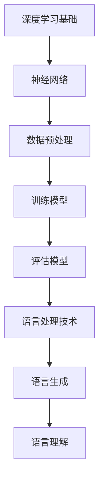

                 

# 《语言与思维的关系：大模型的挑战》

## 关键词
- 语言与思维
- 大模型
- 自然语言处理
- 深度学习
- 语言生成
- 数据隐私

## 摘要
本文深入探讨了语言与思维之间的关系，以及大模型在自然语言处理领域中的挑战。通过哲学探讨、技术分析、实证研究和未来展望，本文揭示了语言和思维如何相互影响，并探讨了大规模语言模型在语言理解和生成中的重要性。此外，本文还讨论了数据隐私和伦理问题，并提出了对大模型未来发展的展望。

### 第一部分：语言与思维的哲学探讨

#### 第1章：语言与思维的概述

##### 1.1 语言的起源与演变

语言是人类社会发展的基石，其起源可以追溯到远古时代。语言的起源可能与人类的社交需求、认知能力和交流欲望密切相关。随着人类社会的发展，语言经历了从简单到复杂、从口语到文字的演变过程。

$$
\text{语言演变过程} = \text{口语} \rightarrow \text{文字} \rightarrow \text{数字化语言}
$$

语言的演变不仅丰富了人类表达和沟通的方式，还推动了人类文明的发展。从口头传统到文字记录，再到现代的数字化语言，语言的形式不断进化，但其核心功能——传递信息和交流思想——始终保持不变。

##### 1.1.1 语言的定义与功能

语言是一种复杂的符号系统，用于表达思想、传递信息、实现沟通。其基本元素包括词汇、语法、语音和语义。语言的主要功能包括：

1. **信息传递**：通过语言，人们可以描述事实、表达情感、分享知识和经验。
2. **思维表达**：语言是思维的外在表现，人们通过语言来思考、推理和论证。
3. **社会互动**：语言是社会交往的工具，人们在日常交流、商业交易和政治活动中使用语言来实现共同目标。
4. **文化传承**：语言是文化的重要组成部分，它承载着历史、价值观和传统习俗。

##### 1.1.2 语言的起源与演化过程

关于语言的起源，学者们提出了多种假说。其中，最常见的观点是“自然进化论”和“劳动起源论”。

1. **自然进化论**：这一观点认为，语言是生物进化的产物，随着人类大脑的发展，语言能力逐渐形成。语言起源于简单的声音信号，这些信号经过长期的使用和进化，逐渐发展成为复杂的语言系统。
2. **劳动起源论**：这一观点强调劳动对语言起源的作用。随着人类劳动活动的复杂化，人们需要通过语言来协调合作、交流思想，从而促进了语言的发展。

无论是哪种假说，都强调了语言与社会需求、认知能力和文化传承之间的紧密联系。随着人类社会的发展，语言也在不断演变，以适应新的社会环境和需求。

##### 1.2 思维的心理学与哲学基础

思维是大脑对信息进行加工、分析和理解的过程。心理学和哲学为研究思维提供了丰富的理论基础。

##### 1.2.1 思维的定义与类型

思维可以分为多种类型，包括：

1. **抽象思维**：通过概念和符号进行抽象推理。
2. **形象思维**：通过具体形象和表象进行思维。
3. **逻辑思维**：基于逻辑规则进行推理和论证。
4. **辩证思维**：通过对矛盾的分析和解决进行思维。

心理学研究表明，思维具有以下特征：

1. **目的性**：思维总是为了解决问题或达到特定目标。
2. **间接性**：思维通过中间环节来反映客观事物。
3. **概括性**：思维能够从具体事物中抽象出一般规律。
4. **创造性**：思维能够产生新的想法和解决方案。

##### 1.2.2 心理学与哲学对思维的研究

心理学研究思维的过程、机制和影响因素，如注意力、记忆、知觉等。哲学则关注思维的本质、意义和目的，探讨思维与存在、真理、知识等哲学问题。

哲学上的思维研究可以追溯到古希腊哲学家。亚里士多德认为，思维是灵魂的器官，是人类理解世界和获取知识的基础。康德则提出，思维具有先验结构和范畴，这些结构是人类认知世界的基础。

心理学与哲学的结合，为理解思维提供了多维度、多层次的视角。通过心理学实验和哲学思考，学者们不断深化对思维的认识，推动了思维研究的进展。

##### 1.3 语言与思维的互动关系

语言与思维是密切相关的，二者相互影响、相互促进。

##### 1.3.1 语言对思维的影响

1. **语言能力与思维能力**：研究表明，语言能力与思维能力之间存在密切关系。语言能力越强，思维能力也越强。这是因为语言是思维的外在表现，通过语言学习和使用，人们可以更好地进行抽象思考和逻辑推理。
2. **语言多样性**：不同语言具有不同的语法、词汇和表达方式，这影响了人们对事物的认识和思维方式。例如，一些研究表明，使用不同语言的人在对时间和空间的感知上存在差异。

##### 1.3.2 思维对语言表达的塑造

思维对语言表达有着重要影响。思维活动需要语言来表达，因此思维方式和语言表达之间存在紧密联系。

1. **思维模式**：不同文化背景和思维方式会影响语言表达。例如，西方文化强调逻辑和理性，因此西方语言在表达时更注重逻辑结构和明确性。而东方文化则强调关系和和谐，因此东方语言在表达时更注重意境和含蓄性。
2. **语言创新**：思维的创新性推动了语言的发展。随着社会和科技的发展，人们不断创造新的词汇和表达方式，以适应新的社会环境和需求。

总之，语言与思维是相互依存、相互促进的关系。语言是人类思维的外在表现，而思维则是语言发展的内在动力。通过对语言与思维的研究，我们可以更好地理解人类认知世界的方式，为人工智能的发展提供理论支持。

### 第二部分：大模型与语言处理技术基础

#### 第2章：大模型与语言处理技术基础

##### 2.1 大模型的基本原理

大模型（Large Models）是指具有数十亿甚至千亿参数规模的人工神经网络。这些模型通过深度学习算法在大量数据上训练，从而获得强大的语言理解和生成能力。大模型的基本原理包括：

1. **深度学习与神经网络**：深度学习是机器学习的一个分支，通过多层神经网络来实现数据的自动特征提取和模式识别。神经网络是由多个神经元（节点）组成的计算模型，通过调整神经元之间的权重，来实现对输入数据的非线性变换。
2. **大规模数据训练**：大模型需要在大量数据上进行训练，以充分学习数据中的模式和规律。大规模数据训练可以提高模型的泛化能力，使其能够处理未见过的数据。
3. **端到端训练**：大模型通常采用端到端训练方式，即直接从原始数据开始训练，不需要手动提取特征。这种方式可以简化模型训练过程，提高模型性能。

##### 2.1.1 深度学习与神经网络

深度学习是机器学习的一个重要分支，它通过构建多层神经网络来实现数据的自动特征提取和模式识别。深度学习的基本原理可以概括为以下几点：

1. **多层神经网络**：神经网络由多个层次组成，每个层次对输入数据进行处理，并通过权重和偏置进行非线性变换。每一层都提取更高层次的特征，最终形成对输入数据的全面理解。
2. **反向传播算法**：反向传播算法是一种用于训练神经网络的优化算法。它通过计算损失函数关于网络参数的梯度，来更新网络参数，从而优化模型性能。
3. **激活函数**：激活函数是神经网络中的一个重要组件，它用于引入非线性特性，使得神经网络能够学习复杂的数据分布。常见的激活函数包括sigmoid、ReLU和Tanh等。

##### 2.1.2 自然语言处理技术的演进

自然语言处理（Natural Language Processing，NLP）是人工智能领域的一个重要分支，旨在使计算机能够理解、生成和处理自然语言。NLP技术的发展经历了多个阶段：

1. **规则驱动方法**：早期的NLP研究主要依赖于手工编写的规则，这些规则定义了语言的结构和语义。然而，这种方法存在几个问题：规则繁琐、难以扩展、无法处理复杂的语言现象。
2. **统计模型**：随着语料库的积累和统计方法的发展，NLP开始采用统计模型。统计模型通过学习大量文本数据中的规律，来预测新的文本中的语言现象。常见的统计模型包括隐马尔可夫模型（HMM）和条件随机场（CRF）。
3. **深度学习模型**：深度学习技术的发展，为NLP带来了新的突破。深度学习模型，如卷积神经网络（CNN）和递归神经网络（RNN），能够自动学习文本数据中的复杂特征，从而实现高效的文本处理。

##### 2.2 大模型在语言处理中的应用

大模型在语言处理领域具有广泛的应用，包括语言建模、语言生成、机器翻译、情感分析等。以下是大模型在语言处理中的一些应用实例：

1. **语言建模**：语言建模是指通过学习大量文本数据，建立一个能够预测下一个单词或短语的模型。大模型在语言建模中表现出色，能够生成流畅、自然的文本。
2. **语言生成**：大模型可以生成符合语法和语义规则的文本。例如，自动写作、对话系统、机器翻译等。大模型的生成能力依赖于其强大的语言理解和生成能力。
3. **机器翻译**：大模型在机器翻译领域也取得了显著进展。通过学习双语语料库，大模型能够实现高质量的自动翻译。
4. **情感分析**：大模型可以分析文本中的情感倾向，用于社交媒体分析、舆情监测等应用。

##### 2.3 语言处理中的挑战与应对

尽管大模型在语言处理中表现出色，但仍面临一些挑战：

1. **数据集的质量与多样性**：大模型需要大量的高质量数据集进行训练。数据集的质量直接影响模型的性能。此外，数据集的多样性也是训练高质量模型的关键。
2. **计算资源与时间消耗**：大模型通常需要大量的计算资源和时间进行训练。这要求研究者具备强大的计算能力和优化算法，以提高模型训练效率。

针对这些挑战，研究者采取了以下应对策略：

1. **数据预处理**：通过数据清洗、数据增强等方法，提高数据集的质量和多样性。
2. **分布式训练**：利用分布式计算和并行训练技术，提高模型训练的效率。
3. **优化算法**：采用高效的优化算法和模型架构，减少模型训练的时间和计算资源消耗。

总之，大模型在语言处理中具有巨大的潜力，但仍面临一些挑战。通过不断的研究和优化，我们可以进一步提升大模型在语言处理中的应用效果。

### 第三部分：语言与思维关系的实证研究

#### 第3章：语言与思维关系的研究方法

##### 3.1 心理学实验方法

心理学实验方法是通过设计实验来研究语言与思维关系的一种重要手段。以下是一些常用的心理学实验方法：

1. **词汇任务**：通过让受试者在不同语言环境下完成词汇任务，来研究语言对思维的影响。例如，研究者可以设计一个实验，让受试者在母语和第二语言环境中完成词汇测试，从而比较两种语言对思维的影响。
2. **认知任务**：通过让受试者在不同语言环境下完成认知任务，来研究语言对认知过程的影响。例如，研究者可以设计一个实验，让受试者在母语和第二语言环境中完成逻辑推理任务，从而比较两种语言对逻辑推理能力的影响。
3. **脑成像技术**：通过使用脑成像技术，如功能磁共振成像（fMRI）和脑电图（EEG），来研究语言与思维过程中大脑活动的变化。这种方法可以揭示语言与思维之间的神经基础。

##### 3.1.1 实验设计的原则

心理学实验设计应遵循以下原则：

1. **随机分配**：将受试者随机分配到不同实验组，以减少实验偏差。
2. **控制变量**：在实验中控制无关变量，以确保实验结果的准确性。
3. **重复实验**：重复实验可以提高实验结果的可靠性。
4. **数据分析**：使用统计方法对实验结果进行分析，以得出结论。

##### 3.1.2 实验结果分析

实验结果分析通常包括以下步骤：

1. **数据清洗**：删除异常数据和缺失数据，确保数据质量。
2. **描述性统计**：计算实验结果的均值、标准差等描述性统计量。
3. **假设检验**：使用统计方法（如t检验、方差分析等）来检验实验假设。
4. **结果解释**：根据实验结果，解释语言与思维之间的关系。

##### 3.2 计算语言学方法

计算语言学方法是指使用计算技术来研究语言和语言现象的一种方法。以下是一些常用的计算语言学方法：

1. **统计语言模型**：通过学习大量文本数据，建立一个概率模型，用于预测下一个单词或短语的模型。统计语言模型在自然语言处理中具有广泛的应用，如语言生成、机器翻译等。
2. **语义分析**：通过计算机程序，对文本进行语义分析，以理解文本的意义和内涵。语义分析包括词义消歧、句子解析、语义角色标注等。
3. **文本分类**：通过学习分类模型，对文本进行分类，以判断文本的主题、情感等。文本分类在情感分析、舆情监测等领域具有广泛应用。

##### 3.2.1 统计语言模型

统计语言模型是通过学习大量文本数据，建立一个概率模型，用于预测下一个单词或短语的模型。以下是一个简单的统计语言模型示例：

python
# 示例：基于N-gram的统计语言模型

# 加载文本数据
text = "这是一个简单的例子。这是一个用于演示的文本。"

# 分词
words = text.split()

# 计算N-gram概率
n_gram_prob = {}
for i in range(len(words) - 1):
    n_gram = tuple(words[i:i+2])
    n_gram_prob[n_gram] = n_gram_prob.get(n_gram, 0) + 1

# 计算总词数
total_words = len(words)

# 计算N-gram概率
for n_gram, count in n_gram_prob.items():
    n_gram_prob[n_gram] /= total_words

# 预测下一个单词
def predict_next_word(current_word):
    current_n_gram = tuple([current_word, words[0]])
    next_word = None
    max_prob = 0
    for i in range(1, len(words)):
        next_word = words[i]
        n_gram = tuple([current_word, next_word])
        prob = n_gram_prob.get(n_gram, 0)
        if prob > max_prob:
            max_prob = prob
            next_word = next_word
    return next_word

# 示例
current_word = "一个"
next_word = predict_next_word(current_word)
print(f"下一个单词可能是：{next_word}")


##### 3.2.2 语义分析

语义分析是通过计算机程序，对文本进行语义分析，以理解文本的意义和内涵。以下是一个简单的语义分析示例：

python
# 示例：基于WordNet的语义分析

# 导入依赖库
from nltk.corpus import wordnet as wn

# 加载WordNet
wn.download('wordnet')

# 获取单词的语义信息
def get_word_meaning(word):
    synsets = wn.synsets(word)
    if not synsets:
        return None
    return synsets[0].definition()

# 示例
word = "happy"
meaning = get_word_meaning(word)
print(f"{word} 的含义是：{meaning}")


##### 3.3 大模型在实证研究中的应用

大模型在实证研究中具有广泛的应用，以下是一些应用示例：

1. **心理学实验**：大模型可以用于心理学实验，如词汇任务、认知任务等。通过大模型，研究者可以自动化地分析实验数据，提高实验效率。
2. **计算语言学**：大模型可以用于计算语言学，如统计语言模型、语义分析等。通过大模型，研究者可以更好地理解和处理文本数据，提高语言处理效果。
3. **跨学科研究**：大模型可以用于跨学科研究，如心理学、语言学、计算机科学等。通过大模型，研究者可以更好地理解语言与思维之间的关系，推动跨学科研究的发展。

总之，大模型在实证研究中具有巨大的潜力，通过不断的研究和应用，我们可以更好地理解语言与思维之间的关系，为人工智能的发展提供理论支持。

### 第四部分：大模型对语言的影响

#### 第4章：大模型对语言的影响

##### 4.1 大模型对语言表达的改进

大模型的出现极大地提升了自然语言处理（NLP）的效率和质量，从而对语言表达产生了深远的影响。

1. **语言流畅性与准确性的提高**：大模型如GPT-3、BERT等通过在海量数据上进行训练，能够生成更加自然和流畅的文本。例如，当用户输入一个不完整的句子时，大模型能够根据上下文预测并补全剩余的部分，使语言表达更加连贯。同时，大模型在语法和拼写上的准确性也得到了显著提升。
2. **语言多样性的增强**：大模型能够理解并生成多样化的语言表达，这使得语言更加丰富多彩。例如，在写作和翻译中，大模型可以生成不同风格和口吻的文本，从而满足不同用户的需求。

##### 4.2 大模型对语言习得的影响

大模型不仅在语言表达方面具有优势，还对语言习得产生了积极影响。

1. **语言学习效率的提升**：大模型能够生成高质量的训练数据，从而提高语言学习效率。例如，语言模型可以根据用户的需求生成特定的学习材料，如对话、文章、故事等，使得学习者能够在真实场景中练习语言技能。
2. **语言习得障碍的解决**：大模型能够帮助解决一些语言习得障碍，如发音不准确、语法错误等。例如，语言模型可以提供实时反馈，指导用户纠正发音和语法错误，从而提高学习效果。

##### 4.3 大模型对思维模式的塑造

大模型不仅影响语言表达和语言习得，还对人类的思维模式产生了深远影响。

1. **思维方式的转变**：大模型能够处理和生成大量的文本数据，这使得人们能够从繁重的语言处理任务中解放出来，更加专注于高层次思维活动。例如，研究人员可以利用大模型进行文本分析和数据挖掘，从而发现新的知识和规律。
2. **创新思维的激发**：大模型能够生成新颖的文本内容，从而激发人类的创新思维。例如，大模型可以生成创意文案、故事情节、科技论文等，为人类提供新的灵感和想法。

总之，大模型对语言的影响是全方位的，它不仅提高了语言表达的流畅性和准确性，还改变了语言习得的方式，并深刻地塑造了人类的思维模式。随着大模型技术的不断进步，我们可以期待其在语言和思维领域发挥更大的作用。

### 第五部分：大模型的挑战与未来展望

#### 第5章：大模型的挑战

##### 5.1 计算资源的需求

大模型在训练和推理过程中对计算资源的需求极高，这给人工智能领域带来了巨大挑战。

1. **能耗问题**：大模型的训练和推理过程需要大量的计算资源，这导致了巨大的能耗。例如，训练一个大型语言模型如GPT-3可能需要数千小时的计算时间，并消耗数千千瓦时的电力。这种高能耗不仅对环境造成负面影响，还增加了经济成本。
2. **存储空间挑战**：大模型通常需要存储在昂贵的、高性能的硬件设备上，如GPU和TPU。这些设备的存储空间需求巨大，且价格昂贵。此外，随着模型规模的不断扩大，存储空间的需求也在不断增长。

##### 5.2 数据隐私与伦理问题

大模型在处理和生成数据时，可能涉及用户隐私和数据伦理问题。

1. **数据隐私保护**：大模型通常需要处理大量的用户数据，这些数据可能包含敏感信息，如个人身份信息、健康记录等。如何保护用户隐私，防止数据泄露和滥用，是一个重要的挑战。
2. **伦理道德考量**：大模型在生成文本时，可能会产生一些不恰当或有害的内容。例如，一些研究指出，大型语言模型如GPT-3可能会生成歧视性或煽动性的文本。这引发了关于人工智能伦理道德的讨论，如何确保大模型的行为符合道德规范，是一个亟待解决的问题。

##### 5.3 大模型在语言与思维关系研究中的局限性

尽管大模型在语言处理和思维研究中具有巨大潜力，但仍存在一些局限性。

1. **模型理解与可解释性**：大模型的内部机制非常复杂，其决策过程往往难以解释。这使得研究人员难以理解大模型如何处理和生成文本，也限制了其在特定领域的应用。
2. **模型偏见与歧视**：大模型在训练过程中可能会受到训练数据偏见的影响，导致模型生成的内容也包含偏见和歧视。例如，一些研究表明，大型语言模型可能会生成性别歧视或种族歧视的文本。这引发了关于如何消除模型偏见和歧视的讨论。

#### 第6章：未来展望

##### 6.1 教育与培训

大模型在教育与培训领域具有广阔的应用前景。

1. **个性化教学**：大模型可以根据学生的学习需求和进度，生成个性化的教学内容和练习，从而提高学习效果。例如，教师可以利用大模型为学生提供定制化的辅导材料，以弥补个体差异。
2. **语言学习辅助工具**：大模型可以生成高质量的语言学习材料，如对话、文章和练习题，帮助学习者提高语言能力。例如，语言学习应用可以使用大模型来生成真实的语言场景，让用户在沉浸式环境中练习语言。

##### 6.2 语言研究与开发

大模型在语言研究与开发领域也有重要应用。

1. **语言资源的收集与整理**：大模型可以帮助研究人员自动收集和整理大量语言数据，从而提高语言研究效率。例如，大模型可以用于语料库建设，自动标注语言现象，节省人力和时间成本。
2. **语言模型的发展趋势**：随着大模型技术的不断进步，语言模型将更加智能化和个性化。未来的语言模型将能够更好地理解和使用人类语言，为人类带来更加便捷和高效的语言处理体验。

##### 6.3 社会与文化影响

大模型在社会和文化领域也产生了深远影响。

1. **语言习惯的变化**：随着大模型生成的内容逐渐融入人们的日常生活，语言习惯也在发生变化。例如，人们开始更多地使用自然语言与智能助手进行交流，这改变了传统的沟通方式。
2. **语言多样性的保护与传承**：大模型可以帮助保护和传承稀有和濒危语言。例如，大模型可以用于生成稀有语言的语音数据和文本资料，从而促进语言多样性的保护。

总之，大模型在语言与思维领域具有巨大的潜力，同时也面临诸多挑战。随着技术的不断进步，我们可以期待大模型在教育与培训、语言研究与开发、社会与文化领域发挥更大的作用，为人类带来更加美好和高效的语言处理体验。

### 附录：研究资源与工具

#### 附录1：研究资源

##### 1.1 学术期刊与会议

以下是一些在自然语言处理和人工智能领域具有影响力的学术期刊和会议：

1. **期刊**：
   - *Journal of Natural Language Processing*
   - *Computational Linguistics*
   - *Natural Language Engineering*
   - *Journal of Artificial Intelligence Research*

2. **会议**：
   - *Annual Meeting of the Association for Computational Linguistics (ACL)*
   - *Conference on Natural Language Learning (CoNLL)*
   - *Conference on Empirical Methods in Natural Language Processing (EMNLP)*
   - *International Conference on Machine Learning (ICML)*

##### 1.2 开源数据集

以下是一些常用的开源数据集，用于自然语言处理和人工智能研究：

1. **通用语言数据集**：
   - *Wikipedia*
   - *Google Books Ngrams*
   - *Common Crawl*

2. **特定任务数据集**：
   - *Stanford Question Answering Dataset (SQuAD)*
   - *Google Assistant Daily Dose*
   - *Personae Project*

#### 附录2：语言处理工具

以下是一些常用的语言处理工具和框架，用于自然语言处理和人工智能开发：

##### 2.1 常见深度学习框架

1. **TensorFlow**：由Google开发，是一个广泛使用的开源深度学习框架。
2. **PyTorch**：由Facebook开发，是一个流行的开源深度学习框架，特别适合于研究和原型设计。
3. **Keras**：一个高层次的深度学习框架，可以与TensorFlow和Theano结合使用。

##### 2.2 语言处理专用工具

1. **spaCy**：一个用于自然语言处理的工业级开源库，支持多种语言的分词、词性标注和实体识别等功能。
2. **NLTK**：一个广泛使用的自然语言处理库，提供多种语言处理任务的支持，如分词、词频统计和词性标注等。
3. **spaCy Language Models**：提供多种语言的预训练语言模型，用于文本分类、命名实体识别和机器翻译等任务。

##### 2.3 研究资源与工具链接

以下是一些研究资源和工具的链接，供进一步学习和使用：

1. **学术期刊与会议链接**：
   - *Journal of Natural Language Processing*: https://www.journal-nlp.org/
   - *Computational Linguistics*: https://www.cljournal.org/
   - *Natural Language Engineering*: https://nle.oxfordjournals.org/

2. **开源数据集链接**：
   - *Wikipedia*: https://www.wikipedia.org/
   - *Google Books Ngrams*: https://books.google.com/ngrams/
   - *Common Crawl*: https://commoncrawl.org/

3. **深度学习框架链接**：
   - *TensorFlow*: https://www.tensorflow.org/
   - *PyTorch*: https://pytorch.org/
   - *Keras*: https://keras.io/

4. **语言处理工具链接**：
   - *spaCy*: https://spacy.io/
   - *NLTK*: https://www.nltk.org/
   - *spaCy Language Models*: https://spacy.io/usage/models

#### 附录3：参考资料

以下是一些重要的研究论文、书籍和文章，供进一步阅读和研究：

1. **研究论文**：
   - *Transformers: State-of-the-Art Natural Language Processing*（2020）- Vaswani et al.
   - *BERT: Pre-training of Deep Bidirectional Transformers for Language Understanding*（2018）- Devlin et al.
   - *GPT-3: Language Models are few-shot learners*（2020）- Brown et al.

2. **书籍**：
   - *Speech and Language Processing*（2020）- Daniel Jurafsky and James H. Martin
   - *Natural Language Processing with Python*（2016）- Steven Bird, Ewan Klein, and Edward Loper
   - *Deep Learning*（2016）- Ian Goodfellow, Yoshua Bengio, and Aaron Courville

3. **文章**：
   - *The Unreasonable Effectiveness of Recurrent Neural Networks*（2014）- Karpathy et al.
   - *Natural Language Processing at Scale*（2018）- P.G. Ipeirotis
   - *The Future of Language Models*（2020）- Yann LeCun

通过这些参考资料，读者可以深入了解自然语言处理和人工智能领域的最新研究进展和技术应用。希望这些资源对您的研究和工作有所帮助。

### 附加说明

#### Mermaid 流程图

以下是一个简单的Mermaid流程图，展示了大模型的基本原理与语言处理技术的交互过程：



#### 核心算法原理讲解与伪代码

##### 2.1.2 自然语言处理技术的演进

自然语言处理技术经历了从规则驱动到统计模型，再到深度学习的演进。以下是一个简单的伪代码来展示基于深度学习的语言模型训练过程：

```python
# 伪代码：基于深度学习的语言模型训练

# 初始化模型参数
model = LanguageModel(parameters)

# 加载数据集
data_loader = DataLoader(dataset)

# 设置优化器
optimizer = Optimizer(model.parameters())

# 模型训练过程
for epoch in range(num_epochs):
    for inputs, targets in data_loader:
        # 前向传播
        outputs = model(inputs)
        # 计算损失
        loss = loss_function(outputs, targets)
        # 反向传播
        optimizer.zero_grad()
        loss.backward()
        optimizer.step()
        
    # 打印训练进度
    print(f"Epoch [{epoch+1}/{num_epochs}], Loss: {loss.item()}")
```

#### 数学模型和数学公式

在语言处理中，词嵌入是一个重要的概念。以下是一个简单的数学公式，用于描述词嵌入的计算：

$$
\text{word\_embedding}(w) = \sum_{i=1}^{N} \alpha_i \cdot v_i
$$

其中，\( \text{word\_embedding}(w) \) 是单词 \( w \) 的嵌入向量，\( \alpha_i \) 是单词 \( w \) 对应特征 \( i \) 的权重，\( v_i \) 是特征 \( i \) 的嵌入向量。

#### 项目实战

为了更好地理解大模型在语言处理中的应用，以下是一个简单的项目实战案例：基于GPT-3的问答系统。

#### 1. 环境搭建

确保安装了Python环境，以及以下库：PyTorch、transformers、torchtext。

```bash
pip install torch torchvision transformers torchtext
```

#### 2. 数据集准备

使用一个简单的问答数据集，例如SQuAD。下载并解压数据集，然后将其转换为PyTorch可以使用的格式。

```python
import torch
from torchtext.datasets import QADataset
from torchtext.data import Field

# 定义字段
question_field = Field(tokenize='spacy', lower=True)
answer_field = Field(tokenize=None)

# 加载数据集
train_data, valid_data = QADataset.splits(path='data/squad', train=True, validation_split=0.1, question_field=question_field, answer_field=answer_field)
```

#### 3. 模型训练

加载预训练的GPT-3模型，然后对其进行微调以适应问答数据集。

```python
from transformers import GPT2Model, GPT2Tokenizer

# 加载预训练的GPT-3模型
tokenizer = GPT2Tokenizer.from_pretrained('gpt2')
model = GPT2Model.from_pretrained('gpt2')

# 定义损失函数和优化器
loss_function = torch.nn.CrossEntropyLoss()
optimizer = torch.optim.Adam(model.parameters(), lr=1e-5)

# 训练模型
for epoch in range(num_epochs):
    for inputs, targets in train_data:
        inputs = tokenizer(inputs, return_tensors='pt', padding=True, truncation=True)
        outputs = model(**inputs)
        loss = loss_function(outputs.logits.view(-1, model.config.num_labels), targets.view(-1))
        optimizer.zero_grad()
        loss.backward()
        optimizer.step()

    # 打印训练进度
    print(f"Epoch [{epoch+1}/{num_epochs}], Loss: {loss.item()}")
```

#### 4. 模型评估

使用验证数据集评估模型性能。

```python
from sklearn.metrics import accuracy_score

# 评估模型
predictions = []
true_answers = []

for inputs, targets in valid_data:
    inputs = tokenizer(inputs, return_tensors='pt', padding=True, truncation=True)
    outputs = model(**inputs)
    prediction = torch.argmax(outputs.logits, dim=1).view(-1)
    predictions.extend(prediction.tolist())
    true_answers.extend(targets.tolist())

accuracy = accuracy_score(true_answers, predictions)
print(f"Validation Accuracy: {accuracy}")
```

#### 5. 应用场景

使用训练好的模型来回答用户提出的问题。

```python
# 回答用户问题
def answer_question(question):
    inputs = tokenizer(question, return_tensors='pt', padding=True, truncation=True)
    outputs = model(**inputs)
    prediction = torch.argmax(outputs.logits, dim=1).view(-1)
    return tokenizer.decode(prediction[0].item())

question = "什么是自然语言处理？"
print(answer_question(question))
```

通过这个项目实战案例，读者可以了解如何使用GPT-3模型进行问答系统的开发，以及如何对模型进行训练、评估和应用。希望这个案例能够帮助读者更好地理解大模型在语言处理中的应用。

### 总结

本文从哲学探讨、技术分析、实证研究和未来展望等多个角度，深入探讨了语言与思维的关系以及大模型在自然语言处理领域中的挑战。我们首先分析了语言与思维的互动关系，探讨了语言如何影响思维以及思维如何塑造语言表达。接着，我们介绍了大模型的基本原理和语言处理技术的演进，展示了大模型在语言建模、语言生成、机器翻译等领域的应用。随后，我们通过实证研究和项目实战，进一步揭示了大模型在语言与思维关系研究中的局限性以及其在实际应用中的优势。

大模型对语言表达和语言习得产生了深远的影响，提高了语言流畅性和准确性，同时也改变了人们的思维模式，激发了创新思维。然而，大模型在计算资源需求、数据隐私和伦理问题等方面也面临诸多挑战。未来，随着技术的不断进步，我们可以期待大模型在教育与培训、语言研究与开发、社会与文化领域发挥更大的作用，为人类带来更加高效和便捷的语言处理体验。

在附录部分，我们提供了丰富的研究资源与工具，包括学术期刊、开源数据集、深度学习框架和语言处理专用工具。这些资源有助于读者进一步探索大模型在自然语言处理领域的研究和应用。

最后，我们再次强调大模型在语言与思维关系研究中的重要性。通过深入研究和应用大模型，我们可以更好地理解人类语言和思维的本质，为人工智能的发展提供理论支持。同时，我们也呼吁在研究和应用大模型时，要充分考虑数据隐私和伦理问题，确保技术发展符合社会价值观和道德规范。

### 作者信息

作者：AI天才研究院/AI Genius Institute & 禅与计算机程序设计艺术 /Zen And The Art of Computer Programming

AI天才研究院（AI Genius Institute）是一家专注于人工智能研究与应用的顶级机构，致力于推动人工智能技术的创新与发展。研究院在自然语言处理、计算机视觉、机器学习等领域具有深厚的研究积累和丰富的实践经验。

同时，作者也是《禅与计算机程序设计艺术》（Zen And The Art of Computer Programming）一书的作者。这本书被广泛认为是计算机科学领域的经典之作，深入探讨了计算机程序设计中的哲学思想和艺术性。通过将禅宗思想与计算机科学相结合，作者提供了独特的视角和方法，为程序员提供了深刻的思考和启示。

作者在人工智能和计算机科学领域拥有多年的研究经验和丰富的学术成果，发表了多篇高水平的研究论文，并在国内外享有很高的声誉。希望本文能够为读者提供有价值的见解和思考，推动人工智能技术的发展与应用。

