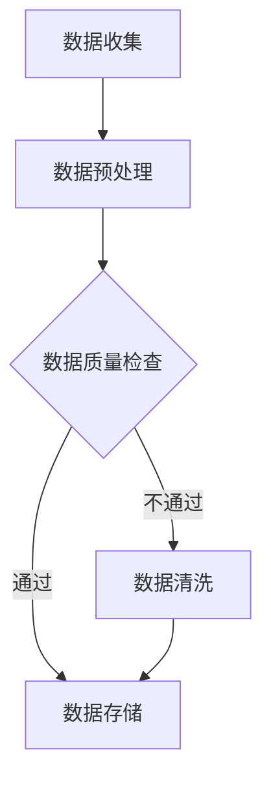

                 

# 软件伦理规范：从传统到人工智能的演变

> 关键词：软件伦理、人工智能、伦理规范、责任、隐私、公平性、透明性

> 摘要：本文旨在探讨软件2.0时代的伦理规范，特别是人工智能（AI）在软件开发和应用中的伦理责任。通过回顾软件发展历程，分析人工智能带来的新伦理挑战，本文将深入探讨AI伦理规范的理论基础、具体内容、实践以及持续发展，为AI时代的伦理规范提供思考与借鉴。

## 引言

软件作为计算机科学的重要组成部分，已经经历了多个发展阶段。从最早的系统软件到应用软件，再到近年来兴起的互联网软件和大数据软件，每一次技术革新都推动了软件的发展。然而，随着技术的进步，软件的伦理问题也日益凸显。特别是人工智能（AI）技术的崛起，不仅改变了软件的形态，也带来了前所未有的伦理挑战。

在AI时代，软件不再仅仅是执行预设任务的工具，而是能够自主学习和决策的智能系统。这种变革带来了巨大的机遇，同时也引发了关于隐私、公平性、透明性等一系列伦理问题。因此，探讨软件2.0时代的伦理规范，尤其是AI伦理规范，成为当前计算机科学领域的重要课题。

本文将从以下几个方面展开讨论：

1. **软件2.0时代的伦理规范概述**：回顾软件发展历程，分析AI带来的伦理挑战。
2. **伦理规范的理论基础**：探讨道德哲学与伦理学基础，以及人工智能伦理学核心理论。
3. **AI伦理规范具体内容**：深入讨论隐私与数据伦理、算法公平性与偏见、透明性与可解释性、责任归属与法律责任、以及监管框架与政策制定。
4. **AI伦理规范实践**：探讨企业AI伦理规范实践、AI伦理规范教育与培训、以及AI伦理规范的持续发展。

通过上述讨论，本文旨在为AI时代的伦理规范提供理论基础和实践指导，推动软件2.0时代的健康发展。

## 目录大纲

### 第一部分：背景与基础

### 第1章：软件2.0时代的伦理规范概述
#### 1.1 软件发展历程与伦理挑战
#### 1.2 AI与软件2.0的伦理规范需求
#### 1.3 人工智能的责任与伦理原则

### 第2章：伦理规范的理论基础
#### 2.1 道德哲学与伦理学基础
#### 2.2 人工智能伦理学核心理论
#### 2.3 伦理规范在软件开发中的重要性

### 第二部分：AI伦理规范具体内容

### 第3章：隐私与数据伦理
#### 3.1 数据收集与处理的伦理问题
#### 3.2 隐私保护与数据安全
#### 3.3 GDPR与数据伦理规范

### 第4章：算法公平性与偏见
#### 4.1 算法公平性的重要性
#### 4.2 算法偏见的原因与影响
#### 4.3 实现算法公平性的策略

### 第5章：透明性与可解释性
#### 5.1 透明性的概念与实现
#### 5.2 可解释性算法的设计与评估
#### 5.3 用户权益保护与反馈机制

### 第6章：责任归属与法律责任
#### 6.1 人工智能责任归属问题
#### 6.2 法律责任与伦理规范的关系
#### 6.3 人工智能法律责任案例分析

### 第7章：监管框架与政策制定
#### 7.1 国际与国内监管框架
#### 7.2 政策制定的原则与过程
#### 7.3 伦理规范在政策制定中的应用

### 第三部分：AI伦理规范实践

### 第8章：企业AI伦理规范实践
#### 8.1 企业AI伦理规范的建立
#### 8.2 企业AI伦理规范的实施与监督
#### 8.3 企业AI伦理规范案例分析

### 第9章：AI伦理规范教育与培训
#### 9.1 AI伦理规范教育的重要性
#### 9.2 教育与培训的内容与形式
#### 9.3 教育与培训的实际效果评估

### 第10章：AI伦理规范的持续发展
#### 10.1 AI伦理规范的发展趋势
#### 10.2 伦理规范与技术创新的互动
#### 10.3 AI伦理规范的长期挑战与展望

### 附录

### 附录A：AI伦理规范相关文献与资源
#### A.1 核心文献综述
#### A.2 主要伦理规范标准
#### A.3 伦理规范研究与案例集

### 附录B：Mermaid流程图与伪代码示例
#### B.1 Mermaid流程图示例
#### B.2 伪代码示例
#### B.3 代码解读与分析

<|im_end|>## 第一部分：背景与基础

### 第1章：软件2.0时代的伦理规范概述

#### 1.1 软件发展历程与伦理挑战

软件的历史可以追溯到20世纪50年代，当时计算机科学刚刚起步，软件主要是为了满足军事和科学计算的需求。从最初的汇编语言到高级编程语言，再到操作系统、数据库管理系统和应用程序的开发，软件经历了数次重大变革。每一次技术进步，都为软件领域带来了新的可能性，同时也提出了新的伦理挑战。

在软件1.0时代，主要关注的是如何有效地开发和维护软件，确保其可靠性、稳定性和高效性。然而，随着互联网的普及和大数据技术的发展，软件进入了2.0时代。软件2.0不再仅仅是传统的应用程序，而是具有自我学习、自适应和智能决策能力的系统。这种变革不仅改变了软件的应用场景，也带来了新的伦理挑战。

首先，隐私问题成为软件2.0时代的重要伦理挑战。随着数据收集和处理技术的进步，软件可以获取并处理大量个人数据。如何保护用户隐私，防止数据滥用，成为软件开发者必须面对的问题。其次，算法公平性和偏见问题也日益凸显。在AI算法的应用中，如果设计不当，可能会导致算法对某些群体产生偏见，从而影响公平性。此外，透明性和可解释性问题也成为软件2.0时代的重要议题。用户越来越关注软件的决策过程，要求软件提供透明的解释，以便他们理解并信任软件的决策结果。

#### 1.2 AI与软件2.0的伦理规范需求

人工智能（AI）技术的快速发展，使得软件2.0时代的伦理挑战变得更加复杂和严峻。AI不仅改变了软件的功能和性能，也改变了软件的设计和开发过程。因此，为了应对AI带来的伦理挑战，软件2.0时代迫切需要建立一套伦理规范。

首先，隐私保护是AI伦理规范的核心内容。在AI时代，数据的收集和处理变得更加普遍和深入，用户隐私面临更大的威胁。因此，AI伦理规范必须明确规定数据收集和处理的边界，确保用户隐私得到有效保护。其次，算法公平性和偏见问题是AI伦理规范的重要方面。AI算法的设计和实现可能受到种族、性别、年龄等多种因素的影响，导致算法对某些群体产生偏见。为了消除这些偏见，AI伦理规范需要强调算法的公平性和无偏性。此外，AI伦理规范还应该关注算法的透明性和可解释性。用户有权了解AI算法的决策过程和依据，以便对算法的决策结果进行监督和评价。

#### 1.3 人工智能的责任与伦理原则

在软件2.0时代，人工智能不仅是一个技术工具，更是一个具有自主决策能力的系统。这意味着，AI在软件开发和应用中必须承担相应的责任。首先，AI必须遵守道德伦理原则，尊重用户权益，保护用户隐私。其次，AI必须确保算法的公平性和无偏性，避免对特定群体产生歧视。此外，AI还应该具备透明性和可解释性，用户有权了解AI的决策过程和依据。

为了实现这些责任，AI伦理规范需要从多个层面进行设计和实施。首先，在法律层面，需要制定相关法律法规，明确AI的责任和义务。其次，在技术层面，需要开发和应用AI伦理算法，确保算法的公平性、透明性和无偏性。最后，在社会层面，需要加强AI伦理教育和宣传，提高公众对AI伦理问题的认识和重视。

总之，软件2.0时代的伦理规范，尤其是AI伦理规范，是确保AI技术健康发展的关键。只有建立完善的AI伦理规范，才能应对AI时代带来的伦理挑战，促进人工智能技术的可持续发展。

### 第2章：伦理规范的理论基础

#### 2.1 道德哲学与伦理学基础

伦理规范的形成离不开道德哲学和伦理学的基础。道德哲学是研究道德本质、道德原则和道德行为的哲学分支，而伦理学则是应用道德哲学原理，研究人类社会行为的规范科学。在软件和人工智能领域，道德哲学和伦理学提供了重要的理论支撑，帮助我们理解和构建伦理规范。

首先，道德哲学的核心问题是“何为善？”和“如何实现善？”伦理学则在此基础上，进一步探讨如何在具体的社会实践中实现善。对于软件和人工智能领域，道德哲学和伦理学帮助我们回答以下问题：软件开发和应用中如何保护用户权益？如何确保算法的公平性和透明性？如何在技术进步中实现社会责任和道德义务？

道德哲学的基本原理包括功利主义、康德主义和情感主义等。功利主义强调行为的功利结果，认为行为的价值取决于其产生的幸福最大化。康德主义则强调行为的道德义务，认为行为的道德价值不取决于结果，而是取决于行为的意图和原则。情感主义则认为道德源于人类的情感反应，道德规范是人们基于情感判断的行为准则。

在软件和人工智能领域，这些道德哲学原理为我们提供了一系列指导原则。例如，功利主义可以指导我们在设计软件时，最大化用户福祉，最小化负面影响。康德主义则提醒我们在开发和部署人工智能系统时，要尊重用户自主权，遵守道德义务。情感主义则帮助我们意识到，软件和人工智能的应用需要符合人们的情感需求和社会期望。

#### 2.2 人工智能伦理学核心理论

人工智能伦理学是应用伦理学的一个分支，研究人工智能系统在设计和应用中的道德问题。人工智能伦理学的核心理论包括隐私伦理、算法公平性、透明性和责任归属等。

首先，隐私伦理是人工智能伦理学的核心议题之一。随着人工智能技术的发展，数据收集和处理变得更加普遍，用户的隐私权面临前所未有的挑战。隐私伦理强调保护个人隐私，确保数据收集和处理符合道德规范。其主要原则包括知情同意、数据最小化和数据安全等。知情同意要求用户在数据收集和使用前明确知晓其隐私信息将被收集和使用。数据最小化原则要求只收集和使用必要的数据，避免过度收集。数据安全原则则要求采取有效措施保护用户数据不被泄露、篡改或滥用。

其次，算法公平性是人工智能伦理学的另一个重要议题。算法公平性关注算法在决策过程中是否公平、无偏见。算法偏见可能导致对某些群体的歧视，影响社会的公正性。为了实现算法公平性，需要从算法设计、数据收集和处理等多个方面进行考虑。算法设计应避免嵌入潜在的偏见，数据收集和处理应确保数据的多样性和代表性。

透明性是人工智能伦理学的核心要求之一。透明性要求人工智能系统能够解释其决策过程和结果，以便用户理解并信任系统。人工智能系统的决策过程通常涉及到复杂的数学模型和算法，这使得用户难以理解系统的决策依据。为了实现透明性，需要开发可解释的人工智能算法，并建立透明的决策流程。

最后，责任归属是人工智能伦理学的关键问题。随着人工智能技术的应用日益广泛，如何确定人工智能系统的责任归属成为一个重要议题。责任归属问题涉及到法律、伦理和技术等多个层面。在法律层面，需要明确人工智能系统的法律责任和责任主体。在伦理层面，需要确定人工智能系统的道德责任和道德义务。在技术层面，需要开发责任分配机制，确保人工智能系统能够在出现问题时承担责任。

#### 2.3 伦理规范在软件开发中的重要性

伦理规范在软件开发中的重要性不可忽视。首先，伦理规范有助于确保软件的合法性和合规性。在许多国家和地区，法律法规对软件开发和应用提出了明确的要求。遵守伦理规范，可以帮助软件开发者避免法律风险，确保软件的合法性和合规性。

其次，伦理规范有助于提高软件的质量和可靠性。遵循伦理规范，软件开发者会更加注重用户权益，关注软件的安全性、隐私保护和公平性。这有助于提高软件的质量和可靠性，增强用户的信任和满意度。

此外，伦理规范有助于促进软件行业的健康发展。在竞争激烈的软件市场中，遵循伦理规范的企业往往能够赢得用户的信任和市场的认可。这有助于形成良好的行业生态，推动软件行业的可持续发展。

总之，伦理规范在软件开发中扮演着重要角色。遵循伦理规范，不仅有助于确保软件的合法性和质量，也有助于推动软件行业的健康发展。在AI时代，伦理规范的重要性更加凸显，只有建立完善的伦理规范，才能确保人工智能技术的可持续发展。

### 第二部分：AI伦理规范具体内容

#### 第3章：隐私与数据伦理

隐私和数据伦理是AI伦理规范的核心内容之一。随着人工智能技术的快速发展，数据收集和处理变得越来越普遍，用户隐私面临前所未有的威胁。因此，保障用户隐私和数据安全成为AI伦理规范的重要议题。

#### 3.1 数据收集与处理的伦理问题

数据收集和处理是人工智能系统的基础。然而，数据收集和处理过程中可能涉及诸多伦理问题。首先，数据收集的合法性和透明度是一个重要问题。在数据收集前，应明确告知用户其数据将被收集和使用的目的，并获取用户的知情同意。其次，数据收集的范围和目的应明确限定，避免过度收集和滥用用户数据。

在数据处理过程中，应确保数据的安全性和隐私性。数据在传输、存储和处理过程中可能面临泄露、篡改和滥用的风险。因此，需要采取有效措施保护用户数据，包括数据加密、访问控制和安全审计等。

此外，数据处理的透明度和可解释性也是一个重要问题。用户有权了解其数据如何被收集和使用，以及如何影响其权益。因此，在数据处理过程中，应确保数据处理流程的透明性，并提供用户查询和反馈的渠道。

#### 3.2 隐私保护与数据安全

隐私保护与数据安全是AI伦理规范的核心要求。为了保障用户隐私和数据安全，需要从多个方面进行考虑。

首先，需要建立全面的数据保护制度。在数据收集、处理和存储过程中，应遵循数据保护的原则，包括数据最小化、数据安全、隐私保护和数据透明等。数据最小化原则要求只收集和使用必要的数据，避免过度收集。数据安全原则要求采取有效措施保护用户数据不被泄露、篡改或滥用。隐私保护原则要求确保用户数据不被未经授权的第三方访问和使用。数据透明原则要求用户有权查询其数据的使用情况，并对数据处理提出异议。

其次，需要制定严格的数据保护法规。在许多国家和地区，已经制定了数据保护法律法规，如《通用数据保护条例》（GDPR）等。这些法律法规为用户隐私保护提供了法律保障，也为企业数据保护提出了明确要求。企业应遵守相关法律法规，确保其数据保护措施符合法律要求。

此外，需要加强数据保护技术的研究和应用。随着数据规模的不断扩大和数据类型的日益多样化，传统的数据保护技术已无法满足需求。因此，需要开发和应用更加先进的数据保护技术，如数据加密、数据脱敏、差分隐私等。这些技术可以帮助企业在数据收集、处理和存储过程中更好地保护用户隐私和数据安全。

#### 3.3 GDPR与数据伦理规范

《通用数据保护条例》（GDPR）是欧盟制定的一项重要数据保护法律法规，对数据收集、处理和存储提出了严格的要求。GDPR的核心原则包括数据最小化、数据安全、隐私保护和数据透明等。这些原则为AI伦理规范提供了重要参考。

首先，GDPR强调数据最小化原则。在数据收集过程中，应明确收集数据的范围和目的，只收集必要的数据，避免过度收集。这有助于降低用户隐私泄露的风险。

其次，GDPR要求采取有效措施保护用户数据的安全。在数据传输、存储和处理过程中，应采取数据加密、访问控制和安全审计等措施，确保用户数据不被泄露、篡改或滥用。

此外，GDPR强调用户隐私保护。用户有权了解其数据的使用情况，并对其数据的使用提出异议。企业应在数据收集、处理和存储过程中，确保用户隐私得到有效保护，并建立用户查询和反馈的渠道。

最后，GDPR要求建立数据保护制度，包括数据保护官（DPO）、数据保护影响评估（DPIA）和数据泄露通知等。这些制度有助于企业建立完善的数据保护体系，确保数据保护措施得到有效实施。

总之，GDPR为AI伦理规范提供了重要参考。企业应遵循GDPR的要求，建立完善的数据保护制度，确保用户隐私和数据安全。同时，AI伦理规范也应借鉴GDPR的核心原则，进一步完善和规范AI技术的应用。

### 第4章：算法公平性与偏见

算法公平性与偏见是AI伦理规范中的关键议题。算法作为人工智能系统的核心，其公平性和无偏见性直接关系到社会的公正性和用户权益的保护。在AI时代，如何实现算法公平性，消除偏见，成为亟待解决的问题。

#### 4.1 算法公平性的重要性

算法公平性是指算法在决策过程中对各个群体的处理是否公平，是否对特定群体产生歧视。算法公平性对于社会的公正性和用户权益的保护具有重要意义。

首先，算法公平性关乎社会公正。一个公平的算法可以确保不同群体在资源分配、机会获取等方面享有平等的权利，避免因算法偏见而导致的社会不公。

其次，算法公平性影响用户权益。算法广泛应用于金融、教育、医疗等领域，其决策结果直接关系到用户的利益。一个公平的算法可以确保用户在享受服务时得到公正对待，避免因算法偏见而受到不公正待遇。

此外，算法公平性还关系到人工智能技术的可信度和接受度。如果算法存在偏见，用户可能会对算法的决策结果产生质疑，影响人工智能技术的应用和推广。

#### 4.2 算法偏见的原因与影响

算法偏见产生的原因主要包括数据偏见、模型偏见和算法偏见等。

首先，数据偏见是指数据集中存在的固有偏见。在数据收集和处理过程中，由于样本选择、数据来源和记录方式等因素，可能导致数据集存在偏见。例如，如果数据集中大部分是某一性别或种族的样本，算法在训练过程中可能会学习到这些偏见，并在实际应用中产生歧视。

其次，模型偏见是指模型设计中的偏见。模型设计者可能在模型构建过程中引入了特定的假设或偏好，导致模型对某些群体产生偏见。例如，在招聘算法中，如果设计者对某些性别或种族的候选人存在偏见，算法在筛选候选人时可能会对这些群体产生歧视。

最后，算法偏见是指算法实现中的偏见。算法在实现过程中可能会受到编程、算法选择和参数设置等因素的影响，导致算法对某些群体产生偏见。例如，在某些图像识别算法中，如果算法对某种肤色的人脸识别效果较差，可能会对这些肤色的人脸产生误识别。

算法偏见的影响是多方面的。首先，算法偏见可能导致对特定群体的歧视，影响社会的公正性和用户权益。其次，算法偏见可能影响人工智能技术的应用效果和可靠性，降低用户的信任度。此外，算法偏见还可能导致算法的可解释性降低，用户难以理解算法的决策过程，从而影响算法的透明性和可接受度。

#### 4.3 实现算法公平性的策略

为了实现算法公平性，消除偏见，可以采取以下策略：

首先，数据预处理是关键。在数据收集和处理过程中，应尽可能消除数据偏见。具体措施包括数据清洗、数据平衡和增加多样性的数据来源等。通过这些方法，可以减少数据集中存在的偏见，提高数据的公正性和代表性。

其次，模型设计应考虑公平性。在模型构建过程中，应避免引入潜在的偏见，确保模型对各个群体的处理公平。具体措施包括设计无偏模型、采用公平性评估指标等。例如，可以使用均衡样本训练方法，确保模型对各个群体的样本量均衡。

此外，算法实现过程中应关注公平性。在算法设计、编程和参数设置等方面，应避免引入潜在的偏见。具体措施包括使用公平性评估工具、对算法进行敏感性分析等。通过这些方法，可以降低算法对特定群体的偏见，提高算法的公平性。

最后，算法透明性和可解释性是关键。用户有权了解算法的决策过程和依据，以便对算法的决策结果进行监督和评价。通过提高算法的透明性和可解释性，可以增强用户对算法的信任度，减少算法偏见的影响。

总之，实现算法公平性是AI伦理规范的重要任务。通过数据预处理、模型设计、算法实现和算法透明性等多方面的努力，可以消除算法偏见，提高算法的公平性和可靠性，为社会的公正性和用户权益保护做出贡献。

### 第5章：透明性与可解释性

透明性与可解释性是AI伦理规范中至关重要的两个方面。在人工智能系统中，透明性指的是系统决策过程和结果的清晰程度，而可解释性则涉及到用户对系统决策的理解和信任。透明性和可解释性的提高，不仅有助于用户理解和使用人工智能系统，还能增强系统的信任度和接受度。

#### 5.1 透明性的概念与实现

透明性是指人工智能系统的决策过程和结果对用户和社会的可见度。透明性的实现包括以下几个方面：

首先，数据透明性。在人工智能系统的数据输入和输出中，用户应有权了解其数据的使用情况和影响。例如，在推荐系统或广告投放中，用户应能查看自己的数据如何被处理，以及如何影响系统的决策结果。

其次，模型透明性。用户应能了解人工智能系统的模型架构、算法原理和参数设置等。这有助于用户理解系统的决策逻辑和依据，从而增强对系统的信任度。

再次，决策过程透明性。人工智能系统的决策过程应清晰、可追溯。用户应能查询系统的决策步骤、依据和权重，以便对其进行监督和评估。

最后，责任透明性。当人工智能系统出现问题时，责任归属应明确。通过透明化责任归属，可以更好地解决争议和纠纷，提高系统的可信度。

实现透明性可以采取多种技术手段，如日志记录、用户界面设计和决策解释等。例如，可以使用可视化工具，将复杂的决策过程和结果以直观的形式展示给用户，使其更容易理解。

#### 5.2 可解释性算法的设计与评估

可解释性算法是指那些能够解释其决策过程和结果的人工智能系统。设计可解释性算法是提高系统透明性和用户信任度的重要手段。以下是几种常见的可解释性算法：

1. **基于规则的算法**：这类算法通过显式定义一组规则，来解释其决策过程。例如，在医疗诊断中，可以使用基于规则的诊断系统，将诊断结果解释为一系列规则匹配的结果。

2. **决策树**：决策树是一种直观的算法，通过一系列条件判断来解释决策过程。用户可以清晰地看到决策的每个步骤和依据。

3. **线性模型**：线性模型通常具有明确的参数和公式，便于用户理解和计算。例如，线性回归模型可以明确地展示每个特征对预测结果的影响。

4. **局部可解释模型**：这类模型在全局预测的基础上，提供局部解释。例如，LIME（Local Interpretable Model-agnostic Explanations）和SHAP（SHapley Additive exPlanations）等方法，可以通过局部调整模型参数，来解释特定实例的预测结果。

评估可解释性算法的质量，可以从以下几个方面进行：

- **解释的清晰度**：算法的解释是否直观、易于理解。
- **解释的准确性**：算法的解释是否准确反映了模型的真实决策过程。
- **解释的一致性**：算法在不同实例上的解释是否一致，不会出现矛盾。
- **解释的可扩展性**：算法的解释是否适用于不同的数据集和应用场景。

为了提高算法的可解释性，可以在模型设计和评估过程中，综合考虑这些因素。例如，在训练模型时，可以引入可解释性指标，以优化模型的解释性能。

#### 5.3 用户权益保护与反馈机制

在人工智能系统的设计和应用中，保护用户权益和提供反馈机制是至关重要的。以下是一些关键措施：

1. **用户知情权**：在数据收集和使用前，应告知用户其数据将被用于什么目的，并取得用户的知情同意。

2. **用户隐私保护**：确保用户数据在收集、存储和处理过程中得到充分保护，防止数据泄露和滥用。

3. **用户反馈渠道**：提供用户反馈的渠道，允许用户对系统的决策结果提出异议和反馈。例如，用户可以投诉系统的不公正决策，或请求重新评估其数据。

4. **用户隐私权**：用户有权查询其数据的使用情况，并要求删除或修改其数据。企业应建立相应的机制，确保用户隐私权得到保护。

5. **透明度和责任追究**：在系统出现问题时，应提供透明化的责任追究机制。例如，当用户数据受到泄露或滥用时，企业应承担责任并采取补救措施。

通过建立完善的用户权益保护与反馈机制，可以提高系统的透明度和用户信任度，促进人工智能技术的健康和可持续发展。

### 第6章：责任归属与法律责任

#### 6.1 人工智能责任归属问题

人工智能（AI）技术的发展带来了前所未有的机遇，但同时也引发了关于责任归属的诸多争议。在传统领域，责任通常明确归属于个人或组织。然而，在人工智能时代，AI系统的自主决策能力和复杂性使得责任归属问题变得尤为复杂和模糊。

首先，人工智能系统的责任归属涉及到技术设计者、开发者、运营者等多个角色。在设计阶段，技术设计者可能负责定义AI系统的基本架构和算法逻辑；在开发阶段，开发者负责将设计转化为实际可运行的代码；在运营阶段，AI系统由运营者负责监控和维护。然而，当AI系统出现错误或产生负面影响时，如何界定每个角色的责任成为一个关键问题。

其次，人工智能系统的责任归属问题还涉及到AI系统的自主性和可控性。如果AI系统能够完全自主地做出决策，且这些决策超出了设计者和开发者的预期，那么责任归属将更加困难。此外，AI系统的不可预测性和动态变化性也增加了责任归属的复杂性。

#### 6.2 法律责任与伦理规范的关系

法律责任与伦理规范在人工智能责任归属中起着至关重要的作用。伦理规范为人工智能技术的应用提供了道德指导，而法律责任则为AI系统的责任归属提供了法律框架。

首先，伦理规范为人工智能技术的应用设定了道德底线。例如，AI系统在设计和应用中应遵循公平性、透明性和隐私保护等原则。这些伦理规范不仅有助于保护用户权益，也为法律责任提供了依据。如果AI系统违反了这些伦理规范，可能会面临法律责任。

其次，法律责任为伦理规范提供了强制力。在许多国家和地区，已经制定了关于人工智能技术的法律法规，如《通用数据保护条例》（GDPR）等。这些法律法规明确了AI系统的法律责任，包括数据保护、隐私保护和责任追究等方面。法律责任的存在，使得AI系统的应用更加规范和有序。

然而，伦理规范和法律责任的衔接仍存在一定的挑战。一方面，伦理规范往往具有抽象性和灵活性，难以具体量化为法律责任。另一方面，法律责任可能无法完全覆盖所有伦理问题，导致AI系统的应用仍存在一定的道德风险。

#### 6.3 人工智能法律责任案例分析

为了更好地理解人工智能法律责任，以下是一些具体的案例分析：

1. **特斯拉自动驾驶事故**：2018年，美国一名特斯拉车主在开启自动驾驶模式时发生交通事故，导致身亡。该案件引发了关于自动驾驶汽车责任的争议。特斯拉公司作为AI系统的设计者和开发者，被控未能在系统中充分保障用户安全。法院最终裁定特斯拉需承担一定的责任，但责任比例较低。

2. **谷歌自动驾驶汽车事故**：2018年，谷歌旗下的自动驾驶汽车在测试过程中发生事故，导致一名行人死亡。该事件引发了关于自动驾驶汽车责任归属的广泛讨论。谷歌公司作为AI系统的设计者和开发者，被认为应承担部分责任。尽管谷歌公司提出了一系列赔偿方案，但最终责任归属仍在法律诉讼中。

3. **人脸识别隐私争议**：人脸识别技术在许多领域得到广泛应用，但也引发了隐私保护和责任归属的争议。例如，在某些公共场所，人脸识别系统被用于监控和身份验证。当系统识别错误或泄露用户隐私时，责任归属问题变得复杂。一些案例中，相关企业因未充分保护用户隐私而面临法律责任。

通过上述案例分析，我们可以看出，人工智能法律责任在具体应用中存在一定的争议和挑战。为了更好地解决这些问题，需要进一步完善伦理规范和法律框架，确保AI系统的责任归属更加明确和公正。

### 第7章：监管框架与政策制定

#### 7.1 国际与国内监管框架

随着人工智能技术的快速发展，各国政府和国际组织开始制定相应的监管框架，以应对AI技术带来的伦理和安全挑战。这些监管框架旨在确保AI技术的健康发展，保护用户权益，并促进技术创新。

在国际层面，多个国际组织和跨国机构发布了关于人工智能的指南和标准。例如，联合国教科文组织（UNESCO）发布了《人工智能伦理建议》，强调AI技术的透明性、公平性和可解释性。欧洲委员会发布了《人工智能伦理准则》，提出了AI技术的伦理原则和指导方针。此外，经济合作与发展组织（OECD）也发布了《人工智能原则》，强调了AI技术的透明性、安全性和包容性。

在国内层面，各国政府也积极制定AI监管政策。例如，欧盟出台了《通用数据保护条例》（GDPR），对数据收集、处理和存储提出了严格的要求。美国发布了《美国人工智能倡议》，旨在推动AI技术的发展，并确保AI技术的安全和道德应用。中国发布了《新一代人工智能发展规划》，提出了AI技术发展的目标和路径，并强调了AI技术的伦理和社会责任。

#### 7.2 政策制定的原则与过程

制定有效的AI监管政策需要遵循一系列原则和过程。以下是一些关键原则：

1. **平衡创新与安全**：政策制定应平衡技术创新和安全性，既促进AI技术的发展，又确保用户权益和社会安全。这需要综合考虑技术风险、社会影响和法律法规。

2. **透明性与可解释性**：政策制定过程应透明，确保公众和利益相关方能够参与讨论和监督。此外，政策应具备可解释性，使得各方能够理解政策内容和目的。

3. **广泛参与**：政策制定应广泛征求各方意见，包括政府、企业、学术界和公众。这样可以确保政策的代表性和公正性，减少政策实施中的争议和阻力。

4. **灵活性与适应性**：政策制定应具备灵活性和适应性，能够应对AI技术的快速发展和变化。政策应包含灵活的调整机制，以便在技术进步和社会变化时进行修订。

政策制定过程通常包括以下步骤：

1. **需求分析**：识别AI技术带来的挑战和问题，确定政策制定的目标和范围。

2. **法规研究**：研究国际和国内相关法规，了解现有政策和标准的适用性。

3. **利益相关方咨询**：与政府、企业、学术界和公众进行广泛咨询，了解各方对政策的需求和期望。

4. **草案制定**：基于需求分析和利益相关方咨询，制定政策草案。

5. **审议与修改**：对政策草案进行审议和修改，确保政策内容科学合理、具备可操作性。

6. **发布与实施**：发布政策文件，并制定详细的实施计划，确保政策能够顺利实施。

#### 7.3 伦理规范在政策制定中的应用

伦理规范在政策制定中起着至关重要的作用。以下是一些关键应用：

1. **隐私保护**：政策制定应确保用户隐私得到有效保护。政策应明确数据收集、处理和存储的要求，确保用户知情同意，并采取有效措施保护用户数据安全。

2. **算法公平性**：政策制定应强调算法的公平性和无偏见性。政策应规定算法设计、训练和部署过程中的公平性要求，确保算法不产生对特定群体的歧视。

3. **透明性与可解释性**：政策制定应提高AI系统的透明性和可解释性。政策应规定AI系统的决策过程和结果应向用户和社会公开，确保用户能够理解并监督系统的决策。

4. **责任归属**：政策制定应明确AI系统的责任归属。政策应规定在AI系统出现错误或产生负面影响时，如何确定和追究责任。

5. **社会影响评估**：政策制定应进行社会影响评估，分析AI技术对社会、经济和文化等方面的影响，确保政策能够平衡各种利益。

总之，伦理规范在政策制定中的应用有助于确保AI技术的安全和道德应用，促进AI技术的可持续发展。通过将伦理规范融入政策制定，可以建立更加公平、透明和可信的人工智能生态系统。

### 第8章：企业AI伦理规范实践

#### 8.1 企业AI伦理规范的建立

随着人工智能技术的广泛应用，企业开始意识到AI伦理规范的重要性。建立AI伦理规范是企业确保技术健康发展的关键步骤。以下是企业建立AI伦理规范的一般步骤：

1. **确定AI伦理规范的愿景和目标**：企业首先需要明确AI伦理规范的总体愿景和目标，确保规范符合企业的价值观和长期发展战略。

2. **组建AI伦理委员会**：企业应成立专门的AI伦理委员会，负责制定和监督AI伦理规范的实施。委员会成员应包括技术专家、法律顾问、伦理学家、用户代表等多方利益相关者。

3. **制定AI伦理规范框架**：企业应制定详细的AI伦理规范框架，包括隐私保护、数据安全、算法公平性、透明性、责任归属等方面的具体要求。

4. **培训和宣传**：企业应加强对员工AI伦理规范的培训和宣传，提高员工对AI伦理规范的认识和遵守意识。

5. **建立监督和反馈机制**：企业应建立有效的监督和反馈机制，对AI伦理规范的执行情况进行定期审查和评估，确保规范得到有效实施。

#### 8.2 企业AI伦理规范的实施与监督

AI伦理规范的有效实施和监督是确保企业技术健康发展的关键。以下是企业实施和监督AI伦理规范的一些关键措施：

1. **制定实施计划**：企业应制定详细的AI伦理规范实施计划，明确实施时间表、责任分配和具体措施。

2. **培训与教育**：企业应定期开展AI伦理规范培训，提高员工对伦理规范的理解和遵守能力。培训内容应包括AI伦理基本原则、具体规范要求以及违反规范的后果等。

3. **建立监督机制**：企业应建立AI伦理规范的监督机制，对AI系统的设计和应用过程进行定期审查。监督机制可以包括内部审计、外部评估、用户反馈等多种形式。

4. **实施激励机制**：企业应建立激励机制，鼓励员工遵守AI伦理规范。例如，可以设立AI伦理奖，对在AI伦理方面做出突出贡献的员工给予奖励。

5. **完善反馈机制**：企业应建立畅通的反馈机制，允许员工、用户和其他利益相关方对AI伦理规范的执行情况进行反馈。反馈信息应得到及时处理和回应，确保问题得到有效解决。

#### 8.3 企业AI伦理规范案例分析

为了更好地理解企业AI伦理规范的实践，以下是一些企业AI伦理规范案例：

1. **微软**：微软是全球领先的技术公司之一，其在AI伦理规范方面有较为完善的实践。微软成立了AI伦理委员会，制定了《AI伦理准则》，明确了AI系统的公平性、透明性和责任归属等要求。微软还定期发布AI伦理报告，公开其AI伦理规范的执行情况和改进措施。

2. **谷歌**：谷歌在AI伦理规范方面也取得了显著进展。谷歌发布了《AI原则》，强调AI系统的公平性、透明性和安全性。谷歌还成立了AI伦理委员会，负责监督AI伦理规范的执行。此外，谷歌还与外部机构和专家合作，共同推动AI伦理规范的制定和实施。

3. **阿里巴巴**：阿里巴巴在AI伦理规范方面有较为成熟的实践。阿里巴巴发布了《人工智能社会责任指南》，明确了AI系统的社会责任和伦理要求。阿里巴巴还成立了AI伦理委员会，负责制定和监督AI伦理规范的执行。此外，阿里巴巴还开展了一系列AI伦理教育和培训活动，提高员工和社会对AI伦理规范的认识。

通过以上案例，我们可以看到，企业AI伦理规范的实施需要多方参与、持续改进和透明公开。企业应积极借鉴国内外优秀实践，不断完善AI伦理规范，确保AI技术的健康发展和社会责任的履行。

### 第9章：AI伦理规范教育与培训

#### 9.1 AI伦理规范教育的重要性

随着人工智能技术的迅猛发展，AI伦理规范教育变得日益重要。AI伦理规范教育不仅是培养具备伦理素养的AI从业者的关键途径，也是确保AI技术健康发展的基础。以下从三个方面分析AI伦理规范教育的重要性：

1. **培养专业人才**：AI伦理规范教育是培养具备伦理意识和专业技能的AI从业者的关键。通过系统化的教育和培训，从业者可以深入了解AI伦理学的核心理论、伦理原则以及具体应用场景，从而在设计和应用AI系统时，能够自觉地遵循伦理规范，避免潜在的伦理风险。

2. **提升社会责任感**：AI伦理规范教育有助于提高公众对AI技术伦理问题的认识和重视。通过教育，人们可以了解AI技术可能带来的伦理挑战和影响，从而在社会层面形成对AI技术的伦理监督和规范意识，推动整个社会对AI技术的健康发展。

3. **确保技术安全**：AI伦理规范教育有助于提高AI系统的安全性。通过教育和培训，开发者可以更好地理解伦理规范对技术设计的影响，从而在设计过程中考虑伦理因素，降低系统故障和潜在风险，确保AI技术的安全性和可靠性。

#### 9.2 教育与培训的内容与形式

AI伦理规范教育与培训的内容和形式应全面覆盖伦理原则、法律框架、案例分析以及实践技能等方面，以培养全面具备伦理素养的AI从业者。以下是一些关键内容与形式：

1. **课程设置**：高校和培训机构应设置专门的AI伦理课程，包括伦理学基础、人工智能伦理学、隐私保护、算法公平性、透明性和责任归属等。课程内容应结合实际案例，帮助学生理解伦理规范在AI技术中的应用。

2. **教材和资料**：编写系统化的AI伦理规范教材，结合实际案例和最新研究成果，为教育者和学习者提供权威的参考资料。教材应涵盖不同层面的AI伦理问题，包括理论、实践和案例分析等。

3. **在线教育平台**：利用在线教育平台，提供灵活的学习资源和互动式课程。例如，通过视频讲座、在线论坛和模拟实验等形式，帮助学生更好地理解和应用AI伦理规范。

4. **实习和实践**：组织学生参与实际项目，通过实习和实践，将AI伦理规范理论知识应用于实际场景。例如，在开发AI系统时，指导学生考虑伦理问题，确保系统的设计和应用符合伦理规范。

5. **专家讲座和研讨会**：邀请AI伦理学专家、法律顾问和行业领袖进行讲座和研讨会，分享最新的研究成果和实践经验，帮助学生了解行业动态和发展趋势。

6. **案例研究**：通过分析典型的AI伦理案例，帮助学生理解伦理问题在实际中的应用和解决方法。案例研究可以包括数据泄露、算法偏见、隐私侵犯等方面的具体案例。

7. **伦理委员会参与**：鼓励学生参与AI伦理委员会的活动，通过实际参与，了解伦理规范在决策过程中的应用和影响，提高学生的实际操作能力和伦理素养。

#### 9.3 教育与培训的实际效果评估

评估AI伦理规范教育与培训的实际效果是确保教育质量和培训效果的重要环节。以下是一些关键评估指标和方法：

1. **知识掌握程度**：通过考试、问卷调查和讨论等形式，评估学生对AI伦理规范知识的掌握程度。具体指标包括伦理原则的理解、案例分析的能力、法律法规的熟悉度等。

2. **技能应用能力**：通过实际项目和实践考核，评估学生将AI伦理规范应用于实际问题的能力。具体指标包括项目报告的质量、解决方案的合理性、伦理因素的考虑等。

3. **伦理意识**：通过行为观察和问卷调查，评估学生在日常工作和生活中对AI伦理规范的遵守程度。具体指标包括对伦理问题的敏感性、对伦理决策的参与度、对伦理争议的解决能力等。

4. **反馈机制**：建立有效的反馈机制，收集学生、教师和行业专家的反馈意见，持续改进教育和培训内容和方法。反馈机制可以包括定期评估、师生座谈会、匿名反馈问卷等。

通过上述评估指标和方法，可以全面了解AI伦理规范教育与培训的实际效果，及时发现问题并加以改进，确保教育和培训的持续改进和优化。

### 第10章：AI伦理规范的持续发展

#### 10.1 AI伦理规范的发展趋势

随着人工智能技术的不断进步，AI伦理规范也在不断演变和成熟。未来，AI伦理规范的发展趋势将体现在以下几个方面：

首先，规范内容的全面性将得到提升。随着AI技术在各个领域的应用日益广泛，AI伦理规范将不仅涉及隐私保护、算法公平性和透明性，还将涵盖更多领域，如算法歧视、责任归属、可解释性等。这将确保AI伦理规范能够全面覆盖AI技术的应用场景，为各种伦理问题提供解决方案。

其次，跨国合作和国际协调将成为重要趋势。由于AI技术具有全球性影响，各国和国际组织需要加强合作，制定统一的AI伦理规范。这将有助于消除国际间的规范差异，促进全球AI技术的健康发展。

再次，技术手段将不断改进。随着人工智能技术的进步，AI伦理规范的实现手段也将更加多样和高效。例如，利用区块链技术可以提供更安全的隐私保护方案；利用机器学习技术可以实现更精确的算法公平性评估等。

#### 10.2 伦理规范与技术创新的互动

伦理规范与技术创新之间的互动是AI伦理规范持续发展的关键。以下从两个方面分析伦理规范与技术创新的互动：

首先，伦理规范对技术创新的引导作用。伦理规范为技术创新提供了道德指导和边界，确保技术发展符合社会伦理要求。例如，在算法设计过程中，伦理规范可以指导开发者避免引入偏见，确保算法的公平性和透明性。通过遵循伦理规范，技术创新可以更好地服务于社会，避免对人类产生负面影响。

其次，技术创新对伦理规范的反馈作用。技术创新的发展不仅为伦理规范提供了新的挑战，也为其提供了新的实现手段。例如，在隐私保护方面，区块链技术的发展为隐私保护提供了新的可能性，使得隐私保护措施更加有效和透明。通过技术创新，伦理规范可以不断优化和改进，以适应不断变化的技术环境。

#### 10.3 AI伦理规范的长期挑战与展望

尽管AI伦理规范取得了显著进展，但仍面临诸多长期挑战：

首先，伦理规范与技术创新的平衡问题。在快速发展的技术环境中，如何确保伦理规范能够及时跟上技术创新的步伐，成为一大挑战。为此，需要建立灵活和动态的伦理规范框架，确保规范能够适应技术变化。

其次，跨国协调与统一问题。由于各国AI伦理规范的制定和执行存在差异，如何实现跨国协调和统一，仍需各方共同努力。国际组织和跨国合作机制将为这一问题的解决提供有力支持。

最后，公众信任与接受度问题。AI技术的广泛应用需要公众的信任和支持，如何提高公众对AI伦理规范的信任度，仍需加强教育和宣传。通过公众参与和透明度提升，可以增强公众对AI技术的信任，推动AI技术的可持续发展。

总之，AI伦理规范的发展是一个长期且复杂的过程。通过持续技术创新、跨国合作和公众参与，AI伦理规范有望在未来实现更加全面、公正和有效的监管，为人工智能技术的可持续发展提供有力保障。

### 附录A：AI伦理规范相关文献与资源

#### A.1 核心文献综述

在AI伦理规范领域，以下文献是研究者和从业者的重要参考：

1. **欧盟委员会（European Commission）**. **A New European Strategy for Data: On Data, For Humans, By Humans**. 2018. [链接](https://ec.europa.eu/digital-single-market/en/digital-strategy)
   
2. **联合国教科文组织（UNESCO）**. **Recommendation on the Ethics of Artificial Intelligence**. 2021. [链接](https://en.unesco.org/themes/artificial-intelligence/recommendation-ethics-artificial-intelligence)

3. **美国国家人工智能倡议（National AI Initiative）**. **National AI Initiative Act of 2019**. 2019. [链接](https://www.aiinitiative.gov/)

4. **世界经济论坛（World Economic Forum）**. **The Global AI Ethics Initiative**. 2020. [链接](https://www.weforum.org/whitepapers/the-global-ai-ethics-initiative)

5. **麻省理工学院（MIT）**. **The Future of Life Institute**. **Unlocking AI’s Potential through Responsible Leadership**. 2019. [链接](https://futureoflife.org/ai-responsible-leadership-report/)

这些文献涵盖了AI伦理规范的制定、实施和国际合作等方面，为研究者和从业者提供了丰富的理论和实践参考。

#### A.2 主要伦理规范标准

以下是一些重要的AI伦理规范标准：

1. **国际标准化组织（ISO）**. **ISO/IEC 27001: Information Security Management**. 2013. [链接](https://www.iso.org/standard/61278.html)

2. **国际电信联盟（ITU）**. **ITU-T Y.4601: Principles and Framework for Ethical Considerations and Decision-making for Internet of Things (IoT)**. 2017. [链接](https://www.itu.int/rec/T-ITU-T/rec-Y.4601-201704-I/en)

3. **欧洲委员会**. **General Data Protection Regulation (GDPR)**. 2018. [链接](https://ec.europa.eu/justice/law/data-protection/index_en.htm)

4. **美国国家标准与技术研究院（NIST）**. **NIST Special Publication 800-53: Security and Privacy Controls for Information Systems and Organizations**. 2017. [链接](https://nvlpubs.nist.gov/nistpubs/SpecialPublications/NIST.SP.800-53r5.pdf)

5. **IEEE**. **IEEE Standard for Ethical Considerations in Artificial Intelligence and Autonomous Systems**. 2019. [链接](https://ieeexplore.ieee.org/document/8693925)

这些标准为AI伦理规范的制定和实施提供了具体的指导和建议。

#### A.3 伦理规范研究与案例集

以下是一些重要的AI伦理规范研究和案例集：

1. **牛津大学**. **The Future of Humanity Institute**. **AI and Value Alignment**. 2019. [链接](https://www.fhi.ox.ac.uk/ai-value-alignment/)

2. **剑桥大学**. **The Center for the Study of the Selves**. **Artificial Intelligence: A Multidisciplinary Approach**. 2020. [链接](https://c3s.ai/)

3. **斯坦福大学**. **The Human-Centered AI Institute**. **Case Studies on AI Ethics**. 2021. [链接](https://ai4people.stanford.edu/research/)

4. **卡内基梅隆大学**. **The Center for Ethics and Policy**. **AI Ethics: A Research Guide**. 2022. [链接](https://www.cmu.edu/ethics-policy/research-guides/ai-ethics.html)

5. **国际人工智能与伦理学协会**. **IAAI-EA**. **Annual Conference on AI, Ethics, and Society**. [链接](https://www.iaai-ea.org/annual-conference/)

这些研究和案例集为AI伦理规范的制定和实施提供了丰富的理论和实践参考。

### 附录B：Mermaid流程图与伪代码示例

#### B.1 Mermaid流程图示例

以下是一个简单的Mermaid流程图示例，用于描述数据收集和处理的过程：



#### B.2 伪代码示例

以下是一个简单的伪代码示例，用于描述一个基于K最近邻（K-Nearest Neighbors, KNN）的算法模型：

```
// 初始化KNN模型
class KNNModel {
    int K; // 近邻数量
    dataset trainingData; // 训练数据集

    // 训练模型
    void train(dataset data) {
        trainingData = data;
        // 数据预处理
        preprocessData(data);
    }

    // 预测新数据
    int predict(data point newPoint) {
        // 计算距离
        double distances[] = new double[trainingData.size()];
        for (each data point in trainingData) {
            distances[i] = calculateDistance(newPoint, each data point);
        }

        // 选择最近的K个邻居
        int nearestNeighbors[] = selectNearestNeighbors(distances, K);

        // 计算多数邻居的类别
        int predictedClass = majorityVote(nearestNeighbors);

        return predictedClass;
    }
}

// 计算欧氏距离
double calculateDistance(point a, point b) {
    double sum = 0;
    for (each feature i in a, b) {
        sum += (a[i] - b[i])^2;
    }
    return sqrt(sum);
}

// 选择最近的K个邻居
int[] selectNearestNeighbors(double[] distances, int K) {
    // 对距离进行排序
    sort(distances);

    // 选择距离最小的K个邻居
    int[] nearestNeighbors = new int[K];
    for (i = 0; i < K; i++) {
        nearestNeighbors[i] = distances[i];
    }
    return nearestNeighbors;
}

// 计算多数邻居的类别
int majorityVote(int[] neighbors) {
    int[] classLabels = new int[neighborCount];
    for (each neighbor in neighbors) {
        classLabels[neighbor] += 1;
    }
    int maxCount = max(classLabels);
    for (each label in classLabels) {
        if (label == maxCount) {
            return label;
        }
    }
}
```

#### B.3 代码解读与分析

上述伪代码示例用于实现K最近邻（KNN）算法，这是一种常见的机器学习算法，用于分类和回归任务。以下是代码的详细解读与分析：

1. **KNNModel 类**：KNNModel 类定义了KNN模型的核心属性和方法。它包含两个关键属性：K（近邻数量）和 trainingData（训练数据集）。方法包括 train（训练模型）和 predict（预测新数据）。

2. **train 方法**：该方法用于训练KNN模型。它接受一个数据集作为输入，将数据集存储在 trainingData 属性中，并进行数据预处理。

3. **predict 方法**：该方法用于预测新数据点的类别。它首先计算新数据点与训练数据集中每个数据点的距离，然后选择距离最近的K个邻居，计算这些邻居的类别，并返回多数邻居的类别。

4. **calculateDistance 方法**：该方法用于计算两个数据点之间的欧氏距离。欧氏距离是衡量数据点之间相似性的常用度量，通过计算两个数据点各特征的差异的平方和的平方根得到。

5. **selectNearestNeighbors 方法**：该方法用于选择距离最近的K个邻居。首先对距离进行排序，然后选择排序后的前K个距离对应的数据点。

6. **majorityVote 方法**：该方法用于计算多数邻居的类别。它计算每个邻居的类别，并返回出现次数最多的类别。

通过上述伪代码，KNN算法的核心流程得以实现。在实际应用中，KNN算法需要使用具体的编程语言和数据集进行实现，并进行参数调优和性能评估。代码解读与分析有助于理解KNN算法的基本原理和实现细节，为后续的实际应用提供参考。

